# 第二章：KVM 作为虚拟化解决方案

在本章中，我们将讨论虚拟化作为一个概念以及通过 libvirt、Quick Emulator（QEMU）和 KVM 的实现。实际上，如果我们想解释虚拟化是如何工作的，以及为什么 KVM 虚拟化是 21 世纪 IT 的一个基本部分，我们必须从多核 CPU 和虚拟化的技术背景开始解释；而这是不可能做到的，如果不深入研究 CPU 和操作系统的理论，这样我们才能了解到我们真正想要的东西——虚拟化监视器是什么，以及虚拟化实际上是如何工作的。

在本章中，我们将涵盖以下主题：

+   虚拟化作为一个概念

+   libvirt、QEMU 和 KVM 的内部工作

+   所有这些如何相互通信以提供虚拟化

# 虚拟化作为一个概念

虚拟化是一种将硬件与软件解耦的计算方法。它提供了更好、更高效和更具程序性的资源分配和共享方法，用于运行操作系统和应用程序的虚拟机。

如果我们将过去的传统物理计算与虚拟化进行比较，我们可以说通过虚拟化，我们有可能在同一台硬件设备（同一台物理服务器）上运行多个客户操作系统（多个虚拟服务器）。如果我们使用类型 1 虚拟机监视器（在第一章《理解 Linux 虚拟化》中有解释），这意味着虚拟机监视器将负责让虚拟服务器访问物理硬件。这是因为有多个虚拟服务器使用与同一台物理服务器上的其他虚拟服务器相同的硬件。这通常由某种调度算法支持，该算法在虚拟机监视器中以编程方式实现，以便我们可以从同一台物理服务器中获得更高的效率。

## 虚拟化与物理环境

让我们试着将这两种方法可视化——物理和虚拟。在物理服务器中，我们直接在服务器硬件上安装操作系统，并在操作系统上运行应用程序。下图显示了这种方法的工作原理：


图 2.1 – 物理服务器

在虚拟化的世界中，我们运行一个虚拟机监视器（如 KVM），以及在该虚拟机监视器上运行的虚拟机。在这些虚拟机内部，我们运行相同的操作系统和应用程序，就像在物理服务器上一样。虚拟化的方法如下图所示：

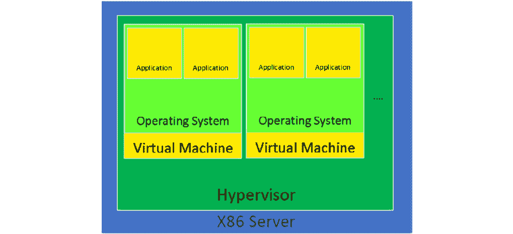

图 2.2 – 虚拟机监视器和两个虚拟机

仍然存在各种情况，需要使用物理方法。例如，全球范围内仍然有成千上万的应用程序在物理服务器上运行，因为这些服务器无法虚拟化。它们无法虚拟化的原因各不相同。例如，最常见的原因实际上是最简单的原因——也许这些应用程序正在运行不受虚拟化软件供应商支持的操作系统上。这意味着您无法虚拟化该操作系统/应用程序组合，因为该操作系统不支持某些虚拟化硬件，最常见的是网络或存储适配器。相同的一般思想也适用于云——将事物移动到云中并不总是最好的想法，我们将在本书后面描述。

## 为什么虚拟化如此重要？

今天我们运行的许多应用程序都不会很好地扩展（增加更多的 CPU、内存或其他资源）-它们只是没有以这种方式编程，或者不能被严重并行化。这意味着如果一个应用程序不能充分利用其所拥有的所有资源，服务器将会有很多“空闲空间”-这一次，我们不是在谈论磁盘的空闲空间；我们实际上是在指“计算”空闲空间，即 CPU 和内存级别的空闲空间。这意味着我们没有充分利用我们为其付费的服务器的能力-我们的意图是让它完全使用，而不是部分使用。

效率和编程方法的重要性还有其他原因。事实是，在 2003 年至 2005 年这段时间，当一切都是关于 CPU 频率的炫耀权利（等于 CPU 速度）时，英特尔和 AMD 在单核 CPU 的概念发展方面遇到了瓶颈。他们无法在 CPU 上塞入更多的附加元素（无论是用于执行还是缓存），或者提高单核的速度，而不严重损害 CPU 的电流供应方式。这意味着，最终，这种方法会损害 CPU 和运行它的整个系统的可靠性。如果您想了解更多信息，我们建议您搜索有关英特尔 NetBurst 架构 CPU（例如 Prescott 核心）和它们的年轻兄弟奔腾 D（Smithfield 核心）的文章，后者基本上是将两个 Prescott 核心粘合在一起，以便最终结果是双核 CPU。一个非常非常热的双核 CPU。

在那之前的几代中，英特尔和 AMD 尝试并测试了其他技术，例如“让系统拥有多个执行单元”的原则。例如，我们有英特尔奔腾 Pro 双插槽系统和 AMD Opteron 双插槽和四插槽系统。当我们开始讨论虚拟化的一些非常重要的方面时，我们将在本书的后面回到这些内容（例如，非统一内存访问（NUMA））。

因此，无论从哪个角度来看，2005 年 PC CPU 开始获得多个核心（AMD 是第一个推出服务器多核 CPU 的厂商，而英特尔是第一个推出桌面多核 CPU 的厂商）是唯一合理的前进方式。这些核心更小，更高效（耗电更少），通常是更好的长期方法。当然，这意味着如果微软和甲骨文等公司想要使用他们的应用程序并获得多核服务器的好处，操作系统和应用程序必须进行大量重写。

总之，对于基于 PC 的服务器来说，从 CPU 的角度来看，转向多核 CPU 是开始朝着我们今天所熟悉和喜爱的虚拟化概念努力的一个合适的时刻。

与这些发展并行的是，CPU 还有其他增加-例如，可以处理特定类型操作的额外 CPU 寄存器。很多人听说过 MMX、SSE、SSE2、SSE3、SSE4.x、AVX、AVX2、AES 等指令集。这些今天也都非常重要，因为它们给了我们将某些指令类型“卸载”到特定 CPU 寄存器的可能性。这意味着这些指令不必在 CPU 上作为一般的串行设备运行，执行这些任务更慢。相反，这些指令可以发送到专门用于这些指令的 CPU 寄存器。可以将其视为在 CPU 芯片上拥有单独的小加速器，可以运行软件堆栈的某些部分而不会占用通用 CPU 管道。其中之一是英特尔的虚拟机扩展（VMX），或者 AMD 虚拟化（AMD-V），它们都使我们能够为其各自的平台提供全面的、基于硬件的虚拟化支持。

## 虚拟化的硬件要求

在 PC 上引入基于软件的虚拟化后，硬件和软件方面都取得了很大的发展。最终结果——正如我们在前一章中提到的——是 CPU 具有了更多的功能和性能。这导致了对硬件辅助虚拟化的大力推动，这在理论上看起来是更快速和更先进的方式。举个例子，在 2003 年至 2006 年期间有很多 CPU 不支持硬件辅助虚拟化，比如英特尔奔腾 4、奔腾 D，以及 AMD Athlon、Turion、Duron 等。直到 2006 年，英特尔和 AMD 才在其各自的 CPU 上更广泛地提供硬件辅助虚拟化作为一项功能。此外，64 位 CPU 也需要一些时间，而在 32 位架构上几乎没有兴趣运行硬件辅助虚拟化。这主要原因是您无法分配超过 4GB 的内存，这严重限制了虚拟化作为概念的范围。

牢记所有这些，这些是我们今天必须遵守的要求，以便我们可以运行具有完全硬件辅助虚拟化支持的现代虚拟化监控程序：

+   二级地址转换，快速虚拟化索引，扩展页表（SLAT/RVI/EPT）支持：这是一个虚拟化监控程序使用的 CPU 技术，以便它可以拥有虚拟到物理内存地址的映射。虚拟机在虚拟内存空间中运行，可以分散在物理内存的各个位置，因此通过使用 SLAT/EPT 等额外的映射（通过额外的 TLB 实现），可以减少内存访问的延迟。如果没有这样的技术，我们将不得不访问计算机内存的物理地址，这将是混乱、不安全和延迟敏感的。为了避免混淆，EPT 是英特尔 CPU 中 SLAT 技术的名称（AMD 使用 RVI 术语，而英特尔使用 EPT 术语）。

+   **英特尔 VT 或 AMD-V 支持**：如果英特尔 CPU 具有 VT（或 AMD CPU 具有 AMD-V），这意味着它支持硬件虚拟化扩展和完全虚拟化。

+   **长模式支持**，这意味着 CPU 支持 64 位。没有 64 位架构，虚拟化基本上是无用的，因为您只能为虚拟机提供 4GB 的内存（这是 32 位架构的限制）。通过使用 64 位架构，我们可以分配更多的内存（取决于我们使用的 CPU），这意味着更多的机会为虚拟机提供内存，否则在 21 世纪的 IT 空间中整个虚拟化概念将毫无意义。

+   **具有输入/输出内存管理单元（IOMMU）虚拟化的可能性（例如 AMD-Vi、英特尔 VT-d 和 ARM 上的第 2 阶段表）**，这意味着我们允许虚拟机直接访问外围硬件（显卡、存储控制器、网络设备等）。此功能必须在 CPU 和主板芯片组/固件方面都启用。

+   **进行单根输入输出虚拟化**（SR/IOV）的可能性，这使我们能够直接将 PCI Express 设备（例如以太网端口）转发到多个虚拟机。SR-IOV 的关键方面是其通过称为**虚拟功能**（VFs）的功能，能够将一个物理设备与多个虚拟机共享。此功能需要硬件和驱动程序支持。

+   PCI passthrough 的可能性，意味着我们可以将连接到服务器主板的 PCI Express 连接卡（例如，显卡）呈现给虚拟机，就好像该卡是通过称为“物理功能”（PFs）的功能直接连接到虚拟机一样。这意味着绕过连接通常会经过的各种 Hypervisor 级别。

+   **可信平台模块（TPM）支持**，通常作为额外的主板芯片实现。使用 TPM 在安全方面有很多优势，因为它可以用于提供加密支持（即创建、保存和保护加密密钥的使用）。在 Linux 世界中，围绕 KVM 虚拟化使用 TPM 引起了相当大的轰动，这导致英特尔在 2018 年夏天开源了 TPM2 堆栈。

在讨论 SR-IOV 和 PCI passthrough 时，请确保注意核心功能，称为 PF 和 VF。这两个关键词将更容易记住设备是如何（直接或通过 Hypervisor）转发到各自的虚拟机的*位置*（在物理或虚拟级别）和*方式*。这些功能对企业空间非常重要，也适用于一些特定场景。举个例子，如果没有这些功能，就无法使用工作站级虚拟机来运行 AutoCAD 和类似的应用程序。这是因为 CPU 上的集成显卡速度太慢了。这时你就需要在服务器上添加 GPU，这样你就可以使用 Hypervisor 将整个 GPU 或其*部分*转发到一个虚拟机或多个虚拟机。

在系统内存方面，也有各种要考虑的主题。AMD 在 Athlon 64 中开始将内存控制器集成到 CPU 中，这是在英特尔之前的几年（英特尔首次在 2008 年推出的 Nehalem CPU 核心中实现了这一点）。将内存控制器集成到 CPU 中意味着当 CPU 访问内存进行内存 I/O 操作时，系统的延迟更低。在此之前，内存控制器集成到了所谓的 NorthBridge 芯片中，这是系统主板上的一个独立芯片，负责所有快速总线和内存。但这意味着额外的延迟，特别是当您尝试将这一原则扩展到多插槽、多核 CPU 时。此外，随着 Athlon 64 在 Socket 939 上的推出，AMD 转向了双通道内存架构，这在桌面和服务器市场上现在是一个熟悉的主题。三通道和四通道内存控制器已成为服务器的事实标准。一些最新的英特尔至强 CPU 支持六通道内存控制器，AMD EPYC CPU 也支持八通道内存控制器。这对整体内存带宽和延迟有着巨大的影响，反过来又对物理和虚拟服务器上内存敏感应用程序的速度有着巨大的影响。

为什么这很重要？通道越多，延迟越低，CPU 到内存的带宽就越大。这对今天 IT 空间中许多工作负载（例如数据库）非常有吸引力。

## 虚拟化的软件要求

现在我们已经涵盖了虚拟化的基本硬件方面，让我们转向虚拟化的软件方面。为了做到这一点，我们必须涵盖计算机科学中的一些行话。话虽如此，让我们从一个叫做保护环的东西开始。在计算机科学中，存在着各种分层的保护域/特权环。这些是保护数据或故障的机制，基于在访问计算机系统资源时强制执行的安全性。这些保护域有助于计算机系统的安全。通过将这些保护环想象成指令区域，我们可以通过以下图表来表示它们：

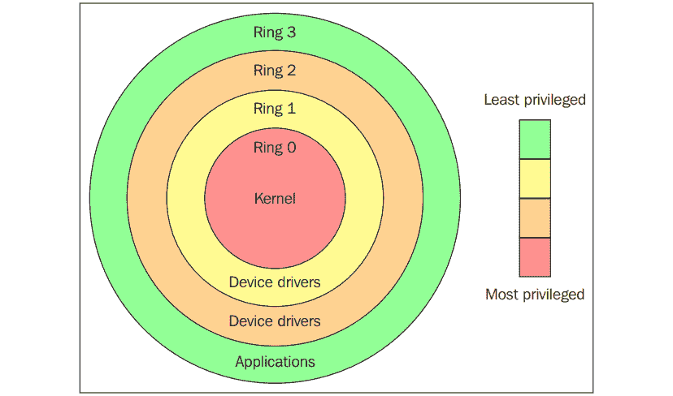

图 2.3 – 保护环（来源：[`en.wikipedia.org/wiki/Protection_ring`](https://en.wikipedia.org/wiki/Protection_ring)）

如前图所示，保护环从最特权到最不特权的顺序编号。环 0 是最特权的级别，直接与物理硬件交互，比如 CPU 和内存。这些特权环保护了资源，比如内存、I/O 端口和 CPU 指令。环 1 和环 2 大多数情况下是未使用的。大多数通用系统只使用两个环，即使它们运行的硬件提供了更多的 CPU 模式。两个主要的 CPU 模式是内核模式和用户模式，这也与进程执行的方式有关。您可以在此链接中了解更多信息：[`access.redhat.com/sites/default/files/attachments/processstates_20120831.pdf`](https://access.redhat.com/sites/default/files/attachments/processstates_20120831.pdf) 从操作系统的角度来看，环 0 被称为内核模式/监管模式，环 3 是用户模式。正如您可能已经猜到的那样，应用程序在环 3 中运行。

像 Linux 和 Windows 这样的操作系统使用监管/内核和用户模式。这种模式几乎无法在没有调用内核或没有内核帮助的情况下对外部世界做任何事情，因为它对内存、CPU 和 I/O 端口的访问受到限制。内核可以在特权模式下运行，这意味着它可以在环 0 上运行。为了执行专门的功能，用户模式代码（在环 3 中运行的所有应用程序）必须对监管模式甚至内核空间执行系统调用，操作系统的受信任代码将执行所需的任务并将执行返回到用户空间。简而言之，在正常环境中，操作系统在环 0 中运行。它需要最高的特权级别来进行资源管理并提供对硬件的访问。以下图表解释了这一点：

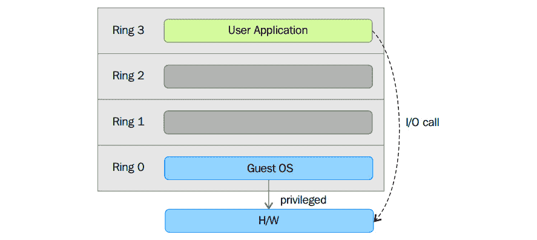

图 2.4 – 系统调用到监管模式

环 0 以上的环在处理器模式下运行未受保护的指令。虚拟机监视器（VMM）需要访问主机的内存、CPU 和 I/O 设备。由于只有在环 0 中运行的代码被允许执行这些操作，它需要在最特权的环，即环 0 中运行，并且必须放置在内核旁边。没有特定的硬件虚拟化支持，虚拟机监视器或 VMM 在环 0 中运行；这基本上阻止了虚拟机的操作系统在环 0 中运行。因此，虚拟机的操作系统必须驻留在环 1 中。安装在虚拟机中的操作系统也希望访问所有资源，因为它不知道虚拟化层；为了实现这一点，它必须在环 0 中运行，类似于 VMM。由于一次只能运行一个内核在环 0 中，客户操作系统必须在另一个权限较低的环中运行，或者必须修改为在用户模式下运行。

这导致了引入了一些虚拟化方法，称为全虚拟化和半虚拟化，我们之前提到过。现在，让我们尝试以更加技术化的方式来解释它们。

### 全虚拟化

在全虚拟化中，特权指令被模拟以克服客户操作系统在 ring 1 中运行和 VMM 在 ring 0 中运行所产生的限制。全虚拟化是在第一代 x86 VMM 中实现的。它依赖于诸如二进制翻译之类的技术来陷阱和虚拟化某些敏感和不可虚拟化的指令的执行。也就是说，在二进制翻译中，一些系统调用被解释并动态重写。以下图表描述了客户操作系统如何通过 ring 1 访问主机计算机硬件以获取特权指令，以及如何在不涉及 ring 1 的情况下执行非特权指令：


图 2.5 – 二进制翻译

采用这种方法，关键指令被发现（在运行时静态或动态地）并在 VMM 中被替换为陷阱，这些陷阱将在软件中被模拟。与在本地虚拟化架构上运行的虚拟机相比，二进制翻译可能会产生较大的性能开销。这可以从以下图表中看出：

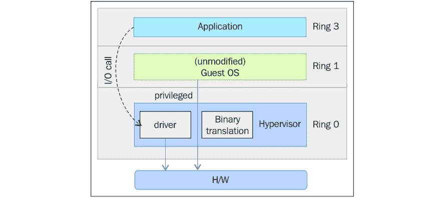

图 2.6 – 全虚拟化

然而，正如前面的图表所示，当我们使用全虚拟化时，我们可以使用未经修改的客户操作系统。这意味着我们不必修改客户内核以使其在 VMM 上运行。当客户内核执行特权操作时，VMM 提供 CPU 仿真来处理和修改受保护的 CPU 操作。然而，正如我们之前提到的，与另一种虚拟化模式——称为半虚拟化相比，这会导致性能开销。

### 半虚拟化

在半虚拟化中，客户操作系统需要被修改以允许这些指令访问 ring 0。换句话说，操作系统需要被修改以在 VMM/虚拟机监控程序和客户之间通过*后端*（超级调用）路径进行通信：

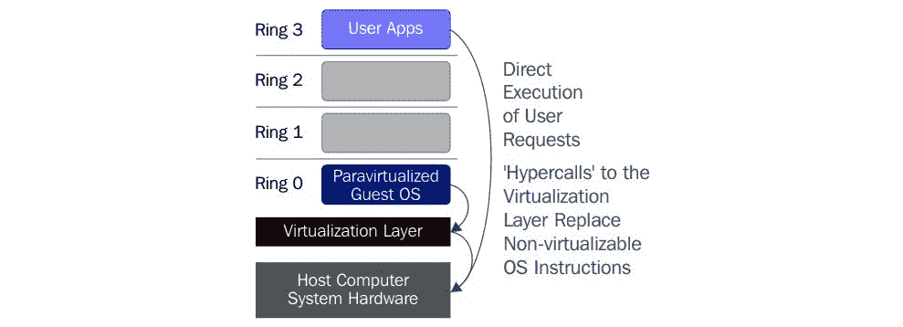

图 2.7 – 半虚拟化

半虚拟化（[`en.wikipedia.org/wiki/Paravirtualization`](https://en.wikipedia.org/wiki/Paravirtualization)）是一种技术，其中虚拟机监控程序提供一个 API，而客户虚拟机的操作系统调用该 API，这需要对主机操作系统进行修改。特权指令调用与 VMM 提供的 API 函数进行交换。在这种情况下，修改后的客户操作系统可以在 ring 0 中运行。

正如您所看到的，根据这种技术，客户内核被修改为在 VMM 上运行。换句话说，客户内核知道自己已被虚拟化。应该在 ring 0 中运行的特权指令/操作已被称为超级调用的调用所取代，这些调用与 VMM 进行通信。这些超级调用调用 VMM，以便它代表客户内核执行任务。由于客户内核可以通过超级调用直接与 VMM 通信，因此与全虚拟化相比，这种技术具有更高的性能。然而，这需要一个专门的客户内核，它知道半虚拟化并具有所需的软件支持。

半虚拟化和全虚拟化的概念曾经是一种常见的虚拟化方式，但并不是最佳的、可管理的方式。这就是硬件辅助虚拟化发挥作用的地方，我们将在下一节中描述。

### 硬件辅助虚拟化

英特尔和 AMD 意识到全虚拟化和半虚拟化是 x86 架构上虚拟化的主要挑战（由于本书的范围限于 x86 架构，我们将主要讨论这里的架构的演变），由于性能开销和设计和维护解决方案的复杂性。英特尔和 AMD 分别创建了 x86 架构的新处理器扩展，称为 Intel VT-x 和 AMD-V。在 Itanium 架构上，硬件辅助虚拟化被称为 VT-i。硬件辅助虚拟化是一种平台虚拟化方法，旨在有效利用硬件能力进行全虚拟化。各种供应商将这项技术称为不同的名称，包括加速虚拟化、硬件虚拟机和本机虚拟化。

为了更好地支持虚拟化，英特尔和 AMD 分别引入了**虚拟化技术**（**VT**）和**安全虚拟机**（**SVM**），作为 IA-32 指令集的扩展。这些扩展允许 VMM/超级监视程序运行期望在内核模式下运行的客户操作系统，在较低特权级别的环境中。硬件辅助虚拟化不仅提出了新的指令，还引入了一个新的特权访问级别，称为环 -1，超级监视程序/VMM 可以在其中运行。因此，客户虚拟机可以在环 0 中运行。有了硬件辅助虚拟化，操作系统可以直接访问资源，而无需任何仿真或操作系统修改。超级监视程序或 VMM 现在可以在新引入的特权级别环 -1 中运行，客户操作系统在环 0 中运行。此外，硬件辅助虚拟化使 VMM/超级监视程序放松，需要执行的工作量较少，从而减少了性能开销。可以用以下图表描述直接在环 -1 中运行的能力：

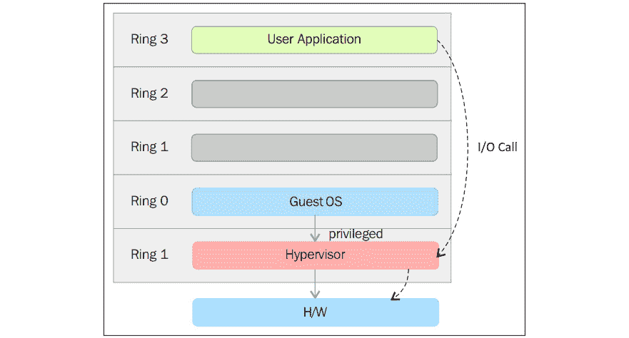

图 2.8 – 硬件辅助虚拟化

简单来说，这种虚拟化感知硬件为我们提供了构建 VMM 的支持，并确保了客户操作系统的隔离。这有助于我们实现更好的性能，并避免设计虚拟化解决方案的复杂性。现代虚拟化技术利用这一特性来提供虚拟化。一个例子是 KVM，我们将在本书中详细讨论。

现在我们已经涵盖了虚拟化的硬件和软件方面，让我们看看所有这些如何适用于 KVM 作为一种虚拟化技术。

# libvirt、QEMU 和 KVM 的内部工作

libvirt、QEMU 和 KVM 的交互是本书涵盖的完整虚拟化功能的关键。它们是 Linux 虚拟化拼图中最重要的部分，每个都有自己的作用。让我们描述一下它们的作用以及它们如何相互作用。

## libvirt

在使用 KVM 时，您最有可能首先接触到其主要的`virsh`。请记住，您可以通过 libvirt 管理远程超级监视程序，因此您不仅限于本地超级监视程序。这就是为什么 virt-manager 有一个额外的参数叫做`--connect`。libvirt 也是各种其他 KVM 管理工具的一部分，比如 oVirt（[`www.ovirt.org`](http://www.ovirt.org)），我们将在下一章中讨论。

libvirt 库的目标是提供一个通用和稳定的层，用于管理在 hypervisor 上运行的虚拟机。简而言之，作为一个管理层，它负责提供执行管理任务的 API，如虚拟机的提供、创建、修改、监视、控制、迁移等。在 Linux 中，您会注意到一些进程是守护进程。libvirt 进程也是守护进程，称为`libvirtd`。与任何其他守护进程一样，`libvirtd`在请求时为其客户端提供服务。让我们试着理解当一个 libvirt 客户端，如`virsh`或 virt-manager，从`libvirtd`请求服务时到底发生了什么。根据客户端传递的连接 URI（在下一节中讨论），`libvirtd`打开到 hypervisor 的连接。这就是客户端的`virsh`或 virt-manager 要求`libvirtd`开始与 hypervisor 通信的方式。在本书的范围内，我们的目标是研究 KVM 虚拟化技术。因此，最好将其视为 QEMU/KVM hypervisor，而不是讨论来自`libvirtd`的其他 hypervisor 通信。当您看到 QEMU/KVM 作为底层 hypervisor 名称而不是 QEMU 或 KVM 时，您可能会有点困惑。但不用担心-一切都会在适当的时候变得清晰。QEMU 和 KVM 之间的连接将在接下来的章节中讨论。现在，只需知道有一个 hypervisor 同时使用 QEMU 和 KVM 技术。

### 通过 virsh 连接到远程系统

一个远程连接的`virsh`二进制的简单命令行示例如下：

```
virsh --connect qemu+ssh://root@remoteserver.yourdomain.com/system list ––all
```

现在让我们来看看源代码。我们可以从 libvirt Git 存储库中获取 libvirt 源代码：

```
[root@kvmsource]# yum -y install git-core
[root@kvmsource]# git clone git://libvirt.org/libvirt.git
```

一旦克隆了 repo，您可以在 repo 中看到以下文件层次结构：

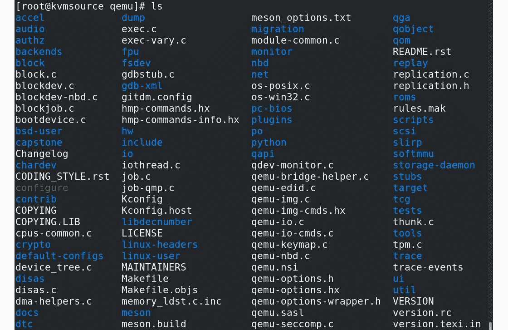

图 2.9 – 通过 Git 下载的 QEMU 源内容

libvirt 代码基于 C 编程语言；然而，libvirt 在不同语言中有语言绑定，如`C#`、`Java`、`OCaml`、`Perl`、`PHP`、`Python`、`Ruby`等。有关这些绑定的更多详细信息，请参考[`libvirt.org/bindings.html`](https://libvirt.org/bindings.html)。源代码中的主要（和少数）目录是`docs`、`daemon`、`src`等。libvirt 项目有很好的文档，并且文档可以在源代码存储库和[`libvirt.org`](http://libvirt.org)上找到。

libvirt 使用*基于驱动程序的架构*，这使得 libvirt 能够与各种外部 hypervisors 进行通信。这意味着 libvirt 有内部驱动程序，用于与其他 hypervisors 和解决方案进行接口，如 LXC、Xen、QEMU、VirtualBox、Microsoft Hyper-V、bhyve（BSD hypervisor）、IBM PowerVM、OpenVZ（开放的基于容器的解决方案）等，如下图所示：

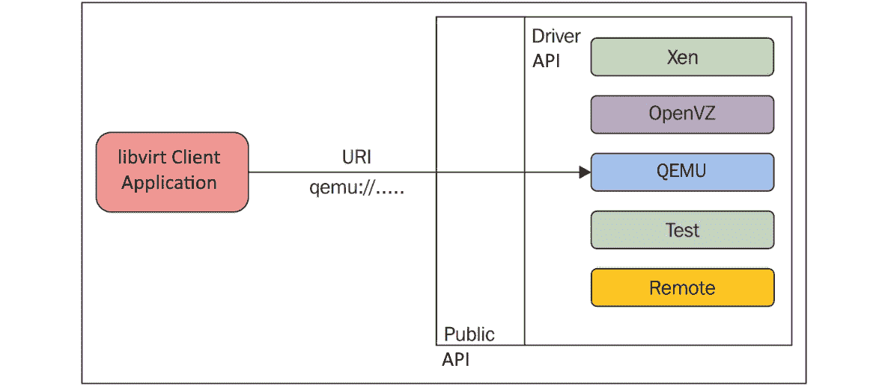

图 2.10 – 基于驱动程序的架构

通过`virsh`命令连接到各种虚拟化解决方案可以让我们更多地使用`virsh`命令。这在混合环境中可能非常有用，比如如果您从同一系统连接到 KVM 和 XEN hypervisors。

与前面的图一样，当客户端在初始化库时传递`virsh --connect QEMU://xxxx/system`时，这个公共 API 在后台使用内部驱动程序。是的，在 libvirt 中有不同类别的驱动程序实现。例如，有`hypervisor`、`interface`、`network`、`nodeDevice`、`nwfilter`、`secret`、`storage`等。请参考 libvirt 源代码中的`driver.h`了解与不同驱动程序相关的驱动程序数据结构和其他函数。

以以下示例为例：

```
struct _virConnectDriver {
    virHypervisorDriverPtr hypervisorDriver;
    virInterfaceDriverPtr interfaceDriver;
    virNetworkDriverPtr networkDriver;
    virNodeDeviceDriverPtr nodeDeviceDriver;
    virNWFilterDriverPtr nwfilterDriver;
    virSecretDriverPtr secretDriver;
    virStorageDriverPtr storageDriver;
     };
```

`struct`字段是不言自明的，传达了每个字段成员代表的驱动类型。正如你可能已经猜到的那样，重要的或主要的驱动之一是 hypervisor 驱动，它是 libvirt 支持的不同 hypervisor 的驱动实现。这些驱动被归类为`README`和 libvirt 源代码）：

+   `bhyve`: BSD hypervisor

+   `esx/`: 使用 vSphere API over SOAP 的 VMware ESX 和 GSX 支持

+   `hyperv/`: 使用 WinRM 的 Microsoft Hyper-V 支持

+   `lxc/`: Linux 本地容器

+   `openvz/`: 使用 CLI 工具的 OpenVZ 容器

+   `phyp/`: 使用 SSH 上的 CLI 工具的 IBM Power Hypervisor

+   `qemu/`: 使用 QEMU CLI/monitor 的 QEMU/KVM

+   `remote/`: 通用 libvirt 本机 RPC 客户端

+   `test/`: 用于测试的*模拟*驱动

+   `uml/`: 用户模式 Linux

+   `vbox/`: 使用本机 API 的 VirtualBox

+   `vmware/`: 使用`vmrun`工具的 VMware Workstation 和 Player

+   `xen/`: 使用超级调用、XenD SEXPR 和 XenStore 的 Xen

+   `xenapi`: 使用`libxenserver`的 Xen

之前我们提到了还有次级驱动程序。并非所有，但一些次级驱动程序（见下文）被几个 hypervisor 共享。目前，这些次级驱动程序被 LXC、OpenVZ、QEMU、UML 和 Xen 驱动程序使用。ESX、Hyper-V、Power Hypervisor、Remote、Test 和 VirtualBox 驱动程序都直接实现了次级驱动程序。

次级驱动程序的示例包括以下内容：

+   `cpu/`: CPU 特性管理

+   `interface/`: 主机网络接口管理

+   `network/`: 虚拟 NAT 网络

+   `nwfilter/`: 网络流量过滤规则

+   `node_device/`: 主机设备枚举

+   `secret/`: 密钥管理

+   `security/`: 强制访问控制驱动

+   `storage/`: 存储管理驱动

libvirt 在常规管理操作中扮演着重要角色，比如创建和管理虚拟机（客户域）。还需要使用其他次级驱动程序来执行这些操作，比如接口设置、防火墙规则、存储管理和 API 的一般配置。以下内容来自[`libvirt.org/api.html`](https://libvirt.org/api.html)：

在设备上，应用程序获取了一个 virConnectPtr 连接到 hypervisor，然后可以使用它来管理 hypervisor 的可用域和相关的虚拟化资源，比如存储和网络。所有这些都作为一流对象暴露，并连接到 hypervisor 连接（以及可用的节点或集群）。

以下图显示了 API 导出的五个主要对象及它们之间的连接：

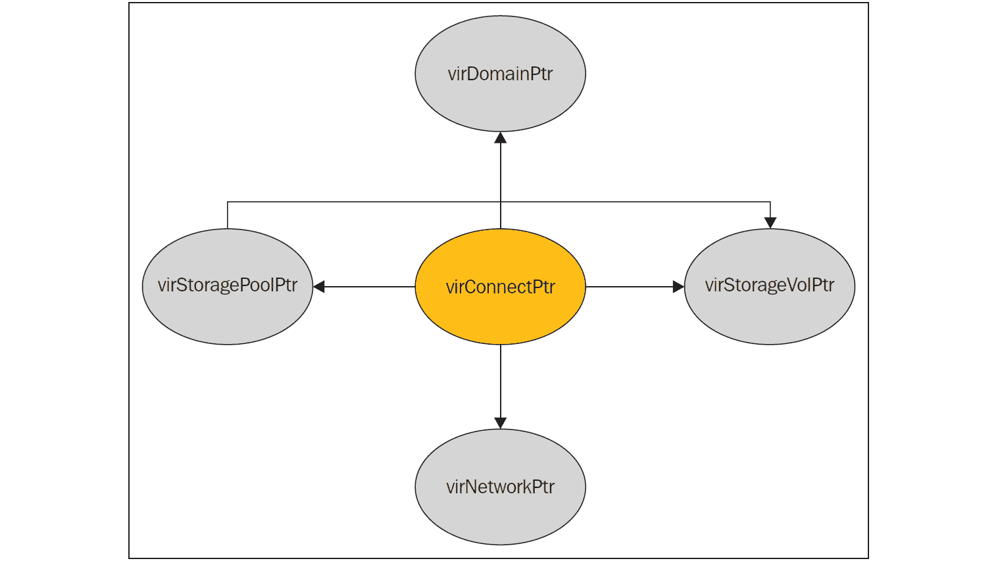

图 2.11 – 导出的 API 对象及其通信

让我们详细介绍一下 libvirt 代码中可用的主要对象。libvirt 内的大多数函数都使用这些对象进行操作：

+   `virConnectPtr`: 正如我们之前讨论的，libvirt 必须连接到一个 hypervisor 并执行操作。连接到 hypervisor 被表示为这个对象。这个对象是 libvirt API 中的核心对象之一。

+   `virDomainPtr`: 在 libvirt 代码中，虚拟机或客户系统通常被称为域。`virDomainPtr`代表一个活动/已定义的域/虚拟机对象。

+   `virStorageVolPtr`: 有不同的存储卷，暴露给域/客户系统。`virStorageVolPtr`通常代表其中一个存储卷。

+   `virStoragePoolPtr`: 导出的存储卷是存储池的一部分。这个对象代表存储池中的一个存储卷。

+   `virNetworkPtr`: 在 libvirt 中，我们可以定义不同的网络。一个单一的虚拟网络（活动/已定义状态）由`virNetworkPtr`对象表示。

现在你应该对 libvirt 实现的内部结构有一些了解；这可以进一步扩展：

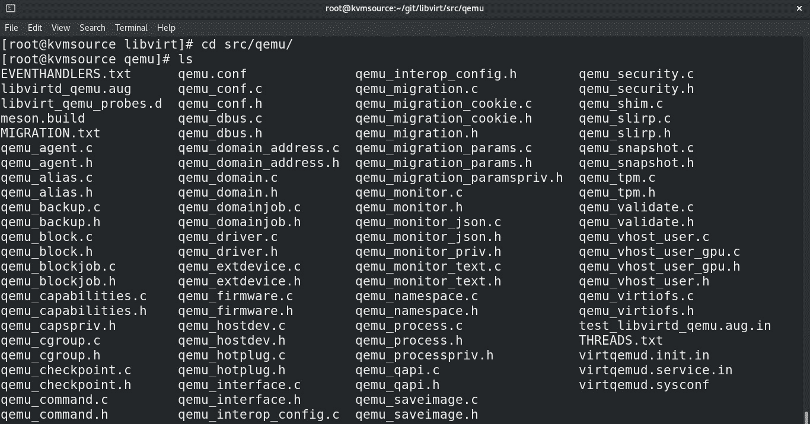

图 2.12 – libvirt 源代码

我们感兴趣的是 QEMU/KVM。因此，让我们进一步探讨一下。在 libvirt 源代码存储库的`src`目录中，有一个用于 QEMU hypervisor 驱动程序实现代码的目录。请注意一些源文件，比如`qemu_driver.c`，它包含了用于管理 QEMU 客户端的核心驱动程序方法。

请参阅以下示例：

```
static virDrvOpenStatus qemuConnectOpen(virConnectPtr conn,
                                    virConnectAuthPtr auth ATTRIBUTE_UNUSED,
                                    unsigned int flags)
```

libvirt 使用不同的驱动程序代码来探测底层的 hypervisor/模拟器。在本书的背景下，libvirt 负责发现 QEMU/KVM 存在的组件是 QEMU 驱动程序代码。该驱动程序探测`qemu-kvm`二进制文件和`/dev/kvm`设备节点，以确认 KVM 完全虚拟化的硬件加速客户端是否可用。如果这些不可用，那么通过`qemu`、`qemu-system-x86_64`、`qemu-system-mips`、`qemu-system-microblaze`等二进制文件的存在来验证 QEMU 模拟器（无 KVM）的可能性。

验证可以在`qemu_capabilities.c`中看到：

```
from  (qemu_capabilities.c)
static int virQEMUCapsInitGuest ( ..,  .. ,  virArch hostarch,  virArch guestarch)
{
...
binary = virQEMUCapsFindBinaryForArch (hostarch, guestarch);
...
native_kvm = (hostarch == guestarch);
x86_32on64_kvm = (hostarch == VIR_ARCH_X86_64 &&  guestarch == VIR_ARCH_I686);
...
if (native_kvm || x86_32on64_kvm || arm_32on64_kvm || ppc64_kvm) {
    const char *kvmbins[] = {
        "/usr/libexec/qemu-kvm", /* RHEL */
        "qemu-kvm", /* Fedora */
        "kvm", /* Debian/Ubuntu */    …};
...
kvmbin = virFindFileInPath(kvmbins[i]); 
...
virQEMUCapsInitGuestFromBinary (caps, binary, qemubinCaps, kvmbin, kvmbinCaps,guestarch);                 
...
}
```

然后，KVM 启用如下代码片段所示：

```
int virQEMUCapsInitGuestFromBinary(..., *binary, qemubinCaps, *kvmbin, kvmbinCaps, guestarch)
{
……...
  if (virFileExists("/dev/kvm") && (virQEMUCapsGet(qemubinCaps, QEMU_CAPS_KVM) ||
      virQEMUCapsGet(qemubinCaps, QEMU_CAPS_ENABLE_KVM) ||     kvmbin))
      haskvm = true;
```

基本上，libvirt 的 QEMU 驱动程序正在寻找不同发行版和不同路径中的不同二进制文件 - 例如，在 RHEL/Fedora 中的`qemu-kvm`。此外，它根据主机和客户端的架构组合找到合适的 QEMU 二进制文件。如果找到了 QEMU 二进制文件和 KVM，那么 KVM 将完全虚拟化，并且硬件加速的客户端将可用。形成整个 QEMU-KVM 进程的命令行参数也是 libvirt 的责任。最后，在形成整个命令行参数和输入后，libvirt 调用`exec()`来创建一个 QEMU-KVM 进程。

```
util/vircommand.c
static int virExec(virCommandPtr cmd) {
…...
  if (cmd->env)
    execve(binary, cmd->args, cmd->env);
  else
    execv(binary, cmd->args);
```

在 KVM 领域，有一个误解，即 libvirt 直接使用 KVM 内核模块暴露的设备文件（`/dev/kvm`），并通过 KVM 的不同`ioctl()`函数调用来指示虚拟化。这确实是一个误解！正如前面提到的，libvirt 生成 QEMU-KVM 进程，而 QEMU 与 KVM 内核模块进行通信。简而言之，QEMU 通过不同的`ioctl()`向 KVM 进行通信，以便访问由 KVM 内核模块暴露的`/dev/kvm`设备文件。要创建一个虚拟机（例如`virsh create`），libvirt 所做的就是生成一个 QEMU 进程，然后 QEMU 创建虚拟机。请注意，`libvirtd`通过`libvirtd`为每个虚拟机启动一个单独的 QEMU-KVM 进程。虚拟机的属性（CPU 数量、内存大小、I/O 设备配置等）在`/etc/libvirt/qemu`目录中的单独的 XML 文件中定义。这些 XML 文件包含 QEMU-KVM 进程启动运行虚拟机所需的所有必要设置。libvirt 客户端通过`libvirtd`正在监听的`AF_UNIX socket /var/run/libvirt/libvirt-sock`发出请求。

我们列表上的下一个主题是 QEMU - 它是什么，它是如何工作的，以及它如何与 KVM 交互。

## QEMU

QEMU 是由 FFmpeg 的创始人 Fabrice Bellard 编写的。它是一款免费软件，主要根据 GNU 的**通用公共许可证**（**GPL**）许可。QEMU 是一款通用的开源机器模拟器和虚拟化软件。当用作机器模拟器时，QEMU 可以在不同的机器上（例如您自己的 PC）运行为一台机器（如 ARM 板）制作的操作系统和程序。

通过动态翻译，它实现了非常好的性能（参见[`www.qemu.org/`](https://www.qemu.org/)）。让我重新表述前面的段落，并给出更具体的解释。QEMU 实际上是一个托管的 hypervisor/VMM，执行硬件虚拟化。你感到困惑吗？如果是这样，不要担心。当你通过本章的最后，特别是当你通过每个相关的组件并将这里使用的整个路径相关联起来执行虚拟化时，你会有一个更清晰的认识。QEMU 可以充当模拟器或虚拟化器。

### QEMU 作为一个模拟器

在上一章中，我们讨论了二进制翻译。当 QEMU 作为模拟器运行时，它能够在不同的机器类型上运行为另一种机器类型制作的操作系统/程序。这是如何可能的？它只是使用了二进制翻译方法。在这种模式下，QEMU 通过动态二进制翻译技术模拟 CPU，并提供一组设备模型。因此，它能够运行具有不同架构的不同未修改的客户操作系统。这里需要二进制翻译，因为客户代码必须在主机 CPU 上执行。执行这项工作的二进制翻译器称为**Tiny Code Generator**（**TCG**）；它是一个**即时**（**JIT**）编译器。它将为给定处理器编写的二进制代码转换为另一种形式的二进制代码（例如 ARM 在 X86 中），如下图所示（TCG 信息来自[`en.wikipedia.org/wiki/QEMU#Tiny_Code_Generator`](https://en.wikipedia.org/wiki/QEMU#Tiny_Code_Generator)）:

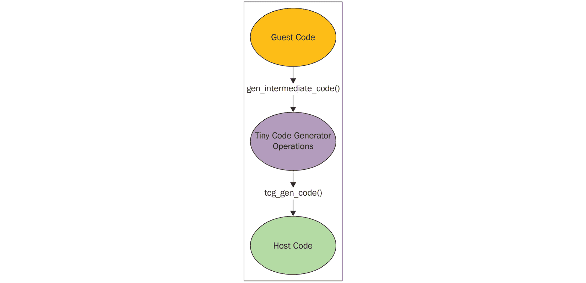

图 2.13 - QEMU 中的 TCG

通过使用这种方法，QEMU 可以牺牲一点执行速度以获得更广泛的兼容性。要牢记的是，如今大多数环境都是基于不同的操作系统，这似乎是一个明智的折衷方案。

### QEMU 作为虚拟化器

这是 QEMU 在主机 CPU 上直接执行客户代码，从而实现本机性能的模式。例如，在 Xen/KVM hypervisors 下工作时，QEMU 可以以这种模式运行。如果 KVM 是底层 hypervisor，QEMU 可以虚拟化嵌入式客户，如 Power PC、S390、x86 等。简而言之，QEMU 能够在不使用 KVM 的情况下使用上述的二进制翻译方法运行。与 KVM 启用的硬件加速虚拟化相比，这种执行速度会较慢。在任何模式下，无论是作为虚拟化器还是模拟器，QEMU 不仅仅是模拟处理器；它还模拟不同的外围设备，如磁盘、网络、VGA、PCI、串行和并行端口、USB 等。除了这种 I/O 设备模拟外，在与 KVM 一起工作时，QEMU-KVM 还创建和初始化虚拟机。如下图所示，它还为每个客户的**虚拟 CPU**（**vCPU**）初始化不同的 POSIX 线程。它还提供了一个框架，用于在 QEMU-KVM 的用户模式地址空间内模拟虚拟机的物理地址空间：

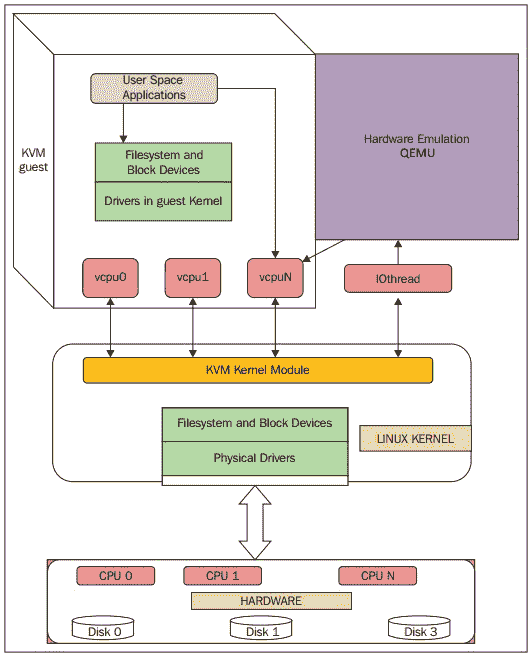

图 2.14 - QEMU 作为虚拟化器

为了在物理 CPU 中执行客户代码，QEMU 使用了 POSIX 线程。也就是说，客户 vCPU 在主机内核中作为 POSIX 线程执行。这本身带来了很多优势，因为在高层视图中，这些只是主机内核的一些进程。从另一个角度来看，QEMU 提供了 KVM hypervisor 的用户空间部分。QEMU 通过 KVM 内核模块运行客户代码。在与 KVM 一起工作时，QEMU 还进行 I/O 模拟、I/O 设备设置、实时迁移等。

QEMU 打开了由 KVM 内核模块暴露的设备文件(`/dev/kvm`)，并对其执行`ioctl()`函数调用。请参考下一节关于 KVM 的内容，了解更多关于这些`ioctl()`函数调用的信息。总之，KVM 利用 QEMU 成为一个完整的 hypervisor。KVM 是处理器提供的硬件虚拟化扩展（VMX 或 SVM）的加速器或启用器，使它们与 CPU 架构紧密耦合。间接地，这表明虚拟系统也必须使用相同的架构来利用硬件虚拟化扩展/功能。一旦启用，它肯定会比其他技术（如二进制翻译）提供更好的性能。

我们的下一步是检查 QEMU 如何融入整个 KVM 故事中。

## QEMU-KVM 内部

在我们开始研究 QEMU 内部之前，让我们克隆 QEMU Git 存储库：

```
# git clone git://git.qemu-project.org/qemu.git
```

一旦克隆完成，您可以在存储库内看到文件的层次结构，如下面的屏幕截图所示：

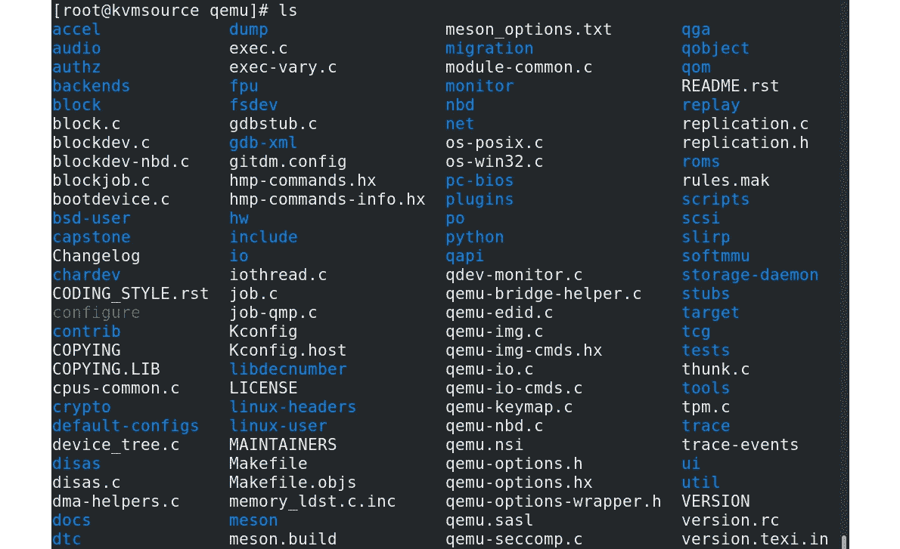

图 2.15 – QEMU 源代码

一些重要的数据结构和`ioctl()`函数调用构成了 QEMU 用户空间和 KVM 内核空间。一些重要的数据结构是`KVMState`、`CPU{X86}State`、`MachineState`等。在我们进一步探索内部之前，我想指出，详细介绍它们超出了本书的范围；但是，我会给出足够的指针来理解发生了什么，并提供更多的参考资料以供进一步解释。

## 数据结构

在这一部分，我们将讨论 QEMU 的一些重要数据结构。`KVMState`结构包含了 QEMU 中虚拟机表示的重要文件描述符。例如，它包含了虚拟机文件描述符，如下面的代码所示：

```
struct KVMState      ( kvm-all.c ) 
{           …..
  int fd;
  int vmfd;
  int coalesced_mmio;
    struct kvm_coalesced_mmio_ring *coalesced_mmio_ring; ….}
```

QEMU-KVM 维护着`CPUX86State`结构的列表，每个 vCPU 都有一个结构。通用寄存器的内容（以及 RSP 和 RIP）是`CPUX86State`的一部分：

```
struct CPUState {
…..
  int nr_cores;
  int nr_threads;
  …
  int kvm_fd;
           ….
  struct KVMState *kvm_state;
  struct kvm_run *kvm_run
}
```

此外，`CPUX86State`还查看标准寄存器以进行异常和中断处理：

```
typedef struct CPUX86State ( target/i386/cpu.h )
 {
  /* standard registers */
  target_ulong regs[CPU_NB_REGS];
….
  uint64_t system_time_msr;
  uint64_t wall_clock_msr;
…….
  /* exception/interrupt handling */
  int error_code;
  int exception_is_int;
…...
}
```

存在各种`ioctl()`函数调用：`kvm_ioctl()`、`kvm_vm_ioctl()`、`kvm_vcpu_ioctl()`、`kvm_device_ioctl()`等。有关函数定义，请访问 QEMU 源代码存储库中的`KVM-all.c`。这些`ioctl()`函数调用基本上映射到系统 KVM、虚拟机和 vCPU 级别。这些`ioctl()`函数调用类似于由 KVM 分类的`ioctl()`函数调用。当我们深入研究 KVM 内部时，我们将讨论这一点。要访问由 KVM 内核模块公开的这些`ioctl()`函数调用，QEMU-KVM 必须打开`/dev/kvm`，并将结果文件描述符存储在`KVMState->fd`中：

+   `kvm_ioctl()`：这些`ioctl()`函数调用主要在`KVMState->fd`参数上执行，其中`KVMState->fd`携带通过打开`/dev/kvm`获得的文件描述符，就像下面的例子一样：

```
kvm_ioctl(s, KVM_CHECK_EXTENSION, extension);
kvm_ioctl(s, KVM_CREATE_VM, type);
```

+   `kvm_vm_ioctl()`：这些`ioctl()`函数调用主要在`KVMState->vmfd`参数上执行，就像下面的例子一样：

```
kvm_vm_ioctl(s, KVM_CREATE_VCPU, (void *)vcpu_id);
kvm_vm_ioctl(s, KVM_SET_USER_MEMORY_REGION, &mem);
```

+   `kvm_vcpu_ioctl()`：这些`ioctl()`函数调用主要在`CPUState->kvm_fd`参数上执行，这是 KVM 的 vCPU 文件描述符，就像下面的例子一样：

```
kvm_vcpu_ioctl(cpu, KVM_RUN, 0);
```

+   `kvm_device_ioctl()`：这些`ioctl()`函数调用主要在设备`fd`参数上执行，就像下面的例子一样：

```
kvm_device_ioctl(dev_fd, KVM_HAS_DEVICE_ATTR, &attribute) ? 0 : 1;
```

在考虑 QEMU KVM 通信时，`kvm-all.c`是一个重要的源文件之一。

现在，让我们继续看看 QEMU 在 KVM 虚拟化环境中如何创建和初始化虚拟机和 vCPU。

`kvm_init()`是打开 KVM 设备文件的函数，就像下面的代码所示，它还填充了`KVMState`的`fd [1]`和`vmfd [2]`：

```
static int kvm_init(MachineState *ms)
{ 
…..
KVMState *s;
      s = KVM_STATE(ms->accelerator);
    …
    s->vmfd = -1;
    s->fd = qemu_open("/dev/kvm", O_RDWR);   ----> [1]
    ..
     do {
          ret = kvm_ioctl(s, KVM_CREATE_VM, type); --->[2]
        } while (ret == -EINTR);
     s->vmfd = ret;
….
      ret = kvm_arch_init(ms, s);   ---> ( target-i386/kvm.c: ) 
.....
  }
```

如您在前面的代码中所看到的，带有`KVM_CREATE_VM`参数的`ioctl()`函数调用将返回`vmfd`。一旦 QEMU 有了`fd`和`vmfd`，还必须填充一个文件描述符，即`kvm_fd`或`vcpu fd`。让我们看看 QEMU 是如何填充这个的：

```
main() ->
              -> cpu_init(cpu_model);      [#define cpu_init(cpu_model) CPU(cpu_x86_init(cpu_model)) ]
                  ->cpu_x86_create()
         ->qemu_init_vcpu
                      ->qemu_kvm_start_vcpu()
               ->qemu_thread_create
        ->qemu_kvm_cpu_thread_fn()
          -> kvm_init_vcpu(CPUState *cpu)
int kvm_init_vcpu(CPUState *cpu)
{
  KVMState *s = kvm_state;
  ...
            ret = kvm_vm_ioctl(s, KVM_CREATE_VCPU, (void *)kvm_arch_vcpu_id(cpu));
  cpu->kvm_fd = ret;   --->   [vCPU fd]
  ..
  mmap_size = kvm_ioctl(s, KVM_GET_VCPU_MMAP_SIZE, 0);
cpu->kvm_run = mmap(NULL, mmap_size, PROT_READ | PROT_WRITE, MAP_SHARED,  cpu->kvm_fd, 0);  [3]
...
  ret = kvm_arch_init_vcpu(cpu);   [target-i386/kvm.c]
              …..
}
```

一些内存页面在 QEMU-KVM 进程和 KVM 内核模块之间共享。您可以在`kvm_init_vcpu()`函数中看到这样的映射。也要了解，在执行返回前述`fds`的这些`ioctl()`函数调用期间，Linux 内核会分配文件结构和相关的匿名节点。我们将在讨论 KVM 时稍后讨论内核部分。

我们已经看到 vCPU 是由 QEMU-KVM 创建的`posix`线程。为了运行客户代码，这些 vCPU 线程执行带有`KVM_RUN`参数的`ioctl()`函数调用，就像下面的代码所示：

```
int kvm_cpu_exec(CPUState *cpu) {
   struct kvm_run *run = cpu->kvm_run;
  ..
  run_ret = kvm_vcpu_ioctl(cpu, KVM_RUN, 0);
           ...
}
```

相同的函数`kvm_cpu_exec()`还定义了当控制从 KVM 带有`VM exit`返回到 QEMU-KVM 用户空间时需要采取的操作。尽管我们将在后面讨论 KVM 和 QEMU 如何相互通信以代表客户执行操作，但我在这里想提一下。KVM 是由供应商如 Intel 和 AMD 提供的硬件扩展的实现者，这些硬件扩展如 SVM 和 VMX。KVM 使用这些扩展在主机 CPU 上直接执行客户代码。然而，如果有一个事件 - 例如，在操作的一部分，客户内核代码访问由 QEMU 仿真的硬件设备寄存器 - 那么 KVM 必须退出返回到 QEMU 并传递控制。然后，QEMU 可以仿真操作的结果。有不同的退出原因，如下面的代码所示：

```
  switch (run->exit_reason) {
          case KVM_EXIT_IO:
            DPRINTF("handle_io\n");
             case KVM_EXIT_MMIO:
            DPRINTF("handle_mmio\n");
   case KVM_EXIT_IRQ_WINDOW_OPEN:
            DPRINTF("irq_window_open\n");
      case KVM_EXIT_SHUTDOWN:
            DPRINTF("shutdown\n");
     case KVM_EXIT_UNKNOWN:
    ...
   	  case KVM_EXIT_INTERNAL_ERROR:
    …
   	case KVM_EXIT_SYSTEM_EVENT:
            switch (run->system_event.type) {
              case KVM_SYSTEM_EVENT_SHUTDOWN:
        case KVM_SYSTEM_EVENT_RESET:
case KVM_SYSTEM_EVENT_CRASH:
```

现在我们了解了 QEMU-KVM 的内部情况，让我们讨论一下 QEMU 中的线程模型。

## QEMU 中的线程模型

QEMU-KVM 是一个多线程、事件驱动（带有一个大锁）的应用程序。重要的线程如下：

+   主线程

+   虚拟磁盘 I/O 后端的工作线程

+   每个 vCPU 一个线程

对于每个虚拟机，主机系统中都有一个运行中的 QEMU 进程。如果客户系统关闭，这个进程将被销毁/退出。除了 vCPU 线程，还有专用的 I/O 线程运行 select(2)事件循环来处理 I/O，比如网络数据包和磁盘 I/O 完成。I/O 线程也是由 QEMU 生成的。简而言之，情况将是这样的：

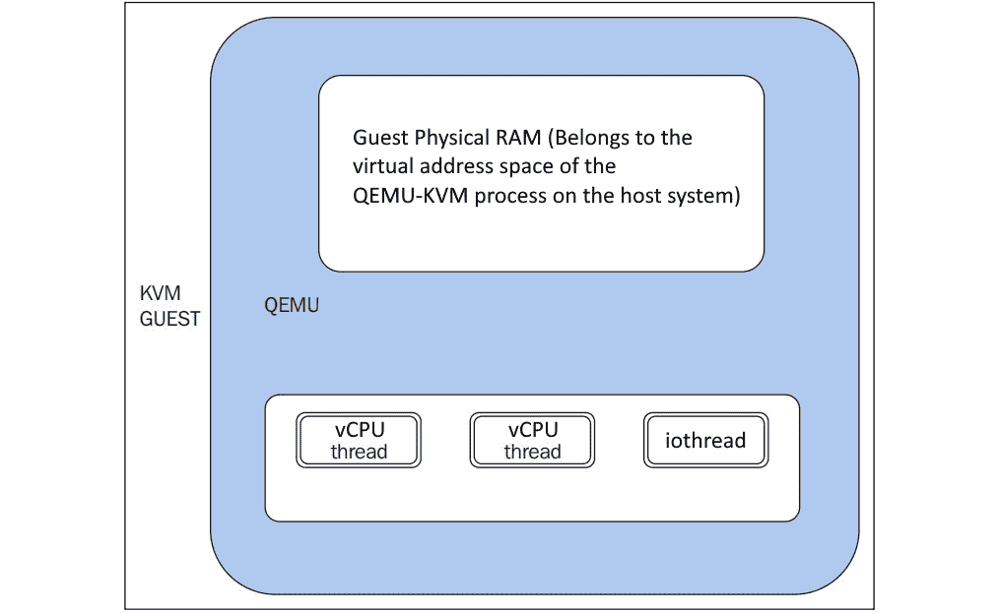

图 2.16 - KVM 客户端

在我们进一步讨论之前，总是有一个关于客户系统的物理内存的问题：它在哪里？这是交易：客户 RAM 分配在 QEMU 进程的虚拟地址空间内，如前图所示。也就是说，客户的物理 RAM 位于 QEMU 进程地址空间内。

重要说明

有关线程的更多细节可以从[blog.vmsplice.net/2011/03/qemu-internals-overall-architecutre-and-html?m=1](http://blog.vmsplice.net/2011/03/qemu-internals-overall-architecutre-and-html?m=1)的线程模型中获取。

事件循环线程也称为`iothread`。事件循环用于定时器、文件描述符监视等。`main_loop_wait()`是 QEMU 主事件循环线程。这个主事件循环线程负责主循环服务，包括文件描述符回调、底部回调和定时器（在`qemu-timer.h`中定义）。底部回调类似于立即执行的定时器，但开销较低，并且调度它们是无等待、线程安全和信号安全的。

在我们离开 QEMU 代码库之前，我想指出设备代码主要有两个部分。例如，目录块包含块设备代码的主机端，`hw/block/`包含设备仿真的代码。

## KVM

有一个名为`kvm.ko`的通用内核模块，还有硬件内核模块，比如`kvm-intel.ko`（基于 Intel 的系统）和`kvm-amd.ko`（基于 AMD 的系统）。因此，KVM 将加载`kvm-intel.ko`（如果存在`vmx`标志）或`kvm-amd.ko`（如果存在`svm`标志）模块。这将使 Linux 内核成为一个 hypervisor，从而实现虚拟化。

KVM 向应用程序公开了一个名为`/dev/kvm`的设备文件，以便它们可以利用提供的`ioctl()`函数调用系统调用。QEMU 利用这个设备文件与 KVM 通信，并创建、初始化和管理虚拟机的内核模式上下文。

之前，我们提到 QEMU-KVM 用户空间将虚拟机的物理地址空间包含在 QEMU/KVM 的用户模式地址空间中，其中包括内存映射 I/O。KVM 帮助我们实现了这一点。有更多的事情可以通过 KVM 实现。以下是一些例子：

+   对某些 I/O 设备的仿真；例如，通过 MMIO 对每个 CPU 的本地 APIC 和系统范围的 IOAPIC 进行仿真。

+   某些特权指令的仿真（对系统寄存器 CR0、CR3 和 CR4 的读写）。

+   通过`VMENTRY`执行客户代码并在`VMEXIT`处处理拦截事件。

+   将事件（如虚拟中断和页错误）注入到虚拟机的执行流程中等。这也是借助 KVM 实现的。

KVM 不是一个完整的 hypervisor；然而，借助 QEMU 和仿真器（一个稍微修改过的用于 I/O 设备仿真和 BIOS 的 QEMU），它可以成为一个。KVM 需要硬件虚拟化能力的处理器才能运行。利用这些能力，KVM 将标准的 Linux 内核转变为一个 hypervisor。当 KVM 运行虚拟机时，每个虚拟机都是一个正常的 Linux 进程，显然可以由主机内核调度到 CPU 上运行，就像主机内核中存在的任何其他进程一样。在第一章《理解 Linux 虚拟化》中，我们讨论了不同的 CPU 执行模式。你可能还记得，主要有用户模式和内核/监管模式。KVM 是 Linux 内核中的一项虚拟化功能，它允许诸如 QEMU 之类的程序在主机 CPU 上直接执行客户代码。只有当目标架构得到主机 CPU 的支持时，才有可能实现这一点。

然而，KVM 引入了一个称为客户模式的模式。简而言之，客户模式允许我们执行客户系统代码。它可以运行客户用户或内核代码。借助虚拟化感知硬件的支持，KVM 虚拟化了进程状态、内存管理等。

#### 从 CPU 的角度看虚拟化

借助其硬件虚拟化能力，处理器通过虚拟机控制结构（VMCS）和虚拟机控制块（VMCB）管理主机和客户操作系统的处理器状态，并代表虚拟化的操作系统管理 I/O 和中断。也就是说，引入这种类型的硬件后，诸如 CPU 指令拦截、寄存器读/写支持、内存管理支持（扩展页表（EPT）和嵌套分页表（NPT））、中断处理支持（APICv）、IOMMU 等任务都出现了。KVM 使用标准的 Linux 调度程序、内存管理和其他服务。简而言之，KVM 的作用是帮助用户空间程序利用硬件虚拟化能力。在这里，你可以把 QEMU 看作是一个用户空间程序，因为它被很好地集成到了不同的用例中。当我说硬件加速虚拟化时，我主要指的是英特尔 VT-X 和 AMD-Vs SVM。引入虚拟化技术处理器带来了一个额外的指令集，称为 VMX。

使用 Intel 的 VT-X，VMM 在 VMX 根操作模式下运行，而客户（未经修改的操作系统）在 VMX 非根操作模式下运行。这个 VMX 为 CPU 带来了额外的虚拟化特定指令，比如`VMPTRLD`、`VMPTRST`、`VMCLEAR`、`VMREAD`、`VMWRITE`、`VMCALL`、`VMLAUNCH`、`VMRESUME`、`VMXOFF`和`VMXON`。`VMXON`可以被`VMXOFF`禁用。为了执行客户代码，我们必须使用`VMLAUNCH`/`VMRESUME`指令并离开`VMEXIT`。但是等等，离开什么？这是从非根操作到根操作的过渡。显然，当我们进行这种过渡时，需要保存一些信息，以便以后可以获取。英特尔提供了一个结构来促进这种过渡，称为 VMCS；它处理了大部分虚拟化管理功能。例如，在`VMEXIT`的情况下，退出原因将被记录在这个结构内。那么，我们如何从这个结构中读取或写入？`VMREAD`和`VMWRITE`指令用于读取或写入相应的字段。

之前，我们讨论了 SLAT/EPT/AMD-Vi。没有 EPT，hypervisor 必须退出虚拟机执行地址转换，这会降低性能。正如我们在英特尔基于虚拟化的处理器的操作模式中所注意到的，AMD 的 SVM 也有一些操作模式，即主机模式和客户模式。显然，当处于客户模式时，某些指令可能会引起`VMEXIT`异常，这些异常会以特定于进入客户模式的方式进行处理。这里应该有一个等效的 VMCS 结构，它被称为 VMCB；正如前面讨论的，它包含了`VMEXIT`的原因。AMD 添加了八个新的指令操作码来支持 SVM。例如，`VMRUN`指令启动客户操作系统的操作，`VMLOAD`指令从 VMCB 加载处理器状态，`VMSAVE`指令将处理器状态保存到 VMCB。这就是为什么 AMD 引入了嵌套分页，这与英特尔的 EPT 类似。

当我们讨论硬件虚拟化扩展时，我们提到了 VMCS 和 VMCB。当我们考虑硬件加速虚拟化时，这些是重要的数据结构。这些控制块特别有助于`VMEXIT`场景。并非所有操作都可以允许给客户；与此同时，如果 hypervisor 代表客户执行所有操作也是困难的。虚拟机控制结构，如 VMCS 或 VMCB，控制了这种行为。一些操作允许给客户，例如更改阴影控制寄存器中的一些位，但其他操作则不允许。这显然提供了对客户允许和不允许执行的操作的精细控制。VMCS 控制结构还提供了对中断传递和异常的控制。之前我们说过`VMEXIT`的退出原因记录在 VMCS 中；它也包含一些关于它的数据。例如，如果写访问控制寄存器导致退出，有关源寄存器和目的寄存器的信息就记录在那里。

请注意 VMCS 或 VMCB 存储客户配置的具体信息，例如机器控制位和处理器寄存器设置。我建议您从源代码中检查结构定义。这些数据结构也被 hypervisor 用来定义在客户执行时监视的事件。这些事件可以被拦截。请注意这些结构位于主机内存中。在使用`VMEXIT`时，客户状态被保存在 VMCS 中。正如前面提到的，`VMREAD`指令从 VMCS 中读取指定字段，而`VMWRITE`指令将指定字段写入 VMCS。还要注意每个 vCPU 都有一个 VMCS 或 VMCB。这些控制结构是主机内存的一部分。vCPU 状态记录在这些控制结构中。

#### KVM API

如前所述，有三种主要类型的`ioctl()`函数调用。内核文档中提到了以下内容（您可以在[`www.kernel.org/doc/Documentation/virtual/kvm/api.txt`](https://www.kernel.org/doc/Documentation/virtual/kvm/api.txt)中查看）：

KVM API 由三组 ioctl 组成。KVM API 是一组用于控制虚拟机各个方面的 ioctl。这些 ioctl 属于三个类别：

- 系统 ioctl：这些查询和设置影响整个 KVM 子系统的全局属性。此外，系统 ioctl 用于创建虚拟机。

- 设备 ioctl：用于设备控制，从创建 VM 的同一上下文中执行。

- VM ioctl：这些查询和设置影响整个虚拟机的属性，例如内存布局。此外，VM ioctl 用于创建虚拟 CPU（vCPU）。它从创建 VM 的同一进程（地址空间）运行 VM ioctl。

- vCPU ioctl：这些查询和设置控制单个虚拟 CPU 操作的属性。它们从创建 vCPU 的同一线程运行 vCPU ioctl。

要了解 KVM 公开的`ioctl()`函数调用以及属于特定`fd`组的`ioctl()`函数调用的更多信息，请参考`KVM.h`。

看下面的例子：

```
/*  ioctls for /dev/kvm fds: */
#define KVM_GET_API_VERSION     _IO(KVMIO,   0x00)
#define KVM_CREATE_VM           _IO(KVMIO,   0x01) /* returns a VM fd */
…..
/*  ioctls for VM fds */
#define KVM_SET_MEMORY_REGION   _IOW(KVMIO,  0x40, struct kvm_memory_region)
#define KVM_CREATE_VCPU         _IO(KVMIO,   0x41)
…
/* ioctls for vcpu fds  */
#define KVM_RUN                   _IO(KVMIO,   0x80)
#define KVM_GET_REGS            _IOR(KVMIO,  0x81, struct kvm_regs)
#define KVM_SET_REGS            _IOW(KVMIO,  0x82, struct kvm_regs)
```

现在让我们讨论匿名 inode 和文件结构。

#### 匿名 inode 和文件结构

之前，当我们讨论 QEMU 时，我们说 Linux 内核分配文件结构并设置它的`f_ops`和匿名 inode。让我们看一下`kvm_main.c`文件：

```
static struct file_operations kvm_chardev_ops = {
      .unlocked_ioctl = kvm_dev_ioctl,
      .llseek         = noop_llseek,
      KVM_COMPAT(kvm_dev_ioctl),
};
 kvm_dev_ioctl () 
    switch (ioctl) {
          case KVM_GET_API_VERSION:
              if (arg)
                    	goto out;
              r = KVM_API_VERSION;
              break;
          case KVM_CREATE_VM:
              r = kvm_dev_ioctl_create_vm(arg);
              break;
          case KVM_CHECK_EXTENSION:
              r = kvm_vm_ioctl_check_extension_generic(NULL, arg);
              break;
          case KVM_GET_VCPU_MMAP_SIZE:
  .    …..
}
```

像`kvm_chardev_fops`一样，还有`kvm_vm_fops`和`kvm_vcpu_fops`：

```
static struct file_operations kvm_vm_fops = {
        .release        = kvm_vm_release,
        .unlocked_ioctl = kvm_vm_ioctl,
…..
        .llseek         = noop_llseek,
};
static struct file_operations kvm_vcpu_fops = {
      .release        = kvm_vcpu_release,
      .unlocked_ioctl = kvm_vcpu_ioctl,
….
      .mmap           = kvm_vcpu_mmap,
      .llseek         = noop_llseek,
};
```

inode 分配可能如下所示：

```
      anon_inode_getfd(name, &kvm_vcpu_fops, vcpu, O_RDWR | O_CLOEXEC);
```

现在让我们看一下数据结构。

## 数据结构

从 KVM 内核模块的角度来看，每个虚拟机都由一个`kvm`结构表示：

```
include/linux/kvm_host.h : 
struct kvm {
  ...
      struct mm_struct *mm; /* userspace tied to this vm */
           ...
      struct kvm_vcpu *vcpus[KVM_MAX_VCPUS];
          ....
      struct kvm_io_bus __rcu *buses[KVM_NR_BUSES];
….
      struct kvm_coalesced_mmio_ring *coalesced_mmio_ring;
  …..
}
```

正如你在前面的代码中看到的，`kvm`结构包含一个指向`kvm_vcpu`结构的指针数组，这些结构是 QEMU-KVM 用户空间中`CPUX86State`结构的对应物。`kvm_vcpu`结构包括一个通用部分和一个 x86 架构特定部分，其中包括寄存器内容：

```
struct kvm_vcpu {
  ...
      struct kvm *kvm;
      int cpu;
…..
      int vcpu_id;
  …..
   	struct kvm_run *run;
  …...
      struct kvm_vcpu_arch arch;
  …
}
```

`kvm_vcpu`结构的 x86 架构特定部分包含字段，可以在虚拟机退出后保存客户端寄存器状态，并且可以在虚拟机进入前加载客户端寄存器状态：

```
arch/x86/include/asm/kvm_host.h
struct kvm_vcpu_arch {
..
      unsigned long regs[NR_VCPU_REGS];
      unsigned long cr0;
      unsigned long cr0_guest_owned_bits;
      …..
   	struct kvm_lapic *apic;  /* kernel irqchip context */
   	..
struct kvm_mmu mmu;
..
struct kvm_pio_request pio;
void *pio_data;
..
      /* emulate context */
  struct x86_emulate_ctxt emulate_ctxt;
  ...
      int (*complete_userspace_io)(struct kvm_vcpu *vcpu);
  ….
}
```

正如你在前面的代码中看到的，`kvm_vcpu`有一个相关的`kvm_run`结构，用于 QEMU 用户空间和 KVM 内核模块之间的通信（通过`pio_data`），正如之前提到的。例如，在`VMEXIT`的情况下，为了满足虚拟硬件访问的仿真，KVM 必须返回到 QEMU 用户空间进程；KVM 将信息存储在`kvm_run`结构中供 QEMU 获取：

```
/include/uapi/linux/kvm.h:
/* for KVM_RUN, returned by mmap(vcpu_fd, offset=0) */
struct kvm_run {
        /* in */
...
        /* out */
...
        /* in (pre_kvm_run), out (post_kvm_run) */
...
      union {
              /* KVM_EXIT_UNKNOWN */
...
              /* KVM_EXIT_FAIL_ENTRY */
...
              /* KVM_EXIT_EXCEPTION */
...
              /* KVM_EXIT_IO */
struct {
#define KVM_EXIT_IO_IN  0
#define KVM_EXIT_IO_OUT 1
...
              } io;
...
}
```

`kvm_run`结构是一个重要的数据结构；正如你在前面的代码中看到的，`union`包含许多退出原因，比如`KVM_EXIT_FAIL_ENTRY`，`KVM_EXIT_IO`等。

当我们讨论硬件虚拟化扩展时，我们提到了 VMCS 和 VMCB。当我们考虑硬件加速虚拟化时，这些是重要的数据结构。这些控制块在`VMEXIT`场景中特别有帮助。并非所有操作都可以允许给客户端；同时，如果 hypervisor 代表客户端做所有事情也很困难。虚拟机控制结构，比如 VMCS 或 VMCB，控制了行为。一些操作是允许给客户端的，比如改变阴影控制寄存器中的一些位，但其他的不行。这清楚地提供了对客户端允许和不允许做什么的精细控制。VMCS 控制结构还提供了对中断传递和异常的控制。之前，我们说`VMEXIT`的退出原因记录在 VMCS 中；它也包含了一些关于它的数据。例如，如果对控制寄存器的写访问导致了退出，关于源寄存器和目的寄存器的信息就记录在那里。

在我们深入讨论 vCPU 执行流程之前，让我们先看一些重要的数据结构。

Intel 特定的实现在`vmx.c`中，AMD 特定的实现在`svm.c`中，取决于我们拥有的硬件。正如你所看到的，下面的`kvm_vcpu`是`vcpu_vmx`的一部分。`kvm_vcpu`结构主要分为通用部分和特定架构部分。通用部分包含所有支持的架构的共同数据，而特定架构部分 - 例如，x86 架构特定（客户端保存的通用寄存器）部分包含特定于特定架构的数据。正如之前讨论的，`kvm_vCPUs`，`kvm_run`和`pio_data`与用户空间共享。

`vcpu_vmx`和`vcpu_svm`结构（下面提到）有一个`kvm_vcpu`结构，其中包括一个 x86 架构特定部分（`struct 'kvm_vcpu_arch'`）和一个通用部分，并且相应地指向`vmcs`和`vmcb`结构。让我们先检查 Intel（`vmx`）结构：

```
vcpu_vmx structure
struct vcpu_vmx {
      struct kvm_vcpu     *vcpu;
        ...
      struct loaded_vmcs  vmcs01;
     struct loaded_vmcs   *loaded_vmcs;
    ….
    }
```

同样，让我们接下来检查 AMD（`svm`）结构：

```
vcpu_svm structure
struct vcpu_svm {
        struct kvm_vcpu *vcpu;
        …
struct vmcb *vmcb;
….
    }
```

`vcpu_vmx`或`vcpu_svm`结构是通过以下代码路径分配的：

```
kvm_arch_vcpu_create()
   	   ->kvm_x86_ops->vcpu_create
                 ->vcpu_create()  [.vcpu_create = svm_create_vcpu, .vcpu_create = vmx_create_vcpu,]
```

请注意，VMCS 或 VMCB 存储客户端配置的具体信息，例如机器控制位和处理器寄存器设置。我建议您从源代码中检查结构定义。这些数据结构也被 hypervisor 用于定义在客户端执行时要监视的事件。这些事件可以被拦截，这些结构位于主机内存中。在`VMEXIT`时，客户状态被保存在 VMCS 中。如前所述，`VMREAD`指令从 VMCS 中读取字段，而`VMWRITE`指令将字段写入其中。还要注意，每个 vCPU 都有一个 VMCS 或 VMCB。这些控制结构是主机内存的一部分。vCPU 状态记录在这些控制结构中。

# vCPU 的执行流程

最后，我们进入了 vCPU 执行流程，这有助于我们整合一切并了解底层发生了什么。

希望您没有忘记 QEMU 为客户端的 vCPU 创建了一个 POSIX 线程和`ioctl()`，它负责运行 CPU 并具有`KVM_RUN arg (#define KVM_RUN _IO(KVMIO, 0x80))`。vCPU 线程执行`ioctl(.., KVM_RUN, ...)`来运行客户端代码。由于这些是 POSIX 线程，Linux 内核可以像系统中的任何其他进程/线程一样调度这些线程。

让我们看看它是如何工作的：

```
Qemu-kvm User Space:
kvm_init_vcpu ()
    kvm_arch_init_vcpu()
       qemu_init_vcpu()
          qemu_kvm_start_vcpu()
             qemu_kvm_cpu_thread_fn()
    while (1) {
        if (cpu_can_run(cpu)) {
                r = kvm_cpu_exec(cpu);
                      }
        }
kvm_cpu_exec (CPUState *cpu)
    ->       run_ret = kvm_vcpu_ioctl(cpu, KVM_RUN, 0);
```

根据底层架构和硬件，KVM 内核模块初始化了不同的结构之一，其中之一是`vmx_x86_ops/svm_x86_ops`（由`kvm-intel`或`kvm-amd`模块拥有）。它定义了在 vCPU 处于上下文时需要执行的不同操作。KVM 利用`kvm_x86_ops`向量来根据加载到硬件的 KVM 模块（`kvm-intel`或`kvm-amd`）指向这些向量中的任何一个。`run`指针定义了在客户端 vCPU 运行时需要执行的函数，而`handle_exit`定义了在`VMEXIT`时需要执行的操作。让我们检查 Intel（`vmx`）结构：

```
static struct kvm_x86_ops vmx_x86_ops = {
    ...
      .vcpu_create = vmx_create_vcpu,
      .run = vmx_vcpu_run,
      .handle_exit = vmx_handle_exit,
…
}
```

现在，让我们看看 AMD（`svm`）结构：

```
static struct kvm_x86_ops svm_x86_ops = {
      .vcpu_create = svm_create_vcpu,
       .run = svm_vcpu_run,
      .handle_exit = handle_exit,
..
}
```

`run`指针分别指向`vmx_vcpu_run`或`svm_vcpu_run`。`svm_vcpu_run`或`vmx_vcpu_run`函数负责保存 KVM 主机寄存器，加载客户端操作系统寄存器和`SVM_VMLOAD`指令。我们在`vcpu run`时通过`syscall`进入内核时，走过了 QEMU KVM 用户空间代码的执行。然后，按照文件操作结构，它调用`kvm_vcpu_ioctl()`；这定义了根据`ioctl()`函数调用定义的操作：

```
static long kvm_vcpu_ioctl(struct file *file,
                         unsigned int ioctl, unsigned long arg)  {
      switch (ioctl) {
        case KVM_RUN:
    ….
           kvm_arch_vcpu_ioctl_run(vcpu, vcpu->run);
        ->vcpu_load
            -> vmx_vcpu_load
                 ->vcpu_run(vcpu);
        ->vcpu_enter_guest
                             ->vmx_vcpu_run
                     ….
}
```

我们将通过`vcpu_run()`来了解如何到达`vmx_vcpu_run`或`svm_vcpu_run`：

```
static int vcpu_run(struct kvm_vcpu *vcpu) {
….
      for (;;) {
              if (kvm_vcpu_running(vcpu)) {
                        r = vcpu_enter_guest(vcpu);
                } else {
                        r = vcpu_block(kvm, vcpu);
              }
```

一旦进入`vcpu_enter_guest()`，您可以看到在 KVM 中进入客户模式时发生的一些重要调用：

```
static int vcpu_enter_guest(struct kvm_vcpu *vcpu) {
...
      kvm_x86_ops.prepare_guest_switch(vcpu);
      vcpu->mode = IN_GUEST_MODE;
      __kvm_guest_enter();
      kvm_x86_ops->run(vcpu);
                             [vmx_vcpu_run or svm_vcpu_run ]
      vcpu->mode = OUTSIDE_GUEST_MODE;
      kvm_guest_exit();
      r = kvm_x86_ops->handle_exit(vcpu);
                             [vmx_handle_exit or handle_exit ]
…
}
```

您可以从`vcpu_enter_guest()`函数中看到`VMENTRY`和`VMEXIT`的高级图像。也就是说，`VMENTRY`（`[vmx_vcpu_run 或 svm_vcpu_run]`）只是一个在 CPU 中执行的客户操作系统；在这个阶段可能会发生不同的拦截事件，导致`VMEXIT`。如果发生这种情况，任何`vmx_handle_exit`或`handle_exit`函数调用都将开始查看此退出原因。我们已经在前面的部分讨论了`VMEXIT`的原因。一旦发生`VMEXIT`，就会分析退出原因并相应地采取行动。

`vmx_handle_exit()`是负责处理退出原因的函数：

```
static int vmx_handle_exit(struct kvm_vcpu *vcpu, , fastpath_t exit_fastpath)
{
….. }
static int (*const kvm_vmx_exit_handlers[])(struct kvm_vcpu *vcpu) = {
      [EXIT_REASON_EXCEPTION_NMI]         = handle_exception,
      [EXIT_REASON_EXTERNAL_INTERRUPT]    = handle_external_interrupt,
      [EXIT_REASON_TRIPLE_FAULT]          = handle_triple_fault,
      [EXIT_REASON_IO_INSTRUCTION]        = handle_io,
      [EXIT_REASON_CR_ACCESS]             = handle_cr,
      [EXIT_REASON_VMCALL]                = handle_vmcall,
      [EXIT_REASON_VMCLEAR]               = handle_vmclear,
      [EXIT_REASON_VMLAUNCH]            	= handle_vmlaunch,
…
}
```

`kvm_vmx_exit_handlers[]`是虚拟机退出处理程序的表，由`exit reason`索引。类似于 Intel，`svm`代码有`handle_exit()`：

```
static int handle_exit(struct kvm_vcpu *vcpu, fastpath_t exit_fastpath)
{
      struct vcpu_svm *svm = to_svm(vcpu);
      struct kvm_run *kvm_run = vcpu->run;
      u32 exit_code = svm->vmcb->control.exit_code;
….
      return svm_exit_handlersexit_code;
}
```

`handle_exit()`有`svm_exit_handler`数组，如下一节所示。

如果需要，KVM 必须回退到用户空间（QEMU）来执行仿真，因为一些指令必须在 QEMU 模拟的设备上执行。例如，为了模拟 I/O 端口访问，控制权转移到用户空间（QEMU）：

```
kvm-all.c:
static int (*const svm_exit_handlers[])(struct vcpu_svm *svm) = {
      [SVM_EXIT_READ_CR0]                   = cr_interception,
      [SVM_EXIT_READ_CR3]                   = cr_interception,
      [SVM_EXIT_READ_CR4]                   = cr_interception,
….
}
switch (run->exit_reason) {
        case KVM_EXIT_IO:
              DPRINTF("handle_io\n");
                /* Called outside BQL */
              kvm_handle_io(run->io.port, attrs,
                            (uint8_t *)run + run->io.data_offset,
                          run->io.direction,
                      	    run->io.size,
                      	    run->io.count);
              ret = 0;
            break;
```

本章内容涉及源代码较多。有时，深入挖掘和检查源代码是理解某些工作原理的唯一途径。希望本章成功做到了这一点。

# 总结

在本章中，我们讨论了 KVM 及其在 Linux 虚拟化中的主要合作伙伴 libvirt 和 QEMU 的内部工作原理。我们讨论了各种类型的虚拟化——二进制翻译、完全虚拟化、半虚拟化和硬件辅助虚拟化。我们查看了一些内核、QEMU 和 libvirt 的源代码，以了解它们之间的相互作用。这使我们具备了必要的技术知识，以便理解本书中将要介绍的主题——从创建虚拟机和虚拟网络到将虚拟化理念扩展到云概念。理解这些概念也将使您更容易理解虚拟化的关键目标——如何正确设计物理和虚拟基础设施，这将逐渐在本书中作为一个概念介绍。现在我们已经了解了虚拟化的基本工作原理，是时候转向更实际的主题了——如何部署 KVM hypervisor、管理工具和 oVirt。我们将在下一章中进行介绍。

# 问题

1.  什么是半虚拟化？

1.  什么是完全虚拟化？

1.  什么是硬件辅助虚拟化？

1.  libvirt 的主要目标是什么？

1.  KVM 的作用是什么？QEMU 呢？

# 进一步阅读

请参考以下链接，了解本章涵盖的更多信息：

+   二进制翻译：[`pdfs.semanticscholar.org/d6a5/1a7e73f747b309ef5d44b98318065d5267cf.pdf`](https://pdfs.semanticscholar.org/d6a5/1a7e73f747b309ef5d44b98318065d5267cf.pdf)

+   虚拟化基础知识：[`dsc.soic.indiana.edu/publications/virtualization.pdf`](http://dsc.soic.indiana.edu/publications/virtualization.pdf)

+   KVM：[`www.redhat.com/en/topics/virtualization/what-is-KVM`](https://www.redhat.com/en/topics/virtualization/what-is-KVM)

+   QEMU：[`www.qemu.org/`](https://www.qemu.org/)

+   了解完全虚拟化、半虚拟化和硬件辅助：[`www.vmware.com/content/dam/digitalmarketing/vmware/en/pdf/techpaper/VMware_paravirtualization.pdf`](https://www.vmware.com/content/dam/digitalmarketing/vmware/en/pdf/techpaper/VMware_paravirtualization.pdf)
