# 第三章：*第三章*：安装 KVM Hypervisor、libvirt 和 oVirt

本章为您提供了对我们书籍主题的深入了解，即**内核虚拟机**（**KVM**）及其管理工具 libvirt 和 oVirt。我们还将学习如何使用基本的 CentOS 8 部署从头开始完整安装这些工具。您会发现这是一个非常重要的主题，因为有时您可能没有安装所有必要的实用程序，特别是 oVirt，因为它是整体软件堆栈的一个完全独立的部分，也是 KVM 的免费管理平台。由于 oVirt 有很多组成部分 - 基于 Python 的守护程序和支持实用程序、库和 GUI 前端 - 我们将包括一步一步的指南，以确保您可以轻松安装 oVirt。

在本章中，我们将涵盖以下主题：

+   熟悉 QEMU 和 libvirt

+   熟悉 oVirt

+   安装 QEMU、libvirt 和 oVirt

+   使用 QEMU 和 libvirt 启动虚拟机

让我们开始吧！

# 熟悉 QEMU 和 libvirt

在*第二章*，*KVM 作为虚拟化解决方案*中，我们开始讨论 KVM、QEMU 和各种其他实用程序，可以用来管理基于 KVM 的虚拟化平台。作为机器模拟器，QEMU 将被用于在任何支持的平台上创建和运行我们的虚拟机 - 无论是作为模拟器还是虚拟化器。我们将把时间集中在第二种范式上，即使用 QEMU 作为虚拟化器。这意味着我们将能够直接在其下方的硬件 CPU 上执行我们的虚拟机代码，这意味着本地或接近本地的性能和更少的开销。

要牢记整体 KVM 堆栈是作为一个模块构建的，因此 QEMU 也采用了模块化的方法并不足为奇。多年来，这一点一直是 Linux 世界的核心原则，进一步提高了我们使用物理资源的效率。

当我们将 libvirt 作为 QEMU 的管理平台时，我们可以访问一些很酷的新实用程序，比如`virsh`命令，我们可以用它来进行虚拟机管理、虚拟网络管理等等。我们将在本书的后面讨论一些实用程序（例如 oVirt），它们使用 libvirt 作为标准化的库和实用程序，使其 GUI 魔术成为可能 - 基本上，它们使用 libvirt 作为 API。我们还可以访问其他命令，用于各种目的。例如，我们将使用一个名为`virt-host-validate`的命令来检查我们的服务器是否与 KVM 兼容。

# 熟悉 oVirt

请记住，大多数 Linux 系统管理员所做的工作是通过命令行工具、libvirt 和 KVM 完成的。它们为我们提供了一套良好的工具，可以在命令行中完成我们需要的一切，正如我们将在本章的后面部分看到的那样。但同时，我们也将对基于 GUI 的管理有所了解，因为我们稍后将简要讨论虚拟机管理器。

然而，这仍然无法涵盖这样一种情况，即您拥有大量基于 KVM 的主机、数百台虚拟机、数十个相互连接的虚拟网络，以及一整个机架的存储设备，您需要将其集成到您的 KVM 环境中。使用上述实用程序只会在您扩展环境时给您带来痛苦。这主要原因相当简单-我们仍然没有引入任何一种*集中式*软件包来管理基于 KVM 的环境。当我们说集中式时，我们指的是字面意义上-我们需要一种可以连接到多个虚拟化程序并管理它们所有功能的软件解决方案，包括网络、存储、内存和 CPU，或者我们有时所说的*虚拟化的四大支柱*。这种软件最好有某种 GUI 界面，我们可以从中*集中*管理我们所有的 KVM 资源，因为-嗯-我们都是人类。我们中有相当多的人更喜欢图片而不是文本，更喜欢交互而不是仅限于文本管理，尤其是在规模化时。

这就是 oVirt 项目的用武之地。oVirt 是一个用于管理我们的 KVM 环境的开源平台。它是一个基于 GUI 的工具，在后台有很多运行部件-引擎在基于 Java 的 WildFly 服务器上运行（以前被称为 JBoss），前端使用 GWT 工具包等。但它们都是为了实现一件事-让我们能够从一个集中的、基于 Web 的管理控制台管理基于 KVM 的环境。

从管理的角度来看，oVirt 有两个主要的构建模块-引擎（我们可以通过 GUI 界面连接到）和其代理（用于与主机通信）。让我们简要描述它们的功能。

oVirt 引擎是一个集中式服务，可用于执行虚拟化环境中所需的任何操作-管理虚拟机、移动它们、创建镜像、存储管理、虚拟网络管理等。此服务用于管理 oVirt 主机，并且为此，它需要与主机上的某些东西进行通信。这就是 oVirt 代理（vdsm）发挥作用的地方。

oVirt 引擎的一些可用高级功能包括以下内容：

+   虚拟机的实时迁移

+   图像管理

+   虚拟机的导入和导出（OVF 格式）

+   虚拟到虚拟转换（V2V）

+   高可用性（在集群中的剩余主机上重新启动虚拟机）

+   资源监控

显然，我们需要在主机上部署 oVirt 代理和相关实用程序，这些主机将成为我们环境的主要部分，我们将在其中托管一切-虚拟机、模板、虚拟网络等。为此，oVirt 使用了一种特定的基于代理的机制，通过一个名为 vdsm 的代理。这是一个我们将部署到我们的 CentOS 8 主机上的代理，以便我们可以将它们添加到 oVirt 的清单中，进而意味着我们可以通过使用 oVirt 引擎 GUI 来管理它们。Vdsm 是一个基于 Python 的代理，oVirt 引擎使用它可以直接与 KVM 主机通信，然后 vdsm 可以与本地安装的 libvirt 引擎进行通信以执行所有必要的操作。它还用于配置目的，因为主机需要配置为在 oVirt 环境中使用，以配置虚拟网络、存储管理和访问等。此外，vdsm 还具有内存过量管理器（MOM）集成，以便它可以有效地管理我们虚拟化主机上的内存。

以图形方式来看，oVirt 的架构如下所示：

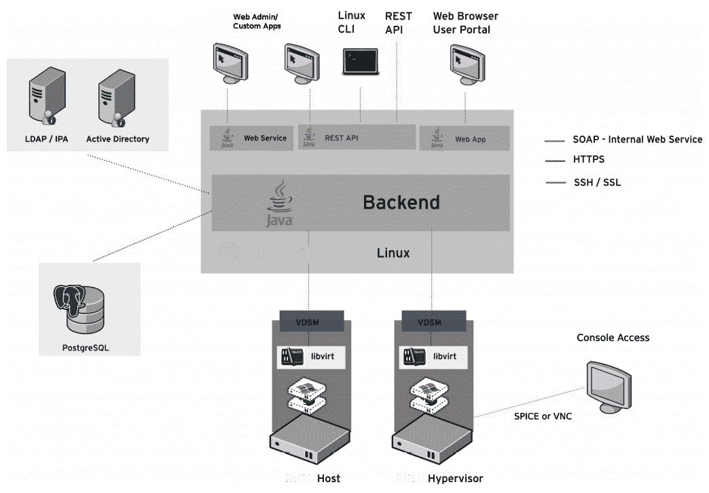

图 3.1- oVirt 架构（来源：http://ovirt.org）

我们将在下一章中介绍如何安装 oVirt。如果您曾听说过或使用过一个名为 Red Hat Enterprise Virtualization 的产品，那么它可能看起来非常熟悉。

# 安装 QEMU、libvirt 和 oVirt

让我们从一些基本信息开始讨论安装 QEMU、libvirt 和 oVirt：

+   我们将在本书中的所有内容中使用 CentOS 8（除了一些仅支持 CentOS 7 的部分，因为在撰写本书时，CentOS 7 是最后一个受支持的版本）。

+   我们的默认安装配置文件始终是**带 GUI 的服务器**，前提是我们将覆盖几乎在本书中要做的所有事情的 GUI 和文本模式实用程序。

+   我们需要在默认的*带 GUI 的服务器*安装之上手动安装所有内容，以便我们有一个完整的，一步一步的指南来完成所有操作。

+   本书中涵盖的所有示例都可以安装在一台具有 16 个物理核心和 64GB 内存的单个物理服务器上。如果您修改一些数字（分配给虚拟机的核心数、分配给某些虚拟机的内存量等），您可以使用一台 6 核笔记本电脑和 16GB 内存来完成这些操作，前提是您不会一直运行所有虚拟机。如果在完成本章后关闭虚拟机，并在下一章中启动必要的虚拟机，那么这样做是可以的。在我们的情况下，我们使用了一台 HP ProLiant DL380p Gen8，这是一台易于找到的二手服务器 - 价格也相当便宜。

在完成了服务器的基本安装后 - 选择安装配置文件、分配网络配置和 root 密码，并添加额外用户（如果需要） - 我们面临着一个无法进行虚拟化的系统，因为它没有运行 KVM 虚拟机所需的所有必要工具。因此，我们要做的第一件事是简单安装必要的模块和基本应用程序，以便检查我们的服务器是否与 KVM 兼容。因此，请以管理员用户身份登录到服务器并发出以下命令：

```
yum module install virt
dnf install qemu-img qemu-kvm libvirt libvirt-client virt-manager virt-install virt-viewer -y
```

我们还需要告诉内核我们将使用 IOMMU。这可以通过编辑`/etc/default/grub`文件来实现，找到`GRUB_CMDLINE_LINUX`并在该行的末尾添加一条语句：

```
intel_iommu=on
```

在添加该行之前不要忘记添加一个空格。下一步是重新启动，所以我们需要执行：

```
systemctl reboot
```

通过发出这些命令，我们安装了运行基于 KVM 的虚拟机所需的所有必要库和二进制文件，以及使用 virt-manager（GUI libvirt 管理实用程序）来管理我们的 KVM 虚拟化服务器。

此外，通过添加 IOMMU 配置，我们确保我们的主机看到 IOMMU，并在使用`virt-host-validate`命令时不会抛出错误

之后，让我们通过发出以下命令来检查我们的主机是否与所有必要的 KVM 要求兼容：

```
virt-host-validate
```

此命令经过多次测试，以确定我们的服务器是否兼容。我们应该得到这样的输出：

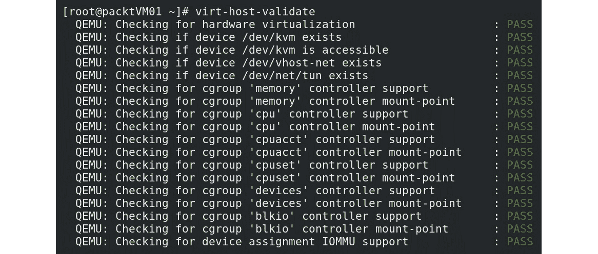

图 3.2 - virt-host-validate 输出

这表明我们的服务器已准备好用于 KVM。因此，下一步是，既然所有必要的 QEMU/libvirt 实用程序都已安装，我们要进行一些预检查，以查看我们安装的所有内容是否部署正确，并且是否像应该那样工作。我们将运行`virsh net-list`和`virsh list`命令来执行此操作，如下面的屏幕截图所示：

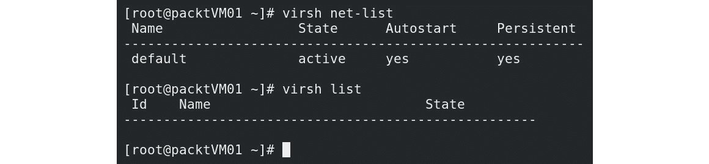

图 3.3 - 测试 KVM 虚拟网络并列出可用的虚拟机

通过使用这两个命令，我们检查了我们的虚拟化主机是否有正确配置的默认虚拟网络交换机/桥（关于这一点，我们将在下一章中详细介绍），以及我们是否有任何正在运行的虚拟机。我们有默认的桥接和没有虚拟机，所以一切都是正常的。

## 在 KVM 中安装第一个虚拟机

现在我们可以开始使用我们的 KVM 虚拟化服务器来运行虚拟机。让我们从在我们的主机上部署一个虚拟机开始。为此，我们将一个 CentOS 8.0 ISO 文件复制到我们的本地文件夹`/var/lib/libvirt/images`，我们将使用它来创建我们的第一个虚拟机。我们可以通过使用以下命令从命令行执行此操作：

```
virt-install --virt-type=kvm --name MasteringKVM01 --vcpus 2 --ram 4096 --os-variant=rhel8.0 --cdrom=/var/lib/libvirt/images/ CentOS-8-x86_64-1905-dvd1.iso  --network=default --graphics vnc --disk size=16
```

这里有一些可能有点令人困惑的参数。让我们从`--os-variant`参数开始，该参数描述了您想要使用`virt-install`命令安装的客户操作系统。如果您想获取受支持的客户操作系统列表，请运行以下命令：

```
osinfo-query os
```

`--network`参数与我们的默认虚拟桥有关（我们之前提到过这一点）。我们绝对希望我们的虚拟机能够连接到网络，因此我们选择了这个参数，以确保它在开箱即用时能够连接到网络。

在启动`virt-install`命令后，我们应该会看到一个 VNC 控制台窗口，以便跟随安装过程。然后我们可以选择使用的语言、键盘、时间和日期，以及安装目的地（点击所选磁盘，然后在左上角按**完成**）。我们还可以通过转到**网络和主机名**，点击**关闭**按钮，选择**完成**（然后会切换到**打开**位置），并将我们的虚拟机连接到底层网络桥（*默认*）来激活网络。之后，我们可以按**开始安装**，让安装过程完成。在等待过程中，我们可以点击**Root 密码**为我们的管理用户分配一个 root 密码。

如果所有这些对您来说似乎有点像*手工劳动*，我们能理解您的痛苦。想象一下不得不部署数十个虚拟机并点击所有这些设置。我们已经不再处于 19 世纪，所以一定有更简单的方法来做这件事。

## 自动化虚拟机安装

到目前为止，以更*自动*的方式执行这些操作的最简单和最简单的方法是创建和使用一个称为**kickstart**文件。kickstart 文件基本上是一个文本配置文件，我们可以使用它来配置服务器的所有部署设置，无论我们是在谈论物理服务器还是虚拟服务器。唯一的注意事项是 kickstart 文件需要预先准备并广泛可用-无论是在网络（web）上还是在本地磁盘上。还有其他支持的选项，但这些是最常用的选项。

为了我们的目的，我们将使用一个在网络上（通过 Web 服务器）可用的 kickstart 文件，但我们将对其进行一些编辑，以使其可用，并将其留在我们的网络上，以便`virt-install`可以使用它。

当我们安装物理服务器时，作为安装过程的一部分（称为`anaconda`），一个名为`anaconda-ks.cfg`的文件被保存在我们的`/root`目录中。这是一个 kickstart 文件，其中包含了我们的物理服务器的完整部署配置，我们可以以此为基础创建一个新的虚拟机的 kickstart 文件。

在 CentOS 7 中执行这个最简单的方法是部署一个名为`system-config-kickstart`的实用程序，在 CentOS 8 中不再可用。在[`access.redhat.com/labs/kickstartconfig/`](https://access.redhat.com/labs/kickstartconfig/)有一个在线替代实用程序称为 Kickstart Generator，但您需要拥有 Red Hat Customer Portal 帐户。因此，如果您没有，您只能使用文本编辑现有的 kickstart 文件。这并不是很困难，但可能需要一些努力。我们需要正确配置的最重要的设置与我们将从中安装虚拟机的*位置*有关-是在网络上还是从本地目录（就像我们在第一个`virt-install`示例中所做的那样，使用本地磁盘上的 CentOS ISO）。如果我们将在服务器上本地存储 ISO 文件，则这是一个简单的配置。首先，我们将部署 Apache Web 服务器，以便我们可以在线托管我们的 kickstart 文件（稍后会派上用场）。因此，我们需要以下命令：

```
dnf install httpd 
systemctl start httpd
systemctl enable httpd
cp /root/anaconda-ks.cfg /var/www/html/ks.cfg
chmod 644 /var/www/html/ks.cfg
```

在开始部署过程之前，使用 vi 编辑器（或您喜欢的任何其他编辑器）编辑我们的 kickstart 文件（`/var/www/html/ks.cfg`）中的第一行配置，该配置类似于`ignoredisk --only-use=sda`，改为`ignoredisk --only-use=vda`。这是因为虚拟 KVM 机器不使用`sd*`设备命名，而是使用`vd`命名。这样任何管理员在连接到服务器后就可以更容易地弄清楚他们是在管理物理服务器还是虚拟服务器。

通过编辑 kickstart 文件并使用这些命令，我们安装并启动了`httpd`（Apache Web 服务器）。然后，我们永久启动它，以便在每次服务器重启后都启动它。然后，我们将默认的 kickstart 文件（`anaconda-ks.cfg`）复制到 Apache 的`DocumentRoot`目录（Apache 提供文件的目录），并更改权限，以便 Apache 在客户端请求时实际读取该文件。在我们的示例中，将使用它的*客户端*是`virt-install`命令。我们用来说明这个特性的服务器的 IP 地址是`10.10.48.1`，这是我们将用于 kickstart URL 的地址。请注意，默认的 KVM 桥使用 IP 地址`192.168.122.1`，您可以使用`ip`命令轻松检查：

```
ip addr show virbr0
```

此外，可能需要更改一些防火墙设置，以便在物理服务器上成功获取 kickstart 文件（接受 HTTP 连接）。因此，让我们尝试一下。在这个和以下的示例中，要特别注意`--vcpus`参数（虚拟机的虚拟 CPU 核心数），因为您可能需要根据自己的环境进行更改。换句话说，如果您没有 4 个核心，请确保降低核心数量。我们只是以此作为示例：

```
virt-install --virt-type=kvm --name=MasteringKVM02 --ram=4096 --vcpus=4 --os-variant=rhel8.0 --location=/var/lib/libvirt/images/ CentOS-8-x86_64-1905-dvd1.iso --network=default --graphics vnc --disk size=16 -x "ks=http://10.10.48.1/ks.cfg"
```

重要提示

请注意我们更改的参数。在这里，我们必须使用`--location`参数，而不是`--cdrom`参数，因为我们正在将 kickstart 配置注入到引导过程中（必须以这种方式执行）。

部署过程完成后，我们应该在服务器上有两个名为`MasteringKVM01`和`MasteringKVM02`的完全功能的虚拟机，准备用于我们未来的演示。第二个虚拟机（`MasteringKVM02`）的根密码与第一个虚拟机相同，因为我们除了虚拟磁盘选项之外，没有更改 kickstart 文件中的任何内容。因此，在部署后，我们可以使用`MasteringKVM01`机器的根用户名和密码登录到我们的`MasteringKVM02`机器。

如果我们想进一步发展，我们可以创建一个带有循环的 shell 脚本，该循环将使用索引自动为虚拟机提供唯一名称。我们可以通过使用`for`循环及其计数器轻松实现这一点：

```
#!/bin/bash
for counter in {1..5}
do 
	echo "deploying VM $counter"
virt-install --virt-type=kvm --name=LoopVM$counter --ram=4096 --vcpus=4 --os-variant=rhel8.0 --location=/var/lib/libvirt/images/CentOS-8-x86_64-1905-dvd1.iso --network=default --graphics vnc --disk size=16 -x "ks=http://10.10.48.1/ks.cfg"
done
```

当我们执行此脚本（不要忘记将其`chmod`为`755`！）时，我们应该会得到 10 个名为`LoopVM1-LoopVM5`的虚拟机，所有设置都相同，包括相同的 root 密码。

如果我们使用 GUI 服务器安装，我们可以使用 GUI 实用程序来管理我们的 KVM 服务器。其中一个实用程序称为`virtual`，点击**虚拟机管理器**，然后开始使用它。虚拟机管理器的外观如下：

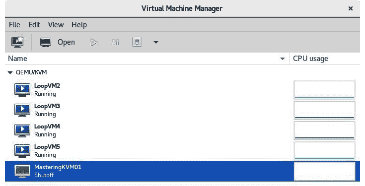

图 3.4 – 虚拟机管理器

现在我们已经介绍了基本的命令行实用程序（`virsh`和`virt-install`），并且有一个非常简单易用的 GUI 应用程序（虚拟机管理器），让我们从这个角度转移一下，思考一下我们对 oVirt 和管理大量主机、虚拟机、网络和存储设备的看法。因此，现在让我们讨论如何安装 oVirt，然后我们将使用它来以更集中的方式管理基于 KVM 的环境。

## 安装 oVirt

安装 oVirt 有不同的方法。我们可以将其部署为自托管引擎（通过 Cockpit Web 界面或 CLI），也可以通过基于软件包的安装将其部署为独立应用程序。让我们以第二种方式为例-在虚拟机中进行独立安装。我们将安装分为两部分：

1.  安装 oVirt 引擎进行集中管理

1.  在我们的基于 CentOS 8 的主机上部署 oVirt 代理

首先，让我们处理 oVirt 引擎部署。部署足够简单，人们通常使用一个虚拟机来实现这一目的。请记住，CentOS 8 不支持 oVirt，在我们的 CentOS 8 虚拟机中，我们需要输入一些命令：

```
yum install https://resources.ovirt.org/pub/yum-repo/ovirt-release44.rpm
yum -y module enable javapackages-tools pki-deps postgresql:12
yum -y update
yum -y install ovirt-engine
```

再次强调，这只是安装部分；我们还没有进行任何配置。所以，这是我们的逻辑下一步。我们需要启动一个名为`engine-setup`的 shell 应用程序，它将询问我们大约 20 个问题。它们相当描述性，引擎设置直接提供了解释，所以这些是我们在测试环境中使用的设置（在您的环境中 FQDN 将不同）：

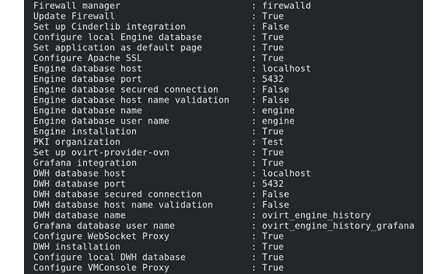

图 3.5 – oVirt 配置设置

在输入`OK`后，引擎设置将开始。最终结果应该看起来像这样：

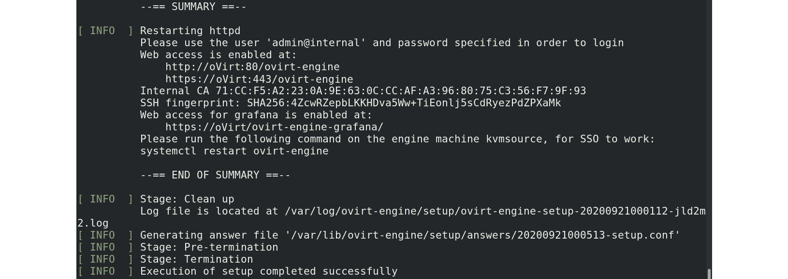

图 3.6 – oVirt 引擎设置摘要

现在，我们应该能够通过使用 Web 浏览器并将其指向安装摘要中提到的 URL 来登录到我们的 oVirt 引擎。在安装过程中，我们被要求为`admin@internal`用户提供密码-这是我们将用来管理环境的 oVirt 管理用户。oVirt Web 界面足够简单易用，目前我们只需要登录到管理门户（在尝试登录之前，oVirt 引擎 Web GUI 上直接提供了一个链接）。登录后，我们应该会看到 oVirt GUI：

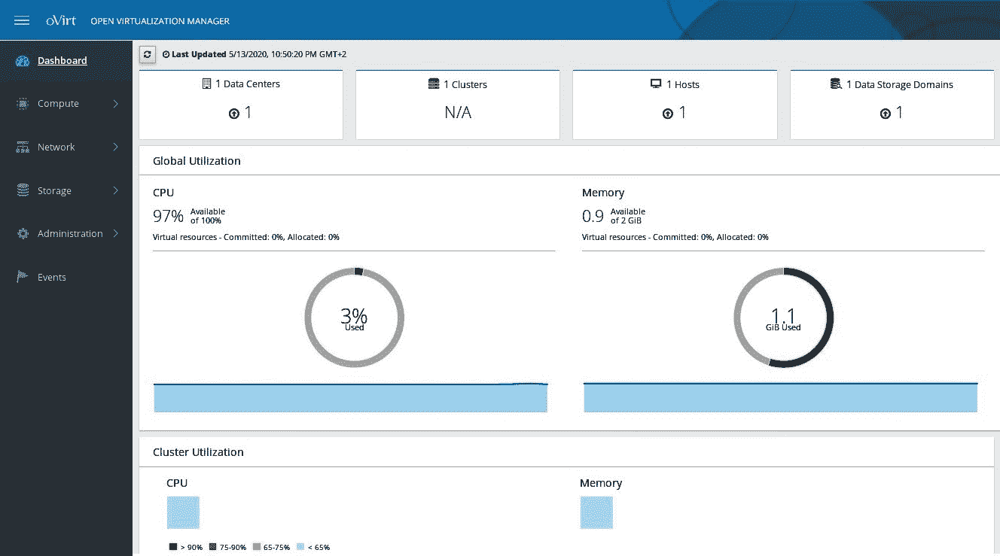

图 3.7 – oVirt 引擎管理门户

屏幕左侧有各种选项卡-**仪表板**、**计算**、**网络**、**存储**和**管理**-每一个都有特定的用途：

+   **仪表板**：默认的着陆页面。它包含最重要的信息，环境健康状态的可视化表示，以及一些基本信息，包括我们正在管理的虚拟数据中心的数量、集群、主机、数据存储域等等。

+   **计算**：我们转到此页面以管理主机、虚拟机、模板、池、数据中心和集群。

+   **网络**：我们转到此页面以管理我们的虚拟网络和配置文件。

+   **存储**：我们可以在此页面上管理存储资源，包括磁盘、卷、域和数据中心。

+   **管理**：用于管理用户、配额等。

我们将在*第七章*中处理更多与 oVirt 相关的操作，*虚拟机-安装、配置和生命周期管理*，这是关于 oVirt 的全部内容。但目前，让我们保持 oVirt 引擎运行，以便以后再次使用它，并在基于 KVM 的虚拟化环境中进行日常操作。

# 使用 QEMU 和 libvirt 启动虚拟机

部署完成后，我们可以开始管理我们的虚拟机。我们将以`MasteringKVM01`和`MasteringKVM02`为例。让我们使用`virsh`命令和`start`关键字来启动它们：


图 3.8 - 使用 virsh start 命令

假设我们从 shell 脚本示例中创建了所有五台虚拟机，并且将它们保持开机状态。我们可以通过发出简单的`virsh list`命令轻松检查它们的状态：

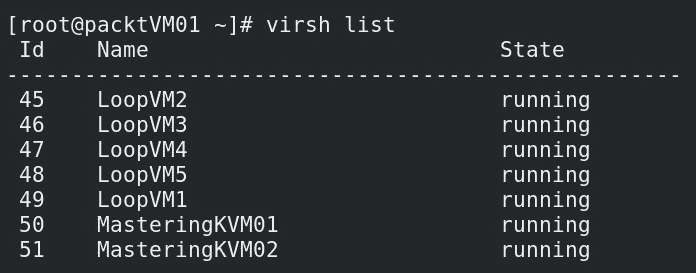

图 3.9 - 使用 virsh list 命令

如果我们想要优雅地关闭`MasteringKVM01`虚拟机，可以使用`virsh shutdown`命令：

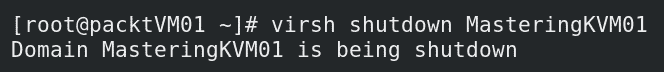

图 3.10 - 使用 virsh shutdown 命令

如果我们想要强制关闭`MasteringKVM02`虚拟机，可以使用`virsh destroy`命令：

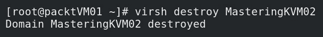

图 3.11 - 使用 virsh destroy 命令

如果我们想要完全删除虚拟机（例如`MasteringKVM02`），通常需要先关闭它（优雅或强制），然后使用`virsh undefine`命令：

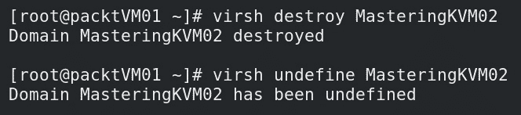

图 3.12 - 使用 virsh destroy 和 undefine 命令

请注意，您实际上可以先执行`virsh undefine`，然后再执行`destroy`，最终结果将是相同的。但是，这可能违反了*预期行为*，即您首先关闭对象，然后再删除它。

我们刚刚学会了如何使用`virsh`命令来管理虚拟机 - 启动和停止 - 强制和优雅。当我们开始扩展对`virsh`命令的使用知识时，这将会很有用，在接下来的章节中，我们将学习如何管理 KVM 网络和存储。

我们也可以从 GUI 中完成所有这些操作。您可能还记得，在本章的前面，我们安装了一个名为`virt-manager`的软件包。实际上，这是一个用于管理 KVM 主机的 GUI 应用程序。让我们使用它来进一步操作我们的虚拟机。这是`virt-manager`的基本 GUI 界面：

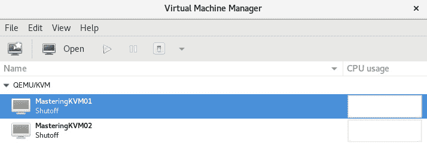

图 3.13 - virt-manager GUI - 我们可以看到已注册的虚拟机列表并开始管理它们

如果我们想对虚拟机进行常规操作 - 启动、重启、关闭、关闭电源 - 我们只需要右键单击它，并从菜单中选择该选项。要使所有操作可见，首先我们必须启动虚拟机；否则，只有四个操作可用，而可用的七个操作中，`MasteringKVM01`的列表将变得更大：

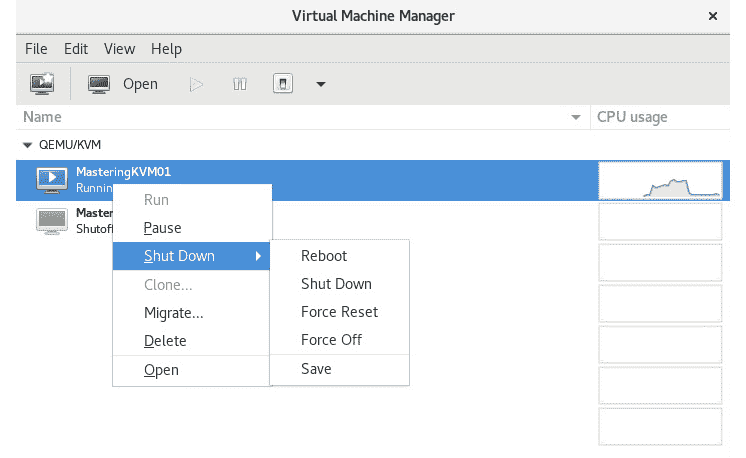

图 3.14 - virt-manager 选项 - 在虚拟机上电后，我们现在可以使用更多选项

我们将在本书中的各种操作中使用`virt-manager`，所以请确保您熟悉它。在许多情况下，它将使我们的管理工作变得更加容易。

# 总结

在本章中，我们为本书剩余章节中要做的几乎所有事情奠定了一些基本的基础和先决条件。我们学会了如何安装 KVM 和 libvirt 堆栈。我们还学会了如何部署 oVirt 作为管理我们的 KVM 主机的 GUI 工具。

接下来的几章将带领我们走向更加技术化的方向，我们将涵盖网络和存储概念。为了做到这一点，我们将不得不退一步，学习或复习我们之前关于网络和存储的知识，因为这些对于虚拟化，特别是云计算来说是非常重要的概念。

# 问题

1.  我们如何验证我们的主机是否与 KVM 要求兼容？

1.  oVirt 的默认登陆页面是什么？

1.  我们可以使用哪个命令从命令行管理虚拟机？

1.  我们可以使用哪个命令从命令行部署虚拟机？

# 进一步阅读

请参考以下链接，了解本章涵盖的更多信息：

+   Kickstart Generator: [`access.redhat.com/labs/kickstartconfig/`](https://access.redhat.com/labs/kickstartconfig/). 只是提醒您，您需要拥有 RedHat 支持帐户才能访问此链接。

+   oVirt: [`www.ovirt.org/`](https://www.ovirt.org/).
