# 第四章：Libvirt 网络

了解虚拟网络如何工作对于虚拟化非常重要。很难证明在没有虚拟网络的情况下，我们可以承担与拥有多个虚拟机的虚拟化主机相关的成本。想象一下，在虚拟化网络中有多个虚拟机，并购买网络卡，以便每个虚拟机都可以拥有自己专用的物理网络端口。通过实施虚拟网络，我们也以更可管理的方式整合了网络，无论是从管理还是成本的角度来看。

本章为您提供了对虚拟化网络和基于 Linux 的网络概念的整体概念。我们还将讨论物理和虚拟网络概念，尝试比较它们，并找出它们之间的相似之处和不同之处。本章还涵盖了虚拟交换的概念，用于主机概念和跨主机概念，以及一些更高级的主题。这些主题包括单根输入/输出虚拟化，它允许对某些场景的硬件采用更直接的方法。随着我们开始讨论云覆盖网络，我们将在本书的后面回顾一些网络概念。这是因为基本的网络概念对于大型云环境来说并不够可扩展。

在本章中，我们将涵盖以下主题：

+   理解物理和虚拟网络

+   使用 TAP/TUN

+   实施 Linux 桥接

+   配置 Open vSwitch

+   了解和配置 SR-IOV

+   理解 macvtap

+   让我们开始吧！

# 理解物理和虚拟网络

让我们思考一下网络。这是当今大多数系统管理员都相当了解的一个主题。这可能不是我们认为的那么高的水平，但是-如果我们试图找到一个系统管理领域，我们会发现最大的共同知识水平，那就是网络。

那么，问题出在哪里呢？

实际上，没有什么。如果我们真正理解物理网络，那么虚拟网络对我们来说将是小菜一碟。剧透警告：*它是一样的*。如果我们不理解，它将很快暴露出来，因为没有绕过它的办法。随着环境的发展和通常的增长，问题会越来越大，因为它们变得越大，它们将产生越多的问题，您将花费更多的时间处于调试模式。

话虽如此，如果您对基于 VMware 或 Microsoft 的虚拟网络在技术层面上有很好的掌握，那么这些概念对您来说都是非常相似的。

说到这一点，虚拟网络到底是怎么回事？实际上，这是关于理解事情发生的地方，方式和原因。这是因为从物理上讲，虚拟网络与物理网络完全相同。从逻辑上讲，有一些差异更多地与事物的*拓扑*有关，而不是原则或工程方面的事物。这通常会让人们有点困惑-有一些奇怪的基于软件的对象，它们与大多数人已经习惯通过我们喜爱的基于 CLI 或 GUI 的实用程序来管理的物理对象做着相同的工作。

首先，让我们介绍虚拟化网络的基本构建块-虚拟交换机。虚拟交换机基本上是一个基于软件的第 2 层交换机，您可以使用它来做两件事：

+   将您的虚拟机连接到它。

+   使用其上行将它们连接到物理服务器卡，以便您可以将这些物理网络卡连接到物理交换机。

因此，让我们从虚拟机的角度来看为什么我们需要这些虚拟交换机。正如我们之前提到的，我们使用虚拟交换机将虚拟机连接到它。为什么呢？如果没有一种软件对象坐在我们的物理网络卡和虚拟机之间，我们会有一个大问题 - 我们只能连接我们有物理网络端口的虚拟机到我们的物理网络，这是不可容忍的。首先，这违反了虚拟化的一些基本原则，如效率和整合，其次，这将花费很多。想象一下在您的服务器上有 20 台虚拟机。这意味着，如果没有虚拟交换机，您至少需要 20 个物理网络端口连接到物理网络。此外，您实际上还会在物理交换机上使用 20 个物理端口，这将是一场灾难。

因此，通过在虚拟机和物理网络端口之间引入虚拟交换机，我们同时解决了两个问题 - 我们减少了每台服务器所需的物理网络适配器数量，减少了我们需要用来连接虚拟机到网络的物理交换机端口数量。我们实际上还可以说我们解决了第三个问题 - 效率 - 因为有许多情况下，一个物理网络卡可以处理连接到虚拟交换机的 20 台虚拟机的上行流量。具体来说，我们的环境中有很大一部分并不消耗大量网络流量，对于这些情况，虚拟网络只是非常高效的。

# 虚拟网络

现在，为了使虚拟交换机能够连接到虚拟机上的某个东西，我们必须有一个对象来连接 - 这个对象被称为虚拟网络接口卡，通常称为 vNIC。每次您配置一个虚拟机与虚拟网络卡，您都赋予它连接到使用物理网络卡作为上行连接到物理交换机的虚拟交换机的能力。

当然，这种方法也存在一些潜在的缺点。例如，如果您有 50 台虚拟机连接到使用相同物理网络卡作为上行的同一个虚拟交换机，而该上行失败（由于网络卡问题、电缆问题、交换机端口问题或交换机问题），您的 50 台虚拟机将无法访问物理网络。我们如何解决这个问题？通过实施更好的设计，并遵循我们在物理网络上也会使用的基本设计原则。具体来说，我们会使用多个物理上行连接到同一个虚拟交换机。

Linux 有*很多*不同类型的网络接口，大约有 20 种不同类型，其中一些如下：

+   **Bridge**: 用于（虚拟机）网络的第 2 层接口。

+   **Bond**: 用于将网络接口组合成单个接口（用于平衡和故障转移原因）成为一个逻辑接口。

+   **Team**: 与绑定不同，团队合作不会创建一个逻辑接口，但仍然可以进行平衡和故障转移。

+   **MACVLAN**: 在第二层上在单个物理接口上创建多个 MAC 地址（创建子接口）。

+   **IPVLAN**: 与 MACVLAN 不同，IPVLAN 使用相同的 MAC 地址并在第 3 层上进行复用。

+   **MACVTAP/IPVTAP**: 新的驱动程序，应该通过将 TUN、TAP 和桥接组合为单个模块来简化虚拟网络。

+   **VXLAN**: 一种常用的云覆盖网络概念，我们将在第十二章中详细描述，*使用 OpenStack 扩展 KVM*。

+   **VETH**: 一种可以用于本地隧道的虚拟以太网接口。

+   **IPOIB**: Infiniband 上的 IP。随着 Infiniband 在 HPC/低延迟网络中的普及，Linux 内核也支持这种类型的网络。

还有很多其他的。在这些网络接口类型之上，还有大约 10 种隧道接口类型，其中一些如下：

+   GRETAP，GRE：用于封装第 2 层和第 3 层协议的通用路由封装协议。

+   GENEVE：云覆盖网络的融合协议，旨在将 VXLAN、GRE 等融合为一个。这就是为什么它受到 Open vSwitch、VMware NSX 和其他产品的支持。

+   IPIP：通过公共网络连接内部 IPv4 子网的 IP 隧道。

+   SIT：用于在 IPv4 上互连孤立的 IPv6 网络的简单互联网翻译。

+   ip6tnl：IPv4/6 隧道通过 IPv6 隧道接口。

+   IP6GRE，IP6GRETAP 等。

理解所有这些内容是一个相当复杂和繁琐的过程，因此在本书中，我们只会关注对虚拟化和（本书后面的内容）云非常重要的接口类型。这就是为什么我们将在*第十二章*中讨论 VXLAN 和 GENEVE 覆盖网络，因为我们需要牢牢掌握**软件定义网络**（**SDN**）。

因此，具体来说，在本章的一部分中，我们将涵盖 TAP/TUN、桥接、Open vSwitch 和 macvtap 接口，因为这些基本上是 KVM 虚拟化最重要的网络概念。

但在深入研究之前，让我们解释一些适用于 KVM/libvirt 网络和其他虚拟化产品的基本虚拟网络概念（例如，VMware 的托管虚拟化产品，如 Workstation 或 Player，使用相同的概念）。当您开始配置 libvirt 网络时，您可以在 NAT、路由和隔离之间进行选择。让我们讨论一下这些网络模式的作用。

## Libvirt NAT 网络

对于我们想要连接到互联网的所有设备（例如`192.168.0.0/24`），我们需要一个 NAT 网络类型。

现在，让我们将其转换为虚拟化网络示例。在我们的虚拟机场景中，这意味着我们的虚拟机可以通过主机的 IP 地址与连接到物理网络的任何内容进行通信，但反之则不行。要使某物能够与我们的虚拟机在 NAT 交换机后面进行通信，我们的虚拟机必须启动该通信（或者我们必须设置某种端口转发，但这不是重点）。

以下图表可能更好地解释了我们正在谈论的内容：

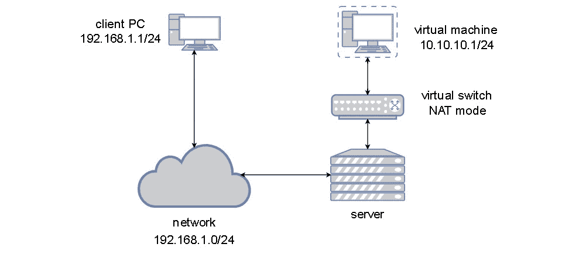

图 4.1 - libvirt NAT 模式下的网络

从虚拟机的角度来看，它愉快地坐在一个完全独立的网络段中（因此有`192.168.122.210`和`220` IP 地址），并使用虚拟网络交换机作为访问外部网络的网关。它不必担心任何额外的路由，因为这就是我们使用 NAT 的原因之一-简化端点路由。

## Libvirt 路由网络

第二种网络类型是路由网络，基本上意味着我们的虚拟机通过虚拟交换机直接连接到物理网络。这意味着我们的虚拟机与物理主机处于相同的第 2/3 层网络中。这种类型的网络连接经常被使用，因为通常情况下，没有必要在环境中访问虚拟机时使用单独的 NAT 网络。在某种程度上，这只会使一切变得更加复杂，特别是因为您必须配置路由以了解您用于虚拟机的 NAT 网络。在使用路由模式时，虚拟机位于与下一个物理设备*相同*的网络段中。以下图表对路由网络有很好的解释：

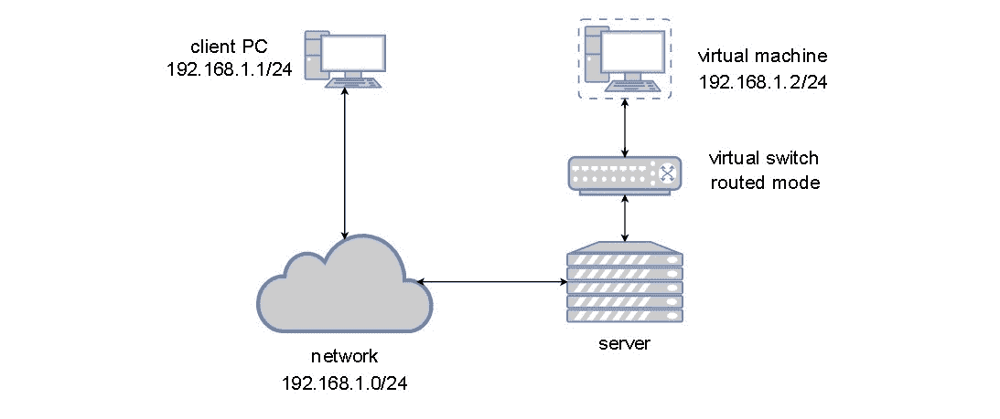

图 4.2 - libvirt 路由模式下的网络

现在我们已经介绍了最常用的两种虚拟机网络场景，是时候介绍第三种了，这种情况似乎有点模糊。如果我们配置一个没有*上行*（这意味着它没有物理网络卡连接到它）的虚拟交换机，那么该虚拟交换机根本无法将流量发送到物理网络。剩下的只是在该交换机本身的限制内进行通信，因此称为*隔离*。让我们现在创建这个难以捉摸的隔离网络。

## Libvirt 隔离网络

在这种情况下，连接到同一隔离交换机的虚拟机可以彼此通信，但它们无法与它们运行的主机之外的任何东西通信。我们之前用“模糊”一词来描述这种情况，但实际上并不是 - 在某些方面，这实际上是一种*隔离*特定类型的流量的理想方式，以至于它甚至不会到达物理网络。

这样想吧 - 假设你有一个托管 Web 服务器的虚拟机，例如运行 WordPress。您创建了两个虚拟交换机：一个运行路由网络（直接连接到物理网络），另一个是隔离的。然后，您可以为 WordPress 虚拟机配置两个虚拟网络卡，第一个连接到路由虚拟交换机，第二个连接到隔离虚拟交换机。WordPress 需要一个数据库，所以您创建另一个虚拟机并配置它仅使用内部虚拟交换机。然后，您使用该隔离虚拟交换机来*隔离*Web 服务器和数据库服务器之间的流量，以便 WordPress 通过该交换机连接到数据库服务器。通过这样配置虚拟机基础设施，您得到了什么？您有一个双层应用程序，而该 Web 应用程序的最重要部分（数据库）无法从外部访问。看起来并不是一个坏主意，对吧？

隔离的虚拟网络在许多其他与安全相关的场景中使用，但这只是一个我们可以轻松识别的示例场景。

让我们用图表描述我们的隔离网络：

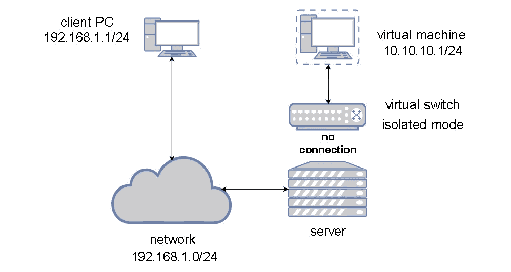

图 4.3 - libvirt 隔离模式下的网络

本书的上一章（*第三章*，*安装 KVM Hypervisor、libvirt 和 ovirt*）提到了*默认*网络，我们说我们稍后会谈论这个。现在似乎是一个合适的时机，因为现在我们已经有足够的信息来描述默认网络配置是什么。

当我们像在*第三章*中所做的那样安装所有必要的 KVM 库和实用程序，*安装 KVM Hypervisor、libvirt 和 oVirt*，默认的虚拟交换机会被自动配置。这样做的原因很简单 - 预先配置一些东西更加用户友好，这样用户就可以开始创建虚拟机并将它们连接到默认网络，而不是期望用户也配置这一点。VMware 的 vSphere hypervisor 也是如此（默认交换机称为 vSwitch0），Hyper-V 在部署过程中要求我们配置第一个虚拟交换机（实际上我们可以跳过并稍后配置）。因此，这只是一个众所周知的、标准化的、已建立的场景，使我们能够更快地开始创建我们的虚拟机。

默认虚拟交换机以 NAT 模式工作，DHCP 服务器处于活动状态，再次，这样做的原因很简单 - 客户操作系统默认预配置了 DHCP 网络配置，这意味着我们刚刚创建的虚拟机将轮询网络以获取必要的 IP 配置。这样，虚拟机就可以获得所有必要的网络配置，我们可以立即开始使用它。

以下图表显示了默认的 KVM 网络的功能：

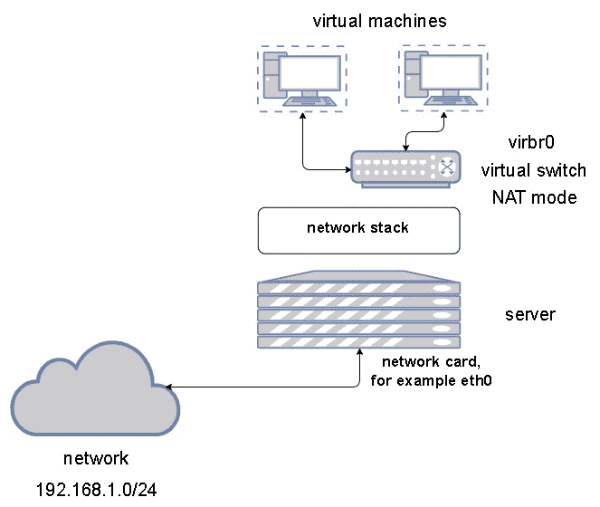

图 4.4 - libvirt 默认 NAT 模式网络

现在，让我们学习如何从 shell 和 GUI 中配置这些类型的虚拟网络概念。我们将把这个过程视为一个需要按顺序完成的过程：

1.  让我们首先将默认网络配置导出为 XML，以便我们可以将其用作创建新网络的模板：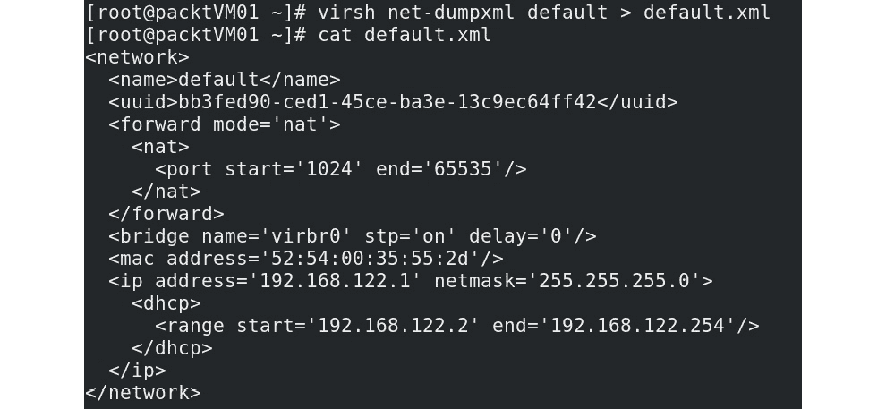

图 4.5 - 导出默认虚拟网络配置

1.  现在，让我们将该文件复制到一个名为`packtnat.xml`的新文件中，编辑它，然后使用它来创建一个新的 NAT 虚拟网络。然而，在这之前，我们需要生成两样东西 - 一个新的对象 UUID（用于我们的新网络）和一个唯一的 MAC 地址。可以使用`uuidgen`命令从 shell 中生成一个新的 UUID，但生成 MAC 地址有点棘手。因此，我们可以使用红帽网站上提供的标准红帽建议方法：[`access.redhat.com/documentation/en-us/red_hat_enterprise_linux/6/html/virtualization_administration_guide/sect-virtualization-tips_and_tricks-generating_a_new_unique_mac_address`](https://access.redhat.com/documentation/en-us/red_hat_enterprise_linux/6/html/virtualization_administration_guide/sect-virtualization-tips_and_tricks-generating_a_new_unique_mac_address)。通过使用该 URL 上可用的第一段代码，创建一个新的 MAC 地址（例如，`00:16:3e:27:21:c1`）。

通过使用`yum`命令，安装 python2：

```
virbr1). Now, we can complete the configuration of our new virtual machine network XML file: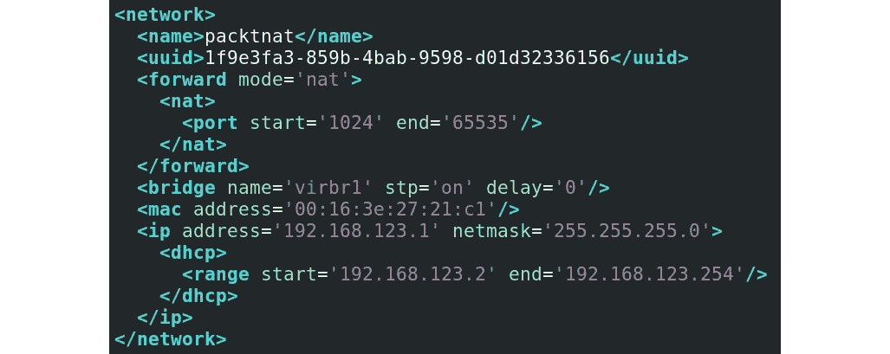Figure 4.6 – New NAT network configurationThe next step is importing this configuration.
```

1.  现在，我们可以使用`virsh`命令导入该配置并创建我们的新虚拟网络，启动该网络并使其永久可用，并检查是否一切加载正确：

```
virsh net-define packtnat.xml
virsh net-start packtnat
virsh net-autostart packtnat
virsh net-list
```

鉴于我们没有删除默认虚拟网络，最后一个命令应该给我们以下输出：

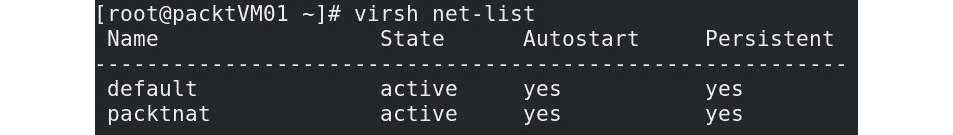

图 4.7 - 使用 virsh net-list 检查 KVM 主机上有哪些虚拟网络

现在，让我们创建另外两个虚拟网络 - 一个桥接网络和一个隔离网络。同样，让我们使用文件作为模板来创建这两个网络。请记住，为了能够创建一个桥接网络，我们需要一个物理网络适配器，因此我们需要在服务器上有一个可用的物理适配器。在我们的服务器上，该接口被称为`ens224`，而名为`ens192`的接口被默认的 libvirt 网络使用。因此，让我们创建两个配置文件，分别称为`packtro.xml`（用于我们的路由网络）和`packtiso.xml`（用于我们的隔离网络）：

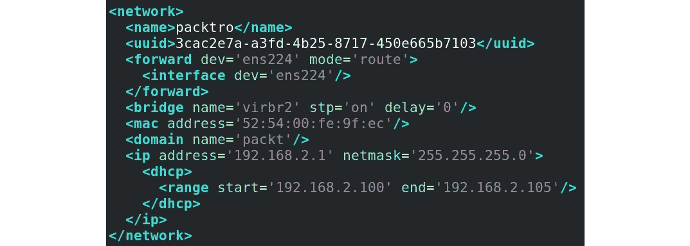

图 4.8 - libvirt 路由网络定义

在这个特定的配置中，我们使用`ens224`作为路由虚拟网络的上行链路，该虚拟网络将使用与`ens224`连接的物理网络相同的子网（`192.168.2.0/24`）：

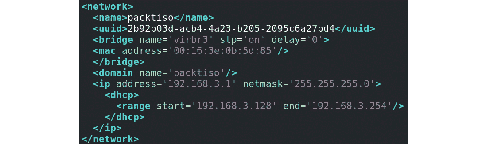

图 4.9 - libvirt 隔离网络定义

为了确保万无一失，我们也可以使用虚拟机管理器 GUI 来配置所有这些，因为该应用程序也有一个用于创建虚拟网络的向导。但是当我们谈论更大的环境时，导入 XML 是一个更简单的过程，即使我们忘记了很多 KVM 虚拟化主机根本没有安装 GUI。

到目前为止，我们已经讨论了整体主机级别的虚拟网络。然而，还有一种不同的方法来处理这个主题 - 使用虚拟机作为我们可以向其添加虚拟网络适配器并将其连接到虚拟网络的对象。我们可以使用`virsh`来实现这一目的。因此，举个例子，我们可以将名为`MasteringKVM01`的虚拟机连接到一个隔离的虚拟网络：

```
virsh attach-interface --domain MasteringKVM01 --source isolated --type network --model virtio --config --live
```

还有其他概念允许虚拟机连接到物理网络，其中一些我们将在本章后面讨论（如 SR-IOV）。然而，现在我们已经介绍了通过虚拟交换/桥接将虚拟机连接到物理网络的基本方法，我们需要变得更加技术化。问题是，在连接虚拟机到虚拟交换中涉及更多的概念，比如 TAP 和 TUN，我们将在接下来的部分中进行介绍。

# 使用 TAP 和 TUN 设备进行用户空间网络连接

在*第一章*，*理解 Linux 虚拟化*中，我们使用`virt-host-validate`命令对主机的 KVM 虚拟化准备情况进行了一些预检查。作为该过程的一部分，一些检查包括检查以下设备是否存在：

+   `/dev/kvm`：KVM 驱动程序在主机上创建了一个`/dev/kvm`字符设备，以便为虚拟机提供直接硬件访问。没有这个设备意味着虚拟机将无法访问物理硬件，尽管它在 BIOS 中已启用，这将显著降低虚拟机的性能。

+   `/dev/vhost-net`：在主机上将创建`/dev/vhost-net`字符设备。该设备用作配置`vhost-net`实例的接口。没有这个设备会显著降低虚拟机的网络性能。

+   `/dev/net/tun`：这是另一个用于创建 TUN/TAP 设备以为虚拟机提供网络连接的字符特殊设备。TUN/TAP 设备将在以后的章节中详细解释。现在只需理解，拥有一个字符设备对于 KVM 虚拟化正常工作是很重要的。

让我们专注于最后一个设备，TUN 设备，通常会伴随着一个 TAP 设备。

到目前为止，我们所涵盖的所有概念都包括与物理网络卡的某种连接，隔离的虚拟网络是一个例外。但即使是隔离的虚拟网络对于我们的虚拟机来说也只是一个虚拟网络。当我们需要在用户空间进行通信时会发生什么，比如在服务器上运行的应用之间？将它们通过某种虚拟交换概念或常规桥接连接起来将会带来额外的开销。这就是 TUN/TAP 设备的作用，为用户空间程序提供数据包流。很容易，应用程序可以打开`/dev/net/tun`并使用`ioctl()`函数在内核中注册一个网络设备，然后它会呈现为一个 tunXX 或 tapXX 设备。当应用程序关闭文件时，它创建的网络设备和路由会消失（如内核`tuntap.txt`文档中所述）。因此，这只是 Linux 操作系统支持的一种虚拟网络接口类型，可以向其添加 IP 地址和路由，以便应用程序的流量可以通过它路由，而不是通过常规网络设备。

TUN 通过创建通信隧道来模拟 L3 设备，类似于点对点隧道。当 tuntap 驱动程序配置为 tun 模式时，它会被激活。激活后，从描述符（配置它的应用程序）接收到的任何数据都将以常规 IP 数据包的形式传输（作为最常用的情况）。同样，当发送数据时，它会被写入 TUN 设备作为常规 IP 数据包。这种类型的接口有时用于测试、开发和模拟调试目的。

TAP 接口基本上模拟 L2 以太网设备。当 tuntap 驱动程序以 tap 模式配置时，它会被激活。当您激活它时，与 TUN 接口（第 3 层）不同，您会获得第 2 层原始以太网数据包，包括 ARP/RARP 数据包和其他所有内容。基本上，我们谈论的是虚拟化的第 2 层以太网连接。

这些概念（特别是 TAP）也可用于 libvirt/QEMU，因为通过使用这些类型的配置，我们可以从主机到虚拟机创建连接 - 例如，没有 libvirt 桥/交换机。我们实际上可以配置 TUN/TAP 接口的所有必要细节，然后通过使用`kvm-qemu`选项将虚拟机连接到这些接口。因此，这是一个在虚拟化世界中有其位置的相当有趣的概念。当我们开始创建 Linux 桥接时，这尤其有趣。

# 实施 Linux 桥接

让我们创建一个桥接，然后将 TAP 设备添加到其中。在这样做之前，我们必须确保桥接模块已加载到内核中。让我们开始吧：

1.  如果未加载，请使用`modprobe bridge`加载模块：

```
tester:

```

# brctl show 命令将列出服务器上所有可用的桥接以及一些基本信息，例如桥接的 ID、生成树协议（STP）状态以及连接到其上的接口。在这里，测试器桥没有任何接口连接到其虚拟端口。

```

```

1.  Linux 桥接也将显示为网络设备。要查看桥接测试器的网络详细信息，请使用`ip`命令：

```
ifconfig to check and configure the network settings for a Linux bridge; ifconfig is relatively easy to read and understand but not as feature-rich as the ip command:

```

# ifconfig tester

测试器：flags=4098<BROADCAST,MULTICAST>mtu 1500

ether26:84:f2:f8:09:e0txqueuelen 1000（以太网）

RX 数据包 0 字节 0（0.0 B）

RX 错误 0 丢弃 0 超限 0 帧 0

TX 数据包 0 字节 0（0.0 B）

TX 错误 0 丢弃 0 超限 0 载波 0 冲突 0

```

The Linux bridge tester is now ready. Let's create and add a TAP device to it. 
```

1.  首先，检查 TUN/TAP 设备模块是否加载到内核中。如果没有，您已经知道该怎么做：

```
vm-vnic:

```

测试器和名为 vm-vnic 的 tap 设备。让我们将 vm-vnic 添加到 tester：

```
# brctl addif tester vm-vnic
# brctl show
bridge name bridge id STP enabled interfaces
tester 8000.460a80dd627d no vm-vnic
```

```

```

在这里，您可以看到`vm-vnic`是添加到`tester`桥的接口。现在，`vm-vnic`可以作为您的虚拟机和`tester`桥之间的接口，从而使虚拟机能够与添加到此桥的其他虚拟机进行通信：

图 4.10 - 连接到虚拟交换机（桥接）的虚拟机

](img/B14834_04_10.jpg)

图 4.10 - 连接到虚拟交换机（桥接）的虚拟机

您可能还需要删除在上一个过程中创建的所有对象和配置。让我们通过命令行逐步进行：

1.  首先，我们需要从`tester`桥中删除`vm-vnic` tap 设备：

```
vm-vnic has been removed from the bridge, remove the tap device using the ip command:

```

# ip tuntap del dev vm-vnic mode tap

```

```

1.  然后，删除测试器桥：

```
# brctl delbr tester
```

这些是 libvirt 在后端执行的相同步骤，用于启用或禁用虚拟机的网络。在继续之前，我们希望您彻底了解此过程。现在我们已经介绍了 Linux 桥接，是时候转向一个更高级的概念，称为 Open vSwitch。

# 配置 Open vSwitch

想象一下，你在一家小公司工作，有三到四个 KVM 主机，几个网络附加存储设备来托管他们的 15 台虚拟机，并且你从一开始就被公司雇佣。因此，您已经见证了一切 - 公司购买了一些服务器、网络交换机、电缆和存储设备，并且您是建立该环境的一小部分人员团队。经过 2 年的过程，您已经意识到一切都运作正常，维护简单，并且没有给您带来太多烦恼。

现在，想象一下，你的一个朋友在一家拥有 400 个 KVM 主机和近 2000 台虚拟机的大型企业公司工作，他们需要管理的工作与你在你的小公司的舒适椅子上所做的工作相同。

你认为你的朋友能否通过使用与你相同的工具来管理他或她的环境？使用 XML 文件进行网络交换机配置，从可引导的 USB 驱动器部署服务器，手动配置一切，并有时间这样做？这对你来说可能吗？

在第二种情况中有两个基本问题：

+   环境的规模：这一点更为明显。由于环境的规模，您需要一种在中央进行管理的概念，而不是在主机级别进行管理，比如我们迄今讨论过的虚拟交换机。

+   公司政策：这些通常规定尽可能从配置标准化中获得的一些合规性。现在，我们可以同意我们可以通过 Ansible，Puppet 或类似工具脚本化一些配置更新，但有什么用呢？每次我们需要对 KVM 网络进行更改时，我们都必须创建新的配置文件，新的流程和新的工作簿。大公司对此持负面态度。

所以，我们需要的是一个可以跨越多个主机并提供配置一致性的集中式网络对象。在这种情况下，配置一致性为我们带来了巨大的优势 - 我们在这种类型的对象中引入的每个更改都将被复制到所有属于这个集中式网络对象的主机。换句话说，我们需要的是**Open vSwitch**（**OVS**）。对于那些更熟悉基于 VMware 的网络的人来说，我们可以使用一个近似的隐喻 - 对于基于 KVM 的环境，Open vSwitch 类似于 vSphere 分布式交换机对于基于 VMware 的环境。

在技术方面，OVS 支持以下内容：

+   VLAN 隔离（IEEE 802.1Q）

+   流量过滤

+   具有或不具有 LACP 的 NIC 绑定

+   各种覆盖网络 - VXLAN，GENEVE，GRE，STT 等

+   802.1ag 支持

+   Netflow，sFlow 等

+   （R）SPAN

+   OpenFlow

+   OVSDB

+   流量排队和整形

+   Linux，FreeBSD，NetBSD，Windows 和 Citrix 支持（以及其他许多）

现在我们已经列出了一些支持的技术，让我们讨论一下 Open vSwitch 的工作方式。

首先，让我们谈谈 Open vSwitch 的架构。 Open vSwitch 的实现分为两部分：Open vSwitch 内核模块（数据平面）和用户空间工具（控制平面）。由于传入的数据包必须尽快处理，因此 Open vSwitch 的数据平面被推到了内核空间：

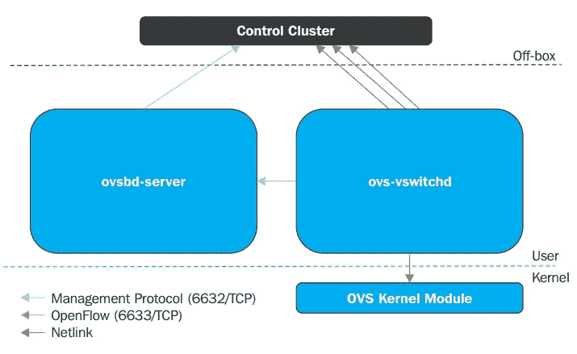

图 4.11 - Open vSwitch 架构

数据路径（OVS 内核模块）使用 netlink 套接字与 vswitchd 守护程序进行交互，在本地系统上实现和管理任意数量的 OVS 交换机。

Open vSwitch 没有特定的 SDN 控制器用于管理目的，类似于 VMware 的 vSphere 分布式交换机和 NSX，它们有 vCenter 和各种 NSX 组件来管理它们的功能。在 OVS 中，重点是使用其他人的 SDN 控制器，然后使用 OpenFlow 协议与 ovs-vswitchd 进行交互。ovsdb-server 维护交换机表数据库，外部客户端可以使用 JSON-RPC 与 ovsdb-server 进行通信；JSON 是数据格式。ovsdb 数据库目前包含大约 13 个表，并且此数据库在重新启动时是持久的。

Open vSwitch 有两种模式：正常模式和流模式。本章将主要集中讨论如何在独立/正常模式下启动连接到 Open vSwitch 桥的 KVM VM，并简要介绍使用 OpenDaylight 控制器的流模式：

+   **正常模式**：交换和转发由 OVS 桥处理。在这种模式下，OVS 充当 L2 学习交换机。当为目标配置多个覆盖网络而不是操纵交换机流时，此模式特别有用。

+   `ctl`命令。此模式允许更高级别的抽象和自动化；SDN 控制器公开了 REST API。我们的应用程序可以利用此 API 直接操纵桥接的流量以满足网络需求。

让我们继续实际操作，学习如何在 CentOS 8 上安装 Open vSwitch：

1.  我们必须做的第一件事是告诉系统使用适当的存储库。在这种情况下，我们需要启用名为`epel`和`centos-release-openstack-train`的存储库。我们可以通过使用一些`yum`命令来实现：

```
yum -y install epel-release
yum -y install centos-release-openstack-train
```

1.  下一步将从 Red Hat 的存储库安装`openvswitch`：

```
dnf install openvswitch -y
```

1.  安装过程完成后，我们需要通过启动和启用 Open vSwitch 服务并运行`ovs-vsctl -V`命令来检查一切是否正常工作：

```
2.11.0 and DB schema 7.16.1.
```

1.  现在我们已经成功安装并启动了 Open vSwitch，现在是时候对其进行配置了。让我们选择一个部署方案，在该方案中，我们将使用 Open vSwitch 作为虚拟机的新虚拟交换机。在我们的服务器中，我们还有另一个名为`ens256`的物理接口，我们将使用它作为 Open vSwitch 虚拟交换机的上行。我们还将清除 ens256 的配置，为我们的 OVS 配置 IP 地址，并使用以下命令启动 OVS：

```
ovs-vsctl add-br ovs-br0
ip addr flush dev ens256
ip addr add 10.10.10.1/24 dev ovs-br0
ovs-vsctl add-port ovs-br0 ens256
ip link set dev ovs-br0 up
```

1.  现在一切都配置好了，但还没有持久化，我们需要使配置持久化。这意味着配置一些网络接口配置文件。因此，转到`/etc/sysconfig/network-scripts`并创建两个文件。将其中一个命名为`ifcfg-ens256`（用于我们的上行接口）：

```
ifcfg-ovs-br0 (for our OVS):

```

DEVICE=ovs-br0

DEVICETYPE=ovs

TYPE=OVSBridge

BOOTPROTO=static

IPADDR=10.10.10.1

NETMASK=255.255.255.0

GATEWAY=10.10.10.254

ONBOOT=yes

```

```

1.  我们不是为了展示而配置所有这些，因此我们需要确保我们的 KVM 虚拟机也能够使用它。这意味着我们需要创建一个将使用 OVS 的 KVM 虚拟网络。幸运的是，我们之前已经处理过 KVM 虚拟网络 XML 文件（查看*Libvirt 隔离网络*部分），因此这不会成为问题。让我们将我们的网络命名为`packtovs`，其对应的 XML 文件命名为`packtovs.xml`。它应该包含以下内容：

```
<network>
<name>packtovs</name>
<forward mode='bridge'/>
<bridge name='ovs-br0'/>
<virtualport type='openvswitch'/>
</network>
```

因此，现在，当我们在 XML 文件中有一个虚拟网络定义时，我们可以执行我们通常的操作，即定义、启动和自动启动网络：

```
virsh net-define packtovs.xml
virsh net-start packtovs
virsh net-autostart packtovs
```

如果我们在创建虚拟网络时保持一切不变，那么`virsh net-list`的输出应该是这样的：

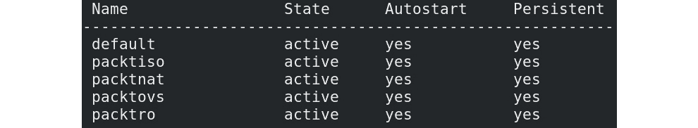

图 4.12–成功的 OVS 配置和 OVS+KVM 配置

现在剩下的就是将 VM 连接到我们新定义的基于 OVS 的网络`packtovs`，然后我们就可以放心了。或者，我们可以创建一个新的，并使用我们在*第三章*中获得的知识预先将其连接到特定接口。因此，让我们发出以下命令，其中只有两个更改的参数（`--name`和`--network`）：

```
virt-install --virt-type=kvm --name MasteringKVM03 --vcpus 2 --ram 4096 --os-variant=rhel8.0 --cdrom=/var/lib/libvirt/images/CentOS-8-x86_64-1905-dvd1.iso --network network:packtovs --graphics vnc --disk size=16
```

虚拟机安装完成后，我们连接到基于 OVS 的`packtovs`虚拟网络，并且我们的虚拟机可以使用它。假设需要进行额外配置，并且我们收到了一个请求，要求标记来自该虚拟机的流量为`VLAN ID 5`。启动虚拟机并使用以下一组命令：

```
ovs-vsctl list-ports ovs-br0
ens256
vnet0
```

此命令告诉我们，我们正在使用`ens256`端口作为上行，并且我们的虚拟机`MasteringKVM03`正在使用虚拟`vnet0`网络端口。我们可以使用以下命令对该端口应用 VLAN 标记：

```
ovs-vsctl set port vnet0 tag=5
```

由于 OVS 的管理和管理是通过 CLI 完成的，我们需要注意一些与 OVS 管理相关的附加命令。因此，以下是一些常用的 OVS CLI 管理命令：

+   `#ovs-vsctl show`：一个非常方便和经常使用的命令。它告诉我们交换机当前运行的配置是什么。

+   `#ovs-vsctl list-br`：列出在 Open vSwitch 上配置的桥接。

+   `#ovs-vsctl list-ports <bridge>`：显示`BRIDGE`上所有端口的名称。

+   `#ovs-vsctl list interface <bridge>`：显示`BRIDGE`上所有接口的名称。

+   `#ovs-vsctl add-br <bridge>`：在交换机数据库中创建一个桥接。

+   `#ovs-vsctl add-port <bridge> : <interface>`：将接口（物理或虚拟）绑定到 Open vSwitch 桥接。

+   `#ovs-ofctl 和 ovs-dpctl`：这两个命令用于管理和监视流条目。您了解到 OVS 管理两种流：OpenFlows 和 Datapath。第一种是在控制平面中管理的，而第二种是基于内核的流。

+   `#ovs-ofctl`：这是针对 OpenFlow 模块的，而`ovs-dpctl`则是针对内核模块的。

以下示例是每个命令的最常用选项：

+   `#ovs-ofctl show <BRIDGE>`：显示有关交换机的简要信息，包括端口号到端口名称的映射。

+   `#ovs-ofctl dump-flows <Bridge>`：检查 OpenFlow 表。

+   `#ovs-dpctl show`：打印有关交换机上存在的所有逻辑数据路径（称为*桥接*）的基本信息。

+   `#ovs-dpctl dump-flows`：显示在数据路径中缓存的流。

+   `ovs-appctl`：此命令提供了一种向运行中的 Open vSwitch 发送命令并收集`ovs-ofctl`命令未直接暴露的信息的方法。这是 OpenFlow 故障排除的瑞士军刀。

+   `#ovs-appctl bridge/dumpflows <br>`：检查流表并为同一主机上的 VM 提供直接连接。

+   `#ovs-appctl fdb/show <br>`：列出学习到的 MAC/VLAN 对。

此外，您还可以始终使用`ovs-vsctl show`命令获取有关 OVS 交换机配置的信息：


图 4.13 – ovs-vsctl 显示输出

我们将在*第十二章*中回到 Open vSwitch 的主题，*使用 OpenStack 扩展 KVM*，当我们更深入地讨论跨多个主机跨 Open vSwitch 的情况时，特别是在考虑到我们希望能够跨多个主机和站点扩展我们的云覆盖网络（基于 GENEVE、VXLAN、GRE 或类似协议）的情况。

## 其他 Open vSwitch 用例

正如您可能想象的那样，Open vSwitch 不仅仅是 libvirt 或 OpenStack 的一个方便的概念——它也可以用于各种其他场景。让我们描述其中的一个，因为对于研究 VMware NSX 或 NSX-T 集成的人来说，这可能很重要。

让我们在这里只描述一些基本术语和关系。VMware 的 NSX 是一种基于 SDN 的技术，可用于各种用例：

+   连接数据中心，跨数据中心边界扩展云覆盖网络。

+   各种灾难恢复场景。NSX 可以在灾难恢复、多站点环境以及与各种外部服务和设备集成方面提供大量帮助（Palo Alto PANs）。

+   一致的微分段，跨站点，在虚拟机网络卡级别上以*正确的方式*完成。

+   出于安全目的，从不同类型的支持的 VPN 技术连接站点和终端用户，到分布式防火墙、客户端内省选项（防病毒和反恶意软件）、网络内省选项（IDS/IPS）等各种灾难恢复场景。

+   用于负载平衡，直到第 7 层，具有 SSL 卸载、会话持久性、高可用性、应用规则等。

是的，VMware 对 SDN（NSX）和 Open vSwitch 的看法在市场上看起来像是*竞争技术*，但实际上，有很多客户希望同时使用两者。这就是 VMware 与 OpenStack 集成以及 NSX 与基于 Linux 的 KVM 主机集成（通过使用 Open vSwitch 和额外的代理）非常方便的地方。再进一步解释一下这些观点 - NSX 有一些需要*广泛*使用基于 Open vSwitch 的技术 - 通过 Open vSwitch 数据库进行硬件 VTEP 集成，通过使用 Open vSwitch/NSX 集成将 GENEVE 网络扩展到 KVM 主机，等等。

想象一下，你在为一个服务提供商工作 - 一个云服务提供商，一个 ISP；基本上，任何具有大量网络分割的大型网络的公司。有很多服务提供商使用 VMware 的 vCloud Director 为最终用户和公司提供云服务。然而，由于市场需求，这些环境通常需要扩展到包括 AWS（通过公共云进行额外基础设施增长场景）或 OpenStack（创建混合云场景）。如果我们没有可能在这些解决方案之间实现互操作性，那么就没有办法同时使用这些提供。但从网络的角度来看，这个网络背景是 NSX 或 NSX-T（实际上*使用*了 Open vSwitch）。

多云环境的未来已经很清楚多年了，这些类型的集成将带来更多的客户；他们将希望在他们的云服务设计中利用这些选项。未来的发展也很可能包括（并且已经部分包括）与 Docker、Kubernetes 和/或 OpenShift 的集成，以便能够在同一环境中管理容器。

还有一些更极端的例子使用硬件 - 在我们的例子中，我们谈论的是以*分区*方式使用 PCI Express 总线上的网络卡。目前，我们对这个概念 SR-IOV 的解释将局限于网络卡，但当我们开始讨论在虚拟机中使用分区 GPU 时，我们将在*第六章*中扩展相同的概念，*虚拟显示设备和协议*。因此，让我们讨论一下在支持它的 Intel 网络卡上使用 SR-IOV 的实际例子。

# 理解和使用 SR-IOV

SR-IOV 的概念是我们在*第二章*中已经提到的，*KVM 作为虚拟化解决方案*。通过利用 SR-IOV，我们可以将 PCI 资源（例如，网络卡）*分区*为虚拟 PCI 功能，并将它们注入到虚拟机中。如果我们将这个概念用于网络卡，通常是出于一个目的 - 那就是我们可以避免使用操作系统内核和网络堆栈，同时访问虚拟机中的网络接口卡。为了能够做到这一点，我们需要硬件支持，因此我们需要检查我们的网络卡是否实际支持它。在物理服务器上，我们可以使用`lspci`命令提取有关我们的 PCI 设备的属性信息，然后使用`grep`命令将*Single Root I/O Virtualization*作为一个字符串来尝试查看我们是否有兼容的设备。这是我们服务器的一个例子：


图 4.14 – 检查我们的系统是否兼容 SR-IOV

重要说明

在配置 SR-IOV 时要小心。您需要具有支持它的服务器、支持它的设备，并且必须确保您在 BIOS 中打开了 SR-IOV 功能。然后，您需要记住，有些服务器只分配了特定的插槽用于 SR-IOV。我们使用的服务器（HP Proliant DL380p G8）将三个 PCI-Express 插槽分配给 CPU1，但是 SR-IOV 仅在插槽＃1 中起作用。当我们将我们的卡连接到插槽＃2 或＃3 时，我们收到了一个 BIOS 消息，指出 SR-IOV 在该插槽中不起作用，并且我们应该将我们的卡移动到支持 SR-IOV 的插槽。因此，请务必彻底阅读服务器的文档，并将 SR-IOV 兼容设备连接到正确的 PCI-Express 插槽。

在这种特定情况下，这是一个具有两个端口的英特尔 10 千兆网络适配器，我们可以使用它来执行 SR-IOV。该过程并不那么困难，它要求我们完成以下步骤：

1.  从先前的模块中解绑。

1.  将其注册到 Linux 内核堆栈中可用的 vfio-pci 模块。

1.  配置将使用它的客户端。

因此，您要做的是通过使用`modprobe -r`卸载网卡当前正在使用的模块。然后，您会再次加载它，但是通过分配一个附加参数。在我们特定的服务器上，我们使用的英特尔双端口适配器（X540-AT2）被分配给了`ens1f0`和`ens1f1`网络设备。因此，让我们以`ens1f0`作为启动时 SR-IOV 配置的示例：

1.  我们需要做的第一件事（作为一个一般概念）是找出我们的网卡正在使用哪个内核模块。为此，我们需要发出以下命令：

```
modinfo command (we're only interested in the parm part of the output):

```

在这里使用 ixgbe 模块，我们可以执行以下操作：

```
modprobe -r ixgbe
modprobe ixgbe max_vfs=4
```

```

```

1.  然后，我们可以使用`modprobe`系统通过在`/etc/modprobe.d`中创建一个名为（例如）`ixgbe.conf`的文件，并向其中添加以下行来使这些更改在重新启动时保持永久：

```
options ixgbe max_vfs=4
```

这将为我们提供最多四个虚拟功能，我们可以在虚拟机内使用。现在，我们需要解决的下一个问题是如何在服务器启动时激活 SR-IOV。这里涉及了相当多的步骤，所以让我们开始吧：

1.  我们需要将`iommu`和`vfs`参数添加到默认内核引导行和默认内核配置中。因此，首先打开`/etc/default/grub`并编辑`GRUB_CMDLINE_LINUX`行，添加`intel_iommu=on`（如果您使用的是 AMD 系统，则添加`amd_iommu=on`）和`ixgbe.max_vfs=4`。

1.  我们需要重新配置`grub`以使用此更改，因此我们需要使用以下命令：

```
grub2-mkconfig -o /boot/grub2/grub.cfg
```

1.  有时，即使这样还不够，因此我们需要配置必要的内核参数，例如虚拟功能的最大数量和服务器上要使用的`iommu`参数。这导致我们使用以下命令：

```
grubby --update-kernel=ALL --args="intel_iommu=on ixgbe.max_vfs=4"
```

重新启动后，我们应该能够看到我们的虚拟功能。输入以下命令：

```
lspci -nn | grep "Virtual Function"
```

我们应该得到以下类似的输出：

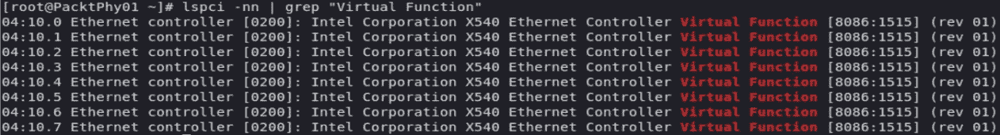

图 4.15 - 检查虚拟功能可见性

我们应该能够从 libvirt 中看到这些虚拟功能，并且我们可以通过`virsh`命令进行检查。让我们尝试一下（我们使用`grep 04`，因为我们的设备 ID 以 04 开头，这在前面的图像中可见；我们将缩小输出以仅包含重要条目）：

```
virsh nodedev-list | grep 04 
……
pci_0000_04_00_0
pci_0000_04_00_1
pci_0000_04_10_0
pci_0000_04_10_1
pci_0000_04_10_2
pci_0000_04_10_3
pci_0000_04_10_4
pci_0000_04_10_5
pci_0000_04_10_6
pci_0000_04_10_7
```

前两个设备是我们的物理功能。其余的八个设备（两个端口乘以四个功能）是我们的虚拟设备（从`pci_0000_04_10_0`到`pci_0000_04_10_7`）。现在，让我们使用`virsh nodedev-dumpxml pci_0000_04_10_0`命令来转储该设备的信息：

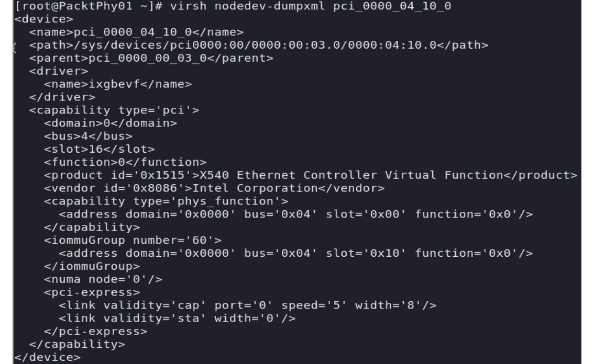

图 4.16 - 从 virsh 的角度查看虚拟功能信息

因此，如果我们有一个正在运行的虚拟机，我们想要重新配置以使用此功能，我们需要创建一个 XML 文件，其定义看起来像这样（让我们称其为`packtsriov.xml`）：

```
<interface type='hostdev' managed='yes' >
    <source>
    <address type='pci' domain='0x0000' bus='0x04' slot='0x10' function='0x0'>
    </address>
    </source>
</interface>
```

当然，域、总线、插槽和功能需要准确指向我们的 VF。然后，我们可以使用`virsh`命令将该设备附加到我们的虚拟机（例如`MasteringKVM03`）：

```
virsh attach-device MasteringKVM03 packtsriov.xml --config
```

当我们使用`virsh dumpxml`时，现在应该看到输出的一部分以`<driver name='vfio'/>`开头，以及我们在上一步中配置的所有信息（地址类型、域、总线、插槽、功能）。我们的虚拟机应该没有问题使用这个虚拟功能作为网络卡。

现在，是时候介绍另一个在 KVM 网络中非常有用的概念了：macvtap。这是一个较新的驱动程序，应该通过一个模块完全消除 tun/tap 和桥接驱动程序来简化我们的虚拟化网络。

# 理解 macvtap

这个模块的工作方式类似于 tap 和 macvlan 模块的组合。我们已经解释了 tap 模块的功能。macvlan 模块使我们能够创建虚拟网络，这些网络固定在物理网络接口上（通常，我们称这个接口为*lower*接口或设备）。结合 tap 和 macvlan 使我们能够在**虚拟以太网端口聚合器**（**VEPA**）、桥接、私有和透传四种不同的操作模式之间进行选择。

如果我们使用 VEPA 模式（默认模式），物理交换机必须通过支持`hairpin`模式（也称为反射中继）来支持 VEPA。当一个*lower*设备从 VEPA 模式 macvlan 接收数据时，这个流量总是发送到上游设备，这意味着流量总是通过外部交换机进行传输。这种模式的优势在于虚拟机之间的网络流量在外部网络上变得可见，这对于各种原因可能是有用的。您可以查看以下一系列图表中的网络流量是如何工作的：

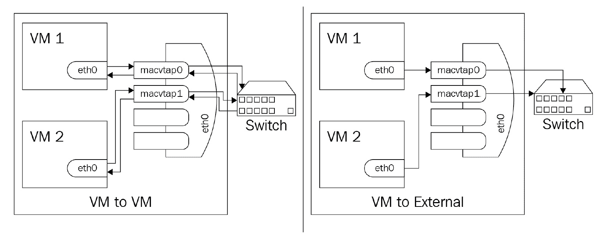

图 4.17 – macvtap VEPA 模式，流量被强制发送到外部网络

在私有模式下，它类似于 VEPA，因为所有的东西都会发送到外部交换机，但与 VEPA 不同的是，只有通过外部路由器或交换机发送的流量才会被传送。如果您想要将连接到端点的虚拟机相互隔离，但不隔离外部网络，可以使用这种模式。如果这听起来非常像私有 VLAN 场景，那么您是完全正确的：

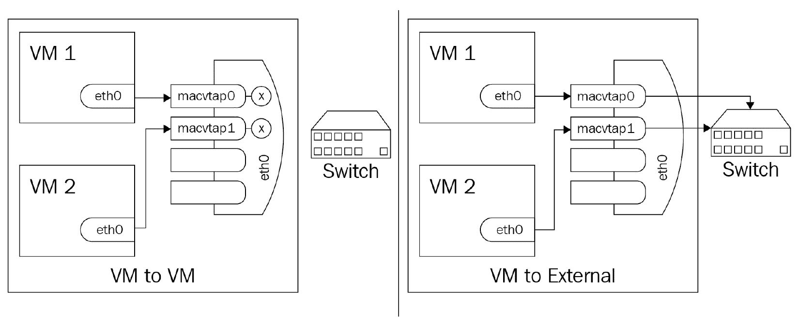

图 4.18 – macvtap 在私有模式下，用于内部网络隔离

在桥接模式下，接收到的数据在您的 macvlan 上，应该发送到同一较低设备上的另一个 macvlan，直接发送到目标，而不是外部发送，然后路由返回。这与 VMware NSX 在虚拟机应该在不同的 VXLAN 网络上进行通信时所做的非常相似，但是在同一主机上：

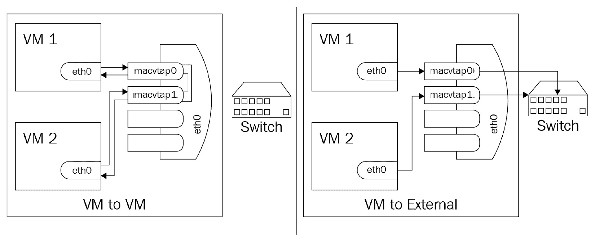

图 4.19 – macvtap 在桥接模式下，提供一种内部路由

在透传模式下，我们基本上在谈论 SR-IOV 场景，我们将 VF 或物理设备直接传递给 macvtap 接口。关键区别在于单个网络接口只能传递给单个客户（1:1 关系）：

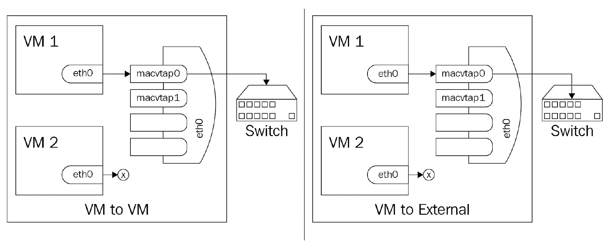

图 4.20 – macvtap 在透传模式下

在*第十二章*，*使用 OpenStack 扩展 KVM*和*第十三章*，*使用 AWS 扩展 KVM*中，我们将描述为什么虚拟化和*覆盖*网络（VXLAN、GRE、GENEVE）对于云网络非常重要，因为我们将我们的本地 KVM 环境扩展到云端，无论是通过 OpenStack 还是 AWS。

# 总结

在本章中，我们介绍了 KVM 中虚拟化网络的基础知识，并解释了为什么虚拟化网络是虚拟化的重要组成部分。我们深入研究了配置文件及其选项，因为这将是在较大环境中进行管理的首选方法，特别是在谈论虚拟化网络时。

请特别注意我们在本章中讨论的所有配置步骤，特别是与使用 virsh 命令来操作网络配置和配置 Open vSwitch 和 SR-IOV 相关的部分。基于 SR-IOV 的概念在延迟敏感的环境中被广泛使用，以提供具有最低可能开销和延迟的网络服务，这就是为什么这个原则对于与金融和银行业相关的各种企业环境非常重要。

既然我们已经涵盖了所有必要的网络场景（其中一些将在本书的后面重新讨论），现在是时候开始考虑虚拟化世界的下一个重要主题了。我们已经讨论了 CPU 和内存，以及网络，这意味着我们剩下了虚拟化的第四支柱：存储。我们将在下一章中讨论这个主题。

# 问题

1.  为什么虚拟交换机同时接受来自多个虚拟机的连接是重要的？

1.  虚拟交换机在 NAT 模式下是如何工作的？

1.  虚拟交换机在路由模式下是如何工作的？

1.  Open vSwitch 是什么，我们可以在虚拟化和云环境中用它来做什么？

1.  描述 TAP 和 TUN 接口之间的区别。

# 进一步阅读

有关本章内容的更多信息，请参考以下链接：

+   Libvirt 网络：[`wiki.libvirt.org/page/VirtualNetworking`](https://wiki.libvirt.org/page/VirtualNetworking)

+   网络 XML 格式：[`libvirt.org/formatnetwork.html`](https://libvirt.org/formatnetwork.html)

+   Open vSwitch：[`www.openvswitch.org/`](https://www.openvswitch.org/)

+   Open vSwitch 和 libvirt：[`docs.openvswitch.org/en/latest/howto/libvirt/`](http://docs.openvswitch.org/en/latest/howto/libvirt/)

+   Open vSwitch 速查表：[`adhioutlined.github.io/virtual/Openvswitch-Cheat-Sheet/`](https://adhioutlined.github.io/virtual/Openvswitch-Cheat-Sheet/)
