# 第五章：Libvirt 存储

这一章节为您提供了 KVM 使用存储的见解。具体来说，我们将涵盖运行虚拟机的主机内部存储和*共享存储*。不要让术语在这里让您困惑——在虚拟化和云技术中，术语*共享存储*表示多个虚拟化程序可以访问的存储空间。正如我们稍后将解释的那样，实现这一点的三种最常见方式是使用块级、共享级或对象级存储。我们将以 NFS 作为共享级存储的示例，以**Internet Small Computer System Interface**（**iSCSI**）和**Fiber Channel**（**FC**）作为块级存储的示例。在对象级存储方面，我们将使用 Ceph。GlusterFS 如今也被广泛使用，因此我们也会确保涵盖到它。为了将所有内容整合到一个易于使用和管理的框架中，我们将讨论一些可能在练习和创建测试环境时对您有所帮助的开源项目。

在本章中，我们将涵盖以下主题：

+   存储介绍

+   存储池

+   NFS 存储

+   iSCSI 和 SAN 存储

+   存储冗余和多路径处理

+   Gluster 和 Ceph 作为 KVM 的存储后端

+   虚拟磁盘映像和格式以及基本的 KVM 存储操作

+   存储的最新发展—NVMe 和 NVMeOF

# 存储介绍

与网络不同，大多数 IT 人员至少对网络有基本的了解，而存储往往是完全不同的。简而言之，是的，它往往更加复杂。涉及许多参数、不同的技术，而且……坦率地说，有许多不同类型的配置选项和强制执行这些选项的人。还有*很多*问题。以下是其中一些：

+   我们应该为每个存储设备配置一个 NFS 共享还是两个？

+   我们应该为每个存储设备创建一个 iSCSI 目标还是两个？

+   我们应该创建一个 FC 目标还是两个？

+   每个**逻辑单元号**（**LUN**）每个目标应该有多少个？

+   我们应该使用何种集群大小？

+   我们应该如何进行多路径处理？

+   我们应该使用块级还是共享级存储？

+   我们应该使用块级还是对象级存储？

+   我们应该选择哪种技术或解决方案？

+   我们应该如何配置缓存？

+   我们应该如何配置分区或掩码？

+   我们应该使用多少个交换机？

+   我们应该在存储级别使用某种集群技术吗？

正如你所看到的，问题不断堆积，而我们几乎只是触及了表面，因为还有关于使用哪种文件系统、使用哪种物理控制器来访问存储以及使用何种类型的布线等问题——这些问题变成了一个包含许多潜在答案的大杂烩。更糟糕的是，许多答案都可能是正确的，而不仅仅是其中一个。

让我们先把基本的数学问题解决掉。在企业级环境中，共享存储通常是环境中*最昂贵*的部分，同时也可能对虚拟机性能产生*最显著的负面影响*，同时又是该环境中*最过度订阅的资源*。让我们想一想这个问题——每个开机的虚拟机都会不断地向我们的存储设备发送 I/O 操作。如果我们在单个存储设备上运行了 500 台虚拟机，那么我们是不是对存储设备要求过高了？

与此同时，某种共享存储概念是虚拟化环境的关键支柱。基本原则非常简单——有许多高级功能可以通过共享存储更好地发挥作用。此外，如果有共享存储可用，许多操作会更快。更重要的是，如果我们的虚拟机存储和执行位置不在同一地方，那么高可用性的简单选项就有很多。

作为一个额外的好处，如果我们正确设计共享存储环境，我们可以轻松避免**单点故障**（**SPOF**）的情况。在企业级环境中，避免 SPOF 是关键设计原则之一。但是当我们开始将交换机、适配器和控制器添加到*购买*清单上时，我们的经理或客户通常会开始头痛。我们谈论性能和风险管理，而他们谈论价格。我们谈论他们的数据库和应用程序需要适当的 I/O 和带宽供应，而他们觉得你可以凭空产生这些。只需挥动魔术棒，我们就有了：无限的存储性能。

但是，你的客户肯定会试图强加给你的最好的、我们永远喜欢的苹果和橙子比较是这样的……“我的闪亮新款 1TB NVMe SSD 笔记本电脑的 IOPS 比你的 5 万美元的存储设备多 1000 倍，性能比你的存储设备多 5 倍，而成本却少 100 倍！你根本不知道你在做什么！”

如果你曾经有过这种经历，我们为你感到难过。很少会有这么多关于盒子里的一块硬件的讨论和争论。但它是一个如此重要的盒子里的硬件，这是一场很好的争论。因此，让我们解释一些 libvirt 在存储访问方面使用的关键概念，以及如何利用我们的知识从我们的存储系统和使用它的 libvirt 中尽可能多地提取性能。

在本章中，我们基本上将通过安装和配置示例涵盖几乎所有这些存储类型。每一种都有自己的用例，但一般来说，你将要选择你要使用的是什么。

因此，让我们开始我们通过这些支持的协议的旅程，并学习如何配置它们。在我们讨论存储池之后，我们将讨论 NFS，这是一种典型的虚拟机存储的共享级协议。然后，我们将转向块级协议，如 iSCSI 和 FC。然后，我们将转向冗余和多路径，以增加我们存储设备的可用性和带宽。我们还将讨论不太常见的文件系统（如 Ceph、Gluster 和 GFS）在 KVM 虚拟化中的各种用例。我们还将讨论当前的事实趋势的新发展。

# 存储池

当你第一次开始使用存储设备时，即使它们是更便宜的盒子，你也会面临一些选择。他们会要求你进行一些配置——选择 RAID 级别、配置热备份、SSD 缓存……这是一个过程。同样的过程也适用于从头开始构建数据中心或扩展现有数据中心的情况。你必须配置存储才能使用它。

当涉及到存储时，虚拟化管理程序有点“挑剔”，因为它们支持一些存储类型，而不支持一些存储类型。例如，微软的 Hyper-V 支持 SMB 共享用于虚拟机存储，但实际上不支持 NFS 存储用于虚拟机存储。VMware 的 vSphere Hypervisor 支持 NFS，但不支持 SMB。原因很简单——一家开发虚拟化管理程序的公司选择并验证其虚拟化管理程序将支持的技术。然后，各种 HBA/控制器供应商（英特尔、Mellanox、QLogic 等）开发该虚拟化管理程序的驱动程序，存储供应商决定他们的存储设备将支持哪些存储协议。

从 CentOS 的角度来看，有许多不同类型的存储池得到支持。以下是其中一些：

+   基于**逻辑卷管理器**（**LVM**）的存储池

+   基于目录的存储池

+   基于分区的存储池

+   基于 GlusterFS 的存储池

+   基于 iSCSI 的存储池

+   基于磁盘的存储池

+   基于 HBA 的存储池，使用 SCSI 设备

从 libvirt 的角度来看，存储池可以是 libvirt 管理的目录、存储设备或文件。这导致了 10 多种不同的存储池类型，你将在下一节中看到。从虚拟机的角度来看，libvirt 管理虚拟机存储，虚拟机使用它来存储数据。

另一方面，oVirt 看待事情有所不同，因为它有自己的服务与 libvirt 合作，从数据中心的角度提供集中的存储管理。*数据中心的角度*可能听起来有点奇怪。但想想看——数据中心是一种*更高级*的对象，你可以在其中看到所有的资源。数据中心使用*存储*和*虚拟化平台*为我们提供虚拟化所需的所有服务——虚拟机、虚拟网络、存储域等。基本上，从数据中心的角度来看，你可以看到所有属于该数据中心成员的主机上发生了什么。然而，从主机级别来看，你无法看到另一个主机上发生了什么。从管理和安全的角度来看，这是一个完全合乎逻辑的层次结构。

oVirt 可以集中管理这些不同类型的存储池（随着时间的推移，列表可能会变得更长或更短）：

+   **网络文件系统**（**NFS**）

+   **并行 NFS**（**pNFS**）

+   iSCSI

+   FC

+   本地存储（直接连接到 KVM 主机）

+   GlusterFS 导出

+   符合 POSIX 的文件系统

让我们先搞清一些术语：

+   **Brtfs**是一种文件系统，支持快照、RAID 和类似 LVM 的功能、压缩、碎片整理、在线调整大小以及许多其他高级功能。在发现其 RAID5/6 很容易导致数据丢失后，它被弃用了。

+   **ZFS**是一种文件系统，支持 Brtfs 的所有功能，还支持读写缓存。

CentOS 有一种新的处理存储池的方式。虽然仍处于技术预览阶段，但通过这个名为**Stratis**的新工具进行完整配置是值得的。基本上，几年前，Red Hat 最终放弃了推动 Brtfs 用于未来版本的想法，开始致力于 Stratis。如果你曾经使用过 ZFS，那么这可能是类似的——一套易于管理的、类似 ZFS 的卷管理工具，Red Hat 可以在未来的发布中支持。此外，就像 ZFS 一样，基于 Stratis 的池可以使用缓存；因此，如果你有一块 SSD 想要专门用于池缓存，你也可以做到。如果你一直期待 Red Hat 支持 ZFS，那么有一个基本的 Red Hat 政策阻碍了这一点。具体来说，ZFS 不是 Linux 内核的一部分，主要是因为许可证的原因。Red Hat 对这些情况有一个政策——如果它不是内核的一部分（上游），那么他们就不提供也不支持。就目前而言，这不会很快发生。这些政策也反映在了 CentOS 中。

## 本地存储池

另一方面，Stratis 现在就可以使用。我们将使用它来管理我们的本地存储，创建存储池。创建池需要我们事先设置分区或磁盘。创建池后，我们可以在其上创建卷。我们只需要非常小心一件事——虽然 Stratis 可以管理 XFS 文件系统，但我们不应该直接从文件系统级别对 Stratis 管理的 XFS 文件系统进行更改。例如，不要使用基于 XFS 的命令直接重新配置或重新格式化基于 Stratis 的 XFS 文件系统，因为这会在系统上造成混乱。

Stratis 支持各种不同类型的块存储设备：

+   硬盘和固态硬盘

+   iSCSI LUNs

+   LVM

+   LUKS

+   MD RAID

+   设备映射器多路径

+   NVMe 设备

让我们从头开始安装 Stratis，以便我们可以使用它。我们使用以下命令：

```
yum -y install stratisd stratis-cli
systemctl enable --now stratisd
```

第一条命令安装了 Stratis 服务和相应的命令行实用程序。第二条命令将启动并启用 Stratis 服务。

现在，我们将通过一个完整的示例来介绍如何使用 Stratis 来配置您的存储设备。我们将介绍这种分层方法的一个示例。因此，我们将按照以下步骤进行：

+   使用 MD RAID 创建软件 RAID10 +备用

+   从 MD RAID 设备创建一个 Stratis 池。

+   向池中添加缓存设备以使用 Stratis 的缓存功能。

+   创建一个 Stratis 文件系统并将其挂载在我们的本地服务器上

这里的前提很简单——通过 MD RAID 的软件 RAID10+备用将近似于常规的生产方法，其中您将有某种硬件 RAID 控制器向系统呈现单个块设备。我们将向池中添加缓存设备以验证缓存功能，因为这是我们在使用 ZFS 时很可能会做的事情。然后，我们将在该池上创建一个文件系统，并通过以下命令将其挂载到本地目录：

```
mdadm --create /dev/md0 --verbose --level=10 --raid-devices=4 /dev/sdb /dev/sdc /dev/sdd /dev/sde --spare-devices=1 /dev/sdf2
stratis pool create PacktStratisPool01 /dev/md0
stratis pool add-cache PacktStratisPool01 /dev/sdg
stratis pool add-cache PacktStratisPool01 /dev/sdg
stratis fs create PackStratisPool01 PacktStratisXFS01
mkdir /mnt/packtStratisXFS01
mount /stratis/PacktStratisPool01/PacktStratisXFS01 /mnt/packtStratisXFS01
```

这个挂载的文件系统是 XFS 格式的。然后我们可以通过 NFS 导出轻松地使用这个文件系统，这正是我们将在 NFS 存储课程中要做的。但现在，这只是一个使用 Stratis 创建池的示例。

我们已经介绍了本地存储池的一些基础知识，这使我们更接近我们下一个主题，即如何从 libvirt 的角度使用存储池。因此，这将是我们下一个主题。

## Libvirt 存储池

Libvirt 管理自己的存储池，这是出于一个目的——为虚拟机磁盘和相关数据提供不同的存储池。考虑到 libvirt 使用底层操作系统支持的内容，它支持多种不同的存储池类型并不奇怪。一幅图值千言，这里有一个从 virt-manager 创建 libvirt 存储池的截图：

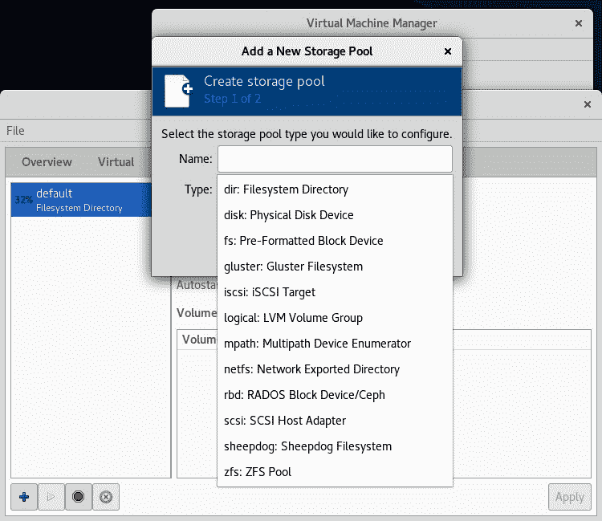

图 5.1 - libvirt 支持的不同存储池类型

libvirt 已经预先定义了一个默认存储池，这是本地服务器上的一个目录存储池。此默认池位于`/var/lib/libvirt/images`目录中。这代表了我们将保存所有本地安装的虚拟机的数据的默认位置。

在接下来的几节中，我们将创建各种不同类型的存储池——基于 NFS 的存储池，基于 iSCSI 和 FC 的存储池，以及 Gluster 和 Ceph 存储池：全方位的。我们还将解释何时使用每一种存储池，因为涉及到不同的使用模型。

# NFS 存储池

作为协议，NFS 自 80 年代中期以来就存在。最初由 Sun Microsystems 开发为共享文件的协议，直到今天仍在使用。实际上，它仍在不断发展，这对于一项如此“古老”的技术来说是相当令人惊讶的。例如，NFS 4.2 版本于 2016 年发布。在这个版本中，NFS 得到了很大的更新，例如以下内容：

+   服务器端复制：通过在 NFS 服务器之间直接进行克隆操作，显著提高了克隆操作的速度

+   稀疏文件和空间保留：增强了 NFS 处理具有未分配块的文件的方式，同时关注容量，以便在需要写入数据时保证空间可用性

+   应用程序数据块支持：一项帮助与文件作为块设备（磁盘）工作的应用程序的功能

+   更好的 pNFS 实现

v4.2 中还有其他一些增强的部分，但目前这已经足够了。您可以在 IETF 的 RFC 7862 文档中找到更多关于此的信息（[`tools.ietf.org/html/rfc7862`](https://tools.ietf.org/html/rfc7862)）。我们将专注于 NFS v4.2 的实现，因为这是 NFS 目前提供的最好的版本。它也恰好是 CentOS 8 支持的默认 NFS 版本。

我们首先要做的事情是安装必要的软件包。我们将使用以下命令来实现这一点：

```
yum -y install nfs-utils
systemctl enable --now nfs-server
```

第一条命令安装了运行 NFS 服务器所需的实用程序。第二条命令将启动它并永久启用它，以便在重新启动后 NFS 服务可用。

我们接下来的任务是配置我们将通过 NFS 服务器共享的内容。为此，我们需要*导出*一个目录，并使其在网络上对我们的客户端可用。NFS 使用一个配置文件`/etc/exports`来实现这个目的。假设我们想要创建一个名为`/exports`的目录，然后将其共享给我们在`192.168.159.0/255.255.255.0`网络中的客户端，并且我们希望允许他们在该共享上写入数据。我们的`/etc/exports`文件应该如下所示：

```
/mnt/packtStratisXFS01	192.168.159.0/24(rw)
exportfs -r
```

这些配置选项告诉我们的 NFS 服务器要导出哪个目录（`/exports`），导出到哪些客户端（`192.168.159.0/24`），以及使用哪些选项（`rw`表示读写）。

其他可用选项包括以下内容：

+   `ro`：只读模式。

+   `sync`：同步 I/O 操作。

+   `root_squash`：来自`UID 0`和`GID 0`的所有 I/O 操作都映射到可配置的匿名 UID 和 GID（`anonuid`和`anongid`选项）。

+   `all_squash`：来自任何 UID 和 GID 的所有 I/O 操作都映射到匿名 UID 和 GID（`anonuid`和`anongid`选项）。

+   `no_root_squash`：来自`UID 0`和`GID 0`的所有 I/O 操作都映射到`UID 0`和`GID 0`。

如果您需要将多个选项应用到导出的目录中，可以在它们之间用逗号添加，如下所示：

```
/mnt/packtStratisXFS01	192.168.159.0/24(rw,sync,root_squash)
```

您可以使用完全合格的域名或短主机名（如果它们可以通过 DNS 或任何其他机制解析）。此外，如果您不喜欢使用前缀（`24`），您可以使用常规的网络掩码，如下所示：

```
/mnt/packtStratisXFS01 192.168.159.0/255.255.255.0(rw,root_squash)
```

现在我们已经配置了 NFS 服务器，让我们看看我们将如何配置 libvirt 来使用该服务器作为存储池。和往常一样，有几种方法可以做到这一点。我们可以只创建一个包含池定义的 XML 文件，并使用`virsh pool-define --file`命令将其导入到我们的 KVM 主机中。以下是该配置文件的示例：

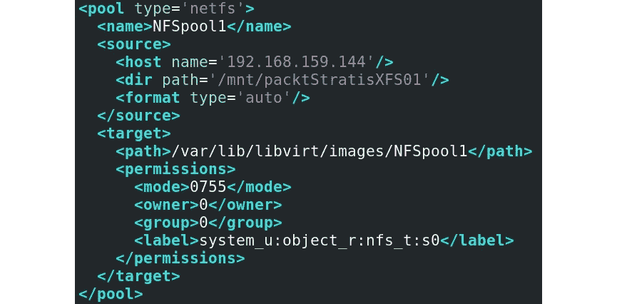

图 5.2 - NFS 池的 XML 配置文件示例

让我们解释一下这些配置选项：

+   `池类型`：`netfs`表示我们将使用 NFS 文件共享。

+   `name`：池名称，因为 libvirt 使用池作为命名对象，就像虚拟网络一样。

+   `host`：我们正在连接的 NFS 服务器的地址。

+   `dir path`：我们在 NFS 服务器上通过`/etc/exports`配置的 NFS 导出路径。

+   `path`：我们的 KVM 主机上的本地目录，该 NFS 共享将被挂载到该目录。

+   `permissions`：用于挂载此文件系统的权限。

+   `owner`和`group`：用于挂载目的的 UID 和 GID（这就是为什么我们之前使用`no_root_squash`选项导出文件夹的原因）。

+   `label`：此文件夹的 SELinux 标签-我们将在*第十六章*，*KVM 平台故障排除指南*中讨论这个问题。

如果我们愿意，我们本可以通过虚拟机管理器 GUI 轻松地完成相同的事情。首先，我们需要选择正确的类型（NFS 池），并给它起一个名字：

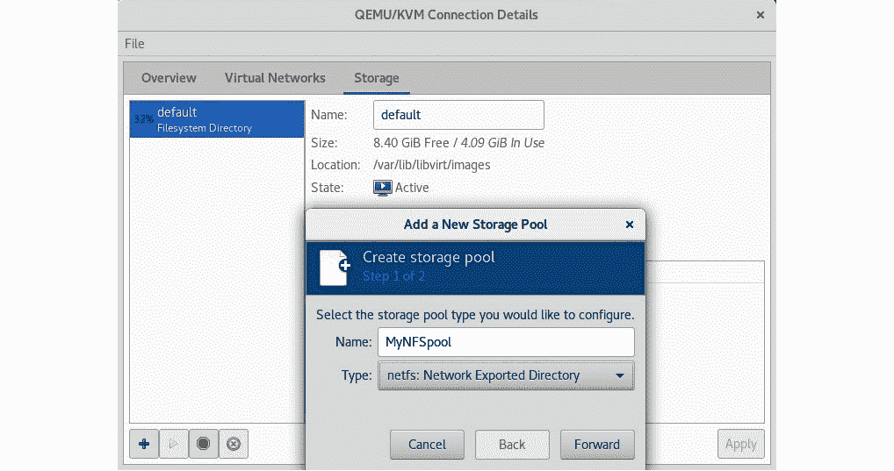

图 5.3 - 选择 NFS 池类型并给它命名

点击**前进**后，我们可以进入最后的配置步骤，需要告诉向导我们从哪个服务器挂载我们的 NFS 共享：

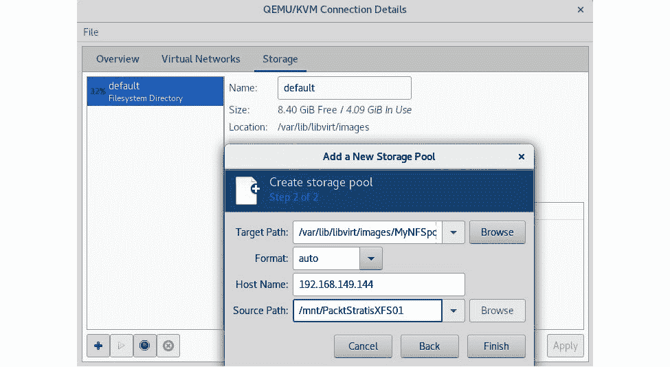

图 5.4–配置 NFS 服务器选项

当我们完成输入这些配置选项（**主机名**和**源路径**）后，我们可以点击**完成**，这意味着退出向导。此外，我们之前的配置屏幕，只包含**默认**存储池，现在也列出了我们新配置的存储池：

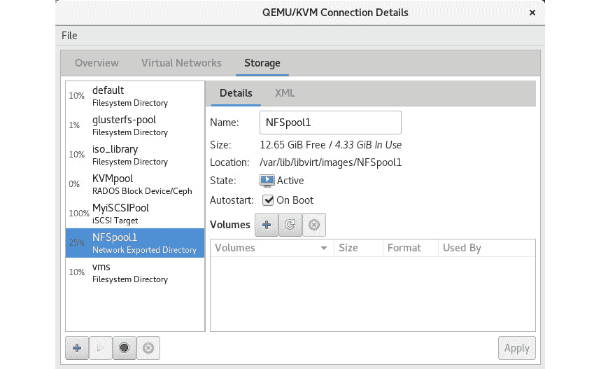

图 5.5–新配置的 NFS 存储池在列表中可见

我们何时在 libvirt 中使用基于 NFS 的存储池，以及为什么？基本上，我们可以很好地用它们来存储安装映像的任何相关内容——ISO 文件、虚拟软盘文件、虚拟机文件等等。

请记住，尽管似乎 NFS 在企业环境中几乎已经消失了一段时间，但 NFS 仍然存在。实际上，随着 NFS 4.1、4.2 和 pNFS 的引入，它在市场上的未来实际上看起来比几年前更好。这是一个非常熟悉的协议，有着非常悠久的历史，在许多场景中仍然具有竞争力。如果您熟悉 VMware 虚拟化技术，VMware 在 ESXi 6.0 中引入了一种称为虚拟卷的技术。这是一种基于对象的存储技术，可以同时使用基于块和 NFS 的协议作为其基础，这对于某些场景来说是一个非常引人注目的用例。但现在，让我们转向块级技术，比如 iSCSI 和 FC。

# iSCSI 和 SAN 存储

长期以来，使用 iSCSI 进行虚拟机存储一直是常规做法。即使考虑到 iSCSI 并不是处理存储的最有效方式这一事实，它仍然被广泛接受，你会发现它无处不在。效率受到两个原因的影响：

+   iSCSI 将 SCSI 命令封装成常规 IP 数据包，这意味着 IP 数据包有一个相当大的头部，这意味着分段和开销，这意味着效率较低。

+   更糟糕的是，它是基于 TCP 的，这意味着有序号和重传，这可能导致排队和延迟，而且环境越大，你通常会感觉到这些影响对虚拟机性能的影响越大。

也就是说，它基于以太网堆栈，使得部署基于 iSCSI 的解决方案更容易，同时也提供了一些独特的挑战。例如，有时很难向客户解释，在虚拟机流量和 iSCSI 流量使用相同的网络交换机并不是最好的主意。更糟糕的是，客户有时会因为渴望节省金钱而无法理解他们正在违背自己的最佳利益。特别是在涉及网络带宽时。我们大多数人都曾经历过这种情况，试图回答客户的问题，比如“但我们已经有了千兆以太网交换机，为什么你需要比这更快的东西呢？”

事实是，对于 iSCSI 的复杂性来说，更多就意味着更多。在磁盘/缓存/控制器方面拥有更快的速度，以及在网络方面拥有更多的带宽，就有更多的机会创建一个更快的存储系统。所有这些都可能对我们的虚拟机性能产生重大影响。正如您将在*存储冗余和多路径*部分中看到的那样，您实际上可以自己构建一个非常好的存储系统——无论是对于 iSCSI 还是 FC。当您尝试创建某种测试实验室/环境来发展您的 KVM 虚拟化技能时，这可能会非常有用。您可以将这些知识应用到其他虚拟化环境中。

iSCSI 和 FC 架构非常相似 - 它们都需要一个目标（iSCSI 目标和 FC 目标）和一个发起者（iSCS 发起者和 FC 发起者）。在这个术语中，目标是*服务器*组件，发起者是*客户端*组件。简单地说，发起者连接到目标以访问通过该目标呈现的块存储。然后，我们可以使用发起者的身份来*限制*发起者在目标上能够看到的内容。这就是当比较 iSCSI 和 FC 时术语开始有点不同的地方。

在 iSCSI 中，发起者的身份可以由四个不同的属性来定义。它们如下：

+   **iSCSI 合格名称**（**IQN**）：这是所有发起者和目标在 iSCSI 通信中都具有的唯一名称。我们可以将其与常规以太网网络中的 MAC 或 IP 地址进行比较。您可以这样想 - 对于以太网网络来说，IQN 就是 iSCSI 的 MAC 或 IP 地址。

+   **IP 地址**：每个发起者都有一个不同的 IP 地址，用于连接到目标。

+   **MAC 地址**：每个发起者在第 2 层都有一个不同的 MAC 地址。

+   **完全合格的域名**（**FQDN**）：这代表了服务器的名称，它是由 DNS 服务解析的。

从 iSCSI 目标的角度来看 - 根据其实现方式 - 您可以使用这些属性中的任何一个来创建一个配置，该配置将告诉 iSCSI 目标可以使用哪些 IQN、IP 地址、MAC 地址或 FQDN 来连接到它。这就是所谓的*掩码*，因为我们可以通过使用这些身份并将它们与 LUN 配对来*掩盖*发起者在 iSCSI 目标上可以*看到*的内容。LUN 只是我们通过 iSCSI 目标向发起者导出的原始块容量。LUN 通常是*索引*或*编号*的，通常从 0 开始。每个 LUN 编号代表发起者可以连接到的不同存储容量。

例如，我们可以有一个 iSCSI 目标，其中包含三个不同的 LUN - `LUN0`，容量为 20 GB，`LUN1`，容量为 40 GB，和`LUN2`，容量为 60 GB。这些都将托管在同一存储系统的 iSCSI 目标上。然后，我们可以配置 iSCSI 目标以接受一个 IQN 来查看所有 LUN，另一个 IQN 只能看到`LUN1`，另一个 IQN 只能看到`LUN1`和`LUN2`。这实际上就是我们现在要配置的。

让我们从配置 iSCSI 目标服务开始。为此，我们需要安装`targetcli`软件包，并配置服务（称为`target`）运行：

```
yum -y install targetcli
systemctl enable --now target
```

要注意防火墙配置；您可能需要配置它以允许在端口`3260/tcp`上进行连接，这是 iSCSI 目标门户使用的端口。因此，如果您的防火墙已启动，请输入以下命令：

```
firewall-cmd --permanent --add-port=3260/tcp ; firewall-cmd --reload
```

在 Linux 上，关于使用什么存储后端的 iSCSI 有三种可能性。我们可以使用常规文件系统（如 XFS）、块设备（硬盘）或 LVM。所以，这正是我们要做的。我们的情景将如下所示：

+   `LUN0`（20 GB）：基于 XFS 的文件系统，位于`/dev/sdb`设备上

+   `LUN1`（40 GB）：硬盘驱动器，位于`/dev/sdc`设备上

+   `LUN2`（60 GB）：LVM，位于`/dev/sdd`设备上

因此，在安装必要的软件包并配置目标服务和防火墙之后，我们应该开始配置我们的 iSCSI 目标。我们只需启动`targetcli`命令并检查状态，因为我们刚刚开始这个过程，状态应该是空白的：

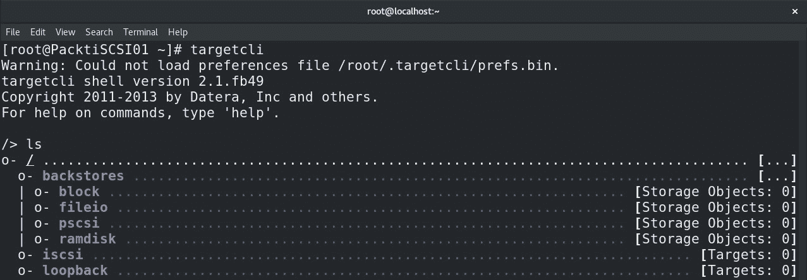

图 5.6 - targetcli 的起点 - 空配置

让我们从逐步的过程开始：

1.  因此，让我们配置基于 XFS 的文件系统，并配置`LUN0`文件映像保存在那里。首先，我们需要对磁盘进行分区（在我们的情况下是`/dev/sdb`）：

图 5.7 - 为 XFS 文件系统分区`/dev/sdb`

1.  接下来是格式化这个分区，创建并使用一个名为`/LUN0`的目录来挂载这个文件系统，并提供我们的`LUN0`镜像，我们将在接下来的步骤中进行配置：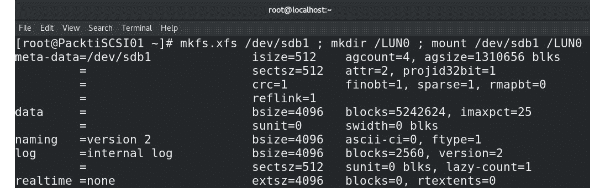

图 5.8 - 格式化 XFS 文件系统，创建目录，并将其挂载到该目录

1.  下一步是配置`targetcli`，使其创建`LUN0`并为`LUN0`分配一个镜像文件，该文件将保存在`/LUN0`目录中。首先，我们需要启动`targetcli`命令：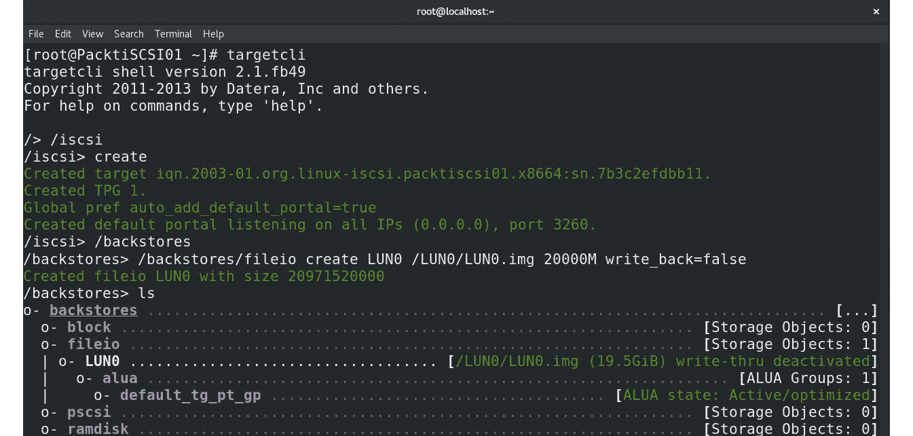

图 5.9 - 创建 iSCSI 目标，LUN0，并将其作为文件托管

1.  接下来，让我们配置一个基于块设备的 LUN 后端— `LUN2`—它将使用`/dev/sdc1`（使用前面的示例创建分区）并检查当前状态：

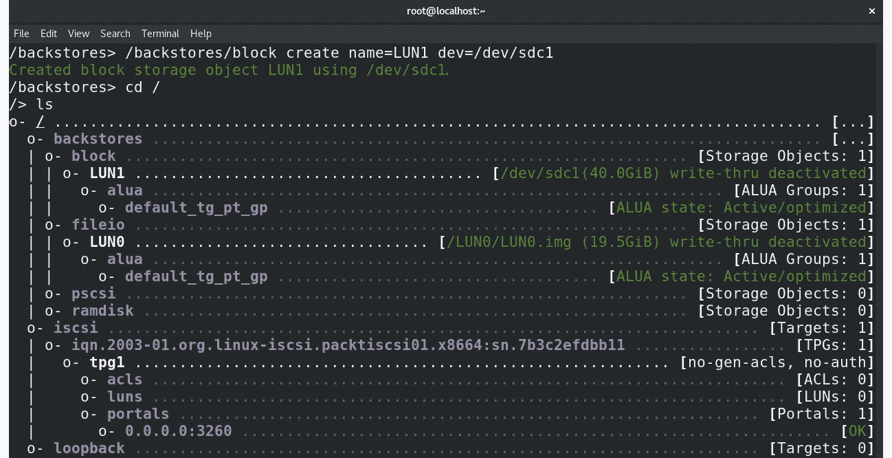

图 5.10 - 创建 LUN1，直接从块设备托管

因此，`LUN0`和`LUN1`及其各自的后端现在已配置完成。让我们通过配置 LVM 来完成这些事情：

1.  首先，我们将准备 LVM 的物理卷，从该卷创建一个卷组，并显示有关该卷组的所有信息，以便我们可以看到我们有多少空间可用于`LUN2`：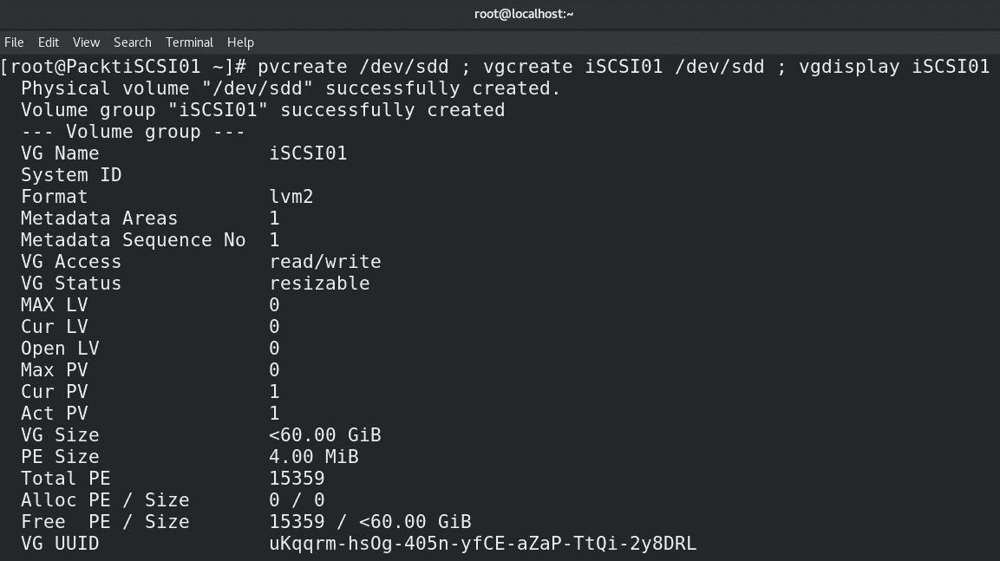

图 5.11 - 为 LVM 配置物理卷，构建卷组，并显示有关该卷组的信息

1.  下一步是实际创建逻辑卷，这将是我们 iSCSI 目标中`LUN2`的块存储设备后端。我们可以从`vgdisplay`输出中看到我们有 15,359 个 4MB 块可用，所以让我们用它来创建我们的逻辑卷，称为`LUN2`。转到`targetcli`并配置`LUN2`的必要设置：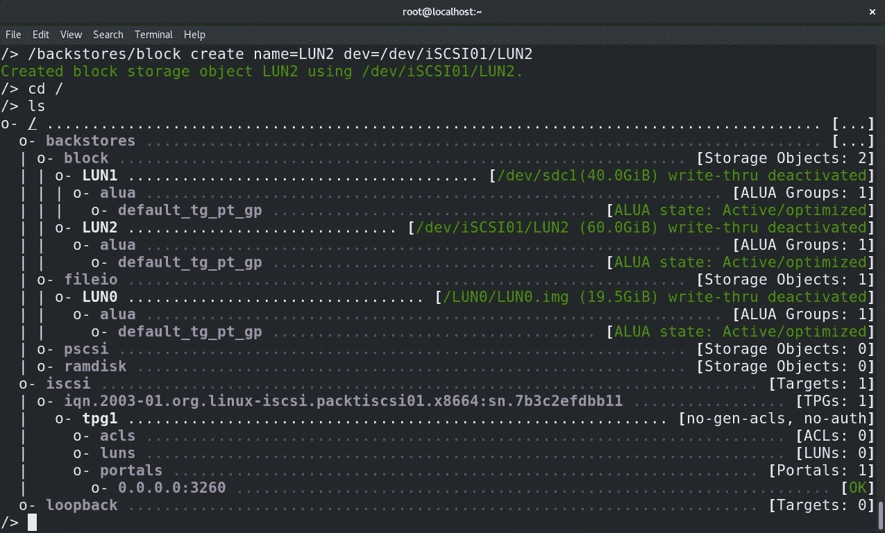

图 5.12 - 使用 LVM 后端配置 LUN2

1.  让我们停在这里，转而转到 KVM 主机（iSCSI 发起者）的配置。首先，我们需要安装 iSCSI 发起者，这是一个名为`iscsi-initiator-utils`的软件包的一部分。因此，让我们使用`yum`命令来安装它：

```
yum -y install iscsi-initiator-utils
```

1.  接下来，我们需要配置我们发起者的 IQN。通常我们希望这个名称能让人联想到主机名，所以，看到我们主机的 FQDN 是`PacktStratis01`，我们将使用它来配置 IQN。为了做到这一点，我们需要编辑`/etc/iscsi/initiatorname.iscsi`文件并配置`InitiatorName`选项。例如，让我们将其设置为`iqn.2019-12.com.packt:PacktStratis01`。`/etc/iscsi/initiatorname.iscsi`文件的内容应该如下所示：

```
InitiatorName=iqn.2019-12.com.packt:PacktStratis01
```

1.  现在这已经配置好了，让我们回到 iSCSI 目标并创建一个**访问控制列表**（**ACL**）。ACL 将允许我们的 KVM 主机发起者连接到 iSCSI 目标门户：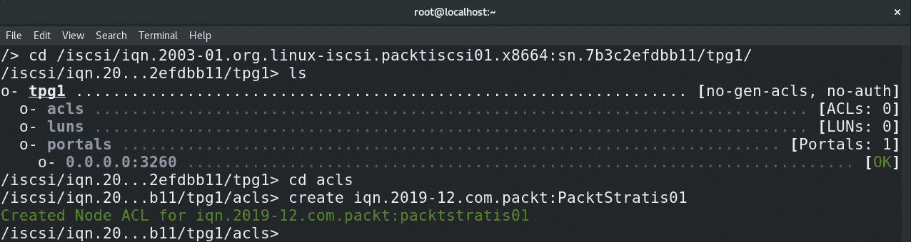

图 5.13 - 创建 ACL，以便 KVM 主机的发起者可以连接到 iSCSI 目标

1.  接下来，我们需要将我们预先创建的基于文件和基于块的设备发布到 iSCSI 目标 LUNs。因此，我们需要这样做：

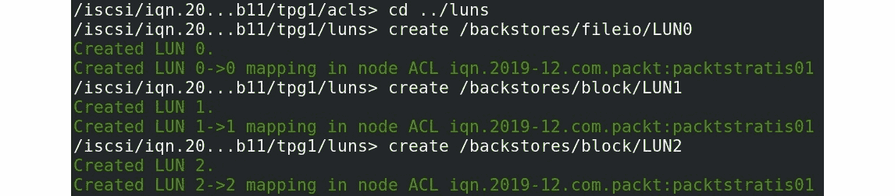

图 5.14 - 将我们的基于文件和基于块的设备添加到 iSCSI 目标 LUNs 0、1 和 2

最终结果应该如下所示：

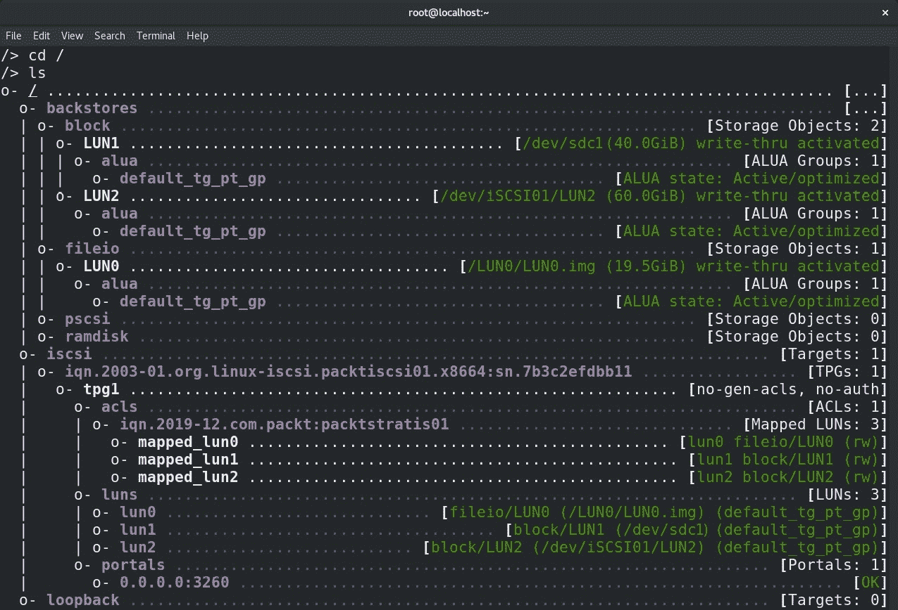

图 5.15 - 最终结果

此时，一切都已配置好。我们需要回到我们的 KVM 主机，并定义一个将使用这些 LUN 的存储池。做到这一点最简单的方法是使用一个 XML 配置文件来定义池。因此，这是我们的示例配置 XML 文件；我们将称其为`iSCSIPool.xml`：

```
<pool type='iscsi'>
  <name>MyiSCSIPool</name>
  <source>
    <host name='192.168.159.145'/>
    <device path='iqn.2003-01.org.linux-iscsi.packtiscsi01.x8664:sn.7b3c2efdbb11'/>
  </source>
  <initiator>
   <iqn name='iqn.2019-12.com.packt:PacktStratis01' />
</initiator>
  <target>
    <path>/dev/disk/by-path</path>
  </target>
</pool>
```

让我们一步一步地解释这个文件：

+   `池类型= 'iscsi'`：我们告诉 libvirt 这是一个 iSCSI 池。

+   `名称`：池名称。

+   `主机名`：iSCSI 目标的 IP 地址。

+   `设备路径`：iSCSI 目标的 IQN。

+   发起者部分的 IQN 名称：发起者的 IQN。

+   `目标路径`：iSCSI 目标的 LUN 将被挂载的位置。

现在，我们所要做的就是定义、启动和自动启动我们的新的基于 iSCSI 的 KVM 存储池：

```
virsh pool-define --file iSCSIPool.xml
virsh pool-start --pool MyiSCSIPool
virsh pool-autostart --pool MyiSCSIPool
```

配置的目标路径部分可以通过`virsh`轻松检查。如果我们在 KVM 主机上输入以下命令，我们将得到刚刚配置的`MyiSCSIPool`池中可用 LUN 的列表：

```
virsh vol-list --pool MyiSCSIPool
```

我们对此命令得到以下结果：

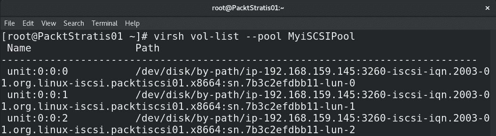

图 5.16 - 我们 iSCSI 池 LUN 的运行时名称

如果这个输出让你有点想起 VMware vSphere Hypervisor 存储运行时名称，那么你肯定是对的。当我们开始部署我们的虚拟机时，我们将能够在*第七章*，*虚拟机-安装、配置和生命周期管理*中使用这些存储池。

# 存储冗余和多路径

冗余是 IT 的关键词之一，任何单个组件的故障都可能对公司或其客户造成重大问题。避免 SPOF 的一般设计原则是我们应该始终坚持的。归根结底，没有任何网络适配器、电缆、交换机、路由器或存储控制器会永远工作。因此，将冗余计算到我们的设计中有助于我们的 IT 环境在其正常生命周期内。

同时，冗余可以与多路径结合，以确保更高的吞吐量。例如，当我们将物理主机连接到具有每个四个 FC 端口的两个控制器的 FC 存储时，我们可以使用四条路径（如果存储是主备的）或八条路径（如果是主动-主动的）连接到从存储设备导出给主机的相同 LUN(s)。这为我们提供了多种额外的 LUN 访问选项，除了在故障情况下为我们提供更多的可用性外。

让一个普通的 KVM 主机执行，例如 iSCSI 多路径，是相当复杂的。在文档方面存在多个配置问题和空白点，这种配置的支持性是值得怀疑的。然而，有一些使用 KVM 的产品可以直接支持，比如 oVirt（我们之前介绍过）和**Red Hat 企业虚拟化 Hypervisor**（**RHEV-H**）。因此，让我们在 iSCSI 的例子中使用 oVirt。

在你这样做之前，请确保你已经完成了以下工作：

+   您的 Hypervisor 主机已添加到 oVirt 清单中。

+   您的 Hypervisor 主机有两个额外的网络卡，独立于管理网络。

+   iSCSI 存储在与两个额外的 Hypervisor 网络卡相同的 L2 网络中有两个额外的网络卡。

+   iSCSI 存储已经配置好，至少有一个目标和一个 LUN 已经配置好，这样就能使 Hypervisor 主机连接到它。

因此，当我们在 oVirt 中进行这项工作时，有一些事情是我们需要做的。首先，从网络的角度来看，为存储创建一些存储网络是一个好主意。在我们的情况下，我们将为 iSCSI 分配两个网络，并将它们称为`iSCSI01`和`iSCSI02`。我们需要打开 oVirt 管理面板，悬停在`iSCSI01`（第一个）上，取消选中`iSCSI02`网络：

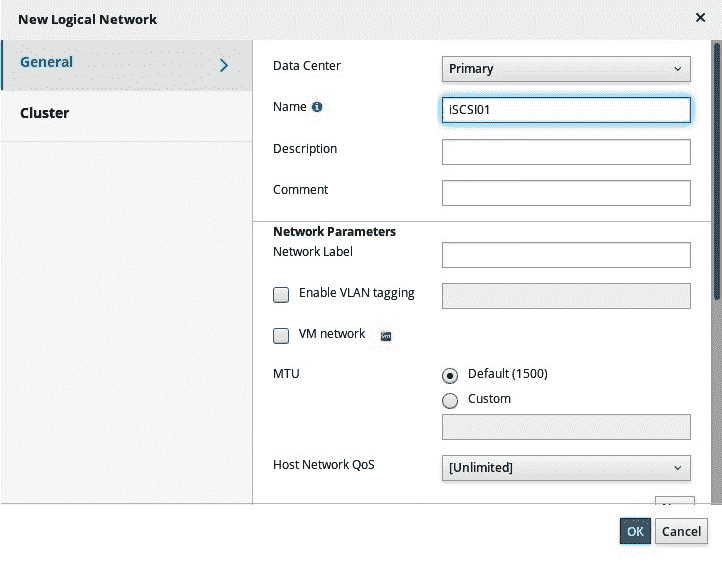

图 5.17 - 配置 iSCSI 绑定网络

下一步是将这些网络分配给主机网络适配器。转到`compute/hosts`，双击您添加到 oVirt 清单的主机，选择第二个网络接口上的`iSCSI01`和第三个网络接口上的`iSCSI02`。第一个网络接口已被 oVirt 管理网络占用。它应该看起来像这样：

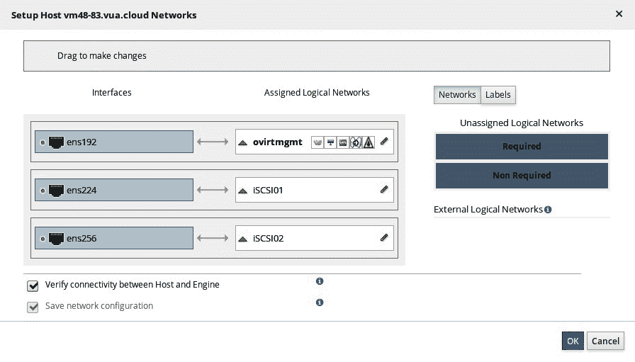

图 5.18 - 将虚拟网络分配给 hypervisor 的物理适配器

在关闭窗口之前，请确保单击`iSCSI01`和`iSCSI02`上的*铅笔*图标，为这两个虚拟网络设置 IP 地址。分配可以将您连接到相同或不同子网上的 iSCSI 存储的网络配置：

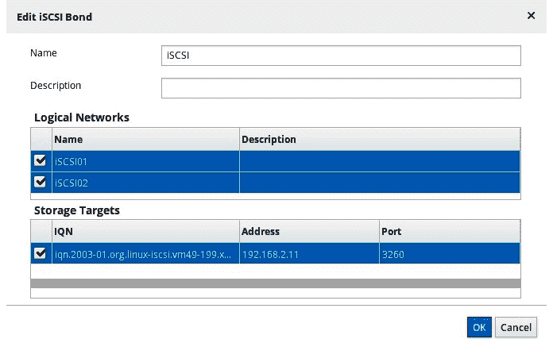

图 5.19 - 在数据中心级别创建 iSCSI 绑定

您刚刚配置了一个 iSCSI 绑定。我们配置的最后一部分是启用它。同样，在 oVirt GUI 中，转到**计算** | **数据中心**，双击选择您的数据中心，然后转到**iSCSI 多路径**选项卡：

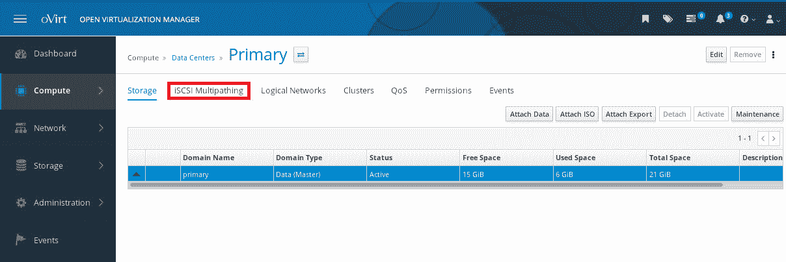

图 5.20 - 在数据中心级别配置 iSCSI 多路径

在弹出窗口的顶部部分单击`iSCSI01`和`iSCSI02`网络，然后在底部单击 iSCSI 目标。

现在我们已经介绍了存储池、NFS 和 iSCSI 的基础知识，我们可以继续使用标准的开源方式部署存储基础设施，即使用 Gluster 和/或 Ceph。

# Gluster 和 Ceph 作为 KVM 的存储后端

还有其他高级类型的文件系统可以用作 libvirt 存储后端。因此，让我们现在讨论其中的两种 - Gluster 和 Ceph。稍后，我们还将检查 libvirt 如何与 GFS2 一起使用。

## Gluster

Gluster 是一个经常用于高可用性场景的分布式文件系统。它相对于其他文件系统的主要优势在于，它是可扩展的，可以使用复制和快照，可以在任何服务器上工作，并且可用作共享存储的基础，例如通过 NFS 和 SMB。它是由一家名为 Gluster Inc.的公司开发的，该公司于 2011 年被 RedHat 收购。然而，与 Ceph 不同，它是一个*文件*存储服务，而 Ceph 提供*块*和*对象*为基础的存储。基于对象的存储对于基于块的设备意味着直接的二进制存储，直接到 LUN。这里没有涉及文件系统，理论上意味着由于没有文件系统、文件系统表和其他可能减慢 I/O 过程的构造，因此开销更小。

让我们首先配置 Gluster 以展示其在 libvirt 中的用途。在生产中，这意味着安装至少三台 Gluster 服务器，以便我们可以实现高可用性。Gluster 配置非常简单，在我们的示例中，我们将创建三台 CentOS 7 机器，用于托管 Gluster 文件系统。然后，我们将在我们的 hypervisor 主机上挂载该文件系统，并将其用作本地目录。我们可以直接从 libvirt 使用 GlusterFS，但是实现方式并不像通过 gluster 客户端服务使用它、将其挂载为本地目录并直接在 libvirt 中使用它作为目录池那样精致。

我们的配置将如下所示：

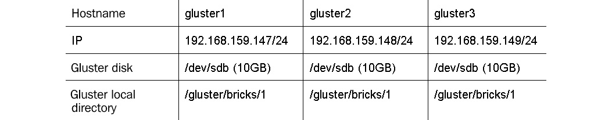

图 5.21 - 我们 Gluster 集群的基本设置

因此，让我们投入生产。在配置 Gluster 并将其暴露给我们的 KVM 主机之前，我们必须在所有服务器上发出一系列大量的命令。让我们从`gluster1`开始。首先，我们将进行系统范围的更新和重启，以准备 Gluster 安装的核心操作系统。在所有三台 CentOS 7 服务器上输入以下命令：

```
yum -y install epel-release*
yum -y install centos-release-gluster7.noarch
yum -y update
yum -y install glusterfs-server
systemctl reboot
```

然后，我们可以开始部署必要的存储库和软件包，格式化磁盘，配置防火墙等。在所有服务器上输入以下命令：

```
mkfs.xfs /dev/sdb
mkdir /gluster/bricks/1 -p
echo '/dev/sdb /gluster/bricks/1 xfs defaults 0 0' >> /etc/fstab
mount -a
mkdir /gluster/bricks/1/brick
systemctl disable firewalld
systemctl stop firewalld
systemctl start glusterd
systemctl enable glusterd
```

我们还需要进行一些网络配置。如果这三台服务器可以*相互解析*，那将是很好的，这意味着要么配置一个 DNS 服务器，要么在我们的`/etc/hosts`文件中添加几行。我们选择后者。将以下行添加到您的`/etc/hosts`文件中：

```
192.168.159.147 gluster1
192.168.159.148 gluster2
192.168.159.149 gluster3
```

在配置的下一部分，我们只需登录到第一台服务器，并将其用作我们的 Gluster 基础设施的事实管理服务器。输入以下命令：

```
gluster peer probe gluster1
gluster peer probe gluster2
gluster peer probe gluster3
gluster peer status
```

前三个命令应该让您得到`peer probe: success`状态。第三个应该返回类似于这样的输出：

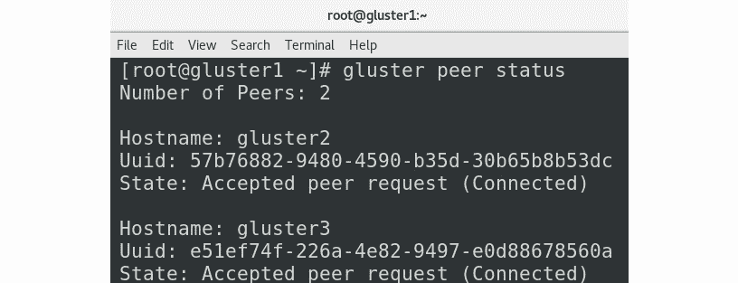

图 5.22 - 确认 Gluster 服务器成功对等

现在配置的这一部分已经完成，我们可以创建一个 Gluster 分布式文件系统。我们可以通过输入以下命令序列来实现这一点：

```
gluster volume create kvmgluster replica 3 \ gluster1:/gluster/bricks/1/brick gluster2:/gluster/bricks/1/brick \ gluster3:/gluster/bricks/1/brick 
gluster volume start kvmgluster
gluster volume set kvmgluster auth.allow 192.168.159.0/24
gluster volume set kvmgluster allow-insecure on
gluster volume set kvmgluster storage.owner-uid 107
gluster volume set kvmgluster storage.owner-gid 107
```

然后，我们可以将 Gluster 挂载为 NFS 目录进行测试。例如，我们可以为所有成员主机（`gluster1`、`gluster2`和`gluster3`）创建一个名为`kvmgluster`的分布式命名空间。我们可以通过使用以下命令来实现这一点：

```
echo 'localhost:/kvmgluster /mnt glusterfs \ defaults,_netdev,backupvolfile-server=localhost 0 0' >> /etc/fstab
mount.glusterfs localhost:/kvmgluster /mnt
```

Gluster 部分现在已经准备就绪，所以我们需要回到我们的 KVM 主机，并通过输入以下命令将 Gluster 文件系统挂载到它上面：

```
wget \ https://download.gluster.org/pub/gluster/glusterfs/6/LATEST/CentOS/gl\ usterfs-rhel8.repo -P /etc/yum.repos.d
yum install glusterfs glusterfs-fuse attr -y
mount -t glusterfs -o context="system_u:object_r:virt_image_t:s0" \ gluster1:/kvmgluster /var/lib/libvirt/images/GlusterFS 
```

我们必须密切关注服务器和客户端上的 Gluster 版本，这就是为什么我们下载了 CentOS 8 的 Gluster 存储库信息（我们正在 KVM 服务器上使用它），并安装了必要的 Gluster 客户端软件包。这使我们能够使用最后一个命令挂载文件系统。

现在我们已经完成了配置，我们只需要将这个目录作为 libvirt 存储池添加进去。让我们通过使用一个包含以下条目的存储池定义的 XML 文件来做到这一点：

```
<pool type='dir'>
  <name>glusterfs-pool</name>
  <target>
    <path>/var/lib/libvirt/images/GlusterFS</path>
    <permissions>
      <mode>0755</mode>
      <owner>107</owner>
      <group>107</group>
      <label>system_u:object_r:virt_image_t:s0</label>
    </permissions>
  </target>
</pool> 
```

假设我们将这个文件保存在当前目录，并且文件名为`gluster.xml`。我们可以通过使用以下`virsh`命令将其导入并在 libvirt 中启动：

```
virsh pool-define --file gluster.xml
virsh pool-start --pool glusterfs-pool
virsh pool-autostart --pool glusterfs-pool
```

我们应该在启动时自动挂载这个存储池，以便 libvirt 可以使用它。因此，我们需要将以下行添加到`/etc/fstab`中：

```
gluster1:/kvmgluster       /var/lib/libvirt/images/GlusterFS \ glusterfs   defaults,_netdev  0  0
```

使用基于目录的方法使我们能够避免 libvirt（及其 GUI 界面`virt-manager`）在 Gluster 存储池方面存在的两个问题：

+   我们可以使用 Gluster 的故障转移功能，这将由我们直接安装的 Gluster 实用程序自动管理，因为 libvirt 目前还不支持它们。

+   我们将避免*手动*创建虚拟机磁盘，这是 libvirt 对 Gluster 支持的另一个限制，而基于目录的存储池则可以无任何问题地支持它。

我们提到*故障转移*似乎有点奇怪，因为似乎我们没有将它作为任何之前步骤的一部分进行配置。实际上，我们已经配置了。当我们发出最后一个挂载命令时，我们使用了 Gluster 的内置模块来建立与*第一个*Gluster 服务器的连接。这反过来意味着在建立这个连接之后，我们得到了关于整个 Gluster 池的所有细节，我们配置了它以便它托管在三台服务器上。如果发生任何故障—我们可以很容易地模拟—这个连接将继续工作。例如，我们可以通过关闭任何一个 Gluster 服务器来模拟这种情况—比如`gluster1`。您会看到我们挂载 Gluster 目录的本地目录仍然可以工作，即使`gluster1`已经关闭。让我们看看它的运行情况（默认超时时间为 42 秒）：

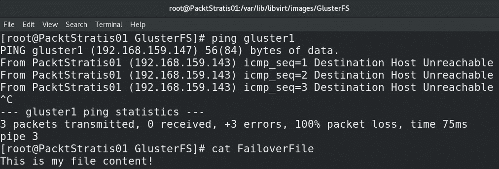

图 5.23 - Gluster 故障转移工作；第一个节点已经关闭，但我们仍然能够获取我们的文件

如果我们想更积极一些，可以通过在任何一个 Gluster 服务器上发出以下命令来将此超时期缩短到——例如——2 秒：

```
gluster volume set kvmgluster network.ping-timeout number
```

`number`部分是以秒为单位的，通过分配一个较低的数字，我们可以直接影响故障切换过程的积极性。

因此，现在一切都配置好了，我们可以开始使用 Gluster 池部署虚拟机，我们将在*第七章*中进一步讨论，*虚拟机-安装、配置和生命周期管理*。

鉴于 Gluster 是一个基于文件的后端，可以用于 libvirt，自然而然地需要描述如何使用高级块级和对象级存储后端。这就是 Ceph 的用武之地，所以让我们现在来处理这个问题。

## Ceph

Ceph 可以作为文件、块和对象存储。但在大多数情况下，我们通常将其用作块或对象存储。同样，这是一款设计用于任何服务器（或虚拟机）的开源软件。在其核心，Ceph 运行一个名为**可控复制下可扩展哈希**（**CRUSH**）的算法。该算法试图以伪随机的方式在对象设备之间分发数据，在 Ceph 中，它由一个集群映射（CRUSH 映射）管理。我们可以通过添加更多节点轻松扩展 Ceph，这将以最小的方式重新分发数据，以确保尽可能少的复制。

一个名为**可靠自主分布式对象存储**（**RADOS**）的内部 Ceph 组件用于快照、复制和薄配置。这是一个由加利福尼亚大学开发的开源项目。

在架构上，Ceph 有三个主要服务：

+   **ceph-mon**：用于集群监控、CRUSH 映射和**对象存储守护程序**（**OSD**）映射。

+   **ceph-osd**：处理实际数据存储、复制和恢复。至少需要两个节点；出于集群化的原因，我们将使用三个。

+   **ceph-mds**：元数据服务器，在 Ceph 需要文件系统访问时使用。

根据最佳实践，确保您始终在设计 Ceph 环境时牢记关键原则——所有数据节点需要具有相同的配置。这意味着相同数量的内存、相同的存储控制器（如果可能的话，不要使用 RAID 控制器，只使用普通的 HBA 而不带 RAID 固件）、相同的磁盘等。这是确保您的环境中 Ceph 性能保持恒定水平的唯一方法。

Ceph 的一个非常重要的方面是数据放置和放置组的工作原理。放置组为我们提供了将创建的对象分割并以最佳方式放置在 OSD 中的机会。换句话说，我们配置的放置组数量越大，我们将获得的平衡就越好。

因此，让我们从头开始配置 Ceph。我们将再次遵循最佳实践，并使用五台服务器部署 Ceph——一台用于管理，一台用于监控，三个 OSD。

我们的配置将如下所示：

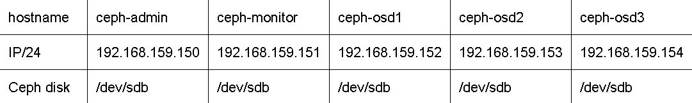

图 5.24 - 我们基础设施的基本 Ceph 配置

确保这些主机可以通过 DNS 或`/etc/hosts`相互解析，并配置它们都使用相同的 NTP 源。确保通过以下方式更新所有主机：

```
yum -y update; reboot
```

此外，请确保您以*root*用户身份在所有主机上输入以下命令。让我们从部署软件包、创建管理员用户并赋予他们`sudo`权限开始：

```
rpm -Uhv http://download.ceph.com/rpm-jewel/el7/noarch/ceph-release-1-1.el7.noarch.rpm
yum -y install ceph-deploy ceph ceph-radosgw
useradd cephadmin
echo "cephadmin:ceph123" | chpasswd
echo "cephadmin ALL = (root) NOPASSWD:ALL" | sudo tee /etc/sudoers.d/cephadmin
chmod 0440 /etc/sudoers.d/cephadmin
```

对于这个演示来说，禁用 SELinux 会让我们的生活更轻松，摆脱防火墙也是如此。

```
sed -i 's/SELINUX=enforcing/SELINUX=disabled/g' /etc/selinux/config
systemctl stop firewalld
systemctl disable firewalld
systemctl mask firewalld
```

让我们将主机名添加到`/etc/hosts`中，以便我们更容易进行管理：

```
echo "192.168.159.150 ceph-admin" >> /etc/hosts
echo "192.168.159.151 ceph-monitor" >> /etc/hosts
echo "192.168.159.152 ceph-osd1" >> /etc/hosts
echo "192.168.159.153 ceph-osd2" >> /etc/hosts
echo "192.168.159.154 ceph-osd3" >> /etc/hosts
```

更改最后的`echo`部分以适应您的环境 - 主机名和 IP 地址。我们只是在这里举例说明。下一步是确保我们可以使用我们的管理主机连接到所有主机。最简单的方法是使用 SSH 密钥。因此，在`ceph-admin`上，以 root 身份登录并输入`ssh-keygen`命令，然后一直按*Enter*键。它应该看起来像这样：

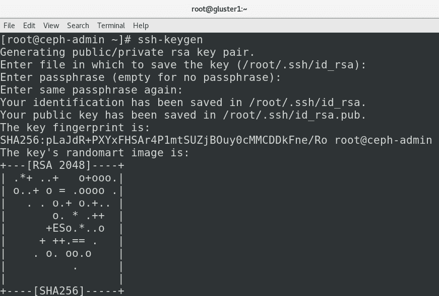

图 5.25-为 Ceph 设置目的为 root 生成 SSH 密钥

我们还需要将此密钥复制到所有主机。因此，再次在`ceph-admin`上，使用`ssh-copy-id`将密钥复制到所有主机：

```
ssh-copy-id cephadmin@ceph-admin
ssh-copy-id cephadmin@ceph-monitor
ssh-copy-id cephadmin@ceph-osd1
ssh-copy-id cephadmin@ceph-osd2
ssh-copy-id cephadmin@ceph-osd3
```

当 SSH 询问您时，请接受所有密钥，并使用我们在较早步骤中选择的`ceph123`作为密码。完成所有这些之后，在我们开始部署 Ceph 之前，`ceph-admin`还有最后一步要做 - 我们必须配置 SSH 以使用`cephadmin`用户作为默认用户登录到所有主机。我们将通过以 root 身份转到`ceph-admin`上的`.ssh`目录，并创建一个名为`config`的文件，并添加以下内容来完成这一步：

```
Host ceph-admin
        Hostname ceph-admin
        User cephadmin
Host ceph-monitor
        Hostname ceph-monitor
        User cephadmin
Host ceph-osd1
        Hostname ceph-osd1
        User cephadmin
Host ceph-osd2
        Hostname ceph-osd2
        User cephadmin
Host ceph-osd3
        Hostname ceph-osd3
        User cephadmin
```

那是一个很长的预配置，不是吗？现在是时候真正开始部署 Ceph 了。第一步是配置`ceph-monitor`。因此，在`ceph-admin`上输入以下命令：

```
cd /root
mkdir cluster
cd cluster
ceph-deploy new ceph-monitor
```

由于我们选择了一个配置，其中有三个 OSD，我们需要配置 Ceph 以便使用这另外两个主机。因此，在`cluster`目录中，编辑名为`ceph.conf`的文件，并在末尾添加以下两行：

```
public network = 192.168.159.0/24
osd pool default size = 2
```

这将确保我们只能使用我们的示例网络（`192.168.159.0/24`）进行 Ceph，并且我们在原始的基础上有两个额外的 OSD。

现在一切准备就绪，我们必须发出一系列命令来配置 Ceph。因此，再次在`ceph-admin`上输入以下命令：

```
ceph-deploy install ceph-admin ceph-monitor ceph-osd1 ceph-osd2 ceph-osd3
ceph-deploy mon create-initial
ceph-deploy gatherkeys ceph-monitor
ceph-deploy disk list ceph-osd1 ceph-osd2 ceph-osd3
ceph-deploy disk zap ceph-osd1:/dev/sdb  ceph-osd2:/dev/sdb  ceph-osd3:/dev/sdb
ceph-deploy osd prepare ceph-osd1:/dev/sdb ceph-osd2:/dev/sdb ceph-osd3:/dev/sdb
ceph-deploy osd activate ceph-osd1:/dev/sdb1 ceph-osd2:/dev/sdb1 ceph-osd3:/dev/sdb1
```

让我们逐一描述这些命令：

+   第一条命令启动实际的部署过程 - 用于管理、监视和 OSD 节点的安装所有必要的软件包。

+   第二个和第三个命令配置监视主机，以便它准备好接受外部连接。

+   这两个磁盘命令都是关于磁盘准备 - Ceph 将清除我们分配给它的磁盘（每个 OSD 主机的`/dev/sdb`）并在上面创建两个分区，一个用于 Ceph 数据，一个用于 Ceph 日志。

+   最后两个命令准备这些文件系统供使用并激活 Ceph。如果您的`ceph-deploy`脚本在任何时候停止，请检查您的 DNS 和`/etc/hosts`和`firewalld`配置，因为问题通常出现在那里。

我们需要将 Ceph 暴露给我们的 KVM 主机，这意味着我们需要进行一些额外的配置。我们将 Ceph 公开为对象池给我们的 KVM 主机，因此我们需要创建一个池。让我们称之为`KVMpool`。连接到`ceph-admin`，并发出以下命令：

```
ceph osd pool create KVMpool 128 128
```

此命令将创建一个名为`KVMpool`的池，其中包含 128 个放置组。

下一步涉及从安全角度接近 Ceph。我们不希望任何人连接到这个池，因此我们将为 Ceph 创建一个用于身份验证的密钥，我们将在 KVM 主机上用于身份验证。我们通过输入以下命令来做到这一点：

```
ceph auth get-or-create client.KVMpool mon 'allow r' osd 'allow rwx pool=KVMpool'
```

它将向我们抛出一个状态消息，类似于这样：

```
key = AQB9p8RdqS09CBAA1DHsiZJbehb7ZBffhfmFJQ==
```

然后我们可以切换到 KVM 主机，在那里我们需要做两件事：

+   定义一个秘密 - 一个将 libvirt 链接到 Ceph 用户的对象 - 通过这样做，我们将创建一个带有其**通用唯一标识符**（**UUID**）的秘密对象。

+   在定义 Ceph 存储池时，使用该秘密的 UUID 将其与 Ceph 密钥进行关联。

完成这两个步骤的最简单方法是使用两个 libvirt 的 XML 配置文件。因此，让我们创建这两个文件。让我们称第一个为`secret.xml`，以下是其内容：

```
   <secret ephemeral='no' private='no'>
   <usage type='ceph'>
     <name>client.KVMpool secret</name>
   </usage>
</secret>
```

确保您保存并导入此 XML 文件，输入以下命令：

```
virsh secret-define --file secret.xml
```

按下*Enter*键后，此命令将抛出一个 UUID。请将该 UUID 复制并粘贴到一个安全的地方，因为我们将需要它用于池 XML 文件。在我们的环境中，这个第一个`virsh`命令抛出了以下输出：

```
Secret 95b1ed29-16aa-4e95-9917-c2cd4f3b2791 created
```

我们需要为这个秘密分配一个值，这样当 libvirt 尝试使用这个秘密时，它就知道要使用哪个*密码*。这实际上是我们在 Ceph 级别创建的密码，当我们使用`ceph auth get-create`时，它会给我们抛出密钥。因此，现在我们既有秘密 UUID 又有 Ceph 密钥，我们可以将它们结合起来创建一个完整的认证对象。在 KVM 主机上，我们需要输入以下命令：

```
virsh secret-set-value 95b1ed29-16aa-4e95-9917-c2cd4f3b2791 AQB9p8RdqS09CBAA1DHsiZJbehb7ZBffhfmFJQ==
```

现在，我们可以创建 Ceph 池文件。让我们把配置文件命名为`ceph.xml`，以下是它的内容：

```
   <pool type="rbd">
     <source>
       <name>KVMpool</name>
       <host name='192.168.159.151' port='6789'/>
       <auth username='KVMpool' type='ceph'>
         <secret uuid='95b1ed29-16aa-4e95-9917-c2cd4f3b2791'/>
       </auth>
     </source>
   </pool>
```

因此，上一步的 UUID 被用于这个文件中，用来引用哪个秘密（身份）将被用于 Ceph 池访问。现在，如果我们想要永久使用它（在 KVM 主机重新启动后），我们需要执行标准程序——导入池，启动它，并自动启动它。因此，让我们在 KVM 主机上使用以下命令序列来执行：

```
virsh pool-define --file ceph.xml
virsh pool-start KVMpool
virsh pool-autostart KVMpool
virsh pool-list --details
```

最后一个命令应该产生类似于这样的输出：

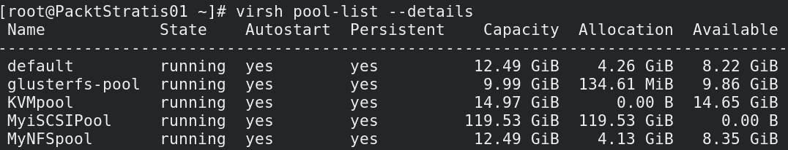

图 5.26-检查我们的池的状态；Ceph 池已配置并准备好使用

现在，Ceph 对象池对我们的 KVM 主机可用，我们可以在其上安装虚拟机。我们将在*第七章*中再次进行这项工作——*虚拟机-安装、配置和生命周期管理*。

# 虚拟磁盘镜像和格式以及基本的 KVM 存储操作

磁盘镜像是存储在主机文件系统上的标准文件。它们很大，作为客人的虚拟硬盘。您可以使用`dd`命令创建这样的文件，如下所示：

```
# dd if=/dev/zero of=/vms/dbvm_disk2.img bs=1G count=10
```

以下是这个命令的翻译：

从输入文件（`if`）`/dev/zero`（几乎无限的零）复制数据（`dd`）到输出文件（`of`）`/vms/dbvm_disk2.img`（磁盘镜像），使用 1G 大小的块（`bs` = 块大小），并重复这个操作（`count`）只一次（`10`）。

重要提示：

`dd`被认为是一个耗费资源的命令。它可能会在主机系统上引起 I/O 问题，因此最好先检查主机系统的可用空闲内存和 I/O 状态，然后再运行它。如果系统已经加载，降低块大小到 MB，并增加计数以匹配您想要的文件大小（使用`bs=1M`，`count=10000`，而不是`bs=1G`，`count=10`）。

`/vms/dbvm_disk2.img`是前面命令的结果。该镜像现在已经预分配了 10GB，并准备好与客人一起使用，无论是作为引导磁盘还是第二个磁盘。同样，您也可以创建薄配置的磁盘镜像。预分配和薄配置（稀疏）是磁盘分配方法，或者您也可以称之为格式：

+   **预分配**：预分配的虚拟磁盘在创建时立即分配空间。这通常意味着比薄配置的虚拟磁盘写入速度更快。

+   `dd`命令中的`seek`选项，如下所示：

```
dd if=/dev/zero of=/vms/dbvm_disk2_seek.imgbs=1G seek=10 count=0
```

每种方法都有其优缺点。如果您正在寻求 I/O 性能，选择预分配格式，但如果您有非 I/O 密集型负载，请选择薄配置。

现在，您可能想知道如何识别某个虚拟磁盘使用了什么磁盘分配方法。有一个很好的实用程序可以找出这一点：`qemu-img`。这个命令允许您读取虚拟镜像的元数据。它还支持创建新的磁盘和执行低级格式转换。

## 获取镜像信息

`qemu-img`命令的`info`参数显示有关磁盘镜像的信息，包括镜像的绝对路径、文件格式和虚拟和磁盘大小。通过从 QEMU 的角度查看虚拟磁盘大小，并将其与磁盘上的镜像文件大小进行比较，您可以轻松地确定正在使用的磁盘分配策略。例如，让我们看一下我们创建的两个磁盘镜像：

```
# qemu-img info /vms/dbvm_disk2.img
image: /vms/dbvm_disk2.img
file format: raw
virtual size: 10G (10737418240 bytes)
disk size: 10G
# qemu-img info /vms/dbvm_disk2_seek.img
image: /vms/dbvm_disk2_seek.img
file format: raw
virtual size: 10G (10737418240 bytes)
disk size: 10M
```

查看两个磁盘的“磁盘大小”行。对于`/vms/dbvm_disk2.img`，显示为`10G`，而对于`/vms/dbvm_disk2_seek.img`，显示为`10M` MiB。这种差异是因为第二个磁盘使用了薄配置格式。虚拟大小是客户看到的，磁盘大小是磁盘在主机上保留的空间。如果两个大小相同，这意味着磁盘是预分配的。差异意味着磁盘使用了薄配置格式。现在，让我们将磁盘镜像附加到虚拟机；您可以使用`virt-manager`或 CLI 替代方案`virsh`进行附加。

## 使用 virt-manager 附加磁盘

从主机系统的图形桌面环境启动 virt-manager。也可以使用 SSH 远程启动，如以下命令所示：

```
ssh -X host's address
[remotehost]# virt-manager
```

那么，让我们使用虚拟机管理器将磁盘附加到虚拟机：

1.  在虚拟机管理器的主窗口中，选择要添加辅助磁盘的虚拟机。

1.  转到虚拟硬件详细信息窗口，然后单击对话框底部左侧的“添加硬件”按钮。

1.  在“添加新虚拟硬件”中，选择“存储”，然后选择“为虚拟机创建磁盘镜像”按钮和虚拟磁盘大小，如下面的屏幕截图所示：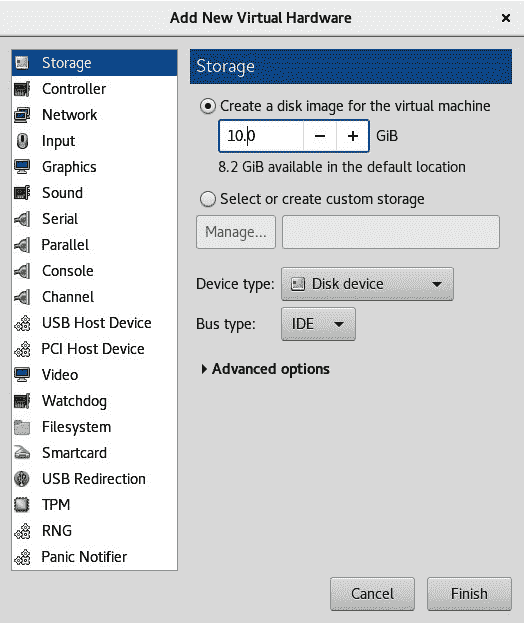

图 5.27 - 在 virt-manager 中添加虚拟磁盘

1.  如果要附加先前创建的`dbvm_disk2.img`镜像，选择`/vms`目录中的`dbvm_disk2.img`文件或在本地存储池中找到它，然后选择它并单击`/dev/sdb`）或磁盘分区（`/dev/sdb1`）或 LVM 逻辑卷。我们可以使用任何先前配置的存储池来存储此镜像，无论是作为文件还是对象，还是直接到块设备。

1.  点击`virsh`命令。

使用 virt-manager 创建虚拟磁盘非常简单——只需点击几下鼠标并输入一些内容。现在，让我们看看如何通过命令行来做到这一点，即使用`virsh`。

## 使用 virsh 附加磁盘

`virsh`是 virt-manager 的非常强大的命令行替代品。您可以在几秒钟内执行一个动作，而通过 virt-manager 等图形界面可能需要几分钟。它提供了`attach-disk`选项，用于将新的磁盘设备附加到虚拟机。与`attach-disk`一起提供了许多开关：

```
attach-disk domain source target [[[--live] [--config] | [--current]] | [--persistent]] [--targetbusbus] [--driver driver] [--subdriversubdriver] [--iothreadiothread] [--cache cache] [--type type] [--mode mode] [--sourcetypesourcetype] [--serial serial] [--wwnwwn] [--rawio] [--address address] [--multifunction] [--print-xml]
```

然而，在正常情况下，以下内容足以对虚拟机执行热添加磁盘附加：

```
# virsh attach-disk CentOS8 /vms/dbvm_disk2.img vdb --live --config
```

在这里，`CentOS8`是执行磁盘附加的虚拟机。然后是磁盘镜像的路径。`vdb`是目标磁盘名称，在宿主操作系统中可见。`--live`表示在虚拟机运行时执行操作，`--config`表示在重新启动后持久地附加它。不添加`--config`开关将使磁盘仅在重新启动前附加。

重要提示：

热插拔支持：在 Linux 宿主操作系统中加载`acpiphp`内核模块以识别热添加的磁盘；`acpiphp`提供传统的热插拔支持，而`pciehp`提供本地的热插拔支持。`pciehp`依赖于`acpiphp`。加载`acpiphp`将自动加载`pciehp`作为依赖项。

您可以使用`virsh domblklist <vm_name>`命令快速识别附加到虚拟机的 vDisks 数量。以下是一个示例：

```
# virsh domblklist CentOS8 --details
Type Device Target Source
------------------------------------------------
file disk vda /var/lib/libvirt/images/fedora21.qcow2
file disk vdb /vms/dbvm_disk2_seek.img
```

这清楚地表明连接到虚拟机的两个 vDisks 都是文件映像。它们分别显示为客户操作系统的`vda`和`vdb`，并且在主机系统上的磁盘映像路径的最后一列中可见。

接下来，我们将看到如何创建 ISO 库。

## 创建 ISO 镜像库

虚拟机上的客户操作系统虽然可以通过将主机的 CD/DVD 驱动器传递到虚拟机来从物理媒体安装，但这并不是最有效的方法。从 DVD 驱动器读取比从硬盘读取 ISO 文件慢，因此更好的方法是将用于安装操作系统和虚拟机应用程序的 ISO 文件（或逻辑 CD）存储在基于文件的存储池中，并创建 ISO 镜像库。

要创建 ISO 镜像库，可以使用 virt-manager 或`virsh`命令。让我们看看如何使用`virsh`命令创建 ISO 镜像库：

1.  首先，在主机系统上创建一个目录来存储`.iso`镜像：

```
# mkdir /iso
```

1.  设置正确的权限。它应该由 root 用户拥有，权限设置为`700`。如果 SELinux 处于强制模式，则需要设置以下上下文：

```
# chmod 700 /iso
# semanage fcontext -a -t virt_image_t "/iso(/.*)?"
```

1.  使用`virsh`命令定义 ISO 镜像库，如下面的代码块所示：

```
iso_library to demonstrate how to create a storage pool that will hold ISO images, but you are free to use any name you wish.
```

1.  验证是否已创建池（ISO 镜像库）：

```
# virsh pool-info iso_library
Name: iso_library
UUID: 959309c8-846d-41dd-80db-7a6e204f320e
State: running
Persistent: yes
Autostart: no
Capacity: 49.09 GiB
Allocation: 8.45 GiB
Available: 40.64 GiB
```

1.  现在可以将`.iso`镜像复制或移动到`/iso_lib`目录中。

1.  将`.iso`文件复制到`/iso_lib`目录后，刷新池，然后检查其内容：

```
# virsh pool-refresh iso_library
Pool iso_library refreshed
# virsh vol-list iso_library
Name Path
------------------------------------------------------------------
------------
CentOS8-Everything.iso /iso/CentOS8-Everything.iso
CentOS7-EVerything.iso /iso/CentOS7-Everything.iso
RHEL8.iso /iso/RHEL8.iso
Win8.iso /iso/Win8.iso
```

1.  这将列出存储在目录中的所有 ISO 镜像，以及它们的路径。这些 ISO 镜像现在可以直接与虚拟机一起用于客户操作系统的安装、软件安装或升级。

在今天的企业中，创建 ISO 镜像库是一种事实上的规范。最好有一个集中的地方存放所有的 ISO 镜像，并且如果需要在不同位置进行同步（例如`rsync`），这样做会更容易。

## 删除存储池

删除存储池相当简单。请注意，删除存储域不会删除任何文件/块设备。它只是将存储从 virt-manager 中断开。文件/块设备必须手动删除。

我们可以通过 virt-manager 或使用`virsh`命令删除存储池。让我们首先看看如何通过 virt-manager 进行操作：

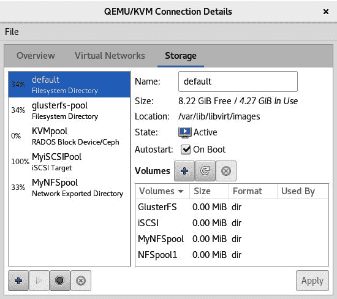

图 5.28–删除存储池

首先，选择红色停止按钮停止池，然后单击带有**X**的红色圆圈以删除池。

如果要使用`virsh`，那就更简单了。假设我们要删除上一个截图中名为`MyNFSpool`的存储池。只需输入以下命令：

```
virsh pool-destroy MyNFSpool
virsh pool-undefine MyNFSpool
```

创建存储池后的下一个逻辑步骤是创建存储卷。从逻辑上讲，存储卷将存储池划分为较小的部分。现在让我们学习如何做到这一点。

## 创建存储卷

存储卷是在存储池之上创建的，并作为虚拟磁盘附加到虚拟机。为了创建存储卷，启动存储管理控制台，导航到 virt-manager，然后单击**编辑** | **连接详细信息** | **存储**，并选择要创建新卷的存储池。单击创建新卷按钮（**+**）：

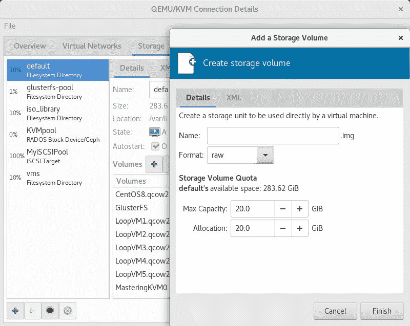

图 5.29–为虚拟机创建存储卷

接下来，提供新卷的名称，选择磁盘分配格式，并单击`virsh`命令。libvirt 支持几种磁盘格式（`raw`、`cow`、`qcow`、`qcow2`、`qed`和`vmdk`）。使用适合您环境的磁盘格式，并在`最大容量`和`分配`字段中设置适当的大小，以决定您是否希望选择预分配的磁盘分配或薄置备。如果在`qcow2`格式中保持磁盘大小不变，则不支持厚磁盘分配方法。

在[*第八章*]（B14834_08_Final_ASB_ePub.xhtml#_idTextAnchor143）*创建和修改 VM 磁盘、模板和快照*中，详细解释了所有磁盘格式。现在，只需了解`qcow2`是为 KVM 虚拟化专门设计的磁盘格式。它支持创建内部快照所需的高级功能。

## 使用 virsh 命令创建卷

使用`virsh`命令创建卷的语法如下：

```
# virsh vol-create-as dedicated_storage vm_vol1 10G
```

这里，`dedicated_storage`是存储池，`vm_vol1`是卷名称，10 GB 是大小。

```
# virsh vol-info --pool dedicated_storage vm_vol1
Name: vm_vol1
Type: file
Capacity: 1.00 GiB
Allocation: 1.00 GiB
```

`virsh`命令和参数用于创建存储卷，几乎不管它是在哪种类型的存储池上创建的，都几乎相同。只需输入适当的输入以使用`--pool`开关。现在，让我们看看如何使用`virsh`命令删除卷。

## 使用 virsh 命令删除卷

使用`virsh`命令删除卷的语法如下：

```
# virsh vol-delete dedicated_storage vm_vol2
```

执行此命令将从`dedicated_storage`存储池中删除`vm_vol2`卷。

我们存储之旅的下一步是展望未来，因为本章提到的所有概念多年来都广为人知，甚至有些已经有几十年的历史了。存储世界正在改变，朝着新的有趣方向发展，让我们稍微讨论一下。

# 存储的最新发展 - NVMe 和 NVMeOF

在过去的 20 年左右，就技术而言，存储世界最大的颠覆是**固态硬盘**（**SSD**）的引入。现在，我们知道很多人已经习惯在他们的计算机上使用它们 - 笔记本电脑、工作站，无论我们使用哪种类型的设备。但是，我们正在讨论虚拟化的存储和企业存储概念，这意味着我们常规的 SATA SSD 不够用。尽管很多人在中档存储设备和/或手工制作的存储设备中使用它们来托管 ZFS 池（用于缓存），但这些概念在最新一代存储设备中有了自己的生命。这些设备从根本上改变了技术的工作方式，并在现代 IT 历史的某些部分进行了重塑，包括使用的协议、速度有多快、延迟有多低，以及它们如何处理存储分层 - 分层是一个区分不同存储设备或它们的存储池的概念，通常是速度的能力。

让我们简要解释一下我们正在讨论的内容，通过一个存储世界的发展方向的例子。除此之外，存储世界正在带动虚拟化、云和 HPC 世界一起前进，因此这些概念并不离奇。它们已经存在于现成的存储设备中，您今天就可以购买到。

SSD 的引入显著改变了我们访问存储设备的方式。这一切都关乎性能和延迟，而像**高级主机控制器接口**（**AHCI**）这样的旧概念，我们今天市场上仍在积极使用，已经不足以处理 SSD 的性能。AHCI 是常规硬盘（机械硬盘或常规磁头）通过软件与 SATA 设备通信的标准方式。然而，关键部分是*硬盘*，这意味着圆柱、磁头扇区—这些 SSD 根本没有，因为它们不会旋转，也不需要那种范式。这意味着必须创建另一个标准，以便我们可以更本地地使用 SSD。这就是**非易失性内存扩展**（**NVMe**）的全部内容—弥合 SSD 的能力和实际能力之间的差距，而不使用从 SATA 到 AHCI 到 PCI Express（等等）的转换。

SSD 的快速发展速度和 NVMe 的整合使企业存储取得了巨大的进步。这意味着必须发明新的控制器、新的软件和完全新的架构来支持这种范式转变。随着越来越多的存储设备为各种目的集成 NVMe—主要是用于缓存，然后也用于存储容量—变得清楚的是，还有其他问题需要解决。其中第一个问题是我们将如何连接提供如此巨大能力的存储设备到我们的虚拟化、云或 HPC 环境。

在过去的 10 年左右，许多人争论说 FC 将从市场上消失，许多公司对不同的标准进行了押注—iSCSI、iSCSI over RDMA、NFS over RDMA 等。这背后的推理似乎足够坚实：

+   FC 很昂贵——它需要单独的物理交换机、单独的布线和单独的控制器，所有这些都需要花费大量的钱。

+   涉及许可证—当你购买一个拥有 40 个 FC 端口的 Brocade 交换机时，并不意味着你可以立即使用所有端口，因为需要许可证来获取更多端口（8 端口、16 端口等）。

+   FC 存储设备昂贵，并且通常需要更昂贵的磁盘（带有 FC 连接器）。

+   配置 FC 需要广泛的知识和/或培训，因为你不能简单地去配置一堆 FC 交换机给一个企业级公司，而不知道概念和交换机供应商的 CLI，还要知道企业的需求。

+   作为一种协议，FC 加速发展以达到新的速度的能力一直很差。简单来说，在 FC 从 8 Gbit/s 加速到 32 Gbit/s 的时间内，以太网从 1 Gbit/s 加速到 25、40、50 和 100 Gbit/s 的带宽。已经有关于 400 Gbit/s 以太网的讨论，也有第一个支持该标准的设备。这通常会让客户感到担忧，因为更高的数字意味着更好的吞吐量，至少在大多数人的想法中是这样。

但市场上*现在*发生的事情告诉我们一个完全不同的故事—不仅 FC 回来了，而且它回来了有使命。企业存储公司已经接受了这一点，并开始推出具有*疯狂*性能水平的存储设备（首先是 NVMe SSD 的帮助）。这种性能需要转移到我们的虚拟化、云和 HPC 环境中，这需要最佳的协议，以实现最低的延迟、设计、质量和可靠性，而 FC 具备所有这些。

这导致了第二阶段，NVMe SSD 不仅被用作缓存设备，而且也被用作容量设备。

请注意，目前存储内存/存储互连市场上正在酝酿一场大战。有多种不同的标准试图与英特尔的**快速路径互连**（**QPI**）竞争，这项技术已经在英特尔 CPU 中使用了十多年。如果这是你感兴趣的话题，本章末尾有一个链接，在*进一步阅读*部分，你可以找到更多信息。基本上，QPI 是一种点对点互连技术，具有低延迟和高带宽，是当今服务器的核心。具体来说，它处理 CPU 之间、CPU 和内存、CPU 和芯片组等之间的通信。这是英特尔在摆脱**前端总线**（**FSB**）和芯片组集成内存控制器后开发的技术。FSB 是一个在内存和 I/O 请求之间共享的总线。这种方法具有更高的延迟，不易扩展，带宽较低，并且在内存和 I/O 端发生大量 I/O 的情况下存在问题。在切换到内存控制器成为 CPU 的一部分的架构后（因此，内存直接连接到它），对于英特尔最终转向这种概念是至关重要的。

如果你更熟悉 AMD CPU，QPI 对英特尔来说就像内置内存控制器的 CPU 上的 HyperTransport 总线对 AMD CPU 来说一样。

随着 NVMe SSD 变得更快，PCI Express 标准也需要更新，这就是为什么最新版本（PCIe 4.0 - 最新产品最近开始发货）如此受期待的原因。但现在，焦点已经转移到需要解决的另外两个问题。让我们简要描述一下：

+   第一个问题很简单。对于普通计算机用户，在 99%或更多的情况下，一两个 NVMe SSD 就足够了。实际上，普通计算机用户需要更快的 PCIe 总线的唯一真正原因是为了更快的显卡。但对于存储制造商来说，情况完全不同。他们希望生产企业存储设备，其中将有 20、30、50、100、500 个 NVMe SSD 在一个存储系统中-他们希望现在就能做到这一点，因为 SSD 作为一种技术已经成熟并且广泛可用。

+   第二个问题更为复杂。更令人沮丧的是，最新一代的 SSD（例如基于英特尔 Optane 的 SSD）可以提供更低的延迟和更高的吞吐量。随着技术的发展，这种情况只会变得更糟（更低的延迟，更高的吞吐量）。对于今天的服务-虚拟化、云和 HPC-存储系统能够处理我们可能投入其中的任何负载是至关重要的。这些技术在存储设备变得更快的程度上是真正的游戏改变者，只要互连能够处理它（QPI、FC 等）。从英特尔 Optane 衍生出的两个概念-**存储级内存**（**SCM**）和**持久内存**（**PM**）是存储公司和客户希望快速采用到他们的存储系统中的最新技术。

+   第三个问题是如何将所有这些带宽和 I/O 能力传输到使用它们的服务器和基础设施。这就是为什么创建了**NVMe over Fabrics**（**NVMe-OF**）的概念，试图在存储基础设施堆栈上工作，使 NVMe 对其消费者更加高效和快速。

从概念上看，几十年来，RAM 样的内存是我们拥有的最快、最低延迟的技术。逻辑上，我们正在尽可能地将工作负载转移到 RAM。想想内存数据库（如 Microsoft SQL、SAP Hana 和 Oracle）。它们已经存在多年了。

这些技术从根本上改变了我们对存储的看法。基本上，我们不再讨论基于技术（SSD 与 SAS 与 SATA）或纯粹速度的存储分层，因为速度是不容置疑的。最新的存储技术讨论存储分层是基于*延迟*。原因非常简单——假设你是一个存储公司，你建立了一个使用 50 个 SCM SSD 作为容量的存储系统。对于缓存，唯一合理的技术将是 RAM，数百 GB 的 RAM。你能够在这样的设备上使用存储分层的唯一方法就是通过在软件中*模拟*它，通过创建额外的技术来产生基于排队、处理缓存（RAM）中的优先级和类似概念的分层式服务。为什么？因为如果你使用相同的 SCM SSD 作为容量，并且它们提供相同的速度和 I/O，你就无法基于技术或能力进行分层。

让我们通过使用一个可用的存储系统来进一步解释这一点。最好的设备来阐明我们的观点是戴尔/EMC 的 PowerMax 系列存储设备。如果你用 NVMe 和 SCM SSD 装载它们，最大型号（8000）可以扩展到 1500 万 IOPS(!)，350GB/s 吞吐量，低于 100 微秒的延迟，容量高达 4PB。想一想这些数字。然后再加上另一个数字——在前端，它可以有高达 256 个 FC/FICON/iSCSI 端口。就在最近，戴尔/EMC 发布了新的 32 Gbit/s FC 模块。较小的 PowerMax 型号（2000）可以做到 750 万 IOPS，低于 100 微秒的延迟，并扩展到 1PB。它还可以做所有*通常的 EMC 功能*——复制、压缩、去重、快照、NAS 功能等等。所以，这不仅仅是市场宣传；这些设备已经存在，并被企业客户使用：


图 3.30 – PowerMax 2000 – 看起来很小，但功能强大

这些对于未来非常重要，因为越来越多的制造商生产类似的设备（它们正在途中）。我们完全期待基于 KVM 的世界在大规模环境中采用这些概念，特别是对于具有 OpenStack 和 OpenShift 基础设施的情况。

# 总结

在本章中，我们介绍并配置了 libvirt 的各种开源存储概念。我们还讨论了行业标准的方法，比如 iSCSI 和 NFS，因为它们经常在不基于 KVM 的基础设施中使用。例如，基于 VMware vSphere 的环境可以使用 FC、iSCSI 和 NFS，而基于 Microsoft 的环境只能使用 FC 和 iSCSI，从我们在本章中涵盖的主题列表中选择。

下一章将涵盖与虚拟显示设备和协议相关的主题。我们将深入介绍 VNC 和 SPICE 协议。我们还将描述其他用于虚拟机连接的协议。所有这些将帮助我们理解我们在过去三章中涵盖的与虚拟机一起工作所需的完整基础知识栈。

# 问题

1.  什么是存储池？

1.  NFS 存储如何与 libvirt 一起工作？

1.  iSCSI 如何与 libvirt 一起工作？

1.  我们如何在存储连接上实现冗余？

1.  除了 NFS 和 iSCSI，我们可以用什么来作为虚拟机存储？

1.  我们可以使用哪种存储后端来进行基于对象的存储与 libvirt 的连接？

1.  我们如何创建一个虚拟磁盘映像以供 KVM 虚拟机使用？

1.  使用 NVMe SSD 和 SCM 设备如何改变我们创建存储层的方式？

1.  为虚拟化、云和 HPC 环境提供零层存储服务的基本问题是什么？

# 进一步阅读

有关本章涵盖内容的更多信息，请参考以下链接：

+   RHEL8 文件系统和存储的新功能：[`www.redhat.com/en/blog/whats-new-rhel-8-file-systems-and-storage`](https://www.redhat.com/en/blog/whats-new-rhel-8-file-systems-and-storage)

+   oVirt 存储：[`www.ovirt.org/documentation/administration_guide/#chap-Storage`](https://www.ovirt.org/documentation/administration_guide/#chap-Storage)

+   RHEL 7 存储管理指南：[`access.redhat.com/documentation/en-us/red_hat_enterprise_linux/7/html/storage_administration_guide/index`](https://access.redhat.com/documentation/en-us/red_hat_enterprise_linux/7/html/storage_administration_guide/index)

+   RHEL 8 管理存储设备：[`access.redhat.com/documentation/en-us/red_hat_enterprise_linux/8/html/managing_storage_devices/index`](https://access.redhat.com/documentation/en-us/red_hat_enterprise_linux/8/html/managing_storage_devices/index)

+   OpenFabrics CCIX，Gen-Z，OpenCAPI（概述和比较）：[`www.openfabrics.org/images/eventpresos/2017presentations/213_CCIXGen-Z_BBenton.pdf`](https://www.openfabrics.org/images/eventpresos/2017presentations/213_CCIXGen-Z_BBenton.pdf)
