# 第六章：*第六章*：虚拟显示设备和协议

在本章中，我们将讨论通过虚拟图形卡和协议访问虚拟机的方式。我们可以在虚拟机中使用近 10 种可用的虚拟显示适配器，并且有多种可用的协议和应用程序可以用来访问我们的虚拟机。除了 SSH 和任何一般的基于控制台的访问，市场上还有各种协议可供我们使用来访问虚拟机的控制台，如 VNC、SPICE 和 noVNC。

在基于 Microsoft 的环境中，我们倾向于使用**远程桌面协议**（**RDP**）。如果我们谈论**虚拟桌面基础设施**（**VDI**），那么甚至有更多的协议可用 - **PC over IP**（**PCoIP**）、VMware Blast 等等。其中一些技术提供了额外的功能，如更大的色深、加密、音频和文件系统重定向、打印机重定向、带宽管理以及 USB 和其他端口重定向。这些是当今云计算世界中远程桌面体验的关键技术。

所有这些意味着我们必须花更多的时间和精力去了解各种显示设备和协议，以及如何配置和使用它们。我们不希望出现这样的情况，即因为选择了错误的虚拟显示设备而无法看到虚拟机的显示，或者尝试打开控制台查看虚拟机内容时控制台无法打开的情况。

在本章中，我们将涵盖以下主题：

+   使用虚拟机显示设备

+   讨论远程显示协议

+   使用 VNC 显示协议

+   使用 SPICE 显示协议

+   使用 NoVNC 实现显示可移植性

+   让我们开始吧！

# 使用虚拟机显示设备

为了使虚拟机上的图形工作，QEMU 需要为其虚拟机提供两个组件：虚拟图形适配器和从客户端访问图形的方法或协议。让我们讨论这两个概念，从虚拟图形适配器开始。最新版本的 QEMU 有八种不同类型的虚拟/仿真图形适配器。所有这些都有一些相似之处和差异，这些差异可能是在功能和/或支持的分辨率方面，或者其他更多技术细节方面。因此，让我们描述它们，并看看我们将为特定虚拟图形卡偏爱哪些用例：

+   **tcx**：一种 SUN TCX 虚拟图形卡，可用于旧的 SUN 操作系统。

+   **cirrus**：一种基于旧的 Cirrus Logic GD5446 VGA 芯片的虚拟图形卡。它可以与 Windows 95 之后的任何客户操作系统一起使用。

+   **std**：一种标准的 VGA 卡，可用于 Windows XP 之后的客户操作系统的高分辨率模式。

+   **vmware**：VMware 的 SVGA 图形适配器，在 Linux 客户操作系统中需要额外的驱动程序和 Windows 操作系统中需要安装 VMware Tools。

+   **QXL**：事实上的标准半虚拟图形卡，当我们使用 SPICE 远程显示协议时需要使用，我们稍后将在本章中详细介绍。这个虚拟图形卡的旧版本称为 QXL VGA，它缺少一些更高级的功能，但提供更低的开销（使用更少的内存）。

+   **Virtio**：一种基于 virgl 项目的半虚拟 3D 虚拟图形卡，为 QEMU 客户操作系统提供 3D 加速。它有两种不同的类型（VGA 和 gpu）。virtio-vga 通常用于需要多显示器支持和 OpenGL 硬件加速的情况。virtio-gpu 版本没有内置的标准 VGA 兼容模式。

+   **cg3**：一种虚拟图形卡，可用于较旧的基于 SPARC 的客户操作系统。

+   **none**：禁用客户操作系统中的图形卡。

在配置虚拟机时，您可以在启动或创建虚拟机时选择这些选项。在 CentOS 8 中，分配给新创建的虚拟机的默认虚拟图形卡是**QXL**，如下面的新虚拟机配置的屏幕截图所示：

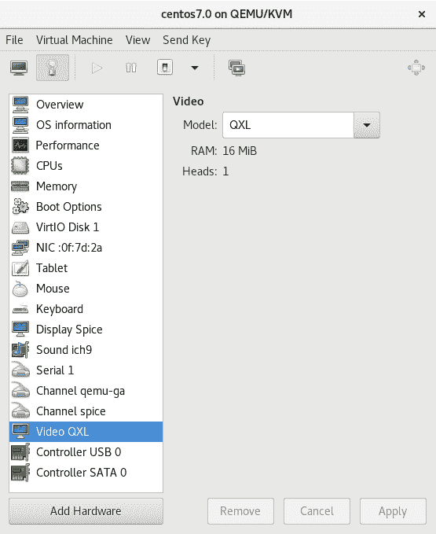

图 6.1 - 客户操作系统的默认虚拟图形卡 - QXL

此外，默认情况下，我们可以为任何给定的虚拟机选择这三种类型的虚拟图形卡，因为这些通常已经预先安装在为虚拟化配置的任何 Linux 服务器上：

+   QXL

+   VGA

+   Virtio

在 KVM 虚拟化中运行的一些新操作系统不应该使用旧的图形卡适配器，原因有很多。例如，自从 Red Hat Enterprise Linux/CentOS 7 以来，有一个建议不要为 Windows 10 和 Windows Server 2016 使用 cirrus 虚拟图形卡。原因是虚拟机的不稳定性，以及 - 例如 - 您无法使用 cirrus 虚拟图形卡进行全高清分辨率显示。以防万一您开始安装这些客户操作系统，请确保您使用 QXL 视频图形卡，因为它提供了最佳性能和与 SPICE 远程显示协议的兼容性。

从理论上讲，您仍然可以为一些*非常*老的客户操作系统（旧的 Windows NT，如 4.0 和旧的客户操作系统，如 Windows XP）使用 cirrus 虚拟图形卡，但仅限于此。对于其他所有情况，最好使用 std 或 QXL 驱动程序，因为它们提供了最佳的性能和加速支持。此外，这些虚拟图形卡还提供更高的显示分辨率。

QEMU 还提供了一些其他虚拟图形卡，例如各种**片上系统**（**SoC**）设备的嵌入式驱动程序，ati vga，bochs 等。其中一些经常被使用，比如 SoCs - 只需记住世界上所有的树莓派和 BBC Micro:bits。这些新的虚拟图形选项还通过**物联网**（**IoT**）得到进一步扩展。因此，有很多很好的理由让我们密切关注这个市场空间中发生的事情。

让我们通过一个例子来展示这一点。假设我们想创建一个新的虚拟机，并为其分配一组自定义参数，以便我们访问其虚拟显示。如果您还记得*第三章*，*安装 KVM Hypervisor、libvirt 和 ovirt*，我们讨论了各种 libvirt 管理命令（`virsh`、`virt-install`），并使用`virt-install`创建了一些虚拟机和一些自定义参数。让我们在这些基础上添加一些内容，并使用一个类似的例子：

```
virt-install --virt-type=kvm --name MasteringKVM01 --vcpus 2  --ram 4096 --os-variant=rhel8.0 --/iso/CentOS-8-x86_64-1905-dvd1.iso --network=default --video=vga --graphics vnc,password=Packt123 --disk size=16
```

以下是将要发生的事情：

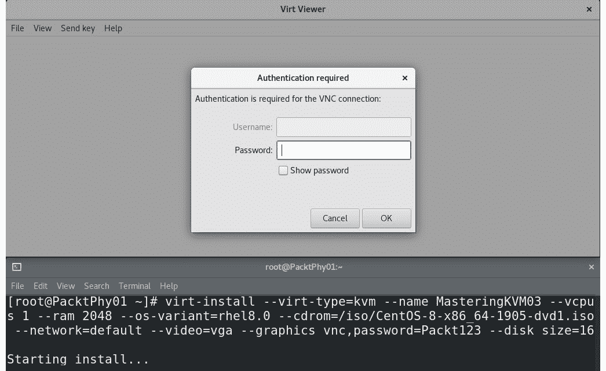

图 6.2 - 创建了一个带有 VGA 虚拟图形卡的 KVM 虚拟机。在这里，VNC 要求指定密码

在我们输入密码（`Packt123`，如在 virt-install 配置选项中指定的那样）之后，我们面对这个屏幕：

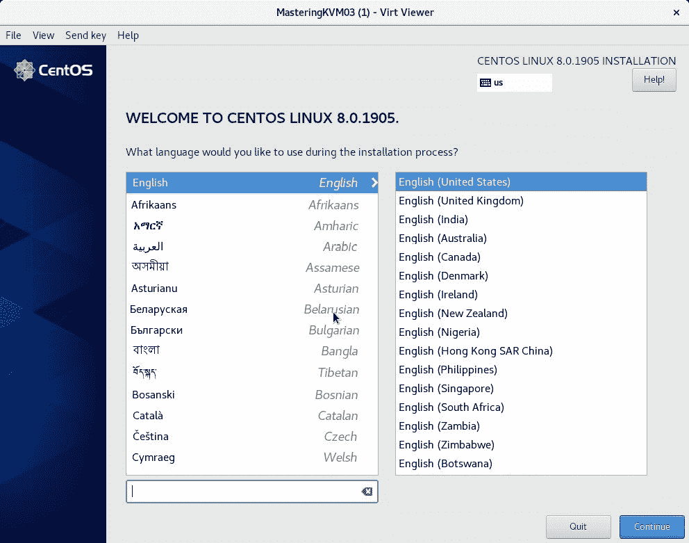

图 6.3 - VGA 显示适配器及其低默认（640x480）初始分辨率 - 对于在 80 年代长大的我们来说是一个熟悉的分辨率

也就是说，我们只是用这个作为一个例子，来展示如何向`virt-install`命令添加一个高级选项 - 具体来说，如何使用特定的虚拟图形卡安装虚拟机。

还有其他更高级的概念，即使用我们在计算机或服务器上安装的真实图形卡，将它们的*功能*直接转发给虚拟机。这对于 VDI 等概念非常重要，正如我们之前提到的。让我们讨论一下这些概念，并使用一些真实世界的例子和比较来理解大规模 VDI 解决方案的复杂性。

## VDI 场景中的物理和虚拟图形卡

正如我们在《第一章》中讨论的那样，《理解 Linux 虚拟化》，VDI 是一个利用虚拟化范式来为客户端操作系统提供服务的概念。这意味着最终用户通过运行客户端操作系统（例如 Windows 8.1、Windows 10 或 Linux Mint）*直接*连接到他们的虚拟机，这些虚拟机要么是*专门*为他们保留的，要么是*共享*的，这意味着多个用户可以访问相同的虚拟机并通过额外的 VDI 功能访问它们的*数据*。

现在，如果我们谈论大多数商业用户，他们只需要我们开玩笑称之为*打字机*的东西。这种使用模式涉及用户使用客户端操作系统阅读和撰写文件、电子邮件和浏览互联网。对于这些用例，如果我们要使用任何供应商的解决方案（VMware 的 Horizon、Citrix 的 Xen Desktop 或微软基于远程桌面服务的 VDI 解决方案），我们可以使用其中任何一个。

然而，有一个很大的*但是*。如果场景包括数百名需要访问 2D 和/或 3D 视频加速的用户会发生什么？如果我们正在为一个创建设计的公司设计 VDI 解决方案——比如建筑、管道、石油和天然气以及视频制作？基于 CPU 和软件虚拟图形卡的 VDI 解决方案在这种情况下将毫无作为，特别是在大规模情况下。这就是 Xen Desktop 和 Horizon 在技术水平上要更加功能丰富的地方。而且，说实话，基于 KVM 的方法在显示选项方面并不逊色，只是在一些其他企业级功能上稍显不足，我们将在后面的章节中讨论这些功能，比如《第十二章》，*使用 OpenStack 扩展 KVM*。

基本上，我们可以使用三个概念来获得虚拟机的图形卡性能：

+   我们可以使用基于 CPU 的软件渲染器。

+   我们可以为特定的虚拟机保留一个 GPU（PCI 直通）。

+   我们可以*分区*一个 GPU，这样我们可以在多个虚拟机中使用它。

仅使用 VMware Horizon 解决方案作为比喻，这些解决方案将被称为 CPU 渲染、**虚拟直接图形加速**（**vDGA**）和**虚拟共享图形加速**（**vSGA**）。或者在 Citrix 中，我们会谈论 HDX 3D Pro。在 CentOS 8 中，我们在共享图形卡方案中谈论*中介设备*。

如果我们谈论 PCI 直通，它绝对能提供最佳性能，因为你可以使用 PCI-Express 图形卡，直接转发给虚拟机，在客户操作系统内安装本机驱动程序，并完全拥有图形卡。但这会带来四个问题：

+   你只能将 PCI-Express 图形卡转发给*一个*虚拟机。

+   由于服务器在升级方面可能存在限制，例如，你不能像在一台物理服务器上那样运行 50 个虚拟机，因为你无法在单个服务器上放置 50 个图形卡——无论是从物理上还是从 PCI-Express 插槽上来看，通常情况下在一个典型的 2U 机架服务器上最多只有六个。

+   如果你使用刀片服务器（例如，HP c7000），情况会更糟，因为如果你要使用额外的图形卡，那么每个刀片机箱的服务器密度将减半，因为这些卡只能安装在双高刀片上。

+   如果您要将任何这类解决方案扩展到数百个虚拟桌面，甚至更糟的是数千个虚拟桌面，您将花费大量资金。

如果我们谈论的是一种共享方法，即将物理图形卡分区，以便在多个虚拟机中使用它，那么这将产生另一组问题：

+   在选择要使用的图形卡方面，您的选择要受到更多限制，因为可能只有大约 20 种图形卡支持这种使用模式（其中一些包括 NVIDIA GRID、Quadro、Tesla 卡以及几张 AMD 和英特尔卡）。

+   如果您与四、八、十六或三十二个虚拟机共享同一块图形卡，您必须意识到您的性能会降低，因为您正在与多个虚拟机共享同一块 GPU。

+   与 DirectX、OpenGL、CUDA 和视频编码卸载的兼容性可能不如您期望的那样好，您可能会被迫使用这些标准的较旧版本。

+   可能会涉及额外的许可证，这取决于供应商和解决方案。

我们列表上的下一个主题是如何更高级地使用 GPU - 通过使用 GPU 分区概念将 GPU 的部分提供给多个虚拟机。让我们解释一下这是如何工作的，并通过使用 NVIDIA GPU 作为示例来配置它。

使用 NVIDIA vGPU 作为示例的 GPU 分区

让我们使用一个示例来看看我们如何使用分区我们的 GPU（NVIDIA vGPU）与我们基于 KVM 的虚拟机。这个过程与我们在*第四章*中讨论的 SR-IOV 过程非常相似，*Libvirt Networking*，在那里我们使用受支持的英特尔网络卡将虚拟功能呈现给我们的 CentOS 主机，然后通过将它们用作 KVM 虚拟桥的上行链路来呈现给我们的虚拟机。

首先，我们需要检查我们有哪种类型的显卡，它必须是受支持的（在我们的情况下，我们使用的是 Tesla P4）。让我们使用`lshw`命令来检查我们的显示设备，它应该看起来类似于这样：

```
# yum -y install lshw
# lshw -C display
*-display
       description: 3D controller
       product: GP104GL [Tesla P4]
       vendor: NVIDIA Corporation
       physical id: 0
       bus info: pci@0000:01:00.0
       version: a0
       width: 64 bits
       clock: 33MHz
       capabilities: pm msi pciexpress cap_list
       configuration: driver=vfio-pci latency=0
       resources: irq:15 memory:f6000000-f6ffffff memory:e0000000-efffffff memory:f0000000-f1ffffff
```

这个命令的输出告诉我们我们有一个支持 3D 的 GPU - 具体来说，是基于 NVIDIA GP104GL 的产品。它告诉我们这个设备已经在使用`vfio-pci`驱动程序。这个驱动程序是**虚拟化功能**（**VF**）的本机 SR-IOV 驱动程序。这些功能是 SR-IOV 功能的核心。我们将使用这个 SR-IOV 兼容的 GPU 来描述这一点。

我们需要做的第一件事 - 我们所有的 NVIDIA GPU 用户多年来一直在做的事情 - 是将 nouveau 驱动程序列入黑名单，因为它会妨碍我们。如果我们要永久使用 GPU 分区，我们需要永久地这样做，这样在服务器启动时就不会加载它。但要警告一下 - 这有时会导致意外行为，比如服务器启动时没有任何输出而没有任何真正的原因。因此，我们需要为`modprobe`创建一个配置文件，将 nouveau 驱动程序列入黑名单。让我们在`/etc/modprobe.d`目录中创建一个名为`nouveauoff.conf`的文件，内容如下：

```
blacklist nouveau
options nouveau modeset 0
```

然后，我们需要强制服务器重新创建在服务器启动时加载的`initrd`映像，并重新启动服务器以使更改生效。我们将使用`dracut`命令来执行此操作，然后是常规的`reboot`命令：

```
# dracut –-regenerate-all –force
# systemctl reboot
```

重新启动后，让我们检查 NVIDIA 图形卡的`vfio`驱动程序是否已加载，如果已加载，请检查 vGPU 管理器服务：

```
# lsmod | grep nvidia | grep vfio
nvidia_vgpu_vfio 45011 0
nvidia 14248203 10 nvidia_vgpu_vfio
mdev 22078 2 vfio_mdev,nvidia_vgpu_vfio
vfio 34373 3 vfio_mdev,nvidia_vgpu_vfio,vfio_iommu_type1
# systemctl status nvidia-vgpu-mgr
vidia-vgpu-mgr.service - NVIDIA vGPU Manager Daemon
   Loaded: loaded (/usr/lib/systemd/system/nvidia-vgpu-mgr.service; enabled; vendor preset: disabled)
   Active: active (running) since Thu 2019-12-12 20:17:36 CET; 0h 3min ago
 Main PID: 1327 (nvidia-vgpu-mgr)
```

我们需要创建一个 UUID，我们将使用它来向 KVM 虚拟机呈现我们的虚拟功能。我们将使用`uuidgen`命令来执行此操作：

```
uuidgen
c7802054-3b97-4e18-86a7-3d68dff2594d
```

现在，让我们使用这个 UUID 来为将共享我们的 GPU 的虚拟机。为此，我们需要创建一个 XML 模板文件，然后以复制粘贴的方式将其添加到我们虚拟机的现有 XML 文件中。让我们称之为`vsga.xml`：

```
<hostdev mode='subsystem' type='mdev' managed='no' model='vfio-pci'>
  <source>
    <address uuid='c7802054-3b97-4e18-86a7-3d68dff2594d'/>
  </source>
</hostdev>
```

使用这些设置作为模板，只需将完整内容复制粘贴到任何虚拟机的 XML 文件中，您希望访问我们共享的 GPU。

我们需要讨论的下一个概念是 SR-IOV 的完全相反，其中我们将设备切片成多个部分，以将这些部分呈现给虚拟机。在 GPU 直通中，我们将*整个*设备直接呈现给*一个*对象，即一个虚拟机。让我们学习如何配置它。

## GPU PCI 直通

与每个高级功能一样，启用 GPU PCI 直通需要按顺序完成多个步骤。通过按照正确的顺序执行这些步骤，我们直接将这个硬件设备呈现给虚拟机。让我们解释这些配置步骤并执行它们：

1.  要启用 GPU PCI 直通，我们需要在服务器的 BIOS 中配置和启用 IOMMU，然后在 Linux 发行版中启用。我们使用基于 Intel 的服务器，因此我们需要向`/etc/default/grub`文件中添加`iommu`选项，如下截图所示：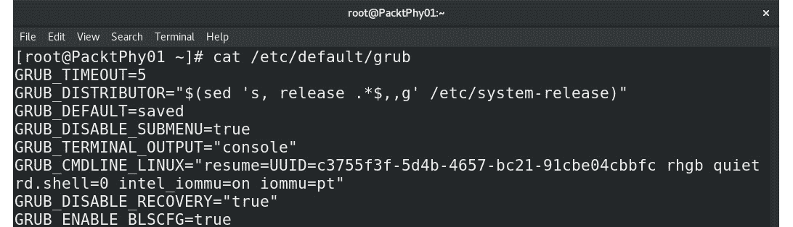

图 6.4 - 向 GRUB 文件添加 intel_iommu iommu=pt 选项

1.  下一步是重新配置 GRUB 配置并重新启动它，可以通过输入以下命令来实现：

```
# grub2-mkconfig -o /etc/grub2.cfg
# systemctl reboot
```

1.  重新启动主机后，我们需要获取一些信息 - 具体来说，是关于我们要转发到虚拟机的 GPU 设备的 ID 信息。让我们这样做：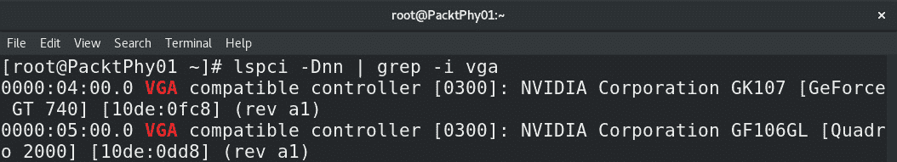

图 6.5 - 使用 lspci 显示相关配置信息

在我们的用例中，我们希望将 Quadro 2000 卡转发到我们的虚拟机，因为我们正在使用 GT740 连接我们的显示器，而 Quadro 卡目前没有任何工作负载或连接。因此，我们需要记下两个数字；即`0000:05:00.0`和`10de:0dd8`。

我们将需要这两个 ID 继续前进，每个 ID 用于定义我们要使用的设备和位置。

1.  下一步是向我们的主机操作系统解释，它不会为自己使用这个 PCI Express 设备（Quadro 卡）。为了做到这一点，我们需要再次更改 GRUB 配置，并向同一文件(`/etc/defaults/grub`)添加另一个参数：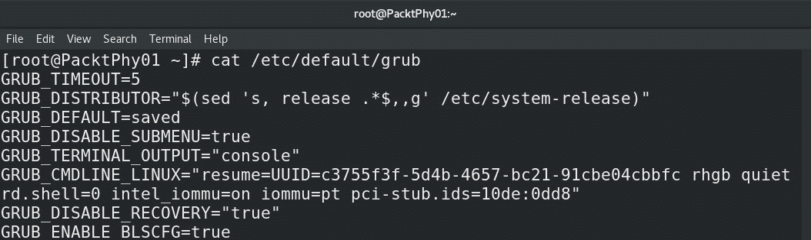

```
# grub2-mkconfig -o /etc/grub2.cfg
# systemctl reboot
```

这一步标志着*物理*服务器配置的结束。现在，我们可以继续进行下一阶段的过程，即如何在虚拟机中使用现在完全配置的 PCI 直通设备。

1.  让我们通过使用`virsh nodedev-dumpxml`命令检查是否一切都正确完成了，检查 PCI 设备 ID：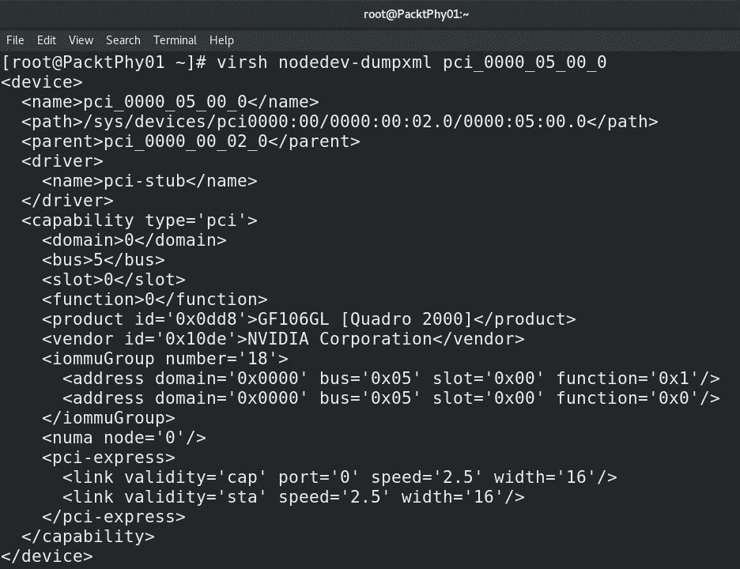

图 6.7 - 检查 KVM 堆栈是否能看到我们的 PCIe 设备

在这里，我们可以看到 QEMU 看到了两个功能：`0x1`和`0x0`。`0x1`功能实际上是 GPU 设备的*音频*芯片，我们不会在我们的过程中使用它。我们只需要`0x0`功能，即 GPU 本身。这意味着我们需要屏蔽它。我们可以通过使用以下命令来实现：

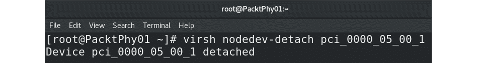

图 6.8 - 分离 0x1 设备，以便它不能用于直通

1.  现在，让我们通过 PCI 直通将 GPU 添加到我们的虚拟机。为此，我们使用了一个名为`MasteringKVM03`的新安装的虚拟机，但您可以使用任何您想要的虚拟机。我们需要创建一个 XML 文件，QEMU 将使用它来知道要添加到虚拟机的设备。之后，我们需要关闭机器并将该 XML 文件导入到我们的虚拟机中。在我们的情况下，XML 文件将如下所示：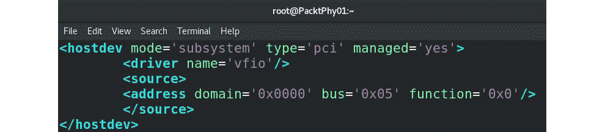

图 6.9 - 用于 KVM 的 GPU PCI 直通定义的 XML 文件

1.  下一步是将这个 XML 文件附加到`MasteringKVM03`虚拟机上。我们可以使用`virsh attach-device`命令来实现这一点：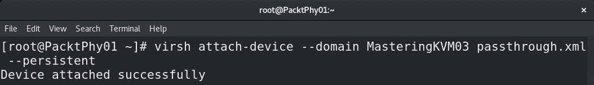

图 6.10-将 XML 文件导入域/虚拟机

1.  在上一步之后，我们可以启动虚拟机，登录，并检查虚拟机是否看到了我们的 GPU：

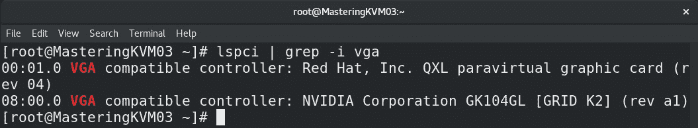

图 6.11-检查虚拟机中 GPU 的可见性

下一个合乎逻辑的步骤将是为 Linux 安装这张卡的 NVIDIA 驱动程序，这样我们就可以自由地将其用作我们的独立 GPU。

现在，让我们继续讨论与远程显示协议相关的另一个重要主题。在本章的前一部分中，我们也围绕这个主题打转了一下，但现在我们要正面对待它。

# 讨论远程显示协议

正如我们之前提到的，有不同的虚拟化解决方案，因此访问虚拟机的方法也是多种多样的。如果你看一下虚拟机的历史，你会发现有许多不同的显示协议来解决这个特定的问题。因此，让我们稍微讨论一下这段历史。

## 远程显示协议历史

会有人对这个前提提出异议，但远程协议最初是文本协议。无论你怎么看，串行、文本模式终端在微软、苹果和基于 UNIX 的世界中的 X Windows 或任何类似 GUI 的东西出现之前就已经存在了。此外，你无法否认的是 telnet 和 rlogin 协议也用于访问远程显示。恰巧我们通过 telnet 和 rlogin 访问的远程显示是基于文本的显示。同样的情况也适用于 SSH。串行终端、文本控制台和 telnet、rlogin 等基于文本的协议是一些最常用的起点，可以追溯到上世纪 70 年代。

20 世纪 70 年代末是计算机历史上的重要时刻，因为当时有许多尝试为大量人群开始大规模生产个人计算机（例如，1977 年的 Apple II）。在 20 世纪 80 年代，人们开始更多地使用个人计算机，任何 Amiga、Commodore、Atari、Spectrum 或 Amstrad 的粉丝都会告诉你。请记住，真正的、公开可用的基于 GUI 的操作系统直到 Xerox Star（1981）和 Apple Lisa（1983）才开始出现。第一个广泛可用的基于苹果的 GUI 操作系统是 1984 年的 Mac OS System 1.0。大多数其他先前提到的计算机都在使用基于文本的操作系统。即使是那个时代的游戏（以及很多年后的游戏）看起来都像是手绘的。Amiga 的 Workbench 1.0 于 1985 年发布，其 GUI 和颜色使用模型使其领先于时代。然而，1985 年可能会因为另一件事而被记住-这是第一个微软 Windows 操作系统（v1.0）发布的年份。后来，它变成了 Windows 2.0（1987）、Windows 3.0（1990）、Windows 3.1（1992），到那时微软已经开始在操作系统世界中掀起风暴。是的，其他制造商也有其他操作系统：

+   苹果：Mac OS System 7 (1991)

+   IBM: OS/2 v1 (1988), v1.2 (1989), v2.0 (1992), Warp 4 (1996)

所有这些与 1995 年发生的大风暴相比只是一个小点。那一年，微软推出了 Windows 95。这是微软首个能够默认启动到 GUI 的客户端操作系统，因为之前的版本都是从命令行启动的。然后是 Windows 98 和 XP，这意味着微软获得了更多的市场份额。后来的故事可能非常熟悉，包括 Vista、Windows 7、Windows 8 和 Windows 10。

这个故事的重点不是教你有关操作系统历史本身的知识。它是关于注意到趋势，这足够简单。我们从命令行中的文本界面开始（例如，IBM 和 MS DOS，早期的 Windows，Linux，UNIX，Amiga，Atari 等）。然后，我们慢慢地转向更加视觉化的界面（GUI）。随着网络、GPU、CPU 和监控技术的进步，我们已经达到了一个阶段，我们希望拥有一个闪亮的、4K 分辨率的显示器，4 兆像素的分辨率，低延迟，强大的 CPU 性能，出色的颜色以及特定的用户体验。这种用户体验需要是即时的，而且我们使用本地操作系统或远程操作系统（VDI、云或其他背景技术）并不重要。

这意味着除了我们刚提到的所有硬件组件之外，还需要开发其他（软件）组件。具体来说，需要开发的是高质量的远程显示协议，这些协议现在必须能够扩展到基于浏览器的使用模型。人们不想被迫安装额外的应用程序（客户端）来访问他们的远程资源。

## 远程显示协议的类型

让我们只提一下目前市场上非常活跃的一些协议：

+   Microsoft 远程桌面协议/Remote FX：由远程桌面连接使用，这种多通道协议允许我们连接到基于 Microsoft 的虚拟机。

+   VNC：Virtual Network Computing 的缩写，这是一个远程桌面共享系统，用于传输鼠标和键盘事件以访问远程机器。

+   SPICE：独立计算环境的简单协议的缩写，这是另一种远程显示协议，可用于访问远程机器。它是由 Qumranet 开发的，后来被 Red Hat 收购。

如果我们进一步扩展我们的协议列表，用于 VDI 的协议，那么列表将进一步增加：

+   Teradici PCoIP（PC over IP）：基于 UDP 的 VDI 协议，我们可以使用它来访问 VMware、Citrix 和基于 Microsoft 的 VDI 解决方案上的虚拟机

+   VMware Blast Extreme：VMware 针对 VMware Horizon 基于 VDI 解决方案的 PcoIP 的答案

+   Citrix HDX：Citrix 用于虚拟桌面的协议。

当然，还有其他可用但使用较少且不太重要的协议，例如以下内容：

+   Colorado CodeCraft

+   OpenText Exceed TurboX

+   NoMachine

+   FreeNX

+   Apache Guacamole

+   Chrome 远程桌面

+   Miranex

常规远程协议和完整功能的 VDI 协议之间的主要区别与附加功能有关。例如，在 PCoIP、Blast Extreme 和 HDX 上，您可以微调带宽设置，控制 USB 和打印机重定向（手动或通过策略集中控制），使用多媒体重定向（以卸载媒体解码），Flash 重定向（以卸载 Flash），客户端驱动器重定向，串口重定向等等。例如，您无法在 VNC 或远程桌面上执行其中一些操作。

话虽如此，让我们讨论一下开源世界中最常见的两种：VNC 和 SPICE。

# 使用 VNC 显示协议

当通过 libvirt 启用 VNC 图形服务器时，QEMU 将将图形输出重定向到其内置的 VNC 服务器实现。VNC 服务器将监听 VNC 客户端可以连接的网络端口。

以下屏幕截图显示了如何添加 VNC 图形服务器。只需转到**虚拟机管理器**，打开虚拟机的设置，然后转到左侧的**显示 Spice**选项卡：

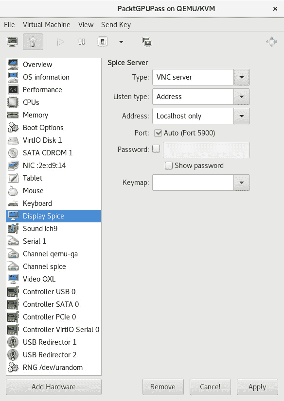

图 6.12 - 用于 KVM 虚拟机的 VNC 配置

添加 VNC 图形时，您将看到前面截图中显示的选项：

+   **类型**：图形服务器的类型。这里是**VNC 服务器**。

+   **地址**：VNC 服务器监听地址。它可以是全部、本地主机或 IP 地址。默认情况下，它是**仅本地主机**。

+   端口：VNC 服务器监听端口。您可以选择自动，其中 libvirt 根据可用性定义端口，或者您可以自己定义一个。确保它不会产生冲突。

+   **密码**：保护 VNC 访问的密码。

+   `virt-xml`命令行工具。

例如，让我们向名为`PacktGPUPass`的虚拟机添加 VNC 图形，然后修改其 VNC 监听 IP 为`192.168.122.1`：

```
# virt-xml MasteringKVM03 --add-device --graphics type=vnc
# virt-xml MasteringKVM03 --edit --graphics listen=192.168.122.1
```

这是在`PacktVM01` XML 配置文件中的外观：

```
<graphics type='vnc' port='-1' autoport='yes' listen='192.168.122.1'>
    <listen type='address' address='192.168.122.1'/>
</graphics>
```

您还可以使用`virsh`编辑`PacktGPUPass`并单独更改参数。

## 为什么使用 VNC？

当您在局域网上访问虚拟机或直接从控制台访问 VM 时，可以使用 VNC。使用 VNC 在公共网络上暴露虚拟机不是一个好主意，因为连接没有加密。如果虚拟机是没有安装 GUI 的服务器，VNC 是一个不错的选择。另一个支持 VNC 的点是客户端的可用性。您可以从任何操作系统平台访问虚拟机，因为该平台将有适用于该平台的 VNC 查看器。

# 使用 SPICE 显示协议

与 KVM 一样，**独立计算环境的简单协议**（**SPICE**）是进入开源虚拟化技术的最佳创新之一。它推动了开源虚拟化技术向大规模**虚拟桌面基础设施**（**VDI**）的实施。

重要说明

Qumranet 最初在 2007 年将 SPICE 作为闭源代码库开发。Red Hat，Inc.在 2008 年收购了 Qumranet，并于 2009 年 12 月决定在开源许可下发布代码并将协议视为开放标准。

SPICE 是 Linux 上唯一可用的开源解决方案，可以实现双向音频。它具有高质量的 2D 渲染能力，可以利用客户端系统的视频卡。SPICE 还支持多个高清监视器、加密、智能卡身份验证、压缩和网络上传输的 USB。有关完整的功能列表，您可以访问[`www.spice-space.org/features.html`](http://www.spice-space.org/features.html)。如果您是开发人员，并且想了解 SPICE 的内部情况，请访问[`www.spice-space.org/documentation.html`](http://www.spice-space.org/documentation.html)。如果您计划进行 VDI 或安装需要 GUI 的虚拟机，SPICE 是您的最佳选择。

在某些较旧的虚拟机上，SPICE 可能与一些较旧的虚拟机不兼容，因为它们不支持 QXL。在这些情况下，您可以将 SPICE 与其他通用虚拟视频卡一起使用。

现在，让我们学习如何向我们的虚拟机添加 SPICE 图形服务器。这可以被认为是开源世界中性能最佳的虚拟显示协议。

## 添加 SPICE 图形服务器

Libvirt 现在选择 SPICE 作为大多数虚拟机安装的默认图形服务器。您必须按照我们之前提到的 VNC 相同的程序来添加 SPICE 图形服务器。只需在下拉菜单中将 VNC 更改为 SPICE。在这里，您将获得一个额外的选项来选择**TLS 端口**，因为 SPICE 支持加密：

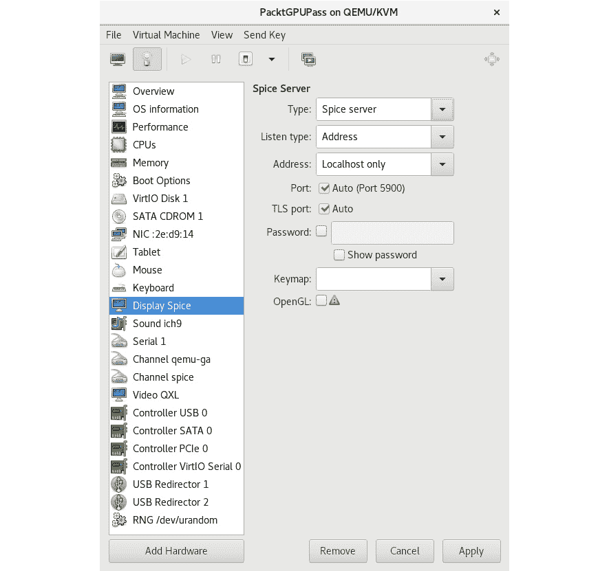

图 6.13–KVM 虚拟机的 SPICE 配置

要进入此配置窗口，只需编辑虚拟机的设置。转到**显示 Spice**选项，并从下拉菜单中选择**Spice 服务器**。所有其他选项都是可选的，因此您不一定需要进行任何其他配置。

完成了上述步骤后，我们已经涵盖了有关显示协议的所有必要主题。现在让我们讨论一下我们可以使用的各种方法来访问虚拟机控制台。

# 访问虚拟机控制台的方法

有多种方法可以连接到虚拟机控制台。如果您的环境具有完整的图形用户界面访问权限，那么最简单的方法就是使用 virt-manager 控制台本身。`virt-viewer`是另一个工具，可以让您访问虚拟机控制台。如果您尝试从远程位置访问虚拟机控制台，则此工具非常有用。在以下示例中，我们将连接到具有 IP`192.168.122.1`的远程 hypervisor。连接通过 SSH 会话进行隧道传输，并且是安全的。

第一步是在客户端系统和 hypervisor 之间建立一个无密码的身份验证系统：

1.  在客户端机器上，使用以下代码：

```
# ssh-keygen
# ssh-copy-id root@192.168.122.1
# virt-viewer -c qemu+ssh://root@192.168.122.1/system
```

您将看到 hypervisor 上可用的虚拟机列表。选择要访问的虚拟机，如下截图所示：

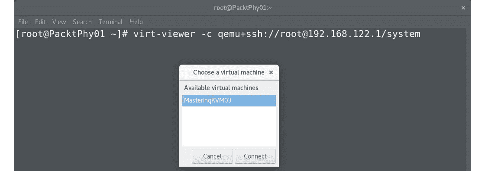

图 6.14 - 用于虚拟机访问的 virt-viewer 选择菜单

1.  要直接连接到 VM 的控制台，请使用以下命令：

```
virsh – to be more specific, virsh console vm_name. This needs some additional configuration inside the virtual machine OS, as described in the following steps.
```

1.  如果您的 Linux 发行版使用 GRUB（而不是 GRUB2），请将以下行附加到`/boot/grub/grub.conf`中现有的引导内核行，并关闭虚拟机：

```
console=tty0 console=ttyS0,115200
```

如果您的 Linux 发行版使用 GRUB2，则步骤会变得有点复杂。请注意，以下命令已在 Fedora 22 虚拟机上进行了测试。对于其他发行版，配置 GRUB2 的步骤可能会有所不同，尽管 GRUB 配置文件所需的更改应保持不变：

```
# cat /etc/default/grub (only relevant variables are shown)
GRUB_TERMINAL_OUTPUT="console"
GRUB_CMDLINE_LINUX="rd.lvm.lv=fedora/swap rd.lvm.lv=fedora/root rhgb quiet"
```

更改后的配置如下：

```
# cat /etc/default/grub (only relevant variables are shown)
GRUB_TERMINAL_OUTPUT="serial console"
GRUB_CMDLINE_LINUX="rd.lvm.lv=fedora/swap rd.lvm.lv=fedora/root console=tty0 console=ttyS0"
# grub2-mkconfig -o /boot/grub2/grub.cfg
```

1.  现在，关闭虚拟机。然后使用`virsh`再次启动它：

```
# virsh shutdown PacktGPUPass
# virsh start PacktGPUPass --console
```

1.  运行以下命令以连接到已启动的虚拟机控制台：

```
# virsh console PacktGPUPass
```

您也可以从远程客户端执行此操作，如下所示：

```
# virsh -c qemu+ssh://root@192.168.122.1/system console PacktGPUPass
Connected to domain PacktGPUPass:
Escape character is ^]
```

在某些情况下，我们发现控制台命令卡在`^]`。要解决此问题，请多次按*Enter*键以查看登录提示。有时，当您想要捕获用于故障排除目的的引导消息时，配置文本控制台非常有用。使用*ctrl +]*退出控制台。

我们的下一个主题将带我们进入 noVNC 的世界，这是另一种基于 VNC 的协议，它比*常规*VNC 具有一些主要优势。现在让我们讨论这些优势以及 noVNC 的实现。

# 使用 noVNC 实现显示可移植性

所有这些显示协议都依赖于能够访问某种类型的客户端应用程序和/或附加软件支持，这将使我们能够访问虚拟机控制台。但是当我们无法访问所有这些附加功能时会发生什么？当我们只能以文本模式访问我们的环境时，但我们仍然希望以基于 GUI 的方式管理对我们的虚拟机的连接时会发生什么？

输入 noVNC，这是一个基于 HTML5 的 VNC 客户端，您可以通过兼容 HTML5 的 Web 浏览器使用，这只是对市场上*几乎每个*Web 浏览器的花哨说法。它支持所有最流行的浏览器，包括移动浏览器，以及许多其他功能，例如以下内容：

+   剪贴板复制粘贴

+   支持分辨率缩放和调整大小

+   它在 MPL 2.0 许可下免费

+   安装它相当容易，并支持身份验证，并且可以通过 HTTPS 轻松实现安全性

如果要使 noVNC 工作，您需要两样东西：

+   已配置为接受 VNC 连接的虚拟机，最好进行了一些配置 - 例如设置了密码和正确设置的网络接口以连接到虚拟机。您可以自由使用`tigervnc-server`，将其配置为接受特定用户的连接 - 例如 - 在端口`5901`上，并使用该端口和服务器的 IP 地址进行客户端连接。

+   在客户端计算机上安装 noVNC，您可以从 EPEL 存储库下载，也可以作为`zip/tar.gz`软件包直接从 Web 浏览器运行。要安装它，我们需要输入以下一系列命令：

```
yum -y install novnc
cd /etc/pki/tls/certs
openssl req -x509 -nodes -newkey rsa:2048 -keyout /etc/pki/tls/certs/nv.pem -out /etc/pki/tls/certs/nv.pem -days 365
websockify -D --web=/usr/share/novnc --cert=/etc/pki/tls/certs/nv.pem 6080 localhost:5901 
```

最终结果将看起来像这样：

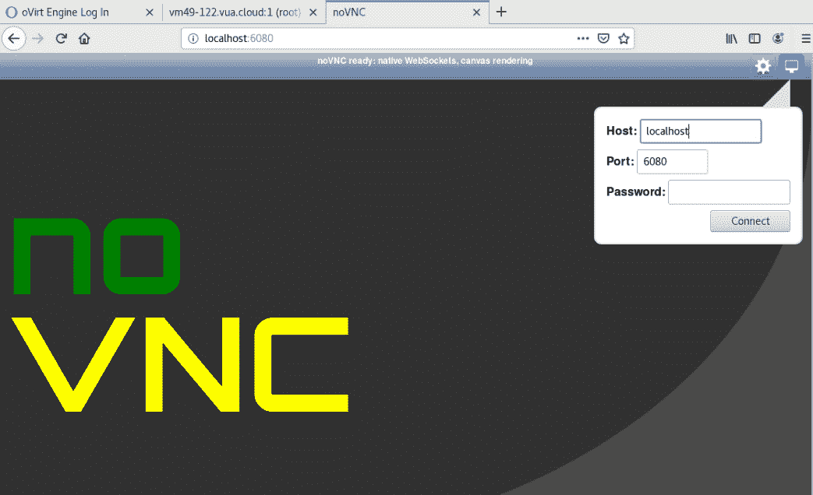

图 6.15 - noVNC 控制台配置屏幕

在这里，我们可以使用我们的 VNC 服务器密码来访问特定的控制台。输入密码后，我们会得到这个：

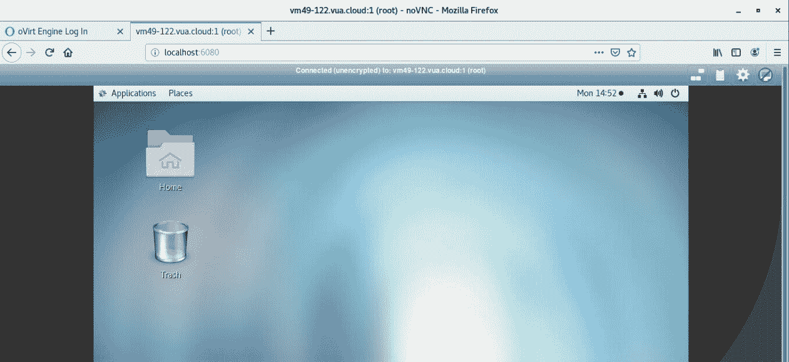

图 6.16 - noVNC 控制台实际操作 - 我们可以看到虚拟机控制台并使用它来处理我们的虚拟机

我们也可以在 oVirt 中使用所有这些选项。在安装 oVirt 时，我们只需要在 engine-setup 阶段选择一个额外的选项：

```
--otopi-environment="OVESETUP_CONFIG/websocketProxyConfig=bool:True"
```

此选项将使 oVirt 能够使用 noVNC 作为远程显示客户端，除了现有的 SPICE 和 VNC。

让我们看一个在 oVirt 中配置虚拟机的示例，几乎包括了本章讨论的所有选项。特别注意**监视器**配置选项：

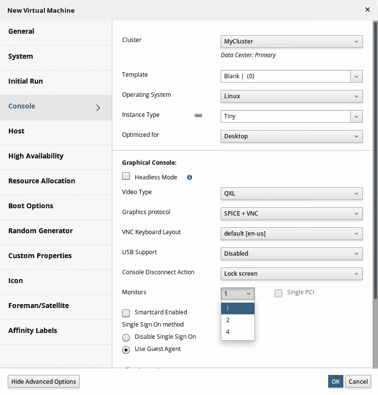

图 6.17 - oVirt 还支持本章讨论的所有设备

如果我们点击**图形协议**子菜单，我们将得到使用 SPICE、VNC、noVNC 和各种组合的选项。此外，在屏幕底部，我们还有可用的选项，用于我们想要在远程显示中看到的显示器数量。如果我们想要一个高性能的多显示远程控制台，这可能非常有用。

鉴于 noVNC 已经集成到 noVNC 中，您可以将其视为未来的迹象。从这个角度来看 - IT 中与管理应用程序相关的一切已经稳步地转移到基于 Web 的应用程序多年了。同样的事情发生在虚拟机控制台上也是合乎逻辑的。其他供应商的解决方案也已经实施了这一点，因此在这里使用 noVNC 不应该是一个大惊喜。

# 总结

在本章中，我们涵盖了虚拟显示设备和用于显示虚拟机数据的协议。我们还深入研究了 GPU 共享和 GPU 直通的世界，这是大规模运行 VDI 的虚拟化环境中的重要概念。我们讨论了这些情景的一些好处和缺点，因为它们往往相当复杂，需要大量资源，包括财政资源。想象一下，为 100 台虚拟机进行 2D/3D 加速的 PCI 直通。这实际上需要购买 100 张显卡，这在财务上是一个很大的要求。在我们讨论的其他主题中，我们讨论了可以用于控制台访问我们的虚拟机的各种显示协议和选项。

在下一章中，我们将带您了解一些常规虚拟机操作 - 安装、配置和生命周期管理，包括讨论快照和虚拟机迁移。

# 问题

1.  我们可以使用哪些类型的虚拟机显示设备？

1.  使用 QXL 虚拟显示设备与 VGA 相比的主要好处是什么？

1.  GPU 共享的好处和缺点是什么？

1.  GPU PCI 直通的好处是什么？

1.  SPICE 相对于 VNC 的主要优势是什么？

1.  为什么要使用 noVNC？

# 进一步阅读

有关本章内容的更多信息，请参考以下链接：

+   配置和管理虚拟化：[`access.redhat.com/documentation/en-us/red_hat_enterprise_linux/8/html/configuring_and_managing_virtualization/index`](https://access.redhat.com/documentation/en-us/red_hat_enterprise_linux/8/html/configuring_and_managing_virtualization/index)

+   QEMU 文档：[`www.qemu.org/documentation/`](https://www.qemu.org/documentation/)

+   NVIDIA 虚拟 GPU 软件文档：[`docs.nvidia.com/grid/latest/grid-vgpu-release-notes-red-hat-el-kvm/index.html`](https://docs.nvidia.com/grid/latest/grid-vgpu-release-notes-red-hat-el-kvm/index.html)

+   使用 IOMMU 组：[`access.redhat.com/documentation/en-us/red_hat_enterprise_linux/7/html/virtualization_deployment_and_administration_guide/app-iommu`](https://access.redhat.com/documentation/en-us/red_hat_enterprise_linux/7/html/virtualization_deployment_and_administration_guide/app-iommu)
