# 第七章：虚拟机：安装、配置和生命周期管理

在本章中，我们将讨论安装和配置`virt-manager`、`virt-install`、oVirt 的不同方式，并建立在前几章中获得的知识基础上。然后，我们将对虚拟机迁移进行详细讨论，这是虚拟化的最基本方面之一，因为几乎无法想象在没有迁移选项的情况下使用虚拟化。为了能够为虚拟机迁移配置我们的环境，我们还将使用*第四章*中讨论的主题，*Libvirt 网络*，以及*第五章*中讨论的主题，*Libvirt 存储*，因为虚拟机迁移需要满足一些先决条件。

在本章中，我们将涵盖以下主题：

+   使用`virt-manager`创建新的虚拟机，使用`virt`命令

+   使用 oVirt 创建新的虚拟机

+   配置您的虚拟机

+   向虚拟机添加和删除虚拟硬件

+   迁移虚拟机

# 使用 virt-manager 创建新的虚拟机

`virt-manager`（用于管理虚拟机的图形界面工具）和`virt-install`（用于管理虚拟机的命令行实用程序）是`virt-*`命令堆栈中最常用的实用程序之一，非常有用。

让我们从`virt-manager`及其熟悉的图形界面开始。

## 使用 virt-manager

`virt-manager`是管理 KVM 虚拟机的首选图形界面实用程序。它非常直观和易于使用，尽管在功能上有点欠缺，我们稍后会描述一下。这是主`virt-manager`窗口：

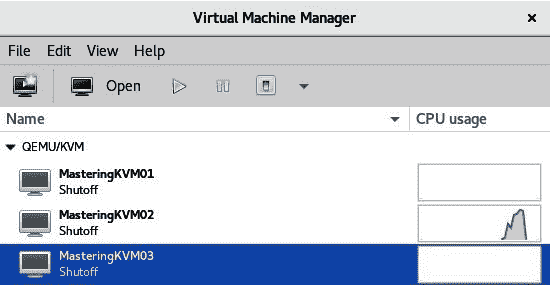

图 7.1 - 主 virt-manager 窗口

从这个屏幕截图中，我们已经可以看到在此服务器上安装了三个虚拟机。我们可以使用顶级菜单（**文件**，**编辑**，**查看**和**帮助**）进一步配置我们的 KVM 服务器和/或虚拟机，以及连接到网络上的其他 KVM 主机，如下面的屏幕截图所示：

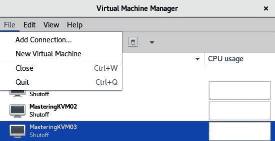

图 7.2 - 使用“添加连接...”选项连接到其他 KVM 主机

选择`virt-manager`后。该过程如下截图所示：

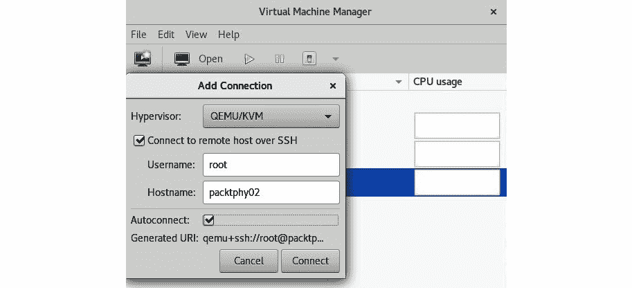

图 7.3 - 连接到远程 KVM 主机

此时，您可以通过右键单击主机名并选择**新建**来自由在远程 KVM 主机上安装虚拟机，如果选择这样做，如下截图所示：

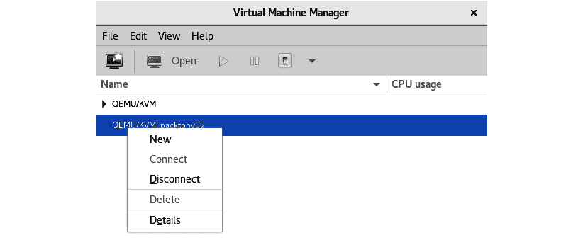

图 7.4 - 在远程 KVM 主机上创建新的虚拟机

由于此向导与在本地服务器上安装虚拟机的向导相同，我们将一次性涵盖这两种情况。**新建虚拟机**向导的第一步是选择您要从哪里安装虚拟机。如下截图所示，有四个可用选项：

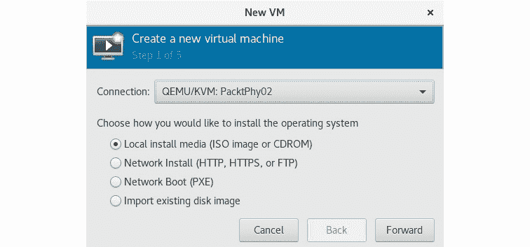

图 7.5 - 选择引导介质

选择如下：

+   如果您已经在本地计算机上（或作为物理设备）有一个**国际标准化组织**（**ISO**）文件可用，请选择第一个选项。

+   如果您想从网络安装，请选择第二个选项。

+   如果您在环境中设置了**预引导执行环境**（**PXE**）引导，并且可以从网络引导您的虚拟机安装，请选择第三个选项。

+   如果您有一个虚拟机磁盘，并且只想将其作为底层定义为虚拟机，请选择第四个选项。

通常，我们谈论网络安装（第二个选项）或 PXE 引导网络安装（第三个选项），因为这些是生产中最常见的用例。原因非常简单 - 没有理由在 ISO 文件上浪费本地磁盘空间，而这些文件现在相当大。例如，CentOS 8 v1905 ISO 文件大约为 8 **GB**。如果需要能够安装多个操作系统，甚至是这些操作系统的多个版本，最好使用一种仅用于 ISO 文件的集中存储空间。

在基于 VMware **ESX 集成**（**ESXi**）的基础设施中，人们通常使用 ISO 数据存储或内容库来实现此功能。在基于 Microsoft Hyper-V 的基础设施中，人们通常拥有一个用于 VM 安装所需 ISO 文件的**服务器消息块**（**SMB**）文件共享。每台主机都拷贝一个操作系统 ISO 文件是毫无意义的，因此一种共享的方法更加方便，也是一个很好的节省空间的机制。

假设我们正在从网络（**超文本传输协议**（**HTTP**）、**超文本传输安全协议**（**HTTPS**）或**文件传输协议**（**FTP**））安装 VM。我们需要一些东西来继续，如下所示：

+   一个`8.x.x`目录，然后转到`BaseOS/x86_64/os`。

+   显然，需要一个功能正常的互联网连接，尽可能快，因为我们将从前面的 URL 下载所有必要的安装包。

+   可选地，我们可以展开**URL 选项**三角形，并使用内核行的附加选项，最常见的是使用类似以下内容的 kickstart 选项：

```
ks=http://kickstart_file_url/file.ks
```

因此，让我们输入如下内容：

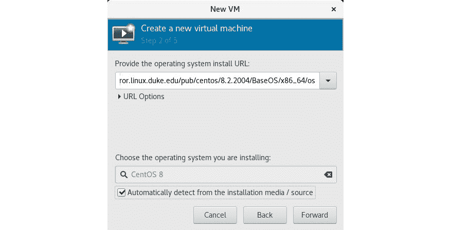

图 7.6 - URL 和客户操作系统选择

请注意，我们*手动*选择的`virt-manager`目前不认识我们指定的 URL 中的 CentOS 8（1905）作为客户操作系统。如果操作系统在当前识别的操作系统列表中，我们可以只需选择**从安装媒体/源自动检测**复选框，有时需要多次重新检查和取消检查才能使其正常工作。

点击**前进**按钮后，我们需要为此 VM 设置内存和**中央处理单元**（**CPU**）设置。同样，您可以选择两种不同的方向，如下所示：

+   选择最少的资源（例如，1 个**虚拟 CPU**（**vCPU**）和 1GB 内存），然后根据需要更改。

+   选择适量的资源（例如，2 个 vCPU 和 4GB 内存），并考虑特定的用途。例如，如果此 VM 的预期用途是文件服务器，如果添加 16 个 vCPU 和 64GB 内存，性能将不会很好，但在其他用例中可能会适用。

下一步是配置 VM 存储。如下截图所示，有两个可用选项：

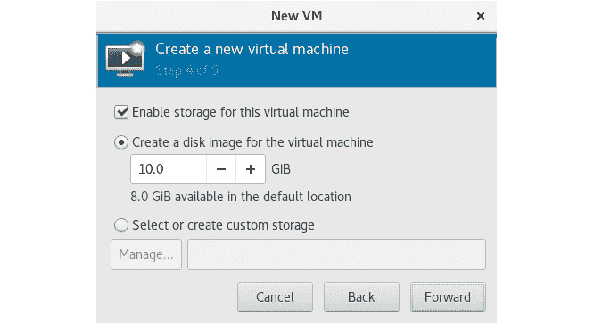

图 7.7 - 配置 VM 存储

为 VM 选择一个*合适*的存储设备非常重要，因为如果你不这样做，将来可能会遇到各种问题。例如，如果你在生产环境中将 VM 放在错误的存储设备上，你将不得不将该 VM 的存储迁移到另一个存储设备，这是一个繁琐且耗时的过程，会对你的 VM 产生一些不好的副作用，特别是如果你的源或目标存储设备上有大量的 VM 在运行。首先，它会严重影响它们的性能。然后，如果你的环境中有一些动态工作负载管理机制，它可能会触发基础设施中的额外 VM 或 VM 存储移动。像 VMware 的**分布式资源调度器**（**DRS**）/存储 DRS，带有**System Center Operations Manager**（**SCOM**）集成的 Hyper-V 性能和资源优化，以及 oVirt/Red Hat Enterprise Virtualization 集群调度策略等功能就是这样做的。因此，采用*三思而后行*的策略可能是正确的方法。

如果你选择第一个可用选项，`virt-manager`将在其默认位置创建一个 VM 硬盘——在`/var/lib/libvirt/images`目录中。确保你有足够的空间来存放你的 VM 硬盘。假设我们在`/var/lib/libvirt/images`目录及其底层分区中有 8GB 的可用空间。如果我们保持前面截图中的一切不变，我们会收到一个错误消息，因为我们试图在只有 8GB 可用的本地磁盘上创建一个 10GB 的文件。

在我们点击`virt-manager`之后，在安装过程之前自定义配置，并选择 VM 将使用的虚拟网络。我们将在本章稍后讨论 VM 的硬件定制。当你点击**完成**时，如下截图所示，你的 VM 将准备好部署，并且在我们安装操作系统后使用：

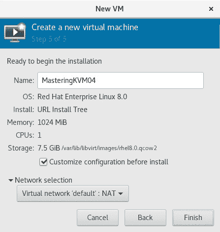

图 7.8 – 最终 virt-manager 配置步骤

使用`virt-manager`创建一些 VM 绝对不是一项困难的任务，但在现实生产环境中，你不一定会在服务器上找到 GUI。因此，我们的逻辑下一个任务是了解命令行工具来管理 VM——具体来说是`virt-*`命令。让我们接着做。

## 使用 virt-*命令

如前所述，我们需要学习一些新的命令来掌握基本 VM 管理任务。为了这个特定的目的，我们有一堆`virt-*`命令。让我们简要地介绍一些最重要的命令，并学习如何使用它们。

### virt-viewer

由于我们之前已经大量使用了`virt-install`命令（查看*第三章*，*安装基于内核的虚拟机（KVM）超级监视器，libvirt 和 ovirt*，我们使用这个命令安装了相当多的 VM），我们将覆盖剩下的命令。

让我们从`virt-viewer`开始，因为我们之前使用过这个应用程序。每次我们在`virt-viewer`中双击一个虚拟机，我们就打开了一个虚拟机控制台，这恰好是这个过程背后的`virt-viewer`。但是如果我们想要从 shell 中使用`virt-viewer`——就像人们经常做的那样——我们需要一些关于它的更多信息。所以，让我们举几个例子。

首先，让我们通过运行以下命令连接到一个名为`MasteringKVM01`的本地 KVM，它位于我们当前以`root`连接的主机上：

```
# virt-viewer --connect qemu:///system MasteringKVM01
```

我们还可以以`kiosk`模式连接到 VM，这意味着当我们关闭连接的 VM 时，`virt-viewer`也会关闭。要做到这一点，我们将运行以下命令：

```
# virt-viewer --connect qemu:///system MasteringKVM01 --kiosk --kiosk-quit on-disconnect
```

如果我们需要连接到*远程*主机，我们也可以使用`virt-viewer`，但我们需要一些额外的选项。连接到远程系统的最常见方式是通过 SSH，所以我们可以这样做：

```
# virt-viewer --connect qemu+ssh://username@remote-host/system VirtualMachineName
```

如果我们配置了 SSH 密钥并将它们复制到`username@remote-host`，这个前面的命令就不会要求我们输入密码。但如果没有，它将会要求我们输入密码两次——一次是建立与 hypervisor 的连接，另一次是建立与 VM **Virtual Network Computing** (**VNC**) 会话的连接。

### virt-xml

我们列表中的下一个命令行实用程序是`virt-xml`。我们可以使用它与`virt-install`命令行选项来更改 VM 配置。让我们从一个基本的例子开始——让我们只是为 VM 启用引导菜单，如下所示：

```
# virt-xml MasgteringKVM04 --edit --boot bootmenu=on
```

然后，让我们向 VM 添加一个薄配置的磁盘，分三步——首先，创建磁盘本身，然后将其附加到 VM，并检查一切是否正常工作。输出可以在下面的截图中看到：

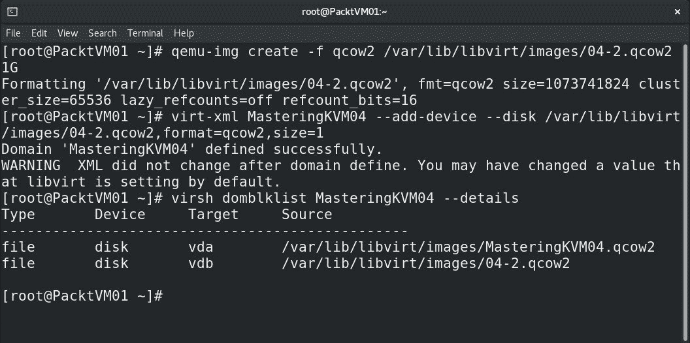

图 7.9 – 向 VM 添加一个薄配置 QEMU 写时复制（qcow2）格式的虚拟磁盘

正如我们所看到的，`virt-xml`非常有用。通过使用它，我们向我们的 VM 添加了另一个虚拟磁盘，这是它可以做的最简单的事情之一。我们可以使用它向现有的 VM 部署任何额外的 VM 硬件。我们还可以使用它编辑 VM 配置，在较大的环境中特别方便，特别是当你必须对这样的过程进行脚本化和自动化时。

### virt-clone

现在让我们通过几个例子来检查`virt-clone`。假设我们只是想要一种快速简单的方式来克隆现有的 VM 而不需要任何额外的麻烦。我们可以这样做：

```
# virt-clone --original VirtualMachineName --auto-clone
```

结果，这将产生一个名为`VirtualMachineName-clone`的 VM，我们可以立即开始使用。让我们看看这个过程，如下所示：

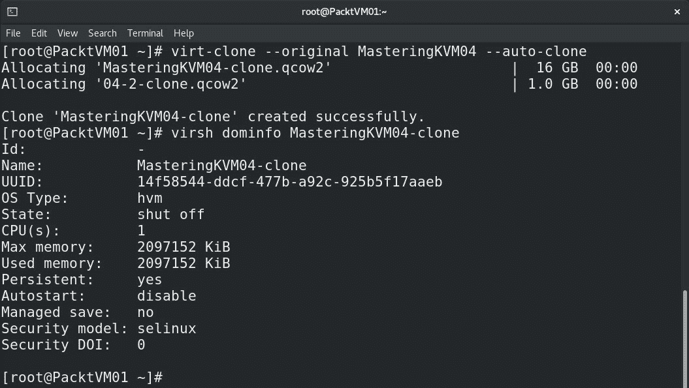

图 7.10 – 使用 virt-clone 创建 VM 克隆

让我们看看如何使这个更加*定制化*。通过使用`virt-clone`，我们将创建一个名为`MasteringKVM05`的 VM，克隆一个名为`MasteringKVM04`的 VM，并且我们还将自定义虚拟磁盘名称，如下面的截图所示：

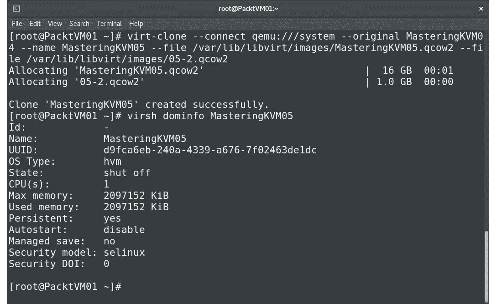

图 7.11 – 自定义 VM 创建：自定义 VM 名称和虚拟硬盘文件名

在现实生活中，有时需要将 VM 从一种虚拟化技术转换为另一种。其中大部分工作实际上是将 VM 磁盘格式从一种格式转换为另一种格式。这就是`virt-convert`的工作原理。让我们学习一下它是如何工作的。

### qemu-img

现在让我们看看如何将一个虚拟磁盘转换为另一种格式，以及如何将一个 VM *配置文件*从一种虚拟化方法转换为另一种。我们将使用一个空的 VMware VM 作为源，并将其`vmdk`虚拟磁盘和`.vmx`文件转换为新格式，如下面的截图所示：

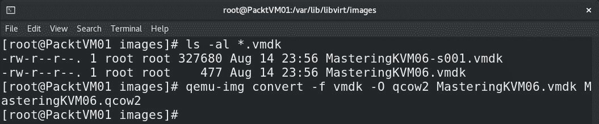

图 7.12 – 将 VMware 虚拟磁盘转换为 KVM 的 qcow2 格式

如果我们面对需要在这些平台之间移动或转换 VM 的项目，我们需要确保使用这些实用程序，因为它们易于使用和理解，只需要一点时间。例如，如果我们有一个 1 `qcow2`格式，所以我们必须耐心等待。此外，我们需要随时准备好编辑`vmx`配置文件，因为从`vmx`到`kvm`格式的转换过程并不是 100%顺利，正如我们可能期望的那样。在这个过程中，会创建一个新的配置文件。KVM VM 配置文件的默认目录是`/etc/libvirt/qemu`，我们可以轻松地看到`virsh`列表输出。

在 CentOS 8 中还有一些新的实用工具，这些工具将使我们更容易管理不仅本地服务器还有 VM。Cockpit web 界面就是其中之一——它具有在 KVM 主机上进行基本 VM 管理的功能。我们只需要通过 Web 浏览器连接到它，我们在*第三章*中提到过这个 Web 应用程序，*安装基于内核的 VM（KVM）Hypervisor，libvirt 和 ovirt*，当讨论 oVirt 设备的部署时。因此，让我们通过使用 Cockpit 来熟悉 VM 管理。

## 使用 Cockpit 创建新的 VM

要使用 Cockpit 管理我们的服务器及其 VM，我们需要安装和启动 Cockpit 及其附加包。让我们从那开始，如下所示：

```
yum -y install cockpit*
systemctl enable --now cockpit.socket
```

在此之后，我们可以启动 Firefox 并将其指向`https://kvm-host:9090/`，因为这是 Cockpit 可以访问的默认端口，并使用 root 密码登录为`root`，这将给我们以下**用户界面**（**UI**）：

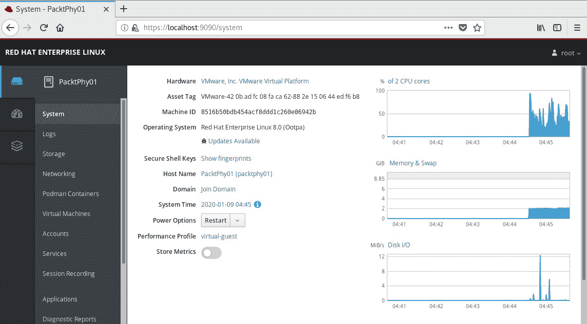

图 7.14 – Cockpit web 控制台，我们可以用它来部署 VM

在上一步中，当我们安装了`cockpit*`时，我们还安装了`cockpit-machines`，这是 Cockpit web 控制台的一个插件，它使我们能够在 Cockpit web 控制台中管理`libvirt` VM。因此，在我们点击**VMs**后，我们可以轻松地看到我们以前安装的所有 VM，打开它们的配置，并通过简单的向导安装新的 VM，如下面的屏幕截图所示：

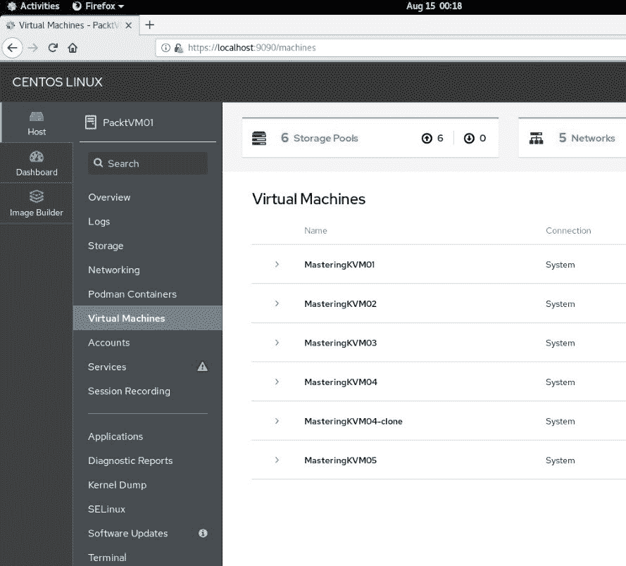

图 7.15 – Cockpit VM 管理

VM 安装向导非常简单——我们只需要为我们的新 VM 配置基本设置，然后我们就可以开始安装，如下所示：

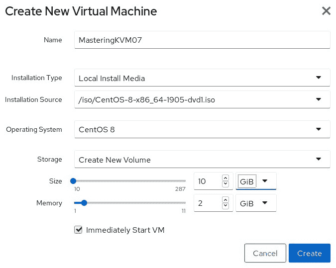

图 7.16 – 从 Cockpit web 控制台安装 KVM VM

现在我们已经了解了如何*本地*安装 VM——意味着没有某种集中管理应用程序，让我们回过头来看看如何通过 oVirt 安装 VM。

# 使用 oVirt 创建新的 VM

如果我们将主机添加到 oVirt，当我们登录时，我们可以转到**Compute-VMs**，并通过简单的向导开始部署 VM。因此，在该菜单中点击**New**按钮后，我们可以这样做，然后我们将被带到以下屏幕：

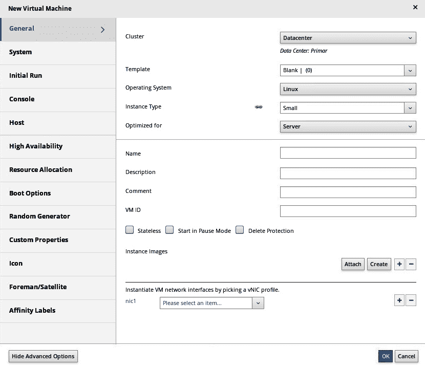

图 7.17 – oVirt 中的新 VM 向导

考虑到 oVirt 是 KVM 主机的集中管理解决方案，与在 KVM 主机上进行本地 VM 安装相比，我们有*大量*的额外选项——我们可以选择一个将托管此 VM 的集群；我们可以使用模板，配置优化和实例类型，配置**高可用性**（**HA**），资源分配，引导选项...基本上，这就是我们开玩笑称之为*选项麻痹*，尽管这对我们自己有利，因为集中化解决方案总是与任何一种本地解决方案有些不同。

至少，我们将不得不配置一般的 VM 属性——名称、操作系统和 VM 网络接口。然后，我们将转到**System**选项卡，在那里我们将配置内存大小和虚拟 CPU 数量，如下面的屏幕截图所示：

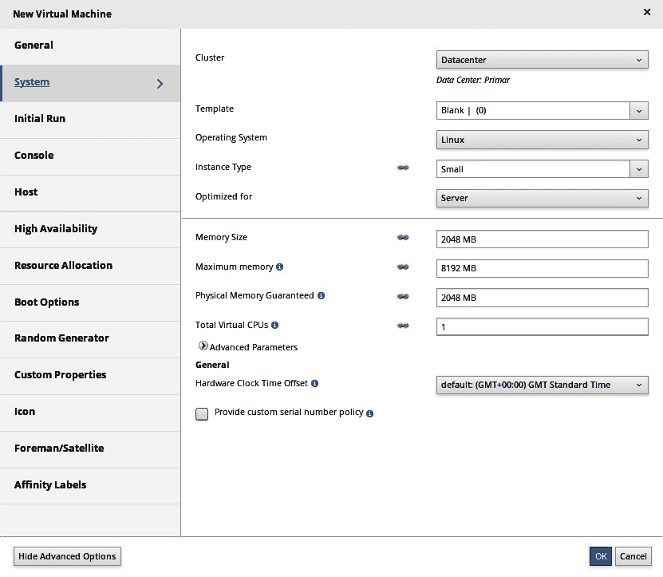

图 7.18 – 选择 VM 配置：虚拟 CPU 和内存

我们肯定会想要配置引导选项——连接 CD/ISO，添加虚拟硬盘，并配置引导顺序，如下面的屏幕截图所示：

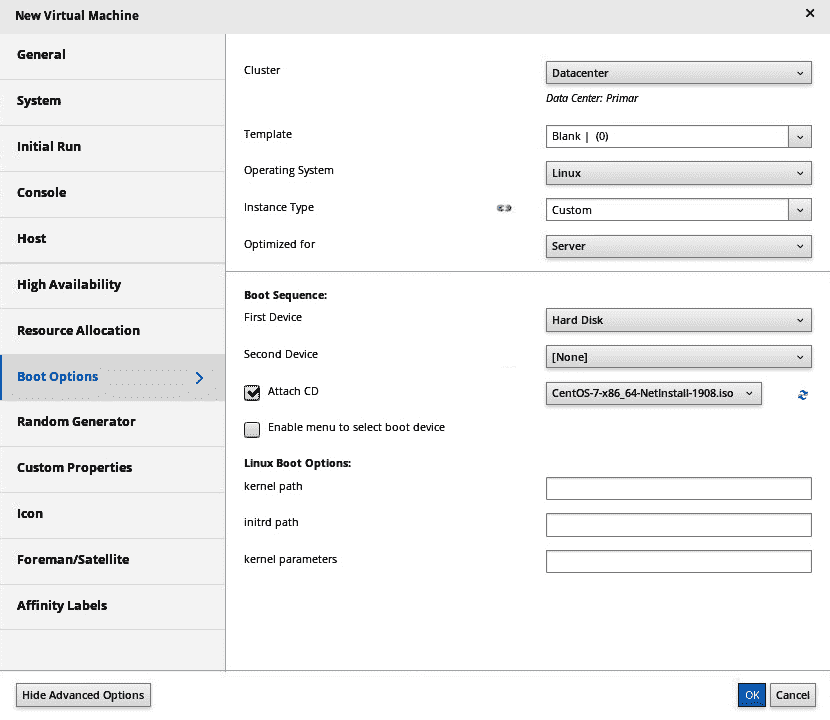

图 7.19 – 在 oVirt 中配置 VM 引导选项

我们可以使用`sysprep`或`cloud-init`来自定义 VM 的安装后设置，我们将在*第九章*中讨论，*使用 cloud-init 自定义 VM*。

以下是 oVirt 中基本的配置外观：

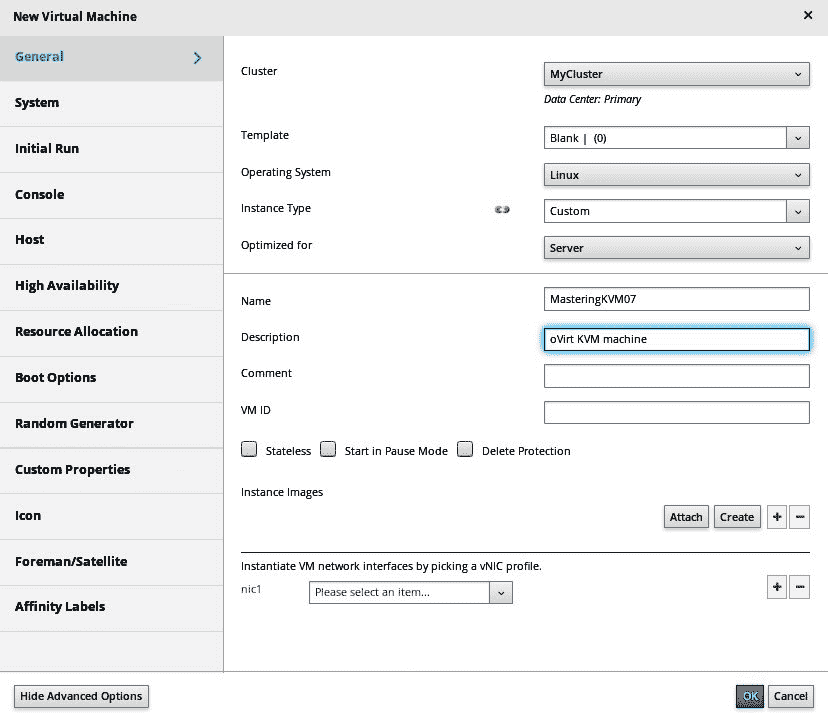

图 7.20-从 oVirt 安装 KVM VM：确保选择正确的启动选项

实际上，如果您管理的环境有两到三个以上的 KVM 主机，您会希望使用某种集中式实用程序来管理它们。oVirt 非常适合这一点，所以不要跳过它。

现在我们已经以各种不同的方式完成了整个部署过程，是时候考虑 VM 配置了。请记住，VM 是一个具有许多重要属性的对象，例如虚拟 CPU 的数量、内存量、虚拟网络卡等，因此学习如何自定义 VM 设置非常重要。所以，让我们把它作为下一个主题。

# 配置您的 VM

当我们使用`virt-manager`时，如果您一直进行到最后一步，您可以选择一个有趣的选项，即**在安装前自定义配置**选项。如果您在安装后检查 VM 配置，也可以访问相同的配置窗口。因此，无论我们选择哪种方式，我们都将面临为分配给我们刚创建的 VM 的每个 VM 硬件设备的全面配置选项，如下截图所示：

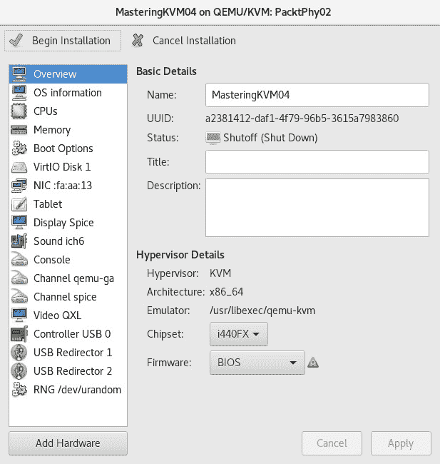

图 7.21-VM 配置选项

例如，如果我们在左侧点击**CPU**选项，您将看到可用 CPU 的数量（当前和最大分配），还将看到一些非常高级的选项，例如**CPU 拓扑**（**插槽**/**核心**/**线程**），它使我们能够配置特定的**非均匀内存访问**（**NUMA**）配置选项。这就是该配置窗口的样子：

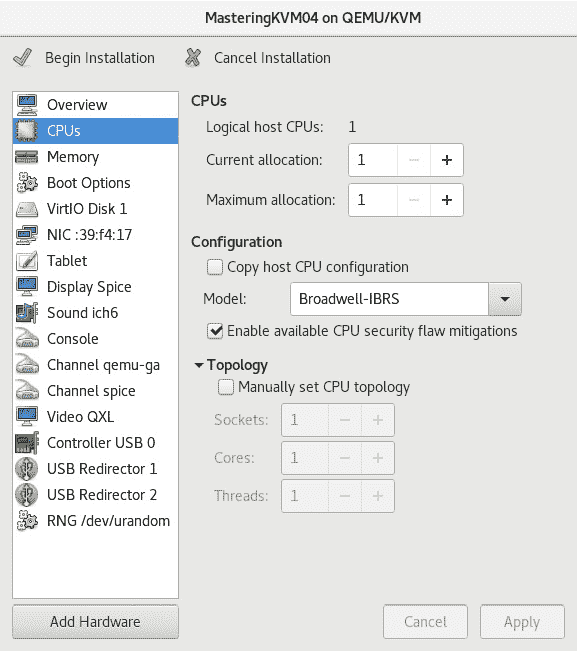

图 7.22-VM CPU 配置

这是 VM 配置的*非常*重要部分，特别是如果您正在设计一个承载大量虚拟服务器的环境。此外，如果虚拟化服务器承载**输入/输出**（**I/O**）密集型应用程序，例如数据库，这一点变得更加重要。如果您想了解更多信息，可以在本章末尾的*进一步阅读*部分中查看链接，它将为您提供有关 VM 设计的大量额外信息。

然后，如果我们打开`virt-*`命令。这是`virt-manager` **内存**配置选项的外观：

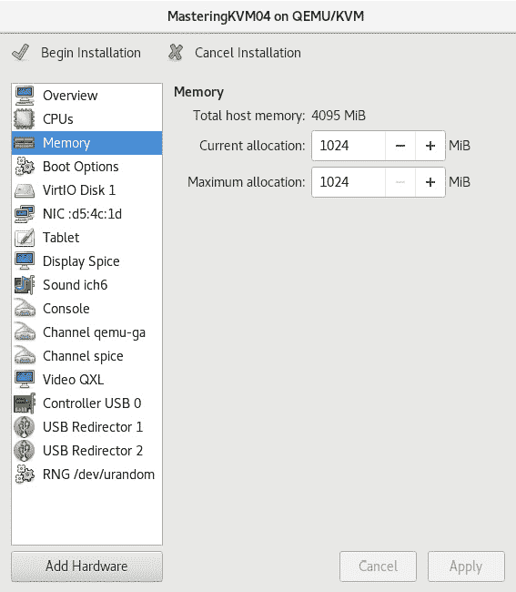

图 7.23-VM 内存配置

`virt-manager`中最重要的配置选项集之一位于**启动选项**子菜单中，如下截图所示：

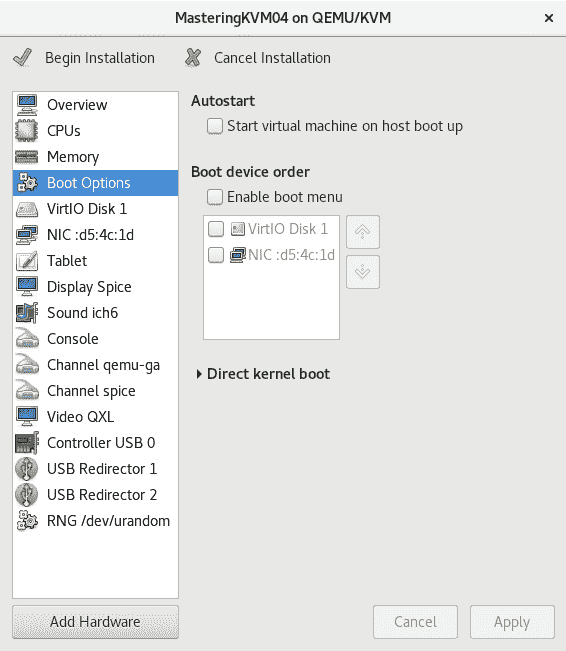

图 7.24-VM 启动配置选项

在那里，您可以做两件非常重要的事情，如下所示：

+   选择此 VM 在主机启动时自动启动

+   启用启动菜单并选择启动设备和启动设备优先级

就配置选项而言，`virt-manager`中功能最丰富的配置菜单是虚拟存储菜单，即我们的情况下的**VirtIO Disk 1**。如果我们点击它，我们将得到以下配置选项的选择：

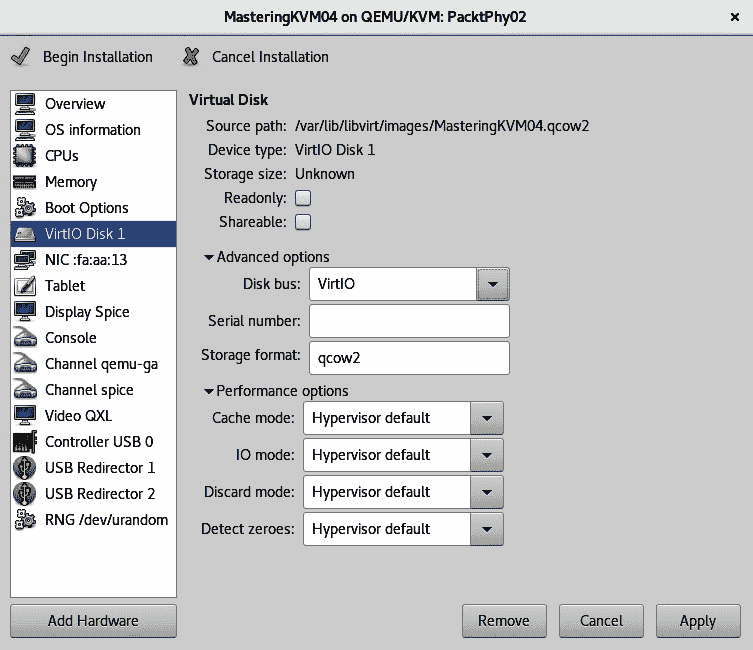

图 7.25-配置 VM 硬盘和存储控制器选项

让我们看看其中一些配置选项的重要性，如下所示：

+   **磁盘总线** - 这里通常有五个选项，**VirtIO**是默认（也是最好的）选项。与 Vmware、ESXi 和 Hyper-V 一样，KVM 有不同的虚拟存储控制器可用。例如，VMware 有 BusLogic、LSI Logic、Paravirtual 和其他类型的虚拟存储控制器，而 Hyper-V 有**集成驱动电子学**（**IDE**）和**小型计算机系统接口**（**SCSI**）控制器。此选项定义了 VM 在其客户操作系统中将看到的存储控制器。 

+   `qcow2`和`raw`（`dd`类型格式）。最常见的选项是`qcow2`，因为它为 VM 管理提供了最大的灵活性 - 例如，它支持薄配置和快照。

+   `缓存`模式 - 有六种类型：`writethrough`，`writeback`，`directsync`，`unsafe`，`none`和`default`。这些模式解释了从 VM 发起的 I/O 如何从 VM 下面的存储层写入数据。例如，如果我们使用`writethrough`，I/O 会被缓存在 KVM 主机上，并且也会通过写入到 VM 磁盘。另一方面，如果我们使用`none`，主机上没有缓存（除了磁盘`writeback`缓存），数据直接写入 VM 磁盘。不同的模式有不同的优缺点，但通常来说，`none`是 VM 管理的最佳选择。您可以在*进一步阅读*部分了解更多信息。

+   `IO`模式 - 有两种模式：`native`和`threads`。根据此设置，VM I/O 将通过内核异步 I/O 或用户空间中的线程池进行写入（这是默认值）。当使用`qcow2`格式时，通常认为`threads`模式更好，因为`qcow2`格式首先分配扇区，然后写入它们，这将占用分配给 VM 的 vCPU，并直接影响 I/O 性能。

+   `丢弃`模式 - 这里有两种可用模式，称为`忽略`和`取消映射`。如果选择`取消映射`，当您从 VM 中删除文件（这会转换为`qcow2` VM 磁盘文件中的可用空间），`qcow2` VM 磁盘文件将缩小以反映新释放的容量。取决于您使用的 Linux 发行版、内核和内核补丁以及**快速仿真器**（**QEMU**）版本，此功能*可能*仅适用于 SCSI 磁盘总线。它支持 QEMU 版本 4.0+。

+   `检测零` - 有三种可用模式：`关闭`，`打开`和`取消映射`。如果您选择`取消映射`，零写入将被转换为取消映射操作（如丢弃模式中所解释的）。如果将其设置为`打开`，操作系统的零写入将被转换为特定的零写入命令。

在任何给定 VM 的寿命期内，有很大的机会我们会重新配置它。无论是添加还是删除虚拟硬件（当然，通常是添加），这是 VM 生命周期的一个重要方面。因此，让我们学习如何管理它。

# 从 VM 添加和删除虚拟硬件

通过使用 VM 配置屏幕，我们可以轻松添加额外的硬件，或者删除硬件。例如，如果我们点击左下角的**添加硬件**按钮，我们可以轻松添加一个设备 - 比如，一个虚拟网络卡。以下截图说明了这个过程：

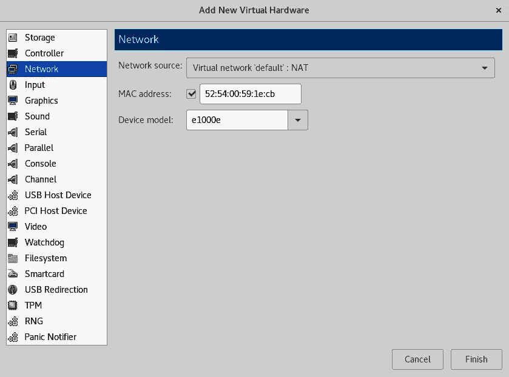

图 7.26 - 点击“添加硬件”后，我们可以选择要添加到虚拟机的虚拟硬件设备

另一方面，如果我们选择一个虚拟硬件设备（例如**Sound ich6**）并按下随后出现的**删除**按钮，我们也可以删除这个虚拟硬件设备，确认我们要这样做后，如下截图所示：

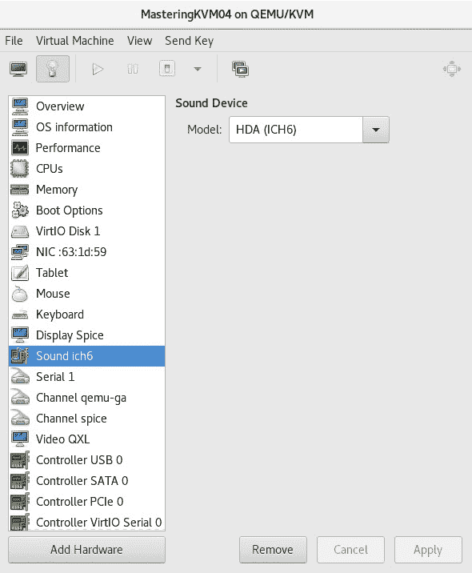

图 7.27 – 删除虚拟机硬件设备的流程：在左侧选择它，然后单击删除

正如您所看到的，添加和删除虚拟机硬件就像 123 一样简单。我们之前确实提到过这个话题，当时我们正在处理虚拟网络和存储（*第四章*，*Libvirt 网络*），但那里，我们使用了 shell 命令和 XML 文件定义。如果您想了解更多，请查看这些示例。

虚拟化的关键在于灵活性，能够在我们的环境中将虚拟机放置在任何给定的主机上是其中的重要部分。考虑到这一点，虚拟机迁移是虚拟化中可以用作营销海报的功能之一，它有许多优势。虚拟机迁移到底是什么？这就是我们接下来要学习的内容。

# 迁移虚拟机

简单来说，迁移使您能够将虚拟机从一台物理机器移动到另一台物理机器，几乎没有或没有任何停机时间。我们还可以移动虚拟机存储，这是一种资源密集型的操作，需要仔细规划，并且—如果可能—在工作时间之后执行，以便它不会像可能影响其他虚拟机的性能那样影响其他虚拟机的性能。

有各种不同类型的迁移，如下：

+   离线（冷）

+   在线（实时）

+   暂停迁移

还有各种不同类型的在线迁移，具体取决于您要移动的内容，如下：

+   虚拟机的计算部分（将虚拟机从一个 KVM 主机移动到另一个 KVM 主机）

+   虚拟机的存储部分（将虚拟机文件从一个存储池移动到另一个存储池）

+   两者（同时将虚拟机从主机迁移到主机和从存储池迁移到存储池）

如果您只是使用普通的 KVM 主机，与使用 oVirt 或 Red Hat 企业虚拟化相比，支持的迁移场景有一些差异。如果您想进行实时存储迁移，您不能直接在 KVM 主机上执行，但如果虚拟机已关闭，则可以轻松执行。如果您需要进行实时存储迁移，您将需要使用 oVirt 或 Red Hat 企业虚拟化。

我们还讨论了**单根输入输出虚拟化**（**SR-IOV**）、**外围组件互连**（**PCI**）设备透传、**虚拟图形处理单元**（**vGPUs**）等概念（在*第二章*中，*KVM 作为虚拟化解决方案*，以及*第四章*中，*Libvirt 网络*）。在 CentOS 8 中，您不能对具有这些选项之一分配给运行中的虚拟机的虚拟机进行实时迁移。

无论用例是什么，我们都需要意识到迁移需要以`root`用户或属于`libvirt`用户组的用户（Red Hat 所称的系统与用户`libvirt`会话）执行。

虚拟机迁移是一个有价值的工具的原因有很多。有些原因很明显，而其他原因则不那么明显。让我们尝试解释虚拟机迁移的不同用例和其好处。

## 虚拟机迁移的好处

虚拟机实时迁移的最重要的好处如下：

+   **增加的正常运行时间和减少的停机时间**—精心设计的虚拟化环境将为您的应用程序提供最大的正常运行时间。

+   **节约能源，走向绿色**—您可以根据虚拟机的负载和使用情况在非工作时间将它们合并到较少的虚拟化主机上。一旦虚拟机迁移完成，您可以关闭未使用的虚拟化主机。

+   通过在不同的虚拟化主机之间移动您的虚拟机，轻松进行硬件/软件升级过程—一旦您有能力在不同的物理服务器之间自由移动您的虚拟机，好处是无穷无尽的。

虚拟机迁移需要适当的规划。迁移有一些基本要求。让我们逐一看看它们。

生产环境的迁移要求如下：

+   VM 应该使用在共享存储上创建的存储池。

+   存储池的名称和虚拟磁盘的路径应该在两个超级主机（源和目标超级主机）上保持相同。

查看*第四章*，*Libvirt 网络*，以及*第五章*，*Libvirt 存储*，以便回顾如何使用共享存储创建存储池。

这里总是有一些适用的规则。这些规则相当简单，所以我们需要在开始迁移过程之前学习它们。它们如下：

+   可以使用在非共享存储上创建的存储池进行实时存储迁移。您只需要保持相同的存储池名称和文件位置，但在生产环境中仍建议使用共享存储。

+   如果连接到使用**光纤通道**（**FC**）、**Internet 小型计算机系统接口**（**iSCSI**）、**逻辑卷管理器**（**LVM**）等的 VM 的未管理虚拟磁盘，则相同的存储应该在两个超级主机上都可用。

+   VM 使用的虚拟网络应该在两个超级主机上都可用。

+   为网络通信配置的桥接应该在两个超级主机上都可用。

+   如果超级主机上的`libvirt`和`qemu-kvm`的主要版本不同，迁移可能会失败，但您应该能够将运行在具有较低版本`libvirt`或`qemu-kvm`的超级主机上的 VM 迁移到具有这些软件包较高版本的超级主机上，而不会出现任何问题。

+   源和目标超级主机上的时间应该同步。强烈建议您使用相同的**网络时间协议**（**NTP**）或**精密时间协议**（**PTP**）服务器同步超级主机。

+   重要的是系统使用`/etc/hosts`将无法工作。您应该能够使用`host`命令解析主机名。

在为 VM 迁移规划环境时，我们需要牢记一些先决条件。在大多数情况下，这些先决条件对所有虚拟化解决方案都是相同的。让我们讨论这些先决条件，以及如何为 VM 迁移设置环境。

## 设置环境

让我们构建环境来进行 VM 迁移 - 离线和实时迁移。以下图表描述了两个标准的 KVM 虚拟化主机，运行具有共享存储的 VM：

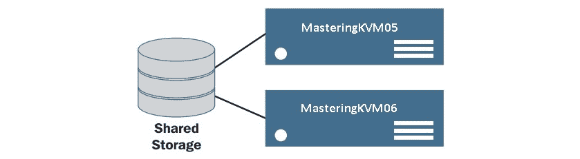

图 7.28 - 共享存储上的 VM

我们首先通过设置共享存储来开始。在本例中，我们使用`libvirt`。

我们将在 CentOS 8 服务器上创建一个 NFS 共享。它将托管在`/testvms`目录中，我们将通过 NFS 导出它。服务器的名称是`nfs-01`。（在我们的情况下，`nfs-01`的 IP 地址是`192.168.159.134`）

1.  第一步是从`nfs-01`创建和导出`/testvms`目录，并关闭 SELinux（查看*第五章*，*Libvirt 存储*，Ceph 部分以了解如何）：

```
# mkdir /testvms
# echo '/testvms *(rw,sync,no_root_squash)' >> /etc/exports
```

1.  然后，通过执行以下代码在防火墙中允许 NFS 服务：

```
# firewall-cmd --get-active-zones
public
interfaces: ens33
# firewall-cmd --zone=public --add-service=nfs
# firewall-cmd --zone=public --list-all
```

1.  启动 NFS 服务，如下所示：

```
# systemctl start rpcbind nfs-server
# systemctl enable rpcbind nfs-server
# showmount -e
```

1.  确认共享是否可以从您的 KVM 超级主机访问。在我们的情况下，它是`PacktPhy01`和`PacktPhy02`。运行以下代码：

```
# mount 192.168.159.134:/testvms /mnt
```

1.  如果挂载失败，请重新配置 NFS 服务器上的防火墙并重新检查挂载。可以使用以下命令完成：

```
firewall-cmd --permanent --zone=public --add-service=nfs
firewall-cmd --permanent --zone=public --add-service=mountd
firewall-cmd --permanent --zone=public --add-service=rpc-bind
firewall-cmd -- reload
```

1.  验证了两个超级主机的 NFS 挂载点后，卸载卷，如下所示：

```
# umount /mnt
```

1.  在`PacktPhy01`和`PacktPhy02`上创建名为`testvms`的存储池，如下所示：

```
# mkdir -p /var/lib/libvirt/images/testvms/
# virsh pool-define-as --name testvms --type netfs --source-host 192.168.159.134 --source-path /testvms --target /var/lib/libvirt/images/testvms/
# virsh pool-start testvms
# virsh pool-autostart testvms
```

`testvms`存储池现在在两个超级主机上创建并启动。

在下一个示例中，我们将隔离迁移和 VM 流量。特别是在生产环境中，如果您进行大量迁移，强烈建议您进行此隔离，因为它将把这个要求严格的过程转移到一个单独的网络接口，从而释放其他拥挤的网络接口。因此，这样做有两个主要原因，如下所示：

+   `PacktPhy01`和`PacktPhy02`上的`ens192`接口用于迁移以及管理任务。它们有一个 IP 地址，并连接到网络交换机。使用`PacktPhy01`和`PacktPhy02`上的`ens224`创建了一个`br1`桥。`br1`没有分配 IP 地址，专门用于 VM 流量（连接到 VM 的交换机的上行）。它也连接到一个（物理）网络交换机。

+   **安全原因**：出于安全原因，建议您将管理网络和虚拟网络隔离。您不希望用户干扰您的管理网络，您可以在其中访问您的虚拟化程序并进行管理。

我们将讨论三种最重要的场景——离线迁移、非实时迁移（挂起）和实时迁移（在线）。然后，我们将讨论存储迁移作为一个需要额外规划和考虑的单独场景。

## 离线迁移

正如名称所示，在离线迁移期间，VM 的状态将被关闭或挂起。然后在目标主机上恢复或启动 VM。在这种迁移模型中，`libvirt`只会将 VM 的 XML 配置文件从源 KVM 主机复制到目标 KVM 主机。它还假定您在目标地点已经创建并准备好使用相同的共享存储池。在迁移过程的第一步中，您需要在参与的 KVM 虚拟化程序上设置双向无密码 SSH 身份验证。在我们的示例中，它们被称为`PacktPhy01`和`PacktPhy02`。

在接下来的练习中，暂时禁用**安全增强型 Linux**（**SELinux**）。

在`/etc/sysconfig/selinux`中，使用您喜欢的编辑器修改以下代码行：

```
SELINUX=enforcing
```

需要修改如下：

```
SELINUX=permissive
```

同样，在命令行中，作为`root`，我们需要临时将 SELinux 模式设置为宽松模式，如下所示：

```
# setenforce 0
```

在`PacktPhy01`上，作为`root`，运行以下命令：

```
# ssh-keygen
# ssh-copy-id root@PacktPhy02
```

在`PacktPhy02`上，作为`root`，运行以下命令：

```
# ssh-keygen
# ssh-copy-id root@PacktPhy01
```

现在您应该能够以`root`身份登录到这两个虚拟化程序，而无需输入密码。

让我们对已经安装的`MasteringKVM01`进行离线迁移，从`PacktPhy01`迁移到`PacktPhy02`。迁移命令的一般格式看起来类似于以下内容：

```
# virsh migrate migration-type options name-of-the-vm-destination-uri
```

在`PacktPhy01`上，运行以下代码：

```
[PacktPhy01] # virsh migrate --offline --verbose –-persistent MasteringKVM01 qemu+ssh://PacktPhy02/system
Migration: [100 %]
```

在`PacktPhy02`上，运行以下代码：

```
[PacktPhy02] # virsh list --all
# virsh list --all
Id Name State
----------------------------------------------------
- MasteringKVM01 shut off
[PacktPhy02] # virsh start MasteringKVM01
Domain MasteringKVM01 started
```

当 VM 在共享存储上，并且您在其中一个主机上遇到了一些问题时，您也可以手动在另一个主机上注册 VM。这意味着在您修复了初始问题的主机上，同一个 VM 可能会在两个虚拟化程序上注册。这是在没有像 oVirt 这样的集中管理平台的情况下手动管理 KVM 主机时会发生的情况。那么，如果您处于这种情况下会发生什么呢？让我们讨论这种情况。

### 如果我意外地在两个虚拟化程序上启动 VM 会怎么样？

意外地在两个虚拟化程序上启动 VM 可能是系统管理员的噩梦。这可能导致 VM 文件系统损坏，特别是当 VM 内部的文件系统不是集群感知时。`libvirt`的开发人员考虑到了这一点，并提出了一个锁定机制。事实上，他们提出了两种锁定机制。启用这些锁定机制将防止 VM 同时在两个虚拟化程序上启动。

两个锁定机制如下：

+   `lockd`：`lockd`利用了`POSIX fcntl()`的咨询锁定功能。它由`virtlockd`守护程序启动。它需要一个共享文件系统（最好是 NFS），可供共享相同存储池的所有主机访问。

+   `sanlock`：这是 oVirt 项目使用的。它使用磁盘`paxos`算法来维护持续更新的租约。

对于仅使用`libvirt`的实现，我们更喜欢`lockd`而不是`sanlock`。最好在 oVirt 中使用`sanlock`。

### 启用 lockd

对于符合 POSIX 标准的基于镜像的存储池，您可以通过取消注释`/etc/libvirt/qemu.conf`中的以下命令或在两个虚拟化程序上启用`lockd`：

```
lock_manager = "lockd" 
```

现在，在两个虚拟化程序上启用并启动`virtlockd`服务。另外，在两个虚拟化程序上重新启动`libvirtd`，如下所示：

```
# systemctl enable virtlockd; systemctl start virtlockd
# systemctl restart libvirtd
# systemctl status virtlockd
```

在`PacktPhy02`上启动`MasteringKVM01`，如下所示：

```
[root@PacktPhy02] # virsh start MasteringKVM01
Domain MasteringKVM01 started
```

在`PacktPhy01`上启动相同的`MasteringKVM01`虚拟机，如下所示：

```
[root@PacktPhy01] # virsh start MasteringKVM01
error: Failed to start domain MasteringKVM01
error: resource busy: Lockspace resource '/var/lib/libvirt/images/ testvms/MasteringKVM01.qcow2' is locked
```

启用`lockd`的另一种方法是使用磁盘文件路径的哈希。锁保存在通过 NFS 或类似共享导出到虚拟化程序的共享目录中。当您有通过多路径创建和附加的虚拟磁盘时，这是非常有用的，在这种情况下无法使用`fcntl()`。我们建议您使用下面详细介绍的方法来启用锁定。

在 NFS 服务器上运行以下代码（确保您首先不要从此 NFS 服务器运行任何虚拟机！）：

```
mkdir /flockd
# echo "/flockd *(rw,no_root_squash)" >> /etc/exports
# systemctl restart nfs-server
# showmount -e
Export list for :
/flockd *
/testvms *
```

在`/etc/fstab`中为两个虚拟化程序添加以下代码，并输入其余命令：

```
# echo "192.168.159.134:/flockd /var/lib/libvirt/lockd/flockd nfs rsize=8192,wsize=8192,timeo=14,intr,sync" >> /etc/fstab
# mkdir -p /var/lib/libvirt/lockd/flockd
# mount -a
# echo 'file_lockspace_dir = "/var/lib/libvirt/lockd/flockd"' >> /etc/libvirt/qemu-lockd.conf
```

重新启动两个虚拟化程序，并在重新启动后验证`libvirtd`和`virtlockd`守护程序在两个虚拟化程序上是否正确启动，如下所示：

```
[root@PacktPhy01 ~]# virsh start MasteringKVM01
Domain MasteringKVM01 started
[root@PacktPhy02 flockd]# ls
36b8377a5b0cc272a5b4e50929623191c027543c4facb1c6f3c35bacaa745 5ef
51e3ed692fdf92ad54c6f234f742bb00d4787912a8a674fb5550b1b826343 dd6
```

`MasteringKVM01`有两个虚拟磁盘，一个是从 NFS 存储池创建的，另一个是直接从 LUN 创建的。如果我们尝试在`PacktPhy02`虚拟化程序主机上启动它，`MasteringKVM01`将无法启动，如下面的代码片段所示：

```
[root@PacktPhy02 ~]# virsh start MasteringKVM01
error: Failed to start domain MasteringKVM01
error: resource busy: Lockspace resource '51e3ed692fdf92ad54c6f234f742bb00d4787912a8a674fb5550b1b82634 3dd6' is locked
```

当使用可以跨多个主机系统可见的 LVM 卷时，最好基于`libvirt`对 LVM 执行基于 UUID 的锁定：

```
lvm_lockspace_dir = "/var/lib/libvirt/lockd/lvmvolumes"
```

当使用可以跨多个主机系统可见的 SCSI 卷时，最好基于每个卷关联的 UUID 进行锁定，而不是它们的路径。设置以下路径会导致`libvirt`对 SCSI 执行基于 UUID 的锁定：

```
scsi_lockspace_dir = "/var/lib/libvirt/lockd/scsivolumes"
```

与`file_lockspace_dir`一样，前面的目录也应该与虚拟化程序共享。

重要提示

如果由于锁定错误而无法启动虚拟机，只需确保它们没有在任何地方运行，然后删除锁定文件。然后再次启动虚拟机。我们在`lockd`主题上偏离了一点。让我们回到迁移。

## 实时或在线迁移

在这种类型的迁移中，虚拟机在运行在源主机上的同时迁移到目标主机。这个过程对正在使用虚拟机的用户是不可见的。他们甚至不会知道他们正在使用的虚拟机在他们使用时已经被迁移到另一个主机。实时迁移是使虚拟化如此受欢迎的主要功能之一。

KVM 中的迁移实现不需要虚拟机的任何支持。这意味着您可以实时迁移任何虚拟机，而不管它们使用的操作系统是什么。KVM 实时迁移的一个独特特性是它几乎完全与硬件无关。您应该能够在具有**Advanced Micro Devices**（**AMD**）处理器的虚拟化程序上实时迁移运行在 Intel 处理器上的虚拟机。

我们并不是说这在 100%的情况下都会奏效，或者我们以任何方式推荐拥有这种混合环境，但在大多数情况下，这是可能的。

在我们开始这个过程之前，让我们深入了解一下在幕后发生了什么。当我们进行实时迁移时，我们正在移动一个正在被用户访问的活动虚拟机。这意味着用户在进行实时迁移时不应该感受到虚拟机可用性的任何中断。

即使这些过程对系统管理员不可见，活迁移是一个包含五个阶段的复杂过程。一旦发出 VM 迁移操作，`libvirt`将会完成必要的工作。VM 迁移经历的阶段如下所述：

1.  `libvirt`（`SLibvirt`）将与目的地`libvirt`（`DLibvirt`）联系，并提供将要进行实时传输的 VM 的详细信息。`DLibvirt`将将此信息传递给底层的 QEMU，并提供相关选项以启用实时迁移。QEMU 将通过在`pause`模式下启动 VM 并开始侦听来自`DLibvirt`的连接到目的地 TCP 端口的实际实时迁移过程。

1.  在目的地处于`pause`模式。

b)一次性将 VM 使用的所有内存传输到目的地。传输速度取决于网络带宽。假设 VM 使用 10 `migrate-setmaxdowntime`，单位为毫秒。

1.  **停止源主机上的虚拟机**：一旦脏页的数量达到所述阈值，QEMU 将停止源主机上的虚拟机。它还将同步虚拟磁盘。

1.  **传输 VM 状态**：在此阶段，QEMU 将尽快将 VM 的虚拟设备状态和剩余的脏页传输到目的地。我们无法在此阶段限制带宽。

1.  **继续 VM**：在目的地，VM 将从暂停状态恢复。虚拟**网络接口控制器**（**NICs**）变为活动状态，桥接将发送自由**地址解析协议**（**ARPs**）以宣布更改。在收到桥接的通知后，网络交换机将更新各自的 ARP 缓存，并开始将 VM 的数据转发到新的 hypervisor。

请注意，*步骤 3、4 和 5*将在毫秒内完成。如果发生错误，QEMU 将中止迁移，VM 将继续在源 hypervisor 上运行。在整个迁移过程中，来自两个参与的 hypervisor 的`libvirt`服务将监视迁移过程。

我们的 VM 称为`MasteringKVM01`，现在安全地在`PacktPhy01`上运行，并启用了`lockd`。我们将要将`MasteringKVM01`实施活迁移到`PacktPhy02`。

我们需要打开用于迁移的必要 TCP 端口。您只需要在目的地服务器上执行此操作，但最好在整个环境中执行此操作，以便以后不必逐个微观管理这些配置更改。基本上，您需要使用以下`firewall-cmd`命令为默认区域（在我们的情况下是`public`区域）在所有参与的 hypervisor 上打开端口：

```
# firewall-cmd --zone=public --add-port=49152-49216/tcp --permanent
```

检查两台服务器上的名称解析，如下所示：

```
[root@PacktPhy01 ~] # host PacktPhy01
PacktPhy01 has address 192.168.159.136
[root@PacktPhy01 ~] # host PacktPhy02
PacktPhy02 has address 192.168.159.135
[root@PacktPhy02 ~] # host PacktPhy01
PacktPhy01 has address 192.168.159.136
[root@PacktPhy02 ~] # host PacktPhy02
PacktPhy02 has address 192.168.159.135
```

检查和验证所有附加的虚拟磁盘是否在目的地上可用，路径相同，并且存储池名称相同。这也适用于附加的未管理（iSCSI 和 FC LUN 等）虚拟磁盘。

检查和验证目的地可用的 VM 所使用的所有网络桥接和虚拟网络。之后，我们可以通过运行以下代码开始迁移过程：

```
# virsh migrate --live MasteringKVM01 qemu+ssh://PacktPhy02/system --verbose --persistent
Migration: [100 %]
```

我们的 VM 只使用 4,096 `--persistent`选项是可选的，但我们建议添加这个选项。

这是迁移过程中`ping`的输出（`10.10.48.24`是`MasteringKVM01`的 IP 地址）：

```
# ping 10.10.48.24
PING 10.10.48.24 (10.10.48.24) 56(84) bytes of data.
64 bytes from 10.10.48.24: icmp_seq=12 ttl=64 time=0.338 ms
64 bytes from 10.10.48.24: icmp_seq=13 ttl=64 time=3.10 ms
64 bytes from 10.10.48.24: icmp_seq=14 ttl=64 time=0.574 ms
64 bytes from 10.10.48.24: icmp_seq=15 ttl=64 time=2.73 ms
64 bytes from 10.10.48.24: icmp_seq=16 ttl=64 time=0.612 ms
--- 10.10.48.24 ping statistics ---
17 packets transmitted, 17 received, 0% packet loss, time 16003ms
rtt min/avg/max/mdev = 0.338/0.828/3.101/0.777 ms
```

如果收到以下错误消息，请将附加的虚拟磁盘上的`cache`更改为`none`：

```
# virsh migrate --live MasteringKVM01 qemu+ssh://PacktPhy02/system --verbose
error: Unsafe migration: Migration may lead to data corruption if disks use cache != none
# virt-xml MasteringKVM01 --edit --disk target=vda,cache=none
```

`target`是要更改缓存的磁盘。您可以通过运行以下命令找到目标名称：

```
virsh dumpxml MasteringKVM01
```

在执行活迁移时，您可以尝试一些其他选项，如下所示：

+   --未定义域：用于从 KVM 主机中删除 KVM 域的选项。

+   --暂停域：暂停 KVM 域，即暂停 KVM 域，直到我们恢复它。

+   `--compressed`：当我们进行虚拟机迁移时，此选项使我们能够压缩内存。这将意味着更快的迁移过程，基于`–comp-methods`参数。

+   `--abort-on-error`：如果迁移过程出现错误，它会自动停止。这是一个安全的默认选项，因为它将有助于在迁移过程中发生任何类型的损坏的情况下。

+   `--unsafe`：这个选项有点像`–abort-on-error`选项的反面。这个选项会不惜一切代价进行迁移，即使出现错误、数据损坏或其他意外情况。对于这个选项要非常小心，不要经常使用，或者在任何您想要确保虚拟机数据一致性的情况下使用。

您可以在 RHEL 7—虚拟化部署和管理指南中阅读更多关于这些选项的信息（您可以在本章末尾的*进一步阅读*部分找到链接）。此外，`virsh`命令还支持以下选项：

+   `virsh migrate-setmaxdowntime <domain>`：在迁移虚拟机时，不可避免地会有时候虚拟机会短暂不可用。这可能发生，例如，因为交接过程，当我们将虚拟机从一个主机迁移到另一个主机时，我们刚好到达状态平衡点（也就是说，源主机和目标主机具有相同的虚拟机内容，并准备好从源主机清除源虚拟机并在目标主机上运行）。基本上，源虚拟机被暂停和终止，目标主机虚拟机被取消暂停并继续。通过使用这个命令，KVM 堆栈试图估计这个停止阶段将持续多长时间。这是一个可行的选择，特别是对于非常繁忙的虚拟机，因此在迁移过程中它们的内存内容会发生很大变化。

+   `virsh migrate-setspeed <domain> bandwidth`：我们可以将这个选项视为准**服务质量**（**QoS**）选项。通过使用它，我们可以设置以 MiB/s 为单位的迁移过程中的带宽量。如果我们的网络很忙，这是一个非常好的选择（例如，如果我们在同一物理网络上有多个**虚拟局域网**（**VLANs**），并且由于此原因有带宽限制）。较低的数字会减慢迁移过程。

+   `virsh migrate-getspeed <domain>`：我们可以将这个选项视为`migrate-setspeed`命令的*获取信息*选项，以检查我们为`virsh migrate-setspeed`命令分配了哪些设置。

正如您所看到的，从技术角度来看，迁移是一个复杂的过程，有多种不同类型和大量额外的配置选项，可以用于管理目的。尽管如此，它仍然是虚拟化环境中非常重要的功能，很难想象在没有它的情况下工作。

# 摘要

在本章中，我们涵盖了创建虚拟机和配置虚拟机硬件的不同方法。我们还详细介绍了虚拟机迁移，以及在线和离线虚拟机迁移。在下一章中，我们将学习虚拟机磁盘、虚拟机模板和快照。了解这些概念非常重要，因为它们将使您在管理虚拟化环境时更加轻松。

# 问题

1.  我们可以使用哪些命令行工具来在`libvirt`中部署虚拟机？

1.  我们可以使用哪些图形界面工具来在`libvirt`中部署虚拟机？

1.  在配置我们的虚拟机时，我们应该注意哪些配置方面？

1.  在线和离线虚拟机迁移有什么区别？

1.  虚拟机迁移和虚拟机存储迁移有什么区别？

1.  我们如何为迁移过程配置带宽？

# 进一步阅读

请参考以下链接，了解本章涵盖的更多信息：

+   使用`virt-manager`管理虚拟机：[`virt-manager.org/`](https://virt-manager.org/)

+   oVirt-安装 Linux VM：[`www.ovirt.org/documentation/vmm-guide/chap-Installing_Linux_Virtual_Machines.html`](https://www.ovirt.org/documentation/vmm-guide/chap-Installing_Linux_Virtual_Machines.html)

+   克隆 VM：[`access.redhat.com/documentation/en-us/red_hat_enterprise_linux/8/html/configuring_and_managing_virtualization/cloning-virtual-machines_configuring-and-managing-virtualization`](https://access.redhat.com/documentation/en-us/red_hat_enterprise_linux/8/html/configuring_and_managing_virtualization/cloning-virtual-machines_configuring-and-managing-virtualization)

+   迁移 VM：[`access.redhat.com/documentation/en-us/red_hat_enterprise_linux/8/html/configuring_and_managing_virtualization/migrating-virtual-machines_configuring-and-managing-virtualization`](https://access.redhat.com/documentation/en-us/red_hat_enterprise_linux/8/html/configuring_and_managing_virtualization/migrating-virtual-machines_configuring-and-managing-virtualization)

+   缓存：[`access.redhat.com/documentation/en-us/red_hat_enterprise_linux/7/html/virtualization_tuning_and_optimization_guide/sect-virtualization_tuning_optimization_guide-blockio-caching`](https://access.redhat.com/documentation/en-us/red_hat_enterprise_linux/7/html/virtualization_tuning_and_optimization_guide/sect-virtualization_tuning_optimization_guide-blockio-caching)

+   NUMA 和内存局部性对 Microsoft SQL Server 2019 性能的影响：[`www.daaam.info/Downloads/Pdfs/proceedings/proceedings_2019/049.pdf`](https://www.daaam.info/Downloads/Pdfs/proceedings/proceedings_2019/049.pdf)

+   虚拟化部署和管理指南：[`access.redhat.com/documentation/en-us/red_hat_enterprise_linux/7/html/virtualization_deployment_and_administration_guide/index`](https://access.redhat.com/documentation/en-us/red_hat_enterprise_linux/7/html/virtualization_deployment_and_administration_guide/index)
