# 第八章：*第八章*：创建和修改 VM 磁盘、模板和快照

这一章代表了本书第二部分的结束，我们在这一部分专注于各种`libvirt`功能——安装`libvirt`网络和存储，虚拟设备和显示协议，安装**虚拟机**（**VMs**）并配置它们……所有这些都是为了为本书的下一部分做准备，下一部分将涉及自动化、定制和编排。为了让我们能够学习这些概念，我们现在必须把焦点转移到 VM 及其高级操作上——修改、模板化、使用快照等。本书的后面经常会提到这些主题中的一些，这些主题在生产环境中出于各种业务原因可能会更有价值。让我们深入研究并涵盖它们。

在本章中，我们将涵盖以下主题：

+   使用`libguestfs`工具修改 VM 映像

+   VM 模板化

+   `virt-builder`和`virt-builder`存储库

+   快照

+   在使用快照时的用例和最佳实践

# 使用`libguestfs`工具修改 VM 映像

随着本书重点转向扩展，我们不得不在本书的这一部分结束时介绍一系列命令，这些命令将在我们开始构建更大的环境时非常有用。对于更大的环境，我们确实需要各种自动化、定制和编排工具，我们将在下一章开始讨论这些工具。但首先，我们必须专注于我们已经掌握的各种定制工具。这些命令行实用程序对于许多不同类型的操作都非常有帮助，从`guestfish`（用于访问和修改 VM 文件）到`virt-p2v`（`virt-sysprep`（在模板化和克隆之前*sysprep* VM）。因此，让我们以工程方式逐步接触这些实用程序的主题。

`libguestfs`是一个用于处理 VM 磁盘的命令行实用程序库。该库包括大约 30 个不同的命令，其中一些包括在以下列表中：

+   `guestfish`

+   `virt-builder`

+   `virt-builder-repository`

+   `virt-copy-in`

+   `virt-copy-out`

+   `virt-customize`

+   `virt-df`

+   `virt-edit`

+   `virt-filesystems`

+   `virt-rescue`

+   `virt-sparsify`

+   `virt-sysprep`

+   `virt-v2v`

+   `virt-p2v`

我们将从五个最重要的命令开始——`virt-v2v`、`virt-p2v`、`virt-copy-in`、`virt-customize`和`guestfish`。在我们讨论 VM 模板化时，我们将涵盖`virt-sysprep`，并且本章的一个单独部分专门介绍了`virt-builder`，因此我们暂时跳过这些命令。

## virt-v2v

假设您有一个基于 Hyper-V、Xen 或 VMware 的 VM，并且希望将其转换为 KVM、oVirt、Red Hat Enterprise Virtualization 或 OpenStack。我们将以 VMware 为例，将其转换为由`libvirt`实用程序管理的 KVM VM。由于 VMware 平台的 6.0+版本（无论是在**ESX 集成**（**ESXi**）hypervisor 方面还是在 vCenter 服务器和插件方面）引入了一些更改，将 VM 导出并转换为 KVM 机器将非常耗时——无论是使用 vCenter 服务器还是 ESXi 主机作为源。因此，将 VMware VM 转换为 KVM VM 的最简单方法如下：

1.  在 vCenter 或 ESXi 主机中关闭 VM。

1.  将 VM 导出为`Downloads`目录。

1.  从[`code.vmware.com/web/tool/4.3.0/ovf`](https://code.vmware.com/web/tool/4.3.0/ovf)安装 VMware `OVFtool`实用程序。

1.  将导出的 VM 文件移动到`OVFtool`安装文件夹。

1.  将 VM 以 OVF 格式转换为**Open Virtualization Appliance**（**OVA**）格式。

我们需要`OVFtool`的原因相当令人失望——似乎 VMware 删除了直接导出 OVA 文件的选项。幸运的是，`OVFtool`适用于基于 Windows、Linux 和 OS X 的平台，因此您不会在使用它时遇到麻烦。以下是该过程的最后一步：

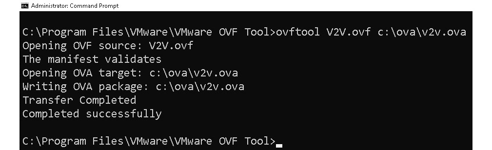

图 8.1 - 使用 OVFtool 将 OVF 转换为 OVA 模板格式

完成后，我们可以轻松地将`v2v.ova`文件上传到我们的 KVM 主机，并在`ova`文件目录中键入以下命令：

```
virt-v2v -i ova v2v.ova -of qcow2 -o libvirt -n default
```

`-of`和`-o`选项指定输出格式（`qcow2` libvirt 映像），`-n`确保 VM 连接到默认虚拟网络。

如果您需要将 Hyper-V VM 转换为 KVM，可以这样做：

```
virt-v2v -i disk /location/of/virtualmachinedisk.vhdx -o local -of qcow2 -os /var/lib/libvirt/images
```

确保您正确指定了 VM 磁盘位置。 `-o local` 和 `-os /var/lib/libvirt/images` 选项确保转换后的磁盘映像被保存在指定目录中（KVM 默认映像目录）。

还有其他类型的 VM 转换过程，例如将物理机器转换为虚拟机。让我们现在来介绍一下。

## virt-p2v

现在我们已经介绍了`virt-v2v`，让我们转而介绍`virt-p2v`。基本上，`virt-v2v`和`virt-p2v`执行的工作似乎相似，但`virt-p2v`的目的是将*物理*机器转换为*VM*。从技术上讲，这是有很大不同的，因为使用`virt-v2v`，我们可以直接访问管理服务器和 hypervisor，并在转换 VM 时（或通过 OVA 模板）进行转换。对于物理机器，没有管理机器可以提供某种支持或**应用程序编程接口**（**API**）来执行转换过程。我们必须直接*攻击*物理机器。在 IT 的实际世界中，通常通过某种代理或附加应用程序来完成这一点。

举个例子，如果您想将物理 Windows 机器转换为基于 VMware 的 VM，您需要在需要转换的系统上安装 VMware vCenter Converter Standalone。然后，您需要选择正确的操作模式，并将完整的转换过程*流式传输*到 vCenter/ESXi。这确实效果很好，但是举个例子，RedHat 的方法有点不同。它使用引导介质来转换物理服务器。因此，在使用此转换过程之前，您必须登录到客户门户（位于[`access.redhat.com/downloads/content/479/ver=/rhel---8/8.0/x86_64/product-software`](https://access.redhat.com/downloads/content/479/ver=/rhel---8/8.0/x86_64/product-software)）以使用`virt-p2v`和`virt-p2v-make-disk`实用程序创建映像。但是，`virt-p2v-make-disk`实用程序使用`virt-builder`，我们稍后将在本章的另一部分中详细介绍。因此，让我们暂时搁置这个讨论，因为我们很快将全力回来。

作为一个旁注，在此命令的支持目的地列表中，我们可以使用 Red Hat 企业虚拟化、OpenStack 或 KVM/`libvirt`。在支持的架构方面，`virt-p2v`仅支持基于 x86_64 的平台，并且仅在 RHEL/CentOS 7 和 8 上使用。在计划进行 P2V 转换时，请记住这一点。

## guestfish

本章介绍的最后一个实用程序是`guestfish`。这是一个非常重要的实用程序，它使您能够对实际的 VM 文件系统进行各种高级操作。我们还可以使用它进行不同类型的转换，例如，将`tar.gz`转换为虚拟磁盘映像；将虚拟磁盘映像从`ext4`文件系统转换为`ext4`文件系统；等等。我们将向您展示如何使用它来打开 VM 映像文件并进行一些操作。

第一个例子是一个非常常见的例子——您已经准备好了一个带有完整 VM 的`qcow2`镜像；客户操作系统已安装；一切都已配置好；您准备将该 VM 文件复制到其他地方以便重复使用；然后……您记得您没有根据某些规范配置根密码。假设这是您为客户做的事情，该客户对初始根密码有特定的要求。这对客户来说更容易——他们不需要通过电子邮件收到您发送的密码；他们只需要记住一个密码；并且，在收到镜像后，它将用于创建 VM。在创建并运行 VM 之后，根密码将被更改为根据安全实践使用的客户密码。

因此，基本上，第一个例子是一个*人类*的例子——忘记做某事，然后想要修复，但（在这种情况下）不实际运行 VM，因为这可能会改变很多设置，特别是如果您的`qcow2`镜像是为 VM 模板化而创建的，那么您*绝对*不希望启动该 VM 来修复某些东西。关于这一点，我们将在本章的下一部分详细介绍。

这是`guestfish`的一个理想用例。假设我们的`qcow2`镜像名为`template.qcow2`。让我们将根密码更改为其他内容——例如，`packt123`。首先，我们需要该密码的哈希。最简单的方法是使用带有`-6`选项的`openssl`（相当于 SHA512 加密），如下面的截图所示：

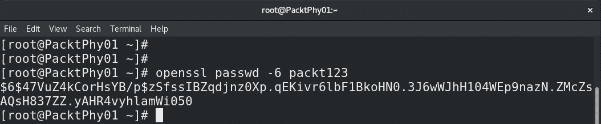

图 8.2 – 使用 openssl 创建基于 SHA512 的密码哈希

现在我们有了哈希，我们可以挂载和编辑我们的镜像，如下所示：

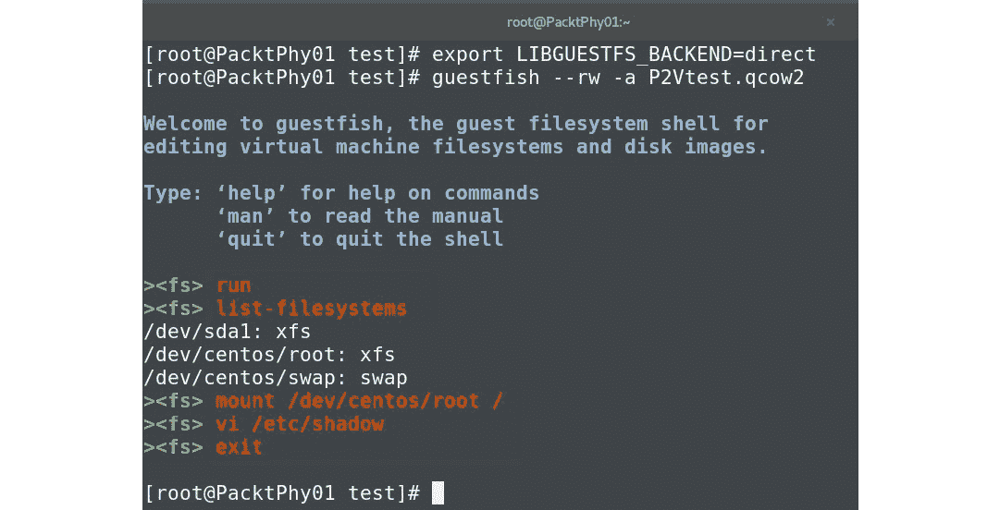

图 8.3 – 使用 guestfish 编辑我们的 qcow2 VM 镜像中的根密码

我们输入的 Shell 命令用于直接访问图像（无需涉及`libvirt`）并以读写模式挂载我们的图像。然后，我们启动了我们的会话（`guestfish run`命令），检查图像中存在哪些文件系统（`list-filesystems`），并将文件系统挂载到根文件夹上。在倒数第二步中，我们将根密码的哈希更改为由`openssl`创建的哈希。`exit`命令关闭我们的`guestfish`会话并保存更改。

您可以使用类似的原理——例如——从`/etc/ssh`目录中删除遗忘的`sshd`密钥，删除用户`ssh`目录等。该过程如下截图所示：

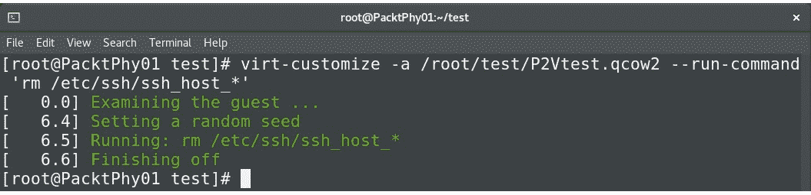

图 8.4 – 使用 virt-customize 在 qcow2 镜像内执行命令

第二个例子也非常有用，因为它涉及到下一章中涵盖的一个主题（`cloud-init`），通常用于通过操纵 VM 实例的早期初始化来配置云 VM。此外，从更广泛的角度来看，您可以使用这个`guestfish`示例来操纵 VM 镜像*内部*的服务配置。因此，假设我们的 VM 镜像被配置为自动启动`cloud-init`服务。出于某种原因，我们希望禁用该服务——例如，为了调试`cloud-init`配置中的错误。如果我们没有能力操纵`qcow`镜像内容，我们将不得不启动该 VM，使用`systemctl`来*禁用*该服务，然后——也许——执行整个过程来重新封装该 VM，如果这是一个 VM 模板的话。因此，让我们使用`guestfish`来达到相同的目的，如下所示：

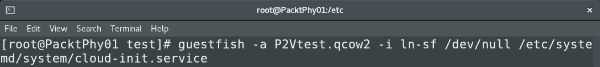

图 8.5 – 使用 guestfish 在 VM 启动时禁用 cloud-init 服务

重要提示

在这个例子中要小心，因为通常我们会在`ln -sf`之间使用空格字符。但在我们的`guestfish`示例中不是这样—它需要*不*使用空格。

最后，假设我们需要将文件复制到我们的镜像。例如，我们需要将本地的`/etc/resolv.conf`文件复制到镜像中，因为我们忘记为此目的配置我们的`virt-copy-in`命令，如下截图所示：

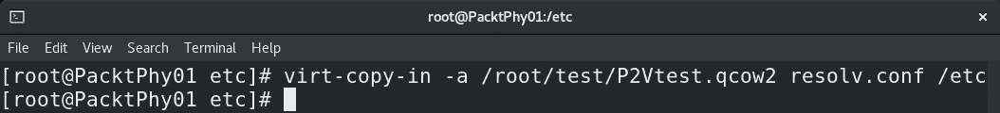

图 8.6 - 使用 virt-copy-in 将文件复制到我们的镜像

我们在本章的这一部分涵盖的主题对接下来的内容非常重要，即讨论创建虚拟机模板。

# VM 模板化

虚拟机最常见的用例之一是创建虚拟机*模板*。因此，假设我们需要创建一个将用作模板的虚拟机。我们在这里字面上使用术语*模板*，就像我们可以为 Word、Excel、PowerPoint 等使用模板一样，因为虚拟机模板存在的原因与此相同—为了让我们拥有一个*熟悉*的预配置工作环境，以便我们不需要从头开始。在虚拟机模板的情况下，我们谈论的是*不从头安装虚拟机客户操作系统*，这是一个巨大的时间节省。想象一下，如果你得到一个任务，需要为某种测试环境部署 500 个虚拟机，以测试某种东西在扩展时的工作情况。即使考虑到你可以并行安装，也会花费数周时间。

虚拟机需要被视为*对象*，它们具有某些*属性*或*特性*。从*外部*的角度来看（即从`libvirt`的角度），虚拟机有一个名称、一个虚拟磁盘、一个虚拟中央处理单元（CPU）和内存配置、连接到虚拟交换机等等。我们在*第七章*中涵盖了这个主题，*VM：安装、配置和生命周期管理*。也就是说，我们没有涉及*虚拟机内部*的主题。从这个角度来看（基本上是从客户操作系统的角度），虚拟机也有一些属性—安装的客户操作系统版本、Internet Protocol（IP）配置、虚拟局域网（VLAN）配置...之后，这取决于基于哪个操作系统的家族虚拟机。因此，我们需要考虑以下内容：

+   如果我们谈论基于 Microsoft Windows 的虚拟机，我们必须考虑服务和软件配置，注册表配置和许可证配置。

+   如果我们谈论基于 Linux 的虚拟机，我们必须考虑服务和软件配置，安全外壳（SSH）密钥配置，许可证配置等等。

甚至可以更具体。例如，为基于 Ubuntu 的虚拟机准备模板与为基于 CentOS 8 的虚拟机准备模板是不同的。为了正确创建这些模板，我们需要学习一些基本程序，然后每次创建虚拟机模板时都可以重复使用。

考虑这个例子：假设你希望创建四个 Apache Web 服务器来托管你的 Web 应用程序。通常，使用传统的手动安装方法，你首先必须创建四个具有特定硬件配置的虚拟机，逐个在每个虚拟机上安装操作系统，然后使用`yum`或其他软件安装方法下载并安装所需的 Apache 软件包。这是一项耗时的工作，因为你将主要进行重复的工作。但是使用模板方法，可以在较短的时间内完成。为什么？因为你将绕过操作系统安装和其他配置任务，直接从包含预配置操作系统镜像的模板中生成虚拟机，其中包含所有所需的 Web 服务器软件包，准备供使用。

以下截图显示了手动安装方法涉及的步骤。您可以清楚地看到*步骤 2-5*只是在所有四个 VM 上执行的重复任务，它们将占用大部分时间来准备您的 Apache Web 服务器：

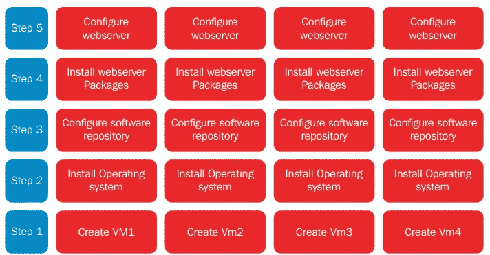

图 8.7 - 不使用 VM 模板安装四个 Apache Web 服务器

现在，看看通过简单地遵循*步骤 1-5*一次，创建一个模板，然后使用它部署四个相同的 VM，步骤数量是如何大幅减少的。这将为您节省大量时间。您可以在以下图表中看到差异：

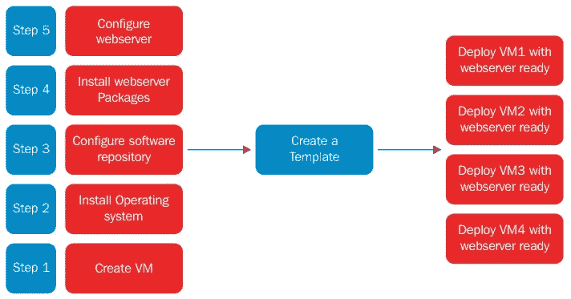

图 8.8 - 使用 VM 模板安装四个 Apache Web 服务器

然而，这并不是全部。实际上从*步骤 3*到*步骤 4*（从**创建模板**到部署 VM1-4）有不同的方式，其中包括完全克隆过程或链接克隆过程，详细介绍如下：

+   **完全克隆**：使用完全克隆机制部署的 VM 将创建 VM 的完整副本，问题在于它将使用与原始 VM 相同的容量。

+   **链接克隆**：使用薄克隆机制部署的 VM 将模板镜像作为只读模式的基础镜像，并链接一个额外的**写时复制**（COW）镜像来存储新生成的数据。这种配置方法在云和虚拟桌面基础设施（VDI）环境中被广泛使用，因为它可以节省大量磁盘空间。请记住，快速存储容量是非常昂贵的，因此在这方面的任何优化都将节省大量资金。链接克隆还会对性能产生影响，我们稍后会讨论一下。

现在，让我们看看模板是如何工作的。

## 使用模板

在本节中，您将学习如何使用`virt-manager`中可用的`virt-clone`选项创建 Windows 和 Linux VM 的模板。虽然`virt-clone`实用程序最初并不是用于创建模板，但当与`virt-sysprep`和其他操作系统封装实用程序一起使用时，它可以实现这一目的。请注意，克隆和主镜像之间存在差异。克隆镜像只是一个 VM，而主镜像是可以用于部署数百甚至数千个新 VM 的 VM 副本。

### 创建模板

模板是通过将 VM 转换为模板来创建的。实际上，这是一个包括以下步骤的三步过程：

1.  安装和定制 VM，包括所有所需的软件，这将成为模板或基础镜像。

1.  删除所有系统特定属性以确保 VM 的唯一性 - 我们需要处理 SSH 主机密钥、网络配置、用户帐户、媒体访问控制（MAC）地址、许可信息等。

1.  通过在名称前加上模板前缀将 VM 标记为模板。一些虚拟化技术对此有特殊的 VM 文件类型（例如 VMware 的`.vmtx`文件），这实际上意味着您不必重命名 VM 来标记它为模板。

要了解实际的过程，让我们创建两个模板并从中部署一个 VM。我们的两个模板将是以下内容：

+   具有完整 Linux、Apache、MySQL 和 PHP（LAMP）堆栈的 CentOS 8 VM

+   具有 SQL Server Express 的 Windows Server 2019 VM

让我们继续创建这些模板。

#### 示例 1 - 准备一个带有完整 LAMP 堆栈的 CentOS 8 模板

CentOS 的安装对我们来说应该是一个熟悉的主题，所以我们只会专注于 LAMP 堆栈的*AMP*部分和模板部分。因此，我们的过程将如下所示：

1.  创建一个 VM 并在其上安装 CentOS 8，使用您喜欢的安装方法。保持最小化，因为这个 VM 将被用作为为此示例创建的模板的基础。

1.  通过 SSH 进入或接管虚拟机并安装 LAMP 堆栈。以下是一个脚本，用于在操作系统安装完成后在 CentOS 8 上安装 LAMP 堆栈所需的一切。让我们从软件包安装开始，如下所示：

```
yum -y update
yum -y install httpd httpd-tools mod_ssl
systemctl start httpd
systemctl enable httpd
yum -y install mariadb-server mariadb
yum install -y php php-fpm php-mysqlnd php-opcache php-gd php-xml php-mbstring libguestfs*
```

在软件安装完成后，让我们进行一些服务配置——启动所有必要的服务并启用它们，并重新配置防火墙以允许连接，如下所示：

```
systemctl start mariadb
systemctl enable mariadb
systemctl start php-fpm
systemctl enable php-fpm
firewall-cmd --permanent --zone=public --add-service=http
firewall-cmd --permanent --zone=public --add-service=https
systemctl reload firewalld
```

我们还需要配置一些与目录所有权相关的安全设置，例如 Apache Web 服务器的**安全增强型 Linux**（**SELinux**）配置。让我们像这样进行下一步操作：

```
chown apache:apache /var/www/html -R
semanage fcontext -a -t httpd_sys_content_t "/var/www/html(/.*)?"
restorecon -vvFR /var/www/html
setsebool -P httpd_execmem 1
```

1.  完成此操作后，我们需要配置 MariaDB，因为我们必须为数据库管理用户设置某种 MariaDB 根密码并配置基本设置。这通常是通过 MariaDB 软件包提供的`mysql_secure_installation`脚本完成的。因此，这是我们的下一步，如下面的代码片段所示：

```
mysql_secure_installation script, it is going to ask us a series of questions, as illustrated in the following screenshot: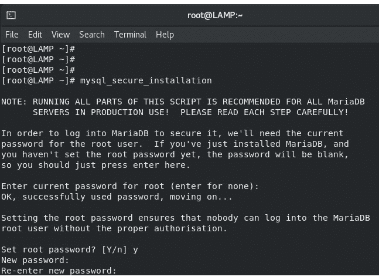Figure 8.9 – First part of MariaDB setup: assigning a root password that is empty after installationAfter assigning a root password for the MariaDB database, the next steps are more related to housekeeping—removing anonymous users, disallowing remote login, and so on. Here's what that part of wizard looks like: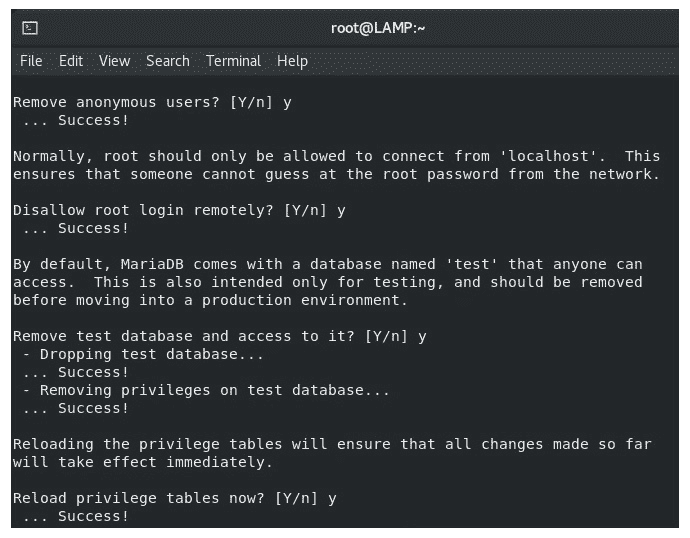Figure 8.10 – Housekeeping: anonymous users, root login setup, test database data removalWe installed all the necessary services—Apache, MariaDB—and all the necessary additional packages (PHP, `sample index.html` file and place it in `/var/www/html`), but we're not going to do that right now. In production environments, we'd just copy web page contents to that directory and be done with it.
```

1.  现在，必需的 LAMP 设置已按我们的要求配置好，关闭虚拟机并运行`virt-sysprep`命令进行封存。如果要*过期*根密码（即在下次登录时强制更改根密码），请输入以下命令：

```
passwd --expire root
```

我们的测试虚拟机名为 LAMP，主机名为`PacktTemplate`，因此以下是必要的步骤，通过一行命令呈现：

```
virsh shutdown LAMP; sleep 10; virsh list
```

我们的 LAMP 虚拟机现在已准备好重新配置为模板。为此，我们将使用`virt-sysprep`命令。

#### 什么是 virt-sysprep？

这是`libguestfs-tools-c`软件包提供的命令行实用程序，用于简化 Linux 虚拟机的封存和通用化过程。它会自动删除系统特定信息，使克隆可以从中创建。`virt-sysprep`可用于添加一些额外的配置位和部分，例如用户、组、SSH 密钥等。

有两种方法可以针对 Linux 虚拟机调用`virt-sysprep`：使用`-d`或`-a`选项。第一个选项指向预期的客户端，使用其名称或`virt-sysprep`命令，即使客户端未在`libvirt`中定义。

执行`virt-sysprep`命令后，它会执行一系列的`sysprep`操作，通过从中删除系统特定信息使虚拟机镜像变得干净。如果您想了解此命令在后台的工作原理，请在命令中添加`--verbose`选项。该过程可以在以下截图中看到：

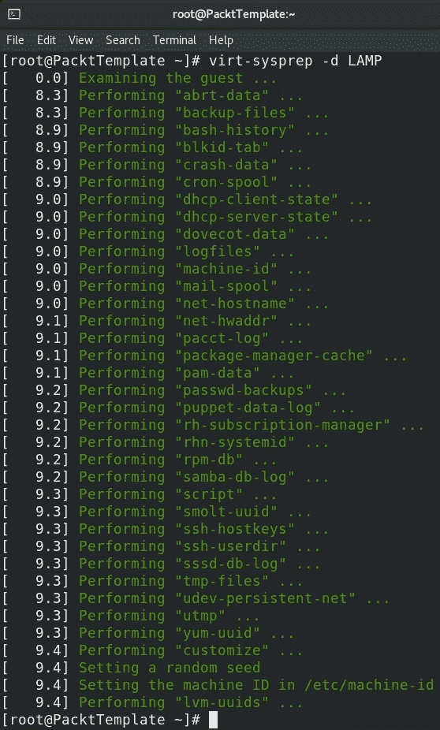

图 8.11 – virt-sysprep 在虚拟机上发挥魔力

默认情况下，`virt-sysprep`执行超过 30 个操作。您还可以选择要使用的特定 sysprep 操作。要获取所有可用操作的列表，请运行`virt-sysprep --list-operation`命令。默认操作用星号标记。您可以使用`--operations`开关更改默认操作，后跟逗号分隔的要使用的操作列表。请参阅以下示例：

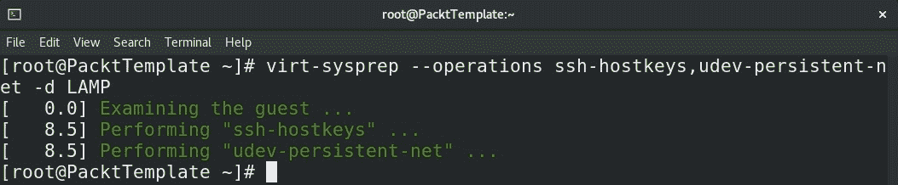

图 8.12 – 使用 virt-sysprep 自定义在模板虚拟机上执行的操作

请注意，这一次它只执行了`ssh-hostkeys`和`udev-persistentnet`操作，而不是典型的操作。您可以自行决定在模板中进行多少清理工作。

现在，我们可以通过在名称前添加*template*来将此虚拟机标记为模板。甚至可以在从`libvirt`中取消定义虚拟机之前备份其**可扩展标记语言**（**XML**）文件。

重要提示

确保从现在开始，此虚拟机永远不要启动；否则，它将丢失所有 sysprep 操作，甚至可能导致使用薄方法部署的虚拟机出现问题。

要重命名虚拟机，请使用`virsh domrename`作为 root 用户，如下所示：

```
# virsh domrename LAMP LAMP-Template
```

`LAMP-Template`，我们的模板，现在已准备好用于未来的克隆过程。您可以使用以下命令检查其设置：

```
# virsh dominfo LAMP-Template
```

最终结果应该是这样的：

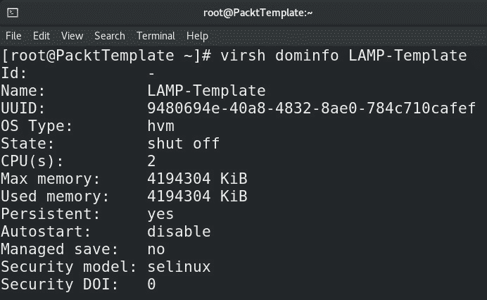

图 8.13 - 在我们的模板 VM 上使用 virsh dominfo

下一个示例将是关于准备一个预安装了 Microsoft **结构化查询语言**（**SQL**）数据库的 Windows Server 2019 模板 - 这是我们许多人在环境中需要使用的常见用例。让我们看看我们如何做到这一点。

#### 示例 2 - 准备带有 Microsoft SQL 数据库的 Windows Server 2019 模板

`virt-sysprep` 不适用于 Windows 客户端，而且很少有可能在短时间内添加支持。因此，为了通用化 Windows 机器，我们需要访问 Windows 系统并直接运行`sysprep`。

`sysprep`工具是一个用于从 Windows 映像中删除特定系统数据的本机 Windows 实用程序。要了解有关此实用程序的更多信息，请参阅本文：[`docs.microsoft.com/en-us/windows-hardware/manufacture/desktop/sysprep--generalize--a-windows-installation`](https://docs.microsoft.com/en-us/windows-hardware/manufacture/desktop/sysprep--generalize--a-windows-installation)。

我们的模板准备过程将如下进行：

1.  创建一个 VM 并在其上安装 Windows Server 2019 操作系统。我们的 VM 将被称为`WS2019SQL`。

1.  安装 Microsoft SQL Express 软件，并在配置好后，重新启动 VM 并启动`sysprep`应用程序。`sysprep`的`.exe`文件位于`C:\Windows\System32\sysprep`目录中。通过在运行框中输入`sysprep`并双击`sysprep.exe`来导航到那里。

1.  在**系统清理操作**下，选择**进入系统的 OOBE**并勾选**通用化**复选框，如果您想进行**系统标识号**（**SID**）重建，如下截图所示：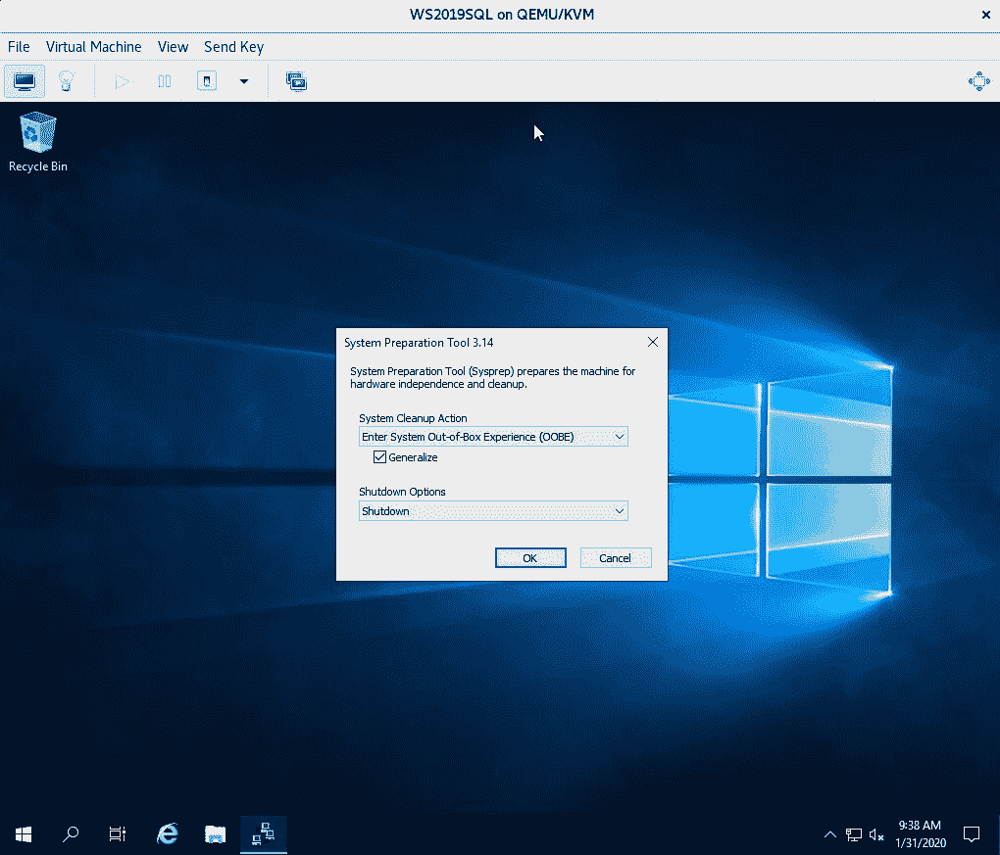

图 8.14 - 小心使用 sysprep 选项；OOBE，通用化和关闭选项是强烈建议的

1.  在那之后，`sysprep`过程将开始，并在完成后关闭。

1.  使用与我们在 LAMP 模板上使用的相同过程来重命名 VM，如下所示：

```
# virsh domrename WS2019SQL WS2019SQL-Template
```

同样，我们可以使用`dominfo`选项来检查我们新创建的模板的基本信息，如下所示：

```
# virsh dominfo WS2019SQL-Template
```

重要提示

在将来更新模板时要小心 - 您需要运行它们，更新它们，并重新密封它们。对于 Linux 发行版，这样做不会有太多问题。但是，对于 Microsoft Windows `sysprep`（启动模板 VM，更新，`sysprep`，并在将来重复）将使您陷入`sysprep`会抛出错误的情况。因此，这里还有另一种思路可以使用。您可以像我们在本章的这一部分中所做的那样执行整个过程，但不要`sysprep`它。这样，您可以轻松更新 VM，然后克隆它，然后`sysprep`它。这将节省您大量时间。

接下来，我们将看到如何从模板部署 VM。

## 从模板部署 VM

在前一节中，我们创建了两个模板映像；第一个模板映像仍然在`libvirt`中定义为`VM`，并命名为`LAMP-Template`，第二个称为`WS2019SQL-Template`。我们现在将使用这两个 VM 模板来从中部署新的 VM。

### 使用完全克隆部署 VM

执行以下步骤使用克隆配置来部署 VM：

1.  打开 VM 管理器（`virt-manager`），然后选择`LAMP-Template` VM。右键单击它，然后选择**克隆**选项，这将打开**克隆虚拟机**窗口，如下截图所示：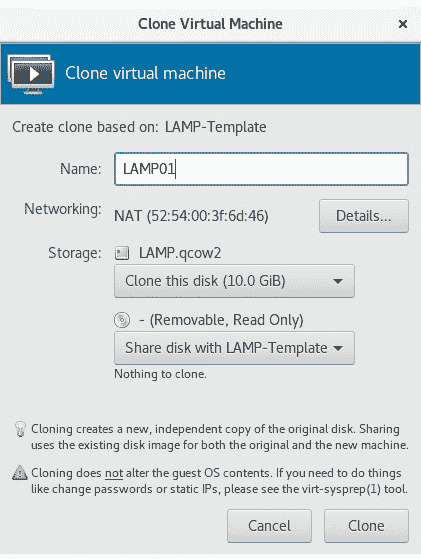

图 8.15 - 从 VM 管理器克隆 VM

1.  为生成的 VM 提供名称并跳过所有其他选项。单击**克隆**按钮开始部署。等待克隆操作完成。

1.  完成后，您新部署的 VM 已经准备好使用，您可以开始使用它。您可以在以下截图中看到该过程的输出：

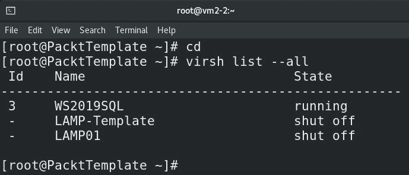

图 8.16-已创建完整克隆（LAMP01）

由于我们之前的操作，`LAMP01` VM 是从`LAMP-Template`部署的，但由于我们使用了完整克隆方法，它们是独立的，即使您删除`LAMP-Template`，它们也会正常运行。

我们还可以使用链接克隆，这将通过创建一个锚定到基本映像的 VM 来节省大量的磁盘空间。让我们接下来做这个。

### 使用链接克隆部署 VM

执行以下步骤，使用链接克隆方法开始 VM 部署：

1.  使用`/var/lib/libvirt/images/WS2019SQL.qcow2`作为后备文件创建两个新的`qcow2`图像，如下所示：

```
# qemu-img create -b /var/lib/libvirt/images/WS2019SQL.qcow2 -f qcow2 /var/lib/libvirt/images/LinkedVM1.qcow2
# qemu-img create -b /var/lib/libvirt/images/WS2019SQL.qcow2 -f qcow2 /var/lib/libvirt/images/LinkedVM2.qcow2
```

1.  验证新创建的`qcow2`图像的后备文件属性是否正确指向`/var/lib/libvirt/images/WS2019SQL.qcow2`图像，使用`qemu-img`命令。这三个步骤的最终结果应该如下所示：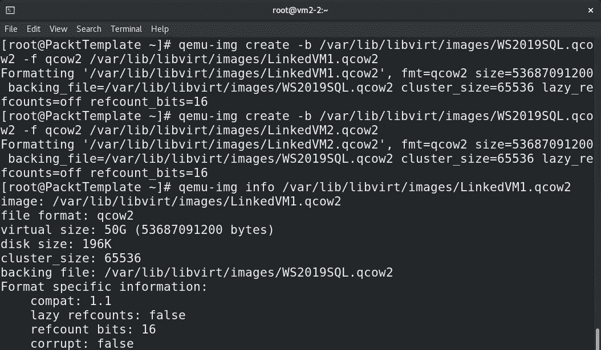

图 8.17-创建链接克隆图像

1.  现在，使用`virsh`命令将模板 VM 配置转储到两个 XML 文件中。我们这样做两次，以便我们有两个 VM 定义。在更改了一些参数后，我们将它们导入为两个新的 VM，如下所示：

```
virsh dumpxml WS2019SQL-Template > /root/SQL1.xml
virsh dumpxml WS2019SQL-Template > /root/SQL2.xml
```

1.  使用`uuidgen -r`命令生成两个随机 UUID。我们将需要它们用于我们的 VM。该过程可以在以下截图中看到：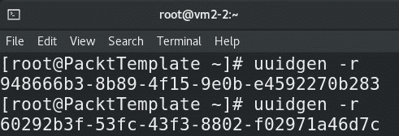

图 8.18-为我们的 VM 生成两个新的 UUID

1.  通过为它们分配新的 VM 名称和 UUID 编辑`SQL1.xml`和`SQL2.xml`文件。这一步是强制性的，因为 VM 必须具有唯一的名称和 UUID。让我们将第一个 XML 文件中的名称更改为`SQL1`，将第二个 XML 文件中的名称更改为`SQL2`。我们可以通过更改`<name></name>`语句来实现这一点。然后，在`SQL1.xml`和`SQL2.xml`的`<uuid></uuid>`语句中复制并粘贴我们使用`uuidgen`命令创建的 UUID。因此，配置文件中这两行的相关条目应该如下所示：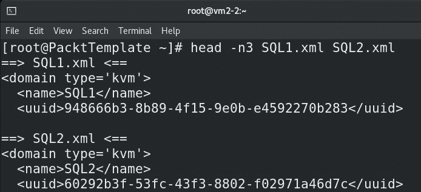

图 8.19-更改其各自 XML 配置文件中的 VM 名称和 UUID

1.  我们需要更改`SQL1`和`SQL2`镜像文件中虚拟磁盘的位置。在这些配置文件后面找到`.qcow2`文件的条目，并更改它们，使其使用我们在*步骤 1*中创建的文件的绝对路径，如下所示：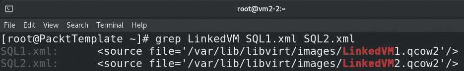

图 8.20-更改 VM 镜像位置，使其指向新创建的链接克隆图像

1.  现在，使用`virsh create`命令将这两个 XML 文件作为 VM 定义导入，如下所示：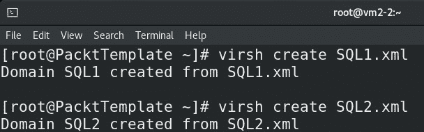

图 8.21-从 XML 定义文件创建两个新的 VM

1.  使用`virsh`命令验证它们是否已定义和运行，如下所示：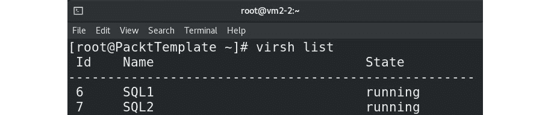

图 8.22-两个新的 VM 已经启动

1.  VM 已经启动，所以我们现在可以检查我们链接克隆过程的最终结果。这两个 VM 的虚拟磁盘应该相当小，因为它们都使用相同的基本镜像。让我们检查客户磁盘映像大小-请注意在以下截图中，`LinkedVM1.qcow`和`LinkedVM2.qcow`文件的大小大约是其基本映像的 50 倍小：

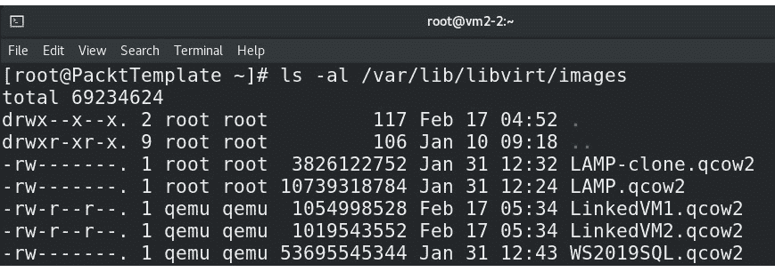

图 8.23 – 链接克隆部署的结果：基础镜像，小增量镜像

这应该提供了大量关于使用链接克隆过程的示例和信息。不要走得太远（在单个基础镜像上创建许多链接克隆），你应该没问题。但现在，是时候转到我们的下一个主题了，那就是关于`virt-builder`。如果你想快速部署 VM 而不实际安装它们，`virt-builder`的概念非常重要。我们可以使用`virt-builder`存储库来实现这一点。让我们学习如何做到这一点。

# virt-builder 和 virt-builder 存储库

在`libguestfs`软件包中最重要的工具之一是`virt-builder`。假设你*真的*不想从头构建一个 VM，要么是因为你没有时间，要么是因为你根本不想麻烦。我们将以 CentOS 8 为例，尽管现在支持的发行版列表大约有 50 个（发行版及其子版本），如你在以下截图中所见：

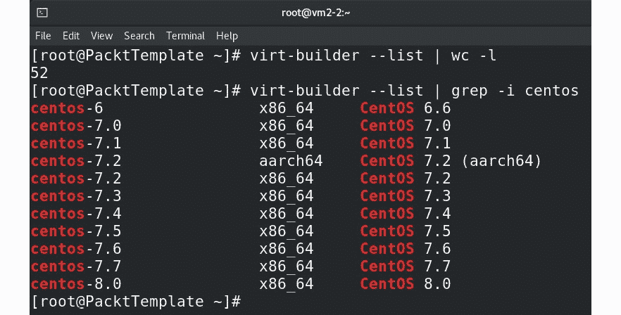

图 8.24 – virt-builder 支持的操作系统和 CentOS 发行版

在我们的测试场景中，我们需要尽快创建一个 CentOS 8 镜像，并从该镜像创建一个 VM。到目前为止，部署 VM 的所有方式都是基于从头安装、克隆或模板化的想法。这些要么是*从零开始*，要么是*先部署模板，然后再进行配置*的机制。如果还有其他方法呢？

`virt-builder`为我们提供了一种方法。通过发出几个简单的命令，我们可以导入一个 CentOS 8 镜像，将其导入到 KVM，并启动它。让我们继续，如下所示：

1.  首先，让我们使用`virt-builder`下载一个具有指定参数的 CentOS 8 镜像，如下所示：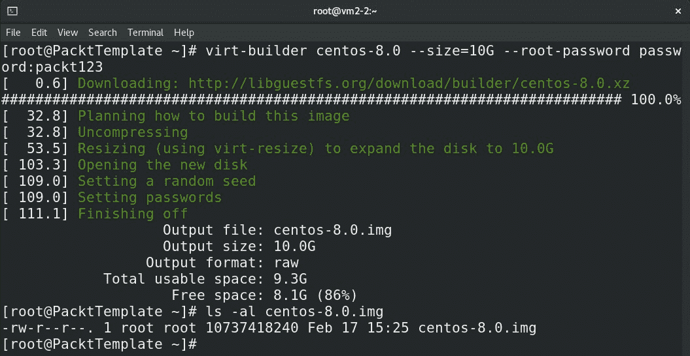

图 8.25 – 使用 virt-builder 获取 CentOS 8.0 镜像并检查其大小

1.  一个合乎逻辑的下一步是进行`virt-install`，所以，我们开始吧：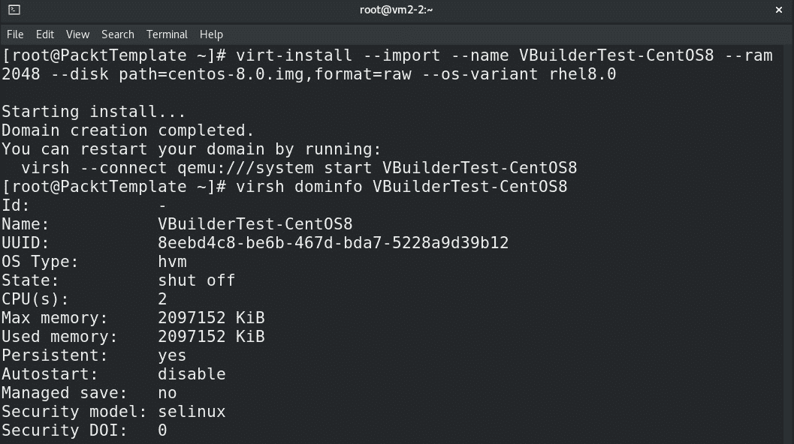

图 8.26 – 配置、部署和添加到本地 KVM 虚拟化管理程序的新 VM

1.  如果你觉得这很酷，让我们继续扩展。假设我们想要获取一个`virt-builder`镜像，向该镜像添加一个名为`Virtualization Host`的`yum`软件包组，并且在此过程中添加 root 的 SSH 密钥。我们会这样做：

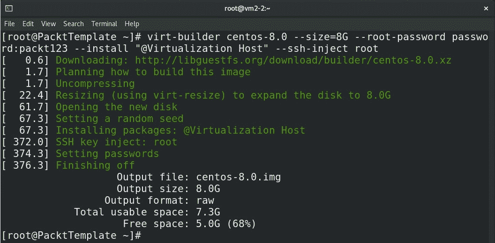

图 8.27 – 添加虚拟化主机

实际上，这真的非常酷，它让我们的生活变得更加轻松，为我们做了很多工作，而且以一种非常简单的方式完成了，它也适用于微软 Windows 操作系统。此外，我们可以使用自定义的`virt-builder`存储库下载特定的虚拟机，以满足我们自己的需求，接下来我们将学习如何做到这一点。

## virt-builder 存储库

显然，有一些预定义的`virt-builder`存储库（[`libguestfs.org/`](http://libguestfs.org/)是其中之一），但我们也可以创建自己的存储库。如果我们转到`/etc/virt-builder/repos.d`目录，我们会看到那里有几个文件（`libguestfs.conf`及其密钥等）。我们可以轻松地创建自己的额外配置文件，以反映我们的本地或远程`virt-builder`存储库。假设我们想创建一个本地`virt-builder`存储库。让我们在`/etc/virt-builder/repos.d`目录中创建一个名为`local.conf`的配置文件，内容如下：

```
[local]
uri=file:///root/virt-builder/index
```

然后，将镜像复制或移动到`/root/virt-builder`目录（我们将使用在上一步中创建的`centos-8.0.img`文件，通过使用`xz`命令将其转换为`xz`格式），并在该目录中创建一个名为`index`的文件，内容如下：

```
[Packt01]
name=PacktCentOS8
osinfo=centos8.0
arch=x86_64
file=centos-8.0.img.xz
checksum=ccb4d840f5eb77d7d0ffbc4241fbf4d21fcc1acdd3679 c13174194810b17dc472566f6a29dba3a8992c1958b4698b6197e6a1689882 b67c1bc4d7de6738e947f
format=raw
size=8589934592
compressed_size=1220175252
notes=CentOS8 with KVM and SSH
```

一些解释。`checksum`是使用`centos-8.0.img.xz`上的`sha512sum`命令计算的。`size`和`compressed_size`是原始和 XZd 文件的实际大小。之后，如果我们发出`virt-builder --list |more`命令，我们应该会得到如下所示的内容：

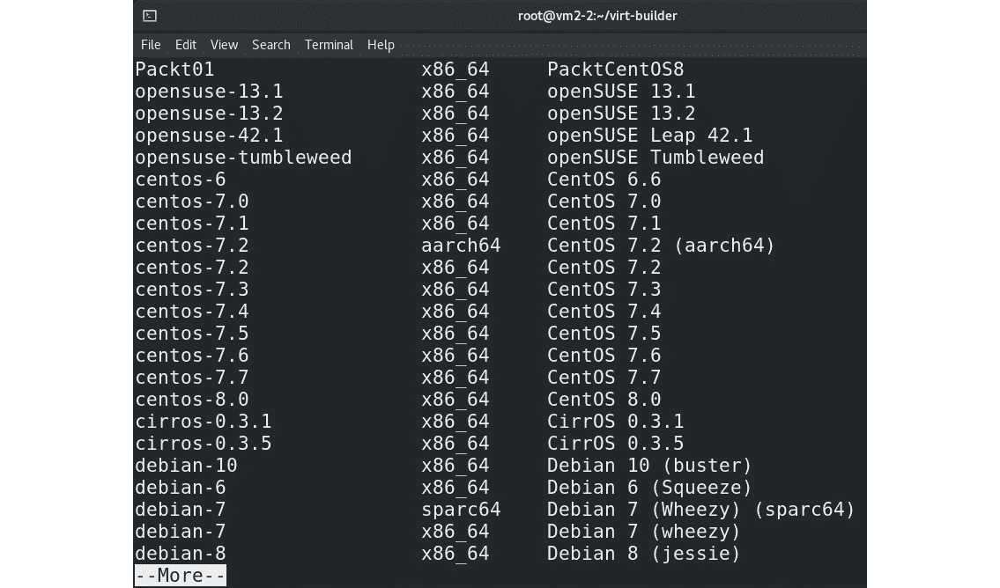

图 8.28-我们成功将图像添加到本地 virt-builder 存储库

您可以清楚地看到我们的`Packt01`映像位于列表的顶部，我们可以轻松使用它来部署新的 VM。通过使用额外的存储库，我们可以极大地增强我们的工作流程，并重复使用我们现有的 VM 和模板来部署任意数量的 VM。想象一下，这与`virt-builder`的自定义选项结合使用，对于 OpenStack、**Amazon Web Services**（**AWS**）等云服务有何作用。

我们列表上的下一个主题与快照有关，这是一个非常有价值但被误用的 VM 概念。有时，您在 IT 中有一些概念，既可以是好的，也可以是坏的，快照通常是其中的嫌疑犯。让我们解释一下快照的全部内容。

# 快照

VM 快照是系统在特定时间点的基于文件的表示。快照包括配置和磁盘数据。通过快照，您可以将 VM 恢复到某个时间点，这意味着通过对 VM 进行快照，您可以保留其状态，并在将来需要时轻松恢复到该状态。

快照有许多用途，例如在进行可能具有破坏性操作之前保存 VM 的状态。例如，假设您想要对现有的 Web 服务器 VM 进行一些更改，目前它正在正常运行，但您不确定您计划进行的更改是否会起作用或会破坏某些内容。在这种情况下，您可以在执行预期的配置更改之前对 VM 进行快照，如果出现问题，您可以通过恢复快照轻松恢复到 VM 的先前工作状态。

`libvirt`支持拍摄实时快照。您可以在客户机运行时对 VM 进行快照。但是，如果 VM 上有任何**输入/输出**（**I/O**）密集型应用程序正在运行，建议首先关闭或暂停客户机，以确保干净的快照。

`libvirt`客户端主要有两类快照：内部和外部；每种都有其自己的优点和局限，如下所述：

+   `qcow2`文件。快照前后的位存储在单个磁盘中，从而提供更大的灵活性。`virt-manager`提供了一个图形管理实用程序来管理内部快照。以下是内部快照的限制：

a) 仅支持`qcow2`格式

b) 在拍摄快照时 VM 被暂停

c) 无法与 LVM 存储池一起使用

+   **外部快照**：外部快照基于 COW 概念。当快照被拍摄时，原始磁盘映像变为只读，并创建一个新的覆盖磁盘映像以容纳客户写入，如下图所示：

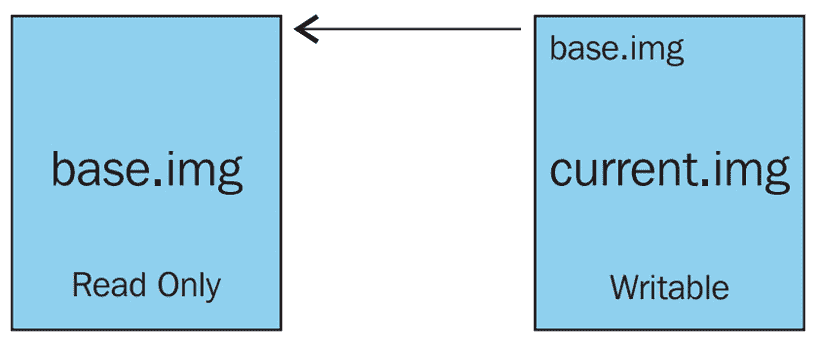

图 8.29-快照概念

覆盖磁盘映像最初创建为`0`字节的长度，它可以增长到原始磁盘的大小。覆盖磁盘映像始终为`qcow2`。但是，外部快照可以与任何基本磁盘映像一起使用。您可以对原始磁盘映像、`qcow2`或任何其他`libvirt`支持的磁盘映像格式进行外部快照。但是，目前尚无**图形用户界面**（**GUI**）支持外部快照，因此与内部快照相比，管理起来更昂贵。

## 使用内部快照

在本节中，您将学习如何为 VM 创建、删除和恢复内部快照（离线/在线）。您还将学习如何使用`virt-manager`来管理内部快照。

内部快照仅适用于`qcow2`磁盘映像，因此首先确保要为其创建快照的虚拟机使用`qcow2`格式作为基础磁盘映像。如果不是，请使用`qemu-img`命令将其转换为`qcow2`格式。内部快照是磁盘快照和虚拟机内存状态的组合——这是一种可以在需要时轻松恢复的检查点。

我在这里使用`LAMP01`虚拟机作为示例来演示内部快照。`LAMP01`虚拟机位于本地文件系统支持的存储池上，并具有`qcow2`映像作为虚拟磁盘。以下命令列出了与虚拟机关联的快照：

```
# virsh snapshot-list LAMP01
Name Creation Time State
-------------------------------------------------
```

可以看到，目前与虚拟机关联的快照不存在；`LAMP01` `virsh snapshot-list`命令列出了给定虚拟机的所有可用快照。默认信息包括快照名称、创建时间和域状态。通过向`snapshot-list`命令传递附加选项，可以列出许多其他与快照相关的信息。

### 创建第一个内部快照

在 KVM 主机上为虚拟机创建内部快照的最简单和首选方法是通过`virsh`命令。`virsh`具有一系列选项来创建和管理快照，如下所示：

+   `snapshot-create`: 使用 XML 文件创建快照

+   `snapshot-create-as`: 使用参数列表创建快照

+   `snapshot-current`: 获取或设置当前快照

+   `snapshot-delete`: 删除虚拟机快照

+   `snapshot-dumpxml`: 以 XML 格式转储快照配置

+   `snapshot-edit`: 编辑快照的 XML

+   `snapshot-info`: 获取快照信息

+   `snapshot-list`: 列出虚拟机快照

+   `snapshot-parent`: 获取快照的父名称

+   `snapshot-revert`: 将虚拟机恢复到特定快照

以下是创建快照的简单示例。运行以下命令将为`LAMP01`虚拟机创建一个内部快照：

```
# virsh snapshot-create LAMP01
Domain snapshot 1439949985 created
```

默认情况下，新创建的快照会以唯一编号作为名称。要创建具有自定义名称和描述的快照，请使用`snapshot-create-as`命令。这两个命令之间的区别在于后者允许将配置参数作为参数传递，而前者不允许。它只接受 XML 文件作为输入。在本章中，我们使用`snapshot-create-as`，因为它更方便和易于使用。

### 使用自定义名称和描述创建内部快照

要为`LAMP01`虚拟机创建一个名称为`快照 1`且描述为`第一个快照`的内部快照，请键入以下命令：

```
# virsh snapshot-create-as LAMP01 --name "Snapshot 1" --description "First snapshot" --atomic
```

使用`--atomic`选项指定，`libvirt`将确保如果快照操作成功或失败，不会发生任何更改。建议始终使用`--atomic`选项以避免在进行快照时发生任何损坏。现在，检查这里的`snapshot-list`输出：

```
# virsh snapshot-list LAMP01
Name Creation Time State
----------------------------------------------------
Snapshot1 2020-02-05 09:00:13 +0230 running
```

我们的第一个快照已准备就绪，现在我们可以使用它来恢复虚拟机的状态，如果将来出现问题。此快照是在虚拟机处于运行状态时拍摄的。快照创建所需的时间取决于虚拟机的内存量以及客户端在那个时间修改内存的活动程度。

请注意，虚拟机在创建快照时会进入暂停模式；因此，建议在虚拟机未运行时进行快照。从已关闭的虚拟机中进行快照可以确保数据完整性。

### 创建多个快照

我们可以根据需要继续创建更多快照。例如，如果我们创建两个额外的快照，使总数达到三个，那么`snapshot-list`的输出将如下所示：

```
# virsh snapshot-list LAMP01 --parent
Name Creation Time State Parent
--------------------------------------------------------------------
Snapshot1 2020-02-05 09:00:13 +0230 running (null)
Snapshot2 2020-02-05 09:00:43 +0230 running Snapshot1
Snapshot3 2020-02-05 09:01:00 +0230 shutoff Snapshot2
```

在这里，我们使用了`--parent`开关，它打印出快照的父-子关系。第一个快照的父级是`(null)`，这意味着它直接在磁盘映像上创建，`Snapshot1`是`Snapshot2`的父级，`Snapshot2`是`Snapshot3`的父级。这有助于我们了解快照的顺序。使用`--tree`选项还可以获得类似树状的快照视图，如下所示：

```
# virsh snapshot-list LAMP01 --tree
Snapshot1
   |
  +- Snapshot2
       |
      +- Snapshot3
```

现在，检查`state`列，它告诉我们特定快照是在线还是离线。在前面的示例中，第一个和第二个快照是在 VM 运行时拍摄的，而第三个是在 VM 关闭时拍摄的。

恢复到关闭状态的快照将导致 VM 关闭。您还可以使用`qemu-img`命令实用程序获取有关内部快照的更多信息-例如，快照大小，快照标记等。在以下示例输出中，您可以看到名为`LAMP01.qcow2`的磁盘具有三个具有不同标记的快照。这还向您展示了特定快照的创建日期和时间：

```
# qemu-img info /var/lib/libvirt/qemu/LAMP01.qcow2
image: /var/lib/libvirt/qemu/LAMP01.qcow2
file format: qcow2
virtual size: 8.0G (8589934592 bytes)
disk size: 1.6G
cluster_size: 65536
Snapshot list:
ID TAG VM SIZE DATE VM CLOCK
1 1439951249 220M 2020-02-05 09:57:29 00:09:36.885
2 Snapshot1 204M 2020-02-05 09:00:13 00:01:21.284
3 Snapshot2 204M 2020-02-05 09:00:43 00:01:47.308
4 Snapshot3 0 2020-02-05 09:01:00 00:00:00.000
```

这也可以用来使用`check`开关检查`qcow2`镜像的完整性，如下所示：

```
# qemu-img check /var/lib/libvirt/qemu/LAMP01.qcow2
No errors were found on the image.
```

如果镜像中发生了任何损坏，上述命令将抛出错误。一旦在`qcow2`镜像中检测到错误，就应立即对 VM 进行备份。

### 恢复内部快照

拍摄快照的主要目的是在需要时恢复 VM 的干净/工作状态。让我们举个例子。假设在拍摄 VM 的`Snapshot3`之后，您安装了一个搞乱了整个系统配置的应用程序。在这种情况下，VM 可以轻松地恢复到创建`Snapshot3`时的状态。要恢复到快照，请使用`snapshot-revert`命令，如下所示：

```
# virsh snapshot-revert <vm-name> --snapshotname "Snapshot1"
```

如果要恢复到一个关闭的快照，那么您将不得不手动启动 VM。使用`virsh snapshot-revert`命令的`--running`开关可以使其自动启动。

### 删除内部快照

一旦确定不再需要快照，就可以删除它以节省空间。要删除 VM 的快照，请使用`snapshot-delete`命令。根据我们之前的示例，让我们删除第二个快照，如下所示：

```
# virsh snapshot-list LAMP01
Name Creation Time State
------------------------------------------------------
Snapshot1 2020-02-05 09:00:13 +0230 running
Snapshot2 2020-02-05 09:00:43 +0230 running
Snapshot3 2020-02-05 09:01:00 +0230 shutoff
Snapshot4 2020-02-18 03:28:36 +0230 shutoff
# virsh snapshot-delete LAMP01 Snapshot 2
Domain snapshot Snapshot2 deleted
# virsh snapshot-list LAMP01
Name Creation Time State
------------------------------------------------------
Snapshot1 2020-02-05 09:00:13 +0230 running
Snapshot3 2020-02-05 09:00:43 +0230 running
Snapshot4 2020-02-05 10:17:00 +0230 shutoff
```

现在让我们看看如何使用`virt-manager`执行这些程序，这是我们的 VM 管理的 GUI 实用程序。

## 使用 virt-manager 管理快照

正如您所期望的那样，`virt-manager`具有用于创建和管理 VM 快照的用户界面。目前，它仅适用于`qcow2`镜像，但很快也将支持原始镜像。使用`virt-manager`拍摄快照实际上非常简单；要开始，请打开 VM Manager 并单击要拍摄快照的 VM。

快照用户界面按钮（在下面的屏幕截图中用红色标记）出现在工具栏上；只有当 VM 使用`qcow2`磁盘时，此按钮才会被激活：

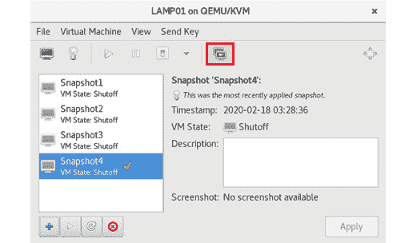

图 8.30-使用 virt-manager 快照

然后，如果我们想要拍摄快照，只需使用**+**按钮，这将打开一个简单的向导，以便我们可以为快照命名和描述，如下面的屏幕截图所示：

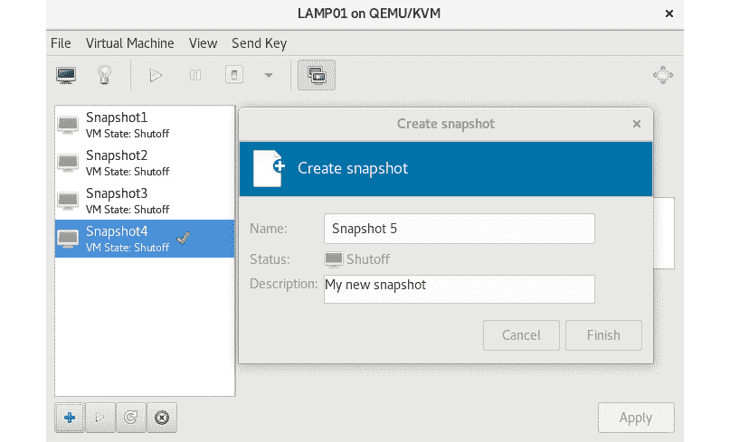

图 8.31-创建快照向导

接下来，让我们看看如何使用外部磁盘快照，这是一种更快，更现代（尽管不太成熟）的 KVM/VM 快照概念。请记住，外部快照将会一直存在，因为它们具有对于现代生产环境非常重要的更多功能。

## 使用外部磁盘快照

您在上一节中了解了内部快照。内部快照非常简单，易于创建和管理。现在，让我们探索外部快照。外部快照主要涉及`overlay_image`和`backing_file`。基本上，它将`backing_file`转换为只读状态，并开始在`overlay_image`上写入。这两个图像描述如下：

+   `backing_file`：VM 的原始磁盘图像（只读）

+   `overlay_image`：快照图像（可写）

如果出现问题，您可以简单地丢弃`overlay_image`图像，然后回到原始状态。

使用外部磁盘快照，`backing_file`图像可以是任何磁盘图像（`raw`；`qcow`；甚至`vmdk`），而不像内部快照只支持`qcow2`图像格式。

### 创建外部磁盘快照

我们在这里使用`WS2019SQL-Template` VM 作为示例来演示外部快照。此 VM 位于名为`vmstore1`的文件系统存储池中，并具有充当虚拟磁盘的原始图像。以下代码片段提供了有关此 VM 的详细信息：

```
# virsh domblklist WS2019SQL-Template --details
Type Device Target Source
------------------------------------------------
file disk vda /var/lib/libvirt/images/WS2019SQL-Template.img
```

让我们看看如何创建此 VM 的外部快照，如下所示：

1.  通过执行以下代码检查要对其进行快照的 VM 是否正在运行：

```
# virsh list
Id Name State
-----------------------------------------
4 WS2019SQL-Template running
```

您可以在 VM 运行时或关闭时进行外部快照。支持在线和离线快照方法。

1.  通过`virsh`创建 VM 快照，如下所示：

```
--disk-only parameter creates a disk snapshot. This is used for integrity and to avoid any possible corruption.
```

1.  现在，检查`snapshot-list`输出，如下所示：

```
# virsh snapshot-list WS2019SQL-Template
Name Creation Time State
----------------------------------------------------------
snapshot1 2020-02-10 10:21:38 +0230 disk-snapshot
```

1.  现在，快照已经创建，但它只是磁盘状态的快照；内存内容没有被存储，如下截图所示：

```
# virsh snapshot-info WS2019SQL-Template snapshot1
Name: snapshot1
Domain: WS2019SQL-Template
Current: no
State: disk-snapshot
Location: external <<
Parent: -
Children: 1
Descendants: 1
Metadata: yes
```

1.  现在，再次列出与 VM 关联的所有块设备，如下所示：

```
image /var/lib/libvirt/images/WS2019SQL-Template.snapshot1 snapshot, as follows:

```

/var/lib/libvirt/images/WS2019SQL-Template.img。

```

```

1.  这表明新的`image /var/lib/libvirt/images/WS2019SQL-Template.snapshot1`快照现在是原始镜像`/var/lib/libvirt/images/WS2019SQL-Template.img`的读/写快照；对`WS2019SQL-Template.snapshot1`所做的任何更改都不会反映在`WS2019SQL-Template.img`中。

重要说明

`/var/lib/libvirt/images/WS2019SQL-Template.img`是支持文件（原始磁盘）。

`/var/lib/libvirt/images/WS2019SQL-Template.snapshot1`是新创建的叠加图像，现在所有写操作都在此进行。

1.  现在，让我们创建另一个快照：

```
# virsh snapshot-create-as WS2019SQL-Template snapshot2 --description "Second Snapshot" --disk-only --atomic
Domain snapshot snapshot2 created
# virsh domblklist WS2019SQL-Template --details
Type Device Target Source
------------------------------------------------
file disk vda /snapshot_store/WS2019SQL-Template.snapshot2
```

在这里，我们使用了`--diskspec`选项在所需位置创建快照。该选项需要以`disk[,snapshot=type][,driver=type][,file=name]`格式进行格式化。使用的参数表示如下：

+   `disk`：在`virsh domblklist <vm_name>`中显示的目标磁盘。

+   `snapshot`：内部或外部。

+   `driver`：`libvirt`。

+   `file`：要创建结果快照磁盘的位置路径。您可以使用任何位置；只需确保已设置适当的权限。

让我们再创建一个快照，如下所示：

```
# virsh snapshot-create-as WS2019SQL-Template snapshot3 --description "Third Snapshot" --disk-only --quiesce
Domain snapshot snapshot3 created
```

请注意，这次我添加了一个选项：`--quiesce`。我们将在下一节讨论这个。

### 什么是 quiesce？

Quiesce 是一个文件系统冻结（`fsfreeze`/`fsthaw`）机制。这将使客户文件系统处于一致状态。如果不执行此步骤，等待写入磁盘的任何内容都不会包含在快照中。此外，在快照过程中进行的任何更改可能会损坏图像。为了解决这个问题，需要在客户机上安装并运行`qemu-guest`代理。快照创建将失败并显示错误，如下所示：

```
error: Guest agent is not responding: Guest agent not available for now
```

在进行快照时，始终使用此选项以确保安全。客户工具安装在*第五章*，*Libvirt Storage*中进行了介绍；如果尚未安装，您可能需要重新查看并在 VM 中安装客户代理。

到目前为止，我们已经创建了三个快照。让我们看看它们如何连接在一起，以了解外部快照链是如何形成的，如下所示：

1.  列出与 VM 关联的所有快照，如下所示：

```
# virsh snapshot-list WS2019SQL-Template
Name Creation Time State
----------------------------------------------------------
snapshot1 2020-02-10 10:21:38 +0230 disk-snapshot
snapshot2 2020-02-10 11:51:04 +0230 disk-snapshot
snapshot3 2020-02-10 11:55:23 +0230 disk-snapshot
```

1.  通过运行以下代码检查虚拟机的当前活动（读/写）磁盘/快照：

```
# virsh domblklist WS2019SQL-Template
Target Source
------------------------------------------------
vda /snapshot_store/WS2019SQL-Template.snapshot3
```

1.  您可以使用 `qemu-img` 提供的 `--backing-chain` 选项枚举当前活动（读/写）快照的支持文件链。`--backing-chain` 将向我们显示磁盘镜像链中父子关系的整个树。有关更多描述，请参考以下代码片段：

```
# qemu-img info --backing-chain /snapshot_store/WS2019SQL-Template.snapshot3|grep backing
backing file: /snapshot_store/WS2019SQL-Template.snapshot2
backing file format: qcow2
backing file: /var/lib/libvirt/images/WS2019SQL-Template.snapshot1
backing file format: qcow2
backing file: /var/lib/libvirt/images/WS2019SQL-Template.img
backing file format: raw
```

从前面的细节中，我们可以看到链是以以下方式形成的：

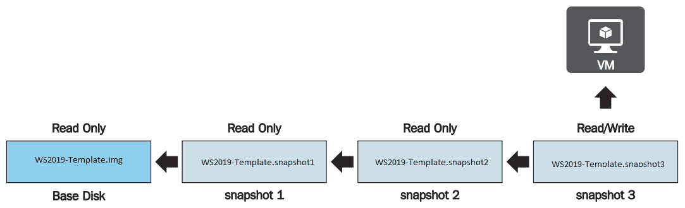

图 8.32 – 我们示例虚拟机的快照链

因此，它必须按照以下方式读取：`snapshot3` 有 `snapshot2` 作为其支持文件；`snapshot2` 有 `snapshot1` 作为其支持文件；`snapshot1` 有基础镜像作为其支持文件。目前，`snapshot3` 是当前活动的快照，即发生实时客户写入的地方。

### 恢复到外部快照

在一些较旧的 RHEL/CentOS 版本中，`libvirt` 对外部快照的支持是不完整的，甚至在 RHEL/CentOS 7.5 中也是如此。快照可以在线或离线创建，在 RHEL/CentOS 8.0 中，在快照处理方式方面发生了重大变化。首先，Red Hat 现在建议使用外部快照。此外，引用 Red Hat 的话：

在 RHEL 8 中不支持创建或加载运行中虚拟机的快照，也称为实时快照。此外，请注意，在 RHEL 8 中不建议使用非实时虚拟机快照。因此，支持创建或加载关闭的虚拟机快照，但 Red Hat 建议不要使用它。

需要注意的是，`virt-manager` 仍不支持外部快照，正如以下截图所示，以及我们几页前创建这些快照时，从未有选择外部快照作为快照类型的选项：

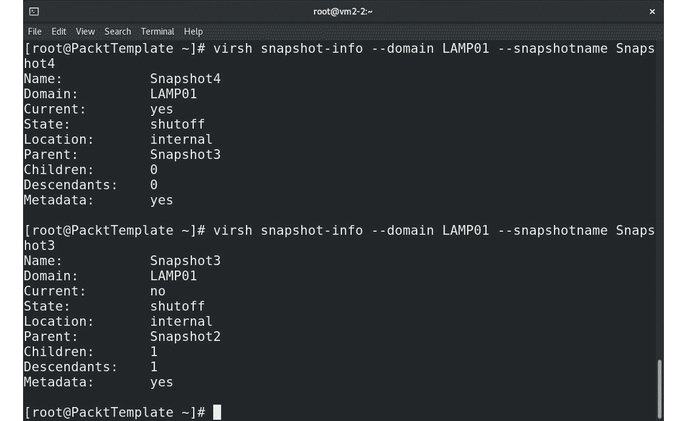

图 8.33 – 从 virt-manager 和 libvirt 命令创建的所有快照，没有额外选项的是内部快照

现在，我们还使用 `WS2019SQL-Template` 虚拟机并在其上创建了*外部*快照，因此情况有所不同。让我们检查一下，如下所示：

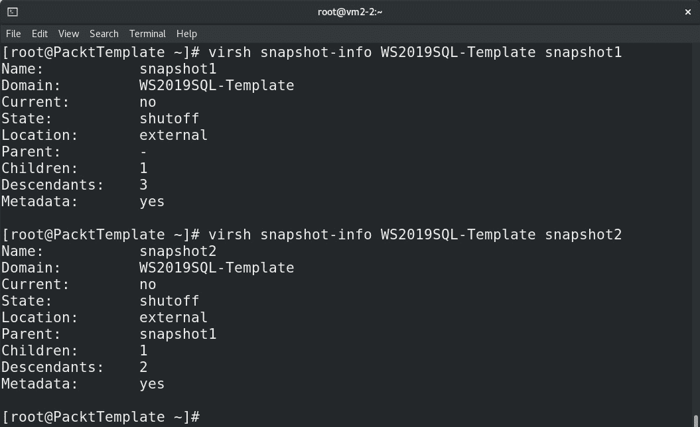

图 8.34 – WS2019SQL-Template 有外部快照

我们可以采取的下一步是恢复到先前的状态—例如，`snapshot3`。我们可以轻松地通过使用 `virsh snapshot-revert` 命令从 shell 中执行此操作，如下所示：

```
# virsh snapshot-revert WS2019SQL-Template --snapshotname "snapshot3"
error: unsupported configuration: revert to external snapshot not supported yet
```

这是否意味着一旦为虚拟机创建了外部磁盘快照，就无法恢复到该快照？不—不是这样的；您肯定可以恢复到快照，但没有 `libvirt` 支持来完成这一点。您将不得不通过操纵域 XML 文件来手动恢复。

以 `WS2019SQL-Template` 虚拟机为例，它有三个关联的快照，如下所示：

```
virsh snapshot-list WS2019SQL-Template
Name Creation Time State
------------------------------------------------------------
snapshot1 2020-02-10 10:21:38 +0230 disk-snapshot
snapshot2 2020-02-10 11:51:04 +0230 disk-snapshot
snapshot3 2020-02-10 11:55:23 +0230 disk-snapshot
```

假设您想要恢复到 `snapshot2`。解决方案是关闭虚拟机（是的—关闭/关机是强制性的），并编辑其 XML 文件，将磁盘映像指向 `snapshot2` 作为引导映像，如下所示：

1.  找到与 `snapshot2` 关联的磁盘映像。我们需要图像的绝对路径。您可以简单地查看存储池并获取路径，但最好的选择是检查快照 XML 文件。如何？从 `virsh` 命令获取帮助，如下所示：

```
# virsh snapshot-dumpxml WS2019SQL-Template --snapshotname snapshot2 | grep
'source file' | head -1
<source file='/snapshot_store/WS2019SQL-Template.snapshot2'/>
```

1.  `/snapshot_store/WS2019SQL-Template.snapshot2` 是与 `snapshot2` 相关的文件。验证它是否完好，并且与 `backing_file` 正确连接，如下所示：

```
backing_file is correctly pointing to the snapshot1 disk. All good. If an error is detected in the qcow2 image, use the -r leaks/all parameter. It may help repair the inconsistencies, but this isn't guaranteed. Check this excerpt from the qemu-img man page:
```

1.  使用 qemu-img 的 -r 开关尝试修复发现的任何不一致性

1.  在检查期间。-r leaks 仅修复集群泄漏，而 -r all 修复所有

1.  错误的类型，选择错误修复或隐藏的风险更高

1.  已经发生的损坏。

让我们检查有关此快照的信息，如下所示：

```
# qemu-img info /snapshot_store/WS2019SQL-Template.snapshot2 | grep backing
backing file: /var/lib/libvirt/images/WS2019SQL-Template.snapshot1
backing file format: qcow2
```

1.  现在是操作 XML 文件的时候了。您可以从 VM 中删除当前附加的磁盘和`add /snapshot_store/WS2019SQL-Template.snapshot2`。或者，手动编辑 VM 的 XML 文件并修改磁盘路径。其中一个更好的选择是使用`virt-xml`命令，如下所示：

```
WS2019SQL-Template.snapshot2 as the boot disk for the VM; you can verify that by executing the following command:

```

virt-xml 命令。请参阅其手册以熟悉它。它也可以在脚本中使用。

```

```

1.  启动 VM，您将回到`snapshot2`被拍摄时的状态。类似地，您可以在需要时恢复到`snapshot1`或基本镜像。

我们列表中的下一个主题是删除外部磁盘快照，正如我们提到的那样，这有点复杂。让我们看看接下来我们如何做到这一点。

### 删除外部磁盘快照

删除外部快照有些棘手。外部快照不能像内部快照那样直接删除。它首先需要手动与基本层或向活动层合并，然后才能删除。有两种在线合并快照的实时块操作，如下所示：

+   `blockcommit`：将数据与基本层合并。使用此合并机制，您可以将叠加图像合并到后备文件中。这是最快的快照合并方法，因为叠加图像可能比后备图像小。

+   `blockpull`：向活动层合并数据。使用此合并机制，您可以将数据从`backing_file`合并到叠加图像。结果文件将始终以`qcow2`格式存在。

接下来，我们将阅读有关使用`blockcommit`合并外部快照的信息。

#### 使用`blockcommit`合并外部快照

我们创建了一个名为`VM1`的新 VM，它有一个名为`vm1.img`的基本镜像（原始），有四个外部快照。`/var/lib/libvirt/images/vm1.snap4`是活动快照图像，实时写入发生在这里；其余的处于只读模式。我们的目标是删除与此 VM 相关的所有快照，操作如下：

1.  列出当前正在使用的活动磁盘镜像，如下所示：

```
the /var/lib/libvirt/images/vm1.snap4 image is the currently active image on which all writes are occurring.
```

1.  现在，枚举`/var/lib/libvirt/images/vm1.snap4`的后备文件链，如下所示：

```
# qemu-img info --backing-chain /var/lib/libvirt/images/vm1.snap4 | grep backing
backing file: /var/lib/libvirt/images/vm1.snap3
backing file format: qcow2
backing file: /var/lib/libvirt/images/vm1.snap2
backing file format: qcow2
backing file: /var/lib/libvirt/images/vm1.snap1
backing file format: qcow2
backing file: /var/lib/libvirt/images/vm1.img
backing file format: raw
```

1.  是时候将所有快照图像合并到基本图像中了，如下所示：

```
# virsh blockcommit VM1 hda --verbose --pivot --active
Block Commit: [100 %]
Successfully pivoted
4\. Now, check the current active block device in use:
# virsh domblklist VM1
Target Source
--------------------------
hda /var/lib/libvirt/images/vm1.img
```

请注意，当前活动的块设备现在是基本镜像，所有写入都切换到它，这意味着我们成功地将快照图像合并到基本镜像中。但是以下代码片段中的`snapshot-list`输出显示仍然有与 VM 相关的快照：

```
# virsh snapshot-list VM1
Name Creation Time State
-----------------------------------------------------
snap1 2020-02-12 09:10:56 +0230 shutoff
snap2 2020-02-12 09:11:03 +0230 shutoff
snap3 2020-02-12 09:11:09 +0230 shutoff
snap4 2020-02-12 09:11:17 +0230 shutoff
```

如果您想摆脱这个问题，您需要删除适当的元数据并删除快照图像。正如前面提到的，`libvirt`不完全支持外部快照。目前，它只能合并图像，但没有自动删除快照元数据和叠加图像文件的支持。这必须手动完成。要删除快照元数据，请运行以下代码：

```
# virsh snapshot-delete VM1 snap1 --children --metadata
# virsh snapshot-list VM1
Name Creation Time State
```

在这个例子中，我们学习了如何使用`blockcommit`方法合并外部快照。接下来让我们学习如何使用`blockpull`方法合并外部快照。

#### 使用`blockpull`合并外部快照

我们创建了一个名为`VM2`的新 VM，它有一个名为`vm2.img`的基本镜像（原始），只有一个外部快照。快照磁盘是活动镜像，可以进行实时写入，而基本镜像处于只读模式。我们的目标是删除与此 VM 相关的快照。操作如下：

1.  列出当前正在使用的活动磁盘镜像，如下所示：

```
/var/lib/libvirt/images/vm2.snap1 image is the currently active image on which all writes are occurring.
```

1.  现在，枚举`/var/lib/libvirt/imagesvar/lib/libvirt/images/vm2.snap1`的后备文件链，如下所示：

```
# qemu-img info --backing-chain /var/lib/libvirt/images/vm2.snap1 | grep backing
backing file: /var/lib/libvirt/images/vm1.img
backing file format: raw
```

1.  将基本镜像合并到快照镜像（从基本镜像到叠加图像合并），如下所示：

```
/var/lib/libvirt/images/vm2.snap1. It got considerably larger because we pulled the base_image and merged it into the snapshot image to get a single file.
```

1.  现在，您可以按以下方式删除`base_image`和快照元数据：

```
# virsh snapshot-delete VM2 snap1 --metadata
```

我们在 VM 运行状态下运行了合并和快照删除任务，没有任何停机时间。`blockcommit`和`blockpull`也可以用于从快照链中删除特定的快照。查看`virsh`的 man 页面以获取更多信息并尝试自己操作。在本章的*进一步阅读*部分中，你还会找到一些额外的链接，所以确保你仔细阅读它们。

# 在使用快照时的用例和最佳实践

我们提到在 IT 世界中关于快照存在着一种爱恨交织的关系。让我们讨论一下在使用快照时的原因和一些常识的最佳实践，如下所示：

+   当你拍摄 VM 快照时，你正在创建 VM 磁盘的新增量副本，`qemu2`，或者一个原始文件，然后你正在写入该增量。因此，你写入的数据越多，提交和合并回父级的时间就越长。是的——你最终需要提交快照，但不建议你在 VM 上附加快照进入生产环境。

+   快照不是备份；它们只是在特定时间点拍摄的状态图片，你可以在需要时恢复到该状态。因此，不要将其作为直接备份过程的依赖。为此，你应该实施备份基础设施和策略。

+   不要将带有快照的 VM 保留很长时间。一旦你验证了不再需要恢复到快照拍摄时的状态，立即合并并删除快照。

+   尽可能使用外部快照。与内部快照相比，外部快照的损坏几率要低得多。

+   限制快照数量。连续拍摄多个快照而没有任何清理可能会影响 VM 和主机的性能，因为`qemu`将不得不遍历快照链中的每个图像来从`base_image`读取新文件。

+   在拍摄快照之前在 VM 中安装 Guest Agent。通过来宾内的支持，快照过程中的某些操作可以得到改进。

+   在拍摄快照时始终使用`--quiesce`和`--atomic`选项。

如果你使用这些最佳实践，我们建议你使用快照来获益。它们会让你的生活变得更轻松，并为你提供一个可以回到的点，而不会带来所有的问题和麻烦。

# 总结

在本章中，你学会了如何使用`libguestfs`实用程序来修改 VM 磁盘，创建模板和管理快照。我们还研究了`virt-builder`和各种为我们的 VM 提供方法，因为这些是现实世界中最常见的场景之一。在下一章中，我们将更多地了解在大量部署 VM 时的概念（提示：云服务），这就是关于`cloud-init`的一切。

# 问题

1.  我们为什么需要修改 VM 磁盘？

1.  我们如何将 VM 转换为 KVM？

1.  我们为什么使用 VM 模板？

1.  我们如何创建基于 Linux 的模板？

1.  我们如何创建基于 Microsoft Windows 的模板？

1.  你知道哪些从模板部署的克隆机制？它们之间有什么区别？

1.  我们为什么使用`virt-builder`？

1.  我们为什么使用快照？

1.  使用快照的最佳实践是什么？

# 进一步阅读

有关本章内容的更多信息，请参考以下链接：

+   `libguesfs`文档：[`libguestfs.org/`](http://libguestfs.org/)

+   `virt-builder`：[`libguestfs.org/virt-builder.1.html`](http://libguestfs.org/virt-builder.1.html)

+   管理快照：[`access.redhat.com/documentation/en-us/red_hat_enterprise_linux/7/html/virtualization_deployment_and_administration_guide/sect-managing_guests_with_the_virtual_machine_manager_virt_manager-managing_snapshots`](https://access.redhat.com/documentation/en-us/red_hat_enterprise_linux/7/html/virtualization_deployment_and_administration_guide/sect-managing_guests_with_the_virtual_machine_manager_virt_manager-managing_snapshots)

+   使用`virt-builder`生成 VM 镜像：[`www.admin-magazine.com/Articles/Generate-VM-Images-with-virt-builder`](http://www.admin-magazine.com/Articles/Generate-VM-Images-with-virt-builder)

+   QEMU 快照文档：[`wiki.qemu.org/Features/Snapshots`](http://wiki.qemu.org/Features/Snapshots)

+   `libvirt`—快照 XML 格式：[`libvirt.org/formatsnapshot.html`](https://libvirt.org/formatsnapshot.html)
