# 第九章：*第九章*：使用云初始化自定义虚拟机

定制虚拟机通常看起来很简单 - 从模板克隆它；启动；点击几个**下一步**按钮（或文本标签）；创建一些用户、密码和组；配置网络设置... 这对于一两台虚拟机可能有效。但如果我们需要部署两三百台虚拟机并对它们进行配置呢？突然间，我们面临着一项庞大的任务 - 如果我们手动完成所有工作，这项任务将容易出现错误。我们在做这些事情的时候浪费了宝贵的时间，而不是以更简化、自动化的方式进行配置。这就是云初始化派上用场的地方，因为它可以定制我们的虚拟机，在它们上安装软件，并且可以在首次和后续虚拟机启动时进行。因此，让我们讨论一下云初始化以及它如何为你的大规模配置噩梦带来价值。

在本章中，我们将涵盖以下主题：

+   虚拟机定制的需求是什么？

+   理解云初始化

+   云初始化架构

+   如何在启动时安装和配置云初始化

+   云初始化镜像

+   云初始化数据源

+   向云初始化传递元数据和用户数据

+   如何使用云配置脚本与云初始化

# 虚拟机定制的需求是什么？

一旦你真正开始使用虚拟机并学会如何掌握它们，你会注意到一件事似乎经常发生：虚拟机部署。由于一切都很容易配置和部署，你会开始为几乎任何事情创建新的虚拟机实例，有时甚至只是为了检查特定应用程序是否在特定操作系统版本上运行。这让作为开发人员和系统管理员的生活变得更加轻松，但也带来了一系列问题。其中最困难的之一是模板管理。即使你有一小组不同的服务器和相对较少的不同配置，事情也会开始累积起来，如果你决定通过 KVM 以正常方式管理模板，组合的数量将很快变得太大。

你很快会面临的另一个问题是兼容性。当你离开你选择的 Linux 发行版，需要部署另一个具有自己规则和部署策略的 Linux 发行版时，事情就会变得复杂起来。通常，最大的问题是系统定制。在网络设置和主机名方面，网络上的每台计算机都应该有自己独特的身份。使用 DHCP 网络配置的模板可以解决其中一个问题，但这远远不足以简化事情。例如，我们可以在 CentOS / RHEL 和兼容的 Linux 发行版上使用 Kickstart。Kickstart 是一种在部署时配置系统的方法，如果你使用这些特定的发行版，这可能是快速部署物理或虚拟机的最佳方式。另一方面，Kickstart 会使你的部署比应该更慢，因为它使用一个配置文件，使我们能够向干净的安装添加软件和配置。

基本上，它用我们之前定义的设置填充了额外的配置提示。这意味着我们基本上每次需要部署新的虚拟机时都在进行完整的安装，并创建一个完整的系统。

主要问题是*其他发行版不使用 Kickstart*。有类似的系统可以实现无人值守安装。Debian 和 Ubuntu 使用一个叫做*preseed*的工具/系统，并且能够在某些部分支持 Kickstart，SuSe 使用 AutoYaST，甚至有一些工具提供某种跨平台功能。其中一个叫做**Fully Automated Install**（**FAI**）的工具能够自动安装甚至在线重新配置不同的 Linux 发行版。但这仍然不能解决我们所有的问题。在虚拟化的动态世界中，主要目标是尽快部署并尽可能自动化，因为我们在从生产环境中移除虚拟机时也倾向于使用相同的灵活性。

想象一下：你需要创建一个单一的应用部署，以测试你的新应用在不同的 Linux 发行版上的情况。你所有未来的虚拟机都需要有一个主机名的唯一标识符，一个部署的 SSH 身份，可以通过 Ansible 进行远程管理，当然还有你的应用。你的应用有三个依赖项——两个以可以通过 Ansible 部署的软件包形式存在，但其中一个依赖于正在使用的 Linux 发行版，并且必须为该特定的 Linux 发行版进行定制。为了使事情更加真实，你预计你将不时地重复这个测试，并且每次你都需要重建你的依赖项。

你可以创建这种环境的几种方式。一种方法是简单地手动安装所有服务器并创建模板。这意味着手动配置一切，然后创建将要部署的虚拟机模板。如果我们打算部署到超过几个 Linux 发行版，这是很多工作。一旦发行版升级，这将变得更加繁重，因为我们从中部署的所有模板必须经常升级，通常在不同的时间点。这意味着我们可以手动更新所有虚拟机模板，或者在每个模板上执行安装后升级。这是很多工作，而且非常慢。再加上这样一个事实，即这样的测试可能涉及在新旧版本的虚拟机模板上运行你的测试应用。除此之外，我们还需要解决为每个部署的 Linux 发行版定制我们的网络设置的问题。当然，这也意味着我们的虚拟机模板远非通用。过一段时间，我们将会为每个测试周期拥有数十个虚拟机模板。

解决这个问题的另一种方法可以是使用像 Ansible 这样的系统——我们从虚拟机模板部署所有系统，然后通过 Ansible 进行定制。这更好——Ansible 就是为这样的场景设计的，但这意味着我们必须首先创建能够支持 Ansible 部署的虚拟机模板，带有实现的 SSH 密钥和 Ansible 运行所需的其他一切。

这两种方法都无法解决的一个问题是大规模部署机器。这就是为什么设计了一个叫做 cloud-init 的框架。

# 理解 cloud-init

我们需要在技术上更深入一些，以了解 cloud-init 是什么，以及了解它的局限性是什么。因为我们正在谈论一种使用简单配置文件完全自动重新配置系统的方式，这意味着有些事情需要事先准备好，以使这个复杂的过程更加用户友好。

我们已经在*第八章*中提到了虚拟机模板，*创建和修改 VM 磁盘、模板和快照*。在这里，我们谈论的是一个特别配置的模板，它具有阅读、理解和部署我们将在文件中提供的配置所需的所有元素。这意味着这个特定的镜像必须提前准备好，是整个系统中最复杂的部分。

幸运的是，cloud-init 镜像可以预先下载并进行配置，我们唯一需要知道的是我们想要使用哪个发行版。我们在本书中提到的所有发行版（CentOS 7 或 8、Debian、Ubuntu 和 Red Hat Enterprise Linux 7 和 8）都有我们可以使用的镜像。其中一些甚至有基本操作系统的不同版本可用，因此如果需要，我们可以使用它们。请注意，安装的 cloud-init 版本可能会有所不同，特别是在旧版本的镜像上。

为什么这个镜像很重要？因为它被准备好可以检测其运行的云系统，确定是否应该使用 cloud-init 或者禁用它，然后读取并执行系统本身的配置。

# 理解 cloud-init 架构

Cloud-init 使用引导阶段的概念，因为它需要对系统在引导期间发生的事情进行精细和细粒度的控制。当然，使用 cloud-init 的前提是有一个 cloud-init 镜像。从[`cloudinit.readthedocs.io`](https://cloudinit.readthedocs.io)提供的文档中，我们可以了解到 cloud-init 引导有五个阶段：

+   存在`/etc/cloud/cloud-init.diabled`。有关本章中的所有内容和其他内容的更多信息，请阅读文档（从[`cloudinit.readthedocs.io/en/latest/topics/boot.html`](https://cloudinit.readthedocs.io/en/latest/topics/boot.html)开始），因为它包含了关于 cloud-init 支持的开关和不同选项的更多详细信息。

+   名为`cloud-init-local.service`的`systemd`服务，它将尽快运行并阻塞网络直到完成。在 cloud-init 初始化中经常使用阻塞服务和目标的概念，原因很简单 - 以确保系统稳定性。由于 cloud-init 过程修改了系统的许多核心设置，我们不能让通常的启动脚本运行并创建可能覆盖 cloud-init 创建的配置的并行配置。

+   `cloud-init.service`。这是主要服务，将启动之前配置好的网络，并尝试配置我们在数据文件中安排的一切。这通常包括获取我们配置中指定的所有文件，提取它们，并执行其他准备任务。如果指定了这样的配置更改，磁盘也将在此阶段进行格式化和分区。还将创建挂载点，包括那些动态的和特定于特定云平台的挂载点。

+   `yum_repos`或`apt`模块），添加 SSH 密钥（`ssh-import-id`模块），并执行类似的任务，为下一阶段做准备，我们实际上可以在这个阶段使用在此阶段完成的配置。

+   **最终**阶段是系统引导的一部分，运行可能属于用户空间的东西 - 安装软件包、配置管理插件部署和执行可能的用户脚本。

所有这些都完成后，系统将完全配置好并运行。

这种方法的主要优势，尽管看起来复杂，是在云中只存储一个镜像，然后创建简单的配置文件，只覆盖*vanilla*默认配置和我们需要的配置之间的差异。镜像也可以相对较小，因为它们不包含太多面向最终用户的软件包。

Cloud-init 经常被用作部署许多将由编排系统（如 Puppet 或 Ansible）管理的机器的第一阶段，因为它提供了一种创建包括连接到每个实例的方式的工作配置的方法。每个阶段都使用 YAML 作为其主要数据语法，几乎所有内容都只是不同选项和变量的列表，这些选项和变量会被转换为配置信息。由于我们正在配置一个系统，我们还可以在配置中包含几乎任何其他类型的文件——一旦我们可以在配置系统时运行 shell 脚本，一切皆有可能。

*为什么所有这些如此重要？*

cloud-init 源自一个简单的想法：创建一个单一模板，定义您计划使用的操作系统的基本内容。然后，我们创建一个单独的、特殊格式的数据文件，其中包含定制数据，然后在运行时将这两者组合起来，以创建在需要时的新实例。您甚至可以通过使用模板作为基础镜像，然后创建不同的系统作为差异镜像，稍微改善一下，以便在几分钟而不是几小时内部署。

cloud-init 的构想是尽可能多地支持多平台，并包括尽可能多的操作系统。目前，它支持以下操作系统：

+   Ubuntu

+   SLES/openSUSE

+   RHEL/CentOS

+   Fedora

+   Gentoo Linux

+   Debian

+   Arch Linux

+   FreeBSD

我们列举了所有的发行版，但正如其名称所示，cloud-init 也是“云感知”的，这意味着 cloud-init 能够自动检测并使用几乎任何云环境。在任何硬件或云上运行任何发行版总是可能的，即使没有类似 cloud-init 这样的东西，但由于想要创建一个平台无关的配置，可以在任何云上部署而无需重新配置，我们的系统需要自动考虑不同云基础设施之间的任何差异。此外，即使 cloud-init 并非专门为裸金属部署而设计，或者更准确地说，即使它的设计远不止于此，它也可以用于裸金属部署。

重要提示

云感知意味着 cloud-init 为我们提供了进行部署后检查和配置更改的工具，这是另一个极其有用的选项。

这一切听起来比应该更加理论化。实际上，一旦开始使用 cloud-init 并学会如何配置它，您将开始创建一个几乎完全独立于您所使用的云基础设施的虚拟机基础架构。在本书中，我们使用 KVM 作为主要的虚拟化基础设施，但 cloud-init 可以与任何其他云环境一起使用，通常无需任何修改。cloud-init 最初是为了在 Amazon AWS 上实现简单部署而设计的，但它早已超越了这种限制。

此外，cloud-init 知晓不同发行版之间的所有细微差别，因此您在配置文件中设置的所有内容都将被转换为特定发行版用于完成特定任务的内容。在这方面，cloud-init 的行为很像 Ansible——实质上，您定义需要做什么，而不是如何做，cloud-init 会接管并实现它。

# 在启动时安装和配置 cloud-init。

我们在本章中要讨论的主要内容是如何使 cloud-init 运行，并在部署机器时将其所有部分放在正确的位置，但这只是揭示了 cloud-init 实际工作原理的一部分。您需要理解的是，cloud-init 作为一个服务运行，配置系统，并按照我们告诉它的方式进行操作。系统启动后，我们可以连接到它并查看已完成的工作，以及如何完成的，并分析日志。这可能与完全自动化部署的想法相悖，但这是有原因的-无论我们做什么，总会有可能需要调试系统或执行一些后安装任务，这些任务也可以自动化。

使用 cloud-init 并不仅仅局限于调试。系统启动后，系统会生成大量关于启动方式、系统实际的云配置以及定制方面的数据。然后您的应用程序和脚本可以依赖这些数据，并用它来运行和检测某些配置和部署参数。请看这个例子，取自在 Microsoft Azure 上运行 Ubuntu 的虚拟机：

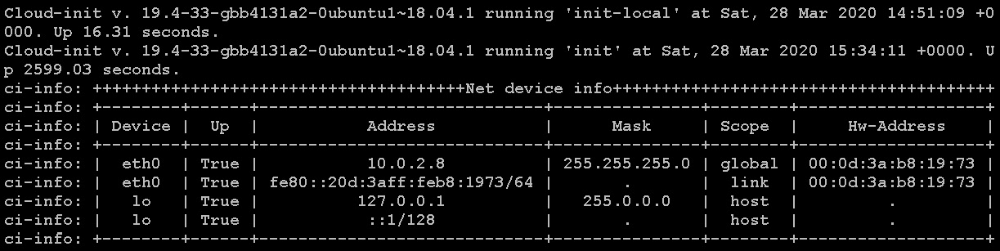

图 9.1-启动时 cloud-init 输出的一部分

cloud-init 实际上在启动时显示这个（根据 cloud-init 配置文件的不同，可能还有更多内容），然后将所有这些输出放入其日志文件中。因此，我们在额外信息方面得到了很好的覆盖。

我们 cloud-init 之旅的下一步是讨论 cloud-init 图片，因为这些是我们需要使 cloud-init 工作的东西。让我们现在来做这件事。

## Cloud-init 图片

为了在启动时使用 cloud-init，我们首先需要一个云镜像。在其核心，它基本上是一个半安装的系统，其中包含专门设计的脚本，支持 cloud-init 安装。在所有发行版上，这些脚本都是 cloud-init 包的一部分，但是镜像通常比这更加准备就绪，因为它们试图在大小和安装便利性之间找到一个平衡点。

在我们的示例中，我们将使用以下网址提供的图片：

+   [`cloud.centos.org/`](https://cloud.centos.org/)

+   [`cloud-images.ubuntu.com/`](https://cloud-images.ubuntu.com/)

在我们将要处理的所有示例中，主要意图是展示系统如何在两种完全不同的架构上运行，几乎没有或没有最小的修改。

在正常情况下，获取镜像就是您需要能够运行 cloud-init 的一切。其他一切都由数据文件处理。

例如，这些是 CentOS 发行版的一些可用图片：

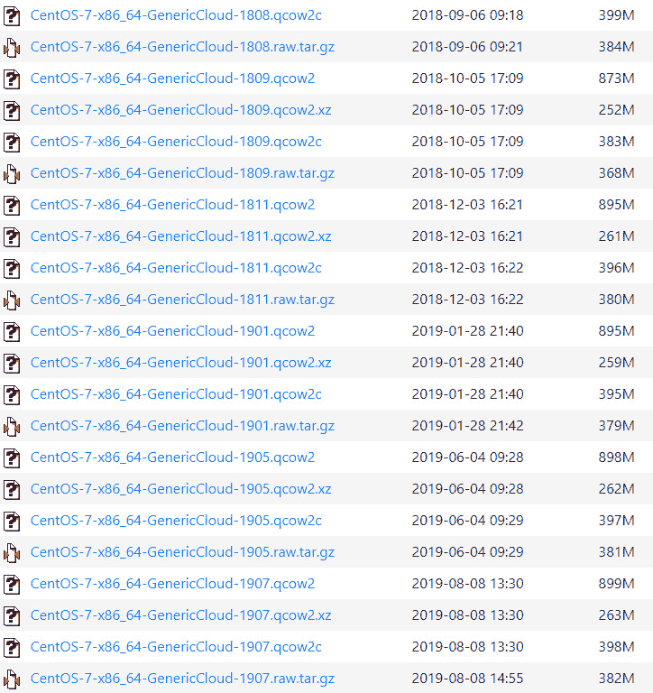

图 9.2-为 CentOS 提供的丰富的 cloud-init 图片

注意，几乎所有发行版的发布都包含了图片，因此我们不仅可以在最新版本上测试我们的系统，还可以在所有其他可用版本上进行测试。我们可以自由使用所有这些图片，这正是我们稍后将要做的事情，当我们开始使用我们的示例时。

## Cloud-init 数据源

让我们稍微谈谈数据文件。到目前为止，我们已经泛泛地提到它们，并且我们有充分的理由这样做。使 cloud-init 脱颖而出的一件事是它支持不同的获取安装信息和如何安装的方式。我们称这些配置文件为数据源，它们可以分为两大类 - **用户数据**和**元数据**。我们将在本章中更详细地讨论每一个，但作为早期介绍，让我们说一下，用户作为配置的一部分创建的所有东西，包括 YAML 文件、脚本、配置文件，可能还有其他要放在系统上的文件，比如用户数据的应用程序和依赖项。元数据通常直接来自云提供商或用于标识机器。

它包含实例数据、主机名、网络名称和其他在部署时可能有用的云特定细节。我们可以在引导过程中使用这两种类型的数据，并且将这样做。我们放入的所有内容都将在运行时存储在`/run/cloud-init/instance-data.json`中的大型 JSON 存储中，或作为实际机器配置的一部分。这个文件的一个很好的例子是主机名，作为最终将成为个别机器上实际主机名的元数据的一部分。这个文件由 cloud-init 填充，并且可以通过命令行或直接访问。

在创建任何配置文件时，我们可以使用任何可用的文件格式，并且如果需要，我们可以压缩文件 - cloud-init 将在运行之前对其进行解压缩。如果我们需要将实际文件传递到配置中，尽管有一个限制 - 文件需要编码为文本并放入 YAML 文件中的变量中，以便在我们正在配置的系统上稍后使用和写入。就像 cloud-init 一样，YAML 语法是声明性的 - 这是一个重要的事情要记住。

现在，让我们学习如何将元数据和用户数据传递给 cloud-init。

# 将元数据和用户数据传递给 cloud-init

在我们的示例中，我们将创建一个文件，它实质上是一个`.iso`镜像，并且会像连接到引导机器的 CD-ROM 一样行为。Cloud-init 知道如何处理这种情况，并且会挂载文件，提取所有脚本，并按照预定顺序运行它们，就像我们在解释引导顺序是已经提到的那样（在本章前面的*理解 cloud-init 架构*部分中检查）。

基本上，我们需要做的是创建一个镜像，将其连接到云模板，并在模板内部提供所有数据文件给 cloud-init 脚本。这是一个三步过程：

1.  我们必须创建保存配置信息的文件。

1.  我们必须创建一个包含文件数据的镜像，并将其放在正确的位置。

1.  我们需要在引导时将镜像与模板关联起来。

最复杂的部分是定义在引导时如何配置以及需要配置什么。所有这些都是在运行给定发行版的云工具软件包的机器上完成的。

在这一点上，我们需要指出在所有发行版中用于启用 cloud-init 支持的两种不同软件包：

+   `cloud-init` - 包含使计算机能够在引导过程中重新配置自身的一切必要内容，如果遇到云初始化配置

+   `cloud-utils` - 用于创建要应用于云镜像的配置

这些软件包之间的主要区别是我们安装它们的计算机。`cloud-init`是要安装在我们正在配置的计算机上的，并且是部署镜像的一部分。`cloud-utils`是用于在将创建配置的计算机上使用的软件包。

在本章的所有示例和所有配置步骤中，实际上我们在引用两台不同的计算机/服务器：一台可以被视为主要计算机，而我们在本章中使用的计算机-除非另有说明-是我们用来创建 cloud-init 部署配置的计算机。这不是将使用此配置进行配置的计算机，而只是我们用作工作站准备文件的计算机。

在这种简化的环境中，这是运行整个 KVM 虚拟化并用于创建和部署虚拟机的同一台计算机。在正常设置中，我们可能会在工作站上创建我们的配置，并部署到某种基于 KVM 的主机或集群。在这种情况下，我们在本章中呈现的每个步骤基本上保持不变；唯一的区别是我们部署的位置，以及第一次启动时调用虚拟机的方式。

我们还将注意到，一些虚拟化环境，如 OpenStack、oVirt 或 RHEV-M，有直接的方式与启用了 cloud-init 的模板进行通信。其中一些甚至允许您在首次启动时直接从 GUI 重新配置机器，但这超出了本书的范围。

我们列表中的下一个主题是 cloud-init 模块。Cloud-init 使用模块的原因是为了扩展其在虚拟机引导阶段可以采取的可用操作范围。有数十个可用的 cloud-init 模块-`SSH`、`yum`、`apt`、设置`hostname`、`password`、`locale`和创建用户和组等。让我们看看如何使用它们。

## 使用 cloud-init 模块

在创建配置文件时，在 cloud-init 中，几乎与任何其他软件抽象层一样，我们正在处理将我们更多或少通用的配置需求（例如*需要安装此软件包*）转换为特定系统上的实际 shell 命令的模块。这是通过**模块**完成的。模块是将不同功能分解为较小组的逻辑单元，并使我们能够使用不同的命令。您可以在以下链接中查看所有可用模块的列表：[`cloudinit.readthedocs.io/en/latest/topics/modules.html`](https://cloudinit.readthedocs.io/en/latest/topics/modules.html)。这是一个相当长的列表，这将进一步显示出 cloud-init 的开发程度。

从列表中我们可以看到，例如`Disk setup`或`Locale`等一些模块是完全独立于平台的，而例如`Puppet`等一些模块则设计用于与特定软件解决方案及其配置一起使用，而一些则特定于特定发行版或一组发行版，如`Yum Add Repo`或`Apt Configure`。

这似乎破坏了完全与发行版无关的部署一切的想法，但您必须记住两件事-cloud-init 首先是与云无关的，而不是与发行版无关的，并且发行版有时具有太不同的东西，无法用任何简单的解决方案解决。因此，云-init 解决了足够多的问题以便有用，并且同时尽量不制造新问题。

重要提示

我们不会逐个处理特定模块，因为这将使本章变得太长，并可能使其成为一本独立的书。如果您打算使用 cloud-init，请参阅模块文档，因为它将提供您所需的所有最新信息。

# 如何使用 cloud-init 的 cloud-config 脚本的示例

首先，您需要下载云镜像并调整大小，以确保在安装所有文件后磁盘大小足够大，可以容纳您计划放入所创建的机器中的所有文件。在这些示例中，我们将使用两个镜像，一个用于 CentOS，另一个用于 Ubuntu 服务器。我们可以看到我们使用的 CentOS 镜像大小为 8 GB，我们将其扩大到 10 GB。请注意，磁盘上的实际大小不会达到 10 GB；我们只是允许镜像增长到这个大小。

我们将从互联网上获取 Ubuntu 镜像后，对其进行相同操作。Ubuntu 还会每天发布其分布的云版本，适用于所有支持的版本。主要区别在于 Ubuntu 创建的镜像在满时设计为 2.2 GB。我们从[`cloud.centos.org`](https://cloud.centos.org)下载了一个镜像；现在让我们获取一些关于它的信息：

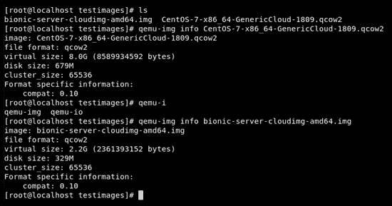

图 9.3 - Cloud-init 镜像大小

请注意磁盘上的实际大小不同- `qemu-img`给出的是 679 MB 和 2.2 GB，而实际磁盘使用量大约为 330 MB 和 680 MB：

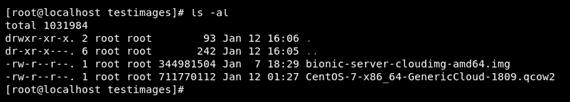

图 9.4 - 通过 qemu-img 测得的镜像大小与实际虚拟镜像大小不同

现在我们可以对这些镜像进行一些日常管理任务-扩大它们，将它们移动到 KVM 的正确目录，将它们用作基础镜像，然后通过 cloud-init 进行自定义：

1.  让我们把这些镜像变大，这样我们就可以为未来的容量需求（和实践）做好准备：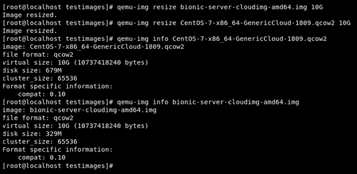

图 9.5 - 通过 qemu-img 将 Ubuntu 和 CentOS 的最大镜像大小增加到 10 GB

扩大我们的镜像后，请注意磁盘上的大小几乎没有变化：

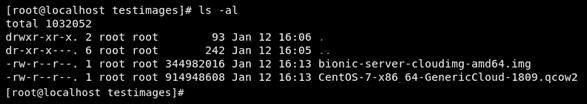

图 9.6 - 实际磁盘使用量只有轻微变化

下一步是准备我们的环境以进行云镜像过程，以便我们可以启用 cloud-init 发挥其作用。

1.  我们将使用的镜像将存储在`/var/lib/libvirt/images`中：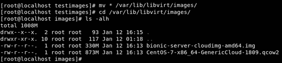

图 9.7 - 将镜像移动到 KVM 默认系统目录

我们将以最简单的方式创建我们的第一个云启用部署，只需重新分区磁盘并创建一个带有单个 SSH 密钥的用户。密钥属于主机的根目录，因此在 cloud-init 完成后我们可以直接登录到部署的机器上。

此外，我们将通过运行以下命令将我们的镜像用作基础镜像：

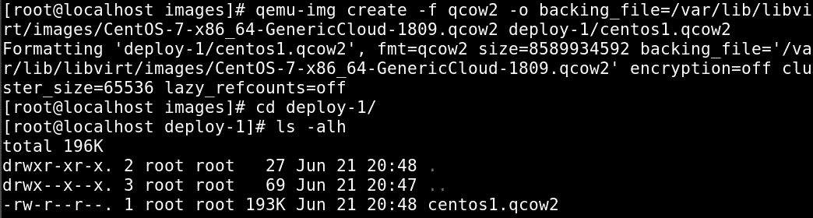

图 9.8 - 创建用于部署的镜像磁盘

现在镜像已经准备好了。下一步是开始 cloud-init 配置。

1.  首先，创建一个本地元数据文件，并在其中放入新的虚拟机名称。

1.  文件将被命名为`meta-data`，我们将使用`local-hostname`来设置名称：

```
cloud. This user will not be able to log in using a password since we are not creating one, but we will enable login using SSH keys associated with the local root account, which we will create by using the ssh-keygen command. This is just an example SSH key, and SSH key that you're going to use might be different. So, as root, go through the following procedure: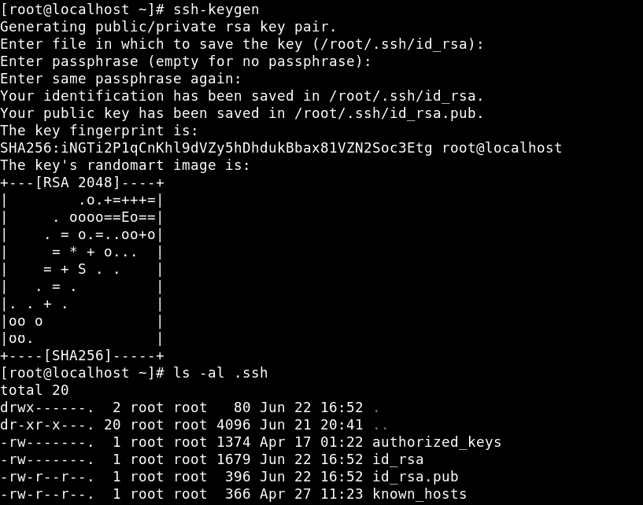Figure 9.10 – SSH keygen procedure done, SSH keys are present and accounted forKeys are stored in the local `.ssh` directory, so we just need to copy them. When we are doing cloud deployments, we usually use this method of authentication, but cloud-init enables us to define any method of user authentication. It all depends on what we are trying to do and whether there are security policies in place that enforce one authentication method over another.In the cloud environments, we will rarely define users that are able to log in with a password, but for example, if we are deploying bare-metal machines for workstations, we will probably create users that use normal passwords. When we create a configuration file like this, it is standard practice to use hashes of passwords instead of literal cleartext passwords. The directive you are looking for is probably `passwd:` followed by a string containing the hash of a password. Next, we configured `sudo`. Our user needs to have root permissions since there are no other users defined for this machine. This means they need to be a member of the `sudo` group and have to have the right permissions defined in the `sudoers` file. Since this is a common setting, we only need to declare the variables, and cloud-init is going to put the settings in the right files. We will also define a user shell. In this file, we can also define all the other users' settings available on Linux, a feature that is intended to help deploy user computers. If you need any of those features, check the documentation available here: [`cloudinit.readthedocs.io/en/latest/topics/modules.html#users-and-groups`](https://cloudinit.readthedocs.io/en/latest/topics/modules.html#users-and-groups). All the extended user information fields are supported. The last thing we are doing is using the `runcmd` directive to define what will happen after the installation finishes, in the last stage. In order to permit the user to log in, we need to put them on the list of allowed users in the `sshd` and we need to restart the service. Now we are ready for our first deployment. 
```

1.  我们的目录中有三个文件：一个使用云模板的基本文件的硬盘，一个包含仅对我们的部署至关重要的最小信息的`meta-data`文件，以及`user-data`，其中包含我们用户的定义。我们甚至没有尝试安装或复制任何东西；这个安装尽可能地简化，但在正常环境中，这是一个常规的起点，因为很多部署只是为了让我们的机器上线，然后通过其他工具完成其余的安装。让我们进入下一步。

我们需要一种方法来连接我们刚刚创建的文件和配置与虚拟机。通常有几种方法可以做到这一点。最简单的方法通常是生成一个包含文件的`.iso`文件。然后在创建机器时，我们只需将文件挂载为虚拟 CD-ROM。在启动时，cloud-init 将自动查找文件。

另一种方法是将文件托管在网络上的某个地方，并在需要时获取它们。也可以结合这两种策略。我们稍后会讨论这一点，但让我们先完成我们的部署。本地的`.iso`映像是我们将在这次部署中采用的方式。有一个名为`genisoimage`的工具（由同名的软件包提供），对此非常有用（以下命令是一行命令）：

```
genisoimage -output deploy-1-cidata.iso -volid cidata -joliet -rock user-data meta-data
```

我们在这里做的是创建一个仿真的 CD-ROM 映像，它将遵循 ISO9660/Joliet 标准和 Rock Ridge 扩展。如果你不知道我们刚才说了什么，就忽略这一切，这样想一想 - 我们正在创建一个将保存我们的元数据和用户数据并呈现为 CD-ROM 的文件：

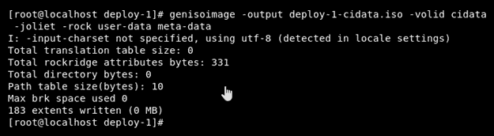

图 9.11 - 创建 ISO 映像

最后，我们将得到类似于这样的东西：

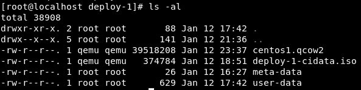

图 9.12 - ISO 已创建，我们准备开始云初始化部署

请注意，图像是在部署后拍摄的，因此磁盘的大小可能会根据您的配置而大不相同。这就是所有需要的准备工作。剩下的就是启动我们的虚拟机。

现在，让我们开始我们的部署。

## 第一次部署

我们将使用命令行部署我们的虚拟机：

```
virt-install --connect qemu:///system --virt-type kvm --name deploy-1 --ram 2048 --vcpus=1 --os-type linux --os-variant generic --disk path=/var/lib/libvirt/images/deploy-1/centos1.qcow2,format=qcow2 --disk /var/lib/libvirt/images/deploy-1/deploy-1-cidata.iso,device=cdrom --import --network network=default --noautoconsole
```

尽管看起来可能很复杂，但如果你在阅读了本书之前的章节后来到这一部分，那么你应该已经见过了。我们正在使用 KVM，为我们的域（虚拟机）创建一个名称，我们将给它 1 个 CPU 和 2GB 的 RAM。我们还告诉 KVM 我们正在安装一个通用的 Linux 系统。我们已经创建了我们的硬盘，所以我们正在将它挂载为我们的主要驱动器，并且我们也正在挂载我们的`.iso`文件作为 CD-ROM。最后，我们将连接我们的虚拟机到默认网络：

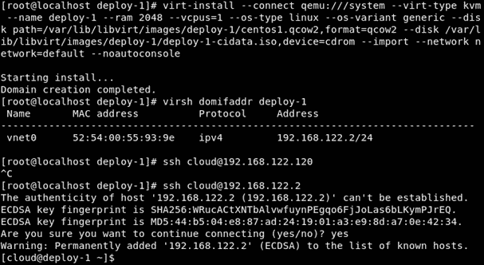

图 9.13 - 部署和测试一个经过云初始化定制的虚拟机

部署可能需要一两分钟。一旦机器启动，它将获得 IP 地址，我们可以使用预定义的密钥通过 SSH 连接到它。唯一没有自动化的是自动接受新启动的机器的指纹。

现在，是时候看看当我们启动机器时发生了什么。Cloud-init 在`/var/log`生成了一个名为`cloud-init.log`的日志。文件会相当大，你会注意到的第一件事是日志设置为提供调试信息，所以几乎所有内容都会被记录：

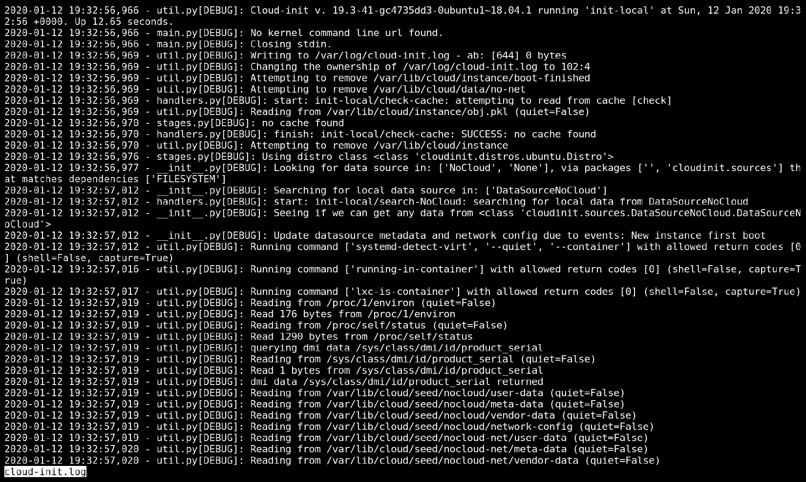

图 9.14 - cloud-init.log 文件，用于检查 cloud-init 对操作系统的操作

另一件事是在表面以下完全自动发生了多少。由于这是 CentOS，cloud-init 必须实时处理 SELinux 安全上下文，因此很多信息只是这样。还有很多探测和测试正在进行。Cloud-init 必须确定运行环境是什么以及它正在哪种类型的云下运行。如果在启动过程中发生了任何与 cloud-init 有关的事情，这是第一个要查看的地方。

现在让我们通过使用第二个（Ubuntu）映像来部署我们的第二个虚拟机。这就是 cloud-init 真正发挥作用的地方 - 它可以与各种 Linux（和*BSD）发行版一起工作，无论它们是什么。我们现在可以测试一下。

## 第二次部署

下一个明显的步骤是创建另一个虚拟机，但为了证明一点，我们将使用 Ubuntu Server（Bionic）作为我们的镜像：

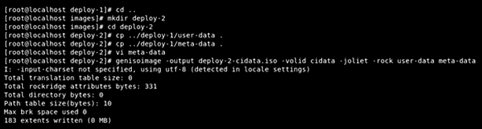

图 9.15-为另一个基于 cloud-init 的虚拟机部署准备我们的环境

我们需要做什么？我们需要将`meta-data`和`user-data`都复制到新文件夹中。我们需要编辑元数据文件，因为其中包含主机名，我们希望我们的新机器有一个不同的主机名。至于`user-data`，它将与我们的第一个虚拟机完全相同。然后我们需要创建一个新的磁盘并调整其大小：

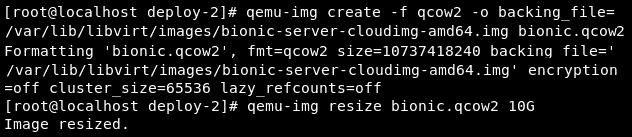

图 9.16-为部署目的扩展我们的虚拟机镜像

我们正在从下载的镜像创建虚拟机，并且在运行镜像时允许更多空间。最后一步是启动虚拟机：

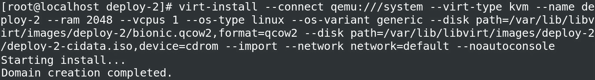

图 9.17-使用 cloud-init 部署我们的第二个虚拟机

命令行几乎完全相同，只是名称不同：

```
virt-install --connect qemu:///system --virt-type kvm --name deploy-2 --ram 2048 --vcpus=1 --os-type linux --os-variant generic --disk path=/var/lib/libvirt/images/deploy-2/bionic.qcow2,format=qcow2 --disk /var/lib/libvirt/images/deploy-2/deploy-2-cidata.iso,device=cdrom --import --network network=default –noautoconsole
```

现在让我们检查 IP 地址：

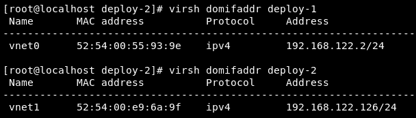

图 9.18-检查虚拟机 IP 地址

我们可以看到两台机器都已经启动并运行。现在进行大测试-我们能连接吗？让我们使用`SSH`命令尝试：

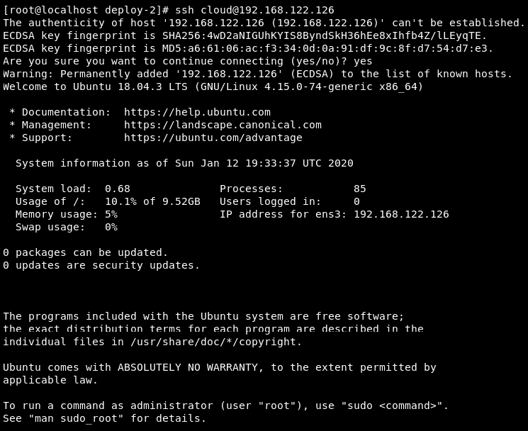

图 9.19-使用 SSH 验证我们是否可以连接到虚拟机

正如我们所看到的，连接到我们的虚拟机没有任何问题。

还有一件事是检查部署日志。请注意，由于我们正在运行 Ubuntu，因此没有提到配置 SELinux：

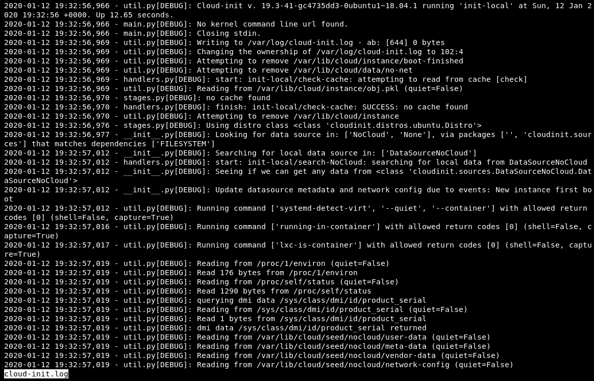

图 9.20-Ubuntu cloud-init 日志文件中没有提到 SELinux

只是为了好玩，让我们以一个变通的方式进行另一个部署-让我们使用一个模块来部署一个软件包。

## 第三次部署

让我们部署另一个镜像。在这种情况下，我们创建另一个 CentOS 7，但这次我们是*安装*（而不是*启动*）`httpd`，以展示这种类型的配置如何工作。再次，步骤足够简单：创建一个目录，复制元数据和用户数据文件，修改文件，创建`.iso`文件，创建磁盘，运行机器。

这次我们正在向配置添加另一部分（`packages`），以便我们可以*告诉*cloud-init 我们需要安装一个软件包（`httpd`）：

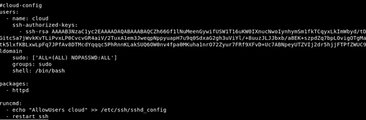

图 9.21-用于第三次虚拟机部署的 Cloud-init 配置文件

由于所有步骤多多少少都是相同的，我们得到了相同的结果-成功：

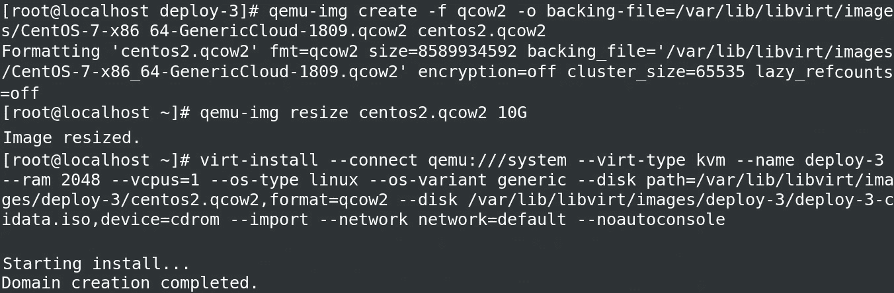

图 9.22-重复第三个虚拟机的部署过程

我们应该等一会儿，以便虚拟机部署完成。之后，让我们登录并检查镜像是否正确部署。我们要求在部署过程中安装`httpd`。是吗？

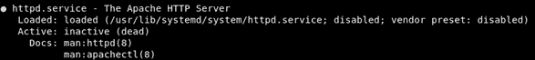

图 9.23-检查 httpd 是否已安装但未启动

我们可以看到一切都如预期完成。我们没有要求启动服务，因此它是按默认设置安装的，并且默认情况下是禁用和停止的。

### 安装后

cloud-init 的预期用途是配置机器并创建一个能够实现进一步配置或直接部署到生产环境的环境。但是，为了实现这一点，cloud-init 有很多选项，我们甚至还没有提到。由于我们有一个正在运行的实例，我们可以浏览一下在新启动的虚拟机中可以找到的最重要和最有用的东西。

首先要检查的是`/run/cloud-init`文件夹：

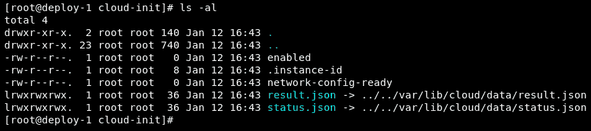

图 9.24 - /run/cloud-init 文件夹内容

所有在运行时创建的内容都写在这里，并且对用户可用。我们的演示机器是在本地 KVM hypervisor 下运行的，因此 cloud-init 没有检测到云，并且因此无法提供有关云的更多数据，但我们可以看到一些有趣的细节。第一个是两个名为`enabled`和`network-config-ready`的文件。它们都是空的，但非常重要。它们存在的事实表明 cloud-init 已启用，并且网络已配置并且正在工作。如果文件不存在，那么出了问题，我们需要返回并进行调试。有关调试的更多信息可以在[`cloudinit.readthedocs.io/en/latest/topics/debugging.html`](https://cloudinit.readthedocs.io/en/latest/topics/debugging.html)找到。

`results.json`文件保存了这个特定实例的元数据。`status.json`更集中于整个过程运行时发生了什么，并提供了关于可能的错误、配置系统不同部分所花费的时间以及是否完成的信息。

这两个文件都旨在帮助配置和编排，而且，虽然这些文件中的一些内容只对 cloud-init 重要，但检测和与不同的云环境进行交互的能力是其他编排工具可以使用的。文件只是其中的一部分。

这个方案的另一个重要部分是名为`cloud-init`的命令行实用程序。要从中获取信息，我们首先需要登录到我们创建的机器上。我们将展示由相同文件创建的机器之间的差异，并同时展示不同发行版之间的相似之处和不同之处。

在我们开始讨论之前，请注意，与所有 Linux 软件一样，cloud-init 有不同的版本。CentOS 7 镜像使用的是一个旧版本，0.7.9：

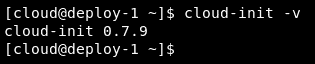

图 9.25 - CentOS cloud-init 版本 - 相当旧

Ubuntu 带有一个更新的版本，19.3：

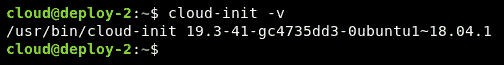

图 9.26 - Ubuntu 上的 cloud-init 版本 - 最新

在你惊慌之前，情况并不像看起来那么糟。Cloud-init 在几年前决定切换了其版本系统，因此在 0.7.9 之后是 17.1。发生了许多变化，其中大部分直接与 cloud-init 命令和配置文件相关。这意味着部署将会成功，但我们部署后会有很多问题。可能最明显的区别是当我们运行`cloud-init --help`时。对于 Ubuntu 来说，它看起来是这样的：

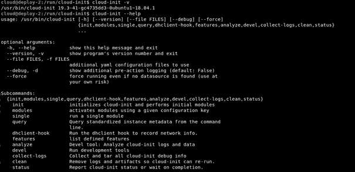

图 2.27 - Ubuntu 上的 Cloud-init 功能

实际上，CentOS 缺少了很多东西，其中一些完全缺失：

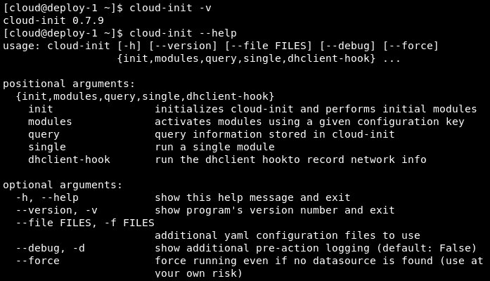

图 9.28 - CentOS 上的 Cloud-init 功能

由于我们的示例共有三个运行实例 - 一个 Ubuntu 和两个 CentOS 虚拟机 - 让我们尝试手动升级到 CentOS 上可用的最新稳定版本的 cloud-init。我们可以使用常规的`yum update`命令来实现，结果如下：

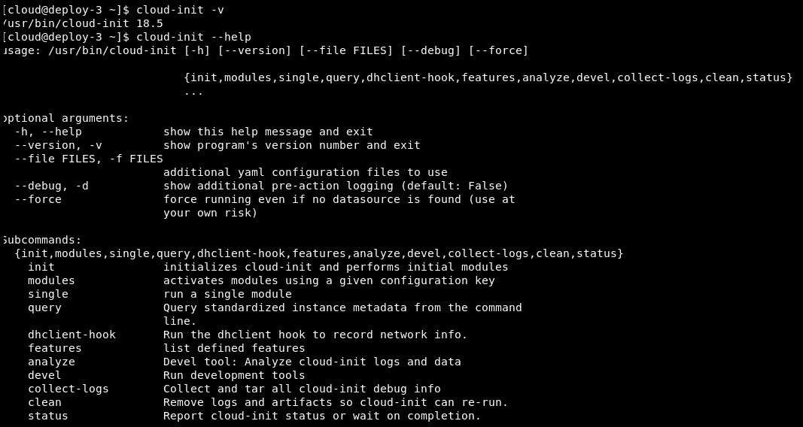

图 9.29 - 经过一段 yum 更新后，cloud-init 功能的最新列表

正如我们所看到的，这将使事情变得更加容易。

我们不会过多地详细介绍 cloud-init CLI 工具，因为像这样的书籍中有太多的信息可用，而且正如我们所看到的，新功能正在迅速添加。你可以通过浏览[`cloudinit.readthedocs.io/en/latest/topics/cli.html`](https://cloudinit.readthedocs.io/en/latest/topics/cli.html)自由地查看额外的选项。事实上，它们添加得非常快，以至于有一个`devel`选项，其中包含了正在积极开发中的新功能。一旦完成，它们就会成为独立的命令。

有两个命令你需要了解，它们都提供了关于引导过程和引导系统状态的大量信息。第一个是`cloud-init analyze`。它有两个非常有用的子命令：`blame`和`show`。

恰如其名的`blame`实际上是一个工具，返回了在引导过程中 cloud-init 执行不同过程时花费了多少时间。例如，我们可以看到在 Ubuntu 上配置`grub`和处理文件系统是最慢的操作：

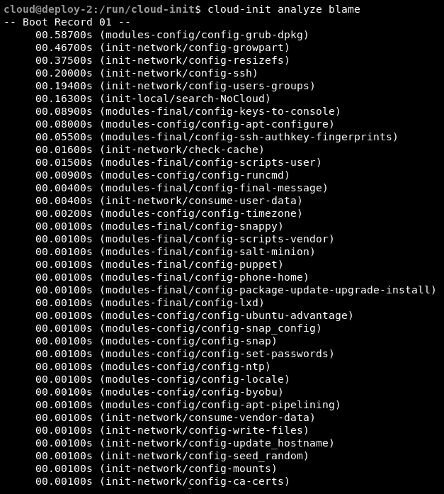

图 9.30 - 检查 cloud-init 过程的时间消耗

我们部署的第三个虚拟机使用了 CentOS 镜像，并添加了`httpd`。从某种程度上来说，这是 cloud-init 过程中发生的最慢的事情：

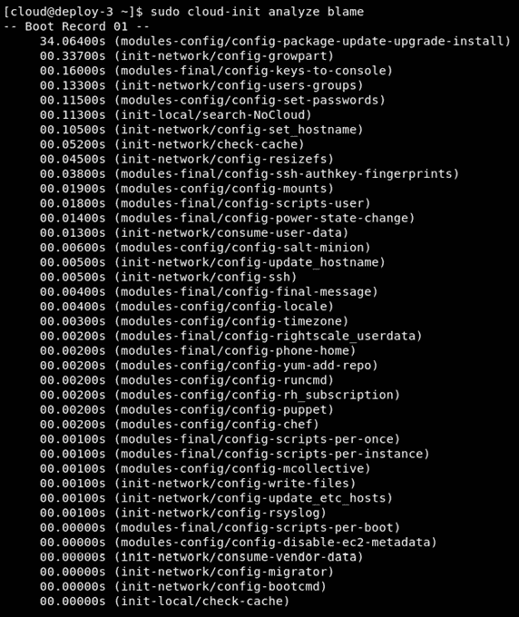

图 9.31 - 检查时间消耗 - cloud-init 部署必要的 httpd 包花费了相当长的时间

这样的工具使得优化部署变得更加容易。在我们的特定情况下，几乎没有意义，因为我们部署了几乎没有更改默认配置的简单机器，但能够理解部署为什么慢是一件有用的，如果不是必不可少的事情。

另一个有用的功能是能够看到实际引导虚拟机所花费的时间：

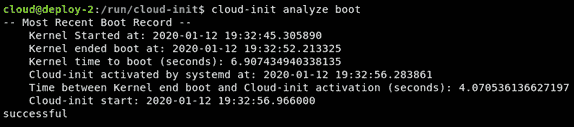

图 9.32 - 检查引导时间

我们将以一个查询结束这一部分 - `cloud-init query`使你能够从服务中请求信息，并以可用的结构化格式获取它，然后进行解析：

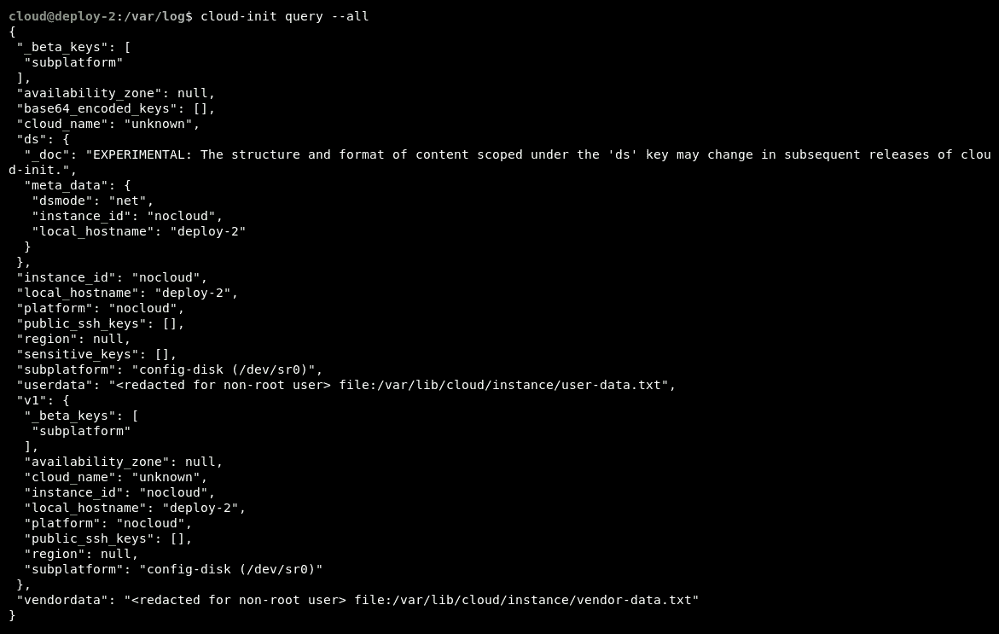

图 9.33 - 查询 cloud-init 信息

使用了几个小时后，cloud-init 成为系统管理员不可或缺的工具之一。当然，它的本质意味着它更适合于我们这些必须在云环境中工作的人，因为它最擅长的是从脚本快速无痛地部署机器。但即使你不是在使用云技术，快速创建实例进行测试，然后无痛地删除它们的能力，是每个管理员都需要的。

# 总结

在本章中，我们介绍了 cloud-init，它的架构以及在更大的部署场景中的好处，其中配置一致性和灵活性至关重要。再加上我们不再手动完成所有事情的范式变化 - 我们有一个工具来为我们完成 - 这是我们部署流程的一个很好的补充。确保你尝试使用它，因为它将使你的生活变得更加轻松，同时为你使用云虚拟机做好准备，而在那里，cloud-init 被广泛使用。

在下一章中，我们将学习如何将这种用法模型扩展到 Windows 虚拟机，使用 cloudbase-init。

# 问题

1.  使用 CentOS 7 和 Ubuntu 基础 cloud-init 镜像重新创建我们的设置。

1.  使用相同的基础镜像创建一个 Ubuntu 和两个 CentOS 实例。

1.  使用 Ubuntu 作为基础镜像添加第四个虚拟机。

1.  尝试使用其他发行版作为基础镜像，而不更改任何配置文件。试试 FreeBSD。

1.  不要使用 SSH 密钥，使用预定义密码。这样更安全还是更不安全？

1.  创建一个脚本，使用 cloud-init 和一个基础镜像创建 10 个相同的机器实例。

1.  您能找到任何理由，为什么使用分发本地的安装方式而不是使用 cloud-init 会更有利吗？

# 进一步阅读

请参考以下链接，了解本章涵盖的更多信息：

+   Cloud-init 文档中心：[`cloudinit.readthedocs.io/en/latest/`](https://cloudinit.readthedocs.io/en/latest/)

+   cloud-init 项目主页：[`cloud-init.io/`](https://cloud-init.io/)

+   源代码：[`code.launchpad.net/cloud-init`](https://code.launchpad.net/cloud-init)

+   配置文件的特别好的例子：[`cloudinit.readthedocs.io/en/latest/topics/examples.html`](https://cloudinit.readthedocs.io/en/latest/topics/examples.html)
