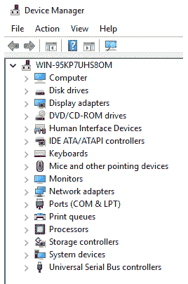
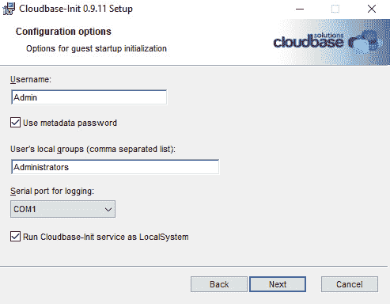
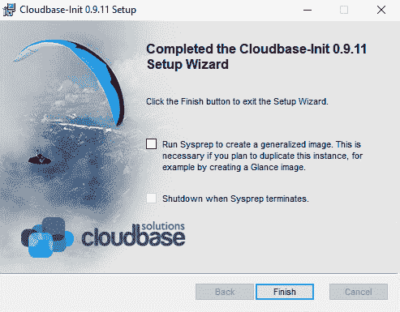
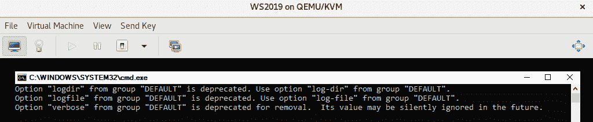
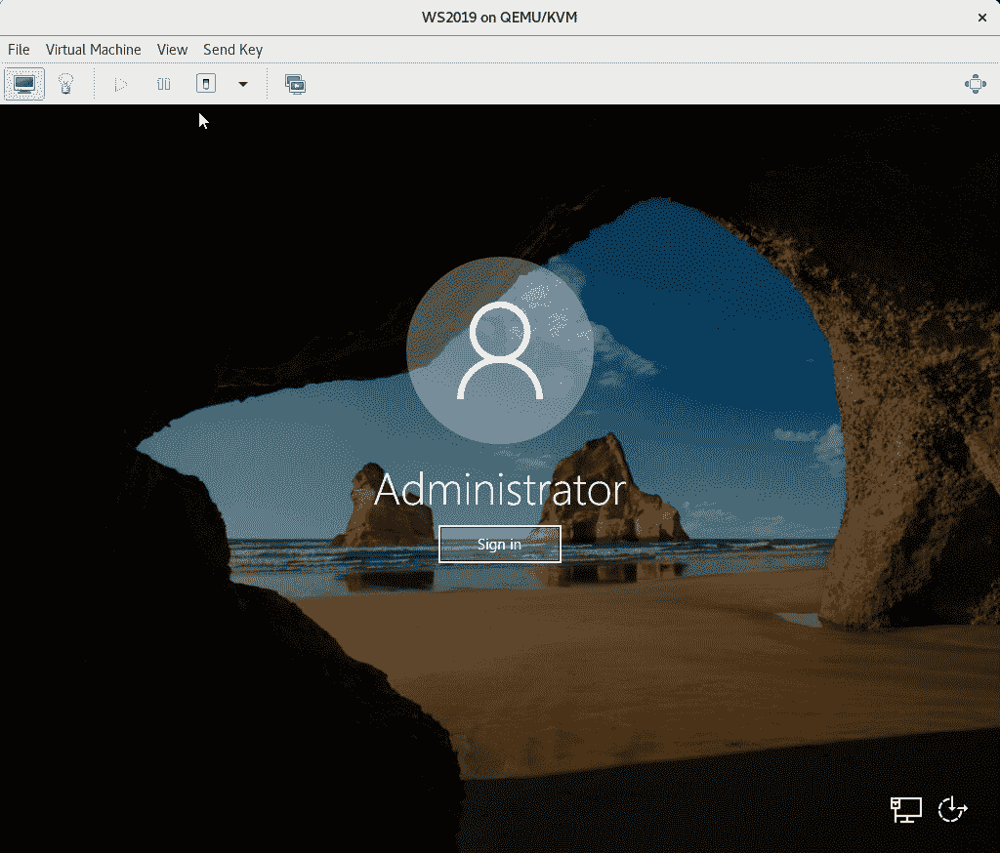
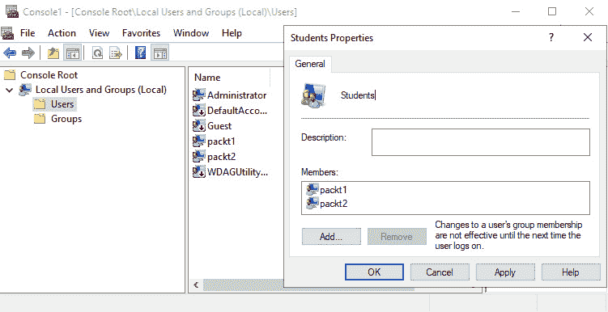
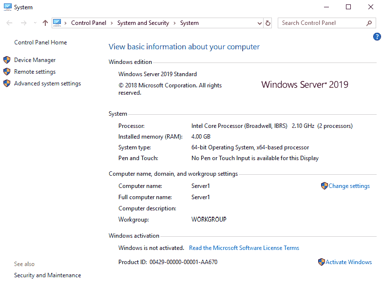
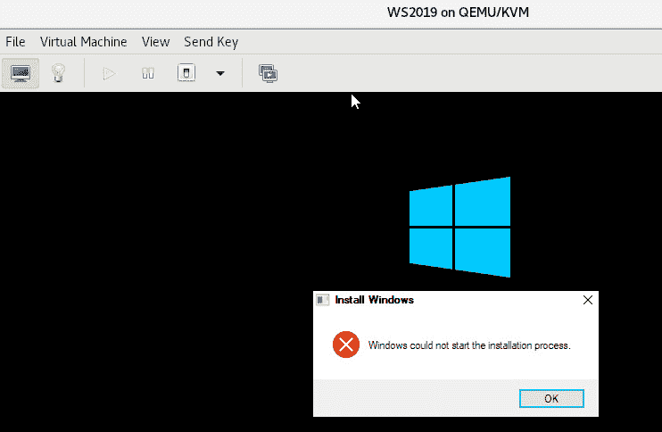

# 第十章：*第十章*：自动化 Windows 客户端部署和自定义

现在，我们已经介绍了在 KVM 中部署基于 Linux 的**虚拟机**（**VMs**）的不同方法，是时候将我们的重点转移到 Microsoft Windows 了。具体来说，我们将专注于在 KVM 上运行的 Windows Server 2019 机器，并涵盖部署和自定义 Windows Server 2019 虚拟机的先决条件和不同场景。本书不是基于**虚拟桌面基础设施**（**VDI**）和桌面操作系统的想法，这需要与虚拟化服务器操作系统完全不同的场景、方法和技术实施。

在本章中，我们将涵盖以下主题：

+   在 KVM 上创建 Windows 虚拟机的先决条件

+   使用`virt-install`实用程序创建 Windows 虚拟机

+   使用`cloudbase-init`自定义 Windows 虚拟机

+   `cloudbase-init`自定义示例

+   解决常见的`cloudbase-init`自定义问题

# 在 KVM 上创建 Windows 虚拟机的先决条件

在 KVM 虚拟化上启动客户操作系统的安装时，我们总是有相同的起点。我们需要以下之一：

+   具有操作系统安装的 ISO 文件

+   具有虚拟机模板的镜像

+   一个现有的虚拟机进行克隆和重新配置

让我们从头开始。在本章中，我们将创建一个 Windows Server 2019 虚拟机。版本选择是为了与市场上最新发布的微软服务器操作系统保持联系。我们的目标是部署一个 Windows Server 2019 虚拟机模板，以便以后用于更多部署和`cloudbase-init`，而此安装过程的选择工具将是`virt-install`。如果您需要安装旧版本（2016 或 2012），您需要知道两个事实：

+   它们在 CentOS 8 上得到了支持。

+   安装过程与我们的 Windows Server 2019 虚拟机将是相同的。

如果您想使用虚拟机管理器部署 Windows Server 2019，请确保正确配置虚拟机。这包括为客户操作系统安装选择正确的 ISO 文件，并连接另一个虚拟 CD-ROM 以安装`virtio-win`驱动程序，以便您可以在安装过程中安装它们。确保您的虚拟机在本地 KVM 主机上有足够的磁盘空间（建议为 60 GB+），并且有足够的性能来运行。从两个虚拟 CPU 和 4 GB 内存开始，因为这很容易以后更改。

我们场景的下一步是创建一个 Windows 虚拟机，我们将在本章中使用`cloudbase-init`进行自定义。在真实的生产环境中，我们需要尽可能多地在其中进行配置-驱动程序安装、Windows 更新、常用应用程序等。所以，让我们首先做这个。

# 使用`virt-install`实用程序创建 Windows 虚拟机

我们需要做的第一件事是确保我们已经准备好安装`virtio-win`驱动程序-如果没有安装，虚拟机将无法正常工作。因此，让我们首先安装`libguestfs`软件包和`virtio-win`软件包，以防您的服务器上尚未安装它们：

```
yum –y install virtio-win libguestfs*
```

然后，是时候开始部署我们的虚拟机了。以下是我们的设置：

+   Windows Server 2019 ISO 位于`/iso/windows-server-2019.iso`。

+   `virtio-win` ISO 文件位于默认系统文件夹`/usr/share/virtio-win/virtio-win.iso`。

+   我们将创建一个位于默认系统文件夹`/var/lib/libvirt/images`的 60 GB 虚拟磁盘。

现在，让我们开始安装过程：

```
virt-install --name WS2019 --memory=4096 --vcpus 2 --cpu host --video qxl --features=hyperv_relaxed=on,hyperv_spinlocks=on,hyperv_vapic=on --clock hypervclock_present=yes --disk /var/lib/libvirt/images/WS2019.qcow2,format=qcow2,bus=virtio,cache=none,size=60 --cdrom /iso/windows-server-2019.iso --disk /usr/share/virtio-win/virtio-win.iso,device=cdrom --vnc --os-type=windows --os-variant=win2k19 --accelerate --noapic 
```

安装过程开始时，我们必须点击`virtio-win`驱动程序。确保取消选中**隐藏与此计算机硬件不兼容的驱动程序**复选框。然后，逐个添加以下驱动程序，从指定目录中选择并用鼠标选择它们：

+   `AMD64\2k19`：**Red Hat VirtIO SCSI 控制器**。

+   `Balloon\2k19\amd64`：**VirtIO 气球驱动程序**。

+   `NetKVM\2k19\AMD64`：**Red Hat VirtIO 以太网适配器**。

+   `qemufwcfg\2k19\amd64`：**QEMU FWCfg 设备**。

+   `qemupciserial\2k19\amd64`：**QEMU 串行 PCI 卡**。

+   `vioinput\2k19\amd64`：**VirtIO 输入驱动程序**和**VirtIO 输入驱动程序助手**；选择它们两个。

+   `viorng\2k19\amd64`：**VirtIO RNG 设备**。

+   `vioscsi\2k19\amd64`：**Red Hat VirtIO SCSI 直通控制器**。

+   `vioserial\2k19\amd64`：**VirtIO 串行驱动程序**。

+   `viostor\2k19\amd64`：**Red Hat VirtIO SCSI 控制器**。

之后，点击**下一步**，等待安装过程完成。

您可能会问自己：*为什么我们在安装过程的早期就这样微观管理，而不是稍后再做呢？*答案有两个方面-如果我们稍后再做，我们会遇到以下问题：

+   有可能-至少对于某些操作系统-在安装开始之前我们不会加载所有必要的驱动程序，这可能意味着安装会崩溃。

+   我们会在**设备管理器**中看到大量的黄色感叹号，这通常会让人感到恼火。

部署后，我们的设备管理器很满意，安装成功了：



图 10.1-操作系统和所有驱动程序从一开始就安装

安装后唯一强烈建议的事情是，在启动 VM 后从`virtio-win.iso`安装客户代理。您会在虚拟 CD-ROM 中的`guest-agent`目录中找到一个`.exe`文件，只需点击**下一步**按钮，直到安装完成。

现在我们的 VM 已经准备好，我们需要开始考虑定制。特别是大规模的定制，这是云中 VM 部署的正常使用模式。这就是为什么我们需要使用`cloudbase-init`，这是我们的下一步。

# 使用 cloudbase-init 自定义 Windows VM

如果您有机会阅读*第九章*，*使用 cloud-init 自定义虚拟机*，我们讨论了一个工具叫做`cloud-init`。我们使用它来进行客户操作系统定制，特别是针对 Linux 机器。`cloud-init`在基于 Linux 的环境中被广泛使用，特别是在基于 Linux 的云中，用于执行云 VM 的初始化和配置。

`cloudbase-init`的理念是一样的，但它针对的是 Windows 客户操作系统。它的基本服务在我们启动 Windows 客户操作系统实例时启动，然后阅读配置信息并进行配置/初始化。我们稍后将展示一些`cloudbase-init`操作的例子。

`cloudbase-init`能做什么？功能列表相当长，因为`cloudbase-init`的核心是模块化的，所以它提供了许多插件和解释器，可以用于扩展其功能：

+   它可以执行自定义命令和脚本，最常见的是用 PowerShell 编写，尽管也支持常规的 CMD 脚本。

+   它可以与 PowerShell 远程和**Windows 远程管理**（**WinRM**）服务一起工作。

+   它可以管理和配置磁盘，例如进行卷扩展。

+   它可以进行基本的管理，包括以下内容：

a) 创建用户和密码

b) 设置主机名

c) 配置静态网络

d) 配置 MTU 大小

e) 分配许可证

f) 使用公钥

g) 同步时钟

我们之前提到过，我们的 Windows Server 2019 虚拟机将用于`cloudbase-init`定制，所以这是我们接下来要讨论的主题。让我们为`cloudbase-init`准备我们的虚拟机。我们将通过下载`cloudbase-init`安装程序并安装来实现这一点。我们可以通过将我们的互联网浏览器指向[`cloudbase-init.readthedocs.io/en/latest/intro.html#download`](https://cloudbase-init.readthedocs.io/en/latest/intro.html#download)来找到`cloudbase-init`安装程序。安装非常简单，可以以常规 GUI 方式或静默方式工作。如果您习惯使用 Windows Server Core 或更喜欢静默安装，可以使用 MSI 安装程序进行静默安装，方法是使用以下命令：

```
msiexec /i CloudbaseInitSetup.msi /qn /l*v log.txt
```

确保您检查`cloudbase-init`文档，以获取更多配置选项，因为安装程序支持额外的运行时选项。它位于[`cloudbase-init.readthedocs.io/en/latest/`](https://cloudbase-init.readthedocs.io/en/latest/)。

让我们使用 GUI 安装程序，因为它更简单易用，特别是对于第一次使用的用户。首先，安装程序将要求您同意许可协议和安装位置 – 就是通常的东西。然后，我们将得到以下选项屏幕：



图 10.2 – 基本配置屏幕

它要求我们允许使用特定未来用户创建`cloudbase-init`配置文件（`cloudbase-init-unattend.conf`和`cloudbase-init.conf`）。这个用户将是本地`Administrators`组的成员，并且将在我们开始使用新镜像时用于登录。这将反映在我们的两个配置文件中，因此如果我们在这里选择`Admin`，那么将创建该用户。它还要求我们是否希望`cloudbase-init`服务作为`LocalSystem`服务运行，我们选择这样做是为了使整个过程更容易。原因非常简单 – 这是我们可以给予`cloudbase-init`服务的最高权限级别，以便它可以执行其操作。翻译：`cloudbase-init`服务将作为`LocalSystem`服务账户运行，该账户对所有本地系统资源具有无限访问权限。

最后一个配置屏幕将要求我们运行 sysprep。通常，我们不会检查`cloudbase-init`定制文件并在此之后运行 sysprep。因此，请保持以下窗口打开：



图 10.3 – 完成 cloudbase-init 安装向导

现在`cloudbase-init`服务已安装和配置好，让我们创建一个定制文件，通过使用`cloudbase-init`来配置这个虚拟机。同样，请确保保持此配置屏幕打开（完成设置向导），以便我们在完成创建`cloudbase-init`配置时可以轻松开始整个过程。

# cloudbase-init 定制示例

安装过程完成后，在我们的安装位置将创建一个包含一组文件的目录。例如，在我们的虚拟机中，创建了一个名为`c:\Program Files\Cloudbase Solutions\Cloudbase-init\`的目录，它具有以下一组子目录：

+   `bin`：一些二进制文件安装的位置，例如`elevate`，`bsdtar`，`mcopy`，`mdir`等。

+   `conf`：我们将要处理的三个主要配置文件的位置，稍后会讨论。

+   `LocalScripts`：PowerShell 和类似脚本的默认位置，我们希望在启动后运行。

+   `Log`：默认情况下，我们将存储`cloudbase-init`日志文件的位置，以便我们可以调试任何问题。

+   `Python`：本地安装 Python 的位置，以便我们也可以使用 Python 进行脚本编写。

让我们专注于包含我们配置文件的`conf`目录：

+   `cloudbase-init.conf`

+   `cloudbase-init-unattend.conf`

+   `unattend.xml`

`cloudbase-init`的工作方式相当简单 - 它在 Windows sysprep 阶段使用`unattend.xml`文件来执行`cloudbase-init`，并使用`cloudbase-init-unattend.conf`配置文件。默认的`cloudbase-init-unattend.conf`配置文件非常易读，我们可以使用`cloudbase-init`项目提供的示例，逐步解释默认配置文件：

```
[DEFAULT]
# Name of the user that will get created, group for that user
username=Admin
groups=Administrators
firstlogonbehaviour=no
inject_user_password=true  # Use password from the metadata (not random).
```

配置文件的下一部分是关于设备 - 具体来说，是要检查哪些设备可能有配置驱动器（元数据）：

```
config_drive_raw_hhd=true
config_drive_cdrom=true
# Path to tar implementation from Ubuntu.
bsdtar_path=C:\Program Files\Cloudbase Solutions\Cloudbase-Init\bin\bsdtar.exe
mtools_path= C:\Program Files\Cloudbase Solutions\Cloudbase-Init\bin\
```

我们还需要配置一些日志记录的设置：

```
# Logging level
verbose=true
debug=true
# Where to store logs
logdir=C:\Program Files (x86)\Cloudbase Solutions\Cloudbase-Init\log\
logfile=cloudbase-init-unattend.log
default_log_levels=comtypes=INFO,suds=INFO,iso8601=WARN
logging_serial_port_settings=
```

配置文件的下一部分是关于网络的，因此我们将在我们的示例中使用 DHCP 获取所有网络设置：

```
# Use DHCP to get all network and NTP settings
mtu_use_dhcp_config=true
ntp_use_dhcp_config=true
```

我们需要配置脚本所在的位置，这些脚本可以作为`cloudbase-init`过程的一部分使用：

```
# Location of scripts to be started during the process
local_scripts_path=C:\Program Files\Cloudbase Solutions\Cloudbase-Init\LocalScripts\
```

配置文件的最后一部分是关于要加载的服务和插件，以及一些全局设置，例如是否允许`cloudbase-init`服务重新启动系统，以及我们将如何处理`cloudbase-init`关闭过程（`false=优雅服务关闭`）：

```
# Services for loading
metadata_services=cloudbaseinit.metadata.services.configdrive.ConfigDriveService, cloudbaseinit.metadata.services.httpservice.HttpService,
cloudbaseinit.metadata.services.ec2service.EC2Service,
cloudbaseinit.metadata.services.maasservice.MaaSHttpService
# Plugins to load
plugins=cloudbaseinit.plugins.common.mtu.MTUPlugin,
        cloudbaseinit.plugins.common.sethostname.SetHostNamePlugin
# Miscellaneous.
allow_reboot=false    # allow the service to reboot the system
stop_service_on_exit=false
```

让我们从一开始就澄清一些事情。默认配置文件已经包含了一些已弃用的设置，您很快就会发现。特别是像`verbose`，`logdir`和`logfile`这样的设置在此版本中已经被弃用，您可以从以下截图中看到，`cloudbase-init`正在抱怨这些选项：



图 10.4 - cloudbase-init 抱怨其自己的默认配置文件选项

如果我们想要使用默认配置文件启动`cloudbase-init`进行 sysprep，实际上我们将得到一个非常好配置的虚拟机 - 它将被 sysprep，它将重置管理员密码并要求我们在第一次登录时更改密码，并删除现有的管理员用户及其目录。因此，在执行此操作之前，我们需要确保将我们的管理员用户设置和数据（文档，安装程序，下载等）保存在安全的地方。此外，默认配置文件不会默认重新启动虚拟机，这可能会让您感到困惑。我们需要手动重新启动虚拟机，以便整个过程可以开始。

与`cloud-init`和`cloudbase-init`一起工作的最简单方法是写下一个需要在虚拟机初始化过程中完成的场景。因此，我们将这样做 - 选择我们想要配置的一大堆设置，并相应地创建一个自定义文件。以下是我们的设置：

+   我们希望我们的虚拟机在`cloudbase-init`过程后要求我们更改密码。

+   我们希望我们的虚拟机从 DHCP 获取所有的网络设置（IP 地址，子网掩码，网关，DNS 服务器和 NTP）。

+   我们希望对虚拟机进行 sysprep，以使其对每个场景和策略都是唯一的。

因此，让我们创建一个`cloudbase-init-unattend.conf`配置文件来为我们执行此操作。配置文件的第一部分取自默认配置文件：

```
[DEFAULT]
username=Admin
groups=Administrators
inject_user_password=true
config_drive_raw_hhd=true
config_drive_cdrom=true
config_drive_vfat=true
bsdtar_path=C:\Program Files\Cloudbase Solutions\Cloudbase-Init\bin\bsdtar.exe
mtools_path= C:\Program Files\Cloudbase Solutions\Cloudbase-Init\bin\
debug=true
default_log_levels=comtypes=INFO,suds=INFO,iso8601=WARN
logging_serial_port_settings=
mtu_use_dhcp_config=true
ntp_use_dhcp_config=true
```

我们决定使用 PowerShell 进行所有脚本编写，因此我们为我们的 PowerShell 脚本创建了一个单独的目录：

```
local_scripts_path=C:\PS1
```

文件的其余部分也只是从默认配置文件中复制过来的：

```
metadata_services=cloudbaseinit.metadata.services.base.EmptyMetadataService
plugins=cloudbaseinit.plugins.common.mtu.MTUPlugin,
        cloudbaseinit.plugins.common.sethostname.SetHostNamePlugin, cloudbaseinit.plugins.common.localscripts.LocalScriptsPlugin,cloudbaseinit.plugins.common.userdata.UserDataPlugin
allow_reboot=false    
stop_service_on_exit=false
```

至于`cloudbase-init.conf`文件，我们唯一做的更改是选择正确的本地脚本路径（稍后将提到的原因），因为我们将在下一个示例中使用此路径：

```
[DEFAULT]
username=Admin
groups=Administrators
inject_user_password=true
config_drive_raw_hhd=true
config_drive_cdrom=true
config_drive_vfat=true
```

此外，我们默认的配置文件包含了`tar`，`mtools`和调试的路径：

```
bsdtar_path=C:\Program Files\Cloudbase Solutions\Cloudbase-Init\bin\bsdtar.exe
mtools_path= C:\Program Files\Cloudbase Solutions\Cloudbase-Init\bin\
debug=true
```

配置文件的这一部分也是从默认配置文件中获取的，我们只更改了`local_scripts_path`，以便将其设置为我们用于填充 PowerShell 脚本的目录：

```
first_logon_behaviour=no
default_log_levels=comtypes=INFO,suds=INFO,iso8601=WARN
logging_serial_port_settings=
mtu_use_dhcp_config=true
ntp_use_dhcp_config=true
local_scripts_path=C:\PS1
```

然后，我们可以返回到`cloudbase-init`安装屏幕，选中 sysprep 选项，然后单击**完成**。启动 sysprep 过程并完成后，这就是最终结果：



图 10.5 - 当我们按“登录”时，我们将被要求更改管理员密码

现在，让我们再进一步，稍微复杂一些。假设您想执行相同的过程，但还要添加一些额外的 PowerShell 代码来进行一些额外的配置。考虑以下示例：

+   它应该创建另外两个名为`packt1`和`packt2`的本地用户，预定义密码设置为`Pa$$w0rd`。

+   它应该创建一个名为`students`的新本地组，并将`packt1`和`packt2`添加为成员。

+   它应该将主机名设置为`Server1`。

使我们能够执行此操作的 PowerShell 代码应具有以下内容：

```
Set-ExecutionPolicy -ExecutionPolicy Unrestricted -Force
$password = "Pa$$w0rd" | ConvertTo-SecureString -AsPlainText -Force
New-LocalUser -name "packt1" -Password $password
New-LocalUser -name "packt2" -Password $password
New-LocalGroup -name "Students"
Add-LocalGroupMember -group "Students" -Member "packt1","packt2"
Rename-Computer -NewName "Server1" -Restart
```

看一下脚本本身，这就是它的作用：

+   将 PowerShell 执行策略设置为无限制，以便我们的主机不会停止我们的脚本执行，这是默认情况下会发生的。

+   从纯文本字符串（`Pa$$w0rd`）创建一个密码变量，将其转换为安全字符串，我们可以将其与`New-LocalUser` PowerShell 命令一起使用来创建本地用户。

+   `New-LocalUser`是一个 PowerShell 命令，用于创建本地用户。强制参数包括用户名和密码，这就是为什么我们创建了一个安全字符串。

+   `New-LocalGroup`是一个 PowerShell 命令，用于创建本地组。

+   `Add-LocalGroupMember`是一个 PowerShell 命令，允许我们创建一个新的本地组并向其中添加成员。

+   `Rename-Computer`是一个 PowerShell 命令，用于更改 Windows 计算机的主机名。

我们还需要以某种方式从`cloudbase-init`中调用此代码，因此我们需要将此代码添加为脚本。最常见的是，在`cloudbase-init`安装文件夹中使用名为`LocalScripts`的目录。让我们将此脚本命名为`userdata.ps1`，将先前提到的内容保存到文件夹中，如`.conf`文件中定义的那样（`c:\PS1`），并在文件顶部添加一个`cloudbase-init`参数：

```
# ps1
$password = "Pa$$w0rd" | ConvertTo-SecureString -AsPlainText -Force
New-LocalUser -name "packt1" -Password $password
New-LocalUser -name "packt2" -Password $password
New-LocalGroup -name "Students"
Add-LocalGroupMember -group "Students" -Member "packt1","packt2"
Rename-Computer -NewName "Server1" –Restart
```

再次启动`cloudbase-init`过程，可以通过启动`cloudbase-init`安装向导并按照之前的示例进行操作来实现，以下是用户方面的最终结果：



图 10.6 - 创建了 packt1 和 packt2 用户，并将其添加到我们的 PowerShell 脚本创建的组中

我们可以清楚地看到创建了`packt1`和`packt2`用户，以及一个名为`Students`的组。然后，我们可以看到`Students`组有两个成员 - `packt1`和`packt2`。此外，在设置服务器名称方面，我们有以下内容：



图 10.7 - Slika 1。通过 PowerShell 脚本更改服务器名称也有效

使用`cloudbase-init`确实并不简单，需要在时间和摆弄方面进行一些投资。但之后，它将使我们的工作变得更加容易 - 不再被迫一遍又一遍地执行这些平凡的任务应该是一个足够的奖励，这就是为什么我们需要稍微谈谈故障排除。我们相信，随着您增加`cloudbase-init`的使用量，您一定会遇到这些问题。

# 排除常见的 cloudbase-init 自定义问题

坦率地说，您可以自由地说`cloudbase-init`文档并不是那么好。找到如何执行 PowerShell 或 Python 代码的示例实际上是相当困难的，而官方页面在这方面并没有提供任何帮助。因此，让我们讨论一些在使用`cloudbase-init`时经常发生的常见错误。

尽管这似乎有些违反直觉，但我们在使用最新的开发版本而不是最新的稳定版本时取得了更大的成功。我们不太确定问题出在哪里，但最新的开发版本（在撰写本文时，这是版本 0.9.12.dev125）对我们来说一开始就可以使用。使用版本 0.9.11 时，我们在启动 PowerShell 脚本时遇到了很大的问题。

除了这些问题，当您开始了解`cloudbase-init`时，还会遇到其他问题。第一个是重启循环。这个问题非常常见，几乎总是因为两个原因：

+   配置文件中的错误 - 模块或选项的名称错误输入，或类似的错误

+   在`cloudbase-init`过程中调用的一些外部文件（位置或语法）出现错误

在配置文件中犯错误是经常发生的事情，这会使`cloudbase-init`陷入一个奇怪的状态，最终会变成这样：



图 10.8 - 配置错误

我们已经多次看到这种情况。真正的问题在于有时需要等待数小时，有时需要循环多次重启，但这不仅仅是一个常规的重启循环。似乎`cloudbase-init`正在做某些事情 - CMD 已经启动，屏幕上没有错误，但它一直在做某些事情，然后以这种方式完成。

您可能遇到的其他问题更加挑剔 - 例如，当`cloudbase-init`在 sysprep/`cloudbase-init`过程中无法重置密码时。如果您手动更改了`cloudbase-init`服务使用的帐户密码（因此，使用`LocalSystem`是一个更好的主意），就会发生这种情况。这将导致整个`cloudbase-init`过程失败，其中的一部分可能是无法重置密码。

还有一个更加隐晦的原因可能会导致这种情况发生 - 有时我们会使用`services.msc`控制台手动管理系统服务，并且会有意地禁用我们不立即识别的服务。如果将`cloudbase-init`服务设置为禁用，它将在其过程中失败。这些服务需要具有自动启动优先级，并且不应手动重新配置为禁用。

重置密码失败也可能是因为某些安全策略 - 例如，如果密码不够复杂。这就是为什么我们在 PowerShell 脚本中使用了更复杂的密码，因为我们大多数系统工程师很早就学到了这个教训。

此外，有时公司会制定不同的安全策略，这可能导致某些管理应用程序（例如软件清单）停止`cloudbase-init`服务或完全卸载它。

我们可能遇到的最令人沮丧的错误是`cloudbase-init`进程无法从指定文件夹启动脚本。在花费数小时完善您的 Python、bash、cmd 或 PowerShell 脚本后，需要将其添加到定制过程中，看到这种情况发生总是令人发狂。为了能够使用这些脚本，我们需要使用一个能够调用外部脚本并执行它的特定插件。这就是为什么我们通常使用`UserDataPlugin` - 无论是出于执行还是调试的原因 - 因为它可以执行所有这些脚本类型并给我们一个错误值，然后我们可以用于调试目的。

最后一件事 - 确保不要直接将 PowerShell 代码插入到`conf`文件夹中的`cloudbase-init`配置文件中。你只会得到一个重启循环作为回报，所以要小心。

# 总结

在本章中，我们讨论了 Windows VM 的定制化，这是与 Linux VM 定制化同样重要的话题。甚至更重要，考虑到市场份额和许多人在云环境中使用 Windows。

现在我们已经涵盖了与 VM、模板化和定制化相关的所有基础知识，是时候介绍一种与`cloud-init`和`cloudbase-init`互补的附加定制化方法了。因此，下一章将介绍基于 Ansible 的方法。

# 问题

1.  我们需要安装哪些驱动程序到 Windows 客户操作系统中，以便在 KVM 虚拟化程序上创建 Windows 模板？

1.  我们需要安装哪个代理程序到 Windows 客户操作系统中，以便更好地查看 VM 的性能数据？

1.  sysprep 是什么？

1.  `cloudbase-init`用于什么？

1.  `cloudbase-init`的常规用例是什么？

# 进一步阅读

请参考以下链接获取更多信息：

+   Microsoft `LocalSystem`账户文档：[`docs.microsoft.com/en-us/windows/win32/ad/the-localsystem-account`](https://docs.microsoft.com/en-us/windows/win32/ad/the-localsystem-account)

+   `cloudbase-init`文档：[`cloudbase-init.readthedocs.io/en/latest/intro.html`](https://cloudbase-init.readthedocs.io/en/latest/intro.html)

+   `cloudbase-init`插件文档：[`cloudbase-init.readthedocs.io/en/latest/plugins.html`](https://cloudbase-init.readthedocs.io/en/latest/plugins.html)

+   `cloudbase-init`服务文档：[`cloudbase-init.readthedocs.io/en/latest/services.html`](https://cloudbase-init.readthedocs.io/en/latest/services.html)
