# 第十一章：Ansible 和编排自动化

Ansible 已经成为当今开源社区的事实标准，因为它提供了很多功能，同时对您和您的基础设施要求很少。在**基于内核的虚拟机**（**KVM**）中使用 Ansible 也是很有意义的，特别是当您考虑到更大的环境。无论您只是想要简单地配置 KVM 主机（安装 libvirt 和相关软件），还是想要统一配置主机上的 KVM 网络 - Ansible 对于这两者都非常有价值。例如，在本章中，我们将使用 Ansible 来部署托管在 KVM 虚拟机内的虚拟机和多层应用程序，这在更大的环境中是非常常见的用例。然后，我们将转向更加严谨的主题，结合 Ansible 和 cloud-init，因为它们在应用时间轴和完成方式上有所不同。Cloud-init 是一种理想的自动化初始虚拟机配置的方式（主机名、网络和 SSH 密钥）。然后，我们通常转向 Ansible，以便在初始配置后执行额外的编排 - 添加软件包，对系统进行更大的更改等等。让我们看看如何在 KVM 中使用 Ansible 和 cloud-init。

在这一章中，我们将涵盖以下主题：

+   理解 Ansible

+   使用`kvm_libvirt`模块来配置虚拟机

+   使用 Ansible 和 cloud-init 进行自动化和编排

+   在 KVM 虚拟机上编排多层应用程序部署

+   通过示例学习，包括如何在 KVM 中使用 Ansible 的各种示例

让我们开始吧！

# 理解 Ansible

一个称职管理员的主要职责之一是尽可能自动化自己的工作。有一句话说，你必须手动做一次所有的事情。如果你必须再做一次，你可能会对此感到恼火，第三次你必须做的时候，你会自动化这个过程。当我们谈论自动化时，它可能意味着很多不同的东西。

让我们通过一个例子来解释这个问题和解决方案，因为这是描述问题和解决方案最方便的方式。假设你在一家公司工作，需要部署 50 台 Web 服务器来托管一个 Web 应用程序，具有标准配置。标准配置包括需要安装的软件包、需要配置的服务和网络设置、需要配置的防火墙规则，以及需要从网络共享复制到虚拟机内部的本地磁盘上的文件，以便我们可以通过 Web 服务器提供这些文件。你将如何实现这一点？

有三种基本的方法：

+   手动做所有事情。这将花费很多时间，也会有很多机会出错，因为毕竟我们是人类，会犯错误（故意的）。

+   尝试通过部署 50 台虚拟机来自动化流程，然后将整个配置方面放入脚本中，这可以成为自动安装过程的一部分（例如，kickstart）。

+   尝试通过部署一个包含所有组件的单个虚拟机模板来自动化流程。这意味着我们只需要从虚拟机模板部署这 50 台虚拟机，并进行一些定制，以确保我们的虚拟机准备好使用。

有不同类型的自动化可用。纯脚本编写是其中之一，它涉及将需要多次运行的所有内容创建成脚本。做了多年工作的管理员通常都有一堆有用的脚本。优秀的管理员通常至少懂一种编程语言，即使他们不愿承认，因为作为管理员意味着在别人弄坏东西后需要修复，有时需要相当多的编程。

因此，如果你考虑通过脚本进行自动化，我们完全同意这是可行的。但问题在于，你将花费多少时间来覆盖脚本的每一个方面，以确保脚本*始终*正常工作。此外，如果脚本出现问题，你将不得不进行大量的手动劳动来修复它，而没有任何真正的方法在之前不成功的配置之上进行额外的修正。

这就是基于过程的工具如 Ansible 派上用场的地方。Ansible 生成**模块**，将其推送到端点（在我们的示例中是虚拟机），将我们的对象带到*期望的状态*。如果你来自 Microsoft PowerShell 世界，是的，Ansible 和 PowerShell **期望状态配置**（**DSC**）基本上是在尝试做同样的事情。它们只是以不同的方式去做。所以，让我们讨论这些不同的自动化过程，看看 Ansible 在其中的定位。

## 自动化方法

总的来说，所有这些都适用于管理系统及其部件，安装应用程序，并且通常照顾已安装系统内部的事务。这可以被认为是一种*旧*的管理方法，因为它通常处理的是服务，而不是服务器。与此同时，这种自动化明显地专注于单个服务器或少量服务器，因为它的扩展性不强。如果我们需要处理多个服务器，使用常规脚本会带来新的问题。因为脚本更难以扩展到多个服务器上（而在 Ansible 中很容易），我们需要考虑很多额外的变量（不同的 SSH 密钥、主机名和 IP 地址）。

如果一个脚本不够，那么我们就必须使用多个脚本，这就产生了一个新问题，即脚本管理。想想看 - 当我们需要在脚本中做一些更改时会发生什么？我们如何确保所有服务器上的所有实例都使用相同的版本，特别是如果服务器 IP 地址不是顺序的呢？因此，总之，虽然旧的和经过测试，这种自动化方式有严重的缺点。

在 DevOps 社区中，还有另一种自动化方式正在受到关注 - 大写字母 A 的自动化。这是一种在不同机器上自动化系统操作的方式 - 甚至在不同操作系统上也是如此。有一些自动化系统可以实现这一点，它们基本上可以分为两组：使用代理的系统和无代理系统。

### 使用代理的系统

使用代理的系统更常见，因为它们比无代理系统有一些优势。首要的优势是它们能够跟踪不仅需要进行的更改，还能跟踪用户对系统所做的更改。这种更改跟踪意味着我们可以跟踪系统上发生的事情并采取适当的行动。

几乎所有的工作方式都是一样的。一个小应用程序 - 称为代理 - 安装在我们需要监视的系统上。应用程序安装完成后，它连接或允许来自中央服务器的连接，中央服务器处理自动化的所有事务。由于你正在阅读这篇文章，你可能对这样的系统很熟悉。这样的系统有很多，很有可能你已经遇到过其中的一个。为了理解这个原理，看一下下面的图表：

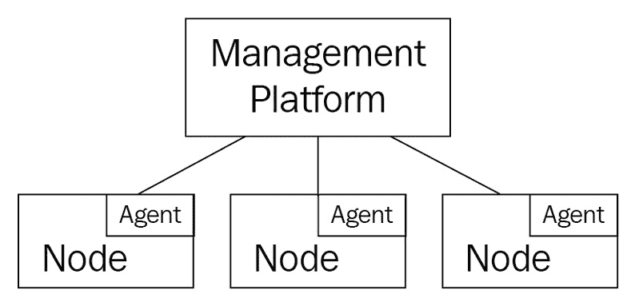

图 11.1 - 管理平台需要代理连接到需要编排和自动化的对象

在这些系统中，代理有双重目的。它们在这里运行需要在本地运行的任何东西，并不断监视系统的变化。这种变化跟踪能力可以通过不同的方式实现，但结果是相似的 - 中央系统将知道发生了什么变化以及以何种方式发生了变化。变化跟踪在部署中是一件重要的事情，因为它能够实时进行合规性检查，并防止由未经授权的变化引起的许多问题。

### 无代理系统

无代理系统的行为不同。在需要管理的系统上没有安装任何东西；相反，中央服务器（或服务器）使用某种命令和控制通道执行所有操作。在 Windows 上，这可能是**PowerShell**，**WinRM**或类似的东西，而在 Linux 上，通常是**SSH**或其他远程执行框架。中央服务器创建一个任务，然后通过远程通道执行，通常以脚本的形式在目标系统上复制并启动。这就是这个原则的样子：

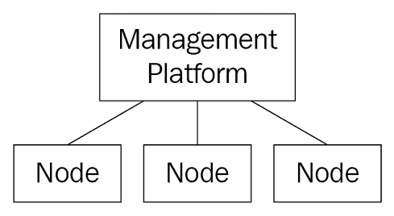

图 11.2 - 管理平台不需要代理连接需要编排和自动化的对象

无论其类型如何，这些系统通常被称为自动化或配置管理系统，尽管这两者是两个事实上的标准，但在现实中它们被不加区分地使用。在撰写本文时，最受欢迎的两个是 Puppet 和 Ansible，尽管还有其他的（Chef、SaltStack 等）。

在本章中，我们将介绍 Ansible，因为它易于学习，无代理，并且在互联网上有大量用户。

## Ansible 介绍

Ansible 是一个 IT 自动化引擎 - 有些人称其为自动化框架 - 它使管理员能够自动化配置、配置管理和许多系统管理员可能需要完成的日常任务。

关于 Ansible 最简单（也太过简化）的思考方式是，它是一组复杂的脚本，旨在以大规模的方式（无论是在复杂性还是它可以控制的系统数量方面）完成管理任务。Ansible 运行在一个安装了 Ansible 系统所有部分的简单服务器上。它不需要在所控制的机器上安装任何东西。可以说 Ansible 完全无代理，并且为了实现其目标，它使用不同的方式连接到远程系统并向其推送小型脚本。

这也意味着 Ansible 无法检测所控制系统上的变化；完全取决于我们创建的配置脚本来控制如果某些情况不如预期发生时会发生什么。

在做其他事情之前，我们需要定义一些东西 - 我们可以将其视为*构建块*或模块。Ansible 喜欢称自己为一个根本简单的 IT 引擎，它只有几个使其能够工作的这些构建块。

首先，它有**清单** - 定义了某个任务将在哪些主机上执行的主机列表。主机在一个简单的文本文件中定义，可以是一个简单的包含每行一个主机的直接列表，也可以是一个在 Ansible 执行任务时创建的动态清单。我们将在展示它们如何使用时更详细地介绍这些内容。要记住的是，主机在文本文件中定义，没有涉及数据库（尽管可以有），主机可以被分组，这是一个你会广泛使用的功能。

其次，有一个称为*play*的概念，我们将其定义为 Ansible 在目标主机上运行的一组不同任务。我们通常使用一个 playbook 来启动一个 play，这是 Ansible 层次结构中的另一种对象。

就 playbooks 而言，将它们视为一项政策或一组任务/操作，这些任务/操作需要在特定系统上执行某些操作或达到某种状态。Playbooks 也是文本文件，专门设计为可读性强，由人类创建。Playbooks 用于定义配置或更准确地说是声明配置。它们可以包含以有序方式启动不同任务的步骤。这些步骤称为 plays，因此得名 playbook。Ansible 文档对此有所帮助，将 plays 比作体育比赛中提供的任务清单，并需要进行记录，但同时可能不会被调用。在这里需要理解的重要一点是，我们的 playbooks 可以在其中包含决策逻辑。

Ansible 拼图的第四个重要部分是它的模块。将模块视为在您试图控制的机器上执行的小程序，以实现某些目标。Ansible 软件包中包含了数百个模块，它们可以单独使用或在您的 playbooks 中使用。

模块允许我们完成任务，其中一些模块是严格声明性的。其他模块返回数据，要么作为模块执行的任务的结果，要么作为模块通过称为事实收集的过程从运行中的系统获取的显式数据。这个过程基于一个称为`gather_facts`的模块。收集关于系统的正确事实是我们开始开发自己的 playbooks 后可以做的最重要的事情之一。

以下架构显示了所有这些部分如何一起工作：

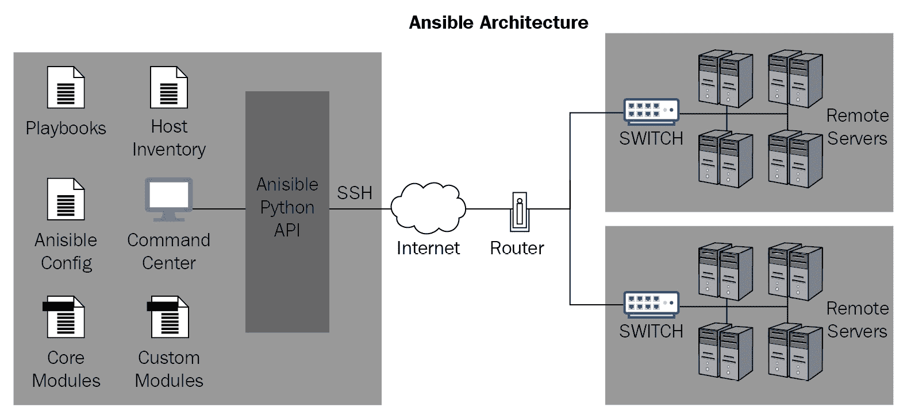

图 11.3 - Ansible 架构 - Python API 和 SSH 连接

在 IT 领域工作的人普遍认为，通过 Ansible 进行管理比通过其他工具更容易，因为它不需要您在设置或 playbook 开发上浪费几天的时间。然而，不要误解：您必须学习如何使用 YAML 语法来广泛使用 Ansible。也就是说，如果您对基于 GUI 的方法感兴趣，您可以考虑购买 Red Hat Ansible Tower。

Ansible Tower 是一个基于 GUI 的实用工具，您可以使用它来管理基于 Ansible 的环境。这最初是一个名为 AWX 的项目，今天仍然非常活跃。但是 AWX 发布的方式与 Ansible Tower 发布的方式有一些关键区别。主要区别在于 Ansible Tower 使用特定的发布版本，而 AWX 采用了更像是 OpenStack 的方法 - 一个项目在快速前进并经常发布新版本。

正如 Red Hat 在[`www.ansible.com/products/awx-project/faq`](https://www.ansible.com/products/awx-project/faq)上明确说明的那样：

“Ansible Tower 是通过选择 AWX 的特定版本、加固以支持长期可维护性，并将其作为 Ansible Tower 产品提供给客户而生产的。”

基本上，AWX 是一个社区支持的项目，而 Red Hat 直接支持 Ansible Tower。以下是来自 Ansible AWX 的屏幕截图，这样您就可以看到 GUI 的样子：

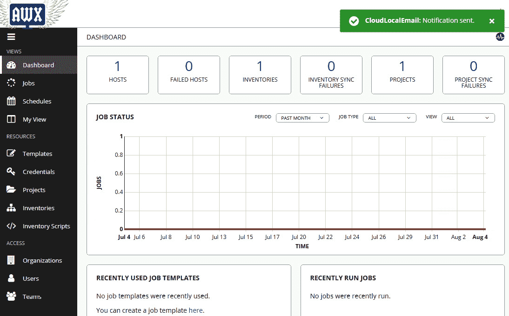

图 11.4 - Ansible AWX GUI for Ansible

还有其他可用于 Ansible 的 GUI，例如 Rundeck、Semaphore 等。但不知何故，AWX 似乎是那些不想为 Ansible Tower 支付额外费用的用户最合乎逻辑的选择。在继续进行常规的 Ansible 部署和使用之前，让我们花点时间来研究 AWX。

## 部署和使用 AWX

AWX 被宣布为一个开源项目，为开发人员提供对 Ansible Tower 的访问，无需许可证。与几乎所有其他红帽项目一样，这个项目也旨在弥合付费产品和社区驱动项目之间的差距，后者在较小的规模上具有几乎所有所需的功能，但没有为企业客户提供的所有功能。但这并不意味着 AWX 在任何方面都是一个*小*项目。它构建了 Ansible 的功能，并启用了一个简单的 GUI，帮助您在 Ansible 部署中运行所有内容。

我们这里没有足够的空间来演示它的外观和用途，所以我们只会介绍安装和部署最简单的场景。

谈到 AWX 时，我们需要知道的最重要的地址是[`github.com/ansible/awx`](https://github.com/ansible/awx)。这是项目所在的地方。最新的信息在这里，在`readme.md`中，在 GitHub 页面上显示。如果您不熟悉从 GitHub 克隆，不用担心-我们基本上只是从一个特殊的源复制，这将使您只能复制自上次获取文件版本以来发生变化的内容。这意味着为了更新到新版本，您只需要再次使用完全相同的命令克隆一次。

在 GitHub 页面上，有一个直接链接到我们将要遵循的安装说明。请记住，这次部署是从头开始的，因此我们需要再次构建我们的演示机器，并安装所有缺少的东西。

我们需要做的第一件事是获取必要的 AWX 文件。让我们将 GitHub 存储库克隆到我们的本地磁盘上：

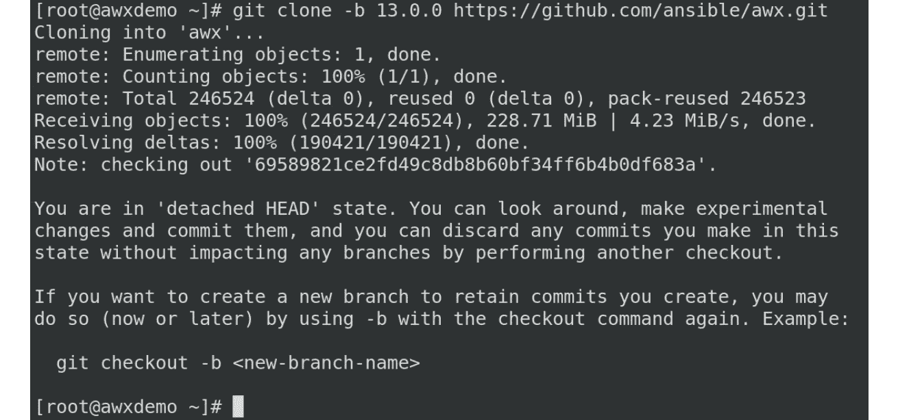

图 11.5-Git 克隆 AWX 文件

请注意，我们使用 13.0.0 作为版本号，因为这是撰写时 AWX 的当前版本。

然后，我们需要解决一些依赖关系。显然，AWX 需要 Ansible、Python 和 Git，但除此之外，我们还需要支持 Docker，并且我们需要 GNU Make 来准备一些文件。我们还需要一个环境来运行我们的虚拟机。在本教程中，我们选择了 Docker，因此我们将使用 Docker Compose。

此外，这也是一个好地方提到，我们的机器至少需要 4GB 的 RAM 和 20GB 的空间才能运行 AWX。这与我们习惯使用的低占用空间有所不同，但这是有道理的，因为 AWX 不仅仅是一堆脚本。让我们从安装先决条件开始。

Docker 是我们将安装的第一个软件。我们在这里使用 CentOS 8，因此 Docker 不再是默认软件包的一部分。因此，我们需要添加存储库，然后安装 Docker 引擎。我们将使用`-ce`软件包，代表 Community Edition。我们还将使用`--nobest`选项来安装 Docker-如果没有此选项，CentOS 将报告我们缺少一些依赖项：

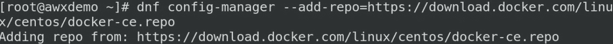

图 11.6-在 CentOS 8 上部署 docker-ce 软件包

之后，我们需要运行以下命令：

```
dnf install docker-ce -y --nobest
```

总体结果应该看起来像这样。请注意，您特定安装的每个软件包的版本可能会有所不同。这是正常的，因为软件包一直在变化：

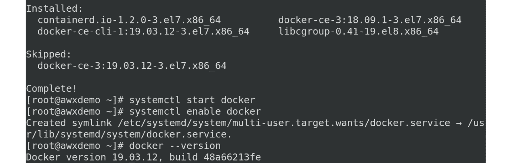

图 11.7-启动和启用 Docker 服务

然后，我们将使用以下命令安装 Ansible 本身：

```
dnf install ansible
```

如果您正在运行完全干净的 CentOS 8 安装，可能需要在可用 Ansible 之前安装`epel-release`。

接下来是 Python。仅使用`dnf`命令不会安装 Python，因为我们将不得不提供我们想要的 Python 版本。为此，我们会做这样的事情：

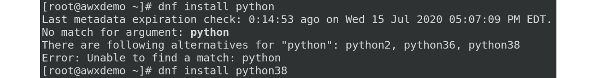

图 11.8-安装 Python；在这种情况下，版本 3.8

之后，我们将使用 pip 安装 Python 的 Docker 组件。只需输入`pip3 install docker`，您需要的一切都将被安装。

我们还需要安装`make`包：

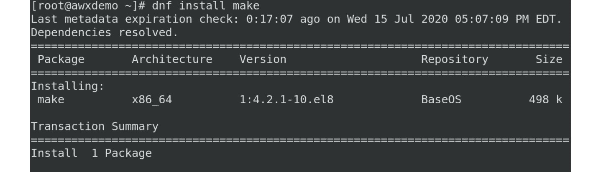

图 11.9-部署 GNU Make

现在，是时候进行 Docker Compose 部分了。我们需要运行`pip3 install docker-compose`命令来安装 Python 部分，以及以下命令来安装 docker-compose：

```
curl -L https://github.com/docker/compose/releases/download/1.25.0/docker-compose-`uname -s`-`uname -m` -o /usr/local/bin/docker-compose
```

这个命令将从 GitHub 获取必要的安装文件，并使用必要的输入参数（通过执行`uname`命令）来启动 docker-compose 的安装过程。

我们知道这是很多依赖关系，但是 AWX 在内部是一个非常复杂的系统。然而，在表面上，事情并不那么复杂。在我们进行最后的安装之前，我们需要验证我们的防火墙是否已停止并且已禁用。我们正在创建一个演示环境，`firewalld`将阻止容器之间的通信。一旦系统运行起来，我们可以稍后解决这个问题。

一旦一切都运行起来，安装 AWX 就很简单。只需转到`awx/installer`目录并运行以下命令：

```
ansible-playbook -i inventory -e docker_registry_password=password install.yml
```

安装应该需要几分钟。结果应该是一个以以下内容结尾的长列表：

```
PLAY RECAP *********************************************************************
localhost  : ok=16   changed=8    unreachable=0    failed=0    skipped=86   rescued=0    ignored=0   
```

这意味着本地 AWX 环境已成功部署。

现在，有趣的部分开始了。AWX 由四个小的 Docker 图像组成。为了使其工作，所有这些图像都需要配置和运行。您可以使用`docker ps`和`docker logs -t awx_task`来查看它们。

第一个命令列出了部署的所有图像，以及它们的状态：

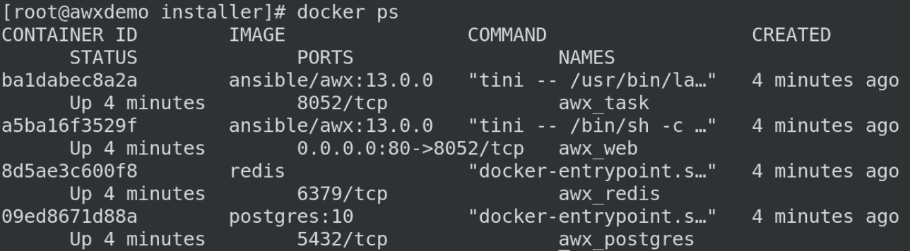

图 11.10-检查拉取和启动的 docker 图像

第二个命令向我们显示了`awx_task`机器正在创建的所有日志。这些是整个系统的主要日志。一段时间后，初始配置将完成：

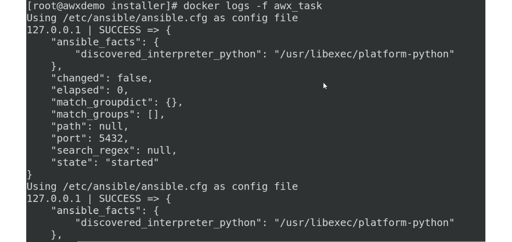

图 11.11-检查 awx_task 日志

将有大量的日志记录，您将不得不使用*Ctrl + C*来中断此命令。

在整个过程之后，我们可以将我们的 Web 浏览器指向`http://localhost`。我们应该会看到一个看起来像这样的屏幕：

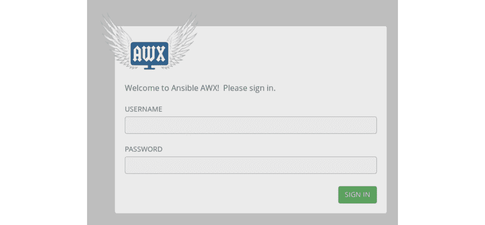

图 11.12-AWX 默认登录屏幕

默认用户名是`admin`，密码是`password`。成功登录后，我们应该会看到以下 UI：

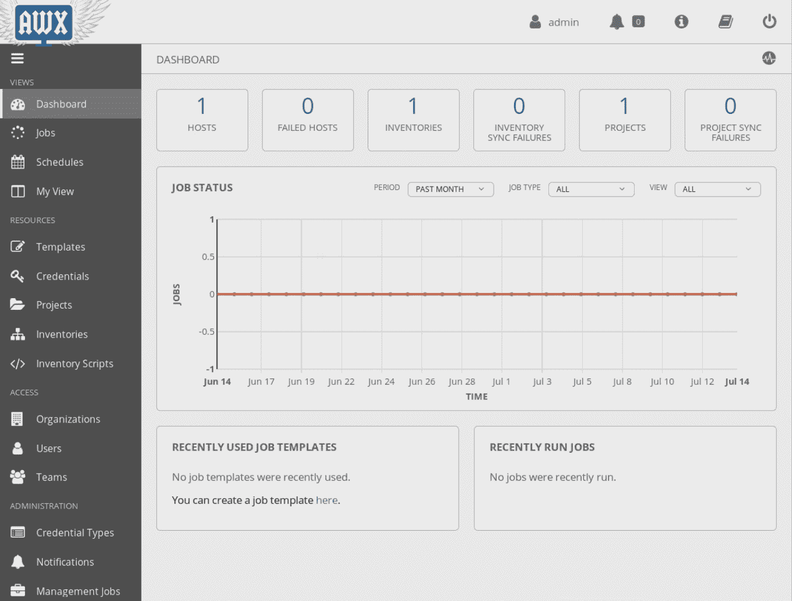

图 11.13-登录后的初始 AWX 仪表板

这里有很多东西需要学习，所以我们只会简单介绍一下基础知识。基本上，AWX 代表的是 Ansible 的智能 GUI。如果我们快速打开**模板**（在窗口的左侧）并查看**演示**模板，我们就可以看到这一点：

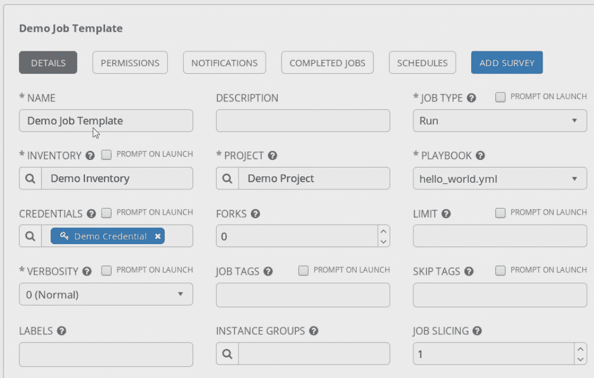

图 11.14-在 AWX 中使用演示模板

我们将在本章的下一部分更加熟悉这里看到的内容，当我们部署 Ansible 时。所有这些属性都是 Ansible playbook 的不同部分，包括 playbook 本身、清单、使用的凭据以及使使用 Ansible 变得更容易的其他一些东西。如果我们向下滚动一点，那里应该有三个按钮。按`job`：


图 11.15 – 通过单击启动按钮，我们可以启动我们的模板作业

这个想法是我们可以创建模板并随时运行它们。运行它们后，运行的结果将出现在**作业**下（在窗口左侧的第二个项目中找到）：

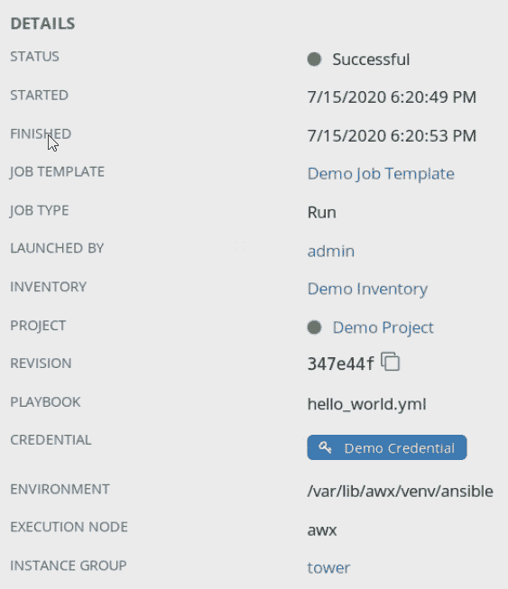

图 11.16 – 模板作业详情

作业的详细信息基本上是发生了什么，何时发生，以及使用了哪些 Ansible 元素的总结。我们还可以看到我们刚刚运行的 playbook 的实际结果：

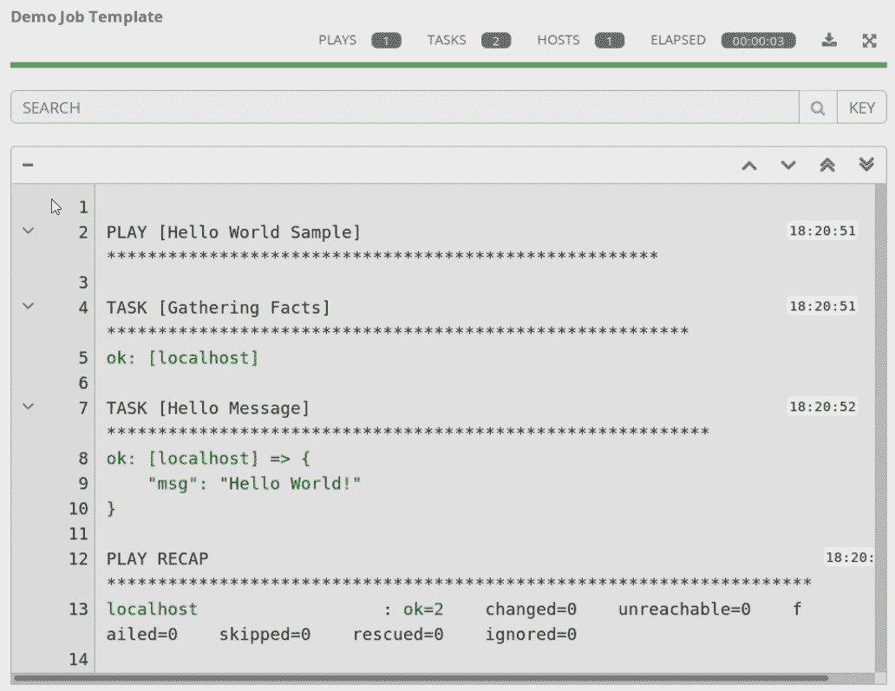

图 11.17 – 检查演示作业模板的文本输出

AWX 的真正作用是自动化自动化。它使您能够在使用 Ansible 时更加高效，因为它为 Ansible 使用的不同文件提供了一个更直观的界面。它还使您能够跟踪已完成的工作及其时间，以及结果是什么。所有这些都可以使用 Ansible CLI 实现，但 AWX 在我们控制整个过程的同时节省了大量精力。

当然，因为本章的目标是使用 Ansible，这意味着我们需要部署所有必要的软件包，以便我们可以使用它。因此，让我们继续进行我们的 Ansible 过程的下一个阶段，并部署 Ansible。

## 部署 Ansible

在所有设计用于编排和系统管理的类似应用程序中，Ansible 可能是最简单的安装。由于它在管理的系统上不需要代理，因此安装仅限于一台机器 - 将运行所有脚本和 playbook 的机器。默认情况下，Ansible 使用 SSH 连接到机器，因此其使用的唯一先决条件是我们的远程系统上有一个正在运行的 SSH 服务器。

除此之外，没有数据库（Ansible 使用文本文件），没有守护程序（Ansible 按需运行），也没有管理 Ansible 本身的必要。由于没有后台运行任何东西，因此可以轻松升级 Ansible - 唯一可能改变的是 playbook 的结构方式，而这可以很容易地修复。Ansible 基于 Python 编程语言，但其结构比标准 Python 程序更简单。配置文件和 playbook 要么是简单的文本文件，要么是 YAML 格式的文本文件，YAML 是用于定义数据结构的文件格式。学习 YAML 超出了本章的范围，因此我们只是假设您了解简单的数据结构。我们将使用的 YAML 文件示例足够简单，几乎不需要解释，但如果需要，我们会提供解释。

安装可以简单地运行以下命令：

```
yum install ansible 
```

您可以以 root 用户身份运行此命令，也可以使用以下命令：

```
apt install ansible 
```

选择取决于您的发行版（Red Hat/CentOS 或 Ubuntu/Debian）。更多信息可以在 Ansible 网站上找到[`docs.ansible.com/`](https://docs.ansible.com/)。

RHEL8 用户首先需要启用包含 Ansible RPM 的存储库。在撰写本文时，可以通过运行以下命令来实现：

```
sudo subscription-manager repos --enable ansible-2.8-for-rhel-8-x86_64-rpms
```

运行上述命令后，使用以下代码：

```
dnf install ansible
```

这就是安装 Ansible 所需的全部内容。

有一件事可能会让您感到惊讶，那就是安装的大小：它确实如此小（约 20 MB），并且会根据需要安装 Python 依赖项。

安装了 Ansible 的机器也被称为*控制节点*。它必须安装在 Linux 主机上，因为 Windows 不支持这个角色。Ansible 控制节点可以在虚拟机内运行。

我们控制的机器称为受控节点，默认情况下，它们是通过`SSH`协议控制的 Linux 系统。有一些模块和插件可以扩展到 Windows 和 macOS 操作系统，以及其他通信渠道。当你开始阅读 Ansible 文档时，你会注意到大多数支持多个架构的模块都有清晰的说明，关于如何在不同的操作系统上完成相同的任务。

我们可以使用`/etc/ansible/ansible`来配置 Ansible 的设置。这个文件包含了定义默认值的参数，并且本身包含了很多被注释掉的行，但包含了 Ansible 用于工作的所有默认值。除非我们改变了什么，否则这些值就是 Ansible 要使用的值。让我们实际使用 Ansible 来看看所有这些是如何配合在一起的。在我们的场景中，我们将使用 Ansible 来通过其内置模块配置虚拟机。

# 使用 kvm_libvirt 模块配置虚拟机

一个你可能会或可能不会包括的设置是定义 SSH 如何用于连接 Ansible 将要配置的机器。在我们这样做之前，我们需要花一点时间来谈谈安全和 Ansible。与几乎所有与 Linux（或`*nix`一般）相关的事物一样，Ansible 不是一个集成的系统，而是依赖于已经存在的不同服务。为了连接到它管理的系统并执行命令，Ansible 依赖于`SSH`（在 Linux 中）或其他系统，如 Windows 上的**WinRM**或**PowerShell**。我们将在这里专注于 Linux，但请记住，关于 Ansible 的相当多的信息是完全与系统无关的。

`SSH`是一个简单但非常强大的协议，它允许我们通过安全通道传输数据（安全 FTP，SFTP 等）并在远程主机上执行命令（`SSH`）。Ansible 直接使用 SSH 连接，然后执行命令和传输文件。当然，这意味着为了使 Ansible 工作，SSH 至关重要。

使用`SSH`连接时需要记住的几件事：

+   第一个是密钥指纹，从 Ansible 控制节点（服务器）看到的。在首次建立连接时，`SSH`要求用户验证和接受远程系统呈现的密钥。这旨在防止中间人攻击，并且在日常使用中是一个很好的策略。但如果我们处于必须配置新安装系统的位置，*所有*它们都将要求我们接受它们的密钥。这是耗时且复杂的，一旦我们开始使用 playbooks，就很难做到，所以你可能会开始的第一个 playbook 是禁用密钥检查和登录到机器。当然，这只应该在受控环境中使用，因为这会降低整个 Ansible 系统的安全性。

+   第二件你需要知道的事情是 Ansible 作为一个普通用户运行。话虽如此，也许我们不想以当前用户连接到远程系统。Ansible 通过在单独的计算机或组上设置一个变量来解决这个问题，该变量指示系统将用于连接到这台特定计算机的用户名。连接后，Ansible 允许我们以完全不同的用户身份在远程系统上执行命令。这是一个常用的功能，因为它使我们能够完全重新配置机器并像在控制台上一样更改用户。

+   第三件我们需要记住的事情是密钥 - `SSH`可以通过交互式身份验证登录，意思是通过密码或使用一次交换的预共享密钥来建立 SSH 会话。还有`ssh-agent`，它可以用于身份验证会话。

虽然我们可以在清单文件（或特殊的密钥库）中使用固定密码，但这是一个坏主意。幸运的是，Ansible 使我们能够脚本化许多事情，包括将密钥复制到远程系统。这意味着我们将有一些 playbooks 来自动部署新系统，并且这些将使我们能够控制它们进行进一步的配置。

总之，部署系统的 Ansible 步骤可能会像这样开始：

1.  安装核心系统，并确保`SSHD`正在运行。

1.  定义一个在系统上具有管理员权限的用户。

1.  从控制节点运行一个播放列表，将建立初始连接并将本地的`SSH`密钥复制到远程位置。

1.  使用适当的 playbooks 来安全地重新配置系统，而无需在本地存储密码。

现在，让我们深入了解一下。

每个合理的管理者都会告诉你，为了做任何事情，你需要定义问题的范围。在自动化中，这意味着定义 Ansible 将要处理的系统。这是通过位于`/etc/Ansible`的清单文件`hosts`完成的。

`Hosts`可以被分组或单独命名。在文本格式中，可以这样写：

```
[servers]
srv1.local
srv2.local
srv3.local
[workstations]
wrk1.local
wrk2.local
wrk3.local
```

计算机可以同时属于多个组，组也可以是嵌套的。

我们在这里使用的格式是纯文本。让我们用 YAML 来重写这个：

```
All:
  Servers:
     Hosts:
	Srv1.local:
Srv2.local:
Srv3.local:
 Workstations:
     Hosts:
	Wrk1.local:
Wrk2.local:
Wrk3.local:
Production:
   Hosts:
	Srv1.local:
	Workstations:
```

重要提示

我们创建了另一个名为 Production 的组，其中包含所有工作站和一个服务器。

任何不属于默认或标准配置的内容都可以作为变量单独包含在主机定义或组定义中。每个 Ansible 命令都有一些方式可以在配置或清单中部分或完全覆盖所有项目的灵活性。

清单支持主机定义中的范围。我们之前的示例可以写成如下形式：

```
[servers]
Srv[1:3].local
[workstations]
Wrk[1:3].local
```

这也适用于字符，所以如果我们需要定义名为`srva`、`srvb`、`srvc`和`srvd`的服务器，我们可以通过以下方式来说明：

```
srv[a:d]
```

也可以使用 IP 范围。因此，例如，`10.0.0.0/24`将被写成如下形式：

```
10.0.0.[1:254]
```

还有两个预定义的默认组也可以使用：`all`和`ungrouped`。顾名思义，如果我们在 playbook 中引用`all`，它将在清单中的每台服务器上运行。`Ungrouped`将仅引用那些不属于任何组的系统。

未分组的引用在设置新计算机时特别有用-如果它们不属于任何组，我们可以将它们视为*新*，并设置它们加入特定的组。

这些组是隐式定义的，无需重新配置它们，甚至在清单文件中提及它们。

我们提到清单文件可以包含变量。当我们需要在计算机组、用户、密码或特定于该组的设置中定义一个属性时，变量是有用的。假设我们想要定义一个将在`servers`组上使用的用户：

1.  首先，我们定义一个组：

```
[servers]
srv[1:3].local
```

1.  然后，我们定义将用于整个组的变量：

```
[servers:vars]
ansible_user=Ansibleuser
ansible_connection=ssh
```

当要求执行 playbook 时，这将使用名为`Ansibleuser`的用户使用`SSH`进行连接。

重要提示

请注意，密码不在此处出现，如果密码没有单独提及或密钥在此之前没有交换，此 playbook 将失败。有关变量及其使用的更多信息，请参阅 Ansible 文档。

现在我们已经创建了我们的第一个实用的 Ansible 任务，是时候谈谈如何让 Ansible 一次执行多个任务了，同时使用更*客观*的方法。能够创建单个任务或一对任务，并通过一个称为*playbook*的概念将它们组合起来是非常重要的。

## 使用 playbooks

一旦我们决定如何连接到我们打算管理的机器，并且一旦我们创建了清单，我们就可以开始实际使用 Ansible 来做一些有用的事情。这就是 playbooks 开始变得有意义的地方。

在我们的示例中，我们配置了四台 CentOS7 系统，为它们分配了连续的地址范围内的地址`10.0.0.1`到`10.0.0.4`，并将它们用于一切。

Ansible 已安装在 IP 地址为`10.0.0.1`的系统上，但正如我们已经说过的，这完全是任意的。Ansible 在用作控制节点的系统上占用空间很小，并且只要它与我们打算管理的网络的其余部分有连接，就可以安装在任何系统上。我们只是选择了我们小型网络中的第一台计算机。还要注意的一件事是，控制节点可以通过 Ansible 自身进行控制。这很有用，但同时也不是一个明智的做法。根据您的设置，您不仅要测试 playbooks，还要测试部署到其他机器之前的单个命令-在控制服务器上进行这样的操作是不明智的。

现在 Ansible 已安装，我们可以尝试使用它做一些事情。Ansible 有两种不同的运行方式。一种是运行 playbook，其中包含要执行的任务。另一种方式是使用单个任务，有时称为**临时**执行。无论哪种方式都有使用 Ansible 的原因- playbooks 是我们的主要工具，你可能会大部分时间使用它们。但临时执行也有其优势，特别是如果我们有兴趣做一些我们需要一次完成的事情，但是要跨多台服务器进行。一个典型的例子是使用一个简单的命令来检查已安装应用程序的版本或应用程序状态。如果我们需要检查某些东西，我们不会编写一个 playbook。

为了查看一切是否正常工作，我们将从简单地使用 ping 开始，以检查机器是否在线。

Ansible 喜欢称自己为*根本简单的自动化*，我们要做的第一件事就证明了这一点。

我们将使用一个名为 ping 的模块，该模块尝试连接到主机，验证它是否可以在本地 Python 环境中运行，并在一切正常时返回一条消息。不要将此模块与 Linux 中的`ping`命令混淆；我们不是通过网络进行 ping 操作；我们只是从控制节点向我们试图控制的服务器进行*ping*。我们将使用一个简单的`ansible`命令来 ping 所有已定义的主机，发出以下命令：

```
ansible all -m ping
```

运行上述命令的结果如下：

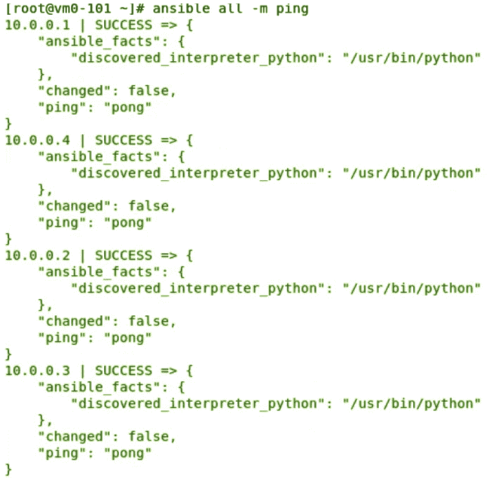

图 11.18-我们的第一个 Ansible 模块-ping，检查 Python 并报告其状态

我们在这里做的是运行一个名为`ansible all -m ping`的单个命令。

`ansible`是可用的最简单的命令，运行单个任务。`all`参数表示在清单中的所有主机上运行它，`-m`用于调用将要运行的模块。

这个特定的模块没有参数或选项，所以我们只需要运行它以获得结果。结果本身很有趣；它是以 YAML 格式呈现的，并包含除命令结果之外的一些内容。

如果我们仔细看一下，我们会发现 Ansible 为清单中的每个主机返回了一个结果。我们可以看到的第一件事是命令的最终结果-`SUCCESS`表示任务本身顺利运行。之后，我们可以看到一个数组形式的数据-`ansible_facts`包含模块返回的信息，在编写 playbooks 时被广泛使用。以这种方式返回的数据可能会有所不同。在下一节中，我们将展示一个更大的数据集，但在这种特殊情况下，显示的唯一内容是 Python 解释器的位置。之后，我们有`changed`变量，这是一个有趣的变量。

当 Ansible 运行时，它会尝试检测它是否正确运行以及是否已更改系统状态。在这个特定的任务中，运行的命令只是提供信息，并不会更改系统上的任何内容，因此系统状态没有改变。

换句话说，这意味着运行的任何命令都没有安装或更改系统上的任何内容。在以后需要检查某些东西是否已安装或未安装（例如服务）时，状态将更有意义。

我们可以看到的最后一个变量是`ping`命令的返回。它简单地声明**pong**，因为这是模块在一切设置正确时给出的正确答案。

让我们做类似的事情，但这次带有一个参数，比如我们希望在远程主机上执行的临时命令。因此，请输入以下命令：

```
ansible all -m shell -a "hostname"
```

以下是输出：

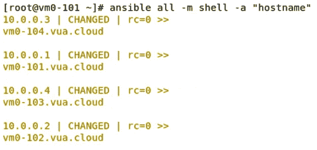

图 11.19 - 使用 Ansible 在 Ansible 目标上显式执行特定命令

在这里，我们调用了另一个名为`shell`的模块。它只是将给定的参数作为 shell 命令运行。返回的是本地主机名。这在功能上与我们使用`SSH`连接到清单中的每个主机，执行命令，然后注销的操作是一样的。

对于 Ansible 可以做的简单演示来说，这是可以的，但让我们做一些更复杂的事情。我们将使用一个特定于 CentOS/Red Hat 的名为`yum`的模块来检查我们的主机上是否安装了 Web 服务器。我们要检查的 Web 服务器将是`lighttpd`，因为我们想要轻量级的东西。

当我们谈到状态时，我们触及了一个起初有点令人困惑，但一旦开始使用就非常有用的概念。当调用这样的命令时，我们正在声明一个期望的状态，因此如果状态不是我们要求的状态，系统本身将发生变化。这意味着，在这个例子中，我们实际上并不是在测试`lighttpd`是否已安装 - 我们是在告诉 Ansible 去检查它，如果它没有安装就安装它。即使这也不完全正确 - 该模块接受两个参数：服务的名称和它应该处于的状态。如果我们检查的系统状态与调用模块时发送的状态相同，我们将得到`changed: false`，因为没有发生任何变化。但是，如果系统的状态不同，Ansible 将使系统的当前状态与我们请求的状态相同。

为了证明这一点，我们将看看服务在 Ansible 术语中是*未*安装或*不存在*的。请键入以下命令：

```
ansible all -m yum -a "name=lighttpd state=absent" 
```

这是运行前述命令后应该得到的结果：

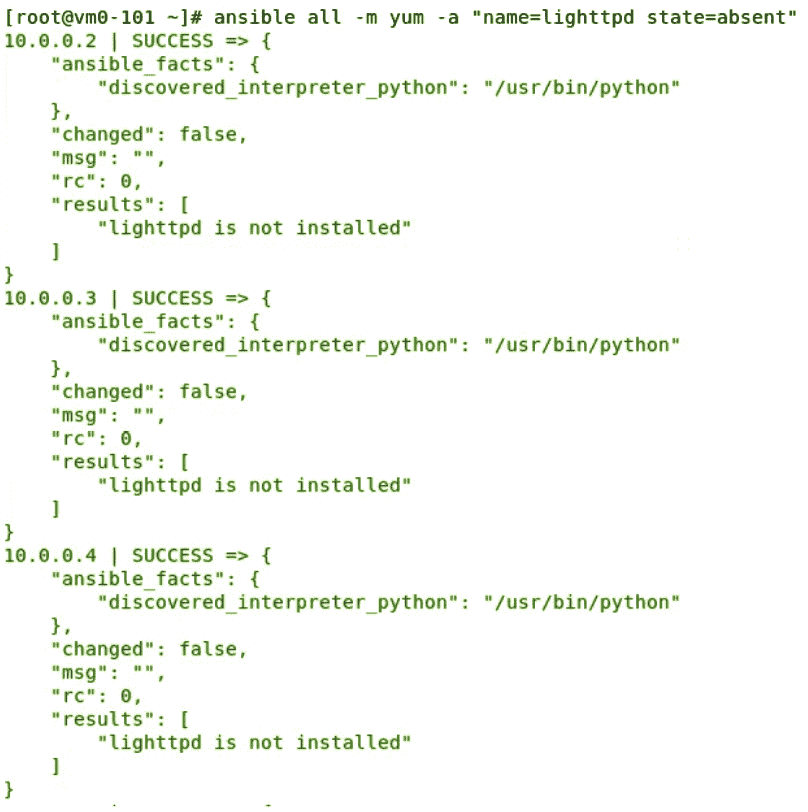

图 11.20 - 使用 Ansible 检查服务状态

然后，我们可以说我们希望它出现在系统上。Ansible 将根据需要安装服务：

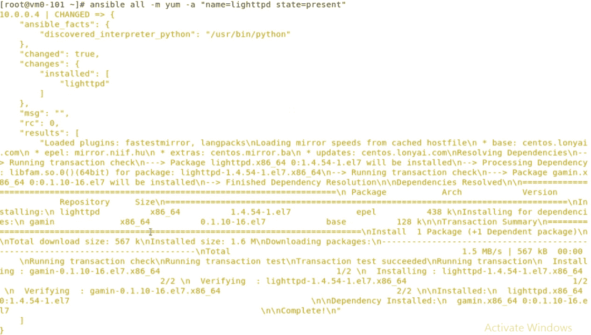

图 11.21 - 在所有 Ansible 目标上使用 yum install 命令

在这里，我们可以看到 Ansible 只是检查并安装了服务，因为它之前不存在。它还为我们提供了其他有用的信息，比如系统上做了什么更改以及它执行的命令的输出。信息以变量数组的形式提供；这通常意味着我们需要进行一些字符串操作，以使其看起来更好。

现在，让我们再次运行该命令：

```
ansible all -m yum -a "name=lighttpd state=absent" 
```

这应该是结果：

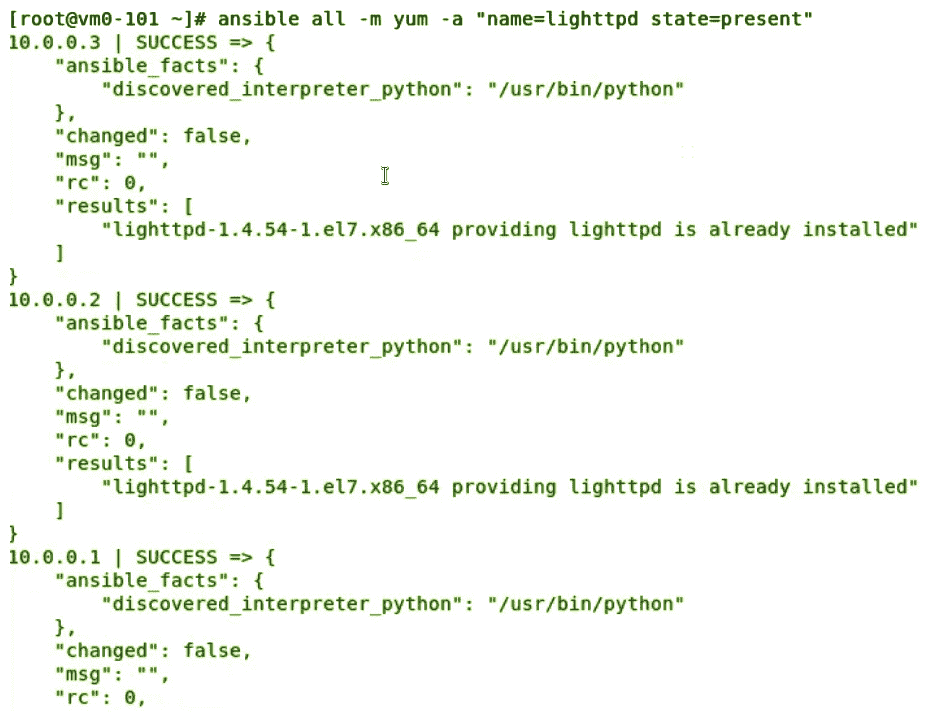

图 11.22 - 在服务安装后使用 Ansible 检查服务状态

正如我们所看到的，这里没有任何变化，因为服务已安装。

这些只是一些起步示例，以便我们能够稍微了解一下 Ansible。现在，让我们扩展一下，并创建一个 Ansible playbook，它将在我们预定义的一组主机上安装 KVM。

## 安装 KVM

现在，让我们创建我们的第一个 playbook，并使用它在所有主机上安装 KVM。对于我们的 playbook，我们使用了 GitHub 存储库中的一个很好的例子，由 Jared Bloomer 创建，我们稍微修改了一下，因为我们已经配置了我们的选项和清单。原始文件可在[`github.com/jbloomer/Ansible---Install-KVM-on-CentOS-7.git`](https://github.com/jbloomer/Ansible---Install-KVM-on-CentOS-7.git)找到。

这个 playbook 将展示我们需要了解的关于自动化简单任务的一切。我们选择了这个特定的例子，因为它不仅展示了自动化的工作原理，还展示了如何创建单独的任务并在不同的 playbook 中重用它们。使用公共存储库的一个额外好处是你将始终获得最新版本，但它可能与这里呈现的版本有很大不同：

1.  首先，我们创建了我们的主要 playbook – 将被调用的那个 – 并命名为`installkvm.yaml`：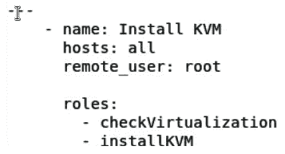

图 11.23–检查虚拟化支持并安装 KVM 的主要 Ansible playbook

正如我们所看到的，这是一个简单的声明，所以让我们逐行分析一下。首先，我们有 playbook 名称，一个可以包含我们想要的任何内容的字符串：

`hosts`变量定义了这个 playbook 将在清单的哪一部分上执行 – 在我们的情况下，是所有主机。我们可以在运行时覆盖这一点（以及所有其他变量），但将 playbook 限制在我们需要控制的主机上是有帮助的。在我们的特定情况下，这实际上是我们清单中的所有主机，但在生产中，我们可能会有多个主机组。

下一个变量是执行任务的用户的名称。我们在这里做的事情在生产中是不推荐的，因为我们使用超级用户帐户来执行任务。Ansible 完全能够使用非特权帐户并在需要时提升权限，但就像所有演示一样，我们会犯错误，这样你就不必犯错误，所有这些都是为了更容易理解事情。

现在是实际执行我们任务的部分。在 Ansible 中，我们为系统声明角色。在我们的例子中，有两个角色。角色实际上只是要执行的任务，这将导致系统处于某种状态。在我们的第一个角色中，我们将检查系统是否支持虚拟化，然后在第二个角色中，我们将在所有支持虚拟化的系统上安装 KVM 服务。

1.  当我们从 GitHub 下载脚本时，它创建了一些文件夹。在名为`roles`的文件夹中，有两个子文件夹，每个文件夹都包含一个文件；一个叫做`checkVirtualization`，另一个叫做`installKVM`。

你可能已经看到这是怎么回事了。首先，让我们看看`checkVirtualization`包含什么：


图 11.24–通过 lscpu 命令检查 CPU 虚拟化

这个任务只是调用一个 shell 命令，并尝试使用`grep`来查找包含 CPU 虚拟化参数的行。如果找不到，它就会失败。

1.  现在，让我们看看另一个任务：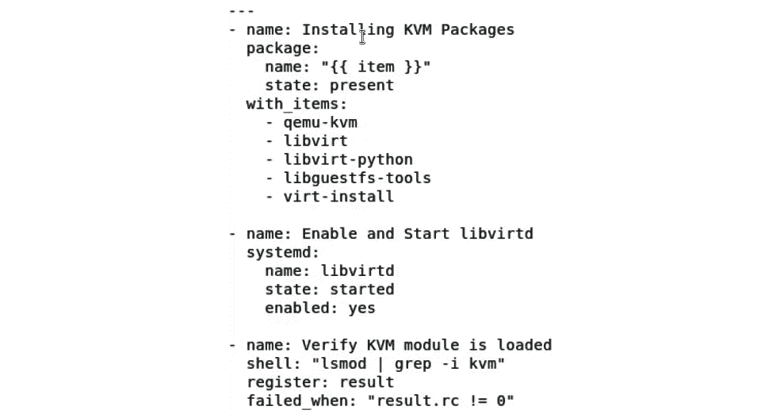

图 11.25–用于安装必要的 libvirt 软件包的 Ansible 任务

第一部分是一个简单的循环，如果它们不存在，将安装五个不同的软件包。我们在这里使用的是包模块，这与我们在第一次演示中如何安装软件包的方法不同。我们在本章早些时候使用的模块称为`yum`，它是特定于 CentOS 作为发行版的。`package`模块是一个通用模块，将转换为特定发行版使用的任何软件包管理器。一旦我们安装了所有需要的软件包，我们需要确保`libvirtd`已启用并已启动。

我们使用一个简单的循环来遍历我们正在安装的所有软件包。这不是必需的，但这比复制和粘贴单个命令更好，因为它使我们需要的软件包列表更加可读。

然后，作为任务的最后一部分，我们验证 KVM 是否已加载。

正如我们所看到的，playbook 的语法很简单。即使是对脚本编程只有少量知识的人也可以轻松阅读。我们甚至可以说，对 Linux 命令行工作原理的深刻理解更为重要。

1.  为了运行 playbook，我们使用`ansible-playbook`命令，后面跟着 playbook 的名称。在我们的情况下，我们将使用`ansible-playbook main.yaml`命令。这里是结果：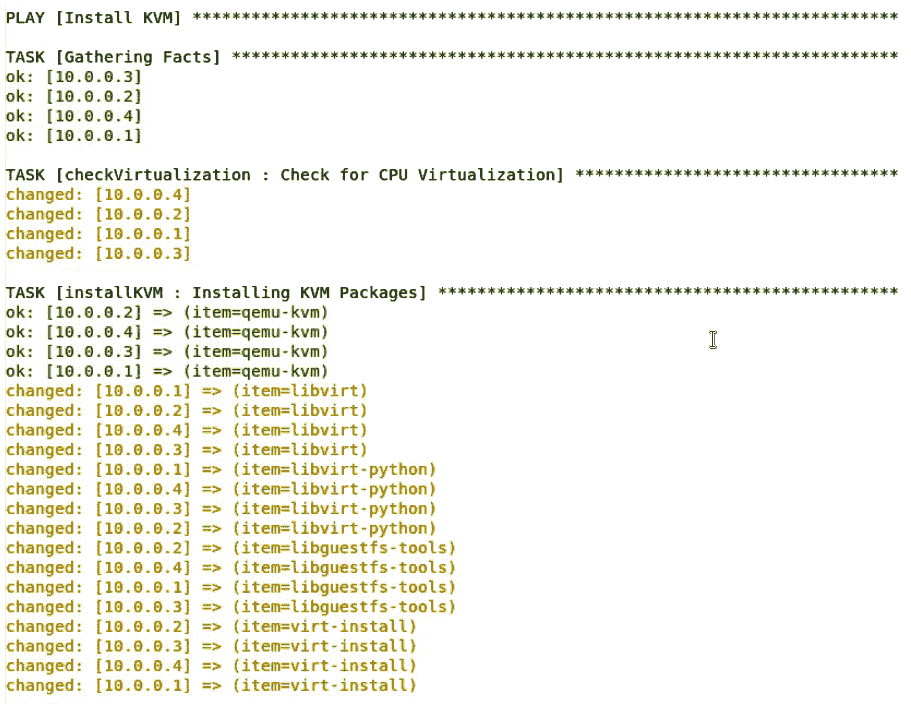

图 11.26 - 交互式 Ansible playbook 监控

1.  在这里，我们可以看到 Ansible 将在每个主机上做的每一项更改进行了详细的拆分。最终结果是成功的：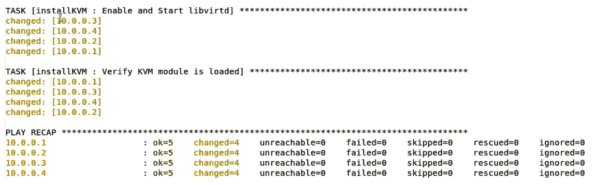

图 11.27 - Ansible playbook 报告

现在，让我们检查我们新安装的 KVM *集群*是否正常工作。

1.  我们将启动`virsh`并列出集群各部分的活动 VM：

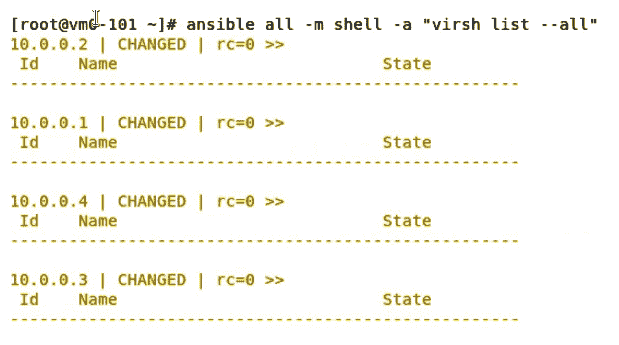

图 11.28 - 使用 Ansible 检查所有 Ansible 目标上的虚拟机

完成了这个简单的练习后，我们在四台机器上都运行了 KVM，并且可以从一个地方控制它们。但是我们的主机上还没有运行任何 VM。接下来，我们将向您展示如何在 KVM 环境中创建一个 CentOS 安装，但我们将使用最基本的方法 - `virsh`。

我们将做两件事：首先，我们将从互联网上下载一个 CentOS 的最小 ISO 镜像。然后，我们将调用`virsh`。本书将向您展示完成此任务的不同方法；从互联网上下载是最慢的方法之一：

1.  像往常一样，Ansible 有一个专门用于下载文件的模块。它期望的参数是文件所在的 URL 和保存文件的位置：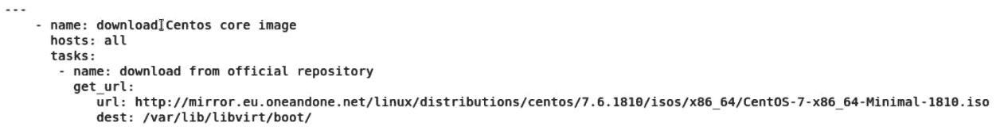

图 11.29 - 在 Ansible playbook 中下载文件

1.  运行 playbook 后，我们需要检查文件是否已经下载：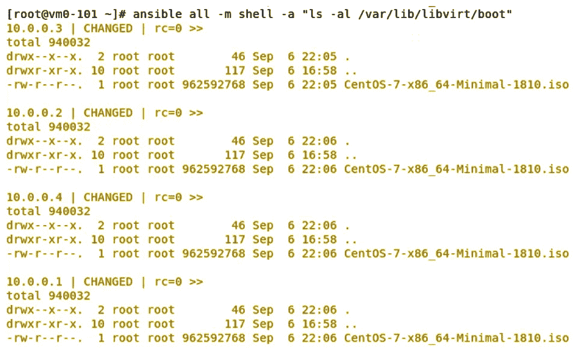

图 11.30 - 状态检查 - 检查文件是否已经下载到我们的目标

1.  由于我们没有自动化这个过程，而是创建了一个单独的任务，我们将在本地 shell 中运行它。要运行此命令，可以使用类似以下的命令：

```
ansible all -m shell -a "virt-install --name=COS7Core --ram=2048 --vcpus=4 --cdrom=/var/lib/libvirt/boot/CentOS-7-x86_64-Minimal-1810.iso --os-type=linux --os-variant=rhel7 --disk path=/var/lib/libvirt/images/cos7vm.dsk,size=6"
```

1.  没有 kickstart 文件或其他类型的预配置，这个 VM 是没有意义的，因为我们将无法连接到它，甚至无法完成安装。在下一个任务中，我们将使用 cloud-init 来解决这个问题。

现在，我们可以检查一切是否都正常工作：

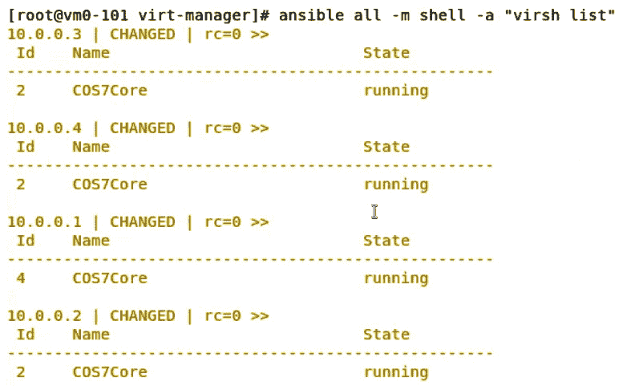

图 11.31 - 使用 Ansible 检查我们的所有 VM 是否正在运行

在这里，我们可以看到所有的 KVM 都在运行，并且每个 KVM 都有自己的虚拟机在线并运行。

现在，我们将清除我们的 KVM 集群，并重新开始，但这次使用不同的配置：我们将部署 CentOS 的云版本，并使用 cloud-init 重新配置它。

## 使用 Ansible 和 cloud-init 进行自动化和编排

**Cloud-init**是私有和混合云环境中机器部署的更受欢迎的方式之一。这是因为它使机器能够快速重新配置，以便启用足够的功能，使它们能够连接到诸如 Ansible 之类的编排环境。

更多细节可以在[cloud-init.io](http://cloud-init.io)找到，但简而言之，cloud-init 是一个工具，可以创建特殊文件，可以与 VM 模板结合，以便快速部署它们。cloud-init 和无人值守安装脚本之间的主要区别在于，cloud-init 更多或更少地与发行版无关，并且更容易使用脚本工具进行更改。这意味着在部署过程中工作量更少，从部署开始到机器在线并工作的时间更短。在 CentOS 上，可以使用 kickstart 文件来实现这一点，但这远不及 cloud-init 灵活。

Cloud-init 使用两个单独的部分工作：一个是我们正在部署的操作系统的分发文件。这不是通常的 OS 安装文件，而是一个特别配置的机器模板，旨在用作 cloud-init 镜像。

系统的另一部分是配置文件，它是从一个包含机器配置的特殊 YAML 文本文件中*编译* - 或者更准确地说，*打包*出来的。这个配置很小，非常适合网络传输。

这两个部分旨在作为一个整体用于创建多个相同虚拟机实例。

它的工作方式很简单：

1.  首先，我们分发一个完全相同的机器模板，用于创建我们将要创建的所有机器。这意味着有一个主模板副本，并且可以从中创建所有实例。

1.  然后，我们将模板与使用 cloud-init 创建的一个特制文件配对。我们的模板，无论使用的操作系统是什么，都能够理解可以在 cloud-init 文件中设置的不同指令，并将被重新配置。这可以根据需要重复进行。

让我们更简化一下：如果我们需要使用无人值守安装文件创建具有四种不同角色的 100 台服务器，我们将不得不启动 100 个镜像，并等待它们逐个完成所有安装步骤。然后，我们需要为我们需要的任务重新配置它们。使用 cloud-init，我们在 100 个实例中启动一个镜像，但系统只需要几秒钟就能启动，因为它已经安装好了。只需要关键信息将其上线，之后我们可以接管并使用 Ansible 完全配置它。

我们不会过多讨论 cloud-init 的配置；我们需要的一切都在这个例子中：

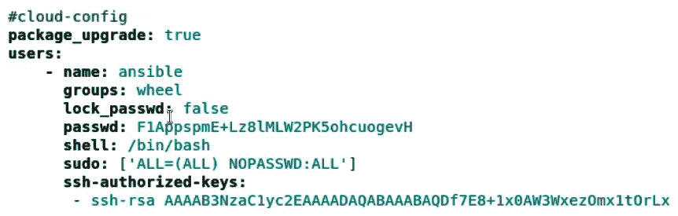

图 11.32 - 使用 cloud-init 进行附加配置

像往常一样，我们将一步一步地解释发生了什么。我们从一开始就可以看到它使用直接的 YAML 表示法，与 Ansible 相同。第一个指令是为了确保我们的机器已更新，因为它可以自动更新云实例上的软件包。

然后，我们正在配置用户。我们将创建一个名为`ansible`的用户，他将属于`wheel`组。

`Lock_passwd`表示我们将允许使用密码登录。如果没有配置任何内容，则默认情况下只允许使用`SSH`密钥登录，并完全禁用密码登录。

然后，我们有哈希格式的密码。根据发行版的不同，可以以不同的方式创建这个哈希。在这里*不要*放置明文密码。

然后，我们有一个 shell，这个用户将能够使用，如果需要向`/etc/sudoers`文件添加内容。在这种情况下，我们给予这个用户对系统的完全控制。

最后一件事可能是最重要的。这是我们系统上的公共`SSH`密钥。它用于授权用户登录时使用。这里可以有多个密钥，并且它们将最终出现在`SSHD`配置中，以便用户可以进行无密码登录。

这里有很多变量和指令可以使用，因此请查阅`cloud-config`文档以获取更多信息。

创建完这个文件后，我们需要将其转换为一个`.iso`文件，该文件将用于安装。执行此操作的命令是`cloud-localds`。我们将我们的 YAML 文件用作一个参数，`.iso`文件用作另一个参数。

运行`cloud-localds config.iso config.yaml`之后，我们准备开始部署。

我们需要的下一件事是 CentOS 的云镜像。正如我们之前提到的，这是一种专门设计用于这个特定目的的特殊镜像。

我们将从[`cloud.centos.org/centos/7/images`](https://cloud.centos.org/centos/7/images)获取它。

这里有很多文件，表示 CentOS 镜像的所有可用版本。如果您需要特定版本，请注意表示镜像发布的月/年的数字。还要注意，镜像有两种类型 - 压缩和未压缩。

镜像以`qcow2`格式存在，旨在作为云盘使用。

在我们的例子中，在 Ansible 机器上，我们创建了一个名为`/clouddeploy`的新目录，并将两个文件保存在其中：一个包含 OS 云镜像的文件和使用`cloud-init`创建的`config.iso`：

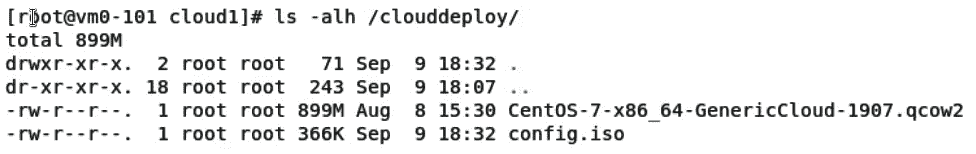

图 11.33 - 检查目录内容

现在剩下的就是创建一个部署这些内容的 playbook。让我们按照以下步骤进行：

1.  首先，我们将复制云镜像和我们的配置到我们的 KVM 主机上。之后，我们将创建一个机器，并启动它：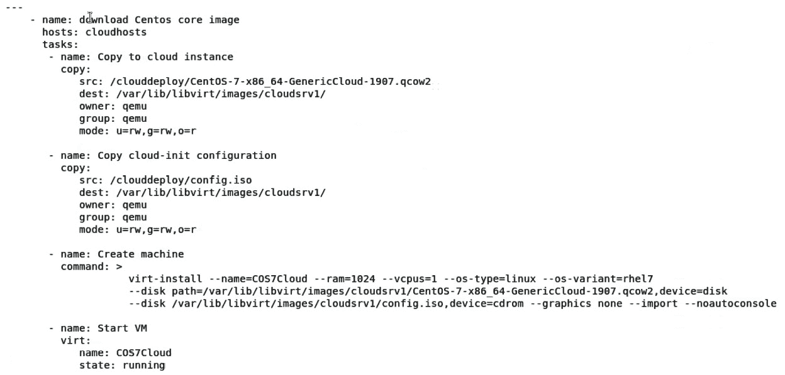

图 11.34 - 将下载所需镜像、配置 cloud-init 并启动 VM 部署过程的 playbook

由于这是我们的第一个*复杂*的 playbook，我们需要解释一些事情。在每个 play 或 task 中，有一些重要的事情。名称用于简化运行 playbook；这是 playbook 运行时将显示的内容。这个名称应该足够解释性，以帮助理解，但不要太长以避免混乱。

在名称之后，我们有每个任务的业务部分 - 被调用的模块的名称。在我们的例子中，我们使用了三个不同的模块：`copy`、`command`和`virt`。`copy`用于在主机之间复制文件，`command`在远程机器上执行命令，`virt`包含控制虚拟环境所需的命令和状态。

阅读时您会注意到`copy`看起来很奇怪；`src`表示本地目录，而`dest`表示远程目录。这是有意设计的。为了简化事情，`copy`在本地机器（运行 Ansible 的控制节点）和远程机器（正在配置的机器）之间工作。如果目录不存在，将会创建目录，并且`copy`将应用适当的权限。

之后，我们将运行一个命令，该命令将处理本地文件并创建一个虚拟机。这里的一个重要事情是，我们基本上运行了我们复制的镜像；模板在控制节点上。同时，这节省了磁盘空间和部署时间 - 没有必要将机器从本地复制到远程磁盘，然后再次在远程机器上复制；一旦镜像在那里，我们就可以运行它。

回到重要的部分 – 本地安装。我们正在创建一个具有 1GB RAM 和一个 CPU 的机器，使用我们刚刚复制的磁盘映像。我们还将`config.iso`文件作为虚拟 CD/DVD 附加。然后，我们导入此映像并不使用图形终端。

1.  最后一个任务是在远程 KVM 主机上启动 VM。我们将使用以下命令来执行： 

```
ansible-playbook installvms.yaml
```

如果一切正常运行，我们应该看到类似于这样的东西：

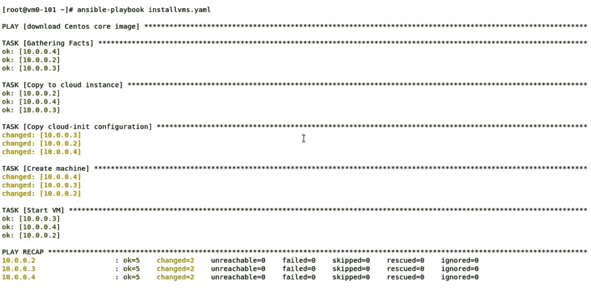

图 11.35 – 检查我们的安装过程

我们也可以使用命令行来检查：

```
ansible cloudhosts -m shell -a "virsh list –all"
```

此命令的输出应该看起来像这样：

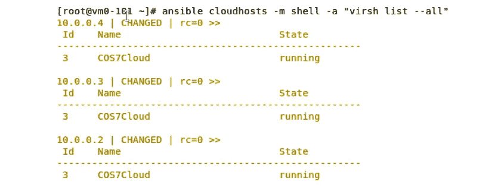

图 11.36 – 检查我们的虚拟机

让我们再检查两件事 – 网络和机器状态。输入以下命令：

```
ansible cloudhosts -m shell -a "virsh net-dhcp-leases –-network default"
```

我们应该得到类似于这样的东西：

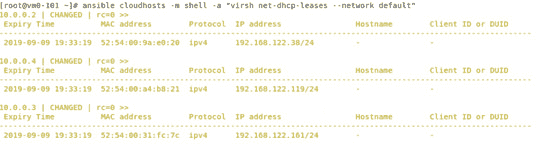

图 11.37 – 检查我们的 VM 网络连接和网络配置

这验证了我们的机器是否正常运行，并且它们连接到本地 KVM 实例的本地网络。在本书的其他地方，我们将更详细地处理 KVM 网络，因此重新配置机器以使用公共网络应该很容易，无论是通过在 KVM 上桥接适配器，还是通过创建一个跨主机的独立虚拟网络。

我们想要展示的另一件事是所有主机的机器状态。重点是，这次我们不是使用 shell 模块；相反，我们依靠`virt`模块来显示如何从命令行使用它。这里只有一个细微的区别。当我们调用 shell（或`command`）模块时，我们正在调用将被调用的参数。这些模块基本上只是在远程机器上生成另一个进程，并使用我们提供的参数运行它。

相比之下，`virt`模块以变量声明作为其参数，因为我们正在使用`command=info`运行`virt`。在使用 Ansible 时，您会注意到，有时变量只是状态。如果我们想要启动特定的实例，我们只需添加`state=running`，以及一个适当的名称，Ansible 会确保虚拟机正在运行。让我们输入以下命令：

```
ansible cloudhosts -m virt -a "command=info"
```

以下是预期的输出：

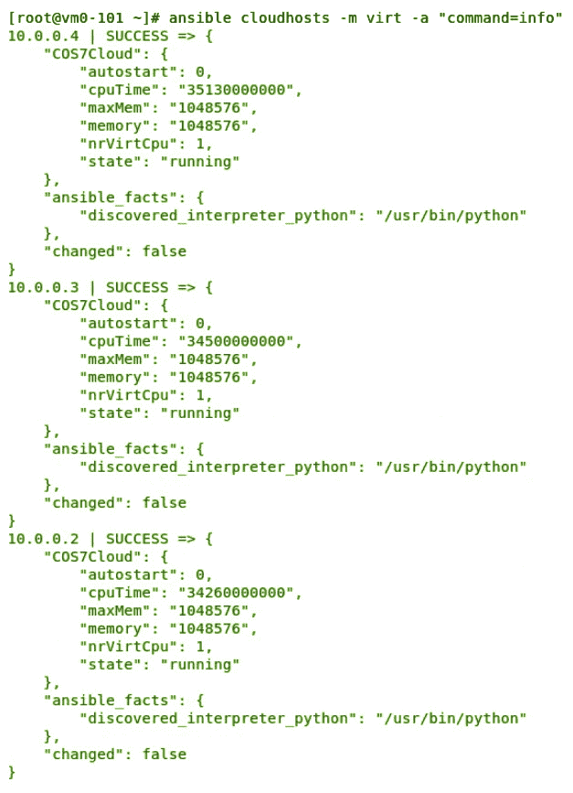

图 11.38 – 使用 virt 模块与 Ansible

我们还没有涵盖的一件事是如何安装多层应用程序。将定义推到最小的极端，我们将使用简单的 playbook 安装 LAMP 服务器。

# 在 KVM VM 上编排多层应用程序部署

现在，让我们学习如何安装多层应用程序。将定义推到最小的极端，我们将使用简单的 Ansible playbook 安装 LAMP 服务器。

需要完成的任务非常简单 – 我们需要安装 Apache、MySQL 和 PHP。LAMP 的*L*部分已经安装好了，所以我们不会再次进行安装。

困难的部分是软件包名称：在我们的演示机器上，我们使用 CentOS7 作为操作系统，其软件包名称有些不同。Apache 被称为`httpd`，`mysql`被替换为与 MySQL 兼容的另一个引擎`mariaDB`。PHP 幸运地与其他发行版上的相同。我们还需要另一个名为`python2-PyMySQL`的软件包（名称区分大小写）以使我们的 playbook 工作。

接下来要做的事情是通过启动所有服务并创建最简单的`.php`脚本来测试安装。之后，我们将创建一个数据库和一个将使用它的用户。需要警告的是，在本章中，我们专注于 Ansible 的基础知识，因为 Ansible 太复杂，无法在一本书的一章中涵盖。此外，我们假设了很多事情，我们最大的假设是我们正在创建的演示系统并不打算用于生产。特别是这个 playbook 缺少一个重要的步骤：创建一个 root 密码。不要在未设置 SQL 密码的情况下投入生产。

还有一件事：我们的脚本假设在我们的 playbook 运行的目录中有一个名为`index.php`的文件，并且该文件将被复制到远程系统中：

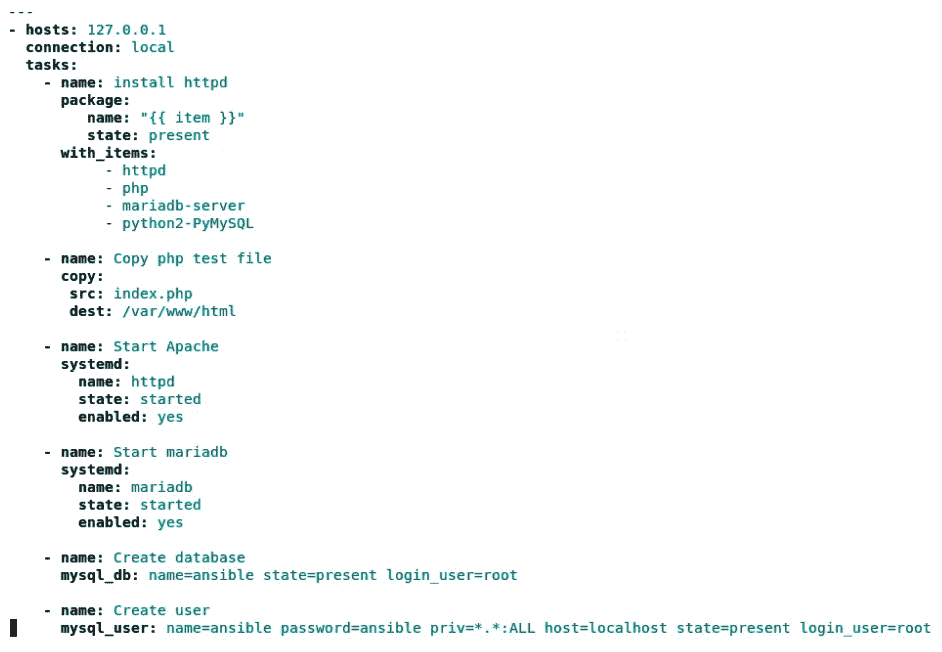

图 11.39 - Ansible LAMP playbook

正如我们所看到的，没有发生复杂的事情，只是一系列简单的步骤。我们的`.php`文件如下所示：


图 11.40 - 测试 PHP 是否正常工作

事情不可能比这更简单了。在正常的部署场景中，我们在 web 服务器目录中会有更复杂的东西，比如 WordPress 或 Joomla 安装，甚至是自定义应用程序。唯一需要改变的是被复制的文件（或一组文件）和数据库的位置。我们的文件只是打印有关本地`.php`安装的信息：

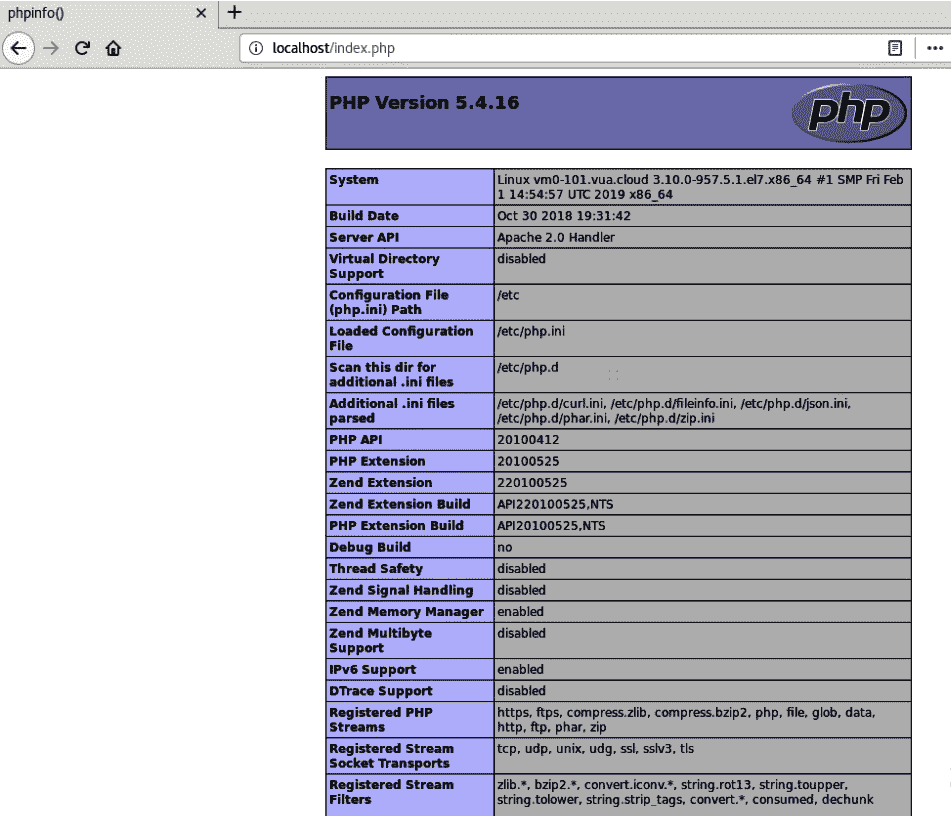

图 11.41 - 使用 Web 浏览器检查 PHP 在 Apache 上是否正常工作和之前配置的 PHP 文件

Ansible 比我们在本章中展示的要复杂得多，因此我们强烈建议您进行进一步阅读和学习。我们在这里所做的只是如何在多个主机上安装 KVM 并使用命令行一次性控制它们的最简单示例。Ansible 最擅长的是节省我们的时间 - 想象一下有几百个 hypervisor 并且必须部署成千上万台服务器。使用 playbooks 和一些预配置的镜像，我们不仅可以配置 KVM 来运行我们的机器，还可以重新配置机器上的任何东西。唯一真正的先决条件是运行的 SSH 服务器和一个能够使我们对机器进行分组的清单。

# 通过示例学习 - 使用 Ansible 与 KVM 的各种示例

现在我们已经介绍了简单和更复杂的 Ansible 任务，让我们考虑如何使用 Ansible 来进一步提高我们的配置技能和整体合规性，基于某种政策。以下是一些我们将留给您作为练习的事项：

+   任务 1：

我们配置并运行了每个 KVM 主机上的一台机器。创建一个将形成一对主机的 playbook - 一个运行网站，另一个运行数据库。您可以使用任何开源 CMS 来实现这一点。

+   任务 2:

使用 Ansible 和`virt-net`模块重新配置网络，以便整个集群可以通信。KVM 接受网络的`.xml`配置，`virt-net`可以读取和写入 XML。提示：如果感到困惑，请使用单独的 RHEL8 机器在 GUI 中创建一个虚拟网络，然后使用`virsh net-dumpxml`语法将虚拟网络配置输出到标准输出，然后可以将其用作模板。

+   任务 3：

使用`ansible`和`virsh`自动启动您在主机上创建/导入的特定 VM。

+   任务 4：

根据我们的 LAMP 部署 playbook，通过以下方式改进它：

a）创建一个可以在远程机器上运行的 playbook。

b）创建一个将在不同服务器上安装不同角色的 playbook。

c）创建一个部署更复杂应用程序（如 WordPress）的 playbook。

如果您成功解决了这五个任务，那么恭喜您——您正在成为一个可以使用大写字母*A*的自动化管理员。

# 摘要

在本章中，我们讨论了 Ansible——一个用于编排和自动化的简单工具。它可以在开源和基于 Microsoft 的环境中使用，因为它本身支持这两种环境。可以通过 SSH 密钥访问开源系统，而可以通过 WinRM 和 PowerShell 访问 Microsoft 操作系统。我们学到了许多关于简单的 Ansible 任务和更复杂的任务，因为部署托管在多个虚拟机上的多层应用程序并不是一件容易的事情——特别是如果您手动解决问题。即使在多个主机上部署 KVM hypervisor 也可能需要相当长的时间，但我们成功地用一个简单的 Ansible playbook 解决了这个问题。请注意，我们只需要大约 20 行配置来做到这一点，而由此带来的好处是我们可以轻松地将数百个主机添加为此 Ansible playbook 的目标。

下一章将带我们进入云服务的世界——具体来说是 OpenStack——在那里我们的 Ansible 知识将对大规模虚拟机配置非常有用，因为使用任何手动工具都无法配置所有的云虚拟机。除此之外，我们将通过集成 OpenStack 和 Ansible 来扩展我们对 Ansible 的了解，以便我们可以同时使用这两个平台来做它们擅长的事情——管理云环境和配置其可消耗资源。

# 问题

1.  什么是 Ansible？

1.  Ansible playbook 的作用是什么？

1.  Ansible 使用哪种通信协议连接到其目标？

1.  什么是 AWX？

1.  什么是 Ansible Tower？

# 进一步阅读

有关本章内容的更多信息，请参考以下链接：

+   什么是 Ansible？：[`www.ansible.com/`](https://www.ansible.com/)

+   Ansible 文档：[`docs.ansible.com/`](https://docs.ansible.com/)

+   Ansible 概述：[`www.ansible.com/overview/it-automation`](https://www.ansible.com/overview/it-automation)

+   Ansible 用例：[`www.ansible.com/use-cases`](https://www.ansible.com/use-cases)

+   用于持续交付的 Ansible：[`www.ansible.com/use-cases/continuous-delivery`](https://www.ansible.com/use-cases/continuous-delivery)

+   将 Ansible 与 Jenkins 集成：[`www.redhat.com/en/blog/integrating-ansible-jenkins-cicd-process`](https://www.redhat.com/en/blog/integrating-ansible-jenkins-cicd-process)
