# 第十二章：*第十二章*：使用 OpenStack 扩展 KVM

能够虚拟化一台机器是一件大事，但有时，仅仅虚拟化是不够的。问题在于如何给予个人用户工具，使他们可以在需要时虚拟化他们需要的任何东西。如果我们将以用户为中心的方法与虚拟化相结合，我们将得到一个需要能够连接到 KVM 作为虚拟化机制（不仅仅是 KVM）并使用户能够在自助环境中通过 Web 浏览器获取其虚拟机并自动配置的系统。OpenStack 增加了一件事情，因为它完全免费并且完全基于开源技术。由于其复杂性，配置这样的系统是一个大问题，在本章中，我们将向您展示 - 或者更准确地说，指向您 - 关于是否需要这样的系统的正确方向。

在本章中，我们将涵盖以下主题：

+   介绍 OpenStack

+   软件定义网络

+   OpenStack 组件

+   额外的 OpenStack 用例

+   配置 OpenStack 环境

+   将 OpenStack 与 Ansible 集成

+   让我们开始吧！

# 介绍 OpenStack

根据其自己的说法，**OpenStack**是一个云操作系统，用于控制大量不同的资源，以提供**基础设施即服务**（**IaaS**）和**编排**的所有基本服务。

但这意味着什么？OpenStack 旨在完全控制数据中心中的所有资源，并提供对可以用于部署其自身和第三方服务的任何资源的集中管理和直接控制。基本上，对于我们在本书中提到的每项服务，在整个 OpenStack 景观中都有一个可以使用该服务的地方。

OpenStack 本身由几个不同的相互连接的服务或服务部分组成，每个都有自己的功能集，每个都有自己的 API，可以完全控制该服务。在本书的这一部分，我们将尝试解释 OpenStack 的不同部分的功能，它们如何相互连接，它们提供的服务以及如何利用这些服务来获得优势。

OpenStack 存在的原因是因为需要一个开源的云计算平台，可以创建独立于任何商业云平台的公共和私有云。OpenStack 的所有部分都是开源的，并且根据 Apache 许可证 2.0 发布。该软件是由大型混合个人和大型云提供商创建的。有趣的是，第一个主要版本的发布是 NASA（美国政府机构）和 Rackspace Technology（美国大型托管公司）合并其内部存储和计算基础设施解决方案的结果。这些发布后来被指定为 Nova 和 Swift，并且我们将在后面更详细地介绍它们。

你将注意到关于 OpenStack 的第一件事是它的服务，因为没有单一的*OpenStack*服务，而是一整套服务。名称*OpenStack*直接来自这个概念，因为它正确地将 OpenStack 识别为一个作为服务的开源组件，这些服务又被分组成功能集。

一旦我们了解到我们正在谈论自主服务，我们还需要了解 OpenStack 中的服务是按其功能分组的，并且某些功能下有不止一个专门的服务。我们将尽量在本章中涵盖尽可能多的不同服务，但是其中有太多的服务，甚至无法在这里提及所有。所有文档和白皮书都可以在[`openstack.org`](http://openstack.org)找到，我们强烈建议您查阅其中任何未在此处提及的内容，甚至对我们提到但在您阅读时可能已经发生变化的内容也要查阅。

我们需要澄清的最后一件事是命名——OpenStack 中的每个服务都有其项目名称，并且在文档中以该名称来引用。乍一看，这可能看起来令人困惑，因为其中一些名称与特定服务在整个项目中的具体功能完全无关，但一旦你开始使用 OpenStack，使用名称而不是官方指示符来表示功能会更容易。例如，Swift。Swift 的全名是*OpenStack 对象存储*，但在文档或其实施中很少提到。其他服务或在 OpenStack 下的*项目*，如 Nova、Ironic、Neutron、Keystone 以及其他 20 多个不同的服务也是如此。

如果你暂时离开 OpenStack，那么你需要考虑云服务的本质。云服务的本质就是扩展——无论是计算资源、存储、网络、API 等。但是，就像生活中的一切一样，随着事物的扩展，你会遇到问题。这些问题有它们自己的*名称*和*解决方案*。所以，让我们讨论一下这些问题。

云服务提供商可扩展性的基本问题可以分为三组需要大规模解决的问题：

+   **计算问题**（计算=CPU+内存能力）：这些问题解决起来相当简单——如果你需要更多的 CPU 和内存能力，你就购买更多的服务器，这意味着更多的 CPU 和内存。如果你需要服务质量/**服务级别协议**（**SLA**）类型的概念，我们可以引入计算资源池的概念，这样我们可以根据需要切割计算*饼*并在我们的客户之间分配这些资源。无论我们的客户是私人还是购买云服务的公司，这都无关紧要。在云技术中，我们称我们的客户为*租户*。

+   **存储问题**：随着云环境的扩展，存储容量、管理、监控以及性能方面变得非常混乱。性能问题有一些最常用的变量——读写吞吐量和读写 IOPS。当你将环境从 100 个主机扩展到 1,000 个或更多时，性能瓶颈将成为一个难以解决的主要问题。因此，存储问题可以通过增加额外的存储设备和容量来解决，但它比计算问题更复杂，需要更多的配置和资金。记住，每个虚拟机对其他虚拟机的性能有统计上的影响，虚拟机越多，这种熵就越大。这是存储基础设施中最难管理的过程。

+   `A`无法与租户`B`的网络流量通信。与此同时，你仍然需要提供一个能够让租户拥有多个网络（通常在非云基础设施中通过 VLAN 实现）并在这些网络之间进行路由的能力，如果这是租户需要的话。

这个网络问题是一个基于技术的可扩展性问题，因为 VLAN 背后的技术在 VLAN 数量成为可扩展性问题之前已经标准化了多年。

让我们继续通过解释云环境的最基本主题来了解 OpenStack，即通过**软件定义网络**（**SDN**）扩展云网络。这样做的原因非常简单——没有 SDN 概念，云对于客户来说就不够可扩展，这将是一个完全的停滞。所以，系好你的安全带，让我们进行 SDN 入门。

# 软件定义网络

云的一个直接的故事——至少表面上是这样——应该是关于云网络的故事。为了理解这个故事应该有多简单，我们只需要看一个数字，那个数字就是`VLAN 1`。

所以，基本上，在现实场景中，我们剩下了 4,093 个单独的逻辑网络，这可能已经足够用于任何公司的内部基础设施。然而，对于公共云提供商来说，这远远不够。同样的问题也适用于使用混合云类型服务的公共云提供商，例如将他们的计算能力扩展到云端。

所以，让我们稍微关注一下这个网络问题。从云用户的角度来看，数据隐私对我们来说至关重要。如果从云提供商的角度来看这个问题，那么我们希望我们的网络隔离问题对我们的租户来说不成问题。这就是云服务在更基本层面上的全部意义——无论技术背景的复杂性如何，用户都必须能够以尽可能用户友好的方式访问所有必要的服务。让我们通过一个例子来解释这一点。

如果我们的公共云环境中有 5,000 个不同的客户（租户）会发生什么？如果每个租户都需要拥有五个或更多的逻辑网络会发生什么？我们很快意识到我们有一个大问题，因为云环境需要被分隔、隔离和围栏起来。出于安全和隐私原因，它们需要在网络层面相互分隔。然而，如果租户需要那种服务，它们也需要可路由。除此之外，我们需要能够扩展，以便在需要超过 5,000 或 50,000 个隔离网络的情况下不会困扰我们。再次回到我们之前的观点——大约 4,000 个 VLAN 根本不够用。

我们之所以说这应该是一个简单的故事，是有原因的。我们中的工程师们将这些情况看得很黑白分明——我们专注于问题并试图找到解决方案。解决方案似乎相当简单——我们需要扩展 12 位 VLAN ID 字段，以便我们可以拥有更多可用的逻辑网络。这有多难呢？

事实证明，这是非常困难的。如果历史教会我们任何东西，那就是各种不同的利益、公司和技术会在 IT 技术方面争夺多年的*顶级*地位。只需想想 DVD+R、DVD-R、DVD+RW、DVD-RW、DVD-RAM 等旧日的情形。简化一下，当云网络的初始标准被引入时，同样的情况也发生了。我们通常将这些网络技术称为云覆盖网络技术。这些技术是 SDN 的基础，它描述了云网络在全球、集中管理层面上的工作方式。市场上有多种标准来解决这个问题——VXLAN、GRE、STT、NVGRE、NVO3 等等。

实际上，没有必要一一解释它们。我们将采取更简单的方式——我们将描述其中一个在今天环境中最有价值的标准（**VXLAN**），然后转向被认为是明天*统一*标准的东西（**GENEVE**）。

首先，让我们定义什么是叠加网络。当我们谈论叠加网络时，我们指的是建立在同一基础设施中另一个网络之上的网络。叠加网络背后的想法很简单 - 我们需要将网络的物理部分与逻辑部分分开。如果我们想要以绝对方式进行配置（在 CLI 中配置物理交换机、路由器等，而不需要花费大量时间），我们也可以这样做。如果我们不想以这种方式做，而且仍然希望直接与我们的物理网络环境一起工作，我们需要在整体方案中添加一层可编程性。然后，如果我们愿意，我们可以与我们的物理设备进行交互，并向它们推送网络配置，以实现更自上而下的方法。如果我们以这种方式做事情，我们将需要更多来自我们的硬件设备的支持，以满足能力和兼容性方面的要求。

现在我们已经描述了什么是网络叠加，让我们谈谈 VXLAN，这是最重要的叠加网络标准之一。它还作为开发其他网络叠加标准（如 GENEVE）的基础，因此 - 您可能会想象到 - 了解其工作原理非常重要。

## 了解 VXLAN

让我们从令人困惑的部分开始。VXLAN（IETF RFC 7348）是一种可扩展的叠加网络标准，使我们能够在 Layer 3 网络中聚合和隧道多个 Layer 2 网络。它是如何做到的呢？通过在 Layer 3 数据包内封装 Layer 2 数据包。在传输协议方面，默认情况下使用 UDP，在端口`4789`上（稍后会详细介绍）。在 VXLAN 实现的特殊请求方面 - 只要您的物理网络支持 MTU 1600，您就可以轻松实现 VXLAN 作为云叠加解决方案。您可以购买的几乎所有交换机（除了廉价的家用交换机，但我们在这里谈论的是企业）都支持巨型帧，这意味着我们可以使用 MTU 9000 并完成。

从封装的角度来看，让我们看看它是什么样子的：

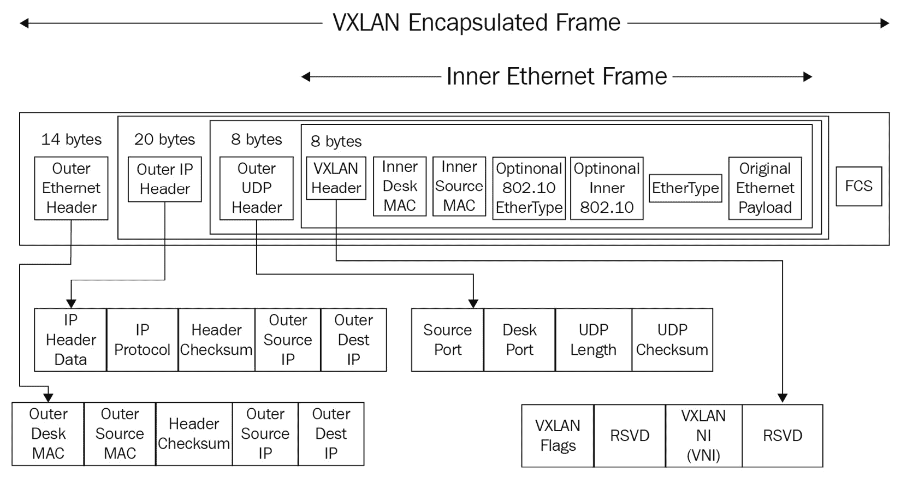

图 12.1 – VXLAN 帧封装

更简单地说，VXLAN 使用两个 VXLAN 端点（称为 VTEP；即 VXLAN 隧道端点）之间的隧道，检查**VXLAN 网络标识符**（**VNIs**），以便它们可以决定数据包的去向。

如果这看起来很复杂，那就不用担心 - 我们可以简化这个过程。从 VXLAN 的角度来看，VNI 与 VLAN ID 对 VLAN 的作用是一样的。它是一个唯一的网络标识符。区别只是大小 - VNI 字段有 24 位，而 VLAN 有 12 位。这意味着我们有 2²⁴ 个 VNI，而 VLAN 有 2¹² 个。因此，就网络隔离而言，VXLAN 是 VLAN 的平方。

为什么 VXLAN 使用 UDP？

在设计叠加网络时，通常希望尽量减少延迟。此外，您不希望引入任何形式的开销。当您考虑这两个基本设计原则，并将其与 VXLAN 隧道 Layer 2 流量封装在 Layer 3 内（无论流量是单播、组播还是广播）的事实相结合时，这实际上意味着我们应该使用 UDP。无论如何，TCP 的两种方法 - 三次握手和重传 - 都会妨碍这些基本设计原则。简而言之，TCP 对于 VXLAN 来说太复杂了，因为这意味着在规模上会产生太多的开销和延迟。

就 VTEP 而言，只需将它们想象成两个接口（以软件或硬件实现），可以根据 VNI 封装和解封流量。从技术角度来看，VTEP 将各种租户的虚拟机和设备映射到 VXLAN 段（由 VXLAN 支持的隔离网络），执行包检查，并根据 VNI 封装/解封网络流量。让我们借助以下图表描述这种通信：

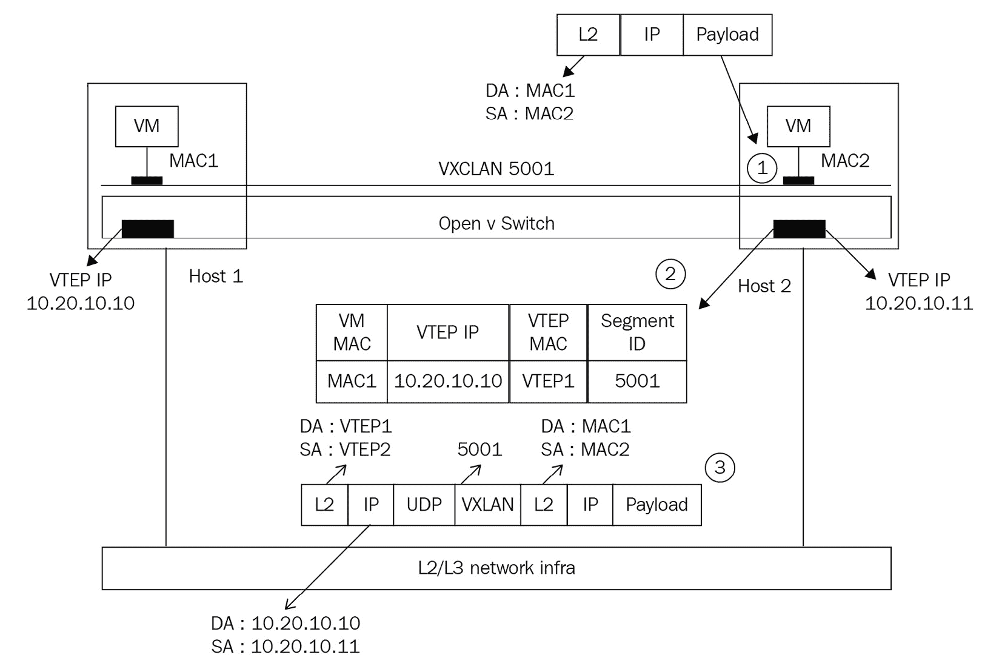

图 12.2-单播模式下的 VTEP

在我们基于开源的云基础设施中，我们将使用 OpenStack Neutron 或 Open vSwitch 来实现云覆盖网络，后者是一个免费的开源分布式交换机，支持几乎所有你能想到的网络协议，包括前面提到的 VXLAN、STT、GENEVE 和 GRE 覆盖网络。

此外，在云网络中有一种绅士协议，即在大多数情况下不使用 VXLANs 从`1-4999`。这样做的原因很简单-因为我们仍然希望以简单且不易出错的方式保留 VLAN 的保留范围为`0-4095`。换句话说，按设计，我们将网络 ID `0-4095` 留给 VLAN，并以 VNI 5000 开始 VXLAN，这样很容易区分两者。在 1670 万个 VXLAN 支持的网络中，不使用 5000 个 VXLAN 支持的网络并不是为了良好的工程实践而做出的太大牺牲。

VXLAN 的简单性、可扩展性和可扩展性也意味着更多真正有用的使用模型，例如以下内容：

+   **在站点之间拉伸第 2 层**：这是关于云网络的最常见问题之一，我们将很快描述。

+   **第 2 层桥接**：将 VLAN 桥接到云覆盖网络（如 VXLAN）在我们将用户引入我们的云服务时非常有用，因为他们可以直接连接到我们的云网络。此外，当我们想要将硬件设备（例如物理数据库服务器或物理设备）插入 VXLAN 时，这种使用模型也被广泛使用。如果没有第 2 层桥接，想象一下我们将会有多么痛苦。我们所有运行 Oracle 数据库设备的客户将无法将他们的物理服务器连接到我们基于云的基础设施。

+   **各种卸载技术**：包括负载平衡、防病毒、漏洞和恶意软件扫描、防火墙、IDS、IPS 集成等。所有这些技术使我们能够拥有简单管理概念的有用、安全的环境。

我们提到在站点之间拉伸第 2 层是一个基本问题，因此很明显我们需要讨论它。我们将在下一节讨论。如果没有解决这个问题的方法，你几乎没有机会有效地创建多个数据中心的云基础设施。

### 在站点之间拉伸第 2 层

云提供商面临的最常见一组问题之一是如何在站点或大陆之间扩展其环境。在过去，当我们没有诸如 VXLAN 之类的概念时，我们被迫使用某种第 2 层 VPN 或基于 MPLS 的技术。这些类型的服务非常昂贵，有时，我们的服务提供商并不完全满意我们的*给我 MPLS*或*给我第 2 层访问*的要求。如果我们在同一句中提到*组播*这个词，他们会更不高兴，这在过去是一组经常使用的技术标准。因此，具备通过第 3 层传输第 2 层的能力从根本上改变了这种对话。基本上，如果你有能力在站点之间创建基于第 3 层的 VPN（你几乎总是可以做到的），你就不必再讨论这个问题。此外，这显著降低了这些类型基础设施连接的价格。

考虑以下基于组播的示例：

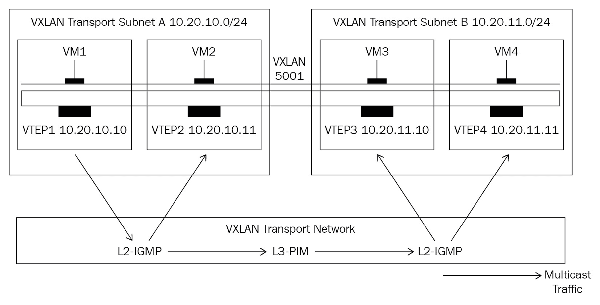

图 12.3-在组播模式下跨站扩展 VXLAN 段

让我们假设这个图表的左侧是第一个站点，右侧是第二个站点。从`VM1`的角度来看，`VM4`在其他远程站点并不重要，因为它的段（VXLAN 5001）*跨越*这些站点。怎么做？只要底层主机可以通过 VXLAN 传输网络相互通信（通常也通过管理网络），第一个站点的 VTEP 可以与第二个站点的 VTEP 进行*通信*。这意味着在一个站点由 VXLAN 段支持的虚拟机可以通过上述的第 2 层到第 3 层封装与另一个站点中相同的 VXLAN 段进行通信。这是解决一个复杂且昂贵问题的一个非常简单而优雅的方法。

我们提到，作为一种技术，VXLAN 作为开发其他标准的基础，其中最重要的是 GENEVE。随着大多数制造商朝着 GENEVE 兼容性迈进，VXLAN 将慢慢消失。让我们讨论一下 GENEVE 协议的目的，以及它如何成为云覆盖网络的*标准*。

## 理解 GENEVE

我们之前提到的基本问题是，云覆盖网络中的历史重演了很多次。不同的标准，不同的固件，不同的制造商支持一种标准而不是另一种，所有这些标准都非常相似，但仍然不兼容。这就是为什么 VMware、微软、红帽和英特尔提出了 GENEVE，这是一个新的云覆盖标准，只定义封装数据格式，而不干涉这些技术的控制平面，这些技术在根本上是不同的。例如，VXLAN 使用 24 位字段宽度的 VNI，而 STT 使用 64 位。因此，GENEVE 标准不提出固定的字段大小，因为你不可能知道未来会发生什么。此外，从现有用户群的角度来看，我们仍然可以愉快地使用我们的 VXLAN，因为我们不认为它们会受到未来 GENEVE 部署的影响。

让我们看看 GENEVE 标头是什么样的：

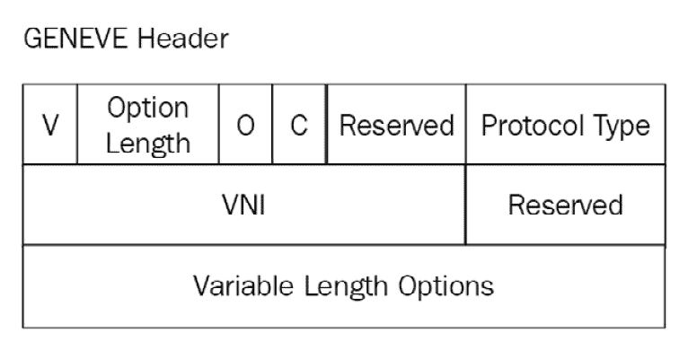

图 12.4-GENEVE 云覆盖网络标头

GENEVE 的作者从其他一些标准（BGP、IS-IS 和 LLDP）中学到了一些东西，并认为做正确的事情的关键是可扩展性。这就是为什么它被 Linux 社区在 Open vSwitch 和 VMware 在 NSX-T 中采用。自 Windows Server 2016 以来，VXLAN 也被支持为**Hyper-V 网络虚拟化**（**HNV**）的网络覆盖技术。总的来说，GENEVE 和 VXLAN 似乎是两种肯定会留下来的技术-从 OpenStack 的角度来看，两者都得到了很好的支持。

现在我们已经解决了云的最基本问题-云网络-我们可以回过头来讨论 OpenStack。具体来说，我们下一个主题与 OpenStack 组件有关-从 Nova 到 Glance，然后到 Swift，以及其他组件。所以，让我们开始吧。

# OpenStack 组件

当 OpenStack 最初作为一个项目形成时，它是从两种不同的服务设计的：

+   一个计算服务，旨在管理和运行虚拟机本身

+   一个旨在进行大规模对象存储的存储服务

这些服务现在被称为 OpenStack Compute 或*Nova*，以及 OpenStack Object Store 或*Swift*。这些服务后来又加入了*Glance*或 OpenStack 镜像服务，旨在简化与磁盘映像的工作。此外，在我们的 SDN 入门之后，我们需要讨论 OpenStack Neutron，OpenStack 的**网络即服务**（**NaaS**）组件。 

以下图表显示了 OpenStack 的组件：

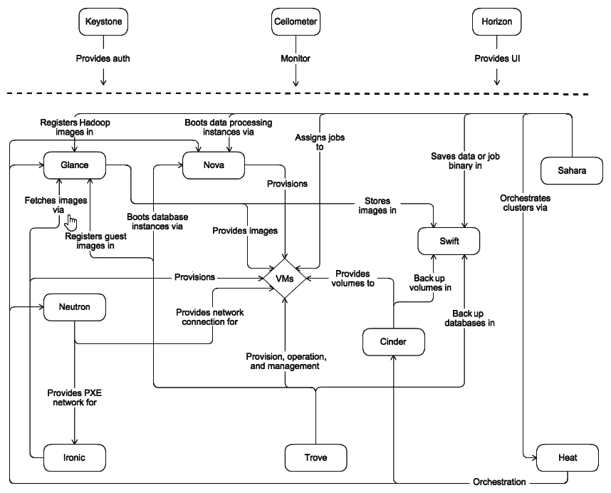

图 12.5-OpenStack 的概念架构（来源：https://docs.openstack.org/）

我们将按照没有特定顺序进行介绍，并包括其他重要的服务。让我们从**Swift**开始。

## Swift

我们需要谈论的第一个服务是 Swift。为此，我们将从 OpenStack 官方文档中获取项目的定义，并解析它，以尝试解释这个项目实现了哪些服务，[以及它的用途。Swift 网站](https://docs.openstack.org/swift/latest/) ([`docs.openstack.org/swift/latest/`](https://docs.openstack.org/swift/latest/))中陈述了以下内容：

*"Swift 是一个高度可用的、分布式的、最终一致的对象/大块存储。组织可以使用 Swift 高效、安全、廉价地存储大量数据。它专为规模而构建，并针对整个数据集的耐用性、可用性和并发性进行了优化。Swift 非常适合存储可以无限增长的非结构化数据。"*

读完这段话后，我们需要指出一些可能对你来说完全新的事情。首先，我们谈论的是以一种特定的方式存储数据，这在计算中并不常见，除非你使用过非结构化数据存储。非结构化并不意味着这种存储数据的方式缺乏结构；在这个上下文中，它意味着我们定义数据的结构，但服务本身不关心我们的结构，而是依赖于对象的概念来存储我们的数据。这种方式的一个结果是，我们存储在 Swift 中的数据不能直接通过任何文件系统或我们习惯通过机器操作文件的其他方式直接访问。相反，我们是以对象的方式操作数据，必须使用 Swift 提供的 API 来获取数据对象。我们的数据存储在*大块*或对象中，系统本身只是标记和存储以确保可用性和访问速度。我们应该知道我们的数据的内部结构以及如何解析它。另一方面，由于这种方法，Swift 可以以惊人的速度处理任意数量的数据，并且以一种几乎不可能使用普通的经典数据库实现的方式进行水平扩展。

值得一提的是，这项服务提供了高度可用、分布式和*最终一致*的存储。这意味着，首先，优先级是数据分布和高可用性，这两点在云中非常重要。一致性在此之后，但最终会实现。一旦你开始使用这项服务，你就会明白这意味着什么。在几乎所有通常的情况下，数据被读取而很少被写入，这根本不值得考虑，但也有一些情况下，这可能改变我们需要思考如何提供服务的方式。文档中陈述了以下内容：

*"因为对象存储中的每个副本都是独立运行的，客户端通常只需要大多数节点简单响应即可认为操作成功，瞬时故障如网络分区可能会迅速导致副本发散。这些差异最终由异步的点对点复制进程协调一致。复制进程遍历其本地文件系统，并以一种平衡负载的方式同时执行操作。"*

我们可以粗略地翻译一下。假设你有一个三节点的 Swift 集群。在这种情况下，Swift 对象在`PUT`操作至少在两个节点上确认已完成后，才会对客户端可用。因此，如果你的目标是创建一个低延迟、同步的 Swift 存储复制，那么还有其他解决方案可供选择。

在搁置了有关 Swift 提供的所有抽象承诺之后，让我们进一步详细讨论一下。高可用性和分布是使用“区域”概念以及将相同数据写入多个存储服务器的直接结果。区域只是一种简单的逻辑划分我们可用的存储资源的方式，并决定我们愿意提供的隔离类型以及我们需要的冗余类型。我们可以按照服务器本身、机架、数据中心内的服务器集、跨不同数据中心的组以及任何这些的组合来对服务器进行分组。一切都取决于可用资源的数量以及我们需要和想要的数据冗余和可用性，当然还有伴随我们配置的成本。

根据我们拥有的资源，我们应该根据它将我们的存储系统配置为它将保存多少副本以及我们准备使用多少区域。Swift 中特定数据对象的副本被称为*副本*，目前，最佳实践要求至少在不少于五个区域中拥有至少三个副本。

区域可以是服务器或一组服务器，如果我们正确配置了一切，失去任何一个区域对数据的可用性或分布都不会产生影响。由于区域可以小到一个服务器，大到任意数量的数据中心，我们构建区域的方式对系统对任何故障和变化的反应有巨大影响。副本也是如此。在推荐的方案中，配置的副本数量比区域数量少，因此只有一些区域将持有这些副本。这意味着系统必须平衡数据的写入方式，以均匀分布数据和负载，包括数据的写入和读取负载。同时，我们构建区域的方式将对成本产生巨大影响-冗余在服务器和存储硬件方面具有实际成本，而增加副本和区域会对我们 OpenStack 安装需要分配多少存储和计算能力提出额外要求。能够正确做到这一点是数据中心架构师必须解决的最大问题。

现在，我们需要回到最终一致性的概念。在这个背景下，最终一致性意味着数据将被写入 Swift 存储，并且对象将被更新，但系统将无法完全同时将所有数据写入所有副本中。Swift 将尽快协调差异，并意识到这些变化，因此为尝试读取它们的任何人提供对象的新版本。由于系统的某些部分失败而导致数据不一致的情况存在，但它们应被视为系统的异常状态，并需要修复，而不是系统被设计为忽略它们。

### Swift 守护程序

接下来，我们需要讨论 Swift 在架构方面的设计。数据通过三个独立的逻辑守护程序进行管理：

+   **Swift-account**用于管理包含所有定义的对象存储服务帐户的 SQL 数据库。它的主要任务是读取和写入所有其他服务需要的数据，主要是为了验证和查找适当的身份验证和其他数据。

+   **Swift-container**是另一个数据库进程，但它严格用于将数据映射到容器中，这是一种类似于 AWS *buckets*的逻辑结构。这可以包括任意数量的对象，它们被分组在一起。

+   **Swift-object**管理到实际对象的映射，并跟踪对象本身的位置和可用性。

所有这些守护程序都负责数据，并确保一切都被正确映射和复制。数据被架构的另一层使用：表示层。

当用户想要使用任何数据对象时，首先需要通过一个令牌进行身份验证，这个令牌可以是外部提供的，也可以是由 Swift 内部的身份验证系统创建的。之后，编排数据检索的主要过程是 Swift-proxy，它处理与处理数据的三个守护程序的通信。只要用户提供了有效的令牌，就可以将数据对象交付给用户请求。

这只是关于 Swift 工作原理的最简要的概述。为了理解这一点，你不仅需要阅读文档，还需要使用某种系统来执行低级对象的检索和存储到 Swift 中。

如果没有编排服务，云服务就无法扩展或高效使用，这就是为什么我们需要讨论我们列表上的下一个服务 - **Nova**。

## Nova

另一个重要的服务或项目是 Nova - 一个编排服务，用于在大规模上提供计算实例的供应和管理。它的基本作用是允许我们使用 API 结构直接分配、创建、重新配置和删除或*销毁*虚拟服务器。以下是 Nova 服务结构的逻辑图：

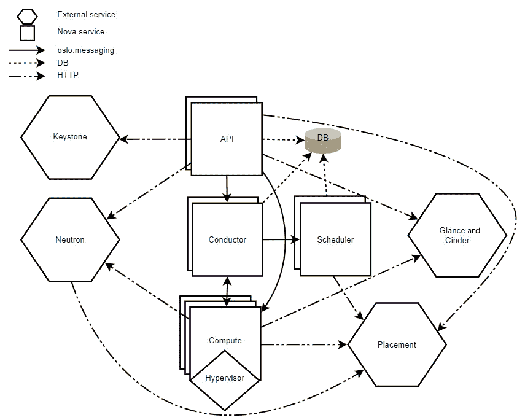

图 12.6 - Nova 服务的逻辑结构（openstack.org）

大部分 Nova 是一个非常复杂的分布式系统，几乎完全由 Python 编写，包括一些执行编排部分的工作脚本和一个接收和执行 API 调用的网关服务。API 也是基于 Python 的；它是一个**Web 服务器网关接口**（**WSGI**）兼容的应用程序，用于处理调用。而 WSGI 则是定义 Web 应用程序和服务器应该如何交换数据和命令的标准。这意味着理论上，任何能够使用 WSGI 标准的系统也可以与这个服务建立通信。

除了这个多方面的编排解决方案，还有另外两个服务是 Nova 的核心 - 数据库和消息队列。这两者都不是基于 Python 的。我们将首先讨论消息传递和数据库。

几乎所有分布式系统都必须依赖队列来执行它们的任务。消息需要被转发到一个中央位置，这将使所有守护程序能够执行它们的任务，使用正确的消息传递和排队系统对于系统的速度和可靠性至关重要。Nova 目前使用 RabbitMQ，这是一个高度可扩展和可用的系统。使用这样一个生产就绪的系统意味着不仅有工具来调试系统本身，还有很多报告工具可用于直接查询消息队列。

使用消息队列的主要目的是完全解耦任何客户端和服务器，并在不同客户端之间提供异步通信。关于实际消息传递的工作有很多要说的，但在本章中，我们将只是引用官方文档[`docs.openstack.org/nova/latest/`](https://docs.openstack.org/nova/latest/)，因为我们不是在谈论服务器上的一些功能，而是一个完全独立的软件堆栈。

数据库负责保存当前正在执行的任务的所有状态数据，并使 API 能够返回有关 Nova 不同部分当前状态的信息。

总的来说，系统包括以下内容：

+   `nova-api`实际上是指这个守护程序，有时称其为 API、控制器或云控制器。我们需要更详细地解释一下 Nova，以便理解将 nova-api 称为控制器是错误的，但由于守护程序中存在一个名为 CloudController 的类，许多用户将这个守护程序误认为是整个分布式系统。

nova-api 是一个强大的系统，因为它可以自行处理和整理一些 API 调用，从数据库获取数据并找出需要做什么。在更常见的情况下，nova-api 将只是启动一个任务，并以消息的形式转发给 Nova 内的其他守护程序。

+   另一个重要的守护程序是调度程序。它的主要功能是浏览队列，并确定特定请求应该在何时何地运行。这听起来足够简单，但鉴于系统可能的复杂性，这个“何时何地”可能导致性能的极端增益或损失。为了解决这个问题，我们可以选择调度程序在选择执行请求的正确位置时如何做出决策。用户可以选择编写自己的请求，也可以使用预定的请求。

如果我们选择 Nova 提供的存储卷，我们有三种选择：

a) 简单调度程序根据主机的负载确定请求将在哪里运行 - 它将监视所有主机，并尝试分配在特定时间片内负载最小的主机。

b) **Chance**是默认的调度方式。顾名思义，这是最简单的算法 - 从列表中随机选择一个主机并给出请求。

c) 区域调度也会随机选择主机，但是会在区域内进行选择。

现在，我们将看一下*workers*，实际执行请求的守护程序。这些守护程序有三个 - 网络、存储和计算。

+   **nova-network**负责网络。它将执行与网络相关的队列中的任何任务，并根据需要创建接口和规则。它还负责 IP 地址分配；它将分配固定和动态分配的地址，并处理外部和内部网络。实例通常使用一个或多个固定 IP 来实现管理和连接，这些通常是本地地址。还有浮动地址用于从外部进行连接。自 2016 年 OpenStack Newton 版本发布以来，这项服务已经过时，尽管在一些传统配置中仍然可以使用。

+   nova-volume 处理存储卷，或者更准确地说，处理数据存储与任何实例连接的所有方式。这包括诸如 iSCSI 和 AoE 之类的标准，这些标准旨在封装已知的常见协议，以及诸如 Sheepdog、LeftHand 和 RBD 之类的提供者，这些提供者涵盖了与开源和闭源存储系统（如 CEPH 或 HP LeftHand）的连接。

+   `nova-compute`必须适应不同的虚拟化技术和完全不同的平台。它还需要能够动态分配和释放资源。主要使用 libvirt 进行 VM 管理，直接支持 KVM 创建和删除新实例。这就是本章存在的原因，因为 nova-compute 使用 libvirt 启动 KVM 机器是配置 OpenStack 的最常见方式，但对不同技术的支持范围更广。libvirt 接口还支持 Xen、QEMU、LXC 和用户模式 Linux（UML），通过不同的 API，nova-compute 可以支持 Citrix、XCP、VMware ESX/ESXi vSphere 和 Microsoft Hyper-V。这使得 Nova 能够从一个中央 API 控制所有当前使用的企业虚拟化解决方案。

作为一个旁注，nova-conductor 用于处理需要对对象、调整大小和数据库/代理访问进行任何转换的请求。

我们列表中的下一个服务是**Glance** - 这是对虚拟机部署非常重要的服务，因为我们希望从图像中进行部署。现在让我们讨论一下 Glance。

## Glance

起初，为云磁盘图像管理单独设置一个服务似乎没有多大意义，但是在扩展任何基础架构时，图像管理将成为需要 API 解决的问题。Glance 基本上具有这种双重身份-它可以用于直接操作 VM 图像并将它们存储在数据块中，但同时也可以用于在处理大量图像时完全自动地编排许多任务。

Glance 在内部结构方面相对简单，因为它包括图像信息数据库，使用 Swift（或类似服务）的图像存储以及将所有内容粘合在一起的 API。数据库有时被称为注册表，它基本上提供了有关给定图像的信息。图像本身可以存储在不同类型的存储器上，可以是来自 Swift（作为 blob）的 HTTP 服务器上或文件系统（如 NFS）上。

Glance 对其使用的图像存储类型完全不加限制，因此 NFS 是完全可以的，并且使得实施 OpenStack 变得更加容易，但是在扩展 OpenStack 时，可以使用 Swift 和 Amazon S3。

当考虑 Glance 在大型 OpenStack 拼图中所属的位置时，我们可以将其描述为 Nova 用来查找和实例化图像的服务。Glance 本身使用 Swift（或任何其他存储）来存储图像。由于我们处理多种架构，因此需要支持图像的许多不同文件格式，而 Glance 并不令人失望。每种受不同虚拟化引擎支持的磁盘格式都受到 Glance 的支持。这包括无结构格式，如`raw`和结构化格式，如 VHD、VMDK、`qcow2`、VDI ISO 和 AMI。例如，作为图像容器的 OVF 也受到支持。

Glance 可能拥有所有 API 中最简单的 API，使其甚至可以使用 curl 从命令行查询服务器，并使用 JSON 作为消息的格式。

我们将以一条小提示直接从 Nova 文档中结束本节：它明确指出 OpenStack 中的一切都设计为水平可扩展，但是在任何时候，计算节点的数量应该明显多于任何其他类型。这实际上是有道理的-计算节点负责接受并处理请求。您将需要的存储节点数量将取决于您的使用场景，而 Glance 的数量将不可避免地取决于 Swift 可用的功能和资源。

排队中的下一个服务是**Horizon** - 一个 OpenStack 的*人类可读*GUI 仪表板，我们在那里*消耗*大量的 OpenStack 可视信息。

## 地平线

在相当详细地解释了使 OpenStack 能够以某种方式做到它所做的核心服务之后，我们需要解决用户交互的问题。在本章的几乎每一段中，我们都提到 API 和脚本接口作为与 OpenStack 通信和编排的方式。虽然这完全是真实的，并且是管理大规模部署的常规方式，但 OpenStack 还具有一个非常有用的界面，可以作为浏览器中的 Web 服务使用。这个项目的名称是 Horizon，它的唯一目的是为用户提供一种与所有服务进行交互的方式，称为仪表板。用户还可以重新配置 OpenStack 安装中的大多数（如果不是全部）内容，包括安全性、网络、访问权限、用户、容器、卷以及 OpenStack 安装中存在的其他所有内容。

Horizon 还支持插件和*可插拔面板*。Horizon 有一个活跃的插件市场，旨在扩展其功能，甚至比它已经具有的功能更进一步。如果这对您的特定情况仍然不够，您可以使用 Angular 创建自己的插件，并让它们在 Horizon 中运行。

可插拔面板也是一个不错的主意 - 在不改变任何默认设置的情况下，用户或一组用户可以改变仪表板的外观，并获得更多（或更少）呈现给他们的信息。所有这些都需要一点编码；更改是在配置文件中进行的，但主要的是 Horizon 系统本身支持这样的定制模型。在我们讨论安装 OpenStack 和创建 OpenStack 实例的*配置 OpenStack 环境*部分时，您可以了解更多关于界面本身和用户可用的功能。

正如您所知，没有名称解析，网络实际上无法正常工作，这就是为什么 OpenStack 有一个名为**Designate**的服务。我们接下来会简要讨论 Designate。

## 指定

任何使用任何类型网络的系统都必须至少有某种形式的名称解析服务，如本地或远程 DNS 或类似的机制。

Designate 是一项服务，试图在 OpenStack 中整合*DNSaaS*概念。当连接到 Nova 和 Neutron 时，它将尝试保持有关所有主机和基础设施详细信息的最新记录。

云的另一个非常重要的方面是我们如何管理身份。为此，OpenStack 有一个名为**Keystone**的服务。我们接下来会讨论它的作用。

## Keystone

身份管理在云计算中非常重要，因为在部署大规模基础设施时，不仅需要一种方式来扩展资源，还需要一种方式来扩展用户管理。简单的用户访问资源的列表不再是一个选择，主要是因为我们不再谈论简单的用户。相反，我们谈论包含成千上万用户的域，由组和角色分隔 - 我们谈论多种登录和提供身份验证和授权的方式。当然，这也可能涉及多种身份验证标准，以及多个专门的系统。

出于这些原因，用户管理是 OpenStack 中名为 Keystone 的一个独立项目/服务。

Keystone 支持简单的用户管理和用户、组和角色的创建，但它也支持 LDAP、Oauth、OpenID Connect、SAML 和 SQL 数据库身份验证，并且有自己的 API，可以支持用户管理的各种场景。Keystone 是一个独立的世界，在本书中，我们将把它视为一个简单的用户提供者。然而，它可以是更多，可能需要根据情况进行大量配置。好消息是，一旦安装好，你很少需要考虑 OpenStack 的这一部分。

我们列表上的下一个服务是**Neutron**，这是 OpenStack 中（云）网络的 API/后端。

## Neutron

OpenStack Neutron 是一个基于 API 的服务，旨在提供一个简单且可扩展的云网络概念，作为 OpenStack 旧版本中称为*Quantum*服务的发展。在这项服务之前，网络是由 nova-network 管理的，正如我们提到的，这是一个已经过时的解决方案，而 Neutron 正是这一变化的原因。Neutron 与我们已经讨论过的一些服务集成 - Nova、Horizon 和 Keystone。作为一个独立的概念，我们可以部署 Neutron 到一个单独的服务器，然后就可以使用 Neutron API。这让人想起了 VMware 在 NSX 中使用 NSX Controller 概念的做法。

当我们部署 neutron-server 时，一个托管 API 的基于 Web 的服务会与 Neutron 插件后台连接，以便我们可以对我们的 Neutron 管理的云网络进行网络更改。在架构方面，它有以下服务：

+   用于持久存储的数据库

+   neutron-server

+   外部代理（插件）和驱动程序

在插件方面，它有*很多*，但这里是一个简短的列表：

+   Open vSwitch

+   Cisco UCS/Nexus

+   Brocade Neutron 插件

+   IBM SDN-VE

+   VMware NSX

+   Juniper OpenContrail

+   Linux bridging

+   ML2

+   还有很多其他的

大多数这些插件名称都是逻辑的，所以你不会有任何问题理解它们的作用。但我们想特别提到其中一个插件，即**Modular Layer 2**（**ML2**）插件。

通过使用 ML2 插件，OpenStack Neutron 可以连接到各种第 2 层后端 - VLAN、GRE、VXLAN 等。它还使 Neutron 摆脱了 Open vSwitch 和 Linux 桥插件作为其基本插件（现在已经过时）。这些插件被认为对于 Neutron 的模块化架构来说过于庞大，自 2013 年 Havana 发布以来，ML2 已完全取代了它们。今天，ML2 有许多基于供应商的插件用于集成。正如前面的列表所示，Arista、Cisco、Avaya、HP、IBM、Mellanox 和 VMware 都有基于 ML2 的 OpenStack 插件。

关于网络类别，Neutron 支持两种：

+   **提供者网络**：由 OpenStack 管理员创建，用于物理级别的外部连接，通常由平面（未标记）或 VLAN（802.1q 标记）概念支持。这些网络是共享的，因为租户使用它们来访问他们的私有基础设施在混合云模型中或访问互联网。此外，这些网络描述了底层和覆盖网络的交互方式，以及它们的映射关系。

+   **租户网络**，**自助服务网络**，**项目网络**：这些网络是由用户/租户及其管理员创建的，以便他们可以连接他们需要的任何形状或形式的虚拟资源和网络。这些网络是隔离的，通常由 GRE 或 VXLAN 等网络覆盖层支持，因为这就是租户网络的整个目的。

租户网络通常使用某种 SNAT 机制来访问外部网络，这项服务通常通过虚拟路由器实现。同样的概念也适用于其他云技术，如 VMware NSX-v 和 NSX-t，以及由网络控制器支持的 Microsoft Hyper-V SDN 技术。

在网络类型方面，Neutron 支持多种类型：

+   **Local**：允许我们在同一主机内进行通信。

+   **Flat**：未标记的虚拟网络。

+   **VLAN**：一个 802.1Q VLAN 标记的虚拟网络。

+   **GRE**，VXLAN，GENEVE：根据网络覆盖技术，我们选择这些网络后端。

现在我们已经介绍了 OpenStack 的使用模型、思想和服务，让我们讨论一下 OpenStack 可以被用于的其他方式。正如你所想象的，OpenStack - 作为它所是的东西 - 非常适合在许多非标准场景中使用。接下来我们将讨论这些非明显的场景。

# 其他 OpenStack 使用案例

OpenStack 在[`docs.openstack.org`](https://docs.openstack.org)上有很多非常详细的文档。其中一个更有用的主题是架构和设计示例，它们都解释了使用场景和使用 OpenStack 基础设施解决特定场景的思想。当我们部署我们的测试 OpenStack 时，我们将讨论两种不同的边缘情况，但有些事情需要说一下关于配置和运行 OpenStack 安装。

OpenStack 是一个复杂的系统，不仅涵盖计算和存储，还涉及大量的网络和支持基础设施。当你意识到即使文档也被整齐地分成了管理、架构、运维、安全和虚拟机镜像指南时，你会首先注意到这一点。每个主题实际上都可以成为一本书的主题，指南涵盖的许多内容既是经验，又是最佳实践建议，也是基于最佳猜测的假设的一部分。

所有这些用例大致上有一些共同之处。首先，在设计云时，你必须尽早获取关于可能的负载和客户的所有信息，甚至在第一台服务器启动之前。这将使你能够计划不仅需要多少服务器，还有它们的位置、计算与存储节点的比例、网络拓扑、能源需求以及所有其他需要深思熟虑的事情，以创建一个可行的解决方案。

在部署 OpenStack 时，我们通常是出于以下三个原因之一部署大规模企业解决方案：

+   *测试和学习*：也许我们需要学习如何配置新的安装，或者在接近生产系统之前需要测试新的计算节点。因此，我们需要一个小型的 OpenStack 环境，也许是一个单独的服务器，如果有需要的话可以扩展。在实践中，这个系统应该能够支持一个用户和几个实例。这些实例通常不会成为你关注的焦点；它们只是为了让你能够探索系统的所有其他功能而存在。部署这样的系统通常是使用本章描述的方式完成的——使用一个现成的脚本来安装和配置一切，这样我们就可以专注于我们实际正在处理的部分。

+   我们需要一个暂存或预生产环境：通常，这意味着我们需要支持生产团队，让他们有一个安全的工作环境，或者我们正在尝试保留一个单独的测试环境，用于存储和运行实例，然后再推入生产环境。

拥有这样的环境是明确建议的，即使你还没有拥有它，因为它使你和你的团队能够在不担心破坏生产环境的情况下进行实验。缺点是，这种安装需要一个环境，必须为用户和他们的实例提供一些资源。这意味着我们不能只用一台服务器。相反，我们将不得不创建一个云，至少在某些部分，它要和生产环境一样强大。部署这样的安装基本上与生产部署相同，因为一旦它上线，从你的角度来看，这个环境将只是生产中的另一个系统。即使我们称其为预生产或测试，如果系统崩溃，你的用户必然会打电话抱怨。这与生产环境发生的情况相同；你必须计划停机时间，安排升级，并尽力使其尽可能地运行良好。

+   *用于生产*：这种方式要求另一种方式——维护。在创建实际的生产云环境时，您需要设计良好，然后仔细监视系统以便能够应对问题。从用户的角度来看，云是一种灵活的东西，因为它们提供了扩展和简单的配置，但作为云管理员意味着您需要通过准备好备用资源来启用这些配置更改。同时，您需要注意您的设备、服务器、存储、网络和其他一切，以便能够在用户看到问题之前发现问题。交换机是否故障转移？计算节点是否都正常运行？由于故障而导致磁盘性能下降了吗？在一个精心配置的系统中，这些事情中的每一件都对用户几乎没有或没有影响，但如果我们在处理问题时不主动，复合错误很快就会导致系统崩溃。

在两种不同的场景中区分了单个服务器和完整安装之后，我们将两者都进行一遍。单个服务器将使用脚本手动完成，而多服务器将使用 Ansible playbooks 完成。

现在我们已经相当详细地介绍了 OpenStack，是时候开始使用它了。让我们从一些小事情开始（测试一个小环境），以便为生产环境提供一个常规的 OpenStack 环境，然后讨论如何将 OpenStack 与 Ansible 集成。在下一章中，当我们开始讨论将 KVM 扩展到 Amazon AWS 时，我们将重新讨论 OpenStack。

## 为 OpenStack 创建一个 Packstack 演示环境

如果您只需要一个**概念验证**（**POC**），有一种非常简单的方法可以安装 OpenStack。我们将使用**Packstack**，因为这是最简单的方法。通过在 CentOS 7 上使用 Packstack 安装，您将能够在大约 15 分钟内配置 OpenStack。一切都始于一系列简单的命令：

```
yum update -y
yum install -y centos-release-openstack-train
yum update -y
yum install -y openstack-packstack
packstack --allinone
```

随着过程经历各种阶段，您将看到各种消息，例如以下消息，这些消息非常好，因为您可以实时查看发生的事情，具有相当不错的详细程度：

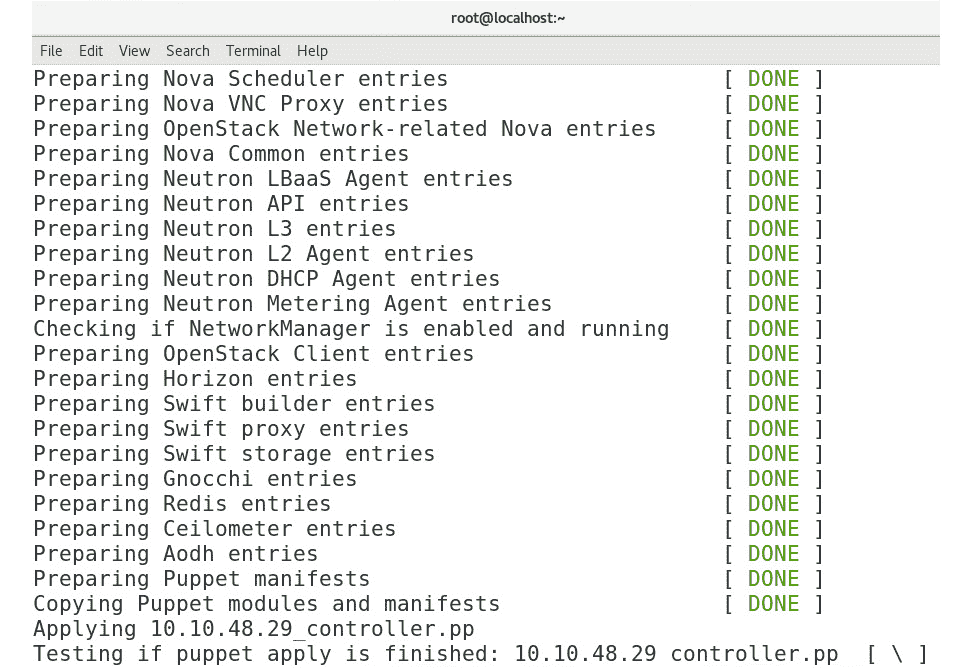

图 12.7 – 欣赏 Packstack 的安装详细程度

安装完成后，您将获得一个类似于此的报告屏幕：

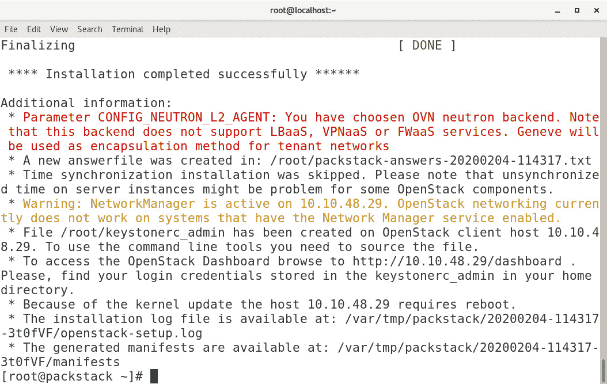

图 12.8 – 成功的 Packstack 安装

安装程序已成功完成，并且它向我们发出了关于`NetworkManager`和内核更新的警告，这意味着我们需要重新启动系统。重新启动并检查`/root/keystonerc_admin`文件以获取我们的用户名和密码后，Packstack 已经准备就绪，我们可以通过使用上一个屏幕输出中提到的 URL（`http://IP_or_hostname_where_PackStack_is_deployed/dashboard`）进行登录：

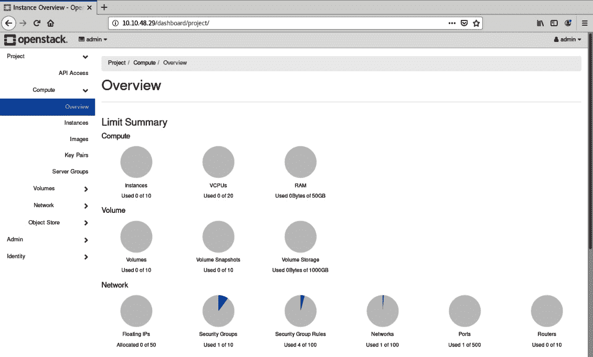

图 12.9 – Packstack UI

还有一些额外的配置需要完成，如 Packstack 文档中所述[`wiki.openstack.org/wiki/Packstack`](https://wiki.openstack.org/wiki/Packstack)。如果您要使用外部网络，您需要一个没有`NetworkManager`的静态 IP 地址，并且您可能要配置`firewalld`或完全停止它。除此之外，您可以开始将其用作演示环境。

# 为 OpenStack 环境进行配置

在创建第一个 OpenStack 配置时，最简单且最困难的任务之一将是配置。基本上有两种方法可以选择：一种是在精心准备的硬件配置中逐个安装服务，而另一种是只需使用 OpenStack 网站上的*单服务器安装*指南，创建一台作为测试平台的单台机器。在本章中，我们所做的一切都是在这样的实例中创建的，但在学习如何安装系统之前，我们需要了解其中的区别。

OpenStack 是一个云操作系统，其主要思想是使我们能够使用多台服务器和其他设备创建一个一致、易于配置的云，可以通过 API 或 Web 服务器从中心点进行管理。OpenStack 的部署规模和类型可以从运行所有内容的单个服务器到跨多个数据中心集成的数千台服务器和存储单元。OpenStack 在大规模部署方面没有问题；通常唯一的限制因素是我们尝试创建的环境的成本和其他要求。

我们多次提到了可扩展性，这正是 OpenStack 在两方面的闪光之处。令人惊奇的是，它不仅可以轻松扩展，而且还可以缩小规模。一个适用于单个用户的安装可以在单台机器上完成 - 甚至在单台机器内的单个虚拟机上完成 - 因此您将能够在笔记本电脑的虚拟环境中拥有自己的云。这对于测试很好，但其他用途不大。

在创建工作、可扩展的云时，遵循特定角色和服务的指南和推荐配置要求是前进的唯一途径，显然这也是在需要创建生产环境时的最佳选择。话虽如此，在单台机器和一千台服务器的安装之间，有很多方式可以塑造和重新设计您的基础架构，以支持您特定的用例场景。

让我们首先快速地在另一个虚拟机内进行安装，这是可以在更快的主机上在 10 分钟内完成的任务。对于我们的平台，我们决定安装 Ubuntu 18.04.3 LTS，以便将主机系统保持到最小。关于我们尝试做的事情，Ubuntu 的整个指南都可以在[`docs.openstack.org/devstack/latest/guides/single-machine.html`](https://docs.openstack.org/devstack/latest/guides/single-machine.html)上找到。

我们必须指出的一件事是，OpenStack 网站提供了一些不同安装方案的指南，无论是在虚拟还是裸机硬件上，它们都非常容易遵循，因为文档直截了当。一旦您手动完成了一些步骤，还有一个简单的安装脚本可以处理一切。

硬件要求要小心。有一些很好的资源可供参考。从这里开始：[`docs.openstack.org/newton/install-guide-rdo/overview.html#figure-hwreqs`](https://docs.openstack.org/newton/install-guide-rdo/overview.html#figure-hwreqs)。

## 逐步安装 OpenStack

我们需要做的第一件事是创建一个将安装整个系统的用户。由于许多事情都需要系统范围的权限，这个用户需要具有`sudo`权限。

以 root 用户或通过`sudo`创建用户：

```
useradd -s /bin/bash -d /opt/stack -m stack
chmod 755 /opt/stack
```

接下来我们需要做的是允许这个用户使用`sudo`：

```
echo "stack ALL=(ALL) NOPASSWD: ALL" >> /etc/sudoers
```

我们还需要安装`git`并切换到我们新创建的用户：

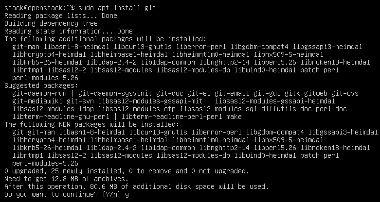

图 12.10 - 安装 git，部署 OpenStack 的第一步

现在是有趣的部分。我们将克隆（复制最新版本的）`devstack`，这是安装脚本，将为我们提供在此机器上运行和使用 OpenStack 所需的一切：

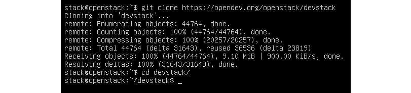

图 12.11 - 使用 git 克隆 devstack

现在需要一点配置。在我们刚刚克隆的目录中的`samples`目录中，有一个名为`local.conf`的文件。使用它来配置安装程序需要的所有内容。网络是必须手动配置的一件事 - 不仅是本地网络，它是将您连接到互联网的网络，还有内部网络地址空间，它将用于 OpenStack 实例之间需要执行的所有操作。还需要设置不同服务的不同密码。所有这些都可以在示例文件中阅读到。关于如何精确配置这些的说明既可以在我们之前给出的网址上找到，也可以在文件本身中找到：

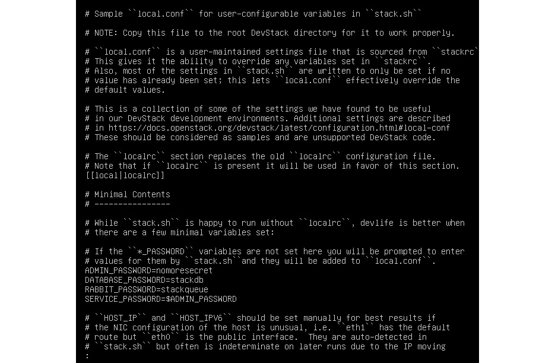

图 12.12 - 安装程序配置

安装过程中可能会出现一些问题，因此由于以下原因，安装可能会出现两次中断：

+   `/opt/stack/.cache`的所有权是`root:root`，而不是`stack:stack`。在运行安装程序之前，请更正此所有权；

+   安装程序问题（已知问题），因为它无法安装一个组件然后失败。解决方案相当简单 - 需要更改 inc 目录中名为 python 的文件中的一行。在撰写本文时，该文件的第 192 行需要从`$cmd_pip $upgrade \`更改为`$cmd_pip $upgrade --ignore-installed \`

最后，在收集了所有数据并修改了文件之后，我们确定了这个配置：


图 12.13 - 示例配置

这些参数中大多数是可以理解的，但让我们先讨论其中的两个：`FLOATING_RANGE`和`FIXED_RANGE`。`FLOATING_RANGE`参数告诉我们的 OpenStack 安装将使用哪个网络范围用于*私有*网络。另一方面，`FIXED_RANGE`是 OpenStack 配置的虚拟机将使用的网络范围。基本上，在 OpenStack 环境中配置的虚拟机将从`FIXED_RANGE`获得内部地址。如果虚拟机也需要从外部世界可用，我们将从`FLOATING_RANGE`分配一个网络地址。请注意`FIXED_RANGE`，因为它不应该与您的环境中现有的网络范围匹配。

我们从指南中所给出的内容中做出的一个改变是将 Swift 安装中的副本数减少到一个。这样做会使我们失去冗余，但会减少存储空间并加快速度。在生产环境中不要这样做。

根据您的配置，您可能还需要在文件中设置`HOST_IP`地址变量。在这里，将其设置为您当前的 IP 地址。

然后运行`./stack.sh`。

运行脚本后，一个非常冗长的安装过程将开始，并在屏幕上输出大量行。等待它完成 - 这将需要一段时间并从互联网下载大量文件。最后，它将给出一个安装摘要，看起来像这样：

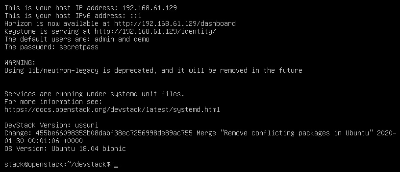

图 12.14 - 安装摘要

完成后，如果一切正常，您应该在本地机器上拥有一个完整运行的 OpenStack 版本。为了验证这一点，使用 Web 浏览器连接到您的机器；应该出现一个欢迎界面：

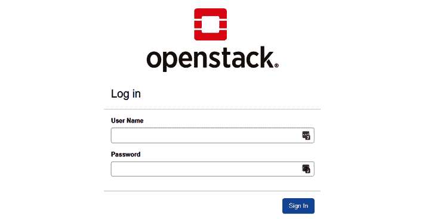

图 12.15 - OpenStack 登录界面

使用安装后您机器上写的凭据登录（默认管理员名称是`admin`，密码是在安装服务时在`local.conf`中设置的密码），您将会看到一个显示云统计信息的屏幕。您看到的屏幕实际上是一个 Horizon 仪表板，是提供您一目了然的有关云的所有信息的主要屏幕。

## OpenStack 管理

查看 Horizon 左上角，我们可以看到默认配置的三个不同部分。第一个 - **项目** - 包括有关默认实例及其性能的所有内容。在这里，您可以创建新实例、管理图像，并处理服务器组。我们的云只是一个核心安装，所以我们只有一个服务器和两个定义的区域，这意味着我们没有安装服务器组：

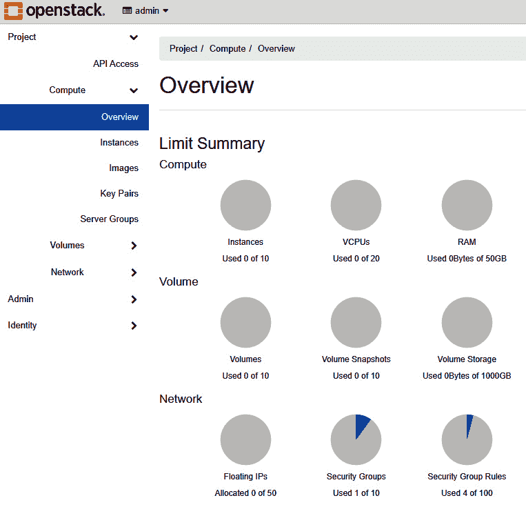

图 12.16 – 基本的 Horizon 仪表板

首先，让我们创建一个快速实例来展示如何完成这个过程：

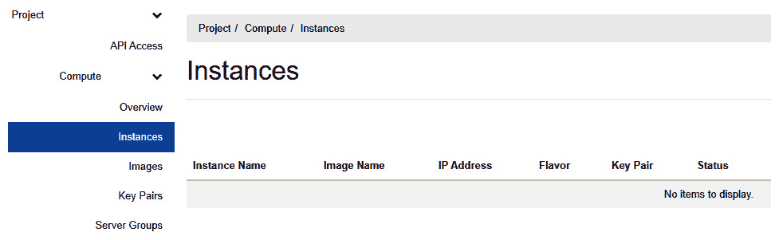

图 12.17 – 创建实例

按照以下步骤创建一个实例：

1.  转到屏幕的最右侧的**启动实例**。将打开一个窗口，让您可以为 OpenStack 提供创建新 VM 实例所需的所有信息：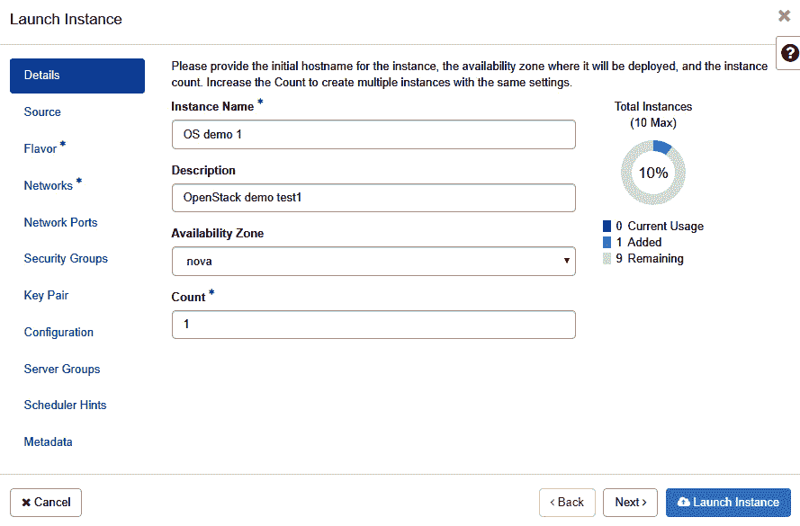

图 12.18 – 启动实例向导

1.  在下一个屏幕上，您需要提供图像来源。我们已经提到 glances - 这些图像来自 Glance 存储，并且可以是图像快照、现成的卷，或卷快照。如果需要的话，我们也可以创建一个持久图像。您会注意到，与几乎任何其他部署过程相比，有两个不同之处。首先，我们默认使用现成的图像，因为已经为我们提供了一个。另一个重要的事情是能够创建一个新的持久卷来存储我们的数据，或者在完成图像后将其删除，或者根本不创建它。

选择您在公共存储库中分配的一个图像；它应该与以下截图中显示的类似。CirrOS 是 OpenStack 提供的一个测试图像。它是一个被设计为尽可能小并且能够轻松测试整个云基础架构的最小 Linux 发行版，但尽可能不显眼。CirrOS 基本上是一个操作系统占位符。当然，我们需要点击**启动实例**按钮进入下一步：

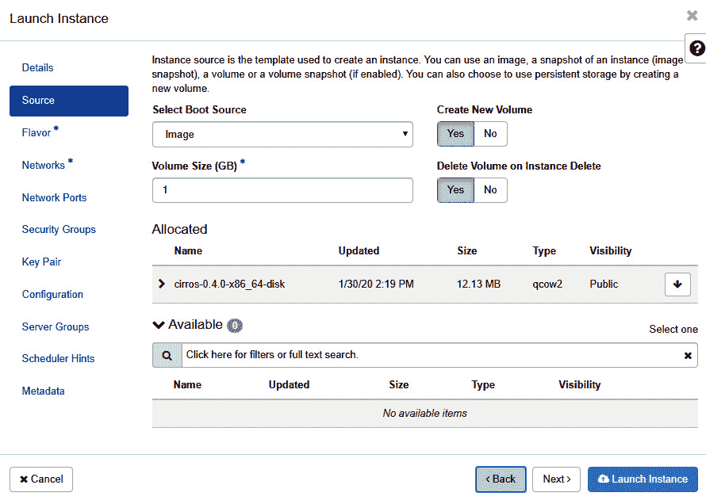

图 12.19 – 选择实例来源

1.  创建新镜像的下一个重要部分是选择规格。这是 OpenStack 中另一个奇怪命名的东西。规格是某些资源的组合，基本上为新实例创建了一个计算、内存和存储模板。我们可以选择从具有最少 64MB RAM 和 1 vCPU 的实例开始，一直到我们的基础设施可以提供的程度：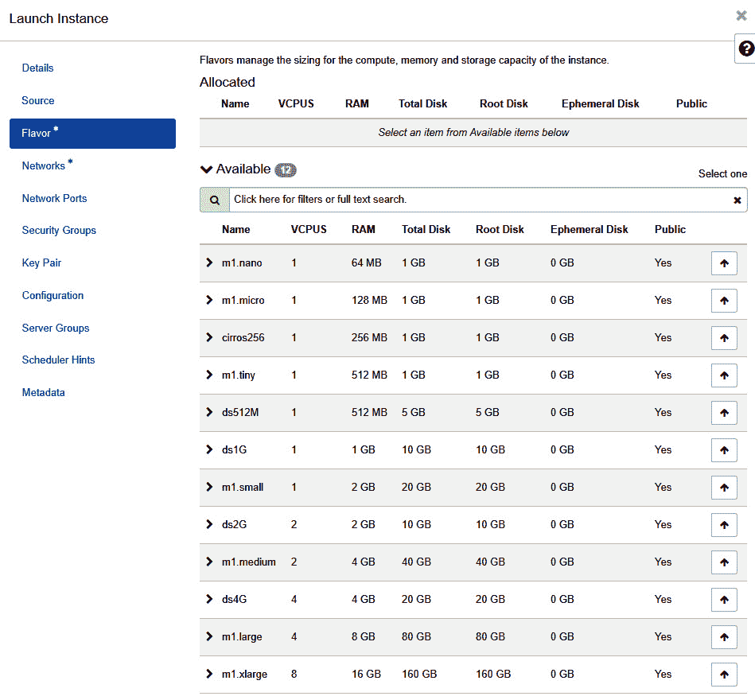

图 12.20 – 选择实例规格

在这个特定的示例中，我们将选择`cirros256`，这是一种基本上设计为为我们的测试系统提供尽可能少的资源的规格。

1.  我们实际上需要选择的最后一件事是网络连接。我们需要设置实例在运行时可以使用的所有适配器。由于这是一个简单的测试，我们将使用我们拥有的两个适配器，即内部和外部适配器。它们被称为`public`和`shared`：

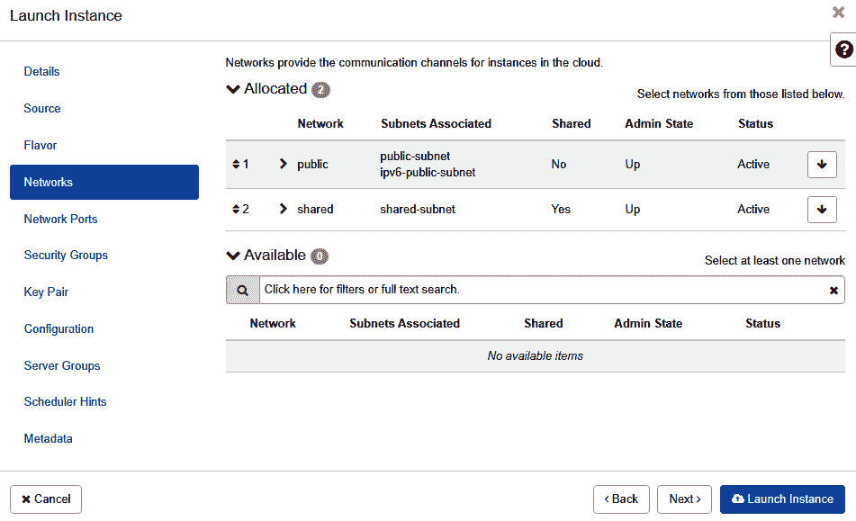

图 12.21 – 实例网络配置

现在，我们可以启动我们的实例，它将能够引导。一旦您点击**启动实例**按钮，创建新实例可能需要不到一分钟。在实例部署过程中，显示其当前进度和实例状态的屏幕将自动更新。

一旦完成，我们的实例将准备就绪：


图 12.22 - 实例已准备好

我们将快速创建另一个实例，然后创建一个快照，以便向您展示镜像管理的工作原理。如果您点击实例列表右侧的**创建快照**按钮，Horizon 将创建一个快照，并立即将您放入用于镜像管理的界面：

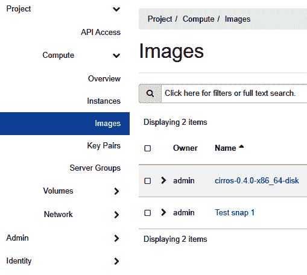

图 12.23 - 图像

现在，我们有两个不同的快照：一个是启动镜像，另一个是正在运行的镜像的实际快照。到目前为止，一切都很简单。那么从快照创建实例呢？只需点击一下！您需要做的就是点击右侧的**启动实例**按钮，然后按照创建新实例的向导进行操作。

我们短暂示例的实例创建的最终结果应该是这样的：

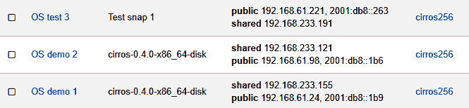

图 12.24 - 新实例创建完成

我们可以看到有关我们实例的所有信息，它们的 IP 地址是什么，它们的规格（这转化为为特定实例分配了多少资源），镜像正在运行的可用区域，以及当前实例状态的信息。我们接下来要检查的是左侧的**卷**选项卡。当我们创建实例时，我们告诉 OpenStack 为第一个实例创建一个永久卷。如果我们现在点击**卷**，我们应该会看到卷在一个数字名称下：

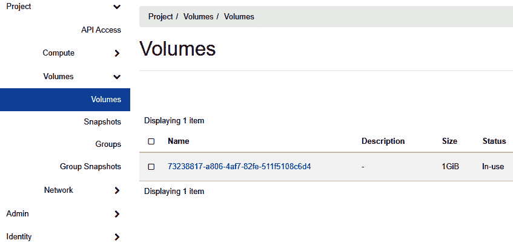

图 12.25 - 卷

从这个屏幕上，我们现在可以对卷进行快照，重新连接到不同的实例，甚至将其上传为镜像到存储库。

左侧的第三个选项卡名为**网络**，包含有关当前配置设置的更多信息。

如果我们点击**网络拓扑**选项卡，我们将得到当前运行网络的整个网络拓扑，显示在简单的图形显示中。我们可以选择**拓扑**和**图形**，两者基本上代表相同的东西：

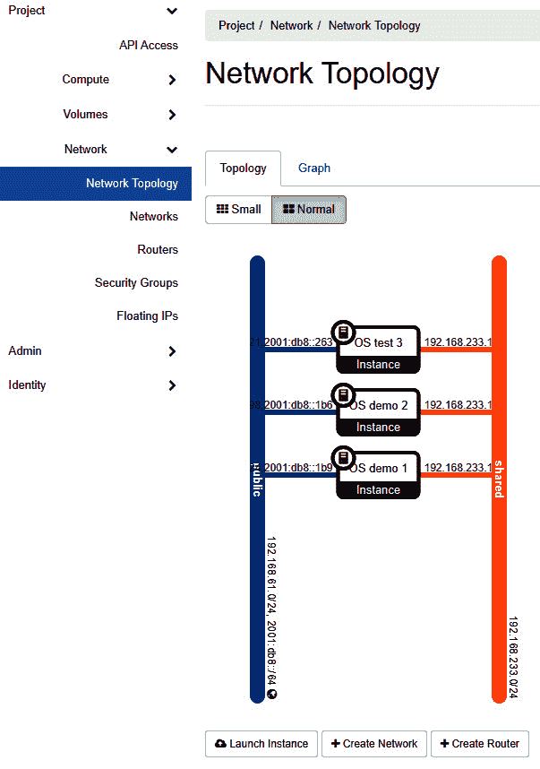

图 12.26 - 网络拓扑

如果我们需要创建另一个网络或更改网络矩阵中的任何内容，我们可以在这里进行。我们认为这真的很适合管理员使用，而且也很适合文档使用。这两点使我们下一个主题 - 日常管理 - 变得更加容易。

## 日常管理

我们或多或少已经完成了与**项目**数据中心日常任务管理有关的最重要选项。如果我们点击名为**管理**的选项卡，我们会注意到我们打开的菜单结构看起来很像**项目**下的菜单结构。这是因为现在我们正在查看与云基础设施有关的管理任务，而不是与我们特定逻辑数据中心的基础设施有关，但这两者都存在相同的构建模块。然而，如果我们 - 例如 - 打开**计算**，会出现完全不同的选项集：

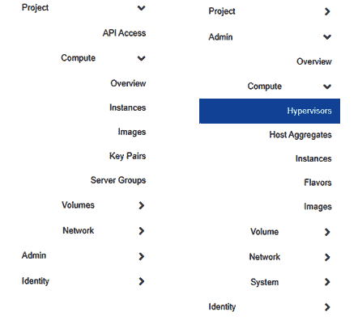

图 12.27 - 不同的可用配置选项

界面的这一部分用于完全管理构成我们基础设施的部分，以及定义我们在*数据中心*工作时可以使用的不同事物。当以用户身份登录时，我们可以添加和删除虚拟机，配置网络，并使用资源，但要上线资源，添加新的 hypervisors，定义规格，以及执行这些完全改变基础设施的任务，我们需要被分配管理角色。一些功能重叠，例如界面的管理部分和用户特定部分，它们都可以控制实例。然而，管理部分具有所有这些功能，用户可以调整其一组命令，例如无法删除或创建新实例。

管理视图使我们能够更直接地监视我们的节点，不仅通过它们提供的服务，还可以通过关于特定主机和其上使用的资源的原始数据：

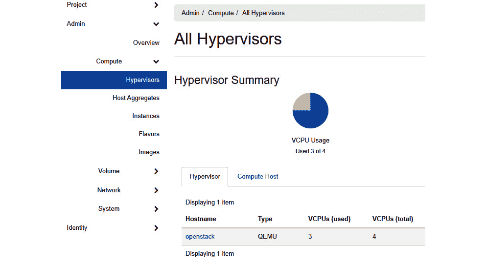

图 12.28 - 数据中心中可用的 hypervisors

我们的数据中心只有一个 hypervisor，但我们可以看到其上物理可用资源的数量，以及当前设置在这一特定时刻使用的这些资源的份额。

规格也是 OpenStack 整体的重要组成部分。我们已经提到它们是预定义的资源预设集，形成实例将在其上运行的平台。我们的测试设置已经定义了一些规格，但我们可以删除此设置中提供的规格，并创建符合我们需求的新规格。

由于云的目的是优化资源管理，规格在这一概念中起着重要作用。在规划和设计方面，创建规格并不是一项容易的任务。首先，它需要深入了解在给定的硬件平台上可能发生的事情，甚至存在多少和什么样的计算资源，以及如何充分利用它。因此，我们需要妥善规划和设计。另一件事是，我们实际上需要了解我们正在为何种负载做准备。它是内存密集型的吗？我们是否有许多需要简单配置的节点的小服务？我们是否需要大量的计算能力和/或大量的存储？这些问题的答案不仅能让我们创建客户想要的东西，还能创建让用户充分利用我们基础设施的规格。

基本思想是创建规格，为个别用户提供足够的资源，以满足其工作需求。在拥有 10 个实例的部署中，这并不明显，但一旦我们遇到成千上万个实例，一个总是留下 10％存储空间未使用的规格将迅速消耗我们的资源，并限制我们为更多用户提供服务的能力。在规划和设计我们的环境中，找到我们拥有的资源和我们以特定方式提供给用户使用之间的平衡可能是最困难的任务：

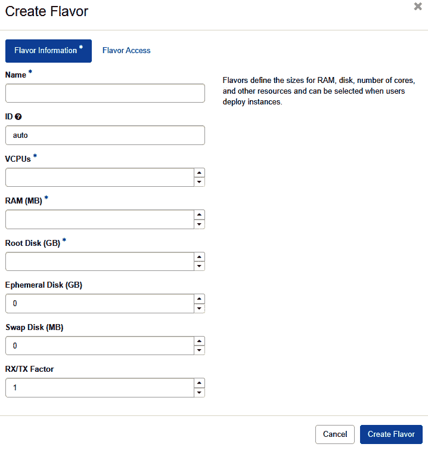

图 12.29 - 创建规格向导

创建规格是一项简单的任务。我们需要做以下事情：

1.  给它一个名称；ID 将自动分配。

1.  为我们的规格设置 vCPU 和 RAM 的数量。

1.  选择基本磁盘的大小，以及一个临时磁盘，不包括在任何快照中，并在虚拟机终止时被删除。

1.  选择交换空间的大小。

1.  选择 RX/TX 因子，以便我们可以在网络级别创建一些 QoS。一些规格将需要比其他规格更高的网络流量优先级。

OpenStack 允许一个项目拥有多个规格，并且一个规格属于不同的项目。现在我们已经了解了这一点，让我们与用户身份一起工作，并为他们分配一些对象。

## 身份管理

左侧最后一个选项卡是**身份**，负责处理用户、角色和项目。在这里，我们不仅要配置我们的用户名，还要配置用户角色、组和用户可以使用的项目：

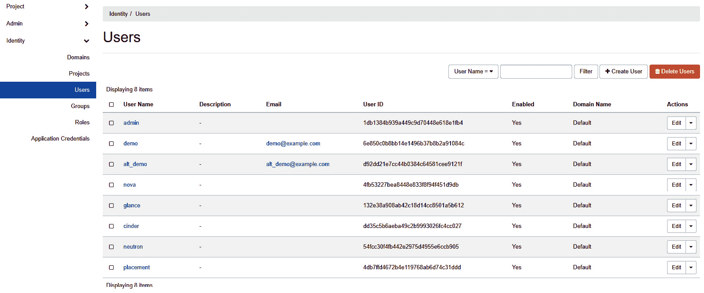

图 12.30 - 用户、组和角色管理

我们不会深入讨论用户是如何管理和安装的，只是涵盖用户管理的基础知识。与往常一样，OpenStack 网站上的原始文档是学习更多知识的好地方。确保您查看此链接：[`docs.openstack.org/keystone/pike/admin/cli-manage-projects-users-and-roles.html`](https://docs.openstack.org/keystone/pike/admin/cli-manage-projects-users-and-roles.html)。

简而言之，一旦您创建了一个项目，您需要定义哪些用户能够查看和处理特定项目。为了简化管理，用户也可以成为组的一部分，然后您可以将整个组分配给一个项目。

这种结构的重点是使管理员不仅限制用户可以管理的内容，还限制特定项目可用的资源数量。让我们举个例子。如果我们转到**项目**并编辑一个现有项目（或创建一个新项目），我们将在配置菜单中看到一个名为**配额**的选项卡，它看起来像这样：

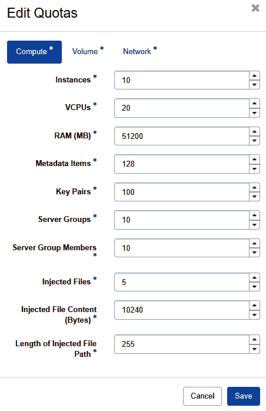

图 12.31 - 默认项目的配额

一旦您创建了一个项目，您可以将所有资源分配为配额的形式。这种分配限制了特定实例组的最大可用资源。用户无法查看整个系统；他们只能*看到*和利用通过项目可用的资源。如果用户是多个项目的一部分，他们可以根据其在项目中的角色创建、删除和管理实例，并且他们可用的资源是特定于项目的。

接下来，我们将讨论 OpenStack/Ansible 集成，以及这两个概念共同工作的一些潜在用例。请记住，OpenStack 环境越大，我们将为它们找到的用例就越多。

# 将 OpenStack 与 Ansible 集成

处理任何大规模应用程序都不容易，如果没有正确的工具，可能会变得不可能。OpenStack 为我们提供了许多直接编排和管理大规模水平部署的方式，但有时这还不够。幸运的是，在我们的工具库中，我们还有另一个工具 - **Ansible**。在*第十一章*，*用于编排和自动化的 Ansible*中，我们介绍了一些其他使用 Ansible 部署和配置单个机器的较小方式，因此我们不会回到那里。相反，我们将专注于 Ansible 在 OpenStack 环境中的优势。

有一件事我们必须搞清楚，那就是在 OpenStack 环境中使用 Ansible 可以基于两种非常不同的场景。一种是使用 Ansible 来处理部署的实例，这在所有其他云或裸金属部署中看起来几乎是一样的。作为大量实例的管理员，您创建一个管理节点，它只是一个启用 Python 的服务器，添加了 Ansible 软件包和 playbooks。之后，您整理部署清单，准备好管理您的实例。这种情况不是本章的重点。

我们在这里讨论的是使用 Ansible 来管理云本身。这意味着我们不是在 OpenStack 云内部部署实例；我们是为 OpenStack 本身部署计算和存储节点。

我们所说的环境有时被称为**OpenStack-Ansible**（**OSA**），并且足够常见，以至于有自己的部署指南，位于以下 URL：[`docs.openstack.org/project-deploy-guide/openstack-ansible/latest/`](https://docs.openstack.org/project-deploy-guide/openstack-ansible/latest/)。

在 OpenStack-Ansible 中，最小安装的要求要比单个 VM 或单台机器上的要求大得多。这不仅是因为系统需要所有资源；还有需要使用的工具和背后的哲学。

让我们快速了解 Ansible 在 OpenStack 方面的含义：

+   一旦配置完成，它就能快速部署任何类型的资源，无论是存储还是计算。

+   它确保您在过程中没有忘记配置某些内容。在部署单个服务器时，您必须确保一切正常，并且配置错误易于发现，但在部署多个节点时，错误可能会潜入并降低系统的性能，而没有人注意到。避免这种情况的正常部署实践是安装清单，但 Ansible 比那更好。

+   更简化的配置更改。有时，我们需要对整个系统或其中的一部分应用配置更改。如果没有脚本化，这可能会很令人沮丧。

因此，说了这么多，让我们快速浏览一下[`docs.openstack.org/openstack-ansible/latest/`](https://docs.openstack.org/openstack-ansible/latest/)，看看官方文档对如何部署和使用 Ansible 和 OpenStack 的建议。

OpenStack 在 Ansible 方面为管理员提供了什么？最简单的答案是 playbooks 和 roles。

要使用 Ansible 部署 OpenStack，基本上需要创建一个部署主机，然后使用 Ansible 部署整个 OpenStack 系统。整个工作流程大致如下：

1.  准备部署主机

1.  准备目标主机

1.  为部署配置 Ansible

1.  运行 playbooks 并让它们安装所有内容

1.  检查 OpenStack 是否正确安装

当我们谈论部署和目标主机时，我们需要明确区分：部署主机是一个单一实体，包含 Ansible、脚本、playbooks、角色和所有支持的部分。目标主机是实际将成为 OpenStack 云一部分的服务器。

安装的要求很简单：

+   操作系统应该是 Debian、Ubuntu CentOS 或 openSUSE（实验性）的最小安装，具有最新的内核和完整的更新。

+   系统还应该运行 Python 2.7，启用 SSH 访问并进行公钥身份验证，并启用 NTP 时间同步。这涵盖了部署主机。

+   不同类型的节点也有通常的建议。计算节点必须支持硬件辅助虚拟化，但这是一个明显的要求。

+   还有一个应该不言而喻的要求，那就是使用多核处理器，尽可能多的核心，以加快某些服务的运行速度。

磁盘要求真的取决于你。OpenStack 建议尽可能使用快速磁盘，建议在 RAID 中使用 SSD 驱动器，并为块存储提供大型磁盘池。

+   基础设施节点有不同于其他类型节点的要求，因为它们运行一些随时间增长并且需要至少 100 GB 空间的数据库。基础设施还以容器形式运行其服务，因此它将以与其他计算节点不同的方式消耗资源。

部署指南还建议运行日志主机，因为所有服务都会创建日志。推荐的磁盘空间至少为 50 GB，但在生产环境中，这将迅速增长数量级。

OpenStack 需要一个快速、稳定的网络才能正常工作。由于 OpenStack 中的所有内容都依赖于网络，建议使用任何可能加快网络访问速度的解决方案，包括使用 10G 和绑定接口。安装部署服务器是整个过程的第一步，因此我们将在下一步进行。

## 安装 Ansible 部署服务器

我们的部署服务器需要及时更新所有升级，并安装 Python、`git`、`ntp`、`sudo`和`ssh`支持。安装所需的软件包后，您需要配置`ssh`密钥以便能够登录到目标主机。这是 Ansible 的要求，也是一种利用安全性和便利性的最佳实践。

网络很简单-我们的部署主机必须与所有其他主机保持连接。部署主机还应安装在网络的 L2 上，该网络专为容器管理而设计。

然后，应该克隆存储库：

```
# git clone -b 20.0.0 https://opendev.org/openstack/openstack-ansible /opt/openstack-ansible
```

接下来，需要运行一个 Ansible 引导脚本：

```
# scripts/bootstrap-ansible.sh
```

这就完成了准备 Ansible 部署服务器的工作。现在，我们需要准备要用于 OpenStack 的目标计算机。目标计算机目前支持 Ubuntu Server（18.04）LTS、CentOS 7 和 openSUSE 42.x（在撰写本文时，仍然没有 CentOS 8 支持）。您可以使用这些系统中的任何一个。对于每个系统，都有一个有用的指南，可以帮助您快速上手：[`docs.openstack.org/project-deploy-guide/openstack-ansible/latest/deploymenthost.html`](https://docs.openstack.org/project-deploy-guide/openstack-ansible/latest/deploymenthost.html)。我们将解释一般步骤以便您轻松安装，但实际上，只需从[`www.openstack.org/`](https://www.openstack.org/)复制并粘贴已发布的命令即可。

无论您决定在哪个系统上运行，都必须完全更新系统更新。之后，安装`linux-image-extra`软件包（如果适用于您的内核），并安装`bridge-utils`、`debootstrap`、`ifenslave`、`lsof`、`lvm2`、`chrony`、`openssh-server`、`sudo`、`tcpdump`、`vlan`和 Python 软件包。还要启用绑定和 VLAN 接口。所有这些东西可能适用于您的系统，也可能不适用，因此如果某些内容已安装或配置，只需跳过即可。

在`chrony.conf`中配置 NTP 时间同步，以在整个部署中同步时间。您可以使用任何时间源，但为了系统正常工作，时间必须同步。

现在，配置`ssh`密钥。Ansible 将使用`ssh`和基于密钥的身份验证进行部署。只需将部署机器上适当用户的公钥复制到`/root/.ssh/authorized_keys`。通过从部署主机登录到目标机器来测试此设置。如果一切正常，您应该能够无需任何密码或其他提示登录。还要注意，部署主机上的 root 用户是管理所有内容的默认用户，并且他们必须提前生成他们的`ssh`密钥，因为它们不仅用于目标主机，还用于系统中运行的所有不同服务的所有容器。在开始配置系统时，这些密钥必须存在。

对于存储节点，请注意 LVM 卷将在本地磁盘上创建，从而覆盖任何现有配置。网络配置将自动完成；您只需确保 Ansible 能够连接到目标机器即可。

下一步是配置我们的 Ansible 清单，以便我们可以使用它。让我们现在就做。

## 配置 Ansible 清单

在我们运行 Ansible playbooks 之前，我们需要完成配置 Ansible 清单，以便将系统指向应该安装的主机。我们将引用[`docs.openstack.org/project-deploy-guide/openstack-ansible/queens/configure.html`](https://docs.openstack.org/project-deploy-guide/openstack-ansible/queens/configure.html)上提供的原文：

1. 将/opt/openstack-ansible/etc/openstack_deploy 目录的内容复制到

/etc/openstack_deploy 目录。

2. 切换到/etc/openstack_deploy 目录。

3. 将 openstack_user_config.yml.example 文件复制到

/etc/openstack_deploy/openstack_user_config.yml。

4. 回顾 openstack_user_config.yml 文件并对部署进行更改

你的 OpenStack 环境。

进入配置文件后，审查所有选项。`Openstack_user_config.yml`定义了哪些主机运行哪些服务和节点。在承诺安装之前，请查看前一段提到的文档。

网上突出的一件事是`install_method`。你可以选择源或发行版。每种方法都有其优缺点：

+   源是最简单的安装方式，因为它直接从 OpenStack 官方网站的源代码中完成，并包含与所有系统兼容的环境。

+   发行版方法是根据你正在安装的特定发行版定制的，使用已知可行且稳定的特定软件包。这样做的主要缺点是更新速度会慢得多，因为不仅需要部署 OpenStack，还需要关于发行版上所有软件包的信息，并且需要验证该设置。因此，预计在升级到*源*并到达*发行版*安装之间会有很长的等待时间。安装后，您必须选择您的首选项；没有从一个选择切换到另一个的机制。

你需要做的最后一件事是打开`user_secrets.yml`文件，并为所有服务分配密码。您可以创建自己的密码，也可以使用专门为此目的提供的脚本。

## 运行 Ansible playbooks

在我们进行部署过程时，我们需要启动一些 Ansible playbooks。我们需要按照以下顺序使用这三个提供的 playbooks：

+   `setup-hosts.yml`：我们用来在 OpenStack 主机上提供必要服务的初始 Ansible playbook。

+   `setup-infrastructure.yml`：部署一些其他服务的 Ansible playbook，如 RabbitMQ、仓库服务器、Memcached 等等。

+   `setup-openstack.yml`：部署剩余服务的 Ansible playbook——Glance、Cinder、Nova、Keystone、Heat、Neutron、Horizon 等等。

所有这些 Ansible playbooks 都需要成功完成，以便我们可以将 Ansible 与 Openstack 集成。所以，唯一剩下的就是运行 Ansible playbooks。我们需要从以下命令开始：

```
# openstack-ansible setup-hosts.yml
```

您可以在`/opt/openstack-ansible/playbooks`中找到适当的文件。现在，运行剩下的设置：

```
# openstack-ansible setup-infrastructure.yml
# openstack-ansible setup-openstack.yml
```

所有 playbooks 都应该在没有不可达或失败的情况下完成。有了这个——恭喜！你刚刚安装了 OpenStack。

# 总结

在本章中，我们花了很多时间描述了 OpenStack 的架构和内部工作原理。我们讨论了软件定义的网络及其挑战，以及不同的 OpenStack 服务，如 Nova、Swift、Glance 等等。然后，我们转向实际问题，比如部署 Packstack（让我们称之为 OpenStack 的概念验证），以及完整的 OpenStack。在本章的最后部分，我们讨论了 OpenStack-Ansible 集成以及在更大的环境中可能对我们意味着什么。

现在我们已经涵盖了*私有*云方面，是时候扩展我们的环境，将其扩展到更*公共*或*混合*的方式。在基于 KVM 的基础设施中，这通常意味着连接到 AWS，将您的工作负载转移到那里（公共云）。如果我们讨论混合类型的云功能，则必须介绍一个名为 Eucalyptus 的应用程序。关于如何和为什么，请查看下一章。

# 问题

1.  VLAN 作为云覆盖技术的主要问题是什么？

1.  目前云市场上使用的云覆盖网络类型有哪些？

1.  VXLAN 是如何工作的？

1.  跨多个站点延伸 Layer 2 网络的一些常见问题是什么？

1.  什么是 OpenStack？

1.  OpenStack 的架构组件是什么？

1.  什么是 OpenStack Nova？

1.  什么是 OpenStack Swift？

1.  什么是 OpenStack Glance？

1.  什么是 OpenStack Horizon？

1.  OpenStack 的 flavors 是什么？

1.  什么是 OpenStack Neutron？

# 进一步阅读

请参考以下链接，了解本章涵盖的更多信息：

+   OpenStack 文档：[`docs.openstack.org`](https://docs.openstack.org)

+   Arista VXLAN 概述：[`www.arista.com/assets/data/pdf/Whitepapers/Arista_Networks_VXLAN_White_Paper.pdf`](https://www.arista.com/assets/data/pdf/Whitepapers/Arista_Networks_VXLAN_White_Paper.pdf)

+   红帽 - 什么是 GENEVE？：[`www.redhat.com/en/blog/what-geneve`](https://www.redhat.com/en/blog/what-geneve)

+   思科 - 使用 OpenStack 配置虚拟网络：[`www.cisco.com/c/en/us/td/docs/switches/datacenter/nexus1000/kvm/config_guide/network/5x/b_Cisco_N1KV_KVM_Virtual_Network_Config_5x/configuring_virtual_networks_using_openstack.pdf`](https://www.cisco.com/c/en/us/td/docs/switches/datacenter/nexus1000/kvm/config_guide/network/5x/b_Cisco_N1KV_KVM_Virtual_Network_Config_5x/configuring_virtual_networks_using_openstack.pdf)

+   Packstack：[`rdoproject.org`](http://rdoproject.org)
