# 第十三章：使用 AWS 扩展 KVM

如果你仔细观察，虚拟化是一个棘手的问题 - 模拟完整的计算机以便能够在其上运行操作系统是复杂的。出于明显的原因，将这些虚拟机放入云中甚至更加困难。之后，事情真的开始变得混乱。从概念上讲，创建能够按需运行的机器集群更加复杂，基于必须同时运行的机器数量之多。此外，不仅需要创建模拟计算机，还需要创建支持更大规模部署的所有网络和基础设施。创建一个全球云 - 不仅运行数百万台机器，而且几乎无处不在，甚至在地球上最偏远的地方 - 是少有公司尝试过的任务，只有少数公司成功。本章将总体介绍这些大型云提供商，然后介绍亚马逊作为其中最大的云提供商。我们的主要想法是介绍亚马逊的运作方式，它与本书中涵盖的其他主题的关系，以及如何在现实世界的真实机器上使用亚马逊提供的服务。

**亚马逊网络服务**（**AWS**）是一组独特的工具、服务和基础设施，可以在非常大规模上实现云服务，规模之大几乎难以理解。当我们谈论成千上万的站点使用数百万台服务器运行数十亿的应用程序时，甚至列举这些事物都成为一个大问题，管理是一件不仅可以跨越单一章节，而且可能需要多本书的事情。我们将尝试向您介绍 AWS 云的最重要的服务和部分，并尝试解释它们可以用于什么以及何时使用。

在本章中，我们将涵盖以下主题：

+   AWS 简介

+   为 AWS 准备和转换虚拟机

+   使用 Eucalyptus 构建混合 KVM 云

# AWS 简介

在谈论云服务时，AWS 几乎不需要介绍，尽管很少有人真正了解整个亚马逊云系统有多么庞大和复杂。完全可以肯定的是，目前它无疑是地球上最大和最常用的服务。

在我们做任何其他事情之前，我们需要谈谈 AWS 为什么如此重要，不仅是因为它对互联网的影响，还因为它对任何试图提供某种规模的任务的影响。

正如我们在本书中已经做了几次，我们将从 AWS 云的基本前提开始 - 提供一个广泛可扩展和分布式的解决方案，涵盖互联网上执行任何类型的工作负载的所有可能场景。

在本书的几乎每个其他地方，我们提到云时，我们都谈到了扩展，但当我们试图描述 AWS 能够扩展时，我们谈论的可能是地球上最大的和最常用的容量和可扩展性提供商之一。

目前，互联网上有四个真正大的云提供商：AWS、微软 Azure、谷歌云平台和阿里巴巴。由于所有数字出于商业原因是保密的，它们可以提供的服务器数量和纯粹的容量是分析师试图估计，或更频繁地是猜测的，但必须是以百万计。

## 接近云

尽管在表面上它们现在在争夺同一个云市场，但所有参与者都来自不同的背景，即使现在他们使用基础设施的方式也大不相同。在这个市场上，亚马逊是第一家，它在 IT 领域似乎几乎不可思议地领先了大约 6 年。亚马逊于 2006 年推出了其亚马逊网络服务，但它在几年前就开始了该服务的开发。甚至有一篇博客文章提到了 2004 年发布的该服务。 AWS 的想法基本上是在亚马逊意识到它拥有一个在市场上无与伦比的庞大基础设施后构想出来的，通过扩大基础设施并将其作为服务提供，它可以获利。当时，他们拥有的基础设施被用来提供 Amazon.com 服务。

这个想法与市场上的任何东西都不同。人们习惯于在数据中心中拥有共同的计算机，并能够租用云中的服务器，但租用他们需要的堆栈的一部分而不是整个硬件基础设施的概念是新的。 AWS 提供的第一个重要服务非常简单，甚至被命名为**简单存储服务**（**S3**），以及**弹性计算云**（**EC2**）。 S3 基本上是云支持的存储，为那些能够支付的人提供了几乎无限的存储资源，几乎与今天的方式相同。 EC2 提供了计算资源。

在接下来的 6 年里，提供的服务扩展到了**内容传送网络**（**CDN**）等等，而竞争对手仍在努力理解云的实际含义。

我们稍后会回到 AWS 提供的服务，但只在提到它们最终在这个每年价值数百亿美元的市场中得到的竞争之后。

微软意识到，它需要建立基础设施来支持自己和客户，这是在 2000 年代后期的某个时候。微软已经有自己的业务支持基础设施来运行公司，但当时并没有向普通公众提供公共服务。这一切在 2010 年**微软 Azure**推出后发生了变化。最初它被称为**Windows Azure**，主要用于为微软及其合作伙伴提供服务，主要是在 Windows 上。 微软很快意识到，仅在云中提供微软操作系统将会让他们失去很多客户，因此还提供了 Linux 作为可安装和使用的操作系统。

Azure 现在作为一个公开可用的云运行，但它的很大一部分仍然被微软及其服务所使用，尤其是**Office 365**和大量的微软培训和营销解决方案。

另一方面，谷歌以不同的方式进入市场。他们也意识到云服务的需求，但将他们与云的第一次接触限制在提供一个名为**App Engine**的单一服务上，这是在 2008 年。这是一个面向 Web 开发者社区的服务，谷歌甚至为该服务的有限使用提供了 10,000 个免费许可证。在本质上，这项服务以及之后推出的几乎所有服务都是基于这样的前提，即网络需要能够让开发人员快速部署可能会扩展或可能不会工作的东西。因此，免费提供意味着很多开发人员倾向于仅用于简单测试。

谷歌现在也提供了大量的服务，但当你从外部看实际的服务和定价时，似乎谷歌创建了它的云来租用其数据中心中可用的额外容量。

## 多云

回顾几年前，Azure 和 Google Cloud Platform 都有一个可行的云服务，但与 AWS 提供的服务相比，它们的服务根本不匹配。AWS 是最大的参与者，无论是市场份额还是人们的心目中。Azure 被认为更多是面向微软的，尽管其上运行的服务器有一半以上是基于 Linux 的，而 Google 则不被视为竞争对手；他们的云看起来更像是一个副业而不是一个可行的云运行提案。

然后出现了**多云**。这个想法很简单 - 不要使用单一的云来部署您的服务；使用多个云提供商来提供*数据冗余*、*可用性*和*故障转移*，最重要的是*成本降低和灵活性*。这可能听起来很奇怪，但在使用云服务时最大的成本之一是将数据从中取出。通常情况下，将数据上传到云中，或者在服务器上部署数据，要么是免费的，要么成本极低，这是有道理的，因为如果您在线上有大量数据，您更有可能在这个特定的云上使用更多的服务。一旦您需要提取数据，成本就会变得很高。这是有意为之的，它使用户被锁定在云提供商那里。一旦您上传了数据，将其保留在服务器上而不尝试离线处理它要便宜得多。但在谈论多云时，不仅要考虑数据，服务也是方程式的一部分。

### 为什么要使用多云策略？

许多公司（我们必须强调，多云用户大多是大公司，因为涉及到成本）害怕被锁定在特定的平台或技术上。其中最大的问题之一是，如果平台发生了如此大的变化，以至于公司必须重新设计其基础设施，会发生什么？想象一下，您是一家价值数十亿美元的公司，为数十万自己的用户运行企业应用程序。您选择云的原因通常是为了降低资本支出并能够扩展您的服务。您决定选择其中一个大型提供商。突然间，您的提供商决定要改变技术，并将逐步淘汰基础设施的某些部分。在这种情况下，通常意味着您当前的设置将变得更加昂贵，或者您将失去一些可用功能的一部分。幸运的是，这些事情通常会延伸数年，因为没有一个理智的云提供商会在一夜之间进行战略性的改变。

但是变化就是变化，作为一家公司，您有选择 - 留在提供商那里并面对系统价格大幅上涨的后果 - 或者重新设计系统，这也将花费金钱，并可能需要数年才能完成 - 有时甚至数十年。

因此，许多公司选择了一种非常保守的策略 - 设计一个可以在任何云上运行的系统，这意味着使用所有可用技术的最低公共分母。这也意味着该系统可以在几天内从一个云迁移到另一个云。其中一些公司甚至决定同时在不同的云上运行系统。这是一种极端保守的方法，但它是有效的。

使用多云策略的另一个重要原因与我们刚才提到的完全相反。有时，想法是使用特定的云服务或服务来完成非常专业的任务。这意味着选择来自不同提供商的不同服务来执行不同的任务，但要尽可能高效地完成。从长远来看，这也意味着不时地必须更换提供商和系统，但如果公司使用的核心系统是以此为考虑而设计的，这种方法也是有好处的。

## Shadow IT

还有另一种方式，公司可以成为一个多云环境，甚至不知道它，这通常被称为“影子 IT”。如果公司没有严格的安全政策和规定，一些员工可能会开始使用公司未提供的服务。这可能是云存储容器、视频会议系统或邮件列表提供商。在大公司中，甚至可能是整个部门开始使用来自不同云提供商的东西，甚至没有意识到。突然之间，公司数据存储在公司 IT 范围之外或无法覆盖的服务器上。

这种现象的一个更好的例子是 COVID-19 病毒全球大流行期间视频会议服务的使用方式发生了变化。几乎所有公司都有一个成熟的通信系统，通常是覆盖整个公司的消息系统。然后，一夜之间，大流行将所有工人都留在家中。由于沟通是公司运营的关键，每个人决定在一周内全球切换到视频和音频会议。接下来发生的事情可能会成为畅销书的主题。大多数公司试图坚持他们的解决方案，但几乎普遍地，这一尝试在第一天就失败了，要么是因为服务太基本或太过时，无法用作音频和视频会议解决方案，要么是因为服务没有设计用于如此大量的呼叫和请求而崩溃。

人们想要协调，所以突然之间一切都成了可能。每一个视频会议解决方案突然都成了候选。公司、部门和团队开始尝试不同的会议系统，云提供商很快意识到了这个机会——几乎所有服务立即对于规模可观的部门来说都是免费的，有些情况下，甚至允许多达 150 人参加会议。

由于需求激增，很多服务崩溃了，但大型提供商大多能够扩展到所需的规模以保持一切运转。

由于大流行是全球性的，很多人决定他们也需要一种与家人交流的方式。因此，个人用户开始在家使用不同的服务，当他们决定某种服务有效时，他们也在工作中使用它。在几天内，公司变成了一个多云环境，人们使用一个提供商进行通信，另一个提供商进行电子邮件，第三个提供商进行存储，第四个提供商进行备份。变化如此之快，以至于有时 IT 在系统上线后几天才被告知变化，而人们已经在使用它们。

这种变化如此巨大，以至于在我们写这本书的时候，我们甚至无法预测有多少这些服务将成为公司工具组合的常规部分，一旦用户意识到某些东西比公司提供的软件更好用。这些服务通过能够在这样的重大灾难中持续工作进一步证明了这一点，因此公司范围的软件使用政策对于阻止这种混乱的多云方法能做的事情是有限的。

## 市场份额

每当提到云计算公司和服务时，每个人都会提到它们的市场份额。我们也需要解决这一点，因为我们说过我们在谈论“最大的”或“第二大”的。在多云成为一种趋势之前，市场份额基本上分为亚马逊 AWS 占据最大市场份额；微软 Azure 居于遥远的第二位；其次是谷歌和一大群“小”提供商，如阿里巴巴、甲骨文、IBM 等。

一旦多云成为一种趋势，最大的问题就是如何确定谁拥有最大的实际市场份额。所有大公司开始使用不同的云服务提供商，而简单地尝试累加提供商的市场份额变得困难。从不同的调查中可以清楚地看出，亚马逊仍然是领先的提供商，但公司们慢慢开始与亚马逊服务一起使用其他提供商。

这意味着，目前，AWS 仍然是首选的云服务提供商，但选择本身不再仅限于单一提供商。人们也在使用其他提供商。

## 大型基础设施但没有服务

有时，试图划分市场份额还有另一个必须考虑的观点。如果我们谈论云服务提供商，通常认为我们在谈论拥有最大基础设施来支持云服务的公司。有时，实际上，我们实际上在比较那些在市场上拥有最大服务组合的公司。我们指的是什么？

有一个明显的公司拥有庞大的云存在，但几乎完全使用自己的基础设施来提供自己的内容 - Facebook。尽管很难通过服务器数量、数据中心或任何其他指标来比较基础设施的规模，因为这些数字是严格保密的，但 Facebook 的基础设施规模与 AWS 相当。真正的区别在于，这种基础设施不会为第三方提供服务，实际上，它从来就不是为此而设计的；Facebook 创建的一切都是为了支持自身，包括选择数据中心的位置、配置和部署硬件以及创建软件。Facebook 不会突然变成另一个 AWS；它太大了。可用的基础设施并不总是与云市场份额相关。

## 定价

另一个我们必须涵盖的话题，即使只是提及，就是定价。本书中几乎每次提到云都是技术性的。我们比较了可能有意义的每一个指标，从**IOPS**，通过**GHz**，到网络端的**PPS**，但云不仅仅是一个技术问题 - 当你必须将其投入使用时，有人必须为此付费。

定价是云世界中的热门话题，因为竞争激烈。所有云服务提供商都有他们的定价策略，折扣和特别交易几乎成为常态，所有这些使得理解定价变成一场噩梦，特别是对于那些对所有不同模式都是新手的人。有一点是确定的，所有提供商都会说他们只会按照你的使用量收费，但是定义他们实际指的是什么可能会成为一个大问题。

在开始规划部署成本时，你应该首先停下来，尝试定义你需要什么，你需要多少，以及你是否正在以云的方式使用它。迄今为止最常见的错误是认为云在任何形式上都类似于使用普通服务器。人们首先注意到的是特定实例在特定数据中心运行特定配置的价格。价格通常要么是实例的月费用，并且通常是按比例计算的，因此你只支付你使用的部分，要么价格是以不同的时间单位给出 - 每天、每小时，甚至每秒。这应该是你的第一个线索：你支付使用实例的费用，因此为了降低成本，不要让你的实例一直运行。这也意味着你的实例必须被设计成可以根据需求快速启动和关闭，因此使用安装单个或多个服务器并一直运行它们的*标准*方法在这里不一定是一个好选择。

在选择实例时，选项实在太多，这里无法一一列举。所有的云提供商都有自己关于人们需求的想法，所以你不仅可以选择简单的东西，比如处理器数量或内存量，还可以获得预安装的操作系统，以及各种各样的存储和网络选项。存储是一个特别复杂的话题，我们在这里只是简单地触及一下，并且稍后再提及。所有的云提供商都提供两种东西 - 一些用于连接到实例的存储，以及一些用作服务的存储。一个给定的提供商提供的东西可能取决于你尝试请求的实例，你尝试在其中请求的数据中心，以及其他一些因素。预期你将不得不平衡三件事：容量、定价和速度。当然，在这里，我们谈论的是实例存储。作为服务的存储更加复杂，你不仅需要考虑定价和容量，还需要考虑其他因素，比如延迟、带宽等等。

例如，AWS 让你可以选择各种服务，从数据库存储、文件存储和长期备份存储，到不同类型的块和对象存储。为了最佳地使用这些服务，你需要首先了解提供了什么，以什么方式提供，涉及了哪些不同的成本，以及如何利用它们。

你会很快注意到的另一件事是，当云提供商说一切都是服务时，他们是认真的。完全有可能运行一个应用程序而没有一个单独的服务器实例。通过将不同的服务拼接在一起可以完成任务，这是有意设计的。这创造了一个极其灵活的基础设施，一个可以快速、轻松扩展的基础设施，但不仅需要一种不同的编写代码的方式，还需要一种完全不同的思维方式来设计你需要的解决方案。如果你没有经验，找一个专家，因为这是你解决方案的根本问题。它必须在云上运行，而不是在云中的虚拟机上运行。

我们给你的建议很简单 - *多读文档*。所有的提供商都有出色的资源，可以让你了解他们的服务提供了什么，以及如何提供，但这些数千页的文档不会告诉你它与竞争对手相比如何，更重要的是，连接服务的最佳方式是什么。在支付云服务时，预期你会偶尔犯错并为此付费。这就是为什么在部署服务时使用按需付费选项是有用的 - 如果你犯了一个错误，你不会产生巨额账单；你的基础设施将会停止。

谈到定价时要提及的另一件事是，一切都有一点成本，但给定配置的综合价格可能会很高。任何额外的资源都会花钱。*服务器之间的内部链接*，*外部 IP 地址*，*防火墙*，*负载均衡器*，*虚拟交换机*，这些通常在设计基础设施时我们甚至都不会考虑的东西，但一旦我们在云中需要它们，它们就会变得昂贵。另一个要预料的事情是，一些服务有不同的上下文 - 例如，如果你在实例之间传输数据或者传输到外部世界，网络带宽的价格可能会不同。存储也是一样 - 正如我们在本章前面提到的，大多数提供商在存储和从云中获取数据时会向你收取不同的价格。

## 数据中心

在本章中，我们已经几次提到了数据中心，重要的是我们谈一下它们。数据中心是云基础设施的核心，而且方式远不止你所想的那样。当我们谈论大量服务器时，我们提到我们通常将它们分组放入机架，并将机架放入数据中心。你可能知道，数据中心本质上是一组带有所有服务器需要的基础设施的机架，无论是在电源和数据方面，还是在冷却、保护和保持服务器运行所需的其他方面。它们还需要被逻辑地划分为我们通常称之为“故障域”的“风险区域”，以便我们可以避免与“我们把所有东西都部署在一个机架上”或“我们把所有东西都部署在一个物理服务器上”的各种风险相关的问题。

在任何情况下，数据中心都是复杂的基础设施元素，因为它需要一系列因素的组合才能高效、安全和冗余。将一组服务器放入机架中是相当容易的，但提供冷却和电源却不是一件简单的任务。此外，如果你想让你的服务器工作，冷却、电源和数据都必须是冗余的，而且所有这些都需要保护，不仅免受火灾、洪水、地震和人为破坏，而且真正运行数据中心的成本可能很高。当然，运行几百台服务器的数据中心并不像运行数千台甚至数万台的数据中心那样复杂，而且随着设施规模的增加，价格也会上涨。此外，拥有多个数据中心会在连接它们时产生额外的基础设施挑战，因此成本会不断增加。

现在将这个成本乘以一百，因为这是每个云提供商在世界各地保留的数据中心数量。一些中心很小，一些很大，但游戏的名字很简单——*网络*。为了成为一个真正的全球提供商，所有这些中心都必须有一个数据中心，或者至少有几台服务器，尽可能靠近你。如果你正在世界上几乎任何一个大国家的大城市中阅读这篇文章，很可能在你的 100 英里半径范围内有一个亚马逊、微软或谷歌拥有的服务器。所有提供商都努力在每个大城市的每个国家至少有一个数据中心，因为这可以让他们极快地提供一系列服务。这个概念被称为**接触点**（**POC**），意味着当连接到提供商的云时，你只需要到达最近的服务器，之后云将确保你的服务尽可能快速。

但是当我们谈论实际属于亚马逊或其他公司的数据中心时，我们仍然在处理大规模的运营。在这里，数字通常是以百计计算的，它们的位置也是秘密的，主要是出于安全原因。它们都有一些共同点。它们是高度自动化的运营，位于主要电源、主要冷却源或主要数据中心附近。理想情况下，它们应该被放置在一个同时具备这三种条件的地方，但通常这是不可能的。

## 位置是关键。

不同的公司有不同的策略，因为选择一个建立数据中心的好地方可以节省大量成本。有些公司甚至走向了极端。例如，微软有一个完全被浸入海洋中以便进行冷却的数据中心。

为特定用户提供服务时，你通常关心的是速度和延迟，这意味着你希望你的服务器或服务在离用户最近的数据中心运行。为此，所有云提供商都会根据地理位置划分他们的数据中心，这样管理员就可以在互联网的最佳部分部署他们的服务。但与此同时，这也会带来资源的典型问题 - 地球上有一些地方可用的数据中心很少，但人口密集，也有一些地方则相反。这反过来直接影响资源的价格。当我们谈到定价时，我们提到了不同的标准；现在我们可以再添加一个 - 地点。数据中心的位置通常被称为“区域”。这意味着 AWS，或者其他任何提供商，都不会告诉你他们的数据中心的位置，而是会说“在这个区域的用户最适合使用这组服务器”。作为用户，你不知道特定服务器在哪里，而是只关心提供商给你的区域。你可以在这里找到服务区域的名称和代码：

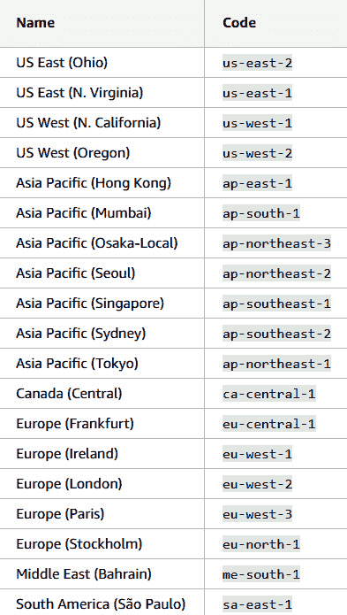

图 13.1 - AWS 上使用的配置名称的服务区域

选择一个需求量大的地区提供的服务可能会很昂贵，而选择其他地方的服务器可能会便宜得多。这就是云的美妙之处 - 你可以使用适合你和你的预算的服务。

有时价格和速度并不是最重要的事情。例如，法律框架，比如 GDPR，欧洲关于个人数据收集、处理和移动的法规，基本上规定欧洲公司必须使用欧洲的数据中心，因为它们受到这项法规的保护。在这种情况下使用美国地区可能意味着公司可能会承担法律责任（除非运行这个云服务的公司是其他允许这样做的框架的一部分，比如隐私盾）。

## AWS 服务

我们需要谈一下 AWS 在服务方面提供了什么，因为理解服务是能够适当使用云的一件事。在 AWS 上，所有可用的服务都按照它们的目的分成了不同的组。由于 AWS 有数百种服务，AWS 管理控制台，也就是你登录后会看到的第一个页面，一开始可能会让人望而生畏。

你可能会使用 AWS 免费套餐进行学习，所以第一步是实际开设一个 AWS 免费账户。就我个人而言，我使用了自己的个人账户。对于免费账户，我们需要使用以下网址：[`aws.amazon.com/free/`](https://aws.amazon.com/free/)，并按照流程进行。它只需要一些信息，比如电子邮件地址、密码和 AWS 账户名称。它还会要求你提供信用卡信息，以确保你不会滥用 AWS 账户。

注册后，我们可以登录并进入 AWS 仪表板。看一下这个屏幕截图：

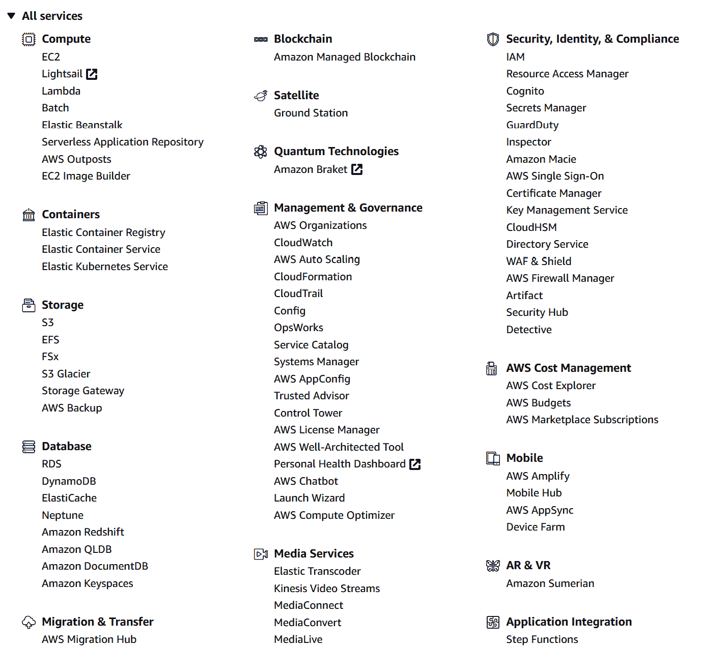

图 13.2 - 亚马逊服务

这里的每一样东西都是一个链接，它们都指向不同的服务或带有子服务的页面。此外，这个屏幕截图只显示了所有可用服务的大约三分之一。在这本书中覆盖它们所有是没有意义的；我们只会使用其中三个来展示 AWS 如何连接到我们的 KVM 基础设施，但一旦你掌握了它，你就会慢慢开始理解一切是如何连接的，以及在特定时刻应该使用什么。真正有帮助的是 AWS 有很好的文档，所有不同的服务都有提供向导，帮助你找到你要找的东西。

在本章中，我们将使用这三项服务：**IAM**、**EC2**和**S3**。

当然，所有这些都是缩写，但其他服务只是使用项目名称，比如**CloudFront**或**Global Accelerator**。无论如何，您的首要任务应该是开始使用它们，而不仅仅是阅读它们；一旦您开始使用，理解结构就会变得更容易。

在本章中，我们使用了一个免费账户，几乎所有的操作都是免费的，因此您没有理由不尝试使用 AWS 基础设施。AWS 尽其所能在那里提供帮助，因此如果您在控制台页面上向下滚动，您会发现这些有用的图标：

图 13.3 - 一些 AWS 向导、文档和视频 - 都非常有用

](img/B14834_13_03.jpg)

图 13.3 - 一些 AWS 向导、文档和视频 - 都非常有用

所有这些都是简单的场景，可以让您在几分钟内免费运行起来。亚马逊意识到，云的首次用户对所有选择感到不知所措，因此他们试图在几分钟内让您的第一台机器运行起来，以向您展示它有多么容易。

让我们先了解一下我们将要使用的服务，我们将通过一个场景来做到这一点。我们想要将在本地 KVM 安装中运行的机器迁移到亚马逊 AWS 中。我们将逐步完成整个过程，但首先需要了解我们需要什么。显然，第一件事是能够在云中运行虚拟机。在 AWS 宇宙中，这就是 EC2 或亚马逊弹性计算云。

### EC2

EC2 是少数几个真正的核心服务之一，基本上在 AWS 云中运行所有的东西。它是整个基础设施的可扩展计算能力提供者。它使得可以运行不同的实例或虚拟计算环境，使用各种存储、内存、CPU 和网络配置，并且还提供这些实例所需的一切，包括安全性、存储卷、区域、IP 地址和虚拟网络。其中一些服务也可以单独使用，以应对更复杂的场景，例如，存在许多不同的存储选项，但实例的核心功能由 EC2 提供。

### S3

这项服务的全名实际上是亚马逊简单存储服务，因此有了*亚马逊 S3*这个名字。其想法是为您提供存储和检索任意数量的数据的能力，随时使用提供的一种或多种方法。我们将使用的最重要的概念是*S3 存储桶*。存储桶是一个逻辑存储单元，使您能够对您存储的对象进行分组。可以将其视为一个存储容器的名称，稍后您将使用它来存储任何东西。您可以随意命名存储桶，但有一点我们必须指出 - 存储桶的名称必须是*全局唯一*的。这意味着当您命名一个存储桶时，它必须具有一个在任何地区中都没有重复的名称。这确保了您的存储桶将具有唯一的名称，但也意味着尝试创建一个听起来很普通的名称，比如`bucket1`或`storage`可能不会起作用。

创建存储桶后，您可以使用 Web、CLI 或 API 从中上传和下载数据。由于我们谈论的是一个全球系统，我们还必须指出，数据存储在您创建存储桶时指定的区域，并且会一直保留在那里，除非您指定要进行某种形式的多区域冗余。在部署存储桶时要记住这一点，因为一旦您开始使用存储桶中的数据，您的用户或实例需要获取数据，延迟可能会成为一个问题。由于法律和隐私问题，除非您明确指定，数据永远不会离开您指定的区域。

一个存储桶可以存储任意数量的对象，但每个账户的存储桶数量限制为 100 个。如果这不够用，您可以请求（并支付）将该限制提高到 1,000 个存储桶。

此外，仔细研究存储和移动数据的其他不同选项 - 有不同类型的存储，可能符合或不符合您的需求和预算，例如，S3 Glacier，它提供了更便宜的存储大量数据的选项，但如果需要取出数据则会很昂贵。

### IAM

AWS **身份** **和访问管理** (**IAM**) 是我们需要使用的服务，因为它可以为所有对象和服务提供访问管理和权限。在我们的示例中，我们将使用它来创建策略、用户和角色，以完成我们的任务。

### 其他服务

简单地提及 AWS 提供的所有服务是不可能的。我们只提到了必要的服务，并试图指引您朝正确的方向。您需要尝试并了解您的使用场景是什么，以及如何配置满足您特定需求的内容。

到目前为止，我们已经解释了 AWS 是什么以及它有多复杂。我们还提到了平台上最常用的部分，并开始解释它们的功能是什么。随着我们实际将一台机器从本地环境迁移到 AWS，我们将对此进行扩展。这将是我们的下一个任务。

# 为 AWS 准备和转换虚拟机

如果您在 Google 上搜索，从 KVM 迁移机器到 AWS 是很容易的，所需的只是按照此链接上的说明进行操作：[`docs.amazonaws.cn/en_us/vm-import/latest/userguide/vm-import-ug.pdf`](https://docs.amazonaws.cn/en_us/vm-import/latest/userguide/vm-import-ug.pdf)

如果您真的尝试去做，您会很快明白，只有对 AWS 工作方式有*基本*的了解，您就无法按照说明进行操作。这就是为什么我们选择以迁移一台机器作为使用 AWS 的示例，快速在云中创建一个可工作的虚拟机。

## 我们想要做什么？

让我们定义一下我们正在做的事情 - 我们决定将我们的一台机器迁移到 AWS 云中。现在，我们的机器正在本地的 KVM 服务器上运行，我们希望尽快将其运行在 AWS 上。

我们必须强调的第一件事是，这里没有实时迁移选项。没有简单的工具可以直接将 KVM 机器迁移到 AWS。我们需要一步一步地进行，并且机器需要处于关闭状态。在快速查阅文档后，我们制定了一个计划。基本上，我们需要做的是以下内容：

1.  停止我们的虚拟机。

1.  将机器转换为与 AWS 中使用的导入工具兼容的格式。

1.  安装所需的 AWS 工具。

1.  创建一个能够进行迁移的账户。

1.  检查我们的工具是否正常工作。

1.  创建一个 S3 存储桶。

1.  将包含我们机器的文件上传到存储桶中。

1.  将机器导入 EC2。

1.  等待转换完成。

1.  准备机器启动。

1.  在云中启动机器。

因此，让我们开始着手做这件事：

1.  一个很好的开始是查看我们工作站上的机器。我们将迁移名为`deploy-1`的机器来测试我们的 AWS 迁移。它是一个基本的 CentOS 7 安装，运行在使用相同 Linux 发行版的主机上。因此，我们显然需要有权限：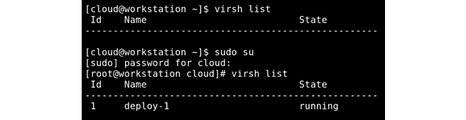

图 13.4 - 选择迁移过程中的虚拟机

接下来要做的是停止机器 - 我们无法迁移正在运行的机器，因为我们需要转换机器正在使用的卷，以使其与 EC2 上的导入工具兼容。

1.  在[`docs.aws.amazon.com/vm-import/latest/userguide/vmimport-image-import.html`](https://docs.aws.amazon.com/vm-import/latest/userguide/vmimport-image-import.html)提供的文档中指出：

“当将 VM 作为镜像导入时，可以导入以下格式的磁盘：Open Virtualization Archive (OVA)、Virtual Machine Disk (VMDK)、Virtual Hard Disk (VHD/VHDX)和原始格式。在某些虚拟化环境中，你可以导出为 Open Virtualization Format (OVF)，它通常包括一个或多个 VMDK、VHD 或 VHDX 文件，然后将文件打包成一个 OVA 文件。”

在我们的特定情况下，我们将使用`.raw`格式，因为它与导入工具兼容，并且相对简单地从 KVM 使用的`.qcow2`格式转换为这种格式。

一旦我们的机器停止了，我们需要进行转换。找到磁盘上的镜像，并使用`qemu-img`进行转换。唯一的参数是文件；转换器通过检测扩展名来理解它需要做什么：

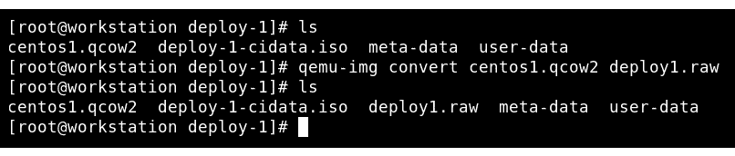

图 13.5 – 将 qcow2 镜像转换为原始镜像格式

我们只需要转换包含系统磁盘镜像的镜像文件；其他数据被留在了 VM 的安装之外。我们需要记住，我们正在转换为一个没有压缩的格式，所以你的文件大小可能会显著增加：

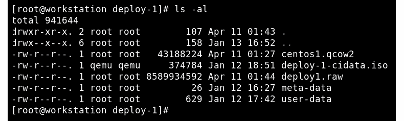

图 13.6 – 转换过程和相应的容量变化

我们可以看到我们的文件从 42MB 增加到 8GB，只是因为我们不得不删除`qcow2`为数据存储提供的高级功能。免费层只提供 5GB 的存储空间，所以请确保相应地配置原始镜像的大小。

我们接下来明显的步骤是将这个镜像上传到云端，因为转换是在那里完成的。在这里，你可以使用不同的方法，无论是 GUI 还是 CLI（API 也是可能的，但对于这个简单的任务来说太复杂了）。

1.  AWS 有一个 CLI 工具，可以方便地与服务一起工作。这是一个简单的命令行工具，兼容大多数，如果不是所有，你能想到的操作系统：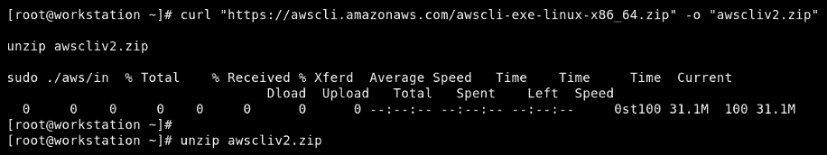

图 13.7 – 下载和解压 AWS CLI

我们正在使用`curl`下载文件，并使用`-o`选项来指定输出文件的名称。显然，我们需要解压 ZIP 文件以便使用它。工具的安装过程也在文档中有提及。我们正在谈论一个简单的下载，之后我们需要提取工具。由于没有安装程序，工具不会出现在我们的路径中，所以从现在开始，我们需要通过绝对路径引用它。

在我们使用 AWS CLI 之前，我们需要对其进行配置。这个工具必须知道它将如何连接到云端，它将使用哪个用户，并且必须拥有所有的权限，以便工具能够将数据上传到 AWS，然后导入并转换为 EC2 镜像。由于我们还没有配置好，让我们切换到 AWS 的 GUI 并配置我们需要的东西。

重要提示

从现在开始，如果截图中的某些东西看起来被编辑了，那可能确实是。为了使事情能够无缝地运行，AWS 在屏幕上有很多个人和账户数据。

1.  我们将进入`Administrator`，一个名为`administrators`的组，并为它们应用适当的权限。然后我们将把用户加入到这个组中。在第一个屏幕上，你可以选择`AdministratorAccess`策略作为示例。这个策略非常重要，因为它允许我们给我们正在创建的`Administrators`组赋予所有可用的权限。现在选择可以稍后用于身份管理的`tags`。

1.  标记可以通过几乎任何东西来完成 – 名字、邮箱、职位，或者你需要的任何东西。我们将把这个留空：

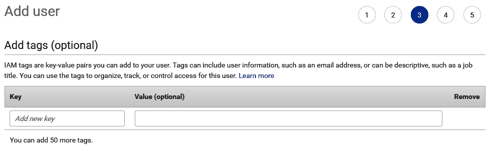

图 13.15 – 添加标签

让我们回顾一下我们到目前为止配置的内容。我们的用户是我们刚刚创建的组的成员，他们在登录后必须立即重置密码：

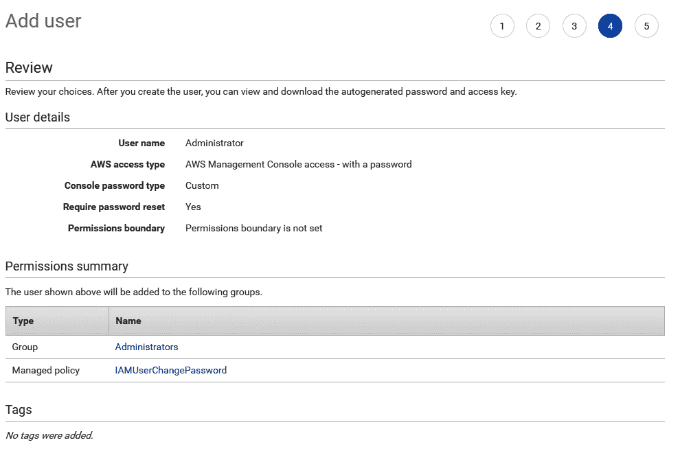

图 13.16 - 通过组、策略和标记选项审查用户配置

接受这些并添加用户。您应该会看到一个令人放心的绿色消息框，其中包含有关刚刚发生的所有相关细节。还有一个直接链接到控制台的管理访问，所以您可以与新用户共享：

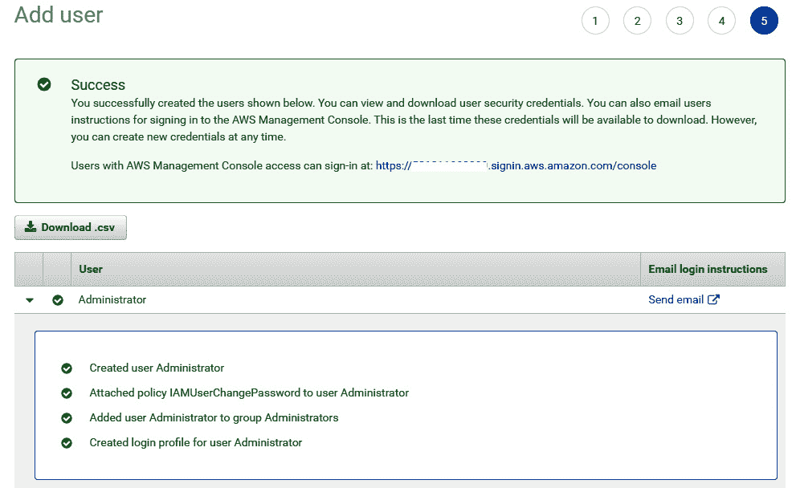

图 13.17 - 用户创建成功

用户创建后，我们需要启用他们的`访问密钥`。这是使用不同命令行实用程序的正常概念。它使我们能够为应用程序提供一种作为特定用户执行某些操作的方式，而不提供应用程序的用户名或密码。同时，我们可以为每个应用程序提供自己的密钥，因此当我们想要撤销访问权限时，我们只需禁用密钥。

点击屏幕中间的**创建访问密钥**：

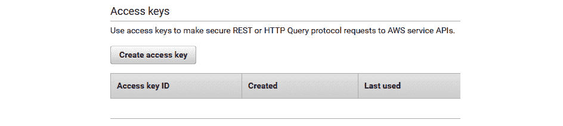

图 13.18 - 创建访问密钥

关于这个密钥需要说几件事。有两个字段 - 一个是密钥本身，即`访问密钥 ID`，另一个是密钥的秘密部分，即`秘密访问密钥`。就安全性而言，这与为特定用户设置用户名和密码完全相同。您只有一次机会查看和下载密钥，之后就会消失。这是因为我们在这里处理的是散列信息，AWS *不*存储您的密钥，而是它们的散列。这意味着如果您没有保存密钥，就无法检索密钥。这也意味着如果有人获取了密钥，比如从截图中读取，他们可以将自己标识为拥有该密钥的用户。好处是您可以创建任意多的密钥，并且撤销它们只是删除它们的问题。因此，请将密钥保存在安全的地方：

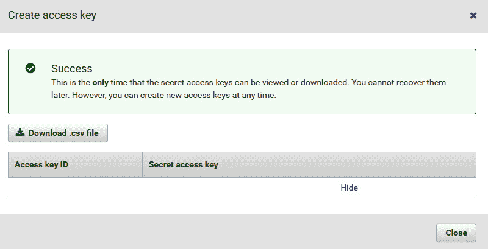

图 13.19 - 访问密钥已成功创建

我们现在暂时完成了 GUI。让我们回去安装 AWS CLI：

1.  我们只需要启动安装脚本并让它完成其工作。这可以通过在`aws`目录中启动名为`install`的文件来完成：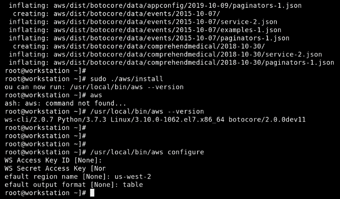

图 13.20 - 安装 AWS CLI

记住我们说过的绝对路径吗？`aws`命令不在用户路径中；我们需要直接调用它。使用`configure`作为参数。然后，使用我们在上一步中保存的密钥的两部分。从现在开始，我们使用 AWS CLI 给出的每个命令都被解释为在云上刚刚创建的用户`Administrator`下运行。

下一步是在 S3 上创建一个存储桶。有两种方法可以做到这一点。我们可以通过我们新配置的 CLI 来做，或者我们可以使用 GUI。我们将采取“漂亮”的方式，使用 GUI 来展示它的外观和行为。

1.  在控制台中选择 S3 作为服务。右上角有一个标有`importkvm`的按钮，但选择一个不同的名称。确保记下`region`下拉菜单 - 这是 AWS 资源将被创建的位置。记住名称必须是唯一的；如果购买了这本书的每个人都尝试使用这个名称，只有第一个人会成功。有趣的事实是：如果到你读到这里的时候，我们还没有删除这个存储桶，没有人将能够创建另一个同名的存储桶，只有读到这句话的人会明白为什么。这个向导在屏幕空间方面非常大，可能无法适应单个书页，所以让我们将其分成两部分：

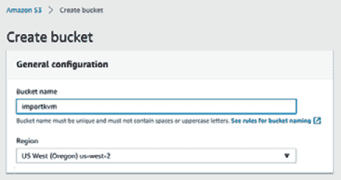

图 13.21 – 创建 S3 存储桶的向导-选择存储桶名称和区域

这个向导的第二部分与设置相关：

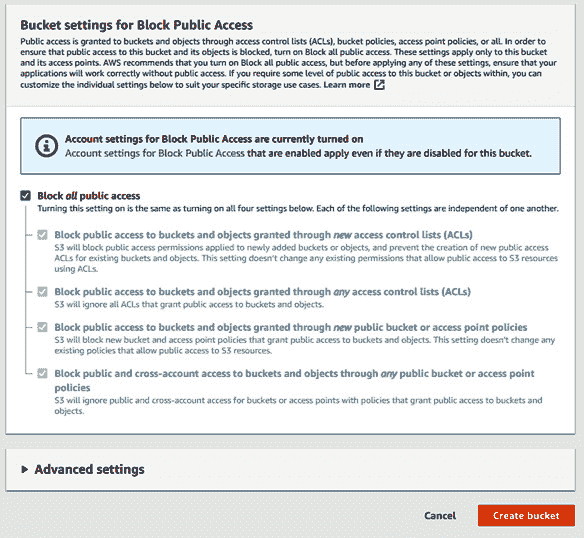

图 13.22 – 存储桶设置

不要更改对公共的访问-实际上没有必要；除了您之外，没有人会需要访问这个特定的存储桶和其中的文件。默认情况下，此选项已预先选择，我们应该保持不变。这应该是最终结果：

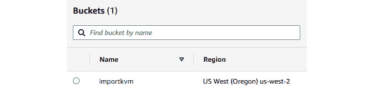

图 13.23 – S3 存储桶创建成功

好了，做完这些，现在是等待下一个命令完成的时候了。在下一步中，我们将使用 AWS CLI 将`.raw`文件复制到 S3。

重要提示

根据账户类型的不同，从这一点开始，我们可能需要为创建的一些服务付费，因为它们可能会超出您账户上启用的*免费套餐*。如果您没有启用任何昂贵的东西，那么应该没问题，但是始终要查看您的**成本管理**仪表板，并确保您仍然处于盈利状态。

## 将图像上传到 EC2

接下来的步骤是将图像上传到 EC2，以便我们实际上可以将该图像作为虚拟机运行。让我们开始上传过程-这就是我们首先安装 AWS CLI 实用程序的原因：

1.  使用以下参数使用 AWS CLI：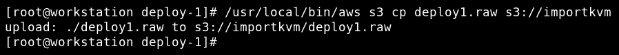

图 13.24 – 使用 AWS CLI 将虚拟机原始图像复制到 S3 存储桶

这就是最终结果。由于我们谈论的是 8GB 的数据，您将不得不等待一段时间，具体取决于您的上传速度。AWS CLI 的语法非常简单。您可以使用大多数您知道的 Unix 命令，`ls`和`cp`都能正常工作。唯一要记住的是以以下格式给出您的存储桶名称作为目的地：`s3://<bucketname>`。

1.  之后，我们执行`ls`命令-它将返回存储桶名称，但我们可以通过使用存储桶名称来列出它们的内容。在这个例子中，您还可以看到我们从创建存储桶到传输文件大约花了 15 分钟的时间：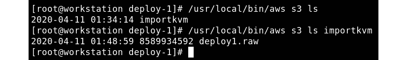

图 13.25 – 传输文件

现在开始有趣的部分。我们需要将机器导入 EC2。为此，我们需要在进行转换之前完成一些事情。问题与权限有关-AWS 服务默认情况下无法相互通信。因此，您必须为它们中的每一个明确授予权限以进行导入。实质上，您必须让 EC2 与 S3 通信并从存储桶中获取文件。

1.  为了上传目的，我们将介绍另一个 AWS 概念-`.json`文件。AWS 中的许多东西都以`.json`格式存储，包括所有的设置。由于 GUI 很少被使用，这是传输数据和设置的最快方式，因此我们也必须使用它。我们需要的第一个文件是`trust-policy.json`，我们将使用它来创建一个角色，该角色将使数据能够从 S3 存储桶中读取：

```
trust-policy.json, and get the preceding code typed in. Do not change anything. The next one up is the file named role-policy.json. This one has some changes that you have to make. Take a closer look inside the file and find the lines where we mention our bucket name (importkvm). Delete our name and put the name of your bucket instead: 

```

{

"Version":"2012-10-17",

"Statement":[

{

"Effect":"Allow",

"Action":[

"s3:GetBucketLocation",

"s3:ListBucket",

"s3:GetObject"

],

"Resource":[

"arn:aws:s3:::importkvm"

"arn:aws:s3:::importkvm/*"

],

},

{

"Effect":"Allow",

"Action":[

"s3:GetObject",

"s3:GetBucketLocation",

"s3:ListBucket",

"s3:GetBucketAcl",

"s3:PutObject"

],

"Resource":[

"arn:aws:s3:::importkvm"

"arn:aws:s3:::importkvm/*"

],

},

{

"Effect":"Allow",

"Action":[

"ec2:ModifySnapshotAttribute",

"ec2:CopySnapshot",

"ec2:RegisterImage",

"ec2:Describe*"

],

"Resource":"*"

}

]

}

```

Now it's time to put it all together and finally upload our virtual machine to AWS.
```

1.  执行这两个命令，忽略格式中发生的任何事情-它们都是一行命令，文件名是命令的最后部分：

```
.json file that will describe to EC2 what we are actually importing and what to do with it. 
```

1.  我们正在创建的文件需要如下所示：

```
[
 {
 "Description": "Test deployment", 
 "Format": "raw", 
 "Userbucket": {
 "S3Bucket": "importkvm",
 "S3Key": "deploy1.raw"
 }
]
```

如您所见，文件中没有什么特别之处，但是当您创建自己的版本时，请注意使用您的名称作为存储桶和存储在存储桶中的磁盘映像的名称。随意命名文件，并使用该名称调用导入过程：

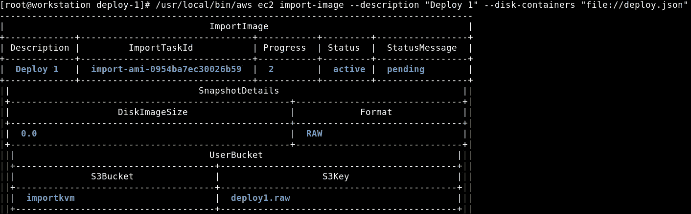

图 13.27 - 最后一步 - 将虚拟机部署到 AWS

现在等待过程完成。在这一步中发生的是导入和转换图像以及您上传的操作系统。AWS 不会按原样运行您的图像；系统会进行一些更改，以确保您的图像可以在基础设施上运行。一些用户也会收到一些更改，但稍后再说。

任务将在后台运行，并在完成时不会通知您；您需要自行检查。幸运的是，AWS CLI 中有一个可以使用的命令叫做`describe-import-image-tasks`，这是输出：

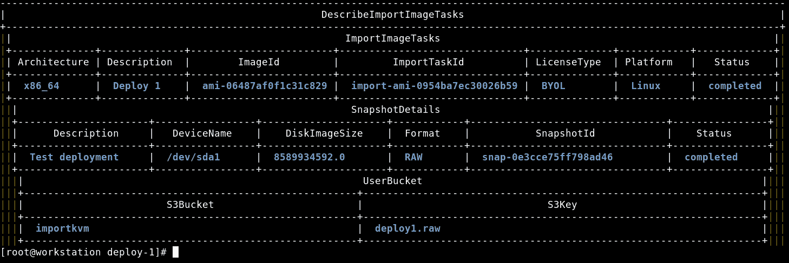

图 13.28 - 检查我们的上传过程的状态

这意味着我们成功导入了我们的机器。太棒了！但是机器还没有运行。现在它已经变成了一个叫做**Amazon Machine Image**（**AMI**）的东西。让我们看看如何使用它：

1.  转到您的 EC2 控制台。您应该能够在左侧的**AMI**下找到图像：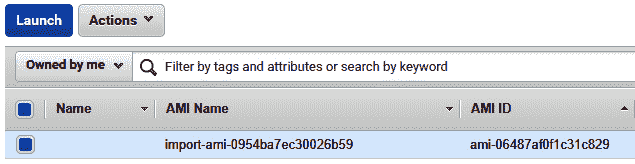

图 13.29 - 我们的 AMI 已成功上传，并且可以在 EC2 控制台中看到

现在点击大蓝色的**启动**按钮。在实例运行之前，您需要完成几个步骤，但我们几乎已经完成了。首先，您需要选择您的实例类型。这意味着根据您的需求选择适合您的配置，根据您需要的一切（CPU、内存和存储）。

1.  如果您使用的是不拥挤的地区，您应该能够启动一个通常称为`t2.micro`的*免费层*实例类型，并且标记清晰。在您的免费账户中，您有足够的处理信用来使您能够完全免费运行这台机器：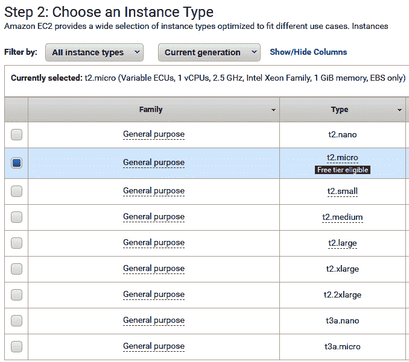

图 13.30 - 选择实例类型

现在是一些安全性问题。亚马逊更改了您的机器，并已实施了无密码登录到管理员帐户，使用密钥对。由于我们还没有密钥，我们还需要创建密钥对。

1.  EC2 将把这个密钥放入您刚刚创建的机器上的适当帐户中（所有帐户），因此您可以无需使用密码登录。如果您选择这样做，将生成密钥对，但亚马逊不会存储它 - 您需要自行存储：

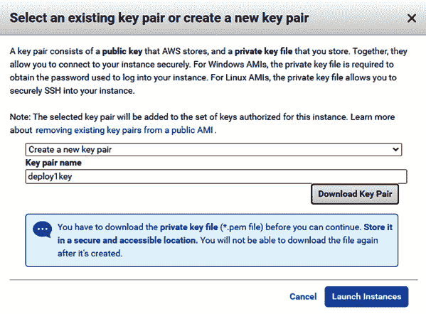

图 13.31 - 选择现有密钥或创建新密钥

就是这样，您的虚拟机现在应该需要几分钟来启动。只需等待确认窗口。一旦准备就绪，通过上下文菜单连接到它。点击右下角的**查看实例**，您将进入实例列表。

要连接，您需要使用提供给您的密钥对，并且需要一个`ssh`客户端。或者，您可以使用 AWS 提供的嵌入式`ssh`。无论哪种情况，您都需要机器的外部地址，AWS 也提供了这个，以及简单的说明：

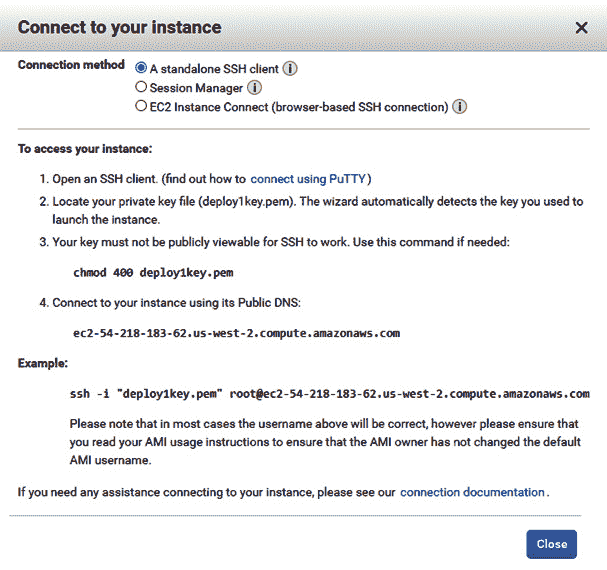

图 13.32 - 连接到您的实例说明

因此，回到我们的工作站，我们可以使用前一个截图中提到的`ssh`命令来连接到我们新启动的实例：

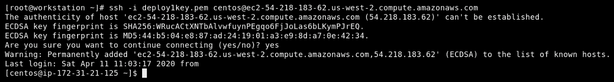

图 13.33 - 通过 SSH 连接到我们的实例

就是这样。你已经成功连接到你的机器。你甚至可以让它继续运行。但要注意，如果你的账户或服务是默认开启的或没有密码 - 毕竟，你已经从你安全的家庭沙盒中取出一个虚拟机，并将其放在了庞大而危险的互联网上。最后一件事：在你的虚拟机运行后，删除存储桶中的文件以节省资源（和金钱）。转换后，这个文件就不再需要了。

我们接下来要讨论的话题是如何通过使用名为尤加利林的应用程序将我们的本地云环境扩展到混合云环境。这是一个非常流行的过程，许多企业公司在扩展基础设施超出本地基础设施时都会经历。此外，当需要时，这也提供了可伸缩性方面的好处 - 例如，当公司需要扩展其测试环境以便对员工正在开发的应用进行负载测试时。让我们看看通过尤加利林和 AWS 如何实现。

# 使用尤加利林构建混合 KVM 云

**尤加利林**是一个奇怪的东西，我们并不是指植物。作为一个项目，它旨在弥合私有云服务和 AWS 之间的差距，尤加利林试图在本地环境中重新创建几乎所有 AWS 功能。运行它几乎就像拥有一个与 AWS 兼容的小型本地云，而且它使用的几乎是与 AWS 相同的命令。它甚至使用与 AWS 相同的名称，因此它可以与存储桶等进行交互。这是有意为之，并得到了亚马逊的同意。拥有这样的环境对每个人来说都是一件好事，因为它为开发人员和公司部署和测试他们的实例创造了一个安全的空间。

尤加利林由几个部分组成：

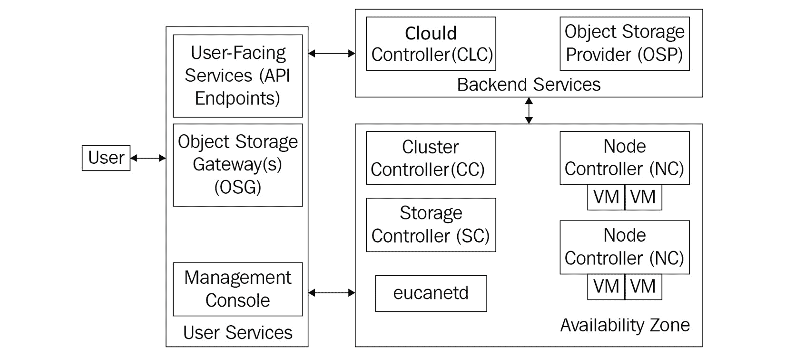

图 13.34 - 尤加利林架构（http://eucalyptus.cloud，官方文档）

从图表中可以看出，尤加利林具有高度可伸缩性。

**可用区**是可以容纳由集群控制器控制的多个节点的一个部分。**区域**然后组合成云本身，由**云控制器**控制。与所有这些相关联的是用户服务部分，它实现了用户与整个尤加利林堆栈之间的交互。

总的来说，尤加利林使用了五个组件，有时会根据图表中的名称来指代它们，有时会根据它们的项目名称来指代，就像 OpenStack 一样：

+   **云控制器**（**CLC**）是系统的中心点。它提供 EC2 和 Web 界面，并将每个任务路由到自己。它负责调度、资源分配和计费。每个云都有一个这样的控制器。

+   **集群控制器**（**CC**）负责管理每个单独的节点，控制虚拟机及其执行。每个可用区都运行一个。

+   **存储控制器**（**SC**）负责提供块级存储，并在集群内为实例和快照提供支持。它类似于 AWS 的 EBS 存储。

+   **节点控制器**（**NC**）托管实例及其端点。每个节点都运行一个。

+   **eucanetd**是尤加利林用来管理云网络的服务，因为我们正在谈论将本地网络扩展到 AWS 云的问题。

当你了解尤加利林时，你会注意到它具有广泛的功能。它可以做到以下几点：

+   与卷、实例、密钥对、快照、存储桶、镜像、网络对象、标签和 IAM 一起工作。

+   与负载均衡器一起工作。

+   作为 AWS 集成工具与 AWS 合作。

这些只是您开始 Eucalyptus 之旅时值得一提的一些功能。Eucalyptus 还有一个名为**Euca2ools**的额外命令行界面，作为所有主要 Linux 发行版的软件包提供。Euca2ools 是一个额外的工具，提供了 AWS 和 Eucalyptus 之间的完整 API 和 CLI 兼容性。这意味着您可以使用一个工具来管理两者，并执行*混合云*迁移。该工具是用 Python 编写的，因此它基本上是与平台无关的。如果您想了解更多关于这个接口的信息，请确保您访问[`wiki.debian.org/euca2ools`](https://wiki.debian.org/euca2ools)。

## 如何安装？

如果您正在安装测试机器并且*遵循说明*，那么安装 Eucalyptus 很容易，我们将在本书的最后一章*第十六章*中描述，*KVM 平台的故障排除指南*，这是处理 KVM 故障排除的章节。我们将要做的就是安装一个单机，它将容纳所有节点和整个云的一部分。当然，这远远不足以满足生产环境的需求，因此在 Eucalyptus 网站上，有单机一切都做的指南，以及安装生产级云的指南。请确保您查看以下链接：[`docs.eucalyptus.cloud/eucalyptus/4.4.5/install-guide-4.4.5.pdf`](https://docs.eucalyptus.cloud/eucalyptus/4.4.5/install-guide-4.4.5.pdf)。

安装很简单——只需提供一个至少有 120GB 磁盘空间和 16GB 内存的最小安装的 CentOS 7 系统。这是最低要求。如果低于这些要求，您将遇到两种问题：

+   如果您尝试在内存小于 16GB 的计算机上安装，安装可能会失败。

+   然而，安装将在磁盘大小小于最低建议的机器上成功，但一旦开始安装部署图像，您几乎立即就会耗尽磁盘空间。

对于生产环境，一切都会改变——存储的最低要求是 160GB，或者对于将运行 Walrus 和 SC 服务的节点，需要 500GB 的存储。节点必须在裸金属上运行；不支持嵌套虚拟化。或者更准确地说，它可以工作，但会抵消云所能提供的任何积极效果。

说了这么多，我们在开始安装之前还有一点要提醒一下——检查新版本的可用性，并且要记住，很可能有比我们在本书中使用的版本更新的版本。

重要提示

在撰写本文时，当前版本是 4.4.5，版本 5 正在积极开发中，即将发布。

安装了基本操作系统后——它必须是一个没有图形界面的核心系统，现在是时候进行实际的 Eucalyptus 安装了。整个系统都是使用**FastStart**安装的，所以我们唯一需要做的就是从互联网上运行安装程序。链接很贴心地放在了项目的以下 URL 的首页上——[`eucalyptus.cloud`](https://eucalyptus.cloud)。

Eucalyptus 安装成功的一些先决条件：

+   您必须连接到互联网。这种方式无法进行本地安装，因为一切都是动态下载的。

+   您还必须有一些 IP 地址可供系统在安装时使用。最低要求是 10 个，它们将随着云一起安装。安装程序将要求范围，并尝试在没有干预的情况下完成一切。

+   唯一的其他先决条件是一个可用的 DNS 和一些时间。

让我们通过以下命令开始安装：

```
# bash <(curl -Ls https://eucalyptus.cloud/install) 
```

如果您是第一次看到安装，它看起来很奇怪。它有点让我们想起了上世纪 90 年代我们使用的一些基于文本的游戏和服务（MUD，IRC）：

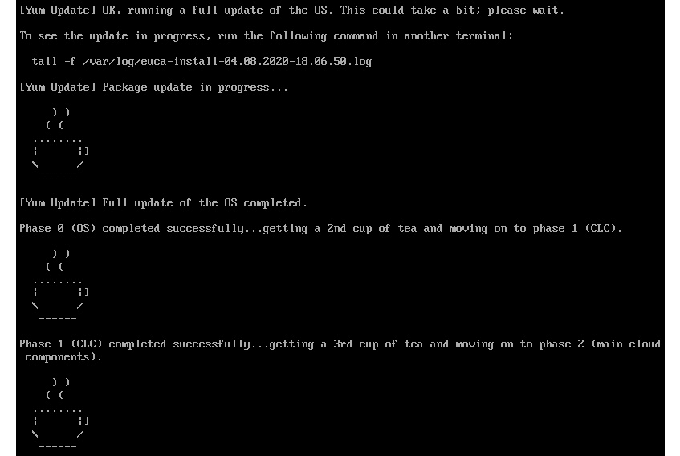

图 13.35 - Eucalyptus 文本模式安装

屏幕上的信息将告诉您要遵循哪个日志，如果您想查看实际发生的事情；否则，您可以查看安装程序并等待屏幕上的茶变冷。老实说，在一台体面的机器上，安装可能需要大约 15 分钟，如果您安装所有软件包，则可能需要多 10 分钟。

安装后，Eucalyptus 将为您提供一组默认凭据：

+   `桉树`

+   `管理员`

+   `密码`

重要提示

如果当前的安装程序出现问题，后续问题的解决方案在此 CiA 视频中： <video_URL>。已知存在一些问题，可能在本书上市之前解决，也可能不会解决。确保在安装之前检查[`eucalyptus.cloud`](https://eucalyptus.cloud)和文档。

信息区分大小写。安装完成后，您可以使用 Web 浏览器连接到该机器并登录。您将使用的 IP 地址是刚刚安装的机器的 IP 地址：

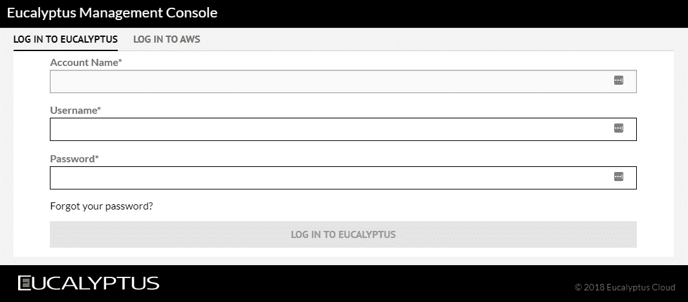

图 13.36 - 桉树登录屏幕

系统安装完成后，在新安装的系统的控制台上，您将看到一条指示，要求运行系统上包含的主教程。教程本身是了解系统外观、关键概念以及如何使用命令行的好方法。您可能遇到的唯一问题是，教程是一组具有一些信息硬编码的脚本。您会立即注意到的一件事是，除非您修复它们，否则指向图像模板的云版本的链接将无法工作 - 链接指向已过期的地址。这很容易解决，但会让您措手不及。

另一方面，也许在您阅读此文时，问题已经解决。关于如何执行此操作以及其所有部分的教程以纯文本模式提供在 Eucalyptus 运行的机器上。它在 GUI 中不可用：

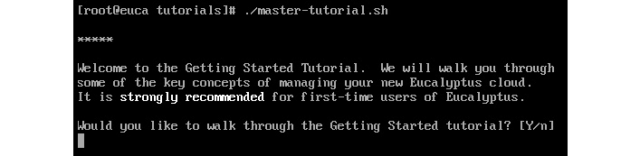

图 13.37 - 启动文本模式 Eucalyptus 主教程

教程在外观上非常基本，但我们喜欢它，因为它为我们提供了对 Eucalyptus 提供的一切的简短但重要的概述：

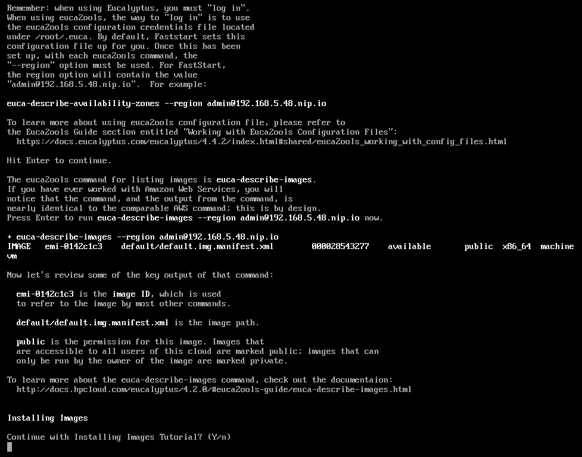

图 13.38 - 使用主教程学习如何配置 Eucalyptus

正如您所看到的，一切都有详细说明，因此您可以在短时间内真正学习关键概念。浏览教程-它非常值得。一旦启动系统，您可以从命令行下载一些新的模板图像。此脚本也是从 Web 启动的，并且以大字体写在官方网站上，文字位于以下 URL 的首页上（确保您向下滚动一点）- [`www.eucalyptus.cloud/`](https://www.eucalyptus.cloud/):

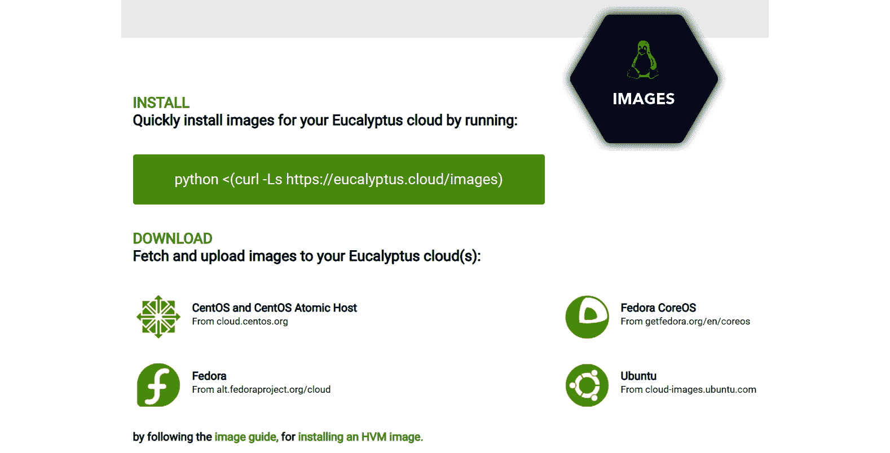

图 13.39 - 下载图像到我们的 Eucalyptus 云

将此复制粘贴到根提示符中，不久将出现一个菜单，可让您下载可能使用的图像。这是我们见过的模板安装中最简单和最可靠的之一，除了它们包含在初始下载中：

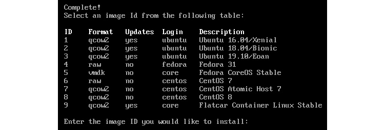

图 13.40 - 简单菜单要求我们选择要安装的图像

一次选择一个，它们将包含在图像列表中。

现在让我们切换到 Web 界面，看看它是如何工作的。使用上面写的凭据登录。您将看到一个设计精良的仪表板。右侧是最常用的功能组。左侧是保留给包含所有服务链接的菜单。一旦您将鼠标移开，菜单将自动隐藏，只留下最基本的图标：

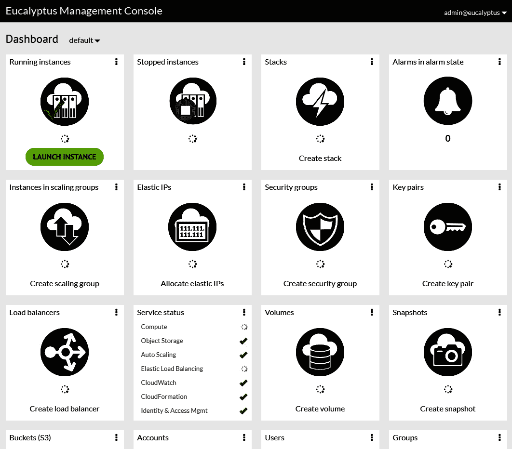

图 13.41 - Eucalyptus 管理控制台

我们已经讨论了这个页面上的大部分内容 - 只需查看与 AWS 相关的本章内容，您就会非常熟悉。让我们尝试使用这个控制台。我们将启动一个新实例，只是为了感受一下 Eucalyptus 的工作方式：

1.  在服务堆栈的左侧有一个诱人的绿色按钮标有**启动实例** - 点击它。将出现系统上可用的镜像列表。我们已经使用脚本抓取了一些云镜像，所以有可供选择的内容：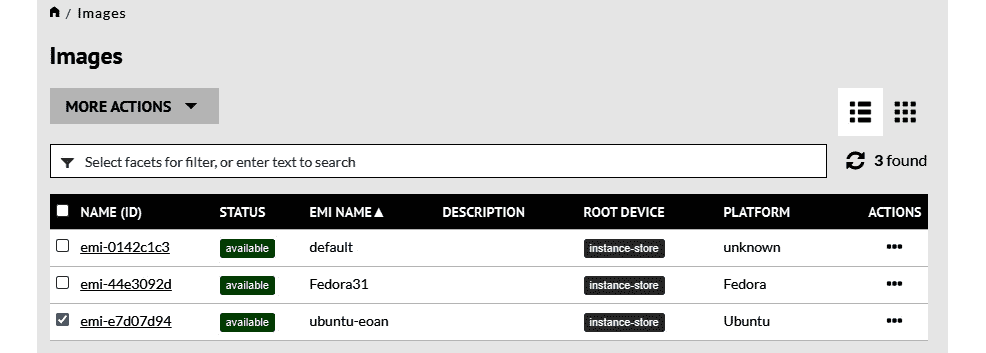

图 13.42 - 选择要在 Eucalyptus 云中运行的镜像

我们选择从云镜像中运行 Ubuntu。在选择完您想要的镜像后，从下拉菜单中选择**启动**。一个新窗口将打开，允许您创建虚拟机。在下拉菜单或实例类型中，我们选择了一个看起来足够强大以运行我们的 Ubuntu 的机器，但基本上，任何具有 1GB 以上 RAM 的实例都可以很好地运行。由于我们只准备了一个实例，所以没有太多要改变：

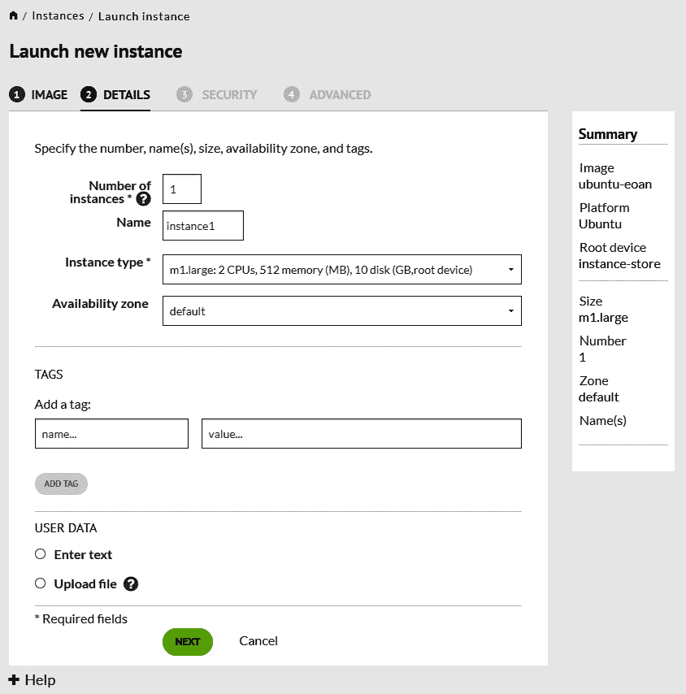

图 13.43 - 启动新实例向导

下一个配置屏幕与安全有关。

1.  我们可以选择使用在 Eucalyptus 云上创建的默认密钥对，也可以创建一个新的。密钥的公共部分仅存储在 Eucalyptus 中，因此只有在安装时下载了密钥，我们才能使用这个密钥对进行身份验证。创建密钥的过程与用于 AWS 的过程完全相同：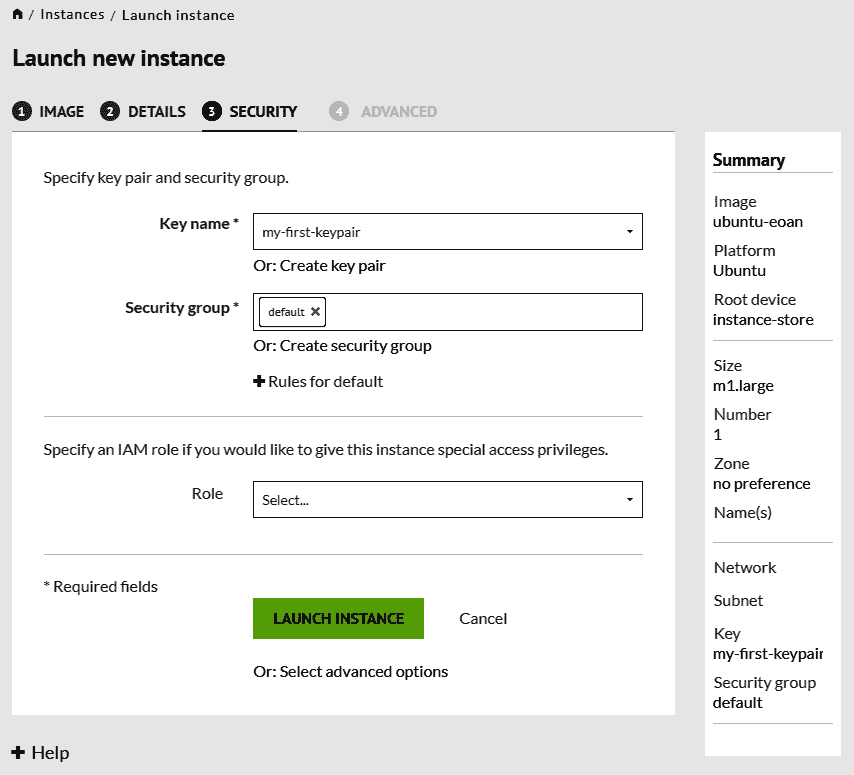

图 13.44 - 安全配置 - 选择密钥和 IAM 角色

点击**启动实例**按钮后，您的机器应该启动。出于测试目的，我们之前已经启动了另一台机器，所以现在我们有两台正在运行：

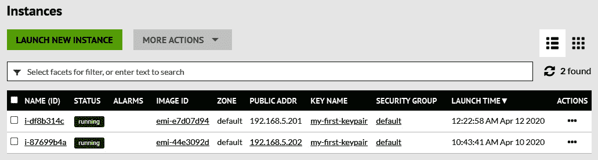

图 13.45 - Eucalyptus 云中启动的一对实例

下一步是尝试创建一个存储桶。

1.  创建存储桶很容易，并且看起来与 AWS 让您可以做的非常相似，因为 Eucalyptus 试图尽可能与 AWS 相似：

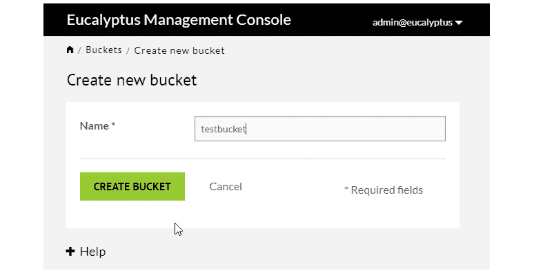

图 13.46 - 创建存储桶

由于 Eucalyptus 不像 AWS 那样复杂，特别是在策略和安全方面，存储桶的安全选项卡较小，但具有一些非常强大的工具，如下面的屏幕截图所示：

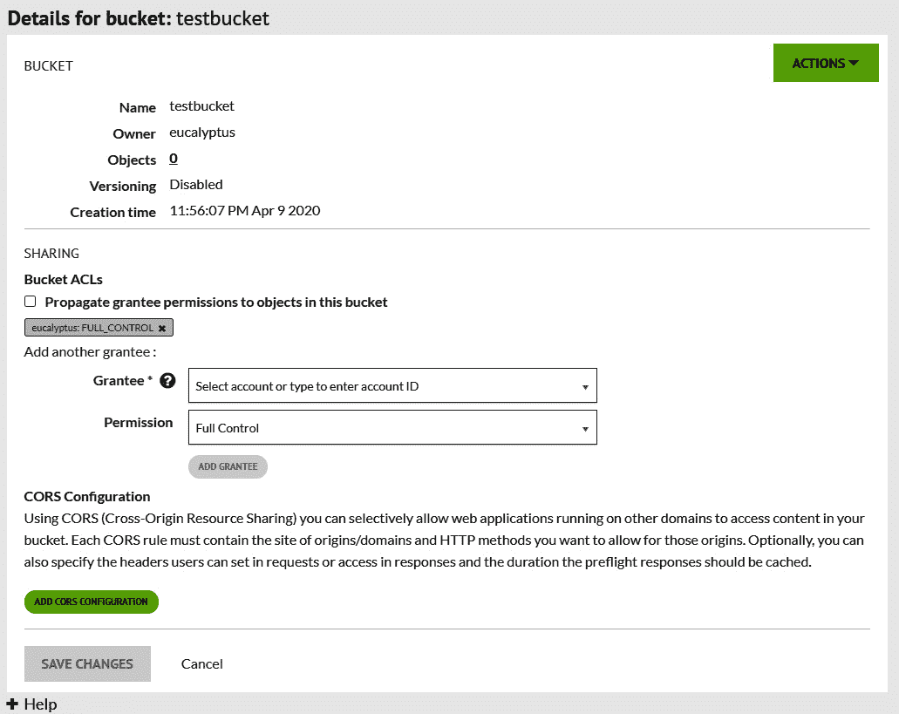

图 13.47 - 存储桶安全配置

现在我们已经安装、配置并使用了 Eucalyptus，是时候转向本章的下一个主题，即将我们基于 Eucalyptus 的云扩展到 AWS。

## 使用 Eucalyptus 控制 AWS

您还记得最初显示登录凭据的初始屏幕吗？我们提到您也可以登录到 AWS。从 Eucalyptus 控制台注销并转到登录屏幕。这次点击**登录到 AWS**：

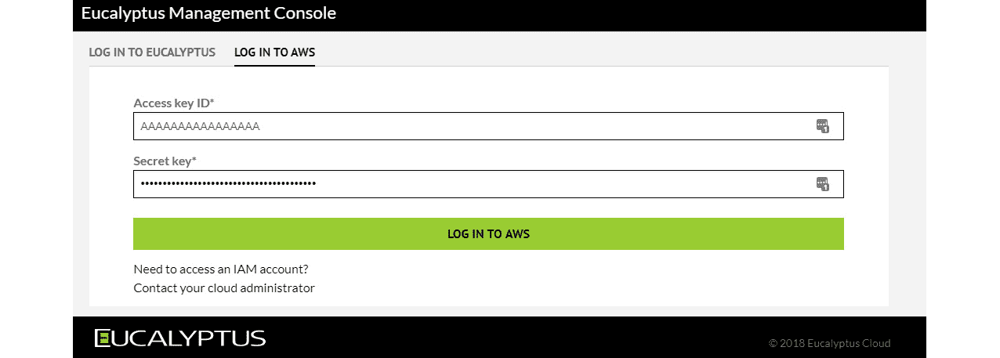

图 13.48 - 通过 Eucalyptus 登录 AWS

尝试使用我们在*上传图像到 EC2*部分创建的身份验证密钥，或者为 AWS IAM 中的`管理员`用户创建一个新的密钥。将其复制并粘贴到 AWS 凭据中，您将拥有一个完全可用的界面，连接到您的 AWS 帐户。您的仪表板看起来几乎一样，但会显示您的 AWS 帐户的状态：

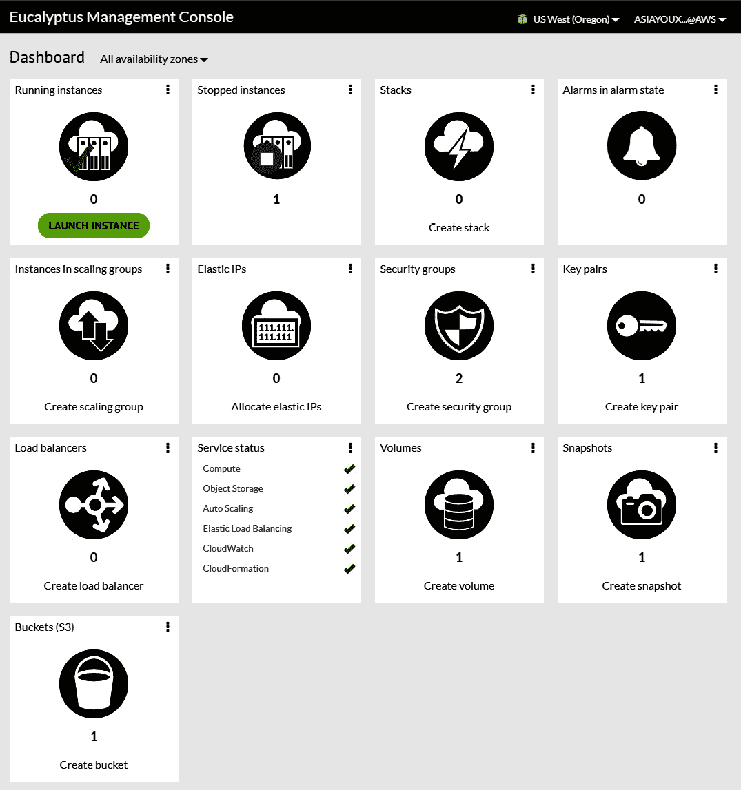

图 13.49 - Eucalyptus 管理控制台用于 AWS

让我们检查一下我们是否能看到我们的存储桶：

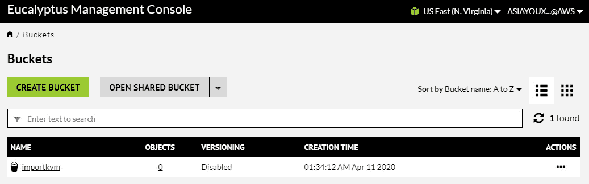

图 13.50 - 检查我们的 AWS 存储桶

请注意，我们不仅看到了我们用来测试 AWS KVM 导入的存储桶，还看到了我们运行的区域，在右上角。您的帐户由其密钥名称给出，而不是实际用户；这仅仅是因为我们实际上是以*编程方式*登录的。我们点击的每个东西都被转换为 API 调用，然后返回的数据被解析并显示给用户。

我们当前停止的实例也在这里，但请记住，只有在您选择最初导入实例的区域时才会看到它。在我们的情况下，它是`美国西部`，所以我们的实例就在那里：

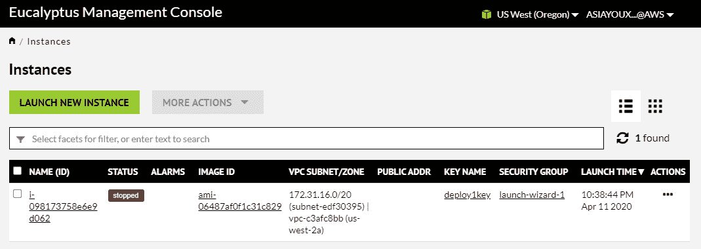

图 13.51 - 检查我们的 AWS 实例

正如您可能已经注意到的那样，Eucalyptus 是一个多方面的工具，能够为我们提供混合云服务。基本上，Eucalyptus 的关键点之一是它使您达到了与 AWS 兼容的水平。因此，如果您开始将其用作私有解决方案，并且在将来的某个时候开始考虑转移到 AWS，Eucalyptus 已经为您考虑到了。对于基于 KVM 的虚拟机来说，它是一个事实上的标准解决方案。

我们将在这里结束 AWS 集成。毕竟，本章的重点是让您看到 Eucalyptus 如何连接到 AWS。您可能会发现，这个界面缺少 AWS 具有的功能，但同时可能已经足够控制基本的中型基础设施-从一个地方控制存储桶、镜像和实例。经过测试 5.0 beta 1 版本后，我们可以明确告诉您，完整的 5.0 版本一推出应该是相当大的升级。beta 版本已经有许多额外的选项，我们对完整版本的发布感到非常兴奋。

# 总结

在本章中，我们涵盖了许多主题。我们将 AWS 作为云解决方案进行了介绍，并对其进行了一些很酷的操作-我们转换了我们的虚拟机，以便我们可以在其中运行，并确保一切正常。然后我们转向 Eucalyptus，以查看我们如何将其用作本地云环境的管理应用程序，以及如何将其用于扩展我们的现有环境到 AWS。

下一章将带我们进入使用 ELK 堆栈监视 KVM 虚拟化的世界。这是一个非常重要的话题，特别是随着公司和基础设施的规模增长-您无法通过手动监视所有可能的服务来跟上 IT 服务的有机增长。ELK 堆栈将帮助您解决这个问题-您将在下一章中了解到它有多大帮助。

# 问题

1.  AWS 是什么？

1.  EC2、S3 和 IAM 是什么？

1.  S3 存储桶是什么？

1.  我们如何将虚拟机迁移到 AWS？

1.  我们使用哪个工具将原始图像上传到 AWS？

1.  我们如何作为用户向 AWS 进行身份验证？

1.  Eucalyptus 是什么？

1.  Eucalyptus 中的关键服务是什么？

1.  可用区是什么？故障域是什么？

1.  为虚拟化、云和 HPC 环境提供 Tier-0 存储服务的基本问题是什么？

# 进一步阅读

有关本章涵盖内容的更多信息，请参考以下链接：

+   Amazon AWS 文档：[`docs.aws.amazon.com/`](https://docs.aws.amazon.com/)

+   Amazon EC2 文档：[`docs.aws.amazon.com/ec2/?id=docs_gateway`](https://docs.aws.amazon.com/ec2/?id=docs_gateway)

+   亚马逊 S3 文档：[`docs.aws.amazon.com/s3/?id=docs_gateway`](https://docs.aws.amazon.com/s3/?id=docs_gateway)

+   亚马逊 IAM 文档：[`docs.aws.amazon.com/iam/?id=docs_gateway`](https://docs.aws.amazon.com/iam/?id=docs_gateway)

+   尤卡利普特斯安装指南：[`docs.eucalyptus.cloud/eucalyptus/4.4.5/install-guide/index.html`](https://docs.eucalyptus.cloud/eucalyptus/4.4.5/install-guide/index.html)

+   尤卡利普特斯管理指南：[`docs.eucalyptus.cloud/eucalyptus/4.4.5/admin-guide/index.html`](https://docs.eucalyptus.cloud/eucalyptus/4.4.5/admin-guide/index.html)

+   尤卡利普特斯控制台指南：[`docs.eucalyptus.cloud/eucalyptus/4.4.5/console-guide/index.html`](https://docs.eucalyptus.cloud/eucalyptus/4.4.5/console-guide/index.html)

+   Euca2ools 指南：[`docs.eucalyptus.cloud/eucalyptus/4.4.5/euca2ools-guide/index.html`](https://docs.eucalyptus.cloud/eucalyptus/4.4.5/euca2ools-guide/index.html)
