# 第十四章：监视 KVM 虚拟化平台

当你从只有几个对象需要管理的环境（例如 KVM 主机）转移到需要管理数百个对象的环境时，你会开始问自己一些非常重要的问题。其中一个最突出的问题是，“我要如何在不做大量手动工作并且有一些 GUI 报告选项的情况下监视我的数百个对象？”这个问题的答案就是 Elasticsearch、Logstash、Kibana（ELK）堆栈。在本章中，我们将看到这些软件解决方案对你和基于 KVM 的环境能做些什么。

这些晦涩的名字背后是一些技术，它们可以解决在运行多个服务器时可能遇到的许多问题。虽然你可以运行 ELK 堆栈来监视一个服务，但这样做是没有意义的。本章提供的建议和解决方案适用于涉及多个设备和服务器的所有项目，不仅仅是在 KVM 上运行的项目，而是任何能够产生任何类型日志的项目。我们将从如何监视 KVM 作为虚拟化平台的基础知识开始。然后，我们将继续讨论 ELK 堆栈，包括其构建模块和安装，然后再进行高级配置和定制。

在本章中，我们将涵盖以下主题：

+   监视 KVM 虚拟化平台

+   开源 ELK 解决方案简介

+   设置和集成 ELK 堆栈

+   配置数据收集器和聚合器

+   创建自定义利用报告

+   让我们开始吧！

# 监视 KVM 虚拟化平台

当我们谈论运行任何类型的处理系统时，我们很快就会遇到监视和确保我们的系统在给定的一组参数内运行的问题。

当我们创建一个运行工作负载的系统时，它将不可避免地产生一些关于正在发生的一切的数据。这些数据的范围几乎是无限的——一个只在线而没有单个“有用”任务运行的服务器将创建一些日志或服务数据，比如已使用的内存量、正在启动或停止的服务、剩余的磁盘空间量、连接和断开的设备等。

当我们开始运行任何有用的任务时，日志只会变得越来越大。

拥有一个良好且详细的日志意味着我们可以找到系统当前的运行情况；它是否正常运行，我们是否需要做一些事情让它运行得更好？如果发生了意外情况，日志可以帮助我们确定实际出了什么问题，并指引我们找到解决方案的方向。正确配置的日志甚至可以帮助我们在问题开始制造麻烦之前发现错误。

假设你有一个系统，每周都在变得越来越慢。让我们进一步假设我们的问题出在我们在系统上安装的应用程序的内存分配上。但也让我们假设这个内存分配是不固定的，而是随着使用系统的用户数量而变化的。如果你在任何时间点看一下，你可能会注意到用户数量和分配的内存。但如果你只在不同的时间测量，你会很难理解内存和用户数量之间有什么样的相关性——分配的内存量是否与用户数量成线性关系，还是呈指数增长？如果我们能看到 100 个用户使用 100MB 内存，那是否意味着 1000 个用户将使用 1000MB？

但假设我们正在记录内存量和用户数量在等间隔时间内的情况。

我们并没有做什么复杂的事情；每隔几秒，我们都会记录测量时间、分配的内存量和使用系统的用户数量。我们正在创建一个称为**数据点**的数据集。使用数据点与我们在前面的例子中所做的没有什么不同，但一旦我们有了数据集，我们就可以进行趋势分析。基本上，我们可以分析不同的时间段，比较用户数量以及他们实际使用的内存量。即使我们现在没有问题，这将为我们提供有关我们的系统实际如何使用内存以及我们何时出现问题的重要信息。

这种方法甚至可以帮助我们找到和解决那些不明显的问题，比如每个月备份花费太长时间才能完成，而其他时间都正常工作。这种能力使我们能够发现趋势并分析数据和系统性能，这就是日志记录的全部意义。

简而言之，任何类型的监控都归结为两件事：从我们试图监控的事物中收集数据，然后分析这些数据。

监控可以是在线的，也可以是离线的。在线监控在我们试图创建某种警报系统或者试图建立能够响应过程变化的自我纠正系统时非常有用。然后，我们可以尝试纠正问题或关闭或重新启动系统。在线监控通常由运维团队使用，以确保一切运行顺利，并记录系统可能出现的问题。

离线监控要复杂得多。离线监控使我们能够将所有数据收集到日志中，稍后分析这些日志，并推断趋势，找出如何改进系统。但事实是，它总是*延迟*的，因为离线方法要求我们*下载*然后*分析*日志。这就是为什么我们更喜欢实时日志摄入，这是需要在线完成的事情。这就是为什么学习 ELK 堆栈如此重要。

通过将所有这些小组件-实时日志摄入、搜索、分析和报告-组合成一个更大的堆栈，ELK 使我们能够更容易地实时监控我们的环境。让我们来学习一下。

# 开源 ELK 解决方案简介

我们之前提到 ELK 代表 Elasticsearch、Logstash 和 Kibana，因为这三个应用程序或系统是完整监控和报告解决方案的基本组成部分。每个部分都有自己的目的和功能-Logstash 将所有数据收集到一个一致的数据库中，Elasticsearch 能够快速浏览 Logstash 存储的所有数据，而 Kibana 则将搜索结果转化为信息丰富且视觉上吸引人的内容。说了这么多，ELK 最近更改了其名称。尽管它仍然被称为 ELK 堆栈，几乎整个互联网都会这样称呼它，但 ELK 堆栈现在被称为 Elastic Stack，原因是在撰写本文时，堆栈中还包括另一个第四个组件。这个组件被称为 Beats，它代表整个系统的重要补充。

但让我们从头开始，尝试以其创建者描述的方式描述整个系统。

## Elasticsearch

首先创建并在社区中获得关注的组件是 Elasticsearch，它被创建为一个灵活、可扩展的系统，用于索引和搜索大型数据集。Elasticsearch 被用于成千上万种不同的用途，包括在文档、网站或日志中搜索特定内容。它的主要卖点和许多人开始使用它的原因是它既灵活又可扩展，同时速度极快。

当我们考虑搜索时，我们通常会考虑创建某种查询，然后等待数据库给我们一些形式的答案。在复杂的搜索中，问题通常是等待，因为不断调整我们的查询并等待它们产生结果是很累人的。由于许多现代数据科学依赖于非结构化数据的概念，这意味着我们需要搜索的许多数据没有固定的结构，或者根本没有结构，因此在这些数据池中创建快速搜索的方法是一个棘手的问题。

想象一下，你需要在图书馆里找到一本特定的书。再想象一下，你没有所有书籍、作者、出版信息和其他一切正常图书馆都有的数据库；你只被允许搜索所有的书籍。

拥有一种能够识别这些书中的模式并告诉您答案的工具，比如*谁写了这本书？*或*在所有超过 200 页的书中 KVM 被提到了多少次？*是一件非常有用的事情。这就是一个好的搜索解决方案所做的事情。

如果我们想要快速有效地管理一个集群或多个集群的物理和虚拟服务器，那么能够搜索运行 Apache web 服务器并且在某个 IP 地址请求的某个页面上出现问题的机器是至关重要的。

当我们监控系统信息时，即使是单个数据点，比如跨数百台主机的内存分配，也是一个问题，即使是呈现这些数据也是一个问题，而在实时搜索中查找这些数据几乎是不可能的，没有正确的工具。

Elasticsearch 确实做到了这一点：它为我们快速浏览大量几乎没有结构的数据创造了一种方式，然后得出有意义的结果。Elasticsearch 的不同之处在于其可扩展性，这意味着您可以使用它在笔记本电脑上创建搜索查询，然后在多节点实例上运行这些查询，搜索 PB 级的数据。

Elasticsearch 也很快，这不仅节省时间。能够更快地获取搜索结果的能力使您能够通过创建和修改查询，然后理解其结果来更多地了解您的数据。

由于这只是对 ELK 实际做的事情的简单介绍，我们将转到下一个组件 Logstash，并稍后回到搜索。

## Logstash

Logstash 有一个简单的目的。它旨在能够消化任意数量的生成数据的日志和事件，并将它们存储以备将来使用。存储后，它可以以多种格式导出，如电子邮件、文件、HTTP 等。

Logstash 的重要之处在于它的多功能性，可以接受不同的输入流。它不仅限于使用日志；甚至可以接受诸如 Twitter feeds 之类的东西。

## Kibana

旧 ELK 堆栈的最后一部分是 Kibana。如果 Logstash 是存储，Elasticsearch 是计算，那么 Kibana 就是输出引擎。简而言之，Kibana 是一种利用 Elasticsearch 查询结果创建视觉上令人印象深刻且高度可定制布局的方法。尽管 Kibana 的输出通常是某种仪表板，但其输出可以是许多东西，取决于用户创建新布局和可视化数据的能力。说了这么多，不要害怕-互联网提供了几乎每种想象的场景的至少部分，如果不是全部的解决方案。

接下来，我们将介绍 ELK 堆栈的基本安装，展示它的功能，指导您正确的方向，并演示最受欢迎的*beats*之一-**metricbeat**。

使用 ELK 堆栈在许多方面与运行服务器相同-你需要做什么取决于你实际想要实现什么；只需几分钟就可以让 ELK 堆栈运行起来，但真正的努力却是从那时开始。

当然，为了充分理解 ELK 堆栈在实际环境中的使用方式，我们需要先部署和设置它。我们接下来就要做这件事。

# 建立和集成 ELK 堆栈

值得庆幸的是，几乎我们需要安装的所有东西都已经由 Elasticsearch 团队准备好了。除了 Java，其他所有东西都在他们的网站上得到了很好的整理和记录。

您需要做的第一件事是安装 Java - ELK 依赖于 Java 运行，因此我们需要安装它。Java 有两种不同的安装候选项：来自 Oracle 的官方安装和开源的 OpenJDK。由于我们试图留在开源生态系统中，我们将安装 OpenJDK。在本书中，我们使用 CentOS 8 作为我们的平台，因此将广泛使用`yum`软件包管理器。

让我们从先决条件软件包开始。我们安装 Java 所需的唯一先决条件软件包是`java-11-OpenJDK-devel`软件包（用当前的 OpenJDK 版本替换“11”）。因此，在这里，我们需要运行以下命令：

```
yum install java-11-openjdk-devel
```

发出该命令后，您应该会得到如下结果：

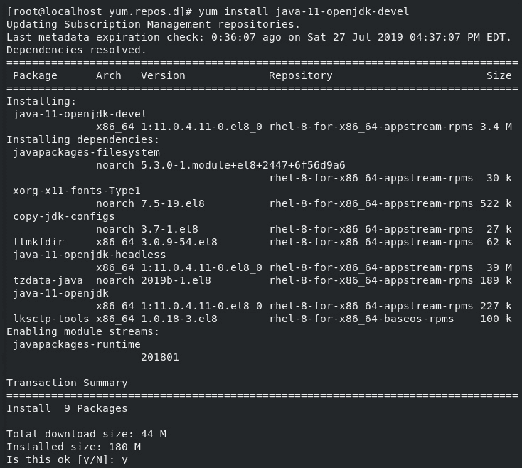

图 14.1 - 安装主要先决条件之一 - Java

安装完成后，我们可以通过运行以下命令来验证安装是否成功以及 Java 是否正常工作：

```
java -version
```

这是预期的输出：

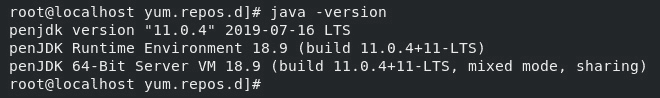

图 14.2 - 检查 Java 的版本

输出应该是当前的 Java 版本和没有错误。除了验证 Java 是否正常工作之外，这一步还很重要，以便验证 Java 的路径是否设置正确 - 如果您在其他发行版上运行，可能需要手动设置路径。

现在 Java 已经安装并准备就绪，我们可以继续安装 ELK 堆栈。下一步是配置 Elasticsearch 和其他服务的安装源：

1.  我们需要在`/etc/yum.repos.d/`中创建一个名为`elasticsearch.repo`的文件，其中将包含有关我们存储库的所有信息：

```
[Elasticsearch-7.x]
name=Elasticsearch repository for 7.x packages
baseurl=https://artifacts.elastic.co/packages/7.x/yum
gpgcheck=1
gpgkey=https://artifacts.elastic.co/GPG-KEY-Elasticsearch
enabled=1
autorefresh=1
type=rpm-md
```

保存文件。这里重要的是仓库是 GPG 签名的，所以我们需要导入它的密钥并应用它，以便在下载时可以验证软件包。

您要安装的文件不是免费软件。Elasticsearch 有两个不同的免费版本和一个付费订阅模型。使用此存储库中的文件将获得基于订阅的安装，该安装将在*basic*模式下运行，该模式是免费的。在撰写本文时，Elastic 有四种订阅模型 - 一种是基于 Apache License 2.0 的开源模型，免费；其余的都是闭源的，但提供额外的功能。目前，这些订阅被命名为 Basic、Gold 和 Platinum。Basic 是免费的，而其他模型需要每月付费订阅。

你肯定会问为什么你应该选择开源而不是 Basic，或者反过来，因为它们都是免费的。虽然它们都有相同的核心，但 Basic 更先进，因为它提供了核心安全功能和更多在日常使用中可能很重要的东西，特别是如果你追求 Kibana 可视化。

1.  让我们继续安装并导入必要的 GPG 密钥：

```
rpm --import https://artifacts.elastic.co/GPG-KEY-elasticsearch
```

1.  现在，我们准备在系统端进行一些维护工作，并获取存储库系统中的所有更改：

```
elasticsearch by running this command:

```

elasticsearch 或任何其他服务都不会自动启动或启用。我们必须为它们中的每一个手动执行此操作。现在让我们来做这件事。

```

```

1.  启动和启用服务的过程是标准的，对所有三个服务都是相同的：

```
sudo systemctl daemon-reload 
sudo systemctl enable elasticsearch.service 
sudo systemctl start elasticsearch.service 
sudo systemctl status elasticsearch.service 
sudo yum install kibana
sudo systemctl status kibana.service 
sudo systemctl enable kibana.service 
sudo systemctl start kibana.service 
sudo yum install logstash
sudo systemctl start logstash.service 
sudo systemctl enable logstash.service 
```

最后要做的就是安装*beats*，这些服务通常安装在受监视的服务器上，并且可以配置为创建和发送系统上的重要指标。现在让我们来做这件事。

1.  为了演示目的，我们将安装它们所有，尽管我们不会使用它们所有：

```
sudo yum install filebeat metricbeat packetbeat heartbeat-elastic auditbeat
```

完成后，我们应该有一个功能齐全的系统。让我们快速回顾一下。

Kibana 和 Elasticsearch 都作为 Web 服务运行在不同的端口上。我们将通过 Web 浏览器与 Kibana 进行交互（使用 URL `http://localhost:9200`和`http://localhost:5601`），因为这是可视化发生的地方：

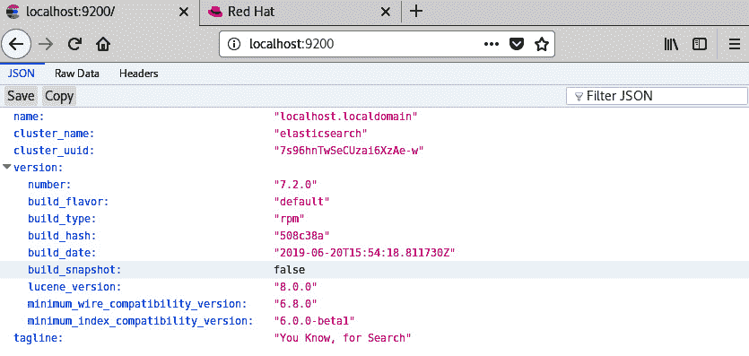

图 14.3 – 检查 Elasticsearch 服务

现在，我们可以在端口`5601`上连接到 Kibana：

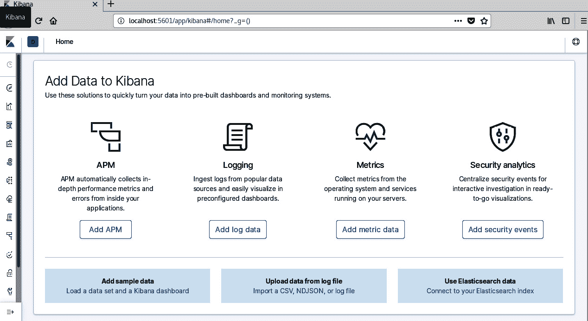

图 14.4 – 成功连接到 Kibana

部署过程已经成功完成。我们的下一个逻辑步骤将是创建一个工作流程。让我们现在就做。

## 工作流程

在本节中，我们将建立一个工作流程 – 我们将创建日志和指标，这些日志和指标将被摄入 Logstash，通过 Elasticsearch 查询，然后在 Kibana 中进行可视化呈现。

默认情况下，Kibana 运行在端口`5601`上，这可以在配置中更改。

但这对我意味着什么？这对 KVM 意味着什么？

使用 Elastic Stack 的最大卖点是灵活性和简单的展示方式。无论我们在几十个 KVM 主机内运行一台、10 台还是 1,000 台机器，我们都可以在生产中以相同的方式对待它们，并建立稳定的监控工作流程。使用极其简单的脚本，我们可以创建完全定制的指标并快速显示它们，我们可以观察趋势，甚至可以创建一个几乎实时的监控系统。所有这些，基本上都是免费的。

让我们创建一个简单的监视器，用于为运行 ELK 的主机系统转储系统指标。我们已经安装了 Metricbeat，所以唯一剩下的就是配置服务将数据发送到 Elasticsearch。数据发送到 Elasticsearch，而不是 Logstash，这仅仅是因为服务之间的相互操作方式。可以将数据同时发送到 Logstash 和 Elasticsearch，因此我们需要在这里做一点快速的解释。

Logstash 从定义上来说是一个存储发送到它的数据的服务。Elasticsearch 搜索该数据并与 Logstash 通信。如果我们将数据发送到 Logstash，我们并没有做错什么；我们只是为以后的分析转储数据。但是，将数据发送到 Elasticsearch 还给了我们一个功能 – 我们不仅可以发送数据，还可以以模板的形式发送关于数据的信息。

另一方面，Logstash 具有在接收数据后并在数据存储之前执行数据转换的能力，因此，如果我们需要执行诸如解析 GeoIP 信息、更改主机名称等操作，我们可能会将 Logstash 作为我们的主要目的地。牢记这一点，不要设置 Metricbeat 以便将数据同时发送到 Elasticsearch 和 Logstash；否则，您将只会在数据库中获得重复的数据。

使用 ELK 很简单，我们已经在安装过程中毫不费力地进行了这一步。当我们开始分析数据时，真正的问题就开始了。即使是来自 Metricbeat 的简单且完全格式良好的数据，也可能很难可视化，特别是如果我们是第一次这样做的话。为 Elasticsearch 和 Kibana 准备的预制模板可以节省大量时间。

看一下以下的屏幕截图：

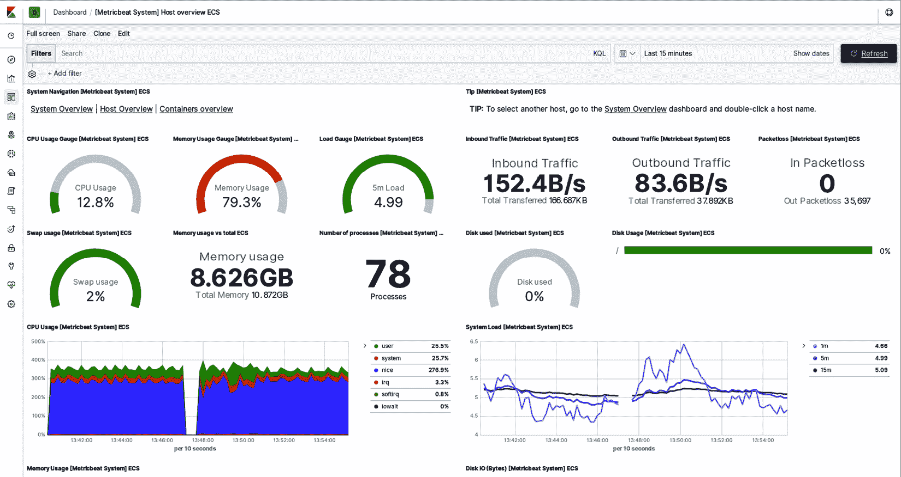

图 14.5 – Metricbeat 仪表板

只需不到 10 分钟的设置，就可以获得一个像这样的完整仪表板。让我们一步一步地进行。

我们已经安装了 Metricbeat，只需要配置它，但在此之前，我们需要配置 Logstash。我们只需要定义一个*pipeline*。

那么，数据如何被转换？

到目前为止，我们还没有详细介绍 Logstash 的功能，但是为了创建我们的第一组数据，我们需要了解 Logstash 的一些内部工作原理。Logstash 使用管道的概念来定义数据在接收到数据后发生的情况，以及在将数据发送到 Elasticsearch 之前。

每个管道都有两个必需的元素和一个可选的元素：

+   输入始终是管道中的第一个，并且旨在从源接收数据。

+   输出是管道中的最后一个元素，并且输出数据。

+   过滤器是一个可选元素，位于输入和输出之间，以便根据我们可以定义的规则修改数据。

所有这些元素都可以从插件列表中选择，以便我们创建一个针对特定目的调整的最佳管道。让我们一步一步地进行。

我们需要做的就是取消注释配置文件中定义的一个管道，该文件位于`/etc/logstash`文件夹中。

整个堆栈使用 YAML 作为配置文件结构的标准，因此每个配置文件都以`.yml`扩展名结尾。这一点很重要，以便理解所有没有此扩展名的文件都在这里作为样本或某种配置模板；只有带有`.yml`扩展名的文件才会被解析。

要配置 Logstash，只需打开`logstash.yml`并取消注释与第一个管道`main`相关的所有行。我们不需要做其他事情。该文件本身位于`/etc/logstash`文件夹中，在您进行这些更改后应该看起来像这样：

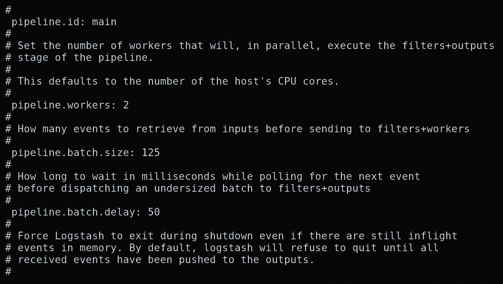

图 14.6 - logstash.yml 文件

我们需要做的下一件事是配置 Metricbeat。

# 配置数据收集器和聚合器

在之前的步骤中，我们成功部署了 Metricbeat。现在，我们需要开始实际的配置。因此，让我们一步一步地进行配置过程：

1.  转到`/etc/metricbeat`并打开`metricbeat.yml`。

取消注释定义`elasticsearch`为 Metricbeat 目标的行。现在，我们需要改变一件事。找到包含以下内容的行：

```
setup.dashboards.enabled: false 
```

将前面的行更改为以下内容：

```
setup.dashboards.enabled: true
```

我们需要这样做来加载仪表板，以便我们可以使用它们。

1.  其余的配置都是通过命令行完成的。Metricbeat 有几个可以运行的命令，但最重要的是以下命令：

```
metricbeat setup
```

这个命令将通过初始设置。设置的这一部分可能是整个初始配置中最重要的事情 - 将仪表板模板推送到 Kibana。这些模板将使您能够在几次点击之内启动和运行，而不是学习如何进行可视化和从头开始配置。您最终将不得不这样做，但是对于这个示例，我们希望尽快让事情运行起来。

1.  您现在需要的另一个命令是以下命令：

```
logstash and kvm:

```

metricbeat 模块启用 kvm

metricbeat 模块启用 logstash

```

```

`logstash`模块的命名令人困惑，因为它并不打算将数据推送到 Logstash；相反，它的主要目的是报告 Logstash 服务，并使您能够通过 Logstash 监视它。听起来困惑吗？让我们重新表达一下：这个模块使 Logstash 能够监视自己。或者更准确地说，它使 beats 能够监视 Elastic 堆栈的一部分。

KVM 模块是一个模板，将使您能够收集不同的与 KVM 相关的指标。

就是这样。作为预防措施，键入以下命令以检查 Metricbeat 的配置：

```
metricbeat test config 
```

如果前面的命令运行正常，请使用以下命令启动 Metricbeat 服务：

```
systemctl start metricbeat 
```

您现在有一个正在运行的服务，正在收集您主机上的数据 - 与运行 KVM 并将数据转储到 Elasticsearch 的主机相同。这是至关重要的，因为我们将使用所有这些数据来创建可视化和仪表板。

## 在 Kibana 中创建图表

现在，在浏览器中使用`localhost:5601`作为地址打开 Kibana。屏幕左侧应该有一个基于图标的菜单。转到**堆栈管理**，查看**Elasticsearch 索引管理**。

应该有一个名为`metricbeat-`*<somenumber>*的活动索引。在这个特定的例子中，*<somenumber>*将是 metricbeat 的当前版本和日志文件中第一个条目的日期。这完全是任意的，只是一个默认值，确保您知道此实例何时启动。

与此名称相同的一行中应该有一些数字：我们感兴趣的是文档计数 - 数据库持有的对象数量。暂时来说，如果不是零，我们就没问题。

现在，转到**仪表板**页面，打开**Metricbeat 系统概览 ECS**仪表板。它将显示许多可视化小部件，代表 CPU、内存、磁盘和网络使用情况：

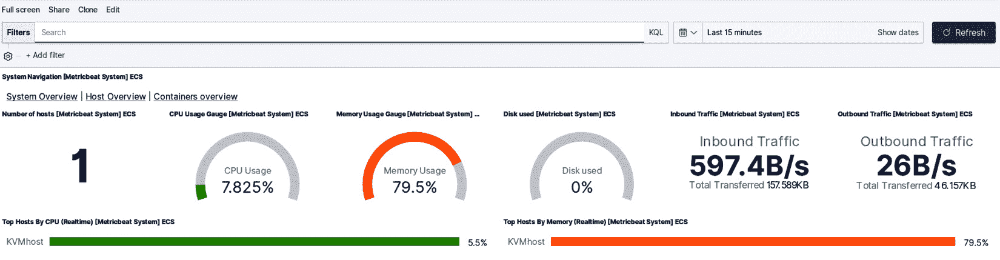

图 14.7 - ECS 仪表板概览

现在，您可以点击“最近 15 分钟”。在您点击**刷新**按钮之后，新数据应该显示在页面上。

有了这些，您现在已经了解了足够的关于 Kibana 的知识，但我们仍然无法可视化 KVM 数据。下一步是创建一个覆盖这一点的仪表板。

但在我们这样做之前，想想我们到目前为止学到的东西可以做什么。您不仅可以监视安装了 KVM 堆栈的本地系统，还可以监视任何能够运行 Metricbeat 的系统。您唯一需要知道的是 ELK 堆栈的 IP 地址，以便您可以向其发送数据。Kibana 将自动处理来自不同系统的所有不同数据的可视化，我们稍后将看到。

## 创建自定义利用率报告

自版本 7 以来，Elastic stack 引入了强制性检查，旨在确保最低安全性和功能合规性，特别是一旦我们开始在生产中使用 ELK。

乍一看，这些检查可能会让您困惑 - 我们引导您完成的安装将正常工作，突然间，当您尝试配置一些设置时，一切都会失败。这是有意的。

在以前的版本中，这些检查是执行的，但如果错过或配置错误了配置项，它们会被标记为警告。从第 7 版开始，如果系统处于生产状态且配置不正确，这些检查将触发错误。这种状态自动意味着如果配置不正确，您的安装将无法工作。

ELK 有两种不同的操作模式：*开发*和*生产*。在第一次安装时，假定您处于开发模式，因此大多数功能都可以直接使用。

一旦进入生产模式，事情就会发生很大变化 - 安全设置和其他配置选项需要明确设置，以使堆栈正常运行。

诀窍在于没有明确的模式更改 - 与之相关的生产设置和检查是由配置中的一些设置触发的。这个想法是一旦您重新配置了一些可能从安全角度重要的东西，您需要正确地重新配置一切。这将防止您忘记一些在生产中可能成为大问题的东西，并迫使您至少有一个稳定的配置作为起点。有一个关闭检查的开关，但在任何情况下都不建议使用。

需要注意的主要事项是绑定接口——默认安装将所有内容绑定到`localhost`或本地环回接口，这对于生产完全没问题。一旦您的 Elasticsearch 能够形成集群，并且可以通过简单地重新配置 HTTP 和传输通信的网络地址来触发，您必须注意检查并重新配置整个系统以使其正常工作。请参阅 https://www.elastic.co/上提供的文档以获取更多信息，从[`www.elastic.co/guide/index.html`](https://www.elastic.co/guide/index.html)开始。

例如，在 Elastic stack 中配置集群以及所有相关内容远远超出了本书的范围——我们将在我们的配置中保持在*单节点集群*的范围内。这个解决方案专门针对可以使用单个节点或更准确地说，覆盖堆栈所有功能的单个机器实例的情况而创建的。在正常部署中，您将在集群中运行 Elastic stack，但实施细节将由您的配置和其需求决定。

我们需要警告您两个关键点——防火墙和 SELinux 设置由您决定。所有服务使用标准的 TCP 进行通信。不要忘记，为了使服务运行，网络必须正确配置。

既然我们已经解决了这个问题，让我们回答一个简单的问题：要使 Elastic stack 与多个服务器一起工作，我们需要做些什么？让我们逐步讨论这种情况。

### Elasticsearch

转到配置文件（`/etc/elasticsearch/elasticsearch.yml`）并在发现部分中添加一行：

```
discovery.type: single-node
```

使用此部分不是强制性的，但在以后必须返回到配置时会有所帮助。

此选项将告诉 Elasticsearch，您的集群中只有一个节点，并且它将使 Elasticsearch 忽略与集群及其网络相关的所有检查。此设置还将使此节点自动成为主节点，因为 Elasticsearch 依赖于具有控制集群中所有内容的主节点。

更改`network.host:`下的设置，使其指向 Elasticsearch 将要在其上可用的接口的 IP 地址。默认情况下，它指向 localhost，并且从网络上不可见。

重新启动 Elasticsearch 服务，并确保它正在运行且没有生成错误：

```
sudo systemctl restart elasticsearch.service 
```

一旦它正常工作，检查服务是否从本地机器正常运行。最简单的方法是这样做：

```
curl -XGET <ip_address>:9200 
```

响应应该是一个以`.json`格式的文本，包含有关服务器的信息。

重要提示

Elastic stack 有三（或四）部分或*服务*。在我们所有的示例中，其中三个（Logstash、Elasticsearch 和 Kibana）都在同一台服务器上运行，因此不需要额外的配置来适应网络通信。在正常配置中，这些服务可能会在独立的服务器上运行，并且根据我们尝试监视的服务的工作负载和配置，可能会运行多个实例。

### Logstash

Logstash 的默认安装文件名为`logstash-sample.conf`，位于`/etc/logstash`文件夹中。这包含了一个简单的 Logstash 管道，用于在 Logstash 作为 beats 的主要目的地时使用。稍后我们会讨论这一点，但目前，将此文件复制到`/etc/logstash/conf.d/logstash.conf`，并在刚刚复制的文件中更改 Elasticsearch 服务器的地址。它应该看起来像这样：

```
hosts => ["http://localhost:9200"]. 
```

将`localhost`更改为服务器的正确 IP 地址。这将使 Logstash 侦听端口`5044`并将数据转发到 Elasticsearch。重新启动服务并验证其运行：

```
sudo systemctl restart logstash.service 
```

现在，让我们学习如何配置 Kibana。

### Kibana

Kibana 也有一些需要更改的设置，但在这样做时，有几件事情需要记住：

+   单独来说，Kibana 是一个通过 HTTP 协议（或根据配置的情况是 HTTPS）提供可视化和数据的服务。

+   同时，Kibana 使用 Elasticsearch 作为其后端，以便获取和处理数据。这意味着我们必须关心两个 IP 地址：

a) 第一个是用于显示 Kibana 页面的地址。默认情况下，这是 localhost 的端口`5601`。

b) 另一个 IP 地址是将处理查询的 Elasticsearh 服务。这个的默认值也是 localhost，但它需要更改为 Elasticsearch 服务器的 IP 地址。

包含配置详细信息的文件是`/etc/kibana/kibana.yml`，您至少需要进行以下更改：

+   `server.host`：这需要指向 Kibana 将拥有其页面的 IP 地址。

+   `elasticsearch.hosts`：这需要指向将执行查询的主机（或集群，或多个主机）。

重新启动服务，就可以了。现在，登录 Kibana 并测试一切是否正常。

为了让您更加熟悉 Kibana，我们将尝试建立一些基本的系统监控，并展示如何监控多个主机。我们将配置两个*beats*：Metricbeat 和 Filebeat。

我们已经配置了 Metricbeat，但是它是为本地主机配置的，所以让我们先解决这个问题。在`/etc/metricbeat/metricbeat.yml`文件中，重新配置输出以将数据发送到`elasticsearch`地址。您只需要更改主机 IP 地址，因为其他所有内容保持不变：

```
# Array of hosts to connect to
Hosts: ["Your-host-IP-address:9200"]
```

确保将`Your-host-IP-address`更改为您正在使用的 IP 地址。

配置 filebeat 基本上是相同的；我们需要使用`/etc/filebeat/filebeat.yml`进行配置。由于所有的 beats 都使用相同的概念，filebeat 和 metricbeat（以及其他 beats）都使用模块来提供功能。在两者中，核心模块都被命名为`system`，因此在 filebeat 中使用以下命令启用它：

```
filebeat modules enable system
```

使用以下命令进行 metricbeat：

```
metricbeat modules enable system
```

我们之前提到过，在第一个示例中，但是您可以通过运行以下命令来测试您的配置：

```
filebeat test config
```

您还可以使用以下命令：

```
metricbeat test config
```

两个 beats 都应该显示配置为`ok`。

此外，您还可以检查输出设置，这将显示输出设置实际上是什么以及它们是如何工作的。如果您只使用本书来配置系统，您应该会收到一个警告，提醒您连接没有 TLS 保护，但除此之外，输出应该在配置文件中设置的 IP 地址上工作。

要测试输出，请使用以下命令：

```
filebeat test output
```

您还可以使用以下命令：

```
metricbeat test output
```

对于您打算监视的每个系统都要重复所有这些步骤。在我们的示例中，我们有两个系统：一个正在运行 KVM，另一个正在运行 Kibana。我们还在另一个系统上设置了 Kibana，以测试 syslog 以及它通知我们注意到的问题的方式。

我们需要配置 filebeat 和 metricbeat 以将数据发送到 Kibana。我们将编辑`filebeat.yml`和`metricbeat.yml`文件，通过更改两个文件的以下部分来实现这一目的：

```
setup.kibana
   host: "Your-Kibana-Host-IP:5601" 
```

在运行 beats 之前，在新安装中，您需要将仪表板上传到 Kibana。您只需要为每个 Kibana 安装执行一次此操作，并且您只需要从要监视的系统中的一个系统执行此操作 - 模板将起作用，无论它们是从哪个系统上传的；它们只会处理进入 Elasticsearch 的数据。

要做到这一点，请使用以下命令：

```
filebeat setup
```

您还需要使用以下命令：

```
metricbeat setup
```

这将需要几秒钟甚至一分钟，这取决于您的服务器和客户端。一旦它说它创建了仪表板，它将显示所有创建的仪表板和设置。

现在，您几乎可以开始查看 Kibana 将显示的所有数据了：

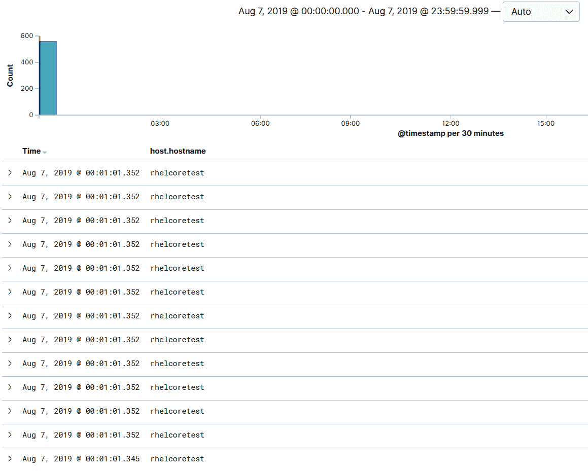

图 14.8 - 来自 Kibana 仪表板的摘录

在我们开始之前，还有一件事情您需要了解有关时间和时间戳。右上角的日期/时间选择器将让您选择自己的时间跨度或预定义的间隔之一：

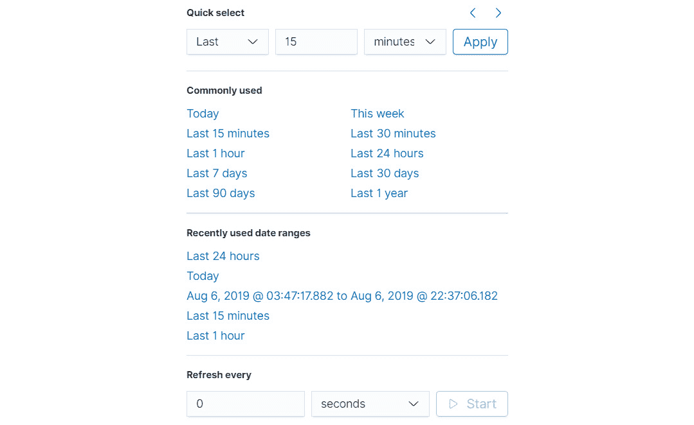

图 14.9-日期/时间选择器

重要提示

始终记住显示的时间是从您访问 Kibana 的浏览器/机器的时区*本地*时间。

日志中的所有时间戳都是发送日志的机器的*本地*时间。Kibana 将尝试匹配时区并转换生成的时间戳，但如果您监视的机器上的实际时间设置不匹配，那么在尝试建立事件时间线时就会出现问题。

假设您已经运行了 filebeat 和 metricbeat。您可以用这些做什么？事实证明，很多：

+   首先要做的是发现您的数据中有什么。在 Kibana 中按下**发现**按钮（看起来像一个小指南针）。如果一切正常，右侧应该显示一些数据。

+   在您刚刚单击的图标右侧，将填充一个垂直空间，其中包含 Kibana 从数据中获取的所有属性。如果您没有看到任何内容或缺少某些内容，请记住您选择的时间跨度会缩小在此视图中显示的数据。尝试重新调整间隔到**最近 24 小时**或**最近 30 天**。

一旦属性列表显示出来，您可以快速确定每个属性在您刚刚选择的数据中出现了多少次-只需单击任何属性并选择**可视化**。还要注意，一旦单击属性，Kibana 会显示最近 500 条记录中前五个不同的值。如果您需要知道例如哪些主机显示数据，或者有多少不同的操作系统版本，这是一个非常有用的工具。

特定属性的可视化只是一个开始-注意一旦悬停在属性名称上，一个名为**添加**的按钮会出现？尝试单击它。右侧将开始形成一个表，其中只包含您选择的属性，按时间戳排序。默认情况下，这些值不会自动刷新，因此时间戳将被固定。您可以选择任意数量的属性，并保存此列表或稍后打开它。

我们需要查看的下一件事是单独的可视化。我们不会详细介绍，但您可以使用预定义的可视化类型从数据集中创建自己的可视化。同时，您不仅限于使用预定义的内容-还可以使用 JSON 和脚本进行更多的自定义。

我们需要了解的下一件事是仪表板。

根据特定数据集，或者更准确地说，根据您正在监视的特定一组机器，其中一些将具有仅涵盖特定机器执行或具有的属性。一个例子是 AWS 上的虚拟机-它们将具有一些仅在 AWS 上下文中有用的信息。这在我们的配置中并不重要，但您需要了解数据中可能存在一些特定机器集的唯一属性。首先，选择一个系统指标；要么选择**System Navigation ECS**用于 metricbeat，要么选择**Dashboards ECS**用于 filebeat。

这些仪表板以多种方式显示有关系统的大量信息。尝试点击并查看您能推断出什么。

metricbeat 仪表板更侧重于运行系统并关注内存和 CPU 分配情况。您可以单击并过滤大量信息，并以不同的方式呈现。以下是 metricbeat 的屏幕截图，以便您对其外观有一个大致的了解：

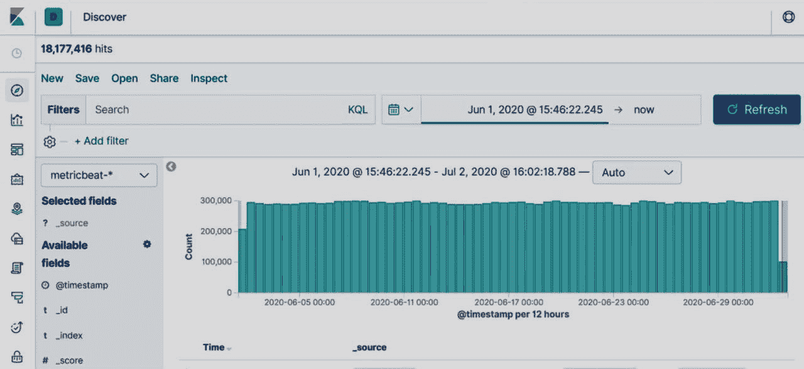

图 14.10-metricbeat 仪表板

filebeat 仪表板更多地面向分析发生了什么并建立趋势。让我们从 filebeat 仪表板中的一些摘录开始检查，首先是 syslog 条目部分：

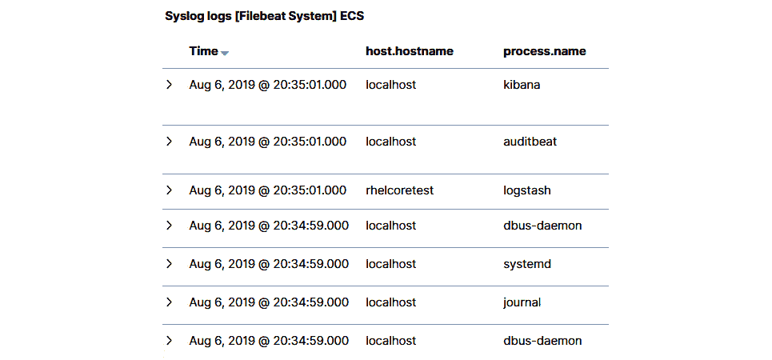

图 14.11 - filebeat syslog 条目部分

乍一看，您可以注意到一些事情。我们正在显示两个系统的数据，而且数据是部分的，因为它覆盖了我们设置的一部分时间间隔。此外，我们可以看到一些进程比其他进程更频繁地运行并生成日志。即使我们对特定系统一无所知，我们现在也可以看到一些进程出现在日志中，而它们可能不应该出现：

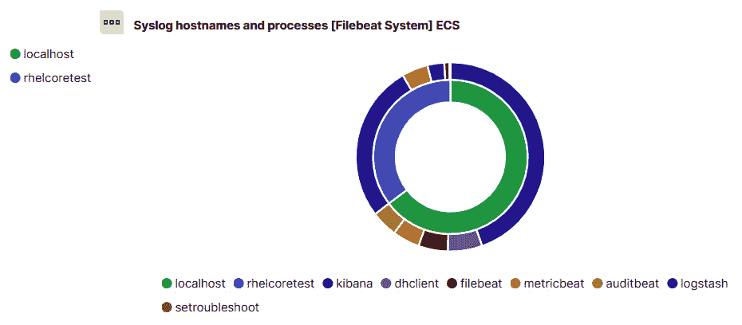

图 14.12 - filebeat 交互式圆环图

让我们来看看`setroubleshoot`。点击进程名称。在打开的窗口中，点击放大镜。这将隔离只有这个进程，并在屏幕底部显示它的日志。

我们可以快速看到`setroubleshoot`在哪个主机上 - 包括频率和原因 - 写入日志。这是发现潜在问题的快速方法。在这种特殊情况下，显然应该在这个系统上采取一些行动，重新配置 SELinux，因为它生成异常并阻止一些应用程序访问文件。

让我们沿着垂直导航栏继续，并指出一些其他有趣的功能。

从上到下，下一个重要功能是**Canvas** - 它使我们能够使用我们正在收集的数据创建实时演示文稿。界面类似于其他演示程序所期望的，但重点是直接在幻灯片中使用数据并几乎实时生成幻灯片。

接下来是**地图**。这是 7.0 版本的一个新功能，它允许我们创建数据的地理演示。

**机器学习**是下一个功能 - 它使您能够操纵数据并使用它来“训练”过滤器，并从中创建管道。

**基础设施**也很有趣 - 当我们提到仪表板时，我们谈论的是灵活性和定制。基础设施是一个模块，它使我们能够以最小的努力进行实时监控并观察重要的指标。您可以将重要数据显示为表格、气球状界面或图表。数据可以被平均或以其他方式呈现，所有这些都是通过一个非常直观的界面完成的。

Heartbeat 是另一个高度专业化的仪表板 - 正如其名称所示，这是跟踪和报告正常运行时间数据的最简单方法，并迅速注意到是否有什么东西已经离线。库存主机需要安装 Heartbeat 服务，以便监视我们打算监视的每个系统。

**SIEM**值得更深入的解释：如果我们把仪表板看作是多功能的，那么 SIEM 恰恰相反；它被创建为能够跟踪所有可以归类为安全相关的系统上的所有事件。当搜索 IP、网络事件、源、目的地、网络流和所有其他数据时，这个模块将解析数据，并创建简单易懂的报告，报告了您正在监视的机器上发生了什么。它甚至提供异常检测，这是一项付费功能，需要最高付费等级才能使用。

**堆栈监视器**是另一个值得注意的仪表板，因为它使您实际上可以看到 Elastic 堆栈的所有不同部分发生了什么。它将显示所有服务的状态、它们的资源分配和许可证状态。**日志**功能特别有用，因为它跟踪堆栈生成了多少种类型的日志，并且如果有任何问题，它可以快速指出问题。

该模块还为服务生成统计信息，使我们能够了解系统如何进行优化。

**管理**，底部的最后一个图标已经提到过了 - 它使集群及其部分的管理成为可能。这是我们可以看到是否有我们期望的任何索引，数据是否流入，我们是否可以优化某些内容等的地方。这也是我们可以管理许可证并创建系统配置快照的地方。

## ELK 和 KVM

最后但同样重要的是，让我们创建一个系统仪表，它将向我们显示来自 KVM hypervisor 的参数，然后以几种方式进行可视化。这需要运行的 KVM hypervisor，安装了 KVM 模块的 metricbeat 和支持从 metricbeat 接收数据的 Elastic stack 配置。让我们详细了解 ELK 针对这个特定用例的配置:

1.  首先，转到 hypervisor 并打开`virsh` shell。列出所有可用的域，选择一个域，并使用`dommemstat –-domain <domain_name>`命令。

结果应该是这样的:

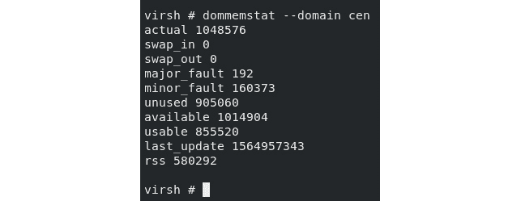

图 14.13 – 用于域的 dommemtest

1.  打开 Kibana 并登录，转到`metric*`作为我们正在使用的索引。左侧列应该填充有 metricbeat 发送到此 Kibana 实例的数据集中的属性。现在，查看属性并选择其中的一些: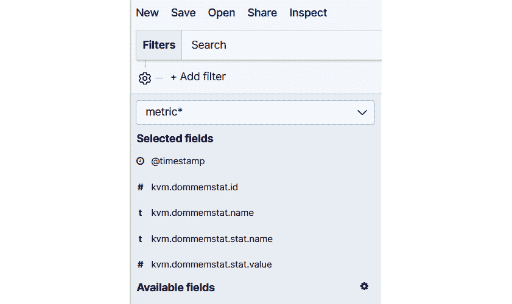

图 14.14 – 在 Kibana 中选择属性

您可以使用一个按钮选择字段，只要将鼠标光标悬停在任何字段上，该按钮就会显示出来。取消选择它们也是一样的:

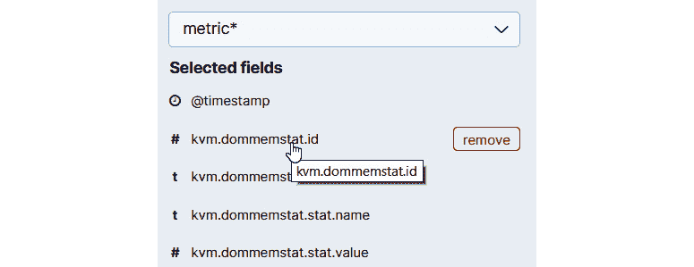

图 14.15 – 在 Kibana 中添加属性

1.  现在，让我们坚持我们选择的那些。在列的右侧，形成了一个表，其中只包含您选择的字段，使您能够检查系统正在接收的数据。您可能需要向下滚动以查看实际信息，因为此表将显示接收到的所有数据，其中至少有一个具有值的项目。由于其中一个字段始终是时间戳，因此将有许多行不包含任何对我们的分析有用的数据: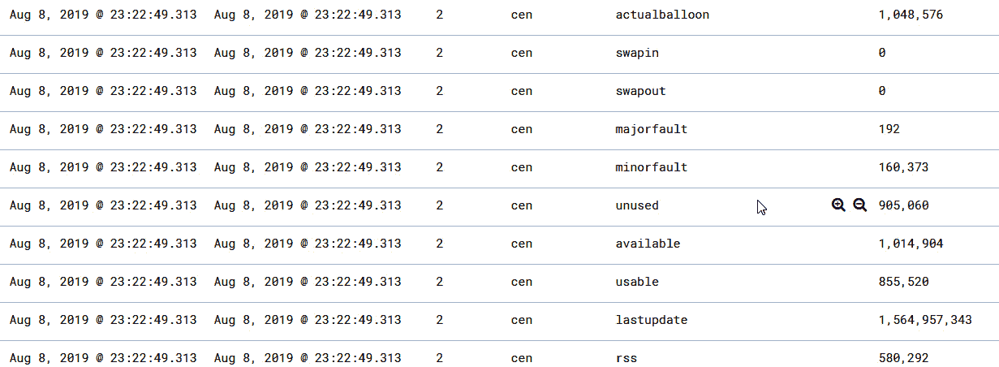

图 14.16 – 检查所选字段

在这里我们可以看到的是，我们得到了在监视服务器上运行命令行的结果相同的数据。

我们需要的是一种方法来使用这些结果作为数据来显示我们的图表。点击`dommemstat`。保存搜索。

1.  现在，让我们构建一个仪表，它将向我们显示实时数据和一个值的快速可视化。转到`area`图。然后，在下一个屏幕上，找到并选择我们的数据源: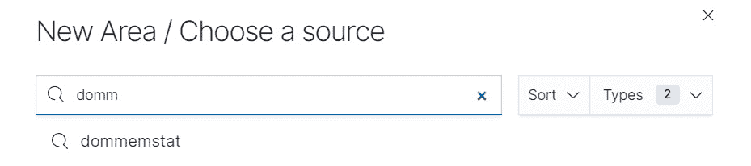

图 14.18 – 选择可视化源

这将创建一个窗口，左侧显示所有设置，右侧显示最终结果。目前，我们看到的东西毫无意义，因此让我们配置我们需要的内容以显示我们的数据。有几种方法可以实现我们想要的内容：我们将使用直方图和过滤器快速显示我们的未使用内存随时间的变化。

1.  我们将配置*y*轴以显示`kvm.dommemstat.stat.value`的平均数据，这是保存我们数据的属性。选择`kvm.dommemstat.stat.value`作为我们正在聚合的字段。如果需要，您可以创建自定义标签: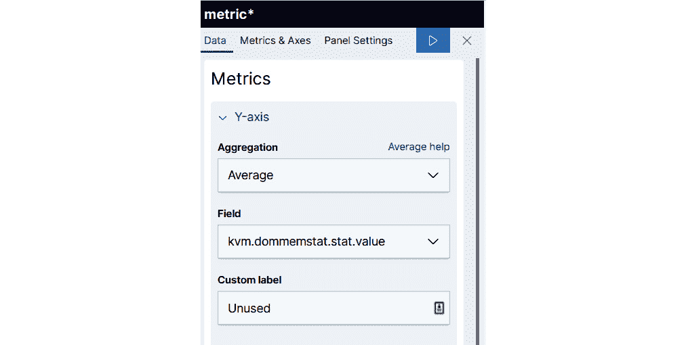

图 18.19 – 选择度量属性

这还不对，我们需要添加一个时间戳以查看我们的数据随时间的变化。我们需要在*x*轴上添加**日期直方图**类型并使用它:

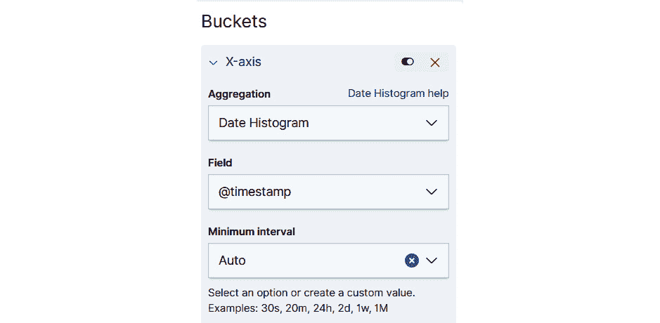

图 14.20 - 选择聚合类型

1.  在完成此可视化之前，我们需要添加一个过滤器。从 KVM metricbeat 模块接收的数据的问题是，它使用一个属性来保存不同的数据 - 如果我们想知道我们正在显示的文件中的数字实际上意味着什么，我们需要从`kvm.dommemstat.stat.name`中读取其名称。为了实现这一点，只需创建一个名为`kvm.dommemstat.stat.name:"unused"`的过滤器。

在我们刷新可视化后，我们的数据应该正确显示在右侧：

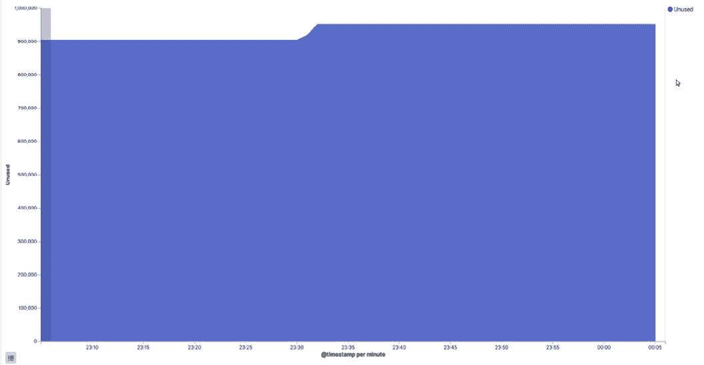

图 14.21 - 正确的可视化

1.  我们需要使用“保存”按钮保存此可视化，为其命名，以便以后能够找到它，并重复此过程，但是不是过滤“未使用”，而是过滤“可用”。将所有设置保持与第一个可视化相同。

让我们构建一个仪表板。打开**仪表板**选项卡，然后在第一个屏幕上单击**添加新仪表板**。现在，将我们的两个可视化添加到此仪表板。您只需要找到正确的可视化并单击它；它将显示在仪表板上。

因此，我们有几个简单的仪表板正在运行：

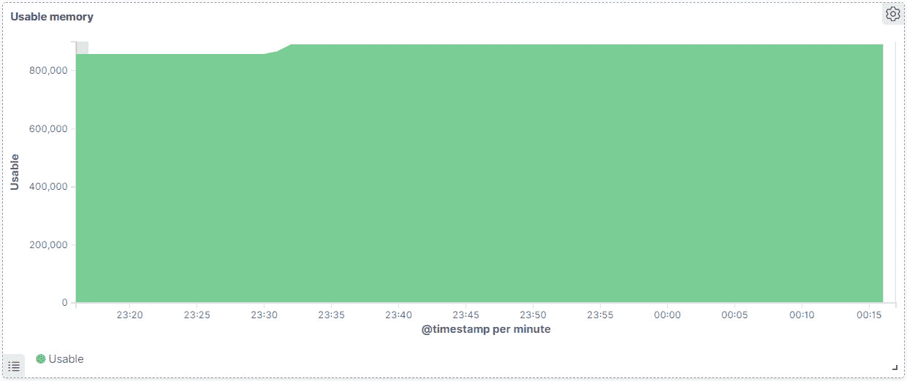

图 14.22 - 显示可用内存的完成仪表板

第二个仪表板 - 在 UI 中，实际上就在第一个仪表板旁边 - 是未使用的内存仪表板：

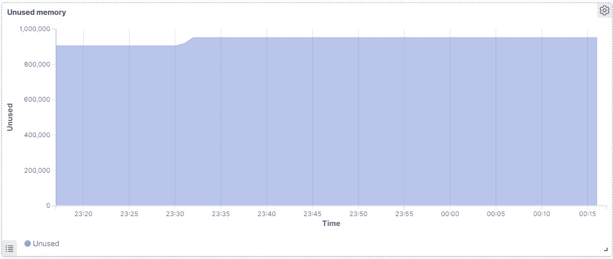

图 14.23 - 显示未使用内存的完成仪表板

1.  保存此仪表板，以便以后使用。仪表板的所有元素都可以自定义，并且仪表板可以包含任意数量的可视化。Kibana 让您几乎可以自定义您看到的一切，并将大量数据组合在一个屏幕上进行轻松监视。我们只需要更改一件事情，使其成为一个良好的监控仪表板，那就是使其自动刷新。单击屏幕右侧的日历图标，并选择自动刷新间隔。我们决定使用`5 秒`：

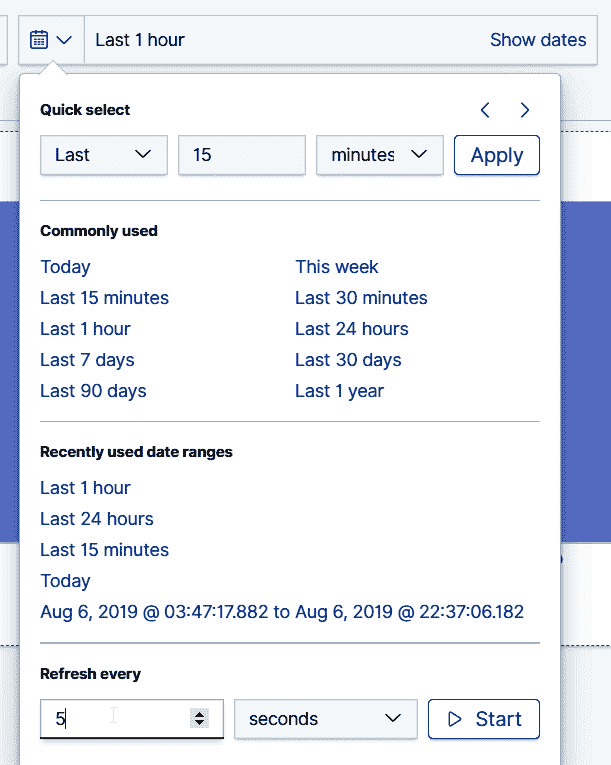

图 14.24 - 选择与时间相关的参数

现在我们已经完成了这个，我们可以反思一下，构建这个仪表板真的非常简单和容易。这只花了我们几分钟，而且很容易阅读。想象一下，以文本模式查看数百兆字节的日志文件与这种方式相比。真的没有可比性，因为我们能够使用先前部署的 ELK 堆栈来监视有关 KVM 的信息，这正是本章的重点。

# 总结

Kibana 让您可以创建自定义仪表板，可以并排显示不同机器的数据，因此 KVM 只是我们的许多选项之一。根据您的需求，您可以显示，例如，KVM 超级管理程序的磁盘使用情况以及运行在其上的所有主机，或者其他一些指标。弹性堆栈是一个灵活的工具，但与所有事物一样，它需要时间来掌握。本章仅涵盖了弹性配置的基础知识，因此我们强烈建议在此主题上进行进一步阅读 - 除了 KVM 之外，ELK 可以用于监视几乎所有产生任何类型数据的东西。

下一章将全面讨论 KVM 虚拟机的性能调优和优化，这是我们并没有真正涉及的一个主题。有很多内容需要讨论 - 虚拟机计算大小、性能优化、磁盘、存储访问和多路径、优化内核和虚拟机设置等等。所有这些主题在我们的环境变得越来越大时将变得更加重要。

# 问题

1.  我们使用 metricbeat 做什么？

1.  我们为什么使用 Kibana？

1.  在安装 ELK 堆栈之前的基本先决条件是什么？

1.  我们如何向 Kibana 添加数据？

# 进一步阅读

有关本章涵盖的内容的更多信息，请参考以下链接：

+   ELK stack：[`www.elastic.co/what-is/elk-stack`](https://www.elastic.co/what-is/elk-stack)

+   ELK stack 文档：[`www.elastic.co/guide/index.html`](https://www.elastic.co/guide/index.html)

+   Kibana 文档：[`www.elastic.co/guide/en/kibana/current/index.html`](https://www.elastic.co/guide/en/kibana/current/index.html)

+   Metricbeat 文档：[`www.elastic.co/guide/en/beats/metricbeat/current/index.html`](https://www.elastic.co/guide/en/beats/metricbeat/current/index.html)
