# 第十五章：*第十五章*：KVM VM 性能调优和优化

当我们思考虚拟化时，总会有一些问题不断出现。其中一些可能很简单，比如我们从虚拟化中能得到什么？它是否简化了事情？备份是否更容易？但是一旦我们使用虚拟化一段时间后，也会出现更复杂的问题。我们如何在计算层面加速？有没有更多的优化方法？我们可以调整什么来从存储或网络中获得更快的速度？我们可以引入一些配置更改，使我们能够在不在其中投入大量资金的情况下从现有基础设施中获得更多？

这就是为什么性能调优和优化对我们的虚拟化环境如此重要。正如我们将在本章中发现的那样，有许多不同的参数需要考虑-特别是如果我们从一开始就没有正确设计事物，这通常是情况。因此，我们将首先涵盖设计的主题，解释为什么它不应该只是一个纯粹的试错过程，然后继续通过不同的设备和子系统来解构这种思维过程。

在本章中，我们将涵盖以下主题：

+   调整 VM CPU 和内存性能- NUMA

+   内核同页合并

+   Virtio 设备调优

+   块 I/O 调优

+   网络 I/O 调优

# 一切都关乎设计

在我们生活的许多其他方面，我们不断重复一些基本模式。在 IT 中，我们通常也会这样做。当我们刚开始做某件事时，通常我们并不擅长。例如，当我们开始进行任何一种运动训练时，通常不如我们坚持几年后的水平。当我们开始音乐训练时，通常在参加音乐学校几年后我们会更擅长。同样的原则也适用于 IT-当我们开始从事 IT 时，我们远不如随着时间和主要是经验的积累变得更加擅长。

我们人类在学习过程中很擅长在智力防御方面设置障碍。我们很擅长说“我会通过我的错误学习”-而且我们通常会将其与“别打扰我”结合起来。

事实是-已经有这么多的知识存在，不去利用它就太愚蠢了。已经有这么多人经历了与我们相同或类似的过程；不利用这种经验来谋取我们的利益将是毫无意义的。此外，为什么要浪费时间在这个“我会通过我的错误学习”的事情上，当我们可以从比我们经验更丰富的人那里学到更多呢？

当我们开始使用虚拟化时，通常会从小处开始。例如，我们开始安装托管虚拟化解决方案，如 VMware Player，Oracle VirtualBox 或类似的解决方案。随着时间的推移，我们会转向具有一对虚拟机（VMs）的 hypervisor。随着我们周围的基础设施增长，我们开始遵循线性模式，试图使基础设施的工作方式与以前小型时相同，这是一个错误。IT 中没有任何线性的东西-增长、成本、管理所花费的时间...绝对没有。实际上，解构这一点非常简单-随着环境的增长，存在更多的相互依赖关系，这意味着一件事会影响另一件事，进而影响另一件事，依此类推。这种无尽的影响矩阵是人们经常忘记的东西，特别是在设计阶段。

重要提示：

这很简单：线性设计将使你一事无成，而正确的设计是性能调优的基础，这样在性能调优方面就要做的工作就少得多了。

在本书的早期（在第二章中，*KVM 作为虚拟化解决方案*），我们提到了**非一致性内存访问**（**NUMA**）。具体来说，我们提到了 NUMA 配置选项是 VM 配置的一个非常重要的部分，特别是如果你正在设计一个承载大量虚拟化服务器的环境。让我们用一些例子来进一步阐述这一点。这些例子将为我们提供一个很好的基础，以从一个“里程高度”的视角来看待性能调优和优化中最大的问题，并描述如何使用良好的设计原则来摆脱许多不同类型的麻烦。我们故意使用微软的解决方案作为例子 - 不是因为我们对使用它们有宗教信仰，而是因为一个简单的事实。我们有很多广泛可用的文档，我们可以利用它们 - 设计文档，最佳实践，简短的文章等。所以，让我们使用它们。

## 通用硬件设计

假设你刚开始设计你的新虚拟化环境。当你今天从你的渠道合作伙伴那里订购服务器时，无论他们是谁，你需要从一个很长的列表中选择一个型号。品牌并不重要 - 有很多型号供选择。你可以选择 1U（所谓的“披萨盒”）服务器，大多数情况下有一个或两个 CPU，具体取决于型号。然后，你可以选择 2U 服务器，3U 服务器……列表呈指数级增长。假设你选择了一个带有一个 CPU 的 2U 服务器。

在下一步中，你选择内存的数量 - 比如 96GB 或 128GB。你下订单，几天或几周后，你的服务器就送到了。你打开它，然后意识到一些事情 - 所有的 RAM 都连接到 CPU1 的内存通道。你把它放在你的内存库里，忘记它，然后继续下一个阶段。

然后，问题变成了一些非常普通设置的微观管理。服务器的 BIOS 版本，hypervisor 级别的驱动程序和 BIOS 设置（电源管理，C 状态，Turbo Boost，超线程，各种与内存相关的设置，不允许核心关闭自己等）对我们在 hypervisor 上运行的 VM 的性能有着巨大的影响。因此，最佳实践肯定是首先检查我们的硬件是否有任何更新的 BIOS/固件版本，并检查制造商和其他相关文档，以确保 BIOS 设置尽可能优化。然后，只有在这之后，我们才能开始勾选一些物理和部署程序 - 在机架中部署我们的服务器，安装操作系统和我们需要的一切，然后开始使用它。

假设过了一段时间，你意识到需要进行一些升级，并订购了一些 PCI Express 卡 - 两个单端口光纤通道 8 Gbit/s 主机适配器，两个单端口 10 Gbit/s 以太网卡，以及两个 PCI Express NVMe 固态硬盘。例如，通过订购这些卡，你想增加一些功能 - 访问光纤通道存储，并通过将这两个功能从 1 Gbit/s 切换到 10 Gbit/s 网络来加快备份过程和虚拟机迁移的速度。你下订单，几天或几周后，你的新 PCI Express 卡送到了。你打开它们，关闭服务器，将其从机架中取出，并安装这些卡。`2U`服务器通常有空间可以安装两甚至三个 PCI Express 延长线卡，用于连接额外的 PCI Express 设备。假设你使用第一个 PCI Express 延长线来部署前两张卡 - 光纤通道控制器和 10 Gbit/s 以太网卡。然后，注意到你没有足够的 PCI Express 连接器将所有东西连接到第一个 PCI Express 延长线，你使用第二个 PCI Express 延长线来安装你的两个 PCI Express NVMe 固态硬盘。你将所有东西固定好，关闭服务器盖，将服务器放回机架，并重新开机。然后，你回到笔记本电脑上，试图格式化 PCI Express NVMe 固态硬盘并将其用于新的虚拟机存储，却发现服务器无法识别这些固态硬盘。你问自己 - 这到底是怎么回事？我的服务器出了问题吗？

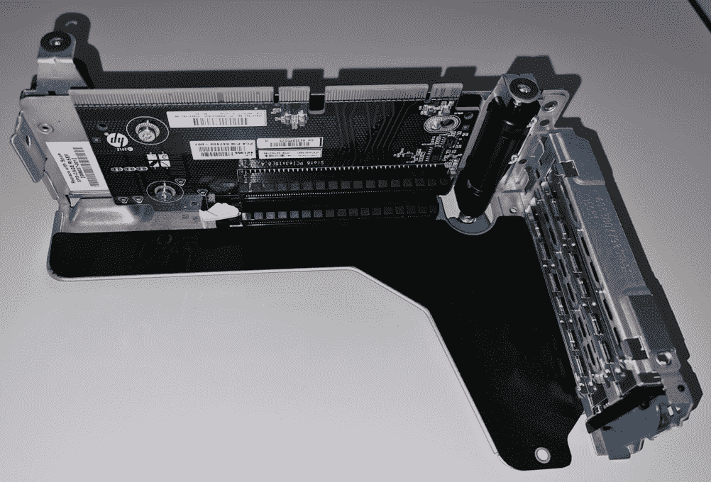

图 15.1 - 适用于 DL380p G8 的 PCI Express 延长线 - 您必须将 PCI Express 卡插入其插槽

你给销售代表打电话，告诉他们你认为服务器出现故障，因为它无法识别这些新的固态硬盘。销售代表将你转接到售前技术支持；你听到对面传来一阵轻笑，然后得到以下信息：“嗯，你看，你不能那样做。如果你想在服务器上使用第二个 PCI Express 延长线，你必须在第二个 CPU 插槽中安装一个 CPU 套件（CPU 加散热器），以及为第二个 CPU 安装内存。订购这两样东西，安装到你的服务器上，你的 PCI Express NVMe 固态硬盘就能正常工作了。”

你结束了电话会话，脑海中留下了一个问号 - *这到底是怎么回事？为什么我需要连接第二个 CPU 和内存到其内存控制器才能使用一些 PCI Express 卡？*

这实际上与两件事有关：

+   你不能在未安装的 CPU 上使用内存插槽，因为该内存需要内存控制器，而内存控制器位于 CPU 内部。

+   你不能在未安装的 CPU 上使用 PCI Express，因为连接 PCI Express 延长线卡到 CPU 的 PCI Express 通道并不一定由芯片组提供 - CPU 也可以用于 PCI Express 通道，而且通常是这样，特别是对于最快速的连接，你一会儿就会了解到。

我们知道这很令人困惑；我们能感受到你的痛苦，因为我们也曾经历过。不幸的是，你必须再和我们待一会儿，因为情况会变得更加混乱。

在*第四章*中，*Libvirt 网络*，我们学习了如何通过使用 Intel X540-AT2 网络控制器来配置 SR-IOV。我们提到在配置 SR-IOV 时我们使用了 HP ProLiant DL380p G8 服务器，所以让我们在这里也使用该服务器作为我们的示例。如果您查看该服务器的规格，您会注意到它使用了*Intel C600*芯片组。然后，如果您前往 Intel 的 ARK 网站（[`ark.intel.com`](https://ark.intel.com)）并搜索有关 C600 的信息，您会注意到它有五个不同的版本（C602、C602J、C604、C606 和 C608），但其中最耐人寻味的部分是所有这些版本都只支持 8 条 PCI Express 2.0 通道。考虑到服务器规格清楚地说明该服务器支持 PCI Express 3.0，这变得非常令人困惑。这是怎么回事，这里使用了什么样的诡计？是的，PCI Express 3.0 卡几乎总是可以以 PCI Express 2.0 的速度工作，但最好不要直接说*这台服务器支持 PCI Express 3.0*，然后发现它通过提供 PCI Express 2.0 级别的性能（每个 PCI Express 通道的速度减慢一倍）来支持它。

只有当您查看 HP ProLiant DL380p G8 QuickSpecs 文档并找到该文档的特定部分（*扩展槽*部分，其中描述了三种不同类型的 PCI Express 扩展槽）时，我们才能找到我们实际需要的所有信息。让我们使用所有 PCI Express 扩展槽的详细信息作为参考和解释。基本上，主要扩展槽由处理器 1 提供两个 PCI Express v3.0 槽（x16 加 x8），第三个槽（PCI Express 2.0 x8）由芯片组提供。对于可选扩展槽，它表示所有槽都由 CPU 提供（x16 加 x8 乘以 2）。实际上，有一些型号可以有三个 PCI Express 扩展槽，对于第三个扩展槽，所有 PCI Express 通道（x16 乘以 2）也由处理器 2 提供。

这一切都*非常重要*。对于许多情景来说，这是性能瓶颈的一个巨大因素，这也是为什么我们的示例围绕着两个 PCI Express NVMe 固态硬盘的想法展开的。我们希望与您一起完成整个旅程。

因此，此时我们可以就我们示例服务器的实际标准硬件设计进行有根据的讨论。如果我们的意图是将这些 PCI Express NVMe 固态硬盘用作我们的 VM 的本地存储，那么大多数人会将这视为优先事项。这意味着我们绝对希望将这些设备连接到 PCI Express 3.0 槽，以避免受到 PCI Express 2.0 速度的限制。如果我们有两个 CPU，我们可能最好在我们的 PCI Express 扩展槽的*第一个 PCI Express 槽*中使用这个特定目的。原因很简单-它们是*PCI Express 3.0 兼容*，并且它们是*由 CPU 提供*。再次强调，这是*非常重要*的-这意味着它们是*直接连接*到 CPU，而不需要通过芯片组的*额外延迟*。因为，归根结底，CPU 是一切的中心枢纽，从 VM 到固态硬盘再返回的数据都将通过 CPU。从设计的角度来看，我们应该绝对利用我们知道的这一点，并将我们的 PCI Express NVMe 固态硬盘*本地*连接到我们的 CPU。

下一步与光纤通道控制器和 10 Gbit/s 以太网控制器有关。大部分 8 Gbit/s 光纤通道控制器都兼容 PCI Express 2.0。同样的情况也适用于 10 Gbit/s 以太网适配器。因此，这又是一个优先考虑的问题。如果您从我们的示例服务器大量使用光纤通道存储，那么逻辑推断您会希望将新的光纤通道控制器放在尽可能快的位置。这将是我们的两个 PCI Express 扩展槽中的第二个 PCI Express 槽。同样，第二个 PCI Express 槽都由 CPU 提供-处理器 1 和处理器 2。现在，我们只剩下 10 Gbit/s 以太网适配器。在我们的示例场景中，我们说我们将使用这些适配器进行备份和 VM 迁移。如果通过芯片组上的网络适配器进行备份，备份不会受到太大影响。VM 迁移可能对此有些敏感。因此，您将第一个 10 Gbit/s 以太网适配器连接到主扩展槽上的第三个 PCI Express 槽（用于备份，由芯片组提供）。然后，您还将第二个 10 Gbit/s 以太网适配器连接到次级扩展槽上的第三个 PCI Express 槽（由处理器 2 提供的 PCI Express 通道）。

我们刚刚开始讨论硬件方面的设计问题，现在我们已经有了如此丰富的信息要处理。现在让我们继续进行我们设计的第二阶段-与 VM 设计相关。具体来说，我们将讨论如何从头开始创建正确设计的新 VM。但是，如果我们要这样做，我们需要知道这个 VM 将为哪个应用程序创建。为此，我们将创建一个场景。我们将使用正在创建的 VM 来托管运行 Windows Server 2019 的 VM 上的 Microsoft SQL 数据库集群中的一个节点。当然，该 VM 将安装在 KVM 主机上。这是客户交给我们的任务。由于我们已经完成了一般的硬件设计，现在我们将专注于 VM 设计。

## VM 设计

创建 VM 很容易-我们只需转到`virt-manager`，点击几次，就可以了。oVirt、RedHat Enterprise Virtualization Manager、OpenStack、VMware 和 Microsoft 虚拟化解决方案也是如此……几乎在任何地方都是一样的。问题在于正确设计 VM。具体来说，问题在于创建一个将预先调整为在非常高的水平上运行应用程序的 VM，然后只留下一小部分配置步骤，我们可以在服务器或 VM 端采取来提高性能-前提是后续的大部分优化过程将在操作系统或应用程序级别完成。

因此，人们通常以两种方式之一开始创建 VM-要么从头开始创建 VM 并向 VM 添加*XYZ*数量的资源，要么使用模板，正如我们在*第八章*中解释的那样，*创建和修改 VM 磁盘、模板和快照*，这将节省大量时间。无论我们使用哪种方式，都会为我们的 VM 配置一定数量的资源。然后，我们记住我们将使用这个 VM（SQL），所以我们将 CPU 的数量增加到，例如，四个，内存的数量增加到 16 GB。我们将该 VM 放在服务器的本地存储中，启动它，并开始部署更新，配置网络，重新启动，通常准备 VM 进行最终安装步骤，即实际安装我们的应用程序（SQL Server 2016）和一些相关更新。完成后，我们开始创建我们的数据库，并继续进行需要完成的下一组任务。

接下来，让我们从设计和调优的角度来看这个过程。

# 调整 VM CPU 和内存性能

上述过程中有一些非常直接的问题。有些只是工程问题，而有些则更多是程序问题。让我们讨论一下：

+   在 IT 领域几乎没有*一刀切*的解决方案。每个客户的每个虚拟机都有不同的情况，并处于不同的环境中，包括不同的设备、服务器等等。不要试图加快流程以*给人留下印象*，因为这肯定会在以后成为问题。

+   当你完成部署后，停下来。学会深呼吸，停下来思考一秒钟，或者等一个小时甚至一天。记住你设计虚拟机的目的。

+   在允许虚拟机投入生产使用之前，检查其配置。虚拟 CPU 的数量、内存、存储位置、网络选项、驱动程序、软件更新——一切都要检查。

+   在安装阶段或模板阶段之前，可以进行大量的预配置。如果你正在将现有环境迁移到新环境，*收集有关旧环境的信息*。了解数据库的大小、使用的存储以及人们对其数据库服务器和使用它们的应用程序的性能满意程度。

在整个过程结束时，学会对你所做的与 IT 相关的工作采取*高层视角*。从质量保证的角度来看，IT 应该是一种高度结构化的、程序化的工作。如果你以前做过某事，学会记录你在安装过程中所做的事情和你所做的更改。文档——就目前而言——是 IT 的最大软肋之一。撰写文档将使你在未来面对相同（较少）或类似（更多）的情况时更容易重复这个过程。向伟人学习——举个例子，如果贝多芬没有详细记录他日复一日所做的事情，我们对他的了解就会少得多。是的，他生于 1770 年，今年将是他诞辰 250 周年，那是很久以前的事了，但这并不意味着 250 年前的惯例是不好的。

现在，你的虚拟机已经配置并投入生产使用，几天或几周后，你会接到公司的电话，他们会问为什么性能*并不那么好*。为什么它的工作效果不像物理服务器一样？

作为一个经验法则，当你在寻找 Microsoft SQL 的性能问题时，它们大致可以分为四类：

+   你的 SQL 数据库受内存限制。

+   你的 SQL 数据库受存储限制。

+   你的 SQL 数据库配置错误。

+   你的 SQL 数据库受 CPU 限制。

根据我们的经验，第一和第二类问题很容易占据 SQL 性能问题的 80-85%。第三类可能占 10%，而最后一类相对较少，但仍然会发生。记住，从基础设施的角度来看，当你设计数据库虚拟机时，你应该首先查看虚拟机内存和存储配置，因为它们是最常见的原因。问题会逐渐积累并不断恶化。具体来说，导致 SQL 虚拟机性能不佳的一些最常见的关键原因是内存位置、从 CPU 角度看待它，以及存储问题——延迟/IOPS 和带宽成为问题。所以，让我们逐一描述这些问题。

我们需要解决的第一个问题与——有趣的是——*地理*有关。对于数据库来说，将其内存内容尽可能靠近分配给其虚拟机的 CPU 核心非常重要。这就是 NUMA 的意义所在。我们可以通过一些配置轻松地解决这个特定问题。假设我们选择我们的虚拟机使用四个虚拟 CPU。我们的测试服务器配备了英特尔至强 E5-2660v2 处理器，每个处理器都有 10 个物理核心。考虑到我们的服务器有两个这样的至强处理器，我们总共有 20 个核心可供使用。

我们有两个基本问题要回答：

+   我们的虚拟机的四个核心如何与下面的 20 个物理核心相关？

+   这与 VM 的内存有什么关系，我们如何优化它？

对这两个问题的答案是取决于*我们*的配置。默认情况下，我们的 VM 可能会从两个物理处理器中使用两个核心，并在内存方面分布在两者之间或 3+1。这些配置示例都不好。你想要的是将所有虚拟 CPU 核心放在*一个*物理处理器上，并且你希望这些虚拟 CPU 核心使用与这四个物理核心相连的内存 - 直接连接到基础物理处理器的内存控制器。我们刚刚描述的是 NUMA 背后的基本思想 - 为你的 VM 提供作为本地内存的构建计算块的节点（由 CPU 核心组成）。

如果可能的话，你希望为该 VM 保留所有内存，这样它就不会在 VM 之外的某个地方交换。在 KVM 中，*VM 之外*将在 KVM 主机交换空间中。始终访问真正的 RAM 内存是性能和 SLA 相关的配置选项。如果 VM 使用一些基础交换分区作为其内存，它的性能将不同。请记住，交换通常是在某种本地 RAID 阵列、SD 卡或类似介质上进行的，与真正的 RAM 内存相比，这些介质在带宽和延迟方面慢得多。如果你想对此做出高层次的陈述 - 不惜一切代价避免 KVM 主机上的内存过度承诺。对于 CPU 也是如此，这是任何其他虚拟化解决方案上常用的最佳实践，而不仅仅是在 KVM 上。

此外，对于关键资源，比如数据库 VM，将 vCPU 固定到特定的物理核心确实是有意义的。这意味着我们可以使用特定的物理核心来运行一个 VM，并且我们应该配置在同一主机上运行的其他 VM*不*使用这些核心。这样，我们就可以*保留*这些 CPU 核心专门用于单个 VM，从而配置一切以获得最大性能，不受运行在物理服务器上的其他 VM 的影响。

是的，有时经理和公司所有者不会喜欢你因为这个最佳实践（好像是你的错），因为这需要适当的规划和足够的资源。但这是他们必须接受的事情 - 或者不接受，看他们的选择。我们的工作是尽可能使 IT 系统运行得最好。

VM 设计有其基本原则，如 CPU 和内存设计、NUMA 配置、配置设备、存储和网络配置等。让我们逐步地逐个讨论所有这些主题，从一个高级的基于 CPU 的功能开始，如果正确使用，它确实可以帮助我们的系统尽可能地运行得最好 - CPU 固定。

## CPU 固定

CPU 固定只是设置 vCPU 和主机物理 CPU 核心之间*亲和性*的过程，以便 vCPU 只在该物理 CPU 核心上执行。我们可以使用`virsh vcpupin`命令将 vCPU 绑定到物理 CPU 核心或物理 CPU 核心的子集。

在进行 vCPU 固定时有一些最佳实践：

+   如果客人 vCPU 的数量超过单个 NUMA 节点的 CPU 数量，则不要使用默认的固定选项。

+   如果物理 CPU 分布在不同的 NUMA 节点上，最好创建多个虚拟机，并将每个虚拟机的 vCPU 固定到同一 NUMA 节点中的物理 CPU。这是因为访问不同的 NUMA 节点，或者跨多个 NUMA 节点运行，对性能有负面影响，特别是对于内存密集型应用程序。

让我们来看看 vCPU 固定的步骤：

1.  执行`virsh nodeinfo`以收集有关主机 CPU 配置的详细信息：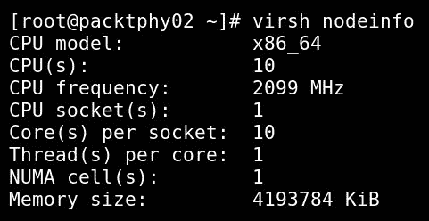

图 15.2 - 关于我们的 KVM 节点的信息

1.  下一步是通过执行`virsh capabilities`命令并检查标记为`<topology>`的部分来获取 CPU 拓扑结构：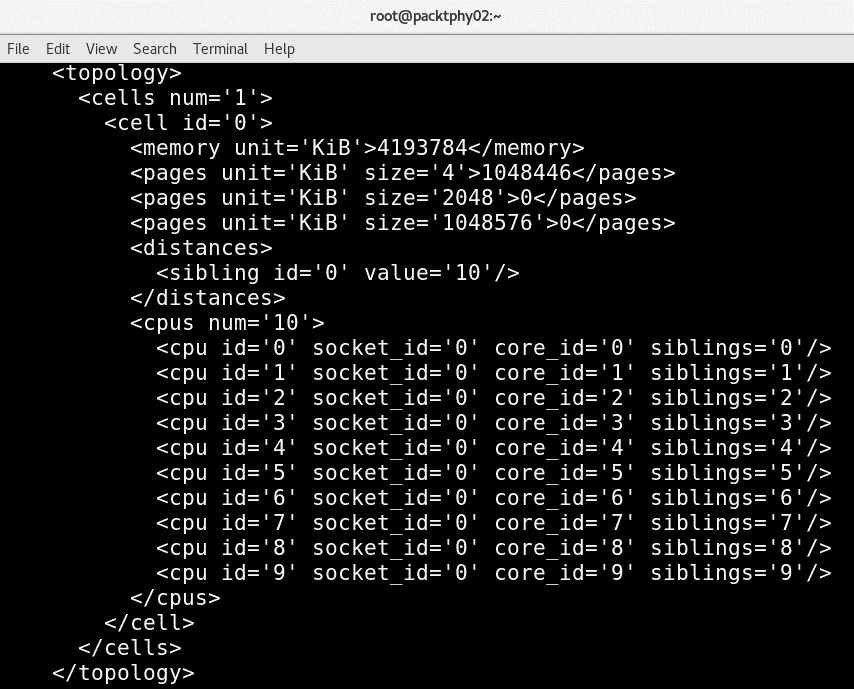

图 15.3 – 具有所有可见物理 CPU 核心的 virsh capabilities 输出

一旦我们确定了主机的拓扑结构，下一步就是开始固定 vCPU。

1.  让我们首先检查名为`SQLForNuma`的客户端的当前亲和力或固定配置，该客户端有四个 vCPU：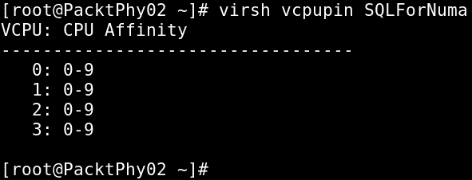

图 15.4 – 检查默认的 vcpupin 设置

让我们通过使用 CPU 固定来改变这一点。

1.  让我们将`vCPU0`固定到物理核心 0，`vCPU1`固定到物理核心 1，`vCPU2`固定到物理核心 2，`vCPU3`固定到物理核心 3：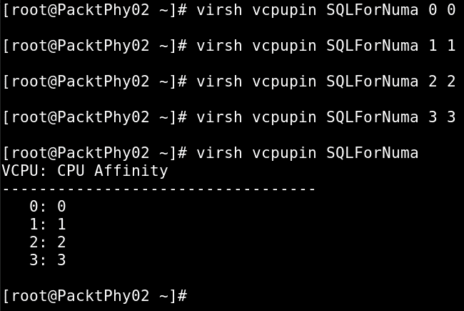

图 15.5 – 配置 CPU 固定

通过使用`virsh vcpupin`，我们改变了此 VM 的固定虚拟 CPU 分配。

1.  让我们在此 VM 上使用`virsh dumpxml`来检查配置更改：

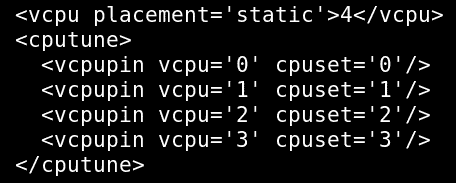

图 15.6 – CPU 固定 VM 配置更改

注意`virsh`命令中列出的 CPU 亲和力以及运行客户端的 XML 转储中的`<cputune>`标记。正如 XML 标记所说，这属于客户端的 CPU 调整部分。还可以配置一组物理 CPU 用于特定 vCPU，而不是单个物理 CPU。

有几件事情要记住。 vCPU 固定可以提高性能；但是，这取决于主机配置和系统上的其他设置。确保进行足够的测试并验证设置。

您还可以使用`virsh vcpuinfo`来验证固定。`virsh vcpuinfo`命令的输出如下：

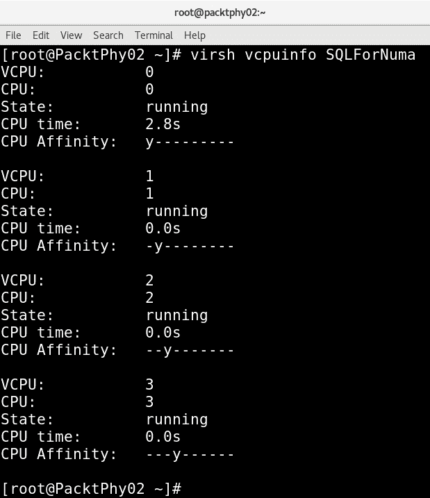

图 15.7 – 用于我们的 VM 的 virsh vcpuinfo

如果我们在繁忙的主机上进行此操作，将会产生后果。有时，我们可能无法启动我们的 SQL 机器，因为这些设置。因此，为了更大的利益（SQL VM 能够工作而不是不想启动），我们可以将内存模式配置从`strict`更改为`interleave`或`preferred`，这将放宽对于为此 VM 严格使用本地内存的坚持。

现在让我们探讨内存调整选项，因为这是下一个逻辑要讨论的事情。

## 内存调整

对于大多数环境来说，内存都是宝贵的资源，不是吗？因此，应通过调整来实现对内存的有效使用。优化 KVM 内存性能的第一条规则是在设置期间不要为客户端分配比其使用的资源更多的资源。

我们将更详细地讨论以下内容：

+   内存分配

+   内存调整

+   内存支持

让我们从解释如何为虚拟系统或客户端配置内存分配开始。

### 内存分配

为了使分配过程简单，我们将再次考虑`virt-manager` libvirt 客户端。内存分配可以从以下截图中显示的窗口中完成：

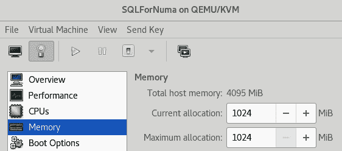

图 15.8 – VM 内存选项

正如您在前面的截图中所看到的，有两个主要选项：**当前分配**和**最大分配**：

+   **最大分配**：客户端的运行时最大内存分配。这是客户端在运行时可以分配的最大内存。

+   **当前分配**：客户端始终使用的内存量。出于内存球形原因，我们可以将此值设置为低于最大值。

`virsh`命令可用于调整这些参数。相关的`virsh`命令选项是`setmem`和`setmaxmem`。

### 内存调整

内存调整选项添加在客户端配置文件的`<memtune>`下。

其他内存调整选项可以在[`libvirt.org/formatdomain.html#elementsMemoryTuning`](http://libvirt.org/formatdomain.html#elementsMemoryTuning)找到。

管理员可以手动配置客户机的内存设置。如果省略了`<memtune>`配置，那么默认的内存设置将适用于客户机。这里使用的`virsh`命令如下：

```
# virsh memtune <virtual_machine> --parameter size parameter
```

它可以具有以下任何值；这个最佳实践在 man 页面中有很好的记录：

```
--hard-limit       The maximum memory the guest can use.
--soft-limit       The memory limit to enforce during memory contention.
--swap-hard-limit  The maximum memory plus swap the guest can use.  This has to be more than hard-limit value provided. 
--min-guarantee    The guaranteed minimum memory allocation for the guest.
```

可以获取为`memtune`参数设置的默认/当前值，如下所示：

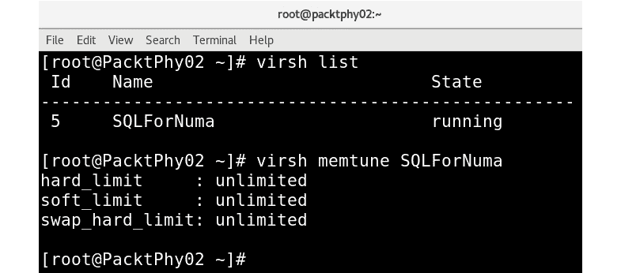

图 15.9 - 检查 VM 的 memtune 设置

在设置`hard_limit`时，不应将此值设置得太低。这可能导致虚拟机被内核终止。这就是为什么确定虚拟机（或任何其他进程）的正确资源量是一个设计问题。有时，正确设计东西似乎就像黑暗艺术一样。

要了解如何设置这些参数，请参阅以下截图中`memtune`命令的帮助输出：

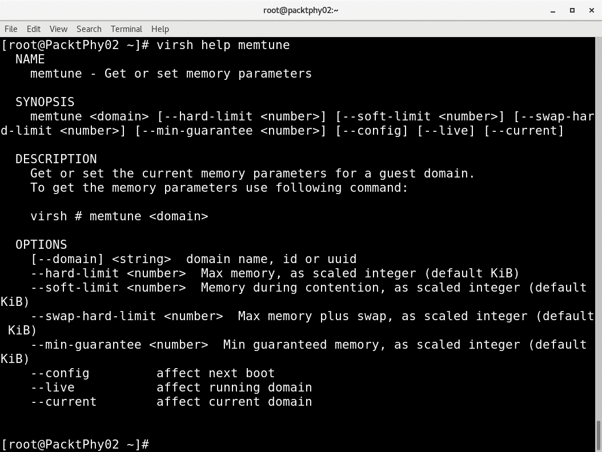

图 15.10 - 检查 virsh 帮助 memtune

在我们讨论了内存分配和调整之后，最后一个选项是内存后备。

### 内存后备

以下是内存后备的客户机 XML 表示：

```
<domain>     ...
  <memoryBacking>
    <hugepages>
    <page size="1" unit="G" nodeset="0-3,5"/>
    <page size="2" unit="M" nodeset="4"/>
    </hugepages>
    <nosharepages/>
    <locked/>
</memoryBacking>     ...
  </domain>
```

您可能已经注意到内存后备有三个主要选项：`locked`、`nosharepages`和`hugepages`。让我们逐一介绍它们，从`locked`开始。

#### locked

在 KVM 虚拟化中，客户机内存位于 KVM 主机中的`qemu-kvm`进程的进程地址空间中。这些客户机内存页面可以根据主机的需求随时被 Linux 内核交换出去，这就是`locked`可以帮助的地方。如果将客户机的内存后备选项设置为`locked`，主机将不会交换属于虚拟系统或客户机的内存页面。当启用此选项时，主机系统内存中的虚拟内存页面将被锁定：

```
<memoryBacking>
    <locked/>
</memoryBacking>
```

我们需要使用`<memtune>`来设置`hard_limit`。计算很简单 - 我们需要为客户机加上开销的内存量。

#### nosharepages

以下是来自客户机配置文件的`nosharepages`的 XML 表示：

```
<memoryBacking>
    <nosharepages/>
</memoryBacking>
```

有不同的机制可以在内存页面相同的情况下实现内存共享。诸如`nosharepages`选项之类的技术指示了虚拟化程序禁用此客户机的共享页面 - 也就是说，设置此选项将阻止主机在客户机之间进行内存去重。

#### hugepages

第三个也是最后一个选项是`hugepages`，可以用 XML 格式表示如下：

```
<memoryBacking>
</hugepages>
</memoryBacking>
```

HugePages 是在 Linux 内核中引入的，以改善内存管理的性能。内存以称为页面的块进行管理。不同的架构（i386、ia64）支持不同的页面大小。对于 x86 CPU（4 KB 内存页面）来说，我们不一定要使用默认设置，因为我们可以使用更大的内存页面（2 MB 到 1 GB），这个功能称为 HugePages。CPU 的一个部分称为**内存管理单元**（**MMU**）通过使用列表来管理这些页面。页面通过页表引用，并且每个页面在页表中都有一个引用。当系统想要处理大量内存时，主要有两种选项。其中一种涉及增加硬件 MMU 中的页表条目数。第二种方法是增加默认页面大小。如果我们选择增加页表条目的第一种方法，那么成本就会很高。

处理大量内存的第二种更有效的方法是使用 HugePages 或通过使用 HugePages 增加页面大小。每台服务器的不同内存量意味着需要不同的页面大小。默认值对大多数情况都可以，而巨大的内存页面（例如 1 GB）在我们有大量内存（数百 GB 甚至 TB）时更有效。这意味着在引用内存页面方面需要更少的*管理*工作，而实际上花费更多时间获取这些内存页面的内容，这可能会导致显著的性能提升。大多数已知的 Linux 发行版都可以使用 HugePages 来管理大量内存。进程可以使用 HugePages 内存支持通过增加 CPU 缓存命中来提高性能，这是在*第二章*中解释的，*KVM 作为虚拟化解决方案*。您已经知道，客户系统只是 Linux 系统中的进程，因此 KVM 客户也有资格执行相同的操作。

在我们继续之前，我们还应该提到`MADV_HUGEPAGE`区域（以避免消耗更多的内存资源），或者在整个系统中启用。系统中配置 THP 有三个主要选项：`always`，`madvise`和`never`。

```
# cat/sys/kernel/mm/transparent_hugepage/enabled [always] madvise never
```

从前面的输出中，我们可以看到我们服务器中当前的 THP 设置为`madvise`。其他选项可以通过使用以下命令之一来启用：

```
echo always >/sys/kernel/mm/transparent_hugepage/enabled
echo madvise >/sys/kernel/mm/transparent_hugepage/enabled
echo never >/sys/kernel/mm/transparent_hugepage/enabled 
```

简而言之，这些值的含义如下：

+   `always`：始终使用 THP。

+   `madvise`：仅在`MADV_HUGEPAGE`中使用 HugePages。

+   `never`：禁用该功能。

THP 会自动优化性能设置。通过将内存用作缓存，我们可以获得性能优势。当 THP 存在时，可以使用静态 HugePages，或者换句话说，THP 不会阻止使用静态方法。如果我们不配置 KVM hypervisor 来使用静态 HugePages，它将使用 4 KB 的透明 HugePages。使用 HugePages 来管理 KVM 客户端内存的优势在于，用于页表的内存更少，TLB 缺失减少；显然，这会提高性能。但请记住，当为客户端内存使用 HugePages 时，您将无法再交换或收缩客户端内存。

让我们快速看一下如何在 KVM 设置中使用静态 HugePages。首先，让我们检查当前的系统配置 - 很明显，这个系统中的 HugePages 大小目前设置为 2 MB：

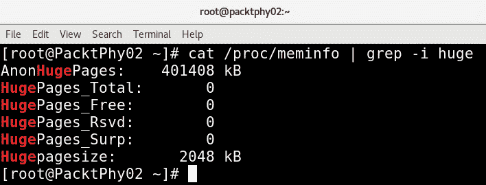

图 15.11 - 检查 HugePages 设置

我们主要讨论以 HugePages 开头的所有属性，但值得一提的是`AnonHugePages`属性。`AnonHugePages`属性告诉我们系统级别上当前 THP 的使用情况。

现在，让我们配置 KVM 以使用自定义的 HugePages 大小：

1.  通过运行以下命令查看当前显式的`hugepages`值或从`sysfs`中获取它，如下所示：

```
#  cat /proc/sys/vm/nr_hugepages
0
```

1.  我们还可以使用`sysctl -a |grep huge`命令：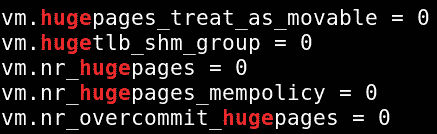

图 15.12 - sysctl hugepages 设置

1.  由于 HugePage 大小为 2 MB，我们可以按 2 MB 的增量设置 hugepages。要将 hugepages 的数量设置为 2,000，请使用以下命令：

```
# echo 2000 > /proc/sys/vm/nr_hugepages
```

巨大页面分配的总内存不能被不了解巨大页面的应用程序使用 - 也就是说，如果你过度分配了巨大页面，主机系统的正常操作可能会受到影响。在我们的例子中，2048*2 MB 将等于 4096 MB 的内存，在进行此配置时我们应该有这么多可用的内存。

1.  我们需要告诉系统这种类型的配置实际上是可以的，并配置`/etc/security/limits.conf`以反映这一点。否则，系统可能会拒绝给我们访问 2,048 个 2 MB 内存的巨大页面。我们需要在该文件中添加两行：

```
<value> parameter will depend on the configuration we want to do. If we want to configure everything according to our 2048*2 MB example, <value> would be 4,194,304 (or 4096*1024).
```

1.  要使其持久化，您可以使用以下命令：

```
# sysctl -w vm.nr_hugepages=<number of hugepages>
```

1.  然后，挂载`fs`大页，重新配置虚拟机，并重新启动主机：

```
 # mount -t hugetlbfs hugetlbfs /dev/hugepages
```

通过在虚拟机配置文件中添加以下设置来重新配置已配置大页的虚拟机：

```
<memoryBacking>
</hugepages>
</ memoryBacking> 
```

现在是关闭虚拟机并重新启动主机的时候。在虚拟机内执行以下操作：

```
# systemctl poweroff
```

在主机上，执行以下操作：

```
# systemctl reboot
```

主机重新启动并重新启动虚拟机后，它现在将开始使用大页。

下一个主题与在多个虚拟机之间共享内存内容有关，称为 KSM。这项技术被广泛用于*节省*内存。在任何给定时刻，当虚拟化主机上启动多个虚拟机时，这些虚拟机有很大的统计机会具有相同的内存内容块（它们具有相同的内容）。然后，没有理由多次存储相同的内容。通常，我们将 KSM 称为应用于内存的去重复过程。让我们学习如何使用和配置 KSM。

# 熟悉 KSM

KSM 是一个允许不同进程之间共享相同页面的功能。我们可能会认为相同的页面存在是由于某些原因，例如，如果有多个进程从相同的二进制文件生成，或者类似的情况。但实际上并没有这样的规则。KSM 扫描这些相同的内存页面，并合并一个写时复制的共享页面。写时复制是一种机制，当试图更改一个被多个进程共享的内存区域时，请求更改的进程会得到一个新的副本，并将更改保存在其中。

尽管所有进程都可以访问合并的写时复制共享页面，但每当一个进程尝试更改内容（向该页面写入）时，该进程都会得到一个带有所有更改的新副本。到目前为止，您可能已经了解到，通过使用 KSM，我们可以减少物理内存消耗。在 KVM 环境中，这确实可以增加价值，因为客户端系统是系统中的`qemu-kvm`进程，并且所有虚拟机进程很可能具有大量相似的内存。

为了使 KSM 工作，进程/应用程序必须向 KSM 注册其内存页面。在 KVM 环境中，KSM 允许客户端共享相同的内存页面，从而提高内存消耗。这可能是某种应用程序数据、库或其他经常使用的内容。这个共享的页面或内存被标记为“写时复制”。简而言之，KSM 避免了内存重复，当 KVM 环境中存在相似的客户端操作系统时，它非常有用。

通过使用预测理论，KSM 可以提供增强的内存速度和利用率。大多数情况下，这些共享数据存储在缓存或主内存中，这会导致 KVM 客户端的缓存未命中减少。此外，KSM 可以减少客户端内存占用，从某种程度上允许用户在 KVM 设置中进行内存超额分配，从而提供更大的资源利用率。然而，我们必须记住，KSM 需要更多的 CPU 资源来识别重复页面并执行共享/合并等任务。

之前，我们提到进程必须标记*页面*，以表明它们是 KSM 操作的合格候选者。这种标记可以由基于`MADV_MERGEABLE`标志的进程完成，我们将在下一节中讨论。您可以在`madvise`手册页中了解有关此标志的用法：

```
# man 2 madvise
MADV_MERGEABLE (since Linux 2.6.32)
Enable Kernel Samepage Merging (KSM) for the pages in the range specified by addr and length. The kernel regularly scans those areas of user memory that have been marked as mergeable, looking for pages with identical content.  These are replaced by a single write-protected page (that is automatically copied if a process later wants to update the content of the page).  KSM merges only private anonymous pages (see mmap(2)).
The KSM feature is intended for applications that generate many instances of the same data (e.g., virtualization systems such as KVM).  It can consume a lot of processing   power; use with care.  See the Linux kernel source file Documentation/ vm/ksm.txt for more details.
The MADV_MERGEABLE and MADV_UNMERGEABLE operations are available only if the kernel was configured with CONFIG_KSM.
```

因此，内核必须配置 KSM，如下所示：

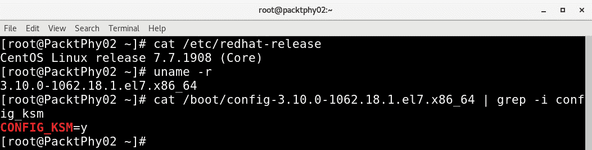

图 15.13 - 检查 KSM 设置

KSM 作为`qemu-kvm`软件包的一部分部署。可以从`sysfs`文件系统中的`/sys`目录中获取有关 KSM 服务的信息。在这个位置有不同的文件，反映了当前 KSM 的状态。这些文件由内核动态更新，并且它有 KSM 使用和统计的精确记录：

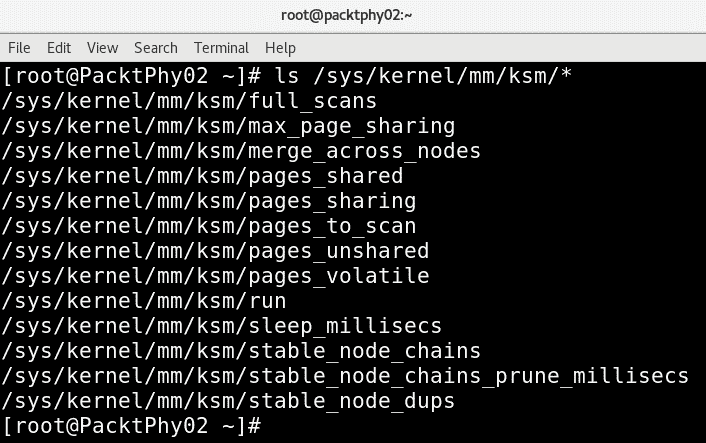

图 15.14 - sysfs 中的 KSM 设置

在接下来的部分中，我们将讨论`ksmtuned`服务及其配置变量。由于`ksmtuned`是一个控制 KSM 的服务，其配置变量类似于我们在`sysfs`文件系统中看到的文件。有关更多详细信息，请查看[`www.kernel.org/doc/html/latest/admin-guide/mm/ksm.html`](https://www.kernel.org/doc/html/latest/admin-guide/mm/ksm.html)。

还可以使用`virsh`命令调整这些参数。`virsh node-memory-tune`命令可以为我们完成这项工作。例如，以下命令指定在共享内存服务进入休眠之前要扫描的页面数：

```
# virsh node-memory-tune --shm-pages-to-scan number
```

与任何其他服务一样，`ksmtuned`服务也有日志存储在日志文件`/var/log/ksmtuned`中。如果我们在`/etc/ksmtuned.conf`中添加`DEBUG=1`，我们将从任何类型的 KSM 调整操作中获得日志记录。有关更多详细信息，请参阅[`www.kernel.org/doc/Documentation/vm/ksm.txt`](https://www.kernel.org/doc/Documentation/vm/ksm.txt)。

一旦我们启动了 KSM 服务，如下所示，您可以观察值的变化，具体取决于 KSM 服务的操作：

```
# systemctl start ksm
```

然后我们可以像这样检查`ksm`服务的状态：

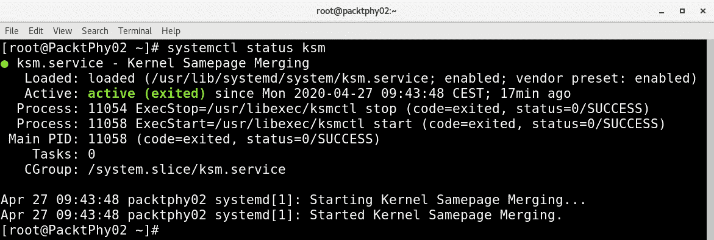

图 15.15 - ksm 服务命令和 ps 命令输出

一旦 KSM 服务启动并且我们的主机上有多个虚拟机正在运行，我们可以使用以下命令多次查询`sysfs`来检查变化：

```
cat /sys/kernel/mm/ksm/*
```

让我们更详细地探讨`ksmtuned`服务。`ksmtuned`服务被设计成经历一系列动作并调整 KSM。这个动作循环会不断地工作。每当创建或销毁一个客户系统时，libvirt 都会通知`ksmtuned`服务。

`/etc/ksmtuned.conf`文件是`ksmtuned`服务的配置文件。以下是可用的配置参数的简要说明。您可以看到这些配置参数与`sysfs`中的 KSM 文件相匹配：

```
# Configuration file for ksmtuned.
# How long ksmtuned should sleep between tuning adjustments
# KSM_MONITOR_INTERVAL=60
# Millisecond sleep between ksm scans for 16Gb server.
# Smaller servers sleep more, bigger sleep less.
# KSM_SLEEP_MSEC=10
# KSM_NPAGES_BOOST - is added to the `npages` value, when `free memory` is less than `thres`. 
# KSM_NPAGES_BOOST=300
# KSM_NPAGES_DECAY - is the value given is subtracted to the `npages` value, when `free memory` is greater than `thres`. 
# KSM_NPAGES_DECAY=-50
# KSM_NPAGES_MIN - is the lower limit for the `npages` value.
# KSM_NPAGES_MIN=64
# KSM_NPAGES_MAX - is the upper limit for the `npages` value.
# KSM_NPAGES_MAX=1250
# KSM_THRES_COEF - is the RAM percentage to be calculated in parameter `thres`.
# KSM_THRES_COEF=20
# KSM_THRES_CONST - If this is a low memory system, and the `thres` value is less than `KSM_THRES_CONST`, then reset `thres` value to `KSM_THRES_CONST` value.
# KSM_THRES_CONST=2048
```

KSM 旨在提高性能并允许内存超额分配。在大多数环境中，它都能够实现这一目的；然而，在某些设置或环境中，KSM 可能会引入性能开销 - 例如，如果您有一些虚拟机在启动时具有相似的内存内容，然后进行大量的内存密集型操作。这将会导致问题，因为 KSM 首先会非常努力地减少内存占用，然后浪费时间来处理多个虚拟机之间的所有内存内容差异。此外，有人担心 KSM 可能打开一个潜在的渠道，可能被用于在客户之间泄露信息，这在过去几年中已经有充分的记录。如果您有这些担忧，或者如果您看到/经历 KSM 没有帮助提高工作负载的性能，可以将其禁用。

要禁用 KSM，通过执行以下命令停止系统中的`ksmtuned`和`ksm`服务：

```
# systemctl stop ksm
# systemctl stop ksmtuned
```

我们已经研究了 CPU 和内存的不同调优选项。接下来我们需要讨论的下一个重要主题是 NUMA 配置，其中 CPU 和内存配置成为更大故事或背景的一部分。

# 使用 NUMA 调整 CPU 和内存

在我们开始为 NUMA 可用系统调整 CPU 和内存之前，让我们看看 NUMA 是什么以及它是如何工作的。

将 NUMA 视为一个系统，其中有多个系统总线，每个总线为一小组处理器和关联内存提供服务。每组处理器都有自己的内存，可能还有自己的 I/O 通道。可能无法阻止或阻止运行的 VM 跨越这些组。这些组中的每一个称为**NUMA 节点**。

在这个概念中，如果一个进程/线程在一个 NUMA 节点上运行，同一节点上的内存称为本地内存，而驻留在不同节点上的内存称为外部/远程内存。这种实现与**对称多处理系统**（**SMP**）不同，SMP 中所有内存的访问时间对所有 CPU 都是相同的，因为内存访问是通过一个集中的总线进行的。

讨论 NUMA 的一个重要主题是 NUMA 比率。NUMA 比率是衡量 CPU 访问本地内存相对于访问远程/外部内存的速度的指标。例如，如果 NUMA 比率为 2.0，则 CPU 访问远程内存的时间是访问本地内存的两倍。如果 NUMA 比率为 1，这意味着我们正在使用 SMP。比率越大，VM 内存操作在获取必要数据（或保存数据）之前必须支付的延迟成本（开销）就越大。在更深入地探讨调优之前，让我们讨论一下系统的 NUMA 拓扑。显示当前 NUMA 拓扑的最简单方法之一是通过`numactl`命令：

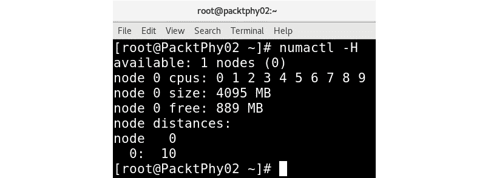

图 15.16 - numactl -H 输出

前面的`numactl`输出表明系统中有 10 个 CPU，它们属于单个 NUMA 节点。它还列出了与每个 NUMA 节点关联的内存和节点距离。当我们讨论 CPU 固定时，我们使用`virsh`功能显示了系统的拓扑结构。要获得 NUMA 拓扑的图形视图，可以使用一个名为`lstopo`的命令，该命令在基于 CentOS-/Red Hat 的系统中与`hwloc`软件包一起提供：

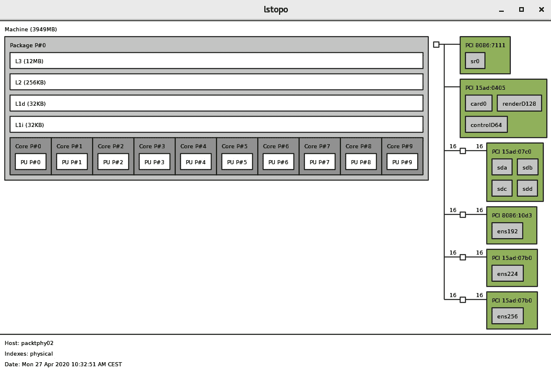

图 15.17 - 使用 lstopo 命令可视化 NUMA 拓扑

此截图还显示了与 NUMA 节点关联的 PCI 设备。例如，`ens*`（网络接口）设备连接到 NUMA 节点 0。一旦我们了解了系统的 NUMA 拓扑，就可以开始调整它，特别是针对 KVM 虚拟化设置。

## NUMA 内存分配策略

通过修改 VM XML 配置文件，我们可以进行 NUMA 调优。调优 NUMA 引入了一个名为`numatune`的新元素标签：

```
<domain>   ...
    <numatune>
      <memory mode="strict" nodeset="1-4,³"/>
    </numatune>   ...
</domain>
```

这也可以通过`virsh`命令进行配置，如下所示：

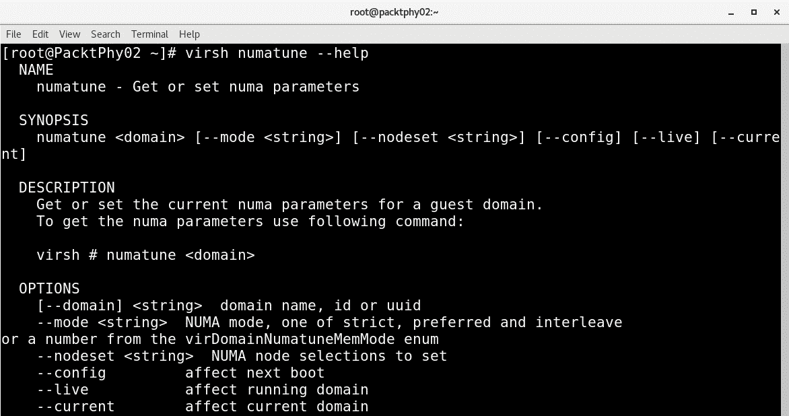

图 15.18 - 使用 virsh numatune 配置 NUMA 设置

此标签的 XML 表示如下：

```
<domain>
 …
  <numatune>
    <memory mode="strict" nodeset="1-4,³"/>
    <memnode cellid="0" mode="strict" nodeset="1"/>
    <memnode cellid="2" mode="preferred" nodeset="2"/>
  </numatune>   ...
</domain>
```

尽管名为`numatune`的元素是可选的，但它是用来通过控制域进程的 NUMA 策略来调整 NUMA 主机性能的。此可选元素的主要子标签是`memory`和`nodeset`。有关这些子标签的一些说明如下：

+   `memory`：此元素描述了 NUMA 节点上的内存分配过程。有三种策略来管理 NUMA 节点的内存分配：

a) `Strict`：当虚拟机尝试分配内存并且内存不可用时，分配将失败。

b) `Interleave`：在 NUMA 节点之间进行循环分配。

c) `Preferred`：虚拟机尝试从首选节点分配内存。如果该节点没有足够的内存，它可以从剩余的 NUMA 节点分配内存。

+   `nodeset`：指定服务器上可用的 NUMA 节点列表。

这里的一个重要属性是*placement*，在以下 URL 中有解释 - [`libvirt.org/formatdomain.html`](https://libvirt.org/formatdomain.html)：

"属性放置可用于指示域进程的内存放置模式，其值可以是"static"或"auto"，默认为 vCPU 的放置，或者如果指定了 nodeset，则为"static"。"auto"表示域进程将仅从查询 numad 返回的建议 nodeset 分配内存，如果指定了属性 nodeset 的值将被忽略。如果 vCPU 的放置是'auto'，并且未指定 numatune，则将隐式添加一个默认的 numatune，其放置为'auto'，模式为'strict'。"

我们需要小心这些声明，因为有适用的继承规则。例如，如果我们指定了`<nodeset>`元素，`<numatune>`和`<vcpu>`元素默认为相同的值。因此，我们绝对可以配置不同的 CPU 和内存调优选项，但也要意识到这些选项可以被继承。

在考虑 NUMA 上下文中的 CPU 固定时，还有一些要考虑的事情。我们在本章的早些时候讨论了 CPU 固定的基础，因为它可以为我们的虚拟机提供更好、更可预测的性能，并且可以提高缓存效率。举个例子，假设我们想尽可能快地运行一个虚拟机。明智的做法是在固定 CPU 核心的 CPU 插槽上运行它，这样可以在最快的存储上运行，这将在 PCI Express 总线上。如果我们没有使用 NVMe SSD 本地运行虚拟机，我们可以使用存储控制器来实现相同的效果。但是，如果我们用来访问虚拟机存储的存储控制器物理连接到另一个 CPU 插槽，那将导致延迟。对于延迟敏感的应用程序，这将意味着性能大幅下降。

然而，我们也需要意识到另一个极端——如果我们进行过多的固定，将来可能会产生其他问题。例如，如果我们的服务器在架构上不同（具有相同数量的核心和内存），迁移虚拟机可能会变得棘手。我们可能会出现这样的情况，即迁移过程中将 CPU 核心固定到目标服务器上不存在的核心。因此，我们在配置环境时总是需要小心，以免走得太远。

我们列表上的下一个主题是`emulatorpin`，它可以用来将我们的`qemu-kvm`模拟器固定到特定的 CPU 核心，以便它不影响我们虚拟机核心的性能。让我们学习如何配置它。

## 理解 emulatorpin

`emulatorpin`选项也属于 CPU 调优类别。其 XML 表示如下：

```
<domain>   ...
    <cputune>     …..       <emulatorpin cpuset="1-3"/>      …..
    </cputune>   ...
</domain>
```

`emulatorpin`元素是可选的，用于将模拟器（`qemu-kvm`）固定到主机物理 CPU。这不包括来自 VM 的 vCPU 或 IO 线程。如果省略此项，模拟器将默认固定到主机系统的所有物理 CPU。

重要提示：

请注意，当您调整支持 NUMA 的系统时，应该一起配置`<vcpupin>`、`<numatune>`和`<emulatorpin>`，以实现最佳的确定性性能。

在我们离开这一部分之前，还有一些事情需要涵盖：客户端系统 NUMA 拓扑和 NUMA 的大页内存支持。

可以使用`<numa>`元素在客户端 XML 配置中指定客户端 NUMA 拓扑结构；有些人称之为虚拟 NUMA：

```
  <cpu>      ...
    <numa>
      <cell id='0' cpus='0-3' memory='512000' unit='KiB'/>
      <cell id='1' cpus='4-7' memory='512000' unit='KiB' />     </numa>         ...
</cpu>
```

`cell id`元素告诉虚拟机使用哪个 NUMA 节点，而`cpus`元素配置特定的核心（或核心）。`memory`元素为每个节点分配内存量。每个 NUMA 节点都以数字索引，从`0`开始。

之前，我们讨论了`memorybacking`元素，可以在客户端配置中指定使用大页。当 NUMA 存在于设置中时，`nodeset`属性可用于配置每个 NUMA 节点的特定大页大小，这可能会很有用，因为它将给定客户端的 NUMA 节点与某些大页大小联系起来：

```
<memoryBacking>
    <hugepages>
      <page size="1" unit="G" nodeset="0-2,4"/>
      <page size="4" unit="M" nodeset="3"/>
    </hugepages>
</memoryBacking>
```

这种配置可以优化内存性能，因为客户端 NUMA 节点可以根据需要移动到主机 NUMA 节点，同时客户端可以继续使用主机分配的大页。

NUMA 调整还必须考虑 PCI 设备的 NUMA 节点局部性，特别是当从主机向客户端传递 PCI 设备时。如果相关的 PCI 设备隶属于远程 NUMA 节点，这可能会影响数据传输，从而影响性能。

显示 NUMA 拓扑和 PCI 设备关联的最简单方法是使用我们之前讨论过的`lstopo`命令。同样命令的非图形形式也可以用来发现这个配置。请参考前面的章节。

## KSM 和 NUMA

我们在前面的章节中详细讨论了 KSM。KSM 是 NUMA 感知的，它可以管理发生在多个 NUMA 节点上的 KSM 进程。如果你还记得，当我们从 sysfs 获取 KSM 条目时，遇到了一个名为`merge_across_node`的`sysfs`条目。这是我们可以用来管理这个进程的参数：

```
#  cat /sys/kernel/mm/ksm/merge_across_nodes
1
```

如果这个参数设置为`0`，KSM 只会合并来自同一 NUMA 节点的内存页面。如果设置为`1`（就像这里的情况一样），它将跨越 NUMA 节点进行合并。这意味着运行在远程 NUMA 节点上的 VM CPU 在访问合并的 KSM 页面时会遇到延迟。

显然，你知道客户端 XML 条目（`memorybacking`元素）用于要求虚拟机监视程序为客户端禁用共享页面。如果你不记得了，请参考内存调整部分，了解这个元素的详细信息。尽管我们可以手动配置 NUMA，但还有一种叫做自动 NUMA 平衡的东西。我们之前提到过它，但让我们看看这个概念涉及了什么。

## 自动 NUMA 平衡

自动 NUMA 平衡的主要目的是提高在 NUMA 感知系统中运行的不同应用程序的性能。其设计背后的策略很简单：如果一个应用程序使用本地内存到 vCPU 所在的 NUMA 节点，它将具有更好的性能。通过使用自动 NUMA 平衡，KVM 尝试将 vCPU 移动到本地（尽可能多）的内存地址，以便 vCPU 使用。这一切都是在自动 NUMA 平衡激活时由内核自动完成的。当在具有 NUMA 属性的硬件上引导时，将启用自动 NUMA 平衡。主要条件或标准如下：

+   `numactl --hardware`：显示多个节点

+   `cat /sys/kernel/debug/sched_features`：在标志中显示 NUMA

为了说明第二点，看下面的代码块：

```
#  cat /sys/kernel/debug/sched_features
GENTLE_FAIR_SLEEPERS START_DEBIT NO_NEXT_BUDDY LAST_BUDDY CACHE_HOT_BUDDY 
WAKEUP_PREEMPTION ARCH_POWER NO_HRTICK NO_DOUBLE_TICK LB_BIAS NONTASK_
POWER TTWU_QUEUE NO_FORCE_SD_OVERLAP RT_RUNTIME_SHARE NO_LB_MIN NUMA 
NUMA_FAVOUR_HIGHER NO_NUMA_RESIST_LOWER
```

我们可以通过以下方法检查系统中是否启用了这个功能：

```
#  cat /proc/sys/kernel/numa_balancing
1
```

显然，我们可以通过以下方式禁用自动 NUMA 平衡：

```
# echo 0 > /proc/sys/kernel/numa_balancing
```

自动 NUMA 平衡机制基于多种算法和数据结构。这种方法的内部基于以下内容：

+   NUMA 提示页面错误

+   NUMA 页面迁移

+   伪交错

+   故障统计

+   任务放置

+   任务分组

KVM 客户端的最佳实践或建议之一是将其资源限制在单个 NUMA 节点上的资源量。简而言之，这可以避免将 VMs 不必要地分割到 NUMA 节点上，从而降低性能。让我们从检查当前的 NUMA 配置开始。有多种可用的选项来执行此操作。让我们从`numactl`命令、NUMA 守护程序和`numastat`开始，然后再回到使用一个众所周知的命令`virsh`。

## numactl 命令

确认 NUMA 可用性的第一个选项使用`numactl`命令，如下所示：

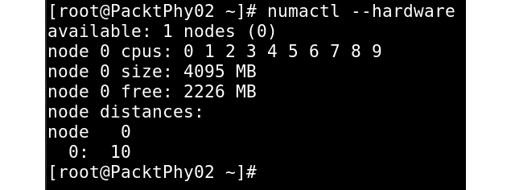

图 15.19 - numactl 硬件输出

这只列出一个节点。即使这表明了 NUMA 的不可用性，也可以通过运行以下命令进行进一步澄清：

```
# cat /sys/kernel/debug/sched_features
```

如果系统不支持 NUMA，这将*不*列出 NUMA 标志。

通常，不要使虚拟机*宽*于单个 NUMA 节点所能提供的范围。即使 NUMA 可用，vCPU 也绑定到 NUMA 节点，而不是特定的物理 CPU。

## 了解 numad 和 numastat

`numad`手册页中指出：

numad 是一个守护程序，用于控制具有 NUMA 拓扑的系统上 CPU 和内存的有效使用。

`numad`也被称为自动`numad`手册页中指出：

"numad 是一个用户级守护程序，为具有 NUMA 拓扑的系统上的 CPU 和内存的有效使用提供放置建议和进程管理。"

`numad`是一个系统守护程序，用于监视 NUMA 拓扑和资源使用情况。它将尝试定位进程以实现有效的 NUMA 局部性和亲和性，并根据系统条件的变化进行动态调整。`numad`还提供指导，以帮助管理应用程序为其进程的 CPU 和内存资源进行初始手动绑定。请注意，`numad`主要用于服务器整合环境，可能在同一服务器系统上运行多个应用程序或多个虚拟客户机。当进程可以在系统的 NUMA 节点子集中定位时，`numad`可能会产生积极的影响。例如，如果整个系统专用于大型内存数据库应用程序，特别是如果内存访问可能保持不可预测，`numad`可能不会提高性能。

为了根据 NUMA 拓扑自动调整和对齐 CPU 和内存资源，我们需要运行`numad`。要将`numad`用作可执行文件，只需运行以下命令：

```
# numad
```

您可以检查是否已启动如下所示：

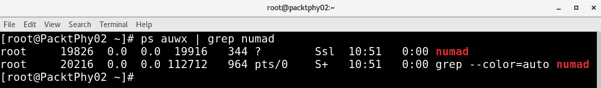

图 15.20 - 检查 numad 是否处于活动状态

一旦执行`numad`二进制文件，它将开始对齐，如下截图所示。在我们的系统中，我们有以下正在运行的虚拟机：

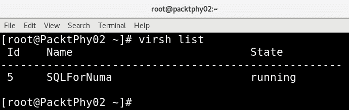

图 15.21 - 列出正在运行的虚拟机

您可以使用`numastat`命令来监视运行`numad`服务之前和之后的差异，该命令将通过以下命令持续运行：

```
# numad -i 0
```

我们可以随时停止它，但这不会改变`numad`配置的 NUMA 亲和状态。现在让我们转到`numastat`。

`numactl`软件包提供`numactl`二进制/命令，`numad`软件包提供`numad`二进制/命令：

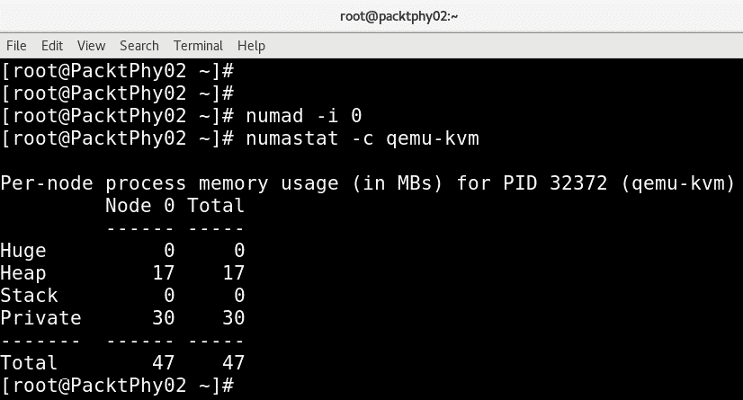

图 15.22 - qemu-kvm 进程的 numastat 命令输出

重要提示：

在将虚拟机移至生产环境之前，必须对我们使用的众多内存调整选项进行全面测试。

在我们转到下一个主题之前，我们想提醒您本章前面提到的一个观点。迁移具有固定资源的虚拟机可能会很复杂，因为您必须在目标主机上拥有某种兼容资源（及其数量）。例如，目标主机的 NUMA 拓扑结构不必与源主机的 NUMA 拓扑结构对齐。在调整 KVM 环境时，您应考虑这一事实。自动 NUMA 平衡可能在一定程度上有所帮助，减少手动固定客户资源的需求。

# Virtio 设备调整

在虚拟化世界中，总是将其与裸机系统进行比较。半虚拟化驱动程序增强了客户机的性能，并尝试保持接近裸机的性能。建议为完全虚拟化的客户机使用半虚拟化驱动程序，特别是当客户机运行 I/O 密集型任务和应用程序时。`lguest`。Virtio 被引入以实现 IO 虚拟化的一种通用框架。

简而言之，当我们使用半虚拟化驱动程序时，VM 操作系统知道其下面有一个 hypervisor，因此使用前端驱动程序来访问它。前端驱动程序是客户系统的一部分。当存在模拟设备并且有人想要为这些设备实现后端驱动程序时，hypervisor 会执行此工作。前端和后端驱动程序通过基于 virtio 的路径进行通信。 Virtio 驱动程序是 KVM 用作半虚拟化设备驱动程序的。基本架构如下：

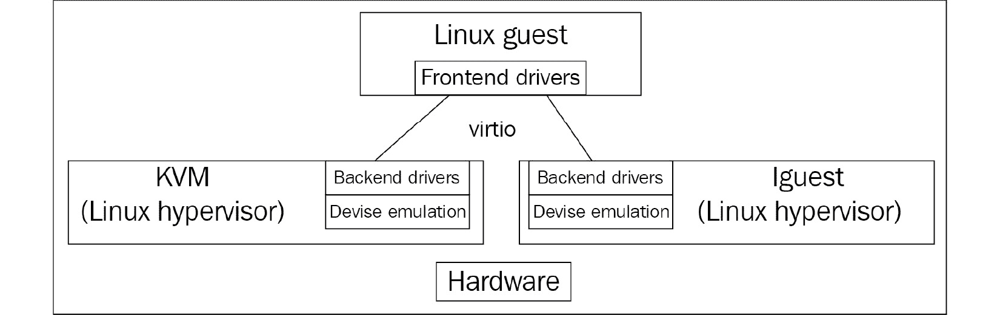

图 15.23 – Virtio 架构

主要有两层（virt 队列和虚拟环）来支持客户和 hypervisor 之间的通信。

**Virt 队列**和**虚拟环**（**vring**）是 virtio 中的传输机制实现。 Virt 队列（virtio）是连接前端和后端驱动程序的队列接口。每个 virtio 设备都有自己的 virt 队列，并且来自客户系统的请求被放入这些 virt 队列中。每个 virt 队列都有自己的环，称为 vring，这是 QEMU 和客户之间映射内存的地方。在 KVM 客户中有不同的 virtio 驱动程序可供使用。

这些设备在 QEMU 中是模拟的，驱动程序是 Linux 内核的一部分，或者是 Windows 客户的额外软件包。以下是一些设备/驱动程序对的示例：

+   `virtio-net`：virtio 网络设备是一个虚拟以太网卡。`virtio-net`为此提供驱动程序。

+   `virtio-blk`：virtio 块设备是一个简单的虚拟块设备（即磁盘）。`virtio-blk`为虚拟块设备提供块设备驱动程序。

+   `virtio-balloon`：virtio 内存气球设备是用于管理客户内存的设备。

+   `virtio-scsi`：virtio SCSI 主机设备将一个或多个磁盘组合在一起，并允许使用 SCSI 协议与它们通信。

+   `virtio-console`：virtio 控制台设备是用于客户和主机用户空间之间的数据输入和输出的简单设备。

+   `virtio-rng`：virtio 熵设备为客户提供高质量的随机性，并供客户使用等等。

一般来说，您应该在 KVM 设置中使用这些 virtio 设备以获得更好的性能。

# 块 I/O 调整

回到基础知识-VM 的虚拟磁盘可以是块设备，也可以是镜像文件。为了获得更好的 VM 性能，首选基于块设备的虚拟磁盘，而不是位于远程文件系统（如 NFS、GlusterFS 等）上的镜像文件。但是，我们不能忽视文件后端有助于 virt 管理员更好地管理客户磁盘，并且在某些情况下非常有帮助。根据我们的经验，我们注意到大多数用户在性能不是太大问题时使用磁盘镜像文件。请记住，可以附加到 VM 的虚拟磁盘的总数有限。同时，可以混合和使用块设备和文件，并将它们用作同一客户的存储磁盘，没有限制。

客户将虚拟磁盘视为其存储。当客户操作系统内的应用程序将数据写入客户系统的本地存储时，它必须通过几个层。也就是说，这个 I/O 请求必须通过存储上的文件系统和客户操作系统的 I/O 子系统。之后，`qemu-kvm`进程将其从客户操作系统传递给 hypervisor。一旦 I/O 在 hypervisor 的范围内，它就开始像主机操作系统中运行的任何其他应用程序一样处理 I/O。在这里，您可以看到 I/O 必须通过的层数，以完成 I/O 操作。因此，块设备后端的性能优于镜像文件后端。

以下是我们对磁盘后端和基于文件或镜像的虚拟磁盘的观察：

+   文件镜像是主机文件系统的一部分，并且与块设备后端相比，它对 I/O 操作创建了额外的资源需求。

+   使用稀疏镜像文件有助于超额分配主机存储，但使用它会降低虚拟磁盘的性能。

+   在使用磁盘镜像文件时，不正确的分区可能会导致不必要的 I/O 操作。在这里，我们提到了标准分区单元的对齐。

在本章的开头，我们讨论了 virtio 驱动程序，它可以提供更好的性能。因此，建议在配置磁盘时使用 virtio 磁盘总线，而不是 IDE 总线。`virtio_blk`驱动程序使用 virtio API 为存储 I/O 设备提供高性能，从而提高存储性能，特别是在大型企业存储系统中。我们在*第五章*中讨论了可用的不同存储格式；然而，主要的是`raw`和`qcow`格式。当使用`raw`格式时将获得最佳性能。当使用`qcow`时，格式层会带来一些性能开销。因为格式层有时必须执行一些操作，例如，如果要扩展`qcow`镜像，它必须分配新的簇等。但是，如果要使用快照等功能，`qcow`将是一个选择。这些额外的功能是由镜像格式`qcow`提供的。一些性能比较可以在[`www.Linux-kvm.org/page/Qcow2`](http://www.Linux-kvm.org/page/Qcow2)找到。

有三种可以考虑的 I/O 调优选项，我们在*第七章*中讨论过，*虚拟机-安装、配置和生命周期管理*：

+   缓存模式

+   I/O 模式

+   I/O 调优

让我们简要地浏览一些 XML 设置，以便我们可以在我们的虚拟机上实施它们。

缓存选项设置可以在虚拟机 XML 中反映如下：

```
<disk type='file' device='disk'>
<driver name='qemu' type='raw' cache='writeback'/> 
```

I/O 模式配置的 XML 表示类似于以下内容：

```
<disk type='file' device='disk'>
<driver name='qemu' type='raw' io='threads'/> 
```

在 I/O 调优方面，还有一些额外的说明：

+   可能需要限制每个虚拟机的磁盘 I/O，特别是在我们的设置中存在多个虚拟机时。

+   如果一个虚拟机通过生成的磁盘 I/O 数量使主机系统繁忙（嘈杂的邻居问题），这对其他虚拟机是不公平的。

一般来说，系统/虚拟管理员有责任确保所有正在运行的虚拟机获得足够的资源来工作，换句话说，这就是**服务质量**（**QOS**）。

虽然磁盘 I/O 并不是唯一需要考虑以保证 QoS 的资源，但它也很重要。调整 I/O 可以防止虚拟机系统垄断共享资源并降低在同一主机上运行的其他虚拟机的性能。这确实是一个要求，特别是当主机系统正在执行`virsh blkdeviotune`命令时。可以使用该命令设置的不同选项如下所示：

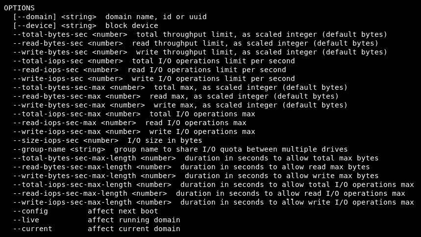

图 15.24-摘自 virsh blkdeviotune –help 命令

关于参数的详细信息，如`total-bytes-sec`、`read-bytes-sec`、`writebytes-sec`、`total-iops-sec`等，可以从前面的命令输出中很容易理解。它们也在`virsh`命令手册页中有记录。

例如，要限制名为`SQLForNuma`的 VM 上的`vdb`磁盘的 I/O 操作为每秒 200 次，吞吐量为每秒 50MB，运行以下命令：

```
# virsh blkdeviotune SQLForNuma vdb --total-iops-sec 200 --total-bytes-sec 52428800
```

接下来，我们将看一下网络 I/O 调优。

# 网络 I/O 调优

在大多数 KVM 环境中，我们看到的是来自客户机的所有网络流量都会经过单一的网络路径。不会有任何流量隔离，这会导致大多数 KVM 设置中的拥塞。作为网络调优的第一步，我们建议尝试不同的网络或专用网络用于管理、备份或实时迁移。但是，当您有多个网络接口用于流量时，请尽量避免多个网络接口用于相同的网络或段。如果这种情况确实存在，请应用一些常见的网络调优设置；例如，使用`arp_filter`来控制 ARP Flux。当虚拟机具有多个网络接口并且正在使用它们积极地回复 ARP 请求时，就会发生 ARP Flux，因此我们应该执行以下操作：

```
echo 1 > /proc/sys/net/ipv4/conf/all/arp_filter 
```

然后，您需要编辑`/etc/sysctl.conf`以使此设置持久化。

有关 ARP Flux 的更多信息，请参阅[`linux-ip.net/html/ether-arp.html#ether-arp-flux`](http://linux-ip.net/html/ether-arp.html#ether-arp-flux)。

在驱动程序级别可以进行额外的调优；也就是说，现在我们知道 virtio 驱动程序与模拟设备 API 相比提供了更好的性能。因此，显然，应考虑在客户系统中使用`virtio_net`驱动程序。当我们使用`virtio_net`驱动程序时，它在`qemu`中有一个后端驱动程序来处理来自客户网络的通信。即使这样性能更好，该领域的一些增强引入了一个称为`vhost_net`的新驱动程序，为 KVM 提供了内核中的 virtio 设备。尽管 vhost 是一个可以被不同驱动程序使用的常见框架，但网络驱动程序`vhost_net`是最早的驱动程序之一。以下图表将使这一点更清晰：

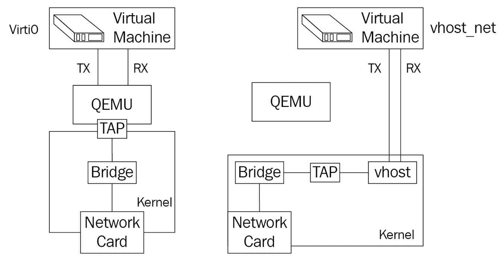

图 15.25 – vhost_net 架构

正如您可能已经注意到的那样，通过新的通信路径，上下文切换的数量确实减少了。好消息是，支持 vhost 不需要在客户系统中进行额外的配置，因为前端驱动程序没有变化。

`vhost_net`减少了复制操作，降低了延迟和 CPU 使用率，从而提高了性能。首先，系统中必须加载名为`vhost_net`的内核模块（请参阅下一节中的屏幕截图）。由于这是主机系统中的字符设备，它在主机上创建了一个名为`/dev/vhost-net`的设备文件。

## 如何打开它

当使用`-netdev tap,vhost=on`启动 QEMU 时，它将通过使用`ioctl()`调用来实例化`vhost-net`接口。此初始化过程将`qemu`与`vhost-net`实例绑定在一起，以及其他操作，如特性协商等等：

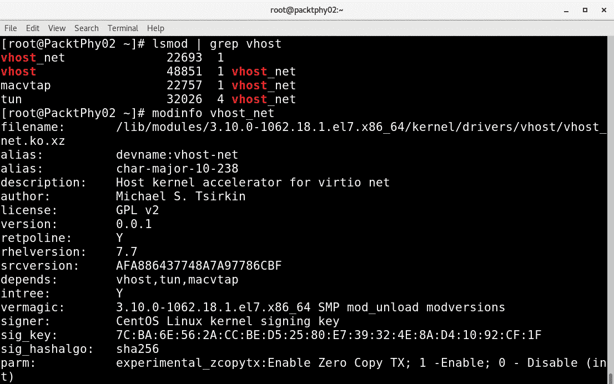

图 15.26 – 检查 vhost 内核模块

`vhost_net`模块可用的参数之一是`experimental_ zcopytx`。它是做什么的？此参数控制称为桥接零拷贝传输的内容。让我们看看这意味着什么（如[`www.google.com/patents/US20110126195`](http://www.google.com/patents/US20110126195)所述）：

“用于在虚拟化环境中提供零拷贝传输的系统包括一个接收与客户应用程序相关的数据包的客户操作系统（OS）请求的超级监视程序，其中数据包位于客户 OS 的缓冲区或客户应用程序的缓冲区中，并且在网络堆栈处理期间创建了至少部分标头。超级监视程序进一步向网络设备驱动程序发送请求，以通过网络设备将数据包传输到网络上，其中请求标识了位于客户 OS 的缓冲区或客户应用程序的缓冲区中的数据包，并且超级监视程序避免将数据包复制到超级监视程序缓冲区。”

如果您的环境使用大数据包大小，则配置此参数可能会产生显着影响。当客户端与外部网络通信时，通过配置此参数可以减少主机 CPU 开销。这不会影响以下情况的性能：

+   客户端到客户端的通信

+   客户端到主机的通信

+   小数据包工作负载

此外，通过启用多队列`virtio-net`也可以获得性能改进。有关更多信息，请访问[`fedoraproject.org/wiki/Features/MQ_virtio_net`](https://fedoraproject.org/wiki/Features/MQ_virtio_net)。

使用`virtio-net`时的一个瓶颈是其单个 RX 和 TX 队列。即使有更多的 vCPUs，网络吞吐量也受到此限制的影响。`virtio-net`是一种单队列类型的队列，因此开发了多队列`virtio-net`。在引入此选项之前，虚拟网卡无法利用 Linux 内核中可用的多队列支持。

通过在前端和后端驱动程序中引入多队列支持来解决这个瓶颈。这也有助于客户端使用更多 vCPUs 进行扩展。要启动具有两个队列的客户端，可以将`queues`参数指定为`tap`和`virtio-net`，如下所示：

```
# qemu-kvm -netdev tap,queues=2,... -device virtio-net-pci,queues=2,...
```

等效的客户端 XML 如下：

```
<interface type='network'>
    <source network='default'/>
    <model type='virtio'/>
    <driver name='vhost' queues='M'/>
</interface>
```

在这里，`M`可以是`1`到`8`，因为内核支持多达八个队列的多队列 tap 设备。一旦为`qemu`配置了这个参数，在客户端内部，我们需要使用`ethtool`命令启用多队列支持。通过`ethtool`启用多队列（其中`K`的值从`1`到`M`），如下所示：

```
# ethtool -L eth0 combined 'K'
```

您可以查看以下链接，了解多队列`virtio-net`何时提供最大的性能优势：[`access.redhat.com/documentation/en-us/red_hat_enterprise_linux/7/html/virtualization_tuning_and_optimization_guide/sect-virtualization_tuning_optimization_guide-networking-techniques`](https://access.redhat.com/documentation/en-us/red_hat_enterprise_linux/7/html/virtualization_tuning_and_optimization_guide/sect-virtualization_tuning_optimization_guide-networking-techniques)。

不要盲目使用上述 URL 中提到的选项-请测试对您的设置的影响，因为在这种情况下，即使网络吞吐量令人印象深刻，CPU 消耗也会更大。

## KVM 客户端时间保持最佳实践

有不同的时间保持机制。其中最著名的技术之一是**网络时间协议**（**NTP**）。通过使用 NTP，我们可以使时钟同步到很高的精度，即使在具有抖动（可变延迟）的网络上也可以。在虚拟化环境中需要考虑的一件事是，客户端时间应与 hypervisor/host 同步，因为它会影响很多客户端操作，如果它们不同步可能会导致不可预测的结果。

有不同的方法可以实现时间同步，但这取决于您的设置。我们已经看到人们使用 NTP，使用`hwclock –s`从硬件时钟设置系统时钟等。这里需要考虑的第一件事是尝试使 KVM 主机时间同步和稳定。您可以使用类似 NTP 的协议来实现这一点。一旦设置好，客户端时间必须保持同步。尽管有不同的机制可以做到这一点，但最好的选择是使用`kvm-clock`。

### kvm-clock

`kvm-clock`也被称为虚拟化感知（半虚拟化）时钟设备。当使用`kvm-clock`时，客户端询问宿主机当前时间，保证了稳定和准确的时间记录。这一功能是通过客户端注册一个页面并与宿主机共享地址来实现的。这是客户端和宿主机之间的共享页面。宿主机不断更新此页面，除非被要求停止。客户端可以在需要时间信息时简单地读取此页面。但请注意，宿主机应支持`kvm-clock`供客户端使用。有关更多详细信息，您可以查看[`lkml.org/lkml/2010/4/15/355`](https://lkml.org/lkml/2010/4/15/355)。

默认情况下，大多数较新的 Linux 发行版都使用`kvm_clock`通过以下方法在客户端进行配置：

```
[root@kvmguest ]$  cat /sys/devices/system/clocksource/clocksource0/current_clocksource
tsc
```

您还可以在 Linux 上使用`ntpd`或`chrony`作为时钟源，这需要最少的配置。在您的 Linux 虚拟机中，编辑`/etc/ntpd.conf`或`/etc/chronyd.conf`，并修改*server*配置行，将其指向 NTP 服务器的 IP 地址。然后，只需启用并启动您正在使用的服务（这里我们使用`chrony`作为示例）：

```
systemctl enable chronyd
systemctl start chronyd
```

还有另一种比较新的协议被大力推广用于时间同步，称为`ntpd`或`chronyd`。它使用网络接口上的时间戳和外部来源以及计算机的系统时钟进行同步。

安装所有必要的先决条件只需要一个`yum`命令来启用和启动服务：

```
yum -y install linuxptp
systemctl enable ptp4l
systemctl start ptp4l
```

默认情况下，`ptp4l`服务将使用`/etc/sysconfig/ptp4l`配置文件，通常绑定到第一个网络接口。如果您想使用其他网络接口，最简单的方法就是编辑配置文件，更改接口名称，然后通过`systemctl`重新启动服务。

现在，从 VM 的角度来看，我们可以通过进行一些配置来帮助它们进行时间同步。我们可以将`ptp_kvm`模块添加到全局 KVM 主机配置中，这将使我们的 PTP 作为服务可用于`chronyd`作为时钟源。这样，我们就不必进行大量额外的配置。因此，只需将`ptp_kvm`作为字符串添加到默认的 KVM 配置中，如下所示：

```
echo ptp_kvm > /etc/modules-load.d/kvm-chrony.conf
modprobe ptp_kvm
```

通过这样做，将在`/dev`目录中创建一个`ptp`设备，然后我们可以将其用作`chrony`的时间源。将以下行添加到`/etc/chrony.conf`并重新启动`chronyd`：

```
refclock PHC /dev/ptp0 poll 3 dpoll -2 offset 0
systemctl restart chronyd
```

通过使用 API 调用，所有 Linux 虚拟机都能从运行它们的物理主机获取时间。

现在，我们已经涵盖了大量关于 VM 配置选项的性能调整和优化，现在是时候最终摆脱所有这些微小的步骤，关注更大的画面。到目前为止，我们所涵盖的所有 VM 设计（与 CPU、内存、NUMA、virtio、块、网络和时间配置相关）只有在我们使用它时才重要。回到我们最初的场景——一个 SQL VM——让我们看看我们将如何根据我们将在其上运行的软件来正确配置我们的 VM。

## 基于软件的设计

还记得我们最初的场景吗，涉及一个应该是 Microsoft SQL Server 集群中的节点的基于 Windows Server 2019 的 VM 吗？我们在调整方面涵盖了很多设置，但还有更多要做——要做的事情更多。我们需要问一些问题。我们越早问这些问题越好，因为它们将对我们的设计产生关键影响。

我们可能会问的一些问题如下：

+   对不起，亲爱的客户，当您说*集群*时，您具体指的是什么，因为有不同的 SQL Server 集群方法学？

+   您有哪些 SQL 许可证，或者您打算购买哪些？

+   您需要主动-主动、主动-被动、备份解决方案还是其他什么？

+   这是一个单站点还是多站点集群？

+   您确切需要哪些 SQL 功能？

+   你有哪些许可证，你愿意为它们花多少钱？

+   你的应用程序是否能够与 SQL 集群一起工作（例如，在多站点场景中）？

+   你有什么样的存储系统？

+   你的存储系统可以提供多少 IOPS？

+   你的存储的延迟如何？

+   你有不同层次的存储子系统吗？

+   这些层次的服务水平在 IOPS 和延迟方面是多少？

+   如果你有多个存储层，我们是否可以根据最佳实践创建 SQL VMs，例如将数据文件和日志文件放在单独的虚拟磁盘上？

+   你有足够的磁盘容量来满足你的需求吗？

这些只是许可、集群和存储相关的问题，它们不会消失。我们需要毫不犹豫地提出这些问题，并在部署之前得到真实的答案。我们刚刚提到了 14 个问题，但实际上还有更多。

此外，我们需要考虑 VM 设计的其他方面。询问一些问题是明智的，比如：

+   你可以为 SQL VM 提供多少内存？

+   你有哪些服务器，它们使用哪些处理器，每个插槽有多少内存？

+   你是否正在使用任何最新一代技术，比如持久内存？

+   你有关于你正在为这个 SQL 基础架构设计的规模和/或查询量的任何信息吗？

+   在这个项目中，金钱是一个重要的决定因素吗（因为它将影响许多设计决策，因为 SQL 是按核心许可的）？还有标准与企业定价的问题。

这一系列问题实际上指向了 VM 设计中非常重要的一部分，与内存、内存位置、CPU 和内存之间的关系以及数据库设计中最基本的问题之一——延迟有关。其中很大一部分与正确的 VM 存储设计有关——正确的存储控制器、存储系统、缓存设置等，以及 VM 计算设计——这一切都与 NUMA 有关。我们在本章中解释了所有这些设置。因此，为了正确配置我们的 SQL VM，这里是我们应该遵循的高级步骤清单：

+   配置具有正确 NUMA 设置和本地内存的 VM。出于许可原因，从四个 vCPU 开始，然后找出是否需要更多（例如，如果你的 VM 变得受限于 CPU，你将从性能图表和基于 SQL 的性能监控工具中看到）。

+   如果你想保留 CPU 容量，利用 CPU 固定，以便物理服务器 CPU 上的特定 CPU 核心始终用于 SQL VM，而且只用于它。将其他 VM 隔离到*剩余*核心。

+   为 SQL VM 保留内存，以防止交换，因为只有使用真正的 RAM 内存才能保证性能平稳，不受到嘈杂的邻居的影响。

+   如有必要，为每个 VM 配置 KSM，并避免在 SQL VM 上使用它，因为它可能引入延迟。在设计阶段，确保购买尽可能多的 RAM 内存，以免内存成为问题，因为如果服务器没有足够的内存，这将是一个非常昂贵的性能问题。绝对不要过度分配内存。

+   配置具有多个虚拟硬盘的 VM，并将这些硬盘放在可以提供所需服务水平的存储中，包括延迟、开销和缓存。记住，操作系统磁盘不一定需要写缓存，但数据库和日志磁盘将受益于它。

+   使用主机到存储设备的单独物理连接，并调整存储以尽可能提高性能。不要过度订阅——无论是在链路级别（太多 VM 通过相同的基础设施连接到*相同*的存储设备）还是数据存储级别（不要将一个数据存储放在一个存储设备上并将所有 VM 存储在其中，因为这会对性能产生负面影响——隔离工作负载，通过多个链接创建多个目标，并使用掩码和分区）。

+   配置多路径、负载平衡和故障转移-以获得尽可能多的存储性能，同时也具有冗余性。

+   安装正确的 virtio 驱动程序，如有必要使用 vhost 驱动程序或 SR-IOV，并尽量减少每个级别的开销。

+   调整 VM 客户操作系统-关闭不必要的服务，将电源配置文件切换到“高性能”（大多数 Microsoft 操作系统出于某种原因将电源配置文件设置为“平衡”模式）。调整 BIOS 设置并检查固件和操作系统更新-从上到下的所有内容。做笔记，测量，进行基准测试，并在更新和更改配置时使用以前的基准测试作为基线，以便了解自己的方向。

+   在使用 iSCSI 时，配置巨帧，因为在大多数情况下，这将对存储性能产生积极影响，并确保您查看存储设备供应商的文档以了解相关的最佳实践。

本章的要点是-不要仅仅因为客户要求安装应用程序而盲目安装。这将在以后困扰你，并且解决任何问题和投诉将会更加困难。花时间并且做对。通过阅读文档来为整个过程做好准备，因为文档是广泛可用的。

# 总结

在本章中，我们深入探讨了 KVM 性能调优和优化的领域。我们讨论了许多不同的技术，从简单的 CPU 固定到更复杂的 NUMA 和适当的 NUMA 配置。不要被吓到，因为学习设计是一个过程，正确设计是一门可以通过学习和经验不断改进的技艺。想想这样的事情-当建筑师设计世界上最高的摩天大楼时，他们是否每次建造新的最高建筑物时都将目标进一步推进？

在下一章-本书的最后一章中-我们将讨论如何排除环境中的故障。这至少部分与本章相关，因为我们将排除一些与性能相关的问题。在切换到故障排除章节之前，多次阅读本章对您的整体学习过程将非常有益。

# 问题

1.  什么是 CPU 固定？

1.  KSM 是做什么的？

1.  我们如何增强块设备的性能？

1.  我们如何调整网络设备的性能？

1.  我们如何在虚拟化环境中同步时钟？

1.  我们如何配置 NUMA？

1.  我们如何配置 NUMA 和 KSM 一起工作？

# 进一步阅读

有关更多信息，请参考以下链接：

+   RedHat Enterprise Linux 7-在 RHEL 物理机上安装、配置和管理 VM：[`access.redhat.com/documentation/en-us/red_hat_enterprise_linux/7/html/virtualization_deployment_and_administration_guide/index`](https://access.redhat.com/documentation/en-us/red_hat_enterprise_linux/7/html/virtualization_deployment_and_administration_guide/index)

+   vCPU 固定：[`libvirt.org/formatdomain.html#elementsCPUTuning`](http://libvirt.org/formatdomain.html#elementsCPUTuning)

+   KSM 内核文档：[`www.kernel.org/doc/Documentation/vm/ksm.txt`](https://www.kernel.org/doc/Documentation/vm/ksm.txt)

+   放置：[`libvirt.org/formatdomain.html#elementsNUMATuning`](http://libvirt.org/formatdomain.html#elementsNUMATuning)

+   自动 NUMA 平衡：[`www.redhat.com/files/summit/2014/summit2014_riel_chegu_w_0340_automatic_numa_balancing.pdf`](https://www.redhat.com/files/summit/2014/summit2014_riel_chegu_w_0340_automatic_numa_balancing.pdf)

+   Virtio 1.1 规范：[`docs.oasis-open.org/virtio/virtio/v1.1/virtio-v1.1.html`](http://docs.oasis-open.org/virtio/virtio/v1.1/virtio-v1.1.html)

+   ARP Flux：[`Linux-ip.net/html/ether-arp.html#ether-arp-flux`](http://Linux-ip.net/html/ether-arp.html#ether-arp-flux)

+   MQ virtio: [`fedoraproject.org/wiki/Features/MQ_virtio_net`](https://fedoraproject.org/wiki/Features/MQ_virtio_net)

+   RHEL 7 上的 libvirt NUMA 调优：[`access.redhat.com/documentation/en-us/red_hat_enterprise_linux/7/html/virtualization_tuning_and_optimization_guide/sect-virtualization_tuning_optimization_guide-numa-numa_and_libvirt`](https://access.redhat.com/documentation/en-us/red_hat_enterprise_linux/7/html/virtualization_tuning_and_optimization_guide/sect-virtualization_tuning_optimization_guide-numa-numa_and_libvirt)
