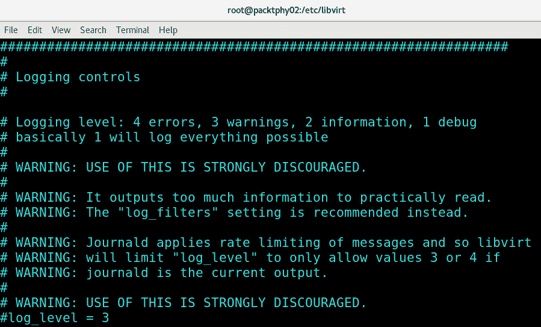
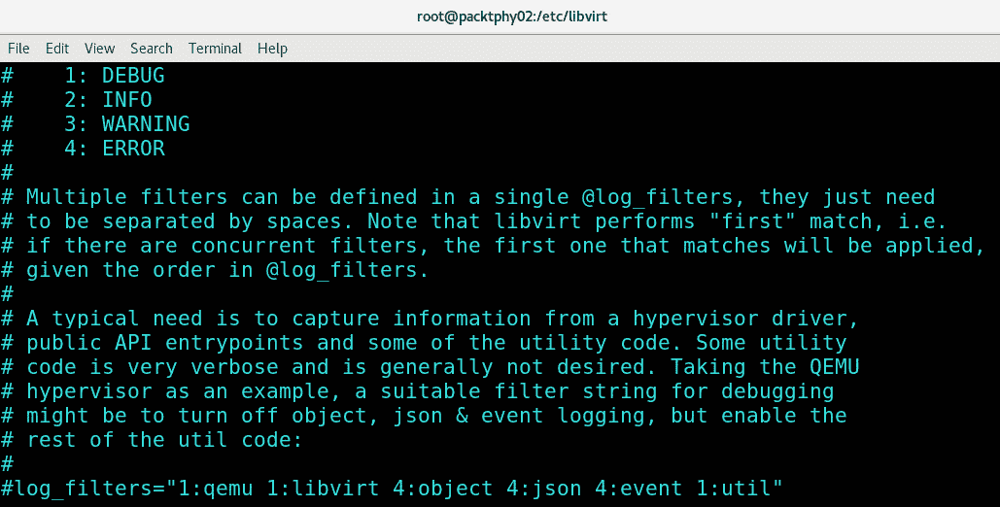
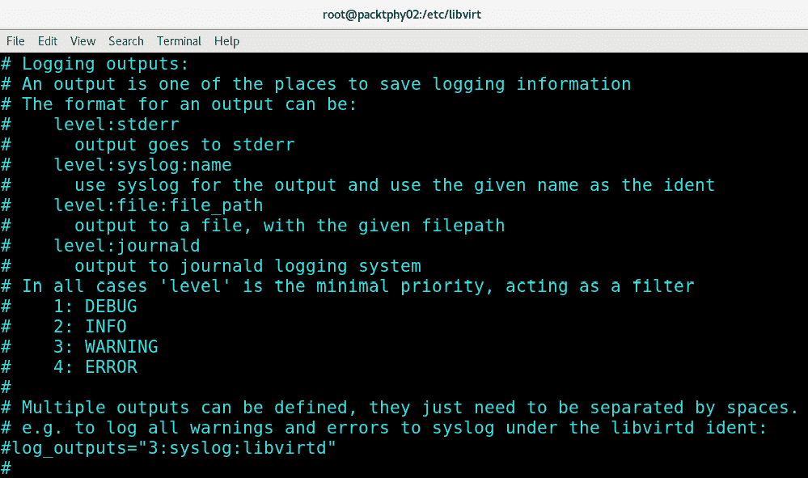
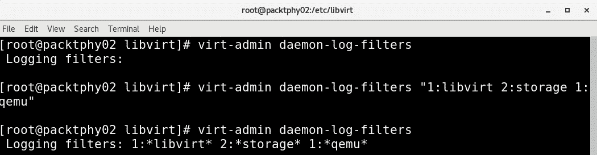
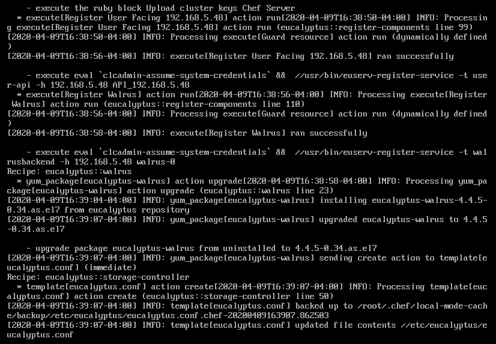
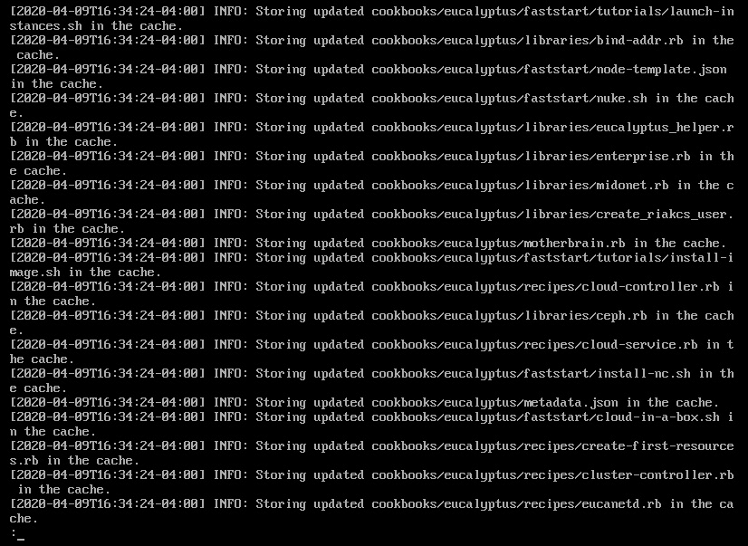
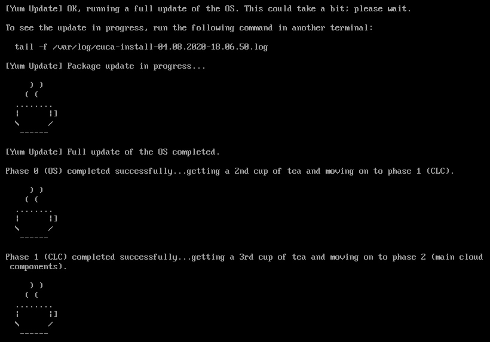
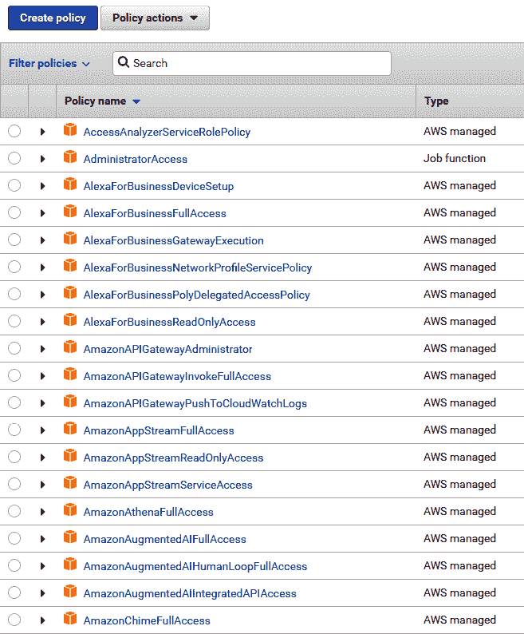

# 第十六章：《第十六章》：KVM 平台的故障排除指南

如果您从《第一章》《理解 Linux 虚拟化》一直跟着这本书走到现在，那么您会知道在这本书中我们一起经历了很多 - 数百页的概念和实际方面，包括配置示例、文件和命令 - 一切。大约 700 页。到目前为止，我们几乎完全忽略了故障排除作为旅程的一部分。我们并不是基于 Linux 中一切都只是“工作”，我们根本没有任何问题，而且我们在阅读全书的过程中达到了一种“涅槃”的状态。

这是一段充满各种问题的旅程。其中一些不值一提，因为它们是我们自己的错误。我们犯的错误（而且您肯定也会犯更多）大多来自于我们输入错误（在命令或配置文件中）。基本上，人类在 IT 中扮演着重要角色。但其中一些问题确实令人沮丧。例如，实施 SR-IOV 需要很多时间，因为我们不得不在硬件、软件和配置层面找到不同类型的问题才能使其正常工作。oVirt 相当古怪，我们很快会解释。Eucalyptus 有点有趣，姑且这么说。尽管我们之前经常使用它，但 cloudbase-init 真的很复杂，需要我们花费很多时间和注意力，结果证明这并不是由于我们做了什么 - 它只是 cloudbase-init 的版本。但总的来说，这进一步证明了我们上一章的一个普遍观点 - 在书籍、文章和博客文章中阅读各种 IT 主题，是一个确实不错的方法，可以从一开始就正确配置很多东西。但即便如此，您仍然需要一些故障排除来使一切完美。

一旦安装了一个服务并开始使用它，一切都很棒和令人惊讶，但第一次很少会这样。我们在本书中使用的一切实际上都是为了测试不同的配置并抓取必要的截图而安装的，但与此同时，我们也希望确保它们实际上可以以更有结构、程序化的方式安装和配置。

因此，让我们从与服务、软件包和日志记录相关的一些简单事物开始。然后，我们将继续介绍更高级的故障排除概念和工具，通过我们一路涵盖的各种示例进行描述。

在本章中，我们将涵盖以下主题：

+   验证 KVM 服务状态

+   KVM 服务日志记录

+   启用调试模式日志记录

+   高级故障排除工具

+   KVM 问题的最佳实践

# 验证 KVM 服务状态

我们将从最简单的示例开始 - 验证 KVM 服务状态及其对主机配置的一些正常影响。

在《第三章》《安装 KVM Hypervisor、libvirt 和 ovirt》中，我们通过安装`virt module`并使用`dnf`命令部署各种软件包，对整个 KVM 堆栈进行了基本安装。有几个原因可能导致这不是一个好主意：

+   许多服务器、台式机、工作站和笔记本电脑在出厂时都预先配置为关闭 BIOS 中的虚拟化。如果您使用基于英特尔的 CPU，请确保找到所有基于 VT 的选项并启用它们（VT、VT-d、VT I/O）。如果您使用基于 AMD 的 CPU，请确保打开 AMD-V。您可以进行一个简单的测试来检查虚拟化是否已启用。如果您启动任何 Linux 实时发行版，进入 shell 并输入以下命令：

```
cat /proc/cpuinfo | egrep "vmx|svm"
```

如果您已经安装了 Linux 主机和我们在《第三章》《安装 KVM Hypervisor、libvirt 和 ovirt》中提到的适当软件包，您也可以使用以下命令：

```
virt-host-validate
```

如果您从这个命令中没有得到任何输出，那么您的系统要么不支持虚拟化（可能性较小），要么没有打开虚拟化功能。确保您检查您的 BIOS 设置。

+   您的网络配置和/或软件包存储库配置可能没有正确设置。正如我们在本章中反复强调的，请从最简单的事情开始——不要试图找出某些超级复杂的原因，为什么某些东西不起作用。保持简单。对于网络测试，请尝试使用`ping`命令对一些知名服务器进行测试，比如 google.com。对于存储库问题，请确保您检查`/etc/yum.repos.d`目录。尝试使用`yum clean all`和`yum update`命令。存储库问题更有可能发生在一些其他发行版而不是 CentOS/Red Hat 上，但仍然可能发生。

+   部署过程成功完成后，请确保使用以下命令启动和启用 KVM 服务：

```
libvirt-guests service, and then we get very surprised after we reboot our host. The result of libvirt-guests not being enabled is simple. When started, it suspends your virtual machines when you initiate shutdown and resumes them on the next boot. In other words, if you don't enable them, your virtual machines won't resume after the next reboot. Also, check out its configuration file, /etc/sysconfig/libvirt-guests. It's a simple text configuration file that enables you to configure at least three very important settings: ON_SHUTDOWN, ON_BOOT, and START_DELAY. Let's explain these:a) By using the `ON_SHUTDOWN` setting, we can select what happens with the virtual machine when we shut down your host since it accepts values such as `shutdown` and `suspend`.b) The `ON_BOOT` option does the opposite – it tells `libvirtd` whether it needs to start all the virtual machines on host boot, whatever their autostart settings are. It accepts values such as `start` and `ignore`.c) The third option, `START_DELAY`, allows you to set a timeout value (in seconds) between multiple virtual machine power-on actions while the host is booting. It accepts numeric values, with `0` being the value for parallel startup and *all other (positive) numbers* being the number of seconds it waits before it starts the next virtual machine.
```

考虑到这一点，至少有三件事需要记住：

+   确保这两个服务实际上正在运行，通过输入以下命令：

```
libvirtd needs to be started for us to be able to create or run a KVM virtual machine.
```

+   如果您正在配置更高级的设置，比如 SR-IOV，请确保阅读服务器的手册，选择一个与 SR-IOV 兼容的正确插槽。此外，请确保您有兼容的 PCI Express 卡和正确配置的 BIOS。否则，您将无法使其工作。

+   当您启动 libvirt 服务时，它通常会带有某种预定义的防火墙配置。记住这一点，以防您决定禁用 libvirt 服务，因为防火墙规则几乎总是还在那里。这可能需要一些额外的配置。

您故障排除旅程的下一步将是检查一些日志文件。有很多选择——KVM 有自己的，oVirt 有自己的，Eucalyptus 也有自己的，ELK 等等。因此，请确保您对这些服务非常了解，以便您可以检查正确的日志文件，以解决您要解决的情况。让我们从 KVM 服务日志开始。

# KVM 服务日志

在讨论 KVM 服务日志时，有一些位置是我们需要注意的：

+   假设您以 root 用户身份登录到 GUI，并启动了 virt-manager。这意味着您在`/root/.cache/virt-manager`目录中有一个`virt-manager.log`文件。它非常冗长，所以在阅读时请耐心等待。

+   `/etc/libvirt/libvirtd.conf`文件是 libvirtd 的配置文件，包含了许多有趣的选项，但一些最重要的选项实际上位于文件的末尾，并与审计相关。您可以选择注释掉的选项（`audit_level`和`audit_logging`）来满足您的需求。

+   `/var/log/libvirt/qemu`目录包含了在我们的 KVM 主机上创建的所有虚拟机的日志和旋转日志。

此外，请务必查看一个名为`auvirt`的命令。它非常方便，因为它可以告诉您有关 KVM 主机上的虚拟机的基本信息——仍然存在和/或成功运行的虚拟机，以及我们尝试安装但失败的虚拟机。它从审计日志中获取数据，您也可以使用它来显示我们需要的特定虚拟机的信息。它还有一个非常调试级别的选项叫做`--all-events`，如果您想检查关于 KVM 主机上的任何虚拟机的每一个细节。

# 启用调试模式日志记录

在 KVM 中还有另一种日志记录方法：配置调试日志记录。在我们刚提到的 libvirtd 配置文件中，有其他设置可以用来配置这个选项。因此，如果我们滚动到`Logging controls`部分，这些是我们可以使用的设置：

+   `log_level`

+   `log_filters`

+   `log_outputs`

让我们一步一步地解释它们。第一个选项 - `log_level` - 描述了日志详细程度。自从 libvirt 版本 4.4.0 起，此选项已被弃用。在文件的`日志控制`部分中，还有额外的文档硬编码到文件中，以使事情变得更容易。对于这个特定的选项，文档中是这样说的：



图 16.1 - libvirtd.conf 中的日志控制

人们通常会看到此输出的第一部分（日志级别描述），转到最后一行（`Iog_level`），将其设置为 1，保存，重新启动`libvirtd`服务，然后完成。问题在于中间的文本部分。它明确表示`journald`进行速率限制，以便它不会被来自一个服务的日志淹没，并指示我们改用`log_filters`设置。

那么让我们这样做 - 让我们使用`log_filters`。在配置文件的稍低处，有一个看起来像这样的部分：



图 16.2 - libvirtd.conf 中的日志过滤器选项

这为我们提供了各种选项，我们可以使用不同的日志选项来设置不同的对象类型，这很棒。它为我们提供了增加我们感兴趣的事物的详细程度的选项，同时将其他对象类型的详细程度保持在最低水平。我们需要做的是删除最后一行的注释部分（`#log_filters="1:qemu 1:libvirt 4:object 4:json 4:event 1:util"`应该变成`log_filters="1:qemu 1:libvirt 4:object 4:json 4:event 1:util"`），并配置其设置以使其符合我们的要求。

第三个选项涉及我们想要将调试日志输出文件放在哪里：



图 16.3 - libvirtd.conf 中的日志输出选项

重要提示

更改任何这些设置后，我们需要确保通过键入`systemctl restart libvirtd`命令来重新启动`libvirtd`服务。

如果我们只对客户端日志感兴趣，我们需要设置一个名为`LIBVIRT_LOG_OUTPUTS`的环境变量为类似于这样的内容（假设我们想要 DEBUG 级别的日志）：

```
export LIBVIRT_LOG_OUTPUTS="1:file:/var/log/libvirt_guests.log"
```

所有这些选项都有效，直到下一次`libvirtd`服务重启，这对于永久设置非常方便。但是，当我们需要临时调试而不需要使用永久配置时，还有一个运行时选项可以使用。这就是为什么我们有一个名为`virt-admin`的命令。我们可以使用它来设置我们自己的设置。例如，让我们看看如何使用它来获取我们当前的设置，然后如何使用它来设置临时设置：



图 16.4 - Runtime libvirtd 调试选项

我们还可以通过发出以下命令来删除这些设置：

```
virt-admin daemon-log-filters ""
```

这绝对是在我们完成调试后推荐的事情。我们不想把我们的日志空间用于无用的事情。

就纯粹调试虚拟机而言 - 除了这些日志选项之外 - 我们还可以使用串行控制台仿真来连接到虚拟机控制台。如果我们无法以其他方式访问虚拟机，尤其是在我们的环境中不使用 GUI 的情况下，这通常是在生产环境中的情况。访问控制台可以按以下方式完成：

```
virsh console kvm_domain_name
```

在上述命令中，`kvm_domain_name`是我们想要通过串行控制台连接的虚拟机的名称。

# 高级故障排除工具

根据主题 - 网络、硬件和软件问题，或特定应用程序问题 - 我们可以使用不同的工具来排除我们环境中的问题。让我们简要地回顾一些这些方法，同时牢记本书的章节，以便我们排除故障：

+   oVirt 问题

+   快照和模板问题

+   虚拟机定制问题

+   Ansible 问题

+   OpenStack 问题

+   Eucalyptus 和 AWS 组合问题

+   ELK 堆栈问题

有趣的是，当我们处理 KVM 虚拟化时，通常不会遇到网络问题。这些都有很好的文档支持——从 KVM 桥接到 open vSwitch——只需要按照文档进行操作。唯一的例外是与防火墙规则相关的问题，特别是在处理 oVirt 和远程数据库连接时，同时保持最小的安全性。如果你对此感兴趣，请确保查看以下链接：[`www.ovirt.org/documentation/installing_ovirt_as_a_standalone_manager_with_remote_databases/#dns-requirements_SM_remoteDB_deploy`](https://www.ovirt.org/documentation/installing_ovirt_as_a_standalone_manager_with_remote_databases/#dns-requirements_SM_remoteDB_deploy)。

在文章的后面有一个大表格描述了每个端口用于什么以及它们使用的协议。此外，还有一个需要在 oVirt 主机级别配置的端口表。如果你要将 oVirt 投入生产，我们建议你使用这篇文章。

## oVirt

在处理 oVirt 时，我们经常遇到两个常见问题：

+   *安装问题*：当我们在引擎设置中输入安装选项并正确配置事物时，我们需要放慢速度。

+   *更新问题*：这些问题可能与不正确地更新 oVirt 或底层系统有关。

安装问题通常很容易排除故障，因为它们通常发生在我们刚开始部署 oVirt 时。这意味着我们可以奢侈地停止安装过程，从头开始。其他一切都会变得太混乱和复杂。

然而，更新问题值得特别一提。让我们处理 oVirt 更新问题的两个子集并对它们进行更详细的解释。

更新 oVirt Engine 本身需要做的事情是我们大多数人都不喜欢做的——阅读大量的文档。我们需要首先检查我们正在运行的 oVirt 版本。例如，如果我们正在运行 4.3.0 版本，想要升级到 4.3.7 版本，这是一个相对简单的次要更新路径。我们需要首先备份我们的 oVirt 数据库：

```
engine-backup --mode=backup --file=backupfile1 --log=backup.log
```

我们这样做只是作为一种预防措施。然后，如果以后出现问题，我们可以使用以下命令：

```
engine-backup --mode=restore --log=backup.log --file=backupfile1 --provision-db --provision-dwh-db --no-restore-permissions 
```

如果你没有部署 DWH 服务及其数据库，可以忽略`--provision-dwh-db`选项。然后，我们可以执行标准程序：

```
engine-upgrade-check
yum update ovirt\*setup\*
engine-setup
```

这应该大约需要 10 分钟，不会造成任何伤害。但最好还是小心为妙，在这之前备份数据库。

然而，如果我们从旧版本的 oVirt 迁移到最新版本——比如从 4.0.0 版本、4.1.0 版本或 4.2.0 版本迁移到 4.3.7 版本——那就是一个完全不同的过程。我们需要去 ovirt.org 网站阅读文档。例如，假设我们要从 4.0 升级到 4.3。ovirt.org 上有描述所有这些过程的文档。你可以从这里开始：[`www.ovirt.org/documentation/upgrade_guide/`](https://www.ovirt.org/documentation/upgrade_guide/)。

这将给我们大约 20 个子步骤，我们需要完成才能成功升级。请小心和耐心，因为这些步骤是按照非常清晰的顺序编写的，需要按照这种方式实施。

现在我们已经涵盖了升级方面的 oVirt 故障排除，让我们深入研究*操作系统和软件包升级*，因为这是一个完全不同的讨论，需要考虑的事情更多。

考虑到 oVirt 有自己的先决条件，从 CPU、内存和存储需求到防火墙和存储库需求，我们不能盲目地使用系统范围的命令，比如以下命令：

```
yum -y update
```

我们不能指望 oVirt 对此感到满意。它不会，这在生产环境和写作本书时都发生过很多次。我们需要检查将部署哪些软件包，并检查它们是否与 oVirt 存在某种相互依赖关系。如果有这样的软件包，你需要确保按照本章前面提到的进行引擎备份过程。这将避免给你带来很多问题。

不仅 oVirt Engine 可能会出问题-更新 oVirt 库存中的 KVM 主机也可能会相当戏剧化。oVirt 引擎或我们的手动安装程序部署在主机上的 oVirt 代理（`vdsm`）及其组件，也有它们自己的相互依赖关系，可能会受到系统范围内的`yum -y update`命令的影响。因此，在接受升级之前，要先拉手刹，因为它可能会带来很多痛苦。确保你检查`vdsm`日志（通常位于`/var/log/vdsm`目录中）。当你试图解释`vdsm`出了什么问题时，这些日志文件非常有帮助。

## oVirt 和 KVM 存储问题

我们遇到的大多数存储问题通常与 LUN 或共享向主机的呈现有关。特别是当你处理块存储（光纤通道或 iSCSI）时，我们需要确保不要从主机中排除或屏蔽 LUN，否则主机将看不到它。相同的原则也适用于 NFS 共享、Gluster、CEPH 或我们正在使用的任何其他类型的存储。

除了这些预配置问题之外，最常见的问题与故障转移有关-即路径指向存储设备失败的情况。这时，如果我们扩展了存储或存储网络基础设施一点-增加了额外的适配器、额外的交换机、配置了多路径(MPIO)等，我们会感到非常高兴。确保你查阅存储设备供应商的文档，并按照特定存储设备的最佳实践进行操作。相信我们说的- iSCSI 存储配置及其默认设置与配置光纤通道存储有天壤之别，特别是涉及多路径时。例如，使用 iSCSI 的 MPIO，如果正确配置，它会更加愉快和敏捷。你将在本章末尾的*进一步阅读*部分找到更多关于这个过程的细节。

如果你正在使用基于 IP 的存储，请确保通向存储设备的多个路径使用单独的 IP 子网，因为其他一切都是一个坏主意。类似 LACP 的技术和 iSCSI 不应该出现在同一个句子中，否则你将会对一个不适用于存储连接并且正常工作的技术进行故障排除，而你却认为它没有正常工作。我们需要知道我们在进行故障排除的是什么；否则，故障排除就毫无意义。为 iSCSI 创建 LACP 等同于仍然使用一个路径进行 iSCSI 连接，这意味着浪费了网络连接，除了在故障转移的情况下，它并没有被主动使用。而你实际上并不需要 LACP 或类似的技术。唯一的例外可能是刀片服务器，因为在刀片上的升级选项确实有限。但即使是这样，解决*我们需要更多带宽从主机到存储*的问题的方法是获得更快的网络或光纤通道适配器。

## 快照和模板的问题-虚拟机定制

老实说，多年来在各种虚拟化技术上工作，涵盖了 Citrix、微软、VMware、Oracle 和 Red Hat，我们看到了许多不同的快照问题。但只有当你开始在企业 IT 中工作，看到操作、安全和备份程序有多么复杂时，你才意识到创建快照这样一个*简单*的过程可能有多危险。

我们见过以下情况：

+   备份应用程序不想启动，因为虚拟机有快照（常见情况）。

+   快照不想删除和组装。

+   多个快照不想删除和组装。

+   快照因古怪的原因使虚拟机崩溃。

+   快照因为存储空间不足而使虚拟机崩溃（常见情况）。

+   快照使虚拟机中运行的应用程序崩溃，因为该应用程序不知道如何在快照之前进行整理，进入脏状态（VSS，同步问题）。

+   快照被轻微滥用，发生了一些事情，我们需要进行故障排除

+   快照被严重滥用，总是发生一些事情，我们需要进行故障排除

这种情况比预期的要频繁得多，因为人们确实倾向于在获得许可的情况下大量使用快照。我们曾看到在生产环境中运行的虚拟机拥有 20 多个快照，人们抱怨它们运行缓慢。在这种情况下，您只能深呼吸，深呼吸，耸耸肩，然后问：“你期望什么，20 多个快照会增加虚拟机的速度吗”？

在所有这些问题中，帮助我们度过所有这些问题的是三个基本原则：

+   真正了解在任何给定技术上快照的工作原理。

+   确保每次我们甚至考虑使用快照时，首先检查虚拟机所在数据存储中的可用存储空间量，然后检查虚拟机是否已经有快照。

+   不断重复这句口头禅：“快照不是备份”，一遍又一遍地对我们的所有客户进行灌输，并用额外的文章和链接向他们解释为什么他们需要停止使用快照，即使这意味着拒绝某人甚至拍摄快照的许可。

实际上，最后一个情况已经成为我们遇到的许多环境中的事实政策。我们甚至看到一些公司在处理快照时实施了一项明确的政策，规定公司政策是在有限的时间内最多拥有一两个快照。例如，在 VMware 环境中，您可以分配一个虚拟机高级属性，设置最大快照数为 1（使用名为`snapshot.maxSnapshots`的属性）。在 KVM 中，您将不得不针对这些情况使用基于存储的快照，并希望存储系统具有基于策略的功能来设置快照数量。然而，在许多环境中，这有点违背了使用基于存储的快照的想法。

模板化和虚拟机定制是另一个完全不同的故障排除世界。模板化很少会引起问题，除了我们在[*第八章*]（B14834_08_Final_ASB_ePub.xhtml#_idTextAnchor143）中提到的警告之外，*创建和修改 VM 磁盘、模板和快照*，与在 Windows 机器上串行使用`sysprep`相关的警告。创建 Linux 模板现在非常简单，人们使用`virt-sysprep`、`sys-unconfig`或自定义脚本来执行。但与虚拟机定制相关的下一步是完全不同的事情。特别是在使用 cloudbase-init 时，因为多年来 cloud-init 一直是预配置 Linux 虚拟机在云环境中的标准方法。

以下是一个简短的列表，列出了我们在 cloudbase-init 中遇到的一些问题：

+   Cloudbase-init 由于“无法加载用户配置文件：设备尚未准备好”而失败。

+   域加入不可靠。

+   网络设置期间出现错误。

+   通过 cloudbase-init 重置 Windows 密码。

+   使 cloudbase-init 从指定目录执行 PowerShell 脚本。

这些和其他问题的绝大多数都与 cloudbase-init 的文档非常糟糕有关。它确实有一些配置文件示例，但其中大部分更多与 API 或编程方法相关，而不是通过示例来解释如何创建某种配置。此外，我们在*第十章*中提到的不同版本也存在各种问题，*自动化 Windows 客户端部署和自定义*。然后，我们选择了一个预发布版本，它可以直接使用配置文件，而在稳定版本上无法正常工作。但总的来说，我们在尝试使其正常工作时遇到的最大问题是与 PowerShell 正确配合。如果我们能够正确执行 PowerShell 代码，我们几乎可以在 Windows 系统上配置任何我们想要的东西，所以这是一个大问题。有时，它不想从 Windows 系统磁盘上的随机目录执行 PowerShell 脚本。

确保您在本书中使用示例作为起点。我们故意将*第十章*中的示例尽可能简单化，其中包括执行的 PowerShell 代码。之后，展开你的翅膀，做任何需要做的事情。当您使用基于 Microsoft 的解决方案时，无论是本地还是混合解决方案，PowerShell 都会使一切变得更容易和更自然。

## 使用 Ansible 和 OpenStack 的问题

我们与 Ansible 和 OpenStack 的第一次互动发生在多年前 - Ansible 于 2012 年推出，OpenStack 于 2010 年推出。我们一直认为它们都是非常酷的工具，尽管存在一些问题。其中一些小问题与开发速度快（OpenStack）有关，大量的错误从一个版本到另一个版本得到解决。

在 Ansible 方面，我们与人们进行了大量的争论 - 一天，主题与“我们习惯使用 Puppet，为什么需要 Ansible？！”有关；第二天是“啊，这个语法太复杂了”；第三天是其他事情，还有其他事情……通常都与 Ansible 架构更简单，语法在一开始至少更复杂有关。对于 Ansible 来说，一切都取决于语法，我们相信您要么已经知道，要么很快就会发现。

故障排除 Ansible playbook 通常是一个过程，有 95%的机会是我们在配置文件中拼写错误或输入错误。我们谈论的是您已经有机会使用 Ansible 一段时间的初始阶段。确保重新检查 Ansible 命令的输出，并将其用于此目的。在这方面，它真的很出色。您不需要进行复杂的配置（例如`libvirtd`）来从执行的过程和 playbook 中获得可用的输出。这使我们的工作变得更加容易。

故障排除 OpenStack 是完全不同的一桩麻烦。有一些充分记录的 OpenStack 问题，这些问题也可能与特定设备有关。让我们举一个例子 - 查看以下链接，了解在使用 NetApp 存储时出现的问题：[`netapp-openstack-dev.github.io/openstack-docs/stein/appendices/section_common-problems.html`](https://netapp-openstack-dev.github.io/openstack-docs/stein/appendices/section_common-problems.html)。

以下是一些例子：

+   创建卷失败

+   克隆卷失败

+   卷附加失败

+   卷上传到镜像操作失败

+   卷备份和/或恢复失败

然后，例如，查看这些链接：

+   [`docs.openstack.org/cinder/queens/configuration/block-storage/drivers/ibm-storwize-svc-driver.html`](https://docs.openstack.org/cinder/queens/configuration/block-storage/drivers/ibm-storwize-svc-driver.html)

+   [`www.ibm.com/support/knowledgecenter/STHGUJ_8.2.1/com.ibm.storwize.v5100.821.doc/storwize_openstack_matrix.html`](https://www.ibm.com/support/knowledgecenter/STHGUJ_8.2.1/com.ibm.storwize.v5100.821.doc/storwize_openstack_matrix.html)

正如你可能已经推断出的那样，OpenStack 在存储方面非常挑剔。这就是为什么存储公司通常为他们自己的存储设备创建参考架构，以在基于 OpenStack 的环境中使用。查看 HPE 和戴尔 EMC 的这两份文件，作为这种方法的良好示例：

+   [`www.redhat.com/cms/managed-files/cl-openstack-hpe-synergy-ceph-reference-architecture-f18012bf-201906-en.pdf`](https://www.redhat.com/cms/managed-files/cl-openstack-hpe-synergy-ceph-reference-architecture-f18012bf-201906-en.pdf)

+   [`docs.openstack.org/cinder/rocky/configuration/block-storage/drivers/dell-emc-unity-driver.html`](https://docs.openstack.org/cinder/rocky/configuration/block-storage/drivers/dell-emc-unity-driver.html)

最后要警告的是，最难克服的障碍与 OpenStack 版本升级有关。关于这个主题，我们可以告诉你很多恐怖故事。话虽如此，我们在这里也有部分责任，因为我们作为用户部署了各种第三方模块和实用程序（基于供应商的插件、分支、未经测试的解决方案等），忘记使用它们，然后当升级过程失败时，我们真的感到惊讶和恐惧。这可以追溯到我们在整本书中一直讨论的关于记录环境的多个讨论。这是一个我们将在本章稍后再次讨论的主题。

## 依赖关系

每个管理员都完全意识到几乎每个服务都有一些依赖关系 - 要么是依赖于运行此特定服务的服务，要么是我们的服务需要工作的服务。在处理软件包时，依赖关系也是一个重要因素 - 软件包管理器的整个目的是严格注意需要安装的内容以及依赖它的内容，以便我们的系统正常工作。

大多数管理员犯的错误是忘记了，在更大的系统中，依赖关系可能延伸到多个系统、集群，甚至数据中心。

每个涵盖 OpenStack 的课程都有一个专门的课程，介绍如何启动、停止和验证不同的 OpenStack 服务。其原因很简单 - OpenStack 通常在大量节点上运行（数百，有时数千）。一些服务必须在每个节点上运行，一些服务需要一组节点，一些服务在每个节点实例上都是重复的，一些服务只能存在一个实例。

了解每个服务的基础知识以及它如何融入整个 OpenStack 架构不仅在安装整个系统时至关重要，而且在调试为什么某些东西在 OpenStack 上不起作用时也是最重要的。至少阅读一次文档以“串联起点”。同样，在本章末尾的“进一步阅读”部分包含了指向 OpenStack 正确方向的链接。

OpenStack 是那些在文档中包括“如何正确地重新启动运行 X 的机器？”的系统之一。其原因就像整个系统一样复杂 - 系统的每个部分既有它所依赖的东西，也有一些依赖它的东西 - 如果某些东西出了问题，你不仅需要了解系统的这个特定部分是如何工作的，还需要了解它如何影响其他一切。但是在所有这些中有一线希望 - 在一个正确配置的系统中，很多东西都是冗余的，所以有时，修复某些东西最简单的方法是重新安装它。

这可能总结了整个故障排除的故事 - 试图修复一个简单的系统通常比修复一个复杂的系统更复杂和耗时。了解它们各自的工作原理是最重要的部分。

## 故障排除 Eucalyptus

说我们开始安装过程后一切都按照手册进行是不真实的 - 大部分是，我们相当肯定，如果您按照我们记录的步骤进行，您最终会得到一个可用的服务或系统，但在任何时候，都会有事情可能会出错。这时候你需要做的是最难以想象的事情 - 故障排除。但你该怎么做呢？信不信由你，有一种更或多或少系统化的方法可以让你解决几乎任何问题，不仅仅是 KVM/OpenStack/AWS/Eucalyptus 相关的问题。

### 收集信息

在我们做任何事情之前，我们需要做一些研究。这是大多数人做错事情的时刻，因为显而易见的答案是去互联网上搜索问题。看看这个屏幕截图：



图 16.5 - Eucalyptus 日志，第一部分 - 清晰、简洁、易读 - Eucalyptus 中已完成的每个过程在日志中清晰可见

如果你还没有注意到，互联网上充满了几乎任何想象问题的现成解决方案，其中很多是错误的。这是因为有两个原因：大多数解决方案的人并不了解问题是什么，所以一旦他们找到了解决他们特定问题的任何解决方案，他们就停止解决它。换句话说 - 许多 IT 人员试图将从 A 点（问题）到 B 点（解决方案）的路径描绘成一束激光束 - 超级平坦，最短可能的路径，沿途没有障碍。一切都很好，设计得很干净，旨在在激光束原则停止工作时干扰我们的故障排除思维过程。这是因为，在 IT 领域，事情很少那么简单。

例如，由 DNS 配置错误引起的任何问题。其中大多数可以通过在*hosts*文件中创建一个条目来“解决”。这个解决方案通常有效，但同时在几乎任何层面上都是错误的。这个解决方案只在一个机器上解决了问题 - 那个特定的主机文件所在的机器。而 DNS 仍然配置错误；我们只是创建了一个快速的、未记录的解决方法，它在我们的特定情况下有效。每台其他有相同问题的机器都需要以这种方式进行修补，而我们的修复可能会在未来产生更多问题的真正可能性。

真正的解决方案显然是找到问题的根源并解决 DNS 的问题，但在互联网上很少有这样的解决方案。这主要是因为互联网上的大多数评论者对许多服务不熟悉，快速修复基本上是他们能够应用的唯一方法。

互联网大部分错误的另一个原因是因为著名的“重新安装解决了问题”的解决方案。Linux 在这方面的记录更好，因为使用它的人不太倾向于通过擦除和重新安装系统来解决所有问题，但你会发现大多数 Windows 问题的解决方案至少会有一个简单的“重新安装解决了问题”。与仅仅给出一个随机的解决方案作为总是有效的解决方案相比，这种“重新安装”方法要糟糕得多。这不仅意味着你将浪费大量时间重新安装所有东西；它还意味着你的问题最终可能会或可能不会得到解决，这取决于问题实际上是什么。

因此，我们将给出的第一个简短建议是，“不要盲目相信互联网”。

好了，但你实际上应该做什么呢？让我们来看看：

1.  *收集关于问题的信息*。阅读错误消息，阅读日志（如果应用程序有日志），并尽可能打开调试模式。获取一些实际数据。找出是什么导致了崩溃，以及是如何崩溃的，以及是什么问题导致了崩溃。看一下下面的截图：

图 16.6 - 桉树日志，第二部分 - 再次，干净，清晰，易于阅读 - 有关更新内容和位置的信息消息

1.  *阅读文档*。你正在尝试的事情是否得到支持？功能系统的先决条件是什么？你是否遗漏了什么？缓存磁盘？一些内存？你特定系统的依赖基本服务？一个库或额外的软件包的依赖？固件升级？

有时，你会遇到一个更大的问题，特别是在文档写得很糟糕的情况下 - *可能会在次要提到一些关键的系统依赖项*，并可能导致整个系统崩溃。例如，外部识别服务 - 也许你的目录使用了*错误的字符集*，导致当特定用户以特定方式使用时系统崩溃。始终确保你了解你的系统是如何相互连接的。

接下来，检查你的系统。如果你正在安装一个新系统，请检查先决条件。你有*足够的磁盘空间*和*内存*吗？你的应用程序需要的所有服务是否都可用并正常工作？

搜索互联网。我们之前提到过，互联网对所有可能的问题都有一个简单而不正确的解决方案，但通常也会在错误的解决方案中隐藏着正确的解决方案。当你武装自己拥有关于你特定系统和特定问题的大量数据后，互联网很快就会成为你的朋友。因为你了解问题是什么，你将能够理解提供给你的解决方案中哪些是错误的。

现在，让我们谈谈我们故意在安装桉树时制造的一个现实世界的问题，只是为了向你展示文档有多重要。

我们在*第十三章*中向你展示了如何安装桉树，*使用 AWS 扩展 KVM* - 我们不仅经历了安装过程，还学会了如何使用这个令人惊叹的服务。如果你想学习一些关于如何不做的东西，继续阅读。我们将向你展示一个故意创建的桉树安装失败的场景，因为我们*创造性地忘记了一些我们知道需要做的步骤*。让我们这样说 - 我们表现得像人类一样，使用了*浏览文档*的方法，而不是*实际坐下来阅读文档*。这听起来熟悉吗？

安装桉树应该是一项简单的任务，因为它的安装本质上是一个应用脚本的练习。桉树甚至在项目的首页上都这样说：*只需运行这个脚本*。

但事实要复杂得多 - 桉树确实可以只使用这个脚本进行安装，但必须满足一些先决条件。当然，在你急于测试新服务时，你可能会忽略阅读文档，就像我们一样，因为我们已经有了桉树的经验。

我们配置了系统，启动了安装，然后遇到了问题。在确认了初始配置步骤后，我们的安装失败了，错误消息显示无法解析特定地址：`192.168.1.1.nip.io`。

DNS 是 IT 基础设施中的主要问题之一，我们迅速开始调试 - 我们想要看到的第一件事是这个特定地址是什么。实际上，在 IT 中有一句话 - *总是 DNS*。它看起来像一个本地地址，所以我们开始 ping 它，看起来还好。但为什么 DNS 甚至与 IP 地址有关？DNS 应该解析域名，而不是 IP 地址。然后，我们转向文档，但没有得到太多信息。我们唯一发现的是 DNS 必须为整个系统工作。

然后，是时候尝试调试 DNS 了。首先，我们尝试从我们正在安装的机器上解析它。DNS 返回超时。我们在另一台机器上尝试了一下，得到了我们没有预期的响应 - `127.0.0.1.nip.io`解析为`127.0.0.1`，这意味着本地主机。基本上，我们向互联网上的 DNS 请求一个地址，它将我们引导到我们的本地系统。

所以，我们遇到了一个我们不理解的错误，一个解析为我们没有预期的 IP 地址的地址，以及两个不同的系统对相同命令表现出完全不同的行为。我们把注意力转向我们正在安装的机器，意识到它配置错误 - 没有配置 DNS。这台机器不仅无法解析我们*奇怪*的 IP 地址，而且无法解析任何东西。

我们通过指向正确的 DNS 服务器来解决了这个问题。然后，按照真正的 IT 方式，我们重新启动了安装，以便我们能够继续进行这一部分，一切都还好，或者看起来是这样。但发生了什么？为什么一个本地服务解析如此奇怪的名称，为什么它们会被解析？

我们转向互联网，看了一下我们神秘名称末尾的域名。我们发现服务`nip.io`实际上就是我们观察到的事情 - 当要求返回本地子网范围内 IP 地址形成的特定名称时（由`RFC 1918`定义），它返回相同的 IP。

我们接下来的问题是 - 为什么？

经过更多阅读，您会意识到这里的诀窍是什么 - 桉树使用 DNS 名称与其所有组件进行通信。作者非常明智地选择不将单个地址硬编码到应用程序中，因此系统的所有服务和节点都必须具有真实的 DNS 注册名称。在正常的多节点，多服务器安装中，这就像魅力一样 - 每个服务器和每个节点首先都要在适当的 DNS 服务器上注册，桉树将尝试解析它们以便与机器通信。

我们正在安装一个拥有所有服务的单个机器，这使得安装更容易，但节点没有单独的名称，甚至我们的机器可能没有在 DNS 中注册。因此，安装程序做了一个小技巧。它将本地 IP 地址转换为完全有效的域名，并确保我们可以解析它们。

所以，现在我们知道发生了什么（解析过程不起作用）以及为什么会发生（我们的 DNS 服务器设置出了问题），但我们也理解了为什么首先需要 DNS。

这带我们到下一个点 - *不要假设任何事情*。

在我们排除故障并跟进我们的 DNS 问题时，我们的安装崩溃了。桉树是一个复杂的系统，它的安装是一件相当复杂的事情 - 它会自动更新您运行它的机器，然后安装似乎有成千上万的软件包，然后下载，配置和运行一小部分镜像和虚拟软件包。为了保持整洁，用户看不到发生的一切，只能看到最重要的部分。安装程序甚至有一个漂亮的 ASCII 图形屏幕让你忙碌。一切都还好，但突然之间，我们的安装完全崩溃了。我们得到的只是一个看起来像属于 Python 语言的巨大堆栈跟踪。我们重新运行了安装，但它再次失败了。

此时的问题是，我们不知道为什么会发生这一切，因为安装要求对 CentOS 7 进行最小安装。我们在虚拟机上运行测试，并确实进行了最小安装。

我们重新尝试从头安装。重新安装整个机器只花了几分钟，然后我们重新尝试安装。结果是一样的 - 一个失败的安装，让我们得到了一个无法使用的系统。但有一个可能的解决方案 - 或者更准确地说，是了解发生了什么。

与 IT 宇宙中所有伟大的安装程序一样，这个安装程序也为这种可能性准备了特别的东西：一个日志文件。看一下下面的截图：



图 16.7 - 当你不阅读 Eucalyptus 的文档时，安装过程会花费很长时间。然后还需要更多的时间...还有更多...

这是安装屏幕。我们看不到关于正在发生的事情的任何真实信息，但从顶部的第三行中可以找到最重要的线索 - 日志文件的位置。为了防止屏幕被信息淹没，安装程序显示了这个非常漂亮的 figlet-coffee 图形（所有在 20 世纪 90 年代和 2000 年代使用 IRC 的人现在可能会微笑），但也将正在发生的一切都转储到日志中。这里的一切，是指每个命令、每个输入和每个输出。这使得调试变得容易 - 我们只需要滚动到文件的末尾，然后尝试从那个点开始向后查看是什么出了问题。一旦我们这样做了，解决方案就很简单 - 我们忘记为机器分配足够的内存。我们给了它 8GB 的 RAM，而官方上应该至少有 16GB 才能顺利运行。有报道称有机器只有 8GB 的 RAM 也能运行，但这完全没有意义 - 毕竟我们正在运行一个虚拟化环境。

## AWS 及其冗长，这并不有助于解决问题

我们想提到的另一件事是 AWS 以及如何对其进行故障排除。AWS 是一个了不起的服务，但它有一个巨大的问题 - 就是它的规模。有这么多服务、组件和服务部分，你需要使用它们来在 AWS 上运行一些东西，简单的任务可能会变得非常复杂。我们的情景涉及尝试建立一个我们用作示例的 EC2 实例。

这个任务相对简单，演示了一个简单的问题可以有一个简单的解决方案，同时也可能完全不明显。

让我们回到我们试图做的事情。我们有一台机器在本地磁盘上。我们必须将它转移到云端，然后创建一个正在运行的虚拟机。这可能是最简单的事情之一。

为此，我们创建了一个 S3 存储桶，并将我们的机器从本地机器转移到了云端。但在我们尝试运行机器后，我们得到的只是一个错误。

像 AWS 这样的服务最大的问题是它的庞大，没有办法一次性理解所有东西 - 你必须一块一块地建立你的知识。所以，我们回到了文档。AWS 有两种文档 - 广泛的帮助，涵盖了每个服务的每个命令和每个选项，以及引导示例。帮助是令人惊叹的，但如果你不知道自己在找什么，它将毫无用处。这种形式的帮助只有在你对概念有基本的理解时才有效。如果你是第一次做某事，或者你遇到了以前没有遇到过的问题，我们建议你找到一个你正在尝试做的任务的示例，并进行练习。

在我们的情况下，这很奇怪，因为我们只需要运行一个简单的命令。但我们的导入仍然失败。在我们碰头几个小时后，我们决定表现得像我们什么都不知道，然后做了*如何将 VM 导入 AWS？*的示例。一切都很顺利。然后，我们尝试导入我们自己的机器；那不起作用。命令被复制/粘贴，但仍然不起作用。

然后我们意识到最重要的一点是*我们需要注意细节*。如果没有正确实施和执行这种思维方式，我们将给自己带来一系列问题。

## 注意细节

长话短说，我们做错的是错误配置了身份服务。在 AWS 等云环境中，每个服务都作为独立的域运行，与其他服务完全分开。当需要执行某项任务时，执行任务的服务必须具有某种授权。有一个服务负责处理这个问题-IAM-每个服务的每个请求的明显默认值是拒绝一切。一旦我们决定需要做什么，我们就有责任配置适当的访问和授权。我们知道这一点，所以我们为 EC2 访问 S3 中的文件创建了所有角色和权限。尽管这听起来可能有些奇怪，但我们必须授予我们正在使用的服务获取我们上传的文件的权限。如果你是新手，你可能期望这是自动的，但事实并非如此。

查看以下摘录，这是 AWS 预定义的角色列表中的一小部分。请记住，完整列表要长得多，我们只是触及了所有可用角色的表面。这些只是以字母*A*开头的角色：



图 16.8 - AWS 预定义角色

我们错误配置的是角色的名称-为了将 VM 导入 EC2 实例，需要有一个名为`vmimport`的安全角色授予 EC2 正确的权限。我们匆忙配置了一个名为`importvm`的角色。当我们完成示例时，我们粘贴了示例，一切都很好，但一旦我们开始使用我们的安全设置，EC2 就无法完成其工作。因此，始终*检查产品文档并仔细阅读*。

## 解决 ELK 堆栈的问题

ELK 堆栈可以有效地用于监视我们的环境。它确实需要一些手动操作，额外的配置，并且需要有点诡计，但它仍然可以提供报告、自动报告、通过电子邮件发送报告以及许多其他有价值的东西。

开箱即用，你不能直接发送报告-你需要再做一些调查。你可以使用 Watcher，但你需要的大部分功能是商业化的，所以你需要在上面花一些钱。还有其他一些方法：

+   使用 Kibana/Grafana 的快照-查看此网址：[`github.com/parvez/snapshot`](https://github.com/parvez/snapshot)

+   使用 ElastAlert-查看此网址：[`github.com/Yelp/elastalert`](https://github.com/Yelp/elastalert)

+   使用 Elastic Stack 功能（以前称为 X-Pack）-查看此网址：[`www.elastic.co/guide/en/x-pack/current/installing-xpack.html`](https://www.elastic.co/guide/en/x-pack/current/installing-xpack.html)

这里还有一个建议：你可以通过`rsyslog`来集中日志，因为这是一个内置功能。如果你创建一个集中式日志服务器，那里有免费的应用程序可以浏览日志文件（例如 Adiscon LogAnalyzer）。如果处理 ELK 似乎有点难以应付，但你意识到你需要一些东西，那就从这样的东西开始。它非常容易安装和配置，并提供一个带有正则表达式支持的免费 Web 界面，以便你可以浏览日志条目。

# KVM 问题的故障排除最佳实践

在解决 KVM 问题时，有一些常识最佳实践。让我们列出其中一些：

+   *保持简单，进行配置*：部署了 50 个 OpenStack 主机跨三个子网在一个站点中的情况有什么好处呢？仅仅因为你可以将子网划分到 IP 范围的极限并不意味着你应该这样做。仅仅因为你的服务器有八个可用连接并不意味着你应该将它们全部连接到 iSCSI 存储。考虑端到端的配置（例如，iSCSI 网络的巨帧配置）。简单的配置几乎总是意味着更简单的故障排除。

+   *在故障排除中保持简单*：不要首先追求超复杂的场景。从简单开始。从日志文件开始。检查那里写了什么。随着时间的推移，使用你的直觉，因为它会发展，你将能够信任它。

+   *使用监控工具，如 ELK 堆栈*：使用某种工具不断监视你的环境。投资一些大屏幕显示器，将其连接到一台独立的计算机，挂在墙上，并花时间为你的环境配置重要的仪表板。

+   *使用报告工具*创建关于环境状态的多个自动报告：例如，Kibana 支持以 PDF 格式生成报告。当你监视你的环境时，你会注意到你的环境中一些*更敏感*的部分，比如存储。监视可用空间的数量。监视路径活动和从主机到存储的网络连接断开。创建报告并自动发送到你的电子邮件。那里有很多选择，所以利用它们。

+   *在配置环境时创建笔记*：如果没有别的，至少这样做，这样你就有了一些起点和/或未来的参考，因为经常会有许多*即兴*的更改。当记笔记的过程结束时，创建文档。

+   *创建文档*：使其永久，可读，并尽可能简单。不要*记住*事情，*把事情写下来*。使写下一切成为一项使命，并试图在你周围传播这种文化。

习惯于随时拥有大量的<插入你最喜欢的饮料>，并且经常熬夜，如果你想成为 IT 管理员、工程师或 DevOps 工程师。咖啡、百事可乐、可口可乐、柠檬汁、橙汁……无论什么能让你的智力活力充沛。有时，学会暂时远离问题。解决方案通常会在你思考与工作完全相反的事情时在你脑海中闪现。

最后，记住在工作时要尽量享受乐趣。否则，与 KVM 或任何其他 IT 解决方案一起工作的整个过程只会成为无休止的挫败感。挫折从来不是一件有趣的事情。我们更喜欢对着计算机或服务器大喊大叫。这是一种治疗方法。

# 总结

在本章中，我们试图描述一些基本的故障排除步骤，这些步骤通常适用于故障排除 KVM。我们还讨论了在处理本书的各种主题时我们不得不处理的一些问题——Eucalyptus，OpenStack，ELK 堆栈，cloudbase-init，存储等。这些问题大多是由于错误配置引起的，但也有一些严重缺乏文档的问题。无论发生什么，不要放弃。排除故障，让它工作，并在你做到时庆祝。

# 问题

1.  在部署 KVM 堆栈之前，我们需要检查什么？

1.  在部署 KVM 堆栈后，我们需要配置什么，以确保虚拟机在重新启动后能够运行？

1.  我们如何检查 KVM 客户端日志文件？

1.  我们如何永久打开和配置 KVM 调试日志？

1.  我们如何在运行时打开和配置 KVM 调试日志？

1.  解决 oVirt 安装问题的最佳方法是什么？

1.  解决 oVirt 的小版本和大版本升级问题的最佳方法是什么？

1.  管理 oVirt Engine 和主机更新的最佳方法是什么？

1.  我们为什么需要小心快照？

1.  模板和 cloudbase-init 的常见问题是什么？

1.  安装 Eucalyptus 时我们的第一步应该是什么？

1.  我们可以使用 ELK 堆栈的哪些高级监控和报告功能？

1.  在故障排除基于 KVM 的环境时有哪些最佳实践？

# 更多阅读

有关本章涵盖内容的更多信息，请参考以下链接：

+   使用 KVM 调试日志：[`wiki.libvirt.org/page/DebugLogs`](https://wiki.libvirt.org/page/DebugLogs)

+   oVirt 节点和 oVirt Engine 的防火墙要求：[`www.ovirt.org/documentation/installing_ovirt_as_a_standalone_manager_with_remote_databases/#dns-requirements_SM_remoteDB_deploy`](https://www.ovirt.org/documentation/installing_ovirt_as_a_standalone_manager_with_remote_databases/#dns-requirements_SM_remoteDB_deploy)

+   oVirt 升级指南：[`www.ovirt.org/documentation/upgrade_guide/`](https://www.ovirt.org/documentation/upgrade_guide/)

+   NetApp 和 Openstack 集成的常见问题：[`netapp-openstack-dev.github.io/openstack-docs/stein/appendices/section_common-problems.html`](https://netapp-openstack-dev.github.io/openstack-docs/stein/appendices/section_common-problems.html)

+   在 OpenStack 中集成 IBM Storwize 家族和 SVC 驱动程序：[`docs.openstack.org/cinder/queens/configuration/block-storage/drivers/ibm-storwize-svc-driver.html`](https://docs.openstack.org/cinder/queens/configuration/block-storage/drivers/ibm-storwize-svc-driver.html)

+   集成 IBM Storwize 和 OpenStack：[`www.ibm.com/support/knowledgecenter/STHGUJ_8.2.1/com.ibm.storwize.v5100.821.doc/storwize_openstack_matrix.html`](https://www.ibm.com/support/knowledgecenter/STHGUJ_8.2.1/com.ibm.storwize.v5100.821.doc/storwize_openstack_matrix.html)

+   HPE Synergy 上 Red Hat OpenStack 平台与 Ceph 存储的参考架构：[`www.redhat.com/cms/managed-files/cl-openstack-hpe-synergy-ceph-reference-architecture-f18012bf-201906-en.pdf`](https://www.redhat.com/cms/managed-files/cl-openstack-hpe-synergy-ceph-reference-architecture-f18012bf-201906-en.pdf)

+   集成 Dell EMC Unity 和 OpenStack：[`docs.openstack.org/cinder/rocky/configuration/block-storage/drivers/dell-emc-unity-driver.html`](https://docs.openstack.org/cinder/rocky/configuration/block-storage/drivers/dell-emc-unity-driver.html)

+   Red Hat Enterprise Linux 7 的 DM-multipath 配置：[`access.redhat.com/documentation/en-us/red_hat_enterprise_linux/7/html/dm_multipath/mpio_setup`](https://access.redhat.com/documentation/en-us/red_hat_enterprise_linux/7/html/dm_multipath/mpio_setup)

+   Red Hat Enterprise Linux 8 的 DM-multipath 配置：[`access.redhat.com/documentation/en-us/red_hat_enterprise_linux/8/pdf/configuring_device_mapper_multipath/Red_Hat_Enterprise_Linux-8-Configuring_device_mapper_multipath-en-US.pdf`](https://access.redhat.com/documentation/en-us/red_hat_enterprise_linux/8/pdf/configuring_device_mapper_multipath/Red_Hat_Enterprise_Linux-8-Configuring_device_mapper_multipath-en-US.pdf)

+   使用 Kibana/Grafana 的快照：[`github.com/parvez/snapshot`](https://github.com/parvez/snapshot)

+   使用 ElastAlert：[`github.com/Yelp/elastalert`](https://github.com/Yelp/elastalert)

+   使用 Elastic Stack 功能（以前称为 X-Pack）：[`www.elastic.co/guide/en/elasticsearch/reference/current/setup-xpack.html`](https://www.elastic.co/guide/en/elasticsearch/reference/current/setup-xpack.html)

+   OpenStack 网络故障排除：[`docs.openstack.org/operations-guide/ops-network-troubleshooting.html`](https://docs.openstack.org/operations-guide/ops-network-troubleshooting.html)

+   OpenStack Compute 故障排除：[`docs.openstack.org/ocata/admin-guide/support-compute.html`](https://docs.openstack.org/ocata/admin-guide/support-compute.html)

+   OpenStack 对象存储故障排除：[`docs.openstack.org/ocata/admin-guide/objectstorage-troubleshoot.html`](https://docs.openstack.org/ocata/admin-guide/objectstorage-troubleshoot.html)

+   OpenStack 块存储故障排除：[`docs.openstack.org/ocata/admin-guide/blockstorage-troubleshoot.html`](https://docs.openstack.org/ocata/admin-guide/blockstorage-troubleshoot.html)

+   OpenStack 共享文件系统故障排除：[`docs.openstack.org/ocata/admin-guide/shared-file-systems-troubleshoot.html`](https://docs.openstack.org/ocata/admin-guide/shared-file-systems-troubleshoot.html)

+   故障排除裸金属 OpenStack 服务：[`docs.openstack.org/ocata/admin-guide/baremetal.html#troubleshooting`](https://docs.openstack.org/ocata/admin-guide/baremetal.html#troubleshooting)
