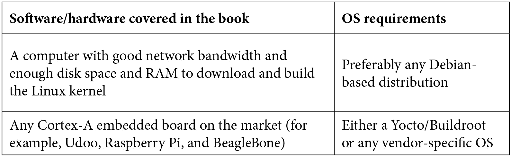

# 前言

Linux 是世界上增长最快的操作系统之一，在过去几年里，Linux 内核已经显著发展，以支持各种嵌入式设备，具有改进的子系统和许多新功能。

《精通 Linux 设备驱动开发》全面涵盖了诸如视频和音频框架等内核主题，这些通常被忽视。您将深入研究一些最复杂和有影响力的 Linux 内核框架，如 PCI、用于 SoC 的 ALSA 和 Video4Linux2，途中获得专家建议和最佳实践。除此之外，您还将学习如何利用 NVMEM 和 Watchdog 等框架。一旦本书带您开始使用 Linux 内核助手，您将逐渐进展到处理特殊设备类型，如多功能设备（MFDs），然后是视频和音频设备驱动。

通过本书，您将能够编写稳健的设备驱动程序，并将它们集成到一些最复杂的 Linux 内核框架中，包括 V4L2 和 ALSA SoC。

# 这本书适合谁

这本书主要面向嵌入式爱好者和开发人员、Linux 系统管理员和内核黑客。无论您是软件开发人员、系统架构师还是制造商（电子爱好者），希望深入了解 Linux 驱动程序开发，本书都适合您。

# 本书涵盖的内容

《第一章》，《嵌入式开发人员的 Linux 内核概念》，介绍了 Linux 内核助手，用于锁定、阻塞 I/O、推迟工作和中断管理。

《第二章》，《利用 Regmap API 简化代码》，概述了 Regmap 框架，并向您展示如何利用其 API 来简化中断管理和抽象寄存器访问。

《第三章》，《深入 MFD 子系统和 Syscon API》，专注于 Linux 内核中的 MFD 驱动程序、它们的 API 和结构，以及介绍了`syscon`和`simple-mfd`助手。

《第四章》，《冲击通用时钟框架》，解释了 Linux 内核时钟框架，并探讨了生产者和消费者设备驱动程序，以及它们的设备树绑定。

《第五章》，《ALSA SoC 框架-利用编解码器和平台类驱动程序》，讨论了编解码器和平台设备的 ALSA 驱动程序开发，并介绍了`kcontrol`和数字音频电源管理（DAPM）等概念。

《第六章》，《ALSA SoC 框架-深入机器类驱动程序》，深入介绍了 ALSA 机器类驱动程序的开发，并向您展示了如何将编解码器和平台绑定在一起，以及如何定义音频路由。

《第七章》，《揭秘 V4L2 和视频捕获设备驱动程序》，描述了 V4L2 的关键概念。它专注于桥接视频设备，介绍了子设备的概念，并涵盖了它们各自的设备驱动程序。

《第八章》，《与 V4L2 异步和媒体控制器框架集成》，介绍了异步探测的概念，这样您就不必关心桥接和子设备的探测顺序。最后，本章介绍了媒体控制器框架，以提供视频路由和视频管道定制。

《第九章》，《从用户空间利用 V4L2 API》，结束了我们关于 V4L2 的教学系列，并处理了来自用户空间的 V4L2。它首先教您如何编写 C 代码，以打开、配置和抓取视频设备的数据。然后，它向您展示如何通过利用用户空间的视频相关工具，如`v4l2-ctl`和`media-ctl`，尽可能少地编写代码。

第十章 Linux Kernel Power Management 讨论了基于 Linux 的系统的电源管理，并教你如何编写具有电源感知能力的设备驱动程序。

第十一章 Writing PCI Device Drivers 处理 PCI 子系统，并向你介绍了它的 Linux 内核实现。本章还向你展示了如何编写 PCI 设备驱动程序。

第十二章 Leveraging the NVMEM Framework 描述了 Linux Non-Volatile Memory (NVEM)子系统。它首先教你如何编写提供者和消费者驱动程序以及它们的设备树绑定。然后，它向你展示如何从用户空间充分利用设备。

第十三章 Watchdog Device Drivers 提供了对 Linux 内核看门狗子系统的准确描述。它首先向你介绍了看门狗设备驱动程序，并逐渐带你深入子系统的核心，介绍了一些关键概念，如预超时和管理者。最后，本章教你如何从用户空间管理子系统。

第十四章 Linux Kernel Debugging Tips and Best Practices 突出显示了使用内核嵌入式工具（如 ftrace 和 oops 消息分析）的最常用的 Linux 内核调试和跟踪技术。

# 为了充分利用本书

为了充分利用本书，需要一定的 C 和系统编程知识。此外，本书的内容假定你熟悉 Linux 系统及其大部分基本命令。



在前面的表中未列出的任何必要软件包将在各自的章节中进行描述。

**如果你使用本书的数字版本，我们建议你自己输入代码。这样做将帮助你避免与复制和粘贴代码相关的潜在错误。**

# 下载彩色图片

我们还提供了一个 PDF 文件，其中包含本书中使用的屏幕截图/图表的彩色图像。你可以在这里下载：http://www.packtpub.com/sites/default/files/downloads/9781789342048_ColorImages.pdf。

# 使用的约定

本书中使用了许多文本约定。

`文本中的代码`：表示文本中的代码单词、数据库表名、文件夹名、文件名、文件扩展名、路径名、虚拟 URL、用户输入和 Twitter 句柄。这里有一个例子：“这里没有使用 request_irq()家族方法请求父 IRQ，因为 gpiochip_set_chained_irqchip()将在幕后调用 irq_set_chained_handler_and_data()。”

一段代码设置如下：

```
static int fake_probe(struct i2c_client *client,                       const struct i2c_device_id *id)
{
    [...]
    mutex_init(&data->mutex);
    [...]
}
```

当我们希望引起你对代码块的特定部分的注意时，相关行或项目将以粗体显示：

```
static int __init my_init(void)
{
    pr_info('Wait queue example\n');
    INIT_WORK(&wrk, work_handler);
    schedule_work(&wrk);
    pr_info('Going to sleep %s\n', __FUNCTION__);
 wait_event_interruptible(my_wq, condition != 0);
    pr_info('woken up by the work job\n');
    return 0;}
```

任何命令行输入或输出都以以下方式编写：

```
# echo 1 >/sys/module/printk/parameters/time
# cat /sys/module/printk/parameters/time
```

**粗体**：表示新术语、重要单词或屏幕上看到的单词。这里有一个例子：“引入了 simple-mfd 助手来处理零配置/黑客子设备注册，并且引入了 syscon 来与其他设备共享设备的内存区域。”

提示或重要说明

看起来像这样。

# 联系我们

我们始终欢迎读者的反馈。

customercare@packtpub.com。

**勘误**：尽管我们已经尽一切努力确保内容的准确性，但错误是难免的。如果你在本书中发现了错误，我们将不胜感激地接受你的报告。请访问 www.packtpub.com/support/errata，选择你的书，点击勘误提交表格链接，并输入详细信息。

copyright@packt.com，附上材料的链接。

**如果您有兴趣成为作者**：如果您在某个专业领域有专长，并且有兴趣撰写或为一本书作出贡献，请访问 [authors.packtpub.com](http://authors.packtpub.com)。

# 评论

请留下评论。在您阅读并使用了这本书之后，为什么不在购买书籍的网站上留下一条评论呢？潜在的读者可以看到并使用您的客观意见来做出购买决定，我们在 Packt 可以了解您对我们产品的看法，而我们的作者也可以看到您对他们书籍的反馈。谢谢！

有关 Packt 的更多信息，请访问 [packt.com](http://packt.com)。
