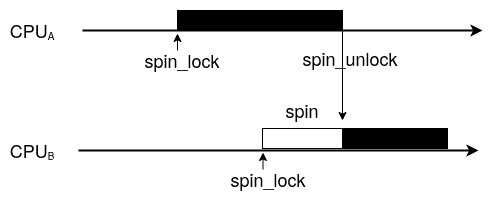
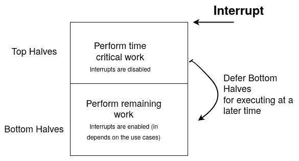

# 第一章：嵌入式开发人员的 Linux 内核概念

作为一个独立的软件，Linux 内核实现了一组函数，有助于避免重复发明轮子，并简化设备驱动程序的开发。这些辅助程序的重要性在于，不需要使用这些代码才能被上游接受。这是驱动程序依赖的内核核心。我们将在本书中介绍这些核心功能中最受欢迎的功能，尽管还有其他功能存在。我们将首先查看内核锁定 API，然后讨论如何保护共享对象并避免竞争条件。然后，我们将看看各种可用的工作推迟机制，您将了解在哪个执行上下文中推迟代码的部分。最后，您将学习中断的工作原理以及如何从 Linux 内核内部设计中断处理程序。

本章将涵盖以下主题：

+   内核锁定 API 和共享对象

+   工作推迟机制

+   Linux 内核中断管理

让我们开始吧！

# 技术要求

要理解和遵循本章的内容，您将需要以下内容：

+   高级计算机体系结构知识和 C 编程技能

+   Linux 内核 4.19 源代码，可在[`github.com/torvalds/linux`](https://github.com/torvalds/linux)上获得

# 内核锁定 API 和共享对象

当可以被多个竞争者访问时，资源被称为共享资源，而不管它们的独占性。当它们是独占的时，访问必须同步，以便只有允许的竞争者可以拥有资源。这样的资源可能是内存位置或外围设备，而竞争者可能是处理器、进程或线程。操作系统通过原子地（即通过可以被中断的操作）修改持有资源当前状态的变量来执行互斥排除，使这一点对所有可能同时访问变量的竞争者可见。这种原子性保证修改要么成功，要么根本不成功。如今，现代操作系统依赖于硬件（应该允许原子操作）用于实现同步，尽管一个简单的系统可以通过在关键代码部分周围禁用中断（并避免调度）来确保原子性。

在本节中，我们将描述以下两种同步机制：

+   **锁**：用于互斥。当一个竞争者持有锁时，其他竞争者无法持有它（其他被排除）。内核中最知名的锁定原语是自旋锁和互斥锁。

+   **条件变量**：主要用于感知或等待状态改变。这些在内核中实现方式不同，我们稍后将看到，主要在*Linux 内核中的等待、感知和阻塞*部分中。

当涉及到锁定时，硬件允许通过原子操作进行同步。然后内核使用这些来实现锁定设施。同步原语是用于协调对共享资源访问的数据结构。因为只有一个竞争者可以持有锁（从而访问共享资源），它可能对与锁相关的资源执行任意操作，这对其他人来说似乎是原子的。

除了处理给定共享资源的独占所有权外，还存在一些情况更好地等待资源状态改变；例如，等待列表包含至少一个对象（其状态从空变为非空）或等待任务完成（例如 DMA 事务）。Linux 内核不实现条件变量。从用户空间，我们可以考虑在这两种情况下使用条件变量，但为了实现相同或甚至更好的效果，内核提供了以下机制：

+   **等待队列**：主要用于等待状态改变。它被设计为与锁协同工作。

+   **完成队列**：用于等待给定计算的完成。

这两种机制都受到 Linux 内核的支持，并且由于一组较少的 API（在开发人员使用时显著简化了它们的使用），它们暴露给驱动程序。我们将在接下来的部分讨论这些。

## 自旋锁

自旋锁是一种基于硬件的锁原语。它依赖于手头的硬件提供原子操作的能力（例如`test_and_set`，在非原子实现中，将导致读取、修改和写入操作）。自旋锁基本上用于不允许睡眠或根本不需要睡眠的原子上下文中（例如在中断中，或者当您想要禁用抢占时），但也用作 CPU 间的锁原语。

这是最简单的锁原语，也是基本的锁原语。它的工作方式如下：



图 1.1 - 自旋锁争用流

让我们通过以下场景来探讨图表：当运行任务 B 的 CPUB 想要通过自旋锁的锁定函数获取自旋锁，而该自旋锁已经被另一个 CPU（比如运行任务 A 的 CPUA，已经调用了该自旋锁的锁定函数）持有时，CPUB 将简单地在一个 while 循环中旋转，从而阻塞任务 B，直到另一个 CPU 释放锁（任务 A 调用自旋锁的释放函数）。这种旋转只会发生在多核机器上，这就是为什么先前描述的使用情况，涉及多个 CPU，因为它是在单核机器上，是不可能发生的：任务要么持有自旋锁并继续，要么在锁被释放之前不运行。我曾经说过自旋锁是由 CPU 持有的锁，这与互斥锁相反（我们将在下一节讨论），互斥锁是由任务持有的锁。自旋锁通过禁用本地 CPU 上的调度程序（即运行调用自旋锁的任务的 CPU）来运行。这也意味着当前在该 CPU 上运行的任务不能被另一个任务抢占，除非 IRQs 未被禁用（稍后会详细介绍）。换句话说，自旋锁保护只有一个 CPU 可以一次获取/访问的资源。这使得自旋锁适用于 SMP 安全和执行原子任务。

重要提示

自旋锁并不是唯一利用硬件原子功能的实现。例如，在 Linux 内核中，抢占状态取决于每个 CPU 变量，如果等于 0，则表示抢占已启用。然而，如果大于 0，则表示抢占已禁用（`schedule()`变得无效）。因此，禁用抢占（`preempt_disable()`）包括向当前 CPU 变量（实际上是`preempt_count`）添加 1，而`preempt_enable()`则从变量中减去 1，并检查新值是否为 0，然后调用`schedule()`。这些加法/减法操作应该是原子的，因此依赖于 CPU 能够提供原子加法/减法功能。

有两种方法可以创建和初始化自旋锁：一种是静态地使用`DEFINE_SPINLOCK`宏，它将声明并初始化自旋锁，另一种是通过在未初始化的自旋锁上调用`spin_lock_init()`来动态创建。

首先，我们将介绍如何使用`DEFINE_SPINLOCK`宏。要理解这是如何工作的，我们必须查看`include/linux/spinlock_types.h`中此宏的定义，如下所示：

```
#define DEFINE_SPINLOCK(x) spinlock_t x = __SPIN_LOCK_UNLOCKED(x)
```

可以如下使用：

```
static DEFINE_SPINLOCK(foo_lock)
```

在此之后，自旋锁将通过其名称`foo_lock`可访问。请注意，其地址将是`&foo_lock`。然而，对于动态（运行时）分配，您需要将自旋锁嵌入到一个更大的结构中，为该结构分配内存，然后在自旋锁元素上调用`spin_lock_init()`：

```
struct bigger_struct {    spinlock_t lock;    unsigned int foo;    [...]};
static struct bigger_struct *fake_alloc_init_function(){    struct bigger_struct *bs;    bs = kmalloc(sizeof(struct bigger_struct), GFP_KERNEL);    if (!bs)        return -ENOMEM;    spin_lock_init(&bs->lock);    return bs;}
```

尽可能使用`DEFINE_SPINLOCK`更好。它提供了编译时初始化，并且需要更少的代码行而没有真正的缺点。在这个阶段，我们可以使用`spin_lock()`和`spin_unlock()`内联函数来锁定/解锁自旋锁，这两个函数都在`include/linux/spinlock.h`中定义：

```
void spin_unlock(spinlock_t *lock)
void spin_lock(spinlock_t *lock)
```

也就是说，使用自旋锁的这种方式存在一些限制。虽然自旋锁可以防止本地 CPU 的抢占，但它不能阻止这个 CPU 被中断占用（从而执行这个中断的处理程序）。想象一种情况，CPU 持有一个“自旋锁”来保护一个给定的资源，然后发生了一个中断。CPU 将停止当前的任务并转到这个中断处理程序。到目前为止，一切都好。现在，想象一下，这个 IRQ 处理程序需要获取相同的自旋锁（你可能已经猜到这个资源与中断处理程序共享）。它将无限地在原地旋转，试图获取一个已经被它抢占的任务锁。这种情况被称为死锁。

为了解决这个问题，Linux 内核为自旋锁提供了`_irq`变体函数，除了禁用/启用抢占之外，还在本地 CPU 上禁用/启用中断。这些函数是`spin_lock_irq()`和`spin_unlock_irq()`，定义如下：

```
void spin_unlock_irq(spinlock_t *lock);
void spin_lock_irq(spinlock_t *lock);
```

你可能会认为这个解决方案已经足够了，但事实并非如此。`_irq`变体只能部分解决这个问题。想象一下，在处理器上已经禁用了中断，然后你的代码开始锁定。所以，当你调用`spin_unlock_irq()`时，你不仅会释放锁，还会启用中断。然而，这可能会以错误的方式发生，因为`spin_unlock_irq()`无法知道在锁定之前哪些中断被启用，哪些没有被启用。

以下是一个简短的示例：

1.  假设在获取自旋锁之前，中断*x*和*y*已经被禁用，而*z*没有。

1.  `spin_lock_irq()`将禁用中断（*x*、*y*和*z*现在都被禁用）并获取锁。

1.  `spin_unlock_irq()`将启用中断。*x*、*y*和*z*都将被启用，这在获取锁之前并不是这样。这就是问题所在。

当从关闭上下文调用时，`spin_lock_irq()`是不安全的，因为它的对应函数`spin_unlock_irq()`会天真地启用中断，有可能启用那些在调用`spin_lock_irq()`时没有启用的中断。只有在你知道中断被启用时才有意义使用`spin_lock_irq()`；也就是说，你确定没有其他东西可能在本地 CPU 上禁用了中断。

现在，想象一下，在获取锁之前将中断的状态保存在一个变量中，并在释放锁时将它们恢复到获取锁时的状态。在这种情况下，就不会再有问题了。为了实现这一点，内核提供了`_irqsave`变体函数。这些函数的行为就像`_irq`函数一样，同时保存和恢复中断状态。这些函数是`spin_lock_irqsave()`和`spin_lock_irqrestore()`，定义如下：

```
spin_lock_irqsave(spinlock_t *lock, unsigned long flags)
spin_unlock_irqrestore(spinlock_t *lock, unsigned long flags)
```

重要说明

`spin_lock()`及其所有变体会自动调用`preempt_disable()`，在本地 CPU 上禁用抢占。另一方面，`spin_unlock()`及其变体会调用`preempt_enable()`，尝试启用（是的，尝试！- 这取决于其他自旋锁是否被锁定，这将影响抢占计数器的值）抢占，并在启用时（取决于计数器的当前值，应该为 0）内部调用`schedule()`。`spin_unlock()`然后是一个抢占点，可能重新启用抢占。

### 禁用中断与仅禁用抢占

尽管禁用中断可以防止内核抢占（调度程序的定时器中断将被禁用），但没有什么可以阻止受保护的部分调用调度程序（`schedule()`函数）。许多内核函数间接调用调度程序，例如处理自旋锁的函数。因此，即使是一个简单的`printk()`函数也可能调用调度程序，因为它处理保护内核消息缓冲区的自旋锁。内核通过增加或减少一个称为`preempt_count`的全局和每个 CPU 变量（默认为 0，表示“启用”）来禁用或启用调度程序（执行抢占）。当这个变量大于 0 时（由`schedule()`函数检查），调度程序简单地返回并不执行任何操作。每次调用与`spin_lock*`相关的帮助程序时，这个变量都会增加 1。另一方面，释放自旋锁（任何`spin_unlock*`系列函数）会将其减少 1，每当它达到 0 时，调度程序就会被调用，这意味着你的临界区不会是非常原子的。

因此，如果你的代码本身不触发抢占，它只能通过禁用中断来防止抢占。也就是说，锁定自旋锁的代码可能不会休眠，因为没有办法唤醒它（记住，定时器中断和调度程序在本地 CPU 上被禁用）。

现在我们已经熟悉了自旋锁及其细微差别，让我们来看看互斥锁，这是我们的第二个锁原语。

## 互斥锁

互斥锁是本章讨论的另一种锁原语。它的行为就像自旋锁一样，唯一的区别是你的代码可以休眠。如果你尝试锁定一个已经被另一个任务持有的互斥锁，你的任务将被挂起，只有在互斥锁被释放时才会被唤醒。这次没有自旋，这意味着 CPU 可以在你的任务等待时处理其他事情。正如我之前提到的，*自旋锁是由 CPU 持有的锁，而互斥锁是由任务持有的锁*。

互斥锁是一个简单的数据结构，嵌入了一个等待队列（用于让竞争者休眠），而自旋锁则保护对这个等待队列的访问。以下是`struct mutex`的样子：

```
struct mutex {
    atomic_long_t owner;
    spinlock_t wait_lock;
#ifdef CONFIG_MUTEX_SPIN_ON_OWNER
    struct optimistic_spin_queue osq; /* Spinner MCS lock */
#endif
    struct list_head wait_list;
[...]
};
```

在上面的代码中，为了可读性，仅在调试模式下使用的元素已被删除。但是，正如你所看到的，互斥锁是建立在自旋锁之上的。`owner`表示实际拥有（持有）锁的进程。`wait_list`是互斥锁的竞争者被放置在其中休眠的列表。`wait_lock`是保护`wait_list`的自旋锁，当竞争者被插入并休眠时，它有助于保持`wait_list`在 SMP 系统上的一致性。

互斥锁的 API 可以在`include/linux/mutex.h`头文件中找到。在获取和释放互斥锁之前，必须对其进行初始化。与其他内核核心数据结构一样，可能存在静态初始化，如下所示：

```
static DEFINE_MUTEX(my_mutex);
```

以下是`DEFINE_MUTEX()`宏的定义：

```
#define DEFINE_MUTEX(mutexname) \
        struct mutex mutexname = __MUTEX_INITIALIZER(mutexname)
```

内核提供的第二种方法是动态初始化。这可以通过调用底层的`__mutex_init()`函数来实现，实际上这个函数被一个更加用户友好的宏`mutex_init()`所包装：

```
struct fake_data {
    struct i2c_client *client;
    u16 reg_conf;
    struct mutex mutex;
};
static int fake_probe(struct i2c_client *client,                       const struct i2c_device_id *id)
{
    [...]
    mutex_init(&data->mutex);
    [...]
}
```

获取（也称为锁定）互斥锁就像调用以下三个函数之一那样简单：

```
void mutex_lock(struct mutex *lock);
int mutex_lock_interruptible(struct mutex *lock);
int mutex_lock_killable(struct mutex *lock);
```

如果互斥锁是空闲的（未锁定），您的任务将立即获取它而不会进入睡眠状态。否则，您的任务将以取决于您使用的锁定函数的方式进入睡眠。使用`mutex_lock()`时，您的任务将进入不可中断的睡眠状态（`TASK_UNINTERRUPTIBLE`），直到等待互斥锁被释放（如果它被另一个任务持有）。`mutex_lock_interruptible()`将使您的任务进入可中断的睡眠状态，其中睡眠可以被任何信号中断。`mutex_lock_killable()`将允许您的任务的睡眠被中断，但只能被实际杀死任务的信号中断。这两个函数在成功获取锁时返回零。此外，可中断的变体在锁定尝试被信号中断时返回`-EINTR`。

无论使用哪种锁定函数，互斥锁所有者（仅所有者）应使用`mutex_unlock()`释放互斥锁，其定义如下：

```
void mutex_unlock(struct mutex *lock);
```

如果您希望检查互斥锁的状态，可以使用`mutex_is_locked()`：

```
static bool mutex_is_locked(struct mutex *lock)
```

此函数只是检查互斥锁所有者是否为`NULL`，如果是，则返回 true，否则返回 false。

重要说明

只有在可以保证互斥锁不会长时间持有时才建议使用`mutex_lock()`。通常情况下，应该使用可中断的变体。

在使用互斥锁时有特定的规则。最重要的规则在内核的互斥锁 API 头文件`include/linux/mutex.h`中列出。以下是其中的一部分摘录：

```
 * - only one task can hold the mutex at a time
 * - only the owner can unlock the mutex
 * - multiple unlocks are not permitted
 * - recursive locking is not permitted
 * - a mutex object must be initialized via the API
 * - a mutex object must not be initialized via memset or      copying
 * - task may not exit with mutex held
 * - memory areas where held locks reside must not be freed
 * - held mutexes must not be reinitialized
 * - mutexes may not be used in hardware or software interrupt
 *   contexts such as tasklets and timers
```

完整版本可以在同一文件中找到。

现在，让我们看一些情况，我们可以避免在持有锁时将互斥锁置于睡眠状态。这被称为尝试锁定方法。

## 尝试锁定方法

有时我们可能需要获取锁，如果它不是由其他地方持有的话。这样的方法尝试获取锁并立即返回一个状态值（如果我们使用自旋锁，则不会自旋，如果我们使用互斥锁，则不会休眠）。这告诉我们锁是否已成功锁定。如果我们不需要在其他线程持有锁时访问被保护的数据，可以使用它们。

自旋锁和互斥锁 API 都提供了尝试锁定方法。它们分别称为`spin_trylock()`和`mutex_trylock()`。这两种方法在失败时（锁已被锁定）返回 0，在成功时（锁已获取）返回 1。因此，使用这些函数与语句是有意义的：

```
int mutex_trylock(struct mutex *lock)
```

`spin_trylock()`实际上是针对自旋锁的。如果自旋锁尚未被锁定，它将锁定自旋锁，方式与`spin_lock()`方法相同。但是，如果自旋锁已经被锁定，它将立即返回`0`而不会自旋：

```
static DEFINE_SPINLOCK(foo_lock);
[...]
static void foo(void)
{
[...]
    if (!spin_trylock(&foo_lock)) {        /* Failure! the spinlock is already locked */        [...]        return;    }
    /*     * reaching this part of the code means        that the      * spinlock has been successfully locked      */
[...]
    spin_unlock(&foo_lock);
[...]
}
```

另一方面，`mutex_trylock()`是针对互斥锁的。如果互斥锁尚未被锁定，它将以与`mutex_lock()`方法相同的方式锁定互斥锁。但是，如果互斥锁已经被锁定，它将立即返回`0`而不会休眠。以下是一个示例：

```
static DEFINE_MUTEX(bar_mutex);[...]
static void bar (void){
[...]    if (!mutex_trylock(&bar_mutex))        /* Failure! the mutex is already locked */        [...]        return;    }
    /*     * reaching this part of the code means that the mutex has      * been successfully locked      */
[...]    mutex_unlock(&bar_mutex);[...]
}
```

在上述代码中，使用了尝试锁定以及`if`语句，以便驱动程序可以调整其行为。

## 在 Linux 内核中等待、感知和阻塞

这一部分本来可以被命名为*内核睡眠机制*，因为我们将处理的机制涉及将涉及的进程置于睡眠状态。设备驱动程序在其生命周期中可以启动完全独立的任务，其中一些任务依赖于其他任务的完成。Linux 内核使用`struct completion`项来解决这种依赖关系。另一方面，可能需要等待特定条件成为真或对象状态发生变化。这时，内核提供工作队列来解决这种情况。

### 等待完成或状态改变

您可能不一定是在专门等待资源，而是等待给定对象（共享或非共享）的状态改变或任务完成。在内核编程实践中，通常会在当前线程之外启动一个活动，然后等待该活动完成。当您等待缓冲区被使用时，完成是 `sleep()` 的一个很好的替代方案，例如。它适用于传感数据，就像 DMA 传输一样。使用完成需要包括 `<linux/completion.h>` 头文件。其结构如下：

```
struct completion {
    unsigned int done;
    wait_queue_head_t wait;
};
```

您可以使用静态的 `DECLARE_COMPLETION(my_comp)` 函数静态地创建结构完成的实例，也可以通过将完成结构包装到动态数据结构中（在堆上分配，将在函数/驱动程序的生命周期内保持活动状态）并调用 `init_completion(&dynamic_object->my_comp)` 来动态创建。当设备驱动程序执行一些工作（例如 DMA 事务）并且其他人（例如线程）需要被通知它们已经完成时，等待者必须在先前初始化的结构完成对象上调用 `wait_for_completion()` 以便得到通知：

```
void wait_for_completion(struct completion *comp);
```

当代码的另一部分已经决定工作已经完成（在 DMA 的情况下，事务已经完成），它可以通过调用 `complete()` 来唤醒任何等待的人（需要访问 DMA 缓冲区的代码），这将只唤醒一个等待的进程，或者调用 `complete_all()`，这将唤醒所有等待完成的人：

```
void complete(struct completion *comp);
void complete_all(struct completion *comp);
```

典型的使用场景如下（此摘录摘自内核文档）：

```
CPU#1							CPU#2
struct completion setup_done;
init_completion(&setup_done);
initialize_work(...,&setup_done,...);
/* run non-dependent code */ 		/* do some setup */
[...]							[...]
wait_for_completion(&setup_done); 		complete(setup_done);
```

`wait_for_completion()` 和 `complete()` 被调用的顺序并不重要。与信号量一样，完成 API 被设计成，即使在 `complete()` 被调用之前调用 `wait_for_completion()`，它们也能正常工作。在这种情况下，一旦所有依赖关系得到满足，等待者将立即继续执行。

请注意，`wait_for_completion()` 将调用 `spin_lock_irq()` 和 `spin_unlock_irq()`，根据 *自旋锁* 部分的说明，不建议在中断处理程序内部或禁用 IRQs 时使用它们。这是因为它会导致启用难以检测的虚假中断。另外，默认情况下，`wait_for_completion()` 将任务标记为不可中断 (`TASK_UNINTERRUPTIBLE`)，使其对任何外部信号（甚至 kill 信号）都不响应。这可能会根据它等待的活动的性质而阻塞很长时间。

您可能需要 *等待* 不是在不可中断状态下完成，或者至少您可能需要 *等待* 能够被任何信号中断，或者只能被杀死进程的信号中断。内核提供了以下 API：

+   `wait_for_completion_interruptible()`

+   `wait_for_completion_interruptible_timeout()`

+   `wait_for_completion_killable()`

+   `wait_for_completion_killable_timeout()`

`_killable` 变体将任务标记为 `TASK_KILLABLE`，因此只会对真正杀死它的信号做出响应，而 `_interruptible` 变体将任务标记为 `TASK_INTERRUPTIBLE`，允许它被任何信号中断。 `_timeout` 变体将最多等待指定的超时时间：

```
int wait_for_completion_interruptible(struct completion *done)
long wait_for_completion_interruptible_timeout(
           struct completion *done, unsigned long timeout)
long wait_for_completion_killable(struct completion *done)
long wait_for_completion_killable_timeout(           struct completion *done, unsigned long timeout)
```

由于`wait_for_completion*()`可能会休眠，因此只能在此进程上下文中使用。因为`interruptible`、`killable`或`timeout`变体可能在底层作业完成之前返回，所以应该仔细检查它们的返回值，以便采取正确的行为。可杀死和可中断的变体如果被中断则返回`-ERESTARTSYS`，如果已完成则返回`0`。另一方面，超时变体将在被中断时返回`-ERESTARTSYS`，在超时时返回`0`，在超时之前完成则返回剩余的 jiffies 数（至少为 1）。有关更多信息，请参阅内核源代码中的`kernel/sched/completion.c`，以及本书中未涵盖的更多函数。

另一方面，`complete()`和`complete_all()`永远不会休眠，并且在内部调用`spin_lock_irqsave()`/`spin_unlock_irqrestore()`，使得从 IRQ 上下文中进行完成信号完全安全。

### Linux 内核等待队列

等待队列是用于处理块 I/O、等待特定条件成立、等待特定事件发生或感知数据或资源可用性的高级机制。要了解它们的工作原理，让我们来看看`include/linux/wait.h`中的结构：

```
struct wait_queue_head {
    spinlock_t lock;
    struct list_head head;
};
```

`等待队列`只是一个列表（其中进程被放入休眠，以便在满足某些条件时唤醒）的名称，其中有一个自旋锁来保护对该列表的访问。当多个进程希望休眠并且正在等待一个或多个事件发生时，可以使用`等待队列`。头成员是等待事件的进程列表。希望在等待事件发生时休眠的每个进程都会在进入休眠之前将自己放入此列表中。当进程在列表中时，它被称为`等待队列条目`。当事件发生时，列表中的一个或多个进程将被唤醒并移出列表。我们可以以两种方式声明和初始化`等待队列`。首先，我们可以使用`DECLARE_WAIT_QUEUE_HEAD`静态声明和初始化它，如下所示：

```
DECLARE_WAIT_QUEUE_HEAD(my_event);
```

我们还可以使用`init_waitqueue_head()`来动态执行此操作：

```
wait_queue_head_t my_event;
init_waitqueue_head(&my_event);
```

任何希望在等待`my_event`发生时休眠的进程都可以调用`wait_event_interruptible()`或`wait_event()`。大多数情况下，事件只是资源已经可用的事实。因此，只有在检查资源的可用性之后，进程才会进入休眠状态。为了方便您，这些函数都接受一个表达式作为第二个参数，因此只有在表达式评估为假时，进程才会进入休眠状态：

```
wait_event(&my_event, (event_occurred == 1) );
/* or */
wait_event_interruptible(&my_event, (event_occurred == 1) );
```

`wait_event()`和`wait_event_interruptible()`在调用时简单地评估条件。如果条件为假，则进程将被放入`TASK_UNINTERRUPTIBLE`或`TASK_INTERRUPTIBLE`（对于`_interruptible`变体）状态，并从运行队列中移除。

可能存在这样的情况，您不仅需要条件为真，而且还需要在等待一定时间后超时。您可以使用`wait_event_timeout()`来处理这种情况，其原型如下：

```
wait_event_timeout(wq_head, condition, timeout)
```

此函数具有两种行为，取决于超时是否已经过去：

1.  `timeout`已经过去：如果条件评估为假，则函数返回 0，如果评估为真，则返回 1。

1.  `timeout`尚未过去：如果条件评估为真，则函数返回剩余时间（以 jiffies 为单位，必须至少为 1）。

超时的时间单位是`jiffies`。因此，您不必担心将秒转换为`jiffies`，您应该使用`msecs_to_jiffies()`和`usecs_to_jiffies()`辅助函数，分别将毫秒或微秒转换为`jiffies`：

```
unsigned long msecs_to_jiffies(const unsigned int m)
unsigned long usecs_to_jiffies(const unsigned int u)
```

在更改可能破坏等待条件结果的任何变量后，必须调用适当的`wake_up*`系列函数。也就是说，为了唤醒在等待队列上休眠的进程，您应该调用`wake_up()`、`wake_up_all()`、`wake_up_interruptible()`或`wake_up_interruptible_all()`中的任何一个。每当调用这些函数时，条件都会被重新评估。如果此时条件为真，则等待队列中的进程（或`_all()`变体的所有进程）将被唤醒，并且其状态将被设置为`TASK_RUNNING`；否则（条件为假），什么也不会发生。

```
/* wakes up only one process from the wait queue. */
wake_up(&my_event);
/* wakes up all the processes on the wait queue. */
wake_up_all(&my_event);:
/* wakes up only one process from the wait queue that is in  * interruptible sleep. 
 */ 
wake_up_interruptible(&my_event)
/* wakes up all the processes from the wait queue that
 * are in interruptible sleep.
 */
wake_up_interruptible_all(&my_event);
```

由于它们可以被信号中断，您应该检查`_interruptible`变体的返回值。非零值意味着您的睡眠已被某种信号中断，因此驱动程序应返回`ERESTARTSYS`。

```
#include <linux/module.h>#include <linux/init.h>#include <linux/sched.h>#include <linux/time.h>#include <linux/delay.h>#include<linux/workqueue.h>
static DECLARE_WAIT_QUEUE_HEAD(my_wq);static int condition = 0;
/* declare a work queue*/static struct work_struct wrk;
static void work_handler(struct work_struct *work)
{
    pr_info(“Waitqueue module handler %s\n”, __FUNCTION__);
    msleep(5000);
    pr_info(“Wake up the sleeping module\n”);
    condition = 1;
    wake_up_interruptible(&my_wq);
}
static int __init my_init(void)
{
    pr_info(“Wait queue example\n”);
    INIT_WORK(&wrk, work_handler);
    schedule_work(&wrk);
    pr_info(“Going to sleep %s\n”, __FUNCTION__);
    wait_event_interruptible(my_wq, condition != 0);
    pr_info(“woken up by the work job\n”);
    return 0;}
void my_exit(void)
{
    pr_info(“waitqueue example cleanup\n”);
}
module_init(my_init);module_exit(my_exit);MODULE_AUTHOR(“John Madieu <john.madieu@labcsmart.com>”);MODULE_LICENSE(“GPL”);
```

在前面的示例中，当前进程（实际上，这是`insmod`）将在等待队列中休眠 5 秒，并由工作处理程序唤醒。`dmesg`的输出如下：

```
[342081.385491] Wait queue example
[342081.385505] Going to sleep my_init
[342081.385515] Waitqueue module handler work_handler
[342086.387017] Wake up the sleeping module
[342086.387096] woken up by the work job
[342092.912033] waitqueue example cleanup
```

您可能已经注意到，我没有检查`wait_event_interruptible()`的返回值。有时（如果不是大多数时候），这可能会导致严重问题。以下是一个真实的故事：我曾经不得不介入一家公司来修复一个 bug，即杀死（或向）用户空间任务发送信号会使他们的内核模块使系统崩溃（恐慌和重启-当然，系统被配置为在恐慌时重新启动）。发生这种情况的原因是因为这个用户进程中有一个线程在其内核模块公开的`char`设备上执行`ioctl()`。这导致内核中对给定标志的`wait_event_interruptible()`的调用，这意味着内核中需要处理一些数据（不能使用`select()`系统调用）。

那么，他们的错误是什么？发送给进程的信号使`wait_event_interruptible()`返回而没有设置标志（这意味着数据仍然不可用），它的代码没有检查其返回值，也没有重新检查标志或对应该可用的数据进行合理性检查。数据被访问，就好像标志已经被设置，并且实际上对一个无效的指针进行了解引用。

解决方案可能只需使用以下代码：

```
if (wait_event_interruptible(...)){
    pr_info(“catching a signal supposed make us crashing\n”);
    /* handle this case and do not access data */
    [….]
} else {
     /* accessing data and processing it */
    […]
}
```

然而，由于某种原因（与他们的设计有关），我们不得不使其不可中断，这导致我们使用了`wait_event()`。但是，请注意，此函数将进程置于独占等待状态（不可中断睡眠），这意味着它不能被信号中断。它应该只用于关键任务。在大多数情况下建议使用可中断函数。

现在我们熟悉了内核锁定 API，我们将看一下各种工作推迟机制，这些机制在编写 Linux 设备驱动程序时被广泛使用。

# 工作推迟机制

工作推迟是 Linux 内核提供的一种机制。它允许您推迟工作/任务，直到系统的工作负载允许它平稳运行或经过一定的时间。根据工作的类型，延迟任务可以在进程上下文或原子上下文中运行。通常使用工作推迟来补充中断处理程序，以弥补其中一些限制，其中一些如下：

+   中断处理程序必须尽可能快，这意味着处理程序中只能执行关键任务，以便其余任务在系统不太忙时稍后推迟。

+   在中断上下文中，我们不能使用阻塞调用。睡眠任务应该在进程上下文中被调度。

延迟工作机制允许我们在中断处理程序中执行尽可能少的工作（所谓的*top-half*），并安排一个异步操作（所谓的*bottom-half*），以便稍后可以运行并执行其余的操作。现在，底半部分的概念大多被吸收到在进程上下文中运行的延迟工作中，因为常见的是安排可能休眠的工作（与在中断上下文中运行的罕见工作不同，后者不会发生）。Linux 现在有三种不同的实现：**softIRQs**，**tasklets**和**work queues**。让我们来看看这些：

+   **SoftIRQs**：这些在原子上下文中执行。

+   **Tasklets**：这些也在原子上下文中执行。

+   **Work queues**：这些在进程上下文中运行。

我们将在接下来的几节中详细了解每一个。

## SoftIRQs

顾名思义，`kernel/softirq.c`在内核源树中，任何希望使用此 API 的驱动程序都需要包含`<linux/interrupt.h>`。

请注意，您不能动态注册或销毁 softIRQ。它们在编译时静态分配。此外，softIRQ 的使用受到静态编译内核代码的限制；它们不能与动态可加载模块一起使用。SoftIRQ 由`<linux/interrupt.h>`中定义的`struct softirq_action`结构表示，如下所示：

```
struct softirq_action {
    void (*action)(struct softirq_action *);
};
```

此结构嵌入了指向`softirq`动作被触发时要运行的函数的指针。因此，您的 softIRQ 处理程序的原型应如下所示：

```
void softirq_handler(struct softirq_action *h)
```

运行 softIRQ 处理程序会导致执行此动作函数。它只有一个参数：指向相应的`softirq_action`结构的指针。您可以通过`open_softirq()`函数在运行时注册 softIRQ 处理程序：

```
void open_softirq(int nr, 
                   void (*action)(struct softirq_action *))
```

`nr`表示 softIRQ 的索引，也被视为 softIRQ 的优先级（其中`0`最高）。`action`是指向 softIRQ 处理程序的指针。任何可能的索引都在以下`enum`中列举：

```
enum
{
    HI_SOFTIRQ=0,   /* High-priority tasklets */    TIMER_SOFTIRQ,  /* Timers */    NET_TX_SOFTIRQ, /* Send network packets */    NET_RX_SOFTIRQ, /* Receive network packets */    BLOCK_SOFTIRQ,  /* Block devices */    BLOCK_IOPOLL_SOFTIRQ, /* Block devices with I/O polling                            blocked on other CPUs */    TASKLET_SOFTIRQ, /* Normal Priority tasklets */    SCHED_SOFTIRQ,   /* Scheduler */    HRTIMER_SOFTIRQ, /* High-resolution timers */    RCU_SOFTIRQ,     /* RCU locking */    NR_SOFTIRQS      /* This only represent the number or                       * softirqs type, 10 actually                       */
};
```

具有较低索引（最高优先级）的 SoftIRQ 在具有较高索引（最低优先级）的 SoftIRQ 之前运行。内核中所有可用的 softIRQ 的名称都列在以下数组中：

```
const char * const softirq_to_name[NR_SOFTIRQS] = {
    “HI”, “TIMER”, “NET_TX”, “NET_RX”, “BLOCK”, “BLOCK_IOPOLL”,
        “TASKLET”, “SCHED”, “HRTIMER”, “RCU”
};
```

可以轻松检查`/proc/softirqs`虚拟文件的输出，如下所示：

```
~$ cat /proc/softirqs 
                    CPU0       CPU1       CPU2       CPU3       
          HI:      14026         89        491        104
       TIMER:     862910     817640     816676     808172
      NET_TX:          0          2          1          3
      NET_RX:       1249        860        939       1184
       BLOCK:        130        100        138        145
    IRQ_POLL:          0          0          0          0
     TASKLET:      55947         23        108        188
       SCHED:    1192596     967411     882492     835607
     HRTIMER:          0          0          0          0
         RCU:     314100     302251     304380     298610
~$
```

在`kernel/softirq.c`中声明了一个`struct softirq_action`的`NR_SOFTIRQS`条目数组：

```
static struct softirq_action softirq_vec[NR_SOFTIRQS] ;
```

该数组中的每个条目可能只包含一个 softIRQ。因此，最多可以有`NR_SOFTIRQS`（在撰写本文时的最后版本为 v4.19，为 10）个已注册的 softIRQ：

```
void open_softirq(int nr, 
                   void (*action)(struct softirq_action *))
{
    softirq_vec[nr].action = action;
}
```

其中一个具体的例子是网络子系统，它在`net/core/dev.c`中注册所需的 softIRQ，如下所示：

```
open_softirq(NET_TX_SOFTIRQ, net_tx_action);
open_softirq(NET_RX_SOFTIRQ, net_rx_action);
```

在注册的 softIRQ 有机会运行之前，它应该被激活/安排。要做到这一点，您必须调用`raise_softirq()`或`raise_softirq_irqoff()`（如果中断已关闭）：

```
void __raise_softirq_irqoff(unsigned int nr)
void raise_softirq_irqoff(unsigned int nr)
void raise_softirq(unsigned int nr)
```

第一个函数只是在每个 CPU 的 softIRQ 位图中设置适当的位（`kernel/softirq.c`中为每个 CPU 分配的`struct irq_cpustat_t`数据结构中的`__softirq_pending`字段），如下所示：

```
irq_cpustat_t irq_stat[NR_CPUS] ____cacheline_aligned;
EXPORT_SYMBOL(irq_stat);
```

这允许在检查标志时运行。此函数已在此处描述供学习目的，并且不应直接使用。

`raise_softirq_irqoff` 需要在中断被禁用时调用。首先，它内部调用 `__raise_softirq_irqoff()`，如前所述，来激活 softIRQ。然后，它通过 `in_interrupt()` 宏检查是否从中断（硬件或软件）上下文中调用（该宏简单地返回 `current_thread_info( )->preempt_count` 的值，其中 0 表示启用了抢占。这表示我们不在中断上下文中。大于 0 的值表示我们在中断上下文中）。如果 `in_interrupt() > 0`，则不执行任何操作，因为我们在中断上下文中。这是因为 softIRQ 标志在任何 I/O IRQ 处理程序的退出路径上被检查（对于 ARM 是 `asm_do_IRQ()`，对于 x86 平台是 `do_IRQ()`，它调用 `irq_exit()`）。在这里，softIRQ 在中断上下文中运行。但是，如果 `in_interrupt() == 0`，那么会调用 `wakeup_softirqd()`。这负责唤醒本地 CPU 的 `ksoftirqd` 线程（它调度它）以确保 softIRQ 很快运行，但这次是在进程上下文中。

`raise_softirq` 首先调用 `local_irq_save()`（在保存当前中断标志后禁用本地处理器上的中断）。然后调用 `raise_softirq_irqoff()`，如前所述，在本地 CPU 上调度 softIRQ（请记住，必须在本地 CPU 上禁用 IRQ 时调用此函数）。最后，它调用 `local_irq_restore()` 来恢复先前保存的中断标志。

关于 softIRQ，有一些需要记住的事情：

+   softIRQ 永远不会抢占另一个 softIRQ。只有硬件中断可以。SoftIRQ 以高优先级执行，禁用调度程序抢占，但启用 IRQ。这使得 softIRQ 适用于系统上最关键和重要的延迟处理。

+   当处理程序在 CPU 上运行时，该 CPU 上的其他 softIRQ 被禁用。但是 softIRQ 可以并发运行。在 softIRQ 运行时，另一个 softIRQ（甚至是相同的 softIRQ）可以在另一个处理器上运行。这是 softIRQ 相对于 hardIRQ 的主要优势之一，也是它们被用于可能需要大量 CPU 力量的网络子系统的原因。

+   对于 softIRQ 之间的锁定（甚至是同一个 softIRQ，因为它可能在不同的 CPU 上运行），应该使用 `spin_lock()` 和 `spin_unlock()`。

+   softIRQ 主要在硬件中断处理程序的返回路径上调度。`ksoftirqd``CONFIG_SMP` 已启用。更多信息请参见 `timer_tick()`、`update_process_times()` 和 `run_local_timers()`。

- 通过调用 `local_bh_enable()` 函数（主要由网络子系统调用，用于处理软 IRQ 的数据包接收/发送）。

- 在任何 I/O IRQ 处理程序的退出路径上（参见 `do_IRQ`，它调用 `irq_exit()`，后者又调用 `invoke_softirq()`）。

- 当本地的 `ksoftirqd` 获得 CPU 时（也就是说，它被唤醒）。

负责遍历 softIRQ 挂起位图并运行它们的实际内核函数是 `__do_softirq()`，它在 `kernel/softirq.c` 中定义。该函数始终在本地 CPU 上禁用中断时调用。它执行以下任务：

1.  一旦调用，该函数将当前每个 CPU 挂起的 softIRQ 位图保存在一个所谓的挂起变量中，并通过 `__local_bh_disable_ip` 本地禁用 softIRQ。

1.  然后重置当前每个 CPU 挂起位掩码（已保存），然后重新启用中断（softIRQ 在启用中断时运行）。

1.  之后，它进入一个 `while` 循环，检查保存的位图中是否有挂起的 softIRQ。如果没有 softIRQ 挂起，则什么也不会发生。否则，它将执行每个挂起 softIRQ 的处理程序，并注意增加它们的执行统计。

1.  在执行完所有挂起的处理程序之后（我们已经退出了`while`循环），`__do_softirq()`再次读取每个 CPU 的挂起位掩码（需要禁用 IRQ 并将它们保存到相同的挂起变量中），以检查在`while`循环中是否安排了任何 softIRQs。如果有任何挂起的 softIRQs，整个过程将重新启动（基于`goto`循环），从*步骤 2*开始。这有助于处理例如重新安排自己的 softIRQs。

但是，如果发生以下条件之一，`__do_softirq()`将不会重复：

+   它已经重复了`MAX_SOFTIRQ_RESTART`次，该次数在`kernel/softirq.c`中设置为`10`。这实际上是 softIRQ 处理循环的限制，而不是先前描述的`while`循环的上限。

+   它已经占用了 CPU 超过`MAX_SOFTIRQ_TIME`，在`kernel/softirq.c`中设置为 2 毫秒（`msecs_to_jiffies(2)`），因为这会阻止调度程序被启用。

如果发生两种情况中的一种，`__do_softirq()`将中断其循环并调用`wakeup_softirqd()`来唤醒本地的`ksoftirqd`线程，后者将在进程上下文中执行挂起的 softIRQs。由于`do_softirq`在内核中的许多点被调用，很可能在`ksoftirqd`有机会运行之前，另一个`__do_softirqs`的调用将处理挂起的 softIRQs。

请注意，softIRQs 并不总是在原子上下文中运行，但在这种情况下，这是非常特定的。下一节将解释 softIRQs 可能在进程上下文中执行的方式和原因。

### 关于 ksoftirqd

`ksoftirqd`是一个每个 CPU 的内核线程，用于处理未处理的软件中断。它在内核引导过程中早期生成，如`kernel/softirq.c`中所述：

```
static __init int spawn_ksoftirqd(void)
{
  cpuhp_setup_state_nocalls(CPUHP_SOFTIRQ_DEAD,                             “softirq:dead”, NULL,
                            takeover_tasklets);
    BUG_ON(smpboot_register_percpu_thread(&softirq_threads));
    return 0;
}
early_initcall(spawn_ksoftirqd);
```

运行`top`命令后，您将能够看到一些`ksoftirqd/n`条目，其中*n*是运行`ksoftirqd`线程的 CPU 的逻辑 CPU 索引。由于`ksoftirqds`在进程上下文中运行，它们等同于经典的进程/线程，因此它们对 CPU 的竞争要求也是一样的。`ksoftirqd`长时间占用 CPU 可能表明系统负载很重。

现在我们已经完成了对 Linux 内核中第一个工作延迟机制的讨论，我们将讨论 tasklets，它们是一种替代（从原子上下文的角度来看）softIRQs 的机制，尽管前者是使用后者构建的。

## 任务

Tasklets 是基于`HI_SOFTIRQ`和`TASKLET_SOFTIRQ` softIRQ 构建的*底半部*，唯一的区别是基于`HI_SOFTIRQ`的 tasklets 在基于`TASKLET_SOFTIRQ`的 tasklets 之前运行。这意味着 tasklets 是 softIRQs，因此它们遵循相同的规则。*但是，与 softIRQs 不同，两个相同的 tasklets 永远不会同时运行*。tasklet API 非常基本和直观。

任务是由`struct tasklet_struct`结构表示，该结构在`<linux/interrupt.h>`中定义。该结构的每个实例表示一个唯一的任务：

```
struct tasklet_struct {
    struct tasklet_struct *next; /* next tasklet in the list */
    unsigned long state;         /* state of the tasklet,
                                  * TASKLET_STATE_SCHED or
                                  * TASKLET_STATE_RUN */
    atomic_t count;              /* reference counter */
    void (*func)(unsigned long); /* tasklet handler function */
    unsigned long data; /* argument to the tasklet function */
};
```

`func`成员是 tasklet 的处理程序，将由底层 softIRQ 执行。它相当于 softIRQ 的`action`，具有相同的原型和相同的参数含义。`data`将作为其唯一参数传递。

您可以使用`tasklet_init()`函数在运行时动态分配和初始化 tasklet。对于静态方法，您可以使用`DECLARE_TASKLET`宏。您选择的选项将取决于您是否需要直接或间接引用 tasklet。使用`tasklet_init()`需要将 tasklet 结构嵌入到一个更大的动态分配对象中。初始化的 tasklet 可以默认调度-你可以说它是启用的。`DECLARE_TASKLET_DISABLED`是声明默认禁用 tasklet 的替代方法，这将需要调用`tasklet_enable()`函数使 tasklet 可调度。tasklet 通过`tasklet_schedule()`和`tasklet_hi_schedule()`函数进行调度（类似于触发 softIRQ）。您可以使用`tasklet_disable()`来禁用 tasklet。此函数禁用 tasklet，并且只有在 tasklet 终止执行后才会返回（假设它正在运行）。之后，tasklet 仍然可以被调度，但在再次启用之前，它不会在 CPU 上运行。也可以使用异步变体`tasklet_disable_nosync()`，即使终止尚未发生，也会立即返回。此外，已多次禁用的 tasklet 应该被启用相同次数（这要归功于它的`count`字段）：

```
DECLARE_TASKLET(name, func, data)
DECLARE_TASKLET_DISABLED(name, func, data);
tasklet_init(t, tasklet_handler, dev);
void tasklet_enable(struct tasklet_struct*);
void tasklet_disable(struct tasklet_struct *);
void tasklet_schedule(struct tasklet_struct *t);
void tasklet_hi_schedule(struct tasklet_struct *t);
```

内核在两个不同的队列中维护正常优先级和高优先级的 tasklet。队列实际上是单链表，每个 CPU 都有自己的队列对（低优先级和高优先级）。每个处理器都有自己的对。`tasklet_schedule()`将 tasklet 添加到正常优先级列表中，从而使用`TASKLET_SOFTIRQ`标志调度相关的 softIRQ。使用`tasklet_hi_schedule()`，tasklet 将被添加到高优先级列表中，从而使用`HI_SOFTIRQ`标志调度相关的 softIRQ。一旦 tasklet 被调度，它的`TASKLET_STATE_SCHED`标志就会被设置，并且 tasklet 会被添加到队列中。在执行时，`TASKLET_STATE_RUN`标志被设置，`TASKLET_STATE_SCHED`状态被移除，从而允许 tasklet 在执行期间被重新调度，无论是由 tasklet 本身还是在中断处理程序中。

高优先级 tasklet 用于具有低延迟要求的软中断处理程序。对已经被调度但尚未开始执行的 tasklet 调用`tasklet_schedule()`将不会产生任何效果，导致 tasklet 只执行一次。tasklet 可以重新调度自己，这意味着你可以在 tasklet 中安全地调用`tasklet_schedule()`。高优先级 tasklet 总是在正常 tasklet 之前执行，应该谨慎使用；否则，可能会增加系统延迟。停止 tasklet 就像调用`tasklet_kill()`一样简单，这将阻止 tasklet 再次运行，或者在杀死 tasklet 之前等待它完成，如果 tasklet 当前已被调度运行。如果 tasklet 重新调度自己，你应该在调用此函数之前阻止 tasklet 再次调度自己：

```
void tasklet_kill(struct tasklet_struct *t);
```

话虽如此，让我们来看一下以下 tasklet 代码使用示例：

```
#include <linux/kernel.h>#include <linux/module.h>#include <linux/interrupt.h> /* for tasklets API */
char tasklet_data[] =     “We use a string; but it could be pointer to a structure”;
/* Tasklet handler, that just prints the data */void tasklet_work(unsigned long data){    printk(“%s\n”, (char *)data);}
static DECLARE_TASKLET(my_tasklet, tasklet_function,                       (unsigned long) tasklet_data);static int __init my_init(void){    tasklet_schedule(&my_tasklet);    return 0;}void my_exit(void){    tasklet_kill(&my_tasklet);
}module_init(my_init);module_exit(my_exit);MODULE_AUTHOR(“John Madieu <john.madieu@gmail.com>”);MODULE_LICENSE(“GPL”);
```

在前面的代码中，我们静态声明了我们的`my_tasklet` tasklet 以及当调度此 tasklet 时应该调用的函数，以及将作为参数传递给此函数的数据。

重要提示

因为相同的 tasklet 永远不会同时运行，所以 tasklet 和自身之间的锁定情况不需要解决。然而，任何在两个 tasklet 之间共享的数据都应该用`spin_lock()`和`spin_unlock()`来保护。记住，tasklet 是在 softIRQ 的基础上实现的。

## 工作队列

在前一节中，我们处理了 tasklet，它们是原子延迟机制。除了原子机制，还有一些情况下我们可能希望在延迟任务中进行睡眠。工作队列允许这样做。

工作队列是一种异步工作推迟机制，在内核中被广泛使用，允许它们在进程执行上下文中异步运行专用函数。这使它们适用于长时间运行和耗时的任务，或者需要休眠的工作，从而提高用户体验。在工作队列子系统的核心，有两个数据结构可以解释这种机制背后的概念：

+   要延迟的工作（即工作项）在内核中由 `struct work_struct` 的实例表示，它指示要运行的处理函数。通常，这个结构是用户结构的工作定义的第一个元素。如果需要在提交给工作队列后延迟运行工作，内核提供了 `struct delayed_work`。工作项是一个基本结构，它保存了要异步执行的函数的指针。总之，我们可以列举两种工作项结构：

--`struct work_struct` 结构，安排一个任务在稍后的时间运行（尽快在系统允许的情况下）。

--`struct delayed_work` 结构，安排一个任务在至少给定的时间间隔之后运行。

+   工作队列本身由 `struct workqueue_struct` 表示。这是工作被放置的结构。它是一个工作项队列。

除了这些数据结构之外，还有两个通用术语你应该熟悉：

+   **工作线程**，这些是专用线程，按顺序执行队列中的函数。

+   **Workerpools** 是一组用于管理工作线程的工作线程（线程池）。

使用工作队列的第一步是创建一个工作项，由 `linux/workqueue.h` 中定义的 `struct work_struct` 或延迟变体的 `struct delayed_work` 表示。内核提供了 `DECLARE_WORK` 宏用于静态声明和初始化工作结构，或者 `INIT_WORK` 宏用于动态执行相同的操作。如果需要延迟工作，可以使用 `INIT_DELAYED_WORK` 宏进行动态分配和初始化，或者使用 `DECLARE_DELAYED_WORK` 进行静态选项：

```
DECLARE_WORK(name, function)
DECLARE_DELAYED_WORK(name, function)
INIT_WORK(work, func);
INIT_DELAYED_WORK(work, func);
```

以下代码展示了我们的工作项结构是什么样子的：

```
struct work_struct {
    atomic_long_t data;
    struct list_head entry;
    work_func_t func;
#ifdef CONFIG_LOCKDEP
    struct lockdep_map lockdep_map;
#endif
};
struct delayed_work {
    struct work_struct work;
    struct timer_list timer;
    /* target workqueue and CPU ->timer uses to queue ->work */
    struct workqueue_struct *wq;
    int cpu;
};
```

`func` 字段是 `work_func_t` 类型，告诉我们有关 `work` 函数头的一些信息：

```
typedef void (*work_func_t)(struct work_struct *work);
```

`work` 是一个输入参数，对应于与你的工作相关的工作结构。如果你提交了一个延迟的工作，这将对应于 `delayed_work.work` 字段。在这里，需要使用 `to_delayed_work()` 函数来获取基础的延迟工作结构：

```
struct delayed_work *to_delayed_work(struct work_struct *work)
```

工作队列允许你的驱动程序创建一个内核线程，称为工作线程，来处理延迟的工作。可以使用以下函数创建一个新的工作队列：

```
struct workqueue_struct *create_workqueue(const char *name                                           name)
struct workqueue_struct
    *create_singlethread_workqueue(const char *name)
```

`create_workqueue()` 在系统的每个 CPU 上创建一个专用线程（工作线程），这可能不是一个好主意。在一个 8 核系统上，这将导致创建 8 个内核线程来运行提交到你的工作队列的工作。在大多数情况下，一个全局的内核线程应该足够了。在这种情况下，你应该使用 `create_singlethread_workqueue()`，它创建一个单线程工作队列；也就是说，在整个系统中只有一个工作线程。可以在同一个队列上排定普通或延迟工作。要在创建的工作队列上安排工作，可以使用 `queue_work()` 或 `queue_delayed_work()`，具体取决于工作的性质：

```
bool queue_work(struct workqueue_struct *wq,
                struct work_struct *work)
bool queue_delayed_work(struct workqueue_struct *wq,
                        struct delayed_work *dwork,
                        unsigned long delay)
```

这些函数如果工作已经在队列中则返回 false，否则返回 true。`queue_dalayed_work（）`可用于计划（延迟）工作以在给定延迟后执行。延迟的时间单位是 jiffies。如果您不想麻烦秒到 jiffies 的转换，可以使用`msecs_to_jiffies（）`和`usecs_to_jiffies（）`辅助函数，分别将毫秒或微秒转换为 jiffies：

```
unsigned long msecs_to_jiffies(const unsigned int m)
unsigned long usecs_to_jiffies(const unsigned int u)
```

以下示例使用 200 毫秒作为延迟：

```
schedule_delayed_work(&drvdata->tx_work, usecs_to_                      jiffies(200));
```

提交的工作项可以通过调用`cancel_delayed_work（）`、`cancel_delayed_work_sync（）`或`cancel_work_sync（）`来取消：

```
bool cancel_work_sync(struct work_struct *work)
bool cancel_delayed_work(struct delayed_work *dwork)
bool cancel_delayed_work_sync(struct delayed_work *dwork)
```

以下描述了这些函数的作用：

+   `cancel_work_sync（）`同步取消给定的工作队列条目。换句话说，它取消`work`并等待其执行完成。内核保证当从此函数返回时，工作不会挂起或在任何 CPU 上执行，即使工作迁移到另一个工作队列或重新排队。如果`work`挂起，则返回`true`，否则返回`false`。

+   `cancel_delayed_work（）`异步取消挂起的工作队列条目（延迟的）。如果`dwork`挂起并取消，则返回`true`（非零值），如果没有挂起，则返回`false`，可能是因为它实际上正在运行，因此在`cancel_delayed_work（）`之后可能仍在运行。为了确保工作确实运行到结束，您可能希望使用`flush_workqueue（）`，它会刷新给定队列中的每个工作项，或者使用`cancel_delayed_work_sync（）`，它是`cancel_delayed_work（）`的同步版本。

要等待所有工作项完成，可以调用`flush_workqueue（）`。完成工作队列后，应使用`destroy_workqueue（）`销毁它。这两个选项可以在以下代码中看到：

```
void flush_workqueue(struct worksqueue_struct * queue);
void destroy_workqueue(structure workqueque_struct *queue);
```

当您等待任何挂起的工作执行时，`_sync`变体函数会休眠，这意味着它们只能从进程上下文中调用。

### 内核共享队列

在大多数情况下，您的代码不一定需要拥有自己专用的线程集的性能，因为`create_workqueue（）`为每个 CPU 创建一个工作线程，所以在非常大的多 CPU 系统上使用它可能是一个坏主意。在这种情况下，您可能希望使用内核共享队列，它具有预先分配的一组内核线程（在引导期间通过`workqueue_init_early（）`函数提前分配）来运行工作。

这个全局内核工作队列被称为`system_wq`，在`kernel/workqueue.c`中定义。每个 CPU 都有一个实例，每个实例都由一个名为`events/n`的专用线程支持，其中`n`是线程绑定的处理器编号。您可以使用以下函数之一将工作排队到系统的默认工作队列：

```
int schedule_work(struct work_struct *work);
int schedule_delayed_work(struct delayed_work *dwork,
                            unsigned long delay);
int schedule_work_on(int cpu, struct work_struct *work);
int schedule_delayed_work_on(int cpu,
                             struct delayed_work *dwork,
                             unsigned long delay);
```

`schedule_work（）`立即安排工作，该工作将在当前处理器上的工作线程唤醒后尽快执行。使用`schedule_delayed_work（）`，工作将在延迟计时器滴答后的未来放入队列中。`_on`变体用于在特定 CPU 上安排工作（这不需要是当前 CPU）。这些函数中的每一个都在系统的共享工作队列`system_wq`上排队工作，该队列在`kernel/workqueue.c`中定义：

```
struct workqueue_struct *system_wq __read_mostly;
EXPORT_SYMBOL(system_wq);
```

要刷新内核全局工作队列-也就是确保给定的工作批次已完成-可以使用`flush_scheduled_work（）`：

```
void flush_scheduled_work(void);
```

`flush_scheduled_work（）`是一个包装器，它在`system_wq`上调用`flush_workqueue（）`。请注意，`system_wq`中可能有您尚未提交且无法控制的工作。因此，完全刷新此工作队列是过度的。建议改用`cancel_delayed_work_sync（）`或`cancel_work_sync（）`。

提示

除非您有充分的理由创建专用线程，否则首选默认（内核全局）线程。

## 工作队列-新一代

原始（现在是传统的）工作队列实现使用了两种工作队列：一种是**系统范围内单个线程**，另一种是**每个 CPU 一个线程**。然而，由于 CPU 数量的增加，这导致了一些限制：

+   在非常大的系统上，内核可能在启动时耗尽进程 ID（默认为 32k），甚至在 init 启动之前。

+   多线程工作队列提供了较差的并发管理，因为它们的线程与系统上的其他线程竞争 CPU。由于有更多的 CPU 竞争者，这引入了一些开销；即比必要的更多的上下文切换。

+   消耗了比实际需要的更多资源。

此外，需要动态或细粒度并发级别的子系统必须实现自己的线程池。因此，设计了一个新的工作队列 API，并计划删除传统的工作队列 API（`create_workqueue()`、`create_singlethread_workqueue()`和`create_freezable_workqueue()`）。然而，这些实际上是新 API 的包装器，即所谓的并发管理的工作队列。这是通过每个 CPU 的工作线程池来实现的，所有工作队列共享这些线程池，以自动提供动态和灵活的并发级别，从而为 API 用户抽象出这些细节。

### 并发管理的工作队列

并发管理的工作队列是工作队列 API 的升级。使用这个新 API 意味着你必须在`alloc_workqueue()`和`alloc_ordered_workqueue()`之间选择一个宏来创建工作队列。这些宏在成功时都分配一个工作队列并返回指针，失败时返回 NULL。返回的工作队列可以使用`destroy_workqueue()`函数释放。

```
#define alloc_workqueue(fmt, flags, max_active, args...)
#define alloc_ordered_workqueue(fmt, flags, args...)
void destroy_workqueue(struct workqueue_struct *wq)
```

`fmt`是工作队列名称的`printf`格式，而`args...`是`fmt`的参数。`destroy_workqueue()`在完成工作队列后调用。内核在销毁工作队列之前会先完成所有当前挂起的工作。`alloc_workqueue()`基于`max_active`创建一个工作队列，通过限制在任何给定 CPU 上同时执行（处于可运行状态的工作线程）的工作（任务）数量来定义并发级别。例如，`max_active`为 5 意味着在同一时间内每个 CPU 上最多可以执行五个工作队列的工作项。另一方面，`alloc_ordered_workqueue()`创建一个按队列顺序依次处理每个工作项的工作队列（即 FIFO 顺序）。

`flags`控制工作项如何排队、分配执行资源、调度和执行。在这个新 API 中使用了各种标志。让我们来看看其中一些：

+   `WQ_UNBOUND`：传统的工作队列每个 CPU 都有一个工作线程，并且设计为在提交任务的 CPU 上运行任务。内核调度程序只能在定义的 CPU 上调度工作线程。采用这种方法，即使是一个工作队列也可能阻止 CPU 空闲并关闭，从而导致增加功耗或者调度策略不佳。`WQ_UNBOUND`关闭了这种行为。工作不再绑定到 CPU，因此被称为无绑定工作队列。不再有局部性，调度程序可以根据需要在任何 CPU 上重新调度工作线程。调度程序现在有最后的决定权，可以平衡 CPU 负载，特别是对于长时间且有时 CPU 密集的工作。

+   `WQ_MEM_RECLAIM`：设置此标志用于需要在内存回收路径中保证前进进度的工作队列（当空闲内存严重不足时；在这种情况下，系统处于内存压力下。在这种情况下，`GFP_KERNEL`分配可能会阻塞并死锁整个工作队列）。然后，工作队列将保证有一个可用的工作线程，一个所谓的拯救者线程为其保留，无论内存压力如何，以便它可以继续前进。为每个设置了此标志的工作队列分配一个拯救者线程。

让我们考虑这样一种情况：我们的工作队列*W*中有三个工作项（*w1*、*w2*和*w3*）。*w1*完成一些工作，然后等待*w3*完成（假设它依赖于*w3*的计算结果）。之后，*w2*（与其他工作项无关）执行一些`kmalloc()`分配（`GFP_KERNEL`）。现在，似乎没有足够的内存。虽然*w2*被阻塞，但它仍然占据了*W*的工作队列。这导致*w3*无法运行，尽管*w2*和*w3*之间没有依赖关系。由于没有足够的内存可用，无法分配新线程来运行*w3*。预先分配的线程肯定会解决这个问题，不是通过为*w2*魔法般地分配内存，而是通过运行*w3*，以便*w1*可以继续其工作，依此类推。当有足够的可用内存时，*w2*将尽快继续其进展。这个预先分配的线程就是所谓的拯救者线程。如果您认为工作队列可能在内存回收路径中使用，则必须设置`WQ_MEM_RECLAIM`标志。此标志取代了旧的`WQ_RESCUER`标志，如以下提交所示：[`git.kernel.org/pub/scm/linux/kernel/git/torvalds/linux.git/commit/?id=493008a8e475771a2126e0ce95a73e35b371d277`](https://git.kernel.org/pub/scm/linux/kernel/git/torvalds/linux.git/commit/?id=493008a8e475771a2126e0ce95a73e35b371d277)。

+   `WQ_FREEZABLE`：此标志用于电源管理目的。设置了此标志的工作队列将在系统挂起或休眠时被冻结。在冻结路径上，将处理工作队列中所有当前工作的工作者。冻结完成后，直到系统解冻，将不会执行新的工作项。文件系统相关的工作队列可能使用此标志来确保对文件的修改被推送到磁盘或在冻结路径上创建休眠镜像，并且在创建休眠镜像后不对磁盘进行修改。在这种情况下，非可冻结项目可能会以不同的方式执行操作，这可能导致文件系统损坏。例如，XFS 的所有内部工作队列都设置了此标志（请参阅`fs/xfs/xfs_super.c`），以确保在冻结器基础结构冻结内核线程并创建休眠镜像后不会对磁盘进行进一步更改。如果您的工作队列可以作为系统的休眠/挂起/恢复过程的一部分运行任务，则不应设置此标志。有关此主题的更多信息，请参阅`Documentation/power/freezing-of-tasks.txt`，以及查看内核的内部`freeze_workqueues_begin()`和`thaw_workqueues()`函数。

+   `WQ_HIGHPRI`：设置了此标志的任务将立即运行，并且不会等待 CPU 可用。此标志用于排队需要高优先级执行的工作项的工作队列。这样的工作队列具有具有较高优先级级别的工作者线程（较低的`nice`值）。

在 CMWQ 的早期，高优先级的工作项只是排队在全局正常优先级工作列表的开头，以便它们可以立即运行。如今，正常优先级和高优先级工作队列之间没有交互，因为每个工作队列都有自己的工作列表和自己的工作池。高优先级工作队列的工作项被排队到目标 CPU 的高优先级工作池。这个工作队列中的任务不应该阻塞太多。例如，加密和块子系统使用这个标志。

+   `WQ_CPU_INTENSIVE`：作为 CPU 密集型工作队列的一部分的工作项可能会消耗大量 CPU 周期，并且不会参与工作队列的并发管理。相反，它们的执行由系统调度程序调节，就像任何其他任务一样。这使得这个标志对可能占用 CPU 周期的绑定工作项非常有用。尽管它们的执行由系统调度程序调节，但它们的执行开始仍然由并发管理调节，并且可运行的非 CPU 密集型工作项可能会延迟 CPU 密集型工作项的执行。实际上，加密和 dm-crypt 子系统使用这样的工作队列。为了防止这样的任务延迟执行其他非 CPU 密集型工作项，当工作队列代码确定 CPU 是否可用时，它们将不被考虑在内。

为了符合旧的工作队列 API，进行以下映射以保持此 API 与原始 API 兼容：

+   `create_workqueue(name)`映射到`alloc_workqueue(name,WQ_MEM_RECLAIM, 1)`。

+   `create_singlethread_workqueue(name)`映射到`alloc_ordered_workqueue(name, WQ_MEM_RECLAIM)`。

+   `create_freezable_workqueue(name)`映射到`alloc_workqueue(name,WQ_FREEZABLE | WQ_UNBOUND|WQ_MEM_RECLAIM, 1)`。

总之，`alloc_ordered_workqueue()`实际上取代了`create_freezable_workqueue()`和`create_singlethread_workqueue()`（根据以下提交：[`git.kernel.org/pub/scm/linux/kernel/git/next/linux-next.git/commit/?id=81dcaf6516d8`](https://git.kernel.org/pub/scm/linux/kernel/git/next/linux-next.git/commit/?id=81dcaf6516d8)）。使用`alloc_ordered_workqueue()`分配的工作队列是无绑定的，并且`max_active`设置为`1`。

在工作队列中的计划项方面，使用`queue_work_on()`将被排队到特定 CPU 的工作项将在该 CPU 上执行。通过`queue_work()`排队的工作项将优先使用排队 CPU，尽管这种局部性不能保证。

重要提示

请注意，`schedule_work()`是一个包装器，它在系统工作队列（`system_wq`）上调用`queue_work()`，而`schedule_work_on()`是`queue_work_on()`的包装器。另外，请记住`system_wq = alloc_workqueue(“events”, 0, 0);`。查看内核源代码中的`kernel/workqueue.c`中的`workqueue_init_early()`函数，以了解如何创建其他系统范围的工作队列。

内存回收是 Linux 内核在内存分配路径上的一种机制。这包括在将当前内存内容抛弃到其他地方后分配内存。

到此为止，我们已经完成了对工作队列和特别是并发管理的工作队列的研究。接下来，我们将介绍 Linux 内核中断管理，这是以前大部分机制将被征求意见的地方。

# Linux 内核中断管理

除了为进程和用户请求提供服务之外，Linux 内核的另一个工作是管理和与硬件通信。这要么是从 CPU 到设备，要么是从设备到 CPU。这是通过中断实现的。中断是由外部硬件设备发送给处理器的请求立即处理的信号。在中断对 CPU 可见之前，这个中断应该由中断控制器启用，中断控制器是一个独立的设备，其主要工作是将中断路由到 CPU。

中断可能有五种状态：

+   **活动**：已被处理器核心（PE）确认并正在处理的中断。在处理过程中，同一中断的另一个断言不会作为中断呈现给处理器核心，直到初始中断不再活动为止。

+   **挂起（已断言）**：在硬件中被识别为已断言的中断，或者由软件生成，并且正在等待目标 PE 处理。对于大多数硬件设备来说，直到其“中断挂起”位被清除之前，它们不会生成其他中断。已禁用的中断不能处于挂起状态，因为它从未被断言，并且会立即被中断控制器丢弃。

+   **活动且挂起**：从中断的一个断言处于活动状态，并从随后的断言处于挂起状态。

+   **非活动**：不活动或未挂起的中断。停用会清除中断的活动状态，从而允许挂起时再次被接收。

+   **已禁用/已停用**：对 CPU 来说是未知的，甚至中断控制器也看不到。这将永远不会被断言。已禁用的中断会丢失。

重要提示

有中断控制器，禁用中断意味着屏蔽该中断，反之亦然。在本书的其余部分中，我们将考虑禁用与屏蔽相同，尽管这并不总是正确的。

复位时，处理器会禁用所有中断，直到它们再次由初始化代码启用（在我们的情况下是 Linux 内核的工作）。通过设置/清除处理器状态/控制寄存器中的位来启用/禁用中断。在中断断言（发生中断）时，处理器将检查中断是否被屏蔽，如果被屏蔽则不会执行任何操作。一旦取消屏蔽，处理器将选择一个挂起的中断（如果有的话，顺序无关紧要，因为它将为每个挂起的中断执行此操作，直到它们全部被服务），并将在称为向量表的特殊位置执行一个特殊用途的函数（内核中断核心代码）。在处理器开始执行此 ISR 之前，它会进行一些上下文保存（包括中断的未屏蔽状态），然后在本地 CPU 上屏蔽中断（中断可以被断言，并且一旦取消屏蔽就会被服务）。一旦 ISR 运行，我们可以说中断正在被服务。

以下是 ARM Linux 上完整的 IRQ 处理流程。当中断发生并且 PSR 中启用了中断时，以下情况会发生：

1.  ARM 核心将禁用在本地 CPU 上发生的进一步中断。

1.  然后，ARM 核心将把当前程序状态寄存器（CPSR）放入保存的程序状态寄存器（SPSR），将当前程序计数器（PC）放入链接寄存器（LR），然后切换到 IRQ 模式。

1.  最后，ARM 处理器将引用向量表并跳转到异常处理程序。在我们的情况下，它跳转到 IRQ 的异常处理程序，在 Linux 内核中对应于`arch/arm/kernel/entry-armv.S`中定义的`vector_stub`宏。

这三个步骤由 ARM 处理器本身完成。现在，内核开始行动：

1.  `vector_stub`宏检查我们用什么处理器模式到达这里 - 内核模式或用户模式 - 并相应地确定要调用的宏；要么是`__irq_user`，要么是`__irq_svc`。

1.  `__irq_svc()`将在内核堆栈上保存寄存器（从`r0`到`r12`），然后调用`irq_handler()`宏，如果定义了`CONFIG_MULTI_IRQ_HANDLER`，则调用`handle_arch_irq()`（存在于`arch/arm/include/asm/entry-macro-multi.S`中），否则调用`arch_irq_handler_default()`，其中`handle_arch_irq`是在`arch/arm/kernel/setup.c`中设置的指向函数的全局指针（在`setup_arch()`函数内）。

1.  现在，我们需要确定硬件 IRQ 编号，这就是`asm_do_IRQ()`所做的。然后它调用该硬件 IRQ 上的`handle_IRQ()`，然后调用`__handle_domain_irq()`，它将硬件 irq 转换为相应的 Linux IRQ 编号（`irq = irq_find_mapping(domain, hwirq)`）并在解码的 Linux IRQ 上调用`generic_handle_irq()`（`generic_handle_irq(irq)`）。

1.  `generic_handle_irq()`将寻找与解码的 Linux IRQ 对应的 IRQ 描述符结构（Linux 对中断的视图）（`struct irq_desc *desc = irq_to_desc(irq)`）并在此描述符上调用`generic_handle_irq_desc()`，这将导致`desc->handle_irq(desc)`。`desc->handle_irq`对应于在此 IRQ 映射期间使用`irq_set_chip_and_handler()`设置的高级 IRQ 处理程序。

1.  `desc->handle_irq()`可能会导致调用`handle_level_irq()`、`handle_simple_irq()`、`handle_edge_irq()`等。

1.  高级 IRQ 处理程序调用我们的 ISR。

1.  完成 ISR 后，`irq_svc`将返回并通过恢复寄存器（r0-r12）、PC 和 CSPR 来恢复处理器状态。

重要提示

回到*步骤 1*，在中断期间，ARM 核心会禁用本地 CPU 上的进一步 IRQ。值得一提的是，在早期的 Linux 内核中，有两类中断处理程序：一类是在禁用中断的情况下运行（即设置了旧的`IRQF_DISABLED`标志），另一类是在启用中断的情况下运行：它们是可中断的。前者被称为**快速处理程序**，而后者被称为**慢处理程序**。对于后者，在调用处理程序之前，内核实际上重新启用了中断。由于中断上下文的堆栈大小与进程堆栈相比非常小，所以如果我们在中断上下文中运行给定的 IRQ 处理程序，同时其他中断继续发生，甚至正在服务的中断也会发生堆栈溢出是没有意义的。这得到了提交的确认[`git.kernel.org/pub/scm/linux/kernel/git/next/linux-next.git/commit/?id=e58aa3d2d0cc`](https://git.kernel.org/pub/scm/linux/kernel/git/next/linux-next.git/commit/?id=e58aa3d2d0cc)，该提交废弃了在启用 IRQ 的情况下运行中断处理程序的事实。从这个补丁开始，在执行 IRQ 处理程序期间，IRQ 保持禁用（在 ARM 核心在本地 CPU 上禁用它们后保持不变）。此外，上述标志已经被提交[`git.kernel.org/pub/scm/linux/kernel/git/next/linux-next.git/commit/?id=d8bf368d0631`](https://git.kernel.org/pub/scm/linux/kernel/git/next/linux-next.git/commit/?id=d8bf368d0631)完全删除，自 Linux v4.1 以来。

## 设计中断处理程序

现在我们熟悉了底半部和延迟机制的概念，我们需要实现中断处理程序。在本节中，我们将处理一些具体的问题。如今，中断处理程序在本地 CPU 上禁用中断的事实意味着我们需要在 ISR 设计中遵守一定的约束：

+   **执行时间：**由于 IRQ 处理程序在本地 CPU 上禁用中断运行，代码必须尽可能短小和快速，以确保先前禁用的 CPU 本地中断能够快速重新启用，以便不会错过其他 IRQ。耗时的 IRQ 处理程序可能会显著改变系统的实时特性并减慢系统速度。

+   **执行上下文：**由于中断处理程序在原子上下文中执行，因此禁止睡眠（或任何可能导致睡眠的机制，例如互斥、从内核到用户空间或反之的数据复制等）。任何需要或涉及睡眠的代码部分必须延迟到另一个更安全的上下文中（即进程上下文）。

IRQ 处理程序需要给出两个参数：要为其安装处理程序的中断线，以及外围设备的唯一标识符（主要用作上下文数据结构；也就是关联硬件设备的每个设备或私有结构的指针）：

```
typedef irqreturn_t (*irq_handler_t)(int, void *);
```

想要启用给定中断并为其注册 ISR 的设备驱动程序应调用 `<linux/interrupt.h>` 中声明的 `request_irq()`。这必须包含在驱动程序代码中。

```
int request_irq(unsigned int irq,
               irq_handler_t handler,
               unsigned long flags,
               const char *name,
               void *dev)
```

虽然上述 API 在不再需要时需要调用者释放 IRQ（即在驱动程序分离时），但您可以使用设备管理的变体 `devm_request_irq()`，它包含内部逻辑，可以自动处理释放 IRQ 线。它具有以下原型：

```
int devm_request_irq(struct device *dev, unsigned int irq,
                     irq_handler_t handler,                      unsigned long flags,
                     const char *name, void *dev)
```

除了额外的 `dev` 参数（即需要中断的设备），`devm_request_irq()` 和 `request_irq()` 都期望以下参数：

+   `irq`，即中断线（即发出设备的中断号）。在验证请求之前，内核将确保请求的中断是有效的，并且尚未分配给另一个设备，除非两个设备都要求共享此 IRQ 线（借助 flags 的帮助）。

+   `handler`，是指向中断处理程序的函数指针。

+   `flags`，表示中断标志。

+   `name`，一个表示生成或声明此中断的设备名称的 ASCII 字符串。

+   `dev` 应该对每个注册的处理程序是唯一的。对于共享的 IRQ，这不能是 `NULL`，因为它用于通过内核 IRQ 核心识别设备。最常用的方法是提供指向设备结构或指向任何每个设备（对处理程序有潜在用处）数据结构的指针。这是因为当发生中断时，中断线 (`irq`) 和此参数将传递给注册的处理程序，该处理程序可以将此数据用作上下文数据以进行进一步处理。

`flags` 通过以下掩码来篡改 IRQ 线或其处理程序的状态或行为，这些掩码可以进行 OR 运算，以形成最终所需的位掩码：

```
#define IRQF_TRIGGER_RISING    0x00000001
#define IRQF_TRIGGER_FALLING   0x00000002
#define IRQF_TRIGGER_HIGH      0x00000004
#define IRQF_TRIGGER_LOW       0x00000008
#define IRQF_SHARED            0x00000080
#define IRQF_PROBE_SHARED      0x00000100
#define IRQF_NOBALANCING       0x00000800
#define IRQF_IRQPOLL           0x00001000
#define IRQF_ONESHOT           0x00002000
#define IRQF_NO_SUSPEND        0x00004000
#define IRQF_FORCE_RESUME      0x00008000
#define IRQF_NO_THREAD         0x00010000
#define IRQF_EARLY_RESUME      0x00020000
#define IRQF_COND_SUSPEND      0x00040000
```

请注意，flags 也可以为零。让我们来看看一些重要的 flags。我会留下其余的供您在 `include/linux/interrupt.h` 中探索：

+   `IRQF_TRIGGER_HIGH` 和 `IRQF_TRIGGER_LOW` 标志用于电平敏感中断。前者用于高电平触发的中断，后者用于低电平触发的中断。只要物理中断信号保持高电平，电平敏感中断就会被触发。如果中断源在内核中的中断处理程序结束时未被清除，操作系统将重复调用该内核中断处理程序，这可能导致平台挂起。换句话说，当处理程序服务中断并返回时，如果 IRQ 线仍处于断言状态，CPU 将立即再次发出中断。为了防止这种情况发生，中断必须在内核中断处理程序接收到时立即被确认（即清除或取消断言）。

然而，这些 flags 对于中断共享是安全的，因为如果多个设备拉低了该线路，中断将被触发（假设 IRQ 已启用，或者一旦启用）。直到所有驱动程序都为其设备提供服务。唯一的缺点是，如果驱动程序未清除其中断源，可能会导致死机。

+   `IRQF_TRIGGER_RISING` 和 `IRQF_TRIGGER_FALLING` 关注边沿触发中断，分别是上升沿和下降沿。当线路从非活动状态变为活动状态时，会发出此类中断信号，但只发出一次。要获得新的请求，线路必须再次变为非活动状态，然后再次变为活动状态。大多数情况下，软件不需要采取特殊措施来确认此类中断。

然而，当使用边沿触发中断时，中断可能会丢失，特别是在共享中断线路的情况下：如果一个设备将线路保持活动状态的时间太长，当另一个设备拉高线路时，不会生成边沿，处理器将看不到第二个请求，然后将被忽略。对于共享的边沿触发中断，如果硬件不取消 IRQ 线路，那么不会通知任何其他共享设备的中断。

重要提示

作为一个快速提醒，你可以记住，电平触发中断信号状态，而边沿触发中断信号事件。此外，当请求中断而没有指定`IRQF_TRIGGER`标志时，应该假定设置为*已经配置*，这可能是根据机器或固件初始化。在这种情况下，你可以参考设备树（如果在其中指定）来查看这个*假定配置*是什么。

+   `IRQF_SHARED`：这允许中断线路在多个设备之间共享。然而，需要共享给定中断线路的每个设备驱动程序都必须设置此标志；否则，注册将失败。

+   `IRQF_NOBALANCING`：这将中断排除在*中断平衡*之外，这是一个机制，用于在 CPU 之间分配/重新定位中断，以提高性能。这可以防止更改此 IRQ 的 CPU 亲和性。此标志可用于为*时钟源*提供灵活的设置，以防止事件被错误地归因于错误的核心。这种错误的归因可能导致中断被禁用，因为如果处理中断的 CPU 不是触发它的 CPU，则处理程序将返回`IRQ_NONE`。这个标志只在多核系统上有意义。

+   `IRQF_IRQPOLL`：此标志允许使用*irqpoll*机制，用于修复中断问题。这意味着当给定中断未被处理时，应该将此处理程序添加到已知中断处理程序列表中。

+   `IRQF_ONESHOT`：通常，在硬中断处理程序完成后，正在服务的实际中断线路将被启用，无论它是否唤醒了线程处理程序。此标志在硬件中断上保持中断线路在硬中断处理程序完成后禁用。对于必须保持中断线路禁用直到线程处理程序完成的线程化中断（稍后我们将讨论这一点），必须设置此标志。之后，它将被启用。

+   `IRQF_NO_SUSPEND`：这不会在系统休眠/挂起期间禁用中断。这意味着中断能够从挂起状态保存系统。这样的中断可能是定时器中断，可能在系统挂起时触发并需要处理。此标志影响整个中断线，如果中断是共享的，那么对于这个共享线路的每个注册处理程序都将被执行，而不仅仅是安装了此标志的处理程序。尽量避免同时使用`IRQF_NO_SUSPEND`和`IRQF_SHARED`。

+   `IRQF_FORCE_RESUME`：这使得在系统恢复路径中启用中断，即使设置了`IRQF_NO_SUSPEND`。

+   `IRQF_NO_THREAD`：这可以防止中断处理程序被线程化。此标志覆盖了`threadirqs`内核（在 RT 内核上使用，例如在应用`PREEMPT_RT`补丁时）命令行选项，该选项强制每个中断都被线程化。此标志是为了解决某些中断（例如定时器）无法线程化的问题而引入的。

+   `IRQF_TIMER`：这将此处理程序标记为特定于系统定时器中断。它有助于在系统挂起期间不禁用定时器中断，以确保它正常恢复并在启用完全抢占（参见`PREEMPT_RT`）时不会线程化。它只是`IRQF_NO_SUSPEND | IRQF_NO_THREAD`的别名。

+   `IRQF_EARLY_RESUME`：这在系统核心（syscore）操作的恢复时间而不是设备恢复时间提前恢复 IRQ。转到[`lkml.org/lkml/2013/11/20/89`](https://lkml.org/lkml/2013/11/20/89)查看引入其支持的提交。

我们还必须考虑中断处理程序的返回类型`irqreturn_t`，因为它们可能在处理程序返回后涉及进一步的操作：

+   `IRQ_NONE`：在共享中断线上，一旦中断发生，内核 irqcore 会依次遍历为此线注册的处理程序，并按照它们注册的顺序执行它们。然后，驱动程序有责任检查是否是他们的设备发出了中断。如果中断不是来自其设备，则必须返回`IRQ_NONE`，以指示内核调用下一个注册的中断处理程序。此返回值在共享中断线上经常使用，因为它通知内核中断不是来自我们的设备。但是，如果`__report_bad_irq()`函数在内核源代码树中。

+   `IRQ_HANDLED`：如果中断已成功处理，应返回此值。在线程化的 IRQ 上，此值会确认中断，而不会唤醒线程处理程序。

+   `IRQ_WAKE_THREAD`：在线程 IRQ 处理程序上，硬中断处理程序必须返回此值，以唤醒处理程序线程。在这种情况下，`IRQ_HANDLED`只能由先前使用`request_threaded_irq()`注册的线程处理程序返回。我们将在本章的*线程化 IRQ 处理程序*部分讨论这一点。

重要提示

在处理程序中重新启用中断时必须非常小心。实际上，您绝不能从 IRQ 处理程序中重新启用 IRQ，因为这将涉及“中断重入”的允许。在这种情况下，您有责任解决这个问题。

在驱动程序的卸载路径（或者在驱动程序运行时生命周期中不再需要 IRQ 线路时，这种情况非常罕见），您必须通过注销中断处理程序并可能禁用中断线路来释放 IRQ 资源。`free_irq()`接口为您执行此操作：

```
void free_irq(unsigned int irq, void *dev_id)
```

也就是说，如果使用`devm_request_irq()`分配的 IRQ 需要单独释放，则必须使用`devm_free_irq()`。它具有以下原型：

```
void devm_free_irq(struct device *dev,                    unsigned int irq,                    void *dev_id)
```

此函数有一个额外的`dev`参数，即要释放 IRQ 的设备。这通常与已注册 IRQ 的设备相同。除了`dev`之外，此函数接受相同的参数并执行与`free_irq()`相同的功能。但是，它应该用于手动释放使用`devm_request_irq()`分配的 IRQ，而不是`free_irq()`。

`devm_request_irq()`和`free_irq()`都会删除处理程序（在共享中断时由`dev_id`标识）并禁用该线路。如果中断线路是共享的，处理程序将从此 IRQ 的处理程序列表中删除，并且在删除最后一个处理程序时将来禁用中断线路。此外，如果可能，您的代码必须确保在调用此函数之前真正在驱动的卡上禁用中断，因为忽略这一点可能导致虚假的中断。

这里有一些关于中断的事情是值得一提的，你永远不应该忘记的：

+   由于 Linux 中的中断处理程序在本地 CPU 上禁用 IRQ，并且当前行在所有其他核心上都被屏蔽，因此它们不需要是可重入的，因为在当前处理程序完成之前，同一个中断永远不会被接收。然而，所有其他中断（在其他核心上）保持启用（或者我们应该说是未触及），因此其他中断仍在被服务，即使当前行总是被禁用，以及本地 CPU 上的进一步中断。因此，相同的中断处理程序永远不会同时被调用来服务嵌套中断。这极大地简化了编写中断处理程序。

+   需要在禁用中断的情况下运行的关键区域应尽量限制。要记住这一点，告诉自己，你的中断处理程序已经中断了其他代码，需要把 CPU 让出来。

+   中断处理程序不能阻塞，因为它们不在进程上下文中运行。

+   它们不能在用户空间传输数据，因为这可能会导致阻塞。

+   它们不能休眠，也不能依赖可能导致休眠的代码，比如调用`wait_event()`，使用除`GFP_ATOMIC`之外的内存分配，或者使用互斥锁/信号量。线程处理程序可以处理这个问题。

+   它们不能触发也不能调用`schedule()`。

+   在给定线上只能有一个待处理的中断（当其中断条件发生时，其中断标志位被设置，而不管其对应的启用位或全局启用位的状态如何）。这条线的任何进一步中断都会丢失。例如，如果在处理 RX 中断时同时接收到了五个数据包，你不应该期望会依次出现五次更多的中断。你只会被通知一次。如果处理器在服务 ISR 之前不服务，就没有办法检查以后会发生多少个 RX 中断。这意味着如果设备在处理函数返回`IRQ_HANDLED`之前生成另一个中断，中断控制器将被通知有待处理的中断标志，并且处理程序将再次被调用（只有一次），所以如果你不够快，可能会错过一些中断。在你处理第一个中断时，可能会发生多个中断。

重要提示

如果在禁用（或屏蔽）中发生中断，它将根本不会被处理（在流处理程序中被屏蔽），但将被识别为断言，并保持挂起状态，以便在启用（或取消屏蔽）时进行处理。

中断上下文有自己的（固定且相当低的）堆栈大小。因此，在运行 ISR 时完全禁用 IRQ 是有意义的，因为可重入性可能会导致堆栈溢出，如果发生太多的抢占。

中断的不可重入性概念意味着，如果中断已经处于活动状态，它不能再次进入，直到活动状态被清除。

### 顶半部和底半部的概念

外部设备向 CPU 发送中断请求，要么是为了通知特定事件，要么是为了请求服务。如前一节所述，糟糕的中断管理可能会显著增加系统的延迟，并降低其实时性。我们还指出，中断处理 - 即硬中断处理程序 - 必须非常快，不仅要保持系统的响应性，还要确保不会错过其他中断事件。

看一下下面的图表：



图 1.2 - 中断分流流程

基本思想是将中断处理程序分成两部分。第一部分是一个函数，将在所谓的硬中断上下文中运行，禁用中断，并执行最少的必要工作（例如进行一些快速的健全性检查，时间敏感的任务，读/写硬件寄存器，并处理此数据并在引发中断的设备上确认中断）。这第一部分在 Linux 系统中被称为顶半部。顶半部然后调度一个（有时是线程化的）处理程序，然后运行所谓的下半部函数，重新启用中断。这是中断的第二部分。下半部然后可以执行耗时的任务（例如缓冲区处理）- 根据推迟机制可能会休眠的任务。

这种分割将显著提高系统的响应性，因为禁用 IRQ 的时间减少到最低。当下半部在内核线程中运行时，它们将与运行队列上的其他进程竞争 CPU。此外，它们可能已经设置了它们的实时属性。实际上，顶半部是使用`request_irq()`注册的处理程序。当使用`request_threaded_irq()`时，如我们将在下一节中看到的，顶半部是给定给该函数的第一个处理程序。

正如我们之前所描述的，下半部代表从中断处理程序内部调度的任何任务（或工作）。下半部是使用工作推迟机制设计的，我们之前已经看到了。根据您选择的是哪一个，它可能在（软件）中断上下文中运行，也可能在进程上下文中运行。这包括*SoftIRQs*，*tasklets*，*workqueues*和*threaded IRQs*。

重要提示

Tasklets 和 SoftIRQs 实际上并不适合所谓的“线程中断”机制，因为它们在自己的特殊上下文中运行。

由于软中断处理程序以高优先级运行，并且禁用了调度程序抢占，它们在完成之前不会将 CPU 让给进程/线程，因此在将它们用于下半部委托时必须小心。如今，由于为特定进程分配的时间片可能会有所不同，因此没有严格的规定软中断处理程序应该花多长时间才能完成，以免减慢系统速度，因为内核将无法为其他进程分配 CPU 时间。我认为这个时间不应该超过半个节拍。

硬中断处理程序（顶半部）必须尽可能快，大部分时间应该只是在 I/O 内存中读写。任何其他计算都应该延迟到下半部，其主要目标是执行任何耗时且与中断相关的最小工作，这些工作不是由顶半部执行的。关于在顶半部和下半部之间重新分配工作没有明确的指导方针。以下是一些建议：

+   与硬件相关的工作和时间敏感的工作应该在上半部分执行。

+   如果工作不需要中断，就在上半部分执行。

+   从我的角度来看，其他所有工作都可以推迟 - 也就是说，在下半部执行 - 以便在系统不太忙时启用中断。

+   如果硬中断处理程序足够快，可以在几微秒内一致地处理和确认中断，那么根本没有必要使用下半部委托。

接下来，我们将看一下线程中断请求处理程序。

### 线程中断请求处理程序

线程化中断处理程序的引入是为了减少中断处理程序中所花费的时间，并将其余的工作（即处理）推迟到内核线程中。因此，顶半部分（硬中断处理程序）将包括快速的健全性检查，例如确保中断来自其设备，并相应地唤醒底半部分。线程化中断处理程序在自己的线程中运行，可以在其父线程中运行（如果有的话），也可以在一个单独的内核线程中运行。此外，专用内核线程可以设置其实时优先级，尽管它以正常的实时优先级运行（即`MAX_USER_RT_PRIO/2`，如`kernel/irq/manage.c`中的`setup_irq_thread()`函数所示）。

线程化中断背后的一般规则很简单：尽可能将硬中断处理程序保持最小，并尽可能将更多工作推迟到内核线程（最好是所有工作）。如果要请求线程化中断处理程序，应该使用`request_threaded_irq()`（定义在`kernel/irq/manage.c`中）：

```
int 
request_threaded_irq(unsigned int irq, 
                     irq_handler_t handler,
                     irq_handler_t thread_fn, 
                     unsigned long irqflags,
                     const char *devname, 
                     void *dev_id)
```

这个函数接受两个特殊参数`handler`和`thread_fn`。其他参数与`request_irq()`的参数相同：

+   `handler`在中断上下文中立即运行，充当硬中断处理程序。它的工作通常包括读取中断原因（在设备的状态寄存器中）以确定如何处理中断（这在 MMIO 设备上很常见）。如果中断不是来自其设备，此函数应返回`IRQ_NONE`。这个返回值通常只在共享中断线上有意义。在另一种情况下，如果这个硬中断处理程序可以在足够快的时间内完成中断处理（这不是一个普遍的规则，但假设不超过半个 jiffy，也就是不超过 500 微秒，如果`CONFIG_HZ`，定义了 jiffy 的值，设置为 1,000），它应该在处理后返回`IRQ_HANDLED`以确认中断。不在这个时间范围内的中断处理应该推迟到线程化的中断处理程序。在这种情况下，硬中断处理程序应该返回`IRQ_WAKE_THREAD`以唤醒线程处理程序。只有在`thread_fn`处理程序也注册时，返回`IRQ_WAKE_THREAD`才有意义。

+   `thread_fn`是当硬中断处理程序返回`IRQ_WAKE_THREAD`时添加到调度程序运行队列中的线程处理程序。如果`thread_fn`为`NULL`，而`handler`被设置并且返回`IRQ_WAKE_THREAD`，则在硬中断处理程序的返回路径上除了显示一个简单的警告消息外，什么也不会发生。查看内核源代码中的`__irq_wake_thread()`函数以获取更多信息。由于`thread_fn`与运行队列上的其他进程竞争 CPU，它可能会立即执行，也可能在将来系统负载较轻时执行。当它成功完成中断处理过程时，此函数应返回`IRQ_HANDLED`。在这个阶段，相关的 kthread 将被从运行队列中取出，并处于阻塞状态，直到再次被硬中断函数唤醒。

如果`handler`为`NULL`且`thread_fn != NULL`，内核将安装默认的硬中断处理程序。这是默认的主处理程序。它是一个几乎空的处理程序，只是返回`IRQ_WAKE_THREAD`以唤醒相关的内核线程，该线程将执行`thread_fn`处理程序。这样可以完全将中断处理程序的执行移动到进程上下文，从而防止有错误的驱动程序（错误的中断处理程序）破坏整个系统并减少中断延迟。专用处理程序的 kthread 将在`ps ax`中可见。

```
/*
 * Default primary interrupt handler for threaded interrupts is  * assigned as primary handler when request_threaded_irq is  * called with handler == NULL. Useful for one-shot interrupts.
 */
static irqreturn_t irq_default_primary_handler(int irq,                                                void *dev_id)
{
    return IRQ_WAKE_THREAD;
}
int 
request_threaded_irq(unsigned int irq, 
                     irq_handler_t handler,
                     irq_handler_t thread_fn,
                     unsigned long irqflags,
                     const char *devname, 
                     void *dev_id)
{
    [...]
    if (!handler) {
        if (!thread_fn)
            return -EINVAL;
        handler = irq_default_primary_handler;
    }
    [...]
}
EXPORT_SYMBOL(request_threaded_irq);
```

重要提示

现在，`request_irq()`只是`request_threaded_irq()`的一个包装，`thread_fn`参数设置为`NULL`。

请注意，当您从硬中断处理程序返回时（无论返回值是什么），中断在中断控制器级别被确认，从而允许您考虑其他中断。在这种情况下，如果中断在设备级别没有被确认，中断将一次又一次地触发，导致堆栈溢出（或者永远停留在硬中断处理程序中）对于级联触发的中断，因为发出中断的设备仍然保持中断线被断言。在线程中断出现之前，当您需要在线程中运行底半部时，您将指示顶半部在唤醒线程之前在设备级别禁用中断。这样，即使控制器准备接受另一个中断，设备也不会再次引发中断。

`IRQF_ONESHOT`标志解决了这个问题。在使用线程中断时（在`request_threaded_irq()`调用时），必须设置它；否则，请求将失败，并显示以下错误：

```
pr_err(
 “Threaded irq requested with handler=NULL and !ONESHOT for irq %d\n”,
 irq);
```

有关更多信息，请查看内核源树中的`__setup_irq()`函数。

以下是介绍`IRQF_ONESHOT`标志并解释其作用的消息摘录（完整消息可在[`lkml.iu.edu/hypermail/linux/kernel/0908.1/02114.html`](http://ebay.co.uk)找到）：

“它允许驱动程序请求在硬中断上下文处理程序执行并唤醒线程后不解除中断（在控制器级别）。线程处理程序函数执行后，中断线将被解除屏蔽。”

重要提示

如果省略`IRQF_ONESHOT`标志，您将需要提供一个硬中断处理程序（在其中应禁用中断线）；否则，请求将失败。

线程专用中断的示例如下：

```
static irqreturn_t data_event_handler(int irq, void *dev_id)
{
    struct big_structure *bs = dev_id;
    process_data(bs->buffer);
    return IRQ_HANDLED;
}
static int my_probe(struct i2c_client *client,
                    const struct i2c_device_id *id)
{
    [...]
    if (client->irq > 0) {
        ret = request_threaded_irq(client->irq,
                               NULL,
                               &data_event_handler,
                               IRQF_TRIGGER_LOW | IRQF_ONESHOT,
                               id->name,
                               private);
        if (ret)
            goto error_irq;
    }
    [...]
    return 0;
error_irq:
    do_cleanup();
    return ret;
}
```

在前面的示例中，我们的设备位于 I2C 总线上。因此，访问可用数据可能会导致其休眠，因此不应在硬中断处理程序中执行。这就是为什么我们的处理程序参数是`NULL`。

提示

如果需要在线程 ISR 处理之间共享的 IRQ 线（例如，某些 SoC 在其内部 ADC 和触摸屏模块之间共享相同的中断），则必须实现硬中断处理程序，该处理程序应检查中断是否由您的设备引发。如果中断确实来自您的设备，则应在设备级别禁用中断并返回`IRQ_WAKE_THREAD`以唤醒线程处理程序。在线程处理程序的返回路径中应重新启用设备级别的中断。如果中断不来自您的设备，则应直接从硬中断处理程序返回`IRQ_NONE`。

此外，如果一个驱动程序在该线上设置了`IRQF_SHARED`或`IRQF_ONESHOT`标志，那么共享该线的每个其他驱动程序都必须设置相同的标志。`/proc/interrupts`文件列出了每个 CPU 的 IRQ 及其处理，请求步骤中给出的 IRQ 名称以及为该中断注册 ISR 的驱动程序的逗号分隔列表。

线程中断是中断处理的最佳选择，因为它们可能占用太多 CPU 周期（在大多数情况下超过一个节拍），例如大量数据处理。线程中断允许管理其关联线程的优先级和 CPU 亲和性。由于这个概念来自实时内核树（来自*Thomas Gleixner*），它满足了实时系统的许多要求，例如允许使用细粒度优先级模型并减少内核中断延迟。

查看`/proc/irq/IRQ_NUMBER/smp_affinity`，它可用于获取或设置相应的`IRQ_NUMBER`亲和性。该文件返回并接受一个位掩码，表示可以处理已为此 IRQ 注册的 ISR 的处理器。这样，您可以决定将硬中断的亲和性设置为一个 CPU，同时将线程处理程序的亲和性设置为另一个 CPU。

### 请求上下文 IRQ

请求 IRQ 的驱动程序必须预先了解中断的性质，并决定其处理程序是否可以在硬中断上下文中运行，以便相应地调用`request_irq()`或`request_threaded_irq()`。

当涉及到由离散和非基于 MMIO 的中断控制器提供的请求 IRQ 线时，例如 I2C/SPI gpio 扩展器，存在一个问题。由于访问这些总线可能导致它们进入睡眠状态，因此在硬中断上下文中运行这些慢速控制器的处理程序将是灾难性的。由于驱动程序不包含有关中断线/控制器性质的任何信息，因此 IRQ 核心提供了`request_any_context_irq()`API。此函数确定中断控制器/线是否可以休眠，并调用适当的请求函数：

```
int request_any_context_irq(unsigned int irq,
                            irq_handler_t handler,
                            unsigned long flags,
                            const char *name,
                            void *dev_id)
```

`request_any_context_irq()`和`request_irq()`具有相同的接口，但具有不同的语义。根据底层上下文（硬件平台），`request_any_context_irq()`选择使用`request_irq()`的硬中断处理方法，或使用`request_threaded_irq()`的线程处理方法。它在失败时返回负错误值，而在成功时返回`IRQC_IS_HARDIRQ`（表示使用了硬中断处理）或`IRQC_IS_NESTED`（表示使用了线程版本）。使用此函数，中断处理程序的行为在运行时决定。有关更多信息，请查看内核中介绍它的注释，通过以下链接进行查看：[`git.kernel.org/pub/scm/linux/kernel/git/next/linux-next.git/commit/?id=ae731f8d0785`](https://git.kernel.org/pub/scm/linux/kernel/git/next/linux-next.git/commit/?id=ae731f8d0785)。

使用`request_any_context_irq()`的优点是您不需要关心在 IRQ 处理程序中可以做什么。这是因为处理程序将运行的上下文取决于提供 IRQ 线的中断控制器。例如，对于基于 gpio-IRQ 的设备驱动程序，如果 gpio 属于坐落在 I2C 或 SPI 总线上的控制器（在这种情况下，gpio 访问可能会休眠），处理程序将是线程化的。否则（gpio 访问可能不会休眠，并且作为 SoC 的一部分是内存映射的），处理程序将在硬中断上下文中运行。

在下面的示例中，设备期望一个 IRQ 线映射到一个 gpio。驱动程序不能假设给定的 gpio 线将被内存映射，因为它来自 SoC。它也可能来自离散的 I2C 或 SPI gpio 控制器。在这里使用`request_any_context_irq()`是一个好的做法：

```
static irqreturn_t packt_btn_interrupt(int irq, void *dev_id)
{
    struct btn_data *priv = dev_id;
    input_report_key(priv->i_dev,
                     BTN_0,
                     gpiod_get_value(priv->btn_gpiod) & 1);
    input_sync(priv->i_dev);
    return IRQ_HANDLED;
}
static int btn_probe(struct platform_device *pdev)
{
    struct gpio_desc *gpiod;
    int ret, irq;
    gpiod = gpiod_get(&pdev->dev, “button”, GPIOD_IN);
    if (IS_ERR(gpiod))
        return -ENODEV;
    priv->irq = gpiod_to_irq(priv->btn_gpiod);
    priv->btn_gpiod = gpiod;
    [...]
    ret = request_any_context_irq(
                  priv->irq,
                  packt_btn_interrupt,
                  (IRQF_TRIGGER_FALLING | IRQF_TRIGGER_RISING),
                  “packt-input-button”,
                  priv);
    if (ret < 0)
        goto err_btn;
return 0;
err_btn:
    do_cleanup();
    return ret;
}
```

前面的代码足够简单，但由于`request_any_context_irq()`的存在，它非常安全，这可以防止我们错误地将底层 gpio 的类型弄错。

### 使用工作队列来推迟底半部

由于我们已经讨论了工作队列 API，我们将在这里提供一个使用它的示例。这个示例并不是没有错误的，也没有经过测试。这只是一个演示，突出了通过工作队列推迟底半部的概念。

让我们首先定义数据结构，该数据结构将保存我们需要进行进一步开发的元素：

```
struct private_struct {
    int counter;
    struct work_struct my_work;
    void __iomem *reg_base;
    spinlock_t lock;
    int irq;
    /* Other fields */
    [...]
};
```

在前面的数据结构中，我们的工作结构由`my_work`元素表示。我们在这里不使用指针，因为我们需要使用`container_of()`宏来获取指向初始数据结构的指针。接下来，我们可以定义将在工作线程中调用的方法：

```
static void work_handler(struct work_struct *work)
{
    int i;
    unsigned long flags;
    struct private_data *my_data =
              container_of(work, struct private_data, my_work);
   /*
    * let’s proccessing at least half of MIN_REQUIRED_FIFO_SIZE
    * prior to re-enabling the irq at device level, and so that
    * buffer further data
    */
    for (i = 0, i < MIN_REQUIRED_FIFO_SIZE, i++) {
        device_pop_and_process_data_buffer();
        if (i == MIN_REQUIRED_FIFO_SIZE / 2)
            enable_irq_at_device_level();
    }
    spin_lock_irqsave(&my_data->lock, flags);
    my_data->buf_counter -= MIN_REQUIRED_FIFO_SIZE;
    spin_unlock_irqrestore(&my_data->lock, flags);
}
```

在上面的代码中，当缓冲了足够的数据时开始数据处理。现在，我们可以提供我们的 IRQ 处理程序，负责调度我们的工作，如下：

```
/* This is our hard-IRQ handler.*/
static irqreturn_t my_interrupt_handler(int irq, void *dev_id)
{
    u32 status;
    unsigned long flags;
    struct private_struct *my_data = dev_id;
    /* Let’s read the status register in order to determine how
     * and what to do
     */
    status = readl(my_data->reg_base + REG_STATUS_OFFSET);
    /*
     * Let’s ack this irq at device level. Even if it raises      * another irq, we are safe since this irq remain disabled      * at controller level while we are in this handler
     */
    writel(my_data->reg_base + REG_STATUS_OFFSET,
          status | MASK_IRQ_ACK);
    /*
     * Protecting the shared resource, since the worker also      * accesses this counter
     */
    spin_lock_irqsave(&my_data->lock, flags);
    my_data->buf_counter++;
    spin_unlock_irqrestore(&my_data->lock, flags);
    /*
     * Ok. Our device raised an interrupt in order to inform it      * has some new data in its fifo. But is it enough for us      * to be processed
     */
    if (my_data->buf_counter != MIN_REQUIRED_FIFO_SIZE)) {
        /* ack and re-enable this irq at controller level */
        return IRQ_HANDLED;
    } else {
        /*
         * Right. prior to schedule the worker and returning          * from this handler, we need to disable the irq at          * device level
         */
        writel(my_data->reg_base + REG_STATUS_OFFSET,
               MASK_IRQ_DISABLE);
               schedule_work(&my_work);
    }
      /* This will re-enable the irq at controller level */
      return IRQ_HANDLED;
};
```

IRQ 处理程序代码中的注释是有意义的。`schedule_work()`是调度我们的工作的函数。最后，我们可以编写我们的`probe`方法，该方法将请求我们的 IRQ 并注册先前的处理程序：

```
static int foo_probe(struct platform_device *pdev)
{
    struct resource *mem;
    struct private_struct *my_data;
    my_data = alloc_some_memory(sizeof(struct private_struct));
    mem = platform_get_resource(pdev, IORESOURCE_MEM, 0);
    my_data->reg_base =
        ioremap(ioremap(mem->start, resource_size(mem));
    if (IS_ERR(my_data->reg_base))
        return PTR_ERR(my_data->reg_base);
     /*
      * work queue initialization. “work_handler” is the       * callback that will be executed when our work is       * scheduled.
      */
     INIT_WORK(&my_data->my_work, work_handler);
     spin_lock_init(&my_data->lock);
     my_data->irq = platform_get_irq(pdev, 0);
     if (request_irq(my_data->irq, my_interrupt_handler,
                     0, pdev->name, my_data))
         handler_this_error()
     return 0;
}
```

上面的`probe`方法的结构无疑表明我们面对的是一个平台设备驱动程序。通用的 IRQ 和工作队列 API 在这里被用来初始化我们的工作队列并注册我们的处理程序。

### 在中断处理程序内部进行锁定

如果一个资源在两个或更多用户上下文（kthread、work、线程化 IRQ 等）之间共享，并且只与线程化底半部（即，它们永远不会被硬中断访问）共享，则互斥锁定是正确的方式，如下例所示：

```
static int my_probe(struct platform_device *pdev)
{
    int irq;
    int ret;
    irq = platform_get_irq(pdev, i);
    ret = devm_request_threaded_irq(dev, irq, NULL,                                     my_threaded_irq,
                                    IRQF_ONESHOT, dev_                                    name(dev),
                                    my_data);
    [...]
    return ret;
}
static irqreturn_t my_threaded_irq(int irq, void *dev_id)
{
    struct priv_struct *my_data = dev_id;
    /* Save FIFO Underrun & Transfer Error status */
    mutex_lock(&my_data->fifo_lock);
    /* accessing the device’s buffer through i2c */
    [...]
    mutex_unlock(&ldev->fifo_lock);
    return IRQ_HANDLED;
}
```

在上面的代码中，用户任务（kthread、work 等）和线程化底半部在访问资源之前必须持有互斥锁。

前面的情况是最简单的例子。以下是一些规则，可以帮助你在硬中断上下文和其他上下文之间进行锁定：

+   *如果资源在用户上下文和硬中断处理程序之间共享*，则应该使用禁用中断的 spinlock 变体，即简单的`_irq`或`_irqsave`/`_irq_restore`变体。这可以确保用户上下文在访问资源时不会被此中断抢占。这可以在以下示例中看到：

```
static int my_probe(struct platform_device *pdev)
{
    int irq;
    int ret;
    [...]
    irq = platform_get_irq(pdev, 0);
    if (irq < 0)
        goto handle_get_irq_error;
    ret = devm_request_threaded_irq(&pdev->dev, 
                                    irq, 
                                    my_hardirq,
                                    my_threaded_irq,
                                    IRQF_ONESHOT,
                                    dev_name(dev), 
                                    my_data);
    if (ret < 0)
        goto err_cleanup_irq;
    [...]
    return 0;
}
static irqreturn_t my_hardirq(int irq, void *dev_id)
{
    struct priv_struct *my_data = dev_id;
    unsigned long flags;
    /* No need to protect the shared resource */
    my_data->status = __raw_readl(
           my_data->mmio_base + my_data->foo.reg_offset);
    /* Let us schedule the bottom-half */
    return IRQ_WAKE_THREAD;
}
static irqreturn_t my_threaded_irq(int irq, void *dev_id)
{
    struct priv_struct *my_data = dev_id;
    spin_lock_irqsave(&my_data->lock, flags);
    /* Processing the status status */
    process_status(my_data->status);
    spin_unlock_irqrestore(&my_data->lock, flags);
    [...]
    return IRQ_HANDLED;
}
```

在上面的代码中，硬中断处理程序不需要持有自旋锁，因为它永远不会被抢占。只有用户上下文必须持有。在硬中断和其线程化对应物之间可能不需要保护的情况下；也就是说，在请求 IRQ 线时设置了`IRQF_ONESHOT`标志。此标志在硬中断处理程序完成后保持中断禁用。设置了此标志后，IRQ 线保持禁用，直到线程化处理程序运行完成。这样，硬中断处理程序和其线程化对应物将永远不会竞争，并且可能不需要为两者之间共享的资源加锁。

+   当资源在用户上下文和软中断之间共享时，有两件事需要防范：用户上下文可能会被软中断打断（记住，软中断在硬中断处理程序的返回路径上运行），以及临界区可能会从另一个 CPU 进入（记住，相同的软中断可能在另一个 CPU 上并发运行）。在这种情况下，应该使用禁用软中断的 spinlock API 变体，即`spin_lock_bh()`和`spin_unlock_bh()`。`_bh`前缀表示底半部。因为这些 API 在本章中没有详细讨论，可以使用`_irq`甚至`_irqsave`变体，这些变体也会禁用硬件中断。

+   相同的规则适用于任务队列（因为任务队列是建立在软中断之上），唯一的区别是任务队列永远不会并发运行（它永远不会同时在多个 CPU 上运行）；任务队列是通过设计独占的。

+   在处理硬中断和软中断之间进行锁定时，有两件事需要防范：软中断可能会被硬中断打断，临界区可能会被另一个 CPU（1）硬中断（如果设计成这样），（2）相同的软中断，或者（3）另一个软中断进入。因为当硬中断处理程序运行时，软中断永远不会运行，硬中断处理程序只需要使用`spin_lock()`和`spin_unlock()`API，这可以防止其他 CPU 上的硬中断处理程序的并发访问。然而，软中断需要使用实际禁用中断的锁定 API，即`_irq()`或`irqsave()`变体，最好使用后者。

+   因为 softIRQs 可能会并发运行，*在两个不同的 softIRQs 之间，甚至在 softIRQ 和自身之间*（在另一个 CPU 上运行）可能需要锁定。在这种情况下，应该使用`spinlock()`/`spin_unlock()`。不需要禁用硬件中断。

在这一点上，我们已经完成了对中断锁定的查看，这意味着我们已经到达了本章的结尾。

# 总结

本章介绍了一些核心内核功能，这些功能将在本书的接下来的几章中使用。我们涵盖的概念涉及位操作到 Linux 内核中断设计和实现，通过锁定辅助程序和工作推迟机制。到目前为止，您应该能够决定是否应该将中断处理程序分成两部分，以及了解哪种锁定原语适合您的需求。

在下一章中，我们将涵盖 Linux 内核管理的资源，这是一个用于将分配的资源管理卸载到内核核心的接口。
