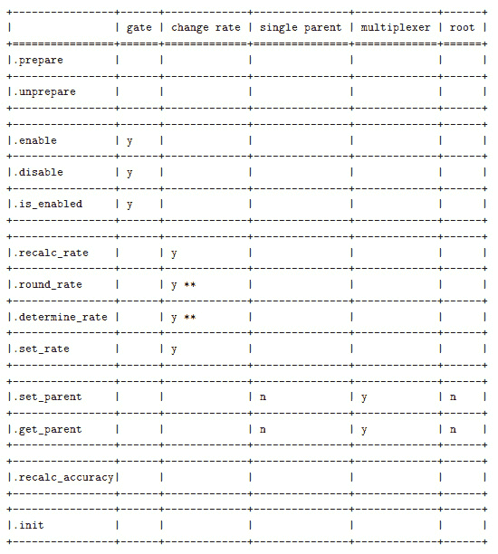
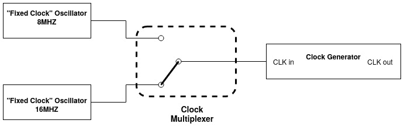
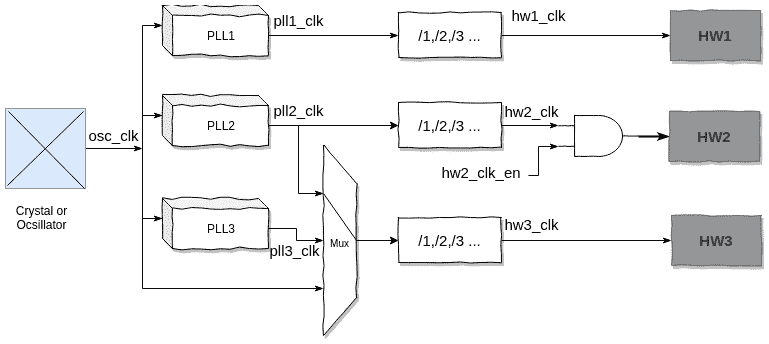

# 第四章：突袭通用时钟框架

从一开始，嵌入式系统一直需要时钟信号来编排其内部工作，无论是用于同步还是用于电源管理（例如，在设备处于活动状态时启用时钟，或者根据某些标准调整时钟，如系统负载）。因此，Linux 一直有一个时钟框架。一直只有编程接口声明支持系统时钟树的软件管理，每个平台都必须实现此 API。不同的**片上系统**（**SoCs**）有自己的实现。这样做一段时间还可以，但人们很快发现他们的硬件实现非常相似。代码也变得臃肿和冗余，这意味着需要使用平台相关的 API 来获取/设置时钟。

这是一个相当不舒服的情况。然后，**通用时钟框架（CCF）**出现了，允许软件以硬件无关的方式管理系统上可用的时钟。CCF 是一个接口，允许我们控制各种时钟设备（大多数时候，这些设备嵌入在 SoCs 中），并提供可用于控制它们的统一 API（启用/禁用，获取/设置速率，门控/解除门控等）。在本章中，时钟的概念并不是指**实时时钟**（**RTC**）或时间设备，这些是内核中具有自己子系统的其他类型设备。

CCF 的主要思想是统一和抽象分散在不同 SoC 时钟驱动程序中的相似代码。这种标准化方法以以下方式引入了时钟提供者和时钟消费者的概念：

+   提供者是 Linux 内核驱动程序，它们与框架连接并提供对硬件的访问，从而提供（使这些可用于消费者）时钟树（现在可以通过 SoC 数据表转储整个时钟树）。

+   消费者是通过公共 API 访问框架的 Linux 内核驱动程序或子系统。

+   也就是说，驱动程序既可以是提供者，也可以是消费者（它可以消耗它提供的一个或多个时钟，或者消耗其他人提供的一个或多个时钟）。

在本章中，我们将介绍 CCF 数据结构，然后专注于编写时钟提供者驱动程序（无论时钟类型），然后介绍消费者 API。我们将通过以下主题来实现这一点：

+   CCF 数据结构和接口

+   编写时钟提供者设备驱动程序

+   时钟消费者设备驱动程序和 API

# 技术要求

以下是本章的技术要求：

+   高级计算机体系结构知识和 C 编程技能

+   Linux 内核 v4.19.X 源代码可在[`git.kernel.org/pub/scm/linux/kernel/git/stable/linux.git/refs/tags`](https://git.kernel.org/pub/scm/linux/kernel/git/stable/linux.git/refs/tags)获取。

# CCF 数据结构和接口

在旧的内核时代，每个平台都必须实现内核中定义的基本 API（抓取/释放时钟，设置/获取速率，启用/禁用时钟等），这些 API 可以被消费者驱动程序使用。由于这些特定 API 的实现是由每台机器的代码完成的，这导致每个机器目录中都有一个类似的文件，具有类似的逻辑来实现时钟提供者功能。其中有很多冗余代码。后来，内核将这些公共代码抽象成了时钟提供者（`drivers/clk/clk.c`），这就是我们现在称之为 CCF 核心的东西。

在使用 CCF 之前，需要通过`CONFIG_COMMON_CLK`选项将其支持引入内核。CCF 本身分为两个部分：

+   `struct clk`，它统一了框架级别的代码和传统的依赖于平台的实现，这些实现过去在各种平台上都是重复的。这一部分还允许我们包装消费者接口（也称为`struct clk_ops`），每个时钟提供者都必须提供这个接口。

+   `struct clk_ops`对应于用于让我们操作底层硬件的回调（这些回调由时钟的核心实现调用），以及包装和抽象时钟硬件的相应硬件特定结构。

这两部分由`struct clk_hw`结构绑定在一起。这个结构帮助我们实现自己的硬件时钟类型。在本章中，这被称为`struct clk_foo`。由于`struct clk_hw`也在`struct clk`中指向，它允许在这两个部分之间进行导航。

现在，我们可以介绍 CCF 数据结构。CCF 是建立在通用异构数据结构（在`include/linux/clk-provider.h`中）之上的，这些数据结构帮助尽可能地使这个框架通用化。它们如下：

+   `struct clk_hw`：这个结构抽象了硬件时钟线，只在提供者代码中使用。它将前面介绍的两个部分联系在一起，并允许在它们之间进行导航。此外，这个硬件时钟的基本结构允许平台定义自己的硬件特定时钟结构，以及它们自己的时钟操作回调，只要它们包装一个`struct clk_hw`结构的实例。

+   `struct clk_ops`：这个结构表示可以操作时钟线的硬件特定回调；也就是硬件。这就是为什么这个结构中的所有回调都接受一个`struct clk_hw`的指针作为第一个参数，尽管根据时钟类型，只有少数这些操作是强制性的。

+   `struct clk_init_data`：这个结构保存了所有时钟共享的`init`数据，这些数据在时钟提供者和通用时钟框架之间。时钟提供者负责为系统中的每个时钟准备这些静态数据，然后将其交给时钟框架的核心逻辑。

+   `struct clk`：这个结构是时钟的消费者表示，因为每个消费者 API 都依赖于这个结构。

+   `struct clk_core`：这是时钟的 CCF 表示。

重要提示

区分`struct clk_hw`和`struct clk`之间的差异使我们能够更接近消费者和提供者 clk API 之间的清晰分离。

现在我们已经列举了这个框架的数据结构，我们可以逐个学习它们是如何实现的以及它们的用途。

## 理解 struct clk_hw 及其依赖关系

`struct clk_hw`是 CCF 中每种时钟类型的基本结构。它可以被看作是从`struct clk`到其对应的硬件特定结构的句柄。以下是`struct clk_hw`的主体：

```
struct clk_hw {
    struct clk_core *core;
    struct clk *clk;
    const struct clk_init_data *init;
};
```

让我们来看看前面结构中的字段：

+   `core`：这个结构是框架核心的内部结构。它也在内部指向这个`struct clk_hw`实例。

+   `clk`：这是一个每个用户的`struct clk`实例，可以使用`clk` API。它由时钟框架分配和维护，并在需要时提供给时钟消费者。每当消费者通过`clk_get`在 CCF 中对时钟设备（即`clk_core`）进行访问时，它需要获取一个句柄，即`clk`。

+   `init`：这是指向`struct clk_init_data`的指针。在初始化底层时钟提供程序驱动程序的过程中，调用`clk_register()`接口来注册时钟硬件。在此之前，您需要设置一些初始数据，这些初始数据被抽象为`struct clk_init_data`数据结构。在初始化过程中，来自`clk_init_data`的数据用于初始化与`clk_hw`对应的`clk_core`数据结构。初始化完成后，`clk_init_data`就没有意义了。

`struct clk_init_data` 的定义如下：

```
struct clk_init_data {
    const char *name;
    const struct clk_ops *ops;
    const char * const *parent_names;
    u8 num_parents;
    unsigned long flags;
};
```

它保存了所有时钟通用的初始化数据，并在时钟提供程序和通用时钟框架之间共享。其字段如下：

+   `name`，表示时钟的名称。

+   `ops` 是与时钟相关的一组操作函数。这将在*提供时钟操作*部分中进行描述。它的回调将由时钟提供程序驱动程序提供（以允许驱动硬件时钟），并将由驱动程序通过`clk_*`消费者 API 调用。

+   `parent_names` 包含时钟的所有父时钟的名称。这是一个字符串数组，保存了所有可能的父时钟。

+   `num_parents` 是父时钟的数量。它应该与前面数组中的条目数对应。

+   `flags` 代表时钟的框架级标志。我们将在*提供时钟操作*部分详细解释这一点，因为这些标志实际上修改了一些`ops`。

重要提示

`struct clk` 和 `struct clk_core` 是私有数据结构，定义在 `drivers/clk/clk.c` 中。`struct clk_core` 结构以一种抽象的方式将时钟设备抽象到 CCF 层，以便每个实际的硬件时钟设备（`struct clk_hw`）对应一个`struct clk_core`。

现在我们已经完成了 CCF 的核心`struct clk_hw`，我们可以学习如何向系统注册时钟提供程序。

## 注册/注销时钟提供程序

时钟提供程序负责以树的形式公开其提供的时钟，对其进行排序，并在系统初始化期间通过提供程序或时钟框架的核心初始化接口进行初始化。

在早期的内核版本（在 CCF 之前），时钟注册是通过`clk_register()`接口统一的。现在我们有基于`clk_hw`（提供程序）的 API，可以在注册时钟时摆脱基于`struct clk`的 API。由于建议时钟提供程序使用新的基于`struct clk_hw`的 API，因此要考虑的适当注册接口是`devm_clk_hw_register()`，这是`clk_hw_register()`的托管版本。然而，出于历史原因，旧的基于`clk`的 API 名称仍然保留，您可能会发现一些驱动程序在使用它。甚至还实现了一个资源托管版本，称为`devm_clk_register()`。我们只讨论这个旧的 API 是为了让您了解现有的代码，而不是帮助您实现新的驱动程序：

```
struct clk *clk_register(struct device *dev, struct clk_hw *hw)
int clk_hw_register(struct device *dev, struct clk_hw *hw)
```

基于这个`clk_hw_register()`接口，内核还提供了其他更方便的注册接口（稍后将介绍），具体取决于要注册的时钟类型。它负责将时钟注册到内核并返回表示时钟的`struct clk_hw`指针。

它接受一个指向`struct clk_hw`的指针（因为`struct clk_hw`是时钟提供程序侧的时钟表示），并且必须包含要注册的时钟的一些信息。内核将进一步填充这些数据。其实现逻辑如下：

+   分配`struct clk_core`空间（`clk_hw->core`）：

--根据`struct clk_hw`指针提供的信息，初始化`clk`的字段名称、`ops`、`hw`、`flags`、`num_parents`和`parents_names`。

--在其上调用内核接口`__clk_core_init()`，执行后续的初始化操作，包括构建时钟树层次结构。

+   通过内部内核接口`clk_create_clk()`分配`struct clk`空间（`clk_hw->clk`），并返回此`struct clk`变量。

+   尽管`clk_hw_register()`包装了`clk_register()`，但您不应该直接使用`clk_register()`，因为它返回`struct clk`。这可能会导致混淆，并破坏提供程序和使用者接口之间的严格分离。

以下是`drivers/clk/clk.c`中`clk_hw_register`的实现：

```
int clk_hw_register(struct device *dev, struct clk_hw *hw)
{
    return PTR_ERR_OR_ZERO(clk_register(dev, hw));
}
```

在执行进一步步骤之前，应该检查`clk_hw_register()`的返回值。由于 CCF 框架负责建立整个抽象时钟树的树结构并维护其数据，它通过在`drivers/clk/clk.c`中定义的两个静态链接列表来实现这一点，如下所示：

```
static HLIST_HEAD(clk_root_list);
static HLIST_HEAD(clk_orphan_list);
```

每当在时钟`hw`上调用`clk_hw_register()`（在内部调用`__clk_core_init()`以初始化时钟）时，如果此时钟有有效的父级，则它将最终出现在父级的`children`列表中。另一方面，如果`num_parent`为`0`，它将放置在`clk_root_list`中。否则，它将挂在`clk_orphan_list`中，这意味着它没有有效的父级。此外，每当初始化新的`clk`时，CCF 将遍历`clk_orphan_list`（孤立时钟的列表），并重新将任何子时钟重新连接到当前正在初始化的时钟。这就是 CCF 如何保持时钟树与硬件拓扑一致。

另一方面，`struct clk`是时钟设备的使用者端实例。基本上，对时钟设备的所有用户访问都会创建`struct clk`类型的访问句柄。当不同的用户访问同一个时钟设备时，尽管在幕后使用相同的`struct clk_core`实例，但他们访问的句柄（`struct clk`）是不同的。

重要提示

您应该记住，`clk_hw_register`（或其祖先`clk_register()`）在幕后使用`struct clk_core`，因为这是时钟的 CCF 表示。

CCF 通过在`drivers/clk/clkdev.c`中声明的全局链接列表来管理`clk`实体，以及用于保护其访问的互斥体，如下所示：

```
static LIST_HEAD(clocks);
static DEFINE_MUTEX(clocks_mutex);
```

这是来自设备树没有被大量使用的时代。那时，时钟使用者通过名称（时钟的名称）获取时钟。这用于识别时钟。知道`clk_register()`的目的只是注册到公共时钟框架，使用者无法知道如何定位时钟。因此，对于底层时钟提供程序驱动程序，除了调用`clk_register()`函数注册到公共时钟框架外，还必须立即在`clk_register()`之后调用`clk_register_clkdev()`以绑定时钟与名称（否则，时钟使用者将不知道如何定位时钟）。因此，内核使用`struct clk_lookup`，正如其名称所示，以查找可用的时钟，以防使用者请求时钟（当然是通过名称）。

这种机制在内核中仍然有效并得到支持。但是，为了通过基于`hw`的 API 强制执行提供程序和使用者代码之间的分离，应该分别在您的代码中用`clk_hw_register()`和`clk_hw_register_clkdev()`替换`clk_register()`和`clk_register_clkdev()`。

换句话说，假设您有以下代码：

```
/* Not be used anymore, introduced here for studying purpose */
int clk_register_clkdev(struct clk *clk,
                        const char *con_id, const char *dev_id)
```

这应该替换为以下代码：

```
/* recommended interface */
int clk_hw_register_clkdev(struct clk_hw *hw,
                           const char *con_id,                            const char *dev_id)
```

回到`struct clk_lookup`数据结构，让我们看一下它的定义：

```
struct clk_lookup {
    struct list_head node;
    const char *dev_id;
    const char *con_id;
    struct clk *clk;
    struct clk_hw *clk_hw;
};
```

在前面的数据结构中，`dev_id`和`con_id`用于标识/查找适当的`clk`。这个`clk`是相应的底层时钟。`node`是将挂在全局时钟列表中的列表条目，如以下摘录中的低级`__clkdev_add()`函数所示：

```
static void __clkdev_add(struct clk_lookup *cl)
{
    mutex_lock(&clocks_mutex);
    list_add_tail(&cl->node, &clocks);
    mutex_unlock(&clocks_mutex);
}
```

前述的`__clkdev_add()`函数是间接从`clk_hw_register_clkdev()`内部调用的，它实际上包装了`clk_register_clkdev()`。现在我们介绍了设备树，事情已经改变了。基本上，每个时钟供应商都成为了 DTS 中的一个节点；也就是说，每个`clk`在设备树中都有一个与之对应的设备节点。在这种情况下，与其捆绑`clk`和一个名称，不如通过一个新的数据结构`struct of_clk_provider`来捆绑`clk`和您的设备节点。这个特定的数据结构如下：

```
struct of_clk_provider {
    struct list_head link;
    struct device_node *node;
    struct clk *(*get)(struct of_phandle_args *clkspec,                        void *data);
    struct clk_hw *(*get_hw)(struct of_phandle_args *clkspec,
                             void *data);
    void *data;
};
```

在前述结构中，发生了以下情况：

+   `link`挂在`of_clk_providers`全局列表中。

+   `node`表示时钟设备的 DTS 节点。

+   `get_hw`是解码时钟的回调函数。对于设备（消费者），通过`clk_get()`调用它来返回与节点关联的时钟或`NULL`。

+   `get`是为了历史和兼容性原因而存在的旧的基于`clk`的 API。

然而，由于现在频繁和普遍使用设备树，对于底层供应商驱动程序，原始的`clk_hw_register()` + `clk_hw_register_clkdev()`（或其旧的基于`clk`的实现，`clk_register()` + `clk_register_clkdev()`）组合变成了`clk_hw_register` + `of_clk_add_hw_provider`（以前是`clk_register` + `of_clk_add_provider` - 这可以在旧的和非`clk_hw`的驱动程序中找到）。此外，CCF 引入了一个新的全局链接列表`of_clk_providers`，以帮助管理所有 DTS 节点和时钟之间的对应关系，以及一个互斥锁来保护这个列表：

```
static LIST_HEAD(of_clk_providers);
static DEFINE_MUTEX(of_clk_mutex);
```

尽管`clk_hw_register()`和`clk_hw_register_clkdev()`函数名称非常相似，但这两个函数的目标不同。通过前者，时钟供应商可以在通用时钟框架中注册时钟。另一方面，`clk_hw_register_clkdev()`在通用时钟框架中注册了一个`struct clk_lookup`，正如其名称所示。这个操作主要是为了查找时钟。如果您只有设备树平台，您不再需要所有对`clk_hw_register_clkdev()`的调用（除非您有充分的理由），因此您应该依赖于一次对`of_clk_add_provider()`的调用。

重要提示

建议时钟供应商使用新的基于`struct clk_hw`的 API，因为这样可以更接近清晰地分离消费者和供应商的时钟 API。

`clk_hw_*`接口是供应商接口，应在时钟供应商驱动程序中使用，而`clk_*`是消费者端。每当在供应商代码中遇到基于`clk_*`的 API 时，请注意应更新该驱动程序以支持新的基于硬件的接口。

一些驱动程序仍然同时使用这两个函数（`clk_hw_register_clkdev()`和`of_clk_add_hw_provider()`），以支持诸如 SoC 时钟驱动程序之类的时钟查找方法，但除非有理由这样做，否则不应同时使用这两个函数。

到目前为止，我们已经花了时间讨论时钟注册。然而，注销时钟可能是必要的，要么是因为底层时钟硬件离开了系统，要么是因为在硬件初始化期间出现了问题。时钟注销 API 相当简单：

```
void clk_hw_unregister(struct clk_hw *hw)
void clk_unregister(struct clk *clk)
```

前者针对基于`clk_hw`的时钟，而后者针对基于`clk`的时钟。在管理变体方面，除非 Devres 核心处理注销，否则应使用以下 API：

```
void devm_clk_unregister(struct device *dev, struct clk *clk)
void devm_clk_hw_unregister(struct device *dev, struct clk_hw *hw)
```

在两种情况下，`dev`表示与时钟关联的底层设备结构。

有了这个，我们已经完成了时钟注册/注销的查看。也就是说，驱动程序的主要目的之一是向潜在的消费者公开设备资源，这也适用于时钟设备。在下一节中，我们将学习如何向消费者公开时钟线。

## 向其他设备公开时钟（详细说明）

一旦时钟已经在 CCF 中注册，下一步就是注册这个时钟提供者，以便其他设备可以消耗它的时钟线。在旧的内核时代（当设备树没有被大量使用时），你必须通过在每条时钟线上调用`clk_hw_register_clkdev()`来向消费者公开时钟，这导致为给定的时钟线注册查找结构。如今，可以通过调用`of_clk_add_hw_provider()`接口来使用设备树来实现这个目的，以及一定数量的参数：

```
int of_clk_add_hw_provider(
    struct device_node *np,
    struct clk_hw *(*get)(struct of_phandle_args *clkspec,
                          void *data),
    void *data)
```

让我们看看这个函数中的参数：

+   `np`是与时钟提供者相关的设备节点指针。

+   `get`是解码时钟的回调。我们将在下一节详细讨论这个回调。

+   `data`是给定`get`回调的上下文指针。这通常是一个指向需要与设备节点关联的时钟的指针。这对于解码是有用的。

这个函数在成功时返回`0`。它与`of_clk_del_provider()`相反，后者包括从全局列表中删除提供者并释放其空间：

```
void of_clk_del_provider(struct device_node *np)
```

它的资源管理版本`devm_of_clk_add_hw_provider()`也可以用于摆脱删除函数。

### 时钟提供者设备树节点及其相关机制

目前，设备树是描述系统上设备的首选方法已经有一段时间了。通用时钟框架也不例外。在这里，我们将尝试弄清楚时钟是如何在设备树和相关驱动程序代码中描述的。为了实现这一点，我们需要考虑以下设备树摘录：

```
clocks {
    /* Provider node */
    clk54: clk54 {
        #clock-cells = <0>;
        compatible = 'fixed-clock';
        clock-frequency = <54000000>;
        clock-output-names = 'osc';
    };
};
[...]
i2c0: i2c-master@d090000 {
    [...]
    /* Consumer node */
    cdce706: clock-synth@69 {
        compatible = 'ti,cdce706';
        #clock-cells = <1>;
        reg = <0x69>;         clocks = <&clk54>;
        clock-names = 'clk_in0';
    };
};
```

请记住，时钟是通过`clocks`属性分配给消费者的，时钟提供者也可以是消费者。在上述摘录中，`clk54`是一个固定时钟；我们不会在这里详细讨论。`cdce706`是一个时钟提供者，也消耗`clk54`（在`clocks`属性中作为`phandle`给出）。

时钟提供者节点需要指定的最重要的信息是`#clock-cells`属性，它确定时钟说明符的长度：当它为`0`时，这意味着只需要将此提供者的`phandle`属性给出给消费者。当它为`1`（或更大）时，这意味着`phandle`属性具有多个输出，并且需要提供额外的信息，例如指示需要使用哪个输出的 ID。这个 ID 直接由一个立即值表示。最好在头文件中定义系统中所有时钟的 ID。设备树可以包括这个头文件，比如`clocks = <&clock CLK_SPI0>`，其中`CLK_SPI0`是在头文件中定义的宏。

现在，让我们看看`clock-output-names`。这是一个可选但建议的属性，应该是一个与输出（即提供的）时钟线的名称相对应的字符串列表。

看一下以下提供者节点摘录：

```
osc {
    #clock-cells = <1>;
    clock-output-names = 'ckout1', 'ckout2';
};
```

前面的节点定义了一个提供两个时钟输出线的设备，分别命名为`ckout1`和`ckout2`。消费者节点不应直接使用这些名称来引用这些时钟线。相反，他们应该使用适当的时钟说明符（相对于提供者的`#clock-cells`按索引引用时钟），允许他们根据设备的需求命名其输入时钟线：

```
device {
    clocks = <&osc 0>, <&osc 1>;
    clock-names = 'baud', 'register';
};
```

这个设备消耗了`osc`提供的两条时钟线，并根据自己的需求命名了它的输入线。我们将在本章末讨论消费者节点。

当时钟线分配给消费者设备时，当这个消费者的驱动程序调用`clk_get()`（或类似用于获取时钟的接口）时，这个接口调用`of_clk_get_by_name()`，然后调用`__of_clk_get()`。这里感兴趣的函数是`__of_clk_get()`。它在`drivers/clk/clkdev.c`中定义如下：

```
static struct clk * of_clk_get(struct device_node *np,                                int index,
                               const char *dev_id,                                const char *con_id)
{
    struct of_phandle_args clkspec;
    struct clk *clk;
    int rc;
    rc = of_parse_phandle_with_args(np, 'clocks',            
                                    '#clock-cells',
                                    index, &clkspec);
    if (rc)
        return ERR_PTR(rc);
    clk = of_clk_get_from_provider(&clkspec, dev_id, con_id); 
    of_node_put(clkspec.np);
    return clk;
}
```

重要提示

这个函数返回`struct clk`的指针而不是`struct clk_hw`的指针是完全正常的，因为这个接口是从消费者方面操作的。

这里的魔法来自`of_parse_phandle_with_args()`，它解析`phandle`及其参数的列表，然后调用`__of_clk_get_from_provider()`，我们稍后会描述。

#### 理解`of_parse_phandle_with_args()`API

以下是`of_parse_phandle_with_args`的原型：

```
int of_parse_phandle_with_args(const struct device_node *np,
                               const char *list_name,
                               const char *cells_name,
                               int index,
                               struct of_phandle_args *out_args)
```

这个函数在成功时返回`0`并填充`out_args`；在错误时返回适当的`errno`值。让我们看一下它的参数：

+   `np`是一个指向包含列表的设备树节点的指针。在我们的情况下，它将是对应于消费者的节点。

+   `list_name`是包含列表的属性名称。在我们的情况下，它是`clocks`。

+   `cells_name`是指定 phandle 参数计数的属性名称。在我们的情况下，它是`#clock-cells`。它帮助我们在指定器中的`phandle`属性之后抓取一个参数（其他 cells）。

+   `index`是`phandle`属性的索引，用于解析列表。

+   `out_args`是一个可选的输出参数，在成功路径上填充。这个参数是`of_phandle_args`类型，并定义如下：

```
#define MAX_PHANDLE_ARGS 16
struct of_phandle_args {
    struct device_node *np;
    int args_count;
    uint32_t args[MAX_PHANDLE_ARGS];
};
```

在`struct of_phandle_args`中，`np`元素是指向与`phandle`属性对应的节点的指针。在时钟指定器的情况下，它将是时钟提供者的设备树节点。`args_count`元素对应于指定器中 phandle 之后的单元格数。它可以用来遍历`args`，这是一个包含相关参数的数组。

让我们看一个使用`of_parse_phandle_with_args()`的例子，给出以下 DTS 摘录：

```
phandle1: node1 {
    #gpio-cells = <2>;
};
phandle2: node2 {
    #list-cells = <1>;
};
node3 {
    list = <&phandle1 1 2 &phandle2 3>;
};
/* or */
node3 {
    list = <&phandle1 1 2>, <&phandle2 3>;
}
```

在这里，`node3`是一个消费者。要获取指向`node2`节点的`device_node`指针，你可以调用`of_parse_phandle_with_args(node3, 'list', '#list-cells', 1, &args);`。由于`&phandle2`在列表中的索引为`1`（从`0`开始），我们在`index`参数中指定了`1`。

同样，要获取`node1`节点的关联`device_node`，你可以调用`of_parse_phandle_with_args(node3, 'list', '#gpio-cells', 0, &args);`。对于这第二种情况，如果我们查看`args`输出参数，我们会看到`args->np`对应于`node3`，`args->args_count`的值为`2`（因为这个指定器需要`2`个参数），`args->args[0]`的值为`1`，`args->args[1]`的值为`2`，这将对应于指定器中的第`2`个参数。

重要提示

要进一步了解设备树 API，请查看`of_parse_phandle_with_fixed_args()`和设备树核心代码中提供的其他接口，位于`drivers/of/base.c`中。

#### 理解`__of_clk_get_from_provider()`API

`__of_clk_get()`中的下一个函数调用是`__of_clk_get_from_provider()`。我提供其原型的原因是你不应该在你的代码中使用这个。然而，这个函数只是简单地遍历时钟提供者（在`of_clk_providers`列表中），当找到适当的提供者时，它调用`of_clk_add_provider()`的第二个参数作为底层回调来解码底层时钟。在这里，由`of_parse_phandle_with_args()`返回的时钟指定器被作为参数给出。你可能还记得当你必须向其他设备公开一个时钟提供者时，我们必须使用`of_clk_add_hw_provider()`。作为第二个参数，这个接口接受一个回调，由 CCF 用于解码底层时钟，每当消费者调用`clk_get()`时。这个回调的结构如下：

```
struct clk_hw *(*get_hw)(struct of_phandle_args *clkspec, void *data)
```

此回调应根据其参数返回底层的`clock_hw`。`clkspec`是由`of_parse_phandle_with_args()`返回的时钟指定符，而`data`是作为`of_clk_add_hw_provider()`的第三个参数给出的上下文数据。请记住，`data`通常是要与节点关联的时钟的指针。要查看此回调是如何内部调用的，我们需要查看`__of_clk_get_from_provider()`接口的定义，如下所示：

```
struct clk * of_clk_get_from_provider(struct                                       of_phandle_args *clkspec,
                                      const char *dev_id,                                       const char *con_id)
{
    struct of_clk_provider *provider;
    struct clk *clk = ERR_PTR(-EPROBE_DEFER);
    struct clk_hw *hw;
    if (!clkspec)
        return ERR_PTR(-EINVAL);
    /* Check if we have such a provider in our array */
    mutex_lock(&of_clk_mutex);
    list_for_each_entry(provider, &of_clk_providers, link) {
        if (provider->node == clkspec->np) {
          hw = of_clk_get_hw_from_provider (provider, clkspec);
            clk = clk_create_clk(hw, dev_id, con_id);
        }
        if (!IS_ERR(clk)) {
            if (! clk_get(clk)) {
                clk_free_clk(clk);
                clk = ERR_PTR(-ENOENT);
            }
            break;
        }
    }
    mutex_unlock(&of_clk_mutex);
    return clk;
}
```

#### 时钟解码回调

如果我们必须总结从 CCF 获取时钟的机制，我们会说，当使用者调用`clk_get()`时，CCF 在内部调用`__of_clk_get()`。这作为此使用者的`device_node`属性的第一个参数，以便 CCF 可以获取时钟指定符并找到与提供程序对应的`device_node`属性（通过`of_parse_phandle_with_args()`）。然后以`of_phandle_args`的形式返回这个。这个`of_phandle_args`对应于时钟指定符，并作为参数给出给`__of_clk_get_from_provider()`，它只是比较提供程序的`of_phandle_args`（即`of_phandle_args->np`）中的`device_node`属性与存在于`of_clk_providers`中的那些的属性，这是设备树时钟提供程序的列表。一旦找到匹配项，就会调用相应的提供程序的`of_clk_provider->get()`回调，并返回底层时钟。

重要说明

如果`__of_clk_get()`失败，这意味着找不到给定设备节点的有效时钟。这也可能意味着提供程序没有将其时钟注册到设备树接口。因此，当`of_clk_get()`失败时，CCF 代码调用`clk_get_sys()`，这是根据其名称查找时钟的后备方法，该名称不再在设备树上。这是`clk_get()`背后的真正逻辑。

此`of_clk_provider->get()`回调通常依赖于作为`of_clk_add_provider()`参数给出的上下文数据，以便返回底层时钟。虽然可以编写自己的回调（应该遵守前一节中已经介绍的原型），但 CCF 框架提供了两个通用的解码回调，涵盖了大多数情况。这些是`of_clk_src_onecell_get()`和`of_clk_src_simple_get()`，两者都具有相同的原型：

```
struct clk_hw *of_clk_hw_simple_get(struct                                     of_phandle_args *clkspec,
                                    void *data);
struct clk_hw *of_clk_hw_onecell_get(struct                                      of_phandle_args *clkspec,
                                     void *data);
```

`of_clk_hw_simple_get()`用于简单的时钟提供程序，除了时钟本身之外，不需要特殊的上下文数据结构，例如时钟 GPIO 驱动程序（在`drivers/clk/clk-gpio.c`中）。此回调只是原样返回作为上下文数据参数给出的数据，这意味着该参数应该是一个时钟。它在`drivers/clk/clk.c`中定义如下：

```
struct clk_hw *of_clk_hw_simple_get(struct                                     of_phandle_args *clkspec,
                                    void *data)
{
    return data;
}
EXPORT_SYMBOL_GPL(of_clk_hw_simple_get);
```

另一方面，`of_clk_hw_onecell_get()`要复杂一些，因为它需要一个称为`struct clk_hw_onecell_data`的特殊数据结构。这可以定义如下：

```
struct clk_hw_onecell_data {
    unsigned int num;
    struct clk_hw *hws[];
};
```

在前面的结构中，`hws`是指向`struct clk_hw`的指针数组，`num`是此数组中条目的数量。

重要说明

在旧的时钟提供程序驱动程序中，尚未实现基于 clk_hw 的 API 的，您可能会看到`struct clk_onecell_data`，`of_clk_add_provider()`，`of_clk_src_onecell_get()`和`of_clk_add_provider()`，而不是在本书中介绍的数据结构和接口。

也就是说，为了掌握存储在此数据结构中的时钟，建议将它们包装在您的上下文数据结构中，如`drivers/clk/sunxi/clk-sun9i-mmc.c`中的以下示例所示：

```
struct sun9i_mmc_clk_data {
    spinlock_t	lock;
    void  iomem		*membase;
    struct clk	*clk;
    struct reset_control	*reset;
    struct clk_hw_onecell_data	clk_hw_data;
    struct reset_controller_dev		rcdev;
};
```

然后，根据应该存储的时钟数量动态分配这些时钟的空间：

```
int sun9i_a80_mmc_config_clk_probe(struct                                    platform_device *pdev){    struct device_node *np = pdev->dev.of_node;
    struct sun9i_mmc_clk_data *data;
    struct clk_hw_onecell_data *clk_hw_data;
    const char *clk_name = np->name;
    const char *clk_parent;
    struct resource *r;
    [...]
    data = devm_kzalloc(&pdev->dev, sizeof(*data), GFP_KERNEL);
    if (!data)
        return -ENOMEM;
    clk_hw_data = &data->clk_hw_data;
    clk_hw_data->num = count;
    /* Allocating space for clk_hws, and 'count' is the number
     *of entries
     */
    clk_hw_data->hws =
    devm_kcalloc(&pdev->dev, count, sizeof(struct clk_hw *),
                     GFP_KERNEL);
    if (!clk_hw_data->hws)
        return -ENOMEM;
    /* A clock provider may be a consumer from another
     * provider as well      */
    data->clk = devm_clk_get(&pdev->dev, NULL);
    clk_parent = __clk_get_name(data->clk);
    for (i = 0; i < count; i++) {
        of_property_read_string_index(np, 'clock-output-names',
                                      i, &clk_name);
        /* storing each clock in its location */
        clk_hw_data->hws[i] =
        clk_hw_register_gate(&pdev->dev, clk_name,                            clk_parent, 0,
                           data->membase + SUN9I_MMC_WIDTH * i,
                           SUN9I_MMC_GATE_BIT, 0, &data->lock);        if (IS_ERR(clk_hw_data->hws[i])) {            ret = PTR_ERR(clk_hw_data->hws[i]);            goto err_clk_register;        }    }
    ret =
       of_clk_add_hw_provider(np, of_clk_hw_onecell_get,                               clk_hw_data);
    if (ret)
        goto err_clk_provider;
    [...]
    return 0;}
```

重要说明

在撰写本文时，前面的摘录来自 sunxi A80 SoC MMC 配置时钟/复位驱动程序，仍然使用基于 clk 的 API（以及`struct clk`，`clk_register_gate()`和`of_clk_add_src_provider()`接口），而不是`clk_hw`。因此，为了学习目的，我修改了这段摘录，使其使用推荐的`clk_hw` API。

正如您所看到的，在时钟注册期间给出的上下文数据是`clk_hw_data`，它是`clk_hw_onecell_data`类型。此外，`of_clk_hw_onecell_get`作为时钟解码器回调函数给出。这个辅助程序简单地返回在时钟指定器中给定的索引处的时钟（它是`of_phandle_args`类型）。查看其定义以更好地理解：

```
struct clk_hw * of_clk_hw_onecell_get(struct                                       of_phandle_args *clkspec, 
                                      void *data)
{
    struct clk_hw_onecell_data *hw_data = data;
    unsigned int idx = clkspec->args[0];
    if (idx >= hw_data->num) {
        pr_err('%s: invalid index %u\n', func , idx);
        return ERR_PTR(-EINVAL);
    }
    return hw_data->hws[idx];
}
EXPORT_SYMBOL_GPL(of_clk_hw_onecell_get);
```

当然，根据您的需求，可以随意实现自己的解码器回调，类似于内核源代码树中的`max9485`音频时钟生成器中的一个，其驱动程序是`drivers/clk/clk-max9485.c`。

在这一部分，我们学习了时钟提供者的设备树方面。我们学习了如何公开设备的时钟源线，以及如何将这些时钟线分配给消费者。现在，是时候介绍驱动程序方面了，这也包括为其时钟提供者编写代码。

# 编写时钟提供者驱动程序

尽管设备树的目的是描述手头的硬件（在本例中是时钟提供者），但值得注意的是，用于管理底层硬件的代码需要编写。本节涉及编写时钟提供者的代码，以便一旦它们的时钟线被分配给消费者，它们就会按照设计的方式运行。在编写时钟设备驱动程序时，最好将完整的`struct clk_hw`（而不是指针）嵌入到您的私有和更大的数据结构中，因为它作为`clk_ops`中每个回调的第一个参数给出。这样可以定义一个自定义的`to_<my-data-structure>`辅助程序，使用`container_of`宏，它会将指针返回到您的私有数据结构，如下所示：

```
/* forward reference */
struct max9485_driver_data;
struct max9485_clk_hw {
    struct clk_hw hw;
    struct clk_init_data init;     u8 enable_bit;
    struct max9485_driver_data *drvdata;
;
struct max9485_driver_data {
    struct clk *xclk;
    struct i2c_client *client;
    u8 reg_value;
    struct regulator *supply;
    struct gpio_desc *reset_gpio;
    struct max9485_clk_hw hw[MAX9485_NUM_CLKS];
};
static inline struct max9485_clk_hw *to_max9485_clk(struct                                                     clk_hw *hw)
{
    return container_of(hw, struct max9485_clk_hw, hw);
}
```

在前面的示例中，`max9485_clk_hw`抽象了`hw`时钟（因为它包含`struct clk_hw`）。从驱动程序的角度来看，每个`struct max9485_clk_hw`代表一个 hw 时钟，允许我们定义另一个更大的结构，这次将用作驱动程序数据：`max9485_driver_data`结构。您会注意到在前面的结构中有一些交叉引用，特别是在`struct max9485_clk_hw`中，它包含指向`struct max9485_driver_data`的指针，以及`struct max9485_driver_data`，它包含一个`max9485_clk_hw`数组。这使我们能够从任何`clk_ops`回调中获取驱动程序数据，如下所示：

```
static unsigned long
max9485_clkout_recalc_rate(struct clk_hw *hw,
                               unsigned long parent_rate)
{
    struct max9485_clk_hw *max_clk_hw = to_max9485_clk(hw);
    struct max9485_driver_data *drvdata = max_clk_hw->drvdata;
    [...]
    return 0;
}
```

此外，如下摘录所示，静态声明时钟线（在本例中由`max9485_clk_hw`抽象），以及相关的 ops 是一个很好的做法。这是因为，与私有数据不同（可能会从一个设备更改到另一个设备），这些信息永远不会改变，无论系统上存在相同类型的时钟芯片的数量如何：

```
static const struct max9485_clk max9485_clks[MAX9485_NUM_CLKS] = {
    [MAX9485_MCLKOUT] = {
        .name = 'mclkout',
        .parent_index = -1,
        .enable_bit = MAX9485_MCLK_ENABLE,
        .ops = {
            .prepare		= max9485_clk_prepare,
            .unprepare	= max9485_clk_unprepare,
        },
    },
    [MAX9485_CLKOUT] = {
        .name = 'clkout',
        .parent_index = -1,
        .ops = {
             .set_rate	= max9485_clkout_set_rate,
            .round_rate	= max9485_clkout_round_rate,
            .recalc_rate	= max9485_clkout_recalc_rate,
        },
    },
    [MAX9485_CLKOUT1] = {
        .name = 'clkout1',
        .parent_index = MAX9485_CLKOUT,
        .enable_bit = MAX9485_CLKOUT1_ENABLE,
        .ops = {
            .prepare	= max9485_clk_prepare,
            .unprepare	= max9485_clk_unprepare,
        },
    },
    [MAX9485_CLKOUT2] = {
        .name = 'clkout2',
        .parent_index = MAX9485_CLKOUT,
        .enable_bit = MAX9485_CLKOUT2_ENABLE,
        .ops = {
            .prepare	= max9485_clk_prepare,
            .unprepare	= max9485_clk_unprepare,
        },
    },
};
```

尽管 ops 嵌入在抽象数据结构中，但它们也可以单独声明，就像内核源代码中的`drivers/clk/clk-axm5516.c`文件中一样。另一方面，最好动态分配驱动程序数据结构，因为这样更容易使其对驱动程序私有，从而允许每个声明的设备私有数据，如下面的摘录所示：

```
static int max9485_i2c_probe(struct i2c_client *client,
                             const struct i2c_device_id *id)
{
    struct max9485_driver_data *drvdata;
    struct device *dev = &client->dev;
    const char *xclk_name;
    int i, ret;
    drvdata = devm_kzalloc(dev, sizeof(*drvdata), GFP_KERNEL);
    if (!drvdata)
        return -ENOMEM;
    [...]
    for (i = 0; i < MAX9485_NUM_CLKS; i++) {
        int parent_index = max9485_clks[i].parent_index;
        const char *name;
        if (of_property_read_string_index
           (dev->of_node, 'clock-output-names', i, &name) == 0) {
            drvdata->hw[i].init.name = name;
        } else {
            drvdata->hw[i].init.name = max9485_clks[i].name;
        }
        drvdata->hw[i].init.ops = &max9485_clks[i].ops;
        drvdata->hw[i].init.num_parents = 1;
        drvdata->hw[i].init.flags = 0;
        if (parent_index > 0) {
            drvdata->hw[i].init.parent_names =
                        &drvdata->hw[parent_index].init.name;
            drvdata->hw[i].init.flags |= CLK_SET_RATE_PARENT;
        } else {
            drvdata->hw[i].init.parent_names = &xclk_name;
        }
        drvdata->hw[i].enable_bit = max9485_clks[i].enable_bit;
        drvdata->hw[i].hw.init = &drvdata->hw[i].init;
        drvdata->hw[i].drvdata = drvdata;
        ret = devm_clk_hw_register(dev, &drvdata->hw[i].hw);
        if (ret < 0)
            return ret;
    }
    return
      devm_of_clk_add_hw_provider(dev, max9485_of_clk_get,                                   drvdata);
}
```

在前面的摘录中，驱动程序调用`clk_hw_register()`（实际上是`devm_clk_hw_register()`，这是托管版本）以便将每个时钟注册到 CCF。现在我们已经了解了时钟提供者驱动程序的基础知识，我们将学习如何通过一组操作允许与时钟线进行交互，这些操作可以在驱动程序中公开。

## 提供时钟 ops

`struct clk_hw`是 CCF 构建其他时钟变体结构的基本硬件时钟结构。作为一个快速回调，通用时钟框架提供以下基本时钟：

+   **fixed-rate**: 这种类型的时钟不能改变其速率，并且始终运行。

+   **gate**: 这充当时钟源的门控，因为它是其父级。显然，它不能改变其速率，因为它只是一个门控。

+   **mux**: 这种类型的时钟不能进行门控。它有两个或更多的时钟输入：其父级。它允许我们在连接的时钟中选择一个父级。此外，它允许我们从所选的父级获取速率。

+   **fixed-factor**: 这种时钟类型不能进行门控，但可以通过其常数来分频和倍频父级速率。

+   **divider**: 这种类型的时钟不能进行门控。但是，它通过使用可以从注册时提供的各种数组中选择的分频器来分频父时钟速率。

+   **composite**: 这是我们之前描述的三种基本时钟的组合：mux、rate 和 gate。它允许我们重用这些基本时钟来构建单个时钟接口。

也许你会想知道内核（即 CCF）在将`clk_hw`作为参数传递给`clk_hw_register()`函数时，是如何知道给定时钟的类型的。实际上，CCF 并不知道这一点，也不必知道任何事情。这就是`clk_hw->init.ops`字段的目的，它是`struct clk_ops`类型。根据在这个结构中设置的回调函数，你可以猜测它所面对的时钟类型。以下是`struct clk_ops`中的一组操作函数的详细介绍：

```
struct clk_ops {
    int	(*prepare)(struct clk_hw *hw);
    void	(*unprepare)(struct clk_hw *hw);
    int	(*is_prepared)(struct clk_hw *hw);
    void	(*unprepare_unused)(struct clk_hw *hw);
    int	(*enable)(struct clk_hw *hw);
    void	(*disable)(struct clk_hw *hw);
    int	(*is_enabled)(struct clk_hw *hw);
    void	(*disable_unused)(struct clk_hw *hw);
    unsigned long (*recalc_rate)(struct clk_hw *hw,
                                 unsigned long parent_rate);
    long	(*round_rate)(struct clk_hw *hw, unsigned long rate,
                         unsigned long *parent_rate);
    int	(*determine_rate)(struct clk_hw *hw,
                          struct clk_rate_request *req);
    int	(*set_parent)(struct clk_hw *hw, u8 index);
    u8	(*get_parent)(struct clk_hw *hw);
    int	(*set_rate)(struct clk_hw *hw, unsigned long rate,
                       unsigned long parent_rate);
[...]
    void	(*init)(struct clk_hw *hw);
};
```

为了清晰起见，已删除了一些字段。

每个`prepare*`/`unprepare*`/`is_prepared`回调都允许休眠，因此不得从原子上下文中调用，而每个`enable*`/`disable*`/`is_enabled`回调可能不允许休眠，也不得休眠。让我们更详细地看一下这段代码：

+   `prepare`和`unprepare`是可选的回调。在`prepare`中所做的工作应该在`unprepare`中撤消。

+   `is_prepared`是一个可选的回调，通过查询硬件告诉我们时钟是否准备好。如果省略，时钟框架核心将执行以下操作：

--维护一个准备计数器（当调用`clk_prepare()`消费者 API 时递增一个，当调用`clk_unprepare()`时递减一个）。

--基于这个计数器，它将确定时钟是否准备好。

+   `unprepare_unused`/`disable_unused`: 这些回调是可选的，仅在`clk_disable_unused`接口中使用。该接口由时钟框架核心提供，并在系统发起的延迟调用中调用（在`drivers/clk/clk.c`中：`late_initcall_sync(clk_disable_unused)`），以便取消准备/关闭未使用的时钟。该接口将调用系统上每个未使用时钟的相应`.unprepare_unused`和`.disable_unused`函数。

+   `enable`/`disable`: 原子地启用/禁用时钟。这些函数必须以原子方式运行，不得休眠。例如，对于`enable`，它应该仅在底层时钟生成可供使用者节点使用的有效时钟信号时返回。

+   `is_enabled`具有与`is_prepared`相同的逻辑。

+   `recalc_rate`: 这是一个可选的回调，通过给定父级速率作为输入参数，查询硬件以重新计算底层时钟的速率。如果省略此操作，初始速率为`0`。

+   `round_rate`: 此回调接受目标速率（以赫兹为单位）作为输入，并应返回底层时钟实际支持的最接近的速率。父级速率是一个输入/输出参数。

+   `determine_rate`: 此回调以目标时钟速率作为参数，并返回底层硬件支持的最接近的速率。

+   `set_parent`：这涉及具有多个输入（多个可能的父级）的时钟。此回调接受在给定父级索引（作为`u8`）的参数时更改输入源的选择。此索引应与时钟的`clk_init_data.parent_names`或`clk_init_data.parents`数组中有效的父级对应。此回调应在成功路径上返回`0`，否则返回`-EERROR`。

+   `get_parent`是具有多个（至少两个）输入（多个`parents`）的时钟的强制性回调。它查询硬件以确定时钟的父级。返回值是与父级索引对应的`u8`。此索引应在`clk_init_data.parent_names`或`clk_init_data.parents`数组中有效。换句话说，此回调将从硬件中读取的父级值转换为数组索引。

+   `set_rate`：更改给定时钟的速率。请求的速率应该是`.round_rate`调用的返回值，以便有效。此回调应在成功路径上返回`0`，否则返回`-EERROR`。

+   `init`是一个特定于平台的时钟初始化钩子，当时钟注册到内核时将调用它。目前，没有基本时钟类型实现此回调。

提示

由于`.enable`和`.disable`不能休眠（它们在持有自旋锁时被调用），因此连接到可休眠总线（例如 SPI 或 I2C）的离散芯片中的时钟提供程序不能在持有自旋锁的情况下进行控制，因此应该在准备/取消准备钩子中实现其启用/禁用逻辑。通用 API 将直接调用相应的操作函数。这是为什么从消费者方面（基于时钟的 API）来看，对`clk_enable`的调用必须在调用`clk_prepare()`之前进行，并且对`clock_disable()`的调用应该在`clock_unprepare()`之后进行的原因之一。

最后但并非最不重要的是，还应注意以下差异：

重要说明

SoC 内部时钟可以被视为快速时钟（通过简单的 MMIO 寄存器写入进行控制），因此可以实现`.enable`和`.disable`，而 SPI/I2C 时钟可以被视为慢时钟，应该实现`.prepare`和`.unprepare`。

这些函数并非对所有时钟都是强制性的。根据时钟类型，有些可能是强制性的，而有些可能不是。以下数组总结了根据其硬件功能，哪些`clk_ops`回调对哪种时钟类型是强制性的：



图 4.1 - 时钟类型的强制性 clk_ops 回调

在前面的数组中，需要`round_rate`或`determine_rate`。

在前面的数组中，**y**表示强制性，而**n**表示相关回调无效或无关紧要。空单元格应被视为可选的，或者必须根据具体情况进行评估。

### clk_hw.init.flags 中的时钟标志

由于我们已经介绍了时钟操作结构，现在我们将介绍不同的标志（在`include/linux/clk-provider.h`中定义），并看看它们如何影响此结构中某些回调的行为：

```
/*must be gated across rate change*/#define CLK_SET_RATE_GATE  BIT(0)
/*must be gated across re-parent*/#define CLK_SET_PARENT_GATE	 BIT(1)
/*propagate rate change up one level */#define CLK_SET_RATE_PARENT	 BIT(2)
/* do not gate even if unused */#define CLK_IGNORE_UNUSED	BIT(3)
/*Basic clk, can't do a to_clk_foo()*/#define CLK_IS_BASIC BIT(5)
/*do not use the cached clk rate*/#define CLK_GET_RATE_NOCACHE BIT(6)
/* don't re-parent on rate change */#define CLK_SET_RATE_NO_REPARENT BIT(7)
/* do not use the cached clk accuracy */#define CLK_GET_ACCURACY_NOCACHE BIT(8)
/* recalc rates after notifications */#define CLK_RECALC_NEW_RATES BIT(9)
/* clock needs to run to set rate */#define CLK_SET_RATE_UNGATE BIT(10)
/* do not gate, ever */#define CLK_IS_CRITICAL	BIT(11)
```

前面的代码显示了可以在`clk_hw->init.flags`字段中设置的不同框架级标志。您可以通过 OR'ing 它们来指定多个标志。让我们更详细地看一下它们：

+   `CLK_SET_RATE_GATE`：当您更改时钟的速率时，必须对其进行门控（禁用）。此标志还确保存在速率更改和速率故障保护；当时钟设置了`CLK_SET_RATE_GATE`标志并且已准备就绪时，`clk_set_rate()`请求将失败。

+   `CLK_SET_PARENT_GATE`：当您更改时钟的父级时，必须对其进行门控。

+   `CLK_SET_RATE_PARENT`：一旦您更改了时钟的速率，更改必须传递给上级父级。此标志有两个效果：

--当时钟使用者调用`clk_round_rate()`（CCF 在内部将其映射到`.round_rate`）以获得近似速率时，如果时钟未提供`.round_rate`回调，则如果未设置`CLK_SET_RATE_PARENT`，CCF 将立即返回时钟的缓存速率。但是，如果仍设置了此标志而未提供`.round_rate`，则请求将路由到时钟父级。这意味着将查询父级并调用`clk_round_rate()`以获取父时钟可以提供的最接近目标速率的值。

--此标志还修改了`clk_set_rate()`接口的行为（CCF 在内部将其映射到`.set_rate`）。如果设置，任何速率更改请求将被转发到上游（传递给父时钟）。也就是说，如果父时钟可以获得近似速率值，那么通过更改父时钟速率，可以获得所需的速率。此标志通常设置在时钟门和多路复用器上。请谨慎使用此标志。

+   `CLK_IGNORE_UNUSED`：忽略禁用未使用的调用。当有一个驱动程序未正确声明时钟但引导加载程序将它们保留在时钟上时，这是非常有用的。这相当于内核引导参数`clk_ignore_unused`，但适用于单个时钟。不希望在正常情况下使用，但对于启动和调试，有选择地不对仍在运行的未声明的时钟进行门控（禁用）是非常有用的。

+   `CLK_IS_BASIC`：不再使用。

+   `CLK_GET_RATE_NOCACHE`：有些芯片的时钟速率可以通过内部硬件更改，而 Linux 时钟框架根本不知道这种变化。此标志确保 Linux 时钟树中的 clk 速率始终与硬件设置匹配。换句话说，获取/设置速率不来自缓存，并且是在那个时间计算的。

重要提示

处理门钟类型时，请注意，门控时钟是禁用的时钟，而非门控时钟是启用的时钟。有关更多详细信息，请参见[`elixir.bootlin.com/linux/v4.19/source/drivers/clk/clk.c#L931`](https://elixir.bootlin.com/linux/v4.19/source/drivers/clk/clk.c#L931)和[`elixir.bootlin.com/linux/v4.19/source/drivers/clk/clk.c#L862`](https://elixir.bootlin.com/linux/v4.19/source/drivers/clk/clk.c#L862)。

现在我们熟悉了时钟标志，以及这些标志如何修改与时钟相关的回调的行为，我们可以逐个遍历每种时钟类型，并学习如何提供它们的相关操作。

### 固定速率时钟案例研究及其操作

这是最简单的时钟类型。因此，我们将使用它来建立一些必须在编写时钟驱动程序时遵守的强制性准则。这种类型的时钟的频率不能调整，因为它是固定的。此外，这种类型的时钟不能被切换，不能选择其父级，并且不需要提供`clk_ops`回调函数。

时钟框架使用`struct clk_fixed_rate`结构（如下所述）来抽象这种类型的时钟硬件：

```
Struct clk_fixed_rate {
    struct clk_hw hw;
    unsigned long fixed_rate;
    u8 flags; [...]
};
#define to_clk_fixed_rate(_hw) \
            container_of(_hw, struct clk_fixed_rate, hw)
```

在前面的结构中，`hw`是基础结构，并确保通用和硬件特定接口之间存在链接。一旦给定给`to_clk_fixed_rate`宏（基于`container_of`），您应该获得一个指向`clk_fixed_rate`的指针，它包装了这个`hw`。`fixed_rate`是时钟设备的恒定（固定）速率。`flags`表示框架特定的标志。

让我们看一下以下摘录，它简单地注册了两条虚拟固定速率时钟线：

```
#include <linux/clk.h>
#include <linux/clk-provider.h>
#include <linux/init.h>
#include <linux/of_address.h>
#include <linux/platform_device.h>
#include <linux/reset-controller.h>
static struct clk_fixed_rate clk_hw_xtal = {
    .fixed_rate = 24000000,
    .hw.init = &(struct clk_init_data){
        .name = 'xtal',
        .num_parents = 0,
        .ops = &clk_fixed_rate_ops,
    },
};
static struct clk_fixed_rate clk_hw_pll = {
    .fixed_rate = 45000000,
    .hw.init = &(struct clk_init_data){
        .name = 'fixed_pll',
        .num_parents = 0,
        .ops = &clk_fixed_rate_ops,
    },
};
static struct clk_hw_onecell_data fake_fixed_hw_onecell_data = {
    .hws = {
        [CLKID_XTAL]	= &clk_hw_xtal.hw,
        [CLKID_PLL_FIXED]	= &clk_hw_pll.hw,
        [CLK_NR_CLKS]	= NULL,
    },
    .num = CLK_NR_CLKS,
};
```

有了这些，我们已经定义了我们的时钟。以下代码显示了如何在系统上注册这些时钟：

```
static int fake_fixed_clkc_probe(struct platform_device *pdev)
{
    int ret, i;
    struct device *dev = &pdev->dev;
    for (i = CLKID_XTAL; i < CLK_NR_CLKS; i++) {
        ret = devm_clk_hw_register(dev, 
                            fake_fixed_hw_onecell_data.hws[i]);
        if (ret)
            return ret;
    }
    return devm_of_clk_add_hw_provider(dev,                                   of_clk_hw_onecell_get,
                                  &fake_fixed_hw_onecell_data);
}
static const struct of_device_id fake_fixed_clkc_match_table[] = {
    { .compatible = 'l.abcsmart,fake-fixed-clkc' },
    { }
};
static struct platform_driver meson8b_driver = {
    .probe	= fake_fixed_clkc_probe,
    .driver	= {
        .name	= 'fake-fixed-clkc',
        .of_match_table = fake_fixed_clkc_match_table,
    },
};
```

#### 一般简化考虑

在前面的摘录中，我们使用`clk_hw_register()`来注册时钟。此接口是基本注册接口，可用于注册任何类型的时钟。其主要参数是指向嵌入在基础时钟类型结构中的`struct clk_hw`结构的指针。

通过调用`clk_hw_register()`进行时钟初始化和注册需要填充`struct clk_init_data`（从而实现`clk_ops`）对象，该对象与`clk_hw`捆绑在一起。作为替代，您可以使用硬件特定（即，时钟类型相关）的注册函数。在这里，内核负责根据时钟类型从给定给函数的参数构建适当的`init`数据，然后在内部调用`clk_hw_register(...)`。通过这种替代方式，CCF 将根据时钟硬件类型提供适当的`clk_ops`。

通常，时钟提供程序不需要直接使用或分配基本时钟类型，即`struct clk_fixed_rate`。这是因为内核时钟框架为此目的提供了专用接口。在实际情况下（存在固定时钟的情况下），这种专用接口将是`clk_hw_register_fixed_rate()`：

```
struct clk_hw *
    clk_hw_register_fixed_rate(struct device *dev,                                const char *name,
                               const char *parent_name,                                unsigned long flags,
                               unsigned long fixed_rate)
```

`clk_register_fixed_rate()`接口使用时钟的`name`、`parent_name`和`fixed_rate`作为参数来创建具有固定频率的时钟。`flags`表示特定于框架的标志，而`dev`是注册时钟的设备。时钟的`clk_ops`属性也由时钟框架提供，不需要提供者关心。这种时钟的内核时钟操作数据结构是`clk_fixed_rate_ops`。它在`drivers/clk/clk-fixed-rate.c`中定义如下：

```
static unsigned long
    clk_fixed_rate_recalc_rate(struct clk_hw *hw,
                               unsigned long parent_rate)
{
    return to_clk_fixed_rate(hw)->fixed_rate;
}
static unsigned long
    clk_fixed_rate_recalc_accuracy(struct clk_hw *hw,
                                unsigned long parent_ accuracy)
{
    return to_clk_fixed_rate(hw)->fixed_accuracy;
}
const struct clk_ops clk_fixed_rate_ops = {
    .recalc_rate = clk_fixed_rate_recalc_rate,
    .recalc_accuracy = clk_fixed_rate_recalc_accuracy,
};
```

`clk_register_fixed_rate()`返回固定速率时钟的基础`clk_hw`结构的指针。然后，代码可以使用`to_clk_fixed_rate`宏来获取原始时钟类型结构的指针。

但是，您仍然可以使用低级`clk_hw_register()`注册接口，并重用 CCF 提供的一些操作回调。CCF 提供适当的操作结构来处理您的时钟并不意味着您应该直接使用它。您可能不希望使用时钟类型相关的注册接口（而是使用`clock_hw_register()`），而是使用 CCF 提供的一个或多个单独的操作。这不仅适用于可调时钟，如下面的示例所示，还适用于本书中将讨论的所有其他时钟类型。

让我们看一个来自`drivers/clk/clk-stm32f4.c`的时钟分频器驱动程序的示例：

```
static unsigned long stm32f4_pll_div_recalc_rate(                                     struct clk_hw *hw, 
                                     unsigned long parent_rate)
{
    return clk_divider_ops.recalc_rate(hw, parent_rate);
}
static long stm32f4_pll_div_round_rate(struct clk_hw *hw,
                                       unsigned long rate,                                        unsigned long *prate)
{
    return clk_divider_ops.round_rate(hw, rate, prate);
}
static int stm32f4_pll_div_set_rate(struct clk_hw *hw,
                                    unsigned long rate,                                     unsigned long parent_rate)
{
    int pll_state, ret;
    struct clk_divider *div = to_clk_divider(hw);
    struct stm32f4_pll_div *pll_div = to_pll_div_clk(div);
    pll_state = stm32f4_pll_is_enabled(pll_div->hw_pll);
    if (pll_state)
        stm32f4_pll_disable(pll_div->hw_pll);
    ret = clk_divider_ops.set_rate(hw, rate, parent_rate);
    if (pll_state)
        stm32f4_pll_enable(pll_div->hw_pll);
    return ret;
}
static const struct clk_ops stm32f4_pll_div_ops = {
    .recalc_rate = stm32f4_pll_div_recalc_rate,
    .round_rate = stm32f4_pll_div_round_rate,
    .set_rate = stm32f4_pll_div_set_rate,
};
```

在上述摘录中，驱动程序只实现了`.set_rate`操作，并重用了 CCF 提供的时钟分频器操作的`.recalc_rate`和`.round_rate`属性，称为`clk_divider_ops`。

#### 固定时钟设备绑定

这种类型的时钟也可以通过 DTS 配置本地直接支持，无需编写任何代码。这种基于设备树的接口通常用于提供虚拟时钟。有些设备树中的设备可能需要时钟节点来描述它们自己的时钟输入。例如，*mcp2515* SPI 到 CAN 转换器需要提供一个时钟以让它知道连接的石英的频率。对于这样的虚拟时钟节点，兼容属性应该是`fixed-clock`。一个示例如下：

```
/* fixed crystal dedicated to mpc251x */
clocks {
    /* fixed crystal dedicated to mpc251x */
    clk8m: clk@1 {
        compatible = 'fixed-clock';
        reg=<0>;
        #clock-cells = <0>;
        clock-frequency = <8000000>;
        clock-output-names = 'clk8m';
    };
};
/* consumer */
can1: can@1 {
    compatible = 'microchip,mcp2515';
    reg = <0>;
    spi-max-frequency = <10000000>;
    clocks = <&clk8m>;
};
```

时钟框架的核心将直接提取 DTS 提供的时钟信息，并在没有任何驱动程序支持的情况下自动将其注册到内核。这里的`#clock-cells`为 0，因为只提供了一个固定速率线，而在这种情况下，指定器只需要是提供者的`phandle`。

#### PWM 时钟替代

由于缺乏输出时钟源（时钟引脚），一些板设计师（无论对错）使用 PWM 输出引脚作为外部组件的时钟源。这种时钟只能从设备树中实例化。此外，由于 PWM 绑定需要指定 PWM 信号的周期，`pwm-clock`属于固定速率时钟类别。这种实例化的示例可以在以下代码中看到，这是从`imx6qdl-sabrelite.dtsi`中的摘录：

```
mipi_xclk: mipi_xclk {
    compatible = 'pwm-clock';
    #clock-cells = <0>;
    clock-frequency = <22000000>;
    clock-output-names = 'mipi_pwm3';
    pwms = <&pwm3 0 45>; /* 1 / 45 ns = 22 MHz */
    status = 'okay';
};
ov5640: camera@40 {
    compatible = 'ovti,ov5640';
    pinctrl-names = 'default';
    pinctrl-0 = <&pinctrl_ov5640>;
    reg = <0x40>;
    clocks = <&mipi_xclk>;
    clock-names = 'xclk';
    DOVDD-supply = <&reg_1p8v>;
    AVDD-supply = <&reg_2p8v>;
    DVDD-supply = <&reg_1p5v>;
    reset-gpios = <&gpio2 5 GPIO_ACTIVE_LOW>;
    powerdown-gpios = <&gpio6 9 GPIO_ACTIVE_HIGH>;
[...]
};
```

如你所见，`compatible`属性应该是`pwm-clock`，而`#clock-cells`应该是`<0>`。这种时钟类型的驱动程序位于`drivers/clk/clk-pwm.c`，关于这方面的更多信息可以在`Documentation/devicetree/bindings/clock/pwm-clock.txt`中找到。

### 固定因子时钟驱动程序及其操作

这种类型的时钟通过常数来分频和乘以父时钟的频率（因此它是一个固定因子时钟驱动程序）。这种时钟不能进行门控：

```
struct clk_fixed_factor {
    struct clk_hw	hw;
    unsigned int		mult;
    unsigned int		div;
};
#define to_clk_fixed_factor(_hw) \
             container_of(_hw, struct clk_fixed_factor, hw)
```

时钟的频率由父时钟的频率确定，乘以`mult`，然后除以`div`。实际上是一个`CLK_SET_RATE_PARENT`标志。由于父时钟的频率可以更改，固定因子时钟的频率也可以更改，因此还提供了`.recalc_rate`/`.set_rate/.round_rate`等回调。也就是说，由于如果设置了`CLK_SET_RATE_PARENT`标志，设置速率请求将向上游传播，因此这样的时钟的`.set_rate`回调需要返回 0，以确保其调用是有效的**nop**（**无操作**）：

```
static int clk_factor_set_rate(struct clk_hw *hw,                                unsigned long rate,
                               unsigned long parent_rate)
{
    return 0;
}
```

对于这样的时钟，最好使用时钟框架提供的辅助操作，称为`clk_fixed_factor_ops`，它在`drivers/clk/clk-fixed-factor.c`中定义和实现如下：

```
const struct clk_ops clk_fixed_factor_ops = {
    .round_rate = clk_factor_round_rate,
    .set_rate = clk_factor_set_rate,
    .recalc_rate = clk_factor_recalc_rate,
};
EXPORT_SYMBOL_GPL(clk_fixed_factor_ops);
```

使用这种方式的优势在于，你不再需要关心操作，因为内核已经为你设置好了一切。它的`round_rate`和`recalc_rate`回调甚至会处理`CLK_SET_RATE_PARENT`标志，这意味着我们可以遵循我们的简化路径。此外，最好使用时钟框架辅助接口来注册这样的时钟；也就是说，`clk_hw_register_fixed_factor()`：

```
struct clk_hw *
    clk_hw_register_fixed_factor(struct device *dev,                                  const char *name,
                                 const char *parent_name,                                  unsigned long flags, 
                                 unsigned int mult,                                  unsigned int div)
```

这个接口在内部设置了一个动态分配的`struct clk_fixed_factor`，然后返回指向底层`struct clk_hw`的指针。你可以使用`to_clk_fixed_factor`宏来获取指向原始固定因子时钟结构的指针。分配给时钟的操作是`clk_fixed_factor_ops`，如前所述。此外，这种类型的接口类似于固定速率时钟。你不需要提供驱动程序。你只需要配置设备树。

#### 固定因子时钟的设备树绑定

你可以在内核源代码的`Documentation/devicetree/bindings/clock/fixed-factor-clock.txt`中找到这种简单固定因子速率时钟的绑定文档。所需的属性如下：

+   `#clock-cells`：根据通用时钟绑定，这将设置为 0。

+   `compatible`：这将是`'fixed-factor-clock'`。

+   `clock-div`：固定除数。

+   `clock-mult`：固定乘数。

+   `clocks`：父时钟的`phandle`。

这是一个例子：

```
clock {
    compatible = 'fixed-factor-clock';
    clocks = <&parentclk>;
    #clock-cells = <0>;
    clock-div = <2>;
    clock-mult = <1>;
};
```

现在固定因子时钟已经解决了，下一个合乎逻辑的步骤将是看看可开关时钟，另一种简单的时钟类型。

### 可开关时钟及其操作

这种类型的时钟只能进行切换，因此只提供`.enable`/`.disable`回调在这里是有意义的：

```
struct clk_gate {
    struct clk_hw hw;
    void  iomem	*reg;
    u8	bit_idx;
    u8	flags;
    spinlock_t	*lock;
};
#define to_clk_gate(_hw) container_of(_hw, struct clk_gate, hw)
```

让我们更详细地看一下前面的结构：

+   `reg`：这表示用于控制时钟开关的寄存器地址（虚拟地址；即 MMIO）。

+   `bit_idx`：这是时钟开关的控制位（可以是 1 或 0，并设置门的状态）。

+   `clk_gate_flags`：这表示门控时钟的特定标志。具体如下：

- `CLK_GATE_SET_TO_DISABLE`：这是时钟开关的控制模式。如果设置，写入`1`会关闭时钟，写入`0`会打开时钟。

--`CLK_GATE_HIWORD_MASK`：一些寄存器使用“读取-修改-写入”的概念在位级别上操作，而其他寄存器只支持`0`和`15`），这包括改变`16`个低位（`0`到`15`）中的相应位并屏蔽`16`个高位（`16`到`31`，因此称为高字或 High Word）以指示/验证更改。例如，如果位`b1`需要设置为门控，还需要通过设置高字掩码（`b1 << 16`）来指示更改。这意味着门控设置实际上在寄存器的低 16 位中，而门控位的掩码在同一寄存器的高 16 位中。设置此标志时，`bit_idx`不应大于`15`。

+   `lock`：这是应该在时钟切换需要互斥时使用的自旋锁。

正如您可能已经猜到的那样，这个结构假定时钟门控寄存器是 mmio。与之前的时钟类型一样，最好使用提供的内核接口来处理这样的时钟；也就是说，`clk_hw_register_gate()`：

```
struct clk_hw *
    clk_hw_register_gate(struct device *dev, const char *name,
                         const char *parent_name,                          unsigned long flags,
                         void iomem *reg, u8 bit_idx,
                         u8 clk_gate_flags, spinlock_t *lock);
```

此接口的一些参数与我们描述的时钟类型结构相同。此外，还有需要描述的额外参数：

+   `dev`是注册时钟的设备。

+   `name` 是时钟的名称。

+   `parent_name`是父时钟的名称，如果没有父时钟，则应为 NULL。

+   `flags`表示此时钟的框架特定标志。通常为具有父级的门控时钟设置`CLK_SET_RATE_PARENT`标志，以便将速率更改请求传播到上一级。

+   `clk_gate_flags`对应于时钟类型结构中的`.flags`。

此接口返回时钟门控结构的底层`struct clh_hw`的指针。在这里，您可以使用`to_clk_gate`辅助宏来获取原始时钟门控结构。

在设置此时钟并在其注册之前，时钟框架将`clk_gate_ops`操作分配给它。这实际上是门控时钟的默认操作。它依赖于时钟通过 mmio 寄存器控制的事实：

```
const struct clk_ops clk_gate_ops = {
    .enable = clk_gate_enable,
    .disable = clk_gate_disable,
    .is_enabled = clk_gate_is_enabled,
};
EXPORT_SYMBOL_GPL(clk_gate_ops);
```

整个门控时钟 API 在`drivers/clk/clk-gate.c`中定义。这样的时钟驱动程序可以在`drivers/clk/clk-asm9260.c`中找到，而其设备树绑定可以在内核源树中的`Documentation/devicetree/bindings/clock/alphascale,acc.txt`中找到。

#### 基于 I2C/SPI 的门控时钟

不仅仅是 mmio 外设可以提供门控时钟。在 I2C/SPI 总线后面也有离散芯片可以提供这样的时钟。显然，您不能依赖于我们之前介绍的结构（`struct clk_gate`）或接口辅助程序（`clk_hw_register_gate()`）来开发这些芯片的驱动程序。其主要原因如下：

+   上述接口和数据结构假定时钟门控寄存器控制是 mmio，而这在这里绝对不是这样。

+   标准的门控时钟操作是`.enable`和`.disable`。然而，这些回调不需要休眠，因为它们在持有自旋锁时调用，但我们都知道 I2C/SPI 寄存器访问可能会休眠。

这些限制都有解决方法：

+   您可以选择使用低级别的`clk_hw_register()`接口来控制时钟的参数，从其标志到其操作，而不是使用特定于门控的时钟框架辅助程序。

+   您可以在 `.prepare`/`.unprepare` 回调中实现 `.enable`/`.disable` 逻辑。请记住，`.prepare`/`.unprepare` 操作可能会休眠。这是有保证的，因为消费者在调用 `clk_enable()` 之前调用 `clk_prepare()` 是要求的，然后在调用 `clk_disable()` 之后调用 `clk_unprepare()`。通过这样做，任何对 `clk_enable()` 的消费者调用（映射到提供者的 `.enable` 回调）将立即返回。但是，由于它总是由消费者调用 `clk_prepare()`（映射到 `.prepare` 回调）先进行的，我们可以确保我们的时钟将被解锁。对于 `clk_disable`（映射到 `.disable` 回调），它保证了我们的时钟将被锁定。

这个时钟驱动程序的实现可以在 `drivers/clk/clk-max9485.c` 中找到，而它的设备树绑定可以在内核源树中的 `Documentation/devicetree/bindings/clock/maxim,max9485.txt` 中找到。

#### GPIO 门时钟替代

这是一个基本时钟，可以通过 gpio 输出进行启用和禁用。`gpio-gate-clock` 实例只能从设备树中实例化。为此，`compatible` 属性应该是 `gpio-gate-clock`，`#clock-cells` 应该是 `<0>`，如下面从 `imx6qdl-sr-som-ti.dtsi` 中的摘录所示：

```
clk_ti_wifi: ti-wifi-clock {
    compatible = 'gpio-gate-clock';
    #clock-cells = <0>;
    clock-frequency = <32768>;
    pinctrl-names = 'default';
    pinctrl-0 = <&pinctrl_microsom_ti_clk>;
    enable-gpios = <&gpio5 5 GPIO_ACTIVE_HIGH>;
};
pwrseq_ti_wifi: ti-wifi-pwrseq {
    compatible = 'mmc-pwrseq-simple';
    pinctrl-names = 'default';
    pinctrl-0 = <&pinctrl_microsom_ti_wifi_en>;
    reset-gpios = <&gpio5 26 GPIO_ACTIVE_LOW>;
    post-power-on-delay-ms = <200>;
    clocks = <&clk_ti_wifi>; 
    clock-names = 'ext_clock';
};
```

这个时钟类型的驱动程序位于 `drivers/clk/clk-gpio.c`，更多的信息可以在 `Documentation/devicetree/bindings/clock/gpio-gate-clock.txt` 中找到。

### 时钟复用器及其操作

时钟复用器具有多个输入时钟信号或父级，其中只能选择一个作为输出。由于这种类型的时钟可以从多个父级中选择，因此应该实现 `.get_parent`/`.set_parent`/`.recalc_rate` 回调。在 CCF 中，mux 时钟由 `struct clk_mux` 的实例表示，如下所示：

```
struct clk_mux {
    struct clk_hw hw;
    void __iomem *reg;
    u32	*table;
    u32	mask;
    u8	shift;
    u8	flags;
    spinlock_t	*lock;
};
#define to_clk_mux(_hw) container_of(_hw, struct clk_mux, hw)
```

让我们来看看前面结构中显示的元素：

+   `table` 是一个对应于父索引的寄存器值数组。

+   `mask` 和 `shift` 用于在获取适当值之前修改 `reg` 位字段。

+   `reg` 是用于父级选择的 mmio 寄存器。默认情况下，当寄存器的值为 0 时，它对应于第一个父级，依此类推。如果有例外情况，可以使用各种 `flags`，以及另一个接口。

+   `flags` 代表了时钟复用器的唯一标志，如下所示：

--`CLK_MUX_INDEX_BIT`：寄存器值是 2 的幂。我们很快将看到这是如何工作的。

--`CLK_MUX_HIWORD_MASK`：这使用了我们之前解释过的 hiword mask 的概念。

--`CLK_MUX_INDEX_ONE`：寄存器值不是从 0 开始，而是从 1 开始。这意味着最终值应该增加一。

--`CLK_MUX_READ_ONLY`：一些平台具有只读时钟复用器，这些时钟复用器在复位时预先配置，并且无法在运行时更改。

--`CLK_MUX_ROUND_CLOSEST`：这个标志使用最接近所需频率的父级频率。

+   `lock`，如果提供，用于保护对寄存器的访问。

用于注册这样一个时钟的 CCF 助手是 `clk_hw_register_mux()`。如下所示：

```
struct clk_hw *
    clk_hw_register_mux(struct device *dev, const char *name,
                        const char * const *parent_names,
                        u8 num_parents, unsigned long flags,
                        void iomem *reg, u8 shift, u8 width,
                        u8 clk_mux_flags, spinlock_t *lock)
```

在前面的注册接口中介绍了一些参数，当我们描述 mux 时钟结构时引入了这些参数。其余的参数如下：

+   `parent_names`：这是一个描述所有可能的父时钟的字符串数组。

+   `num_parents`：这指定了父时钟的数量。

在注册这样一个时钟时，根据是否设置了 `CLK_MUX_READ_ONLY` 标志，CCF 分配不同的时钟操作。如果设置了，将使用 `clk_mux_ro_ops`。这个时钟操作只实现了 `.get_parent` 操作，因为没有办法更改父级。如果没有设置，将使用 `clk_mux_ops`。这个操作实现了 `.get_parent`、`.set_parent` 和 `.determine_rate`，如下所示：

```
if (clk_mux_flags & CLK_MUX_READ_ONLY)
    init.ops = &clk_mux_ro_ops;
else
    init.ops = &clk_mux_ops;
```

这些时钟操作定义如下：

```
const struct clk_ops clk_mux_ops = {
    .get_parent = clk_mux_get_parent,
    .set_parent = clk_mux_set_parent,
    .determine_rate = clk_mux_determine_rate,
};
EXPORT_SYMBOL_GPL(clk_mux_ops);
const struct clk_ops clk_mux_ro_ops = {
    .get_parent = clk_mux_get_parent,
};
EXPORT_SYMBOL_GPL(clk_mux_ro_ops);
```

在前面的代码中，有一个`.table`字段。这用于根据父级索引提供一组值。然而，前面的注册接口`clk_hw_register_mux()`并没有提供任何方法来提供这个表格。

由于这一点，在 CCF 中还有另一种变体可用，允许我们传递表格：

```
struct clk *
    clk_register_mux_table(struct device *dev,                            const char *name,
                           const char **parent_names,                            u8 num_parents, 
                           unsigned long flags,                            void iomem *reg, u8 shift, u32 mask,
u8 clk_mux_flags, u32 *table, spinlock_t *lock);
```

该接口注册了一个多路复用器，用于通过表格控制不规则时钟。无论注册接口是什么，都会使用相同的内部操作。现在，让我们特别关注最重要的部分；即`.set_parent`和`.get_parent`：

+   `clk_mux_set_parent`：当调用此函数时，如果`table`不是`NULL`，它会从`table`中的索引获取寄存器值。如果`table`是`NULL`并且设置了`CLK_MUX_INDEX_BIT`标志，则这意味着寄存器值是根据`index`的幂。然后使用`val = 1 << index`来获取该值；如果设置了`CLK_MUX_INDEX_ONE`，则该值会增加一。如果`table`是`NULL`并且未设置`CLK_MUX_INDEX_BIT`，则`index`将用作默认值。在任何情况下，最终值在`shift`时间左移，并在我们获取实际值之前与掩码进行 OR 运算。这应该写入`reg`以进行父级选择：

```
unsigned int
   clk_mux_index_to_val(u32 *table, unsigned int flags,                         u8 index)
{
    unsigned int val = index;
    if (table) {
        val = table[index];
    } else {
        if (flags & CLK_MUX_INDEX_BIT)
            val = 1 << index;
        if (flags & CLK_MUX_INDEX_ONE) val++;
    }
    return val;
}
static int clk_mux_set_parent(struct clk_hw *hw,                               u8 index)
{
    struct clk_mux *mux = to_clk_mux(hw);
    u32 val =
        clk_mux_index_to_val(mux->table, mux->flags,                             index);
    unsigned long flags = 0; u32 reg;
    if (mux->lock)
        spin_lock_irqsave(mux->lock, flags);
    else
        __acquire(mux->lock);
    if (mux->flags & CLK_MUX_HIWORD_MASK) {
        reg = mux->mask << (mux->shift + 16);
    } else {
        reg = clk_readl(mux->reg);
        reg &= ~(mux->mask << mux->shift);
    }
    val = val << mux->shift; reg |= val;
    clk_writel(reg, mux->reg);
    if (mux->lock)
        spin_unlock_irqrestore(mux->lock, flags);
    else
        __release(mux->lock);
    return 0;
}
```

+   `clk_mux_get_parent`：这会读取`reg`中的值，将其向右移动`shift`次，并在获取实际值之前应用（AND 操作）`mask`。然后将该值传递给`clk_mux_val_to_index()`辅助函数，该函数将根据`reg`的值返回正确的索引。`clk_mux_val_to_index()`首先获取给定时钟的父级数量。如果`table`不是`NULL`，则此数字将用作循环中的上限，以遍历`table`。每次迭代都会检查当前位置的`table`值是否与`val`匹配。如果匹配，则返回当前迭代中的当前位置。如果找不到匹配项，则返回错误。`ffs()`返回字中设置的第一个（最低有效）位的位置：

```
int clk_mux_val_to_index(struct clk_hw *hw, u32 *table,
                         unsigned int flags,                          unsigned int val)
{
    int num_parents = clk_hw_get_num_parents(hw);
    if (table) {
        int i;
        for (i = 0; i < num_parents; i++)
            if (table[i] == val)
                return i;
        return -EINVAL;
    }
    if (val && (flags & CLK_MUX_INDEX_BIT))
        val = ffs(val) - 1;
    if (val && (flags & CLK_MUX_INDEX_ONE))
        val--;
    if (val >= num_parents)
        return -EINVAL;
    return val;
}
EXPORT_SYMBOL_GPL(clk_mux_val_to_index);
static u8 clk_mux_get_parent(struct clk_hw *hw)
{
    struct clk_mux *mux = to_clk_mux(hw);
    u32 val;
    val = clk_readl(mux->reg) >> mux->shift;
    val &= mux->mask;
    return clk_mux_val_to_index(hw, mux->table,                                 mux->flags, val);
}
```

此类驱动程序的示例可以在`drivers/clk/microchip/clk-pic32mzda.c`中找到。

#### 基于 I2C/SPI 的时钟多路复用

用于处理时钟多路复用的上述 CCF 接口假定通过 mmio 寄存器提供控制。然而，有一些基于 I2C/SPI 的时钟多路复用芯片，您必须依赖低级的`clk_hw`（使用基于`clk_hw_register()`注册的接口）接口，并根据其属性注册每个时钟，然后提供适当的操作。

每个多路复用输入时钟应该是多路复用输出的父级，它必须至少具有`.set_parent`和`.get_parent`操作。其他操作也是允许的，但不是强制性的。一个具体的例子是来自 Silicon Labs 的`Si5351a/b/c`可编程 I2C 时钟发生器的 Linux 驱动程序，可以在内核源代码中的`drivers/clk/clk-si5351.c`中找到。其设备树绑定可以在`Documentation/devicetree/bindings/clock/silabs,si5351.txt`中找到。

重要说明

要编写此类时钟驱动程序，您必须了解`clk_hw_register_mux`是如何实现的，并基于它构建您的注册函数，不包括 mmio/spinlock 部分，然后根据时钟的属性提供自己的操作。

#### GPIO 多路复用时钟替代方案

GPIO 多路复用时钟可以表示如下：



图 4.2 - GPIO 多路复用时钟

这是时钟多路复用的有限替代方案，只接受两个父级，如其驱动程序中所述，可以在`drivers/clk/clk-gpio.c`中找到。在这种情况下，父级选择取决于所使用的 gpio 的值：

```
struct clk_hw *clk_hw_register_gpio_mux(struct device *dev,
                                   const char *name,
                                   const char *                                    const *parent_names,
                                   u8 num_parents,
                                   struct gpio_desc *gpiod,
                                   unsigned long flags)
{
    if (num_parents != 2) {
        pr_err('mux-clock %s must have 2 parents\n', name);
        return ERR_PTR(-EINVAL);
    }
    return clk_register_gpio(dev, name, parent_names,                              num_parents,
                             gpiod, flags, &clk_gpio_mux_ops);
}
EXPORT_SYMBOL_GPL(clk_hw_register_gpio_mux);
```

根据其绑定，它只能在设备树中实例化。此绑定可以在内核源代码中的`Documentation/devicetree/bindings/clock/gpio-mux-clock.txt`中找到。以下示例显示了如何使用它：

```
clocks {
    /* fixed clock oscillators */
    parent1: oscillator22 {
        compatible = 'fixed-clock';
        #clock-cells = <0>;
        clock-frequency = <22579200>;
    };
    parent2: oscillator24 {
        compatible = 'fixed-clock';
        #clock-cells = <0>;
        clock-frequency = <24576000>;
    };
    /* gpio-controlled clock multiplexer */
    mux: multiplexer {
        compatible = 'gpio-mux-clock';
        clocks = <&parent1>, <&parent2>;
        /* parent clocks */
        #clock-cells = <0>;
        select-gpios = <&gpio 42 GPIO_ACTIVE_HIGH>;
    };
};
```

在这里，我们已经看过时钟多路复用器，它允许我们从其 API 和设备树绑定中选择时钟源。此外，我们介绍了基于 GPIO 的时钟多路复用器替代方案，它不需要我们编写任何代码。这个系列中的下一个时钟类型是分频器时钟，正如其名称所示，它通过给定的比率将父速率除以。

### （可调节）分频器时钟及其操作

这种类型的时钟将父速率除以并且不能进行门控。由于可以设置分频器比率，因此必须提供`.recalc_rate`/`.set_rate`/`.round_rate`回调。时钟分频器在内核中表示为`struct clk_divider`的实例。这可以定义如下：

```
struct clk_divider {
    struct clk_hw  hw;
    void iomem	*reg;
    u8	shift;
    u8	width;
    u8	flags;
    const struct clk_div_table	*table;
    spinlock_t	*lock;
};
#define to_clk_divider(_hw) container_of(_hw,                                          struct clk_divider,                                          hw)
```

让我们来看看这个结构中的元素：

+   `hw`: 定义了提供方的底层`clock_hw`结构。

+   `reg`: 这是控制时钟分频比的寄存器。默认情况下，实际的分频器值是寄存器值加一。如果有其他异常，您可以参考`flags`字段描述进行调整。

+   `shift`: 这控制了寄存器中分频比的位的偏移量。

+   `width`: 这是分频器位字段的宽度。它控制分频比的位数。例如，如果`width`为 4，这意味着分频比编码在 4 位上。

+   `flags`: 这是时钟分频器特定标志的标志。这里可以使用各种标志，其中一些如下：

--`CLK_DIVIDER_ONE_BASED`: 当设置时，这意味着分频器是从寄存器中读取的原始值，因为默认的除数是从寄存器中读取的值加一。这也意味着 0 是无效的，除非设置了`CLK_DIVIDER_ALLOW_ZERO`标志。

--`CLK_DIVIDER_ROUND_CLOSEST`: 当我们希望能够将分频器四舍五入到最接近和最佳计算的值而不仅仅是向上舍入时，应该使用这个选项，这是默认行为。

--`CLK_DIVIDER_POWER_OF_TWO`: 实际的分频器值是寄存器值的 2 的幂。

--`CLK_DIVIDER_ALLOW_ZERO`: 除数值可以为 0（不变，取决于硬件支持）。

--`CLK_DIVIDER_HIWORD_MASK`: 有关此标志的更多详细信息，请参阅*可门控时钟及其操作*部分。

--`CLK_DIVIDER_READ_ONLY`: 这个标志表明时钟具有预配置的设置，并指示框架不要改变任何东西。这个标志也影响了分配给时钟的操作。

`CLK_DIVIDER_MAX_AT_ZERO`: 这允许时钟分频器在设置为零时具有最大除数。因此，如果字段值为零，则除数值应为 2 位宽度。例如，让我们考虑一个具有 2 位字段的除数时钟：

```
Value		divisor
0		4
1		1
2		2
3		3
```

+   `表`: 这是一个值/分频器对的数组，最后一个条目应该有`div = 0`。这将很快描述。

+   `锁定`: 与其他时钟数据结构一样，如果提供了，它将用于保护对寄存器的访问。

+   `clk_hw_register_divider()`: 这是最常用的此类时钟的注册接口。它定义如下：

```
struct clk_hw *
    clk_hw_register_divider(struct device *dev,
                            const char *name,                             const char *parent_name, 
                            unsigned long flags,                             void iomem *reg,
                            u8 shift, u8 width,                             u8 clk_divider_flags, 
                            spinlock_t *lock)
```

此函数在系统中注册一个分频器时钟，并返回指向底层`clk_hw`字段的指针。在这里，您可以使用`to_clk_divider`宏来获取指向包装器的`clk_divider`结构的指针。除了`name`和`parent_name`，它们分别表示时钟的名称和其父级的名称，此函数中的其他参数与`struct clk_divider`结构中描述的字段匹配。

你可能已经注意到这里没有使用`.table`字段。这个字段有点特殊，因为它用于那些除法比率不常见的时钟分频器。实际上，有些时钟分频器的每个单独的时钟线都有一些不相关的分频比率。有时，甚至每个比率和寄存器值之间都没有线性关系。对于这种情况，最好的解决方案是为每个时钟线提供一个表，其中每个比率对应其寄存器值。这要求我们引入一个接受这样一个表的新注册接口；即`clk_hw_register_divider_table`。可以定义如下：

```
struct clk_hw *
     clk_hw_register_divider_table(                            struct device *dev,
                            const char *name,                             const char *parent_name, 
                            unsigned long flags,                             void iomem *reg,
                            u8 shift, u8 width,                             u8 clk_divider_flags, 
                            const struct clk_div_table *table, 
                            spinlock_t *lock)
```

此接口用于注册具有不规则频率分频比的时钟，与前面的接口相比。不同之处在于分频器的值与寄存器的值之间的关系是由`struct clk_div_table`类型的表确定的。这个表结构可以定义如下：

```
struct clk_div_table {
    unsigned int	val;
    unsigned int	div;
};
```

在上述代码中，`val`代表寄存器值，而`div`代表除法比率。它们的关系也可以通过使用`clk_divider_flags`来改变。无论使用何种注册接口，`CLK_DIVIDER_READ_ONLY`标志都确定了要分配给时钟的操作，如下所示：

```
if (clk_divider_flags & CLK_DIVIDER_READ_ONLY)
    init.ops = &clk_divider_ro_ops;
else
    init.ops = &clk_divider_ops;
```

这两个时钟操作都在`drivers/clk/clk-divider.c`中定义，如下所示：

```
const struct clk_ops clk_divider_ops = {
    .recalc_rate = clk_divider_recalc_rate,
    .round_rate = clk_divider_round_rate,
    .set_rate = clk_divider_set_rate,
};
EXPORT_SYMBOL_GPL(clk_divider_ops);
const struct clk_ops clk_divider_ro_ops = {
    .recalc_rate = clk_divider_recalc_rate,
    .round_rate = clk_divider_round_rate,
};
EXPORT_SYMBOL_GPL(clk_divider_ro_ops);
```

前者可以设置时钟速率，而后者则不能。

重要说明

再次强调，到目前为止，使用内核提供的时钟类型相关注册接口需要你的时钟是 mmio。为非 mmio 型（基于 SPI 或 I2C 的）时钟实现这样的时钟驱动程序需要使用低级`hw_clk`注册接口并实现适当的操作。一个基于 I2C 的时钟驱动程序的示例，以及已实现的适当操作，可以在`drivers/clk/clk-max9485.c`中找到。其绑定可以在`Documentation/devicetree/bindings/clock/maxim,max9485.txt`中找到。这是一个比分频器更可调的时钟驱动程序。

可调时钟对我们来说已经没有秘密了。它的 API 和操作已经被描述，以及它如何处理不规则的比率。接下来，我们将看看我们迄今为止看到的所有时钟类型的最终时钟类型：复合时钟。

### 复合时钟及其操作

这个时钟用于使用复用器、分频器和门组件的时钟分支。这在大多数 Rockchip SoC 上都是这样。时钟框架通过`struct clk_composite`来抽象这样的时钟，其外观如下：

```
struct clk_composite {
    struct clk_hw	hw;
    struct clk_ops	ops;
    struct clk_hw	*mux_hw;
    struct clk_hw	*rate_hw;
    struct clk_hw	*gate_hw;
    const struct clk_ops	*mux_ops;
    const struct clk_ops	*rate_ops;
    const struct clk_ops	*gate_ops;
};
#define to_clk_composite(_hw) container_of(_hw,                                           struct clk_composite,                                          hw)
```

此数据结构中的字段相当自明，如下所示：

+   `hw`，就像其他时钟结构一样，是通用和硬件特定接口之间的处理。

+   `mux_hw`代表复用器时钟。

+   `rate_hw`代表分频时钟。

+   `gate_hw`代表门时钟。

+   `mux_ops`、`rate_ops`和`gate_ops`分别是复用器、速率和门的时钟操作。

这样的时钟可以通过以下接口进行注册：

```
struct clk_hw *clk_hw_register_composite(
             struct device *dev, const char *name,
             const char * const *parent_names, int num_parents,
             struct clk_hw *mux_hw,              const struct clk_ops *mux_ops,
             struct clk_hw *rate_hw,              const struct clk_ops *rate_ops,
             struct clk_hw *gate_hw,              const struct clk_ops *gate_ops,
             unsigned long flags)
```

这可能看起来有点复杂，但如果你已经了解了之前的时钟，这个就会对你来说更加明显。在内核源代码中查看`drivers/clk/sunxi/clk-a10-hosc.c`，可以找到一个复合时钟驱动程序的示例。

## 将所有内容汇总-全局概述

如果你还感到困惑，那么看一下下面的图表：



图 4.3 - 时钟树示例

上述时钟树显示了一个振荡器时钟馈送三个 PLL - 即`pll1`、`pll2`和`pll3` - 以及一个多路复用器。根据多路复用器（mux），`hw3_clk`可以从`pll2`、`pll3`或`osc`时钟派生出来。

以下设备树摘录可用于建模上述时钟树：

```
osc: oscillator {
    #clock-cells = <0>;
    compatible = 'fixed-clock';
    clock-frequency = <20000000>;
    clock-output-names = 'osc20M';
};
pll2: pll2 {
    #clock-cells = <0>;
    compatible = 'abc123,pll2-clock';
    clock-frequency = <23000000>; clocks = <&osc>;
    [...]
};
pll3: pll3 {
    #clock-cells = <0>;
    compatible = 'abc123,pll3-clock';
    clock-frequency = <23000000>; clocks = <&osc>;
    [...]
};
hw3_clk: hw3_clk {
    #clock-cells = <0>;
    compatible = 'abc123,hw3-clk';
    clocks = <&pll2>, <&pll3>, <&osc>;
    clock-output-names = 'hw3_clk';
};
```

当涉及到源代码时，以下摘录显示了如何将 `hw_clk3` 注册为一个复用器（时钟复用器），并指出了 `pll2`、`pll3` 和 `osc` 的父关系：

```
of_property_read_string(node, 'clock-output-names', &clk_name); 
parent_names[0] = of_clk_get_parent_name(node, 0);
parent_names[1] = of_clk_get_parent_name(node, 1);
parent_names[2] = of_clk_get_parent_name(node, 2); /* osc */
clk = clk_register_mux(NULL, clk_name, parent_names,  
                       ARRAY_SIZE(parent_names), 0, regs_base,
                       offset_bit, one_bit, 0, NULL);
```

下游时钟提供者应该使用 `of_clk_get_parent_name()` 来获取其父时钟名称。对于具有多个输出的块，`of_clk_get_parent_name()` 可以返回一个有效的时钟名称，但只有在存在 `clock-output-names` 属性时才能返回。

现在，我们可以通过 CCF *sysfs*接口 `/sys/kernel/debug/clk/clk_summary` 查看时钟树摘要。这可以在以下摘录中看到：

```
$ mount -t debugfs none /sys/kernel/debug
# cat /sys/kernel/debug/clk/clk_summary
[...]
```

有了这些，我们就完成了时钟生产者方面的工作。我们已经了解了它的 API，并讨论了它在设备树中的声明。此外，我们已经学会了如何从 *sysfs* 中转储它们的拓扑结构。现在，让我们来看看时钟消费者 API。

介绍时钟消费者 APIs

时钟生产者设备驱动程序如果没有在另一端利用已暴露的时钟线的消费者，就是无用的。这类驱动程序的主要目的是将它们的时钟源线分配给消费者。然后，这些时钟线被用于多种目的，Linux 内核提供了相应的 API 和辅助程序来实现所需的目标。消费者驱动程序需要在其代码中包含 `<linux/clk.h>`，以便使用其 API。此外，如今，时钟消费者接口完全依赖于设备树，这意味着消费者应该从设备树中分配它们需要的时钟。消费者绑定应该遵循提供者的绑定，因为消费者的指定符是由提供者的 `#clock-cells` 属性确定的。看一下以下 UART 节点描述，它需要两条时钟线：

```
uart1: serial@02020000 {
    compatible = 'fsl,imx6sx-uart', 'fsl,imx21-uart';
    reg = <0x02020000 0x4000>;
    interrupts = <GIC_SPI 26 IRQ_TYPE_LEVEL_HIGH>;
    clocks = <&clks IMX6SX_CLK_UART_IPG>,
             <&clks IMX6SX_CLK_UART_SERIAL>;
    clock-names = 'ipg', 'per';
    dmas = <&sdma 25 4 0>, <&sdma 26 4 0>;
    dma-names = 'rx', 'tx';
    status = 'disabled';
};
```

这代表一个具有两个时钟输入的设备。前面的节点摘录允许我们为时钟消费者引入设备树绑定，它至少应该具有以下属性：

+   `clocks` 属性是您应该指定设备的源时钟线的位置，以相对于提供者的 `#clock-cells` 属性。

+   `clock-names` 是用来命名时钟的属性，以与它们在 `clocks` 中列出的方式相同。换句话说，这个属性应该用来列出相对于消费节点的时钟的输入名称。这个名称应该反映消费者输入信号的名称，并且可以/必须在代码中使用（参见 `[devm_]clk_get()`），以便与相应的时钟匹配。

重要提示

时钟消费节点绝对不能直接引用提供者的 `clock-output-names` 属性。

消费者具有基于底层硬件时钟的简化和可移植的 API。接下来，我们将看一下消费驱动程序执行的常见操作，以及它们关联的 API。

## 抓取和释放时钟

以下函数允许我们根据其 `id` 抓取和释放时钟：

```
struct clk *clk_get(struct device *dev, const char *id);
void clk_put(struct clk *clk);
struct clk *C(struct device *dev, const char *id)
```

`dev` 是使用此时钟的设备，而 `id` 是在设备树中给出的时钟名称。成功后，`clk_get` 返回一个指向 `struct clk` 的指针。这可以提供给任何其他 `clk-consumer` API。`clk_put` 实际上释放了时钟线。前面代码中的前两个 API 在 `drivers/clk/clkdev.c` 中定义。然而，其他时钟消费者 API 在 `drivers/clk/clk.c` 中定义。`devm_clk_get` 简单地是 `clk_get` 的托管版本。

## 准备/取消准备时钟

要准备使用时钟，可以使用 `clk_prepare()`，如下所示：

```
void clk_prepare(struct clk *clk);
void clk_unprepare(struct clk *clk);
```

这些函数可能会休眠，这意味着它们不能在原子上下文中调用。在调用 `clock_enable()` 之前，始终调用 `clk_prepare()` 是值得的。如果底层时钟位于慢总线（SPI/I2C）后面，这可能很有用，因为这样的时钟驱动程序必须在准备/取消准备操作中实现它们的启用/禁用（不能休眠），而这些操作允许休眠。

启用/禁用

当涉及到对时钟进行门控/解除门控时，可以使用以下 API：

```
int clk_enable(struct clk *clk);
void clk_disable(struct clk *clk);
```

`clk_enable`不能休眠，实际上解除时钟门控。成功返回 0，否则返回错误。`clk_disable`则相反。为了在调用启用之前调用准备的事实，时钟框架提供了`clk_prepare_enable` API，它在内部同时调用两者。相反的操作可以使用`clk_disable_unprepare`：

```
int clk_prepare_enable(struct clk *clk)
void clk_disable_unprepare(struct clk *clk)
```

## 速率函数

对于可以更改速率的时钟，我们可以使用以下函数来获取/设置时钟的速率：

```
unsigned long clk_get_rate(struct clk *clk);
int clk_set_rate(struct clk *clk, unsigned long rate);
long clk_round_rate(struct clk *clk, unsigned long rate);
```

如果`clk`是`NULL`，`clk_get_rate（）`返回 0；否则，它将返回时钟的速率；也就是说，缓存速率。但是，如果设置了`CLK_GET_RATE_NOCACHE`标志，将通过`recalc_rate（）`进行新的计算，以返回实际的时钟速率。另一方面，`clk_set_rate（）`将设置时钟的速率。但是，它的速率参数不能取任何值。要查看您所针对的速率是否受时钟支持或允许，应该使用`clk_round_rate（）`，以及时钟指针和目标速率（以赫兹为单位），如下所示。

```
rounded_rate = clk_round_rate(clkp, target_rate);
```

这是`clk_round_rate（）`的返回值，必须提供给`clk_set_rate（）`，如下所示：

```
ret = clk_set_rate(clkp, rounded_rate);
```

在以下情况下，更改时钟速率可能会失败：

+   时钟从固定速率时钟源（例如`OSC0`，`OSC1`，`XREF`等）获取其源。

+   时钟被多个模块/子级使用，这意味着`usecount`大于 1。

+   时钟源被多个子级使用。

请注意，如果未实现`.round_rate（）`，则将返回父速率。

## 父函数

有些时钟是其他时钟的子级，从而创建了父/子关系。要获取/设置给定时钟的父级，可以使用以下函数：

```
int clk_set_parent(struct clk *clk, struct clk *parent);
struct clk *clk_get_parent(struct clk *clk);
```

`clk_set_parent（）`实际上设置了给定时钟的父级，而`clk_get_parent（）`返回当前父级。

## 把所有东西放在一起

总结一下，看一下 i.MX 串行驱动程序（`drivers/tty/serial/imx.c`）的以下摘录，处理前面的设备节点：

```
sport->clk_per = devm_clk_get(&pdev->dev, 'per');
if (IS_ERR(sport->clk_per)) {
    ret = PTR_ERR(sport->clk_per);
    dev_err(&pdev->dev, 'failed to get per clk: %d\n', ret);
    return ret;
}
sport->port.uartclk = clk_get_rate(sport->clk_per);
/*  * For register access, we only need to enable the ipg clock.  */
ret = clk_prepare_enable(sport->clk_ipg);
if (ret)
    return ret;
```

在前面的代码摘录中，我们可以看到驱动程序如何获取时钟及其当前速率，然后启用它。

总结

在本章中，我们介绍了 Linux 通用时钟框架。我们介绍了提供程序和使用者双方，以及用户空间接口。然后，我们讨论了不同的时钟类型，并学习了如何为每个类型编写适当的 Linux 驱动程序。

下一章涉及 ALSA SoC，即 Linux 内核音频框架。该框架在很大程度上依赖时钟框架，例如用于对音频进行采样。
