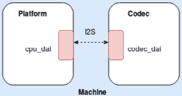
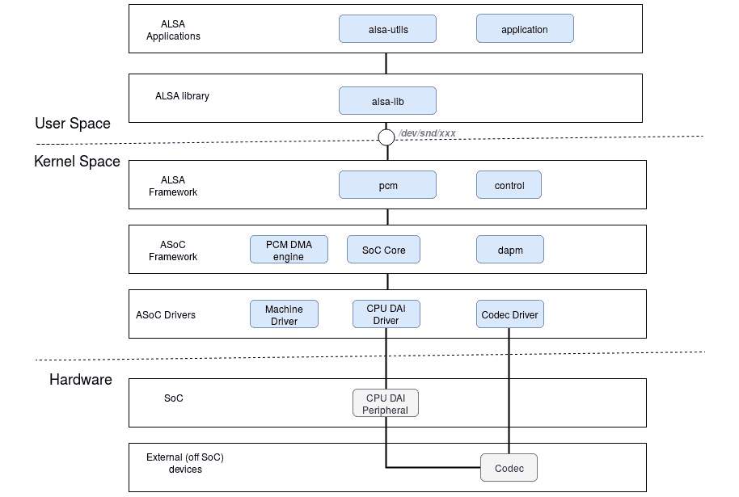
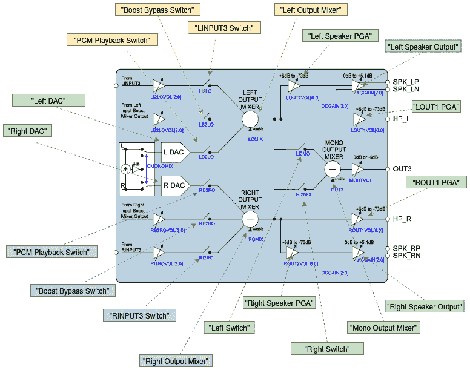
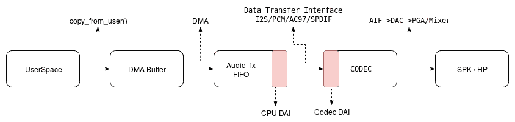

# 第五章：*第五章*：ALSA SoC 框架 – 利用编解码器和平台类驱动程序

音频是一种可以以各种方式产生的模拟现象。自人类开始以来，语音和音频一直是通信媒体。几乎每个内核都为用户空间应用程序提供音频支持，作为计算机与人类之间的交互机制。为了实现这一点，Linux 内核提供了一组称为**ALSA**的 API，代表**高级 Linux 音频架构**。

ALSA 是为台式电脑设计的，没有考虑嵌入式世界的限制。这在处理嵌入式设备时带来了很多缺点，比如：

+   编解码器和 CPU 代码之间的紧密耦合，导致移植困难和代码重复。

+   没有处理有关用户音频行为通知的标准方式。在移动场景中，用户的音频行为频繁，因此需要一种特殊的机制。

+   在原始的 ALSA 架构中，没有考虑功率效率。但对于嵌入式设备（大多数情况下是由电池支持的），这是一个关键点，因此需要一种机制。

这就是 ASoC 出现的地方。**ALSA 系统芯片**（**ASoC**）层的目的是为嵌入式处理器和各种编解码器提供更好的 ALSA 支持。

ASoC 是一种新的架构，旨在解决上述问题，并具有以下优点：

+   独立的编解码器驱动程序以减少与 CPU 的耦合

+   更方便地配置 CPU 和编解码器之间的音频数据接口**动态音频功率管理**（**DAPM**），动态控制功耗（更多信息请参见：[`www.kernel.org/doc/html/latest/sound/soc/dapm.html`](https://www.kernel.org/doc/html/latest/sound/soc/dapm.html)）

+   减少爆音和点击声，增加与平台相关的控制

为了实现上述功能，ASoC 将嵌入式音频系统分为三个可重用的组件驱动程序，即**机器类**、**平台类**和**编解码器类**。其中，平台和编解码器类是*跨平台*的，而机器类是*特定于板*的。在本章和下一章中，我们将详细介绍这些组件驱动程序，处理它们各自的数据结构以及它们的实现方式。

在这里，我们将介绍 Linux ASoC 驱动程序架构及其不同部分的实现，特别关注以下内容：

+   ASoC 简介

+   编写编解码器类驱动程序

+   编写平台类驱动程序

# 技术要求

+   对设备树概念的深入了解

+   熟悉**通用时钟框架**（**CCF**）（在*第四章**,* *突破通用时钟框架*中讨论）

+   熟悉 regmap API

+   熟悉 Linux 内核 DMA 框架

+   Linux 内核 v4.19.X 源代码，可在[`git.kernel.org/pub/scm/linux/kernel/git/stable/linux.git/refs/tags`](https://git.kernel.org/pub/scm/linux/kernel/git/stable/linux.git/refs/tags)找到

# ASoC 简介

从架构的角度来看，ASoC 子系统的元素及其关系可以表示如下：



图 5.1 – ASoC 架构

上述图表总结了新的 ASoC 架构，其中机器实体包装了平台和编解码器实体。

在内核 v4.18 之前的 ASoC 实现中，SoC 音频编解码器设备（现在由`struct snd_soc_codec`表示）和 SoC 平台接口（由`struct snd_soc_platform`表示）及其各自的数字音频接口之间有严格的分离。然而，编解码器、平台和其他组件之间的相似代码越来越多。这导致了一种新的通用方法，即`struct snd_soc_component`的概念（可以指代编解码器或平台）和`struct snd_soc_component_driver`（指代它们各自的音频接口驱动程序）。

现在我们已经介绍了 ASoC 的概念，我们可以深入讨论数字音频接口的细节。

## ASoC 数字音频接口

**数字音频接口**（**DAI**）是实际上从一端（例如 SoC）到另一端（编解码器）携带音频数据的总线控制器。ASoC 目前支持大多数 SoC 控制器和便携式音频编解码器上找到的 DAI，如 AC97、I2S、PCM、S/PDIF 和 TDM。

重要说明

I2S 模块支持六种不同的模式，其中最有用的是 I2S 和 TDM。

## ASoC 子元素

正如我们之前所见，ASoC 系统分为三个元素，每个元素都有一个专用的驱动程序，描述如下：

+   `struct snd_soc_component_driver`（参见`struct snd_pcm_ops`元素）结构。PCM 驱动程序与平台无关，只与 SOC DMA 引擎上游 API 交互。然后 DMA 引擎与特定于平台的 DMA 驱动程序交互，以获取正确的 DMA 设置。

它负责将**DMA 缓冲区**中的音频数据传输到总线（或端口）Tx FIFO。这部分的逻辑更加复杂。接下来的部分将对此进行详细阐述。

+   **编解码器**：编解码器字面上意味着编解码器，但芯片中有许多功能。常见的功能有 AIF、DAC、ADC、混音器、PGA、Line-in 和 Line-out。一些高端编解码器芯片还具有回声消除器、降噪等组件。编解码器负责将声源的模拟信号转换为处理器可以操作的数字信号（用于捕获操作），或者将声源（CPU）的数字信号转换为人类可以识别的模拟信号（用于播放）。必要时，它对音频信号进行相应的调整，并控制芯片中每个音频信号的路径，因为每个音频信号可能在芯片中有不同的流路径。

+   `cpu_dai`和`codec_dai`）。这种链接在内核中通过`struct snd_soc_dai_link`的实例来抽象。配置链接后，机器驱动程序通过`devm_snd_soc_register_card()`注册一个`struct snd_soc_card`对象，这是 Linux 内核对声卡的抽象。而平台和编解码器驱动程序通常是可重用的，机器具有其特定的几乎不可重用的硬件特性。所谓的硬件特性是指 DAI 之间的链接；通过 GPIO 的开放放大器；通过 GPIO 检测插件；使用时钟（如 MCLK/外部 OSC）作为 I2S CODEC 模块的参考时钟源，等等。

从前面的描述中，我们可以得出以下 ASoC 方案及其关系：



图 5.2- Linux 音频层和关系

上述图表是 Linux 内核音频组件之间交互的快照。现在我们熟悉了 ASoC 的概念，可以继续介绍它的第一个设备驱动程序类，即处理编解码器设备的类。

# 编写编解码器类驱动程序

为了进行耦合，机器、平台和编解码器实体需要专用驱动程序。编解码器类驱动程序是最基本的。它实现了应该利用编解码器设备并公开其硬件属性，以便用户空间工具（如 `amixer`）可以使用的代码。编解码器类驱动程序是并且应该是与平台无关的。无论平台如何，都可以使用相同的编解码器驱动程序。由于它针对特定的编解码器，因此应该包含音频控件、音频接口功能、编解码器 DAPM 定义和 I/O 函数。每个编解码器驱动程序必须满足以下规范：

+   通过定义 DAI 和 PCM 配置为其他模块提供接口。

+   提供编解码器控制 IO 钩子（使用 I2C 或 SPI 或两者的 API）。

+   根据需要公开额外的**kcontrols**（**内核控件**），以便用户空间实用程序动态控制模块行为。

+   可选择地定义 DAPM 小部件并建立 DAPM 路由以进行动态电源切换，并提供 DAC 数字静音控制。

编解码器驱动程序包括编解码器设备（实际上是组件本身）和 DAI 组件，在与平台绑定期间使用。它是与平台无关的。通过 `devm_snd_soc_register_component()`，编解码器驱动程序注册一个 `struct snd_soc_component_driver` 对象（实际上是包含指向编解码器路由、小部件、控件和一组编解码器相关函数回调的编解码器驱动程序实例），以及一个或多个 `struct snd_soc_dai_driver`，它是编解码器 DAI 驱动程序的实例，可以包含音频流，例如：

```
struct snd_soc_component_driver {
    const char *name;
    /* Default control and setup, added after probe() is run */
    const struct snd_kcontrol_new *controls;
    unsigned int num_controls;
    const struct snd_soc_dapm_widget *dapm_widgets;
    unsigned int num_dapm_widgets;
    const struct snd_soc_dapm_route *dapm_routes;
    unsigned int num_dapm_routes;
    int (*probe)(struct snd_soc_component *);
    void (*remove)(struct snd_soc_component *);
    int (*suspend)(struct snd_soc_component *);
    int (*resume)(struct snd_soc_component *);
    unsigned int (*read)(struct snd_soc_component *,                          unsigned int);
    int (*write)(struct snd_soc_component *, unsigned int,
                     unsigned int);
    /* pcm creation and destruction */
    int (*pcm_new)(struct snd_soc_pcm_runtime *);
    void (*pcm_free)(struct snd_pcm *);
    /* component wide operations */
    int (*set_sysclk)(struct snd_soc_component *component,                      int clk_id, 
                     int source, unsigned int freq, int dir);
    int (*set_pll)(struct snd_soc_component *component,
                   int pll_id, int source,                    unsigned int freq_in,
                   unsigned int freq_out);
    int (*set_jack)(struct snd_soc_component *component,
                    struct snd_soc_jack *jack, void *data);
    [...]
    const struct snd_pcm_ops *ops;
    [...]
    unsigned int non_legacy_dai_naming:1;
};
```

该结构也必须由平台驱动程序提供。但是，在 ASoC 核心中，该结构中唯一强制的元素是 `name`，因为它用于匹配组件。以下是该结构中元素的含义：

+   `name`: 该组件的名称对于编解码器和平台都是必需的。结构中的其他元素在平台端可能不需要。

+   `probe`: 组件驱动程序探测函数，在机器驱动程序探测到该组件驱动程序时执行（如果需要完成组件初始化）（实际上是当机器驱动程序使用该组件制作一张卡并在 ASoC 核心中注册时执行：参见 `snd_soc_instantiate_card()`）。

+   `remove`: 当组件驱动程序被注销时（当与该组件驱动程序绑定的声卡被注销时）。

+   `suspend` 和 `resume`: 在系统挂起或恢复阶段调用的电源管理回调。

+   `controls`: 控制接口指针，主要用于控制音量调节、通道选择等，大多数用于编解码器。

+   `set_pll`: 设置锁相环的函数指针。

+   `read`: 读取编解码器寄存器的函数。

+   `write`: 写入编解码器寄存器的函数。

+   `num_controls`: 控制中的控件数量，即 `snd_kcontrol_new` 对象的数量。

+   `dapm_widgets`: `dapm` 小部件指针。

+   `num_dapm_widgets`：`dapm` 部件指针的数量。

+   `dapm_routes`: `dapm route` 指针。

+   `num_dapm_routes`：`dapm` 路由指针的数量。

+   `set_sysclk`: 设置时钟函数指针。

+   `ops`: 平台 DMA 相关的回调，仅在从平台驱动程序中提供该结构时才需要（仅限 ALSA）；但是，在使用通用 PCM DMA 引擎框架时，ASoC 核心会通过专用的 ASoC DMA 相关 API 为您设置该字段。

到目前为止，我们已经在编解码器类驱动程序的上下文中介绍了 `struct snd_soc_component_driver` 数据结构。请记住，该结构抽象了编解码器和平台设备，并且在平台驱动程序的上下文中也将进行讨论。但是，在编解码器类驱动程序的上下文中，我们需要讨论 `struct snd_soc_dai_driver` 数据结构，它与 `struct snd_soc_component_driver` 一起，抽象了编解码器或平台设备，以及它的 DAI 驱动程序。

## 编解码器 DAI 和 PCM（又名 DSP）配置

这一部分相当通用，可能应该被命名为`struct snd_soc_dai_driver`，因为编解码器上有 DAI，必须使用`devm_snd_soc_register_component()` API 导出。这个函数还接受一个指向`struct snd_soc_component_driver`的指针，这是提供的 DAI 驱动程序将绑定并导出的组件驱动程序（实际上，插入到 ASoC 全局组件列表`component_list`中，该列表在`sound/soc/soc-core.c`中定义），以便机器驱动程序在注册声卡之前将其注册到核心。该结构涵盖了每个接口的时钟、格式和 ALSA 操作，并在`include/sound/soc-dai.h`中定义如下：

```
struct snd_soc_dai_driver {
    /* DAI description */
    const char *name;
    /* DAI driver callbacks */
    int (*probe)(struct snd_soc_dai *dai);
    int (*remove)(struct snd_soc_dai *dai);
    int (*suspend)(struct snd_soc_dai *dai);
    int (*resume)(struct snd_soc_dai *dai);
[...]
    /* ops */
    const struct snd_soc_dai_ops *ops;
    /* DAI capabilities */
    struct snd_soc_pcm_stream capture;
    struct snd_soc_pcm_stream playback;
    unsigned int symmetric_rates:1;
    unsigned int symmetric_channels:1;
    unsigned int symmetric_samplebits:1;
[...]
};
```

在前面的块中，为了便于阅读，只列举了结构的主要元素。以下是它们的含义：

+   `name`: 这是 DAI 接口的名称。

+   `probe`: DAI 驱动程序探测函数，在机器驱动程序探测到该 DAI 驱动程序所属的组件驱动程序时执行（实际上，当机器驱动程序向 ASoC 核心注册卡时）。

+   `remove`: 当组件驱动程序取消注册时调用。

+   `挂起`和`恢复`: 电源管理回调。

+   `ops`: 指向`struct snd_soc_dai_ops`结构的指针，该结构提供了配置和控制 DAI 的回调。

+   `capture`: 指向`struct snd_soc_pcm_stream`结构，表示音频捕获的硬件参数。该成员描述了在音频捕获过程中支持的通道数、比特率、数据格式等。如果不需要捕获功能，则无需初始化。

+   `播放`: 音频播放的硬件参数。该成员描述了在播放过程中支持的通道数、比特率、数据格式等。如果不需要音频播放功能，则无需初始化。

实际上，编解码器和平台驱动程序必须为它们拥有的每个 DAI 注册此结构。这就是使得这一部分变得通用的原因。稍后由机器驱动程序使用它来建立编解码器和 SoC 之间的链接。然而，还有其他数据结构需要一些时间来研究，以了解整个配置是如何完成的：这些是`struct snd_soc_pcm_stream`和`struct snd_soc_dai_ops`，在接下来的部分中进行了描述。

### DAI 操作

这些操作由`struct snd_soc_dai_ops`结构的实例抽象出来。该结构包含一组关于 PCM 接口的不同事件的回调（也就是说，在音频传输开始之前，您很可能希望以某种方式准备设备，因此您会将执行此操作的代码放入`prepare`回调中）或关于 DAI 时钟和格式配置的回调。该结构定义如下：

```
struct snd_soc_dai_ops {
    int (*set_sysclk)(struct snd_soc_dai *dai, int clk_id,
                      unsigned int freq, int dir);
    int (*set_pll)(struct snd_soc_dai *dai, int pll_id,                    int source,
                   unsigned int freq_in,                    unsigned int freq_out);
    int (*set_clkdiv)(struct snd_soc_dai *dai, int div_id,                       int div);
    int (*set_bclk_ratio)(struct snd_soc_dai *dai,                           unsigned int ratio);
    int (*set_fmt)(struct snd_soc_dai *dai, unsigned int fmt);
    int (*xlate_tdm_slot_mask)(unsigned int slots,
                               unsigned int *tx_mask,                                unsigned int *rx_mask); 
    int (*set_tdm_slot)(struct snd_soc_dai *dai,
                        unsigned int tx_mask,                         unsigned int rx_mask,
                        int slots, int slot_width);
    int (*set_channel_map)(struct snd_soc_dai *dai,
                           unsigned int tx_num,                            unsigned int *tx_slot,
                           unsigned int rx_num,                            unsigned int *rx_slot);
    int (*get_channel_map)(struct snd_soc_dai *dai,
                           unsigned int *tx_num,                            unsigned int *tx_slot,
                           unsigned int *rx_num,                            unsigned int *rx_slot);
    int (*set_tristate)(struct snd_soc_dai *dai, int tristate);
    int (*set_sdw_stream)(struct snd_soc_dai *dai,                           void *stream,
                          int direction);
    int (*digital_mute)(struct snd_soc_dai *dai, int mute);
    int (*mute_stream)(struct snd_soc_dai *dai, int mute,                        int stream);
    int (*startup)(struct snd_pcm_substream *,                    struct snd_soc_dai *);
    void (*shutdown)(struct snd_pcm_substream *,                      struct snd_soc_dai *);
    int (*hw_params)(struct snd_pcm_substream *,
                     struct snd_pcm_hw_params *,                      struct snd_soc_dai *); 
    int (*hw_free)(struct snd_pcm_substream *,                    struct snd_soc_dai *);
    int (*prepare)(struct snd_pcm_substream *,                    struct snd_soc_dai *);
    int (*trigger)(struct snd_pcm_substream *, int,
                   struct snd_soc_dai *);
};
```

该结构中的回调函数基本上可以分为三类，驱动程序可以根据实际情况实现其中的一些。

第一类是**时钟配置回调**，通常由机器驱动程序调用。这些回调如下：

+   `set_sysclk`设置 DAI 的主时钟。如果实现了这个回调，应该从系统或主时钟派生最佳的 DAI 位和帧时钟。机器驱动程序可以在`cpu_dai`和/或`codec_dai`上使用`snd_soc_dai_set_sysclk()` API 来调用这个回调。

+   `set_pll`设置 PLL 参数。如果实现了这个回调，应该配置并启用 PLL 以根据输入时钟生成输出时钟。机器驱动程序可以在`cpu_dai`和/或`codec_dai`上使用`snd_soc_dai_set_pll()` API 来调用这个回调。

+   `set_clkdiv`设置时钟分频因子。机器驱动程序调用此回调的 API 是`snd_soc_dai_set_clkdiv()`。

第二个回调类是 DAI 的**格式配置回调**，通常由机器驱动程序调用。这些回调如下：

+   `set_fmt`设置 DAI 的格式。机器驱动程序可以使用`snd_soc_dai_set_fmt()`API 调用此回调（在 CPU 或编解码器 DAI 上，或两者都有）以配置 DAI 硬件音频格式。

+   `set_tdm_slot`：如果 DAI 支持`snd_soc_dai_set_tdm_slot()`，则可以配置指定的 DAI 以进行 TDM 操作。

+   `set_channel_map`：通道 TDM 映射设置。机器驱动程序使用`snd_soc_dai_set_channel_map()`API 为指定的 DAI 调用此回调。

+   `set_tristate`：设置 DAI 引脚的状态，在与其他 DAI 并行使用同一引脚时需要。机器驱动程序可以使用`snd_soc_dai_set_tristate()`API 从机器驱动程序中调用它。

最后一个回调类是通常由 ASoC 核心调用的正常标准前端，用于收集 PCM 校正操作。相关的回调如下：

+   `startup`：当打开 PCM 子流（例如有人打开捕获/播放设备的设备文件）时，ALSA 会调用此函数。

+   `shutdown`：此回调应实现在启动期间所做的操作的撤消。

+   `hw_params`：在设置音频流时调用此函数。`struct snd_pcm_hw_params`包含音频特性。

+   `hw_free`：应撤消`hw_params`中所做的操作。

+   `prepare`：当 PCM 准备就绪时调用此函数。请参阅以下 PCM 常见状态更改流程，以了解何时调用此回调。根据与特定硬件平台相关的通道、`buffer_bytes`等设置 DMA 传输参数。

+   `trigger`：当 PCM 启动、停止和暂停时调用此函数。此回调中的`int`参数是一个命令，可以是`SNDRV_PCM_TRIGGER_START`、`SNDRV_PCM_TRIGGER_RESUME`或`SNDRV_PCM_TRIGGER_PAUSE_RELEASE`中的一个，根据事件。驱动程序可以使用`switch...case`来迭代事件。

+   （可选）`digital_mute`：ASoC 核心调用的防爆音。例如，当系统被挂起时，核心可能会调用它。

为了弄清前述回调如何被核心调用，让我们看一下 PCM 常见状态更改流程：

1.  **首次启动**：*off --> standby --> prepare --> on*

1.  **停止**：*on --> prepare --> standby*

1.  **恢复**：*standby --> prepare --> on*

在前述流程中的每个状态都会调用一个回调。总之，我们可以深入研究硬件配置数据结构，无论是捕获还是播放操作。

### 捕获和播放硬件配置

在捕获或播放操作期间，应设置 DAI 设置（如通道号）和功能，以允许配置底层 PCM 流。您可以通过为每个操作和每个 DAI 填充一个`struct snd_soc_pcm_stream`的实例来实现这一点，该结构在编解码器和平台驱动程序中都有定义：

```
struct snd_soc_pcm_stream {
    const char *stream_name;
    u64 formats;
    unsigned int rates; 
    unsigned int rate_min;
    unsigned int rate_max;
    unsigned int channels_min;
    unsigned int channels_max;
    unsigned int sig_bits;
};
```

该结构的主要成员可以描述如下：

+   `stream_name`：流的名称，可以是``"Playback"``或``"Capture"``。

+   `formats`：一组支持的数据格式（有效值在`include/sound/pcm.h`中以`SNDRV_PCM_FMTBIT_`为前缀定义），例如`SNDRV_PCM_FMTBIT_S16_LE`或`SNDRV_PCM_FMTBIT_S24_LE`。如果支持多种格式，则可以组合每种格式，例如`SNDRV_PCM_FMTBIT_S16_LE | SNDRV_PCM_FMTBIT_S20_3LE`。

+   `rates`：一组支持的采样率（以`SNDRV_PCM_RATE_`为前缀，所有有效值均在`include/sound/pcm.h`中定义），例如`SNDRV_PCM_RATE_44100`或`SNDRV_PCM_RATE_48000`。如果支持多个采样率，则可以增加每个采样率，例如`SNDRV_PCM_RATE_48000 | SNDRV_PCM_RATE_88200`。

+   `rate_min`：支持的最小采样率。

+   `rate_max`：支持的最大采样率。

+   `channels_min`：支持的最小通道数。

## 控制的概念

编解码器驱动程序通常会公开一些可以从用户空间更改的编解码器属性。这些是编解码器控件。当初始化编解码器时，所有定义的音频控件都会注册到 ALSA 核心。音频控件的结构是`include/sound/control.h`中定义的`struct snd_kcontrol_new`。

除了 DAI 总线外，编解码器设备通常配备有一个控制总线，大多数情况下是 I2C 或 SPI 总线。为了不让每个编解码器驱动程序都去实现其控制访问例程，编解码器控制 I/O 已经被标准化。这就是 regmap API 的起源。您可以使用 regmap 来抽象控制接口，以便编解码器驱动程序不必担心当前的控制方法是什么。音频编解码器前端是在`soc/soc-io.c`中实现的。这依赖于已经讨论过的 regmap API，在*第二章*中，*利用 Regmap API 简化代码*。

然后，编解码器驱动程序需要提供读取和写入接口，以便访问底层编解码器寄存器。这些回调需要在编解码器组件驱动程序的`.read`和`.write`字段中设置，即`struct snd_soc_component_driver`。以下是可用于访问组件寄存器的高级 API：

```
int snd_soc_component_write(struct                             snd_soc_component *component,
                            unsigned int reg, unsigned int val)
int snd_soc_component_read(struct snd_soc_component *component,
                           unsigned int reg,                            unsigned int *val)
int snd_soc_component_update_bits(struct                                   snd_soc_component *component, 
                                  unsigned int reg,                                   unsigned int mask,                                   unsigned int val)
int snd_soc_component_test_bits(struct                                 snd_soc_component *component, 
                                unsigned int reg,   
                                unsigned int mask,       
                                unsigned int value)
```

前面的每个辅助程序都是自描述的。在深入控制实现之前，请注意控制框架由几种类型组成：

+   一个简单的开关控制，即寄存器中的单个逻辑值

+   立体声控制 - 是前述简单开关控制的立体声版本，在寄存器中同时控制两个逻辑值

+   混音控制 - 是多个简单控制的组合，其输出是其输入的混合

+   MUX 控制 - 与前述混音控制相同，但在多个控件中选择一个

在 ALSA 中，控件通过`struct snd_kcontrol_new`结构进行抽象，定义如下：

```
struct snd_kcontrol_new {
    snd_ctl_elem_iface_t iface;
    unsigned int device;
    unsigned int subdevice;	
    const unsigned char *name;
    unsigned int index;
    unsigned int access;
    unsigned int count;
    snd_kcontrol_info_t *info;
    snd_kcontrol_get_t *get;
    snd_kcontrol_put_t *put;
    union {
        snd_kcontrol_tlv_rw_t *c;
        const unsigned int *p;
    } tlv;
    [...]
};
```

上述数据结构中字段的描述如下：

+   `iface`字段指定控制类型。它是`snd_ctl_elem_iface_t`类型，是`SNDRV_CTL_ELEM_IFACE_XXX`的枚举，其中`XXX`可以是`MIXER`、`PCM`等。可能的值列表可以在这里找到：[`elixir.bootlin.com/linux/v4.19/source/include/uapi/sound/asound.h#L848`](https://elixir.bootlin.com/linux/v4.19/source/include/uapi/sound/asound.h#L848)。如果控制与声卡上的特定设备密切相关，可以使用`HWDEP`、`PCM`、`RAWMIDI`、`TIMER`或`SEQUENCER`，并使用设备和子设备（即设备中的子流）字段指定设备号。

+   `name`是控制的名称。该字段具有重要作用，允许按名称对控件进行分类。ALSA 已经在某种程度上标准化了一些控件名称，我们将在*控件命名约定*部分详细讨论。

+   `index`字段用于保存卡上控件的数量。如果声卡上有多个编解码器，并且每个编解码器都有相同名称的控制，则可以通过`index`来区分这些控制。当`index`为 0 时，可以忽略这种区分策略。

+   `access`包含控制的访问权限，格式为`SNDRV_CTL_ELEM_ACCESS_XXX`。每个位表示一个访问类型，可以与多个 OR 操作组合。`XXX`可以是`READ`、`WRITE`或`VOLATILE`等。可能的位掩码可以在这里找到：[`elixir.bootlin.com/linux/v4.19/source/include/uapi/sound/asound.h#L858`](https://elixir.bootlin.com/linux/v4.19/source/include/uapi/sound/asound.h#L858)。

+   `get`是用于读取控制的当前值并将其返回到用户空间应用程序的回调函数。

+   `put`是用于将应用程序的控制值设置为控制的回调函数。

+   `info`回调函数用于获取有关控件的详细信息。

+   `tlv`字段为控件提供元数据。

### 控件命名约定

ALSA 期望以某种方式命名控件。为了实现这一点，ALSA 预定义了一些常用的源（如 Master、PCM、CD、Line 等）、方向（表示控件的数据流动，如 Playback、Capture、Bypass、Bypass Capture 等）和功能（根据控件的功能，如 Switch、Volume、Route 等）。请注意，如果没有方向的定义，这意味着控件是双向的（播放和捕获）。

您可以参考以下链接，了解有关 ALSA 控件命名的更多详细信息：[`www.kernel.org/doc/html/v4.19/sound/designs/control-names.html`](https://www.kernel.org/doc/html/v4.19/sound/designs/control-names.html)。

### 控件元数据

有些混音控件需要在`DECLARE_TLV_xxx`宏中提供信息，以定义包含此信息的一些变量，然后将控件`tlv.p`字段指向这些变量，并最后将`SNDRV_CTL_ELEM_ACCESS_TLV_READ`标志添加到访问字段中。

`DECLARE_TLV_DB_SCALE`将定义有关混音控件的信息，其中控件值的每一步更改都会以恒定的 dB 量改变。让我们看下面的例子：

```
static DECLARE_TLV_DB_SCALE(db_scale_my_control, -4050, 150,                             0);
```

根据`include/sound/tlv.h`中此宏的定义，上述示例可以扩展为以下内容：

```
static struct snd_kcontrol_new my_control devinitdata = {
    [...]
    .access =
     SNDRV_CTL_ELEM_ACCESS_READWRITE |      SNDRV_CTL_ELEM_ACCESS_TLV_READ,
    [...]
    .tlv.p = db_scale_my_control,
};
```

宏的第一个参数表示要定义的变量的名称；第二个表示此控件可以接受的最小值，以`0.01` dB 为单位。第三个参数是更改的步长，也是以`0.01` dB 的步长。如果在控件处于最小值时执行静音操作，则需要将第四个参数设置为`1`。请查看`include/sound/tlv.h`以查看可用的宏。

在声卡注册时，将调用`snd_ctl_dev_register()`函数，以保存有关控制设备的相关信息，并使其对用户可用。

### 定义 kcontrols

kcontrols 由 ASoC 核心用于向用户空间导出音频控件（如开关、音量、*MUX…）。这意味着，例如，当用户空间应用程序（如 PulseAudio）在未插入耳机时关闭耳机或打开扬声器时，该操作由 kcontrols 在内核中处理。普通的 kcontrols 不涉及电源管理（DAPM）。它们专门用于控制非基于电源管理的元素，如音量级别、增益级别等。一旦使用适当的宏设置了控件，必须使用`snd_soc_add_component_controls()`方法将其注册到系统控件列表中，其原型如下：

```
int snd_soc_add_component_controls(
                       struct snd_soc_component *component,
                       const struct snd_kcontrol_new *controls, 
                       unsigned int num_controls);
```

在上述原型中，`component`是您为其添加控件的组件，`controls`是要添加的控件数组，`num_controls`是需要添加的数组中的条目数。

为了了解这个 API 有多简单，让我们考虑以下示例，定义一些控件：

```
static const DECLARE_TLV_DB_SCALE(dac_tlv, -12750, 50, 1);
static const DECLARE_TLV_DB_SCALE(out_tlv, -12100, 100, 1);
static const DECLARE_TLV_DB_SCALE(bypass_tlv, -2100, 300, 0);
static const struct snd_kcontrol_new wm8960_snd_controls[] = {
    [...]
    SOC_DOUBLE_R_TLV("Playback Volume", WM8960_LDAC,                      WM8960_RDAC, 0,
                     255, 0, dac_tlv),
    SOC_DOUBLE_R_TLV("Headphone Playback Volume", WM8960_LOUT1,
                      WM8960_ROUT1, 0, 127, 0, out_tlv),
    SOC_DOUBLE_R("Headphone Playback ZC Switch", WM8960_LOUT1,
                      WM8960_ROUT1, 7, 1, 0),
    SOC_DOUBLE_R_TLV("Speaker Playback Volume", WM8960_LOUT2, 
                      WM8960_ROUT2, 0, 127, 0, out_tlv),
    SOC_DOUBLE_R("Speaker Playback ZC Switch", WM8960_LOUT2, 
                      WM8960_ROUT2, 7, 1, 0),
    SOC_SINGLE("Speaker DC Volume", WM8960_CLASSD3, 3, 5, 0),
    SOC_SINGLE("Speaker AC Volume", WM8960_CLASSD3, 0, 5, 0),
    SOC_ENUM("DAC Polarity", wm8960_enum[1]),
    SOC_SINGLE_BOOL_EXT("DAC Deemphasis Switch", 0,                         wm8960_get_deemph, 
                        wm8960_put_deemph),
    [...]
    SOC_SINGLE("Noise Gate Threshold", WM8960_NOISEG, 3, 31, 0),
    SOC_SINGLE("Noise Gate Switch", WM8960_NOISEG, 0, 1, 0),
    SOC_DOUBLE_R_TLV("ADC PCM Capture Volume", WM8960_LADC,
                      WM8960_RADC, 0, 255, 0, adc_tlv),
    SOC_SINGLE_TLV("Left Output Mixer Boost Bypass Volume",
                      WM8960_BYPASS1, 4, 7, 1, bypass_tlv),
};
```

注册前述控件的相应代码如下：

```
snd_soc_add_component_controls(component, wm8960_snd_controls,
                              ARRAY_SIZE(wm8960_snd_controls));
```

以下是使用这些预设宏定义常用控件的方法。

SOC_SINGLE(xname, reg, shift, max, invert)

要设置一个简单的开关，我们可以使用`SOC_SINGLE`。这是最简单的控件：

```
#define SOC_SINGLE(xname, reg, shift, max, invert) \
{  .iface = SNDRV_CTL_ELEM_IFACE_MIXER, .name = xname, \
   .info = snd_soc_info_volsw, .get = snd_soc_get_volsw,\
   .put = snd_soc_put_volsw, \
   .private_value = SOC_SINGLE_VALUE(reg, shift, max, invert) }
```

这种类型的控件只有一个设置，通常用于组件开关。由宏定义的参数描述如下：

+   `xname`：控制的名称。

+   `reg`：与控件对应的寄存器地址。

+   `Shift`：在寄存器`reg`中控制位的偏移量（从哪里应用更改）。

+   `max`：控件设置的值范围。一般来说，如果控制位只有`1`位，则`max=1`，因为可能的值只有`0`和`1`。

+   `invert`：设置值是否被反转。

让我们来学习以下示例：

```
SOC_SINGLE("PCM Playback -6dB Switch", WM8960_DACCTL1, 7, 1,            0),
```

在前面的示例中，`PCM Playback -6dB Switch`是控制的名称。`WM8960_DACCTL1`（在`wm8960.h`中定义）是在编解码器（WM8960 芯片）中的寄存器的地址，允许您控制此开关：

+   `7`表示`DACCTL1`寄存器中的第`7`位用于启用/禁用 6dB 衰减的 DAC。

+   `1`表示只有一个启用或禁用选项。

+   `0`表示您设置的值没有被反转。

#### SOC_SINGLE_TLV（xname，reg，shift，max，invert，tlv_array）

这个宏设置了一个带有级别的开关。它是`SOC_SINGLE`的扩展，用于定义具有增益控制的控件，例如音量控件，EQ 均衡器等。在这个例子中，左输入音量控制范围从 000000（`-17.25` dB）到 111111（`+30` dB）。每个步骤为`0.75` dB，意味着总共`63`个步骤：

```
SOC_SINGLE_TLV("Input Volume of LINPUT1",
               WM8960_LINVOL, 0, 63, 0, in_tlv),
```

`in_tlv`的刻度（代表控制元数据）声明如下：

```
static const DECLARE_TLV_DB_SCALE(in_tlv, -1725, 75, 0);
```

在上述示例中，`-1725`表示控制刻度从`-17.25dB`开始。`75`表示每个步骤为`0.75dB`，`0`表示步骤从 0 开始。对于一些音量控制情况，第一步是“静音”，步骤从`1`开始。因此，上述代码中的`0`应替换为`1`。

#### SOC_DOUBLE_R（xname，reg_left，reg_right，xshift，xmax，xinvert）

`SOC_DOUBLE_R`是`SOC_SINGLE`的立体声版本。不同之处在于`SOC_SINGLE`只控制一个变量，而`SOC_DOUBLE`可以同时控制一个寄存器中的两个相似变量。我们可以使用这个来同时控制左右声道。

由于有一个额外的通道，参数具有相应的移位值。以下是一个示例：

```
SOC_DOUBLE_R("Headphone ZC Switch", WM8960_LOUT1,
             WM8960_ROUT1, 7, 1, 0),
```

#### SOC_DOUBLE_R_TLV（xname，reg_left，reg_right，xshift，xmax，xinvert，tlv_array）

`SOC_DOUBLE_R_TLV`是`SOC_SINGLE_TLV`的立体声版本。以下是其用法示例：

```
SOC_DOUBLE_R_TLV("PCM DAC Playback Volume", WM8960_LDAC,
                 WM8960_RDAC, 0, 255, 0, dac_tlv),
```

#### 混音控制

混音控制用于路由音频通道的控制。它由多个输入和一个输出组成。多个输入可以自由混合在一起形成混合输出：

```
static const struct snd_kcontrol_new left_speaker_mixer[] = {
    SOC_SINGLE("Input Switch", WM8993_SPEAKER_MIXER, 7, 1, 0),
    SOC_SINGLE("IN1LP Switch", WM8993_SPEAKER_MIXER, 5, 1, 0),
    SOC_SINGLE("Output Switch", WM8993_SPEAKER_MIXER, 3, 1, 0),
    SOC_SINGLE("DAC Switch", WM8993_SPEAKER_MIXER, 6, 1, 0),
};
```

前述混音使用`WM8993_SPEAKER_MIXER`寄存器的第三、第五、第六和第七位来控制四个输入的打开和关闭。

#### SOC_ENUM_SINGLE（xreg，xshift，xmax，xtexts）

这个宏定义了一个单个枚举控制，其中`xreg`是要修改以应用设置的寄存器，`xshift`是寄存器中的控制位偏移，`xmask`是控制位大小，`xtexts`是指向描述每个设置的字符串数组的指针。当控制选项是一些文本时使用。

例如，我们可以设置文本数组如下：

```
static const char  *aif_text[] = { 
    "Left" , "Right"
};
```

然后定义枚举如下：

```
static const struct	soc_enum aifinl_enum =
    SOC_ENUM_SINGLE(WM8993_AUDIO_INTERFACE_2, 15, 2, aif_text);
```

现在我们已经了解了控件的概念，它们用于更改音频设备的属性，我们将学习如何利用它并玩转音频设备的功率属性。

## DAPM 的概念

现代声卡由许多独立的离散组件组成。每个组件都有可以独立供电的功能单元。问题是，嵌入式系统大部分时间都是由电池供电的，并且需要最低功耗模式。手动管理电源域依赖可能会很繁琐且容易出错。**动态音频功率管理**（**DAPM**）旨在在音频子系统中始终以最低功耗使用电源。DAPM 用于需要电源控制并且如果不需要电源管理则可以跳过的事物。只有当事物与电源有关时，才会进入 DAPM - 也就是说，如果它们是需要电源控制的事物，或者如果它们控制了音频通过芯片的路由（因此让核心决定哪些芯片部分需要通电）。

DAPM 位于 ASoC 核心中（这意味着电源切换是从内核内部完成的），并且在音频流/路径/设置发生变化时变得活跃，使其对所有用户空间应用程序完全透明。

在前面的部分中，我们介绍了控件的概念以及如何处理它们。然而，单独的 kcontrols 并不涉及音频电源管理。普通的 kcontrol 具有以下特征：

+   自描述，无法描述每个 kcontrol 之间的连接关系。

+   缺乏电源管理机制。

+   缺乏响应音频事件的时间处理机制，例如播放、停止、开机和关机。

+   缺乏防止啪啪声的机制，因此用户程序需要注意每个 kcontrol 的开机和关机顺序。

+   手动，因为所有涉及音频路径的控件不能自动关闭。当音频路径不再有效时，需要用户空间干预。

DAPM 引入了小部件的概念，以解决上述问题。小部件是 DAPM 的基本单元。因此，所谓的小部件可以理解为对 kcontrols 的进一步升级和封装。

小部件是 kcontrols 和动态电源管理的组合，还具有音频路径的链接功能。它可以与相邻小部件建立动态连接关系。

DAPM 框架通过`struct snd_soc_dapm_widget`结构来抽象小部件，该结构在`include/sound/soc-dapm.h`中定义如下：

```
struct snd_soc_dapm_widget {
    enum snd_soc_dapm_type id;
    const char *name;
    const char *sname;
[...]
    /* dapm control */
    int reg;	/* negative reg = no direct dapm */
    unsigned char shift;
    unsigned int mask;
    unsigned int on_val;
    unsigned int off_val;
[...]
    int (*power_check)(struct snd_soc_dapm_widget *w);
    /* external events */
    unsigned short event_flags;
    int (*event)(struct snd_soc_dapm_widget*,
                 struct snd_kcontrol *, int);
    /* kcontrols that relate to this widget */
    int num_kcontrols;
    const struct snd_kcontrol_new *kcontrol_news;
    struct snd_kcontrol **kcontrols;
    struct snd_soc_dobj dobj;
    /* widget input and output edges */
    struct list_head edges[2];
    /* used during DAPM updates */
    struct list_head dirty;
[...]
}
```

为了便于阅读，上述片段中仅列出了相关字段，以下是它们的描述：

+   `id`是`enum snd_soc_dapm_type`类型，表示小部件的类型，例如`snd_soc_dapm_output`、`snd_soc_dapm_mixer`等。完整列表在`include/sound/soc-dapm.h`中定义。

+   `name`是小部件的名称。

+   `shift`和`mask`用于控制小部件的电源状态，对应于寄存器地址`reg`。

+   `on_val`和`off_val`值表示用于改变小部件当前电源状态的值。它们分别对应于开启时和关闭时。

+   `event`表示 DAPM 事件处理回调函数指针。每个小部件都与一个 kcontrol 对象相关联，由`**kcontrols`指向。

+   `*kcontrol_news`是此 kcontrol 包含的控件数组，`num_kcontrols`是其中的条目数。这三个字段用于描述包含在小部件中的 kcontrol 控件，例如混音控件或 MUX 控件。

+   `dirty`用于在小部件状态改变时将该小部件插入脏列表中。然后扫描该脏列表以执行整个路径的更新。

### 定义小部件

与普通的 kcontrol 一样，DAPM 框架为我们提供了大量的辅助宏来定义各种小部件控件。这些宏定义可以根据小部件的类型和它们所在的领域分成几个字段。它们如下：

+   `VREF`和`VMID`；它们提供参考电压小部件。这些小部件通常在编解码器探测/移除回调中进行控制。

+   **平台/机器领域**：这些小部件通常是平台或板（实际上是机器）的输入/输出接口，需要进行物理连接，例如耳机、扬声器和麦克风。也就是说，由于这些接口在每个板上可能不同，它们通常由机器驱动程序进行配置，并响应异步事件，例如插入耳机时。它们也可以被用户空间应用程序控制以某种方式打开和关闭。

+   `alsamixer`和`amixer`。

+   `aplay`和`arecord`。

所有 DAPM 电源切换决策都是根据特定于机器的音频路由图自动进行的，该图由每个音频组件（包括内部编解码器组件）之间的互连组成。

#### 编解码器领域定义

DAPM 框架仅为该领域提供了一个宏：

```
/* codec domain */
#define SND_SOC_DAPM_VMID(wname) \
    .id = snd_soc_dapm_vmid, .name = wname,     .kcontrol_news = NULL, \
    .num_kcontrols = 0}
```

#### 定义平台领域小部件

平台域的小部件分别对应信号发生器、输入引脚、输出引脚、麦克风、耳机、扬声器和线路输入接口。DAPM 框架为平台域小部件提供了许多辅助定义宏。这些定义如下：

```
#define SND_SOC_DAPM_SIGGEN(wname) \
{   .id = snd_soc_dapm_siggen, .name = wname,     .kcontrol_news = NULL, \
    .num_kcontrols = 0, .reg = SND_SOC_NOPM }
#define SND_SOC_DAPM_SINK(wname) \
{   .id = snd_soc_dapm_sink, .name = wname,     .kcontrol_news = NULL, \
    .num_kcontrols = 0, .reg = SND_SOC_NOPM }
#define SND_SOC_DAPM_INPUT(wname) \
{   .id = snd_soc_dapm_input, .name = wname,     .kcontrol_news = NULL, \
    .num_kcontrols = 0, .reg = SND_SOC_NOPM }
#define SND_SOC_DAPM_OUTPUT(wname) \
{   .id = snd_soc_dapm_output, .name = wname,     .kcontrol_news = NULL, \
    .num_kcontrols = 0, .reg = SND_SOC_NOPM }
#define SND_SOC_DAPM_MIC(wname, wevent) \
{   .id = snd_soc_dapm_mic, .name = wname,     .kcontrol_news = NULL, \
    .num_kcontrols = 0, .reg = SND_SOC_NOPM, .event = wevent, \
    .event_flags = SND_SOC_DAPM_PRE_PMU |      SND_SOC_DAPM_POST_PMD}
#define SND_SOC_DAPM_HP(wname, wevent) \
{   .id = snd_soc_dapm_hp, .name = wname,     .kcontrol_news = NULL, \
    .num_kcontrols = 0, .reg = SND_SOC_NOPM, .event = wevent, \
    .event_flags = SND_SOC_DAPM_POST_PMU |      SND_SOC_DAPM_PRE_PMD}
#define SND_SOC_DAPM_SPK(wname, wevent) \
{   .id = snd_soc_dapm_spk, .name = wname,     .kcontrol_news = NULL, \
    .num_kcontrols = 0, .reg = SND_SOC_NOPM, .event = wevent, \
    .event_flags = SND_SOC_DAPM_POST_PMU |      SND_SOC_DAPM_PRE_PMD}
#define SND_SOC_DAPM_LINE(wname, wevent) \
{   .id = snd_soc_dapm_line, .name = wname,     .kcontrol_news = NULL, \
    .num_kcontrols = 0, .reg = SND_SOC_NOPM, .event = wevent, \
    .event_flags = SND_SOC_DAPM_POST_PMU |      SND_SOC_DAPM_PRE_PMD}
#define SND_SOC_DAPM_INIT_REG_VAL(wreg, wshift, winvert) \
    .reg = wreg, .mask = 1, .shift = wshift, \
    .on_val = winvert ? 0 : 1, .off_val = winvert ? 1 : 0
```

在前面的代码中，这些宏中的大多数字段是通用的。`reg`字段设置为`SND_SOC_NOPM`（定义为`-1`）的事实意味着这些小部件没有寄存器控制位来控制小部件的电源状态。`SND_SOC_DAPM_INPUT`和`SND_SOC_DAPM_OUTPUT`用于从编解码器驱动程序内部定义编解码器芯片的输出和输入引脚。从我们可以看到，`MIC`、`HP`、`SPK`和`LINE`小部件响应`SND_SOC_DAPM_POST_PMU`（小部件上电后）和`SND_SOC_DAPM_PMD`（小部件下电前）事件，这些小部件通常在机器驱动程序中定义。

#### 定义音频路径域小部件

这种类型的小部件通常重新打包普通的 kcontrols，并使用音频路径和电源管理功能进行扩展。这种扩展在某种程度上使这种小部件具有 DAPM 意识。该域中的小部件将包含一个或多个不是普通 kcontrols 的 kcontrols。这些是启用了 DAPM 的 kcontrols。这些不能使用标准方法进行定义，即`SOC_*-b`ased 宏控件。它们需要使用 DAPM 框架提供的定义宏进行定义。我们将在后面的*定义 DAPM kcontrols*部分详细讨论它们。然而，这里是这些小部件的定义宏：

```
#define SND_SOC_DAPM_PGA(wname, wreg, wshift, winvert,\ 
                         wcontrols, wncontrols) \
{   .id = snd_soc_dapm_pga, .name = wname, \
    SND_SOC_DAPM_INIT_REG_VAL(wreg, wshift, winvert), \
    .kcontrol_news = wcontrols, .num_kcontrols = wncontrols}
#define SND_SOC_DAPM_OUT_DRV(wname, wreg, wshift, winvert,\
                               wcontrols, wncontrols) \
{   .id = snd_soc_dapm_out_drv, .name = wname, \ 
    SND_SOC_DAPM_INIT_REG_VAL(wreg, wshift, winvert), \
    .kcontrol_news = wcontrols, .num_kcontrols = wncontrols}
#define SND_SOC_DAPM_MIXER(wname, wreg, wshift, winvert, \
                              wcontrols, wncontrols)\
{   .id = snd_soc_dapm_mixer, .name = wname, \ 
    SND_SOC_DAPM_INIT_REG_VAL(wreg, wshift, winvert), \
    .kcontrol_news = wcontrols, .num_kcontrols = wncontrols}
#define SND_SOC_DAPM_MIXER_NAMED_CTL(wname, wreg,                                      wshift, winvert, \
                                     wcontrols, wncontrols)\
{   .id = snd_soc_dapm_mixer_named_ctl, .name = wname, \
    SND_SOC_DAPM_INIT_REG_VAL(wreg, wshift, winvert), \
    .kcontrol_news = wcontrols, .num_kcontrols = wncontrols}
#define SND_SOC_DAPM_SWITCH(wname, wreg, wshift, winvert, wcontrols) \
{   .id = snd_soc_dapm_switch, .name = wname, \ 
    SND_SOC_DAPM_INIT_REG_VAL(wreg, wshift, winvert), \
    .kcontrol_news = wcontrols, .num_kcontrols = 1}
#define SND_SOC_DAPM_MUX(wname, wreg, wshift,                          winvert, wcontrols) \
{   .id = snd_soc_dapm_mux, .name = wname, \
    SND_SOC_DAPM_INIT_REG_VAL(wreg, wshift, winvert), \
    .kcontrol_news = wcontrols, .num_kcontrols = 1}
#define SND_SOC_DAPM_DEMUX(wname, wreg, wshift,                            winvert, wcontrols) \
{   .id = snd_soc_dapm_demux, .name = wname, \ 
    SND_SOC_DAPM_INIT_REG_VAL(wreg, wshift, winvert), \
    .kcontrol_news = wcontrols, .num_kcontrols = 1}
```

与平台和编解码器域小部件不同，需要分配`reg`和`shift`字段，表明这些小部件具有相应的电源控制寄存器。DAPM 框架使用这些寄存器来在扫描和更新音频路径时控制小部件的电源状态。它们的电源状态是动态分配的，在需要时上电（在有效的音频路径上），在不需要时下电（在非活动的音频路径上）。这些小部件需要执行与前面介绍的混音器、MUX 等相同的功能。实际上，这是由它们包含的 kcontrol 控件来完成的。驱动程序代码必须在定义小部件之前定义 kcontrols，然后将`wcontrols`和`num_kcontrols`参数传递给这些辅助定义宏。

存在另一种宏的变体，它具有指向事件处理程序的指针。这些宏具有`_E`后缀。它们是`SND_SOC_DAPM_PGA_E`、`SND_SOC_DAPM_OUT_DRV_E`、`SND_SOC_DAPM_MIXER_E`、`SND_SOC_DAPM_MIXER_NAMED_CTL_E`、`SND_SOC_DAPM_SWITCH_E`、`SND_SOC_DAPM_MUX_E`和`SND_SOC_DAPM_VIRT_MUX_E`。鼓励您查看内核源代码，以查看它们在[`elixir.bootlin.com/linux/v4.19/source/include/sound/soc-dapm.h#L136`](https://elixir.bootlin.com/linux/v4.19/source/include/sound/soc-dapm.h#L136)中的定义。

#### 定义音频流域

这些小部件主要包括音频输入/输出接口、ADC/DAC 和时钟线。从音频接口小部件开始，它们如下：

```
#define SND_SOC_DAPM_AIF_IN(wname, stname, wslot, wreg, wshift, winvert) \
{  .id = snd_soc_dapm_aif_in, .name = wname, .sname = stname, \
   SND_SOC_DAPM_INIT_REG_VAL(wreg, wshift, winvert), }
#define SND_SOC_DAPM_AIF_IN_E(wname, stname, wslot, wreg, \
                             wshift, winvert, wevent, wflags) \
{  .id = snd_soc_dapm_aif_in, .name = wname, .sname = stname, \
   SND_SOC_DAPM_INIT_REG_VAL(wreg, wshift, winvert), \
   .event = wevent, .event_flags = wflags }
#define SND_SOC_DAPM_AIF_OUT(wname, stname, wslot, wreg, wshift, winvert) \
{ .id = snd_soc_dapm_aif_out, .name = wname, .sname = stname, \ 
     SND_SOC_DAPM_INIT_REG_VAL(wreg, wshift, winvert), }
#define SND_SOC_DAPM_AIF_OUT_E(wname, stname, wslot, wreg, \
                             wshift, winvert, wevent, wflags) \
{ .id = snd_soc_dapm_aif_out, .name = wname, .sname = stname, \
     SND_SOC_DAPM_INIT_REG_VAL(wreg, wshift, winvert), \
     .event = wevent, .event_flags = wflags }
```

在前面的宏定义列表中，`SND_SOC_DAPM_AIF_IN`和`SND_SOC_DAPM_AIF_OUT`分别是音频接口输入和输出。前者定义了连接到接收要传递到 DAC 的音频的主机的连接，后者定义了连接到从 ADC 接收的音频传输到主机的连接。`SND_SOC_DAPM_AIF_IN_E`和`SND_SOC_DAPM_AIF_OUT_E`是它们各自的事件变体，允许在`wflags`中启用的事件发生时调用`wevent`。

现在是 ADC/DAC 相关的小部件，以及与时钟相关的小部件，定义如下：

```
#define SND_SOC_DAPM_DAC(wname, stname, wreg,                          wshift, winvert) \
{    .id = snd_soc_dapm_dac, .name = wname, .sname = stname, \ 
     SND_SOC_DAPM_INIT_REG_VAL(wreg, wshift, winvert) }
#define SND_SOC_DAPM_DAC_E(wname, stname, wreg, wshift, \
                           winvert, wevent, wflags) \
{    .id = snd_soc_dapm_dac, .name = wname, .sname = stname, \ 
     SND_SOC_DAPM_INIT_REG_VAL(wreg, wshift, winvert), \
     .event = wevent, .event_flags = wflags}
#define SND_SOC_DAPM_ADC(wname, stname, wreg,                          wshift, winvert) \
{    .id = snd_soc_dapm_adc, .name = wname, .sname = stname, \ 
     SND_SOC_DAPM_INIT_REG_VAL(wreg, wshift, winvert), }
#define SND_SOC_DAPM_ADC_E(wname, stname, wreg, wshift,\
                           winvert, wevent, wflags) \
{    .id = snd_soc_dapm_adc, .name = wname, .sname = stname, \ 
     SND_SOC_DAPM_INIT_REG_VAL(wreg, wshift, winvert), \
     .event = wevent, .event_flags = wflags}
#define SND_SOC_DAPM_CLOCK_SUPPLY(wname) \
{    .id = snd_soc_dapm_clock_supply, .name = wname, \
    .reg = SND_SOC_NOPM, .event = dapm_clock_event, \
    .event_flags = SND_SOC_DAPM_PRE_PMU | SND_SOC_DAPM_POST_PMD }
```

在前面的宏列表中，`SND_SOC_DAPM_ADC`和`SND_SOC_DAPM_DAC`分别是 ADC 和 DAC 小部件。前者用于根据需要控制 ADC 的开启和关闭，而后者则针对 DAC。前者通常与设备上的捕获流相关联，例如“左捕获”或“右捕获”，而后者通常与播放流相关联，例如“左播放”或“右播放”。寄存器设置定义了一个单一的寄存器和位位置，翻转时将打开或关闭 ADC/DAC。您还应该注意它们的事件变体，分别是`SND_SOC_DAPM_ADC_E`和`SND_SOC_DAPM_DAC_E`。`SND_SOC_DAPM_CLOCK_SUPPLY`是连接到时钟框架的供应小部件变体。

还有其他小部件类型，没有提供定义宏，并且不属于我们迄今介绍的任何域。这些是`snd_soc_dapm_dai_in`，`snd_soc_dapm_dai_out`和`snd_soc_dapm_dai_link`。

这些小部件是在 DAI 注册时隐式创建的，无论是来自 CPU 还是编解码器驱动程序。换句话说，每当注册一个 DAI 时，DAPM 核心将根据注册的 DAI 流创建一个`snd_soc_dapm_dai_in`或`snd_soc_dapm_dai_out`类型的小部件。通常，这两个小部件将连接到编解码器中具有相同流名称的小部件。此外，当机器驱动程序决定将编解码器和 CPU DAI 绑定在一起时，DAPM 框架将创建一个`snd_soc_dapm_dai_link`类型的小部件来描述连接的电源状态。

#### 路径的概念-小部件之间的连接

小部件应该相互连接，以构建功能性的音频流路径。也就是说，需要跟踪两个小部件之间的连接，以维护音频状态。为了描述两个小部件之间的路径，DAPM 核心使用了`struct snd_soc_dapm_path`数据结构，定义如下：

```
/* dapm audio path between two widgets */
struct snd_soc_dapm_path {
    const char *name;
    /*
     * source (input) and sink (output) widgets
     * The union is for convenience,      * since it is a lot nicer to type
     * p->source, rather than p->node[SND_SOC_DAPM_DIR_IN]
     */
    union {
        struct {
            struct snd_soc_dapm_widget *source;
            struct snd_soc_dapm_widget *sink;
        };
        struct snd_soc_dapm_widget *node[2];
    };
    /* status */
    u32 connect:1; /* source and sink widgets are connected */
    u32 walking:1; /* path is in the process of being walked */
    u32 weak:1; /* path ignored for power management */
    u32 is_supply:1;  /* At least one of the connected widgets                        is a supply */
    int (*connected)(struct snd_soc_dapm_widget *source, struct  
                     snd_soc_dapm_widget *sink);
    struct list_head list_node[2];
    struct list_head list_kcontrol;
    struct list_head list;
};
```

这个结构抽象了两个小部件之间的连接。它的`source`字段指向连接的起始小部件，而`sink`字段指向连接的到达小部件。小部件的输入和输出（即端点）可以连接到多个路径。所有输入的`snd_soc_dapm_path`结构都通过`list_node[SND_SOC_DAPM_DIR_IN]`字段挂在小部件的源列表中，而所有输出的`snd_soc_dapm_path`结构都存储在小部件的接收列表中，即`list_node[SND_SOC_DAPM_DIR_OUT]`。连接从源到接收端，原则非常简单。只需记住连接路径是这样的：*起始小部件的输出-->路径数据结构的输入*和*路径数据结构的输出-->到达端小部件的输入*。

`list`字段将在声卡注册时出现在声卡路径列表头字段中。此列表允许声卡跟踪所有可用的路径。最后，`connected`字段用于让您实现自己的自定义方法来检查路径的当前连接状态。

重要说明

`SND_SOC_DAPM_DIR_IN`和`SND_SOC_DAPM_DIR_OUT`分别是枚举器`0`和`1`。

您可能永远不想直接处理路径。然而，出于教学目的，这里介绍了这个概念，因为它将帮助我们理解下一节。

#### 路由的概念-小部件之间的连接

在本章前面介绍的路径的概念是对这个概念的引入。从前面的讨论中，我们可以介绍路由的概念。路由连接至少由起始小部件、跳线路径、接收小部件组成，在 DAPM 中使用`struct snd_soc_dapm_route`结构来描述这样的连接：

```
struct snd_soc_dapm_route {
    const char *sink;
    const char *control;
    const char *source;
    /* Note: currently only supported for links where source is
     a supply */
    int (*connected)(struct snd_soc_dapm_widget *source,
                     struct snd_soc_dapm_widget *sink);
};
```

在前面的数据结构中，`sink`指向到达小部件的名称字符串，`source`指向起始小部件的名称字符串，`control`指向负责控制连接的 kcontrol 名称字符串，`connected`定义了自定义连接检查回调。这个结构的含义是显而易见的：`source`通过`kcontrol`连接到`sink`，并且可以调用`connected`回调函数来检查连接状态。

路由应使用以下方案定义：

```
{Destination Widget, Switch, Source Widget},
```

这意味着`源小部件`通过`开关`连接到`目标小部件`。这样，DAPM 核心将负责在连接需要被激活时关闭开关，并且源和目标小部件也将被打开。有时，连接可能是直接的。在这种情况下，`开关`应为`NULL`。然后，您将得到以下内容：

```
{end point, NULL, starting point},
```

您应直接使用名称字符串来描述连接关系，所有定义的路由，最后，您必须注册到 DAPM 核心。DAPM 核心将根据这些名称找到相应的小部件，并动态生成所需的`snd_soc_dapm_path`来描述两个小部件之间的连接。在接下来的章节中，我们将看到如何创建路由。

#### 定义 DAPM kcontrols

如前几节所述，音频路径域中的混音器或 MUX 类型小部件由几个 kcontrols 组成，必须使用基于 DAPM 的宏进行定义。DAPM 使用这些 kcontrols 来完成音频路径。但是，对于小部件来说，这项任务不仅仅是如此。DAPM 还动态管理这些音频路径的连接关系，以便根据这些连接关系来控制这些小部件的电源状态。如果以通常的方式定义这些 kcontrols，这是不可能的，因此 DAPM 为我们提供了另一组定义宏，用于定义包含在小部件中的 kcontrols：

```
#define SOC_DAPM_SINGLE(xname, reg, shift, max, invert) \
{  .iface = SNDRV_CTL_ELEM_IFACE_MIXER, .name = xname, \
   .info = snd_soc_info_volsw, \
   .get = snd_soc_dapm_get_volsw,    .put = snd_soc_dapm_put_volsw, \
   .private_value = SOC_SINGLE_VALUE(reg, shift, max, invert) } 
#define SOC_DAPM_SINGLE_TLV(xname, reg, shift, max, invert,                             tlv_array) \
{  .iface = SNDRV_CTL_ELEM_IFACE_MIXER, .name = xname, \
   .info = snd_soc_info_volsw, \
   .access = SNDRV_CTL_ELEM_ACCESS_TLV_READ | \
             SNDRV_CTL_ELEM_ACCESS_READWRITE, \
   .tlv.p = (tlv_array), \
   .get = snd_soc_dapm_get_volsw,  
   .put = snd_soc_dapm_put_volsw, \
   .private_value = SOC_SINGLE_VALUE(reg, shift, max, invert) } 
#define SOC_DAPM_ENUM(xname, xenum) \
{  .iface = SNDRV_CTL_ELEM_IFACE_MIXER, .name = xname, \
   .info = snd_soc_info_enum_double, \
   .get = snd_soc_dapm_get_enum_double, \
   .put = snd_soc_dapm_put_enum_double, \
   .private_value = (unsigned long)&xenum}
#define SOC_DAPM_ENUM_VIRT(xname, xenum) \
{  .iface = SNDRV_CTL_ELEM_IFACE_MIXER, .name = xname, \
   .info = snd_soc_info_enum_double, \
   .get = snd_soc_dapm_get_enum_virt, \
   .put = snd_soc_dapm_put_enum_virt, \
   .private_value = (unsigned long)&xenum} 
#define SOC_DAPM_ENUM_EXT(xname, xenum, xget, xput) \
{  .iface = SNDRV_CTL_ELEM_IFACE_MIXER, .name = xname, \
   .info = snd_soc_info_enum_double, \
   .get = xget, \
   .put = xput, \
   .private_value = (unsigned long)&xenum }
#define SOC_DAPM_VALUE_ENUM(xname, xenum) \
{  .iface = SNDRV_CTL_ELEM_IFACE_MIXER, .name = xname, \
   .info = snd_soc_info_enum_double, \
   .get = snd_soc_dapm_get_value_enum_double, \
   .put = snd_soc_dapm_put_value_enum_double, \
   .private_value = (unsigned long)&xenum }
#define SOC_DAPM_PIN_SWITCH(xname) \
{  .iface = SNDRV_CTL_ELEM_IFACE_MIXER,    .name = xname " Switch" , \
   .info = snd_soc_dapm_info_pin_switch, \
   .get = snd_soc_dapm_get_pin_switch, \
   .put = snd_soc_dapm_put_pin_switch, \
   .private_value = (unsigned long)xname }
```

可以看到，`SOC_DAPM_SINGLE`是标准控制的 DAPM 等效物，`SOC_DAPM_SINGLE_TLV`对应于`SOC_SINGLE_TLV`，依此类推。与普通的 kcontrols 相比，DAPM 的 kcontrols 只是替换了`info`、`get`和`put`回调函数。DAPM kcontrols 提供的`put`回调函数不仅更新控件本身的状态，还将此更改传递给相邻的 DAPM kcontrol。相邻的 DAPM kcontrol 将此更改传递给自己的相邻 DAPM kcontrol，通过更改其中一个小部件的连接状态，知道音频路径的末端，与其关联的所有小部件都将被扫描和测试，以查看它们是否仍然处于活动音频路径中，从而动态地改变它们的电源状态。这就是 DAPM 的本质。

#### 创建小部件和路由

前面的部分介绍了许多辅助宏。但是，这是理论性的，没有解释如何为实际系统定义所需的小部件，也没有解释如何定义小部件的连接关系。在这里，我们以 Wolfson 的编解码器芯片**WM8960**为例来理解这个过程：



图 5.3 - WM8960 内部音频路径和控件

以前面的图示为例，从 Wolfson WM8960 编解码器芯片开始，第一步是使用辅助宏来定义小部件所需的 DAPM kcontrol：

```
static const struct snd_kcontrol_new wm8960_loutput_mixer[] = {
    SOC_DAPM_SINGLE("PCM Playback Switch", WM8960_LOUTMIX, 8,                    1, 0),
    SOC_DAPM_SINGLE("LINPUT3 Switch", WM8960_LOUTMIX, 7, 1, 0),
    SOC_DAPM_SINGLE("Boost Bypass Switch", WM8960_BYPASS1, 7,                    1, 0),
};
static const struct snd_kcontrol_new wm8960_routput_mixer[] = { 
    SOC_DAPM_SINGLE("PCM Playback Switch", WM8960_ROUTMIX, 8,                    1, 0),
    SOC_DAPM_SINGLE("RINPUT3 Switch", WM8960_ROUTMIX, 7, 1, 0),
    SOC_DAPM_SINGLE("Boost Bypass Switch", WM8960_BYPASS2, 7,                    1, 0),
};
static const struct snd_kcontrol_new wm8960_mono_out[] = { 
    SOC_DAPM_SINGLE("Left Switch", WM8960_MONOMIX1, 7, 1, 0),
    SOC_DAPM_SINGLE("Right Switch", WM8960_MONOMIX2, 7, 1, 0),
};
```

在前面的部分中，我们为`wm8960`中的左右输出通道以及单声道输出混音器定义了混音控件：`wm8960_loutput_mixer`、`wm8960_routput_mixer`和`wm8960_mono_out`。

第二步包括定义真实的小部件，包括在第一步中定义的 DAPM 控件：

```
static const struct snd_soc_dapm_widget wm8960_dapm_widgets[] = {
    [...]
    SND_SOC_DAPM_INPUT("LINPUT3"),
    SND_SOC_DAPM_INPUT("RINPUT3"),
    SND_SOC_DAPM_SUPPLY("MICB", WM8960_POWER1, 1, 0, NULL, 0),
    [...]
    SND_SOC_DAPM_DAC("Left DAC", "Playback", WM8960_POWER2, 8,                     0),
    SND_SOC_DAPM_DAC("Right DAC", "Playback", WM8960_POWER2, 7,                      0),
    SND_SOC_DAPM_MIXER("Left Output Mixer", WM8960_POWER3, 3,                        0,
                       &wm8960_loutput_mixer[0],                        ARRAY_SIZE(wm8960_loutput_mixer)),
    SND_SOC_DAPM_MIXER("Right Output Mixer", WM8960_POWER3, 2,                       0,
                       &wm8960_routput_mixer[0],                        ARRAY_SIZE(wm8960_routput_mixer)),
    SND_SOC_DAPM_PGA("LOUT1 PGA", WM8960_POWER2, 6, 0, NULL,                      0),
    SND_SOC_DAPM_PGA("ROUT1 PGA", WM8960_POWER2, 5, 0, NULL,                      0),
    SND_SOC_DAPM_PGA("Left Speaker PGA", WM8960_POWER2,
                     4, 0, NULL, 0),
    SND_SOC_DAPM_PGA("Right Speaker PGA", WM8960_POWER2,
                     3, 0, NULL, 0),
    SND_SOC_DAPM_PGA("Right Speaker Output", WM8960_CLASSD1,
                     7, 0, NULL, 0);
    SND_SOC_DAPM_PGA("Left Speaker Output", WM8960_CLASSD1,
                     6, 0, NULL, 0),
    SND_SOC_DAPM_OUTPUT("SPK_LP"),
    SND_SOC_DAPM_OUTPUT("SPK_LN"),
    SND_SOC_DAPM_OUTPUT("HP_L"),
    SND_SOC_DAPM_OUTPUT("HP_R"),
    SND_SOC_DAPM_OUTPUT("SPK_RP"),
    SND_SOC_DAPM_OUTPUT("SPK_RN"),
    SND_SOC_DAPM_OUTPUT("OUT3"),
};
static const struct snd_soc_dapm_widget wm8960_dapm_widgets_out3[] = {
    SND_SOC_DAPM_MIXER("Mono Output Mixer", WM8960_POWER2, 1,                       0,
                       &wm8960_mono_out[0],                        ARRAY_SIZE(wm8960_mono_out)),
};
```

在这一步中，为左右声道和通道选择器分别定义了 MUX 小部件：左输出混音器、右输出混音器和单声道混音器。我们还为左右扬声器分别定义了混音器小部件：`SPK_LP`、`SPK_LN`、`HP_L`、`HP_R`、`SPK_RP`、`OUT3`和`SPK_RN`。特定的混音控制由前一步中定义的`wm8960_loutput_mixer`、`wm8960_routput_mixer`和`wm8960_mono_out`完成。这三个小部件具有电源属性，因此当这些小部件中的一个（或多个）在一个有效的音频路径中时，DAPM 框架可以通过它们各自寄存器的第 7 位和/或第 8 位来控制其电源状态。

第三步是定义这些小部件的连接路径：

```
static const struct snd_soc_dapm_route audio_paths[] = {
   [...]
   {"Left Output Mixer", "LINPUT3 Switch", "LINPUT3"},
   {"Left Output Mixer", "Boost Bypass Switch",     "Left Boost Mixer"},
   {"Left Output Mixer", "PCM Playback Switch", "Left DAC"},
   {"Right Output Mixer", "RINPUT3 Switch", "RINPUT3"},
   {"Right Output Mixer", "Boost Bypass Switch",     "Right Boost Mixer"},
   {"Right Output Mixer", "PCM Playback Switch", "Right DAC"},
   {"LOUT1 PGA", NULL, "Left Output Mixer"},
   {"ROUT1 PGA", NULL, "Right Output Mixer"},
   {"HP_L", NULL, "LOUT1 PGA"},
   {"HP_R", NULL, "ROUT1 PGA"},
   {"Left Speaker PGA", NULL, "Left Output Mixer"},
   {"Right Speaker PGA", NULL, "Right Output Mixer"},
   {"Left Speaker Output", NULL, "Left Speaker PGA"},
   {"Right Speaker Output", NULL, "Right Speaker PGA"},
   {"SPK_LN", NULL, "Left Speaker Output"},
   {"SPK_LP", NULL, "Left Speaker Output"},
   {"SPK_RN", NULL, "Right Speaker Output"},
   {"SPK_RP", NULL, "Right Speaker Output"},
};
static const struct snd_soc_dapm_route audio_paths_out3[] = {
   {"Mono Output Mixer", "Left Switch", "Left Output Mixer"},
   {"Mono Output Mixer", "Right Switch", "Right Output Mixer"},
   {"OUT3", NULL, "Mono Output Mixer"}
};
```

通过第一步的定义，我们知道“左输出 Mux”和“右输出 Mux”分别有三个输入引脚，“增益旁路开关”、“LINPUT3 开关”（或“RINPUT3 开关”）和“PCM 播放开关”。“单声道混音器”只有两个输入选择引脚，分别是“左开关”和“右开关”。因此，显然，前面路径定义的意思如下：

+   “左增益混音器”通过“增益旁路开关”连接到“左输出混音器”。

+   “左 DAC”通过“PCM 播放开关”连接到“左输出混音器”。

+   `"RINPUT3"`通过“RINPUT3 开关”连接到“右输出混音器”。

+   “右增益混音器”通过“增益旁路开关”连接到“右输出混音器”。

+   “右 DAC”通过“PCM 播放开关”连接到“右输出混音器”。

+   “左输出混音器”连接到`"LOUT1 PGA"`。但是，这个连接没有开关控制。

+   “右输出混音器”连接到`"ROUT1 PGA"`，没有开关控制这个连接。

并非所有的连接都已经描述，但思路已经存在。第四步是在编解码器驱动的探测回调中注册这些小部件和路径：

```
static int wm8960_add_widgets(struct                               snd_soc_component *component)
{
    [...]
    struct snd_soc_dapm_context *dapm =  
                        snd_soc_component_get_dapm(component);
    struct snd_soc_dapm_widget *w;
    snd_soc_dapm_new_controls(dapm, wm8960_dapm_widgets, 
                         ARRAY_SIZE(wm8960_dapm_widgets));
    snd_soc_dapm_add_routes(dapm, audio_paths, 
                         ARRAY_SIZE(audio_paths)); 
    [...]
    return 0;
}
static int wm8960_probe(struct snd_soc_component *component)
{
    [...]
    snd_soc_add_component_controls(component,                                    wm8960_snd_controls,
                              ARRAY_SIZE(wm8960_snd_controls));
    wm8960_add_widgets(component);
    return 0;
}
static const struct snd_soc_component_driver      soc_component_dev_wm8960 = {
    .probe	= wm8960_probe,
    .set_bias_level = wm8960_set_bias_level,
    .suspend_bias_off	= 1,
    .idle_bias_on = 1,
    .use_pmdown_time = 1,
    .endianness	= 1,
    .non_legacy_dai_naming	= 1,
};
static int wm8960_i2c_probe(struct i2c_client *i2c,
                            const struct i2c_device_id *id)
{
    [...]
    ret = devm_snd_soc_register_component(&i2c->dev, 
                                     &soc_component_dev_wm8960,                                     &wm8960_dai, 1);
    return ret;
}
```

在上面的示例中，控件、小部件和路径的注册被推迟到组件驱动的探测回调中。这有助于确保这些元素只有在机器驱动探测到组件时才会被创建。在机器驱动中，我们可以以相同的方式定义和注册特定于板的小部件和路径信息。

### 编解码器组件注册

编解码器组件设置完成后，必须将其注册到系统中，以便按照其设计进行使用。为此，应使用`devm_snd_soc_register_component()`。此函数将在需要时自动处理注销/清理。其原型如下：

```
int devm_snd_soc_register_component(struct device *dev,
                     const struct                      snd_soc_component_driver *cmpnt_drv, 
                     struct snd_soc_dai_driver *dai_drv,                      int num_dai)
```

以下是一个编解码器注册的示例，摘自`wm8960`编解码器驱动程序。组件驱动程序首先定义如下：

```
static const struct snd_soc_component_driver      soc_component_dev_wm8900 = {
    .probe	= wm8900_probe,
    .suspend = wm8900_suspend,
    .resume = wm8900_resume,
    [...]
    /* control, widget and route setup */
    .controls	= wm8900_snd_controls,
    .num_controls	= ARRAY_SIZE(wm8900_snd_controls),
    .dapm_widgets	= wm8900_dapm_widgets,
    .num_dapm_widgets	= ARRAY_SIZE(wm8900_dapm_widgets),
    .dapm_routes 	= wm8900_dapm_routes,
    .num_dapm_routes	= ARRAY_SIZE(wm8900_dapm_routes),
};
```

该组件驱动程序包含`dapm`路由和小部件，以及一组控件。然后，通过`struct snd_soc_dai_ops`提供编解码器`dai`回调，如下所示：

```
static const struct snd_soc_dai_ops wm8900_dai_ops = {
    .hw_params	= wm8900_hw_params,
    .set_clkdiv	= wm8900_set_dai_clkdiv,
    .set_pll	= wm8900_set_dai_pll,
    .set_fmt	= wm8900_set_dai_fmt,
    .digital_mute	= wm8900_digital_mute,
};
```

这些编解码器`dai`回调通过`ops`字段分配给编解码器`dai`驱动程序，以便与 ASoC 核心注册，如下所示：

```
#define WM8900_RATES (SNDRV_PCM_RATE_8000  |\                      SNDRV_PCM_RATE_11025 |\  
                      SNDRV_PCM_RATE_16000 |\                      SNDRV_PCM_RATE_22050 |\ 
                      SNDRV_PCM_RATE_44100 |\                      SNDRV_PCM_RATE_48000)
#define WM8900_PCM_FORMATS \
    (SNDRV_PCM_FMTBIT_S16_LE | SNDRV_PCM_FMTBIT_S20_3LE | \ 
     SNDRV_PCM_FMTBIT_S24_LE)
static struct snd_soc_dai_driver wm8900_dai = {
    .name = "wm8900-hifi",
    .playback = {
        .stream_name = "HiFi Playback",
        .channels_min = 1,
        .channels_max = 2,
        .rates = WM8900_RATES,
        .formats = WM8900_PCM_FORMATS,
    },
    .capture = {
        .stream_name = "HiFi Capture",
        .channels_min = 1,
        .channels_max = 2,
        .rates = WM8900_RATES,
        .formats = WM8900_PCM_FORMATS,
    },
    .ops = &wm8900_dai_ops,
};
static int wm8900_spi_probe(struct spi_device *spi)
{
    [...]
    ret = devm_snd_soc_register_component(&spi->dev, 
                                     &soc_component_dev_wm8900,                                      &wm8900_dai, 1);
    return ret;
}
```

当机器驱动程序探测到这个编解码器时，编解码器组件驱动程序的探测回调（`wm8900_probe`）将被调用，并且它们将完成编解码器驱动程序的初始化。这个编解码器设备驱动程序的完整版本是 Linux 内核源码中的`sound/soc/codecs/wm8900.c`。

现在我们熟悉了编解码器类驱动程序及其架构。我们已经看到了如何导出编解码器属性，如何构建音频路径，以及如何实现 DAPM 功能。编解码器驱动程序本身是相当无用的，尽管它管理编解码器设备。它需要与平台驱动程序绑定，这是我们接下来要学习的下一个驱动程序类。

# 编写平台类驱动程序

平台驱动程序注册 PCM 驱动程序、CPU DAI 驱动程序及其操作函数，为 PCM 组件预分配缓冲区，并根据需要设置播放和捕获操作。换句话说，平台驱动程序包含该平台的音频 DMA 引擎和音频接口驱动程序（例如 I2S、AC97 和 PCM）。

平台驱动程序针对平台构建的 SoC。它涉及平台的 DMA，这是音频数据在 SoC 中的每个块之间传输的方式，以及 CPU DAI，这是 CPU 用于发送/携带音频数据到/从编解码器的路径。这样的驱动程序有两个重要的数据结构：`struct snd_soc_component_driver`和`struct snd_soc_dai_driver`。前者负责 DMA 数据管理，后者负责 DAI 的参数配置。然而，这两个数据结构在处理编解码器类驱动程序时已经描述过。因此，本部分将只涉及与平台代码相关的其他概念。

## CPU DAI 驱动程序

自从平台代码也进行了重构，与编解码器驱动程序一样，CPU DAI 驱动程序必须导出组件驱动程序的实例，以及 DAI 驱动程序的实例，分别是`struct snd_soc_component_driver`和`struct snd_soc_dai_driver`。

在平台方面，大部分工作可以由核心完成，特别是与 DMA 相关的工作。因此，CPU DAI 驱动程序通常只需在组件驱动程序结构中提供接口的名称，剩下的工作就交给核心处理。以下是 Rockchip SPDIF 驱动程序的示例，实现在`sound/soc/rockchip/rockchip_spdif.c`中：

```
static const struct snd_soc_dai_ops rk_spdif_dai_ops = {
    [...]
};
/* SPDIF has no capture channel */
static struct snd_soc_dai_driver rk_spdif_dai = {
    .probe = rk_spdif_dai_probe,
    .playback = {
        .stream_name = "Playback",
[...]
    },
    .ops = &rk_spdif_dai_ops,
};
/* fill in the name only */
static const struct snd_soc_component_driver rk_spdif_component = {
    .name = "rockchip-spdif",
};
static int rk_spdif_probe(struct platform_device *pdev)
{
    struct device_node *np = pdev->dev.of_node;
    struct rk_spdif_dev *spdif;
    int ret;
[...]
    spdif->playback_dma_data.addr = res->start + SPDIF_SMPDR;
    spdif->playback_dma_data.addr_width =     DMA_SLAVE_BUSWIDTH_4_BYTES; 
    spdif->playback_dma_data.maxburst = 4;
    ret = devm_snd_soc_register_component(&pdev->dev, 
                                          &rk_spdif_component,                                           &rk_spdif_dai, 1);
    if (ret) {
        dev_err(&pdev->dev, "Could not register DAI\n");
        goto err_pm_runtime;
     }
    ret = devm_snd_dmaengine_pcm_register(&pdev->dev, NULL, 0);
    if (ret) {
        dev_err(&pdev->dev, "Could not register PCM\n");
        goto err_pm_runtime;
    }
    return 0;
}
```

在上述摘录中，`spdif`是驱动程序状态数据结构。我们可以看到组件驱动程序中只填写了名称，并且通过`devm_snd_soc_register_component()`通常注册了组件和 DAI 驱动程序。`struct snd_soc_dai_driver`必须根据实际的 DAI 属性进行设置，如果需要，应设置`dai_ops`。然而，`devm_snd_dmaengine_pcm_register()`将完成设置的大部分工作，根据提供的`dma_data`设置组件驱动程序的 PCM 操作。这将在下一节详细解释。

## 平台 DMA 驱动程序，又称 PCM DMA 驱动程序

在声音生态系统中，我们有几种类型的设备：PCM、MIDI、混音器、序列器、定时器等。这里，PCM 确实指的是脉冲编码调制，但它是指处理基于样本的数字音频的设备，即不是 MIDI 等。PCM 层（ALSA 核心的一部分）负责进行所有数字音频工作，例如准备卡片进行捕获或播放，启动到设备的传输等。简而言之，如果您想要播放或捕获声音，您将需要一个 PCM。

PCM 驱动程序通过覆盖`struct snd_pcm_ops`结构公开的函数指针来执行 DMA 操作。它与平台无关，仅与 SOC DMA 引擎上游 API 交互。DMA 引擎然后与特定于平台的 DMA 驱动程序交互，以获取正确的 DMA 设置。`struct snd_pcm_ops`是一个包含一组回调的结构，这些回调与 PCM 接口的不同事件相关。

在处理 ASoC（而不是纯粹的 ALSA）时，只要使用通用 PCM DMA 引擎框架，就不需要实例化这个结构。ASoC 核心会为您完成这些工作。看一下以下调用堆栈：*snd_soc_register_card -> snd_soc_instantiate_card -> soc_probe_link_dais -> soc_new_pcm*。

### 音频 DMA 接口

SoC 的每个音频总线驱动程序负责通过此 API 提供 DMA 接口。例如，对于基于 i.MX 的 SoC 上的音频总线，如 ESAI、SAI、SPDIF 和 SSI，其驱动程序分别位于`sound/soc/fsl/`，`sound/soc/fsl/fsl_esai.c`，`sound/soc/fsl/fsl_sai.c`，`sound/soc/fsl/fsl_spdif.c`和`sound/soc/fsl/fsl_ssi.c`。

音频 DMA 驱动程序通过`devm_snd_dmaengine_pcm_register()`进行注册。此函数为设备注册了一个`struct snd_dmaengine_pcm_config`。其原型如下：

```
int devm_snd_dmaengine_pcm_register(
                        struct device *dev,
                        const struct                         snd_dmaengine_pcm_config *config, 
                        unsigned int flags);
```

在上述原型中，`dev`是 PCM 设备的父设备，通常为`&pdev->dev`。`config`是特定于平台的 PCM 配置，类型为`struct snd_dmaengine_pcm_config`。这个结构需要详细描述。`flags`表示描述如何处理 DMA 通道的附加标志。大多数情况下为`0`。但是，可能的值在`include/sound/dmaengine_pcm.h`中定义，并且都以`SND_DMAENGINE_PCM_FLAG_`为前缀。经常使用的是`SND_DMAENGINE_PCM_FLAG_HALF_DUPLEX`，`SND_DMAENGINE_PCM_FLAG_NO_DT`和`SND_DMAENGINE_PCM_FLAG_COMPAT`。前者表示 PCM 是半双工，DMA 通道在捕获和播放之间共享。第二个要求核心不要尝试通过设备树请求 DMA 通道。最后一个意味着将使用自定义回调来请求 DMA 通道。注册后，通用 PCM DMA 引擎框架将构建一个合适的`snd_pcm_ops`并将组件驱动程序的`.ops`字段设置为它。

Linux 中经典的 DMA 操作流程如下：

1.  `dma_request_channel`：用于分配从通道。

1.  `dmaengine_slave_config`：用于设置从和控制器特定的参数。

1.  `dma_prep_xxxx`：获取事务的描述符。

1.  `dma_cookie = dmaengine_submit(tx)`: 提交事务并获取 DMA cookie。

1.  `dma_async_issue_pending(chan)`: 启动传输并等待回调通知。

在 ASoC 中，设备树用于将 DMA 通道映射到 PCM 设备。`devm_snd_dmaengine_pcm_register()`通过`dmaengine_pcm_request_chan_of()`请求 DMA 通道，这是一个基于设备树的接口。为了执行*步骤 1*到*步骤 3*，PCM DMA 引擎核心需要提供额外的信息。这可以通过填充`struct snd_dmaengine_pcm_config`来完成，该结构将被提供给注册函数，或者让 PCM DMA 引擎框架从系统的 DMA 引擎核心中检索信息。*步骤 4*和*步骤 5*由 PCM DMA 引擎核心透明处理。

以下是`struct snd_dma_engine_pcm_config`的外观：

```
struct snd_dmaengine_pcm_config {
    int (*prepare_slave_config)(                        struct snd_pcm_substream *substream,
                        struct snd_pcm_hw_params *params,
                        struct dma_slave_config *slave_config);
    struct dma_chan *(*compat_request_channel)(
                          struct snd_soc_pcm_runtime *rtd,
                          struct snd_pcm_substream *substream);
    [...]
    dma_filter_fn compat_filter_fn;
    struct device *dma_dev;
    const char *chan_names[SNDRV_PCM_STREAM_LAST + 1];
    const struct snd_pcm_hardware *pcm_hardware;
    unsigned int prealloc_buffer_size;
};
```

前面的数据结构主要处理 DMA 通道管理、缓冲区管理和通道配置：

+   `prepare_slave_config`：此回调用于填充 PCM 子流的 DMA `slave_config`（类型为`struct dma_slave_config`，是 DMA 从通道运行时配置）。它将从 PCM 驱动程序的`hwparams`回调中调用。在这里，您可以使用`snd_dmaengine_pcm_prepare_slave_config`，这是一个通用的`prepare_slave_config`回调，用于使用`snd_dmaengine_dai_dma_data`结构的平台。此通用回调将内部调用`snd_hwparams_to_dma_slave_config`，根据`hw_params`填充从配置，然后调用`snd_dmaengine_set_config_from_dai_data`，根据 DAI DMA 数据填充剩余字段。

在使用通用回调方法时，应该在 CPU DAI 驱动程序的`.probe`回调中调用`snd_soc_dai_init_dma_data()`（给定特定于 DAI 的捕获和播放 DMA 数据配置，类型为`struct snd_dmaengine_dai_dma_data`），这将设置`cpu_dai->playback_dma_data`和`cpu_dai->capture_dma_data`字段。`snd_soc_dai_init_dma_data()`方法只是为给定的 DAI 设置 DMA 设置（捕获、播放或两者）。

+   `compat_request_channel`：这用于请求不使用设备树的平台的 DMA 通道。如果设置，将忽略`.compat_filter_fn`。

+   `compat_filter_fn`：这用作在请求 DMA 通道时的过滤函数，用于不使用设备树的平台。过滤参数将是 DAI 的 DMA 数据。

+   `dma_dev`：这允许为除注册 PCM 驱动程序的设备之外的设备请求 DMA 通道。如果设置，DMA 通道将在此设备上请求，而不是在 DAI 设备上。

+   `chan_names`：这是在请求捕获/播放 DMA 通道时使用的名称数组。当默认的`"tx"`和`"rx"`通道名称不适用时，这是有用的，例如，如果硬件模块支持多个通道，每个通道具有不同的 DMA 通道名称。

+   `pcm_hardware`：这描述了 PCM 硬件的能力。如果未设置，依赖核心填写从 DMA 引擎信息派生的正确标志。该字段是`struct snd_pcm_hardware`类型，并将在下一节中描述。

+   `prealloc_buffer_size`：这是预分配音频缓冲区的大小。

PCM DMA 配置可能不会提供给注册 API（可能为`NULL`），注册将是`ret = devm_snd_dmaengine_pcm_register(&pdev->dev, NULL, 0)`。在这种情况下，应该通过`snd_soc_dai_init_dma_data()`提供捕获和播放 DAI DMA 通道配置，如前所述。通过使用这种方法，其他元素将从系统核心派生。例如，要请求 DMA 通道，PCM DMA 引擎核心将依赖设备树，假设捕获和播放 DMA 通道名称分别为`"rx"`和`"tx"`，除非在`flags`中设置了`SND_DMAENGINE_PCM_FLAG_HALF_DUPLEX`标志，否则它将考虑捕获和播放使用相同的 DMA 通道，设备树节点中命名为`rx-tx`。

DMA 通道设置也将从系统 DMA 引擎派生。以下是`snd_soc_dai_init_dma_data()`的样子：

```
static inline void snd_soc_dai_init_dma_data(                                       struct snd_soc_dai *dai,
                                       void *playback,                                        void *capture)
{
    dai->playback_dma_data = playback;
    dai->capture_dma_data = capture;
}
```

尽管`snd_soc_dai_init_dma_data()`接受捕获和播放作为`void`类型，但实际传递的值应该是`struct snd_dmaengine_dai_dma_data`类型，在`include/sound/dmaengine_pcm.h`中定义如下：

```
struct snd_dmaengine_dai_dma_data {
    dma_addr_t addr;
    enum dma_slave_buswidth addr_width;
    u32 maxburst;
    unsigned int slave_id;
    void *filter_data;
    const char *chan_name;
    unsigned int fifo_size;
    unsigned int flags;
};
```

该结构表示 DAI 通道的 DMA 通道数据（或配置或您喜欢的任何其他内容）。您应该参考定义它的头文件以了解其字段的含义。此外，您可以查看其他驱动程序，以获取有关如何设置此数据结构的更多详细信息。

### PCM 硬件配置

当 DMA 设置不是由 PCM DMA 引擎核心自动从系统中提供时，平台 PCM 驱动程序可能需要提供 PCM 硬件设置，描述硬件如何布置 PCM 数据。这些设置通过`snd_dmaengine_pcm_config.pcm_hardware`字段提供，它是`struct snd_pcm_hardware`类型，定义如下：

```
struct snd_pcm_hardware {
    unsigned int info;
    u64 formats;
    unsigned int rates;
    unsigned int rate_min;
    unsigned int rate_max;
    unsigned int channels_min;
    unsigned int channels_max;
    size_t buffer_bytes_max;
    size_t period_bytes_min;
    size_t period_bytes_max;
    unsigned int periods_min;
    unsigned int periods_max;
    size_t fifo_size;
};
```

该结构描述了平台本身的硬件限制（或者我应该说，它设置了允许的参数），例如支持的通道数/采样率/数据格式，DMA 支持的周期大小范围，周期计数范围等。在前面的数据结构中，范围值、周期最小值和周期最大值取决于 DMA 控制器、DAI 硬件和编解码器的能力。以下是每个字段的详细含义：

+   `info` 包含了此 PCM 的类型和功能。可能的值是位标志，都在 `include/uapi/sound/asound.h` 中定义（这意味着用户代码应该包含 `<sound/asound.h>`），如 `SNDRV_PCM_INFO_XXX`。例如，`SNDRV_PCM_INFO_MMAP` 表示硬件支持 `mmap()` 系统调用。在这里，至少必须指定是否支持 `mmap` 系统调用以及支持哪种交错格式。当支持 `mmap()` 系统调用时，在这里添加 `SNDRV_PCM_INFO_MMAP` 标志。当硬件支持交错或非交错格式时，必须分别设置 `SNDRV_PCM_INFO_INTERLEAVED` 或 `SNDRV_PCM_INFO_NONINTERLEAVED` 标志。如果两者都支持，也可以同时设置。

+   `formats` 字段包含了支持格式的位标志（`SNDRV_PCM_FMTBIT_XXX`）。如果硬件支持多种格式，应该使用所有 OR 运算的位。

+   `rates` 字段包含了支持速率的位标志（`SNDRV_PCM_RATE_XXX`）。

+   `rate_min` 和 `rate_max` 定义了最小和最大采样率。这应该与速率位相对应。

+   `channel_min` 和 `channel_max` 定义了通道的最小和最大数量。

+   `buffer_bytes_max` 定义了缓冲区的最大大小（以字节为单位）。由于可以从最小周期大小和最小周期数计算出来，因此没有 `buffer_bytes_min` 字段。同时，`period_bytes_min` 和 `period_bytes_max` 定义了周期的最小和最大大小（以字节为单位）。

+   `periods_max` 和 `periods_min` 定义了缓冲区中的最大和最小周期数。

其他字段需要引入周期的概念。周期定义了生成 PCM 中断的大小。周期的概念非常重要。周期基本上描述了一个中断。它总结了硬件以“块”大小提供数据的方式：

+   `period_bytes_min` 是 DMA 写入的最小传输大小，表示中断之间处理的字节数。例如，如果 DMA 可以传输最少 2,048 字节，应该写成 `2048`。

+   `period_bytes_max` 是 DMA 的最大传输大小，也就是中断之间处理的最大字节数。例如，如果 DMA 可以传输最多 4,096 字节，应该写成 `4096`。

以下是 STM32 I2S DMA 驱动程序中的 PCM 约束的示例，定义在 `sound/soc/stm/stm32_i2s.c` 中：

```
static const struct snd_pcm_hardware stm32_i2s_pcm_hw = {
    .info = SNDRV_PCM_INFO_INTERLEAVED | SNDRV_PCM_INFO_MMAP,
    .buffer_bytes_max = 8 * PAGE_SIZE,
    .period_bytes_max = 2048,
    .periods_min = 2,
    .periods_max = 8,
};
```

设置完成后，此结构应该最终出现在 `snd_dmaengine_pcm_config.pcm_hardware` 字段中，然后传递给 `devm_snd_dmaengine_pcm_register()` 的 `struct snd_dmaengine_pcm_config` 对象。

以下是一个播放流程，显示了涉及的组件和 PCM 数据流：



图 5.4 – ASoC 音频播放流程

上图显示了音频播放流程和每个步骤涉及的块。我们可以看到音频数据从用户复制到 DMA 缓冲区，然后通过 DMA 事务将数据移动到平台音频 Tx FIFO，由于其与编解码器（通过各自的 DAI）的链接，将这些数据发送到负责通过扬声器播放音频的编解码器。捕获操作是扬声器被麦克风替换的相反流程。

这就结束了处理平台类驱动程序的部分。我们已经看到了它与编解码器类驱动程序共享的数据结构和概念。请注意，编解码器和平台驱动程序都需要链接在一起，以便从系统的角度构建真正的音频路径。根据 ASoC 架构，这必须在另一个类驱动程序中完成，即所谓的机器驱动程序，这是下一章的主题。

# 总结

在本章中，我们分析了 ASoC 架构。在此基础上，我们处理了编解码器驱动程序和平台驱动程序。通过学习这些主题，我们经历了几个概念，比如控件和小部件。我们已经看到 ASoC 框架如何与经典的 PC ALSA 系统不同，主要是通过针对代码可重用性和实现电源管理。

最后但并非最不重要的是，我们已经看到平台和编解码器驱动程序不能独立工作。它们需要由机器驱动程序绑定在一起，负责注册最终的音频设备，这是下一章的主要主题。
