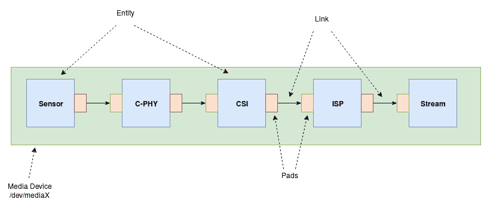
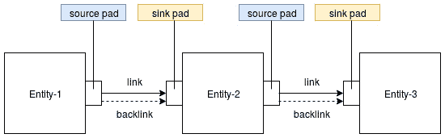
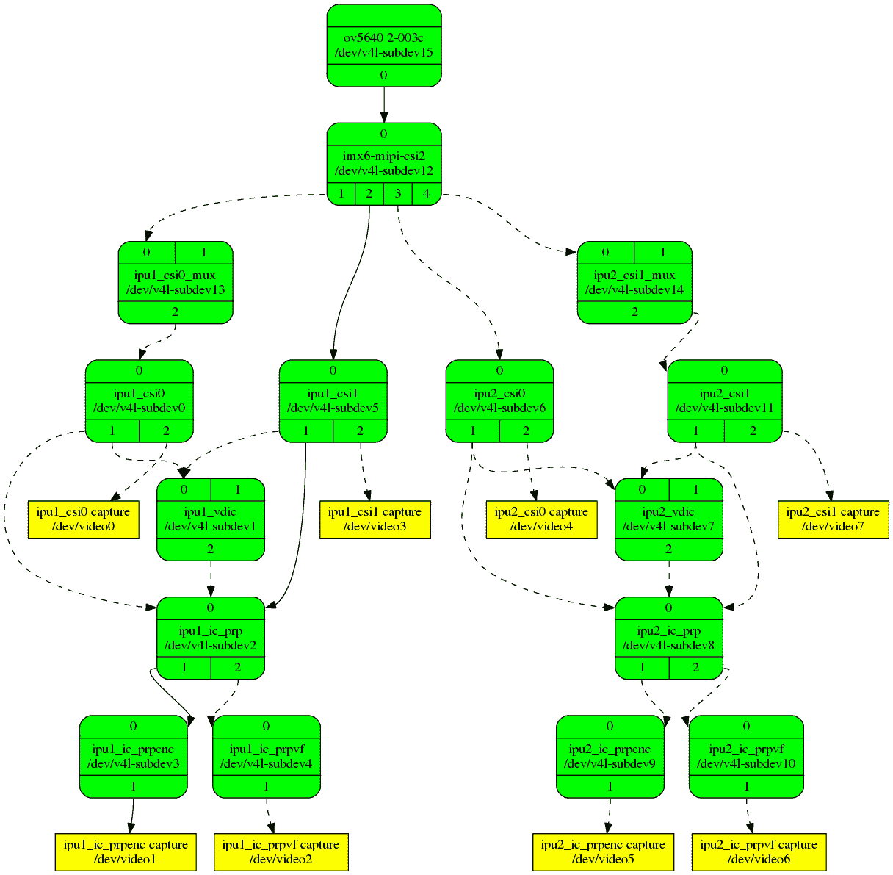

# 第八章：与 V4L2 异步和媒体控制器框架集成

随着时间的推移，媒体支持已成为**片上系统**（**SoCs**）的必备和销售论点，这些系统变得越来越复杂。这些媒体 IP 核的复杂性使得获取传感器数据需要软件建立整个管道（由多个子设备组成）。基于设备树的系统的异步性质意味着这些子设备的设置和探测并不是直接的。因此，异步框架应运而生，它解决了无序探测子设备的问题，以便在所有媒体子设备准备就绪时及时弹出媒体设备。最后但并非最不重要的是，由于媒体管道的复杂性，有必要找到一种简化其构成子设备配置的方法。因此，媒体控制器框架应运而生，它将整个媒体管道包装在一个单一元素中，即媒体设备。它带有一些抽象，其中之一是将每个子设备视为一个实体，具有接收端口、发送端口或两者兼有。

本章将重点介绍异步和媒体控制器框架的工作原理和设计，并且我们将通过它们的 API 来学习如何在**Video4Linux2**（**V4L2**）设备驱动程序开发中利用它们。

换句话说，在本章中，我们将涵盖以下主题：

+   V4L2 异步接口和图形绑定的概念

+   V4L2 异步和图形导向的 API

+   V4L2 异步框架和 API

+   Linux 媒体控制器框架

# 技术要求

在本章中，您将需要以下元素：

+   高级计算机架构知识和 C 编程技能

+   Linux 内核 v4.19.X 源代码，可在[`git.kernel.org/pub/scm/linux/kernel/git/stable/linux.git/refs/tags`](https://git.kernel.org/pub/scm/linux/kernel/git/stable/linux.git/refs/tags)上找到

# V4L2 异步接口和图形绑定的概念

到目前为止，对于 V4L2 驱动程序开发，我们实际上并没有处理探测顺序。也就是说，我们考虑了同步方法，其中桥接设备驱动程序在它们的探测期间同步为所有子设备注册设备。然而，这种方法不能用于固有的异步和无序设备注册系统，例如**扁平设备树**。为了解决这个问题，我们目前所说的异步接口被引入。

采用这种新方法，桥接驱动程序注册子设备描述符和通知回调列表，子设备驱动程序注册它们即将探测或已成功探测的子设备。异步核心将负责匹配子设备与硬件描述符，并在找到匹配项时调用桥接驱动程序的回调。当子设备注销时，将调用另一个回调。异步子系统依赖于以一种特殊方式声明的设备，称为**图形绑定**，我们将在下一节中处理。

## 图形绑定

嵌入式系统具有一组减少的设备，其中一些是不可发现的。然而，设备树出现在画面中，允许从内核描述实际系统（从硬件角度）的描述。有时（如果不是总是），这些设备在某种程度上是相互连接的。

虽然设备树中指向其他节点的`phandle`属性可以用来描述简单和直接的连接，例如父/子关系，但无法对由多个互连组成的复合设备进行建模。有时，关系建模会导致相当完整的图形，例如 i.MX6 **图像处理单元**（**IPU**），它本身是一个逻辑设备，但由多个物理 IP 块组成，它们的互连可能导致一个相当复杂的管道。

这就是所谓的**开放固件**（**OF**）**图形**介入的地方，以及它的 API 和一些新概念，即**端口**和**端点**的概念：

+   **端口**可以被视为设备中的接口（如 IP 块）。

+   **端点**可以被视为一个垫，因为它描述了与远程端口的连接的一端。

然而，`phandle`属性仍然用于引用树中的其他节点。关于这方面的更多文档可以在`Documentation/devicetree/bindings/graph.txt`中找到。

### 端口和端点表示

端口是设备的接口。一个设备可以有一个或多个端口。端口由包含在其所属设备的节点中的端口节点表示。每个端口节点包含一个端点子节点，用于连接到该端口的一个或多个远程设备端口。这意味着单个端口可以连接到一个或多个远程设备的端口，并且每个链接必须由一个端点子节点表示。现在，如果一个设备节点包含多个端口，如果一个端口有多个端点，或者一个端口节点需要连接到选定的硬件接口，那么使用`#address-cells`、`#size-cells`和`reg`属性的流行方案用于对节点进行编号。

以下摘录显示了如何使用`#address-cells`、`#size-cells`和`reg`属性来处理这些情况：

```
device {
    ...
    #address-cells = <1>;
    #size-cells = <0>;
    port@0 {
        #address-cells = <1>;
        #size-cells = <0>;
        reg = <0>;
        endpoint@0 {
            reg = <0>;
            ...
        };
        endpoint@1 {
            reg = <1>;
            ...
        };
    };
    port@1 {
        reg = <1>;
        endpoint { ... };
    };
};
```

完整的文档可以在`Documentation/devicetree/bindings/graph.txt`中找到。现在我们已经完成了端口和端点的表示，我们需要学习如何将它们彼此连接，如下一节所述。

### 端点链接

为了将两个端点连接在一起，每个端点都应包含一个指向远程设备端口对应端点的`remote-endpoint``phandle`属性。反过来，远程端点应包含一个`remote-endpoint`属性。两个端点的`remote-endpoint` phandles 相互指向形成包含端口之间的链接，如下例所示：

```
device-1 {
    port {
        device_1_output: endpoint {
            remote-endpoint = <&device_2_input>;
        };
    };
};
device-2 {
    port {
        device_2_input: endpoint {
            remote-endpoint = <&device_1_output>;
        };
    };
}
```

在完全不谈论其 API 的情况下介绍图绑定概念将是浪费时间。让我们跳到与这种新绑定方法一起使用的 API。

## V4L2 异步和面向图形的 API

这个部分的标题不应误导你，因为图绑定不仅仅是为了 V4L2 子系统。Linux `DRM`子系统也利用了它。也就是说，异步框架严重依赖设备树来描述媒体设备及其端点和连接，或者端点之间的链接以及它们的总线配置属性。

### 从 DT（of_graph_*）API 到通用 fwnode 图 API（fwnode_graph_*）

`fwnode`图 API 是将仅基于设备树的 OF 图 API 更改为通用 API 的成功尝试，将 ACPI 和设备树 OF API 合并在一起，以获得统一和通用的 API。这通过使用相同的 API 扩展了 ACPI 的图概念。通过查看`struct device_node`和`struct acpi_device`结构，您可以看到它们共同具有的成员：`struct fwnode_handle fwnode`：

```
struct device_node {
[...]
    struct fwnode_handle fwnode;
[...]
};
```

前面的摘录代表了从设备树角度来看的设备节点，而以下内容与 ACPI 相关：

```
struct acpi_device	{
[...]
    struct fwnode_handle fwnode;
[...]
};
```

`fwnode`成员是`struct fwnode_handle`类型的，它是一个较低级别和通用的数据结构，抽象出`device_node`或`acpi_device`，因为它们都继承自这个数据结构。这使得`struct fwnode_handle`成为图 API 同质化的良好客户端，以便端点（通过其`fwnode_handle`类型的字段）可以引用 ACPI 设备或基于 OF 的设备。这种抽象模型现在用于图 API 中，允许我们通过一个通用数据结构（如下所述的`struct fwnode_endpoint`）来抽象一个端点，该数据结构嵌入了指向`struct fwnode_handle`的指针，该指针可以引用 ACPI 或 OF 节点。除了通用性，这还允许与此端点相关的子设备可以是基于 ACPI 或 OF 的：

```
struct fwnode_endpoint {
    unsigned int port;
    unsigned int id;
    const struct fwnode_handle *local_fwnode;
};
```

这个结构使旧的`struct of_endpoint`结构过时，并且类型为`device_node*`的成员留出了`fwnode_handle*`类型的成员。在前面的结构中，`local_fwnode`指向相关的固件节点，`port`是端口号（即对应于`port@0`中的`0`或`port@1`中的`1`），`id`是端点在端口内的索引（即对应于`endpoint@0`中的`0`和`endpoint@1`中的`1`）。

V4L2 框架使用这个模型来通过`struct v4l2_fwnode_endpoint`对 V4L2 相关的端点进行抽象，该结构是建立在`fwnode_endpoint`之上的。

```
struct v4l2_fwnode_endpoint {
    struct fwnode_endpoint base;
    /*
     * Fields below this line will be zeroed by
     * v4l2_fwnode_endpoint_parse()
     */
    enum v4l2_mbus_type bus_type;
    union {
        struct v4l2_fwnode_bus_parallel parallel;
        struct v4l2_fwnode_bus_mipi_csi1 mipi_csi1;
        struct v4l2_fwnode_bus_mipi_csi2 mipi_csi2;
    } bus;
    u64 *link_frequencies;
    unsigned int nr_of_link_frequencies;
};
```

这个结构自内核 v4.13 以来就已经过时并取代了`struct v4l2_of_endpoint`，以前被 V4L2 用来表示`base`代表底层 ACPI 或设备节点的`struct fwnode_endpoint`结构。其他字段都是与 V4L2 相关的，如下：

+   `bus_type`是此子设备流数据的媒体总线类型。此成员的值确定应该用`fwnode`端点（设备树或 ACPI）中解析的总线属性填充哪个底层总线结构。可能的值在`enum v4l2_mbus_type`中列出，如下：

```
enum v4l2_mbus_type {
    V4L2_MBUS_PARALLEL,
    V4L2_MBUS_BT656,
    V4L2_MBUS_CSI1,
    V4L2_MBUS_CCP2,
    V4L2_MBUS_CSI2,
};
```

+   `bus`是表示媒体总线本身的结构。可能的值已经存在于联合体中，`bus_type`确定要考虑哪一个。这些总线结构都在`include/media/v4l2-fwnode.h`中定义。

+   `link_frequencies`是支持此链接的频率列表。

+   `nr_of_link_frequencies`是`link_frequencies`中元素的数量。

重要提示

在内核 v4.19 中，`bus_type`成员是根据`fwnode`中的`bus-type`属性来设置的。驱动程序可以检查读取的值并调整其行为。这意味着 V4L2 `fwnode` API 将始终基于此`fwnode`属性来解析策略。然而，从内核 v5.0 开始，驱动程序必须将此成员设置为预期的总线类型（在调用解析函数之前），然后将其与在`fwnode`中读取的`bus-type`属性的值进行比较，如果它们不匹配，则会引发错误。如果总线类型未知，或者驱动程序可以处理多种总线类型，则必须使用`V4L2_MBUS_UNKNOWN`值。从内核 v5.0 开始，此值也是`enum v4l2_mbus_type`的一部分。

在内核代码中，您可能会找到`enum v4l2_fwnode_bus_type`枚举类型。这是 V4L2 `fwnode`本地枚举类型，是全局`enum v4l2_mbus_type`枚举类型的对应物，它们的值相互映射。它们各自的值会随着代码的演变而保持同步。

然后，V4L2 相关的绑定需要额外的属性。这些属性的一部分用于构建`v4l2_fwnode_endpoint`，而另一部分用于构建底层的`bus`（实际上是媒体总线）结构。所有这些都在专门的与视频相关的绑定文档`Documentation/devicetree/bindings/media/video-interfaces.txt`中描述，我强烈建议查看。

以下是桥接（`isc`）和传感器子设备（`mt9v032`）之间的典型绑定：

```
&i2c1 {
    #address-cells = <1>;
    #size-cells = <0>;
    mt9v032@5c {
        compatible = "aptina,mt9v032";
        reg = <0x5c>;
        port {
            mt9v032_out: endpoint {
                remote-endpoint = <&isc_0>;
                link-frequencies =
                       /bits/ 64 <13000000 26600000 27000000>;
                hsync-active = <1>;
                vsync-active = <0>;
                pclk-sample = <1>;
            };
        };
    };
};
&isc {
    port {
        isc_0: endpoint@0 {
            remote-endpoint = <&mt9v032_out>;
            hsync-active = <1>;
            vsync-active = <0>;
            pclk-sample = <1>;
        };
    };
};
```

在前面的绑定中，`hsync-active`、`vsync-active`、`link-frequencies`和`pclk-sample`都是 V4L2 特定的属性，描述了媒体总线。它们的值在这里并不一致，并且实际上没有意义，但非常适合我们的学习目的。这段摘录很好地展示了端点和远程端点的概念；`struct v4l2_fwnode_endpoint`的使用在*Linux 媒体控制器框架*部分中有详细讨论。

重要提示

处理`fwnode` API 的 V4L2 部分称为`v4l2_fwnode_`，而第二个 API 集以`v4l2_of_`为前缀。请注意，在仅基于 OF 的 API 中，端点由`struct of_endpoint`表示，而与 V4L2 相关的端点由`struct v4l2_of_endpoint`表示。有一些 API 允许从基于 OF 的模型切换到基于`fwnode`的模型，反之亦然。

V4L2 `fwnode`和 V4L2 OF 完全可互操作。例如，使用 V4L2 `fwnode`的子设备驱动程序将与使用 V4L2 OF 的媒体设备驱动程序无需任何努力即可工作，反之亦然！但是，新驱动程序必须使用`fwnode` API，包括`#include <media/v4l2- fwnode.h>`，在切换到`fwnode` API 时应替换旧驱动程序中的`#include <media/v4l2-of.h>`。

话虽如此，前面讨论过的`struct fwnode_endpoint`仅用于显示底层机制。我们完全可以跳过它，因为只有核心处理此数据结构。为了更通用的方法，您最好使用新的`struct fwnode_handle`，而不是使用`struct device_node`来引用设备的固件节点。这绝对确保了 DT 和 ACPI 绑定在驱动程序中使用相同的代码时是兼容/可互操作的。以下是新驱动程序中更改应该如何看起来的简短摘录：

```
-    struct device_node *of_node;
+    struct fwnode_handle *fwnode;
-    of_node = ddev->of_node;
+	fwnode = dev_fwnode(dev);
```

一些常见的`fwnode`节点相关的 API 如下：

```
[...]
struct fwnode_handle *fwnode_get_parent(
                           const struct fwnode_handle *fwnode);
struct fwnode_handle *fwnode_get_next_child_node(
                           const struct fwnode_handle *fwnode,
                           struct fwnode_handle *child);
struct fwnode_handle *fwnode_get_next_available_child_node(
                            const struct fwnode_handle *fwnode,
                            struct fwnode_handle *child);
#define fwnode_for_each_child_node(fwnode, child) \
    for (child = fwnode_get_next_child_node(fwnode, NULL); child; \
           child = fwnode_get_next_child_node(fwnode, child))
#define fwnode_for_each_available_child_node(fwnode, child) \
    for (child = fwnode_get_next_available_child_node(fwnode,                                                      NULL);          child; \
   child = fwnode_get_next_available_child_node(fwnode, child))
struct fwnode_handle *fwnode_get_named_child_node(
                            const struct fwnode_handle *fwnode,
                            const char *childname);
struct fwnode_handle *fwnode_handle_get(struct                                         fwnode_handle *fwnode);
void fwnode_handle_put(struct fwnode_handle *fwnode);
```

上述 API 具有以下描述：

+   `fwnode_get_parent()` 返回给定参数中`fwnode`值的节点的父句柄，否则返回`NULL`。

+   `fwnode_get_next_child_node()` 以其父节点作为第一个参数，并在此父节点中给定子节点（作为第二个参数）之后返回下一个子节点（或`NULL`）。如果`child`（第二个参数）为`NULL`，则将返回此父节点的第一个子节点。

+   `fwnode_get_next_available_child_node()` 与`fwnode_get_next_child_node()`相同，但确保设备在返回`fwnode`句柄之前实际存在（已成功探测）。

+   `fwnode_for_each_child_node()` 遍历给定节点（第一个参数）中的子节点，并使用第二个参数作为迭代器。

+   `fwnode_for_each_available_child_node` 与`fwnode_for_each_child_node()`相同，但只遍历实际存在于系统上的设备的节点。

+   `fwnode_get_named_child_node()` 通过名称获取给定节点中的子节点。

+   `fwnode_handle_get()` 获取对设备节点的引用，`fwnode_handle_put()` 释放此引用。

一些`fwnode`相关的属性如下：

```
[...]
bool fwnode_device_is_available(const                                 struct fwnode_handle *fwnode); 
bool fwnode_property_present(const                              struct fwnode_handle *fwnode, 
                             const char *propname);
int fwnode_property_read_string(const                              struct fwnode_handle *fwnode, 
                             const char *propname,                              const char **val);
int fwnode_property_match_string(const                                  struct fwnode_handle *fwnode,
                                 const char *propname,                                  const char *string);
```

`fwnode`属性和节点相关的 API 都在`include/linux/property.h`中可用。但是，有一些辅助程序允许在 OF、ACPI 和`fwnode`之间来回切换。以下是一个简短的示例：

```
/* to switch from fwnode to of */
struct device_node *of_node = to_of_node(fwnode);
/* to switch from of to fw */
struct fwnode_handle *fwnode = of_fwnode_handle(node)
/* to switch from fwnode to acpi handle, the below macro has
 * been introduced
 *
 * #define ACPI_HANDLE_FWNODE(fwnode)	\
 *        acpi_device_handle(to_acpi_device_node(fwnode))
 *
 * and to switch from acpi device to fwnode:
 *
 *   struct fwnode_handle *
 *          acpi_fwnode_handle(struct acpi_device *adev)
 *
 */
```

最后，对我们来说最重要的是`fwnode`图形 API。在以下代码片段中，我们列举了此 API 的最重要功能：

```
struct fwnode_handle
   *fwnode_graph_get_next_endpoint(const                                   struct fwnode_handle *fwnode,
                                  struct fwnode_handle *prev);
struct fwnode_handle
   *fwnode_graph_get_port_parent(const                                  struct fwnode_handle *fwnode);
struct fwnode_handle
   *fwnode_graph_get_remote_port_parent(
                           const struct fwnode_handle *fwnode);
struct fwnode_handle
   *fwnode_graph_get_remote_port(const                                  struct fwnode_handle *fwnode);
struct fwnode_handle 
   *fwnode_graph_get_remote_endpoint(
                           const struct fwnode_handle *fwnode);
#define fwnode_graph_for_each_endpoint(fwnode, child) \
    for (child = NULL;	\
    (child = fwnode_graph_get_next_endpoint(fwnode, child)); )
int fwnode_graph_parse_endpoint(const                                 struct fwnode_handle *fwnode,
                             struct fwnode_endpoint *endpoint);
[...]
```

尽管前面的函数名称已经说明了它们的作用，但以下是更好的描述：

+   `fwnode_graph_get_next_endpoint()` 返回给定节点（第一个参数）中的下一个端点（或`NULL`），在先前的端点（第二个参数`prev`）之后。如果`prev`为`NULL`，则返回第一个端点。此函数获取对返回的端点的引用，必须在使用后放弃。参见`fwnode_handle_put()`。

+   `fwnode_graph_get_port_parent()` 返回给定参数中端口节点的父节点。

+   `fwnode_graph_get_remote_port_parent()` 返回包含通过`fwnode`参数给定的固件节点的端点的远程设备的固件节点。

+   `fwnode_graph_get_remote_endpoint()` 返回与通过`fwnode`参数给定的本地端点对应的远程端点的固件节点。

+   `fwnode_graph_parse_endpoint()` 解析`fwnode`中表示图端点节点的常见端点节点属性（第一个参数），并将信息存储在`endpoint`中（第二个和输出参数）。V4L2 固件节点 API 大量使用这个功能。

### V4L2 固件节点（V4L2 fwnode）API

V4L2 fwnode API 中的主要数据结构是`struct v4l2_fwnode_endpoint`。这个结构实际上就是`struct fwnode_handle`，增加了一些与 V4L2 相关的属性。然而，有一个与 V4L2 相关的 fwnode 图函数值得在这里谈论：`v4l2_fwnode_endpoint_parse()`。该函数的原型在`include/media/v4l2-fwnode.h`中声明如下：

```
int v4l2_fwnode_endpoint_parse(struct fwnode_handle *fwnode,
                             struct v4l2_fwnode_endpoint *vep);
```

给定端点的`fwnode_handle`（在前面的函数中的第一个参数），您可以使用`v4l2_fwnode_endpoint_parse()`来解析所有 fwnode 节点属性。该函数还识别并处理 V4L2 特定的属性，这些属性是在`Documentation/devicetree/bindings/media/video-interfaces.txt`中记录的。`v4l2_fwnode_endpoint_parse()`使用`fwnode_graph_parse_endpoint()`来解析常见的 fwnode 属性，并使用 V4L2 特定的解析器助手来解析与 V4L2 相关的属性。它在成功时返回`0`，在失败时返回负错误代码。

如果我们考虑`dts`中的`mt9v032` CMOS 图像传感器节点，我们可以在`probe`方法中有以下代码：

```
int err;
struct fwnode_handle *ep;
struct v4l2_fwnode_endpoint bus_cfg;
/* We grab the fwnode corresponding to the device */
struct fwnode_handle *fwnode = dev_fwnode(dev);
/* We grab its endpoint(s) node */
ep = fwnode_graph_get_next_endpoint(fwnode, NULL);
/* We parse the endpoint common properties as well as
 * v4l2 related properties  */
err = v4l2_fwnode_endpoint_parse(ep, &bus_cfg);
if (err) {   /* handle error */ }
/* At this point we can access parameters such as bus_type,  * bus.flags  
 * (in case of mipi csi2 or parallel buses), V4L2_MBUS_*  * which are the 
 * media bus flags
 */
/* we drop the reference on the enpoint */
fwnode_handle_put(ep);
```

上述代码展示了如何使用 fwnode API 及其 V4L2 版本来访问节点和端点属性。然而，在`v4l2_fwnode_endpoint_parse()`调用时，也会解析特定于 V4L2 的属性。这些属性描述了所谓的**媒体总线**，通过这个总线，数据从一个接口传输到另一个接口。我们将在下一节讨论这个问题。

### V4L2 fwnode 或媒体总线类型

大多数媒体设备支持特定的媒体总线类型。当端点链接在一起时，它们实际上是通过总线连接的，其属性需要在 V4L2 框架中描述。为了使 V4L2 能够找到这些信息，它作为设备的 fwnode（DT 或 ACPI）中的属性提供。由于这些是特定的属性，V4L2 fwnode API 能够识别和解析它们。每个总线都有其特定性和属性。

首先，让我们看一下当前支持的总线，以及它们的数据结构：

+   `struct v4l2_fwnode_bus_mipi_csi1`。

+   `struct v4l2_fwnode_bus_mipi_csi1`也是如此。

+   `HSYNC`和`VSYNC`信号。用于表示这个总线的结构是`struct v4l2_fwnode_bus_parallel`。

+   `HSYNC`、`VSYNC`和`BLANK`）的数据。与标准并行总线相比，这些总线的引脚数量减少。该框架使用`struct v4l2_fwnode_bus_parallel`来表示这个总线。

+   `struct v4l2_fwnode_bus_mipi_csi2`结构。但是，这个数据结构没有区分 D-PHY 和 C-PHY。这种缺乏区分在内核 v5.0 中得到了解决。

正如我们将在本章后面的*媒体总线的概念*部分中看到的，总线的这个概念可以用来检测本地端点与其远程对应端点之间的兼容性，以便如果它们没有相同的总线属性，两个子设备就不能链接在一起，这是完全合理的。

在*V4L2 fwnode API*部分中，我们看到`v4l2_fwnode_endpoint_parse()`负责解析端点的 fwnode 并填充适当的总线结构。该函数首先调用`fwnode_graph_parse_endpoint()`来解析常见的 fwnode 图相关属性，然后检查`bus-type`属性的值，如下所示，以确定适当的`v4l2_fwnode_endpoint.bus`数据类型：

```
u32 bus_type = 0;
fwnode_property_read_u32(fwnode, "bus-type", &bus_type);
```

根据这个值，将选择一个总线数据结构。以下是来自`fwnode`设备的预期可能值：

+   `0`：这意味着自动检测。核心将尝试根据 fwnode 中存在的属性来猜测总线类型（MIPI CSI-2 D-PHY、并行或 BT656）。

+   `1`：这意味着 MIPI CSI-2 C-PHY。

+   `2`：这意味着 MIPI CSI-1。

+   `3`：这意味着 CCP2。

例如，对于 CPP2 总线，设备的 fwnode 将包含以下行：

```
bus-type = <3>;
```

重要提示

从内核 v5.0 开始，驱动程序可以在`v4l2_fwnode_endpoint`的`bus_type`成员中指定预期的总线类型，然后将其作为第二个参数提供给`v4l2_fwnode_endpoint_parse()`。这样，如果前面的`fwnode_property_read_u32`返回的值与预期值不匹配，解析将失败，除非将预期的总线类型设置为`V4L2_MBUS_UNKNOWN`。

#### BT656 和并行总线

这些总线类型都由`struct v4l2_fwnode_bus_parallel`表示，如下所示：

```
struct v4l2_fwnode_bus_parallel {
    unsigned int flags;
    unsigned char bus_width;
    unsigned char data_shift;
};
```

在前述数据结构中，`flags`表示总线的标志。这些标志将根据设备固件节点中存在的属性设置。`bus_width`表示实际使用的数据线数量，不一定是总线的总线数量。`data_shift`用于指定实际使用的数据线，通过指定要跳过的线路数量来实现。以下是这些媒体总线的绑定属性，用于设置`struct v4l2_fwnode_bus_parallel`：

+   `hsync-active`：HSYNC 信号的活动状态；分别为`LOW`/`HIGH`的`0`/`1`。如果此属性的值为`0`，则在`flags`成员中设置`V4L2_MBUS_HSYNC_ACTIVE_LOW`标志。任何其他值将设置`V4L2_MBUS_HSYNC_ACTIVE_HIGH`标志。

+   `vsync-active`：VSYNC 信号的活动状态；分别为`LOW`/`HIGH`的`0`/`1`。如果此属性的值为`0`，则在`flags`成员中设置`V4L2_MBUS_VSYNC_ACTIVE_LOW`标志。任何其他值将设置`V4L2_MBUS_VSYNC_ACTIVE_HIGH`标志。

+   `field-even-active`：在偶场数据传输期间的场信号电平。这与前面的情况相同，但相关标志为`V4L2_MBUS_FIELD_EVEN_HIGH`和`V4L2_MBUS_FIELD_EVEN_LOW`。

+   `pclk-sample`：在像素时钟信号的上升（`1`）或下降（`0`）沿上采样数据，`V4L2_MBUS_PCLK_SAMPLE_RISING`和`V4L2_MBUS_PCLK_SAMPLE_FALLING`。

+   `data-active`：类似于`HSYNC`和`VSYNC`，指定数据线极性，`V4L2_MBUS_DATA_ACTIVE_HIGH`和`V4L2_MBUS_DATA_ACTIVE_LOW`。

+   `slave-mode`：这是一个布尔属性，其存在表示链接以从模式运行，并设置了`V4L2_MBUS_SLAVE`标志。否则，将设置`V4L2_MBUS_MASTER`标志。

+   `data-enable-active`：类似于`HSYNC`和`VSYNC`，指定数据使能信号的极性。

+   `bus-width`：此属性仅涉及并行总线，并表示实际使用的数据线数量。相应地设置`V4L2_MBUS_DATA_ENABLE_HIGH`或`V4L2_MBUS_DATA_ENABLE_LOW`标志。

+   `data-shift`：在并行数据总线上，`bus-width`用于指定实际使用的数据线数量，此属性可用于指定实际使用的数据线；例如，`bus-width=<8>; data-shift=<2>;`表示使用线路 9:2。

+   `sync-on-green-active`：`0`/`1`的活动状态分别为`LOW`/`HIGH`。相应地设置`V4L2_MBUS_VIDEO_SOG_ACTIVE_HIGH`或`V4L2_MBUS_VIDEO_SOG_ACTIVE_LOW`标志。

这些总线的类型可以是`V4L2_MBUS_PARALLEL`或`V4L2_MBUS_BT656`。负责解析这些总线的底层函数是`v4l2_fwnode_endpoint_parse_parallel_bus()`。

#### MIPI CSI-2 总线

这是 MIPI 联盟的 CSI 总线的第 2 版。该总线涉及两个 PHY：D-PHY 或 C-PHY。 D-PHY 已经存在一段时间，针对相机、显示器和低速应用。 C-PHY 是一种更新更复杂的 PHY，其中时钟嵌入到数据中，使得不需要单独的时钟通道。它的线路更少，通道数更少，功耗更低，并且与 D-PHY 相比可以实现更高的数据速率。 C-PHY 在带宽受限的通道上提供高吞吐性能。

C-PHY 和 D-PHY 启用的总线都使用一个数据结构`struct v4l2_fwnode_bus_mipi_csi2`表示，如下所示：

```
struct v4l2_fwnode_bus_mipi_csi2 {
    unsigned int flags;
    unsigned char data_lanes[V4L2_FWNODE_CSI2_MAX_DATA_LANES]; 
    unsigned char clock_lane;
    unsigned short num_data_lanes;
    bool lane_polarities[1 + V4L2_FWNODE_CSI2_MAX_DATA_LANES];
};
```

在前面的块中，`flags`表示总线的标志，并将根据固件节点中存在的属性进行设置：

+   `data-lanes`是物理数据线索引的数组。

+   `lane-polarities`：此属性仅适用于串行总线。这是一个从时钟线开始，然后是数据线的极性数组，顺序与`data-lanes`属性相同。有效值为`0`（正常）和`1`（反转）。此数组的长度应为`data-lanes`和`clock-lanes`属性的组合长度。有效值为`0`（正常）和`1`（反转）。如果省略了`lane-polarities`属性，则必须将值解释为`0`（正常）。

+   `clock-lanes`是时钟线的物理线索引。这是时钟线的位置。

+   `clock-noncontinuous`：如果存在，则设置`V4L2_MBUS_CSI2_NONCONTINUOUS_CLOCK`标志。否则，设置`V4L2_MBUS_CSI2_CONTINUOUS_CLOCK`。

这些总线具有`V4L2_MBUS_CSI2`类型。直到 Linux 内核 v4.20，C-PHY 和 D-PHY 启用的 CSI 总线之间没有区别。但是，从 Linux 内核 v5.0 开始，引入了这种差异，并且`V4L2_MBUS_CSI2`已被分别替换为`V4L2_MBUS_CSI2_DPHY`或`V4L2_MBUS_CSI2_CPHY`，用于 D-PHY 或 C-PHY 启用的总线。

负责解析这些总线的基础功能是`v4l2_fwnode_endpoint_parse_csi2_bus()`。一个示例如下：

```
[...]
    port {
        tc358743_out: endpoint {
          remote-endpoint = <&mipi_csi2_in>;           clock-lanes = <0>;
          data-lanes = <1 2 3 4>;
          lane-polarities = <1 1 1 1 1>;
          clock-noncontinuous;
        };
    };
```

#### CPP2 和 MIPI CSI-1 总线

这些是较旧的单数据线串行总线。它们的类型对应于`V4L2_FWNODE_BUS_TYPE_CCP2`或`V4L2_FWNODE_BUS_TYPE_CSI1`。内核使用`struct v4l2_fwnode_bus_mipi_csi1`来表示这些总线：

```
struct v4l2_fwnode_bus_mipi_csi1 {
    bool clock_inv;
    bool strobe;
    bool lane_polarity[2];
    unsigned char data_lane;
    unsigned char clock_lane;
};
```

以下是此结构中元素的含义：

+   `clock-inv`：时钟/闪光信号的极性（false 表示未反转，true 表示反转）。`0`表示 false，其他值表示 true。

+   `strobe`：False - 数据/时钟，true - 数据/闪光灯。

+   `data-lanes`：数据线的数量。

+   `clock-lanes`：时钟线的数量。

+   `lane-polarities`：这与前面相同，但由于 CPP2 和 MIPI CSI-1 是单数据串行总线，因此数组只能有两个条目：时钟（索引`0`）和数据线（索引`1`）的极性。

在解析给定节点后，前面的数据结构由`v4l2_fwnode_endpoint_parse_csi1_bus()`填充。

#### 总线猜测

将总线类型指定为`0`（或`V4L2_MBUS_UNKNOWN`）将指示 V4L2 核心尝试根据在固件节点中找到的属性来猜测实际的媒体总线。它首先会考虑设备是否在 CSI-2 总线上，并尝试相应地解析端点节点，寻找与 CSI-2 相关的属性。幸运的是，CSI-2 和并行总线没有共同的属性。因此，只有在没有找到 MIPI CSI-2 特定属性时，核心才会解析并行视频总线属性。核心不会猜测`V4L2_MBUS_CCP2`或`V4L2_MBUS_CSI1`。对于这些总线，必须指定`bus-type`属性。

## V4L2 异步

由于基于视频的硬件的复杂性，有时会集成非 V4L2 设备（实际上是子设备）位于不同的总线上，因此需要子设备推迟初始化，直到桥接驱动程序已加载，另一方面，桥接驱动程序需要推迟初始化子设备，直到所有必需的子设备已加载；也就是说，V4L2 异步。

在异步模式下，子设备探测可以独立于桥接驱动程序的可用性进行。然后，子设备驱动程序必须验证是否满足了成功探测的所有要求。这可能包括检查主时钟的可用性、GPIO 或其他任何内容。如果任何条件不满足，子设备驱动程序可能决定返回`-EPROBE_DEFER`以请求进一步的重新探测尝试。一旦满足所有条件，子设备将使用`v4l2_async_register_subdev()`函数在 V4L2 异步核心中注册。取消注册使用`v4l2_async_unregister_subdev()`调用执行。

我们之前看到同步注册适用的情况。这是一种模式，桥接驱动程序了解其负责的所有子设备的上下文。它有责任在其探测期间使用`v4l2_device_register_subdev()`在每个子设备上注册所有子设备，就像`drivers/media/platform/exynos4-is/media-dev.c`驱动程序一样。

在 V4L2 异步框架中，子设备的概念被抽象化。在异步框架中，子设备被称为`struct v4l2_async_subdev`结构的一个实例。除了这个结构，还有另一个`struct v4l2_async_notifier`结构。两者都在`include/media/v4l2-async.h`中定义，并且在 V4L2 异步核心的中心部分。在进一步进行之前，我们必须介绍 V4L2 异步框架的中心部分`struct v4l2_async_notifier`，如下所示：

```
struct v4l2_async_notifier {
    const struct v4l2_async_notifier_operations *ops;
    unsigned int num_subdevs;
    unsigned int max_subdevs;
    struct v4l2_async_subdev **subdevs;
    struct v4l2_device *v4l2_dev;
    struct v4l2_subdev *sd;
    struct v4l2_async_notifier *parent;
    struct list_head waiting;
    struct list_head done;
    struct list_head list;
};
```

前面的结构主要由桥接驱动程序和异步核心使用。然而，在某些情况下，子设备驱动程序可能需要被其他子设备通知。在任何情况下，成员的用途和含义都是相同的：

+   `ops`是由此通知器的所有者提供的一组回调，由异步核心在等待在此通知器中的子设备被探测时调用。

+   `v4l2_dev`是注册此通知器的桥接驱动程序的 V4L2 父级。

+   `sd`，如果此通知器是由子设备注册的，将指向此子设备。我们在这里不讨论这种情况。

+   `subdevs`是应该通知此通知器的注册者（桥接驱动程序或另一个子设备驱动程序）的子设备数组。

+   `waiting`是此通知器中等待被探测的子设备的列表。

+   `done`是实际绑定到此通知器的子设备的列表。

+   `num_subdevs`是`**subdevs`中子设备的数量。

+   `list`在注册此通知器时由异步核心使用，以将此通知器链接到通知器的全局列表`notifier_list`。

回到我们的`struct v4l2_async_subdev`结构，定义如下：

```
struct v4l2_async_subdev {
    enum v4l2_async_match_type match_type;
    union {
        struct fwnode_handle *fwnode;
        const char *device_name;
        struct {
            int adapter_id;
            unsigned short address;
        } i2c;
        struct {
        bool (*match)(struct device *,                      struct v4l2_async_subdev *);
            void *priv;
        } custom;
    } match;
    /* v4l2-async core private: not to be used by drivers */
    struct list_head list;
};
```

前面的数据结构在 V4L2 异步框架中是一个子设备。只有桥接驱动程序（分配异步子设备）和异步核心可以使用这个结构。子设备驱动程序完全不知道这一点。其成员的含义如下：

+   `match_type`是`enum v4l2_async_match_type`类型。匹配是对某些标准进行比较（发生`struct v4l2_subdev`类型和`struct v4l2_async_subdev`类型的异步子设备）。由于每个`struct v4l2_async_subdev`结构必须与其`struct v4l2_subdev`结构相关联，因此该字段指定了异步核心用于匹配两者的算法。该字段由驱动程序设置（也负责分配异步子设备）。可能的值如下：

--`V4L2_ASYNC_MATCH_DEVNAME`，指示异步核心使用设备名称进行匹配。在这种情况下，桥接驱动程序必须设置`v4l2_async_subdev.match.device_name`字段，以便在探测到子设备时可以匹配子设备的设备名称（即`dev_name(v4l2_subdev->dev)`）。

-`V4L2_ASYNC_MATCH_FWNODE`，这意味着异步核心应使用固件节点进行匹配。在这种情况下，桥接驱动程序必须使用与子设备的设备节点对应的固件节点句柄`v4l2_async_subdev.match.fwnode`进行匹配。

-应使用`V4L2_ASYNC_MATCH_I2C`通过检查 I2C 适配器 ID 和地址来执行匹配。使用此功能，桥接驱动程序必须同时设置`v4l2_async_subdev.match.i2c.adapter_id`和`v4l2_async_subdev.match.i2c.address`。这些值将与与`v4l2_subdev.dev`关联的`i2c_client`对象的地址和适配器编号进行比较。

-`V4L2_ASYNC_MATCH_CUSTOM`是最后一种可能性，意味着异步核心应使用桥接驱动程序中设置的匹配回调`v4l2_async_subdev.match.custom.match`。如果设置了此标志并且未提供自定义匹配回调，则任何匹配尝试将立即返回 true。

+   `list`用于将此异步子设备添加到通知程序的等待列表中等待探测。

子设备注册不再依赖于桥接可用性，只需调用`v4l2_async_unregister_subdev（）`方法即可。但是，在注册自身之前，桥接驱动程序将不得不执行以下操作：

1.  为以后使用分配一个通知程序。最好将此通知程序嵌入较大的设备状态数据结构中。此通知程序对象是`struct v4l2_async_notifier`类型。

1.  解析其端口节点并为其中指定的每个传感器（或 IP 块）创建一个异步子设备（`struct v4l2_async_subdev`），并且它需要进行操作：

a）使用`fwnode`图形 API（旧驱动程序仍使用`of_graph` API）进行此解析，例如以下内容：

-`fwnode_graph_get_next_endpoint（）`（或旧驱动程序中的`of_graph_get_next_endpoint（）`）来抓取桥接的端口子节点中的端点的`fw_handle`（或旧驱动程序中的`of_node`）。

-`fwnode_graph_get_remote_port_parent（）`（或旧驱动程序中的`of_graph_get_remote_port_parent（）`）来抓取当前端点的远程端口的`fw_handle`（或设备的`of_node`）对应的父级。

可选地（在使用 OF API 的旧驱动程序中），使用`of_fwnode_handle（）`将先前状态中抓取的`of_node`转换为`fw_handle`。

b）根据应使用的匹配逻辑设置当前异步子设备。它应设置`v4l2_async_subdev.match_type`和`v4l2_async_subdev.match`成员。

c）将此异步子设备添加到通知程序的异步子设备列表中。在内核的 4.20 版本中，有一个辅助程序`v4l2_async_notifier_add_subdev（）`，允许您执行此操作。

1.  使用`v4l2_async_notifier_register（＆big_struct->v4l2_dev，＆big_struct->notifier）`调用注册通知对象（此通知对象将存储在`drivers/media/v4l2-core/v4l2-async.c`中定义的全局`notifier_list`列表中）。要取消注册通知程序，驱动程序必须调用`v4l2_async_notifier_unregister（＆big_struct->notifier）`。

当桥接驱动程序调用`v4l2_async_notifier_register()`时，异步核心会迭代`notifier->subdevs`数组中的异步子设备。对于每个异步子设备，核心会检查`asd->match_type`值是否为`V4L2_ASYNC_MATCH_FWNODE`。如果适用，异步核心会通过比较 fwnodes 来确保`asd`不在`notifier->waiting`列表或`notifier->done`列表中。这可以确保`asd`尚未为`fwnode`设置，并且它尚不存在于给定的通知器中。如果`asd`尚未知晓，则将其添加到`notifier->waiting`中。之后，异步核心将测试`notifier->waiting`列表中的所有异步子设备，以与`subdev_list`中存在的所有子设备进行匹配。`subdev_list`是“类似”孤立子设备的列表，这些子设备是在其桥接驱动程序（因此在其通知器）之前注册的。异步核心使用每个当前`asd`的`asd->match`值进行匹配。如果匹配发生（`asd->match`回调返回 true），则当前异步子设备（来自`notifier->waiting`）和当前子设备（来自`subdev_list`）将被绑定，异步子设备将从`notifier->waiting`列表中移除，子设备将使用`v4l2_device_register_subdev()`注册到 V4L2 核心，并且子设备将从全局`subdev_list`列表移动到`notifier->done`列表中。

最后，被注册的实际通知器将被添加到全局通知器列表`notifier_list`中，以便在以后使用时，可以在异步核心中注册新的子设备时进行匹配尝试。

重要提示

当子设备驱动程序调用`v4l2_async_register_subdev()`时，异步核心会尝试将当前子设备与`notifier_list`全局列表中存在的每个通知器中等待的所有异步子设备进行匹配。如果没有匹配发生，这意味着尚未探测到此子设备的桥接，子设备将被添加到全局子设备列表`subdev_list`中。如果发生匹配，子设备将根本不会添加到此列表中。

还要记住，匹配测试是在`struct v4l2_subdev`类型的子设备和`struct v4l2_async_subdev`类型的异步子设备之间严格发生的一些标准的比较。

在前面的段落中，我们说异步子设备和子设备是绑定的。但这是什么意思呢？这就是`notifier->ops`成员发挥作用的地方。它是`struct v4l2_async_notifier_operations`类型，并定义如下：

```
struct v4l2_async_notifier_operations {
    int (*bound)(struct v4l2_async_notifier *notifier,
                  struct v4l2_subdev *subdev,
                  struct v4l2_async_subdev *asd);
    int (*complete)(struct v4l2_async_notifier *notifier);
    void (*unbind)(struct v4l2_async_notifier *notifier,
                    struct v4l2_subdev *subdev,
                    struct v4l2_async_subdev *asd);
};
```

在这个结构中，以下是每个回调的含义，尽管所有三个回调都是可选的：

+   `bound`：如果设置，异步核心将在成功的子设备探测后由其（子设备）驱动程序调用此回调。这也意味着异步子设备已成功匹配此子设备。此回调将以发起匹配的通知器以及匹配的子设备（`subdev`）和异步子设备（`asd`）作为参数。大多数驱动程序在这里只是打印调试消息。但是，您可以在这里对子设备进行额外的设置-即`v4l2_subdev_call()`。如果一切正常，它应该返回一个正值；否则，子设备将被注销。

+   `unbind`在从系统中移除子设备时被调用。除了在这里打印调试消息外，桥接驱动程序还必须取消注册视频设备，如果未绑定的子设备对其正常工作是必需的-即`video_unregister_device()`。

+   `complete`在通知器中没有更多的异步子设备等待时被调用。异步核心可以检测到`notifier->waiting`列表为空（这意味着子设备已经成功探测并全部移动到`notifier->done`列表中）。完成回调仅对根通知器执行。注册了通知器的子设备不会调用其`.complete`回调。根通知器通常是由桥接设备注册的。

毫无疑问，在注册通知器对象之前，桥接驱动程序必须设置通知器的`ops`成员。对我们来说最重要的回调是`.complete`。

在桥接驱动程序的`probe`函数中调用`v4l2_device_register()`是一种常见做法，但通常在`notifier.complete`回调中注册实际的视频设备，因为所有子设备都将被注册，并且`/dev/videoX`的存在意味着它确实可用。`.complete`回调也适用于注册实际视频设备的子节点，并通过`v4l2_device_register_subdev_nodes()`和`media_device_register()`注册媒体设备。

请注意，`v4l2_device_register_subdev_nodes()`将为每个标有`V4L2_SUBDEV_FL_HAS_DEVNODE`标志的`subdev`对象创建一个设备节点（实际上是`/dev/v4l2-subdevX`）。

### 异步桥接和子设备探测示例

我们将通过一个简单的用例来介绍这一部分。考虑以下配置：

+   一个桥接设备（我们的 CSI 控制器） - 让我们说`omap` ISP，以`foo`作为其名称。

+   一个片外子设备，摄像头传感器，以`bar`作为其名称。

两者是这样连接的：`CSI <-- 摄像头传感器`。

在`bar`驱动程序中，我们可以注册一个异步子设备，如下所示：

```
static int bar_probe(struct device *dev)
{
    int ret;
    ret = v4l2_async_register_subdev(subdev);
    if (ret) {
        dev_err(dev, "ouch\n");
        return -ENODEV;
    }
    return 0;
}
```

`foo`驱动程序的`probe`函数可能如下所示：

```
/* struct foo_device */
struct foo_device {
    struct media_device mdev;
    struct v4l2_device v4l2_dev;
    struct video_device *vdev;
    struct v4l2_async_notifier notifier;
    struct *subdevs[FOO_MAX_SUBDEVS];
};
/* foo_probe() */
static int foo_probe(struct device *dev)
{
    struct foo_device *foo = kmalloc(sizeof(*foo)); 
    media_device_init(&bar->mdev);
    foo->dev = dev;
    foo->notifier.subdevs = kcalloc(FOO_MAX_SUBDEVS,
                             sizeof(struct v4l2_async_subdev)); 
    foo_parse_nodes(foo);
    foo->notifier.bound = foo_bound;
    foo->notifier.complete = foo_complete; 
    return 
        v4l2_async_notifier_register(&foo->v4l2_dev,                                      &foo->notifier);
}
```

在下面的代码中，我们实现了`foo` fwnode（或`of_node`）解析器助手`foo_parse_nodes()`：

```
struct foo_async {
    struct v4l2_async_subdev asd;
    struct v4l2_subdev *sd;
};
/* Either */
static void foo_parse_nodes(struct device *dev,
                            struct v4l2_async_notifier *n)
{
    struct device_node *node = NULL;
    while ((node = of_graph_get_next_endpoint(dev->of_node,                                               node))) { 
        struct foo_async *fa = kmalloc(sizeof(*fa));
        n->subdevs[n->num_subdevs++] = &fa->asd;
        fa->asd.match.of.node =         of_graph_get_remote_port_parent(node); 
        fa->asd.match_type = V4L2_ASYNC_MATCH_OF;
    }
}
/* Or */
static void foo_parse_nodes(struct device *dev,
                            struct v4l2_async_notifier *n)
{
    struct fwnode_handle *fwnode = dev_fwnode(dev);
    struct fwnode_handle *ep = NULL;
    while ((ep = fwnode_graph_get_next_endpoint(ep, fwnode))) {
        struct foo_async *fa = kmalloc(sizeof(*fa));
        n->subdevs[n->num_subdevs++] = &fa->asd;
        fa->asd.match.fwnode =
                fwnode_graph_get_remote_port_parent(ep);
        fa->asd.match_type = V4L2_ASYNC_MATCH_FWNODE;
    }
}
```

在前面的代码中，`of_graph_get_next_endpoint()`和`fwnode_graph_get_next_endpoint()`都已经被用来展示如何使用这两者。也就是说，最好使用 fwnode 版本，因为它更通用。

与此同时，我们需要编写`foo`的通知器操作，可能如下所示：

```
/* foo_bound() and foo_complete() */
static int foo_bound(struct v4l2_async_notifier *n,
                struct v4l2_subdev *sd,                 struct v4l2_async_subdev *asd)
{
    struct foo_async *fa = container_of(asd, struct bar_async,                                         asd);
    /* One can use subdev_call here */
    [...]
    fa->sd = sd;
}
static int foo_complete(struct v4l2_async_notifier *n)
{
    struct foo_device *foo =
             container_of(n, struct foo_async, notifier);
    struct v4l2_device *v4l2_dev = &isp->v4l2_dev;
    /* Create /dev/sub-devX if applicable */ 
    v4l2_device_register_subdev_nodes(&foo->v4l2_dev);
    /* setup the video device: fops, queue, ioctls ... */
[...]
    /* Register the video device */
       ret = video_register_device(foo->vdev,                                    VFL_TYPE_GRABBER, -1);
    /* Register with the media controller framework */ 
    return media_device_register(&bar->mdev);
}
```

在设备树中，V4L2 桥接设备可以声明如下：

```
csi1: csi@1cb4000 {
    compatible = "allwinner,sun8i-v3s-csi";
    reg = <0x01cb4000 0x1000>;
    interrupts = <GIC_SPI 84 IRQ_TYPE_LEVEL_HIGH>;
    /* we omit clock and others */
[...]
    port {
        csi1_ep: endpoint {
            remote-endpoint = <&ov7740_ep>;
           /* We omit v4l2 related properties */
[...]
        };
    };
};
```

在 I2C 控制器节点内部的摄像头节点可以声明如下：

```
&i2c1 {
    #address-cells = <1>;
    #size-cells = <0>;
    ov7740: camera@21 {
        compatible = "ovti,ov7740";
        reg = <0x21>;
        /* We omit clock or pincontrol or everything else */

       [...]
       port {
           ov7740_ep: endpoint {
               remote-endpoint = <&csi1_ep>;
               /* We omit v4l2 related properties */
               [...]
           };
       };
   };
};
```

现在我们熟悉了 V4L2 异步框架，看到了异步子设备注册如何简化探测和代码。我们以一个具体的例子结束了，突出了我们讨论的每个方面。现在我们可以继续并集成媒体控制器框架，这是我们可以为 V4L2 驱动程序添加的最后一个改进。

# Linux 媒体控制器框架

媒体设备非常复杂，涉及 SoC 的多个 IP 块，因此需要视频流（重新）路由。

现在，让我们考虑一个更复杂的 SoC 情况，由两个更多的片上子设备组成 - 比如一个重塑器和一个图像转换器，称为`baz`和`biz`。

在*V4L2 异步*部分的前面的示例中，设置由一个桥接设备和一个子设备（它是片外的事实并不重要），摄像头传感器组成。这相当简单。幸运的是，事情进展顺利。但是，如果现在我们必须通过图像转换器或图像重塑器路由流，甚至通过这两个 IP 呢？或者说我们必须动态地从一个切换到另一个？

我们可以通过`sysfs`或`ioctls`来实现这一点，但这将会有以下问题：

+   这将会非常丑陋（毫无疑问），而且可能会有 bug。

+   这将会非常困难（需要大量工作）。

+   这将深深地依赖于 SoC 供应商，可能会有大量的代码重复，没有统一的用户空间 API 和 ABI，驱动程序之间没有一致性。

+   这将不是一个非常可信的解决方案。

许多 SoC 可以重新路由内部视频流 - 例如，从传感器捕获它们并进行内存到内存的调整，或直接将传感器输出发送到调整器。由于 V4L2 API 不支持这些高级设备，SoC 制造商制作了自己的定制驱动程序。但是，V4L2 无疑是用于捕获图像的 Linux API，并且有时用于特定的显示设备（这些是 mem2mem 设备）。

很明显，我们需要另一个子系统和框架来涵盖 V4L2 的限制。这就是 Linux 媒体控制器框架诞生的原因。

## 媒体控制器抽象模型

发现设备的内部拓扑并在运行时对其进行配置是媒体框架的目标之一。为了实现这一点，它带有一层抽象。通过媒体控制器框架，硬件设备通过由**实体**组成的有向图来表示，这些**实体**的**pad**通过**链接**连接。这些元素的集合组成了所谓的**媒体设备**。源 pad 只能生成数据。

前面的简短描述值得关注。有三个高度关注的突出词：entity、pad 和 link：

+   `struct media_entity`实例，定义在`include/media/media-entity.h`中。该结构通常嵌入到更高级的结构中，例如`v4l2_subdev`或`video_device`实例，尽管驱动程序可以直接分配实体。

+   `/dev/videoX` pad 将被建模为输入 pad，因为它是流的结束。

+   **链接**：这些链接可以通过媒体设备进行设置、获取和枚举。为了使驱动程序正常工作，应用程序负责正确设置这些链接，以便驱动程序了解视频数据的源和目的地。

系统上的所有实体以及它们的 pad 和它们之间的连接链接，构成了下图所示的**媒体设备**：



图 8.1 - 媒体控制器抽象模型

在前面的图表中，`/dev/videoX` char 设备因为它是流的结束。

### V4L2 设备抽象

在更高级别上，媒体控制器使用`struct media_device`来抽象 V4L2 框架中的`struct v4l2_device`。也就是说，`struct media_device`对于媒体控制器来说就像`struct v4l2_device`对于 V4L2 一样，包含其他更低级别的结构。回到`struct v4l2_device`，`mdev`成员被媒体控制器框架用来抽象此结构。以下是摘录：

```
struct v4l2_device {
[...]
    struct media_device *mdev;
[...]
};
```

然而，从媒体控制器的角度来看，V4L2 视频设备和子设备都被视为媒体实体，在该框架中表示为`struct media_entity`的实例。因此，视频设备和子设备数据结构明显需要嵌入此类型的成员，如下摘录所示：

```
struct video_device
{
#if defined(CONFIG_MEDIA_CONTROLLER)
    struct media_entity entity;
    struct media_intf_devnode *intf_devnode;
    struct media_pipeline pipe;
#endif
[...]
};
struct v4l2_subdev {
#if defined(CONFIG_MEDIA_CONTROLLER)
    struct media_entity entity;
#endif
[...]
};
```

视频设备具有额外的成员，`intf_devnode`和`pipe`。前者是`struct media_intf_devnode`类型，表示媒体控制器接口到视频设备节点的接口。该结构使媒体控制器能够访问底层视频设备节点的信息，如其主次编号。另一个额外的成员`pipe`是`struct media_pipeline`类型，存储与该视频设备的流水线相关的信息。

媒体控制器数据结构

媒体控制器框架基于一些数据结构，其中包括`struct media_device`结构，它位于层次结构的顶部，并定义如下：

```
struct media_device {
    /* dev->driver_data points to this struct. */
    struct device *dev;
    struct media_devnode *devnode;
    char model[32];
    char driver_name[32];
[...]
    char serial[40];
    u32 hw_revision;
    u64 topology_version;
    struct list_head entities;
    struct list_head pads;
    struct list_head links;
    struct list_head entity_notify;
    struct mutex graph_mutex;
[...]
    const struct media_device_ops *ops;
};
```

该结构表示高级媒体设备。它允许轻松访问实体并提供基本的媒体设备级别支持：

+   `dev`是此媒体设备的父设备（通常是`&pci_dev`，`&usb_interface`或`&platform_device`实例）。

+   `devnode`是媒体设备节点，抽象底层的`/dev/mediaX`。

+   `driver_name`是一个可选但建议的字段，表示媒体设备驱动程序的名称。如果未设置，默认为`dev->driver->name`。

+   `model`是该媒体设备的型号名称。它不必是唯一的。

+   `serial`是一个可选成员，应该设置为设备序列号。`hw_revision`是该媒体设备的硬件设备版本。

+   `topology_version`：用于存储图拓扑的版本的单调计数器。每次拓扑发生变化时应该递增。

+   `entities`是注册实体的列表。

+   `pads`是注册到该媒体设备的 pad 列表。

+   `links`是注册到该媒体设备的链接列表。

+   `entity_notify`是在新实体注册到该媒体设备时调用的通知回调列表。驱动程序可以通过`media_device_unregister_entity_notify()`注册此回调，并使用`media_device_register_entity_notify()`取消注册。当新实体注册时，所有注册的`media_entity_notify`回调都会被调用。

+   `graph_mutex`：保护对`struct media_device`数据的访问。例如，在使用`media_graph_*`系列函数时应该持有该锁。

+   `ops`是`struct media_device_ops`类型，表示该媒体设备的操作处理程序回调。

除了被媒体控制器框架操作外，`struct media_device`基本上是在桥接驱动程序中使用的，在那里进行初始化和注册。也就是说，媒体设备本身由多个实体组成。这种实体的概念允许媒体控制器成为现代和复杂的 V4L2 驱动程序的中央管理机构，这些驱动程序可能同时支持帧缓冲区、ALSA、I2C、LIRC 和/或 DVB 设备，并用于通知用户空间的各种信息。

媒体实体表示为`struct media_entity`的实例，如下所示：

```
struct media_entity {
    struct media_gobj graph_obj;
    const char *name;
    enum media_entity_type obj_type;
    u32 function;
    unsigned long flags;
    u16 num_pads;
    u16 num_links;
    u16 num_backlinks;
    int internal_idx;
    struct media_pad *pads;
    struct list_head links;
    const struct media_entity_operations *ops;
    int stream_count;
    int use_count;
    struct media_pipeline *pipe;
[...]
};
```

这是媒体框架中按层次结构排列的第二个数据结构。前面的定义已经被缩减到我们感兴趣的最小值。以下是该结构中成员的含义：

+   `name`是该实体的名称。它应该足够有意义，因为它在用户空间中与`media-ctl`工具一起使用。

+   `type`大多数情况下由核心根据该结构嵌入的 V4L2 视频数据结构的类型设置。它是实现`media_entity`的对象类型，例如，由核心在子设备初始化时设置为`MEDIA_ENTITY_TYPE_V4L2_SUBDEV`。这允许在运行时对媒体实体进行类型识别，并使用`container_of`宏安全地转换为正确的对象类型。可能的值如下：

--`MEDIA_ENTITY_TYPE_BASE`：这意味着该实体未嵌入在其他实体中。

--`MEDIA_ENTITY_TYPE_VIDEO_DEVICE`：表示该实体嵌入在`struct video_device`实例中。

--`MEDIA_ENTITY_TYPE_V4L2_SUBDEV`：这意味着该实体嵌入在`struct v4l2_subdev`实例中。

+   `function`表示实体的主要功能。这必须由驱动程序根据`include/uapi/linux/media.h`中定义的值进行设置。在处理视频设备时，以下是常用的值：

--`MEDIA_ENT_F_IO_V4L`：此标志表示该实体是数据流输入和/或输出实体。

--`MEDIA_ENT_F_CAM_SENSOR`：此标志表示该实体是摄像头视频传感器实体。

--`MEDIA_ENT_F_PROC_VIDEO_SCALER`：表示该实体可以执行视频缩放。这些实体至少有一个接收端口，从中接收帧（在活动端口上），以及一个源端口，用于输出缩放后的帧。

--`MEDIA_ENT_F_PROC_VIDEO_ENCODER`：表示该实体能够压缩视频。这些实体必须有一个接收端口和至少一个源端口。

--`MEDIA_ENT_F_VID_MUX`：这是用于视频复用器。这个实体至少有两个接收端口和一个发送端口，并且必须将从活动接收端口接收到的视频帧传递到发送端口。

--`MEDIA_ENT_F_VID_IF_BRIDGE`：视频接口桥。视频接口桥实体应该至少有一个接收端口和一个发送端口。它从一个类型的输入视频总线（HDMI、eDP、MIPI CSI-2 等）的接收端口接收视频帧，并将其从发送端口输出到另一种类型的输出视频总线（eDP、MIPI CSI-2、并行等）。

+   `flags`由驱动程序设置。它表示这个实体的标志。可能的值是`include/uapi/linux/media.h`中定义的`MEDIA_ENT_FL_*`标志系列。以下链接可能对您理解可能的值有所帮助：[`linuxtv.org/downloads/v4l-dvb-apis/userspace-api/mediactl/media-types.html`](https://linuxtv.org/downloads/v4l-dvb-apis/userspace-api/mediactl/media-types.html)。

+   `function`代表这个实体的功能，默认为`MEDIA_ENT_F_V4L2_SUBDEV_UNKNOWN`。可能的值是`include/uapi/linux/media.h`中定义的`MEDIA_ENT_F_*`功能系列。例如，相机传感器子设备驱动程序必须包含`sd->entity.function = MEDIA_ENT_F_CAM_SENSOR;`。您可以通过此链接找到关于适合您的媒体实体的详细信息：https://linuxtv.org/downloads/v4l-dvb-apis/uapi/mediactl/media-types.html。

+   `num_pads`是这个实体的 pad 总数（接收端口和发送端口）。

+   `num_links`是这个实体的链接总数（前向、后向、启用和禁用）。

+   `num_backlinks`是这个实体的反向链接数。反向链接用于帮助图遍历，并不报告给用户空间。

+   `internal_idx`：当实体注册时，媒体控制器核心分配的唯一实体编号。

+   `pads`是这个实体的 pad 数组。其大小由`num_pads`定义。

+   `links`是这个实体的数据链接列表。参见`media_add_link()`。

+   `ops`是`media_entity_operations`类型，代表了这个实体的操作。这个结构将在后面讨论。

+   `stream_count`：实体的流计数。

+   `use_count`：实体的使用计数。用于电源管理目的。

+   `pipe`是这个实体所属的媒体管道。

自然而然，我们要介绍的下一个数据结构是`struct media_pad`结构，它代表了这个框架中的一个 pad。Pad 是一个连接端点，通过它实体可以与其他实体进行交互。实体产生的数据（不限于视频）从实体的输出流向一个或多个实体的输入。Pad 不应与芯片边界上的物理引脚混淆。`struct media_pad`定义如下：

```
struct media_pad {
[...]
    struct media_entity *entity;
    u16 index;
    unsigned long flags;
};
```

Pad 由它们的实体和它们在实体的 pad 数组中的基于 0 的`index`标识。在`flags`字段中，可以设置`MEDIA_PAD_FL_SINK`（表示 pad 支持接收数据）或`MEDIA_PAD_FL_SOURCE`（表示 pad 支持发送数据），但不能同时设置两者，因为一个 pad 不能同时接收和发送。

Pad 旨在绑定在一起以允许数据流路径。两个 pad，无论是来自同一实体还是来自不同实体，都可以通过点对点的连接方式绑定在一起，称为链接。链接在媒体框架中表示为`struct media_link`的实例，定义如下：

```
struct media_link {
    struct media_gobj graph_obj;
    struct list_head list;
[...]
    struct media_pad *source;
    struct media_pad *sink;
[...]
    struct media_link *reverse;
    unsigned long flags;
    bool is_backlink;
};
```

在上述代码块中，为了可读性，只列出了一些字段。以下是这些字段的含义：

+   `list`：用于将这个链接与拥有链接的实体或接口关联起来。

+   `source`：链接的起始位置。

+   `sink`：链接的目标。

+   `flags`：表示链接标志，如`uapi/media.h`中定义的（使用`MEDIA_LNK_FL_*`模式）。以下是可能的值：

--`MEDIA_LNK_FL_ENABLED`：此标志表示链接已启用并准备好进行数据传输。

--`MEDIA_LNK_FL_IMMUTABLE`：此标志表示链接启用状态无法在运行时修改。

--`MEDIA_LNK_FL_DYNAMIC`：此标志表示链接的状态可以在流媒体期间修改。但是，此标志由驱动程序设置，但对应用程序是只读的。

+   `reverse`：指向链接（实际上是反向链接）的指针，用于垫到垫链接的反向方向。

+   `is_backlink`：告诉此链接是否为反向链接。

每个实体都有一个指向其任何垫发出或针对其任何垫的所有链接的列表。因此，给定链接存储两次，一次在源实体中，一次在目标实体中。当您想要将`A`链接到`B`时，实际上创建了两个链接：

+   一个对应于预期的；链接存储在源实体中，并且源实体的`num_links`字段递增。

+   另一个存储在接收实体中。接收和源保持不变，不同之处在于`is_backlink`成员设置为`true`。这对应于您创建的链接的反向。接收实体的`num_backlinks`和`num_links`字段将被递增。然后将此反向链接分配给原始链接的`reverse`成员。

最后，`mdev->topology_version`成员递增两次。链接和反向链接的原则允许媒体控制器对实体进行编号，以及实体之间可能的当前链接，如下图所示：



图 8.2 - 媒体控制器实体描述

在前面的图中，如果我们考虑**实体-1**和**实体-2**，那么**链接**和**反向链接**本质上是相同的，只是**链接**属于**实体-1**，**反向链接**属于**实体-2**。然后，应将反向链接视为备用链接。我们可以看到实体可以是接收器、源或两者兼而有之。

到目前为止，我们介绍的数据结构可能会让媒体控制器框架听起来有点可怕。但是，大多数这些数据结构将由框架通过其提供的 API 在幕后进行管理。也就是说，完整的框架文档可以在内核源代码中的`Documentation/media-framework.txt`中找到。

## 在驱动程序中集成媒体控制器支持

当需要媒体控制器的支持时，V4L2 驱动程序必须首先使用`media_device_init()`函数在`struct v4l2_device`中初始化`struct media_device`。每个实体驱动程序必须使用`media_entity_pads_init()`函数初始化其实体（实际上是`video_device->entity`或`v4l2_subdev->entity`）和其垫数组，并且如果需要，使用`media_create_pad_link()`创建垫到垫的链接。之后，实体可以注册。但是，V4L2 框架将通过`v4l2_device_register_subdev()`或`video_register_device()`方法为您处理此注册。在这两种情况下，调用的底层注册函数是`media_device_register_entity()`。

最后一步是使用`media_device_register()`注册媒体设备。值得一提的是，媒体设备的注册应该延迟到将来的某个时间点，当我们确定每个子设备（或者我应该说实体）都已注册并准备好使用时。在根通知器的`.complete`回调中注册媒体设备绝对是有意义的。

### 初始化和注册垫和实体

相同的函数用于初始化实体及其垫数组：

```
int media_entity_pads_init(struct media_entity *entity,
                         u16 num_pads, struct media_pad *pads);
```

在前面的原型中，`*entity`是要注册的垫所属的实体，`*pads`是要注册的垫数组，`num_pads`是应该注册的数组中的实体数。在调用之前，驱动程序必须设置垫数组中每个垫的类型：

```
struct mydrv_state_struct {
    struct v4l2_subdev sd;
    struct media_pad pad;
[...]
};
static int my_probe(struct i2c_client *client,
                     const struct i2c_device_id *id)
{
    struct v4l2_subdev *sd;
    struct mydrv_state_struct *my_struct;
[...]
    sd = &my_struct->sd;
    my_struct->pad.flags = MEDIA_PAD_FL_SINK | 
                            MEDIA_PAD_FL_MUST_CONNECT;
    ret = media_entity_pads_init(&sd->entity, 1,                                  &my_struct->pad);
[...]
    return 0;
}
```

需要注销实体的驱动程序必须在要注销的实体上调用以下函数：

```
media_device_unregister_entity(struct media_entity *entity);
```

因此，为了使驱动程序释放与实体关联的资源，应调用以下函数：

```
media_entity_cleanup(struct media_entity *entity);
```

当媒体设备注销时，所有实体将自动注销。然后不需要注销手动实体。

### 媒体实体操作

实体可以提供链接相关的回调，以便媒体框架在链接创建和验证时调用这些回调：

```
struct media_entity_operations {
    int (*get_fwnode_pad)(struct fwnode_endpoint *endpoint);
    int (*link_setup)(struct media_entity *entity,
                      const struct media_pad *local,
                      const struct media_pad *remote,                       u32 flags);
    int (*link_validate)(struct media_link *link);
};
```

提供上述结构是可选的。但是，可能存在需要在链接设置或链接验证时执行或检查其他内容的情况。在这种情况下，请注意以下描述：

+   `get_fwnode_pad`：根据 fwnode 端点返回垫号，或在错误时返回负值。此操作可用于将 fwnode 映射到媒体垫号（可选）。

+   `link_setup`：通知实体链接更改。此操作可能返回错误，在这种情况下，链接设置将被取消（可选）。

+   `link_validate`：返回链接是否从实体角度有效。`media_pipeline_start()`函数通过调用此操作验证此实体涉及的所有链接。此成员是可选的。但是，如果未设置，则将使用`v4l2_subdev_link_validate_default`作为默认回调函数，以确保源垫和接收垫的宽度、高度和媒体总线像素代码一致；否则，将返回错误。

### 媒体总线的概念

媒体框架的主要目的是配置和控制管道及其实体。视频子设备（如摄像头和解码器）通过专用总线连接到视频桥或其他子设备。数据以各种格式通过这些总线传输。也就是说，为了使两个实体实际交换数据，它们的垫配置需要相同。

应用程序负责在整个管道上配置一致的参数，并确保连接的垫有兼容的格式。在`VIDIOC_STREAMON`时间，管道将检查格式是否不匹配。

驱动程序负责根据用户请求的（从用户）格式在管道输入和/或输出处应用每个块的配置。

采用以下简单的数据流，`sensor ---> CPHY ---> csi ---> isp ---> stream`。

为了使媒体框架能够在流数据之前配置总线，驱动程序需要为媒体总线属性提供一些垫级别的设置器和获取器，这些属性包含在`struct v4l2_subdev_pad_ops`结构中。此结构实现了必须定义的垫级别操作，如果子设备驱动程序打算处理视频并与媒体框架集成，则必须定义这些操作。以下是其定义：

```
struct v4l2_subdev_pad_ops {
[...]
    int (*enum_mbus_code)(struct v4l2_subdev *sd,
                      struct v4l2_subdev_pad_config *cfg,
                      struct v4l2_subdev_mbus_code_enum *code);
    int (*enum_frame_size)(struct v4l2_subdev *sd,
                      struct v4l2_subdev_pad_config *cfg,
                      struct v4l2_subdev_frame_size_enum *fse);
    int (*enum_frame_interval)(struct v4l2_subdev *sd,
                  struct v4l2_subdev_pad_config *cfg,
                  struct v4l2_subdev_frame_interval_enum *fie); 
    int (*get_fmt)(struct v4l2_subdev *sd,
                   struct v4l2_subdev_pad_config *cfg,
                   struct v4l2_subdev_format *format);
    int (*set_fmt)(struct v4l2_subdev *sd,
                   struct v4l2_subdev_pad_config *cfg,
                   struct v4l2_subdev_format *format);
#ifdef CONFIG_MEDIA_CONTROLLER
    int (*link_validate)(struct v4l2_subdev *sd,
                         struct media_link *link,
                         struct v4l2_subdev_format *source_fmt,
                         struct v4l2_subdev_format *sink_fmt);
#endif /* CONFIG_MEDIA_CONTROLLER */
[...]
};
```

以下是此结构中成员的含义：

+   `init_cfg`：将垫配置初始化为默认值。这是初始化`cfg->try_fmt`的正确位置，可以通过`v4l2_subdev_get_try_format()`获取。

+   `enum_mbus_code`：`VIDIOC_SUBDEV_ENUM_MBUS_CODE`ioctl 处理程序代码的回调。枚举当前支持的数据格式。此回调处理像素格式枚举。

+   `enum_frame_size`：`VIDIOC_SUBDEV_ENUM_FRAME_SIZE`ioctl 处理程序代码的回调。枚举子设备支持的帧（图像）大小。列举当前支持的分辨率。

+   `enum_frame_interval`：`VIDIOC_SUBDEV_ENUM_FRAME_INTERVAL`ioctl 处理程序代码的回调。

+   `get_fmt`：`VIDIOC_SUBDEV_G_FMT`ioctl 处理程序代码的回调。

+   `set_fmt`：`VIDIOC_SUBDEV_S_FMT`ioctl 处理程序代码的回调。设置输出数据格式和分辨率。

+   `get_selection`：`VIDIOC_SUBDEV_G_SELECTION`ioctl 处理程序代码的回调。

+   `set_selection`：`VIDIOC_SUBDEV_S_SELECTION`ioctl 处理程序代码的回调。

+   `link_validate`：媒体控制器代码用于检查属于管道的链接是否可以用于流的函数。

所有这些回调共同具有的参数是`cfg`，它是`struct v4l2_subdev_pad_config`类型，用于存储子设备垫信息。该结构在`include/uapi/linux/v4l2-mediabus.h`中定义如下：

```
struct v4l2_subdev_pad_config {
    struct v4l2_mbus_framefmt try_fmt;
    struct v4l2_rect try_crop;
[...]
};
```

在前面的代码块中，我们感兴趣的主要字段是`try_fmt`，它是`struct v4l2_mbus_framefmt`类型。这个数据结构用于描述媒体总线格式的垫级别，并定义如下：

```
struct v4l2_subdev_format {
    __u32 which;
    __u32 pad;
    struct v4l2_mbus_framefmt format;
[...]
};
```

在前面的结构中，`which`是格式类型（尝试或活动），`pad`是媒体 API 报告的垫编号。这个字段由用户空间设置。`format`表示总线上的帧格式。这里的`format`术语表示媒体总线数据格式、帧宽度和帧高度的组合。它是`struct v4l2_mbus_framefmt`类型，其定义如下：

```
struct v4l2_mbus_framefmt {
    __u32	width;
    __u32	height;
    __u32	code;
    __u32	field;
    __u32	colorspace;
[...]
};
```

在前面的总线帧格式数据结构中，只列出了对我们相关的字段。`width`和`height`分别表示图像宽度和高度。`code`来自`enum v4l2_mbus_pixelcode`，表示数据格式代码。`field`表示使用的隔行类型，应该来自`enum v4l2_field`，`colorspace`表示来自`enum v4l2_colorspace`的数据颜色空间。

现在，让我们更加关注`get_fmt`和`set_fmt`回调。它们分别获取和设置图像管道中子设备垫上的数据格式。这些 ioctl 处理程序用于协商图像管道中特定子设备垫的帧格式。要设置当前格式的应用程序，将`struct v4l2_subdev_format`的`.pad`字段设置为媒体 API 报告的所需垫编号，并将`which`字段（来自`enum v4l2_subdev_format_whence`）设置为`V4L2_SUBDEV_FORMAT_TRY`或`V4L2_SUBDEV_FORMAT_ACTIVE`，然后发出带有指向此结构的指针的`VIDIOC_SUBDEV_S_FMT`ioctl。这个 ioctl 最终会调用`v4l2_subdev_pad_ops->set_fmt`回调。如果`which`设置为`V4L2_SUBDEV_FORMAT_TRY`，那么驱动程序应该使用参数中给定的`try`格式的值设置请求的垫配置的`.try_fmt`字段。然而，如果`which`设置为`V4L2_SUBDEV_FORMAT_ACTIVE`，那么驱动程序必须将配置应用到设备上。在这种情况下，通常是在流开始时从回调中存储请求的“活动”格式，并将其应用到底层设备。因此，实际应用格式配置到设备的正确位置是在流开始时从回调中调用，例如`v4l2_subdev_video_ops.s_stream`。以下是 RCAR CSI 驱动程序的示例：

```
static int rcsi2_set_pad_format(struct v4l2_subdev *sd,
                            struct v4l2_subdev_pad_config *cfg,
                            struct v4l2_subdev_format *format)
{
    struct v4l2_mbus_framefmt *framefmt;
    /* retrieve the private data structure */
    struct rcar_csi2 *priv = sd_to_csi2(sd);
    [...]
    /* Store the requested format so that it can be applied to
     * the device when the pipeline starts
     */
    if (format->which == V4L2_SUBDEV_FORMAT_ACTIVE) {
        priv->mf = format->format;
    } else { /* V4L2_SUBDEV_FORMAT_TRY */ 
        /* set the .try_fmt of this pad config with the
         * value of the requested "try" format
         */
        framefmt = v4l2_subdev_get_try_format(sd, cfg, 0);
        *framefmt = format->format;
        /* driver is free to update any format->* field */
        [...]
    }
    return 0;
}
```

还要注意，驱动程序可以自由更改请求格式中的值为其实际支持的值。然后由应用程序来检查并根据驱动程序授予的格式调整其逻辑。修改这些`try`格式不会改变设备状态。

另一方面，当涉及检索当前格式时，应用程序应该像前面一样发出`VIDIOC_SUBDEV_G_FMT`ioctl。这个 ioctl 最终会调用`v4l2_subdev_pad_ops->get_fmt`回调。驱动程序将使用当前活动格式值或上次存储的`try`格式填充`format`字段的成员（大多数情况下在驱动程序状态结构中）：

```
static int rcsi2_get_pad_format(struct v4l2_subdev *sd,
                            struct v4l2_subdev_pad_config *cfg, 
                            struct v4l2_subdev_format *format)
{
    struct rcar_csi2 *priv = sd_to_csi2(sd);
    if (format->which == V4L2_SUBDEV_FORMAT_ACTIVE)
        format->format = priv->mf;
    else
      format->format = *v4l2_subdev_get_try_format(sd, cfg, 0);
    return 0;
}
```

很明显，在第一次传递给`get`回调之前，垫配置的`.try_fmt`字段应该已经初始化，`v4l2_subdev_pad_ops.init_cfg`回调是进行此初始化的正确位置，如下例所示：

```
/*
 * Initializes the TRY format to the ACTIVE format on all pads
 * of a subdev. Can be used as the .init_cfg pad operation.
 */
int imx_media_init_cfg(struct v4l2_subdev *sd,
                        struct v4l2_subdev_pad_config *cfg)
{
    struct v4l2_mbus_framefmt *mf_try;
    struct v4l2_subdev_format format;
    unsigned int pad;
    int ret;
    for (pad = 0; pad < sd->entity.num_pads; pad++) {
        memset(&format, 0, sizeof(format));
       format.pad = pad;
       format.which = V4L2_SUBDEV_FORMAT_ACTIVE;
       ret = v4l2_subdev_call(sd, pad, get_fmt, NULL, &format);
       if (ret)
            continue;
        mf_try = v4l2_subdev_get_try_format(sd, cfg, pad);
        *mf_try = format.format;
    }
    return 0;
}
```

重要提示

支持的格式列表可以在内核源码的`include/uapi/linux/videodev2.h`中找到，它们的部分文档可以在此链接找到：[`linuxtv.org/downloads/v4l-dvb-apis/userspace-api/v4l/subdev-formats.html`](https://linuxtv.org/downloads/v4l-dvb-apis/userspace-api/v4l/subdev-formats.html)。

既然我们已经熟悉了媒体的概念，我们可以学习如何最终通过适当的 API 将媒体设备纳入系统。

### 注册媒体设备

驱动程序通过调用`media_device_register()`宏中的`__media_device_register()`来注册媒体设备实例，并通过调用`media_device_unregister()`来注销它们。成功注册后，将创建一个名为`media[0-9] +`的字符设备。设备的主要和次要编号是动态的。`media_device_register()`接受要注册的媒体设备的指针，并在成功时返回`0`，在错误时返回负错误代码。

正如我们之前所说，最好在根 notifier 的`.complete`回调中注册媒体设备，以确保实际的媒体设备只有在所有实体被探测后才注册。以下是 TI OMAP3 ISP 媒体驱动程序的摘录（整个代码可以在内核源码的`drivers/media/platform/omap3isp/isp.c`中找到）：

```
static int isp_subdev_notifier_complete(
                             struct v4l2_async_notifier *async)
{
    struct isp_device *isp =
              container_of(async, struct isp_device, notifier);
[...]
    return media_device_register(&isp->media_dev);
}
static const
struct v4l2_async_notifier_operations isp_subdev_notifier_ops = {
    .complete = isp_subdev_notifier_complete,
};
```

前面的代码展示了如何利用根 notifier 的`.complete`回调来注册最终的媒体设备，通过`media_device_register()`方法。

既然媒体设备已经成为系统的一部分，现在是时候利用它了，特别是从用户空间。现在让我们看看如何从命令行控制和与媒体设备交互。

## 来自用户空间的媒体控制器

尽管它仍然是流接口，但`/dev/video0`不再是默认的管道中心，因为它被`/dev/mediaX`所包裹。管道可以通过媒体节点（`/dev/media*`）进行配置，并且控制操作，如流开/关，可以通过视频节点（`/dev/video*`）执行。

### 使用 media-ctl（v4l-utils 软件包）

`v4l-utils`软件包中的`media-ctl`应用程序是一个用户空间应用程序，它使用 Linux 媒体控制器 API 来配置管道。以下是与其一起使用的标志：

+   `--device <dev>`指定媒体设备（默认为`/dev/media0`）。

+   `--entity <name>`打印与给定实体相关联的设备名称。

+   `--set-v4l2 <v4l2>`提供一个逗号分隔的格式列表进行设置。

+   `--get-v4l2 <pad>`打印给定 pad 上的活动格式。

+   `--set-dv <pad>`在给定的 pad 上配置 DV 定时。

+   `--interactive`交互修改链接。

+   `--links <linux>`提供一个逗号分隔的链接描述符列表进行设置。

+   `--known-mbus-fmts`列出已知格式及其数值。

+   `--print-topology`打印设备拓扑，或者使用简短版本`-p`。

+   `--reset`重置所有链接为非活动状态。

也就是说，硬件媒体管道的基本配置步骤如下：

1.  使用`media-ctl --reset`重置所有链接。

1.  使用`media-ctl --links`配置链接。

1.  使用`media-ctl --set-v4l2`配置 pad 格式。

1.  使用`v4l2-ctl`配置子设备属性捕获`/dev/video*`设备上的帧。

使用`media-ctl --links`将实体源 pad 链接到实体接收 pad 应该遵循以下模式：

```
media-ctl --links\
"<entitya>:<srcpadn> -> <entityb>:<sinkpadn>[<flags>]
```

在前一行中，`flags`可以是`0`（非活动）或`1`（活动）。此外，要查看媒体总线的当前设置，请使用以下命令：

```
$ media-ctl --print-topology
```

在某些系统上，媒体设备`0`可能不是默认设备，这种情况下，您应该使用以下方法：

```
$ media-ctl --device /dev/mediaN --print-topology
```

前面的命令将打印与指定媒体设备相关联的媒体拓扑。

请注意，`--print-topology`只是以 ASCII 格式在控制台上转储媒体拓扑。但是，通过生成其`dot`表示形式，将此拓扑转换为更加人性化的图像更好地表示。以下是使用的命令：

```
$ media-ctl --print-dot > graph.dot
$ dot -Tpng graph.dot > graph.png
```

例如，为了设置媒体管道，在 UDOO QUAD 开发板上运行了以下命令。该板已配备 i.MX6 四核和插入 MIPI CSI-2 连接器的 OV5640 摄像头：

```
# media-ctl -l "'ov5640 2-003c':0 -> 'imx6-mipi-csi2':0[1]"
# media-ctl -l "'imx6-mipi-csi2':2 -> 'ipu1_csi1':0[1]"
# media-ctl -l "'ipu1_csi1':1 -> 'ipu1_ic_prp':0[1]"
# media-ctl -l "'ipu1_ic_prp':1 -> 'ipu1_ic_prpenc':0[1]"
# media-ctl -l "'ipu1_ic_prpenc':1 -> 'ipu1_ic_prpenc capture':0[1]" 
```

以下是表示前述设置的图表：



图 8.3 - 媒体设备的图形表示

正如您所看到的，它有助于可视化硬件组件是什么。以下是这些生成图像的描述：

+   虚线表示可能的连接。您可以使用这些来确定可能性。

+   实线表示活动连接。

+   绿色框表示媒体实体。

+   黄色框表示**Video4Linux** (**V4L**)端点。

之后，您可以看到实线与之前进行的设置完全对应。我们有五条实线，对应于用于配置媒体设备的命令数量。以下是这些命令的含义：

+   `media-ctl -l "'ov5640 2-003c':0 -> 'imx6-mipi-csi2':0[1]"`表示将摄像头传感器(`'ov5640 2-003c':0`)的输出端口号`0`连接到 MIPI CSI-2 的输入端口号`0`(`'imx6-mipi-csi2':0`)，并设置此链接为活动(`[1]`)。

+   `media-ctl -l "'imx6-mipi-csi2':2 -> 'ipu1_csi1':0[1]"`表示将 MIPI CSI-2 实体(`'imx6-mipi-csi2':2`)的输出接口号`2`连接到 IPU 捕获传感器接口#1(`'ipu1_csi1':0`)的输入接口号`0`，并设置此链接为活动(`[1]`)。

+   相同的解码规则适用于其他命令行，直到最后一个命令`media-ctl -l "'ipu1_ic_prpenc':1 -> 'ipu1_ic_prpenc capture':0[1]"`，表示将`ipu1`的图像转换器预处理编码实体(`'ipu1_ic_prpenc':1`)的输出端口号`1`连接到捕获接口的输入端口号`0`，并将此链接设置为活动状态。

请随时返回图像并多次阅读这些描述，以便理解实体、链接和端口的概念。

重要提示

如果您的目标设备上未安装`dot`软件包，您可以在主机上下载`.dot`文件（假设主机已安装该软件包）并将其转换为图像。

#### 带有 OV2680 的 WaRP7 示例

WaRP7 是一款基于 i.MX7 的开发板，与 i.MX5/6 系列不同，它不包含 IPU。因此，执行操作或处理捕获帧的能力较少。i.MX7 图像捕获链由三个单元组成：摄像头传感器接口、视频多路复用器和 MIPI CSI-2 接收器，它们表示为以下媒体实体：

+   `imx7-mipi-csi2`：这是 MIPI CSI-2 接收器实体。它有一个接收来自 MIPI CSI-2 摄像头传感器的像素数据的接收端口。它有一个源端口，对应虚拟通道`0`。

+   `csi_mux`：这是视频多路复用器。它有两个接收端口，可以从具有并行接口或 MIPI CSI-2 虚拟通道`0`的摄像头传感器中选择。它有一个源端口，路由到 CSI。

+   `csi`：CSI 允许芯片直接连接到外部 CMOS 图像传感器。CSI 可以直接与并行和 MIPI CSI-2 总线进行接口。它有 256 x 64 FIFO 来存储接收到的图像像素数据，并嵌入 DMA 控制器通过 AHB 总线从 FIFO 传输数据。此实体有一个接收端口，从`csi_mux`实体接收，一个源端口，直接路由视频帧到内存缓冲区。此端口路由到捕获设备节点：

```
                                      |\
MIPI Camera Input --> MIPI CSI-2 -- > | \
                                      |  \
                                      | M |
                                      | U | --> CSI --> Capture
                                      | X |
                                      |  /
Parallel Camera Input --------------> | /
                                      |/
```

在此平台上，OV2680 MIPI CSI-2 模块连接到内部 MIPI CSI-2 接收器。以下示例配置了一个输出为 800 x 600 的 BGGR 10 位 Bayer 格式的视频捕获管道：

```
# Setup links
media-ctl --reset
media-ctl -l "'ov2680 1-0036':0 -> 'imx7-mipi-csis.0':0[1]"
media-ctl -l "'imx7-mipi-csis.0':1 -> 'csi_mux':1[1]"
media-ctl -l "'csi_mux':2 -> 'csi':0[1]"
media-ctl -l "'csi':1 -> 'csi capture':0[1]"
```

前面的行可以合并为一个单一的命令，如下所示：

```
media-ctl -r -l '"ov2680 1-0036":0->"imx7-mipi-csis.0":0[1], \
                 "imx7-mipi-csis.0":1 ->"csi_mux":1[1], \
                 "csi_mux":2->"csi":0[1], \
                 "csi":1->"csi capture":0[1]'
```

在前面的命令中，请注意以下内容：

+   `-r`表示重置所有链接为非活动状态。

+   `-l`：在逗号分隔的链接描述符列表中设置链接。

+   `"ov2680 1-0036":0->"imx7-mipi-csis.0":0[1]` 将摄像头传感器的输出端口号`0`链接到 MIPI CSI-2 输入端口号`0`，并将此链接设置为活动状态。

+   `"csi_mux":2->"csi":0[1]` 将`csi_mux`的输出端口号`2`链接到`csi`的输入端口号`0`，并将此链接设置为活动状态。

+   `"csi":1->"csi capture":0[1]` 将`csi`的输出端口号`1`链接到捕获接口的输入端口号`0`，并将此链接设置为活动状态。

为了在每个端口上配置格式，我们可以使用以下命令：

```
# Configure pads for pipeline
media-ctl -V "'ov2680 1-0036':0 [fmt:SBGGR10_1X10/800x600 field:none]" 
media-ctl -V "'csi_mux':1 [fmt:SBGGR10_1X10/800x600 field:none]"
media-ctl -V "'csi_mux':2 [fmt:SBGGR10_1X10/800x600 field:none]"
media-ctl \
      -V "'imx7-mipi-csis.0':0 [fmt:SBGGR10_1X10/800x600 field:none]"
media-ctl -V "'csi':0 [fmt:SBGGR10_1X10/800x600 field:none]"
```

再次，前面的命令行可以合并为一个单一的命令，如下所示：

```
media-ctl \
    -f '"ov2680 1-0036":0 [SGRBG10 800x600 (32,20)/800x600], \
        "csi_mux":1 [SGRBG10 800x600], \
        "csi_mux":2 [SGRBG10 800x600], \
        "mx7-mipi-csis.0":2 [SGRBG10 800x600], \
        "imx7-mipi-csi.0":0 [SGRBG10 800x600], \
        "csi":0 [UYVY 800x600]'
```

前面的命令行可以翻译如下：

+   `-f`：将端口格式设置为逗号分隔的格式描述符列表。

+   `"ov2680 1-0036":0 [SGRBG10 800x600 (32,20)/800x600]`: 将摄像头传感器端口号`0`的格式设置为 800 x 600 的 RAW Bayer 10 位图像。设置最大允许的传感器窗口宽度，指定裁剪矩形。

+   `"csi_mux":1 [SGRBG10 800x600]`：将`csi_mux`端口号`1`的格式设置为 800 x 600 的 RAW Bayer 10 位图像。

+   `"csi_mux":2 [SGRBG10 800x600]`: 将`csi_mux`端口号`2`的格式设置为 800 x 600 的 RAW Bayer 10 位图像。

+   `"csi":0 [UYVY 800x600]`: 将`csi`端口号`0`的格式设置为分辨率为 800 x 600 的`YUV4:2:2`图像。

`video_mux`，`csi`和`mipi-csi-2`都是 SoC 的一部分，因此它们在供应商`dtsi`文件中声明（即内核源代码中的`arch/arm/boot/dts/imx7s.dtsi`）。`video_mux`声明如下：

```
gpr: iomuxc-gpr@30340000 {
[...]
    video_mux: csi-mux {
        compatible = "video-mux";
        mux-controls = <&mux 0>;
        #address-cells = <1>;
        #size-cells = <0>;
        status = "disabled";
        port@0 {
            reg = <0>;
        };
        port@1 {
            reg = <1>;
            csi_mux_from_mipi_vc0: endpoint {
                remote-endpoint = <&mipi_vc0_to_csi_mux>;
            };
        };
        port@2 {
            reg = <2>;
           csi_mux_to_csi: endpoint {
               remote-endpoint = <&csi_from_csi_mux>;
           };
        };
    }; 
};
```

在前面的代码块中，我们有三个端口，其中端口`1`和`2`连接到远程端点。`csi`和`mipi-csi-2`声明如下：

```
mipi_csi: mipi-csi@30750000 {
    compatible = "fsl,imx7-mipi-csi2";
[...]
    status = "disabled";
    port@0 {
        reg = <0>;
    };
    port@1 {
        reg = <1>;
        mipi_vc0_to_csi_mux: endpoint {
            remote-endpoint = <&csi_mux_from_mipi_vc0>;
        };
    };
};
[...]
csi: csi@30710000 {
    compatible = "fsl,imx7-csi"; [...]
    status = "disabled";
    port {
        csi_from_csi_mux: endpoint {
            remote-endpoint = <&csi_mux_to_csi>;
        };
    };
};
```

从`csi`和`mipi-csi-2`节点，我们可以看到它们如何链接到`video_mux`节点中的远程端口。

重要说明

有关`video_mux`绑定的更多信息可以在内核源代码中的`Documentation/devicetree/bindings/media/video-mux.txt`中找到。

然而，大多数供应商声明的节点默认情况下是禁用的，需要在板文件（实际上是`dts`文件）中启用。这就是下面的代码块所做的。此外，摄像头传感器是板的一部分，而不是 SoC 的一部分。因此，需要在板`dts`文件中声明它，即内核源代码中的`arch/arm/boot/dts/imx7s-warp.dts`。以下是摘录：

```
&video_mux {
    status = "okay";
};
&mipi_csi {
    clock-frequency = <166000000>;
    fsl,csis-hs-settle = <3>;
    status = "okay";
    port@0 {
        reg = <0>;
        mipi_from_sensor: endpoint {
            remote-endpoint = <&ov2680_to_mipi>;
            data-lanes = <1>;
        };
    };
};
&i2c2 {
    [...]
    status = "okay";
    ov2680: camera@36 {
        compatible = "ovti,ov2680";
        [...]
    port {
        ov2680_to_mipi: endpoint {
            remote-endpoint = <&mipi_from_sensor>;
            clock-lanes = <0>;
            data-lanes = <1>;
        };
    };
};
```

重要说明

有关 i.MX7 实体绑定的更多信息可以在内核源代码中的`Documentation/devicetree/bindings/media/imx7-csi.txt`和`Documentation/devicetree/bindings/media/imx7-mipi-csi2.txt`中找到。

之后，流媒体可以开始。`v4l2-ctl`工具可用于选择传感器支持的任何分辨率：

```
root@imx7s-warp:~# media-ctl -p
Media controller API version 4.17.0
Media device information
------------------------
driver          imx7-csi
model           imx-media
serial
bus info
hw revision     0x0
driver version  4.17.0
Device topology
- entity 1: csi (2 pads, 2 links)
            type V4L2 subdev subtype Unknown flags 0
            device node name /dev/v4l-subdev0
        pad0: Sink
                [fmt:SBGGR10_1X10/800x600 field:none]
                <- "csi-mux":2 [ENABLED]
        pad1: Source
                [fmt:SBGGR10_1X10/800x600 field:none]
                -> "csi capture":0 [ENABLED]
- entity 4: csi capture (1 pad, 1 link)
            type Node subtype V4L flags 0
            device node name /dev/video0
        pad0: Sink
                <- "csi":1 [ENABLED]
- entity 10: csi-mux (3 pads, 2 links)
             type V4L2 subdev subtype Unknown flags 0
             device node name /dev/v4l-subdev1
        pad0: Sink
                [fmt:unknown/0x0]
        pad1: Sink
               [fmt:unknown/800x600 field:none]
                <- "imx7-mipi-csis.0":1 [ENABLED]
        pad2: Source
                [fmt:unknown/800x600 field:none]
                -> "csi":0 [ENABLED]
- entity 14: imx7-mipi-csis.0 (2 pads, 2 links)
             type V4L2 subdev subtype Unknown flags 0
             device node name /dev/v4l-subdev2
        pad0: Sink
                [fmt:SBGGR10_1X10/800x600 field:none]
                <- "ov2680 1-0036":0 [ENABLED]
        pad1: Source
                [fmt:SBGGR10_1X10/800x600 field:none]
                -> "csi-mux":1 [ENABLED]
- entity 17: ov2680 1-0036 (1 pad, 1 link)
             type V4L2 subdev subtype Sensor flags 0
             device node name /dev/v4l-subdev3
        pad0: Source
                [fmt:SBGGR10_1X10/800x600 field:none]
                -> "imx7-mipi-csis.0":0 [ENABLED]
```

随着数据从左到右流动，我们可以将前面的控制台日志解释如下：

+   `-> "imx7-mipi-csis.0":0 [ENABLED]`: 此源端口向其右侧的实体提供数据，该实体是`"imx7-mipi-csis.0":0`。

+   `<- "ov2680 1-0036":0 [ENABLED]`: 此接收端口由其左侧的实体提供数据（即，它从左侧查询数据），该实体是`"ov2680 1-0036":0`。

我们现在已经完成了媒体控制器框架的所有方面。我们从其架构开始，然后详细描述了它的数据结构，然后详细了解了其 API。最后，我们以用户空间中的使用方式结束，以利用模式媒体管道。

# 摘要

在本章中，我们通过了 V4L2 异步接口，这简化了视频桥和子设备驱动程序的探测。这对于固有异步和无序设备注册系统非常有用，比如扁平设备树驱动程序的探测。此外，我们处理了媒体控制器框架，它允许利用 V4L2 视频管道。到目前为止，我们所看到的都是在内核空间中。

在下一章中，我们将看到如何从用户空间处理 V4L2 设备，从而利用其设备驱动程序提供的功能。
