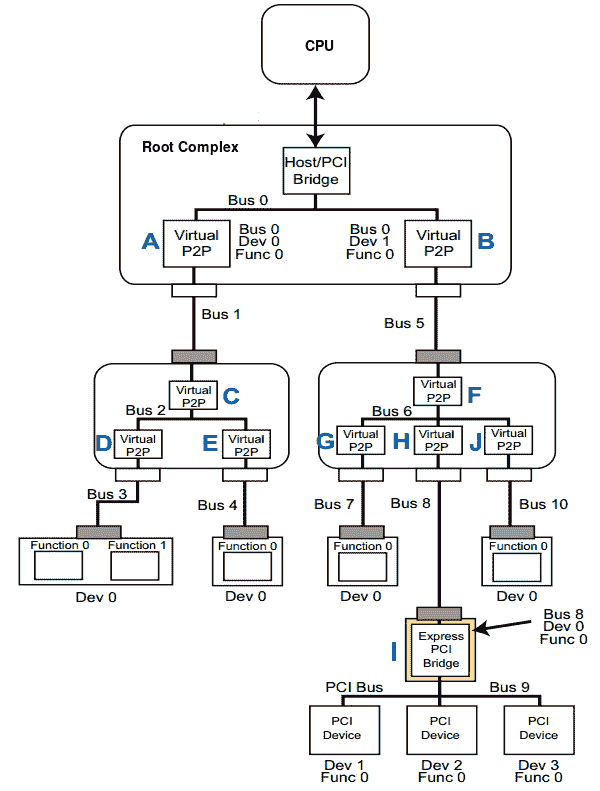

# 第十一章：*第十一章*：编写 PCI 设备驱动程序

PCI 不仅仅是一个总线，它是一个具有完整规范集的标准，定义了计算机的不同部分应该如何交互。多年来，PCI 总线已成为设备互连的事实标准，以至于几乎每个 SoC 都原生支持这样的总线。对速度的需求导致了不同版本和世代的总线。

在标准的早期阶段，实现 PCI 标准的第一个总线是 PCI 总线（总线名称与标准相同），作为 ISA 总线的替代。这改进了 ISA 的地址限制（限制为 24 位，并且有时需要通过跳线来路由 IRQ 等）。与 PCI 标准的先前总线实现相比，主要改进的因素是速度。

PCI Express 是当前的 PCI 总线系列。它是串行总线，而其祖先是并行总线。除了速度，PCIe 将其前身的 32 位寻址扩展到 64 位，并在中断管理系统中进行了多项改进。这个系列被分为世代，GenX，我们将在本章的以下部分中看到。我们将从 PCI 总线和接口的介绍开始，了解总线枚举，然后我们将看看 Linux 内核 PCI API 和核心功能。

所有这些的好消息是，无论是哪个系列，几乎所有内容对驱动程序开发人员来说都是透明的。Linux 内核将通过一组简化的 API 来抽象和隐藏大部分机制，这些 API 可用于编写可靠的 PCI 设备驱动程序。

本章将涵盖以下主题：

+   PCI 总线和接口简介

+   Linux 内核 PCI 子系统和数据结构

+   PCI 和直接内存访问（DMA）

# 技术要求

需要对 Linux 内存管理和内存映射有良好的概述，以及对中断和锁定的概念有熟悉，特别是在 Linux 内核中。

Linux 内核 v4.19.X 源代码可在[`git.kernel.org/pub/scm/linux/kernel/git/stable/linux.git/refs/tags`](https://git.kernel.org/pub/scm/linux/kernel/git/stable/linux.git/refs/tags)上找到。

# PCI 总线和接口简介

外围组件互连（PCI）是一种本地总线标准，用于连接计算机系统的外围硬件设备。作为总线标准，它定义了计算机的不同外围设备应该如何交互。然而，多年来，PCI 标准在功能或速度方面都有所发展。从其创建至今，我们已经有几个实现 PCI 标准的总线系列，如 PCI（是的，与标准同名的总线），PCI Extended（PCI-X），PCI Express（PCIe 或 PCI-E），这是 PCI 的当前世代。遵循 PCI 标准的总线称为 PCI 总线。

从软件角度来看，所有这些技术都是兼容的，并且可以由同一内核驱动程序处理。这意味着内核不需要知道使用的确切总线变体。从软件角度来看，PCIe 在很大程度上扩展了 PCI，具有许多软件方面的相似之处（特别是读/写 I/O 或内存事务）。虽然两者在软件上兼容，但 PCIe 是串行总线，而不是并行总线（在 PCIe 之前，每个 PCI 总线系列都是并行的），这也意味着你不能在 PCIe 插槽中安装 PCI 卡，或者在 PCI 插槽中安装 PCIe 卡。

PCI Express 是当今计算机上最流行的总线标准，因此在本章中，我们将以 PCIe 为目标，同时在必要时提到与 PCI 的相似之处或不同之处。除了前述内容，以下是 PCIe 的一些改进：

+   PCIe 是串行总线技术，而 PCI（或其他实现）是并行的，从而减少了连接设备所需的 I/O 通道数量，从而减少了设计复杂性。

+   PCIe 实现了增强的中断管理功能（提供基于消息的中断，也称为 MSI，或其扩展版本 MSI-X），扩展了 PCI 设备可以处理的中断数量，而不增加其延迟。

+   PCIe 增加了传输频率和吞吐量：Gen1，Gen2，Gen3...

PCI 设备是一种内存映射设备。连接到任何 PCI 总线的设备在处理器的地址空间中被分配地址范围。这些地址范围在 PCI 地址域中有不同的含义，根据它们包含的内容（PCI 设备的控制、数据和状态寄存器）或它们被访问的方式（I/O 端口或内存映射）。设备驱动程序/内核将访问这些内存区域，以控制连接到 PCI 总线上的特定设备并与其共享信息。

PCI 地址域包含三种不同的内存类型，必须在处理器的地址空间中进行映射。

## 术语

由于 PCIe 生态系统非常庞大，我们可能需要在继续之前熟悉一些术语。这些术语如下：

+   **根复杂**（**RC**）：这指的是 SoC 中的 PCIe 主机控制器。它可以在 CPU 不介入的情况下访问主存储器，这是其他设备用来访问主存储器的特性。它们也被称为主机到 PCI 桥接器。

+   `00h`配置空间头。它们永远不会出现在交换机的内部总线上，并且没有下游端口。

+   **通道**：这代表一组差分信号对（一个对用于 Tx，一个对用于 Rx）。

+   `xN`（`x1`，`x2`，`x4`，`x8`，`x12`，`x16`和`x32`），其中`N`是对的数量。

并非所有的 PCIe 设备都是端点。它们也可能是交换机或桥接器。

+   **桥接器**：这些提供了与其他总线的接口，如 PCI 或 PCI X，甚至另一个 PCIe 总线。桥接器也可以提供与同一总线的接口。例如，PCI 到 PCI 桥通过创建一个完全独立的次级总线来方便在总线上添加更多负载（我们将在接下来的部分中看到次级总线是什么）。桥接器的概念有助于理解和实现交换机的概念。

+   **交换机**：这些提供了聚合功能，并允许更多的设备连接到单个根端口。不用说，交换机有一个上游端口，但可能有多个下游端口。它们足够智能，可以作为数据包路由器，并根据其地址或其他路由信息（如 ID）识别给定数据包需要采取的路径。也就是说，还有隐式路由，仅用于某些消息事务，例如来自根复杂的广播和始终发送到根复杂的消息。

交换机下游端口是（虚拟的）PCI-PCI 桥，从内部总线桥接到代表此 PCI Express 交换机的下游 PCI Express 链路的总线。应该记住，只有代表交换机下游端口的 PCI-PCI 桥可能出现在内部总线上。

重要提示

PCI 到 PCI 桥提供了两个外围组件互连（PCI）总线之间的连接路径。在总线枚举过程中，应该记住**只有 PCI-PCI 桥的下游端口会被考虑**。这对于理解枚举过程非常重要。

## PCI 总线枚举，设备配置和寻址

PCIe 相对于 PCI 最明显的改进是其点对点总线拓扑结构。每个设备都位于自己专用的总线上，在 PCIe 术语中被称为**链路**。理解 PCIe 设备的枚举过程需要一些知识。

当您查看设备的寄存器空间（在头部类型寄存器中），它们会说明它们是类型`0`还是类型`1`的寄存器空间。通常，类型`0`表示端点设备，类型`1`表示桥接设备。软件必须确定它是在与端点设备还是桥接设备通信。桥接设备配置与端点设备配置不同。在桥接设备（类型 1）枚举期间，软件必须为其分配以下元素：

+   **主总线号**：这是上游总线号。

+   `0xFF`，因为`255`是最高的总线号。随着枚举的继续，这个字段将获得这座桥可以走多远的真实值。

### 设备识别

设备识别由一些属性或参数组成，使设备成为唯一或可寻址的。在 PCI 子系统中，这些参数如下：

+   **供应商 ID**：这标识设备的制造商。

+   **设备 ID**：这标识特定的供应商设备。

前面的两个元素可能足够了，但您也可以依赖以下元素：

+   **修订 ID**：这指定了设备特定的修订标识符。

+   **类别码**：这标识了设备实现的通用功能。

+   **头部类型**：这定义了头部的布局。

所有这些参数都可以从设备配置寄存器中读取。这就是内核在枚举总线时用来识别设备的方法。

### 总线枚举

在深入研究 PCIe 总线枚举功能之前，我们需要处理一些基本限制：

+   系统上可以有 256 个总线（0-255），因为有 8 位来识别它们。

+   每个总线可以有 32 个设备（0-31），因为每个总线上有 5 位来识别它们。

+   一个设备最多可以有 8 个功能（0-7），因此有 3 位来识别它们。

无论外部 PCIe 通道是否来自 CPU，都位于 PCIe 桥后面（因此获得新的 PCIe 总线号）。配置软件能够在给定系统上枚举高达 256 个 PCI 总线。编号 0 总是分配给根复杂。请记住，在总线枚举过程中，只有 PCI-PCI 桥的下游端口（次级端口）会被考虑。

PCI 枚举过程基于**深度优先搜索**（**DFS**）算法，通常从一个随机节点开始（但在 PCI 枚举的情况下，这个节点是预先知道的，在我们的情况下是 RC），并且在回溯之前尽可能地探索（实际上是寻找桥）每个分支。

这样说，当找到一个桥时，配置软件会为其分配一个号码，至少比这座桥所在的总线号大 1。之后，配置软件开始在这个新总线上寻找新的桥，依此类推，然后回溯到这座桥的兄弟（如果该桥是多端口交换机的一部分）或邻近桥（就拓扑而言）。

枚举的设备使用 BDF 格式进行标识，即*总线-设备-功能*，使用三个字节 - 也就是`XX:YY:ZZ` - 用十六进制（不带`0x`）表示。例如，`00:01:03`实际上意味着总线`0x00`：设备`0x01`：功能`0x03`。我们可以解释为在总线`0`上的设备`1`的功能`3`。这种表示法有助于快速定位给定拓扑中的设备。如果使用双字节表示法，这意味着功能已被省略或不重要，换句话说，`XX:YY`。

以下图显示了 PCIe 结构的拓扑：



图 11.1 - PCI 总线枚举

在我们描述前面的拓扑图之前，请重复以下四个陈述，直到您熟悉它们：

1.  PCI 到 PCI 桥通过创建一个完全独立的次级总线，便于向总线添加更多负载。因此，每个桥下游端口都是一个新的总线，并且必须给予一个总线号，至少比它所在的总线号大 1。

1.  交换机下游端口是（虚拟的）PCI-PCI（P2P）桥，从内部总线桥接到代表此 PCI Express 交换机的下游 PCI Express 链路的总线。

1.  CPU 通过主机到 PCI 桥与根复杂结构连接，这代表了根复杂结构中的上游桥。

1.  在总线枚举过程中，只考虑 PCI-PCI 桥的下游端口。

在将枚举算法应用于图表中的拓扑之后，我们可以列出 10 个步骤，从`0`开始，以及两个桥（因此提供了两个总线），`00:00:00`和`00:01:00`。以下是在前述拓扑图中枚举过程中步骤的描述，尽管步骤**C**是标准化枚举逻辑开始的地方：

+   `00:00`作为（虚拟）桥，毫无疑问，它的下游端口是一个总线。然后它被分配编号`1`（记住，它总是大于桥所在的总线号，这种情况下是`0`）。总线`1`然后被枚举。

+   步骤`1`（一个提供其内部总线的上游虚拟桥和两个暴露其输出总线的下游虚拟桥）。这个交换机的内部总线被赋予编号`2`。

+   我们立即进入步骤`3`，在它后面有一个端点（没有下游端口）。根据 DFS 算法的原则，我们到达了这个分支的叶节点，所以我们可以开始回溯。

+   因此到达步骤`4`，在它后面有一个设备。回溯可以再次发生。

+   然后我们到达步骤`5`。在这个总线后面有一个交换机（一个实现内部总线的上游虚拟桥，其总线号为`6`，以及`3`个代表其外部总线的下游虚拟桥，因此这是一个 3 端口交换机）。

+   步骤`7`，在这个总线后面有一个端点。如果我们要使用 BDF 格式标识这个端点的功能`0`，它将是`07:00:00`（设备`0`的功能`0`在总线`7`上）。回到 DFS 算法，我们已经到达了分支的底部。然后我们可以开始回溯，这将引导我们到步骤**H**。

+   在步骤`8`。在这个总线后面有一个 PCIe 到 PCI 桥。

+   在步骤`9`下游，并且在这个总线后面有一个 3 功能端点。在 BDF 表示法中，这些将被标识为`09:00:00`，`09:00:01`和`09:00:02`。由于端点标记了分支的深度，它允许我们执行另一个回溯，这将引导我们到步骤**J**。

+   在回溯阶段，我们进入步骤`10`。在这个总线后面有一个端点，它将以 BDF 格式被标识为`0a:00:00`。这标志着枚举过程的结束。

PCI(e)总线枚举乍看起来可能很复杂，但实际上很简单。阅读前面的材料两次就足以理解整个过程。

## PCI 地址空间

PCI 目标可以根据其内容或访问方法实现最多三种不同类型的地址空间。这些是**配置地址空间**，**内存地址空间**和**I/O 地址空间**。配置和内存地址空间是内存映射的 - 它们被分配了系统地址空间的地址范围，因此对该地址范围的读写不会进入 RAM，而是直接从 CPU 路由到设备，而 I/O 地址空间则不是。不多说了，让我们分析它们之间的区别以及它们不同的用例。

### PCI 配置空间

这是设备配置可以访问的地址空间，存储有关设备的基本信息，也被操作系统用于编程设备的操作设置。PCI 上有 256 字节的配置空间。PCIe 将其扩展到 4KB 的寄存器空间。由于配置地址空间是内存映射的，指向配置空间的任何地址都是从系统内存映射中分配的。因此，这 4KB 的空间从系统内存映射中分配内存地址，但实际的值/位/内容通常在外围设备的寄存器中实现。例如，当读取供应商 ID 或设备 ID 时，目标外围设备将返回数据，即使使用的内存地址来自系统内存映射。

该地址空间的一部分是标准化的。配置地址空间分为以下部分：

+   前 64 字节（00h-3Fh）代表标准配置头，包括 PCI 总线 ID、供应商 ID 和设备 ID 寄存器，用于识别设备。

+   剩下的 192 字节（40h-FFh）组成用户定义的配置空间，例如特定于 PC 卡的信息，将由其附带的软件驱动程序使用。

一般来说，配置空间存储有关设备的基本信息。它允许中央资源或操作系统使用操作设置对设备进行编程。配置地址空间没有与之关联的物理内存。它是 TLP（事务层数据包）中使用的地址列表，以便识别事务的目标。

用于在每个 PCI 设备的配置地址空间之间传输数据的命令称为配置读命令或配置写命令。

### PCI I/O 地址空间

如今，I/O 地址空间用于与 x86 架构的 I/O 端口地址空间兼容。PCIe 规范不鼓励使用此地址空间。如果 PCI Express 规范的未来修订废弃了 I/O 地址空间的使用，这将不足为奇。I/O 映射 I/O 的唯一优势是，由于其单独的地址空间，它不会从系统内存空间中窃取地址范围。因此，计算机可以在 32 位系统上访问整个 4GB 的 RAM。

I/O 读和 I/O 写命令用于在 I/O 地址空间中传输数据。

### PCI 内存地址空间

在计算机早期，英特尔定义了通过所谓的 I/O 地址空间访问 I/O 设备寄存器的方法。在那些日子里是有意义的，因为处理器的内存地址空间相当有限（例如，考虑 16 位系统），使用一些范围来访问设备几乎没有意义，甚至没有意义。当系统内存空间不再是约束时（例如，考虑 32 位系统，其中 CPU 可以寻址高达 4GB），I/O 地址空间和内存地址空间之间的分离变得不那么重要，甚至是累赘。

该地址空间上有许多限制和约束，导致 I/O 设备中的寄存器直接映射到系统的内存地址空间，因此称为内存映射 I/O 或 MMIO。这些限制和约束包括以下内容：

+   专用总线的需求

+   单独的指令集

+   由于它是在 16 位系统时代实施的，端口地址空间被限制为 65536 个端口（对应于 216），尽管非常旧的机器使用 10 位进行 I/O 地址空间，并且只有 1024 个唯一的端口地址。

因此，利用内存映射 I/O 的好处变得更加实际。

内存映射 I/O 允许硬件设备通过简单读取或写入这些“特殊”地址来访问，使用正常的内存访问指令，尽管与 65536 相比，解码多达 4GB 的地址（或更多）更昂贵。话虽如此，PCI 设备通过称为 BAR 的窗口公开其内存区域。PCI 设备最多可以有六个 BAR。

#### BAR 的概念

BAR 代表基址寄存器，是 PCI 的一个概念，设备通过它告诉主机需要多少内存以及其类型。这是内存空间（从系统内存映射中获取），而不是实际的物理 RAM（实际上可以将 RAM 本身看作是一个“专门的内存映射 I/O 设备”，其工作只是保存和返回数据，尽管在今天的现代 CPU 中，具有缓存等功能，这并不是物理上直接的）。将请求的内存空间分配给目标设备是 BIOS 或操作系统的责任。

一旦分配，BAR 被主机系统（CPU）视为内存窗口，用于与设备通信。设备本身不会写入该窗口。这个概念可以看作是一种间接机制，用于访问真正的物理内存，这是 PCI 设备内部和本地的。

实际上，内存的真实物理地址和输入/输出寄存器的地址是内部的，属于 PCI 设备。以下是主机处理外围设备存储空间的方式：

1.  外围设备通过某种方式告诉系统它有几个存储间隔和 I/O 地址空间，每个间隔有多大，以及它们各自的本地地址。显然，这些地址是本地和内部的，全部从`0`开始。

1.  系统软件知道有多少外围设备以及它们具有什么样的存储间隔后，可以为这些间隔分配“物理地址”，并建立这些间隔与总线之间的连接。这些地址是可访问的。显然，这里所说的“物理地址”与真实的物理地址有些不同。实际上，这是一个逻辑地址，因此它经常变成“总线地址”，因为这是 CPU 在总线上看到的地址。可以想象，外围设备必须有某种地址映射机制。所谓的“为外围设备分配地址”是为它们分配总线地址并建立映射。

## 中断分发

在这里，我们将讨论 PCI 设备处理中断的方式。PCI Express 中有三种中断类型。它们如下：

+   传统中断，也称为 INTx 中断，在旧 PCI 实现中是唯一可用的机制。

+   MSI（基于消息的中断）扩展了传统机制，例如，通过增加可能的中断数量。

+   MSI-X（扩展的 MSI）扩展和增强了 MSI，例如，通过允许将单个中断定位到不同的处理器（在某些高速网络应用中很有帮助）。

PCI Express 端点中的应用逻辑可以实现上述三种方法中的一种或多种来发出中断信号。让我们详细看看这些。

### PCI 传统 INT-X 中断

传统中断管理基于 PCI INT-X 中断线，由最多四根虚拟中断线组成，称为 INTA、INTB、INTC 和 INTD。这些中断线由系统中所有 PCI 设备共享。以下是传统实现必须经历的步骤，以识别和处理中断的概念：

1.  设备通过其 INT＃引脚之一来生成中断。

1.  CPU 确认中断并轮询连接到此 INT＃线（共享）的每个设备（实际上是其驱动程序）来调用它们的中断处理程序。服务中断所需的时间取决于共享该线路的设备数量。设备的中断服务例程（ISR）可以通过读取设备的内部寄存器来检查中断是否来自该设备，以识别中断的原因。

1.  中断服务程序（ISR）采取行动来处理中断。

在前述方法以及传统方法中，中断线是共享的：每个人都会接电话。此外，物理中断线是有限的。在下一节中，我们将看到 MSI 如何解决这些问题并促进中断管理。

重要说明

i.MX6 将 INTA/B/C/D 映射到 ARM GIC IRQ `155`/`154`/`153`/`152`，这允许 PCIe 到 PCI 桥正常运行。请参阅 IMX6DQRM.pdf，第 225 页。

### 基于消息的中断类型 - MSI 和 MSI-X

有两种基于消息的中断机制：MSI 和 MSI-X，增强和扩展版本。MSI（或 MSI-X）只是使用 PCI Express 协议层来发出中断的一种方式，PCIe 根复杂（主机）负责中断 CPU。

传统上，设备被分配为中断线，当它想要向 CPU 发出中断信号时，必须断言这些线。这种信号方法是带外的，因为它使用了另一种方式（与主数据路径不同）来发送这样的控制信息。

然而，MSI 允许设备向特殊的内存映射 I/O 地址写入少量描述中断的数据，然后根复杂负责将相应的中断传递给 CPU。一旦端点设备想要生成 MSI 中断，它就会向消息地址寄存器中指定的地址发出写请求，数据内容指定在消息数据寄存器中。由于数据路径用于此，这是一种带内机制。此外，MSI 增加了可能的中断数量。这将在下一节中描述。

重要说明

PCI Express 根本没有单独的中断引脚。但是，它在软件级别上与传统中断兼容。为此，它需要 MSI 或 MSI-X，因为它使用特殊的带内消息来允许引脚断言或取消断言的模拟。换句话说，PCI Express 通过提供`assert_INTx`和`deassert_INTx`来模拟这种能力。消息包通过 PCI Express 串行链路发送。

在使用 MSI 的实现中，通常的步骤如下：

1.  设备通过发送 MSI 内存写来生成中断。

1.  CPU 确认中断并调用适当的设备 ISR，因为这是根据 MSI 向量事先知道的。

1.  中断服务程序（ISR）采取行动来处理中断。

MSI 不是共享的，因此分配给设备的 MSI 在系统内是唯一的。不言而喻，MSI 实现显著减少了中断所需的总服务时间。

重要说明

大多数人认为 MSI 允许设备作为中断的一部分向处理器发送数据。这是一个误解。事实是，作为内存写事务的一部分发送的数据是由芯片组（实际上是根复杂）专门用于确定在哪个处理器上触发哪个中断；这些数据不可用于设备向中断处理程序传递附加信息。

#### MSI 机制

MSI 最初是作为 PCI 2.2 标准的一部分定义的，允许设备分配 1、2、4、8、16 或多达 32 个中断。设备被编程为写入地址以发出中断的信号（通常是中断控制器中的控制寄存器），并且一个 16 位数据字用于识别设备。中断号被添加到数据字中以识别中断。

PCI Express 端点可以通过向根端口发送标准的 PCI Express 发布写数据包来发出 MSI 信号。数据包由特定地址（由主机分配）和主机提供给端点的最多 32 个数据值（因此，32 个中断）组成。不同的数据值和地址值提供了比传统中断更详细的中断事件识别。中断屏蔽功能在 MSI 规范中是可选的。

这种方法确实有一些限制。32 个数据值只使用一个地址，这使得将单个中断定位到不同处理器变得困难。这种限制是因为与 MSI 相关联的内存写操作只能通过它们所针对的地址位置（而不是数据）来区分，这些地址位置由系统保留用于中断传递。

以下是由 PCI 控制器驱动程序执行的 PCI Express 设备的 MSI 配置步骤：

1.  总线枚举过程发生在启动期间。它包括内核 PCI 核心代码扫描 PCI 总线，以发现设备（换句话说，它为有效的供应商 ID 执行配置读取）。在发现 PCI Express 功能时，PCI 核心代码读取能力列表指针，以获取链式寄存器中第一个能力寄存器的位置。

1.  然后，PCI 核心代码搜索能力寄存器集。它会一直这样做，直到发现 MSI 能力寄存器集（能力 ID 为`05h`）。

1.  之后，PCI 核心代码配置设备，将内存地址分配给设备的消息地址寄存器。这是在传递中断请求时使用的内存写的目的地址。

1.  PCI 核心代码检查设备的消息控制寄存器中的多消息能力字段，以确定设备希望分配给它多少个特定事件的消息。

1.  然后，核心代码分配与设备请求的数量相等或少于该数量的消息。至少会分配一个消息给设备。

1.  核心代码将基本消息数据模式写入设备的消息数据寄存器。

1.  最后，PCI 核心代码在设备的消息控制寄存器中设置 MSI 使能位，从而使其能够使用 MSI 内存写生成中断。

#### MSI-X 机制

`2048`地址和数据对。由于每个端点可用的地址值数量很大，因此可以将 MSI-X 消息路由到系统中的不同中断消费者，而不像 MSI 数据包只有单个地址可用。此外，具有 MSI-X 功能的端点还包括应用逻辑来屏蔽和保持未决中断，以及用于地址和数据对的内存表。

除上述之外，MSI-X 中断与 MSI 相同。但是，MSI 中的可选功能（如 64 位寻址和中断屏蔽）在 MSI-X 中变为强制性。

#### 传统 INTx 模拟

因为 PCIe 声称与传统的并行 PCI 向后兼容，所以它还需要支持基于 INTx 的中断机制。但是这该如何实现呢？实际上，在经典 PCI 系统中有四条 INTx（INTA、INTB、INTC 和 INTD）物理 IRQ 线，它们都是电平触发的，实际上是低电平（换句话说，只要物理 INTx 线处于低电压，中断请求就是活动的）。那么在模拟版本中如何传输每个 IRQ 呢？

答案是 PCIe 通过使用一种称为 MSI 的带内信号机制来虚拟化 PCI 物理中断信号。由于每个物理线有两个级别（断开和断开），PCIe 为每条线提供两个消息，称为`assert_INTx`和`deassert_INTx`消息。总共有八种消息类型：`assert_INTA`、`deassert_INTA`，... `assert_INTD`、`deassert_INTD`。实际上，它们简单地被称为 INTx 消息。这样，INTx 中断就像 MSI 和 MSI-X 一样在 PCIe 链路上传播。

这种向后兼容性主要存在于 PCI 到 PCIe 桥接芯片，以便 PCI 设备可以在 PCIe 系统中正常工作，而无需修改驱动程序。

现在我们熟悉了 PCI 子系统中的中断分发。我们已经涵盖了传统的基于 INT-X 的机制和基于消息的机制。现在是时候深入代码，从数据结构到 API。

# Linux 内核 PCI 子系统和数据结构

Linux 内核支持 PCI 标准，并提供处理此类设备的 API。在 Linux 中，PCI 实现可以大致分为以下主要组件：

+   `arch/arm/kernel/bios32.c`。PCI BIOS 代码与 PCI 主机控制器代码以及 PCI 核心接口，以执行总线枚举和资源分配，如内存和中断。

BIOS 执行成功保证了系统中所有 PCI 设备被分配了可用 PCI 资源的部分，并且它们各自的驱动程序（称为从属或终端点驱动程序）可以利用 PCI 核心提供的设施来控制它们。

在这里，内核调用架构和特定于板的 PCI 功能的服务。PCI 配置的两个重要任务在这里完成。第一个任务是扫描总线上的所有 PCI 设备，对它们进行配置，并分配内存资源。第二个任务是配置设备。这里的配置意味着已经保留了资源（内存）并分配了 IRQ。这并不意味着初始化。初始化是特定于设备的，应该由设备驱动程序完成。PCI BIOS 可以选择跳过资源分配（例如，在 Linux 引导之前已经分配了资源，例如在 PC 场景中）。

+   `drivers/pci/host/`，换句话说，`drivers/pci/controller/pcie-rcar.c`适用于 r-car SoCs）。然而，一些 SoCs 可能会实现来自特定供应商的相同 PCIe IP 块，比如 Synopsys DesignWare。这样的控制器可以在同一目录中找到，比如内核源代码中的`drivers/pci/controller/dwc/`。例如，i.MX6 的 PCIe IP 块来自这个供应商，其驱动程序实现在`drivers/pci/controller/dwc/pci-imx6.c`中。这部分处理 SoC（有时也是板）特定的初始化和配置，并可能调用 PCI BIOS。然而，它应该提供 PCI 总线访问和为 BIOS 以及 PCI 核心提供回调函数，这些函数将在 PCI 系统初始化期间和访问 PCI 总线进行配置周期时被调用。此外，它提供可用内存/IO 空间、INTx 中断线和 MSI 的资源信息。它应该便于 IO 空间访问（如果支持），并且可能还需要提供间接内存访问（如果硬件支持）。

+   `drivers/pci/probe.c`：这个文件负责在系统中创建和初始化总线、设备以及桥接器的数据结构树。它处理总线/设备编号。它创建设备条目并提供`proc/sysfs`信息。它还为 PCI BIOS 和从属（**终端点**）驱动程序提供服务，并可选地支持热插拔（如果硬件支持）。它针对（**EP**）驱动程序接口查询并初始化枚举期间发现的相应设备。它还提供了 MSI 中断处理框架和 PCI Express 端口总线支持。以上所有内容足以促进 Linux 内核中设备驱动程序的开发。

## PCI 数据结构

Linux 内核 PCI 框架有助于 PCI 设备驱动程序的开发，这些驱动程序建立在两个主要数据结构的基础上：`struct pci_dev`代表内核中的 PCI 设备，`struct pci_driver`代表 PCI 驱动程序。

### 结构体 pci_dev

这是内核在系统上实例化每个 PCI 设备的结构。它描述了设备并存储了一些状态参数。该结构在`include/linux/pci.h`中定义如下：

```
struct pci_dev {
  struct pci_bus    *bus; /* Bus this device is on */
  struct pci_bus *subordinate; /* Bus this device bridges to */
    struct proc_dir_entry *procent;
    struct pci_slot		*slot;
    unsigned short	vendor;
    unsigned short	device;
    unsigned short	subsystem_vendor;
    unsigned short	subsystem_device;
    unsigned int		class;
   /* 3 bytes: (base,sub,prog-if) */
   u8 revision;     /* PCI revision, low byte of class word */
   u8 hdr_type; /* PCI header type (multi' flag masked out) */
   u8 pin;                /* Interrupt pin this device uses */
   struct pci_driver *driver; /* Driver bound to this device */
   u64	dma_mask;
   struct device_dma_parameters dma_parms;
    struct device		dev;
    int	cfg_size;
    unsigned int	irq;
[...]
    unsigned int		no_msi:1;	/* May not use MSI */
    unsigned int no_64bit_msi:1; /* May only use 32-bit MSIs */
    unsigned int msi_enabled:1;
    unsigned int msix_enabled:1;     atomic_t enable_cnt;
[...]
};
```

在前面的块中，为了可读性，已删除了一些元素。对于剩下的元素，以下元素具有以下含义：

+   `procent`是`/proc/bus/pci/`中的设备条目。

+   `slot`是设备所在的物理插槽。

+   `vendor`是设备制造商的供应商 ID。PCI 特别兴趣组织维护了这些数字的全球注册表，制造商必须申请分配给他们一个唯一的编号。此 ID 存储在设备配置空间中的一个 16 位寄存器中。

+   `device`是一旦被探测出来就能识别此特定设备的 ID。这是与供应商相关的，没有官方注册表。这也存储在一个 16 位寄存器中。

+   `subsystem_vendor`和`subsystem_device`指定了 PCI 子系统供应商和子系统设备 ID。它们可以用于进一步识别设备，就像我们之前看到的那样。

+   `class`标识了设备所属的类。它存储在一个 16 位寄存器中（在设备配置空间中），其高 8 位标识基类或组。

+   `pin`是设备使用的中断引脚，在传统的基于 INTx 的中断情况下。

+   `driver`是与此设备关联的驱动程序。

+   `dev`是此 PCI 设备的基础设备结构。

+   `cfg_size`是配置空间的大小。

+   `irq`是值得花时间研究的字段。当设备启动时，MSI(-X)模式未启用，并且直到通过`pci_alloc_irq_vectors()`API（旧驱动程序使用`pci_enable_msi()`）显式启用为止，它保持不变。

因此，`irq`首先对应于默认预分配的非 MSI IRQ。但是，根据以下情况之一，它的值或使用可能会发生变化：

a) 在 MSI 中断模式下（成功调用`pci_alloc_irq_vectors()`并设置了`PCI_IRQ_MSI`标志），此字段的（预分配）值将被新的 MSI 向量替换。该向量对应于分配向量的基本中断号，因此与向量 X（从 0 开始的索引）对应的 IRQ 号等同于（与）`pci_dev->irq + X`（参见`pci_irq_vector()`函数，旨在返回设备向量的 Linux IRQ 号）。

b) 在 MSI-X 中断模式下（成功调用`pci_alloc_irq_vectors()`并设置了`PCI_IRQ_MSIX`标志），此字段的（预分配）值不变（因为每个 MSI-X 向量都有其专用的消息地址和消息数据对，这不需要 1:1 的向量到条目映射）。但是，在此模式下，`irq`是无效的。在驱动程序中使用它来请求服务中断可能导致不可预测的行为。因此，如果需要 MSI(-X)，则应在驱动程序调用`devm_equest_irq()`之前调用`pci_alloc_irq_vectors()`函数（该函数在分配向量之前启用 MXI(-X)），因为 MSI(-X)通过与基于引脚的中断向量不同的向量传递。

+   `msi_enabled`保存了 MSI IRQ 模式的启用状态。

+   `msix_enabled`保存了 MSI-X IRQ 模式的启用状态。

+   `enable_cnt`保存了`pci_enable_device()`被调用的次数。这有助于在所有`pci_enable_device()`的调用者都调用了`pci_disable_device()`之后才真正禁用设备。

### 结构体 pci_device_id

虽然`struct pci_dev`描述了设备，`struct pci_device_id`旨在标识设备。该结构定义如下：

```
struct pci_device_id {
    u32 vendor, device;
    u32 subvendor, subdevice;
    u32 class, class_mask;
    kernel_ulong_t driver_data;
};
```

要了解此结构对于 PCI 驱动程序的重要性，让我们描述其每个元素：

+   `vendor`和`device`分别表示设备的供应商 ID 和设备 ID。两者配对以形成设备的唯一 32 位标识符。驱动程序依赖于这个 32 位标识符来识别其设备。

+   `subvendor`和`subdevice`表示子系统 ID。

+   `class`、`class_mask`是与类相关的 PCI 驱动程序，旨在处理给定类的每个设备。对于这样的驱动程序，应将`vendor`和`device`设置为`PCI_ANY_ID`。PCI 设备的不同类别在 PCI 规范中有描述。这两个值允许驱动程序指定它支持的 PCI 类设备的类型。

+   `driver_data`是驱动程序私有的数据。此字段不用于标识设备，而是用于传递不同的数据以区分设备。

有三个宏允许您创建`struct pci_device_id`的特定实例。

+   `PCI_DEVICE`：此宏用于通过创建一个`struct pci_device_id`来描述具有供应商和设备 ID 的特定 PCI 设备（`PCI_DEVICE(vend,dev)`），并将子供应商、子设备和与类相关的字段设置为`PCI_ANY_ID`。

+   `PCI_DEVICE_CLASS`：此宏用于通过创建一个`struct pci_device_id`来描述特定的 PCI 设备类，该类与给定的`class`和`class_mask`参数匹配（`PCI_DEVICE_CLASS(dev_class,dev_class_mask)`）。供应商、设备、子供应商和子设备字段将设置为`PCI_ANY_ID`。典型示例是`PCI_DEVICE_CLASS(PCI_CLASS_STORAGE_EXPRESS, 0xffffff)`，它对应于 NVMe 设备的 PCI 类，并且无论供应商和设备 ID 是什么，都将匹配任何这些设备。

+   `PCI_DEVICE_SUB`：此宏用于通过创建一个`struct pci_device_id`来描述具有子系统的特定 PCI 设备，其中子系统信息作为参数给出（`PCI_DEVICE_SUB(vend, dev, subvend, subdev)`）。

驱动程序支持的每个设备/类别都应该被放入同一个数组以供以后使用（我们将在两个地方使用它），如以下示例所示：

```
static const struct pci_device_id bt8xxgpio_pci_tbl[] = {
  { PCI_DEVICE(PCI_VENDOR_ID_BROOKTREE, PCI_DEVICE_ID_BT848) },
  { PCI_DEVICE(PCI_VENDOR_ID_BROOKTREE, PCI_DEVICE_ID_BT849) },
  { PCI_DEVICE(PCI_VENDOR_ID_BROOKTREE, PCI_DEVICE_ID_BT878) },
  { PCI_DEVICE(PCI_VENDOR_ID_BROOKTREE, PCI_DEVICE_ID_BT879) },
  { 0, },
};
```

每个`pci_device_id`结构都需要导出到用户空间，以便让热插拔和设备管理器（`udev`、`mdev`等）知道哪个驱动程序适用于哪个设备。将它们全部放入同一个数组的第一个原因是它们可以一次性导出。为了实现这一点，您应该使用`MODULE_DEVICE_TABLE`宏，如以下示例所示：

```
MODULE_DEVICE_TABLE(pci, bt8xxgpio_pci_tbl);
```

此宏创建一个具有给定信息的自定义部分。在编译时，构建过程（更精确地说是`depmod`）从驱动程序中提取这些信息，并构建一个名为`modules.alias`的人类可读表，位于`/lib/modules/<kernel_version>/`目录中。当内核告诉热插拔系统有新设备可用时，热插拔系统将参考`modules.alias`文件找到适当的驱动程序进行加载。

### `struct pci_driver`

此结构表示 PCI 设备驱动程序的一个实例，无论它是什么，属于什么子系统。这是每个 PCI 驱动程序必须创建和填充的主要结构，以便能够将它们注册到内核中。`struct pci_driver`定义如下：

```
struct pci_driver {
   const char *name;
   const struct pci_device_id *id_table; int (*probe)(struct                                                   pci_dev *dev,
   const struct pci_device_id *id); void (*remove)(struct                                                 pci_dev *dev);
   int (*suspend)(struct pci_dev *dev, pm_message_t state);   int (*resume) (struct pci_dev *dev);	/* Device woken up */
   void (*shutdown) (struct pci_dev *dev); [...]
};
```

此结构中的元素部分已被删除，因为它们对我们没有兴趣。以下是结构中剩余字段的含义：

+   `name`: 这是驱动程序的名称。由于驱动程序是通过其名称标识的，它必须在内核中所有 PCI 驱动程序中是唯一的。通常将此字段设置为与驱动程序的模块名称相同的名称。如果在相同的子系统总线中已经注册了具有相同名称的驱动程序，则您的驱动程序的注册将失败。要了解其内部工作原理，请查看[`elixir.bootlin.com/linux/v4.19/source/drivers/base/driver.c#L146`](https://elixir.bootlin.com/linux/v4.19/source/drivers/base/driver.c#L146)中的`driver_register()`。

+   `id_table`: 这应该指向先前描述的`struct pci_device_id`表。这是驱动程序中使用此结构的第二个也是最后一个地方。对于调用探测函数，它必须是非 NULL 的。

+   `探测`: 这是驱动程序的`probe`函数的指针。当 PCI 设备与驱动程序中的`id_table`中的条目匹配（通过供应商/产品 ID 或类 ID），PCI 核心会调用它。如果该方法成功初始化设备，则应返回`0`，否则返回负错误值。

+   `remove`: 当此驱动程序处理的设备从系统中移除（从总线上消失）或驱动程序从内核中卸载时，PCI 核心会调用此函数。

+   `suspend`、`resume`和`shutdown`: 这些是可选但建议的电源管理函数。在这些回调中，您可以使用与 PCI 相关的电源管理助手，如`pci_save_state()`或`pci_restore_state()`、`pci_disable_device()`或`pci_enable_device()`、`pci_set_power_state()`和`pci_choose_state()`。这些回调分别由 PCI 核心调用：

- 当设备被挂起时，此时状态作为回调的参数给出。

- 当设备被恢复时。这可能仅在调用`suspend`后发生。

- 为了设备的正确关闭。

以下是初始化 PCI 驱动程序结构的示例：

```
static struct pci_driver bt8xxgpio_pci_driver = {
    .name		= "bt8xxgpio",
    .id_table	= bt8xxgpio_pci_tbl,
    .probe		= bt8xxgpio_probe,
    .remove	= bt8xxgpio_remove,
    .suspend	= bt8xxgpio_suspend,
    .resume	= bt8xxgpio_resume,
};
```

#### 注册 PCI 驱动程序

通过调用`pci_register_driver()`注册 PCI 核心的 PCI 驱动程序，给定一个指向先前设置的`struct pci_driver`结构的参数。这应该在模块的`init`方法中完成，如下所示：

```
static int init pci_foo_init(void)
{
    return pci_register_driver(&bt8xxgpio_pci_driver);
}
```

`pci_register_driver()`在注册成功时返回`0`，否则返回负错误值。这个返回值由内核处理。

然而，在模块卸载路径上，需要注销`struct pci_driver`，以防系统尝试使用对应模块已不存在的驱动程序。因此，卸载 PCI 驱动程序需要调用`pci_unregister_driver()`，并且指向与注册相同的结构体指针，如下所示。这应该在模块的`exit`函数中完成：

```
static void exit pci_foo_exit(void)
{
    pci_unregister_driver(&bt8xxgpio_pci_driver);
}
```

也就是说，由于这些操作在 PCI 驱动程序中经常重复，PCI 核心暴露了`module_pci_macro()`宏，以便自动处理注册/注销，如下所示：

```
module_pci_driver(bt8xxgpio_pci_driver);
```

这个宏更安全，因为它负责注册和注销，防止一些开发人员提供一个并忘记另一个。

现在我们熟悉了最重要的 PCI 数据结构 - `struct pci_dev`、`pci_device_id`和`pci_driver`，以及处理这些数据结构的连字符助手。逻辑的延续是驱动程序结构，在其中我们学习如何以及在哪里使用先前列举的数据结构。

## PCI 驱动程序结构概述

在编写 PCI 设备驱动程序时，需要遵循一些步骤，其中一些需要按预定义的顺序执行。在这里，我们试图详细讨论每个步骤，解释适用的细节。

### 启用设备

在对 PCI 设备执行任何操作之前（即使只是读取其配置寄存器），必须启用此 PCI 设备，而且必须由代码显式地执行此操作。内核提供了`pci_enable_device()`来实现这一目的。此函数初始化设备，以便驱动程序可以使用它，并要求低级代码启用 I/O 和内存。它还处理 PCI 电源管理唤醒，以便如果设备被挂起，它也将被唤醒。以下是`pci_enable_device()`的样子：

```
int pci_enable_device(struct pci_dev *dev)
```

由于`pci_enable_device()`可能失败，因此必须检查其返回值，如以下示例所示：

```
int err;
    err = pci_enable_device(pci_dev);     if (err) {
    printk(KERN_ERR "foo_dev: Can't enable device.\n");
    return err;
}
```

请记住，`pci_enable_device()`将初始化内存映射和 I/O BARs。但是，您可能只想初始化其中一个，而不是另一个，要么是因为您的设备不支持两者，要么是因为您在驱动程序中不会同时使用两者。

为了不初始化 I/O 空间，可以使用启用方法的另一个变体`pci_enable_device_mem()`。另一方面，如果只需要处理 I/O 空间，可以使用`pci_enable_device_io()`变体。两种变体之间的区别在于，`pci_enable_device_mem()`将仅初始化内存映射 BARs，而`pci_enable_device_io()`将初始化 I/O BARs。请注意，如果设备启用了多次，每次操作都将增加`struct pci_dev`结构中的`.enable_cnt`字段，但只有第一次操作才会真正影响设备。

当要禁用 PCI 设备时，应该采用`pci_disable_device()`方法，无论您使用的是哪种启用变体。此方法向系统发出信号，表明 PCI 设备不再被系统使用。以下是其原型：

```
void pci_disable_device(struct pci_dev *dev)
```

`pci_disable_device()`还会在设备上禁用总线主控（如果激活）。但是，只有在`pci_enable_device()`（或其变体之一）的所有调用者都调用了`pci_disable_device()`之后，设备才会被禁用。

#### 总线主控能力

PCI 设备可以根据定义在总线上启动事务，即在成为总线主控的那一刻。在启用设备之后，您可能希望启用总线主控。

实际上是通过在适当的配置寄存器中设置总线主控位来启用设备中的 DMA。PCI 核心提供了`pci_set_master()`来实现这一目的。此方法还调用`pci_bios（实际上是 pcibios_set_master()）`以执行必要的特定于体系结构的设置。`pci_clear_master()`将通过清除总线主控位来禁用 DMA。这是相反的操作：

```
void pci_set_master(struct pci_dev *dev)
void pci_clear_master(struct pci_dev *dev)
```

请注意，如果设备打算执行 DMA 操作，则必须调用`pci_set_master()`。

### 访问配置寄存器

一旦设备绑定到驱动程序并由驱动程序启用后，通常会访问设备内存空间。通常首先访问的是配置空间。传统 PCI 和 PCI-X 模式 1 设备有 256 字节的配置空间。PCI-X 模式 2 和 PCIe 设备有 4096 字节的配置空间。对于驱动程序能够访问设备配置空间至关重要，无论是为了读取对驱动程序的正常操作必不可少的信息，还是为了设置一些重要的参数。内核为不同大小的数据配置空间提供了标准和专用的 API（读取和写入）。

为了从设备配置空间中读取数据，可以使用以下原语：

```
int pci_read_config_byte(struct pci_dev *dev, int where,                          u8 *val);
int pci_read_config_word(struct pci_dev *dev, int where,                          u16 *val);
int pci_read_config_dword(struct pci_dev *dev, int where,                           u32 *val);
```

上述原语分别作为一个、两个或四个字节在此处由`dev`参数表示的 PCI 设备的配置空间中读取。`read`值返回到`val`参数。在写入数据到设备配置空间时，可以使用以下原语：

```
int pci_write_config_byte(struct pci_dev *dev, int where,                           u8 val);
int pci_write_config_word(struct pci_dev *dev, int where,                           u16 val);
int pci_write_config_dword(struct pci_dev *dev, int where,                            u32 val);
```

上述原语分别将一个、两个或四个字节写入设备配置空间。`val`参数表示要写入的值。

在读取或写入情况下，`where`参数是从配置空间开头的字节偏移量。但是，在内核中存在一些常用的配置偏移量，由`include/uapi/linux/pci_regs.h`中定义的符号命名的宏标识。以下是一个简短的摘录：

```
#define	PCI_VENDOR_ID	0x00	/*	16	bits	*/
#define	PCI_DEVICE_ID	0x02	/*	16	bits	*/
#define	PCI_STATUS		0x06	/*	16	bits	*/
#define PCI_CLASS_REVISION  0x08  /* High 24 bits are class,                                      low 8 revision */
#define    PCI_REVISION_ID   0x08  /* Revision ID */
#define    PCI_CLASS_PROG    0x09  /* Reg. Level Programming                                       Interface */
#define    PCI_CLASS_DEVICE  0x0a  /* Device class */
[...]	
```

因此，要获取给定 PCI 设备的修订 ID，可以使用以下示例：

```
static unsigned char foo_get_revision(struct pci_dev *dev)
{
    u8 revision;
    pci_read_config_byte(dev, PCI_REVISION_ID, &revision);
    return revision;
}
```

在上面的例子中，我们使用了`pci_read_config_byte()`，因为修订仅由一个字节表示。

重要提示

由于数据以小端格式存储在（和从）PCI 设备中，读取原语（实际上是`word`和`dword`变体）负责将读取的数据转换为 CPU 的本机字节顺序，并且写入原语（`word`和`dword`变体）负责在将数据写入设备之前将数据从本机 CPU 字节顺序转换为小端格式。

### 访问内存映射 I/O 资源

内存寄存器用于几乎所有其他事情，例如用于突发事务。这些寄存器实际上对应于设备内存 BAR。然后，为系统地址空间中的每个寄存器分配一个内存区域，以便将对这些区域的任何访问重定向到相应的设备，从而针对与 BAR 对应的正确本地（在设备中）内存。这就是内存映射 I/O。

在 Linux 内核内存映射 I/O 世界中，通常在创建映射之前请求（实际上是声明）内存区域是很常见的。您可以使用`request_mem_region()`和`ioremap()`原语来实现这两个目的。以下是它们的原型：

```
struct resource *request_mem_region (unsigned long start,
                                     unsigned long n,                                      const char *name)
void iomem *ioremap(unsigned long phys_addr,                     unsigned long size);
```

`request_mem_region()`是一个纯预留机制，不执行任何映射。它依赖于其他驱动程序应该礼貌并应该在他们的轮次上调用`request_mem_region()`，这将防止另一个驱动程序重叠已经被声明的内存区域。除非此调用成功返回，否则不应映射或访问声明的区域。在其参数中，`name`表示要赋予资源的名称，`start`表示应为其创建映射的地址，`n`表示映射应有多大。要获取给定 BAR 的此信息，可以使用`pci_resource_start()`，`pci_resource_len()`，甚至`pci_resource_end()`，其原型如下：

+   `unsigned long pci_resource_start (struct pci_dev *dev, int bar)`: 此函数返回与索引为 bar 的 BAR 关联的第一个地址（内存地址或 I/O 端口号）。

+   `unsigned long pci_resource_len (struct pci_dev *dev, int bar)`: 此函数返回 BAR `bar`的大小。

+   `unsigned long pci_resource_end (struct pci_dev *dev, int bar)`: 此函数返回作为 I/O 区域编号`bar`的一部分的最后地址。

+   `unsigned long pci_resource_flags (struct pci_dev *dev, int bar)`: 此函数不仅与内存资源 BAR 相关。它实际上返回与此资源关联的标志。`IORESOURCE_IO`表示 BAR `bar`是 I/O 资源（因此适用于 I/O 映射 I/O），而`IORESOURCE_MEM`表示它是内存资源（用于内存映射 I/O）。

另一方面，`ioremap()`确实创建了实际映射，并返回映射区域上的内存映射 I/O cookie。例如，以下代码显示了如何映射给定设备的`bar0`：

```
unsigned long bar0_base; unsigned long bar0_size;
void iomem *bar0_map_membase;
/* Get the PCI Base Address Registers */
bar0_base = pci_resource_start(pdev, 0);
bar0_size = pci_resource_len(pdev, 0);
/*  * think about managed version and use  * devm_request_mem_regions()	 */
if (request_mem_region(bar0_base, bar0_size, "bar0-mapping")) {
    /* there is an error */
    goto err_disable;
}
/* Think about managed version and use devm_ioremap instead */ bar0_map_membase = ioremap(bar0_base, bar0_size);
if (!bar0_map_membase) {
    /* error */
    goto err_iomap;
}
/* Now we can use ioread32()/iowrite32() on bar0_map_membase*/
```

前面的代码运行良好，但很繁琐，因为我们需要为每个 BAR 执行此操作。实际上，`request_mem_region()`和`ioremap()`是非常基本的原语。PCI 框架提供了许多与 PCI 相关的函数，以便简化这些常见任务：

```
int pci_request_region(struct pci_dev *pdev, int bar,
                       const char *res_name)
int pci_request_regions(struct pci_dev *pdev,                         const char *res_name)
void iomem *pci_iomap(struct pci_dev *dev, int bar,
                      unsigned long maxlen)
void iomem *pci_iomap_range(struct pci_dev *dev, int bar,
                           unsigned long offset,                            unsigned long maxlen)
void iomem *pci_ioremap_bar(struct pci_dev *pdev, int bar)
void pci_iounmap(struct pci_dev *dev, void iomem *addr)
void pci_release_regions(struct pci_dev *pdev)
```

前面的辅助程序可以描述如下：

+   `pci_request_regions()`标记与`pdev` PCI 设备关联的所有 PCI 区域为所有者`res_name`所保留。在其参数中，`pdev`是要保留其资源的 PCI 设备，`res_name`是要与资源关联的名称。另一方面，`pci_request_region()`针对由`bar`参数标识的单个 BAR。

+   `pci_iomap()`为 BAR 创建映射。您可以使用`ioread*()`和`iowrite*()`来访问它。`maxlen`指定要映射的最大长度。如果要在不先检查其长度的情况下访问完整的 BAR，请在此处传递`0`。

+   `pci_iomap_range()`从 BAR 的偏移开始创建映射。生成的映射从`offset`开始，宽度为`maxlen`。`maxlen`指定要映射的最大长度。如果要从`offset`到结尾访问完整的 BAR，请在此处传递`0`。

+   `pci_ioremap_bar()`提供了一种无误巧的方式（相对于`pci_ioremap()`）来执行 PCI 内存重映射。它确保 BAR 实际上是一个内存资源，而不是一个 I/O 资源。然而，它映射整个 BAR 大小。

+   `pci_iounmap()`是`pci_iomap()`的相反操作，用于取消映射。它的`addr`参数对应于先前由`pci_iomap()`返回的 cookie。

+   `pci_release_regions()`是`pci_request_regions()`的相反操作。它释放先前声明（保留）的 PCI I/O 和内存资源。`pci_release_region()`针对单个 BAR 变体。

使用这些辅助程序，我们可以重新编写与 BAR1 相同的代码。这将如下所示：

```
#define DRV_NAME "foo-drv"
void iomem *bar1_map_membase;
int err;
err = pci_request_regions(pci_dev, DRV_NAME);
if (err) {
    /* an error occured */ goto error;
}
bar1_map_membase = pci_iomap(pdev, 1, 0);
if (!bar1_map_membase) {
    /* an error occured */
    goto err_iomap;
}
```

在内存区域被声明和映射之后，提供平台抽象的`ioread*()`和`iowrite*()`API 访问映射的寄存器。

### 访问 I/O 端口资源

I/O 端口访问需要经过与 I/O 内存相同的步骤，尽管底层机制不同：请求 I/O 区域，映射 I/O 区域（这不是强制性的，这只是一种礼貌），并访问 I/O 区域。

前两个步骤已经在您不知不觉中得到了解决。实际上，`pci_requestregion*()`原语处理 I/O 端口和 I/O 内存。它依赖于资源标志（`pci_resource_flags()`）以便调用适当的低级辅助程序（`（request_region()）`用于 I/O 端口或`request_mem_region()`用于 I/O 内存：

```
unsigned long flags = pci_resource_flags(pci_dev, bar);
if (flags & IORESOURCE_IO)
    /* using request_region() */
else if (flag & IORESOURCE_MEM)
    /* using request_mem_region() */
```

因此，无论资源是 I/O 内存还是 I/O 端口，您都可以安全地使用`pci_request_regions()`或其单个 BAR 变体`pci_request_region()`。

同样适用于 I/O 端口映射。`pci_iomap*()`原语能够处理 I/O 端口或 I/O 内存。它们也依赖于资源标志，并调用适当的辅助程序来创建映射。根据资源类型，底层映射函数是`ioremap()`用于 I/O 内存，这是`IORESOURCE_MEM`类型的资源，以及`__pci_ioport_map()`用于 I/O 端口，对应于`IORESOURCE_IO`类型的资源。`__pci_ioport_map()`是一个与体系结构相关的函数（实际上被 MIPS 和 SH 体系结构覆盖），大多数情况下对应于`ioport_map()`。

要确认我们刚才说的话，我们可以看一下`pci_iomap_range()`函数的主体，`pci_iomap()`依赖于它：

```
void iomem *pci_iomap_range(struct pci_dev *dev, int bar,
                            unsigned long offset,                             unsigned long maxlen)
{
    resource_size_t start = pci_resource_start(dev, bar);
    resource_size_t len = pci_resource_len(dev, bar);
    unsigned long flags = pci_resource_flags(dev, bar);
    if (len <= offset || !start)
        return NULL;
    len -= offset; start += offset;
    if (maxlen && len > maxlen)
        len = maxlen;
    if (flags & IORESOURCE_IO)
        return pci_ioport_map(dev, start, len);
    if (flags & IORESOURCE_MEM)
        return ioremap(start, len);
    /* What? */
    return NULL;
}
```

然而，当涉及访问 I/O 端口时，API 完全改变。以下是用于访问 I/O 端口的辅助程序。这些函数隐藏了底层映射的细节和它们的类型。以下列出了内核提供的用于访问 I/O 端口的函数：

```
u8 inb(unsigned long port);
u16 inw(unsigned long port);
u32 inl(unsigned long port);
void outb(u8 value, unsigned long port);
void outw(u16 value, unsigned long port);
void outl(u32 value, unsigned long port);
```

在前面的摘录中，`in*()`系列从`port`位置分别读取一个、两个或四个字节。获取的数据由一个值返回。另一方面，`out*()`系列将一个、两个或四个字节写入到`port`位置中的`value`参数中。

### 处理中断

需要为设备服务中断的驱动程序首先需要请求这些中断。通常在`probe()`方法中请求中断是很常见的。也就是说，为了处理传统和非 MSI IRQ，驱动程序可以直接使用`pci_dev->irq`字段，这在设备被探测时就预先分配好了。

然而，对于更通用的方法，建议使用`pci_alloc_irq_vectors()` API。此函数定义如下：

```
int pci_alloc_irq_vectors(struct pci_dev *dev,                           unsigned int min_vecs,
                          unsigned int max_vecs,                           unsigned int flags);
```

如果成功，上述函数将返回分配的向量数（如果成功可能小于`max_vecs`），或者在出现错误时返回负错误代码。分配的向量数始终至少达到`min_vecs`。如果对于`dev`来说少于`min_vecs`个中断向量是可用的，函数将以`-ENOSPC`失败。

这个函数的优点是它可以处理传统中断和 MSI 或 MSI-X 中断。根据`flags`参数，驱动程序可以指示 PCI 层为此设备设置 MSI 或 MSI-X 功能。此参数用于指定设备和驱动程序使用的中断类型。可能的标志在`include/linux/pci.h`中定义：

+   `PCI_IRQ_LEGACY`：一个传统的 IRQ 向量。

+   `PCI_IRQ_MSI`：在成功路径上，`pci_dev->msi_enabled`设置为`1`。

+   `PCI_IRQ_MSIX`：在成功路径上，`pci_dev->msix_enabled`设置为`1`。

+   `PCI_IRQ_ALL_TYPES`：这允许尝试分配上述任何一种中断，但按固定顺序。总是首先尝试 MSI-X 模式，并在成功时立即返回。如果 MSI-X 失败，则尝试 MSI。如果 MSI-X 和 MSI 都失败，则使用传统模式作为后备。驱动程序可以依赖于`pci_dev->msi_enabled`和`pci_dev->msix_enabled`来确定哪种模式成功。

+   `PCI_IRQ_AFFINITY`：这允许关联自动分配。如果设置，`pci_alloc_irq_vectors()`将在可用的 CPU 周围分配中断。

要获取要传递给`request_irq()`和`free_irq()`的 Linux IRQ 编号，对应于一个向量，请使用以下函数：

```
int pci_irq_vector(struct pci_dev *dev, unsigned int nr);
```

在上述中，`dev`是要操作的 PCI 设备，`nr`是设备相关的中断向量索引（从 0 开始）。现在让我们更仔细地看看这个函数是如何工作的：

```
int pci_irq_vector(struct pci_dev *dev, unsigned int nr)
{
    if (dev->msix_enabled) {
        struct msi_desc *entry;
        int i = 0;
        for_each_pci_msi_entry(entry, dev) {
            if (i == nr)
                return entry->irq;
            i++;
        }
        WARN_ON_ONCE(1);
        return -EINVAL;
    }
    if (dev->msi_enabled) {
        struct msi_desc *entry = first_pci_msi_entry(dev);
        if (WARN_ON_ONCE(nr >= entry->nvec_used))
            return -EINVAL;
    } else {
        if (WARN_ON_ONCE(nr > 0))
            return -EINVAL;
    }
    return dev->irq + nr;
}
```

在上述摘录中，我们可以看到 MSI-X 是第一次尝试（`if (dev->msix_enabled)`）。此外，返回的 IRQ 与设备探测时预分配的`pci_dev->irq`没有任何关系。但是如果启用了 MSI（`dev->msi_enabled`为真），那么这个函数将执行一些合理性检查，并返回`dev->irq + nr`。这证实了在 MSI 模式下操作时，`pci_dev->irq`被替换为一个新值，这个新值对应于分配的 MSI 向量的基本中断编号。最后，您会注意到在传统模式下没有特殊检查。

实际上，在传统模式下，预分配的`pci_dev->irq`保持不变，只有一个分配的向量。因此，在传统模式下操作时，`nr`应该是`0`。在这种情况下，返回的向量什么都不是，只是`dev->irq`。

一些设备可能不支持使用传统线中断，这种情况下，驱动程序可以指定只接受 MSI 或 MSI-X：

```
nvec =
    pci_alloc_irq_vectors(pdev, 1, nvec,                           PCI_IRQ_MSI | PCI_IRQ_MSIX);
if (nvec < 0)
    goto out_err;
```

重要提示

请注意，MSI/MSI-X 和传统中断是互斥的，参考设计默认支持传统中断。一旦在设备上启用了 MSI 或 MSI-X 中断，它将一直保持在这种模式，直到再次被禁用。

#### 传统 INTx IRQ 分配

PCI 总线类型（`struct bus_type pci_bus_type`）的探测方法是`pci_device_probe()`，实现在`drivers/pci/pci-driver.c`中。每当新的 PCI 设备添加到总线上或者新的 PCI 驱动程序注册到系统时，都会调用这个方法。这个函数调用`pci_assign_irq(pci_dev)`，然后调用`pcibios_alloc_irq(pci_dev)`来为 PCI 设备分配一个 IRQ，即著名的`pci_dev->irq`。技巧开始在`pci_assign_irq()`中发生。`pci_assign_irq()`读取 PCI 设备连接的引脚，如下：

```
u8 pin;
pci_read_config_byte(dev, PCI_INTERRUPT_PIN, &pin);
/* (1=INTA, 2=INTB, 3=INTD, 4=INTD) */
```

接下来的步骤依赖于 PCI 主机桥，其驱动程序应该公开一些回调，包括一个特殊的回调`.map_irq`，其目的是根据设备的插槽和先前读取的引脚为设备创建 IRQ 映射：

```
void pci_assign_irq(struct pci_dev *dev)
{
    int irq = 0; u8 pin;
    struct pci_host_bridge *hbrg =                pci_find_host_bridge(dev->bus);
    if (!(hbrg->map_irq)) {
    pci_dbg(dev, "runtime IRQ mapping not provided by arch\n");
         return;
    }
    pci_read_config_byte(dev, PCI_INTERRUPT_PIN, &pin);
    if (pin) {
        [...]
        irq = (*(hbrg->map_irq))(dev, slot, pin);
        if (irq == -1)
            irq = 0;
    }
    dev->irq = irq;
    pci_dbg(dev, "assign IRQ: got %d\n", dev->irq);
    /* Always tell the device, so the driver knows what is the
     * real IRQ to use; the device does not use it.      */
    pci_write_config_byte(dev, PCI_INTERRUPT_LINE, irq);
}
```

这是设备探测期间 IRQ 的第一个分配。回到`pci_device_probe()`函数，`pci_assign_irq()`之后调用的下一个方法是`pcibios_alloc_irq()`。然而，`pcibios_alloc_irq()`被定义为一个弱函数，只有 AArch64 架构才覆盖，位于`arch/arm64/kernel/pci.c`中，并且依赖于 ACPI（如果启用）来修改分配的 IRQ。也许在未来其他架构也会想要覆盖这个函数。

`pci_device_probe()`的最终代码如下：

```
static int pci_device_probe(struct device *dev)
{
    int error;
    struct pci_dev *pci_dev = to_pci_dev(dev);
    struct pci_driver *drv = to_pci_driver(dev->driver); 
    pci_assign_irq(pci_dev);
    error = pcibios_alloc_irq(pci_dev);
    if (error < 0)
        return error;
    pci_dev_get(pci_dev);
    if (pci_device_can_probe(pci_dev)) {
        error = pci_device_probe(drv, pci_dev);
        if (error) {
            pcibios_free_irq(pci_dev);
            pci_dev_put(pci_dev);
        }
    }
    return error;
}
```

重要提示

`PCI_INTERRUPT_LINE`中包含的 IRQ 值在调用`pci_enable_device()`之后才是有效的。但是，外围设备驱动程序不应该改变`PCI_INTERRUPT_LINE`，因为它反映了 PCI 中断如何连接到中断控制器，这是不可更改的。

#### 模拟 INTx IRQ 交换

请注意，大多数处于传统 INTx 模式的 PCIe 设备将默认为本地 INTA“虚拟线输出”，对于许多通过 PCIe/PCI 桥连接的物理 PCI 设备也是如此。操作系统最终会在系统中的所有外围设备之间共享 INTA 输入；所有共享相同 IRQ 线的设备 - 我会让你想象一下灾难。

解决这个问题的方法是“虚拟线 INTx IRQ 交换”。回到`pci_device_probe()`函数的代码，它调用了`pci_assign_irq()`。如果你看一下这个函数的主体部分（在`drivers/pci/setup-irq.c`中），你会注意到一些交换操作，这些操作旨在解决这个问题。

#### 锁定注意事项

许多设备驱动程序通常有一个每设备自旋锁，在中断处理程序中会使用。由于在基于 Linux 的系统上中断是非可重入的，因此在使用基于引脚的中断或单个 MSI 时，不需要禁用中断。但是，如果设备使用多个中断，驱动程序必须在持有锁时禁用中断。这将防止死锁，如果设备发送不同的中断，其处理程序将尝试获取已被正在服务的中断锁定的自旋锁。因此，在这种情况下要使用的锁原语是`spin_lock_irqsave()`或`spin_lock_irq()`，它们会禁用本地中断并获取锁。您可以参考*第一章**，嵌入式开发人员的 Linux 内核概念*，了解有关锁定原语和中断管理的更多详细信息。

#### 关于传统 API 的说明

仍然有许多驱动程序使用旧的现在已弃用的 MSI 或 MSI-X API，包括`pci_enable_msi()`、`pci_disable_msi()`、`pci_enable_msix_range()`、`pci_enable_msix_exact()`和`pci_disable_msix()`。

前面列出的 API 在新代码中都不应该使用。然而，以下是一个尝试使用 MSI 并在 MSI 不可用时回退到传统中断模式的代码摘录的例子：

```
    int err;
    /* Try using MSI interrupts */
    err = pci_enable_msi(pci_dev);
    if (err)
        goto intx;
    err = devm_request_irq(&pci_dev->dev, pci_dev->irq,
                        my_msi_handler, 0, "foo-msi", priv);
    if (err) {
        pci_disable_msi(pci_dev);
        goto intx;
    }
    return 0;
    /* Try using legacy interrupts */
intx:
    dev_warn(&pci_dev->dev,
    "Unable to use MSI interrupts, falling back to legacy\n");
    err = devm_request_irq(&pci_dev->dev, pci_dev->irq, 
             my_shared_handler, IRQF_SHARED, "foo-intx", priv);
    if (err) {
        dev_err(pci_dev->dev, "no usable interrupts\n");
        return err;
    }
    return 0;
```

由于前面的代码包含了已弃用的 API，将其转换为新的 API 可能是一个很好的练习。

现在我们已经完成了通用 PCI 设备驱动程序结构，并解决了这些驱动程序中的中断管理问题，我们可以向前迈进一步，利用设备的直接内存访问能力。

# PCI 和直接内存访问（DMA）

为了加快数据传输速度并通过允许 CPU 不执行繁重的内存复制操作来卸载 CPU 负担，控制器和设备都可以配置为执行直接内存访问（DMA），这是一种在设备和主机之间交换数据而不涉及 CPU 的方式。根据根复杂性，PCI 地址空间可以是 32 位或 64 位。

作为 DMA 传输的源或目的地的系统内存区域称为 DMA 缓冲区。但是，DMA 缓冲区内存范围取决于总线地址的大小。这源自 ISA 总线，其宽度为 24 位。在这样的总线上，DMA 缓冲区只能存在于系统内存的底部 16MB。这个底部内存也被称为`ZONE_DMA`。但是，PCI 总线没有这样的限制。经典 PCI 总线支持 32 位寻址，PCIe 将其扩展到 64 位。因此，可以使用两种不同的地址格式：32 位地址格式和 64 位地址格式。为了调用 DMA API，驱动程序应包含`#include <linux/dma-mapping.h>`。

为了告知内核 DMA 可用缓冲区的任何特殊需求（包括指定总线宽度），可以使用`dma_set_mask()`，其定义如下：

```
dma_set_mask(struct device *dev, u64 mask);
```

这将有助于系统在有效的内存分配方面，特别是如果设备可以直接寻址系统 RAM 中 4GB 以上的物理 RAM 中的“一致内存”。在上面的帮助程序中，`dev`是 PCI 设备的基础设备，`mask`是要使用的实际掩码，您可以使用`DMA_BIT_MASK`宏以及实际总线宽度来指定。`dma_set_mask()`在成功时返回`0`。任何其他值都表示发生了错误。

以下是 32 位（或 64 位）系统的示例：

```
int err = 0;
err = pci_set_dma_mask(pci_dev, DMA_BIT_MASK(32));
/* 
 * OR the below on a 64 bits system:
 * err = pci_set_dma_mask(dev, DMA_BIT_MASK(64));
 */
if (err) {
    dev_err(&pci_dev->dev,
            "Required dma mask not supported, \
              failed to initialize device\n");
    goto err_disable_pci_dev;
}
```

也就是说，DMA 传输需要合适的内存映射。这种映射包括分配 DMA 缓冲区并为每个生成总线地址，这些地址的类型是`dma_addr_t`。由于 I/O 设备通过总线控制器和任何中间 I/O 内存管理单元（IOMMU）查看 DMA 缓冲区，因此生成的总线地址将被提供给设备，以便通知其 DMA 缓冲区的位置。由于每个内存映射还会产生一个虚拟地址，因此不仅会生成总线地址，还会为映射生成虚拟地址。为了使 CPU 能够访问缓冲区，DMA 服务例程还将 DMA 缓冲区的内核虚拟地址映射到总线地址。

有两种（PCI）DMA 映射类型：连贯映射和流映射。对于任何一种，内核都提供了一个健壮的 API，可以屏蔽许多处理 DMA 控制器的内部细节。

## PCI 连贯（又称一致）映射

这种映射被称为连贯，因为它为设备执行 DMA 操作分配了非缓存（连贯）和非缓冲内存。由于设备或 CPU 的写入可以立即被任一方读取，而不必担心缓存一致性，因此这种映射也是同步的。所有这些使得连贯映射对系统来说太昂贵，尽管大多数设备都需要它。但是，从代码的角度来看，它更容易实现。

以下函数设置了一个连贯的映射：

```
void * pci_alloc_consistent(struct pci_dev *hwdev, size_t size,
                            dma_addr_t *dma_handle)
```

通过上述方法，为映射分配的内存保证是物理上连续的。`size`是您需要分配的区域的长度。此函数返回两个值：您可以用来从 CPU 访问它的虚拟地址和`dma_handle`，第三个参数，它是一个输出参数，对应于函数调用为分配的区域生成的总线地址。总线地址实际上是您传递给 PCI 设备的地址。

请注意，`pci_alloc_consistent()`实际上是`dma_alloc_coherent()`的一个简单包装，设置了`GFP_ATOMIC`标志，这意味着分配不会休眠，并且可以安全地在原子上下文中调用它。如果您希望更改分配标志，例如使用`GFP_KERNEL`而不是`GFP_ATOMIC`，则可以使用`dma_alloc_coherent()`（强烈建议）。

请记住，映射是昂贵的，它最少可以分配一页。在底层，它只分配 2 的幂次方的页数。页面的顺序是通过`int order = get_order(size)`获得的。这样的映射应该用于设备寿命的缓冲区。

要取消映射并释放这样的 DMA 区域，可以调用`pci_free_consistent()`：

```
pci_free_consistent(dev, size, cpu_addr, dma_handle);
```

在这里，`cpu_addr`和`dma_handle`对应于`pci_alloc_consistent()`返回的内核虚拟地址和总线地址。虽然映射函数可以从原子上下文中调用，但这个函数可能不能在这样的上下文中调用。

还要注意，`pci_free_consistent()`是`dma_free_coherent()`的一个简单包装，如果映射是使用`dma_alloc_coherent()`完成的，可以使用它：

```
#define DMA_ADDR_OFFSET	0x14
#define DMA_REG_SIZE_OFFSET		0x32
[...]
int do_pci_dma (struct pci_dev *pci_dev, int direction,                 size_t count)
{
    dma_addr_t dma_pa;
    char *dma_va;
    void iomem *dma_io;
    /* should check errors */
    dma_io = pci_iomap(dev, 2, 0);
    dma_va = pci_alloc_consistent(&pci_dev->dev, count,                                   &dma_pa);
    if (!dma_va)
        return -ENOMEM;
    /* may need to clear allocated region */
    memset(dma_va, 0, count);
    /* set up the device */
    iowrite8(CMD_DISABLE_DMA, dma_io + REG_CMD_OFFSET); 
    iowrite8(direction ? CMD_WR : CMD_RD);
    /* Send bus address to the device */
    iowrite32(dma_pa, dma_io + DMA_ADDR_OFFSET);
    /* Send size to the device */
    iowrite32(count, dma_io + DMA_REG_SIZE_OFFSET);
    /* Start the operation */
    iowrite8(CMD_ENABLE_DMA, dma_io + REG_CMD_OFFSET);
    return 0;
}
```

前面的代码展示了如何执行 DMA 映射并将结果总线地址发送到设备。在现实世界中，可能会引发中断。然后您应该在驱动程序中处理它。

## 流式 DMA 映射

另一方面，流式映射在代码方面有更多的约束。首先，这样的映射需要使用已经分配的缓冲区。此外，已经映射的缓冲区属于设备而不再属于 CPU。因此，在 CPU 可以使用缓冲区之前，应该首先取消映射，以解决可能的缓存问题。

如果需要启动写事务（CPU 到设备），驱动程序应该在映射之前将数据放入缓冲区。此外，必须指定数据应该移动的方向，并且只能基于这个方向使用数据。

缓冲区在可以被 CPU 访问之前必须取消映射的原因是因为缓存。不用说 CPU 映射是可缓存的。`dma_map_*()`系列函数（实际上是由`pci_map_*()`函数包装）用于流式映射，将首先清除/使无效与缓冲区相关的缓存，并且依赖于 CPU 在相应的`dma_unmap_*()`（由`pci_unmap_*()`函数包装）之前不访问这些缓冲区。在此期间，这些取消映射将再次使缓存无效（如果有必要），以便 CPU 可以读取设备写入内存的任何数据之前的任何推测获取。只有在这个时候 CPU 才能访问这些缓冲区。

有流式映射可以接受多个非连续和分散的缓冲区。然后我们可以列举两种形式的流式映射：

+   单缓冲区映射，只允许单页映射

+   分散/聚集映射，允许传递多个分散在内存中的缓冲区

它们中的每一个在以下各节中介绍。

### 单缓冲区映射

这包括映射单个缓冲区。它是用于偶尔映射的。也就是说，您可以使用以下方法设置单个缓冲区：

```
dma_addr_t pci_map_single(struct pci_dev *hwdev, void *ptr,
                          size_t size, int direction)
```

`direction`应该是`PCI_DMA_BIDIRECTION`，`PCI_DMA_TODEVICE`，`PCI_DMA_FROMDEVICE`或`PCI_DMA_NONE`。`ptr`是缓冲区的内核虚拟地址，`dma_addr_t`是返回的总线地址，可以发送到设备。您应该确保使用真正匹配数据移动方式的方向，而不仅仅是`DMA_BIDIRECTIONAL`。`pci_map_single()`是`dma_map_single()`的一个简单包装，方向映射到`DMA_TO_DEVICE`，`DMA_FROM_DEVICE`或`DMA_BIDIRECTIONAL`。

您应该使用以下方法释放映射：

```
Void pci_unmap_single(struct pci_dev *hwdev,                       dma_addr_t dma_addr,
                      size_t size, int direction)
```

这是`dma_unmap_single()`的一个包装。`dma_addr`应该与`pci_map_single()`返回的地址相同（或者如果您使用了`dma_map_single()`，则应该与其返回的地址相同）。`direction`和`size`应该与您在映射中指定的相匹配。

以下是流式映射的简化示例（实际上是单个缓冲区）：

```
int do_pci_dma (struct pci_dev *pci_dev, int direction,
                void *buffer, size_t count)
{
    dma_addr_t dma_pa;
    /* bus address */
    void iomem *dma_io;
    /* should check errors */
    dma_io = pci_iomap(dev, 2, 0);
    dma_dir = (write ? DMA_TO_DEVICE : DMA_FROM_DEVICE);
    dma_pa = pci_map_single(pci_dev, buffer, count, dma_dir);
    if (!dma_va)
        return -ENOMEM;
    /* may need to clear allocated region */
    memset(dma_va, 0, count);
    /* set up the device */
    iowrite8(CMD_DISABLE_DMA, dma_io + REG_CMD_OFFSET);
    iowrite8(direction ? CMD_WR : CMD_RD);
    /* Send bus address to the device */
    iowrite32(dma_pa, dma_io + DMA_ADDR_OFFSET);
    /* Send size to the device */
    iowrite32(count, dma_io + DMA_REG_SIZE_OFFSET);
    /* Start the operation */
    iowrite8(CMD_ENABLE_DMA, dma_io + REG_CMD_OFFSET);
    return 0;
}
```

在前面的示例中，`buffer`应该已经被分配并包含数据。然后它被映射，其总线地址被发送到设备，并且 DMA 操作被启动。下一个代码示例（作为 DMA 事务的中断处理程序实现）演示了如何从 CPU 端处理缓冲区：

```
void pci_dma_interrupt(int irq, void *dev_id)
{
    struct private_struct *priv =     (struct private_struct *) dev_id;
    /* Unmap the DMA buffer */
    pci_unmap_single(priv->pci_dev, priv->dma_addr,
                     priv->dma_size, priv->dma_dir);
    /* now it is safe to access the buffer */
    [...]
}
```

在前面的示例中，映射在 CPU 可以处理缓冲区之前被释放。

### 散射/聚集映射

散射/聚集映射是流式 DMA 映射的第二类，您可以在一次传输中传输多个（不一定是物理上连续的）缓冲区域，而不是分别映射每个缓冲区并逐个传输它们。为了设置`scatterlist`映射，您应该首先分配您的散射缓冲区，这些缓冲区必须是页面大小，除了最后一个可能有不同的大小。之后，您应该分配一个`scatterlist`数组，并使用`sg_set_buf()`将先前分配的缓冲区填充进去。最后，您必须在`scatterlist`数组上调用`dma_map_sg()`。完成 DMA 后，调用`dma_unmap_sg()`来取消映射`scatterlist`条目。

虽然您可以通过映射每个缓冲区逐个发送多个缓冲区的内容，但是散射/聚集可以通过一次发送`scatterlist`指针以及一个长度（列表中的条目数）来一次发送它们。

```
u32 *wbuf1, *wbuf2, *wbuf3;
struct scatterlist sgl[3];
int num_mapped;
wbuf1 = kzalloc(PAGE_SIZE, GFP_DMA);
wbuf2 = kzalloc(PAGE_SIZE, GFP_DMA);
/* size may be different for the last entry */
wbuf3 = kzalloc(CUSTOM_SIZE, GFP_DMA); 
sg_init_table(sg, 3);
sg_set_buf(&sgl[0], wbuf1, PAGE_SIZE);
sg_set_buf(&sgl[1], wbuf2, PAGE_SIZE);
sg_set_buf(&sgl[2], wbuf3, CUSTOM_SIZE);
num_mapped = pci_map_sg(NULL, sgl, 3, PCI_DMA_BIDIRECTIONAL);
```

首先要注意的是，`pci_map_sg()`是`dma_map_sg()`的一个简单包装。在前面的代码中，我们使用了`sg_init_table()`，这导致了一个静态分配的表。我们可以使用`sg_alloc_table()`进行动态分配。此外，我们可以使用`for_each_sg()`宏，以便循环遍历每个`sg`（使用`sg_set_page()`助手来设置此 scatterlist 绑定的页面（您不应该直接分配页面）。以下是涉及此类助手的示例：

```
static int pci_map_memory(struct page **pages,
                          unsigned int num_entries,
                          struct sg_table *st)
{
    struct scatterlist *sg;
    int i;
    if (sg_alloc_table(st, num_entries, GFP_KERNEL))
        goto err;
    for_each_sg(st->sgl, sg, num_entries, i)
        sg_set_page(sg, pages[i], PAGE_SIZE, 0);
    if (!pci_map_sg(priv.pcidev, st->sgl, st->nents, 
                    PCI_DMA_BIDIRECTIONAL))
        goto err;
    return 0;
err:
    sg_free_table(st);
    return -ENOMEM;
}
```

在前面的代码块中，页面应该已经被分配，并且显然应该是`PAGE_SIZE`大小。`st`是一个输出参数，在此函数的成功路径上将被适当设置。

再次注意，scatterlist 条目必须是页面大小（除了最后一个条目可能有不同的大小）。对于输入 scatterlist 中的每个缓冲区，`dma_map_sg()`确定要给设备的适当总线地址。每个缓冲区的总线地址和长度存储在 struct scatterlist 条目中，但它们在结构中的位置因架构而异。因此，有两个宏可以用于使您的代码可移植：

+   `dma_addr_t sg_dma_address(struct scatterlist *sg)`: 这返回此 scatterlist 条目的总线（DMA）地址。

+   `unsigned int sg_dma_len(struct scatterlist *sg)`: 这返回此缓冲区的长度。

`dma_map_sg()`和`dma_unmap_sg()`负责缓存一致性。但是，如果您必须在 DMA 传输之间访问（读/写）数据，则必须适当地在每次传输之间同步缓冲区，通过`dma_sync_sg_for_cpu()`（如果 CPU 需要访问缓冲区）或`dma_sync_sg_for_device()`（如果设备需要访问）来实现。单个区域映射的类似函数是`dma_sync_single_for_cpu()`和`dma_sync_single_for_device()`。

鉴于上述所有内容，我们可以得出结论，一致映射编码简单但使用昂贵，而流式映射具有相反的特征。当 I/O 设备长时间拥有缓冲区时，应使用流式映射。流式 DMA 在异步操作中很常见，每个 DMA 在不同的缓冲区上操作，例如网络驱动程序，其中每个`skbuf`数据都是动态映射和取消映射的。然而，设备可能对你应该使用的方法有最后的决定权。也就是说，如果你有选择的话，应该在可以的时候使用流式映射，在必须的时候使用一致映射。

# 总结

在本章中，我们处理了 PCI 规范总线和实现，以及它在 Linux 内核中的支持。我们经历了枚举过程以及 Linux 内核如何允许访问不同的地址空间。然后，我们详细介绍了如何编写 PCI 设备驱动程序的逐步指南，从设备表的填充到模块的“退出”方法。我们深入研究了中断机制及其基本行为以及它们之间的区别。现在你能够自己编写 PCI 设备驱动程序，并且熟悉它们的枚举过程。此外，你了解它们的中断机制，并且知道它们之间的区别（MSI 或非 MSI）。最后，你学会了如何访问它们各自的内存区域。

在下一章中，我们将处理 NVMEM 框架，该框架有助于开发用于 EEPROM 等非易失性存储设备的驱动程序。这将有助于结束我们在学习 PCI 设备驱动程序时迄今所经历的复杂性。
