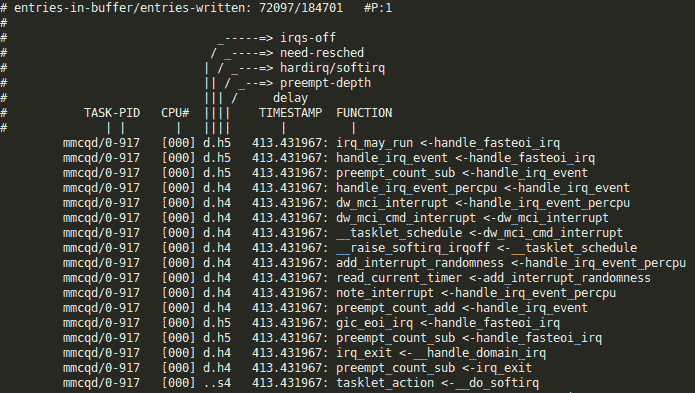
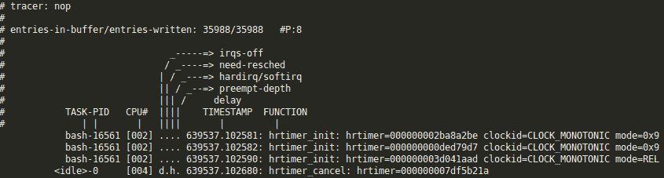
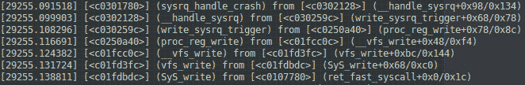

# 第十四章：*第十四章*：Linux 内核调试技巧和最佳实践

大多数情况下，在开发过程中，编写代码并不是最困难的部分。困难之处在于 Linux 内核是操作系统最底层的独立软件。这使得调试 Linux 内核变得具有挑战性。然而，这得到了补偿，因为大多数情况下，我们不需要额外的工具来调试内核代码，因为大多数内核调试工具都是内核本身的一部分。我们将首先熟悉 Linux 内核发布模型，然后学习 Linux 内核发布流程和步骤。接下来，我们将关注与 Linux 内核调试相关的开发技巧（特别是通过打印进行调试），最后，我们将专注于跟踪 Linux 内核，以离线调试和学习如何利用内核 oops 结束。

本章将涵盖以下主题：

+   了解 Linux 内核发布流程

+   Linux 内核开发技巧

+   Linux 内核跟踪和性能分析

+   Linux 内核调试技巧

# 技术要求

本章的先决条件如下：

+   高级计算机体系结构知识和 C 编程技能

+   Linux 内核 v4.19.X 源代码，位于[`git.kernel.org/pub/scm/linux/kernel/git/stable/linux.git/refs/tags`](https://git.kernel.org/pub/scm/linux/kernel/git/stable/linux.git/refs/tags)

# 了解 Linux 内核发布流程

根据 Linux 内核发布模型，始终存在三种类型的活动内核发布：主线、稳定发布和长期支持（LTS）发布。首先，子系统维护者收集和准备 bug 修复和新功能，然后提交给 Linus Torvalds，以便他将它们包含在自己的 Linux 树中，这被称为主线 Linux 树，也被称为主 Git 存储库。这是每个稳定发布的起源。

在每个新内核版本发布之前，它都会通过*发布候选*标签提交给社区，以便开发人员可以测试和完善所有新功能，最重要的是分享反馈。在这个周期内，Linus 将依赖反馈来决定最终版本是否准备好发布。当他确信新内核准备就绪时，他会进行（实际上是标记）最终发布，我们称这个发布为*稳定*，以表示它不再是*发布候选*：这些发布是*vX.Y*版本。

没有制定发布的严格时间表。然而，新的主线内核通常每 2-3 个月发布一次。稳定内核发布基于 Linus 的发布，即主线树发布。

一旦 Linus 发布了主线内核，它也会出现在 linux-stable 树中（位于[`git.kernel.org/pub/scm/linux/kernel/git/stable/linux.git/`](https://git.kernel.org/pub/scm/linux/kernel/git/stable/linux.git/)），在那里它成为一个分支，并且可以接收稳定发布的 bug 修复。Greg Kroah-Hartman 负责维护这个树，它也被称为稳定树，因为它用于跟踪先前发布的稳定内核。也就是说，为了将修复应用到这个树中，这个修复必须首先被合并到 Linus 的树中。因为修复必须先前进再返回，所以说这个修复是被反向移植的。一旦在主线存储库中修复了 bug，它就可以应用到仍由内核开发社区维护的先前发布的内核中。所有反向移植到稳定发布的修复必须符合一组强制接受标准，其中之一是它们必须已经存在于 Linus 的树中。

重要提示

修复 bug 的内核发布被认为是稳定的。

例如，`4.9`内核由 Linus 发布，然后基于此内核的稳定内核发布被编号为`4.9.1`，`4.9.2`，`4.9.3`等。这些发布被称为*错误修复内核发布*，通常在稳定内核发布树中引用它们的分支时，序列通常缩短为数字*4.9.y*。每个稳定内核发布树由单个内核开发人员维护，负责挑选发布所需的补丁，并执行审查/发布流程。通常只有几个错误修复内核发布，直到下一个主线内核可用，除非它被指定为*长期维护内核*。

每个子系统和内核维护者存储库都托管在这里：[`git.kernel.org/pub/scm/linux/kernel/git/`](https://git.kernel.org/pub/scm/linux/kernel/git/)。在那里，我们也可以找到 Linus 或稳定树。在 Linus 树中([`git.kernel.org/pub/scm/linux/kernel/git/torvalds/linux.git/`](https://git.kernel.org/pub/scm/linux/kernel/git/torvalds/linux.git/))，Linus 的树中只有一个分支，即主分支。其中的标签要么是稳定发布，要么是发布候选版本。在稳定树中([`git.kernel.org/pub/scm/linux/kernel/git/stable/linux.git/`](https://git.kernel.org/pub/scm/linux/kernel/git/stable/linux.git/))，每个稳定内核发布都有一个分支(命名为*<A.B>.y*，其中*<A.B>*是 Linus 树中的发布版本)，每个分支都包含其错误修复内核发布。

重要提示

有一些链接可以随时保留，以便跟踪 Linux 内核发布。第一个是[`www.kernel.org/`](https://www.kernel.org/)，您可以从这里下载内核存档，然后是[`www.kernel.org/category/releases.html`](https://www.kernel.org/category/releases.html)，您可以访问最新的 LTS 内核发布及其支持时间表。您还可以参考此链接[`patchwork.kernel.org/`](https://patchwork.kernel.org/)，从这里您可以按子系统基础跟踪内核补丁提交。

现在我们熟悉了 Linux 内核发布模型，我们可以深入一些开发提示和最佳实践，这有助于巩固和利用其他内核开发人员的经验。

# Linux 内核开发提示

最佳的 Linux 内核开发实践是受现有内核代码的启发。这样，您肯定可以学到良好的实践。也就是说，我们不会重复造轮子。我们将专注于本章所需的内容，即调试。最常用的调试方法涉及日志记录和打印。为了利用这种经过时间考验的调试技术，Linux 内核提供了适当的日志记录 API，并公开了内核消息缓冲区以存储日志。虽然这似乎很明显，我们将专注于内核日志记录 API，并学习如何管理消息缓冲区，无论是从内核代码内部还是从用户空间。

## 消息打印

消息打印和记录是开发的固有部分，无论我们是在内核空间还是用户空间。在内核中，`printk()`函数长期以来一直是事实上的内核消息打印函数。它类似于 C 库中的`printf()`，但具有日志级别的概念。

如果您查看实际驱动程序代码的示例，您会注意到它的用法如下：

```
printk(<LOG_LEVEL> "printf like formatted message\n");
```

在这里，`<LOG_LEVEL>`是`include/linux/kern_levels.h`中定义的八个不同日志级别之一，并指定错误消息的严重程度。您还应该注意，日志级别和格式字符串之间没有逗号(因为预处理器连接了这两个字符串)。

### 内核日志级别

Linux 内核使用级别的概念来确定消息的严重程度。共有八个级别，每个级别都定义为一个字符串，它们的描述如下：

+   `KERN_EMERG`，定义为``"0"``。它用于紧急消息，意味着系统即将崩溃或不稳定（无法使用）。

+   `KERN_ALERT`，定义为``"1"``，意味着发生了严重的事情，必须立即采取行动。

+   `KERN_CRIT`，定义为``"2"``，意味着发生了严重的条件，例如严重的硬件/软件故障。

+   `KERN_ERR`，定义为``"3"``，在错误情况下使用，通常由驱动程序用于指示与硬件的困难或与子系统的交互失败。

+   `KERN_WARNING`，定义为``"4"``，用作警告，本身并不严重，但可能表示问题。

+   `KERN_NOTICE`，定义为``"5"``，意味着没有严重问题，但仍然值得注意。这经常用于报告安全事件。

+   `KERN_INFO`，定义为``"6"``，用于信息消息，例如驱动程序初始化时的启动信息。

+   `KERN_DEBUG`，定义为``"7"``，用于调试目的，仅在启用`DEBUG`内核选项时才有效。否则，它的内容将被简单地忽略。

如果您在消息中未指定日志级别，则默认为`DEFAULT_MESSAGE_LOGLEVEL`（通常为``"4"`` = `KERN_WARNING`），可以通过`CONFIG_DEFAULT_MESSAGE_LOGLEVEL`内核配置选项进行设置。

因此，对于新的驱动程序，建议您使用更方便的打印 API，这些 API 在其名称中嵌入了日志级别。这些打印助手是`pr_emerg`，`pr_alert`，`pr_crit`，`pr_err`，`pr_warning`，`pr_warn`，`pr_notice`，`pr_info`，`pr_debug`或`pr_dbg`。除了比等效的`printk()`调用更简洁之外，它们还可以通过`pr_fmt()`宏使用格式字符串的通用定义；例如，在源文件的顶部（在任何`#include`指令之前）定义这个：

```
#define pr_fmt(fmt) "%s:%s: " fmt, KBUILD_MODNAME, __func__
```

这将在该文件中的每个`pr_*()`消息前缀模块和生成消息的函数名称。如果内核是使用`DEBUG`编译的，则`pr_devel`和`pr_debug`将被替换为`printk(KERN_DEBUG …)`，否则它们将被替换为空语句。

`pr_*()`系列宏应该在核心代码中使用。对于设备驱动程序，您应该使用与设备相关的辅助程序，这些辅助程序还接受相关设备结构作为参数。它们还以标准形式打印相关设备的名称，确保始终可以将消息与生成它的设备关联起来：

```
dev_emerg(const struct device *dev, const char *fmt, ...);
dev_alert(const struct device *dev, const char *fmt, ...);
dev_crit(const struct device *dev, const char *fmt, ...);
dev_err(const struct device *dev, const char *fmt, ...);
dev_warn(const struct device *dev, const char *fmt, ...);
dev_notice(const struct device *dev, const char *fmt, ...);
dev_info(const struct device *dev, const char *fmt, ...);
dev_dbg(const struct device *dev, const char *fmt, ...);
```

虽然日志级别的概念被内核用来确定消息的重要性，但它也用于决定是否应立即将此消息呈现给用户，通过将其打印到当前控制台（其中控制台也可以是串行线或甚至打印机，而不是`xterm`）。

为了决定，内核将消息的日志级别与`console_loglevel`内核变量进行比较，如果消息的日志级别重要性更高（即较低的值）比`console_loglevel`，则消息将被打印到当前控制台。由于默认内核日志级别通常为``"4"``，这就是为什么您在控制台上看不到`pr_info()`或`pr_notice()`甚至`pr_warn()`消息的原因，因为它们具有更高或相等的值（这意味着优先级更低）比默认值。

要确定系统上的当前`console_loglevel`，您只需输入以下内容：

```
$ cat /proc/sys/kernel/printk
4    4    1    7
```

第一个整数（`4`）是当前控制台日志级别，第二个数字（`4`）是默认值，第三个数字（`1`）是可以设置的最小控制台日志级别，第四个数字（`7`）是启动时的默认控制台日志级别。

要更改当前的`console_loglevel`，只需写入同一文件，即`/proc/sys/kernel/printk`。因此，为了将所有消息打印到控制台，执行以下简单命令：

```
# echo 8 > /proc/sys/kernel/printk
```

每条内核消息都会出现在您的控制台上。然后您将看到以下内容：

```
# cat /proc/sys/kernel/printk
8    4    1    7
```

改变控制台日志级别的另一种方法是使用带有`-n`参数的`dmesg`：

```
# dmesg -n 5
```

通过上述命令，`console_loglevel`被设置为打印`KERN_WARNING`（`4`）或更严重的消息。您还可以在引导时使用`loglevel`引导参数指定`console_loglevel`（有关更多详细信息，请参阅`Documentation/kernel-parameters.txt`）。

重要说明

还有`KERN_CONT`和`pr_cont`，它们有点特殊，因为它们不指定紧急级别，而是指示继续的消息。它们只应该在早期引导期间由核心/架构代码使用（否则，继续的行不是 SMP 安全的）。当要打印的消息行的一部分取决于计算结果时，这可能是有用的，如下面的示例所示：

```
[…]
pr_warn("your last operation was ");
if (success)
   pr_cont("successful\n");
else
   pr_cont("NOT successful\n");
```

您应该记住，只有最终的打印语句才有尾随的`\n`字符。

### 内核日志缓冲区

无论它们是否立即在控制台上打印，每个内核消息都会被记录在一个缓冲区中。这个内核消息缓冲区是一个固定大小的循环缓冲区，这意味着如果缓冲区填满，它会环绕并且您可能会丢失一条消息。因此，增加缓冲区大小可能会有所帮助。为了改变内核消息缓冲区大小，您可以调整`LOG_BUF_SHIFT`选项，其值用于左移 1 以获得最终大小，即内核日志缓冲区大小（例如，`16` => `1<<16` => `64KB`，`17` => `1 << 17` => `128KB`）。也就是说，这是一个在编译时定义的静态大小。这个大小也可以通过内核引导参数定义，通过使用`log_buf_len`参数，换句话说，`log_buf_len=1M`（只接受 2 的幂值）。

#### 添加时间信息

有时，向打印的消息添加时间信息是有用的，这样您就可以看到特定事件发生的时间。内核包括一个用于执行此操作的功能，称为`printk times`，通过`CONFIG_PRINTK_TIME`选项启用。在配置内核时，此选项可以在**内核调试**菜单中找到。一旦启用，此时间信息将作为每条日志消息的前缀。

```
$ dmesg
[…]
[    1.260037] loop: module loaded
[    1.260194] libphy: Fixed MDIO Bus: probed
[    1.260195] tun: Universal TUN/TAP device driver, 1.6
[    1.260224] PPP generic driver version 2.4.2
[    1.260260] ehci_hcd: USB 2.0 'Enhanced' Host Controller (EHCI) Driver
[    1.260262] ehci-pci: EHCI PCI platform driver
[    1.260775] ehci-pci 0000:00:1a.7: EHCI Host Controller
[    1.260780] ehci-pci 0000:00:1a.7: new USB bus registered, assigned bus number 1
[    1.260790] ehci-pci 0000:00:1a.7: debug port 1
[    1.264680] ehci-pci 0000:00:1a.7: cache line size of 64 is not supported
[    1.264695] ehci-pci 0000:00:1a.7: irq 22, io mem 0xf7ffa000
[    1.280103] ehci-pci 0000:00:1a.7: USB 2.0 started, EHCI 1.00
[    1.280146] usb usb1: New USB device found, idVendor=1d6b, idProduct=0002
[    1.280147] usb usb1: New USB device strings: Mfr=3, Product=2, SerialNumber=1
[…]
```

内核消息输出中插入的时间戳由秒和微秒（实际上是`秒.微秒`）组成，作为从机器操作开始（或从内核时间跟踪开始）的绝对值，对应于引导加载程序将控制权传递给内核时的时间（当您在控制台上看到类似`[ 0.000000] Booting Linux on physical CPU 0x0`的内容）。

可以通过写入`/sys/module/printk/parameters/time`来在运行时控制`printk`时间戳，以启用和禁用`printk`时间戳。以下是示例：

```
# echo 1 >/sys/module/printk/parameters/time
# cat /sys/module/printk/parameters/time
N
# echo 1 >/sys/module/printk/parameters/time
# cat /sys/module/printk/parameters/time
Y
```

它不控制时间戳是否被记录。它只控制在内核消息缓冲区被转储时、在启动时或在使用`dmesg`时是否打印。这可能是启动时优化的一个领域。如果禁用，日志打印所需的时间将更少。

我们现在熟悉了内核打印 API 及其日志缓冲区。我们已经看到了如何调整消息缓冲区，并根据需求添加或删除信息。这些技能可以用于通过打印进行调试。然而，Linux 内核中还提供了其他调试和跟踪工具，下一节将介绍其中一些。

# Linux 内核跟踪和性能分析

尽管通过打印进行调试可以满足大部分调试需求，但有时我们需要在运行时监视 Linux 内核以跟踪奇怪的行为，包括延迟、CPU 占用、调度问题等。在 Linux 世界中，实现这一目标最有用的工具是内核本身的一部分。最重要的是`ftrace`，它是 Linux 内核内部跟踪工具，也是本节的主要内容。

## 使用 Ftrace 来对代码进行仪器化

功能跟踪，简称 Ftrace，不仅仅是其名称所说的那样。例如，它可以用来测量处理中断所需的时间，跟踪耗时的函数，计算激活高优先级任务所需的时间，跟踪上下文切换等等。

由*Steven Rostedt*开发，Ftrace 自 2008 年 2.6.27 版内核开始已经包含在内核中。这是一个提供用于记录数据的调试环形缓冲区的框架。这些数据是由内核集成的跟踪程序收集的。Ftrace 在`debugfs`文件系统之上工作，并且在大多数情况下，在启用时会被挂载在自己的名为`tracing`的目录中。在大多数现代 Linux 发行版中，默认情况下会在`/sys/kernel/debug/`目录中挂载（这仅对 root 用户可用），这意味着您可以在`/sys/kernel/debug/tracing/`中利用 Ftrace。

以下是要在系统上启用以支持 Ftrace 的内核选项：

```
CONFIG_FUNCTION_TRACER
CONFIG_FUNCTION_GRAPH_TRACER
CONFIG_STACK_TRACER
CONFIG_DYNAMIC_FTRACE
```

前面的选项取决于支持跟踪功能的架构，需要启用`CONFIG_HAVE_FUNCTION_TRACER`、`CONFIG_HAVE_DYNAMIC_FTRACE`和`CONFIG_HAVE_FUNCTION_GRAPH_TRACER`选项。

要挂载`tracefs`目录，您可以将以下行添加到您的`/etc/fstab`文件中：

```
tracefs   /sys/kernel/debug/tracing   tracefs defaults   0   0
```

或者您可以使用以下命令在运行时挂载它：

```
mount -t tracefs nodev /sys/kernel/debug/tracing
```

目录的内容应该如下所示：

```
# ls /sys/kernel/debug/tracing/
README                      set_event_pid
available_events            set_ftrace_filter
available_filter_functions  set_ftrace_notrace
available_tracers           set_ftrace_pid
buffer_size_kb              set_graph_function
buffer_total_size_kb        set_graph_notrace
current_tracer              snapshot
dyn_ftrace_total_info       stack_max_size
enabled_functions           stack_trace
events                      stack_trace_filter
free_buffer                 trace
function_profile_enabled    trace_clock
instances                   trace_marker
max_graph_depth             trace_options
options                     trace_pipe
per_cpu                     trace_stat
printk_formats              tracing_cpumask
saved_cmdlines              tracing_max_latency
saved_cmdlines_size         tracing_on
set_event                   tracing_thresh
```

我们不会描述所有这些文件和子目录，因为官方文档已经涵盖了这些内容。相反，我们只会简要描述与我们上下文相关的文件：

+   `available_tracers`：可用的跟踪程序。

+   `tracing_cpumask`：允许对选定的 CPU 进行跟踪。掩码应该以十六进制字符串格式指定。例如，要跟踪只有核心`0`，你应该在这个文件中包含`1`。要跟踪核心`1`，你应该在其中包含`2`。对于核心`3`，应该包含数字`8`。

+   `current_tracer`：当前正在运行的跟踪程序。

+   `tracing_on`：负责启用或禁用数据写入环形缓冲区的系统文件（要启用此功能，必须在文件中添加数字`1`；要禁用它，添加数字`0`）。

+   `trace`：保存跟踪数据的文件，以人类可读的格式。

现在我们已经介绍了 Ftrace 并描述了它的功能，我们可以深入了解其用法，并了解它在跟踪和调试目的中有多么有用。

### 可用的跟踪器

我们可以使用以下命令查看可用跟踪器的列表：

```
# cat /sys/kernel/debug/tracing/available_tracers 
blk function_graph wakeup_dl wakeup_rt wakeup irqsoff function nop
```

让我们快速看一下每个跟踪器的特点：

+   `function`：无参数的函数调用跟踪器。

+   `function_graph`：带有子调用的函数调用跟踪器。

+   `blk`：与块设备 I/O 操作相关的调用和事件跟踪器（这是`blktrace`使用的）。

+   `mmiotrace`：内存映射 I/O 操作跟踪器。它跟踪模块对硬件的所有调用。它通过`CONFIG_MMIOTRACE`启用，这取决于`CONFIG_HAVE_MMIOTRACE_SUPPORT`。

+   `irqsoff`：跟踪禁用中断的区域，并保存具有最长最大延迟的跟踪。此跟踪器取决于`CONFIG_IRQSOFF_TRACER`。

+   `preemptoff`：取决于`CONFIG_PREEMPT_TRACER`。类似于`irqsoff`，但跟踪和记录禁用抢占的时间。

+   `preemtirqsoff`：类似于`irqsoff`和`preemptoff`，但跟踪和记录中断和/或抢占被禁用的最长时间。

+   `wakeup`和`wakeup_rt`，由`CONFIG_SCHED_TRACER`启用：前者跟踪和记录唤醒后最高优先级任务被调度所需的最大延迟，而后者跟踪和记录唤醒后仅`wakeup`跟踪器所需的最大延迟。

+   `nop`：最简单的跟踪器，顾名思义，什么也不做。`nop`跟踪器只是显示`trace_printk()`调用的输出。

`irqsoff`，`preemptoff`和`preemtirqsoff`是所谓的延迟跟踪器。它们测量中断被禁用的时间，抢占被禁用的时间，以及中断和/或抢占被禁用的时间。唤醒延迟跟踪器测量进程在被唤醒后运行所需的时间，可以是所有任务或仅实时任务。

### 函数跟踪器

我们将从函数跟踪器开始介绍 Ftrace。让我们看一个测试脚本：

```
# cd /sys/kernel/debug/tracing
# echo function > current_tracer
# echo 1 > tracing_on
# sleep 1
# echo 0 > tracing_on
# less trace
```

这个脚本非常简单，但有一些值得注意的事情。我们通过将其名称写入`current_tracer`文件来启用当前跟踪器。接下来，我们将`1`写入`tracing_on`，这将启用环形缓冲区。语法要求`1`和`>`符号之间有一个空格；`echo1> tracing_on`将无法工作。一行之后，我们将其禁用（如果将`0`写入`tracing_on`，缓冲区将不会清除，Ftrace 也不会被禁用）。

为什么要这样做？在两个`echo`命令之间，我们看到`sleep 1`命令。我们启用缓冲区，运行此命令，然后禁用它。这样可以让跟踪器包含与命令运行时发生的所有系统调用相关的信息。在脚本的最后一行，我们给出了在控制台中显示跟踪数据的命令。脚本运行后，我们将看到以下打印输出（这只是一个小片段）：



图 14.1 - Ftrace 函数跟踪器快照

打印开始时包含有关缓冲区中条目数量和已写入的总条目数量的信息。这两个数字之间的差异是填充缓冲区时丢失的事件数量。然后，列出了包括以下信息的函数列表：

+   进程名称（`TASK`）。

+   进程标识符（`PID`）。

+   进程运行的 CPU（`CPU＃`）。

+   函数开始时间（`TIMESTAMP`）。此时间戳是自启动以来的时间。

+   正在跟踪的函数的名称（`FUNCTION`）和在`<-`符号后调用的父函数。例如，在我们输出的第一行中，`irq_may_run`函数是由`handle_fasteoi_irq`调用的。

现在我们熟悉了函数跟踪器及其特点，我们可以了解下一个跟踪器，它更加功能丰富，提供了更多的跟踪信息，例如调用图。

### `function_graph`跟踪器

`function_graph`跟踪器的工作方式类似于函数，但更详细：显示每个函数的入口和出口点。使用此跟踪器，我们可以跟踪具有子调用的函数，并测量每个函数的执行时间。

让我们编辑我们先前示例的脚本：

```
# cd /sys/kernel/debug/tracing
# echo function_graph > current_tracer
# echo 1 > tracing_on
# sleep 1
# echo 0 > tracing_on
# less trace
```

运行此脚本后，我们得到以下打印输出：

```
# tracer: function_graph
#
# CPU  DURATION                  FUNCTION CALLS
# |     |   |                     |   |   |   |
 5)   0.400 us    |                } /* set_next_buddy */
 5)   0.305 us    |                __update_load_avg_se();
 5)   0.340 us    |                __update_load_avg_cfs_rq();
 5)               |                update_cfs_group() {
 5)               |                  reweight_entity() {
 5)               |                    update_curr() {
 5)   0.376 us    |                      __calc_delta();
 5)   0.308 us    |                      update_min_vruntime();
 5)   1.754 us    |                    }
 5)   0.317 us    |                   account_entity_dequeue();
 5)   0.260 us    |                   account_entity_enqueue();
 5)   3.537 us    |                  }
 5)   4.221 us    |                }
 5)   0.261 us    |                hrtick_update();
 5) + 16.852 us   |              } /* dequeue_task_fair */
 5) + 23.353 us   |            } /* deactivate_task */
 5)               |            pick_next_task_fair() {
 5)   0.286 us    |              update_curr();
 5)   0.271 us    |              check_cfs_rq_runtime();
 5)               |              pick_next_entity() {
 5)   0.441 us    |            wakeup_preempt_entity.isra.77();
 5)   0.306 us    |                clear_buddies();
 5)   1.645 us    |              }
 ------------------------------------------
 5) SCTP ti-27174  =>  Composi-2089 
 ------------------------------------------
 5)   0.632 us    |              __switch_to_xtra();
 5)   0.350 us    |              finish_task_switch();
 5) ! 271.440 us  |            } /* schedule */
 5)               |            _cond_resched() {
 5)   0.267 us    |              rcu_all_qs();
 5)   0.834 us    |            }
 5) ! 273.311 us  |          } /* futex_wait_queue_me */
```

在此图中，`DURATION`显示运行函数所花费的时间。请特别注意标有`+`和`!`符号的点。加号（`+`）表示函数花费的时间超过 10 微秒，而感叹号（`!`）表示函数花费的时间超过 100 微秒。在`FUNCTION_CALLS`下，我们找到与每个函数调用相关的信息。用于显示每个函数启动和完成的符号与 C 编程语言中相同：大括号（`{}`）标记函数，一个在开始，一个在结束；不调用任何其他函数的叶函数用分号（`;`）标记。

Ftrace 还允许仅对超过一定时间的函数进行跟踪，使用`tracing_thresh`选项。应在微秒单位中将应记录函数的时间阈值写入该文件。这可用于查找在内核中花费很长时间的例程。可能有趣的是在内核启动时使用此功能，以帮助优化启动时间。要在启动时设置阈值，可以在内核命令行中设置如下：

```
tracing_thresh=200 ftrace=function_graph
```

这将跟踪所有执行时间超过 200 微秒（0.2 毫秒）的函数。您可以使用任何持续时间阈值。

在运行时，您可以简单地执行`echo 200 > tracing_thresh`。

### 函数过滤器

挑选要跟踪的函数。不言而喻，要跟踪的函数越少，开销就越小。Ftrace 的输出可能很大，要找到自己想要的内容可能会非常困难。然而，我们可以使用过滤器来简化搜索：输出将只显示我们感兴趣的函数的信息。为此，我们只需在`set_ftrace_filter`文件中写入我们函数的名称，如下所示：

```
# echo kfree > set_ftrace_filter
```

要禁用过滤器，我们在这个文件中添加一个空行：

```
# echo  > set_ftrace_filter
```

然后运行以下命令：

```
# echo kfree > set_ftrace_notrace
```

结果正好相反：输出将给出有关除`kfree()`之外的每个函数的信息。另一个有用的选项是`set_ftrace_pid`。这个工具用于跟踪可以代表特定进程调用的函数。

Ftrace 还有许多其他过滤选项。要更详细地了解这些选项，您可以阅读[`www.kernel.org/doc/Documentation/trace/ftrace.txt`](https://www.kernel.org/doc/Documentation/trace/ftrace.txt)上提供的官方文档。

### 跟踪事件

介绍跟踪事件之前，让我们先谈谈**tracepoints**。Tracepoints 是触发系统事件的特殊代码插入。Tracepoints 可以是动态的（意味着它们有几个附加的检查），也可以是静态的（没有附加检查）。

静态 tracepoints 不会以任何方式影响系统；它们只会在被检测的函数末尾添加几个字节的函数调用，并在一个单独的部分中添加一个数据结构。动态 tracepoints 在相关代码片段执行时调用跟踪函数。跟踪数据被写入环形缓冲区。Tracepoints 可以包含在代码的任何位置。实际上，它们已经可以在许多内核函数中找到。让我们看一下`mm/slab.c`中`kmem_cache_free`函数的摘录：

```
void kmem_cache_free(struct kmem_cache *cachep, void *objp)
{
	[...]
	trace_kmem_cache_free(_RET_IP_, objp);
}
```

`kmem_cache_free`本身就是一个 tracepoint。我们可以通过查看其他内核函数的源代码找到无数更多的例子。

Linux 内核有一个专门的 API 用于从用户空间处理 tracepoints。在`/sys/kernel/debug/tracing`目录中，有一个`events`目录，其中保存了系统事件。这些事件可供跟踪。在这个上下文中，系统事件可以理解为内核中包含的 tracepoints。

通过运行以下命令，可以查看这些列表：

```
# cat /sys/kernel/debug/tracing/available_events
mac80211:drv_return_void
mac80211:drv_return_int
mac80211:drv_return_bool
mac80211:drv_return_u32
mac80211:drv_return_u64
mac80211:drv_start
mac80211:drv_get_et_strings
mac80211:drv_get_et_sset_count
mac80211:drv_get_et_stats
mac80211:drv_suspend
[...]
```

控制台将打印出一个长列表，格式为`<subsystem>:<tracepoint>`。这有点不方便。我们可以通过使用以下命令打印出更结构化的列表：

```
# ls /sys/kernel/debug/tracing/events
block         gpio          napi          regmap      syscalls
cfg80211      header_event  net           regulator   task
clk           header_page   oom           rpm         timer
compaction    i2c           pagemap       sched       udp
enable        irq           power         signal      vmscan
fib           kmem          printk        skb         workqueue
filelock      mac80211      random        sock        writeback
filemap       migrate       raw_syscalls  spi
ftrace        module        rcu           swiotlb
```

所有可能的事件都组合在子目录中。在我们开始跟踪事件之前，我们将确保已经启用了对环形缓冲区的写入。

在*第一章*中，*嵌入式开发人员的 Linux 内核概念*，我们介绍了*hrtimers*。通过列出`/sys/kernel/debug/tracing/events/timer`的内容，我们将得到与定时器相关的 tracepoints，包括与`hrtimer`相关的内容，如下所示：

```
# ls /sys/kernel/debug/tracing/events/timer
enable                hrtimer_init          timer_cancel
filter                hrtimer_start         timer_expire_entry
hrtimer_cancel        itimer_expire         timer_expire_exit
hrtimer_expire_entry  itimer_state          timer_init
hrtimer_expire_exit   tick_stop             timer_start
#
```

现在让我们跟踪对`hrtimer`相关内核函数的访问。对于我们的跟踪器，我们将使用`nop`，因为`function`和`function_graph`记录了太多信息，包括我们不感兴趣的事件信息。以下是我们将使用的脚本：

```
# cd /sys/kernel/debug/tracing/
# echo 0 > tracing_on
# echo > trace
# echo nop > current_tracer 
# echo 1 > events/timer/enable 
# echo 1 > tracing_on;
# sleep 1;
# echo 0 > tracing_on; 
# echo 0 > events/timer/enable 
# less trace
```

首先，我们禁用跟踪（以防已经在运行）。然后清除环形缓冲区数据，然后将当前 tracer 设置为`nop`。接下来，我们启用与定时器相关的 tracepoints，或者说，我们启用定时器事件跟踪。最后，我们启用跟踪并转储环形缓冲区内容，内容如下：



图 14.2 - 使用 nop tracer 快照进行 Ftrace 事件跟踪

在打印输出的末尾，我们将找到有关`hrtimer`函数调用的信息（这里是一个小节）。有关配置事件跟踪的更详细信息可以在这里找到：[`www.kernel.org/doc/Documentation/trace/events.txt`](https://www.kernel.org/doc/Documentation/trace/events.txt)。

### 使用 Ftrace 接口跟踪特定进程

使用 Ftrace 可以让您拥有启用跟踪的内核跟踪点/函数，而不管这些函数代表哪个进程运行。要跟踪代表特定函数执行的内核函数，您应该将伪`set_ftrace_pid`变量设置为`pgrep`，例如。如果进程尚未运行，可以使用包装器 shell 脚本和`exec`命令以已知 PID 执行命令，如下所示：

```
#!/bin/sh
echo $$ > /debug/tracing/set_ftrace_pid
# [can set other filtering here]
echo function_graph > /debug/tracing/current_tracer
exec $*
```

在上面的例子中，`$$`是当前执行进程的 PID（即 shell 脚本本身）。这是在`set_ftrace_pid`变量中设置的，然后启用`function_graph`跟踪器，之后这个脚本执行命令（由脚本的第一个参数指定）。

假设脚本名称为`trace_process.sh`，使用示例可能如下：

```
sudo ./trace_command ls
```

现在我们熟悉了跟踪事件和跟踪点。我们能够跟踪特定的内核事件或子系统。虽然在内核开发中跟踪是必须的，但有时会影响内核的稳定性。这种情况可能需要离线分析，这在调试中得到了解决，并在下一节中进行了讨论。

# Linux 内核调试技巧

编写代码并不总是内核开发中最困难的方面。调试才是真正的瓶颈，即使对经验丰富的内核开发人员也是如此。也就是说，大多数内核调试工具都是内核本身的一部分。有时，通过内核消息称为**Oops**来辅助找到故障发生的位置。然后调试就变成了分析消息。

## Oops 和紧急情况分析

Oops 是 Linux 内核在发生错误或未处理的异常时打印的消息。它尽力描述异常并在错误或异常发生之前转储调用堆栈。

例如，考虑以下内核模块：

```
#include <linux/kernel.h>
#include <linux/module.h>
#include <linux/init.h>

static void __attribute__ ((__noinline__)) create_oops(void) {
        *(int *)0 = 0;
}

static int __init my_oops_init(void) {
       printk("oops from the module\n");
       create_oops();
       return 0;
}
static void __exit my_oops_exit(void) {
       printk("Goodbye world\n");
}
module_init(my_oops_init);
module_exit(my_oops_exit);
MODULE_LICENSE("GPL");
```

在上述模块代码中，我们尝试取消引用空指针以使内核发生紧急情况。此外，我们使用`__noinline__`属性，以便`create_oops()`不会被内联，允许它在反汇编和调用堆栈中显示为单独的函数。此模块已在 ARM 和 x86 平台上构建和测试。Oops 消息和内容将因机器而异：

```
# insmod /oops.ko 
[29934.977983] Unable to handle kernel NULL pointer dereference at virtual address 00000000
[29935.010853] pgd = cc59c000
[29935.013809] [00000000] *pgd=00000000
[29935.017425] Internal error: Oops - BUG: 805 [#1] PREEMPT ARM
[...]
[29935.193185] systime: 1602070584s
[29935.196435] CPU: 0 PID: 20021 Comm: insmod Tainted: P           O    4.4.106-ts-armv7l #1
[29935.204629] Hardware name: Columbus Platform
[29935.208916] task: cc731a40 ti: cc66c000 task.ti: cc66c000
[29935.214354] PC is at create_oops+0x18/0x20 [oops]
[29935.219082] LR is at my_oops_init+0x18/0x1000 [oops]
[29935.224068] pc : [<bf2a8018>]    lr : [<bf045018>]    psr: 60000013
[29935.224068] sp : cc66dda8  ip : cc66ddb8  fp : cc66ddb4
[29935.235572] r10: cc68c9a4  r9 : c08058d0  r8 : c08058d0
[29935.240813] r7 : 00000000  r6 : c0802048  r5 : bf045000  r4 : cd4eca40
[29935.247359] r3 : 00000000  r2 : a6af642b  r1 : c05f3a6a  r0 : 00000014
[29935.253906] Flags: nZCv  IRQs on  FIQs on  Mode SVC_32  ISA ARM  Segment none
[29935.261059] Control: 10c5387d  Table: 4c59c059  DAC: 00000051
[29935.266822] Process insmod (pid: 20021, stack limit = 0xcc66c208)
[29935.272932] Stack: (0xcc66dda8 to 0xcc66e000)
[29935.277311] dda0:                   cc66ddc4 cc66ddb8 bf045018 bf2a800c cc66de44 cc66ddc8
[29935.285518] ddc0: c01018b4 bf04500c cc66de0c cc66ddd8 c01efdbc a6af642b cff76eec cff6d28c
[29935.293725] dde0: cf001e40 cc24b600 c01e80b8 c01ee628 cf001e40 c01ee638 cc66de44 cc66de08
[...]
[29935.425018] dfe0: befdcc10 befdcc00 004fda50 b6eda3e0 a0000010 00000003 00000000 00000000
[29935.433257] Code: e24cb004 e52de004 e8bd4000 e3a03000 (e5833000) 
[29935.462814] ---[ end trace ebc2c98aeef9342e ]---
[29935.552962] Kernel panic - not syncing: Fatal exception
```

让我们仔细看一下上面的转储，以了解一些重要信息：

```
[29934.977983] Unable to handle kernel NULL pointer dereference at virtual address 00000000
```

第一行描述了错误及其性质，本例中指出代码尝试取消引用`NULL`指针：

```
[29935.214354] PC is at create_oops+0x18/0x20 [oops]
```

`create_oops`函数位于`oops`模块中（列在方括号中）。十六进制数字表示指令指针位于函数内的`24`（十六进制为`0x18`）字节处，该函数似乎为`32`（十六进制为`0x20`）字节长：

```
[29935.219082] LR is at my_oops_init+0x18/0x1000 [oops]
```

`LR`是链接寄存器，它包含程序计数器在达到“从子例程返回”指令时应设置的地址。换句话说，`LR`保存调用当前执行函数的函数的地址（`PC`所在的函数）。首先，这意味着`my_oops_init`是调用执行代码的函数。这也意味着如果`PC`中的函数返回，将执行的下一行将是`my_oops_init+0x18`，这意味着 CPU 将在`my_oops_init`的起始地址偏移`0x18`处分支：

```
[29935.224068] pc : [<bf2a8018>]    lr : [<bf045018>]    psr: 60000013
```

在上一行代码中，`pc`和`lr`是`PC`和`LR`的真实十六进制内容，没有显示符号名称。这些地址可以与`addr2line`程序一起使用，这是另一个我们可以用来找到错误行的工具。这是如果内核是使用`CONFIG_KALLSYMS`选项禁用构建的话，我们在打印输出中会看到的内容。然后我们可以推断`create_oops`和`my_oops_init`的地址分别是`0xbf2a8000`和`0xbf045000`：

```
[29935.224068] sp : cc66dda8  ip : cc66ddb8  fp : cc66ddb4 
```

**sp**代表**堆栈指针**，保存堆栈中的当前位置，而**fp**代表**帧指针**，指向堆栈中当前活动的帧。当函数返回时，堆栈指针被恢复到帧指针，即在调用函数之前的堆栈指针的值。维基百科的以下示例解释得很好：

例如，`DrawLine`的堆栈帧将具有一个内存位置，该位置保存`DrawSquare`使用的帧指针值。该值在进入子例程时保存，并在返回时恢复：

```
[29935.235572] r10: cc68c9a4  r9 : c08058d0  r8 : c08058d0
[29935.240813] r7 : 00000000  r6 : c0802048  r5 : bf045000  r4 : cd4eca40
[29935.247359] r3 : 00000000  r2 : a6af642b  r1 : c05f3a6a  r0 : 00000014
```

上述是一些 CPU 寄存器的转储：

```
[29935.266822] Process insmod (pid: 20021, stack limit = 0xcc66c208)
```

前一行显示了发生 panic 的进程，这里是`insmod`，其 PID 为`20021`。

也有 oops 中存在回溯的情况，就像以下这样，这是通过键入`echo c > /proc/sysrq-trigger`生成的 oops 的摘录：



图 14.3 - 内核 oops 中的回溯摘录

回溯跟踪了生成 oops 之前的函数调用历史：

```
[29935.433257] Code: e24cb004 e52de004 e8bd4000 e3a03000 (e5833000) 
```

`Code`是在 oops 发生时正在运行的机器代码部分的十六进制转储。

### oops 上的跟踪转储

当内核崩溃时，可以使用`kdump`/`kexec`与`crash`实用程序来检查崩溃点的系统状态。但是，这种技术无法让您看到导致崩溃的事件之前发生了什么，这可能是理解或修复错误的良好输入。

Ftrace 附带了一个试图解决此问题的功能。为了启用它，您可以将`1`回显到`/proc/sys/kernel/ftrace_dump_on_oops`，或者在内核引导参数中启用`ftrace_dump_on_oops`。配置了 Ftrace 并启用了此功能将指示 Ftrace 在 oops 或 panic 时以 ASCII 格式将整个跟踪缓冲区转储到控制台。将控制台输出到串行线使得调试崩溃变得更加容易。这样，您可以设置好一切，然后等待崩溃。一旦发生崩溃，您将在控制台上看到跟踪缓冲区。然后，您将能够追溯导致崩溃的事件。您可以追溯多远取决于跟踪缓冲区的大小，因为这是存储事件历史数据的地方。

也就是说，将转储到控制台可能需要很长时间，通常在放置所有内容之前缩小跟踪缓冲区，因为默认的 Ftrace 环形缓冲区每个 CPU 超过 1 兆字节。您可以使用`/sys/kernel/debug/tracing/buffer_size_kb`来通过在该文件中写入所需的环形缓冲区大小（以千字节为单位）来减小跟踪缓冲区的大小。请注意，该值是每个 CPU 的值，而不是环形缓冲区的总大小。

以下是修改跟踪缓冲区大小的示例：

```
# echo 3 > /sys/kernel/debug/tracing/buffer_size_kb
```

上述命令将将 Ftrace 环形缓冲区缩小到每个 CPU 的 3 千字节（1 kb 可能足够；这取决于在崩溃之前需要回溯多远）。

## 使用 objdump 来识别内核模块中的错误代码行的示例

我们可以使用`objdump`来反汇编对象文件并识别生成 oops 的行。我们使用反汇编代码来调整符号名称和偏移量，以指向确切的错误行。

以下一行将在`oops.as`文件中反汇编内核模块：

```
arm-XXXX-objdump -fS  oops.ko > oops.as
```

生成的输出文件将具有类似以下内容：

```
[...]
architecture: arm, flags 0x00000011:
HAS_RELOC, HAS_SYMS
start address 0x00000000
Disassembly of section .text.unlikely:
00000000 <create_oops>:
   0:	e1a0c00d 	mov	ip, sp
   4:	e92dd800 	push	{fp, ip, lr, pc}
   8:	e24cb004 	sub	fp, ip, #4
   c:	e52de004 	push	{lr}		; (str lr, [sp, #-4]!)
  10:	ebfffffe 	bl	0 <__gnu_mcount_nc>
  14:	e3a03000 	mov	r3, #0
  18:	e5833000 	str	r3, [r3]
  1c:	e89da800 	ldm	sp, {fp, sp, pc}
Disassembly of section .init.text:
00000000 <init_module>:
   0:	e1a0c00d 	mov	ip, sp
   4:	e92dd800 	push	{fp, ip, lr, pc}
   8:	e24cb004 	sub	fp, ip, #4
   c:	e59f000c    ldr   r0, [pc, #12]    ; 20    <init_module+0x20>
  10:	ebfffffe 	bl	0 <printk>
  14:	ebfffffe 	bl	0 <init_module>
  18:	e3a00000 	mov	r0, #0
  1c:	e89da800 	ldm	sp, {fp, sp, pc}
  20:	00000000 	.word	0x00000000
Disassembly of section .exit.text:
00000000 <cleanup_module>:
   0:	e1a0c00d 	mov	ip, sp
   4:	e92dd800 	push	{fp, ip, lr, pc}
   8:	e24cb004 	sub	fp, ip, #4
   c:	e59f0004 	ldr	r0, [pc, #4]	; 18    <cleanup_module+0x18>
  10:	ebfffffe 	bl	0 <printk>
  14:	e89da800 	ldm	sp, {fp, sp, pc}
  18:	00000016 	.word	0x00000016
```

重要提示

在编译模块时启用调试选项会使调试信息在`.ko`对象中可用。在这种情况下，`objdump -S`会插入源代码和汇编，以便更好地查看。

从 oops 中，我们看到 PC 位于`create_oops+0x18`，这是在`create_oops`地址的`0x18`偏移处。这将我们带到`18: e5833000 str r3, [r3]`行。为了理解我们感兴趣的行，让我们描述它之前的行，`mov r3, #0`。在这行之后，我们有`r3 = 0`。回到我们感兴趣的行，对于熟悉 ARM 汇编语言的人来说，它意味着将`r3`写入到`r3`指向的原始地址（C 语言中`[r3]`的等价物是`*r3`）。请记住，这对应于我们代码中的`*(int *)0 = 0`。

# 总结

本章介绍了一些内核调试技巧，并解释了如何使用 Ftrace 来跟踪代码，以识别奇怪的行为，比如耗时的函数和中断延迟。我们讨论了 API 的打印，无论是针对核心代码还是设备驱动程序相关的代码。最后，我们学习了如何分析和调试内核 oops。

本章标志着本书的结束，我希望您在阅读本书时和我在写作时一样享受这段旅程。我也希望我在整本书中传授知识的最大努力对您有所帮助。
