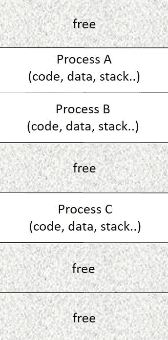
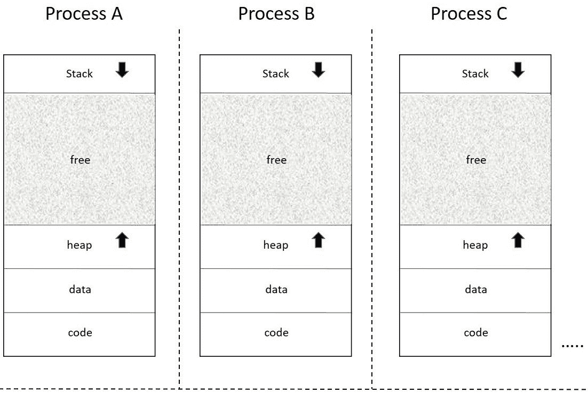
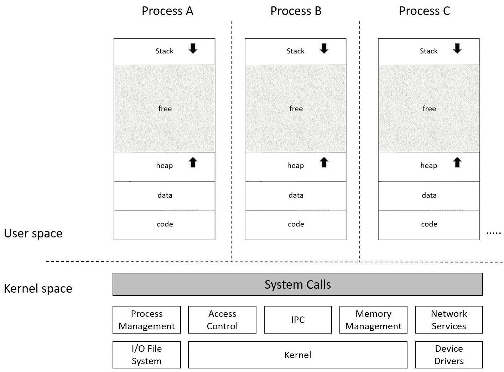
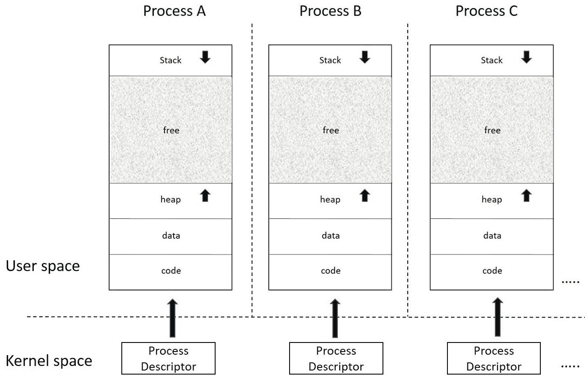
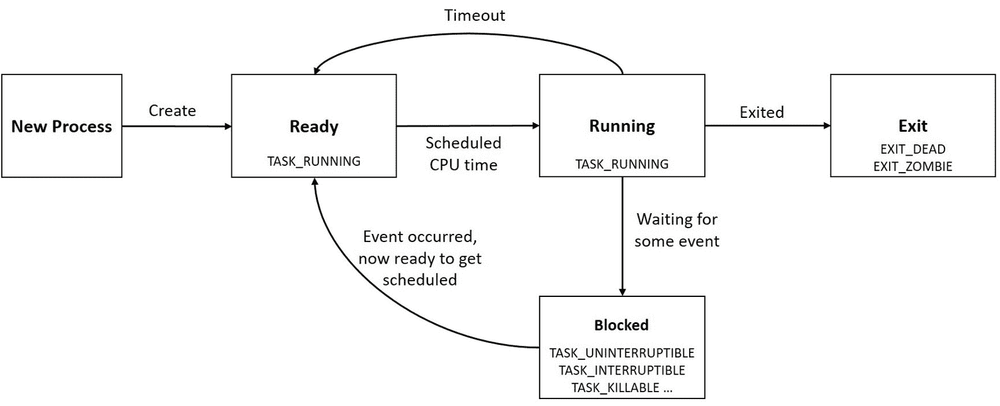
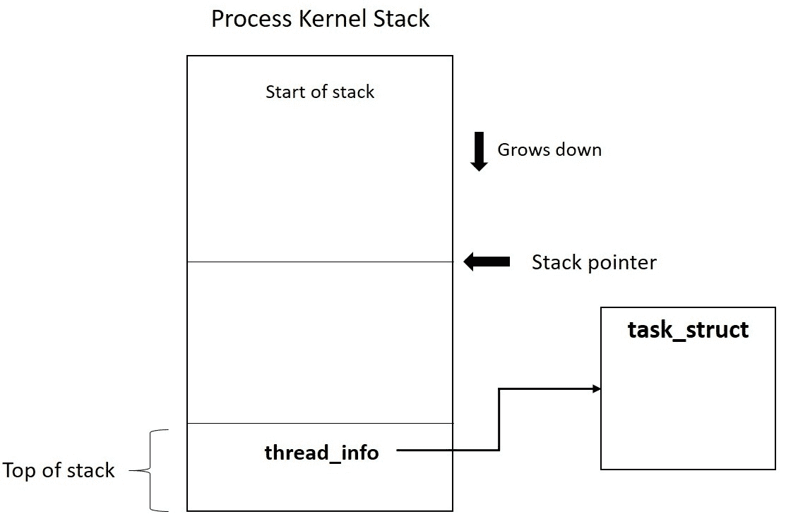
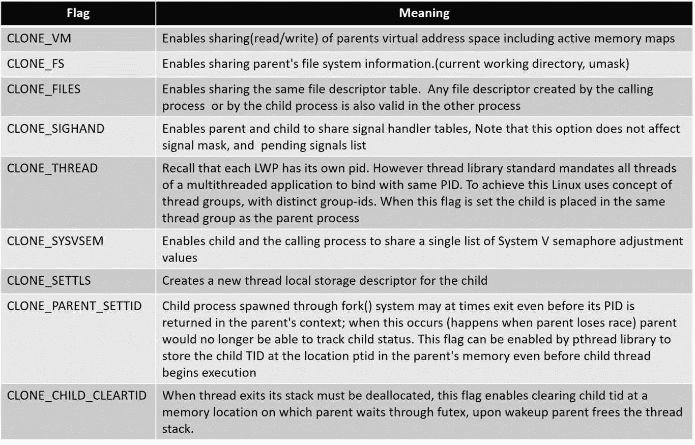
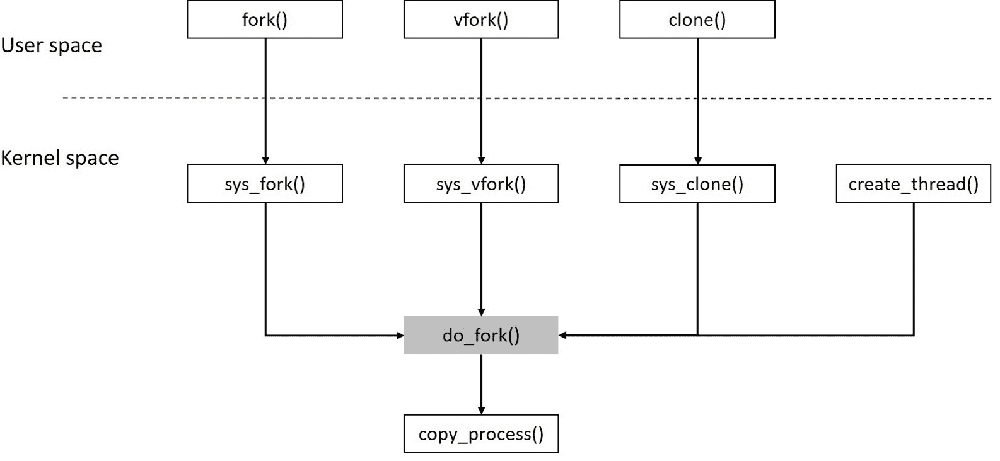

# 第一章：理解进程、地址空间和线程

当内核服务在当前进程上下文中被调用时，它的布局为更详细地探索内核打开了正确的路径。本章中的努力集中在理解进程和内核为它们提供的基础生态系统上。我们将在本章中探讨以下概念：

+   程序到进程

+   进程布局

+   虚拟地址空间

+   内核和用户空间

+   进程 API

+   进程描述符

+   内核堆栈管理

+   线程

+   Linux 线程 API

+   数据结构

+   命名空间和 cgroups

# 进程

从本质上讲，计算系统被设计、开发并经常进行调整，以便有效地运行用户应用程序。计算平台中的每个元素都旨在实现有效和高效地运行应用程序的方式。换句话说，计算系统存在是为了运行各种应用程序。应用程序可以作为专用设备中的固件运行，也可以作为系统软件（操作系统）驱动的系统中的“进程”运行。

在本质上，进程是内存中程序的运行实例。当程序（在磁盘上）被获取到内存中执行时，程序到进程的转换发生。

程序的二进制映像包含**代码**（带有所有二进制指令）和**数据**（带有所有全局数据），这些数据被映射到具有适当访问权限（读、写和执行）的内存区域。除了代码和数据，进程还被分配了额外的内存区域，称为**堆栈**（用于分配带有自动变量和函数参数的函数调用帧）和*堆*（用于运行时的动态分配）。

同一程序的多个实例可以存在，它们具有各自的内存分配。例如，对于具有多个打开标签页的网络浏览器（同时运行浏览会话），内核将每个标签页视为一个进程实例，并分配唯一的内存。

以下图表示了内存中进程的布局：



# 被称为地址空间的幻觉

现代计算平台预期能够有效地处理大量进程。因此，操作系统必须处理为所有竞争进程在物理内存中分配唯一内存，并确保它们可靠地执行。随着多个进程同时竞争和执行（*多任务处理*），操作系统必须确保每个进程的内存分配受到另一个进程的意外访问的保护。

为了解决这个问题，内核在进程和物理内存之间提供了一层抽象，称为*虚拟* *地址空间*。虚拟地址空间是进程对内存的视图；这是运行程序查看内存的方式。

虚拟地址空间创建了一个幻觉，即每个进程在执行时独占整个内存。这种内存的抽象视图称为*虚拟内存*，是由内核的内存管理器与 CPU 的 MMU 协调实现的。每个进程都被赋予一个连续的 32 位或 64 位地址空间，由体系结构限制并且对该进程唯一。通过 MMU 将每个进程限制在其虚拟地址空间中，任何进程试图访问其边界之外的地址区域的尝试都将触发硬件故障，使得内存管理器能够检测和终止违规进程，从而确保保护。

以下图描述了为每个竞争进程创建的地址空间的幻觉：



# 内核和用户空间

现代操作系统不仅防止一个进程访问另一个进程，还防止进程意外访问或操纵内核数据和服务（因为内核被所有进程共享）。

操作系统通过将整个内存分成两个逻辑部分，用户空间和内核空间，来实现这种保护。这种分割确保了所有被分配地址空间的进程都映射到内存的用户空间部分，而内核数据和服务则在内核空间中运行。内核通过与硬件协调实现了这种保护。当应用进程从其代码段执行指令时，CPU 处于用户模式。当一个进程打算调用内核服务时，它需要将 CPU 切换到特权模式（内核模式），这是通过称为 API（应用程序编程接口）的特殊函数实现的。这些 API 使用户进程可以使用特殊的 CPU 指令切换到内核空间，然后通过*系统调用*执行所需的服务。在完成所请求的服务后，内核执行另一个模式切换，这次是从内核模式切换回用户模式，使用另一组 CPU 指令。

系统调用是内核向应用进程公开其服务的接口；它们也被称为*内核入口点*。由于系统调用是在内核空间中实现的，相应的处理程序通过用户空间中的 API 提供。API 抽象还使调用相关系统调用更容易和方便。

下图描述了虚拟化内存视图：



# 进程上下文

当一个进程通过系统调用请求内核服务时，内核将代表调用进程执行。此时内核被称为处于*进程上下文*中执行。同样，内核也会响应其他硬件实体引发的*中断*；在这里，内核在*中断上下文*中执行。在中断上下文中，内核不是代表任何进程运行。

# 进程描述符

从一个进程诞生到退出，都是内核的进程管理子系统执行各种操作，包括进程创建、分配 CPU 时间、事件通知以及进程终止时的销毁。

除了地址空间外，内存中的一个进程还被分配了一个称为*进程描述符*的数据结构，内核用它来识别、管理和调度进程。下图描述了内核中进程地址空间及其相应的进程描述符：



在 Linux 中，进程描述符是在`<linux/sched.h>`中定义的`struct task_struct`类型的实例，它是一个中心数据结构，包含了进程持有的所有属性、标识细节和资源分配条目。查看`struct task_struct`就像窥视内核看到或处理进程的窗口。

由于任务结构包含了与各种内核子系统功能相关的广泛数据元素，本章讨论所有元素的目的和范围将超出上下文。我们将考虑一些与进程管理相关的重要元素。

# 进程属性-关键元素

进程属性定义了进程的所有关键和基本特征。这些元素包含了进程的状态和标识以及其他重要的关键值。

# 状态

一个进程从产生到退出可能存在于各种状态，称为*进程状态*，它们定义了进程的当前状态：

+   **TASK_RUNNING** (0)：任务正在执行或在调度器运行队列中争夺 CPU。

+   **TASK_INTERRUPTIBLE**（1）：任务处于可中断的等待状态；它会一直等待，直到等待条件变为真，比如互斥锁的可用性、设备准备好进行 I/O、休眠时间已过或者独占唤醒调用。在这种等待状态下，为进程生成的任何信号都会被传递，导致它在等待条件满足之前被唤醒。

+   **TASK_KILLABLE**：这类似于**TASK_INTERRUPTIBLE**，唯一的区别是中断只能发生在致命信号上，这使得它成为**TASK_INTERRUPTIBLE**的更好替代品。

+   **TASK_UNINTERRUTPIBLE**（2）：任务处于不可中断的等待状态，类似于**TASK_INTERRUPTIBLE**，只是对于正在睡眠的进程生成的信号不会导致唤醒。当等待的事件发生时，进程转换为**TASK_RUNNING**。这种进程状态很少被使用。

+   **TASK_STOPPED**（4）：任务已收到 STOP 信号。在收到继续信号（SIGCONT）后将恢复运行。

+   **TASK_TRACED**（8）：当进程正在被梳理时，它被称为处于被跟踪状态，可能是由调试器进行的。

+   **EXIT_ZOMBIE**（32）：进程已终止，但其资源尚未被回收。

+   **EXIT_DEAD**（16）：子进程已终止，并且在父进程使用*wait*收集子进程的退出状态后，所有其持有的资源都被释放。

以下图示了进程状态：



# pid

该字段包含一个称为**PID**的唯一进程标识符。在 Linux 中，PID 的类型为`pid_t`（整数）。尽管 PID 是一个整数，但默认的最大 PID 数量是 32,768，通过`/proc/sys/kernel/pid_max`接口指定。该文件中的值可以设置为最多 2²²（`PID_MAX_LIMIT`，约 400 万）的任何值。

为了管理 PID，内核使用位图。该位图允许内核跟踪正在使用的 PID 并为新进程分配唯一的 PID。每个 PID 在 PID 位图中由一个位标识；PID 的值是根据其对应位的位置确定的。位图中值为 1 的位表示对应的 PID 正在*使用*，值为 0 的位表示空闲的 PID。每当内核需要分配一个唯一的 PID 时，它会寻找第一个未设置的位并将其设置为 1，反之，要释放一个 PID，它会将对应的位从 1 切换为 0。

# tgid

该字段包含线程组 ID。为了便于理解，可以这样说，当创建一个新进程时，其 PID 和 TGID 是相同的，因为该进程恰好是唯一的线程。当进程生成一个新线程时，新的子线程会获得一个唯一的 PID，但会继承父线程的 TGID，因为它属于同一线程组。TGID 主要用于支持多线程进程。我们将在本章的线程部分详细介绍。

# 线程信息

该字段包含特定于处理器的状态信息，是任务结构的关键要素。本章的后续部分将详细介绍`thread_info`的重要性。

# 标志

标志字段记录与进程对应的各种属性。字段中的每个位对应进程生命周期中的各个阶段。每个进程的标志在`<linux/sched.h>`中定义：

```
#define PF_EXITING           /* getting shut down */
#define PF_EXITPIDONE        /* pi exit done on shut down */
#define PF_VCPU              /* I'm a virtual CPU */
#define PF_WQ_WORKER         /* I'm a workqueue worker */
#define PF_FORKNOEXEC        /* forked but didn't exec */
#define PF_MCE_PROCESS       /* process policy on mce errors */
#define PF_SUPERPRIV         /* used super-user privileges */
#define PF_DUMPCORE          /* dumped core */
#define PF_SIGNALED          /* killed by a signal */
#define PF_MEMALLOC          /* Allocating memory */
#define PF_NPROC_EXCEEDED    /* set_user noticed that RLIMIT_NPROC was exceeded */
#define PF_USED_MATH         /* if unset the fpu must be initialized before use */
#define PF_USED_ASYNC        /* used async_schedule*(), used by module init */
#define PF_NOFREEZE          /* this thread should not be frozen */
#define PF_FROZEN            /* frozen for system suspend */
#define PF_FSTRANS           /* inside a filesystem transaction */
#define PF_KSWAPD            /* I am kswapd */
#define PF_MEMALLOC_NOIO0    /* Allocating memory without IO involved */
#define PF_LESS_THROTTLE     /* Throttle me less: I clean memory */
#define PF_KTHREAD           /* I am a kernel thread */
#define PF_RANDOMIZE         /* randomize virtual address space */
#define PF_SWAPWRITE         /* Allowed to write to swap */
#define PF_NO_SETAFFINITY    /* Userland is not allowed to meddle with cpus_allowed */
#define PF_MCE_EARLY         /* Early kill for mce process policy */
#define PF_MUTEX_TESTER      /* Thread belongs to the rt mutex tester */
#define PF_FREEZER_SKIP      /* Freezer should not count it as freezable */
#define PF_SUSPEND_TASK      /* this thread called freeze_processes and should not be frozen */
```

# exit_code 和 exit_signal

这些字段包含任务的退出值和导致终止的信号的详细信息。这些字段在子进程终止时通过`wait()`由父进程访问。

# comm

该字段保存了用于启动进程的可执行二进制文件的名称。

# ptrace

该字段在使用`ptrace()`系统调用将进程置于跟踪模式时启用并设置。

# 进程关系-关键要素

每个进程都可以与父进程建立父子关系。同样，由同一进程生成的多个进程被称为*兄弟进程*。这些字段建立了当前进程与另一个进程的关系。

# real_parent 和 parent

这些是指向父任务结构的指针。对于正常进程，这两个指针都指向相同的`task_struct`*；*它们只在使用`posix`线程实现的多线程进程中有所不同。对于这种情况，`real_parent`指的是父线程任务结构，而`parent`指的是将 SIGCHLD 传递给的进程任务结构。

# 子进程

这是子任务结构列表的指针。

# 兄弟

这是兄弟任务结构列表的指针。

# group_leader

这是指向进程组领导者的任务结构的指针。

# 调度属性 - 关键元素

所有竞争进程必须获得公平的 CPU 时间，因此需要基于时间片和进程优先级进行调度。这些属性包含调度程序在决定哪个进程获得优先级时使用的必要信息。

# prio 和 static_prio

`prio`有助于确定进程的调度优先级。如果进程被分配了实时调度策略，则此字段在`1`到`99`的范围内保存进程的静态优先级（由`sched_setscheduler()`指定）。对于正常进程，此字段保存从 nice 值派生的动态优先级。

# se、rt 和 dl

每个任务都属于调度实体（任务组），因为调度是在每个实体级别上进行的。`se`用于所有正常进程，`rt`用于实时进程，`dl`用于截止进程。我们将在下一章中更多地讨论这些属性。

# 策略

此字段包含有关进程调度策略的信息，有助于确定其优先级。

# cpus_allowed

此字段指定进程的 CPU 掩码，即进程在多处理器系统中有资格被调度到哪个 CPU。

# rt_priority

此字段指定实时调度策略应用的优先级。对于非实时进程，此字段未使用。

# 进程限制 - 关键元素

内核强加资源限制，以确保系统资源在竞争进程之间公平分配。这些限制保证随机进程不会垄断资源的所有权。有 16 种不同类型的资源限制，`task structure`指向`struct rlimit`*类型的数组，其中每个偏移量保存特定资源的当前值和最大值。

```
/*include/uapi/linux/resource.h*/
struct rlimit {
  __kernel_ulong_t        rlim_cur;
  __kernel_ulong_t        rlim_max;
};
These limits are specified in *include/uapi/asm-generic/resource.h* 
 #define RLIMIT_CPU        0       /* CPU time in sec */
 #define RLIMIT_FSIZE      1       /* Maximum filesize */
 #define RLIMIT_DATA       2       /* max data size */
 #define RLIMIT_STACK      3       /* max stack size */
 #define RLIMIT_CORE       4       /* max core file size */
 #ifndef RLIMIT_RSS
 # define RLIMIT_RSS       5       /* max resident set size */
 #endif
 #ifndef RLIMIT_NPROC
 # define RLIMIT_NPROC     6       /* max number of processes */
 #endif
 #ifndef RLIMIT_NOFILE
 # define RLIMIT_NOFILE    7       /* max number of open files */
 #endif
 #ifndef RLIMIT_MEMLOCK
 # define RLIMIT_MEMLOCK   8       /* max locked-in-memory   
 address space */
 #endif
 #ifndef RLIMIT_AS
 # define RLIMIT_AS        9       /* address space limit */
 #endif
 #define RLIMIT_LOCKS      10      /* maximum file locks held */
 #define RLIMIT_SIGPENDING 11      /* max number of pending signals */
 #define RLIMIT_MSGQUEUE   12      /* maximum bytes in POSIX mqueues */
 #define RLIMIT_NICE       13      /* max nice prio allowed to 
 raise to 0-39 for nice level 19 .. -20 */
 #define RLIMIT_RTPRIO     14      /* maximum realtime priority */
 #define RLIMIT_RTTIME     15      /* timeout for RT tasks in us */
 #define RLIM_NLIMITS      16
```

# 文件描述符表 - 关键元素

在进程的生命周期中，它可能访问各种资源文件以完成其任务。这导致进程打开、关闭、读取和写入这些文件。系统必须跟踪这些活动；文件描述符元素帮助系统知道进程持有哪些文件。

# fs

文件系统信息存储在此字段中。

# 文件

文件描述符表包含指向进程打开以执行各种操作的所有文件的指针。文件字段包含一个指针，指向此文件描述符表。

# 信号描述符 - 关键元素

为了处理信号，*任务结构*具有各种元素，确定信号的处理方式。

# 信号

这是`struct signal_struct`*的类型，其中包含与进程关联的所有信号的信息。

# sighand

这是`struct sighand_struct`*的类型，其中包含与进程关联的所有信号处理程序。

# sigset_t blocked, real_blocked

这些元素标识当前由进程屏蔽或阻塞的信号。

# 待处理

这是`struct sigpending`*的类型，用于标识生成但尚未传递的信号。

# sas_ss_sp

此字段包含指向备用堆栈的指针，用于信号处理。

# sas_ss_size

此字段显示备用堆栈的大小，用于信号处理。

# 内核堆栈

随着当前一代计算平台由能够运行同时应用程序的多核硬件驱动，当请求相同进程时，多个进程同时启动内核模式切换的可能性已经内置。为了能够处理这种情况，内核服务被设计为可重入，允许多个进程参与并使用所需的服务。这要求请求进程维护自己的私有内核栈，以跟踪内核函数调用序列，存储内核函数的本地数据等。

内核栈直接映射到物理内存，要求布局在一个连续的区域内。默认情况下，x86-32 和大多数其他 32 位系统的内核栈为 8kb（在内核构建期间可以配置为 4k 内核栈），在 x86-64 系统上为 16kb。

当内核服务在当前进程上下文中被调用时，它们需要在承诺任何相关操作之前验证进程的特权。为了执行这样的验证，内核服务必须访问当前进程的任务结构并查看相关字段。同样，内核例程可能需要访问当前的“任务结构”来修改各种资源结构，例如信号处理程序表，寻找未决信号，文件描述符表和内存描述符等。为了在运行时访问“任务结构”，当前“任务结构”的地址被加载到处理器寄存器中（所选择的寄存器是特定于架构的），并通过内核全局宏`current`（在特定于架构的内核头文件`asm/current.h`中定义）提供：

```
  /* arch/ia64/include/asm/current.h */
  #ifndef _ASM_IA64_CURRENT_H
  #define _ASM_IA64_CURRENT_H
  /*
  * Modified 1998-2000
  *      David Mosberger-Tang <davidm@hpl.hp.com>, Hewlett-Packard Co
  */
  #include <asm/intrinsics.h>
  /*
  * In kernel mode, thread pointer (r13) is used to point to the 
    current task
  * structure.
  */
 #define current ((struct task_struct *) ia64_getreg(_IA64_REG_TP))
 #endif /* _ASM_IA64_CURRENT_H */
 /* arch/powerpc/include/asm/current.h */
 #ifndef _ASM_POWERPC_CURRENT_H
 #define _ASM_POWERPC_CURRENT_H
 #ifdef __KERNEL__
 /*
 * This program is free software; you can redistribute it and/or
 * modify it under the terms of the GNU General Public License
 * as published by the Free Software Foundation; either version
 * 2 of the License, or (at your option) any later version.
 */
 struct task_struct;
 #ifdef __powerpc64__
 #include <linux/stddef.h>
 #include <asm/paca.h>
 static inline struct task_struct *get_current(void)
 {
       struct task_struct *task;

       __asm__ __volatile__("ld %0,%1(13)"
       : "=r" (task)
       : "i" (offsetof(struct paca_struct, __current)));
       return task;
 }
 #define current get_current()
 #else
 /*
 * We keep `current' in r2 for speed.
 */
 register struct task_struct *current asm ("r2");
 #endif
 #endif /* __KERNEL__ */
 #endif /* _ASM_POWERPC_CURRENT_H */
```

然而，在寄存器受限的架构中，如果寄存器很少，那么保留一个寄存器来保存当前任务结构的地址是不可行的。在这样的平台上，当前进程的“任务结构”直接放置在它拥有的内核栈的顶部。这种方法在定位“任务结构”方面具有显著优势，只需屏蔽栈指针的最低有效位即可。

随着内核的演变，`任务结构`变得越来越大，无法包含在内核栈中，而内核栈在物理内存中已经受限（8Kb）。因此，`任务结构`被移出内核栈，除了定义进程的 CPU 状态和其他低级处理器特定信息的一些关键字段之外。然后，这些字段被包装在一个新创建的结构体`struct thread_info`中。这个结构体位于内核栈的顶部，并提供一个指针，指向可以被内核服务使用的当前`任务结构`。

```
struct thread_info for x86 architecture (kernel 3.10):
```

```
/* linux-3.10/arch/x86/include/asm/thread_info.h */ struct thread_info {
 struct task_struct *task; /* main task structure */
 struct exec_domain *exec_domain; /* execution domain */
 __u32 flags; /* low level flags */
 __u32 status; /* thread synchronous flags */
 __u32 cpu; /* current CPU */
 int preempt_count; /* 0 => preemptable, <0 => BUG */
 mm_segment_t addr_limit;
 struct restart_block restart_block;
 void __user *sysenter_return;
 #ifdef CONFIG_X86_32
 unsigned long previous_esp; /* ESP of the previous stack in case of   
 nested (IRQ) stacks */
 __u8 supervisor_stack[0];
 #endif
 unsigned int sig_on_uaccess_error:1;
 unsigned int uaccess_err:1; /* uaccess failed */
};
```

使用`thread_info`包含与进程相关的信息，除了`任务结构`之外，内核对当前进程结构有多个视图：`struct task_struct`，一个与架构无关的信息块，以及`thread_info`，一个特定于架构的信息块。以下图示了`thread_info`和`task_struct`：



对于使用`thread_info`的架构，当前宏的实现被修改为查看内核栈顶部以获取对当前`thread_info`和通过它对`当前任务结构`的引用。以下代码片段显示了 x86-64 平台的当前实现：

```
  #ifndef __ASM_GENERIC_CURRENT_H
  #define __ASM_GENERIC_CURRENT_H
  #include <linux/thread_info.h>

    __attribute_const__;

  static inline struct thread_info *current_thread_info(void)
  {
        **return (struct thread_info *)**  **                (current_stack_pointer & ~(THREAD_SIZE - 1));**
  }
PER_CPU variable:
```

```
  #ifndef _ASM_X86_CURRENT_H
  #define _ASM_X86_CURRENT_H

  #include <linux/compiler.h>
  #include <asm/percpu.h>

  #ifndef __ASSEMBLY__
  struct task_struct;

  DECLARE_PER_CPU(struct task_struct *, current_task);

  static __always_inline struct task_struct *get_current(void)
  {
          return this_cpu_read_stable(current_task);
  }

  #define current get_current()

  #endif /* __ASSEMBLY__ */

  #endif /* _ASM_X86_CURRENT_H */
thread_info structure with just one element:
```

```
/* linux-4.9.10/arch/x86/include/asm/thread_info.h */
struct thread_info {
 unsigned long flags; /* low level flags */
};
```

# 栈溢出问题

与用户模式不同，内核模式堆栈存在于直接映射的内存中。当一个进程调用内核服务时，可能会出现内部嵌套深的情况，有可能会超出立即内存范围。最糟糕的是内核对这种情况毫不知情。内核程序员通常会使用各种调试选项来跟踪堆栈使用情况并检测溢出，但这些方法并不方便在生产系统上防止堆栈溢出。通过使用*守护页面*进行传统保护在这里也被排除了（因为这会浪费一个实际的内存页面）。

内核程序员倾向于遵循编码标准--最小化使用本地数据，避免递归，避免深度嵌套等--以降低堆栈溢出的概率。然而，实现功能丰富且深度分层的内核子系统可能会带来各种设计挑战和复杂性，特别是在存储子系统中，文件系统、存储驱动程序和网络代码可以堆叠在几个层中，导致深度嵌套的函数调用。

Linux 内核社区一直在思考如何防止这种溢出，为此，决定将内核堆栈扩展到 16kb（x86-64，自内核 3.15 以来）。扩展内核堆栈可能会防止一些溢出，但会占用大量直接映射的内核内存用于每个进程的内核堆栈。然而，为了系统的可靠运行，期望内核能够优雅地处理在生产系统上出现的堆栈溢出。

在 4.9 版本中，内核引入了一种新的系统来设置虚拟映射内核堆栈。由于虚拟地址目前用于映射甚至是直接映射的页面，因此内核堆栈实际上并不需要物理上连续的页面。内核为虚拟映射内存保留了一个单独的地址范围，当调用`vmalloc()`时，这个范围内的地址被分配。这段内存范围被称为**vmalloc 范围**。主要用于当程序需要大块虚拟连续但物理分散的内存时。使用这种方法，内核堆栈现在可以分配为单独的页面，映射到 vmalloc 范围。虚拟映射还可以防止溢出，因为可以分配一个无访问守护页面，并且可以通过页表项（而不浪费实际页面）来分配。守护页面将促使内核在内存溢出时弹出一个 oops 消息，并对溢出的进程发起 kill。

目前，带有守护页面的虚拟映射内核堆栈仅适用于 x86-64 架构（对其他架构的支持似乎将会跟进）。这可以通过选择`HAVE_ARCH_VMAP_STACK`或`CONFIG_VMAP_STACK`构建时选项来启用。

# 进程创建

在内核引导期间，会生成一个名为`init`的内核线程，该线程被配置为初始化第一个用户模式进程（具有相同的名称）。然后，`init`（pid 1）进程被配置为执行通过配置文件指定的各种初始化操作，创建多个进程。进一步创建的每个子进程（可能会创建自己的子进程）都是*init*进程的后代。因此，这些进程最终形成了一个类似树状结构或单一层次模型的结构。`shell`，就是这样一个进程，当调用程序执行时，它成为用户创建用户进程的接口。

Fork、vfork、exec、clone、wait 和 exit 是用于创建和控制新进程的核心内核接口。这些操作是通过相应的用户模式 API 调用的。

# fork()

`Fork()`是自* nix 系统的核心“Unix 线程 API”之一，自古老的 Unix 版本问世以来一直可用。恰如其名，它从运行中的进程中分叉出一个新进程。当`fork()`成功时，通过复制调用者的`地址空间`和`任务结构`创建新进程（称为`子进程`）。从`fork()`返回时，调用者（父进程）和新进程（子进程）都从同一代码段中执行指令，该代码段在写时复制下被复制。`Fork()`也许是唯一一个以调用者进程的上下文进入内核模式的 API，并在成功时返回到调用者和子进程（新进程）的用户模式上下文。

父进程的`任务结构`的大多数资源条目，如内存描述符、文件描述符表、信号描述符和调度属性，都被子进程继承，除了一些属性，如内存锁、未决信号、活动定时器和文件记录锁（有关例外的完整列表，请参阅 fork(2)手册页）。子进程被分配一个唯一的`pid`，并通过其`任务结构`的`ppid`字段引用其父进程的`pid`；子进程的资源利用和处理器使用条目被重置为零。

父进程使用`wait()`系统调用更新自己关于子进程状态的信息，并通常等待子进程的终止。如果没有调用`wait()`，子进程可能会终止并进入僵尸状态。

# 写时复制（COW）

父进程的复制以创建子进程需要克隆用户模式地址空间（`堆栈`、`数据`、`代码`和`堆`段）和父进程的任务结构，这将导致执行开销，从而导致不确定的进程创建时间。更糟糕的是，如果父进程和子进程都没有对克隆资源进行任何状态更改操作，这种克隆过程将变得毫无意义。

根据 COW，当创建子进程时，它被分配一个唯一的`任务结构`，其中所有资源条目（包括页表）都指向父进程的`任务结构`，父子进程都具有只读访问权限。当任一进程启动状态更改操作时，资源才会真正复制，因此称为*写时复制*（COW 中的`写`意味着状态更改）。COW 确实带来了效率和优化，通过推迟复制进程数据的需求，以及在只读发生时，完全避免复制。这种按需复制还减少了所需的交换页面数量，减少了交换所需的时间，并可能有助于减少需求分页。

# exec

有时创建子进程可能没有用，除非它运行一个全新的程序：`exec`系列调用正好满足这一目的。`exec`用新的可执行二进制文件替换进程中的现有程序。

```
#include <unistd.h>
int execve(const char *filename, char *const argv[],
char *const envp[]);
```

`execve`是执行作为其第一个参数传递的程序二进制文件的系统调用。第二和第三个参数是以空字符结尾的参数和环境字符串数组，将作为命令行参数传递给新程序。这个系统调用也可以通过各种`glibc`（库）包装器调用，这些包装器被发现更加方便和灵活。

```
#include <unistd.h>
extern char **environ;
int execl(const char *path, const char *arg, ...);
int execlp(const char *file, const char *arg, ...);
int execle(const char *path, const char *arg,
..., char * const envp[]);
int execv(const char *path, char *constargv[]);
int execvp(const char *file, char *constargv[]);
int execvpe(const char *file, char *const argv[],
char *const envp[]);
```

命令行用户界面程序如`shell`使用`exec`接口启动用户请求的程序二进制文件。

# vfork()

与`fork()`不同，`vfork()`创建一个子进程并阻塞父进程，这意味着子进程作为单个线程运行，不允许并发；换句话说，父进程暂时挂起，直到子进程退出或调用`exec()`。子进程共享父进程的数据。

# Linux 对线程的支持

进程中的执行流被称为**线程**，这意味着每个进程至少会有一个执行线程。多线程意味着进程中存在多个执行上下文的流。在现代的多核架构中，进程中的多个执行流可以真正并发，实现公平的多任务处理。

线程通常被枚举为进程中纯粹的用户级实体，它们被调度执行；它们共享父进程的虚拟地址空间和系统资源。每个线程都维护其代码、堆栈和线程本地存储。线程由线程库调度和管理，它使用一个称为线程对象的结构来保存唯一的线程标识符，用于调度属性和保存线程上下文。用户级线程应用通常在内存上更轻，是事件驱动应用程序的首选并发模型。另一方面，这种用户级线程模型不适合并行计算，因为它们被绑定到其父进程绑定的同一处理器核心上。

Linux 不直接支持用户级线程；相反，它提出了一个替代的 API 来枚举一个特殊的进程，称为轻量级进程（LWP），它可以与父进程共享一组配置好的资源，如动态内存分配、全局数据、打开的文件、信号处理程序和其他广泛的资源。每个 LWP 都由唯一的 PID 和任务结构标识，并且被内核视为独立的执行上下文。在 Linux 中，术语线程不可避免地指的是 LWP，因为由线程库（Pthreads）初始化的每个线程都被内核枚举为 LWP。

# clone()

`clone()`是一个 Linux 特定的系统调用，用于创建一个新的进程；它被认为是`fork()`系统调用的通用版本，通过`flags`参数提供更精细的控制来自定义其功能：

```
int clone(int (*child_func)(void *), void *child_stack, int flags, void *arg);
```

它提供了超过二十个不同的`CLONE_*`标志，用于控制`clone`操作的各个方面，包括父进程和子进程是否共享虚拟内存、打开文件描述符和信号处理程序。子进程使用适当的内存地址（作为第二个参数传递）作为`堆栈`（用于存储子进程的本地数据）进行创建。子进程使用其启动函数（作为克隆调用的第一个参数）开始执行。

当一个进程尝试通过`pthread`库创建一个线程时，将使用以下标志调用`clone()`：

```
/*clone flags for creating threads*/
flags=CLONE_VM|CLONE_FS|CLONE_FILES|CLONE_SIGHAND|CLONE_THREAD|CLONE_SYSVSEM|CLONE_SETTLS|CLONE_PARENT_SETTID|CLONE_CHILD_CLEARTID;
```



`clone()`也可以用于创建一个通常使用`fork()`和`vfork()`生成的常规子进程：

```
/* clone flags for forking child */
flags = SIGCHLD;
/* clone flags for vfork child */ 
flags = CLONE_VFORK | CLONE_VM | SIGCHLD;
```

# 内核线程

为了增加运行后台操作的需求，内核生成线程（类似于进程）。这些内核线程类似于常规进程，它们由任务结构表示，并分配一个 PID。与用户进程不同，它们没有任何映射的地址空间，并且完全在内核模式下运行，这使它们不可交互。各种内核子系统使用`kthreads`来运行周期性和异步操作。

所有内核线程都是`kthreadd（pid 2）`的后代，它是在引导期间由`kernel（pid 0）`生成的。`kthreadd`枚举其他内核线程；它通过接口例程提供内核服务动态生成其他内核线程的能力。可以使用`ps -ef`命令从命令行查看内核线程--它们显示在[方括号]中：

```
UID PID PPID C STIME TTY TIME CMD
root 1 0 0 22:43 ? 00:00:01 /sbin/init splash
root 2 0 0 22:43 ? 00:00:00 [kthreadd]
root 3 2 0 22:43 ? 00:00:00 [ksoftirqd/0]
root 4 2 0 22:43 ? 00:00:00 [kworker/0:0]
root 5 2 0 22:43 ? 00:00:00 [kworker/0:0H]
root 7 2 0 22:43 ? 00:00:01 [rcu_sched]
root 8 2 0 22:43 ? 00:00:00 [rcu_bh]
root 9 2 0 22:43 ? 00:00:00 [migration/0]
root 10 2 0 22:43 ? 00:00:00 [watchdog/0]
root 11 2 0 22:43 ? 00:00:00 [watchdog/1]
root 12 2 0 22:43 ? 00:00:00 [migration/1]
root 13 2 0 22:43 ? 00:00:00 [ksoftirqd/1]
root 15 2 0 22:43 ? 00:00:00 [kworker/1:0H]
root 16 2 0 22:43 ? 00:00:00 [watchdog/2]
root 17 2 0 22:43 ? 00:00:00 [migration/2]
root 18 2 0 22:43 ? 00:00:00 [ksoftirqd/2]
root 20 2 0 22:43 ? 00:00:00 [kworker/2:0H]
root 21 2 0 22:43 ? 00:00:00 [watchdog/3]
root 22 2 0 22:43 ? 00:00:00 [migration/3]
root 23 2 0 22:43 ? 00:00:00 [ksoftirqd/3]
root 25 2 0 22:43 ? 00:00:00 [kworker/3:0H]
root 26 2 0 22:43 ? 00:00:00 [kdevtmpfs]
/*kthreadd creation code (init/main.c) */
static noinline void __ref rest_init(void)
{
 int pid;

 rcu_scheduler_starting();
 /*
 * We need to spawn init first so that it obtains pid 1, however
 * the init task will end up wanting to create kthreads, which, if
 * we schedule it before we create kthreadd, will OOPS.
 */
 kernel_thread(kernel_init, NULL, CLONE_FS);
 numa_default_policy();
 pid = kernel_thread(kthreadd, NULL, CLONE_FS | CLONE_FILES);
 rcu_read_lock();
 kthreadd_task = find_task_by_pid_ns(pid, &init_pid_ns);
 rcu_read_unlock();
 complete(&kthreadd_done);

 /*
 * The boot idle thread must execute schedule()
 * at least once to get things moving:
 */
 init_idle_bootup_task(current);
 schedule_preempt_disabled();
 /* Call into cpu_idle with preempt disabled */
 cpu_startup_entry(CPUHP_ONLINE);
}
```

前面的代码显示了内核引导例程`rest_init()`调用`kernel_thread()`例程，并使用适当的参数来生成`kernel_init`线程（然后继续启动用户模式的`init`进程）和`kthreadd`。

`kthread`是一个永久运行的线程，它查看一个名为`kthread_create_list`的列表，以获取要创建的新`kthreads`的数据：

```
/*kthreadd routine(kthread.c) */
int kthreadd(void *unused)
{
 struct task_struct *tsk = current;

 /* Setup a clean context for our children to inherit. */
 set_task_comm(tsk, "kthreadd");
 ignore_signals(tsk);
 set_cpus_allowed_ptr(tsk, cpu_all_mask);
 set_mems_allowed(node_states[N_MEMORY]);

 current->flags |= PF_NOFREEZE;

 for (;;) {
 set_current_state(TASK_INTERRUPTIBLE);
 if (list_empty(&kthread_create_list))
 schedule();
 __set_current_state(TASK_RUNNING);

 spin_lock(&kthread_create_lock);
 while (!list_empty(&kthread_create_list)) {
 struct kthread_create_info *create;

 create = list_entry(kthread_create_list.next,
 struct kthread_create_info, list);
 list_del_init(&create->list);
 spin_unlock(&kthread_create_lock);

 create_kthread(create); /* creates kernel threads with attributes enqueued */

 spin_lock(&kthread_create_lock);
 }
 spin_unlock(&kthread_create_lock);
 }

 return 0;
}
kthread_create invoking kthread_create_on_node(), which by default creates threads on the current Numa node:
```

```
struct task_struct *kthread_create_on_node(int (*threadfn)(void *data),
 void *data,
 int node,
 const char namefmt[], ...);

/**
 * kthread_create - create a kthread on the current node
 * @threadfn: the function to run in the thread
 * @data: data pointer for @threadfn()
 * @namefmt: printf-style format string for the thread name
 * @...: arguments for @namefmt.
 *
 * This macro will create a kthread on the current node, leaving it in
 * the stopped state. This is just a helper for       
 * kthread_create_on_node();
 * see the documentation there for more details.
 */
#define kthread_create(threadfn, data, namefmt, arg...) 
 kthread_create_on_node(threadfn, data, NUMA_NO_NODE, namefmt, ##arg)

struct task_struct *kthread_create_on_cpu(int (*threadfn)(void *data),
 void *data,
 unsigned int cpu,
 const char *namefmt);

/**
 * kthread_run - create and wake a thread.
 * @threadfn: the function to run until signal_pending(current).
 * @data: data ptr for @threadfn.
 * @namefmt: printf-style name for the thread.
 *
 * Description: Convenient wrapper for kthread_create() followed by
 * wake_up_process(). Returns the kthread or ERR_PTR(-ENOMEM).
 */
#define kthread_run(threadfn, data, namefmt, ...) 
({ 
 struct task_struct *__k 
 = kthread_create(threadfn, data, namefmt, ## __VA_ARGS__); 
 if (!IS_ERR(__k)) 
 wake_up_process(__k); 
 __k; 
})
```

`kthread_create_on_node()` 将要创建的 `kthread` 的详细信息（作为参数接收）实例化为 `kthread_create_info` 类型的结构，并将其排队到 `kthread_create_list` 的末尾。然后唤醒 `kthreadd` 并等待线程创建完成：

```
/* kernel/kthread.c */
static struct task_struct *__kthread_create_on_node(int (*threadfn)(void *data),
 void *data, int node,
 const char namefmt[],
 va_list args)
{
 DECLARE_COMPLETION_ONSTACK(done);
 struct task_struct *task;
 struct kthread_create_info *create = kmalloc(sizeof(*create),
 GFP_KERNEL);

 if (!create)
 return ERR_PTR(-ENOMEM);
 create->threadfn = threadfn;
 create->data = data;
 create->node = node;
 create->done = &done;

 spin_lock(&kthread_create_lock);
 list_add_tail(&create->list, &kthread_create_list);
 spin_unlock(&kthread_create_lock);

 wake_up_process(kthreadd_task);
 /*
 * Wait for completion in killable state, for I might be chosen by
 * the OOM killer while kthreadd is trying to allocate memory for
 * new kernel thread.
 */
 if (unlikely(wait_for_completion_killable(&done))) {
 /*
 * If I was SIGKILLed before kthreadd (or new kernel thread)
 * calls complete(), leave the cleanup of this structure to
 * that thread.
 */
 if (xchg(&create->done, NULL))
 return ERR_PTR(-EINTR);
 /*
 * kthreadd (or new kernel thread) will call complete()
 * shortly.
 */
 wait_for_completion(&done); // wakeup on completion of thread creation.
 }
...
...
...
}

struct task_struct *kthread_create_on_node(int (*threadfn)(void *data),
 void *data, int node,
 const char namefmt[],
 ...)
{
 struct task_struct *task;
 va_list args;

 va_start(args, namefmt);
 task = __kthread_create_on_node(threadfn, data, node, namefmt, args);
 va_end(args);

 return task;
}
```

回想一下，`kthreadd` 调用 `create_thread()` 例程来根据排队到列表中的数据启动内核线程。这个例程创建线程并发出完成信号：

```
/* kernel/kthread.c */
static void create_kthread(struct kthread_create_info *create)
{
 int pid;

 #ifdef CONFIG_NUMA
 current->pref_node_fork = create->node;
 #endif

 /* We want our own signal handler (we take no signals by default). */
 pid = kernel_thread(kthread, create, CLONE_FS | CLONE_FILES |  
 SIGCHLD);
 if (pid < 0) {
 /* If user was SIGKILLed, I release the structure. */
 struct completion *done = xchg(&create->done, NULL);

 if (!done) {
 kfree(create);
 return;
 }
 create->result = ERR_PTR(pid);
 complete(done); /* signal completion of thread creation */
 }
}
```

# do_fork() 和 copy_process()

到目前为止讨论的所有进程/线程创建调用都会调用不同的系统调用（除了 `create_thread`）进入内核模式。所有这些系统调用最终汇聚到通用内核 `function _do_fork()` 中，该函数以不同的 `CLONE_*` 标志调用。`do_fork()` 在内部回退到 `copy_process()` 完成任务。以下图表总结了进程创建的调用顺序：

```
/* kernel/fork.c */
/*
 * Create a kernel thread.
 */
```

```
pid_t kernel_thread(int (*fn)(void *), void *arg, unsigned long flags)
{
 return _do_fork(flags|CLONE_VM|CLONE_UNTRACED, (unsigned long)fn,
 (unsigned long)arg, NULL, NULL, 0);
}

/* sys_fork: create a child process by duplicating caller */
SYSCALL_DEFINE0(fork)
{
#ifdef CONFIG_MMU
 return _do_fork(SIGCHLD, 0, 0, NULL, NULL, 0);
#else
 /* cannot support in nommu mode */
 return -EINVAL;
#endif
}

/* sys_vfork: create vfork child process */
SYSCALL_DEFINE0(vfork)
{
 return _do_fork(CLONE_VFORK | CLONE_VM | SIGCHLD, 0,
 0, NULL, NULL, 0);
}

/* sys_clone: create child process as per clone flags */

#ifdef __ARCH_WANT_SYS_CLONE
#ifdef CONFIG_CLONE_BACKWARDS
SYSCALL_DEFINE5(clone, unsigned long, clone_flags, unsigned long, newsp,
 int __user *, parent_tidptr,
 unsigned long, tls,
 int __user *, child_tidptr)
#elif defined(CONFIG_CLONE_BACKWARDS2)
SYSCALL_DEFINE5(clone, unsigned long, newsp, unsigned long, clone_flags,
 int __user *, parent_tidptr,
 int __user *, child_tidptr,
 unsigned long, tls)
#elif defined(CONFIG_CLONE_BACKWARDS3)
SYSCALL_DEFINE6(clone, unsigned long, clone_flags, unsigned long, newsp,
 int, stack_size,
 int __user *, parent_tidptr,
 int __user *, child_tidptr,
 unsigned long, tls)
#else
SYSCALL_DEFINE5(clone, unsigned long, clone_flags, unsigned long, newsp,
 int __user *, parent_tidptr,
 int __user *, child_tidptr,
 unsigned long, tls)
#endif
{
 return _do_fork(clone_flags, newsp, 0, parent_tidptr, child_tidptr, tls);
}
#endif

```



# 进程状态和终止

在进程的生命周期中，它在最终终止之前会遍历许多状态。用户必须具有适当的机制来了解进程在其生命周期中发生的一切。Linux 为此提供了一组函数。

# 等待

对于由父进程创建的进程和线程，父进程知道子进程/线程的执行状态可能是有用的。可以使用 `wait` 系列系统调用来实现这一点：

```
#include <sys/types.h>
#include <sys/wait.h>
pid_t wait(int *status);
pid_t waitpid(pid_t pid, int *status, intoptions);
int waitid(idtype_t idtype, id_t id, siginfo_t *infop, int options)
```

这些系统调用会更新调用进程的状态，以便通知子进程的状态变化事件。

+   子进程的终止

+   被信号停止

+   被信号恢复

除了报告状态，这些 API 还允许父进程收集终止的子进程。进程在终止时被放入僵尸状态，直到其直接父进程调用 `wait` 来收集它。

# 退出

每个进程都必须结束。进程的终止是通过进程调用 `exit()` 或主函数返回来完成的。进程也可能在接收到强制其终止的信号或异常时被突然终止，例如发送终止进程的 `KILL` 命令，或引发异常。在终止时，进程被放入退出状态，直到其直接父进程收集它。

`exit` 调用 `sys_exit` 系统调用，该系统调用内部调用 `do_exit` 例程。 `do_exit` 主要执行以下任务（`do_exit` 设置许多值，并多次调用相关内核例程以完成其任务）：

+   获取子进程返回给父进程的退出码。

+   设置 `PF_EXITING` 标志，表示进程正在退出。

+   清理和回收进程持有的资源。这包括释放 `mm_struct`，如果进程正在等待 IPC 信号量，则从队列中移除，释放文件系统数据和文件（如果有的话），并在进程不再可执行时调用 `schedule()`。

在 `do_exit` 之后，进程保持僵尸状态，进程描述符仍然完整，父进程可以收集状态，之后系统会回收资源。

# 命名空间和 cgroups

登录到 Linux 系统的用户可以透明地查看各种系统实体，如全局资源、进程、内核和用户。例如，有效用户可以访问系统上所有运行进程的 PID（无论它们属于哪个用户）。用户可以观察系统上其他用户的存在，并运行命令查看全局系统资源的状态，如内存、文件系统挂载和设备。这些操作不被视为侵入或被视为安全漏洞，因为始终保证一个用户/进程永远不会侵入其他用户/进程。

然而，在一些服务器平台上，这种透明性是不受欢迎的。例如，考虑云服务提供商提供**PaaS**（**平台即服务**）。他们提供一个环境来托管和部署自定义客户端应用程序。他们管理运行时、存储、操作系统、中间件和网络服务，让客户端管理他们的应用程序和数据。各种电子商务、金融、在线游戏和其他相关企业使用 PaaS 服务。

为了客户端的高效隔离和资源管理，PaaS 服务提供商使用各种工具。他们为每个客户端虚拟化系统环境，以实现安全性、可靠性和健壮性。Linux 内核提供了低级机制，以 cgroups 和命名空间的形式构建各种轻量级工具，可以虚拟化系统环境。Docker 就是一个建立在 cgroups 和命名空间之上的框架。

命名空间基本上是一种机制，用于抽象、隔离和限制一组进程对诸如进程树、网络接口、用户 ID 和文件系统挂载等各种系统实体的可见性。命名空间分为几个组，我们现在将看到。

# 挂载命名空间

传统上，挂载和卸载操作会改变系统中所有进程所看到的文件系统视图；换句话说，所有进程都能看到一个全局挂载命名空间。挂载命名空间限制了进程命名空间内可见的文件系统挂载点集合，使得一个挂载命名空间中的一个进程组可以对文件系统列表有独占的视图，与另一个进程相比。

# UTS 命名空间

这些使得在 uts 命名空间中隔离系统的主机和域名成为可能。这使得初始化和配置脚本能够根据各自的命名空间进行引导。

# IPC 命名空间

这些将进程从使用 System V 和 POSIX 消息队列中分隔出来。这样可以防止一个 ipc 命名空间内的进程访问另一个 ipc 命名空间的资源。

# PID 命名空间

传统上，*nix 内核（包括 Linux）在系统启动期间使用 PID 1 生成`init`进程，然后启动其他用户模式进程，并被认为是进程树的根（所有其他进程在树中的这个进程下方启动）。PID 命名空间允许进程在其下方产生一个新的进程树，具有自己的根进程（PID 1 进程）。PID 命名空间隔离进程 ID 号，并允许在不同的 PID 命名空间中复制 PID 号，这意味着不同 PID 命名空间中的进程可以具有相同的进程 ID。PID 命名空间内的进程 ID 是唯一的，并且从 PID 1 开始按顺序分配。

PID 命名空间在容器（轻量级虚拟化解决方案）中用于迁移具有进程树的容器到不同的主机系统，而无需更改 PID。

# 网络命名空间

这种类型的命名空间提供了网络协议服务和接口的抽象和虚拟化。每个网络命名空间都有自己的网络设备实例，可以配置具有独立网络地址。其他网络服务的隔离也得以实现：路由表、端口号等。

# 用户命名空间

用户命名空间允许进程在命名空间内外使用唯一的用户和组 ID。这意味着进程可以在用户命名空间内使用特权用户和组 ID（零），并在命名空间外继续使用非零用户和组 ID。

# Cgroup 命名空间

Cgroup 命名空间虚拟化了`/proc/self/cgroup`文件的内容。在 cgroup 命名空间内的进程只能查看相对于其命名空间根的路径。

# 控制组（cgroups）

Cgroups 是内核机制，用于限制和测量每个进程组的资源分配。使用 cgroups，可以分配 CPU 时间、网络和内存等资源。

与 Linux 中的进程模型类似，每个进程都是父进程的子进程，并相对于`init`进程而言形成单树结构，cgroups 是分层的，子 cgroups 继承父级的属性，但不同之处在于在单个系统中可以存在多个 cgroup 层次结构，每个层次结构都具有不同的资源特权。

将 cgroups 应用于命名空间会将进程隔离到系统中的“容器”中，资源得到独立管理。每个“容器”都是一个轻量级虚拟机，所有这些虚拟机都作为独立实体运行，并且对系统中的其他实体毫不知情。

以下是 Linux man 页面中描述的命名空间 API：

```
clone(2)
The clone(2) system call creates a new process. If the flags argument of the call specifies one or more of the CLONE_NEW* flags listed below, then new namespaces are created for each flag, and the child process is made a member of those namespaces.(This system call also implements a number of features unrelated to namespaces.)

setns(2)
The setns(2) system call allows the calling process to join an existing namespace. The namespace to join is specified via a file descriptor that refers to one of the /proc/[pid]/ns files described below.

unshare(2)
The unshare(2) system call moves the calling process to a new namespace. If the flags argument of the call specifies one or more of the CLONE_NEW* flags listed below, then new namespaces are created for each flag, and the calling process is made a member of those namespaces. (This system call also implements a number of features unrelated to namespaces.)
Namespace   Constant          Isolates
Cgroup      CLONE_NEWCGROUP   Cgroup root directory
IPC         CLONE_NEWIPC      System V IPC, POSIX message queues
Network     CLONE_NEWNET      Network devices, stacks, ports, etc.
Mount       CLONE_NEWNS       Mount points
PID         CLONE_NEWPID      Process IDs
User        CLONE_NEWUSER     User and group IDs
UTS         CLONE_NEWUTS      Hostname and NIS domain name
```

# 总结

我们了解了 Linux 的一个主要抽象称为进程，并且整个生态系统都在促进这种抽象。现在的挑战在于通过提供公平的 CPU 时间来运行大量的进程。随着多核系统施加了多种策略和优先级的进程，确定性调度的需求变得至关重要。

在我们的下一章中，我们将深入研究进程调度，这是进程管理的另一个关键方面，并了解 Linux 调度程序是如何设计来处理这种多样性的。
