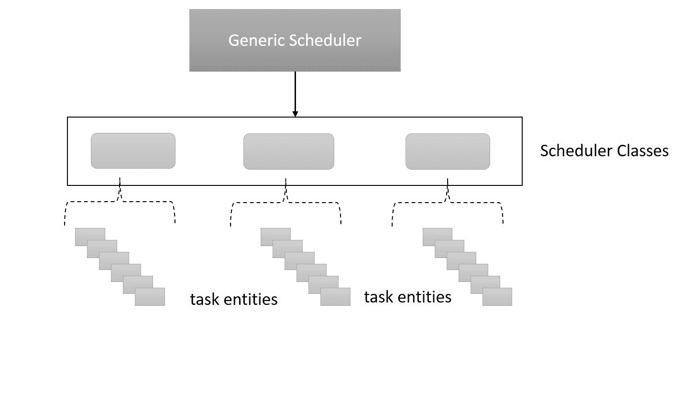

# 第二章：解密进程调度程序

进程调度是任何操作系统的最关键的执行工作之一，Linux 也不例外。调度进程的启发式和效率是使任何操作系统运行并赋予其身份的关键因素，例如通用操作系统、服务器或实时系统。在本章中，我们将深入了解 Linux 调度程序，解密诸如：

+   Linux 调度程序设计

+   调度类

+   调度策略和优先级

+   完全公平调度器

+   实时调度程序

+   截止时间调度器

+   组调度

+   抢占

# 进程调度程序

任何操作系统的有效性与其公平调度所有竞争进程的能力成正比。进程调度程序是内核的核心组件，它计算并决定进程何时以及多长时间获得 CPU 时间。理想情况下，进程需要 CPU 的*时间片*来运行，因此调度程序基本上需要公平地分配处理器时间片给进程。

调度程序通常需要：

+   避免进程饥饿

+   管理优先级调度

+   最大化所有进程的吞吐量

+   确保低周转时间

+   确保资源使用均匀

+   避免 CPU 占用

+   考虑进程的行为模式进行优先级排序

+   在重负载下优雅地补贴

+   有效地处理多核上的调度

# Linux 进程调度程序设计

Linux 最初是为桌面系统开发的，但不知不觉地演变成了一个多维操作系统，其使用范围涵盖嵌入式设备、大型机和超级计算机，以及房间大小的服务器。它还无缝地适应了不断发展的多样化计算平台，如 SMP、虚拟化和实时系统。这些平台的多样性是由在这些系统上运行的进程类型带来的。例如，一个高度交互式的桌面系统可能运行 I/O 绑定的进程，而实时系统则依赖确定性进程。因此，每种类型的进程在需要公平调度时都需要不同类型的启发式方法，因为 CPU 密集型进程可能需要比普通进程更多的 CPU 时间，而实时进程则需要确定性执行。因此，Linux 面临着处理这些多样化进程管理时带来的不同调度挑战。



Linux 进程调度程序的内在设计通过采用简单的两层模型，优雅而巧妙地处理了这一挑战。其第一层，**通用调度程序**，定义了作为调度程序入口函数的抽象操作，而第二层，调度类，实现了实际的调度操作，其中每个类专门处理特定类型进程的调度启发式。这种模型使得通用调度程序能够从每个调度类的实现细节中抽象出来。例如，普通进程（I/O 绑定）可以由一个类处理，而需要确定性执行的进程，如实时进程，可以由另一个类处理。这种架构还能够无缝地添加新的调度类。前面的图示了进程调度程序的分层设计。

通用调度程序通过一个称为`sched_class`的结构定义了抽象接口：

```
struct sched_class {
    const struct sched_class *next;

     void (*enqueue_task) (struct rq *rq, struct task_struct *p, int flags);
   void (*dequeue_task) (struct rq *rq, struct task_struct *p, int flags);
   void (*yield_task) (struct rq *rq);
       bool (*yield_to_task) (struct rq *rq, struct task_struct *p, bool preempt);

 void (*check_preempt_curr) (struct rq *rq, struct task_struct *p, int flags);

       /*
         * It is the responsibility of the pick_next_task() method that will
       * return the next task to call put_prev_task() on the @prev task or
  * something equivalent.
   *
         * May return RETRY_TASK when it finds a higher prio class has runnable
    * tasks.
  */
       struct task_struct * (*pick_next_task) (struct rq *rq,
                                            struct task_struct *prev,
                                         struct rq_flags *rf);
     void (*put_prev_task) (struct rq *rq, struct task_struct *p);

#ifdef CONFIG_SMP
        int  (*select_task_rq)(struct task_struct *p, int task_cpu, int sd_flag, int flags);
      void (*migrate_task_rq)(struct task_struct *p);

     void (*task_woken) (struct rq *this_rq, struct task_struct *task);

  void (*set_cpus_allowed)(struct task_struct *p,
                            const struct cpumask *newmask);

    void (*rq_online)(struct rq *rq);
 void (*rq_offline)(struct rq *rq);
#endif

      void (*set_curr_task) (struct rq *rq);
    void (*task_tick) (struct rq *rq, struct task_struct *p, int queued);
     void (*task_fork) (struct task_struct *p);
        void (*task_dead) (struct task_struct *p);

  /*
         * The switched_from() call is allowed to drop rq->lock, therefore we
   * cannot assume the switched_from/switched_to pair is serialized by
        * rq->lock. They are however serialized by p->pi_lock.
      */
       void (*switched_from) (struct rq *this_rq, struct task_struct *task);
     void (*switched_to) (struct rq *this_rq, struct task_struct *task);
       void (*prio_changed) (struct rq *this_rq, struct task_struct *task,
                            int oldprio);

  unsigned int (*get_rr_interval) (struct rq *rq,
                                    struct task_struct *task);

 void (*update_curr) (struct rq *rq);

#define TASK_SET_GROUP  0
#define TASK_MOVE_GROUP  1

#ifdef CONFIG_FAIR_GROUP_SCHED
       void (*task_change_group) (struct task_struct *p, int type);
#endif
};
```

每个调度类都实现了`sched_class`结构中定义的操作。截至 4.12.x 内核，有三个调度类：**完全公平调度**（**CFS**）类，实时调度类和截止时间调度类，每个类处理具有特定调度要求的进程。以下代码片段显示了每个类如何根据`sched_class`结构填充其操作。

**CFS 类**：

```
const struct sched_class fair_sched_class = {
         .next                   = &idle_sched_class,
         .enqueue_task           = enqueue_task_fair,
         .dequeue_task           = dequeue_task_fair,
         .yield_task             = yield_task_fair,
         .yield_to_task          = yield_to_task_fair,

         .check_preempt_curr     = check_preempt_wakeup,

         .pick_next_task         = pick_next_task_fair,
         .put_prev_task          = put_prev_task_fair,
....
}
```

**实时调度类**：

```
const struct sched_class rt_sched_class = {
         .next                   = &fair_sched_class,
         .enqueue_task           = enqueue_task_rt,
         .dequeue_task           = dequeue_task_rt,
         .yield_task             = yield_task_rt,

         .check_preempt_curr     = check_preempt_curr_rt,

         .pick_next_task         = pick_next_task_rt,
         .put_prev_task          = put_prev_task_rt,
....
}
```

**截止时间调度类**：

```
const struct sched_class dl_sched_class = {
         .next                   = &rt_sched_class,
         .enqueue_task           = enqueue_task_dl,
         .dequeue_task           = dequeue_task_dl,
         .yield_task             = yield_task_dl,

         .check_preempt_curr     = check_preempt_curr_dl,

         .pick_next_task         = pick_next_task_dl,
         .put_prev_task          = put_prev_task_dl,
....
}
```

# 运行队列

传统上，运行队列包含了在给定 CPU 核心上争夺 CPU 时间的所有进程（每个 CPU 都有一个运行队列）。通用调度程序被设计为在调度下一个最佳的可运行任务时查看运行队列。由于每个调度类处理特定的调度策略和优先级，维护所有可运行进程的公共运行队列是不可能的。

内核通过将其设计原则引入前台来解决这个问题。每个调度类都定义了其运行队列数据结构的布局，以最适合其策略。通用调度程序层实现了一个抽象的运行队列结构，其中包含作为运行队列接口的公共元素。该结构通过指针扩展，这些指针指向特定类的运行队列。换句话说，所有调度类都将其运行队列嵌入到主运行队列结构中。这是一个经典的设计技巧，它让每个调度程序类选择适合其运行队列数据结构的适当布局。

```
struct rq (runqueue) will help us comprehend the concept (elements related to SMP have been omitted from the structure to keep our focus on what's relevant):
```

```
 struct rq {
        /* runqueue lock: */
        raw_spinlock_t lock;
   /*
    * nr_running and cpu_load should be in the same cacheline because
    * remote CPUs use both these fields when doing load calculation.
    */
         unsigned int nr_running;
    #ifdef CONFIG_NUMA_BALANCING
         unsigned int nr_numa_running;
         unsigned int nr_preferred_running;
    #endif
         #define CPU_LOAD_IDX_MAX 5
         unsigned long cpu_load[CPU_LOAD_IDX_MAX];
 #ifdef CONFIG_NO_HZ_COMMON
 #ifdef CONFIG_SMP
         unsigned long last_load_update_tick;
 #endif /* CONFIG_SMP */
         unsigned long nohz_flags;
 #endif /* CONFIG_NO_HZ_COMMON */
 #ifdef CONFIG_NO_HZ_FULL
         unsigned long last_sched_tick;
 #endif
         /* capture load from *all* tasks on this cpu: */
         struct load_weight load;
         unsigned long nr_load_updates;
         u64 nr_switches;

         struct cfs_rq cfs;
         struct rt_rq rt;
         struct dl_rq dl;

 #ifdef CONFIG_FAIR_GROUP_SCHED
         /* list of leaf cfs_rq on this cpu: */
         struct list_head leaf_cfs_rq_list;
         struct list_head *tmp_alone_branch;
 #endif /* CONFIG_FAIR_GROUP_SCHED */

          unsigned long nr_uninterruptible;

         struct task_struct *curr, *idle, *stop;
         unsigned long next_balance;
         struct mm_struct *prev_mm;

         unsigned int clock_skip_update;
         u64 clock;
         u64 clock_task;

         atomic_t nr_iowait;

 #ifdef CONFIG_IRQ_TIME_ACCOUNTING
         u64 prev_irq_time;
 #endif
 #ifdef CONFIG_PARAVIRT
         u64 prev_steal_time;
 #endif
 #ifdef CONFIG_PARAVIRT_TIME_ACCOUNTING
         u64 prev_steal_time_rq;
 #endif

         /* calc_load related fields */
         unsigned long calc_load_update;
         long calc_load_active;

 #ifdef CONFIG_SCHED_HRTICK
 #ifdef CONFIG_SMP
         int hrtick_csd_pending;
         struct call_single_data hrtick_csd;
 #endif
         struct hrtimer hrtick_timer;
 #endif
 ...
 #ifdef CONFIG_CPU_IDLE
         /* Must be inspected within a rcu lock section */
         struct cpuidle_state *idle_state;
 #endif
};
```

您可以看到调度类（`cfs`、`rt` 和 `dl`）是如何嵌入到运行队列中的。运行队列中其他感兴趣的元素包括：

+   `nr_running`: 这表示运行队列中的进程数量

+   `load`: 这表示队列上的当前负载（所有可运行进程）

+   `curr` 和 `idle`: 这些分别指向当前运行任务的 *task_struct* 和空闲任务。当没有其他任务要运行时，空闲任务会被调度。

# 调度程序的入口

调度过程始于对通用调度程序的调用，即 `<kernel/sched/core.c>` 中定义的 `schedule()` 函数。这可能是内核中最常调用的例程之一。`schedule()` 的功能是选择下一个最佳的可运行任务。`schedule()` 函数的 `pick_next_task()` 遍历调度类中包含的所有相应函数，并最终选择下一个最佳的任务来运行。每个调度类都使用单链表连接，这使得 `pick_next_task()` 能够遍历这些类。

考虑到 Linux 主要设计用于高度交互式系统，该函数首先在 CFS 类中查找下一个最佳的可运行任务，如果在其他类中没有更高优先级的可运行任务（通过检查运行队列中可运行任务的总数（`nr_running`）是否等于 CFS 类子运行队列中可运行任务的总数来实现）；否则，它会遍历所有其他类，并选择下一个最佳的可运行任务。最后，如果找不到任务，则调用空闲后台任务（始终返回非空值）。

以下代码块显示了 `pick_next_task()` 的实现：

```
/*
 * Pick up the highest-prio task:
 */
static inline struct task_struct *
pick_next_task(struct rq *rq, struct task_struct *prev, struct rq_flags *rf)
{
   const struct sched_class *class;
  struct task_struct *p;

      /*
         * Optimization: we know that if all tasks are in the fair class we can
    * call that function directly, but only if the @prev task wasn't of a
        * higher scheduling class, because otherwise those loose the
      * opportunity to pull in more work from other CPUs.
       */
       if (likely((prev->sched_class == &idle_sched_class ||
                  prev->sched_class == &fair_sched_class) &&
                rq->nr_running == rq->cfs.h_nr_running)) {

         p = fair_sched_class.pick_next_task(rq, prev, rf);
                if (unlikely(p == RETRY_TASK))
                    goto again;

         /* Assumes fair_sched_class->next == idle_sched_class */
               if (unlikely(!p))
                 p = idle_sched_class.pick_next_task(rq, prev, rf);

          return p;
 }

again:
       for_each_class(class) {
           p = class->pick_next_task(rq, prev, rf);
               if (p) {
                  if (unlikely(p == RETRY_TASK))
                            goto again;
                       return p;
         }
 }

   /* The idle class should always have a runnable task: */
  BUG();
}
```

# 进程优先级

决定运行哪个进程取决于进程的优先级。每个进程都标有一个优先级值，这使得它在获得 CPU 时间方面有一个即时的位置。在 *nix 系统上，优先级基本上分为 *动态* 和 *静态* 优先级。**动态优先级** 基本上是内核动态地应用于正常进程，考虑到诸如进程的良好值、其历史行为（I/O 绑定或处理器绑定）、已过去的执行和等待时间等各种因素。**静态优先级** 是由用户应用于实时进程的，内核不会动态地改变它们的优先级。因此，具有静态优先级的进程在调度时会被赋予更高的优先级。

**I/O 绑定进程：**当进程的执行严重受到 I/O 操作的影响（等待资源或事件），例如文本编辑器几乎在运行和等待按键之间交替时，这样的进程被称为 I/O 绑定。由于这种特性，调度器通常会为 I/O 绑定的进程分配较短的处理器时间片，并将它们与其他进程复用，增加了上下文切换的开销以及计算下一个最佳进程的后续启发式。

**处理器绑定进程：**这些进程喜欢占用 CPU 时间片，因为它们需要最大限度地利用处理器的计算能力。需要进行复杂科学计算和视频渲染编解码的进程是处理器绑定的。虽然需要更长的 CPU 时间片看起来很理想，但通常不需要在固定时间段内运行它们。交互式操作系统上的调度器倾向于更喜欢 I/O 绑定的进程而不是处理器绑定的进程。Linux 旨在提供良好的交互性能，更倾向于 I/O 绑定的进程，即使处理器绑定的进程运行频率较低，它们通常会被分配更长的时间片来运行。

进程也可以是**多面手**，I/O 绑定进程需要执行严肃的科学计算，占用 CPU。

任何正常进程的*nice*值范围在 19（最低优先级）和-20（最高优先级）之间，0 是默认值。较高的 nice 值表示较低的优先级（进程对其他进程更友好）。实时进程的优先级在 0 到 99 之间（静态优先级）。所有这些优先级范围都是从用户的角度来看的。

**内核对优先级的看法**

然而，Linux 从自己的角度看待进程优先级。它为计算进程的优先级增加了更多的计算。基本上，它将所有优先级在 0 到 139 之间进行缩放，其中 0 到 99 分配给实时进程，100 到 139 代表了 nice 值范围（-20 到 19）。

# 调度器类

现在让我们深入了解每个调度类，并了解它在管理调度操作时所涉及的操作、政策和启发式。如前所述，每个调度类必须提供`struct sched_class`的一个实例；让我们看一下该结构中的一些关键元素：

+   `enqueue_task`：基本上是将新进程添加到运行队列

+   `dequeue_task`：当进程从运行队列中移除时

+   `yield_task`：当进程希望自愿放弃 CPU 时

+   `pick_next_task`：由*s*chedule()调用的*pick_next_task*的相应函数。它从其类中挑选出下一个最佳的可运行任务。

# 完全公平调度类（CFS）

所有具有动态优先级的进程都由 CFS 类处理，而大多数通用*nix 系统中的进程都是正常的（非实时），因此 CFS 仍然是内核中最繁忙的调度器类。

CFS 依赖于根据任务分配处理器时间的政策和动态分配的优先级来保持*平衡*。CFS 下的进程调度是在假设下实现的，即它具有"理想的、精确的多任务 CPU"，在其峰值容量下平等地为所有进程提供动力。例如，如果有两个进程，完美的多任务 CPU 确保两个进程同时运行，每个进程利用其 50%的能力。由于这在实际上是不可能的（实现并行性），CFS 通过在所有竞争进程之间保持适当的平衡来为进程分配处理器时间。如果一个进程未能获得公平的时间，它被认为是不平衡的，因此作为最佳可运行进程进入下一个进程。

CFS 不依赖于传统的时间片来分配处理器时间，而是使用虚拟运行时间（*vruntime*）的概念：它表示进程获得 CPU 时间的数量，这意味着低`vruntime`值表示进程处理器匮乏，而高`vruntime`值表示进程获得了相当多的处理器时间。具有低`vruntime`值的进程在调度时获得最高优先级。CFS 还为理想情况下等待 I/O 请求的进程使用*睡眠公平性*。睡眠公平性要求等待的进程在最终唤醒后获得相当多的 CPU 时间。根据`vruntime`值，CFS 决定进程运行的时间。它还使用 nice 值来衡量进程与所有竞争进程的关系：较高值的低优先级进程获得较少的权重，而较低值的高优先级任务获得更多的权重。即使在 Linux 中处理具有不同优先级的进程也是优雅的，因为与较高优先级任务相比，较低优先级任务会有相当大的延迟因素；这使得分配给低优先级任务的时间迅速消失。

# 在 CFS 下计算优先级和时间片

优先级是基于进程等待时间、进程运行时间、进程的历史行为和其 nice 值来分配的。通常，调度程序使用复杂的算法来找到下一个最佳的要运行的进程。

在计算每个进程获得的时间片时，CFS 不仅依赖于进程的 nice 值，还考虑进程的负载权重。对于进程 nice 值的每次增加 1，CPU 时间片将减少 10%，对于 nice 值的每次减少 1，CPU 时间片将增加 10%，这表明 nice 值对于每次变化都是以 10%的乘法变化。为了计算相应 nice 值的负载权重，内核维护了一个名为`prio_to_weight`的数组，其中每个 nice 值对应一个权重：

```
static const int prio_to_weight[40] = {
  /* -20 */     88761,     71755,     56483,     46273,     36291,
  /* -15 */     29154,     23254,     18705,     14949,     11916,
  /* -10 */      9548,      7620,      6100,      4904,      3906,
  /*  -5 */      3121,      2501,      1991,      1586,      1277,
  /*   0 */      1024,       820,       655,       526,       423,
  /*   5 */       335,       272,       215,       172,       137,
  /*  10 */       110,        87,        70,        56,        45,
  /*  15 */        36,        29,        23,        18,        15,
};
```

进程的负载值存储在`struct load_weight`的`weight`字段中。

像进程的权重一样，CFS 的运行队列也被分配了一个权重，这是运行队列中所有任务的总权重。现在，时间片是通过考虑实体的负载权重、运行队列的负载权重和`sched_period`（调度周期）来计算的。

# CFS 的运行队列

CFS 摆脱了普通运行队列的需要，而是使用自平衡的红黑树，以便在最短时间内找到下一个最佳的要运行的进程。*RB 树*保存了所有竞争进程，并便于对进程进行快速插入、删除和搜索。最高优先级的进程被放置在最左边的节点上。`pick_next_task()`函数现在只是从`rb tree`中选择最左边的节点进行调度。

# 分组调度

为了确保调度时的公平性，CFS 被设计为保证每个可运行的进程在一个定义的时间段内至少运行一次，称为**调度周期**。在调度周期内，CFS 基本上确保公平性，或者换句话说，确保不公平性被最小化，因为每个进程至少运行一次。CFS 将调度周期分成时间片，以避免进程饥饿；然而，想象一下这样的情况，进程 A 生成了 10 个执行线程，进程 B 生成了 5 个执行线程：在这里，CFS 将时间片均匀分配给所有线程，导致进程 A 及其生成的线程获得最大的时间，而进程 B 则受到不公平对待。如果进程 A 继续生成更多的线程，情况可能对进程 B 及其生成的线程变得严重，因为进程 B 将不得不应对最小的调度粒度或时间片（即 1 毫秒）。在这种情况下，公平性要求进程 A 和 B 获得相等的时间片，并且生成的线程在内部共享这些时间片。例如，如果进程 A 和 B 各获得 50%的时间，那么进程 A 将把其 50%的时间分配给其生成的 10 个线程，每个线程在内部获得 5%的时间。

为了解决这个问题并保持公平性，CFS 引入了**组调度**，其中时间片分配给线程组而不是单个线程。继续上面的例子，在组调度下，进程 A 及其生成的线程属于一组，进程 B 及其生成的线程属于另一组。由于调度粒度是在组级别而不是线程级别上强加的，它给予进程 A 和 B 相等的处理器时间份额，进程 A 和 B 在其组成员内部分配时间片。在这里，生成在进程 A 下的线程会受到影响，因为它因生成更多的执行线程而受到惩罚。为了确保组调度，在配置内核时需要设置`CONFIG_FAIR_GROUP_SCHED`。CFS 任务组由结构`sched_entity`*表示，每个组被称为**调度实体**。以下代码片段显示了调度实体结构的关键元素：

```
struct sched_entity {
        struct load_weight      load;   /* for load-balancing */
        struct rb_node          run_node;
        struct list_head        group_node;
        unsigned int            on_rq;

        u64                     exec_start;
        u64                     sum_exec_runtime;
        u64                     vruntime;
        u64                     prev_sum_exec_runtime;

        u64                     nr_migrations;

 #ifdef CONFIG_SCHEDSTATS
        struct sched_statistics statistics;
#endif

#ifdef CONFIG_FAIR_GROUP_SCHED
        int depth;
        struct sched_entity *parent;
         /* rq on which this entity is (to be) queued: */
        struct cfs_rq           *cfs_rq;
        /* rq "owned" by this entity/group: */
        struct cfs_rq           *my_q;
#endif

....
};
```

+   `load`：表示每个实体对队列总负载的负载量

+   `vruntime`：表示进程运行的时间

# 许多核心系统下的调度实体

任务组可以在许多核心系统上的任何 CPU 核心上运行，但为了实现这一点，创建一个调度实体是不够的。因此，组必须为系统上的每个 CPU 核心创建一个调度实体。跨 CPU 的调度实体由`struct task_group`表示：

```
/* task group related information */
struct task_group {
       struct cgroup_subsys_state css;

#ifdef CONFIG_FAIR_GROUP_SCHED
 /* schedulable entities of this group on each cpu */
      struct sched_entity **se;
 /* runqueue "owned" by this group on each cpu */
  struct cfs_rq **cfs_rq;
   unsigned long shares;

#ifdef CONFIG_SMP
        /*
         * load_avg can be heavily contended at clock tick time, so put
    * it in its own cacheline separated from the fields above which
   * will also be accessed at each tick.
     */
       atomic_long_t load_avg ____cacheline_aligned;
#endif
#endif

#ifdef CONFIG_RT_GROUP_SCHED
     struct sched_rt_entity **rt_se;
   struct rt_rq **rt_rq;

       struct rt_bandwidth rt_bandwidth;
#endif

       struct rcu_head rcu;
      struct list_head list;

      struct task_group *parent;
        struct list_head siblings;
        struct list_head children;

#ifdef CONFIG_SCHED_AUTOGROUP
       struct autogroup *autogroup;
#endif

    struct cfs_bandwidth cfs_bandwidth;
};
```

现在，每个任务组都有一个调度实体，每个 CPU 核心都有一个与之关联的 CFS 运行队列。当一个任务从一个任务组迁移到另一个 CPU 核心时，该任务将从 CPU x 的 CFS 运行队列中出列，并入列到 CPU y 的 CFS 运行队列中。

# 调度策略

调度策略适用于进程，并有助于确定调度决策。如果您回忆一下，在第一章中，*理解进程、地址空间和线程*，我们描述了`task_struct`结构的调度属性下的`int policy`字段。`policy`字段包含一个值，指示调度时要应用哪种策略。CFS 类使用以下两种策略处理所有普通进程：

+   `SCHED_NORMAL (0)`：用于所有普通进程。所有非实时进程都可以总结为普通进程。由于 Linux 旨在成为一个高度响应和交互式的系统，大部分调度活动和启发式方法都集中在公平调度普通进程上。普通进程根据 POSIX 标准被称为`SCHED_OTHER`。

+   `SCHED_BATCH (3)`: 通常在服务器上，非交互式的 CPU 密集型批处理被使用。这些 CPU 密集型的进程比`SCHED_NORMAL`进程被赋予更低的优先级，并且它们不会抢占正常进程的调度。

+   CFS 类还处理空闲进程的调度，其指定如下策略：

+   `SCHED_IDLE (5)`: 当没有进程需要运行时，*空闲*进程（低优先级后台进程）被调度。*空闲*进程被分配了所有进程中最低的优先级。

# 实时调度类

Linux 支持软实时任务，并由实时调度类进行调度。`rt`进程被分配静态优先级，并且不会被内核动态改变。由于实时任务旨在确定性运行并希望控制何时以及多长时间被调度，它们总是优先于正常任务（`SCHED_NORMAL`）。与 CFS 使用`rb 树`作为其子运行队列不同，较不复杂的`rt`调度器使用每个优先级值（1 到 99）的简单`链表`。Linux 应用了两种实时策略，`rr`和`fifo`*,*在调度静态优先级进程时；这些由`struct task_struct`*:*的`policy`元素指示。

+   `SCHED_FIFO` (1): 这使用先进先出的方法来调度软实时进程

+   `SCHED_RR` (2): 这是用于调度软实时进程的轮转策略

# FIFO

**FIFO**是应用于优先级高于 0 的进程的调度机制（0 分配给正常进程）。FIFO 进程在没有任何时间片分配的情况下运行；换句话说，它们一直运行直到阻塞某个事件或明确让出给另一个进程。当调度器遇到更高优先级的可运行 FIFO、RR 或截止任务时，FIFO 进程也会被抢占。当调度器遇到多个具有相同优先级的 fifo 任务时，它会以轮转的方式运行这些进程，从列表头部的第一个进程开始。在抢占时，进程被添加回列表的尾部。如果更高优先级的进程抢占了 FIFO 进程，它会等待在列表的头部，当所有其他高优先级任务被抢占时，它再次被选中运行。当新的 fifo 进程变为可运行时，它被添加到列表的尾部。

# RR

轮转策略类似于 FIFO，唯一的区别是它被分配了一个时间片来运行。这是对 FIFO 的一种增强（因为 FIFO 进程可能一直运行直到让出或等待）。与 FIFO 类似，列表头部的 RR 进程被选中执行（如果没有其他更高优先级的任务可用），并在时间片完成时被抢占，并被添加回列表的尾部。具有相同优先级的 RR 进程会轮流运行，直到被高优先级任务抢占。当高优先级任务抢占 RR 任务时，它会等待在列表的头部，并在恢复时只运行其剩余的时间片。

# 实时组调度

与 CFS 下的组调度类似，实时进程也可以通过设置`CONFIG_RT_GROUP_SCHED`来进行分组调度。为了使组调度成功，每个组必须被分配一部分 CPU 时间，并保证时间片足够运行每个实体下的任务，否则会失败。因此，每个组都被分配了一部分“运行时间”（CPU 在一段时间内可以运行的时间）。分配给一个组的运行时间不会被另一个组使用。未分配给实时组的 CPU 时间将被正常优先级任务使用，实时实体未使用的时间也将被正常任务使用。FIFO 和 RR 组由`struct sched_rt_entity`*:*表示

```
struct sched_rt_entity {
 struct list_head                run_list;
 unsigned long                   timeout;
  unsigned long                   watchdog_stamp;
   unsigned int                    time_slice;
       unsigned short                  on_rq;
    unsigned short                  on_list;

    struct sched_rt_entity          *back;
#ifdef CONFIG_RT_GROUP_SCHED
  struct sched_rt_entity          *parent;
  /* rq on which this entity is (to be) queued: */
  struct rt_rq                    *rt_rq;
   /* rq "owned" by this entity/group: */
    struct rt_rq                    *my_q;
#endif
};
```

# 截止调度类（间歇任务模型截止调度）

**Deadline**代表 Linux 上新一代的 RT 进程（自 3.14 内核以来添加）。与 FIFO 和 RR 不同，这些进程可能占用 CPU 或受到时间片的限制，截止进程基于 GEDF（全局最早截止时间优先）和 CBS（恒定带宽服务器）算法，预先确定其运行时需求。间歇性进程内部运行多个任务，每个任务都有一个相对截止时间，必须在其中完成执行，并且有一个计算时间，定义 CPU 需要完成进程执行的时间。为了确保内核成功执行截止进程，内核基于截止时间参数运行准入测试，如果失败则返回错误`EBUSY`。截止策略的进程优先于所有其他进程。截止进程使用`SCHED_DEADLINE`（6）作为其策略元素。

# 与调度程序相关的系统调用

Linux 提供了一整套系统调用，用于管理各种调度程序参数、策略和优先级，并为调用线程检索大量与调度相关的信息。它还允许线程显式地放弃 CPU：

```
nice(int inc)
```

`nice()`接受一个*int*参数，并将其添加到调用线程的`nice`值中。成功时返回线程的新`nice`值。`Nice`值在范围 19（最低优先级）到-20（最高优先级）内。*Nice*值只能在此范围内递增：

```
getpriority(int which, id_t who)
```

这返回线程、组、用户或一组由其参数指示的特定用户的`nice`值。它返回任何进程持有的最高优先级：

```
setpriority(int which, id_t who, int prio)
```

`setpriority`*.*设置由其参数指示的特定用户的线程、组、用户或一组线程的调度优先级。成功时返回零：

```
sched_setscheduler(pid_t pid, int policy, const struct sched_param *param)
```

这设置了指定线程的调度策略和参数，由其`pid`指示。如果`pid`为零，则设置调用线程的策略。指定调度参数的`param`参数指向一个`sched_param`结构，其中包含`int sched_priority`。对于正常进程，`sched_priority`必须为零，对于 FIFO 和 RR 策略（在策略参数中提到）的优先级值必须在 1 到 99 的范围内。成功时返回零：

```
sched_getscheduler(pid_t pid)
```

它返回线程（`pid`）的调度策略。如果`pid`为零，则将检索调用线程的策略：

```
sched_setparam(pid_t pid, const struct sched_param *param)
```

它设置与给定线程（`pid`）的调度策略相关联的调度参数。如果`pid`为零，则设置调用进程的参数。成功时返回零：

```
sched_getparam(pid_t pid, struct sched_param *param)
```

这将为指定的线程（`pid`）设置调度参数。如果`pid`为零，则将检索调用线程的调度参数。成功时返回零：

```
sched_setattr(pid_t pid, struct sched_attr *attr, unsigned int flags)
```

它为指定的线程（`pid`）设置调度策略和相关属性。如果`pid`为零，则设置调用进程的策略和属性。这是一个特定于 Linux 的调用，是`sched_setscheduler()`和`sched_setparam()`调用提供的功能的超集。成功时返回零。

```
sched_getattr(pid_t pid, struct sched_attr *attr, unsigned int size, unsigned int flags)
```

它获取指定线程（`pid`）的调度策略和相关属性。如果`pid`为零，则将检索调用线程的调度策略和相关属性。这是一个特定于 Linux 的调用，是`sched_getscheduler()`和`sched_getparam()`调用提供的功能的超集。成功时返回零。

```
sched_get_priority_max(int policy) 
sched_get_priority_min(int policy)
```

这分别返回指定`policy`的最大和最小优先级。`fifo`、`rr`、`deadline`、`normal`、`batch`和`idle`是策略的支持值。

```
sched_rr_get_interval(pid_t pid, struct timespec *tp)
```

它获取指定线程（`pid`）的时间量，并将其写入由`tp`指定的`timespec`结构。如果`pid`为零，则将调用进程的时间量获取到`tp`中。这仅适用于具有`*rr*`策略的进程。成功时返回零。

```
sched_yield(void)
```

这被称为显式地放弃 CPU。线程现在被添加回队列。成功时返回零。

# 处理器亲和力调用

提供了特定于 Linux 的处理器亲和性调用，帮助线程定义它们想要在哪个 CPU 上运行。默认情况下，每个线程继承其父线程的处理器亲和性，但它可以定义其亲和性掩码以确定其处理器亲和性。在许多核心系统上，CPU 亲和性调用有助于提高性能，通过帮助进程保持在一个核心上（但 Linux 会尝试保持一个线程在一个 CPU 上）。亲和性位掩信息包含在`struct task_struct`的`cpu_allowed`字段中。亲和性调用如下：

```
sched_setaffinity(pid_t pid, size_t cpusetsize, const cpu_set_t *mask)
```

它将线程（`pid`）的 CPU 亲和性掩码设置为`mask`指定的值。如果线程（`pid`）不在指定 CPU 的队列中运行，则迁移到指定的`cpu`。成功时返回零。

```
sched_getaffinity(pid_t pid, size_t cpusetsize, cpu_set_t *mask)
```

这将线程（`pid`）的亲和性掩码提取到由*mask*指向的`cpusetsize`结构中。如果`pid`为零，则返回调用线程的掩码。成功时返回零。

# 进程抢占

理解抢占和上下文切换对于完全理解调度以及它对内核在维持低延迟和一致性方面的影响至关重要。每个进程都必须被隐式或显式地抢占，以为另一个进程腾出位置。抢占可能导致上下文切换，这需要一个低级别的特定体系结构操作，由函数`context_switch()`执行。为了使处理器切换上下文，需要完成两个主要任务：将旧进程的虚拟内存映射切换为新进程的映射，并将处理器状态从旧进程切换为新进程的状态。这两个任务由`switch_mm()`和`switch_to()`执行。

抢占可能发生的原因有：

当高优先级进程变为可运行状态时。为此，调度程序将不时地检查是否有高优先级的可运行线程。从中断和系统调用返回时，设置`TIF_NEED_RESCHEDULE`（内核提供的指示需要重新调度的标志），调用调度程序。由于有一个周期性的定时器中断保证定期发生，调用调度程序也是有保证的。当进程进入阻塞调用或发生中断事件时，也会发生抢占。

Linux 内核在历史上一直是非抢占的，这意味着内核模式下的任务在没有中断事件发生或选择显式放弃 CPU 的情况下是不可抢占的。自 2.6 内核以来，已经添加了抢占（需要在内核构建期间启用）。启用内核抢占后，内核模式下的任务因为列出的所有原因都是可抢占的，但内核模式下的任务在执行关键操作时可以禁用内核抢占。这是通过向每个进程的`thread_info`结构添加了一个抢占计数器（`preempt_count`）来实现的。任务可以通过内核宏`preempt_disable()`和`preempt_enable()`来禁用/启用抢占，这会增加和减少`preempt_counter`。这确保了只有当`preempt_counter`为零时（表示没有获取锁）内核才是可抢占的。

内核代码中的关键部分是通过禁用抢占来执行的，这是通过在内核锁操作（自旋锁、互斥锁）中调用`preempt_disable`和`preempt_enable`来实现的。

使用“抢占 rt”构建的 Linux 内核，支持*完全可抢占内核*选项，启用后使所有内核代码包括关键部分都是完全可抢占的。

# 总结

进程调度是内核的一个不断发展的方面，随着 Linux 的发展和进一步多样化到许多计算领域，对进程调度器的微调和更改将是必要的。然而，通过本章建立的理解，深入了解或理解任何新的变化将会很容易。我们现在已经具备了进一步探索作业控制和信号管理的另一个重要方面的能力。我们将简要介绍信号的基础知识，然后进入内核的信号管理数据结构和例程。
