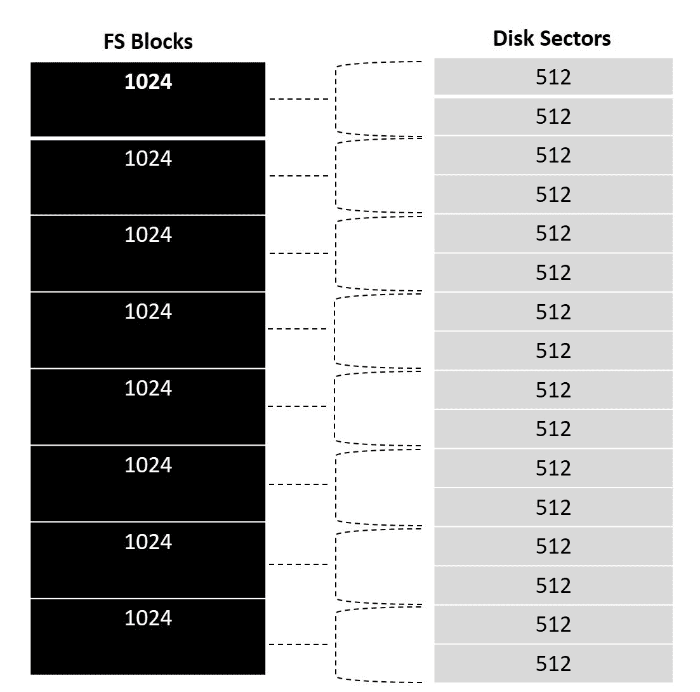
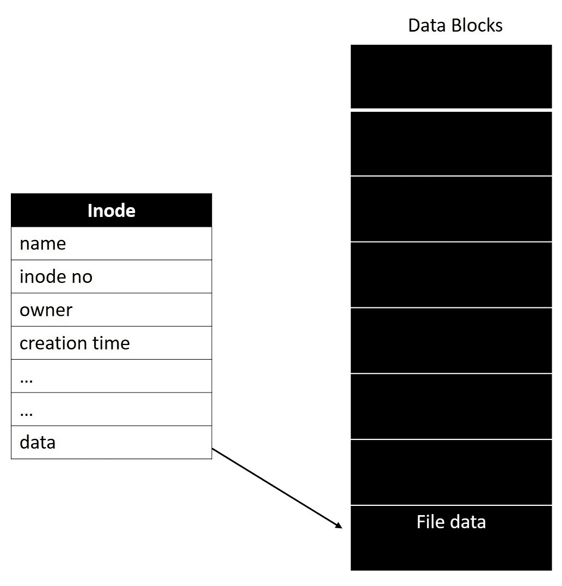
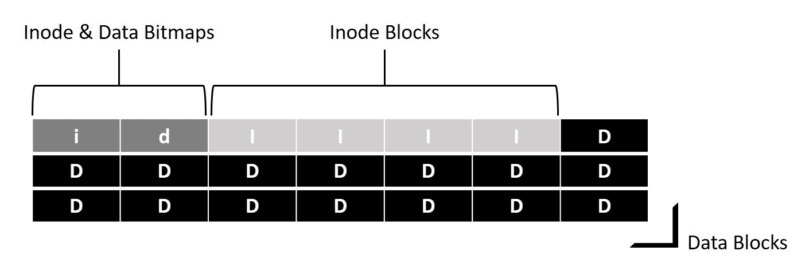
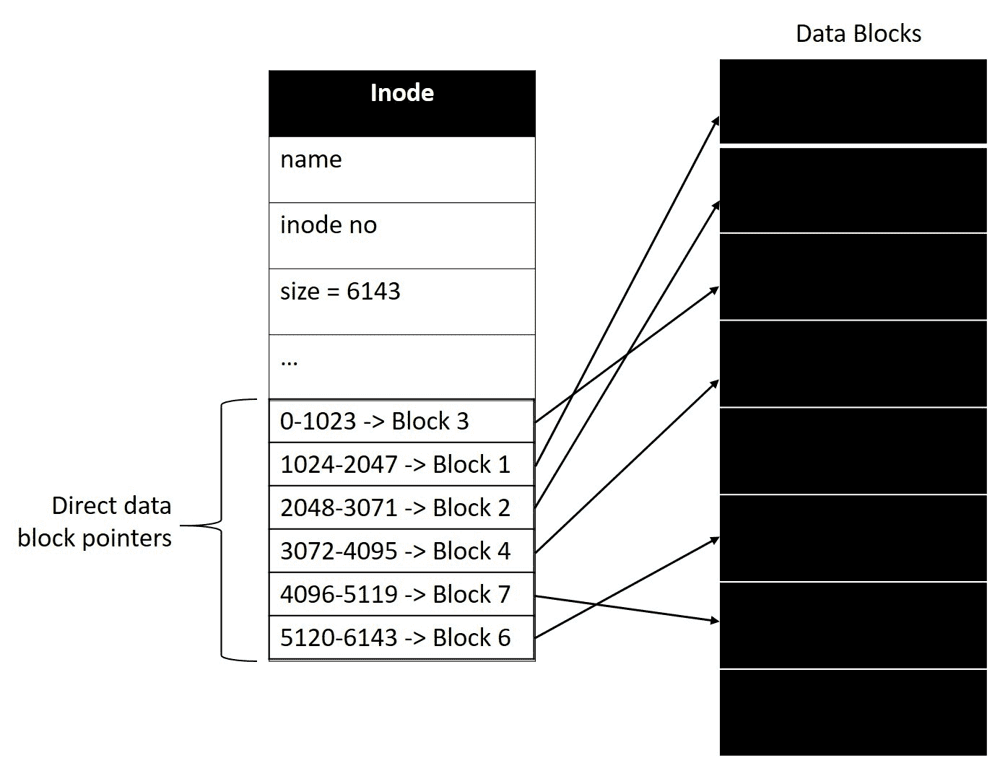
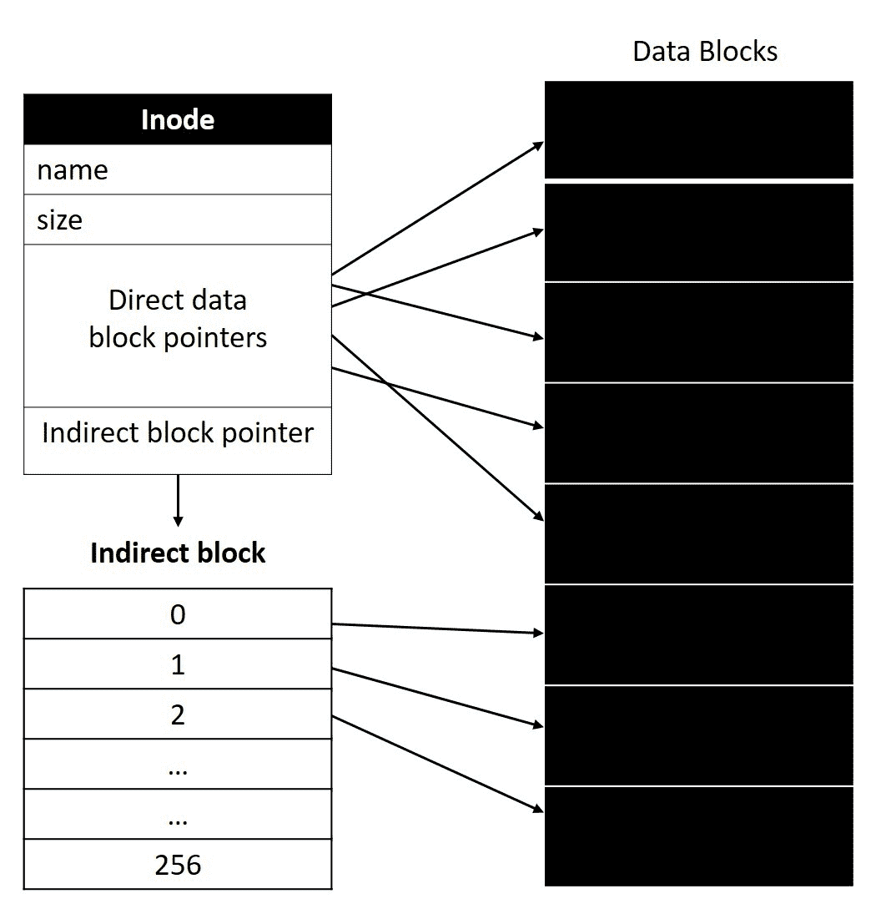
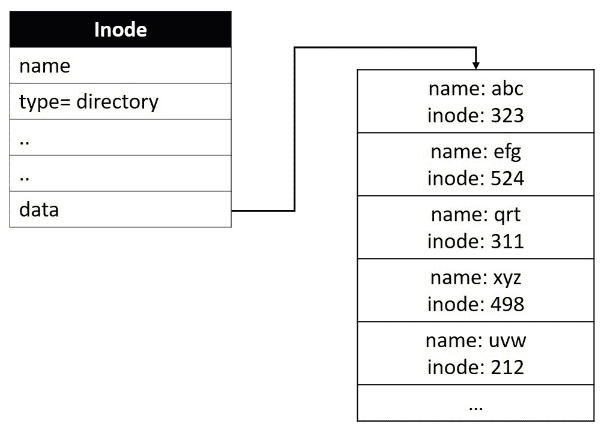
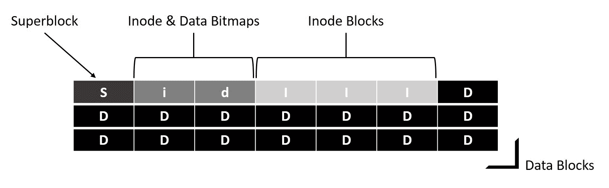
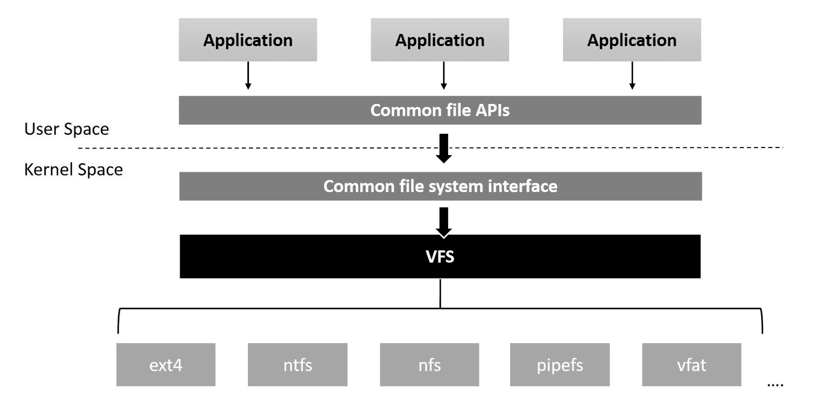

# 第五章：文件系统和文件 I/O

到目前为止，我们已经遍历了内核的基本资源，如地址空间、处理器时间和物理内存。我们已经建立了对*进程管理*、*CPU 调度*和*内存管理*的实证理解，以及它们提供的关键抽象。在本章中，我们将继续建立我们的理解，通过查看内核提供的另一个关键抽象，即*文件 I/O 架构*。我们将详细讨论以下方面：

+   文件系统实现

+   文件 I/O

+   虚拟文件系统（VFS）

+   VFS 数据结构

+   特殊文件系统

计算系统存在的唯一目的是处理数据。大多数算法都是设计和编程用来从获取的数据中提取所需的信息。驱动这一过程的数据必须持久地存储以便持续访问，这要求存储系统被设计为安全地包含信息以供更长时间的存储。然而，对于用户来说，是操作系统从这些存储设备中获取数据并使其可用于处理。内核的文件系统就是实现这一目的的组件。

# 文件系统 - 高层视图

**文件系统**将存储设备的物理视图与用户分离，并通过抽象容器**文件和目录**在磁盘上为系统的每个有效用户虚拟化存储区域。**文件**用作用户数据的容器，**目录**用作一组用户文件的容器。简单来说，操作系统为每个用户虚拟化存储设备的视图，以一组目录和文件的形式呈现。文件系统服务实现了创建、组织、存储和检索文件的例程，这些操作是由用户应用程序通过适当的系统调用接口调用的。

我们将从查看一个简单文件系统的布局开始，该文件系统设计用于管理标准磁存储盘。这个讨论将帮助我们理解与磁盘管理相关的关键术语和概念。然而，典型的文件系统实现涉及适当的数据结构，描述磁盘上文件数据的组织，以及使应用程序执行文件 I/O 的操作。

# 元数据

存储磁盘通常由相同大小的物理块组成，称为**扇区**；扇区的大小通常为 512 字节或其倍数，取决于存储类型和容量。扇区是磁盘上的最小 I/O 单元。当磁盘被呈现给文件系统进行管理时，它将存储区域视为一组固定大小的**块**，其中每个块与扇区或扇区大小的倍数相同。典型的默认块大小为 1024 字节，可以根据磁盘容量和文件系统类型而变化。块大小被认为是文件系统的最小 I/O 单元：



# 索引节点（inode）

文件系统需要维护元数据来识别和跟踪用户创建的每个文件和目录的各种属性。有几个元数据元素描述了一个文件，如文件名、文件类型、最后访问时间戳、所有者、访问权限、最后修改时间戳、创建时间、文件数据大小以及包含文件数据的磁盘块的引用。传统上，文件系统定义了一个称为 inode 的结构来包含文件的所有元数据。inode 中包含的信息的大小和类型是特定于文件系统的，并且根据其支持的功能而大不相同。每个 inode 都由一个称为**索引**的唯一编号来标识，这被认为是文件的低级名称：



文件系统为存储 inode 实例保留了一些磁盘块，其余用于存储相应的文件数据。为存储 inode 保留的块数取决于磁盘的存储容量。inode 块中保存的节点的磁盘列表称为**inode 表**。文件系统需要跟踪 inode 和数据块的状态以识别空闲块。这通常通过**位图**来实现，一个用于跟踪空闲 inode，另一个用于跟踪空闲数据块。以下图表显示了带有位图、inode 和数据块的典型布局：



# 数据块映射

如前所述，每个 inode 都应记录相应文件数据存储在其中的数据块的位置。根据文件数据的长度，每个文件可能占用*n*个数据块。有各种方法用于跟踪 inode 中的数据块详细信息；最简单的是**直接引用**，它涉及 inode 包含指向文件数据块的**直接指针**。这种**直接指针**的数量取决于文件系统设计，大多数实现选择使用更少的字节来存储这些指针。这种方法对于跨越几个数据块（通常<16k）的小文件非常有效，但不支持跨越大量数据块的大文件：



为了支持大文件，文件系统采用了一种称为**多级索引**的替代方法，其中包括间接指针。最简单的实现方式是在 inode 结构中有一个间接指针以及一些直接指针。**间接指针**指的是一个包含文件数据块的**直接指针**的块。当文件变得太大而无法通过 inode 的直接指针引用时，会使用一个空闲数据块来存储直接指针，并将 inode 的间接指针引用到它。间接指针引用的数据块称为**间接块**。间接块中直接指针的数量可以通过块大小除以块地址的大小来确定；例如，在 32 位文件系统上，每个间接块最多可以包含 256 个条目，而在 64 位文件系统上，每个间接块最多可以包含 128 个直接指针：



这种技术可以进一步扩展以支持更大的文件，方法是使用**双重间接指针**，它指的是一个包含间接指针的块，每个条目都指向一个包含直接指针的块。假设一个 64 位文件系统，块大小为 1024，每个块可以容纳 128 个条目，那么将有 128 个间接指针，每个指向一个包含 128 个直接指针的块；因此，通过这种技术，文件系统可以支持一个跨越多达 16,384（128 x 128）个数据块的文件，即 16 MB。

此外，这种技术可以通过**三级间接指针**进行扩展，从而需要文件系统管理更多的元数据。然而，尽管存在多级索引，但随着文件系统块大小的增加和块地址大小的减小，这是支持更大文件的最推荐和有效的解决方案。用户在初始化带有文件系统的磁盘时需要选择适当的块大小，以确保对更大文件的正确支持。

一些文件系统使用称为范围的不同方法来存储 inode 中的数据块信息。**范围**是一个指针，它指向开始数据块（类似于直接指针），并添加长度位，指定存储文件数据的连续块的计数。根据文件大小和磁盘碎片化水平，单个范围可能不足以引用文件的所有数据块，为处理这种情况，文件系统构建**范围列表**，每个范围引用磁盘上一个连续数据块区域的起始地址和长度。

扩展方法减少了文件系统需要管理的元数据的数量，以存储数据块映射，但这是以文件系统操作的灵活性为代价实现的。例如，考虑要在大文件的特定文件位置执行读取操作：为了定位指定文件偏移位置的数据块，文件系统必须从第一个范围开始，并扫描列表，直到找到覆盖所需文件偏移的范围。

# 目录

文件系统将目录视为特殊文件。它们用磁盘上的 inode 表示目录或文件夹。它们通过**类型**字段与普通文件 inode 区分开来，该字段标记为**目录**。每个目录都分配了数据块，其中包含有关其包含的文件和子目录的信息。目录维护文件的记录，每个记录包括文件名，这是一个名字字符串，不超过文件系统命名策略定义的特定长度，以及与文件关联的 inode 号。为了有效管理，文件系统实现通过适当的数据结构（如二叉树、列表、基数树和哈希表）定义目录中包含的文件记录的布局：



# 超级块

除了存储捕获各个文件元数据的 inode 之外，文件系统还需要维护有关整个磁盘卷的元数据，例如卷的大小、总块数、文件系统的当前状态、inode 块数、inode 数、数据块数、起始 inode 块号和文件系统签名（魔术数字）以进行身份验证。这些详细信息在一个称为**超级块**的数据结构中捕获。在磁盘卷上初始化文件系统期间，超级块被组织在磁盘存储的开始处。以下图示了带有超级块的磁盘存储的完整布局：



# 操作

虽然**数据结构**构成了文件系统设计的基本组成部分，但对这些数据结构可能进行的操作以实现文件访问和操作操作是核心功能集。支持的操作数量和功能类型是特定于文件系统实现的。以下是大多数文件系统提供的一些常见操作的通用描述。

# 挂载和卸载操作

**挂载**是将磁盘上的超级块和元数据枚举到内存中供文件系统使用的操作。此过程创建描述文件元数据的内存数据结构，并向主机操作系统呈现卷中目录和文件布局的视图。挂载操作被实现为检查磁盘卷的一致性。如前所述，**超级块**包含文件系统的状态；它指示卷是*一致*还是*脏*。如果卷是干净或一致的，挂载操作将成功，如果卷被标记为脏或不一致，它将返回适当的失败状态。

突然的关机会导致文件系统状态变得脏乱，并需要在可以再次标记为可用之前进行一致性检查。用于一致性检查的机制是复杂且耗时的；这些操作是特定于文件系统实现的，并且大多数简单的实现提供了特定的工具来进行一致性检查，而其他现代实现则使用了日志记录。

卸载是将文件系统数据结构的内存状态刷新回磁盘的操作。此操作导致所有元数据和文件缓存与磁盘块同步。卸载将文件系统状态标记为一致，表示优雅的关闭。换句话说，直到执行卸载操作，磁盘上的超级块状态仍然是脏的。

# 文件创建和删除操作

创建文件是一个需要实例化具有适当属性的新 inode 的操作。用户程序使用选择的属性（如文件名、要创建文件的目录、各种用户的访问权限和文件模式）调用文件创建例程。此例程还初始化 inode 的其他特定字段，如创建时间戳和文件所有权信息。此操作将新的文件记录写入目录块，描述文件名和 inode 号。

当用户应用程序对有效文件启动“删除”操作时，文件系统会从目录中删除相应的文件记录，并检查文件的引用计数以确定当前使用文件的进程数。从目录中删除文件记录会阻止其他进程打开标记为删除的文件。当所有对文件的当前引用都关闭时，通过将其数据块返回到空闲数据块列表和 inode 返回到空闲 inode 列表来释放分配给文件的所有资源。

# 文件打开和关闭操作

当用户进程尝试打开一个文件时，它使用文件系统的“打开”操作和适当的参数，包括文件的路径和名称。文件系统遍历路径中指定的目录，直到它到达包含所请求文件记录的直接父目录。查找文件记录产生了指定文件的 inode 号。然而，查找操作的具体逻辑和效率取决于特定文件系统实现选择的用于组织目录块中文件记录的数据结构。

一旦文件系统检索到文件的相关 inode 号，它会启动适当的健全性检查来强制执行对调用上下文的访问控制验证。如果调用进程被授权访问文件，文件系统会实例化一个称为“文件描述符”的内存结构，以维护文件访问状态和属性。成功完成后，打开操作将文件描述符结构的引用返回给调用进程，这将作为调用进程启动其他文件操作（如“读取”、“写入”和“关闭”）的句柄。

在启动“关闭”操作时，文件描述符结构被销毁，文件的引用计数被减少。调用进程将无法再启动任何其他文件操作，直到它可以重新打开文件。

# 文件读写操作

当用户应用程序使用适当的参数启动对文件的读取时，底层文件系统的“读取”例程会被调用。操作从文件的数据块映射中查找适当的数据磁盘扇区以进行读取；然后它从页面缓存中分配一个页面并安排磁盘 I/O。在 I/O 传输完成后，文件系统将请求的数据移入应用程序的缓冲区并更新调用者文件描述符结构中的文件偏移位置。

同样，文件系统的“写”操作从用户缓冲区中检索数据，并将其写入页面缓存中文件缓冲区的适当偏移量，并标记页面为`PG*_*dirty`标志。然而，当“写”操作被调用以在文件末尾追加数据时，文件可能需要新的数据块来增长。文件系统在磁盘上寻找空闲数据块，并为该文件分配这些数据块，然后进行*写*操作。分配新的数据块需要更改索引节点结构的数据块映射，并分配新页面（从页面缓存映射到新分配的数据块）。

# 附加功能

尽管文件系统的基本组件保持相似，但数据组织方式和访问数据的启发式方法取决于实现。设计者考虑因素，如**可靠性**、**安全性**、**存储容量的类型**和**容量**，以及**I/O 效率**，以识别和支持增强文件系统功能的特性。以下是现代文件系统支持的一些扩展功能。

# 扩展文件属性

文件系统实现跟踪的一般文件属性保存在索引节点中，并由适当的操作进行解释。扩展文件属性是一项功能，使用户能够为文件定义文件系统不解释的自定义元数据。这些属性通常用于存储各种类型的信息，这些信息取决于文件包含的数据类型。例如，文档文件可以定义作者姓名和联系方式，Web 文件可以指定文件的 URL 和其他安全相关属性，如数字证书和加密哈希密钥。与普通属性类似，每个扩展属性都由**名称**和**值**标识。理想情况下，大多数文件系统不会对此类扩展属性的数量施加限制。

一些文件系统还提供了**索引**属性的功能，这有助于快速查找所需类型的数据，而无需导航文件层次结构。例如，假设文件被分配了一个名为**Keywords***的扩展属性，记录描述文件数据的关键字值。通过索引，用户可以发出查询，通过适当的脚本找到匹配特定关键字的文件列表，而不管文件的位置如何。因此，索引为文件系统提供了一个强大的替代界面。

# 文件系统的一致性和崩溃恢复

磁盘映像的一致性对文件系统的可靠运行至关重要。当文件系统正在更新其磁盘结构时，很有可能会发生灾难性错误（断电、操作系统崩溃等），导致部分提交的关键更新中断。这会导致磁盘结构损坏，并使文件系统处于不一致状态。通过采用有效的崩溃恢复策略来处理这种情况，是大多数文件系统设计者面临的主要挑战之一。

一些文件系统通过专门设计的文件系统一致性检查工具（如广泛使用的 Unix 工具 fsck）处理崩溃恢复。它在挂载之前在系统启动时运行，并扫描磁盘上的文件系统结构，寻找不一致之处，并在找到时修复它们。完成后，磁盘上的文件系统状态将恢复到一致状态，并且系统将继续进行`mount`操作，从而使磁盘对用户可访问。该工具在许多阶段执行其操作，密切检查每个磁盘结构的一致性，如超级块、inode 块、空闲块，在每个阶段检查单个 inode 的有效状态、目录检查和坏块检查。尽管它提供了必要的崩溃恢复，但它也有其缺点：这些分阶段的操作可能会消耗大量时间来完成对大容量磁盘的操作，这直接影响系统的启动时间。

**日志**是大多数现代文件系统实现采用的另一种技术，用于快速和可靠的崩溃恢复。这种方法是通过为崩溃恢复编程适当的文件系统操作来实施的。其思想是准备一个列出要提交到文件系统的磁盘映像的更改的**日志**（注意），并将日志写入一个称为**日志块**的特殊磁盘块，然后开始实际的更新操作。这确保在实际更新期间发生崩溃时，文件系统可以轻松地检测到不一致之处，并通过查看日志中记录的信息来修复它们。因此，日志文件系统的实现通过在更新期间边缘地扩展工作来消除了对磁盘扫描的繁琐和昂贵的任务。

# 访问控制列表（ACL）

默认文件和目录访问权限指定了所有者、所有者所属的组和其他用户的访问权限，但在某些情况下并不能提供所需的细粒度控制。ACL 是一种功能，它可以为各种进程和用户指定文件访问权限的扩展机制。此功能将所有文件和目录视为对象，并允许系统管理员为每个对象定义访问权限列表。ACL 包括对具有访问权限的对象的操作，以及对指定对象上的每个用户和系统进程的限制。

# Linux 内核中的文件系统

现在我们熟悉了与文件系统实现相关的基本概念，我们将探讨 Linux 系统支持的文件系统服务。内核的文件系统分支具有许多文件系统服务的实现，支持各种文件类型。根据它们管理的文件类型，内核的文件系统可以被广泛分类为：

1.  存储文件系统

1.  特殊文件系统

1.  分布式文件系统或网络文件系统

我们将在本章的后面部分讨论特殊文件系统。

+   **存储文件系统**：内核支持各种持久存储文件系统，可以根据它们设计用于管理的存储设备类型进行广泛分类。

+   **磁盘文件系统**：此类别包括内核支持的各种标准存储磁盘文件系统，包括 Linux 本机 ext 系列磁盘文件系统，如 Ext2、Ext3、Ext4、ReiserFS 和 Btrfs；类 Unix 变体，如 sysv 文件系统、UFS 和 MINIX 文件系统；微软文件系统，如 MS-DOS、VFAT 和 NTFS；其他专有文件系统，如 IBM 的 OS/2（HPFS）、基于 Qnx 的文件系统，如 qnx4 和 qnx6，苹果的 Macintosh HFS 和 HFS2，Amiga 的快速文件系统（AFFS）和 Acorn 磁盘文件系统（ADFS）；以及 IBM 的 JFS 和 SGI 的 XFS 等日志文件系统。

+   **可移动媒体文件系统**：此类别包括为 CD、DVD 和其他可移动存储介质设备设计的文件系统，如 ISO9660 CD-ROM 文件系统和通用磁盘格式（UDF）DVD 文件系统，以及用于 Linux 发行版的 live CD 映像中使用的 squashfs。

+   **半导体存储文件系统**：此类别包括为原始闪存和其他需要支持磨损平衡和擦除操作的半导体存储设备设计和实现的文件系统。当前支持的文件系统包括 UBIFS、JFFS2、CRAMFS 等。

我们将简要讨论内核中几种本机磁盘文件系统，这些文件系统在 Linux 的各个发行版中作为默认文件系统使用。

# Ext 家族文件系统

Linux 内核的初始版本使用 MINIX 作为默认的本机文件系统，它是为教育目的而设计用于 Minix 内核，因此有许多使用限制。随着内核的成熟，内核开发人员构建了一个用于磁盘管理的新本机文件系统，称为**扩展文件系统***.* *ext*的设计受到标准 Unix 文件系统 UFS 的重大影响。由于各种实现限制和缺乏效率，原始的 ext 寿命很短，很快被一个改进的、稳定的、高效的版本所取代，名为**第二扩展文件系统**（**Ext2**）*.* Ext2 文件系统在相当长的一段时间内一直是默认的本机文件系统（直到 2001 年，Linux 内核的 2.4.15 版本）。

随后，磁盘存储技术的快速发展大大增加了存储容量和存储硬件的效率。为了利用存储硬件提供的功能，内核社区发展了*ext2*的分支，进行了适当的设计改进，并添加了最适合特定存储类别的功能。当前的 Linux 内核版本包含三个扩展文件系统的版本，称为 Ext2、Ext3 和 Ext4。

# Ext2

Ext2 文件系统首次出现在内核版本 0.99.7（1993 年）中。它保留了经典 UFS（Unix 文件系统）的核心设计，具有写回缓存，可以实现短的周转时间和改进的性能。尽管它被实现为支持 2 TB 到 32 TB 范围内的磁盘卷和 16 GB 到 2 TB 范围内的文件大小，但由于 2.4 内核中的块设备和应用程序施加的限制，其使用仅限于最多 4 TB 的磁盘卷和最大 2 GB 的文件大小。它还包括对 ACL、文件内存映射和通过一致性检查工具 fsck 进行崩溃恢复的支持。Ext2 将物理磁盘扇区划分为固定大小的块组。为每个块组构建文件系统布局，每个块组都有一个完整的超级块、空闲块位图、inode 位图、inode 和数据块。因此，每个块组都像一个微型文件系统。这种设计有助于*fsck*在大型磁盘上进行更快的一致性检查。

# Ext3

也称为**第三扩展文件系统**，它通过日志记录扩展了 Ext2 的功能。它保留了 Ext2 的整个结构，包括块组，这使得可以无缝地将 Ext2 分区转换为 Ext3 类型。如前所述，日志记录会导致文件系统将更新操作的详细信息记录到磁盘的特定区域，称为日志块；这些日志有助于加快崩溃恢复，并确保文件系统的一致性和可靠性。然而，在具有日志记录的文件系统上，由于较慢或可变时间的写操作（由于日志记录），磁盘更新操作可能变得昂贵，这将直接影响常规文件 I/O 的性能。作为解决方案，Ext3 提供了日志配置选项，通过这些选项，系统管理员或用户可以选择要记录到日志的特定类型的信息。这些配置选项称为**日志模式**。

1.  **日志模式**：此模式导致文件系统将文件数据和元数据更改记录到日志中。这会导致文件系统一致性最大化，但会导致磁盘访问增加，从而导致更新速度变慢。此模式会导致日志消耗额外的磁盘块，是最慢的 Ext3 日志模式。

1.  **有序模式**：此模式仅将文件系统元数据记录到日志中，但它保证相关文件数据在提交到日志块之前写入磁盘。这确保文件数据是有效的；如果在执行对文件的写入时发生崩溃，日志将指示附加的数据尚未提交，导致清理过程对此类数据进行清除。这是 Ext3 的默认日志模式。

1.  **写回模式**：这类似于有序模式，只进行元数据日志记录，但有一个例外，即相关文件内容可能在提交到日志之前或之后写入磁盘。这可能导致文件数据损坏。例如，考虑正在追加的文件可能在日志中标记为*已提交*，然后进行实际文件写入：如果在文件追加操作期间发生崩溃，那么日志会建议文件比实际大小要大。这种模式速度最快，但最大程度地减少了文件数据的可靠性。许多其他日志文件系统（如 JFS）使用这种日志模式，但确保任何由于未写入数据而产生的*垃圾*在重新启动时被清零。

所有这些模式在元数据一致性方面具有类似的效果，但在文件和目录数据的一致性方面有所不同，日志模式确保最大安全性，最小的文件数据损坏风险，而写回模式提供最小的安全性，但存在高风险的损坏。管理员或用户可以在挂载 Ext3 卷时调整适当的模式。

# Ext4

作为对具有增强功能的 Ext3 的替代实现，Ext4 首次出现在内核 2.6.28（2008）中。它与 Ext2 和 Ext3 完全向后兼容，可以将任一类型的卷挂载为 Ext4。这是大多数当前 Linux 发行版上的默认 ext 文件系统。它通过**日志校验和**扩展了 Ext3 的日志功能，增加了其可靠性。它还为文件系统元数据添加了校验和，并支持透明加密，从而增强了文件系统的完整性和安全性。其他功能包括支持*范围*，有助于减少碎片化，磁盘块的持久性预分配，可以为媒体文件分配连续的块，以及支持存储容量高达 1 艾比特（EiB）和文件大小高达 16 泰比特（TiB）的磁盘卷。

# 常见文件系统接口

存在多种文件系统和存储分区导致每个文件系统维护其文件树和数据结构，这些结构与其他文件系统不同。在挂载时，每个文件系统将需要独立管理其内存中的文件树，与其他文件系统隔离，从而为系统用户和应用程序提供文件树的不一致视图。这使得内核对各种文件操作（如打开、读取、写入、复制和移动）的支持变得复杂。作为解决方案，Linux 内核（与许多其他 Unix 系统一样）使用了一个称为**虚拟文件系统（VFS）**的抽象层，它隐藏了所有文件系统实现，并提供了一个通用接口。

VFS 层构建了一个称为**rootfs**的通用文件树，在此之下，所有文件系统都可以列举其目录和文件。这使得所有特定于文件系统的子树都可以统一并呈现为单个文件系统。系统用户和应用程序对文件树有一致的、统一的视图，从而使内核能够为应用程序提供一组简化的常见系统调用，用于文件 I/O，而不考虑底层文件系统及其表示。这种模型确保了应用程序设计的简单性，因为 API 有限且灵活，并且可以无缝地从一个磁盘分区或文件系统树复制或移动文件到另一个，而不考虑底层的差异。

以下图表描述了虚拟文件系统：



VFS 定义了两组函数：首先是一组通用的与文件系统无关的例程，用作所有文件访问和操作操作的通用入口函数，其次是一组抽象操作接口，这些接口是特定于文件系统的。每个文件系统定义其操作（根据其文件和目录的概念）并将它们映射到提供的抽象接口，并且通过虚拟文件系统，这使得 VFS 能够通过动态切换到底层文件系统特定函数来处理文件 I/O 请求。

# VFS 结构和操作

解密 VFS 的关键对象和数据结构让我们清楚地了解 VFS 如何与文件系统内部工作，并实现了至关重要的抽象。以下是围绕整个抽象网络编织的四个基本数据结构：

+   `struct super_block`--包含已挂载的特定文件系统的信息

+   `struct inode`--代表特定文件

+   `struct dentry`--代表目录条目

+   `struct file`--代表已打开并链接到进程的文件

所有这些数据结构都与由文件系统定义的适当的抽象操作接口绑定。

# struct superblock

VFS 通过此结构为超级块定义了通用布局。每个文件系统都需要实例化此结构的对象，在挂载期间填充其超级块详细信息。换句话说，此结构将文件系统特定的超级块与内核的其余部分抽象出来，并帮助 VFS 通过`struct super_block`列表跟踪所有已挂载的文件系统。没有持久超级块结构的伪文件系统将动态生成超级块。超级块结构（`struct super_block`）在`<linux/fs.h>`中定义：

```
struct super_block {
         struct list_head        s_list;   /* Keep this first */
         dev_t                   s_dev;    /* search index; _not_ kdev_t */
         unsigned char           s_blocksize_bits;
         unsigned long           s_blocksize;
         loff_t                  s_maxbytes;  /* Max file size */
         struct file_system_type *s_type;
         const struct super_operations   *s_op;
         const struct dquot_operations   *dq_op;
         const struct quotactl_ops       *s_qcop;
         const struct export_operations *s_export_op;
         unsigned long           s_flags;
         unsigned long           s_iflags; /* internal SB_I_* flags */
         unsigned long           s_magic;
         struct dentry           *s_root;
         struct rw_semaphore     s_umount;
         int                     s_count;
         atomic_t                s_active;
 #ifdef CONFIG_SECURITY
         void                    *s_security;
 #endif
         const struct xattr_handler **s_xattr;
         const struct fscrypt_operations *s_cop;
         struct hlist_bl_head    s_anon; 
         struct list_head        s_mounts;/*list of mounts;_not_for fs use*/ 
         struct block_device     *s_bdev;
         struct backing_dev_info *s_bdi;
         struct mtd_info         *s_mtd;
         struct hlist_node       s_instances;
         unsigned int   s_quota_types; /*Bitmask of supported quota types */
         struct quota_info  s_dquot;   /* Diskquota specific options */
         struct sb_writers       s_writers;
         char s_id[32];                          /* Informational name */
         u8 s_uuid[16];                          /* UUID */
         void                    *s_fs_info;   /* Filesystem private info */
         unsigned int            s_max_links;
         fmode_t                 s_mode;

         /* Granularity of c/m/atime in ns.
            Cannot be worse than a second */
         u32                s_time_gran;

         struct mutex s_vfs_rename_mutex;        /* Kludge */

         /*
          * Filesystem subtype.  If non-empty the filesystem type field
          * in /proc/mounts will be "type.subtype"
          */
         char *s_subtype;

         /*
          * Saved mount options for lazy filesystems using
          * generic_show_options()
          */
         char __rcu *s_options;
         const struct dentry_operations *s_d_op; /*default op for dentries*/
         /*
          * Saved pool identifier for cleancache (-1 means none)
          */
         int cleancache_poolid;

         struct shrinker s_shrink;       /* per-sb shrinker handle */

         /* Number of inodes with nlink == 0 but still referenced */
         atomic_long_t s_remove_count;

         /* Being remounted read-only */
         int s_readonly_remount;

         /* AIO completions deferred from interrupt context */
         struct workqueue_struct *s_dio_done_wq;
         struct hlist_head s_pins;

         /*
          * Owning user namespace and default context in which to
          * interpret filesystem uids, gids, quotas, device nodes,
          * xattrs and security labels.
          */
         struct user_namespace *s_user_ns;

         struct list_lru         s_dentry_lru ____cacheline_aligned_in_smp;
         struct list_lru         s_inode_lru ____cacheline_aligned_in_smp;
         struct rcu_head         rcu;
         struct work_struct      destroy_work;

         struct mutex            s_sync_lock;  /* sync serialisation lock */

         /*
          * Indicates how deep in a filesystem stack this SB is
          */
         int s_stack_depth;

         /* s_inode_list_lock protects s_inodes */
         spinlock_t              s_inode_list_lock ____cacheline_aligned_in_smp;
         struct list_head        s_inodes;       /* all inodes */

         spinlock_t              s_inode_wblist_lock;
         struct list_head        s_inodes_wb;    /* writeback inodes */
 };
```

超级块结构包含其他定义和扩展超级块信息和功能的结构。以下是`super_block`的一些元素：

+   `s_list`是`struct list_head`类型的，包含指向已挂载超级块列表的指针

+   `s_dev`是设备标识符

+   `s_maxbytes`包含最大文件大小

+   `s_type`是`struct file_system_type`类型的指针，描述了文件系统类型

+   `s_op`是`struct super_operations`类型的指针，包含对超级块的操作

+   `s_export_op`是`struct export_operations`类型的，帮助文件系统可以被远程系统访问，使用网络文件系统进行导出

+   `s_root`是`struct dentry`类型的指针，指向文件系统根目录的 dentry 对象

每个枚举的超级块实例都包含一个指向定义超级块操作接口的函数指针抽象结构的指针。文件系统将需要实现其超级块操作并将其分配给适当的函数指针。这有助于每个文件系统根据其磁盘上超级块的布局实现超级块操作，并将该逻辑隐藏在一个公共接口下。`Struct super_operations`在`<linux/fs.h>`中定义：

```
struct super_operations {
         struct inode *(*alloc_inode)(struct super_block *sb);
         void (*destroy_inode)(struct inode *);

         void (*dirty_inode) (struct inode *, int flags);
         int (*write_inode) (struct inode *, struct writeback_control *wbc);
         int (*drop_inode) (struct inode *);
         void (*evict_inode) (struct inode *);
         void (*put_super) (struct super_block *);
         int (*sync_fs)(struct super_block *sb, int wait);
         int (*freeze_super) (struct super_block *);
         int (*freeze_fs) (struct super_block *);
         int (*thaw_super) (struct super_block *);
         int (*unfreeze_fs) (struct super_block *);
         int (*statfs) (struct dentry *, struct kstatfs *);
         int (*remount_fs) (struct super_block *, int *, char *);
         void (*umount_begin) (struct super_block *);

         int (*show_options)(struct seq_file *, struct dentry *);
         int (*show_devname)(struct seq_file *, struct dentry *);
         int (*show_path)(struct seq_file *, struct dentry *);
         int (*show_stats)(struct seq_file *, struct dentry *);
 #ifdef CONFIG_QUOTA
         ssize_t (*quota_read)(struct super_block *, int, char *, size_t, loff_t);
         ssize_t (*quota_write)(struct super_block *, int, const char *, size_t, loff_t);
         struct dquot **(*get_dquots)(struct inode *);
 #endif
         int (*bdev_try_to_free_page)(struct super_block*, struct page*, gfp_t);
         long (*nr_cached_objects)(struct super_block *,
                                   struct shrink_control *);
         long (*free_cached_objects)(struct super_block *,
                                     struct shrink_control *);
 };
```

此结构中的所有元素都指向对超级块对象进行操作的函数。除非另有说明，否则所有这些操作都仅在进程上下文中调用，且不持有任何锁。让我们来看看这里的一些重要操作：

+   `alloc_inode`：此方法用于创建和分配新的 inode 对象的空间，并在超级块下初始化它。

+   `destroy_inode`：销毁给定的 inode 对象并释放为 inode 分配的资源。仅在定义了`alloc_inode`时使用。

+   `dirty_inode`：VFS 调用此函数标记脏 inode（当 inode 被修改时）。

+   `write_inode`：当 VFS 需要将 inode 写入磁盘时，会调用此方法。第二个参数指向`struct writeback_control`，这是一个告诉写回代码该做什么的结构。

+   `put_super`：当 VFS 需要释放超级块时调用此函数。

+   `sync_fs`: 用于将文件系统数据与底层块设备的数据同步。

+   `statfs`: 用于获取 VFS 的文件系统统计信息。

+   `remount_fs`: 当文件系统需要重新挂载时调用。

+   `umount_begin`: 当 VFS 卸载文件系统时调用。

+   `show_options`: 由 VFS 调用以显示挂载选项。

+   `quota_read`: 由 VFS 调用以从文件系统配额文件中读取。

# 结构 inode

每个`struct inode`实例都代表`rootfs`中的一个文件。VFS 将此结构定义为特定于文件系统的 inode 的抽象。无论 inode 结构的类型和其在磁盘上的表示如何，每个文件系统都需要将其文件枚举为`rootfs`中的`struct inode`，以获得一个通用的文件视图。此结构在`<linux/fs.h>`中定义：

```
struct inode {
      umode_t                 i_mode;
   unsigned short          i_opflags;
        kuid_t                  i_uid;
    kgid_t                  i_gid;
    unsigned int            i_flags;
#ifdef CONFIG_FS_POSIX_ACL
  struct posix_acl        *i_acl;
   struct posix_acl        *i_default_acl;
#endif
       const struct inode_operations   *i_op;
    struct super_block      *i_sb;
    struct address_space    *i_mapping;
#ifdef CONFIG_SECURITY
   void                    *i_security;
#endif
  /* Stat data, not accessed from path walking */
   unsigned long           i_ino;
    /*
         * Filesystems may only read i_nlink directly.  They shall use the
         * following functions for modification:
   *
         *    (set|clear|inc|drop)_nlink
   *    inode_(inc|dec)_link_count
   */
       union {
           const unsigned int i_nlink;
               unsigned int __i_nlink;
   };
        dev_t                   i_rdev;
   loff_t                  i_size;
   struct timespec         i_atime;
  struct timespec         i_mtime;
  struct timespec         i_ctime;
  spinlock_t              i_lock; /*i_blocks, i_bytes, maybe i_size*/
       unsigned short          i_bytes;
  unsigned int            i_blkbits;
        blkcnt_t                i_blocks;
#ifdef __NEED_I_SIZE_ORDERED
       seqcount_t              i_size_seqcount;
#endif
      /* Misc */
        unsigned long           i_state;
  struct rw_semaphore     i_rwsem;

    unsigned long           dirtied_when;/*jiffies of first dirtying */
       unsigned long           dirtied_time_when;

  struct hlist_node       i_hash;
   struct list_head        i_io_list;/* backing dev IO list */
#ifdef CONFIG_CGROUP_WRITEBACK
   struct bdi_writeback    *i_wb;  /* the associated cgroup wb */

      /* foreign inode detection, see wbc_detach_inode() */
     int                     i_wb_frn_winner;
  u16                     i_wb_frn_avg_time;
        u16                     i_wb_frn_history;
#endif
     struct list_head        i_lru;  /* inode LRU list */
      struct list_head        i_sb_list;
        struct list_head        i_wb_list;/* backing dev writeback list */
        union {
           struct hlist_head       i_dentry;
         struct rcu_head         i_rcu;
    };
        u64                     i_version;
        atomic_t                i_count;
  atomic_t                i_dio_count;
      atomic_t                i_writecount;
#ifdef CONFIG_IMA
      atomic_t                i_readcount; /* struct files open RO */
#endif
/* former->i_op >default_file_ops */
       const struct file_operations  *i_fop; 
       struct file_lock_context *i_flctx; 
       struct address_space i_data; 
       struct list_head i_devices; 
       union { 
          struct pipe_inode_info *i_pipe; 
          struct block_device *i_bdev; 
          struct cdev *i_cdev; 
          char *i_link; 
          unsigned i_dir_seq; 
       }; 
      __u32 i_generation; 
 #ifdef CONFIG_FSNOTIFY __u32 i_fsnotify_mask; /* all events this inode cares about */ 
     struct hlist_head i_fsnotify_marks; 
#endif 
#if IS_ENABLED(CONFIG_FS_ENCRYPTION) 
    struct fscrypt_info *i_crypt_info; 
#endif 
    void *i_private; /* fs or device private pointer */ 
};
```

请注意，并非所有字段都是强制性的，并且适用于所有文件系统；它们可以初始化适当的字段，这些字段根据它们对 inode 的定义而相关。每个 inode 都绑定到由底层文件系统定义的两个重要操作组：首先，一组操作来管理 inode 数据。这些通过`struct inode_operations`的实例表示，并由 inode 的`i_op`指针引用。其次是一组用于访问和操作 inode 所代表的底层文件数据的操作；这些操作封装在`struct file_operations`的实例中，并绑定到 inode 实例的`i_fop`指针。

换句话说，每个 inode 都绑定到由类型为`struct inode_operations`的实例表示的元数据操作，以及由类型为`struct file_operations`的实例表示的文件数据操作。但是，用户模式应用程序从用于表示调用方进程的打开文件的有效`file`对象访问文件数据操作（我们将在下一节中更多讨论文件对象）：

```
struct inode_operations {
 struct dentry * (*lookup) (struct inode *,struct dentry *, unsigned int);
 const char * (*get_link) (struct dentry *, struct inode *, struct delayed_call *);
 int (*permission) (struct inode *, int);
 struct posix_acl * (*get_acl)(struct inode *, int);
 int (*readlink) (struct dentry *, char __user *,int);
 int (*create) (struct inode *,struct dentry *, umode_t, bool);
 int (*link) (struct dentry *,struct inode *,struct dentry *);
 int (*unlink) (struct inode *,struct dentry *);
 int (*symlink) (struct inode *,struct dentry *,const char *);
 int (*mkdir) (struct inode *,struct dentry *,umode_t);
 int (*rmdir) (struct inode *,struct dentry *);
 int (*mknod) (struct inode *,struct dentry *,umode_t,dev_t);
 int (*rename) (struct inode *, struct dentry *,
 struct inode *, struct dentry *, unsigned int);
 int (*setattr) (struct dentry *, struct iattr *);
 int (*getattr) (struct vfsmount *mnt, struct dentry *, struct kstat *);
 ssize_t (*listxattr) (struct dentry *, char *, size_t);
 int (*fiemap)(struct inode *, struct fiemap_extent_info *, u64 start,
 u64 len);
 int (*update_time)(struct inode *, struct timespec *, int);
 int (*atomic_open)(struct inode *, struct dentry *,
 struct file *, unsigned open_flag,
 umode_t create_mode, int *opened);
 int (*tmpfile) (struct inode *, struct dentry *, umode_t);
 int (*set_acl)(struct inode *, struct posix_acl *, int);
} ____cacheline_aligned
```

以下是一些重要操作的简要描述：

+   `查找`: 用于定位指定文件的 inode 实例；此操作返回一个 dentry 实例。

+   `create`: VFS 调用此例程以为指定的 dentry 构造一个 inode 对象。

+   `link`: 用于支持硬链接。由`link(2)`系统调用调用。

+   `unlink`: 用于支持删除 inode。由`unlink(2)`系统调用调用。

+   `mkdir`: 用于支持创建子目录。由`mkdir(2)`系统调用调用。

+   `mknod`: 由`mknod(2)`系统调用调用以创建设备、命名管道、inode 或套接字。

+   `listxattr`: 由 VFS 调用以列出文件的所有扩展属性。

+   `update_time`: 由 VFS 调用以更新特定时间或 inode 的`i_version`。

以下是 VFS 定义的`struct file_operations`，它封装了底层文件数据上的文件系统定义操作。由于这被声明为所有文件系统的通用接口，它包含适合支持各种类型文件系统上操作的函数指针接口，这些文件系统具有不同的文件数据定义。底层文件系统可以选择适当的接口并留下其余部分，这取决于它们对文件和文件数据的概念：

```
struct file_operations {
 struct module *owner;
 loff_t (*llseek) (struct file *, loff_t, int);
 ssize_t (*read) (struct file *, char __user *, size_t, loff_t *);
 ssize_t (*write) (struct file *, const char __user *, size_t, loff_t *);
 ssize_t (*read_iter) (struct kiocb *, struct iov_iter *);
 ssize_t (*write_iter) (struct kiocb *, struct iov_iter *);
 int (*iterate) (struct file *, struct dir_context *);
 int (*iterate_shared) (struct file *, struct dir_context *);
 unsigned int (*poll) (struct file *, struct poll_table_struct *);
 long (*unlocked_ioctl) (struct file *, unsigned int, unsigned long);
 long (*compat_ioctl) (struct file *, unsigned int, unsigned long);
 int (*mmap) (struct file *, struct vm_area_struct *);
 int (*open) (struct inode *, struct file *);
 int (*flush) (struct file *, fl_owner_t id);
 int (*release) (struct inode *, struct file *);
 int (*fsync) (struct file *, loff_t, loff_t, int datasync);
 int (*fasync) (int, struct file *, int);
 int (*lock) (struct file *, int, struct file_lock *);
 ssize_t (*sendpage) (struct file *, struct page *, int, size_t, loff_t *, int);
 unsigned long (*get_unmapped_area)(struct file *, unsigned long, unsigned long, unsigned long, unsigned long);
 int (*check_flags)(int);
 int (*flock) (struct file *, int, struct file_lock *);
 ssize_t (*splice_write)(struct pipe_inode_info *, struct file *, loff_t *, size_t, unsigned int);
 ssize_t (*splice_read)(struct file *, loff_t *, struct pipe_inode_info *, size_t, unsigned int);
 int (*setlease)(struct file *, long, struct file_lock **, void **);
 long (*fallocate)(struct file *file, int mode, loff_t offset,
 loff_t len);
 void (*show_fdinfo)(struct seq_file *m, struct file *f);
#ifndef CONFIG_MMU
 unsigned (*mmap_capabilities)(struct file *);
#endif
 ssize_t (*copy_file_range)(struct file *, loff_t, struct file *,
 loff_t, size_t, unsigned int);
 int (*clone_file_range)(struct file *, loff_t, struct file *, loff_t,
 u64);
 ssize_t (*dedupe_file_range)(struct file *, u64, u64, struct file *,
 u64);
};
```

以下是一些重要操作的简要描述：

+   `llseek`: 当 VFS 需要移动文件位置索引时调用。

+   `read`: 由`read(2)`和其他相关系统调用调用。

+   `write`: 由`write(2)`和其他相关系统调用调用。

+   `iterate`: 当 VFS 需要读取目录内容时调用。

+   `poll`: 当进程需要检查文件上的活动时，VFS 调用此例程。由`select(2)`和`poll(2)`系统调用调用。

+   `unlocked_ioctl`: 当用户模式进程调用文件描述符上的`ioctl(2)`系统调用时，将调用分配给此指针的操作。此函数用于支持特殊操作。设备驱动程序使用此接口来支持目标设备上的配置操作。

+   `compat_ioctl`：类似于 ioctl，但有一个例外，它用于将从 32 位进程传递的参数转换为与 64 位内核一起使用。

+   `mmap`：当用户模式进程调用`mmap(2)`系统调用时，分配给此指针的例程将被调用。此函数支持的功能取决于底层文件系统。对于常规持久文件，此函数被实现为将文件的调用者指定的数据区域映射到调用者进程的虚拟地址空间。对于支持`mmap`的设备文件，此例程将底层设备地址空间映射到调用者的虚拟地址空间。

+   `open`：当用户模式进程启动`open(2)`系统调用以创建文件描述符时，VFS 将调用分配给此接口的函数。

+   `flush`：由`close(2)`系统调用调用以刷新文件。

+   `release`：当用户模式进程执行`close(2)`系统调用销毁文件描述符时，VFS 将调用分配给此接口的函数。

+   `fasync`：当文件启用异步模式时，由`fcntl(2)`系统调用调用。

+   `splice_write`：由 VFS 调用以将数据从管道拼接到文件。

+   `setlease`：由 VFS 调用以设置或释放文件锁定租约。

+   `fallocate`：由 VFS 调用以预分配一个块。

# 结构 dentry

在我们之前的讨论中，我们了解了典型磁盘文件系统如何通过`inode`结构表示每个目录，以及磁盘上的目录块如何表示该目录下文件的信息。当用户模式应用程序发起诸如`open()`之类的文件访问操作时，需要使用完整路径（例如`/root/test/abc`），VFS 将需要执行目录查找操作来解码和验证路径中指定的每个组件。

为了高效查找和转换文件路径中的组件，VFS 枚举了一个特殊的数据结构，称为`dentry`。dentry 对象包含文件或目录的字符串`name`，指向其`inode`的指针以及指向父`dentry`的指针。对于文件查找路径中的每个组件，都会生成一个 dentry 实例；例如，在`/root/test/abc`的情况下，会为`root`生成一个 dentry，为`test`生成另一个 dentry，最后为文件`abc`生成一个 dentry。

`struct dentry`在内核头文件`</linux/dcache.h>`中定义：

```
struct dentry {
 /* RCU lookup touched fields */
   unsigned int d_flags;           /* protected by d_lock */
 seqcount_t d_seq;               /* per dentry seqlock */
  struct hlist_bl_node d_hash;    /* lookup hash list */
    struct dentry *d_parent;        /* parent directory */
    struct qstr d_name;
       struct inode *d_inode; /* Where the name -NULL is negative */
     unsigned char d_iname[DNAME_INLINE_LEN];        /* small names */

   /* Ref lookup also touches following */
   struct lockref d_lockref;       /* per-dentry lock and refcount */
        const struct dentry_operations *d_op;
     struct super_block *d_sb;       /* The root of the dentry tree */
 unsigned long d_time;           /* used by d_revalidate */
        void *d_fsdata;                 /* fs-specific data */

      union {
           struct list_head d_lru;         /* LRU list */
            wait_queue_head_t *d_wait;      /* in-lookup ones only */
 };
        struct list_head d_child;       /* child of parent list */
        struct list_head d_subdirs;     /* our children */
        /*
         * d_alias and d_rcu can share memory
      */
       union {
           struct hlist_node d_alias;      /* inode alias list */
            struct hlist_bl_node d_in_lookup_hash;  
          struct rcu_head d_rcu;
    } d_u;
};
```

+   `d_parent`是指向父 dentry 实例的指针。

+   `d_name`保存文件的名称。

+   `d_inode`是文件的 inode 实例的指针。

+   `d_flags`包含在`<include/linux/dcache.h>`中定义的几个标志。

+   `d_op`指向包含 dentry 对象的各种操作的函数指针的结构。

现在让我们看看`struct dentry_operations`，它描述了文件系统如何重载标准的 dentry 操作：

```
struct dentry_operations {
 int (*d_revalidate)(struct dentry *, unsigned int);
       int (*d_weak_revalidate)(struct dentry *, unsigned int);
  int (*d_hash)(const struct dentry *, struct qstr *);
      int (*d_compare)(const struct dentry *,
                   unsigned int, const char *, const struct qstr *);
 int (*d_delete)(const struct dentry *);
   int (*d_init)(struct dentry *);
   void (*d_release)(struct dentry *);
       void (*d_prune)(struct dentry *);
 void (*d_iput)(struct dentry *, struct inode *);
  char *(*d_dname)(struct dentry *, char *, int);
   struct vfsmount *(*d_automount)(struct path *);
   int (*d_manage)(const struct path *, bool);
       struct dentry *(*d_real)(struct dentry *, const struct inode *,
                            unsigned int);

} ____ca
```

以下是一些重要的 dentry 操作的简要描述：

+   `d_revalidate`：当 VFS 需要重新验证 dentry 时调用。每当名称查找返回 dcache 中的一个 dentry 时，就会调用此操作。

+   `d_weak_revalidate`：当 VFS 需要重新验证跳转的 dentry 时调用。如果路径遍历结束于在父目录查找中未找到的 dentry，则会调用此操作。

+   `d_hash`：当 VFS 将 dentry 添加到哈希表时调用。

+   `d_compare`：用于比较两个 dentry 实例的文件名。它将一个 dentry 名称与给定名称进行比较。

+   `d_delete`：当最后一个对 dentry 的引用被移除时调用。

+   `d_init`：当分配 dentry 时调用。

+   `d_release`：当 dentry 被释放时调用。

+   `d_iput`：当 inode 从 dentry 中释放时调用。

+   `d_dname`：当必须生成 dentry 的路径名时调用。对于特殊文件系统来说，延迟路径名生成（每当需要路径时）非常方便。

# 文件结构

- `struct file`的一个实例代表一个打开的文件。当用户进程成功打开一个文件时，将创建这个结构，并包含调用应用程序的文件访问属性，如文件数据的偏移量、访问模式和特殊标志等。这个对象被映射到调用者的文件描述符表，并作为调用者应用程序对文件的处理。这个结构是进程本地的，并且在相关文件关闭之前一直由进程保留。对文件描述符的`close`操作会销毁`file`实例。

```
struct file {
       union {
           struct llist_node       fu_llist;
         struct rcu_head         fu_rcuhead;
       } f_u;
    struct path             f_path;
   struct inode            *f_inode;       /* cached value */
        const struct file_operations    *f_op;

      /*
         * Protects f_ep_links, f_flags.
   * Must not be taken from IRQ context.
     */
       spinlock_t              f_lock;
   atomic_long_t           f_count;
  unsigned int            f_flags;
  fmode_t                 f_mode;
   struct mutex            f_pos_lock;
       loff_t                  f_pos;
    struct fown_struct      f_owner;
  const struct cred       *f_cred;
  struct file_ra_state    f_ra;

       u64                     f_version;
#ifdef CONFIG_SECURITY
    void                    *f_security;
#endif
  /* needed for tty driver, and maybe others */
     void                    *private_data;

#ifdef CONFIG_EPOLL
     /* Used by fs/eventpoll.c to link all the hooks to this file */
   struct list_head        f_ep_links;
       struct list_head        f_tfile_llink;
#endif /* #ifdef CONFIG_EPOLL */
      struct address_space    *f_mapping;
} __attribute__((aligned(4))); /* lest something weird decides that 2 is OK */
```

- `f_inode`指针指向文件的 inode 实例。当 VFS 构造文件对象时，`f_op`指针会初始化为与文件的 inode 相关联的`struct file_operations`的地址，正如我们之前讨论的那样。

# - 特殊文件系统

- 与设计用于管理存储在存储设备上的持久文件数据的常规文件系统不同，内核实现了各种特殊文件系统，用于管理特定类别的内核内核数据结构。由于这些文件系统不处理持久数据，它们不会占用磁盘块，并且整个文件系统结构都保持在内核中。这些文件系统的存在使应用程序开发、调试和错误检测变得更加简化。在这个类别中有许多文件系统，每个都是为特定目的而故意设计和实现的。以下是一些重要文件系统的简要描述。

# - Procfs

- **Procfs**是一个特殊的文件系统，它将内核数据结构枚举为文件。这个文件系统作为内核程序员的调试资源，因为它允许用户通过虚拟文件接口查看数据结构的状态。Procfs 被挂载到根文件系统的`/proc`目录（挂载点）上。

- procfs 文件中的数据不是持久的，而是在运行时构造的；每个文件都是一个接口，用户可以通过它触发相关操作。例如，对 proc 文件的读操作会调用与文件条目绑定的读回调函数，并且该函数被实现为用适当的数据填充用户缓冲区。

- 枚举的文件数量取决于内核构建的配置和架构。以下是一些重要文件的列表，这些文件在`/proc`下枚举了有用的数据：

| - **文件名** | **描述** |
| --- | --- |
| - `/proc/cpuinfo`：提供低级 CPU 详细信息，如供应商、型号、时钟速度、缓存大小、兄弟姐妹的数量、核心、CPU 标志和 bogomips。 |
| - `/proc/meminfo`：提供物理内存状态的摘要视图。 |
| - `/proc/ioports`：提供由 x86 类机器支持的端口 I/O 地址空间的当前使用情况的详细信息。此文件在其他架构上不存在。 |
| - `/proc/iomem`：显示描述内存地址空间当前使用情况的详细布局。 |
| - `/proc/interrupts`：显示包含 IRQ 线路和绑定到每个中断处理程序的中断处理程序的详细信息的 IRQ 描述符表的视图。 |
| - `/proc/slabinfo`：显示 slab 缓存及其当前状态的详细列表。 |
| - `/proc/buddyinfo`：显示由伙伴系统管理的伙伴列表的当前状态。 |
| - `/proc/vmstat`：显示虚拟内存管理统计信息。 |
| - `/proc/zoneinfo`：显示每个节点的内存区域统计信息。 |
| - `/proc/cmdline`：显示传递给内核的引导参数。 |
| - `/proc/timer_list`：显示活动挂起定时器的列表，以及时钟源的详细信息。 |
| - `/proc/timer_stats`：提供有关活动定时器的详细统计信息，用于跟踪定时器的使用和调试。 |
| - `/proc/filesystems`：呈现当前活动的文件系统服务列表。 |
| - `/proc/mounts`：显示当前挂载的设备及其挂载点。 |
| - `/proc/partitions`：呈现检测到的当前存储分区的详细信息，带有相关的/dev 文件枚举。 |
| - `/proc/swaps`：列出具有状态详细信息的活动交换分区。 |
| `/proc/modules` | 列出当前部署的内核模块的名称和状态。 |
| `/proc/uptime` | 显示自启动以来内核运行的时间长度和空闲模式下的时间。 |
| `/proc/kmsg` | 显示内核消息日志缓冲区的内容。 |
| `/proc/kallsyms` | 显示内核符号表。 |
| `/proc/devices` | 显示已注册的块设备和字符设备及其主要编号的列表。 |
| `/proc/misc` | 显示通过 misc 接口注册的设备及其 misc 标识符的列表。 |
| `/proc/stat` | 显示系统统计信息。 |
| `/proc/net` | 包含各种与网络堆栈相关的伪文件的目录。 |
| `/proc/sysvipc` | 包含伪文件的子目录，显示 System V IPC 对象、消息队列、信号量和共享内存的状态。 |

`/proc`还列出了许多子目录，提供了进程 PCB 或任务结构中元素的详细视图。这些文件夹以它们所代表的进程的 PID 命名。以下是一些重要文件的列表，这些文件提供了与进程相关的信息：

| 文件名 | 描述 |
| --- | --- |
| `/proc/pid/cmdline` | 进程的命令行名称。 |
| `/proc/pid/exe` | 可执行文件的符号链接。 |
| `/proc/pid/environ` | 列出进程可访问的环境变量。 |
| `/proc/pid/cwd` | 指向进程当前工作目录的符号链接。 |
| `/proc/pid/mem` | 显示进程的虚拟内存的二进制图像。 |
| `/proc/pid/maps` | 列出进程的虚拟内存映射。 |
| `/proc/pid/fdinfo` | 列出打开文件描述符的当前状态和标志的目录。 |
| `/proc/pid/fd` | 包含指向打开文件描述符的符号链接的目录。 |
| `/proc/pid/status` | 列出进程的当前状态，包括其内存使用情况。 |
| `/proc/pid/sched` | 列出调度统计信息。 |
| `/proc/pid/cpuset` | 列出此进程的 CPU 亲和性掩码。 |
| `/proc/pid/cgroup` | 显示进程的 cgroup 详细信息。 |
| `/proc/pid/stack` | 显示进程拥有的内核堆栈的回溯。 |
| `/proc/pid/smaps` | 显示每个映射到其地址空间的内存消耗。 |
| `/proc/pid/pagemap` | 显示进程每个虚拟页面的物理映射状态。 |
| `/proc/pid/syscall` | 显示当前由进程执行的系统调用的系统调用号和参数。 |
| `/proc/pid/task` | 包含子进程/线程详细信息的目录。 |

这些列表是为了让您熟悉 proc 文件及其用法。建议您查阅 procfs 的手册页面，详细了解这些文件的每个描述。

到目前为止，我们列出的所有文件都是只读的；procfs 还包含一个名为`/proc/sys`的分支，其中包含读写文件，这些文件被称为内核参数。`/proc/sys`下的文件根据其适用的子系统进一步分类。列出所有这些文件超出了范围。

# Sysfs

**Sysfs**是另一个伪文件系统，用于向用户模式导出统一的硬件和驱动程序信息。它通过虚拟文件从内核设备模型的角度向用户空间枚举有关设备和相关设备驱动程序的信息。Sysfs 被挂载到`rootfs`的/sys 目录（挂载点）。与 procfs 类似，底层驱动程序和内核子系统可以通过 sysfs 的虚拟文件接口进行电源管理和其他功能的配置。Sysfs 还通过适当的守护程序（如**udev**）使 Linux 发行版能够进行热插拔事件管理，并配置为监听和响应热插拔事件。

以下是 sysfs 的重要子目录的简要描述：

+   **设备**：引入 sysfs 的目标之一是提供当前由各自驱动程序子系统枚举和管理的设备的统一列表。设备目录包含全局设备层次结构，其中包含每个由驱动程序子系统发现并注册到内核的物理和虚拟设备的信息。

+   **总线**：此目录包含子目录的列表，每个子目录代表内核中支持的物理总线类型。每个总线类型目录包含两个子目录：`devices`和`drivers`。`devices`目录包含当前发现或绑定到该总线类型的设备的列表。列表中的每个文件都是指向全局设备树中设备目录中的设备文件的符号链接。`drivers`目录包含描述与总线管理器注册的每个设备驱动程序的目录。每个驱动程序目录列出显示驱动程序参数的当前配置的属性，这些参数可以被修改，并且包含指向驱动程序绑定到的物理设备目录的符号链接。

+   **类**：`class`目录包含当前在内核中注册的设备类的表示。设备类描述了设备的功能类型。每个设备类目录包含表示当前分配和注册在该类下的设备的子目录。对于大多数类设备对象，它们的目录包含到与该类对象相关联的全局设备层次结构和总线层次结构中的设备和驱动程序目录的符号链接。

+   **固件**：`firmware`目录包含用于查看和操作在开机/复位期间运行的特定于平台的固件的接口，例如 x86 平台上的 BIOS 或 UEFI 和 PPC 平台上的 OpenFirmware。

+   **模块**：此目录包含代表当前部署的每个内核模块的子目录。每个目录都用所代表的模块的名称进行枚举。每个模块目录包含有关模块的信息，例如引用计数、模块参数和其核心大小。

# Debugfs

与 procfs 和 sysfs 不同，它们是通过虚拟文件接口实现呈现特定信息的，*debugfs*是一个通用的内存文件系统，允许内核开发人员导出任何被认为对调试有用的任意信息。Debugfs 提供用于枚举虚拟文件的函数接口，并通常挂载到`/sys/debug`目录。Debugfs 被跟踪机制（如 ftrace）用于呈现函数和中断跟踪。

还有许多其他特殊的文件系统，如 pipefs、mqueue 和 sockfs；我们将在后面的章节中涉及其中的一些。

# 摘要

通过本章，我们对典型文件系统及其结构和设计有了一般的了解，以及它是操作系统的基本组成部分的原因。本章还强调了抽象的重要性和优雅，使用了内核全面吸收的常见、分层的架构设计。我们还扩展了对 VFS 及其通用文件接口的理解，该接口促进了通用文件 API 及其内部结构。在下一章中，我们将探索内存管理的另一个方面，称为虚拟内存管理器，它处理进程虚拟地址空间和页表。
