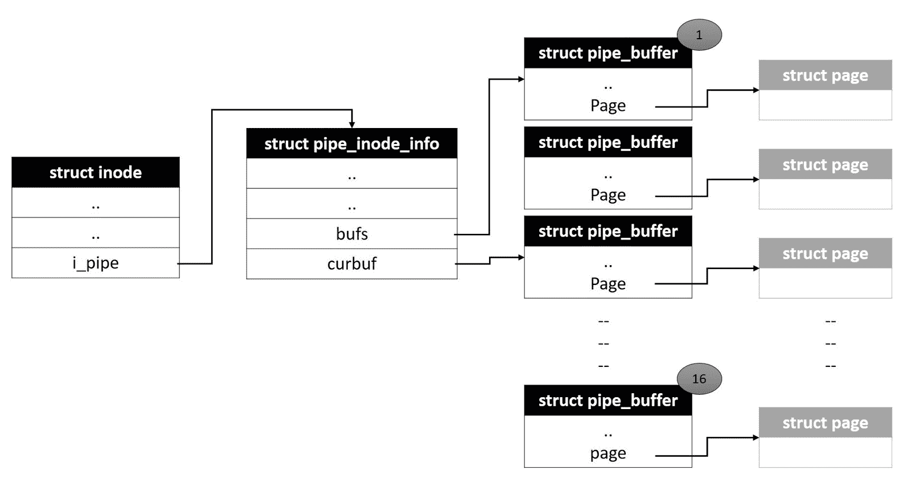
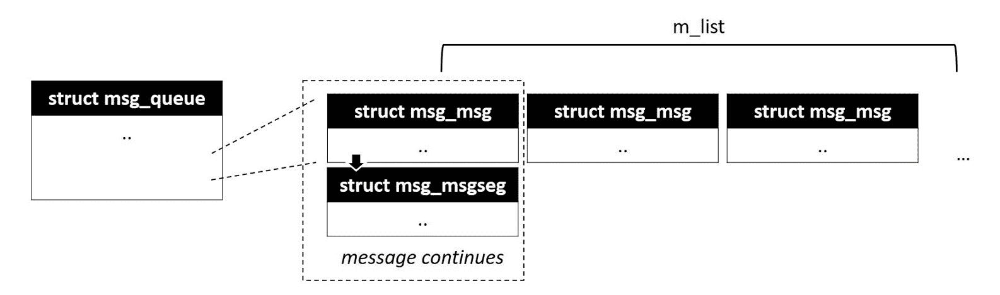
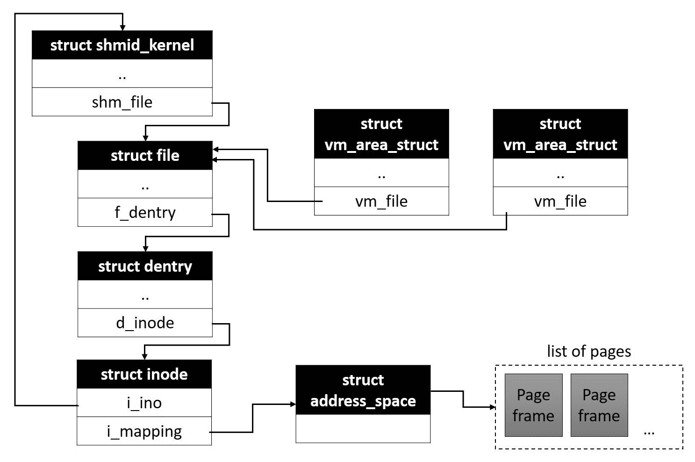
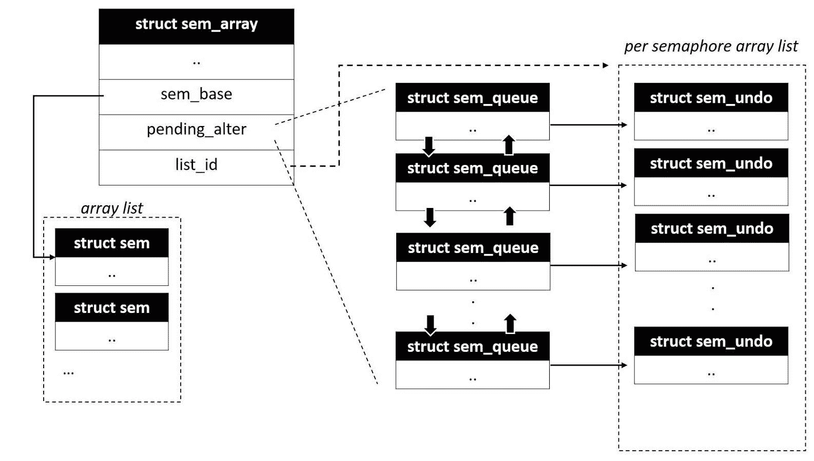

# 第六章：进程间通信

复杂的应用程序编程模型可能包括许多进程，每个进程都实现为处理特定的工作，这些工作共同为应用程序的最终功能做出贡献。根据目标、设计和应用程序所托管的环境，所涉及的进程可能是相关的（父子、兄弟）或无关的。通常，这些进程需要各种资源来进行通信、共享数据并同步它们的执行以实现期望的结果。这些资源由操作系统的内核作为称为**进程间通信**（**IPC**）的服务提供。我们已经讨论了信号作为 IPC 机制的使用；在本章中，我们将开始探索各种其他可用于进程通信和数据共享的资源。

在本章中，我们将涵盖以下主题：

+   管道和 FIFO 作为消息资源

+   SysV IPC 资源

+   POSX IPC 机制

# 管道和 FIFO

管道形成了进程之间基本的单向、自同步的通信方式。顾名思义，它们有两端：一个进程写入数据，另一个进程从另一端读取数据。在这种设置中，首先输入的数据将首先被读取。由于管道的有限容量，管道本身会导致通信同步：如果写入进程写入速度比读取进程读取速度快得多，管道的容量将无法容纳多余的数据，并且不可避免地阻塞写入进程，直到读取者读取并释放数据。同样，如果读取者读取数据的速度比写入者快，它将没有数据可供读取，因此会被阻塞，直到数据变得可用。

管道可以用作通信的消息资源，用于相关进程之间和无关进程之间的通信。当应用于相关进程之间时，管道被称为**未命名管道**，因为它们不被列为`rootfs`树下的文件。未命名管道可以通过`pipe()`API 分配。

```
int pipe2(int pipefd[2], int flags);
```

API 调用相应的系统调用，分配适当的数据结构并设置管道缓冲区。它映射一对文件描述符，一个用于在管道缓冲区上读取，另一个用于在管道缓冲区上写入。这些描述符将返回给调用者。调用者进程通常会 fork 子进程，子进程会继承可以用于消息传递的管道文件描述符。

以下代码摘录显示了管道系统调用的实现：

```
SYSCALL_DEFINE2(pipe2, int __user *, fildes, int, flags)
{
        struct file *files[2];
        int fd[2];
        int error;

        error = __do_pipe_flags(fd, files, flags);
        if (!error) {
                if (unlikely(copy_to_user(fildes, fd, sizeof(fd)))) {
                        fput(files[0]);
                        fput(files[1]);
                        put_unused_fd(fd[0]);
                        put_unused_fd(fd[1]);
                        error = -EFAULT;
                 } else {
                        fd_install(fd[0], files[0]);
                        fd_install(fd[1], files[1]);
                }
           }
           return error;
}
```

无关进程之间的通信需要将管道文件列入**rootfs**。这种管道通常被称为**命名管道**，可以通过命令行（`mkfifo`）或使用`mkfifo` API 的进程创建。

```
int mkfifo(const char *pathname, mode_t mode);
```

命名管道是使用指定的名称和适当的权限创建的，如模式参数所指定的那样。调用`mknod`系统调用来创建 FIFO，它在内部调用 VFS 例程来设置命名管道。具有访问权限的进程可以通过常见的 VFS 文件 API `open`、`read`、`write`和`close`在 FIFO 上启动操作。

# pipefs

管道和 FIFO 由一个名为`pipefs`的特殊文件系统创建和管理。它在 VFS 中注册为特殊文件系统。以下是来自`fs/pipe.c`的代码摘录：

```
static struct file_system_type pipe_fs_type = {
           .name = "pipefs",
           .mount = pipefs_mount,
           .kill_sb = kill_anon_super,
};

static int __init init_pipe_fs(void)
{
        int err = register_filesystem(&pipe_fs_type);

        if (!err) {
                pipe_mnt = kern_mount(&pipe_fs_type);
                if (IS_ERR(pipe_mnt)) {
                        err = PTR_ERR(pipe_mnt);
                        unregister_filesystem(&pipe_fs_type);
                }
      }
      return err;
}

fs_initcall(init_pipe_fs);
```

它通过列举代表每个管道的`inode`实例将管道文件集成到 VFS 中；这允许应用程序使用常见的文件 API `read`和`write`。`inode`结构包含了一组指针，这些指针与管道和设备文件等特殊文件相关。对于管道文件`inodes`，其中一个指针`i_pipe`被初始化为`pipefs`，定义为`pipe_inode_info`类型的实例。

```
struct inode {
        umode_t        i_mode;
        unsigned short i_opflags;
        kuid_t         i_uid;
        kgid_t         i_gid;
        unsigned int   i_flags;
        ...
        ...
        ...
         union {
                 struct pipe_inode_info *i_pipe;
                 struct block_device *i_bdev;
                 struct cdev *i_cdev;
                 char *i_link;
                 unsigned i_dir_seq;
         };
        ...
        ...
        ...
};
```

`struct pipe_inode_info`包含由`pipefs`定义的所有与管道相关的元数据，包括管道缓冲区的信息和其他重要的管理数据。此结构在`<linux/pipe_fs_i.h>`中定义。

```
struct pipe_inode_info {
        struct mutex mutex;  
        wait_queue_head_t wait;  
        unsigned int nrbufs, curbuf, buffers;
        unsigned int readers;
        unsigned int writers;
        unsigned int files;
        unsigned int waiting_writers;
        unsigned int r_counter;
        unsigned int w_counter;
        struct page *tmp_page;
        struct fasync_struct *fasync_readers;
        struct fasync_struct *fasync_writers;
        struct pipe_buffer *bufs;
        struct user_struct *user;
};
```

`bufs`指针指向管道缓冲区；每个管道默认分配总缓冲区大小为 65,535 字节（64k），排列为 16 页的循环数组。用户进程可以通过管道描述符上的`fcntl()`操作改变管道缓冲区的总大小。管道缓冲区的默认最大限制为 1,048,576 字节，可以通过特权进程通过`/proc/sys/fs/pipe-max-size`文件接口进行更改。以下是一个总结表，描述了其他重要元素：

| **名称** | **描述** |
| --- | --- |
| `mutex` | 保护管道的排他锁 |
| `wait` | 读取者和写入者的等待队列 |
| `nrbufs` | 此管道的非空管道缓冲区计数 |
| `curbuf` | 当前管道缓冲区 |
| `buffers` | 缓冲区的总数 |
| `readers` | 当前读取者的数量 |
| `writers` | 当前写入者的数量 |
| `files` | 当前引用此管道的 struct 文件实例的数量 |
| `waiting_writers` | 当前在管道上阻塞的写入者数量 |
| `r_coutner` | 读取者计数器（FIFO 相关） |
| `w_counter` | 写入者计数器（FIFO 相关） |
| `*fasync_readers` | 读取者端的 fasync |
| `*fasync_writers` | 写入者端的 fasync |
| `*bufs` | 指向管道缓冲区的循环数组的指针 |
| `*user` | 指向表示创建此管道的用户的`user_struct`实例的指针 |

对管道缓冲区的每个页面的引用被封装到*类型*`struct pipe_buffer`的实例的循环数组中。此结构在`<linux/pipe_fs_i.h>`中定义。

```
struct pipe_buffer {
        struct page *page;    
        unsigned int offset, len;
        const struct pipe_buf_operations *ops;
        unsigned int flags;
        unsigned long private;
};
```

`*page`是指向页面缓冲区的页面描述符的指针，`offset`和`len`字段包含页面缓冲区中数据的偏移量和长度。`*ops`是指向`pipe_buf_operations`类型的结构的指针，它封装了`pipefs`实现的管道缓冲区操作。它还实现了绑定到管道和 FIFO 索引节点的文件操作：

```
const struct file_operations pipefifo_fops = {
         .open = fifo_open,
         .llseek = no_llseek,
         .read_iter = pipe_read,
         .write_iter = pipe_write,
         .poll = pipe_poll,
         .unlocked_ioctl = pipe_ioctl,
         .release = pipe_release,
         .fasync = pipe_fasync,
};
```



# 消息队列

**消息队列**是消息缓冲区的列表，通过它可以进行任意数量的进程通信。与管道不同，写入者无需等待读取者打开管道并监听数据。类似于邮箱，写入者可以将包含在缓冲区中的固定长度消息放入队列中，读取者可以在准备好时随时提取。消息队列在读取者提取后不保留消息包，这意味着每个消息包都是进程持久的。Linux 支持两种不同的消息队列实现：经典的 Unix SYSV 消息队列和当代的 POSIX 消息队列。

# System V 消息队列

这是经典的 AT&T 消息队列实现，适用于任意数量的不相关进程之间的消息传递。发送进程将每条消息封装成一个包，其中包含消息数据和消息编号。消息队列的实现不定义消息编号的含义，而是由应用程序设计者定义消息编号和程序读者和写者解释相同的适当含义。这种机制为程序员提供了灵活性，可以将消息编号用作消息 ID 或接收者 ID。它使读取进程能够选择性地读取与特定 ID 匹配的消息。但是，具有相同 ID 的消息始终按照 FIFO 顺序（先进先出）读取。

进程可以使用以下命令创建和打开 SysV 消息队列：

```
 int msgget(key_t key, int msgflg);
```

`key`参数是一个唯一的常数，用作魔术数字来标识消息队列。所有需要访问此消息队列的程序都需要使用相同的魔术数字；这个数字通常在编译时硬编码到相关进程中。但是，应用程序需要确保每个消息队列的键值是唯一的，并且有可通过其动态生成唯一键的替代库函数。

如果将唯一键和`msgflag`参数值设置为`IPC_CREATE`，将会建立一个新的消息队列。有权访问队列的有效进程可以使用`msgsnd`和`msgrcv`例程向队列中读取或写入消息（我们这里不会详细讨论它们；请参考 Linux 系统编程手册）：

```
int msgsnd(int msqid, const void *msgp, size_t msgsz, int msgflg);

ssize_t msgrcv(int msqid, void *msgp, size_t msgsz, long msgtyp,
               int msgflg);
```

# 数据结构

每个消息队列都是通过底层 SysV IPC 子系统枚举一组数据结构来创建的。`struct msg_queue`是核心数据结构，每个消息队列都会枚举一个该结构的实例：

```

struct msg_queue {
        struct kern_ipc_perm q_perm;
        time_t q_stime; /* last msgsnd time */
        time_t q_rtime; /* last msgrcv time */
        time_t q_ctime; /* last change time */
        unsigned long q_cbytes; /* current number of bytes on queue */
        unsigned long q_qnum; /* number of messages in queue */
        unsigned long q_qbytes; /* max number of bytes on queue */
        pid_t q_lspid; /* pid of last msgsnd */
        pid_t q_lrpid; /* last receive pid */

       struct list_head q_messages; /* message list */
       struct list_head q_receivers;/* reader process list */
       struct list_head q_senders;  /*writer process list */
};
```

`q_messages`字段表示双向循环链表的头节点，该链表包含当前队列中的所有消息。每条消息以标头开头，后跟消息数据；每条消息可以根据消息数据的长度占用一个或多个页面。消息标头始终位于第一页的开头，并由`struct msg_msg`的一个实例表示：

```
/* one msg_msg structure for each message */
struct msg_msg {
        struct list_head m_list;
        long m_type;
        size_t m_ts; /* message text size */
        struct msg_msgseg *next;
        void *security;
       /* the actual message follows immediately */
};
```

`m_list`字段包含队列中前一条和后一条消息的指针。`*next`指针指向`struct msg_msgseg`的一个实例，该实例包含消息数据的下一页的地址。当消息数据超过第一页时，此指针才相关。第二页框架以`msg_msgseg`描述符开头，该描述符进一步包含指向后续页面的指针，这种顺序一直持续到消息数据的最后一页：

```
struct msg_msgseg {
        struct msg_msgseg *next;
        /* the next part of the message follows immediately */
};
```



# POSIX 消息队列

POSIX 消息队列实现了按优先级排序的消息。发送进程写入的每条消息都与一个整数相关联，该整数被解释为消息优先级；数字越大的消息被认为优先级越高。消息队列按优先级对当前消息进行排序，并按降序（优先级最高的先）将它们传递给读取进程。该实现还支持更广泛的 API 接口，包括有界等待发送和接收操作，以及通过信号或线程进行异步消息到达通知的接收者。

该实现提供了一个独特的 API 接口来创建、打开、读取、写入和销毁消息队列。以下是 API 的摘要描述（我们这里不会讨论使用语义，请参考系统编程手册了解更多细节）：

| **API 接口** | **描述** |
| --- | --- |
| `mq_open()` | 创建或打开一个 POSIX 消息队列 |
| `mq_send()` | 将消息写入队列 |
| `mq_timedsend()` | 类似于`mq_send`，但具有用于有界操作的超时参数 |
| `mq_receive()` | 从队列中获取消息；这个操作可以在无界阻塞调用上执行 |
| `mq_timedreceive()` | 类似于`mq_receive()`，但具有限制可能阻塞一段时间的超时参数 |
| `mq_close()` | 关闭消息队列 |
| `mq_unlink()` | 销毁消息队列 |
| `mq_notify()` | 自定义和设置消息到达通知 |
| `mq_getattr()` | 获取与消息队列关联的属性 |
| `mq_setattr()` | 设置消息队列上指定的属性 |

POSIX 消息队列由一个名为`mqueue`的特殊文件系统管理。每个消息队列都由文件名标识。每个队列的元数据由`mqueue_inode_info`结构的一个实例描述，该结构表示与`mqueue`文件系统中消息队列文件关联的 inode 对象：

```
struct mqueue_inode_info {
        spinlock_t lock;
        struct inode vfs_inode;
        wait_queue_head_t wait_q;

        struct rb_root msg_tree;
        struct posix_msg_tree_node *node_cache;
        struct mq_attr attr;

        struct sigevent notify;
        struct pid *notify_owner;
        struct user_namespace *notify_user_ns;
        struct user_struct *user; /* user who created, for accounting */
        struct sock *notify_sock;
        struct sk_buff *notify_cookie;

        /* for tasks waiting for free space and messages, respectively */
        struct ext_wait_queue e_wait_q[2];

        unsigned long qsize; /* size of queue in memory (sum of all msgs) */
};
```

`*node_cache`指针指向包含消息节点链表头的`posix_msg_tree_node`描述符，其中每条消息由`msg_msg`类型的描述符表示：

```

 struct posix_msg_tree_node {
         struct rb_node rb_node;
         struct list_head msg_list;
         int priority;
};
```

# 共享内存

与提供进程持久消息基础设施的消息队列不同，IPC 的共享内存服务提供了可以被任意数量的共享相同数据的进程附加的内核持久内存。共享内存基础设施提供了用于分配、附加、分离和销毁共享内存区域的操作接口。需要访问共享数据的进程将共享内存区域*附加*或*映射*到其地址空间中；然后它可以通过映射例程返回的地址访问共享内存中的数据。这使得共享内存成为 IPC 的最快手段之一，因为从进程的角度来看，它类似于访问本地内存，不涉及切换到内核模式。

# System V 共享内存

Linux 支持 IPC 子系统下的传统 SysV 共享内存实现。与 SysV 消息队列类似，每个共享内存区域都由唯一的 IPC 标识符标识。

# 操作接口

内核为启动共享内存操作提供了不同的系统调用接口，如下所示：

# 分配共享内存

进程通过调用`shmget()`系统调用来获取共享内存区域的 IPC 标识符；如果该区域不存在，则创建一个：

```
int shmget(key_t key, size_t size, int shmflg);
```

此函数返回与*key*参数中包含的值对应的共享内存段的标识符。如果其他进程打算使用现有段，它们可以在查找其标识符时使用段的*key*值。但是，如果*key*参数是唯一的或具有值`IPC_PRIVATE`，则会创建一个新段。`size`表示需要分配的字节数，因为段是分配为内存页面。要分配的页面数是通过将*size*值四舍五入到页面大小的最近倍数来获得的。

`shmflg`标志指定了如何创建段。它可以包含两个值：

+   `IPC_CREATE`：这表示创建一个新段。如果未使用此标志，则找到与键值关联的段，并且如果用户具有访问权限，则返回段的标识符。

+   `IPC_EXCL`：此标志始终与`IPC_CREAT`一起使用，以确保如果*key*值存在，则调用失败。

# 附加共享内存

共享内存区域必须附加到其地址空间，进程才能访问它。调用`shmat()`将共享内存附加到调用进程的地址空间：

```
void *shmat(int shmid, const void *shmaddr, int shmflg);
```

此函数附加了由`shmid`指示的段。`shmaddr`指定了一个指针，指示了段要映射到的进程地址空间中的位置。第三个参数`shmflg`是一个标志，可以是以下之一：

+   `SHM_RND`：当`shmaddr`不是 NULL 值时指定，表示函数将在地址处附加段，该地址由将`shmaddr`值四舍五入到页面大小的最近倍数计算得出；否则，用户必须确保`shmaddr`是页面对齐的，以便正确附加段。

+   `SHM_RDONLY`：这是指定如果用户具有必要的读权限，则段将仅被读取。否则，为段提供读写访问权限（进程必须具有相应的权限）。

+   `SHM_REMAP`：这是一个特定于 Linux 的标志，表示在由`shmaddr`指定的地址处的任何现有映射将被新映射替换。

# 分离共享内存

同样，要将共享内存从进程地址空间分离出来，会调用`shmdt()`。由于 IPC 共享内存区域在内核中是持久的，它们在进程分离后仍然存在：

```
int shmdt(const void *shmaddr);
```

由`shmaddr`指定的段从调用进程的地址空间中分离出来。

这些接口操作中的每一个都调用了`<ipc/shm.c>`源文件中实现的相关系统调用。

# 数据结构

每个共享内存段都由`struct shmid_kernel`描述符表示。该结构包含了与 SysV 共享内存管理相关的所有元数据：

```
struct shmid_kernel /* private to the kernel */
{
        struct kern_ipc_perm shm_perm;
        struct file *shm_file; /* pointer to shared memory file */
        unsigned long shm_nattch; /* no of attached process */
        unsigned long shm_segsz; /* index into the segment */
        time_t shm_atim; /* last access time */
        time_t shm_dtim; /* last detach time */
        time_t shm_ctim; /* last change time */
        pid_t shm_cprid; /* pid of creating process */
        pid_t shm_lprid; /* pid of last access */
        struct user_struct *mlock_user;

        /* The task created the shm object. NULL if the task is dead. */
        struct task_struct *shm_creator; 
        struct list_head shm_clist; /* list by creator */
};

```

为了可靠性和便于管理，内核的 IPC 子系统通过一个名为`shmfs`的特殊文件系统管理共享内存段。这个文件系统没有挂载到 rootfs 树上；它的操作只能通过 SysV 共享内存系统调用来访问。`*shm_file`指针指向`shmfs`的`struct file`对象，表示一个共享内存块。当一个进程启动附加操作时，底层系统调用会调用`do_mmap()`来在调用者的地址空间中创建相关映射（通过`struct vm_area_struct`），并进入`*shmfs-*`定义的`shm_mmap()`操作来映射相应的共享内存：



# POSIX 共享内存

Linux 内核通过一个名为`tmpfs`的特殊文件系统支持 POSIX 共享内存，该文件系统挂载到`rootfs`的`/dev/shm`上。这种实现提供了一个与 Unix 文件模型一致的独特 API，导致每个共享内存分配都由唯一的文件名和 inode 表示。这个接口被应用程序员认为更加灵活，因为它允许使用标准的 POSIX 文件映射例程`mmap()`和`unmap()`将内存段附加到调用进程的地址空间和分离出来。

以下是接口例程的摘要描述：

| **API** | **描述** |
| --- | --- |
| `shm_open()` | 创建并打开由文件名标识的共享内存段 |
| `mmap()` | POSIX 标准文件映射接口，用于将共享内存附加到调用者的地址空间 |
| `sh_unlink()` | 销毁指定的共享内存块 |
| `unmap()` | 从调用者地址空间分离指定的共享内存映射 |

底层实现与 SysV 共享内存类似，不同之处在于映射实现由`tmpfs`文件系统处理。

尽管共享内存是共享常用数据或资源的最简单方式，但它将实现同步的负担转嫁给了进程，因为共享内存基础设施不提供任何数据或资源的同步或保护机制。应用程序设计者必须考虑在竞争进程之间同步共享内存访问，以确保共享数据的可靠性和有效性，例如，防止两个进程同时在同一区域进行可能的写操作，限制读取进程等待直到另一个进程完成写操作等。通常，为了同步这种竞争条件，还会使用另一种 IPC 资源，称为信号量。

# 信号量

**信号量**是 IPC 子系统提供的同步原语。它们为多线程环境中的进程提供了对共享数据结构或资源的并发访问的保护机制。在其核心，每个信号量由一个可以被调用进程原子访问的整数计数器组成。信号量实现提供了两种操作，一种用于等待信号量变量，另一种用于发出信号量变量。换句话说，等待信号量会将计数器减 1，发出信号量会将计数器加 1。通常，当一个进程想要访问一个共享资源时，它会尝试减少信号量计数器。然而，内核会处理这个尝试，因为它会阻塞尝试的进程，直到计数器产生一个正值。类似地，当一个进程放弃资源时，它会增加信号量计数器，这会唤醒正在等待资源的任何进程。

**信号量版本**

传统上所有的 `*nix` 系统都实现了 System V 信号量机制；然而，POSIX 有自己的信号量实现，旨在实现可移植性并解决 System V 版本存在的一些笨拙问题。让我们先来看看 System V 信号量。

# System V 信号量

在 System V 中，信号量不仅仅是一个单一的计数器，而是一组计数器。这意味着一个信号量集合可以包含单个或多个计数器（0 到 n）并具有相同的信号量 ID。集合中的每个计数器可以保护一个共享资源，而单个信号量集合可以保护多个资源。用于创建这种类型信号量的系统调用如下：

```
int semget(key_t key, int nsems, int semflg)
```

+   `key` 用于标识信号量。如果键值为 `IPC_PRIVATE`，则创建一个新的信号量集合。

+   `nsems` 表示需要在集合中的信号量数量

+   `semflg` 指示应该如何创建信号量。它可以包含两个值：

+   `IPC_CREATE:` 如果键不存在，则创建一个新的信号量

+   `IPC_EXCL:` 如果键存在，则抛出错误并失败

成功时，调用返回信号量集合标识符（一个正值）。

因此，创建的信号量包含未初始化的值，并需要使用 `semctl()` 函数进行初始化。初始化后，进程可以使用信号量集合：

```
int semop(int semid, struct sembuf *sops, unsigned nsops);
```

`Semop()` 函数允许进程对信号量集合进行操作。这个函数提供了一种独特的 SysV 信号量实现所特有的 **可撤销操作**，通过一个名为 `SEM_UNDO` 的特殊标志。当设置了这个标志时，内核允许在进程在完成相关的共享数据访问操作之前中止时，将信号量恢复到一致的状态。例如，考虑这样一种情况：其中一个进程锁定了信号量并开始对共享数据进行访问操作；在此期间，如果进程在完成共享数据访问之前中止，那么信号量将处于不一致的状态，使其对其他竞争进程不可用。然而，如果进程通过在 `semop()` 中设置 `SEM_UNDO` 标志来获取信号量的锁定，那么它的终止将允许内核将信号量恢复到一致的状态（解锁状态），使其对等待的其他竞争进程可用。

# 数据结构

每个 SysV 信号量集合在内核中由 `struct sem_array` 类型的描述符表示：

```
/* One sem_array data structure for each set of semaphores in the system. */
struct sem_array {
        struct kern_ipc_perm ____cacheline_aligned_in_smp sem_perm;                                                                           
        time_t sem_ctime;               /* last change time */
        struct sem *sem_base;           /*ptr to first semaphore in array */
        struct list_head pending_alter; /* pending operations */
                                        /* that alter the array */
        struct list_head pending_const; /* pending complex operations */
                                        /* that do not alter semvals */
        struct list_head list_id;       /* undo requests on this array */
        int sem_nsems;                  /* no. of semaphores in array */
        int complex_count;              /* pending complex operations */
        bool complex_mode;              /* no parallel simple ops */
   };

```

数组中的每个信号量都被列举为 `<ipc/sem.c>` 中定义的 `struct sem` 的实例；`*sem_base` 指针指向集合中的第一个信号量对象。每个信号量集合包含一个等待队列的挂起队列列表；`pending_alter` 是这个挂起队列的头节点，类型为 `struct sem_queue`。每个信号量集合还包含每个信号量可撤销的操作。`list_id` 是指向 `struct sem_undo` 实例列表的头节点；列表中每个信号量都有一个实例。以下图表总结了信号量集合数据结构及其列表：



# POSIX 信号量

与 System V 相比，POSIX 信号量语义相对简单。每个信号量都是一个简单的计数器，永远不会小于零。实现提供了用于初始化、增加和减少操作的函数接口。它们可以通过在所有线程都可以访问的内存中分配信号量实例来用于同步线程。它们也可以通过将信号量放置在共享内存中来用于同步进程。Linux 对 POSIX 信号量的实现经过优化，以提供更好的性能，用于非竞争同步场景。

POSIX 信号量有两种变体：命名信号量和无名信号量。命名信号量由文件名标识，适用于不相关进程之间的使用。无名信号量只是`sem_t`类型的全局实例；一般情况下，这种形式更适合在线程之间使用。POSIX 信号量接口操作是 POSIX 线程库实现的一部分。

| **函数接口** | **描述** |
| --- | --- |
| `sem_open()` | 打开现有的命名信号量文件或创建一个新的命名信号量并返回其描述符 |
| `sem_init()` | 无名信号量的初始化程序 |
| `sem_post()` | 增加信号量的操作 |
| `sem_wait()` | 减少信号量的操作，如果在信号量值为零时调用，则会阻塞 |
| `sem_timedwait()` | 用有界等待的超时参数扩展`sem_wait()` |
| `sem_getvalue()` | 返回信号量计数器的当前值 |
| `sem_unlink()` | 通过文件标识符移除命名信号量 |

# 摘要

在本章中，我们涉及了内核提供的各种 IPC 机制。我们探讨了每种机制的各种数据结构的布局和关系，并且还研究了 SysV 和 POSIX IPC 机制。

在下一章中，我们将进一步讨论锁定和内核同步机制。
