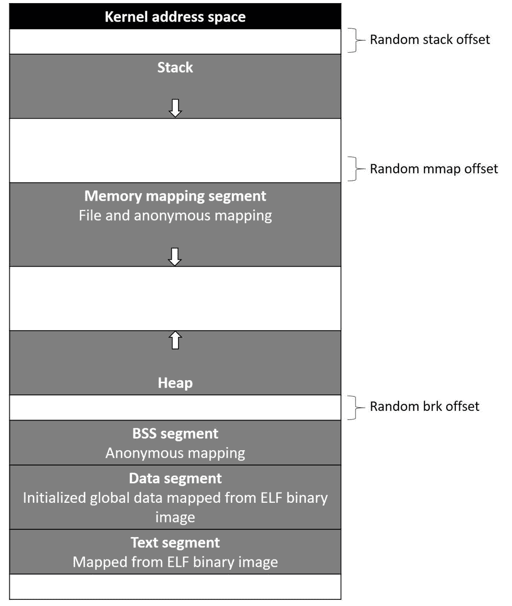
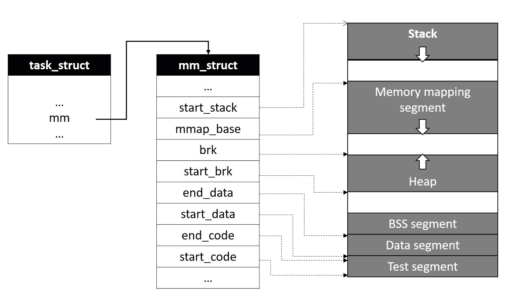
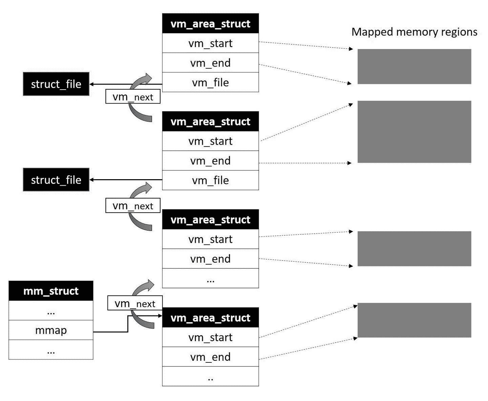
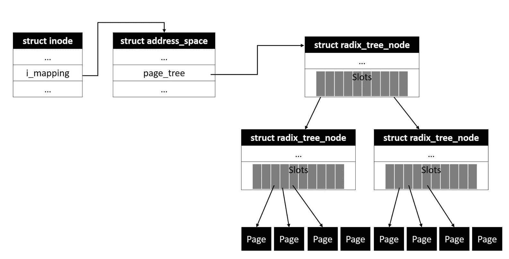
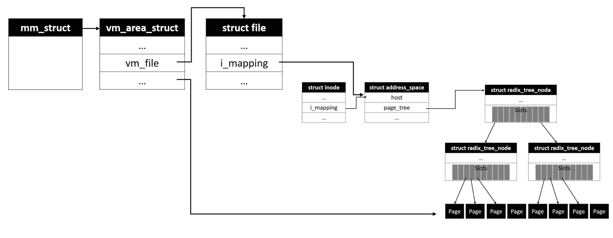
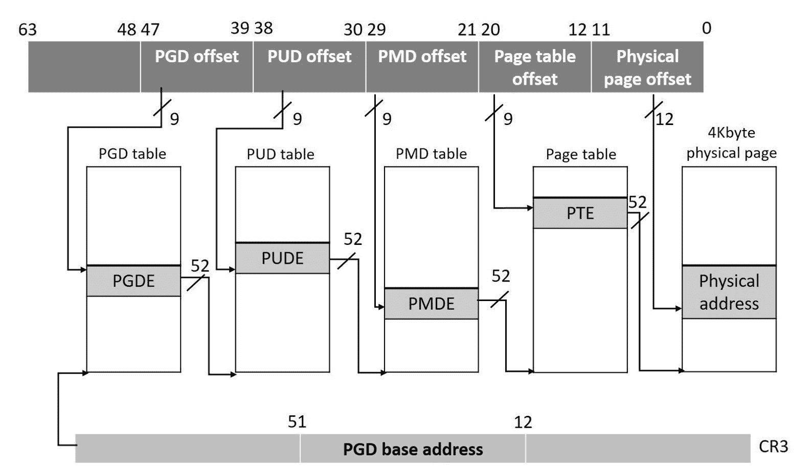

# 第七章：虚拟内存管理

在第一章中，我们简要讨论了一个重要的抽象概念，称为*进程*。我们已经讨论了进程虚拟地址空间及其隔离，并且已经深入了解了涉及物理内存管理的各种数据结构和算法。在本章中，让我们通过虚拟内存管理和页表的详细信息来扩展我们对内存管理的讨论。我们将研究虚拟内存子系统的以下方面：

+   进程虚拟地址空间及其段

+   内存描述符结构

+   内存映射和 VMA 对象

+   文件支持的内存映射

+   页缓存

+   使用页表进行地址转换

# 进程地址空间

以下图表描述了 Linux 系统中典型进程地址空间的布局，由一组虚拟内存段组成：



每个段都被物理映射到一个或多个线性内存块（由一个或多个页面组成），并且适当的地址转换记录被放置在进程页表中。在我们深入了解内核如何管理内存映射和构建页表的完整细节之前，让我们简要了解一下地址空间的每个段：

+   **栈**是最顶部的段，向下扩展。它包含**栈帧**，用于保存局部变量和函数参数；在调用函数时，在栈顶创建一个新的帧，在当前函数返回时销毁。根据函数调用的嵌套级别，栈段始终需要动态扩展以容纳新的帧。这种扩展由虚拟内存管理器通过**页错误**处理：当进程尝试触及栈顶的未映射地址时，系统触发页错误，由内核处理以检查是否适合扩展栈。如果当前栈利用率在`RLIMIT_STACK`范围内，则认为适合扩展栈。然而，如果当前利用率已达到最大值，没有进一步扩展的空间，那么会向进程发送段错误信号。

+   **Mmap**是栈下面的一个段；这个段主要用于将文件数据从页缓存映射到进程地址空间。这个段也用于映射共享对象或动态库。用户模式进程可以通过`mmap()`API 启动新的映射。Linux 内核还支持通过这个段进行匿名内存映射，这是一种用于存储进程数据的动态内存分配的替代机制。

+   **堆**段提供了动态内存分配的地址空间，允许进程存储运行时数据。内核提供了`brk()`系列 API，通过它用户模式进程可以在运行时扩展或收缩堆。然而，大多数编程语言特定的标准库实现了堆管理算法，以有效利用堆内存。例如，GNU glibc 实现了堆管理，提供了`malloc()`系列函数进行分配。

地址空间的较低段--**BSS**、**Data**和**Text**--与进程的二进制映像相关：

+   **BSS**存储**未初始化**的静态变量，这些变量的值在程序代码中未初始化。BSS 是通过匿名内存映射设置的。

+   **数据**段包含在程序源代码中初始化的全局和静态变量。这个段通过映射包含初始化数据的程序二进制映像的部分来枚举；这种映射是以**私有内存映射**类型创建的，确保对数据变量内存的更改不会反映在磁盘文件上。

+   **文本**段也通过从内存映射程序二进制文件来枚举；这种映射的类型是`RDONLY`，试图写入此段将触发分段错误。

内核支持地址空间随机化功能，如果在构建过程中启用，允许 VM 子系统为每个新进程随机化**堆栈**、**mmap**和**堆**段的起始位置。这为进程提供了免受恶意程序注入故障的安全性。黑客程序通常使用固定的有效进程内存段的起始地址进行硬编码；通过地址空间随机化，这种恶意攻击将失败。然而，从应用程序的二进制文件枚举的文本段被映射到固定地址，根据底层架构的定义，这被配置到链接器脚本中，在构建程序二进制文件时应用。

# 进程内存描述符

内核在内存描述符结构中维护了有关进程内存段和相应翻译表的所有信息，该结构的类型为`struct mm_struct`。进程描述符结构`task_struct`包含指向进程内存描述符的指针`*mm`。我们将讨论内存描述符结构的一些重要元素：

```
struct mm_struct {
               struct vm_area_struct *mmap; /* list of VMAs */
               struct rb_root mm_rb;
               u32 vmacache_seqnum; /* per-thread vmacache */
#ifdef CONFIG_MMU
             unsigned long (*get_unmapped_area) (struct file *filp, unsigned long addr, unsigned long len,
                                                                                                    unsigned long pgoff, unsigned long flags);
 #endif
            unsigned long mmap_base;               /* base of mmap area */
            unsigned long mmap_legacy_base;  /* base of mmap area in bottom-up allocations */
            unsigned long task_size;                   /* size of task vm space */
            unsigned long highest_vm_end;      /* highest vma end address */
            pgd_t * pgd;  
            atomic_t mm_users;           /* How many users with user space? */
            atomic_t mm_count;           /* How many references to "struct mm_struct" (users count as 1) */
            atomic_long_t nr_ptes;      /* PTE page table pages */
 #if CONFIG_PGTABLE_LEVELS > 2
           atomic_long_t nr_pmds;      /* PMD page table pages */
 #endif
           int map_count;                           /* number of VMAs */
         spinlock_t page_table_lock;      /* Protects page tables and some counters */
         struct rw_semaphore mmap_sem;

       struct list_head mmlist;      /* List of maybe swapped mm's. These are globally strung
                                                         * together off init_mm.mmlist, and are protected
                                                         * by mmlist_lock
                                                         */
        unsigned long hiwater_rss;     /* High-watermark of RSS usage */
         unsigned long hiwater_vm;     /* High-water virtual memory usage */
        unsigned long total_vm;          /* Total pages mapped */
         unsigned long locked_vm;       /* Pages that have PG_mlocked set */
         unsigned long pinned_vm;      /* Refcount permanently increased */
         unsigned long data_vm;          /* VM_WRITE & ~VM_SHARED & ~VM_STACK */
        unsigned long exec_vm;          /* VM_EXEC & ~VM_WRITE & ~VM_STACK */
         unsigned long stack_vm;         /* VM_STACK */
         unsigned long def_flags;
         unsigned long start_code, end_code, start_data, end_data;
         unsigned long start_brk, brk, start_stack;
         unsigned long arg_start, arg_end, env_start, env_end;
        unsigned long saved_auxv[AT_VECTOR_SIZE];               /* for /proc/PID/auxv */
/*
 * Special counters, in some configurations protected by the
 * page_table_lock, in other configurations by being atomic.
 */
        struct mm_rss_stat rss_stat;
      struct linux_binfmt *binfmt;
      cpumask_var_t cpu_vm_mask_var;
 /* Architecture-specific MM context */
        mm_context_t context;
      unsigned long flags;                   /* Must use atomic bitops to access the bits */
      struct core_state *core_state;   /* core dumping support */
       ...
      ...
      ...
 };
```

`mmap_base`指的是虚拟地址空间中 mmap 段的起始位置，`task_size`包含虚拟内存空间中任务的总大小。`mm_users`是一个原子计数器，保存共享此内存描述符的 LWP 的计数，`mm_count`保存当前使用此描述符的进程数，并且 VM 子系统确保只有在`mm_count`为零时才释放内存描述符结构。`start_code`和`end_code`字段包含从程序的二进制文件映射的代码块的起始和结束虚拟地址。类似地，`start_data`和`end_data`标记了从程序的二进制文件映射的初始化数据区域的开始和结束。

`start_brk`和`brk`字段表示堆段的起始和当前结束地址；虽然`start_brk`在整个进程生命周期中保持不变，但`brk`在分配和释放堆内存时会重新定位。因此，在特定时刻活动堆的总大小是`start_brk`和`brk`字段之间内存的大小。元素`arg_start`和`arg_end`包含命令行参数列表的位置，`env_start`和`env_end`包含环境变量的起始和结束位置：



在虚拟地址空间中映射到段的每个线性内存区域都通过类型为`struct vm_area_struct`的描述符表示。每个 VM 区域区域都映射有包含起始和结束虚拟地址以及其他属性的虚拟地址间隔。VM 子系统维护一个表示当前区域的`vm_area_struct(VMA)`节点的链表；此列表按升序排序，第一个节点表示起始虚拟地址间隔，后面的节点包含下一个地址间隔，依此类推。内存描述符结构包括一个指针`*mmap`，它指向当前映射的 VM 区域列表。

VM 子系统在执行对 VM 区域的各种操作时需要扫描`vm_area`列表，例如在映射地址间隔内查找特定地址，或附加表示新映射的新 VMA 实例。这样的操作可能耗时且低效，特别是对于大量区域映射到列表的情况。为了解决这个问题，VM 子系统维护了一个红黑树，用于高效访问`vm_area`对象。内存描述符结构包括红黑树的根节点`mm_rb`。通过这种安排，可以通过搜索红黑树来快速附加新的 VM 区域，而无需显式扫描链接列表。

`struct vm_area_struct` 在内核头文件`<linux/mm_types.h>`中定义：

```
/*
  * This struct defines a memory VMM memory area. There is one of these
  * per VM-area/task. A VM area is any part of the process virtual memory
  * space that has a special rule for the page-fault handlers (ie a shared
  * library, the executable area etc).
  */
 struct vm_area_struct {
               /* The first cache line has the info for VMA tree walking. */
              unsigned long vm_start; /* Our start address within vm_mm. */
               unsigned long vm_end; /* The first byte after our end address within vm_mm. */
              /* linked list of VM areas per task, sorted by address */
               struct vm_area_struct *vm_next, *vm_prev;
               struct rb_node vm_rb;
               /*
                 * Largest free memory gap in bytes to the left of this VMA.
                 * Either between this VMA and vma->vm_prev, or between one of the
                 * VMAs below us in the VMA rbtree and its ->vm_prev. This helps
                 * get_unmapped_area find a free area of the right size.
                */
                 unsigned long rb_subtree_gap;
              /* Second cache line starts here. */
               struct mm_struct   *vm_mm; /* The address space we belong to. */
                pgprot_t  vm_page_prot;       /* Access permissions of this VMA. */
                unsigned long vm_flags;        /* Flags, see mm.h. */
              /*
                 * For areas with an address space and backing store,
                 * linkage into the address_space->i_mmap interval tree.
                 */
                struct {
                              struct rb_node rb;
                              unsigned long rb_subtree_last;
                           } shared;
         /*
                 * A file's MAP_PRIVATE vma can be in both i_mmap tree and anon_vma
                 * list, after a COW of one of the file pages. A MAP_SHARED vma
                 * can only be in the i_mmap tree. An anonymous MAP_PRIVATE, stack
                 * or brk vma (with NULL file) can only be in an anon_vma list.
          */
            struct list_head anon_vma_chain; /* Serialized by mmap_sem & page_table_lock */
           struct anon_vma *anon_vma;        /* Serialized by page_table_lock */
            /* Function pointers to deal with this struct. */
            const struct vm_operations_struct *vm_ops;
            /* Information about our backing store: */
            unsigned long vm_pgoff; /* Offset (within vm_file) in PAGE_SIZE units */
            struct file * vm_file; /* File we map to (can be NULL). */
            void * vm_private_data; /* was vm_pte (shared mem) */
#ifndef CONFIG_MMU
          struct vm_region *vm_region; /* NOMMU mapping region */
 #endif
 #ifdef CONFIG_NUMA
         struct mempolicy *vm_policy; /* NUMA policy for the VMA */
 #endif
        struct vm_userfaultfd_ctx vm_userfaultfd_ctx;
 };
```

`vm_start` 包含区域的起始虚拟地址（较低地址），即映射的第一个有效字节的地址，`vm_end` 包含映射区域之外的第一个字节的虚拟地址（较高地址）。因此，可以通过从`vm_start`减去`vm_end`来计算映射内存区域的长度。指针`*vm_next` 和 `*vm_prev` 指向下一个和上一个 VMA 列表，而`vm_rb` 元素用于表示红黑树下的这个 VMA。指针`*vm_mm` 指回进程内存描述符结构。

`vm_page_prot` 包含区域中页面的访问权限。`vm_flags` 是一个位字段，包含映射区域内存的属性。标志位在内核头文件`<linux/mm.h>`中定义。

| **标志位** | **描述** |
| --- | --- |
| `VM_NONE` | 表示非活动映射。 |
| `VM_READ` | 如果设置，映射区域中的页面是可读的。 |
| `VM_WRITE` | 如果设置，映射区域中的页面是可写的。 |
| `VM_EXEC` | 设置为将内存区域标记为可执行。包含可执行指令的内存块与`VM_READ`一起设置此标志。 |
| `VM_SHARED` | 如果设置，映射区域中的页面是共享的。 |
| `VM_MAYREAD` | 用于指示当前映射区域可以设置`VM_READ`。此标志用于`mprotect()`系统调用。 |
| `VM_MAYWRITE` | 用于指示当前映射区域可以设置`VM_WRITE`。此标志用于`mprotect()`系统调用。 |
| `VM_MAYEXEC` | 用于指示当前映射区域可以设置`VM_EXEC`。此标志用于`mprotect()`系统调用。 |
| `VM_GROWSDOWN` | 映射可以向下增长；堆栈段被分配了这个标志。 |
| `VM_UFFD_MISSING` | 设置此标志以指示 VM 子系统为此映射启用了`userfaultfd`，并设置为跟踪页面丢失故障。 |
| `VM_PFNMAP` | 设置此标志以指示内存区域是通过 PFN 跟踪页面映射的，而不是具有页面描述符的常规页面帧。 |
| `VM_DENYWRITE` | 设置以指示当前文件映射不可写。 |
| `VM_UFFD_WP` | 设置此标志以指示 VM 子系统为此映射启用了`userfaultfd`，并设置为跟踪写保护故障。 |
| `VM_LOCKED` | 当映射内存区域中的相应页面被锁定时设置。 |
| `VM_IO` | 当设备 I/O 区域被映射时设置。 |
| `VM_SEQ_READ` | 当进程声明其意图以顺序方式访问映射区域内的内存区域时设置。 |
| `VM_RAND_READ` | 当进程声明其意图在映射区域内以随机方式访问内存区域时设置。 |
| `VM_DONTCOPY` | 设置以指示 VM 在`fork()`上禁用复制此 VMA。 |
| `VM_DONTEXPAND` | 设置以指示当前映射在`mremap()`上不能扩展。 |
| `VM_LOCKONFAULT` | 当进程使用`mlock2()`系统调用启用`MLOCK_ONFAULT`时，当页面被故障时锁定内存映射中的页面。设置此标志。 |
| `VM_ACCOUNT` | VM 子系统执行额外的检查，以确保在对具有此标志的 VMA 执行操作时有可用内存。 |
| `VM_NORESERVE` | VM 是否应该抑制记账。 |
| `VM_HUGETLB` | 表示当前映射包含巨大的 TLB 页面。 |
| `VM_DONTDUMP` | 如果设置，当前 VMA 不会包含在核心转储中。 |
| `VM_MIXEDMAP` | 当 VMA 映射包含传统页面帧（通过页面描述符管理）和 PFN 管理的页面时设置。 |
| `VM_HUGEPAGE` | 当 VMA 标记为`MADV_HUGEPAGE`时设置，以指示 VM 页面在此映射下必须是透明巨大页面（THP）类型。此标志仅适用于私有匿名映射。 |
| `VM_NOHUGEPAGE` | 当 VMA 标记为`MADV_NOHUGEPAGE`时设置。 |
| `VM_MERGEABLE` | 当 VMA 标记为`MADV_MERGEABLE`时设置，这使得内核可以进行同页合并（KSM）。 |
| `VM_ARCH_1` | 架构特定的扩展。 |
| `VM_ARCH_2` | 架构特定的扩展。 |

下图描述了由进程的内存描述符结构指向的`vm_area`列表的典型布局：



如图所示，映射到地址空间的一些内存区域是文件支持的（代码区域形成应用程序二进制文件，共享库，共享内存映射等）。文件缓冲区由内核的页面缓存框架管理，该框架实现了自己的数据结构来表示和管理文件缓存。页面缓存通过`address_space`数据结构跟踪对文件区域的映射，通过各种用户模式进程。`vm_area_struct`对象的`shared`元素将此 VMA 枚举到与地址空间关联的红黑树中。我们将在下一节中更多地讨论页面缓存和`address_space`对象。

堆，栈和 mmap 等虚拟地址空间的区域是通过匿名内存映射分配的。VM 子系统将表示进程的所有匿名内存区域的 VMA 实例分组到一个列表中，并通过`struct anon_vma`类型的描述符表示它们。该结构使得可以快速访问映射匿名页面的所有进程 VMAs；每个匿名 VMA 结构的`*anon_vma`指针指向`anon_vma`对象。

然而，当一个进程 fork 一个子进程时，调用者地址空间的所有匿名页面都在写时复制（COW）下与子进程共享。这会导致创建新的 VMAs（对于子进程），它们表示父进程的相同匿名内存区域。内存管理器需要定位和跟踪所有引用相同区域的 VMAs，以便支持取消映射和交换操作。作为解决方案，VM 子系统使用另一个称为`struct anon_vma_chain`的描述符，它链接进程组的所有`anon_vma`结构。VMA 结构的`anon_vma_chain`元素是匿名 VMA 链的列表元素。

每个 VMA 实例都绑定到`vm_operations_struct`类型的描述符，其中包含对当前 VMA 执行的操作。VMA 实例的`*vm_ops`指针指向操作对象：

```
/*
  * These are the virtual MM functions - opening of an area, closing and
  * unmapping it (needed to keep files on disk up-to-date etc), pointer
  * to the functions called when a no-page or a wp-page exception occurs.
  */
 struct vm_operations_struct {
         void (*open)(struct vm_area_struct * area);
         void (*close)(struct vm_area_struct * area);
         int (*mremap)(struct vm_area_struct * area);
         int (*fault)(struct vm_area_struct *vma, struct vm_fault *vmf);
         int (*pmd_fault)(struct vm_area_struct *, unsigned long address,
                                                 pmd_t *, unsigned int flags);
         void (*map_pages)(struct fault_env *fe,
                         pgoff_t start_pgoff, pgoff_t end_pgoff);
         /* notification that a previously read-only page is about to become
          * writable, if an error is returned it will cause a SIGBUS */
         int (*page_mkwrite)(struct vm_area_struct *vma, struct vm_fault *vmf);
    /* same as page_mkwrite when using VM_PFNMAP|VM_MIXEDMAP */
         int (*pfn_mkwrite)(struct vm_area_struct *vma, struct vm_fault *vmf);
/* called by access_process_vm when get_user_pages() fails, typically
          * for use by special VMAs that can switch between memory and hardware
          */
         int (*access)(struct vm_area_struct *vma, unsigned long addr,
                       void *buf, int len, int write);
/* Called by the /proc/PID/maps code to ask the vma whether it
          * has a special name. Returning non-NULL will also cause this
          * vma to be dumped unconditionally. */
         const char *(*name)(struct vm_area_struct *vma);
   ...
   ...
```

`*open()`函数指针分配的例程在 VMA 枚举到地址空间时被调用。同样，`*close()`函数指针分配的例程在 VMA 从虚拟地址空间中分离时被调用。`*mremap()`接口分配的函数在 VMA 映射的内存区域需要调整大小时执行。当 VMA 映射的物理区域处于非活动状态时，系统会触发页面故障异常，并且内核的页面故障处理程序会通过`*fault()`指针调用分配给 VMA 区域的相应数据。

内核支持对类似于内存的存储设备上的文件进行直接访问操作（DAX），例如 nvrams、闪存存储和其他持久性内存设备。为这类存储设备实现的驱动程序执行所有读写操作，而无需任何缓存。当用户进程尝试从 DAX 存储设备映射文件时，底层磁盘驱动程序直接将相应的文件页面映射到进程的虚拟地址空间。为了获得最佳性能，用户模式进程可以通过启用`VM_HUGETLB`来从 DAX 存储中映射大文件。由于支持的页面大小较大，无法通过常规页面错误处理程序处理 DAX 文件映射上的页面错误，支持 DAX 的文件系统需要将适当的错误处理程序分配给 VMA 的`*pmd_fault()`指针。

# 管理虚拟内存区域

内核的 VM 子系统实现了各种操作，用于操作进程的虚拟内存区域；这些包括创建、插入、修改、定位、合并和删除 VMA 实例的函数。我们将讨论一些重要的例程。

# 定位 VMA

`find_vma()`例程定位 VMA 列表中满足给定地址条件的第一个区域（`addr < vm_area_struct->vm_end`）。

```
/* Look up the first VMA which satisfies addr < vm_end, NULL if none. */
struct vm_area_struct *find_vma(struct mm_struct *mm, unsigned long addr)
{
        struct rb_node *rb_node;
        struct vm_area_struct *vma;

        /* Check the cache first. */
        vma = vmacache_find(mm, addr);
        if (likely(vma))
               return vma;

       rb_node = mm->mm_rb.rb_node;
       while (rb_node) {
               struct vm_area_struct *tmp;
               tmp = rb_entry(rb_node, struct vm_area_struct, vm_rb);
               if (tmp->vm_end > addr) {
                        vma = tmp;
                        if (tmp->vm_start <= addr)
                                 break;
                        rb_node = rb_node->rb_left;
               } else
                        rb_node = rb_node->rb_right;
        }
        if (vma)
               vmacache_update(addr, vma);
        return vma;
}
```

该函数首先在每个线程的`vma`缓存中查找最近访问的`vma`中的请求地址。如果匹配，则返回 VMA 的地址，否则进入红黑树以定位适当的 VMA。树的根节点位于`mm->mm_rb.rb_node`中。通过辅助函数`rb_entry()`，验证每个节点是否在 VMA 的虚拟地址间隔内。如果找到了起始地址较低且结束地址较高的目标 VMA，函数将返回 VMA 实例的地址。如果仍然找不到适当的 VMA，则搜索将继续查找`rbtree`的左侧或右侧子节点。当找到合适的 VMA 时，将其指针更新到`vma`缓存中（预期下一次调用`find_vma()`来定位同一区域中相邻的地址），并返回 VMA 实例的地址。

当一个新区域被添加到一个现有区域之前或之后（因此也在两个现有区域之间），内核将涉及的数据结构合并为一个结构——当然，前提是所有涉及的区域的访问权限相同，并且连续的数据从相同的后备存储器中映射。

# 合并 VMA 区域

当一个新的 VMA 被映射到一个具有相同访问属性和来自文件支持的内存区域的现有 VMA 之前或之后时，将它们合并成一个单独的 VMA 结构更为优化。`vma_merge()`是一个辅助函数，用于合并具有相同属性的周围的 VMAs：

```
struct vm_area_struct *vma_merge(struct mm_struct *mm,
                        struct vm_area_struct *prev, unsigned long addr,
                        unsigned long end, unsigned long vm_flags,
                        struct anon_vma *anon_vma, struct file *file,
                        pgoff_t pgoff, struct mempolicy *policy,
                        struct vm_userfaultfd_ctx vm_userfaultfd_ctx)
{
         pgoff_t pglen = (end - addr) >> PAGE_SHIFT;
         struct vm_area_struct *area, *next;
         int err;  
         ...
         ...

```

`*mm`指的是要合并其 VMAs 的进程的内存描述符；`*prev`指的是其地址间隔在新区域之前的 VMA；`addr`、`end`和`vm_flags`包含新区域的开始、结束和标志。`*file`指的是将其内存区域映射到新区域的文件实例，`pgoff`指定了文件数据中的映射偏移量。

该函数首先检查新区域是否可以与前驱合并：

```
        ...  
        ...
        /*
         * Can it merge with the predecessor?
         */
        if (prev && prev->vm_end == addr &&
                        mpol_equal(vma_policy(prev), policy) &&
                        can_vma_merge_after(prev, vm_flags,
                                            anon_vma, file, pgoff,
                                            vm_userfaultfd_ctx)) {
        ...
        ...
```

为此，它调用一个辅助函数`can_vma_merge_after()`，该函数检查前驱的结束地址是否对应于新区域的开始地址，以及两个区域的访问标志是否相同，还检查文件映射的偏移量，以确保它们在文件区域中是连续的，并且两个区域都不包含任何匿名映射：

```
                ...                
                ...               
                /*
                 * OK, it can. Can we now merge in the successor as well?
                 */
                if (next && end == next->vm_start &&
                                mpol_equal(policy, vma_policy(next)) &&
                                can_vma_merge_before(next, vm_flags,
                                                     anon_vma, file,
                                                     pgoff+pglen,
                                                     vm_userfaultfd_ctx) &&
                                is_mergeable_anon_vma(prev->anon_vma,
                                                      next->anon_vma, NULL)) {
                                                        /* cases 1, 6 */
                        err = __vma_adjust(prev, prev->vm_start,
                                         next->vm_end, prev->vm_pgoff, NULL,
                                         prev);
                } else /* cases 2, 5, 7 */
                        err = __vma_adjust(prev, prev->vm_start,
 end, prev->vm_pgoff, NULL, prev);

           ...
           ...
}
```

然后检查是否可以与后继区域合并；为此，它调用辅助函数`can_vma_merge_before()`。此函数执行与之前类似的检查，如果发现前任和后继区域都相同，则调用`is_mergeable_anon_vma()`来检查是否可以将前任的任何匿名映射与后继的合并。最后，调用另一个辅助函数`__vma_adjust()`来执行最终合并，该函数适当地操作 VMA 实例。

存在类似的辅助函数用于创建、插入和删除内存区域，这些函数作为`do_mmap()`和`do_munmap()`的辅助函数被调用，当用户模式应用程序尝试对内存区域进行`mmap()`和`unmap()`时。我们将不再讨论这些辅助例程的详细信息。

# struct address_space

内存缓存是现代内存管理的一个重要组成部分。简单来说，**缓存**是用于特定需求的页面集合。大多数操作系统实现了**缓冲缓存**，这是一个管理用于缓存持久存储磁盘块的内存块列表的框架。缓冲缓存允许文件系统通过分组和延迟磁盘同步来最小化磁盘 I/O 操作，直到适当的时间。

Linux 内核实现了**页面缓存**作为缓存的机制；简单来说，页面缓存是动态管理的页面帧集合，用于缓存磁盘文件和目录，并通过提供页面进行交换和需求分页来支持虚拟内存操作。它还处理为特殊文件分配的页面，例如 IPC 共享内存和消息队列。应用程序文件 I/O 调用，如读取和写入，会导致底层文件系统对页面缓存中的页面执行相关操作。对未读文件的读取操作会导致请求的文件数据从磁盘获取到页面缓存中的页面，而写操作会更新缓存页面中相关文件数据，然后标记为*脏*并在特定间隔刷新到磁盘。

缓存中包含特定磁盘文件数据的页面组通过`struct address_space`类型的描述符表示，因此每个`address_space`实例都用作由文件`inode`或块设备文件`inode`拥有的页面集合的抽象：

```
struct address_space {
        struct inode *host; /* owner: inode, block_device */
        struct radix_tree_root page_tree; /* radix tree of all pages */
        spinlock_t tree_lock; /* and lock protecting it */
        atomic_t i_mmap_writable;/* count VM_SHARED mappings */
        struct rb_root i_mmap; /* tree of private and shared mappings */
        struct rw_semaphore i_mmap_rwsem; /* protect tree, count, list */
        /* Protected by tree_lock together with the radix tree */
        unsigned long nrpages; /* number of total pages */
        /* number of shadow or DAX exceptional entries */
        unsigned long nrexceptional;
        pgoff_t writeback_index;/* writeback starts here */
        const struct address_space_operations *a_ops; /* methods */
        unsigned long flags; /* error bits */
        spinlock_t private_lock; /* for use by the address_space */
        gfp_t gfp_mask; /* implicit gfp mask for allocations */
        struct list_head private_list; /* ditto */
        void *private_data; /* ditto */
} __attribute__((aligned(sizeof(long))));
```

`*host`指针指的是拥有者`inode`，其数据包含在当前`address_space`对象表示的页面中。例如，如果缓存中的一个页面包含由 Ext4 文件系统管理的文件的数据，文件的相应 VFS `inode`将在其`i_data`字段中存储`address_space`对象。文件的`inode`和相应的`address_space`对象存储在 VFS `inode`对象的`i_data`字段中。`nr_pages`字段包含此`address_space`下页面的计数。

为了有效管理缓存中的文件页面，VM 子系统需要跟踪到同一`address_space`区域的所有虚拟地址映射；例如，一些用户模式进程可能通过`vm_area_struct`实例将共享库的页面映射到它们的地址空间中。`address_space`对象的`i_mmap`字段是包含当前映射到此`address_space`的所有`vm_area_struct`实例的红黑树的根元素；由于每个`vm_area_struct`实例都指回相应进程的内存描述符，因此始终可以跟踪进程引用。

`address_space`对象下包含文件数据的所有物理页面通过基数树进行有效访问的组织；`page_tree`字段是`struct radix_tree_root`的一个实例，用作基数树的根元素。此结构在内核头文件`<linux/radix-tree.h>`中定义：

```
struct radix_tree_root {
        gfp_t gfp_mask;
        struct radix_tree_node __rcu *rnode;
};
```

树的每个节点都是`struct radix_tree_node`类型；前一个结构的`*rnode`指针指向树的第一个节点元素：

```
struct radix_tree_node {
        unsigned char shift; /* Bits remaining in each slot */
        unsigned char offset; /* Slot offset in parent */
        unsigned int count;
        union {
                struct {
                        /* Used when ascending tree */
                        struct radix_tree_node *parent;
                        /* For tree user */
                        void *private_data;
                };
                /* Used when freeing node */
                struct rcu_head rcu_head;
        };
        /* For tree user */
        struct list_head private_list;
        void __rcu *slots[RADIX_TREE_MAP_SIZE];
        unsigned long tags[RADIX_TREE_MAX_TAGS][RADIX_TREE_TAG_LONGS];
};
```

`offset`字段指定了父节点中的节点槽偏移量，`count`保存了子节点的总数，`*parent`是指向父节点的指针。每个节点可以通过槽数组引用 64 个树节点（由宏`RADIX_TREE_MAP_SIZE`指定），其中未使用的槽条目初始化为 NULL。

为了有效管理地址空间下的页面，内存管理器需要在干净页面和脏页面之间设置清晰的区别；这通过为`radix`树的每个节点的页面分配**标签**来实现。标记信息存储在节点结构的`tags`字段中，这是一个二维数组。数组的第一维区分可能的标签，第二维包含足够数量的无符号长整型元素，以便每个可以在节点中组织的页面都有一个位。以下是支持的标签列表：

```
/*
 * Radix-tree tags, for tagging dirty and writeback pages within 
 * pagecache radix trees                 
 */
#define PAGECACHE_TAG_DIRTY 0
#define PAGECACHE_TAG_WRITEBACK 1
#define PAGECACHE_TAG_TOWRITE 2
```

Linux 的`radix`树 API 提供了各种操作接口来`set`、`clear`和`get`标签：

```
void *radix_tree_tag_set(struct radix_tree_root *root,
                                     unsigned long index, unsigned int tag);
void *radix_tree_tag_clear(struct radix_tree_root *root,
                                     unsigned long index, unsigned int tag);
int radix_tree_tag_get(struct radix_tree_root *root,
                                     unsigned long index, unsigned int tag);
```

以下图表描述了`address_space`对象下页面的布局：



每个地址空间对象都绑定了一组实现地址空间页面和后端存储块设备之间各种低级操作的函数。`address_space`结构的`a_ops`指针指向包含地址空间操作的描述符。这些操作由 VFS 调用，以启动与地址映射和后端存储块设备关联的缓存中的页面之间的数据传输：



# 页表

在到达适当的物理内存区域之前，对进程虚拟地址区域的所有访问操作都经过地址转换。VM 子系统维护页表，将线性页地址转换为物理地址。尽管页表布局是特定于体系结构的，但对于大多数体系结构，内核使用四级分页结构，我们将考虑 x86-64 内核页表布局进行讨论。

以下图表描述了 x86-64 的页表布局：



页全局目录的地址，即顶层页表，被初始化为控制寄存器 cr3。这是一个 64 位寄存器，按位分解如下：

| 位 | 描述 |
| --- | --- |
| 2:0 | 忽略 |
| 4:3 | 页级写穿和页级缓存禁用 |
| 11:5 | 保留 |
| 51:12 | 页全局目录的地址 |
| 63:52 | 保留 |

在 x86-64 支持的 64 位宽线性地址中，Linux 目前使用了 48 位，可以支持 256 TB 的线性地址空间，这被认为对于当前的使用已经足够大。这 48 位线性地址分为五部分，前 12 位包含物理帧中内存位置的偏移量，其余部分包含适当页表结构的偏移量：

| **线性地址位** | **描述** |
| --- | --- |
| 11:0 (12 bits) | 物理页的索引 |
| 20:12 (9 bits) | 页表的索引 |
| 29:21 (9 bits) | 页中间目录的索引 |
| 38:30 (9 bits) | 页上层目录的索引 |
| 47:39 (9 bits) | 页全局目录的索引 |

每个页表结构都可以支持 512 条记录，每条记录都提供下一级页结构的基地址。在翻译给定的线性地址时，MMU 提取包含页全局目录（PGD）索引的前 9 位，然后将其加到 PGD 的基地址（在 cr3 中找到）；这个查找结果会发现页上级目录（PUD）的基地址。接下来，MMU 检索线性地址中找到的 PUD 偏移量（9 位），并将其加到 PUD 结构的基地址，以达到 PUD 条目（PUDE），从而得到页中间目录（PMD）的基地址。然后将线性地址中找到的 PMD 偏移量加到 PMD 的基地址，以达到相关的 PMD 条目（PMDE），从而得到页表的基地址。然后将线性地址中找到的页表偏移量（9 位）加到从 PMD 条目中发现的基地址，以达到页表条目（PTE），进而得到所请求数据的物理帧的起始地址。最后，将线性地址中找到的页偏移量（12 位）加到 PTE 发现的基地址，以达到要访问的内存位置。

# 摘要

在本章中，我们关注了虚拟内存管理的具体内容，涉及进程虚拟地址空间和内存映射。我们讨论了 VM 子系统的关键数据结构，内存描述符结构（`struct mm_struct`）和 VMA 描述符（`struct vm_area_struct`）。我们看了看页缓存及其数据结构（`struct address_space`），用于将文件缓冲区在各种进程地址空间中进行反向映射。最后，我们探讨了 Linux 的页表布局，这在许多架构中被广泛使用。在对文件系统和虚拟内存管理有了深入了解之后，在下一章中，我们将把这个讨论扩展到 IPC 子系统及其资源。
