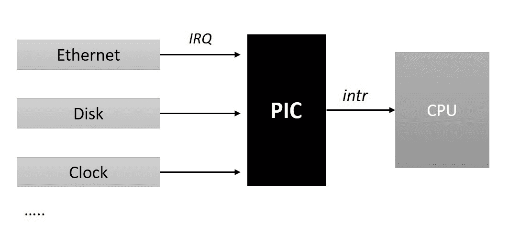
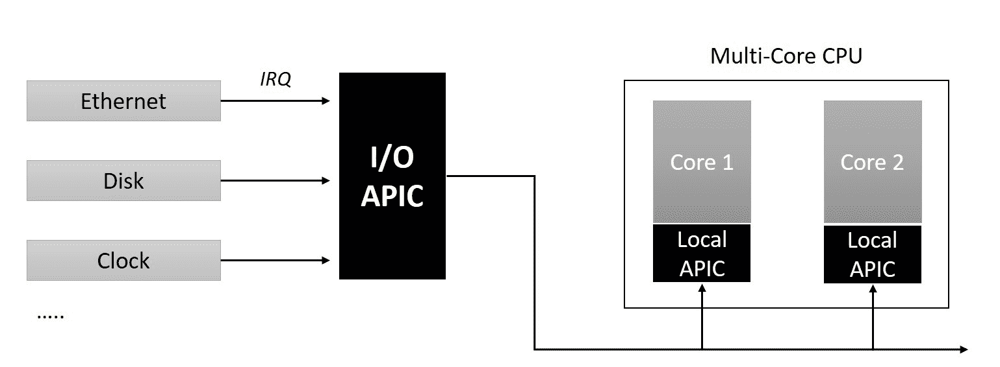

# 第九章：中断和延迟工作

**中断**是传递给处理器的电信号，指示发生需要立即处理的重大事件。这些信号可以来自系统连接的外部硬件或处理器内部的电路。在本章中，我们将研究内核的中断管理子系统，并探讨以下内容：

+   可编程中断控制器

+   中断向量表

+   IRQs

+   IRQ 芯片和 IRQ 描述符

+   注册和注销中断处理程序

+   IRQ 线路控制操作

+   IRQ 堆栈

+   延迟例程的需求

+   软中断

+   任务

+   工作队列

# 中断信号和向量

当中断来自外部设备时，称为**硬件中断**。这些信号是由外部硬件产生的，以寻求处理器对重大外部事件的关注，例如键盘上的按键、鼠标按钮的点击或移动鼠标触发硬件中断，通过这些中断处理器被通知有数据可供读取。硬件中断与处理器时钟异步发生（意味着它们可以在随机时间发生），因此也被称为**异步中断**。

由于当前执行的程序指令生成的事件而触发的 CPU 内部的中断被称为**软件中断**。软件中断是由当前执行的程序指令触发的**异常**引起的，或者在执行特权指令时引发中断。例如，当程序指令尝试将一个数字除以零时，处理器的算术逻辑单元会引发一个称为除零异常的中断。类似地，当正在执行的程序意图调用内核服务调用时，它执行一个特殊指令（sysenter），引发一个中断以将处理器转换到特权模式，为执行所需的服务调用铺平道路。这些事件与处理器时钟同步发生，因此也被称为**同步中断**。

在发生中断事件时，CPU 被设计为抢占当前的指令序列或执行线程，并执行一个称为**中断服务例程**（**ISR**）的特殊函数。为了找到与中断事件对应的适当的***ISR***，使用**中断向量表**。**中断向量**是内存中包含对应于中断执行的软件定义**中断服务**的引用的地址。处理器架构定义支持的**中断向量**的总数，并描述内存中每个中断向量的布局。一般来说，对于大多数处理器架构，所有支持的向量都被设置在内存中作为一个称为**中断向量表**的列表，其地址由平台软件编程到处理器寄存器中。

让我们以*x86*架构为例，以便更好地理解。x86 系列处理器支持总共 256 个中断向量，其中前 32 个保留用于处理器异常，其余用于软件和硬件中断。x86 通过实现一个向量表来引用**中断描述符表（IDT）**，这是一个 8 字节（32 位机器）或 16 字节（64 位*x86*机器）大小的描述符数组。在早期引导期间，内核代码的特定于架构的分支在内存中设置**IDT**并将处理器的**IDTR**寄存器（特殊的 x86 寄存器）编程为**IDT**的物理起始地址和长度。当发生中断时，处理器通过将报告的向量编号乘以向量描述符的大小（*x86_32 机器上的向量编号 x8*，*x86_64 机器上的向量编号 x16*）并将结果加到**IDT**的基地址来定位相关的向量描述符。一旦到达有效的*向量描述符*，处理器将继续执行描述符中指定的操作。

在 x86 平台上，每个*向量描述符*实现了一个*门（中断、任务或陷阱）*，用于在段之间传递执行控制。代表硬件中断的向量描述符实现了一个*中断门*，它指向包含中断处理程序代码的段的基地址和偏移量。*中断门*在将控制传递给指定的中断处理程序之前禁用所有可屏蔽中断。代表*异常*和软件中断的向量描述符实现了一个*陷阱门*，它也指向被指定为事件处理程序的代码的位置。与*中断门*不同，*陷阱门*不会禁用可屏蔽中断，这使其适用于执行软中断处理程序。

# 可编程中断控制器

现在让我们专注于外部中断，并探讨处理器如何识别外部硬件中断的发生，以及它们如何发现与中断相关联的向量编号。CPU 设计有一个专用输入引脚（中断引脚），用于信号外部中断。每个能够发出中断请求的外部硬件设备通常由一个或多个输出引脚组成，称为**中断请求线（IRQ）**，用于在 CPU 上信号中断请求。所有计算平台都使用一种称为**可编程中断控制器（PIC）**的硬件电路，将 CPU 的中断引脚多路复用到各种中断请求线上。所有来自板载设备控制器的现有 IRQ 线路都被路由到中断控制器的输入引脚，该控制器监视每个 IRQ 线路以获取中断信号，并在中断到达时将请求转换为 CPU 可理解的向量编号，并将中断信号传递到 CPU 的中断引脚。简而言之，可编程中断控制器将多个设备中断请求线路多路复用到处理器的单个中断线上：



中断控制器的设计和实现是特定于平台的。英特尔 x86 多处理器平台使用高级可编程中断控制器（APIC）。APIC 设计将中断控制器功能分为两个不同的芯片组件：第一个组件是位于系统总线上的 I/O APIC。所有共享的外围硬件 IRQ 线路都被路由到 I/O APIC；该芯片将中断请求转换为向量代码。第二个是称为本地 APIC 的每 CPU 控制器（通常集成到处理器核心中），它将硬件中断传递给特定的 CPU 核心。I/O APIC 将中断事件路由到所选 CPU 核心的本地 APIC。它被编程为一个重定向表，用于进行中断路由决策。CPU 本地 APIC 管理特定 CPU 核心的所有外部中断；此外，它们传递来自 CPU 本地硬件的事件，如定时器，并且还可以接收和生成 SMP 平台上可能发生的处理器间中断（IPI）。

以下图表描述了 APIC 的分裂架构。现在事件的流程始于各个设备在 I/O APIC 上引发 IRQ，后者将请求路由到特定的本地 APIC，后者又将中断传递给特定的 CPU 核心：



类似于 APIC 架构，多核 ARM 平台将通用中断控制器（GIC）的实现分为两部分。第一个组件称为分发器，它是全局的，有几个外围硬件中断源物理路由到它。第二个组件是每 CPU 复制的，称为 CPU 接口。分发器组件被编程为将共享外围中断（SPI）的分发逻辑路由到已知的 CPU 接口。

# 中断控制器操作

内核代码的体系结构特定分支实现了中断控制器特定操作，用于管理 IRQ 线路，例如屏蔽/取消屏蔽单个中断，设置优先级和 SMP 亲和性。这些操作需要从内核的体系结构无关代码路径中调用，以便操纵单个 IRQ 线路，并为了促进这样的调用，内核通过一个称为`struct irq_chip`的结构定义了一个体系结构无关的抽象层。该结构可以在内核头文件`<include/linux/irq.h>`中找到：

```
struct irq_chip {
     struct device *parent_device;
     const char    *name;
     unsigned int (*irq_startup)(struct irq_data *data);
     void (*irq_shutdown)(struct irq_data *data);
     void (*irq_enable)(struct irq_data *data);
     void (*irq_disable)(struct irq_data *data);

     void (*irq_ack)(struct irq_data *data);
     void (*irq_mask)(struct irq_data *data);
     void (*irq_mask_ack)(struct irq_data *data);
     void (*irq_unmask)(struct irq_data *data);
     void (*irq_eoi)(struct irq_data *data);

     int (*irq_set_affinity)(struct irq_data *data, const struct cpumask
                             *dest, bool force);

     int (*irq_retrigger)(struct irq_data *data);    
     int (*irq_set_type)(struct irq_data *data, unsigned int flow_type);
     int (*irq_set_wake)(struct irq_data *data, unsigned int on);    
     void (*irq_bus_lock)(struct irq_data *data);   
     void (*irq_bus_sync_unlock)(struct irq_data *data);    
     void (*irq_cpu_online)(struct irq_data *data);   
     void (*irq_cpu_offline)(struct irq_data *data);   
     void (*irq_suspend)(struct irq_data *data); 
     void (*irq_resume)(struct irq_data *data); 
     void (*irq_pm_shutdown)(struct irq_data *data); 
     void (*irq_calc_mask)(struct irq_data *data); 
     void (*irq_print_chip)(struct irq_data *data, struct seq_file *p);    
     int (*irq_request_resources)(struct irq_data *data); 
     void (*irq_release_resources)(struct irq_data *data); 
     void (*irq_compose_msi_msg)(struct irq_data *data, struct msi_msg *msg);
     void (*irq_write_msi_msg)(struct irq_data *data, struct msi_msg *msg);  

     int (*irq_get_irqchip_state)(struct irq_data *data, enum  irqchip_irq_state which, bool *state);
     int (*irq_set_irqchip_state)(struct irq_data *data, enum irqchip_irq_state which, bool state);

     int (*irq_set_vcpu_affinity)(struct irq_data *data, void *vcpu_info);   
     void (*ipi_send_single)(struct irq_data *data, unsigned int cpu);   
     void (*ipi_send_mask)(struct irq_data *data, const struct cpumask *dest);      unsigned long flags; 
};
```

该结构声明了一组函数指针，以考虑各种硬件平台上发现的 IRQ 芯片的所有特殊性。因此，由特定于板级的代码定义的结构的特定实例通常只支持可能操作的子集。以下是定义 I/O APIC 和 LAPIC 操作的 x86 多核平台版本的`irq_chip`实例。

```
static struct irq_chip ioapic_chip __read_mostly = {
              .name             = "IO-APIC",
              .irq_startup      = startup_ioapic_irq,
              .irq_mask         = mask_ioapic_irq,
              .irq_unmask       = unmask_ioapic_irq,
              .irq_ack          = irq_chip_ack_parent,
              .irq_eoi          = ioapic_ack_level,
              .irq_set_affinity = ioapic_set_affinity,
              .irq_retrigger    = irq_chip_retrigger_hierarchy,
              .flags            = IRQCHIP_SKIP_SET_WAKE,
};

static struct irq_chip lapic_chip __read_mostly = {
              .name            = "local-APIC",
              .irq_mask        = mask_lapic_irq,
              .irq_unmask      = unmask_lapic_irq,
              .irq_ack         = ack_lapic_irq,
};
```

# 中断描述符表

另一个重要的抽象是与与硬件中断相关的 IRQ 号。中断控制器使用唯一的硬件 IRQ 号标识每个 IRQ 源。内核的通用中断管理层将每个硬件 IRQ 映射到称为 Linux IRQ 的唯一标识符；这些数字抽象了硬件 IRQ，从而确保内核代码的可移植性。所有外围设备驱动程序都被编程为使用 Linux IRQ 号来绑定或注册它们的中断处理程序。

Linux IRQ 由 IRQ 描述符结构表示，由`struct irq_desc`定义；在早期内核引导期间，对于每个 IRQ 源，将枚举此结构的一个实例。IRQ 描述符的列表以 IRQ 号为索引，称为 IRQ 描述符表：

```
 struct irq_desc {
      struct irq_common_data    irq_common_data;
      struct irq_data           irq_data;
      unsigned int __percpu    *kstat_irqs;
      irq_flow_handler_t        handle_irq;
#ifdef CONFIG_IRQ_PREFLOW_FASTEOI
      irq_preflow_handler_t     preflow_handler;
#endif
      struct irqaction         *action;    /* IRQ action list */
      unsigned int             status_use_accessors;
      unsigned int             core_internal_state__do_not_mess_with_it;
      unsigned int             depth;    /* nested irq disables */
      unsigned int             wake_depth;/* nested wake enables */
      unsigned int             irq_count;/* For detecting broken IRQs */
      unsigned long            last_unhandled;   
      unsigned int             irqs_unhandled;
      atomic_t                 threads_handled;
      int                      threads_handled_last;
      raw_spinlock_t           lock;
      struct cpumask           *percpu_enabled;
      const struct cpumask     *percpu_affinity;
#ifdef CONFIG_SMP
     const struct cpumask         *affinity_hint;
     struct irq_affinity_notify   *affinity_notify;

     ...
     ...
     ...
};
```

`irq_data`是`struct irq_data`的一个实例，其中包含与中断管理相关的低级信息，例如 Linux 中断号、硬件中断号，以及指向中断控制器操作（`irq_chip`）的指针等其他重要字段：

```
/**
 * struct irq_data - per irq chip data passed down to chip functions
 * @mask:          precomputed bitmask for accessing the chip registers
 * @irq:           interrupt number
 * @hwirq:         hardware interrupt number, local to the interrupt domain
 * @common:        point to data shared by all irqchips
 * @chip:          low level interrupt hardware access
 * @domain:        Interrupt translation domain; responsible for mapping
 *                 between hwirq number and linux irq number.
 * @parent_data:   pointer to parent struct irq_data to support hierarchy
 *                 irq_domain
 * @chip_data:     platform-specific per-chip private data for the chip
 *                 methods, to allow shared chip implementations
 */

struct irq_data { 
       u32 mask;    
       unsigned int irq;    
       unsigned long hwirq;    
       struct irq_common_data *common;    
       struct irq_chip *chip;    
       struct irq_domain *domain; 
#ifdef CONFIG_IRQ_DOMAIN_HIERARCHY    
       struct irq_data *parent_data; 
#endif    
       void *chip_data; 
};
```

`irq_desc`结构的`handle_irq`元素是一个`irq_flow_handler_t`类型的函数指针，它指的是处理线路上流管理的高级函数。通用中断层提供了一组预定义的中断流函数；根据其类型，每个中断线路都分配了适当的例程。

+   `handle_level_irq()`：电平触发中断的通用实现

+   `handle_edge_irq()`：边沿触发中断的通用实现

+   `handle_fasteoi_irq()`：只需要在处理程序结束时进行 EOI 的中断的通用实现

+   `handle_simple_irq()`：简单中断的通用实现

+   `handle_percpu_irq()`：每 CPU 中断的通用实现

+   `handle_bad_irq()`：用于虚假中断

`irq_desc`结构的`*action`元素是指向一个或一组动作描述符的指针，其中包含特定于驱动程序的中断处理程序等其他重要元素。每个动作描述符都是在内核头文件`<linux/interrupt.h>`中定义的`struct irqaction`的实例：

```
/**
 * struct irqaction - per interrupt action descriptor
 * @handler: interrupt handler function
 * @name: name of the device
 * @dev_id: cookie to identify the device
 * @percpu_dev_id: cookie to identify the device
 * @next: pointer to the next irqaction for shared interrupts
 * @irq: interrupt number
 * @flags: flags 
 * @thread_fn: interrupt handler function for threaded interrupts
 * @thread: thread pointer for threaded interrupts
 * @secondary: pointer to secondary irqaction (force threading)
 * @thread_flags: flags related to @thread
 * @thread_mask: bitmask for keeping track of @thread activity
 * @dir: pointer to the proc/irq/NN/name entry
 */
struct irqaction {
       irq_handler_t handler;
       void * dev_id;
       void __percpu * percpu_dev_id;
       struct irqaction * next;
       irq_handler_t thread_fn;
       struct task_struct * thread;
       struct irqaction * secondary;
       unsigned int irq;
       unsigned int flags;
       unsigned long thread_flags;
       unsigned long thread_mask;
       const char * name;
       struct proc_dir_entry * dir;
};  
```

# 高级中断管理接口

通用 IRQ 层提供了一组函数接口，供设备驱动程序获取 IRQ 描述符和绑定中断处理程序，释放 IRQ，启用或禁用中断线等。我们将在本节中探讨所有通用接口。

# 注册中断处理程序

```
typedef irqreturn_t (*irq_handler_t)(int, void *);

/**
 * request_irq - allocate an interrupt line
 * @irq: Interrupt line to allocate
 * @handler: Function to be called when the IRQ occurs.
 * @irqflags: Interrupt type flags
 * @devname: An ascii name for the claiming device
 * @dev_id: A cookie passed back to the handler function
 */
 int request_irq(unsigned int irq, irq_handler_t handler, unsigned long flags,
                 const char *name, void *dev);
```

`request_irq()`使用传递的值实例化一个`irqaction`对象，并将其绑定到作为第一个（`irq`）参数指定的`irq_desc`。此调用分配中断资源并启用中断线和 IRQ 处理。`handler`是一个`irq_handler_t`类型的函数指针，它接受特定于驱动程序的中断处理程序例程的地址。`flags`是与中断管理相关的选项的位掩码。标志位在内核头文件`<linux/interrupt.h>`中定义：

+   `IRQF_SHARED`：在将中断处理程序绑定到共享的 IRQ 线时使用。

+   `IRQF_PROBE_SHARED`：当调用者期望共享不匹配时设置。

+   `IRQF_TIMER`：标记此中断为定时器中断。

+   `IRQF_PERCPU`：中断是每 CPU 的。

+   `IRQF_NOBALANCING`：标志，用于排除此中断不参与 IRQ 平衡。

+   `IRQF_IRQPOLL`：中断用于轮询（仅考虑在共享中断中首先注册的中断以提高性能）。

+   `IRQF_NO_SUSPEND`：在挂起期间不禁用此 IRQ。不能保证此中断将唤醒系统从挂起状态。

+   `IRQF_FORCE_RESUME`：即使设置了`IRQF_NO_SUSPEND`，也在恢复时强制启用它。

+   `IRQF_EARLY_RESUME`：在 syscore 期间提前恢复 IRQ，而不是在设备恢复时。

+   `IRQF_COND_SUSPEND`：如果 IRQ 与`NO_SUSPEND`用户共享，则在挂起中断后执行此中断处理程序。对于系统唤醒设备，用户需要在其中断处理程序中实现唤醒检测。

由于每个标志值都是一个位，可以传递这些标志的子集的逻辑 OR（即|），如果没有适用的标志，则`flags`参数的值为 0 是有效的。分配给`dev`的地址被视为唯一的 cookie，并用作共享 IRQ 情况下操作实例的标识符。在注册中断处理程序时，此参数的值可以为 NULL，而不使用`IRQF_SHARED`标志。

成功时，`request_irq()`返回零；非零返回值表示注册指定中断处理程序失败。返回错误代码`-EBUSY`表示注册或绑定处理程序到已经使用的指定 IRQ 失败。

中断处理程序例程具有以下原型：

```
irqreturn_t handler(int irq, void *dev_id);
```

`irq`指定了 IRQ 号码，而`dev_id`是在注册处理程序时使用的唯一 cookie。`irqreturn_t`是一个枚举整数常量的 typedef：

```
enum irqreturn {
        IRQ_NONE         = (0 << 0),
        IRQ_HANDLED              = (1 << 0),
        IRQ_WAKE_THREAD          = (1 << 1),
};

typedef enum irqreturn irqreturn_t;
```

中断处理程序应返回`IRQ_NONE`以指示未处理中断。它还用于指示中断的来源不是来自其设备的情况下的共享 IRQ。当中断处理正常完成时，必须返回`IRQ_HANDLED`以指示成功。`IRQ_WAKE_THREAD`是一个特殊标志，用于唤醒线程处理程序；我们将在下一节详细介绍它。

# 注销中断处理程序

驱动程序的中断处理程序可以通过调用`free_irq()`例程来注销：

```
/**
 * free_irq - free an interrupt allocated with request_irq
 * @irq: Interrupt line to free
 * @dev_id: Device identity to free
 *
 * Remove an interrupt handler. The handler is removed and if the
 * interrupt line is no longer in use by any driver it is disabled.
 * On a shared IRQ the caller must ensure the interrupt is disabled
 * on the card it drives before calling this function. The function
 * does not return until any executing interrupts for this IRQ
 * have completed.
 * Returns the devname argument passed to request_irq.
 */
const void *free_irq(unsigned int irq, void *dev_id);
```

`dev_id`是用于在共享 IRQ 情况下标识要注销的处理程序的唯一 cookie（在注册处理程序时分配）；对于其他情况，此参数可以为 NULL。此函数是一个潜在的阻塞调用，并且不得从中断上下文中调用：它会阻塞调用上下文，直到指定的 IRQ 线路上的任何中断处理程序的执行完成。

# 线程中断处理程序

通过`request_irq()`注册的处理程序由内核的中断处理路径执行。这条代码路径是异步的，通过暂停本地处理器上的调度程序抢占和硬件中断来运行，因此被称为硬中断上下文。因此，必须将驱动程序的中断处理程序编程为简短（尽量少做工作）和原子（非阻塞），以确保系统的响应性。然而，并非所有硬件中断处理程序都可以简短和原子：有许多复杂设备生成中断事件，其响应涉及复杂的可变时间操作。

传统上，驱动程序被编程为处理中断处理程序的这种复杂性，采用了分离处理程序设计，称为**顶半部**和**底半部**。顶半部例程在硬中断上下文中被调用，这些函数被编程为执行*中断关键*操作，例如对硬件寄存器的物理 I/O，并安排底半部进行延迟执行。底半部例程通常用于处理*中断非关键*和*可推迟工作*，例如处理顶半部生成的数据，与进程上下文交互以及访问用户地址空间。内核提供了多种机制来调度和执行底半部例程，每种机制都有不同的接口 API 和执行策略。我们将在下一节详细介绍正式底半部机制的设计和用法细节。

作为使用正式底半部机制的替代方案，内核支持设置可以在线程上下文中执行的中断处理程序，称为**线程中断处理程序**。驱动程序可以通过另一个名为`request_threaded_irq()`的接口例程设置线程中断处理程序：

```
/**
 * request_threaded_irq - allocate an interrupt line
 * @irq: Interrupt line to allocate
 * @handler: Function to be called when the IRQ occurs.
 * Primary handler for threaded interrupts
 * If NULL and thread_fn != NULL the default
 * primary handler is installed
 * @thread_fn: Function called from the irq handler thread
 * If NULL, no irq thread is created
 * @irqflags: Interrupt type flags
 * @devname: An ascii name for the claiming device
 * @dev_id: A cookie passed back to the handler function
 */
   int request_threaded_irq(unsigned int irq, irq_handler_t handler,
                            irq_handler_t thread_fn, unsigned long irqflags,
                            const char *devname, void *dev_id);
```

分配给`handler`的函数作为在硬中断上下文中执行的主要中断处理程序。分配给`thread_fn`的例程在线程上下文中执行，并在主处理程序返回`IRQ_WAKE_THREAD`时被调度运行。通过这种分离处理程序设置，有两种可能的用例：主处理程序可以被编程为执行中断关键工作，并将非关键工作推迟到线程处理程序以供以后执行，类似于底半部分。另一种设计是将整个中断处理代码推迟到线程处理程序，并将主处理程序限制为验证中断源并唤醒线程例程。这种用例可能需要相应的中断线路在线程处理程序完成之前被屏蔽，以避免中断的嵌套。这可以通过编程主处理程序在唤醒线程处理程序之前关闭中断源或通过在注册线程中断处理程序时分配的标志位`IRQF_ONESHOT`来实现。

以下是与线程中断处理程序相关的`irqflags`：

+   `IRQF_ONESHOT`：硬 IRQ 处理程序完成后不会重新启用中断。这由需要保持 IRQ 线禁用直到线程处理程序运行完毕的线程化中断使用。

+   `IRQF_NO_THREAD`：中断不能被线程化。这在共享 IRQ 中用于限制使用线程化中断处理程序。

调用此例程并将 NULL 分配给`handler`将导致内核使用默认的主处理程序，该处理程序简单地返回`IRQ_WAKE_THREAD`。而将 NULL 分配给`thread_fn`调用此函数等同于`request_irq()`：

```
static inline int __must_check
request_irq(unsigned int irq, irq_handler_t handler, unsigned long flags,
            const char *name, void *dev)
{
        return request_threaded_irq(irq, handler, NULL, flags, name, dev);
}
```

设置中断处理程序的另一种替代接口是`request_any_context_irq()`。此例程具有与`request_irq()`类似的签名，但在功能上略有不同：

```
/**
 * request_any_context_irq - allocate an interrupt line
 * @irq: Interrupt line to allocate
 * @handler: Function to be called when the IRQ occurs.
 * Threaded handler for threaded interrupts.
 * @flags: Interrupt type flags
 * @name: An ascii name for the claiming device
 * @dev_id: A cookie passed back to the handler function
 *
 * This call allocates interrupt resources and enables the
 * interrupt line and IRQ handling. It selects either a
 * hardirq or threaded handling method depending on the
 * context.
 * On failure, it returns a negative value. On success,
 * it returns either IRQC_IS_HARDIRQ or IRQC_IS_NESTED..
 */
int request_any_context_irq(unsigned int irq,irq_handler_t handler, 
                            unsigned long flags,const char *name,void *dev_id)

```

此函数与`request_irq()`的不同之处在于，它查看由特定于体系结构的代码设置的 IRQ 描述符的中断线属性，并决定是否将分配的函数建立为传统的硬 IRQ 处理程序或作为线程中断处理程序。成功时，如果已建立处理程序以在硬 IRQ 上下文中运行，则返回`IRQC_IS_HARDIRQ`，否则返回`IRQC_IS_NESTED`。

# 控制接口

通用的 IRQ 层提供了对 IRQ 线进行控制操作的例程。以下是用于屏蔽和取消屏蔽特定 IRQ 线的函数列表：

```
void disable_irq(unsigned int irq);
```

通过操作 IRQ 描述符结构中的计数器来禁用指定的 IRQ 线。此例程可能是一个阻塞调用，因为它会等待此中断的任何运行处理程序完成。另外，也可以使用函数`disable_irq_nosync()`来*禁用*给定的 IRQ 线；此调用不会检查并等待给定中断线的任何运行处理程序完成：

```
void disable_irq_nosync(unsigned int irq);
```

可以通过调用以下函数来启用已禁用的 IRQ 线：

```
void enable_irq(unsigned int irq);
```

请注意，IRQ 启用和禁用操作是嵌套的，即，多次*禁用*IRQ 线的调用需要相同数量的*启用*调用才能重新启用该 IRQ 线。这意味着`enable_irq()`只有在调用它与最后的*禁用*操作匹配时才会启用给定的 IRQ。

可以选择为本地 CPU 禁用/启用中断；以下宏对应用于相同目的：

+   `local_irq_disable()`：在本地处理器上禁用中断。

+   `local_irq_enable()`：为本地处理器启用中断。

+   `local_irq_save(unsigned long flags)`：通过将当前中断状态保存在*flags*中，在本地 CPU 上禁用中断。

+   `local_irq_restore(unsigned long flags)`：通过将中断恢复到先前的状态，在本地 CPU 上启用中断。

# IRQ 堆栈

从历史上看，对于大多数体系结构，中断处理程序共享了被中断的运行进程的内核堆栈。正如第一章所讨论的，32 位体系结构的进程内核堆栈通常为 8 KB，而 64 位体系结构为 16 KB。固定的内核堆栈可能并不总是足够用于内核工作和 IRQ 处理例程，导致内核代码和中断处理程序都需要谨慎地分配数据。为了解决这个问题，内核构建（对于一些体系结构）默认配置为为中断处理程序设置每个 CPU 硬 IRQ 堆栈，并为软中断代码设置每个 CPU 软 IRQ 堆栈。以下是内核头文件`<arch/x86/include/asm/processor.h>`中特定于 x86-64 位体系结构的堆栈声明：

```
/*
 * per-CPU IRQ handling stacks
 */
struct irq_stack {
        u32                     stack[THREAD_SIZE/sizeof(u32)];
} __aligned(THREAD_SIZE);

DECLARE_PER_CPU(struct irq_stack *, hardirq_stack);
DECLARE_PER_CPU(struct irq_stack *, softirq_stack);
```

除此之外，x86-64 位构建还包括特殊的堆栈；更多细节可以在内核源代码文档`<x86/kernel-stacks>`中找到：

+   双重故障堆栈

+   调试堆栈

+   NMI 堆栈

+   Mce 堆栈

# 延迟工作

如前一节介绍的，**底半部**是内核机制，用于执行延迟工作，并且可以由任何内核代码参与，以推迟对非关键工作的执行，直到将来的某个时间。为了支持实现和管理延迟例程，内核实现了特殊的框架，称为**softirqs**、**tasklets**和**work queues**。每个这些框架都包括一组数据结构和函数接口，用于注册、调度和排队底半部例程。每种机制都设计有一个独特的*策略*来管理和执行底半部。需要延迟执行的驱动程序和其他内核服务将需要通过适当的框架绑定和调度它们的 BH 例程。

# Softirqs

术语**softirq**大致翻译为**软中断**，正如其名称所示，由该框架管理的延迟例程以高优先级执行，但启用了硬中断线*。因此，softirq 底半部（或 softirqs）可以抢占除硬中断处理程序之外的所有其他任务。然而，softirq 的使用仅限于静态内核代码，这种机制对于动态内核模块不可用。

每个 softirq 通过在内核头文件`<linux/interrupt.h>`中声明的`struct softirq_action`类型的实例表示。该结构包含一个函数指针，可以保存底半部例程的地址：

```
struct softirq_action
{
        void (*action)(struct softirq_action *);
};
```

当前版本的内核有 10 个 softirq，每个通过内核头文件`<linux/interrupt.h>`中的枚举索引。这些索引作为标识，并被视为 softirq 的相对优先级，具有较低索引的条目被视为优先级较高，索引 0 为最高优先级的 softirq：

```
enum
{
        HI_SOFTIRQ=0,
        TIMER_SOFTIRQ,
        NET_TX_SOFTIRQ,
        NET_RX_SOFTIRQ,
        BLOCK_SOFTIRQ,
        IRQ_POLL_SOFTIRQ,
        TASKLET_SOFTIRQ,
        SCHED_SOFTIRQ,
        HRTIMER_SOFTIRQ, /* Unused, but kept as tools rely on the
                            numbering. Sigh! */
        RCU_SOFTIRQ, /* Preferable RCU should always be the last softirq */

        NR_SOFTIRQS
};
```

内核源文件`<kernel/softirq.c>`声明了一个名为`softirq_vec`的数组，大小为`NR_SOFTIRQS`，每个偏移量包含一个对应 softirq 枚举中的`softirq_action`实例：

```
static struct softirq_action softirq_vec[NR_SOFTIRQS] __cacheline_aligned_in_smp;

/* string constants for naming each softirq */
const char * const softirq_to_name[NR_SOFTIRQS] = {
        "HI", "TIMER", "NET_TX", "NET_RX", "BLOCK", "IRQ_POLL",
        "TASKLET", "SCHED", "HRTIMER", "RCU"
};
```

框架提供了一个函数`open_softriq()`，用于使用相应的底半部例程初始化 softirq 实例：

```
void open_softirq(int nr, void (*action)(struct softirq_action *))
{
        softirq_vec[nr].action = action;
}

```

`nr`是要初始化的 softirq 的索引，`*action`是要用底半部例程的地址初始化的函数指针。以下代码摘录来自定时器服务，并显示了调用`open_softirq`来注册 softirq：

```
/*kernel/time/timer.c*/
open_softirq(TIMER_SOFTIRQ, run_timer_softirq);
```

内核服务可以使用函数`raise_softirq()`来发出 softirq 处理程序的执行。此函数以 softirq 的索引作为参数：

```
void raise_softirq(unsigned int nr)
{
        unsigned long flags;

        local_irq_save(flags);
        raise_softirq_irqoff(nr);
        local_irq_restore(flags);
} 
```

以下代码摘录来自`<kernel/time/timer.c>`：

```
void run_local_timers(void)
{
        struct timer_base *base = this_cpu_ptr(&amp;timer_bases[BASE_STD]);

        hrtimer_run_queues();
        /* Raise the softirq only if required. */
        if (time_before(jiffies, base->clk)) {
                if (!IS_ENABLED(CONFIG_NO_HZ_COMMON) || !base->nohz_active)
                        return;
                /* CPU is awake, so check the deferrable base. */
                base++;
                if (time_before(jiffies, base->clk))
                        return;
        }
        raise_softirq(TIMER_SOFTIRQ);
}
```

内核维护了一个每 CPU 位掩码，用于跟踪为执行而引发的 softirq，并且函数`raise_softirq()`设置本地 CPU 的 softirq 位掩码中的相应位（作为参数提到的索引）以标记指定的 softirq 为待处理。

待处理的 softirq 处理程序在内核代码的各个点检查并执行。主要是在中断上下文中执行，在硬中断处理程序完成后立即执行，同时启用 IRQ 线。这保证了从硬中断处理程序引发的 softirq 的快速处理，从而实现了最佳的缓存使用。然而，内核允许任意任务通过`local_bh_disable()`或`spin_lock_bh()`调用来暂停本地处理器上的 softirq 处理。待处理的 softirq 处理程序在重新启用 softirq 处理的任意任务的上下文中执行，通过调用`local_bh_enable()`或`spin_unlock_bh()`来重新启用 softirq 处理。最后，softirq 处理程序也可以由每个 CPU 内核线程`ksoftirqd`执行，当任何进程上下文内核例程引发 softirq 时，它会被唤醒。当由于负载过高而积累了太多的 softirq 时，该线程也会从中断上下文中被唤醒。

Softirqs 最适合用于完成从硬中断处理程序推迟的优先级工作，因为它们在硬中断处理程序完成后立即运行。但是，softirq 处理程序是可重入的，并且必须编程以在访问数据结构时使用适当的保护机制。softirq 的可重入性可能导致无界延迟，影响整个系统的效率，这就是为什么它们的使用受到限制，几乎不会添加新的 softirq，除非绝对需要执行高频率的线程推迟工作。对于所有其他类型的推迟工作，建议使用任务队列。

# 任务队列

**任务队列**机制是对 softirq 框架的一种包装；事实上，任务队列处理程序是由 softirq 执行的。与 softirq 不同，任务队列不是可重入的，这保证了相同的任务队列处理程序永远不会并发运行。这有助于最小化总体延迟，前提是程序员检查并施加相关检查，以确保任务队列中的工作是非阻塞和原子的。另一个区别是在使用方面：与受限的 softirq 不同，任何内核代码都可以使用任务队列，包括动态链接的服务。

每个任务队列通过在内核头文件`<linux/interrupt.h>`中声明的`struct tasklet_struct`类型的实例表示：

```
struct tasklet_struct
{
        struct tasklet_struct *next;
        unsigned long state;
        atomic_t count;
        void (*func)(unsigned long);
        unsigned long data;
};
```

在初始化时，`*func`保存处理程序例程的地址，`data`用于在调用期间将数据块作为参数传递给处理程序例程。每个任务队列都携带一个`state`，可以是`TASKLET_STATE_SCHED`，表示已安排执行，也可以是`TASKLET_STATE_RUN`，表示正在执行。使用原子计数器来*启用*或*禁用*任务队列；当`count`等于*非零*值*时，表示任务队列*已禁用*，*零*表示任务队列*已启用*。禁用的任务队列即使已排队，也不能执行，直到将来某个时间启用。

内核服务可以通过以下任何宏之一静态实例化新的任务队列：

```
#define DECLARE_TASKLET(name, func, data) \
struct tasklet_struct name = { NULL, 0, ATOMIC_INIT(0), func, data }

#define DECLARE_TASKLET_DISABLED(name, func, data) \
struct tasklet_struct name = { NULL, 0, ATOMIC_INIT(1), func, data }
```

新的任务队列可以通过以下方式在运行时动态实例化：

```
void tasklet_init(struct tasklet_struct *t,
                  void (*func)(unsigned long), unsigned long data)
{
        t->next = NULL;
        t->state = 0;
        atomic_set(&t->count, 0);
        t->func = func;
        t->data = data;
}
```

内核为排队的任务队列维护了两个每 CPU 任务队列列表，这些列表的定义可以在源文件`<kernel/softirq.c>`中找到：

```
/*
 * Tasklets
 */
struct tasklet_head {
        struct tasklet_struct *head;
        struct tasklet_struct **tail;
};

static DEFINE_PER_CPU(struct tasklet_head, tasklet_vec);
static DEFINE_PER_CPU(struct tasklet_head, tasklet_hi_vec);

```

`tasklet_vec`被认为是正常列表，此列表中的所有排队的任务队列都由`TASKLET_SOFTIRQ`（10 个 softirq 之一）运行。`tasklet_hi_vec`是一个高优先级的任务队列列表，此列表中的所有排队的任务队列都由`HI_SOFTIRQ`执行，这恰好是最高优先级的 softirq。可以通过调用`tasklet_schedule()`或`tasklet_hi_scheudule()`将任务队列排队到适当的列表中执行。

以下代码显示了`tasklet_schedule()`的实现；此函数通过要排队的任务队列实例的地址作为参数调用：

```
extern void __tasklet_schedule(struct tasklet_struct *t);

static inline void tasklet_schedule(struct tasklet_struct *t)
{
        if (!test_and_set_bit(TASKLET_STATE_SCHED, &t->state))
                __tasklet_schedule(t);
}
```

条件构造检查指定的任务队列是否已经排队；如果没有，它会原子地将状态设置为`TASKLET_STATE_SCHED`，并调用`__tasklet_shedule()`将任务队列实例排队到待处理列表中。如果发现指定的任务队列已经处于`TASKLET_STATE_SCHED`状态，则不会重新调度：

```
void __tasklet_schedule(struct tasklet_struct *t)
{
        unsigned long flags;

        local_irq_save(flags);
        t->next = NULL;
 *__this_cpu_read(tasklet_vec.tail) = t;
 __this_cpu_write(tasklet_vec.tail, &(t->next));
        raise_softirq_irqoff(TASKLET_SOFTIRQ);
        local_irq_restore(flags);
}
```

此函数将指定的任务队列静默排队到`tasklet_vec`的尾部，并在本地处理器上引发`TASKLET_SOFTIRQ`。

下面是`tasklet_hi_scheudle()`例程的代码：

```
extern void __tasklet_hi_schedule(struct tasklet_struct *t);

static inline void tasklet_hi_schedule(struct tasklet_struct *t)
{
        if (!test_and_set_bit(TASKLET_STATE_SCHED, &t->state))
                __tasklet_hi_schedule(t);
}
```

此例程中执行的操作与`tasklet_schedule()`类似，唯一的例外是它调用`__tasklet_hi_scheudle()`将指定的任务队列排队到`tasklet_hi_vec`的尾部：

```
void __tasklet_hi_schedule(struct tasklet_struct *t)
{
        unsigned long flags;

        local_irq_save(flags);
        t->next = NULL;
 *__this_cpu_read(tasklet_hi_vec.tail) = t;
 __this_cpu_write(tasklet_hi_vec.tail, &(t->next));
 raise_softirq_irqoff(HI_SOFTIRQ);
        local_irq_restore(flags);
}
```

此调用在本地处理器上引发`HI_SOFTIRQ`，这将把`tasklet_hi_vec`中排队的所有任务队列转换为最高优先级的底部半部（优先级高于其他 softirq）。

另一个变体是`tasklet_hi_schedule_first()`，它将指定的 tasklet 插入到`tasklet_hi_vec`的开头，并提高`HI_SOFTIRQ`：

```
extern void __tasklet_hi_schedule_first(struct tasklet_struct *t);

 */
static inline void tasklet_hi_schedule_first(struct tasklet_struct *t)
{
        if (!test_and_set_bit(TASKLET_STATE_SCHED, &t->state))
                __tasklet_hi_schedule_first(t);
}

/*kernel/softirq.c */
void __tasklet_hi_schedule_first(struct tasklet_struct *t)
{
        BUG_ON(!irqs_disabled());
        t->next = __this_cpu_read(tasklet_hi_vec.head);
 __this_cpu_write(tasklet_hi_vec.head, t);
        __raise_softirq_irqoff(HI_SOFTIRQ);
}

```

还存在其他接口例程，用于启用、禁用和终止已调度的 tasklet。

```
void tasklet_disable(struct tasklet_struct *t);
```

此函数通过增加其*禁用计数*来禁用指定的 tasklet。tasklet 仍然可以被调度，但直到再次启用它之前不会被执行。如果在调用此函数时 tasklet 当前正在运行，则此函数会忙等待直到 tasklet 完成。

```
void tasklet_enable(struct tasklet_struct *t);
```

此函数尝试通过递减其*禁用计数*来启用先前已禁用的 tasklet。如果 tasklet 已经被调度，它将很快运行：

```
void tasklet_kill(struct tasklet_struct *t);
```

此函数用于终止给定的 tasklet，以确保它不能再次被调度运行。如果在调用此函数时指定的 tasklet 已经被调度，则此函数会等待其执行完成：

```
void tasklet_kill_immediate(struct tasklet_struct *t, unsigned int cpu);
```

此函数用于终止已经调度的 tasklet。即使 tasklet 处于`TASKLET_STATE_SCHED`状态，它也会立即从列表中删除指定的 tasklet。

# 工作队列

**工作队列**（**wqs**）是用于执行异步进程上下文例程的机制。正如名称所暗示的那样，工作队列（wq）是一个*work*项目的列表，每个项目包含一个函数指针，该指针指向要异步执行的例程的地址。每当一些内核代码（属于子系统或服务）打算将一些工作推迟到异步进程上下文执行时，它必须使用处理程序函数的地址初始化*work*项目，并将其排队到工作队列中。内核使用专用的内核线程池，称为*kworker*线程，按顺序执行队列中每个*work*项目绑定的函数。

# 接口 API

工作队列 API 提供了两种类型的函数接口：首先，一组接口例程用于实例化和排队*work*项目到全局工作队列，该队列由所有内核子系统和服务共享；其次，一组接口例程用于设置新的工作队列，并将工作项目排队到其中。我们将开始探索与全局共享工作队列相关的宏和函数的工作队列接口。

队列中的每个*work*项目由类型为`struct work_struct`的实例表示，该类型在内核头文件`<linux/workqueue.h>`中声明：

```
struct work_struct {
        atomic_long_t data;
        struct list_head entry;
        work_func_t func;
#ifdef CONFIG_LOCKDEP
        struct lockdep_map lockdep_map;
#endif
};
```

`func`是一个指针，指向延迟例程的地址；可以通过宏`DECLARE_WORK`创建并初始化一个新的 struct work 对象：

```
#define DECLARE_WORK(n, f) \
 struct work_struct n = __WORK_INITIALIZER(n, f)
```

`n`是要创建的实例的名称，`f`是要分配的函数的地址。可以通过`schedule_work()`将工作实例排队到工作队列中：

```
bool schedule_work(struct work_struct *work);
```

此函数将给定的*work*项目排队到本地 CPU 工作队列，但不能保证其在其中执行。如果成功排队给定的*work*，则返回*true*，如果给定的*work*已经在工作队列中，则返回*false*。一旦排队，与*work*项目相关联的函数将由相关的`kworker`线程在任何可用的 CPU 上执行。或者，可以将*work*项目标记为在特定 CPU 上执行，同时将其调度到队列中（这可能会产生更好的缓存利用）；可以通过调用`schedule_work_on()`来实现：

```
bool schedule_work_on(int cpu, struct work_struct *work);
```

`cpu`是要绑定到的*work*任务的标识符。例如，要将*work*任务调度到本地 CPU，调用者可以调用：

```
schedule_work_on(smp_processor_id(), &t_work);
```

`smp_processor_id()`是一个内核宏（在`<linux/smp.h>`中定义），它返回本地 CPU 标识符。

接口 API 还提供了调度调用的变体，允许调用者排队*work*任务，其执行保证至少延迟到指定的超时。这是通过将*work*任务与定时器绑定来实现的，可以使用到期超时初始化定时器，直到*work*任务被调度到队列中为止：

```
struct delayed_work {
        struct work_struct work;
        struct timer_list timer;

        /* target workqueue and CPU ->timer uses to queue ->work */
        struct workqueue_struct *wq;
        int cpu;
};
```

`timer`是动态定时器描述符的一个实例，它在安排*工作*任务时初始化了到期间隔并启动。我们将在下一章更详细地讨论内核定时器和其他与时间相关的概念。

调用者可以通过宏实例化`delayed_work`并静态初始化它：

```
#define DECLARE_DELAYED_WORK(n, f) \
        struct delayed_work n = __DELAYED_WORK_INITIALIZER(n, f, 0)
```

与普通*工作*任务类似，延迟*工作*任务可以安排在任何可用的 CPU 上运行，或者安排在指定的核心上执行。要安排可以在任何可用处理器上运行的延迟*工作*，调用者可以调用`schedule_delayed_work()`，要安排延迟*工作*到特定 CPU 上，使用函数`schedule_delayed_work_on()`：

```
bool schedule_delayed_work(struct delayed_work *dwork,unsigned long delay);
bool schedule_delayed_work_on(int cpu, struct delayed_work *dwork,
                                                       unsigned long delay);
```

请注意，如果延迟为零，则指定的*工作*项将安排立即执行。

# 创建专用工作队列

全局工作队列上安排的*工作*项的执行时间是不可预测的：一个长时间运行的*工作*项总是会导致其他*工作*项的无限延迟。或者，工作队列框架允许分配专用工作队列，这些队列可以由内核子系统或服务拥有。用于创建和安排工作到这些队列中的接口 API 提供了控制标志，通过这些标志，所有者可以设置特殊属性，如 CPU 局部性、并发限制和优先级，这些属性会影响排队的工作项的执行。

可以通过调用`alloc_workqueue()`来设置新的工作队列；以下摘录取自`<fs/nfs/inode.c>`，显示了示例用法：

```
   struct workqueue_struct *wq;
   ...
   wq = alloc_workqueue("nfsiod", WQ_MEM_RECLAIM, 0);
```

这个调用需要三个参数：第一个是一个字符串常量，用于“命名”工作队列。第二个参数是`flags`的位字段，第三个是称为`max_active`的整数。最后两个参数用于指定队列的控制属性。成功时，此函数返回工作队列描述符的地址。

以下是标志选项列表：

+   `WQ_UNBOUND`：使用此标志创建的工作队列由未绑定到任何特定 CPU 的 kworker 池管理。这会导致安排到此队列的所有*工作*项在任何可用处理器上运行。此队列中的*工作*项将尽快由 kworker 池执行。

+   `WQ_FREEZABLE`：此类型的工作队列是可冻结的，这意味着它会受到系统挂起操作的影响。在挂起期间，所有当前的*工作*项都会被清空，并且直到系统解冻或恢复之前，不会有新的*工作*项可以运行。

+   `WQ_MEM_RECLAIM`：此标志用于标记包含在内存回收路径中的*工作*项的工作队列。这会导致框架确保始终有一个*工作*线程可用于在此队列上运行*工作*项。

+   `WQ_HIGHPRI`：此标志用于将工作队列标记为高优先级。高优先级工作队列中的工作项优先级高于普通工作项，这些工作项由高优先级的*kworker*线程池执行。内核为每个 CPU 维护了一个专用的高优先级 kworker 线程池，这些线程池与普通的 kworker 池不同。

+   `WQ_CPU_INTENSIVE`：此标志标记此工作队列上的工作项为 CPU 密集型。这有助于系统调度程序调节预计会长时间占用 CPU 的*工作*项的执行。这意味着可运行的 CPU 密集型*工作*项不会阻止同一 kworker 池中的其他工作项的启动。可运行的非 CPU 密集型*工作*项始终可以延迟执行标记为 CPU 密集型的*工作*项。对于未绑定的 wq，此标志毫无意义。

+   `WQ_POWER_EFFICIENT`：标记了此标志的工作队列默认情况下是每 CPU 的，但如果系统是使用`workqueue.power_efficient`内核参数启动的，则变为未绑定。已确定对功耗有显着贡献的每 CPU 工作队列将被识别并标记为此标志，并且启用 power_efficient 模式会导致明显的功耗节约，但会略微降低性能。

最终参数`max_active`是一个整数，必须指定在任何给定 CPU 上可以同时执行的*工作*项的数量。

一旦建立了专用工作队列，*工作*项可以通过以下任一调用进行调度：

```
bool queue_work(struct workqueue_struct *wq, struct work_struct *work);
```

`wq`是一个指向队列的指针；它会将指定的*工作*项排入本地 CPU，但不能保证在本地处理器上执行。如果成功排队，则此调用返回*true*，如果已安排给定的工作项，则返回*false*。

或者，调用者可以通过调用以下方式将工作项排入与特定 CPU 绑定的工作项队列：

```
bool queue_work_on(int cpu,struct workqueue_struct *wq,struct work_struct
                                                                 *work);                                         
```

一旦将工作项排入指定`cpu`的工作队列中，如果成功排队，则返回*true*，如果已在队列中找到给定的工作项，则返回*false*。

与共享工作队列 API 类似，专用工作队列也提供了延迟调度选项。以下调用用于延迟调度*工作*项：

```
bool queue_delayed_work_on(int cpu, struct workqueue_struct *wq, struct                                                                                                                                                        delayed_work *dwork,unsigned long delay);

bool queue_delayed_work(struct workqueue_struct *wq, struct delayed_work                             *dwork, unsigned long delay
```

这两个调用都会延迟给定工作项的调度，直到`delay`指定的超时时间已经过去，但`queue_delayed_work_on()`除外，它会将给定的*工作*项排入指定的 CPU，并保证在该 CPU 上执行。请注意，如果指定的延迟为零且工作队列为空闲，则给定的*工作*项将被安排立即执行。

# 总结

通过本章，我们已经接触到了中断，构建整个基础设施的各种组件，以及内核如何有效地管理它。我们了解了内核如何利用抽象来平稳处理来自各种控制器的各种中断信号。内核通过高级中断管理接口再次突出了简化复杂编程方法的努力。我们还深入了解了中断子系统的所有关键例程和重要数据结构。我们还探讨了内核处理延迟工作的机制。

在下一章中，我们将探索内核的时间管理子系统，以了解诸如时间测量、间隔定时器和超时和延迟例程等关键概念。
