# 第一章。设置您的环境

欢迎来到 Linux 网络世界！本书将指导您完善 Linux 网络管理技能。在本章中，我们将讨论启动和运行环境所需的内容。我们将讨论一些对企业网络感兴趣的 Linux 发行版，设置家庭或办公环境时需要注意的事项，以便您可以跟着本书进行学习，并设置一些我们将在本书中使用的 Linux 安装的最佳实践。基本上，我们将奠定您用来发展技能的基础。

在本章中，我们将涵盖：

+   入门

+   要考虑的发行版

+   物理机与虚拟机

+   设置和配置 VirtualBox

+   获取和安装 Debian 8

+   CentOS 7 的获取和安装

# 入门

在 Linux 中进行网络管理是一个有趣、多样化且不断变化的领域。虽然核心组件通常在多年间保持不变（如**TCP/IP**协议），但这些服务的管理方式在每一代中都有所发展，比如**systemd**的兴起。Linux 绝对令人兴奋。

在本章中，我们将看到如何设置您的环境。根据您的经验水平，您可以直接跳转到第二章，*重新审视 Linux 网络基础*。如果您已经熟悉在物理或虚拟机上安装一个或两个发行版，那么您已经具备了开始的知识。在这里，我们将讨论如何安装本书中练习所需的一些发行版以及一些一般指导。

简而言之，您拥有的 Linux 安装越多，越好。在练习网络概念时，最好尽可能多地拥有节点，这样您可以测试您的配置更改将如何影响您的环境。如果您已经熟悉安装 Linux，可以随意设置一些节点，然后我会在下一章与您见面。

# 要考虑的发行版

今天存在着一百多个 Linux 发行版。这些包括专门面向工作站或服务器（甚至两者兼顾）的发行版，以及解决特定任务的专业发行版，比如 Kali、Mythbuntu 和 Clonezilla。当学习诸如网络管理之类的概念时，人们可能会首先想到从哪些发行版开始。

让我们不要专注于任何一个发行版。在企业中，没有两个数据中心是相同的。一些利用 Linux 的组织可能会将特定的发行版集（例如 Ubuntu 和 Ubuntu Server）标准化，尽管更常见的情况是看到一种或多种发行版的混合使用。在基于 Linux 的网络中，**SUSE Enterprise Linux**、**Red Hat Enterprise Linux**、**Ubuntu Server**、**CentOS**和**Debian**等发行版在服务器中非常常见。根据我的经验，我经常看到使用 Debian（以及其衍生版）和基于 Red Hat 的发行版。

鼓励你尝试并混合你可能喜欢的任何发行版。有很多候选者，像[www.distrowatch.com](http://www.distrowatch.com)这样的网站会给你列出可能性。特别是为了这本书中的例子，推荐你使用 CentOS 和 Debian。事实上，这两个发行版是一个很好的起点。你将品尝到两种不同形式的软件包管理（**rpm**和**deb**软件包），并熟悉两种最流行的发行版。关于 Debian，有很多发行版都是基于它的（**Ubuntu**，**Linux Mint**等）。通过学习如何管理 Debian 安装，很多知识都可以转移到其他发行版，如果你考虑切换的话。同样的情况也适用于基于 Red Hat 的 CentOS。Red Hat 是一个非常流行的发行版，而 CentOS 是从其源代码创建的，你基本上也在学习它。虽然**Fedora**比 Red Hat 或 CentOS 更前沿，但很多知识在那里也会有用；Fedora 作为工作站发行版也很受欢迎。

本书中的示例在 CentOS 和 Debian 中进行了测试。每当指令特定于某个发行版时，我会告诉你。在本书的目的上，拥有 CentOS 和 Debian 的安装将适合你，但请随意尝试。就这些发行版的个别版本而言，都使用了 CentOS 7 和 Debian 8。在你的环境或家庭实验室中安装这些。

# 物理机器与虚拟机器

在一本网络书中看到虚拟机的部分可能会有些意外。公平地说，这确实有些不合适。除了作为一个重要的企业平台外，**虚拟化**也可以是一个宝贵的学习工具。在真实的网络中，技术人员可能会在虚拟机中测试服务，然后再将其部署到环境中。例如，一个新的**DNS**服务器可能首先作为一个**VM**启动，然后一旦经过测试和验证，就可以移入组织中供使用。这种方法的一个好处是你可以在开发解决方案时拍摄多个快照，如果出错破坏了，你可以恢复快照，从已知工作状态开始。

就我们掌握 Linux 网络技能而言，虚拟机允许你测试不同发行版之间的过程差异。启动虚拟机很容易，而且更容易销毁它。如果你受到物理硬件的限制，那么虚拟机可能为你提供一个机会来构建一个小型虚拟网络进行练习。当然，虚拟机的折衷是它们使用了多少内存。然而，没有图形界面，大多数 Linux 发行版只需 512MB 内存就可以运行得相当舒适。如今，有相当多的计算机配备了 8GB 甚至 16GB 的内存，所以即使是当今可用的预算计算机上也应该能够运行几个虚拟机。

公平地说，使用虚拟机进行练习和学习并不总是理想的。事实上，在学习网络时，通常更喜欢使用物理设备。虽然你当然可以通过在虚拟机中运行 Apache 来练习设置和提供网页，但在这样的环境中你无法练习安装和配置交换机和路由器。在可能的情况下，尽量使用物理设备。然而，虚拟机为你提供了一个独特的机会，可以在你的网络上创建一个小型节点的军队来维护。

当然，并非每个人都有一堆戴尔塔在壁橱里等着安装全新 Linux 的机会。根据你手头的资源，你可以使用所有物理机器或物理和虚拟机器的混合。在这本书中，我们不会对你的库存做任何假设。游戏的关键是管理节点，所以尽可能设置多个节点。

在本书中，讨论了**VirtualBox**。但这绝不是创建虚拟机的唯一解决方案。还有其他解决方案，如**KVM**、**Xen**、**VMware**等。VirtualBox 的好处是免费、开源和跨平台（适用于 Linux、Mac OS X 和 Windows），因此它很可能在您的环境中运行。在大多数情况下，它甚至比 KVM 或 Xen 更容易设置（但可能没有那么酷）。您不必使用 VirtualBox（或者根本不使用虚拟机）来跟随本书。使用您喜欢的任何解决方案。在本书中，我尽量不限制说明到任何一个特定的解决方案，因此内容适用于尽可能多的人。

# 设置和配置 VirtualBox

如果您决定在您的环境中使用 VirtualBox（无论是用于学习、测试发行版，还是在实施网络服务之前评估），我们将在本活动中设置我们的 VirtualBox 主机。

## 获取 VirtualBox

实际上，下载和安装 VirtualBox 相当简单，但每个平台都有其独特的怪癖。在 Windows 中，初始安装只是导航到以下网站，下载安装程序并运行安装向导：

[`www.virtualbox.org/wiki/Downloads`](https://www.virtualbox.org/wiki/Downloads)

安装后，您只需要跳转到本章的*下载和安装扩展包*部分。在 Mac OS X 上安装也很简单。

对于 Linux，有几种安装 VirtualBox 的方法。一种方法是使用您的**软件包管理器**，如果您的发行版已经在其存储库中提供了它。不幸的是，根据您的发行版版本，可能包含的 VirtualBox 版本很可能已经过时。例如，Debian 通常在其存储库中包含较旧的软件包，但像 Arch 这样的最新发行版更有可能包含最新和最好的软件包。

也许更好的获取 VirtualBox 的方法是将 VirtualBox 本身提供的存储库导入到您的系统中。以下 URL 列出了 Debian 存储库的列表，甚至提供了一种为基于 RPM 的发行版（如 Fedora、Red Hat 等）添加存储库的方法：

[`www.virtualbox.org/wiki/Linux_Downloads`](https://www.virtualbox.org/wiki/Linux_Downloads)

例如，使用页面上的说明作为指南，我们可以在基于 Debian 的系统上运行以下过程。但是，Oracle 可能随时更改他们的说明和存储库列表；在安装之前始终查阅之前的 URL，以查看过程是否已更改。

为了验证我们将添加正确的版本，我们需要确定要使用哪个存储库。这取决于您正在运行的发行版，因此一定要查阅 VirtualBox 网站上的文档，以确保您导入了正确的存储库。

对于 Debian 8 "Jessie"，我们将使用以下命令：

```
deb http://download.virtualbox.org/virtualbox/debian jessie contrib

```

要将此存储库添加到我们的 Debian 系统中，我们将使用以下命令：

```
# echo "deb http://download.virtualbox.org/virtualbox/debian jessie contrib" > /etc/apt/sources.list.d/virtualbox.list

```

然后，我们可以使用以下命令为存储库添加公钥：

```
# wget -q https://www.virtualbox.org/download/oracle_vbox.asc -O- | apt-key add -

```

从现在开始，我们可以在我们的存储库中找到 Oracle 的 VirtualBox 软件包并安装它。为此，让我们首先使用以下命令更新我们的软件包列表（作为 root 用户）：

```
# apt-get update

```

然后使用以下命令安装 VirtualBox：

```
# apt-get install dkms virtualbox-4.3

```

### 注意

只要选择适当的匹配存储库，这种安装方法对于 Ubuntu 也适用。

对于 Fedora、**Red Hat Enterprise Linux**（**RHEL**）和 openSUSE 等发行版，Oracle 提供了类似的说明。

可以通过以下命令下载公钥：

```
# wget -q https://www.virtualbox.org/download/oracle_vbox.asc -O- | rpm --import -

```

为了将存储库添加到 Fedora 系统中，执行以下命令：

```
# wget -P /etc/yum/repos.d/ http://download.virtualbox.org/virtualbox/rpm/fedora/virtualbox.repo

```

添加存储库后，可以使用以下命令安装 VirtualBox：

```
# yum install VirtualBox-4.3

```

此外，OpenSUSE 和 RHEL 的说明也可以在 VirtualBox 网站上找到。有关更多详细信息，请参阅 VirtualBox 网站[`www.virtualbox.org`](https://www.virtualbox.org)。

## 下载和安装扩展包

Oracle 提供了一个**扩展包**，它可以启用 USB 支持以及**预引导执行环境**（**PXE**）引导支持。您可能需要也可能不需要这些功能。如果您认为您可以从主机 PC 插入闪存驱动器并在虚拟机内访问它会有所帮助，那么安装这个扩展包可能是个好主意。

### 注意

由于许可问题，扩展包并未内置到 VirtualBox 中。如果您希望了解更多信息，请随时查阅 VirtualBox 许可协议。

扩展包的安装过程基本相同，无论您的主机计算机运行的是 Linux、Windows 还是 Mac OS X。但是，如果您的主机运行的是 Linux，则还有一个额外的步骤，即将您的用户帐户添加到`vboxusers`组中。

1.  当您首次安装 VirtualBox 时，应该已经创建了这个组。要验证，请执行以下命令：

```
cat /etc/group |grep vboxusers

```

1.  您应该看到类似以下的输出：

```
vboxusers:x:1000:username

```

1.  如果您看不到输出，请使用以下命令创建组：

```
# groupadd vboxusers

```

1.  然后，将自己添加到该组：

```
# usermod -aG vboxusers yourusername

```

### 注意

您需要注销然后登录，才能将自己添加到`vboxusers`组中。

现在，您可以安装扩展包了。无论您的基础操作系统如何，此过程应该是相同的。首先，从以下 URL 下载扩展包并将其保存在本地：

[`www.virtualbox.org/wiki/Downloads`](https://www.virtualbox.org/wiki/Downloads)

下载后，按照以下步骤进行：

1.  打开 VirtualBox 并转到**文件** | **首选项...**。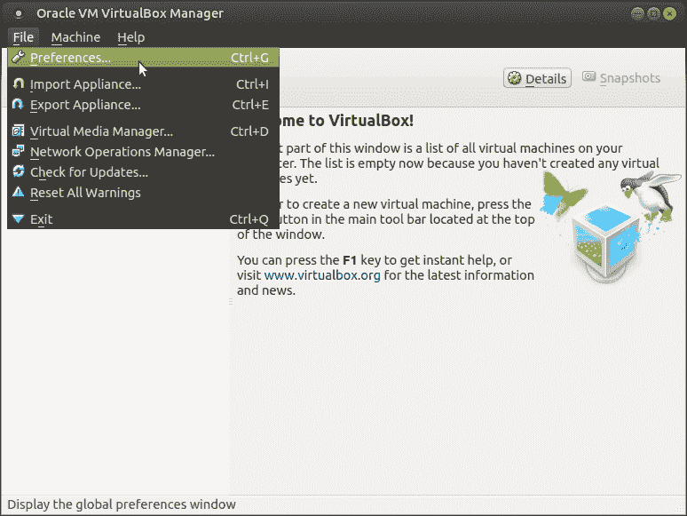

在 VirtualBox 中访问文件菜单

1.  接下来，点击**扩展**，然后点击右侧的绿色三角形图标。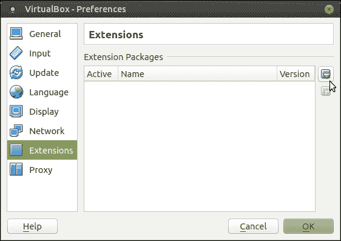

VirtualBox 设置

1.  选择您之前下载的扩展包，然后点击**打开**。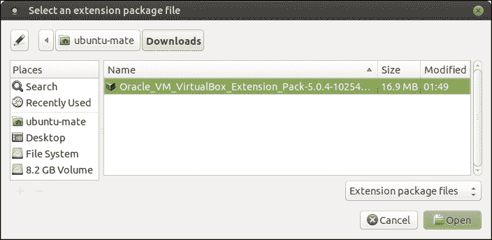

扩展包选择

1.  然后，您将被要求确认安装。点击**安装**。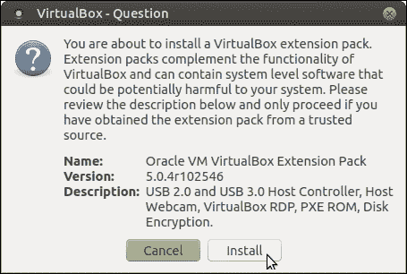

扩展包安装的确认

1.  将显示 VirtualBox 许可协议。请随意查看。然后，滚动到底部，点击**我同意**进行确认。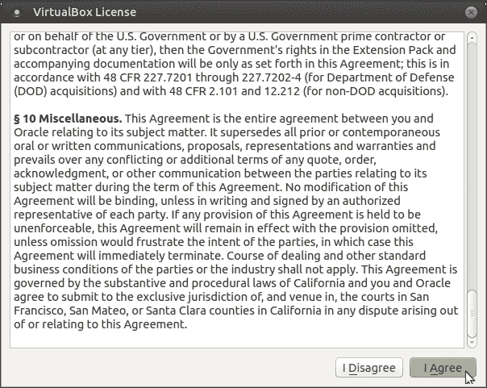

VirtualBox 许可协议

1.  如果您运行的是 Linux，可能会要求您输入 root 或 sudo 密码。如果是这样，请输入并继续。经过身份验证后，您应该会看到成功安装扩展包的确认。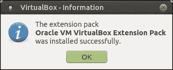

成功安装 VirtualBox 扩展包的确认

完成此过程后，VirtualBox 将在您的计算机上运行。

### 注意

在某些发行版中，密码提示可能不会出现，导致扩展包的安装失败。如果发生这种情况，请使用以下命令以 root 权限运行 VirtualBox：

```
sudo VirtualBox

```

然后，尝试重新安装扩展包。完成后，关闭 VirtualBox，然后以普通用户身份重新打开。

# 获取并安装 Debian 8

为了安装 Debian，我们首先需要获取一个**ISO** **镜像**文件。要做到这一点，请转到以下 URL：

[`www.debian.org/distrib/netinst`](http://www.debian.org/distrib/netinst)

有几个下载选项，但**netinst** ISO 将是我们的目标。对于大多数计算机来说，64 位（amd64）版本应该足够了——除非你确定你的计算机不支持 64 位。netinst 和完整安装镜像的主要区别在于 netinst 版本将从 Debian 的服务器上通过互联网下载所需的内容。只要你不在带宽受限的地区，这应该不是问题。

当然，ISO 文件本身是没有用的，除非你将它附加到虚拟机上。如果是的话，那么你就准备好了。如果你要设置一个物理机器，你需要使用你选择的光盘制作工具创建一个可引导的光盘，或者创建一个可引导的闪存驱动器。

### 注意

由于有大量不同的光盘制作工具可用，不可能完全介绍如何在你的环境中创建可引导光盘。在大多数情况下，你的工具应该有一个选项在菜单中烧录 ISO 镜像。如果你只是创建了一个数据光盘，那么光盘将无法作为 Debian 安装媒体使用。

安装 Debian 8 的步骤如下：

1.  在 Linux 系统中，你可以使用以下命令创建一个可引导的 Debian 闪存驱动器：

```
# cp name-of-debian.iso /dev/sd? && sync

```

1.  基本上，我们是直接将下载的 ISO 镜像复制到闪存驱动器上。当然，根据你的系统更改文件名和目标。要确定要使用的设备节点，执行以下命令：

```
# fdisk -l

```

1.  在输出中，你应该看到你的闪存驱动器的节点指定。该命令的输出将如下所示：

```
Device     Boot Start      End  Sectors  Size Id Type
/dev/sdb1        2048 60563455 60561408 28.9G 83 Linux

```

1.  然后，`/dev/sdb`将是用来创建闪存驱动器的设备。将所有内容放在一起，我们将使用以下命令创建闪存驱动器：

```
# cp name-of-debian.iso /dev/sdb && sync

```

### 提示

**下载示例代码**

你可以从你在[`www.packtpub.com`](http://www.packtpub.com)的帐户中为你购买的所有 Packt Publishing 图书下载示例代码文件。如果你在其他地方购买了这本书，你可以访问[`www.packtpub.com/support`](http://www.packtpub.com/support)并注册，文件将直接通过电子邮件发送给你。

1.  创建了可引导媒体后，将其插入计算机，按照计算机的具体指示访问引导菜单并选择你的 Debian 媒体。加载完成后，第一个屏幕会要求你选择语言。选择你的语言，然后点击**继续**。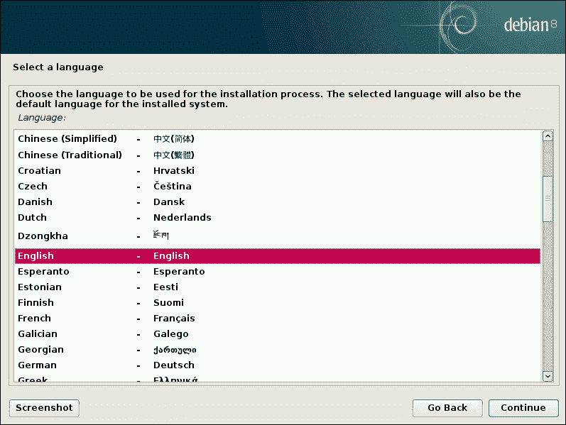

Debian 安装程序的语言选择屏幕

1.  选择语言后，下一个屏幕将让你选择你的位置。选择它，然后点击**继续**。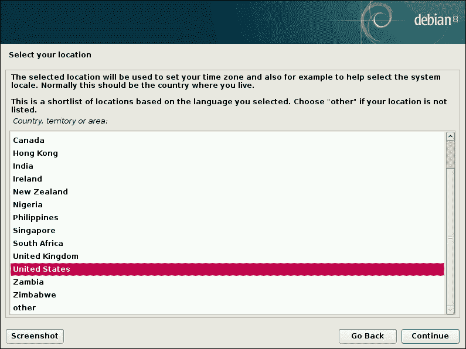

Debian 安装程序中的语言选择

1.  同样，选择适合你键盘的键盘映射，然后点击**继续**。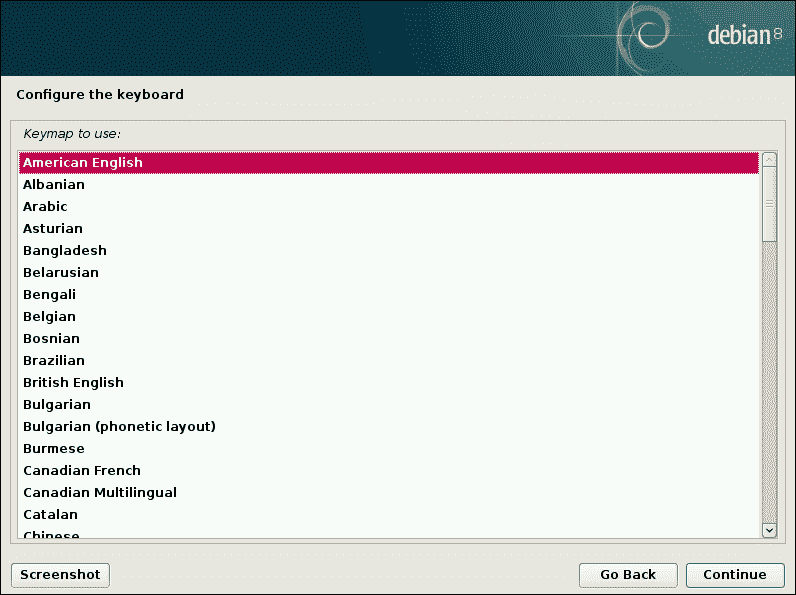

Debian 安装程序的键盘选择屏幕

1.  此时，Debian 安装程序将检测你的硬件，然后允许你配置主机名。对于这个选项，选择一个在网络上能识别你的设备的唯一主机名。完成后，点击**继续**。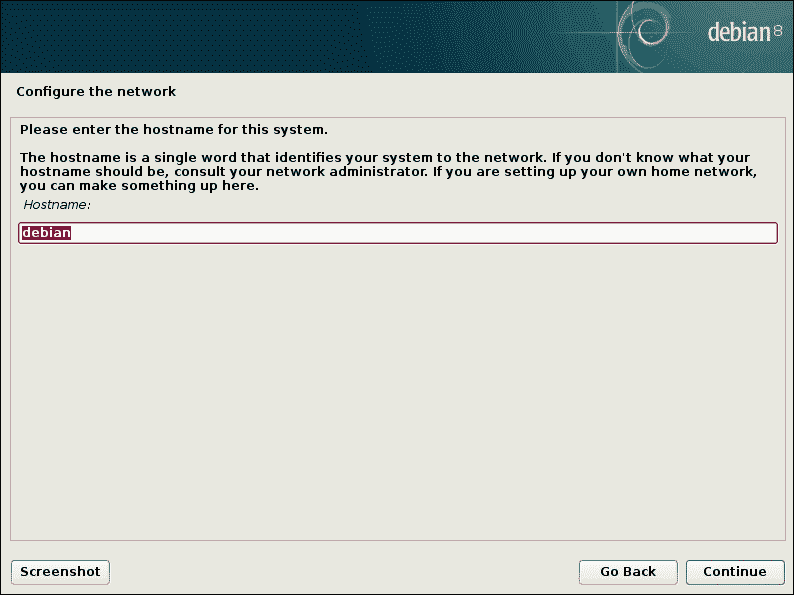

在 Debian 安装过程中选择主机名

1.  然后安装程序将要求你输入你的域名。如果你有域名，请在此处输入；否则，留空。点击**继续**。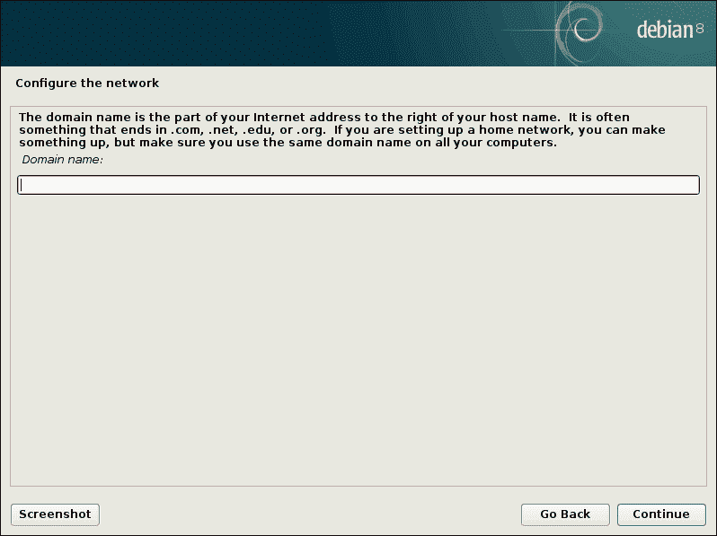

在安装 Debian 时配置域名

1.  接下来，你将被要求为**root**账户设置密码。为此，你应该创建一个唯一的（最好是随机生成的）密码。你可能知道，root 账户对系统有完全访问权限。设置密码后，点击**继续**。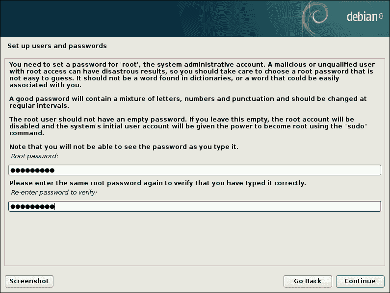

在 Debian 安装过程中输入 root 密码

1.  在接下来的三个屏幕中，您将设置您的用户帐户。首先，输入您的名字和姓氏，然后单击“**继续**”。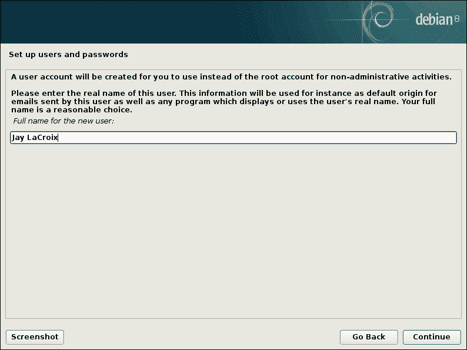

设置主要用户帐户的第一个屏幕

1.  然后，输入用户名，然后单击“**继续**”。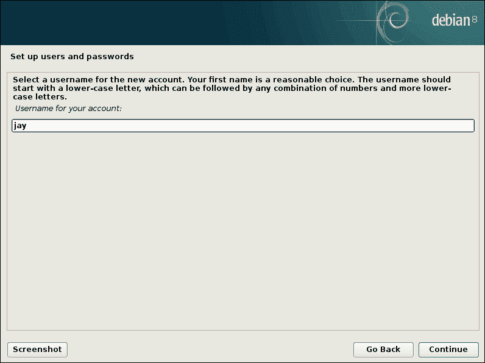

创建用户名

1.  用户设置部分的最后一部分将要求您创建一个密码。完成后，再次单击“**继续**”。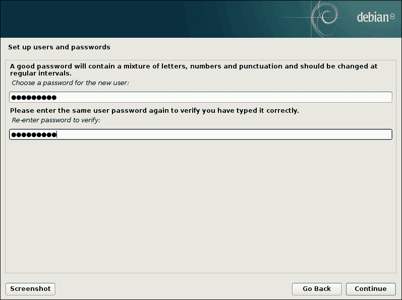

为主要用户设置密码

1.  接下来，Debian 将尝试使用**网络时间协议**（**NTP**），如果可用，来配置您的时钟。然后，您将看到一个屏幕，以选择您的时区。确保您的时区被突出显示，然后单击“**继续**”。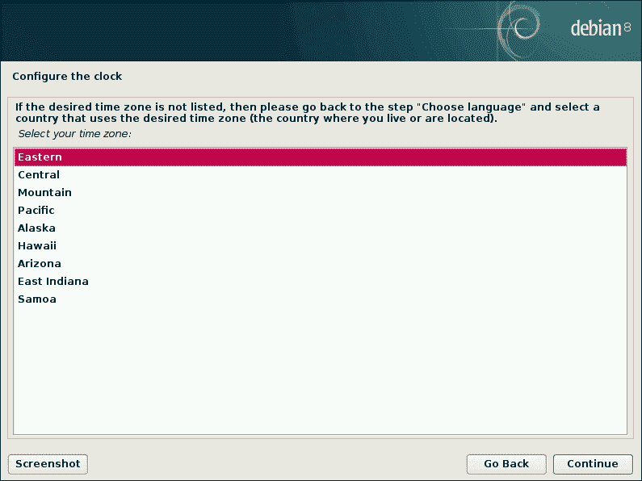

配置您的位置，用于时区

1.  现在，我们将对磁盘进行分区。随意对磁盘进行分区，因为就本书而言，没有分区要求。为了本说明，选择了 Debian 的默认选项**引导-使用整个磁盘**。如果您有首选的分区方案，请随意使用。完成后，单击“**继续**”。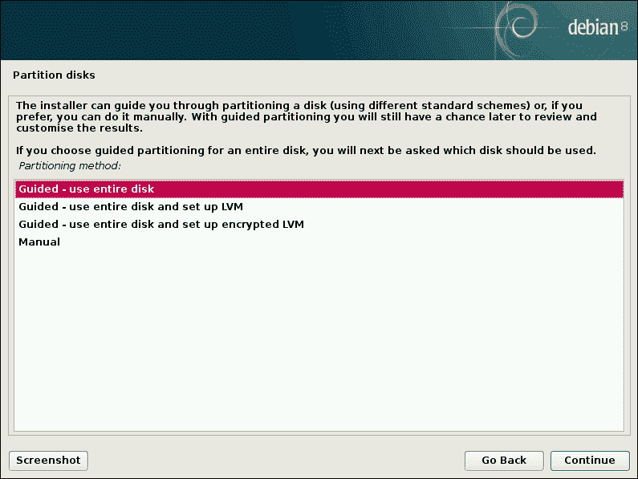

Debian 安装的分区部分的第一个屏幕

1.  接下来，您将不得不选择要安装 Debian 的硬盘。在本例中，虚拟机中只有一个可用的硬盘，用于捕获该过程。如果您有多个硬盘，请选择适当的硬盘进行安装，然后单击“**继续**”。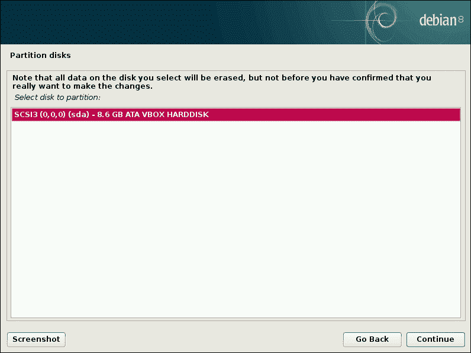

选择 Debian 的目标磁盘

1.  在接下来的部分，Debian 安装程序将询问您是否想要有一个单独的`/home`分区（如果您希望在安装之间保留文件，则建议使用），单独的`/home`，`/var`和`/tmp`分区，或者所有文件在一个分区中。本书没有分区要求，因此选择最符合您偏好的选项。选择完毕后，单击“**继续**”。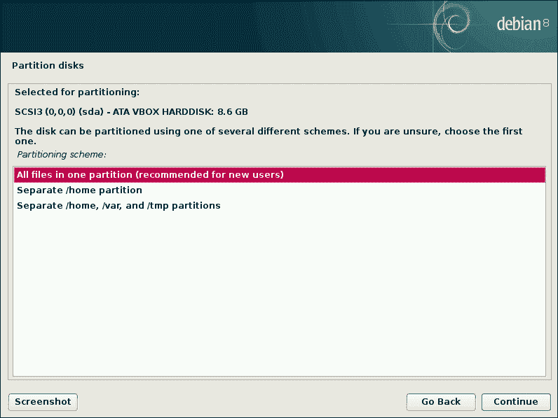

磁盘分区选择

1.  接下来，Debian 将显示即将进行的更改摘要。如果这些更改对您来说看起来不错，请确保**完成分区并将更改写入磁盘**被突出显示，然后单击“**继续**”。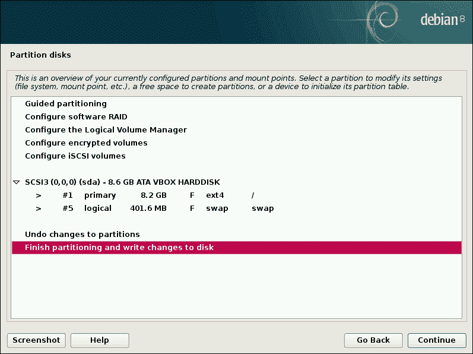

分区概述

1.  然后，您将不得不再次确认详细信息。选择**是**，然后单击“**继续**”。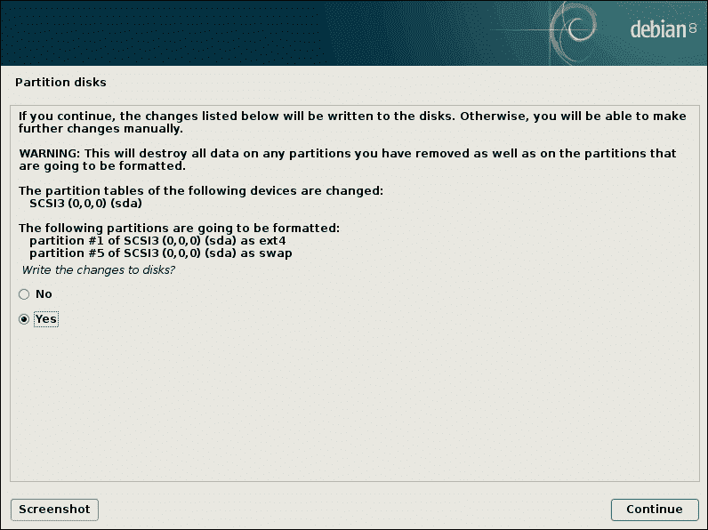

确认分区更改

1.  接下来将安装基本系统；这可能需要一些时间，具体取决于您的计算机和硬盘的速度。之后，您将看到一个屏幕，您将在其中选择最接近您的国家，以设置 Debian 的软件包管理器。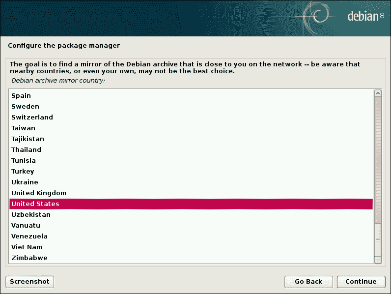

选择软件包管理器的位置

1.  接下来，您将为 Debian 的软件包存档选择一个镜像。在大多数情况下，默认选择通常是准确的。因此，除非它猜错了，否则保持默认选择不变，然后单击“**继续**”。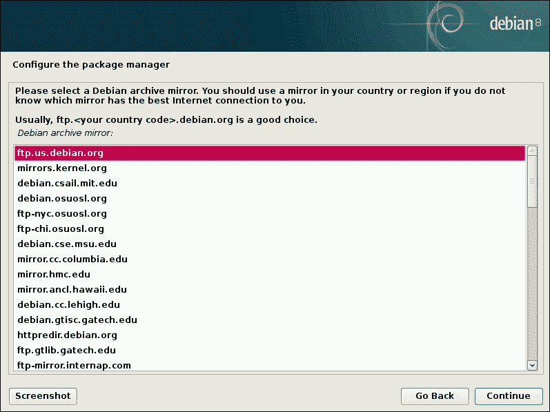

选择 Debian 软件包存档的镜像

1.  在下一个屏幕上，Debian 将给您一个机会来配置 HTTP 代理，如果有的话。如果没有，就留空。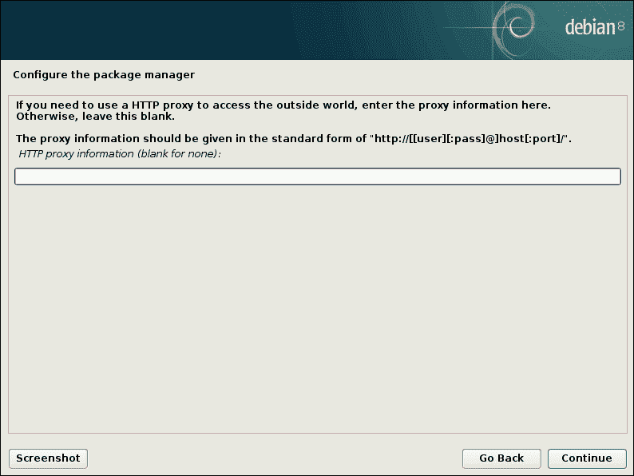

HTTP 代理配置

1.  接下来，Debian 将配置您的软件包管理器并更新您的源。几个进度条滚动后，您将看到一个新屏幕，询问您是否愿意向 Debian 提交使用统计信息。这些信息对 Debian 的开发人员很有帮助，但并非必需。做出您的选择，然后点击**继续**。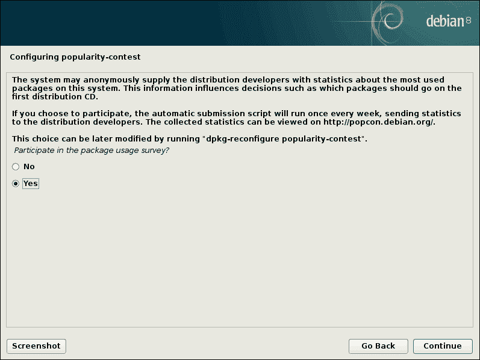

选择是否向 Debian 开发人员提供匿名统计信息

下一个屏幕将为我们提供可以添加到系统中的附加软件包，但这些并不是必需的（尽管保留标准系统实用程序是个好主意）。所提供的大多数选项允许我们选择**桌面环境**，但您并不需要安装一个。通常，服务器不会安装桌面环境。但是，如果您正在设置工作站 PC，这可能会有所帮助。

+   **GNOME**：这是 Debian 的默认桌面环境。GNOME 是最先进的，提供了一种独特的与计算机交互的范式。GNOME 大量使用虚拟工作区，这使您可以在几个桌面之间分割您的工作流程。不幸的是，GNOME 对硬件加速的要求相对较低；这意味着如果您没有现代的显卡，它将无法正常运行。

+   **Xfce**：它是 GNOME 的一个非常轻量级的替代品，已经存在很长时间了。Xfce 非常适合处理能力较低的计算机。如今，Xfce 的活跃开发不多，因此它在很多情况下更加稳定，尽管可能不会吸引那些喜欢现代功能的人。

+   **KDE**：它是一个现代的桌面环境，类似于 GNOME，但它更像 Windows 的用户界面。与 GNOME 一样，KDE 的硬件要求相对较低，尽管不像 GNOME 那么严格。KDE 具有备受 Linux 用户尊敬的**Dolphin**文件管理器。

+   **Cinnamon**：最初是作为 GNOME 的一个分支创建的，但它已经发展成为一个独立的桌面环境，几乎没有 GNOME 的依赖。Cinnamon 提供了更传统的桌面风格，同时又具有现代感。

+   **MATE**：它是对较旧的 GNOME 2.x 版本的延续。因此，MATE 在较旧的计算机上运行良好，并且得到比 Xfce 更多的开发。它可能不像 Xfce 那样稳定，但它很接近。

+   **LXDEL**：它也是较老的计算机的一个不错的选择，类似于 Xfce 但不那么受欢迎。

除了桌面环境的选择之外，建议从此列表中选择**SSH 服务器**。也可以选择**Web 服务器**，但最好等到我们讨论 Apache 的部分时再进行安装。

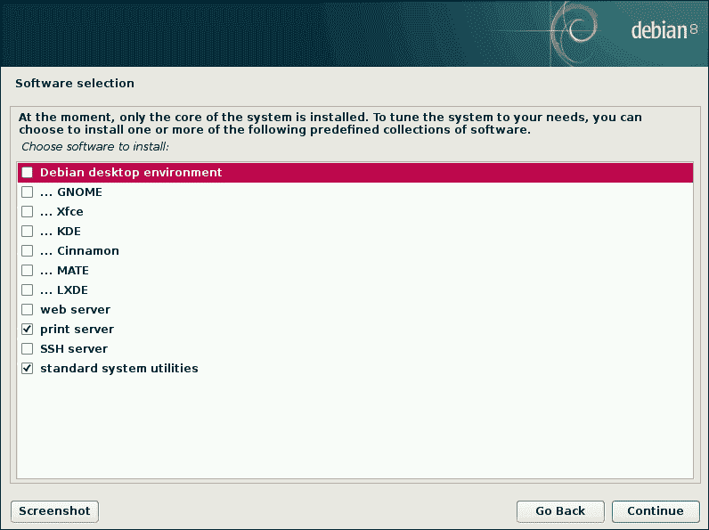

Debian 软件选择

1.  进行您的选择，然后等待安装程序的其余部分完成，因为 Debian 会安装您在上一步中选择的软件。然后，是时候配置 GRUB 了。**GRUB**是**Grand Unified Bootloader**的缩写，是我们启动系统所必需的。您将被问及是否要将 GRUB 安装到主引导记录中（您很可能会想这样做），因此确保**是**单选框被选中，然后点击**继续**。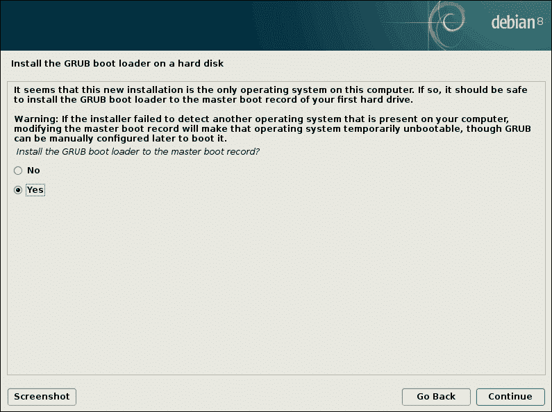

GRUB 配置

1.  接下来，选择要安装 GRUB 的目标。在大多数情况下，这将是`/dev/sda`。

GRUB 目标选择

1.  哇！我们终于准备好重启进入新的 Debian 环境了。点击**继续**最后一次，我们就可以开始了！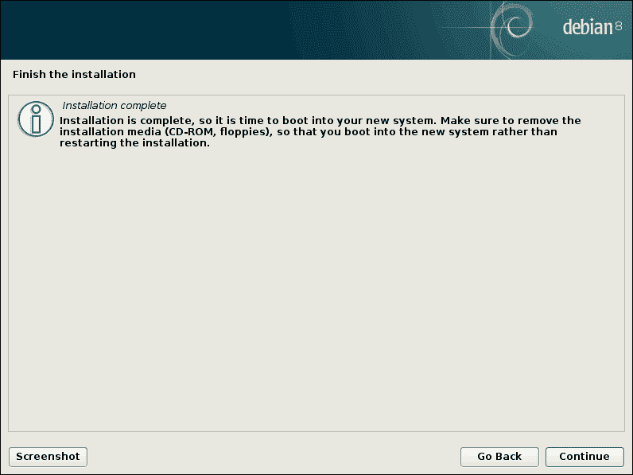

Debian 安装过程的最后一个屏幕

# 获取和安装 CentOS 7

在这个活动中，我们安装 CentOS 7（比 Debian 的步骤要少得多）。要下载 ISO，请转到以下 URL：

[`www.centos.org/download/`](https://www.centos.org/download/)

DVD ISO 链接应该满足我们的需求。

就像 Debian 的演练一样，我们需要创建一个可引导的光盘或闪存驱动器来开始安装。与 Debian 安装程序不同，现在我们需要一个 DVD-R 光盘，因为镜像太大而无法放入 CD-R 中。

如果您通过闪存驱动器安装，CentOS 维基百科中的以下 URL 描述了该过程：

[`wiki.centos.org/HowTos/InstallFromUSBkey`](http://wiki.centos.org/HowTos/InstallFromUSBkey)

从安装媒体引导后，执行以下步骤：

1.  您将首先看到一个屏幕，要求您在安装过程中选择要使用的语言。选择您的语言，然后单击**继续**。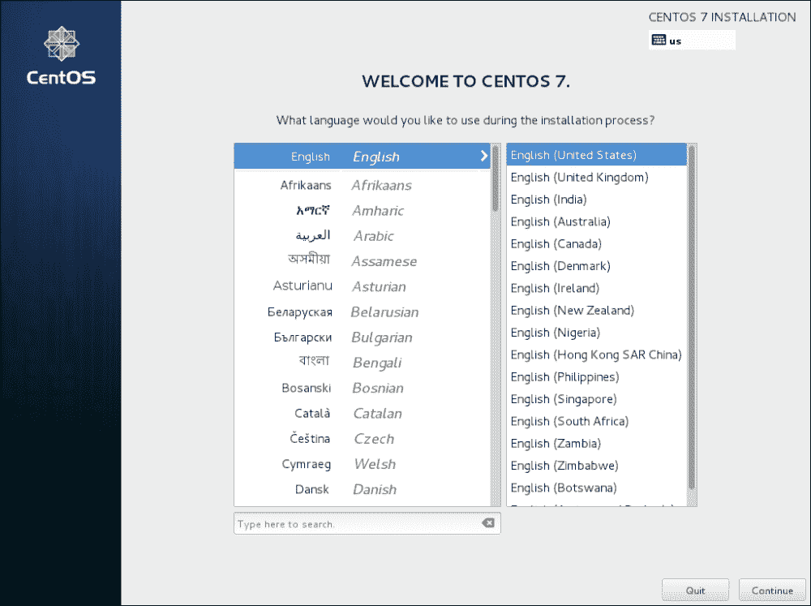

CentOS 安装期间的语言选择

1.  接下来出现的屏幕是安装的两个主要部分之一。这里显示的项目（**日期和时间**，**键盘，语言支持**，**安装源**，**软件选择**，**安装目标**和**网络和主机名**）可以按任何顺序完成。正如您在屏幕截图中所看到的，实际上只有一个部分（**安装目标**）是必需的。基本上，您可以浏览列出的每个部分并完成其任务，然后在完成时单击**开始安装**。如果选择不完成某个部分，将使用其默认值。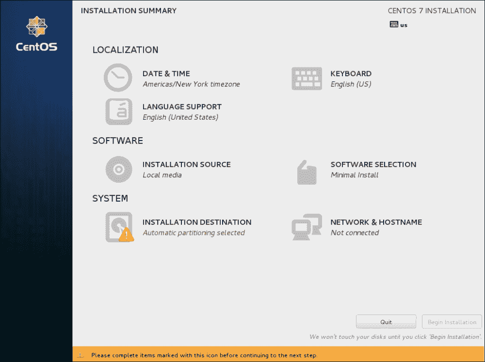

CentOS 安装过程的第一个主要部分

1.  对于**语言支持**，您将选择您的语言。完成后，单击左上角标有**完成**标签的图标。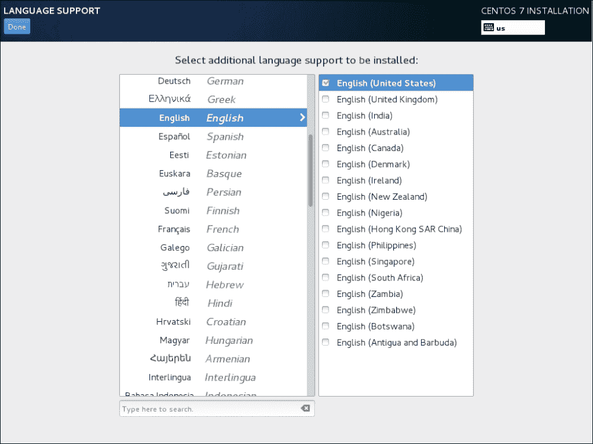

语言选择

1.  不要跳过**网络和主机名**部分。默认情况下，网络甚至根本没有启用，所以您可以通过单击接口旁边的切换开关来启用它。在底部附近，您可以输入计算机的所需主机名。完成后，单击**完成**。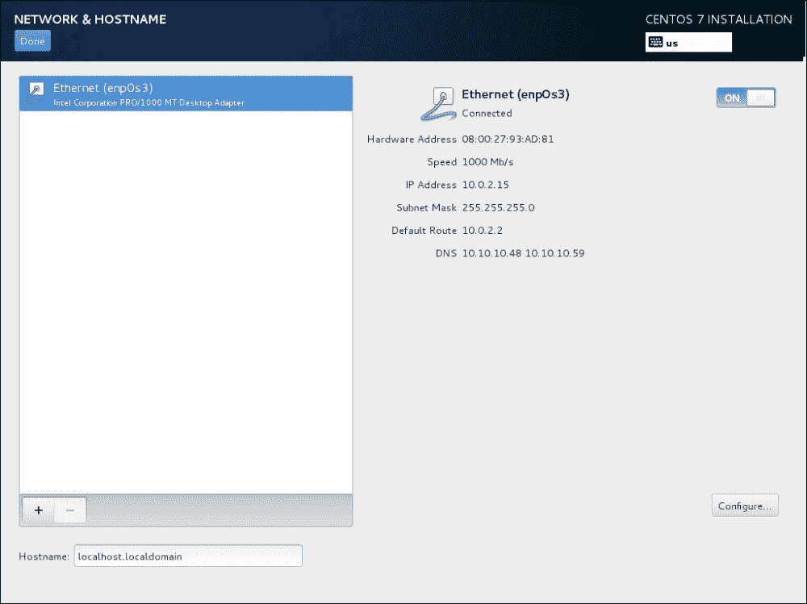

CentOS 安装期间的网络配置

1.  在**日期和时间**部分，您可以设置时钟和位置。请记住，如果您没有在**网络和主机名**部分启用网络接口，则将无法使用 NTP。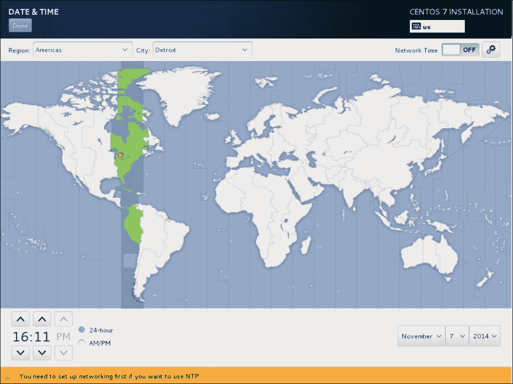

日期和时间配置

1.  完成**安装目标**部分是强制性的。在这里，您将选择要将 CentOS 安装到哪个磁盘，以及您的分区方案。在本演练中，我们将选择一个磁盘并保留默认分区，但如果愿意，可以自定义分区方案。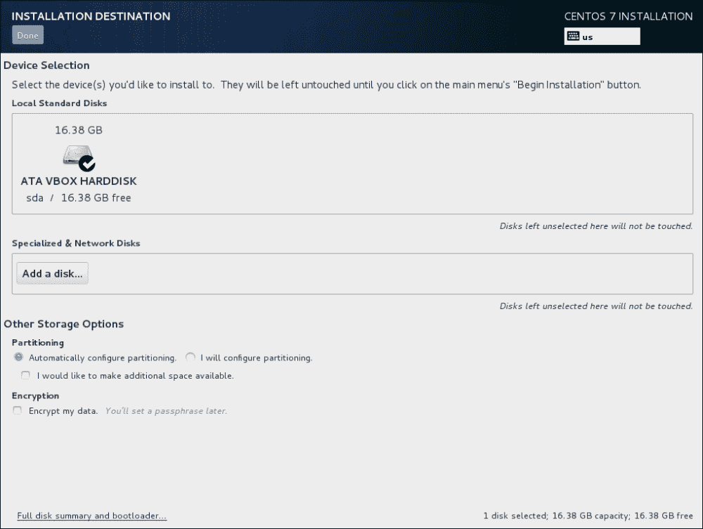

CentOS 安装程序的磁盘配置部分

1.  默认情况下，CentOS 将是**最小安装**。这意味着没有图形用户界面，只有默认的软件包。如果愿意，您可以选择桌面环境，如 GNOME 或 KDE，选择相应的选项。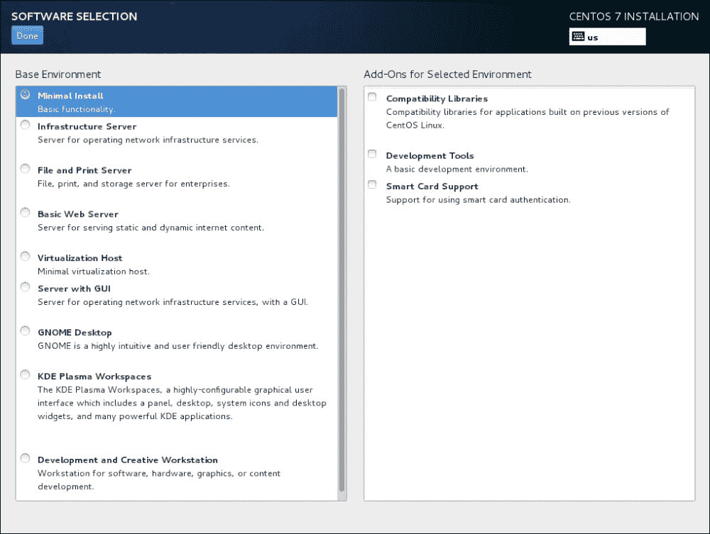

CentOS 软件选择

1.  单击**开始安装**后，您将被带到安装过程的第二个主要部分，而 CentOS 将在后台安装到您的系统上。这个部分要小得多，只有两个步骤。我们将设置 root 密码并创建一个标准用户帐户。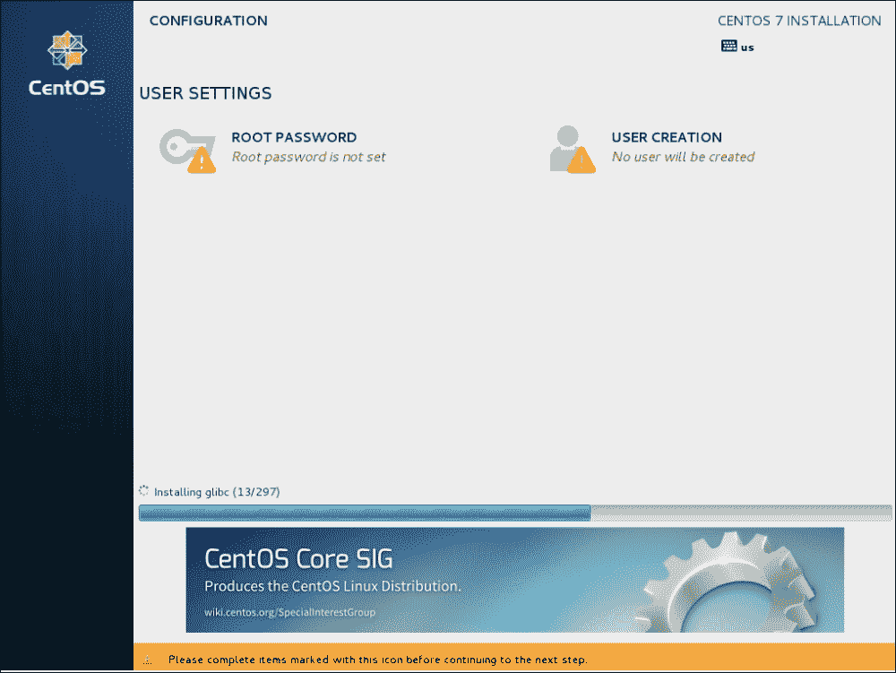

CentOS 用户配置

1.  对于 root 密码，请选择安全的密码。密码强度计会显示密码的预计强度。完成后单击**完成**。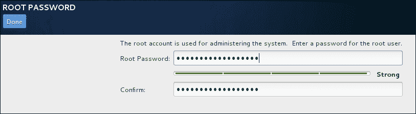

输入 root 密码

1.  最后，我们将创建一个标准用户。在这个屏幕上，我们将输入**全名**和**用户名**字段中的值，并为**密码**选择一个强密码。如果需要，您还可以选中标记为**使此用户成为管理员**的复选框。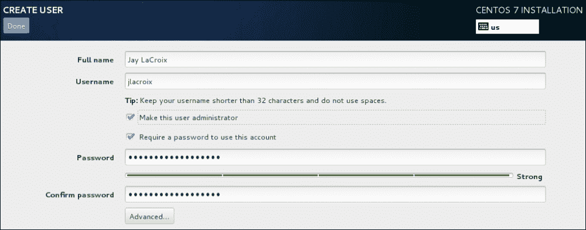

CentOS 用户创建

1.  最后，当安装完成时，点击**重新启动**，我们就完成了。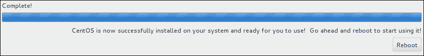

确认完成 CentOS 安装

完成这些步骤后，可以随意设置所需的 Linux 安装。在未来的章节中，我们将使用这些安装来配置网络并提高我们的知识。

# 总结

在本章中，我们通过设置环境进行了工作。我们讨论了虚拟机和物理机作为网络节点，甚至设置了一个或两个 Debian 和 CentOS 安装。

既然我们已经设置好了环境，现在是时候开始了。在第二章中，*重新审视 Linux 网络基础*，我们将涵盖我们旅程中所需的所有命令，例如配置网络接口，手动连接到网络以及设置网络管理器。敬请关注！
