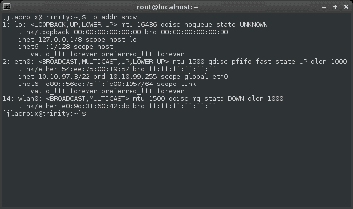
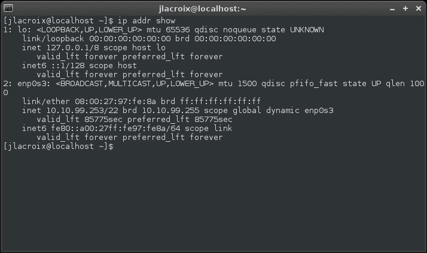
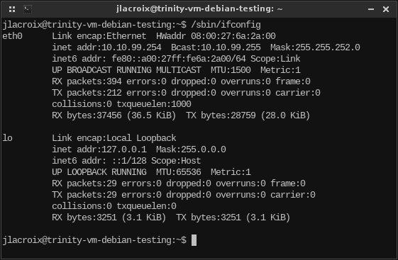
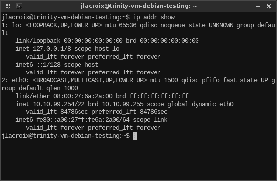
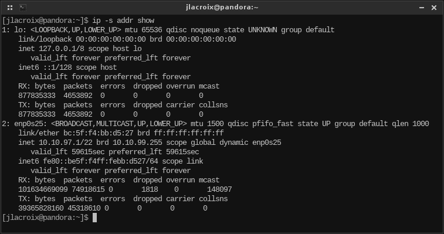
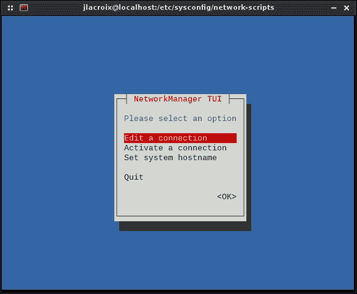
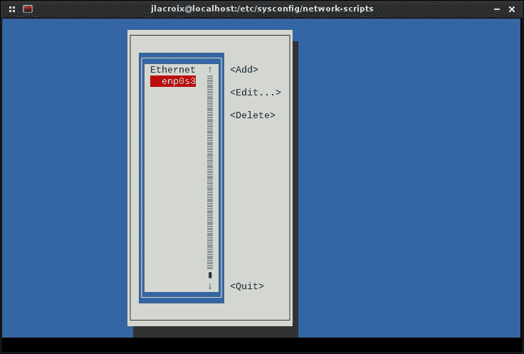
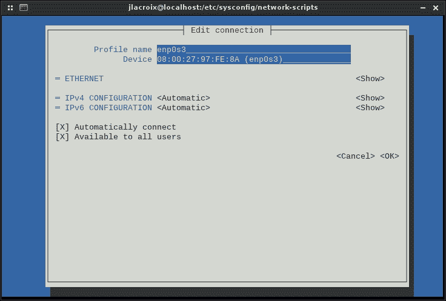
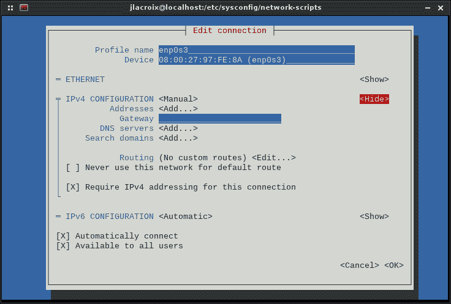
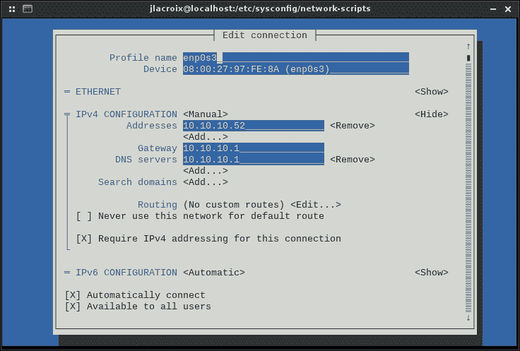

# 第二章：重新审视 Linux 网络基础知识

无论您对 Linux 网络有很多了解，还是刚刚开始，我们将在本章中总结 Linux 网络的基础知识。虽然 Linux 中的 TCP/IP 堆栈实现了与其他平台相同的功能，但使用特定工具来管理这样的网络。在这里，我们将讨论 Linux 如何处理 IP 地址分配、网络设备命名，以及启用和禁用接口。此外，我们还将讨论用于管理接口的图形和非图形工具。

在本章中，我们将涵盖：

+   理解 TCP/IP 协议套件

+   命名网络设备

+   理解 Linux 主机名解析

+   理解 iproute2 和 net-tools 套件

+   手动管理网络接口

+   使用网络管理器管理连接

# 理解 TCP/IP 协议套件

TCP/IP 是存在最流行的网络协议。它不仅是互联网的主要协议套件，而且几乎可以在任何支持网络连接的设备上找到。您的计算机非常了解这个套件，但现在您的手机、电视，甚至一两个厨房电器也支持这项技术。它真的无处不在。尽管 TCP/IP 通常被称为协议，但实际上它是由几个单独的协议组成的**协议套件**。从名称上看，我相信您可以知道其中两个是 TCP 和 IP 协议。此外，还有第三个 UDP，也是这个协议套件的一部分。

**TCP**是**传输控制协议**的缩写。它负责将网络传输分解成序列（也称为数据包或段），然后将它们发送到目标节点，并由 TCP 在另一端重新组装成原始消息。除了管理数据包，TCP 还确保它们被正确接收（尽其所能）。它通过**错误校正**来实现这一点。如果目标节点未收到数据包，TCP 将重新发送。它之所以知道这一点，是因为有**重传时间**。

在讨论错误校正和重传之前，让我们先看一下 TCP 发送数据时实际使用的过程。在建立连接时，TCP 执行**三次握手**，这包括在通信节点之间发送的三个特殊数据包。第一个数据包**SYN**（同步）由发送方发送给接收方。基本上，这是节点宣布它想要开始通信的方式。在接收端，一旦（如果）接收到数据包，就会向发送方发送**SYN/ACK**（同步确认）数据包。最后，发送方向接收方发送一个**ACK**（确认）数据包，这是对传输准备就绪的总体验证。从那时起，连接建立，两个节点能够相互发送信息。然后发送更多数据包，这构成了通信的其余部分。

如果我们生活在一个完美的世界，这就是所需要的一切。数据包永远不会在传输中丢失，带宽是无限的，数据包在传输过程中永远不会损坏。不幸的是，我们并不生活在一个完美的世界，数据包经常丢失和/或损坏。TCP 具有内置功能来处理这些问题。错误校正有助于确保接收到的数据包与发送的数据包相同。TCP 数据包包含一个校验和，并使用算法进行验证。如果验证失败，数据包被视为不正确，然后被丢弃。这种验证并不完美，所以您刚刚下载的文件仍然可能有一两个错误，但总比没有好。大多数时候，它运行得很好。

TCP 的流量控制功能处理数据传输的速度。虽然我们大多数极客拥有一套非常好的网络硬件，能够处理大量带宽，但互联网并不是一个一致的地方。您的高端交换机可能能够处理任何您投入其中的东西，但如果连接的上游某个地方存在薄弱环节，那就无关紧要了。网络传输的速度取决于最慢的点。当您向另一个节点发送传输时，您只能发送与其缓冲区能够容纳的数据量相同的数据。在某个时刻，其缓冲区将填满，然后无法接收任何额外的数据包，直到处理已有的数据包。此时发送到接收方的任何额外数据包都将被丢弃。发送方看到它不再收到 ACK 回复，然后减速并减慢传输速度。这是 TCP 用来根据接收节点能够处理的情况调整传输速度的方法。

流量控制通过利用所谓的**滑动窗口**来实现。接收节点指定了所谓的**接收窗口**，它告诉发送方在变得不堪重负之前能够接收多少数据。一旦接收窗口用尽，发送方就等待接收方澄清它再次准备好接收数据。当然，如果接收端向发送方发送了一个准备好接收数据的更新，而发送方却没有收到备忘录，如果发送方永远等待在传输中丢失的全清消息，我们可能会遇到真正的问题。幸运的是，我们有一个**持续计时器**来帮助处理这个问题。基本上，持续计时器表示发送方愿意等待多长时间，然后需要验证连接是否仍然活动。一旦持续计时器到期，发送方向接收方发送另一个数据包，以查看它是否能够处理。如果发送了回复，回复数据包将包含另一个接收窗口，表明它确实准备好继续对话。

**IP**（即**Internet Protocol**）处理 TCP 想要发送或接收的数据包的实际发送和接收。在每个数据包中，有一个称为**IP 地址**的目的地（我们将在本章中进一步讨论）。每个连接的网络接口都将有自己的 IP 地址，IP 协议将使用它来确定数据包需要去哪里，或者它来自哪个设备。TCP 和 IP 共同组成一个强大的团队。TCP 将通信分成数据包，而 IP 负责将它们路由到它们的目的地。

当然，还有**UDP**（即**User Datagram Protocol**），它也是套件的一部分。它与 TCP 非常相似，因为它将传输分成数据包。然而，主要区别在于 UDP 是**无连接**的。这意味着 UDP 不验证任何内容。它发送数据包，但不保证传递。如果目标没有收到数据包，它将不会被重新发送。

初次了解 UDP 的人可能会质疑为什么会考虑使用这样一个不可靠的协议。事实上，在某些情况下，诸如 TCP 这样的面向连接的协议可能会给某些类型的传输增加不必要的开销。Skype 是一个例子，它提供互联网上的音频通话和视频通话。在通信过程中，如果任一端丢失了一个数据包，重新发送它就没有多大意义。您只会听到一两秒钟的杂音，重新发送数据包肯定不会改变您难以听到一两个字的事实。对这样的传输添加错误校正将是毫无意义的，而且会增加开销。

讨论 TCP/IP 的全部内容本身就是一本书。在 Linux 中，这个协议的处理方式与其他平台基本相同，真正的区别在于协议的管理方式。在本书中，我们将讨论我们可以管理这个协议并调整我们的网络的方法。

# 命名网络设备

如今，一台计算机拥有多个网络接口并不罕见。例如，如果你使用的是笔记本电脑（而不是超极本），很可能你有一个有线和一个无线网络接口。每个网络接口都有自己的 IP 地址，并且它们彼此独立运行。事实上，你甚至可以在多个接口之间路由流量，尽管这在大多数 Linux 发行版中通常默认情况下是禁用的。就像每个接口都有自己的 IP 地址一样，每个接口也会被系统通过自己的设备名称来识别。在我们进一步讨论之前，打开终端并输入以下命令来查看你系统上的设备名称：

```
ip addr show

```

你的输出将如下所示：



ip 命令的输出，显示网络接口和地址分配

在这个例子中，我们看到列出了三个网络接口。第一个`lo`是本地环回适配器。第二个`eth0`是有线接口。最后，`wlan0`代表无线接口。根据这个输出，你可以推断出有一个网络电缆插入了（`eth0`有一个 IP 地址），并且它目前没有使用无线接口（`wlan0`没有列出 IP 地址）。

先前显示的输出来自运行 Debian 系统的系统。现在，让我们来看看在 CentOS 系统上运行相同命令时的输出：



ip 命令的输出，这次是从 CentOS 系统运行的

你看到了区别吗？如果你看有线连接，你会发现它的命名方式与 Debian 示例中的有线连接有很大不同。在 Debian 中，它的名称是`eth0`。但在 CentOS 中，它的名称是`enp0s3`。这就引出了本节的重点：CentOS 和 Debian 中的网络设备命名方式不同。

过去，有线以太网设备的名称以`eth`为前缀，无线设备以`wlan`为前缀。例如，第一个有线以太网适配器将被标记为`eth0`；第二个将是`eth1`，依此类推。无线设备也是类似处理的，第一个设备是`wlan0`，第二个将是`wlan1`，依此类推。在 Debian 中，这仍然是这种情况（即使在较新的版本中也是如此）。然而，一些使用**systemd**的发行版为网络设备采用了不同的命名方案。事实上，Debian 9 将在发布时更改其接口的命名方案。

这种更改的原因是因为以前的命名方案有时是不可预测的。当机器重新启动时，可能会出现网络设备名称交叉，导致对接口的混淆。各种发行版以自己的方式处理这个问题，但 systemd 具有内置的命名方案，该方案基于系统总线中卡的位置，而不仅仅使用`eth0`、`eth1`等名称，因为设备被探测。如前所述，尽管 Debian 8 也使用 systemd，但 Debian 仍然使用较旧的命名方案。在本书中，我们将练习 systemd 命令；但是，在第五章*监视系统资源*中，我们将更详细地解释 systemd，所以如果你还不知道它是如何工作的，也不用太担心。

在第二个示例中使用的 CentOS 机器上，有线网络卡被指定为`enp0s3`。那么，这到底意味着什么呢？首先，我们知道`en`代表以太网，这部分指定是给有线网络卡的。给定名称的其余部分代表系统总线上网络卡的位置。由于每个有线卡（如果您有多个）都会驻留在自己的物理位置，因此给定设备的名称是可预测的。如果您要为特定网络接口编写启动脚本，您可以相当肯定地知道您将编写脚本来引用适当的设备。

# 理解 Linux 主机名解析

在网络上，通过名称查找其他资源要比记住我们连接到的每个资源的 IP 地址方便得多。默认情况下，通过名称查找主机可能需要一些配置才能正常工作。例如，您可以尝试使用`ping`命令针对您的 Linux 机器之一的名称，可能会得到响应，也可能不会。这是因为您连接的资源的 DNS 条目可能不存在。如果不存在，您将看到类似以下的错误：

```
ping: unknown host potato

```

但是，如果您通过 IP 地址 ping 设备，很可能会得到响应：

```
64 bytes from 10.10.96.10: icmp_seq=2 ttl=64 time=0.356 ms

```

### 注意

按下键盘上的*Ctrl* + *C*来中断您的`ping`命令，因为如果找到连接，它将永远 ping 下去。

这样做的原因是为了使网络主机能够联系另一个主机，它需要知道其 IP 地址。如果您输入的是名称而不是 IP 地址，机器将尝试主机名解析，如果**域名系统**（**DNS**）中有机器的有效条目，您将能够收到回复。在具有基于 Windows 的**动态主机配置协议**（**DHCP**）和 DNS 服务器的 Microsoft 网络中，每当服务器分配 IP 地址给主机时，它通常会注册一个**动态 DNS**条目。Linux 基于的 DHCP 和 DNS 服务器也能够进行动态 DNS，但默认情况下不会配置，管理员也很少启用。在全 Linux 网络或任何不动态分配 DNS 的网络中，此 ping 很可能会失败。我们将在第第六章*配置网络服务*中更详细地讨论 DNS。

在大多数情况下，DNS 不是 Linux 主机解析主机名的第一个地方。系统上也保存有一个本地文件（`/etc/hosts`），您的机器将首先检查该文件。如果您要联系的主机的条目未包含在其中，您的机器将联系其配置的主 DNS 服务器，以查找您输入的名称的 IP 地址。以下是`host`文件的示例：

```
127.0.0.1    localhost
127.0.1.1    trinity-debian

# The following lines are desirable for IPv6 capable hosts
::1     localhost ip6-localhost ip6-loopback
ff02::1 ip6-allnodes
ff02::2 ip6-allrouters

```

在呈现的`hosts`文件中，我们可以看到`localhost`和`trinity-debian`的条目。这两个条目以`127.0.x.x` IP 地址开头，代表了机器本身。要测试这一点，请尝试 ping`localhost`以及您的机器的名称（在本例中为`trinity-debian`）。无论哪种方式，您都会得到回复。这是因为机器知道自己的主机名，而`localhost`使用环回适配器来访问自己。如果您愿意，您可以在此文件中创建额外的名称到 IP 地址的匹配。例如，如果您有一个名为`potato`的计算机，IP 地址为`10.10.96.10`，您可以将其添加到`hosts`文件的末尾，如下所示：

```
10.10.96.10 potato

```

从现在开始，你可以通过输入`potato`来访问 IP 地址`10.10.96.10`。你可以 ping 它，甚至在浏览器的地址栏中输入它（如果机器正在提供 web 内容）。事实上，主机条目甚至不需要是你网络中的本地资源。你甚至可以输入外部网站的 IP 地址，并通过不同的名称访问它。然而，这只是在理论上有效——一个设计良好的网站可能不会在这种情况下运行。

虽然首先检查`/etc/hosts`，但你的 Linux 安装包括一个文件`/etc/nsswitch.conf`，它用于确定主机解析的顺序。相关行以`hosts`开头，你可以使用以下命令轻松检查你的机器上的主机解析顺序：

```
cat /etc/nsswitch.conf |grep hosts

```

你将得到以下输出：

```
hosts:          files mdns4_minimal [NOTFOUND=return] dns

```

在这里，我们可以看到系统设置为首先检查`files`，这代表本地文件，包括`/etc/hosts`。如果搜索的是本地域名并且没有找到，`NOTFOUND=return`条目会导致搜索的其余部分中止。如果你搜索其他内容，下一个将被使用的资源是 DNS，如最后一个条目所示。除非你改变了这个文件，你的发行版也很可能设置为首先在本地主机文件中查找，如果资源在本地找不到，然后再查找 DNS。

# 理解 net-tools 和 iproute2 套件

相当长的一段时间以来，**net-tools**一直是在 Linux 系统上管理网络连接的工具套件。net-tools 套件包括诸如`ifconfig`、`route`、`netstat`等命令（我们将很快讨论）。net-tools 的问题在于，它的开发者已经十多年没有更新了，这使得许多发行版选择放弃它，转而选择**iproute2**套件，它提供了相同的功能（但使用不同的命令来实现相同的目标）。尽管 net-tools 正在被弃用，仍然有很多发行版包括它。例如，Debian 包括 iproute2 和 net-tools，因此你可以使用任一套件的命令。在 CentOS 中，iproute2 是默认安装的，而 net-tools 则不是。如果你想使用旧的 net-tools，你可以使用以下命令在 CentOS 中安装它：

```
# yum install net-tools

```

那么，为什么你要安装`net-tools`，如果它正在被弃用？许多系统仍然使用 net-tools 套件的命令，因此它不会很快从 Linux 社区消失。学习 net-tools 以及更新的 iproute2，将使你能够轻松适应任何环境。特别是对于使用旧发行版的旧数据中心来说，情况尤其如此。

让我们看看这些套件的实际操作。首先，要报告有关你的网络连接的基本信息，请输入以下命令：

```
/sbin/ifconfig

```

你应该看到以下输出：



ifconfig 命令的输出

在这里，我们可以看到来自内部有线连接（`eth0`）和环回适配器（`lo`）的统计信息。我们看到`HWaddr`，这是网络卡的**MAC 地址**。我们还有`inet addr`，这是网络卡由**DHCP 服务器**提供的 IP 地址。此外，我们可以看到子网掩码`Mask`，在这种情况下是`255.255.252.0`。在解决网络问题时，我们会使用这个工具来检查这些基本信息，比如确保我们有一个 IP 地址并且在适当的子网上。此外，我们还可以看到在接口上发送和接收的数据包数量，以及错误的数量。

使用 iproute2 套件，我们可以使用以下命令找到大部分相同的信息：

```
ip addr show

```

这是一个参考机器的输出：



ip addr show 命令的输出

正如你所看到的，报告的信息大部分是相同的，尽管布局有些不同。例如，一个区别是你看不到发送和接收的数据包数量，也没有错误计数（默认情况下）。过去，以下命令将显示正在使用的 IP 地址以及发送和接收的数据包：

```
ip -s addr show

```



使用添加了-s 标志的 ip addr show 命令的输出

不幸的是，最近版本的 iproute2 套件似乎不再显示这些信息（尽管添加了`-s`开关），但我们将在本书的后面看到更多的工具。

### 注意

在前面的命令中，你也可以输入整个字符串（地址）而不是`addr`。

```
ip address show

```

输出将是相同的。这些示例中显示的命令是压缩过的，这样可以节省输入时间。

iproute2 套件中有许多其他命令，我们将在本书继续讨论。现在，重要的是要理解这两个命令套件之间的区别，并注意 net-tools 不会永远可用。在本书编写的时间段内，两者都很常见。然而，iproute2 是未来的主流。

在结束本节之前，iproute2 套件中有一个非常简单的命令可能会很有用：

```
hostname

```

这个简单的命令只是打印出你的 shell 所连接的机器的主机名。如果你使用默认的 bash 提示符，很可能你已经知道你的机器的主机名。然而，hostname 命令至少可以帮助你验证你的设备是否报告了你认为它应该报告的主机名；当你处理名称解析问题时，这可能是有用的。

# 手动管理网络接口

在大多数情况下，在安装所需的 Linux 发行版后，它会通过 DHCP 接收一个 IP 地址，然后就可以使用了。无论你是使用图形桌面环境还是没有图形界面的 shell 环境，大部分魔术都是在后台发生的。虽然有图形工具来管理你的网络连接，但任何你可以通过图形工具做的事情，你也可以通过 shell 来做。在服务器的情况下，可能根本没有图形环境，所以学会如何通过 shell 管理你的网络连接非常重要。在本节中，我们将讨论在 Debian 中手动配置接口的方法，然后讨论如何在 CentOS 中做同样的事情。

在上一节中，讨论了两种查找当前 IP 地址的方法。根据你的发行版是否提供了 net-tools 或 iproute2，你可以使用其中一种方法或两种方法（或两者）。当然，这是第一步。你有连接吗？检查你是否有 IP 地址是一个合乎逻辑的起点。你也可以利用一个简单的 ping 测试：

```
ping www.yahoo.com

```

如果你得到了回应，很可能你有网络连接。然而，如果你没有得到回应，并不一定意味着你的网络有问题。有些站点配置为不响应 ping 测试。在可能的情况下，最好针对本地资源进行 ping 测试（比如你的本地 DNS 或 DHCP 服务器）。

在 Linux 中，ping 的工作方式与 Windows 有些不同。首先，在 Linux 中，`ping`命令默认会一直运行下去。要退出它，按键盘上的*Ctrl* + *C*。如果你希望`ping`在尝试一定次数后停止，添加`-c`标志并附上你希望它尝试的次数。在这种情况下，我们的`ping`命令将是这样的：

```
ping -c 4 www.yahoo.com

```

在这种情况下，`ping`将尝试四次，然后停止，并向你报告一些基本统计信息。

知道如何检查你是否连接是一回事，但当你没有连接时该怎么办呢？或者如果你的网络连接是活跃的，但报告无效信息，你需要重新配置它呢？

首先，让我们探讨如何检查我们当前的配置。在 Debian 中，默认控制网络设备的文件是以下文件：

```
/etc/network/interfaces

```

根据几个变量，包括您如何配置 Debian 安装，这个文件可能会有不同的创建方式。首先，您可能会看到列出了几个接口，比如回环适配器、有线以太网和无线。如果您有多个有线接口，您也会在这里看到任何额外的适配器。简单地说，这个文件是一个**配置文件**。它是一个文本文件，包含了底层 Linux 系统理解的信息，并导致设备按照文件中指定的方式进行配置。

要编辑这样的文件，有许多 Linux 文本编辑器可用，包括 GUI 和基于终端的。我个人最喜欢的是**vim**，尽管许多管理员通常从**nano**开始。nano 文本编辑器非常容易使用，但功能很少。另外，vim 比 nano 有更多的功能，但使用起来有点难。你可以自己选择。要在 nano 中打开一个文件，你只需要输入`nano`，然后加上你想编辑的文本文件的名称。如果文件不存在，命令会在你保存文件时创建它。对于我们的`/etc/network/interfaces`文件，命令将类似于这样：

```
# nano /etc/network/interfaces

```

使用 nano 只是简单地打开一个文件，使用键盘上的箭头键将插入点移动到您想要输入的位置，按下*Ctrl* + *O*保存文件，然后按下*Ctrl* + *X*退出。还有更多功能，但就目前来说，这就是我们需要的。本书不涵盖 vim 的教程，但如果你愿意，可以随意尝试。

现在，回到我们的`/etc/network/interfaces`文件的主题。重要的是要注意，这个文件对于以太网和无线适配器并不是必需的。如果在这个文件中除了回环设备之外什么都没有，那就意味着网络连接是由**网络管理器**来管理的。网络管理器是一个用于管理客户端网络连接的图形工具（我们将在本章后面讨论）。对于本节中的目的，当您第一次设置 Debian 时，通常会安装网络管理器，特别是当您决定包括图形桌面环境时（如 GNOME、Xfce 等）。如果您选择了图形环境，那么网络管理器很可能已经为您设置好，并且正在处理配置您的接口的工作。如果您的`interfaces`文件除了回环适配器的条目之外是空白的，那就意味着网络管理器正在处理这个任务。

在 Debian 中，非常常见的是在野外看到没有安装图形环境的安装。对于服务器来说，通常不需要 GUI 来实现其目的。典型的 Linux 管理员会为服务器配置最少的必需软件包，以便它完成其工作，这通常不包括桌面环境。在这种情况下，可能根本没有安装网络管理器。如果没有安装，那么`/etc/network/interfaces`文件将负责设置连接。在其他情况下，也许网络管理器已经安装，但是被管理员禁用了，而是在这个文件中配置了网络连接。

那么，什么时候应该使用网络管理器，什么时候应该只在`interfaces`文件中配置连接？对于最终用户工作站（台式机和笔记本电脑），几乎总是首选网络管理器。对于服务器，特别是在设置静态 IP 地址时，首选在`/etc/network/interfaces`中设置配置。

我们已经讨论了`interfaces`文件是什么，以及何时使用它。现在，让我们看一下你可能会看到的`一些`各种类型的配置。首先，让我们看一下只列出本地回环适配器时的`interfaces`文件：

```
cat /etc/network/interfaces

# The loopback network interface
auto lo
iface lo inet loopback

```

### 注意

注释以第一个字符`#`声明，在解析配置文件时会被忽略。在前面的例子中，第一行被忽略，只是作为信息。

在这个例子中，这台机器很可能正在使用网络管理器，因为有线（通常是`eth0`）或无线（通常是`wlan0`）接口都没有显示。为了验证这一点，我们可以通过以下命令检查网络管理器是否正在运行：

```
ps ax |grep NetworkManager

```

如果网络管理器正在运行，你可能会看到这样的输出：

```
446 ?        Ssl    0:00 /usr/sbin/NetworkManager --no-daemon

```

这个谜团已经解开了；这台机器使用了网络管理器，所以在`/etc/network/interfaces`中没有存储`eth0`或`wlan0`的配置。现在，让我们看一个网络管理器没有使用的机器的示例。要在这样的安装中配置`eth0`，`interfaces`文件看起来会类似于这样：

```
# The loopback network interface
auto lo
iface lo inet loopback

# Wired connection eth0
auto eth0
iface eth0 inet dhcp

```

正如我们之前所做的那样，我们仍然有回环条目，但在文件的末尾，包括了`eth0`的配置细节。就像我们的回环条目一样，我们声明`auto`，然后是一个接口名`eth0`，这意味着我们希望接口`eth0`自动启动。在下一行中，我们澄清了我们希望为接口`eth0`使用`dhcp`，以便它将从 DHCP 服务器自动获取 IP 地址。

在现实世界中，没有理由放弃网络管理器，而选择手动配置连接，当我们要做的只是使用 DHCP 时。然而，这个例子被包含在这里，因为在服务器从 DHCP 服务器接收**静态租约**而不是动态租约的情况下，这实际上是相当常见的。使用静态租约，DHCP 服务器将为特定 MAC 地址提供相同的 IP 地址。因此，在这种情况下，服务器可以为其指定 IP 地址，但 IP 地址仍然是由 DHCP 服务器提供的。这也被称为**DHCP 保留**。

当然，也有可能（也许更常见）只在 interfaces 文件中声明静态 IP。我们将在下面探讨这种方法。但是，值得指出的是，静态租约具有额外的好处。使用静态租约，节点的 IP 配置不会与其安装的发行版的配置绑定。如果从活动媒体引导，甚至重新安装发行版，节点每次接口启动时都会收到相同的 IP 地址。静态租约的另一个好处是，您可以在一个中心位置（在 DHCP 服务器上）配置所有节点的静态 IP，而不必跟踪每台机器的单独配置文件。

### 注意

重要的是要注意，在`interfaces`文件中看到接口列出`dhcp`并不总是意味着正在使用静态租约。对于 Debian 来说，管理员通常只是不安装网络管理器，然后在启动服务器时手动输入`interfaces`文件。

现在，让我们看一个示例`interfaces`文件，其中手动配置了静态 IP：

```
# The loopback network interface
auto lo
iface lo inet loopback

# Wired connection eth0
auto eth0
iface eth0 inet static
 address 10.10.10.12
 netmask 255.255.248.0
 network 10.10.10.0
 broadcast 10.10.10.255
 gateway 10.10.10.1

```

首先，注意以下一行的变化：

```
iface eth0 inet static

```

最后，我们声明了`static`而不是`dhcp`。如果我们忘记更改这个，那么配置文件的所有剩余行将被忽略。

然后，我们声明了接口`eth0`的统计信息。我们将 IP 地址设置为`10.10.10.12`，子网掩码设置为`255.255.248.0`，我们加入的网络设置为`10.10.10.0`，广播 ID 为`10.10.10.255`，网关为`10.10.10.1`。我们将在本书的后面讨论这些值实际上是什么意思，但现在需要注意的重要事情是这个文件的语法。

现在您可能想知道我们如何使这些更改生效，既然我们费力地配置了我们的接口。要这样做，您将使用以下命令：

```
# systemctl restart networking.service

```

在 CentOS 中，手动配置网络接口的过程与 Debian 系统有些不同。首先，我们需要知道机器上安装了哪些接口。运行以下命令将列出它们以及当前分配的任何 IP 地址：

```
ip addr show

```

在本节中，我将使用`enp0s3`，这是本书用于测试的测试机器上的默认设置。如果您的设置不同，请相应更改这些示例命令。无论如何，既然我们知道我们正在使用哪个接口，让我们配置它。接下来，导航到以下目录：

```
cd /etc/sysconfig/network-scripts

```

如果列出该目录中的文件存储（`ls`命令），您应该看到一个与接口名称匹配的配置文件。在我们的示例中，`enp0s3`，您应该看到一个名为`ifcfg-enp0s3`的文件。

用您选择的文本编辑器打开此文件，您将看到配置类似于以下内容：

```
HWADDR="08:00:27:97:FE:8A"
TYPE="Ethernet"
BOOTPROTO="dhcp"
DEFROUTE="yes"
PEERDNS="yes"
PEERROUTES="yes"
IPV4_FAILURE_FATAL="no"
IPV6INIT="yes"
IPV6_AUTOCONF="yes"
IPV6_DEFROUTE="yes"
IPV6_PEERDNS="yes"
IPV6_PEERROUTES="yes"
IPV6_FAILURE_FATAL="no"
NAME="enp0s3"
UUID="a5e581c4-7843-46d3-b8d5-157dfb2e32a2"
ONBOOT="yes"

```

如您所见，此默认文件使用`dhcp`，列在第三行。要配置此连接以利用静态地址，我们需要相应地更改文件。文件的更改部分已用粗体标记：

```
HWADDR="08:00:27:97:FE:8A"
TYPE="Ethernet"
BOOTPROTO="static"
IPADDR=10.10.10.52
NETMASK=255.255.255.0
NM_CONTROLLED=no
DEFROUTE="yes"
PEERDNS="yes"
PEERROUTES="yes"
IPV4_FAILURE_FATAL="no"
IPV6INIT="yes"
IPV6_AUTOCONF="yes"
IPV6_DEFROUTE="yes"
IPV6_PEERDNS="yes"
IPV6_PEERROUTES="yes"
IPV6_FAILURE_FATAL="no"
NAME="enp0s3"
UUID="a5e581c4-7843-46d3-b8d5-157dfb2e32a2"
ONBOOT="yes"

```

在这里，我们对文件进行了四处更改。首先，我们将`BOOTPROTO`更改为`static`。然后，在其下面添加了以下全新的行：

```
IPADDR=10.10.10.52
NETMASK=255.255.255.0
NM_CONTROLLED=no

```

我相信您可以理解前两行的作用。我们添加的第四行可能也很明显，但以防万一，我们基本上告诉系统，我们宁愿不通过网络管理器管理连接，并且希望自己通过此配置文件处理。

当然，我们需要重新启动网络以使这些更改生效。由于 CentOS 使用 systemd（就像 Debian 8 一样），命令非常相似：

```
# systemctl restart network.service

```

就是这样。我们已经在 Debian 和 CentOS 中手动设置了网络接口。

# 使用网络管理器管理连接

虽然我们刚刚费力地手动配置了网络接口，但并不总是需要这样做。例如，最终用户的工作站将受益于网络管理器为我们处理这项工作。对于笔记本电脑及其无线接口，网络管理器比大多数人做得更好。

网络管理器通常默认安装在大多数 Linux 发行版中。对于 Debian 来说，通常在选择图形桌面环境时安装。如果您选择了仅安装 shell（在安装过程中取消了桌面环境的选项），那么您可能没有安装它。要确定，请执行以下命令（在 Debian 和 CentOS 上都适用）：

```
ps ax |grep NetworkManager

```

如果您看到网络管理器正在运行，则已安装。但为了确保，您可以在 Debian 中执行以下命令：

```
aptitude search network-manager

```

如果安装了网络管理器，您将看到它列在以下位置（左侧将有一个`i`标记）：

在 CentOS 中，您可以使用以下命令检查网络管理器是否已安装：

```
yum list installed |grep NetworkManager

```

如果您正在运行图形桌面环境，您可能在系统托盘中运行了网络管理器的实现。如果是这样，请随时使用可用的 GUI 工具管理您的连接。根据您使用的图形桌面环境，执行此操作的说明将有所不同。在本节中，我们讨论了一种更通用的方法来利用网络管理器配置连接。这种方法是使用以下命令：

```
nmtui

```

`nmtui`命令允许您在 shell 环境中配置网络管理器，但具有类似 GUI 的控件。



通过 nmtui 配置系统的网络连接

如果我们点击**编辑连接**，我们将看到机器上可用的接口列表：



nmtui 接口选择

当我们选择一个接口时，我们首先会看到一些基本信息。



在 nmtui 中编辑连接的第一个屏幕

编辑此接口的 IP 地址，请按下箭头键选择**<自动>**在**IPv4 配置**左侧，并按*Enter*。然后，按右箭头键选择**<显示>**选项并展开其余字段。



使用 nmtui 编辑连接

要编辑项目，请按下箭头键到字段旁边的**<添加...>**选项。它会展开一个文本框，允许您编辑该项目。



使用 nmtui 编辑连接

完成后，滚动到底部并按*Enter*在**<确定>**上保存您的更改。您应该能够选择通过网络管理器管理您的连接。

# 摘要

在本章中，我们讨论了 Linux 中 TCP/IP 网络的基础知识，甚至手动配置了我们的接口。我们探讨了如何编辑与 Debian 和 CentOS 相关的配置文件，以及如何在两个平台上重新启动网络。我们简要讨论了 systemd 方法，尽管我们将在第五章中更深入地探讨 systemd，*监视系统资源*。我们通过使用`nmtui`工具为我们的系统配置网络管理器来结束本章。

在下一章中，我们将看看如何使用**安全外壳**（**SSH**）远程管理我们的系统。
