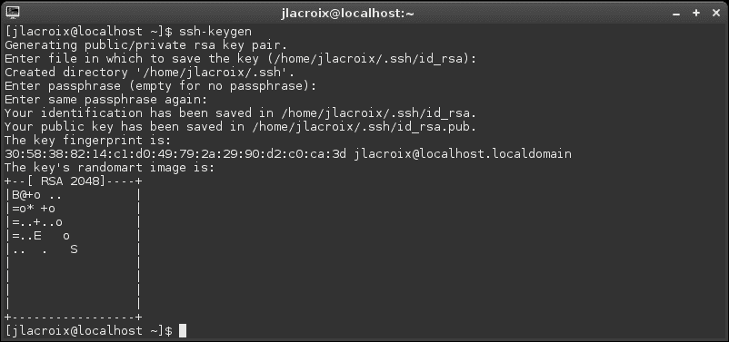
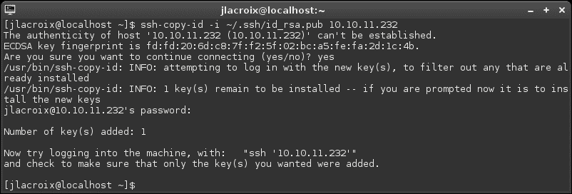

# 第三章：通过 SSH 在节点之间通信

SSH 是 Linux 网络管理员最重要的工具之一。它允许您远程连接到服务器和其他工作站，并在您喜爱的终端仿真器中进行工作，所有这些都可以在您的办公桌上完成。虽然 SSH 可能不是每种情况下的完美工具，但一旦开始使用，您就无法想象没有它的生活。

在本章中，我们探讨 SSH 并涵盖以下主题：

+   使用 OpenSSH

+   安装和配置 OpenSSH

+   通过 openssh-client 连接到网络主机

+   OpenSSH 配置文件

+   理解和使用`scp`

+   通过`scp`将文件传输到另一个节点

+   通过 SSH 进行流量隧道

+   生成公钥

+   保持 SSH 连接活动

+   探索 SSH 的替代方案-使用 Mosh（移动 shell）

# 使用 OpenSSH

**SSH**，或**安全外壳**，是一个非常方便的实用程序。SSH 并非在服务器室执行任务的绝对要求，但它是使您的生活变得更加轻松的工具之一。通过 SSH，您可以在不同的 Linux 机器上执行命令，就好像您就坐在它的面前一样。当然，您可以随时走进服务器室，拿起键盘开始工作，但现在远程管理才是最重要的。特别是如果轮到您值班并且办公室出现问题。根据问题的性质，SSH 可能允许您在家中（甚至在智能手机上）解决问题，而无需一直走到公司的服务器室。这还不是全部；SSH 还允许您将文件从一台机器复制到另一台机器，并在服务器上的目录上设置一个实际的存储挂载，可以在您的工作站上像本地文件系统的一部分一样处理。

连接到远程主机并打开命令 shell 的概念并不新鲜，SSH 也不是第一个这样做的工具。其他解决方案，如 telnet 或 rlogin，已经存在了相当长的时间。使 SSH 令人向往的是它比早期技术更加安全，因为通信是加密的。SSH 有两种协议，协议 1 和协议 2。协议 1 绝对不应该在任何情况下使用，因为它不再安全。使用协议 1 发送的流量可能会被攻击者拦截。我们将在第九章*保护您的网络*中讨论 SSH 的这一方面，但现在我想确保您了解，您不应该使用协议 1 的 SSH 连接。您不应该向任何主机提供协议 1。如今，协议 2 是默认的。

默认情况下，SSH 使用端口 22 进行通信。如果防火墙阻止了这个端口，您将无法连接。这在以 Windows 为中心的企业中非常常见，因为 SSH 在 Linux/UNIX 世界中更为常见。通过更改 SSH 服务器的配置，您可以将其配置为监听任何您喜欢的端口。虽然我们暂时不会讨论如何配置这一点（我们将在第九章*保护您的网络*中讨论这一点），但这里提到是因为重要的是您可能会遇到一种情况，即无法连接到 SSH 服务器，例如当端口关闭或已更改为其他端口时。

尽管我提到学习 SSH 实际上并不是在服务器或工作站上执行任务的必需条件，但强烈建议您花时间学习它。不仅是使用 Linux 服务器的公司希望您了解它，您也不想错过它的优势。值得庆幸的是，尽管 SSH 非常有用，但学习它并不难。您可以在五分钟内轻松学会最基本的功能，或者在一周内学会高级用法。

# 安装和配置 OpenSSH

OpenSSH 有两个部分，客户端应用程序和服务器应用程序。在您的发行版中，默认情况下可能已安装了客户端应用程序。客户端允许您通过 SSH 连接到其他节点，但仅具有客户端不允许其他人连接到您。如果要通过 SSH 访问某台机器，则该机器还必须安装 SSH 服务器应用程序。您选择的发行版可能默认安装了服务器应用程序，但大多数不会。这是出于安全考虑-除非您绝对需要运行并侦听连接的应用程序，否则应该不存在。应用程序越少，攻击面就越小。

在 Debian 中，SSH 服务器是安装过程中的一个选项。如果选择了，SSH 的服务器应用程序将存在并默认启动。要检查 Debian 系统上是否安装了 SSH 服务器包，请执行以下命令：

```
aptitude search openssh-server

```

在输出中，如果第一个字符是`i`，则表示已安装该软件包。您可以使用以下命令检查**sshd**服务是否正在运行：

```
ps ax | grep sshd

```

如果服务未运行，可以通过在 Debian 上执行以下命令来启动它：

```
# systemctl start ssh.service

```

在 Debian 上，您可以通过执行以下命令来检查 SSH 服务的状态：

```
# systemctl status ssh.service

```

如果正在运行，则输出应包括`active (running)`：

如果您的系统没有安装 SSH 服务器包，可以使用以下命令安装它：

```
# apt-get install openssh-server

```

安装软件包后，使用以下命令检查服务的状态以查看是否已启用：

```
systemctl status ssh.service

```

否则，下次启动机器时它将不会自动启动。

在 CentOS 中，您还可以使用`systemctl`命令来检查 SSH 服务的状态，尽管守护程序的名称有点不同：

```
systemctl status sshd.service

```

在 Debian 中的上一个命令中，服务的名称是`ssh.service`。在 CentOS 中，它的名称是`sshd.service`。在 CentOS 中，SSH 的客户端和服务器包都是默认安装的，因此在 CentOS 系统完成安装后，您应该已经拥有它们。如果由于某种原因未安装该软件包，可以通过`yum`安装：

```
# yum install openssh-server

```

安装后，请通过检查状态来确保服务已启用：

```
systemctl status sshd.service

```

如果 SSH 服务未处于启用状态（启动时启用），请执行以下命令：

```
# systemctl enable sshd.service

```

现在，SSH 已安装在您的机器上，我们准备开始使用它。

## 通过 openssh-client 连接到网络主机

对于此实验，您至少需要一个具有活动 SSH 服务器的 Linux 安装，以及另一个至少安装了 SSH 客户端的安装。对于客户端，您需要在 CentOS 中安装`openssh-clients`软件包，或在 Debian 中安装`openssh-client`软件包。SSH 的客户端软件包在两者上默认安装，因此除非软件包已被删除，否则您不需要安装它。对于此活动，服务器端或客户端端的连接使用哪种发行版并不重要。随意混合使用。

接下来，我们需要记录我们希望连接到的节点的 IP 地址。无论发行版如何，您都应该能够通过执行以下命令来发现 IP 地址：

```
ip addr show

```

要通过 SSH 连接到该机器，请执行针对主机的 IP 地址的`ssh`命令。例如，如果要连接的主机具有 IP 地址`192.168.1.201`，请执行以下命令：

```
ssh 192.168.1.201

```

只要您的用户名在两端相同，该命令应该会要求您输入密码，然后让您进入。如果您要连接的主机上的用户名与您的用户名不同，请像这样将适当的用户名添加到命令中：

```
ssh jdoe@192.168.1.201

```

使用 SSH，你可以使用任何在那里存在的用户名连接到另一个 Linux 安装，只要你知道它的密码。事实上，根据供应商如何配置发行版，你甚至可以直接以 root 身份登录。在 CentOS 中，默认情况下启用了 root 登录。在 Debian 中，除非你使用 RSA 密钥（我们将在第九章 *保护你的网络*中讨论这个问题），否则不允许通过 SSH 登录 root。尽管我们将在那一章讨论更多关于安全性的内容（包括如何允许/禁止用户），但现在重要的是要理解通过 SSH 允许 root 访问系统是一个非常糟糕的主意；我希望你会在生产服务器和工作站上禁用这个功能。如果你希望现在禁用 root 访问，请转到第九章 *保护你的网络*的相关部分，然后再回到这里。

SSH 还允许你指定主机名而不是 IP 地址。事实上，主机名是首选的方法，因为如果你的网络中有大量的机器，很难记住 IP 地址。SSH 本身不解析主机名；它依赖 DNS 来完成。如果你的网络上的 DNS 服务器有你想要连接的机器的 A（地址）记录，你应该能够使用主机名而不是 IP 地址：

```
ssh jdoe@chupacabra

```

### 注意

如果机器在你的网络中没有 DNS 条目，或者你还没有设置 DNS 服务器，不用担心。我们将在第六章 *配置网络服务*中讨论设置我们自己的 DNS(bind)服务器。

连接到主机的另一个重要方面是指定端口。如前所述，默认端口是 22。如果你不指定端口，那么假定端口是 22。如果你需要指定一个不同的端口，你可以使用`-p`标志，如下所示：

```
ssh -p 6022 jdoe@chupacabra

```

成功连接后，你应该可以在目标机器上获得一个命令提示符。从这里，你可以安装软件包，管理用户，配置网络，或者做任何你能亲自登录到机器上做的事情。你的唯一限制是你的用户对系统的权限。如果这是你自己的机器，或者是你自己设置并知道 root 密码的机器，你可以做任何你想做的事情。如果这台机器属于别人，你可能只有权限修改你的本地主目录。无论如何，你成功使用 SSH 连接到了一台机器。本章的其余部分，以及第九章 *保护你的网络*，将扩展这些基本知识。

# OpenSSH 配置文件

当第一次使用 SSH 时，`.ssh`目录将在你的主目录中创建。这个目录包含了 SSH 客户端的有用文件，包括`known_hosts`、`id_rsa`和`id_rsa.pub`，一旦你生成了你的密钥（我们稍后会讨论）。虽然我们稍后会在本章讨论这些文件，但 SSH 客户端还识别另一个文件：`config`。这个文件不是默认创建的。如果你自己创建它（遵循正确的语法），那么 SSH 将识别它。那么，这个`config`文件是做什么的呢？如果你有一个或多个经常连接的主机，你可以在这个文件中填写每个主机的具体信息，而不必每次都输入详细信息。让我们看一个示例`~/.ssh/config`文件。

```
Host icarus
Hostname 10.10.10.76
Port 22
User jdoe

Host daedalus
Hostname 10.10.10.88
Port 65000
User duser

Host dragon
Hostname 10.10.10.99
Port 22
User jdoe

```

对于这个文件，SSH 将立即识别三个主机：`伊卡洛斯`、`代达罗斯`和`龙`。这与这些机器是否在 DNS 中列出无关。如果我们输入`ssh icarus`并且之前使用了`config`文件，SSH 不仅会知道如何到达它（文件中给出了 IP 地址），而且 SSH 还会知道要使用哪个用户和端口。即使我们的用户名不是`jdoe`，它也会用于这个连接（因为它在文件中列出了）—除非我们在命令字符串中为`ssh`命令提供了不同的用户。

在我们示例文件的第二个条目（`daedalus`）中，你会注意到它与其他条目有些不同。首先，端口是不同的。对于文件中的所有其他主机，都使用默认的 22 端口。但对于`daedalus`，我们使用了不同的端口。如果我们通过 SSH 连接到`daedalus`，它将自动尝试引用的端口。接下来，你还会注意到这个主机的用户名也是不同的。即使我们的本地用户是`jdoe`，并且我们没有提供不同的用户名，用户`duser`也会被自动使用。如果我们希望，我们可以通过在主机名之前提供`user@`来覆盖这一点。

由于这个文件默认不存在，我们只需要使用任何文本编辑器创建它并保存到以下位置：

```
~/.ssh/config

```

只要我们输入正确，SSH 就应该能看到文件并允许我们使用它。然后，我们可以在这个文件中创建我们自己的主机列表，以便为每个主机提供所需的参数，并且更容易地访问。在你的实验室里试一试吧。

# 理解和利用 scp

SSH 实际上有几种用途；它不仅仅是用于连接一台机器到另一台机器，尽管这是最常见的用例。SSH 还允许你将文件传输到另一台机器，甚至从远程机器传输文件到你的本地机器。允许你这样做的实用程序是`scp`（**安全复制**）命令，它是 SSH 工具套件的一部分。当然，你也可以通过网络共享传输文件，但`scp`的美妙之处在于它提供了即时的文件传输，而不需要进行共享配置。`scp`命令简单而快速。你可以将文件从你的机器传输到你有权限访问的目标机器的文件系统的任何位置。

`scp`实用程序主要是为那些需要快速传输文件的人准备的，因为它不是文件访问和存储的长期解决方案。在需要创建其他人需要访问的存储库的情况下，你通常会设置一个**NFS**或**Samba**共享来实现目标。然而，`scp`是一个很棒的实用程序，无论何时你想要简单地将文件发送到另一台机器而不需要配置任何东西，它都会对你非常有用。

## 通过 scp 将文件传输到另一个节点

让我们试一试`scp`。与之前的 SSH 活动一样，你至少需要两台机器：一台安装并运行 SSH 服务器的机器，另一台至少安装了客户端的机器。在这种情况下，发行版并不重要，只要你满足这个简单的要求。此外，我们需要一个测试文件。文件可以是一些小东西（比如文本文件或图像）或大东西（比如 Linux 发行版的 ISO 文件）。目标是使用`scp`将这个文件传输到另一台机器。让我们看看如何做到这一点。

为了本教程的目的，我将概述一个名为 foo 的机器向一个名为 bar 的机器传输文件的过程。

首先，让我们看一个`scp`的简单例子：

```
scp my-image.jpg 192.168.1.200:/home/jdoe/

```

在这个例子中，我们执行了针对名为`my-image.jpg`的文件的`scp`命令。接下来，我们概述目标。在这种情况下，是一个具有 IP 地址`192.168.1.200`的机器。然后，我们输入一个冒号和我们想要存储文件的路径。在这种情况下，我们将文件复制到`jdoe`的主目录中。

由于我们知道目标机器的名称（`bar`），我们可以使用机器的名称而不是 IP 地址，假设它被 DNS 服务器识别。它在`~/.ssh/config`中配置，或者是 foo 的`/etc/hosts`文件中的一个条目。命令如下：

```
scp my-image.jpg bar:/home/jdoe

```

我们稍微简化了命令，因为我们知道机器的名称。此外，如果我们打算复制到用户的主目录，我们不必输入目录的名称。我们可以将命令简化为以下形式：

```
scp my-image.jpg bar:.

```

在这个例子中，我们用一个句号代替了`/home/jdoe`的路径。这是因为默认会使用主目录，除非你给命令一个单独的路径。如果我们用波浪号(`~`)代替也会得到同样的结果：

```
scp my-image.jpg bar:~

```

如果我们希望复制的数据是一个整个目录，而不仅仅是一个单个文件呢？如果我们尝试使用`scp`命令来复制一个目录，它将失败。为了复制整个目录，我们需要添加`-r`标志来执行递归复制：

```
scp -r my_dir bar:~

```

现在，`my_dir`目录及其内容将被传输。在复制文件时，另一个有用的标志是`-p`，它在复制文件时保留修改时间。如果我们将其与前面的命令结合起来，我们得到：

```
scp -rp my_dir bar:~

```

然而，如果两台机器上的用户名不同，每个命令都会失败。例如，如果 foo 上的登录用户是`dlong`，而在`bar`上用户不存在，命令会失败，因为发送计算机会默认使用`dlong`，当前登录的用户。在这种情况下，另一台计算机会要求你输入密码三次，然后给出一个拒绝访问的消息。这是因为你实际上在为一个不存在的用户输入密码。如果我们需要为目标指定用户名，命令会变成类似以下的形式：

```
scp my-image.jpg jdoe@bar:~

```

使用新版本的命令，你将被提示输入`jdoe`的密码，然后文件将被复制到接收端的`/home/jdoe`。

正如本章前面提到的，SSH 的默认端口（端口 22）可能在目标上没有打开，也许它正在监听不同的端口。使用`scp`，我们可以指定一个不同的端口。为此，使用`-P`标志。请注意，这是一个大写的`P`，不像`ssh`命令使用小写的`-p`来指定端口（在切换`ssh`和`scp`时，这可能有点令人困惑）。例如，这个标志被添加到前面的命令中：

```
scp -P 6022 my-image.jpg jdoe@bar:~

```

在你的实验室里试一试。找到任何类型的文件，尝试将其传输到另一台 Linux 机器上。如果你这样做几次，你应该能够很快掌握它。关于`scp`的另一个有趣的地方是，如果你已经知道要下载的文件的路径，你可以使用它将文件或目录从远程机器复制到本地机器。在本节的最后一个例子中，我正在将`myimage.jpg`从远程主机`bar`复制到我的当前工作目录（我用一个句号来指定）：

```
scp jdoe@bar:~/myimage.jpg .

```

## 通过 SSH 进行隧道流量

SSH 最有用的功能之一是创建**SSH 隧道**。SSH 隧道允许你在本地访问来自另一台计算机或服务器的服务。这使你可以做一些事情，比如绕过本地 DNS 过滤，或者甚至从家里访问公司内部隔离的 IRC 服务器。

### 注意

在使用 SSH 隧道时要非常小心。如果你在工作时无法访问资源，或者工作资源被阻止在网络外部访问，很可能是网络管理员（如果不是你）出于某种原因设置了这样的方式。当绕过限制或从网络外部访问工作资源时，一定要确保你有权限这样做。

为了使 SSH 隧道有效，您首先需要能够访问 SSH，其中您想要访问的服务托管。如果您能够启动到包含该服务的网络的普通 SSH 连接，那么您很可能不会在创建隧道时遇到问题。

在使用 SSH 创建隧道时，命令会有所变化。我们不仅仅是针对主机名或 IP 地址执行`ssh`命令，还添加了一些标志。首先，我们添加了`-L`标志。这设置了所谓的绑定地址，基本上意味着我们正在将本地端口转发到另一端的特定端口。

这样一个命令字符串的语法将是这样的：

```
ssh -L <local-port>:localhost:<remote-port> <username>@10.10.10.101

```

基本上，我们使用`-L`标志执行 SSH，并使用`localhost`，因为我们打算将本地服务转发到远程服务。但是，我们在命令中夹在一个端口和一个冒号。左侧的端口是我们的本地端口，右侧的 IP 地址上有一个冒号，然后是远程端口。然后我们用我们通常的语法结束命令，也就是我们输入我们的用户名，然后是我们将用于连接的网关的 IP 地址。

还是感到困惑吗？让我们进一步分解并举例说明。

默认情况下，VNC（图形远程访问程序）使用端口 5900-5902。如果您想要访问具有 IP 地址`10.10.10.101`的远程主机上的桌面环境，请使用以下命令：

```
ssh -L 5900:localhost:5901 jdoe@10.10.10.101

```

在这里，我们将本地机器上的端口`5900`转发到`10.10.10.101`上的端口`5901`。会话连接并建立后，我们可以在本地机器上的 VNC 查看应用程序中使用以下内容连接到远程端上的 VNC 服务：

```
localhost:5900

```

每当使用`localhost:5900`时，我们将被转发到我们的远程机器。要结束会话，请退出 SSH 连接。对于 VNC，我们需要指定要使用的 VNC 会话。为了使用 VNC Viewer 应用程序打开到`10.10.10.101`的 VNC 会话，我们将执行以下命令：

```
vncviewer localhost:1

```

然而，如果我们希望连接的机器或服务位于不同的网关后面怎么办？前面的例子只有在 IP 地址`10.10.10.101`可以通过互联网路由，或者我们实际上在要连接的资源相同的网络上时才有效。这并不总是情况，通常有用的服务并不直接暴露在互联网上。例如，如果您在家里，希望连接到工作网络中计算机上的远程桌面协议，前面的例子就行不通了。

在这个例子中，在办公室，我们有一台计算机，其远程桌面暴露了一个 IP 地址`10.10.10.60`。我们无法直接从家里访问这台机器，因为它不能通过互联网路由。然而，我们碰巧在工作中有一台服务器，实际上是暴露在互联网上的，具有外部 IP 地址`66.238.170.50`。我们能够直接从家里 SSH 进入那台机器，但主机`10.10.10.60`在那个网络中更进一步。

在这里，我们可以利用主机`66.238.170.50`来促进我们与工作网络内`10.10.10.60`的连接。让我们看一个命令：

```
ssh -L 3388:10.10.10.60:3389 jdoe@66.238.170.50

```

在这个例子中，`jdoe`在主机`66.238.170.50`上有一个用户帐户，并希望连接到主机`10.10.10.60`，这是在她的公司网络内的。在这个例子中，`jdoe`正在将`localhost`上的本地端口`3388`转发到主机`10.10.10.60`上的端口`3389`，但是通过主机`66.238.170.50`建立连接。现在，用户`jdoe`可以打开远程桌面客户端，并使用以下命令进行连接：

```
localhost:3388

```

只要 SSH 连接保持打开状态，`jdoe`就能够从她的本地计算机上的服务器上使用远程桌面。如果关闭 shell，则连接将终止。

使用 SSH 隧道可能非常有用。随时尝试并查看您可以通过网络转发哪些服务。

# 生成公钥

SSH 还支持**公钥认证**，除了传统密码之外，这更加安全。虽然 SSH 使用协议 2 的加密很强大，但即使世界上最强大的加密也无法保护你的密码泄露或被暴力破解。这在关键任务的服务器上尤为灾难性。

使用公钥认证允许你使用私钥和公钥的关系连接到主机，而不是使用密码。默认情况下，SSH 允许用户通过用户名/密码组合或用户名/密钥对组合登录。第一种方法的安全性取决于密码。通过使用公钥认证，你可以完全绕过密码的需求，并连接到服务器而不需要提示。但是，如果服务器仍然接受你的密码作为认证手段，那么公钥认证并不是最强大的。

在 SSH 连接的服务器端，可以配置它只接受公钥认证，而不是密码。如果禁用了密码认证，那么没有人能够暴力破解密码进入服务器，因为密码会被忽略。如果攻击者没有私钥，那么他或她将无法连接。

使用`ssh-keygen`命令生成密钥对非常简单，它会引导你完成密钥设置的过程。在这个过程中，你会被要求创建一个密码。如果你愿意的话，可以忽略这个提示，直接按*Enter*键创建一个没有密码的密钥。然而，这样做会大大降低密钥的安全性。虽然通过 SSH 连接到主机时不需要输入任何内容肯定更方便，但强烈建议使用密码，并从增加的安全性中受益。

使用公钥认证时，在用户的主目录中会创建两个文件：`id_rsa`和`id_rsa.pub`。这些文件是在执行`ssh-keygen`过程中创建的。命令完成后，这两个文件应该位于你主目录的`.ssh`目录中。`id_rsa`文件是你的私钥。你应该将它保留在本地，不要传输或在公共场所共享。`id_rsa.pub`文件是你的公钥，你可以安全地复制到其他你连接的主机上。从那时起，你将能够使用公钥认证连接到另一个主机。

让我们总结整个过程。首先，在本地或主机上登录后，执行`ssh-keygen`并按照步骤进行。确保创建一个密码以增加安全性。



使用 ssh-keygen 为 SSH 创建密钥对

接下来，使用`ssh-copy-id`命令将你的密钥复制到你希望连接的远程服务器上。命令语法如下。

```
ssh-copy-id -i ~/.ssh/id_rsa.pub <remote host IP or name>

```

这个命令将把你的公钥复制到目标机器的`~/.ssh`文件夹下的`authorized_keys`文件中。这个文件存储了机器知道的所有密钥。如果你在运行`ssh-copy-id`过程之前和之后进行检查，你会注意到目标机器上的`authorized_keys`文件要么不存在，要么在执行命令之后才包含你的密钥。



使用 ssh-copy-id 将公钥复制到远程主机

如前所述，可以配置你的计算机或服务器禁止通过密码进行认证，只允许使用公钥认证。这部分将在第九章*保护您的网络*中进一步讨论。现在，重要的是养成生成、复制和使用密钥的习惯。随时可以在本地机器上创建密钥对，并将公钥复制到你经常连接的服务器上。

# 保持 SSH 连接活动

根据您的 SSH 服务器或内部防火墙的配置方式，您的 SSH 会话可能会在一段时间后自动断开连接。可以配置 SSH 每隔一定时间发送一个特殊数据包，以保持连接不处于空闲状态并成为断开连接的候选。如果您有一个利用 SSH 的服务，您不希望它被断开连接，这将非常有用。要使用此调整，我们必须配置`ServerAliveInterval`设置。

有两种配置方式，一种影响您的用户帐户，另一种将系统范围的设置部署。首先，让我们看看如何为您的用户帐户配置这个。

记得我们在本章前面配置的`~/.ssh/config`文件吗？再次在文本编辑器中打开它。以下是这个文件的一个示例，以方便您参考：

```
Host icarus
Hostname 10.10.10.76
Port 22
User jdoe

Host daedalus
Hostname 10.10.10.88
Port 65000
User duser

Host dragon
Hostname 10.10.10.99
Port 22
User jdoe

```

与之前一样，我们有三个系统。如果我们希望为主机（例如`icarus`）配置一个设置，使其每 60 秒发送一个活动数据包，我们可以向其添加以下设置：

```
Host icarus
ServerAliveInterval 60
Hostname 10.10.10.76
Port 22
User jdoe

```

如果我们希望为我们连接的所有主机设置`ServerAliveInterval`设置，我们可以将此选项作为通配符添加到文件顶部：

```
Host *
ServerAliveInterval 60

```

有了这个设置，该设置将对我们发起连接的所有系统生效。虽然我们还没有讨论它们（但是），SSH 有两个系统范围（全局）的配置文件。我们将在本书的后面讨论这些文件，但本节的主题是为您提供一个快速介绍：

+   `/etc/ssh/ssh_config`：此文件将影响所有进行出站连接的用户。将其视为客户端配置文件。

+   `/etc/ssh/sshd_config`：这是服务器的全局配置文件。

您在这两个文件中配置的任何内容都会影响任何人。`ssh_config`文件影响所有出站连接，而`sshd_config`影响所有入站连接。对于本节，我们感兴趣的文件是`ssh_config`文件，因为我们可以在那里设置所有用户的`ServerAliveInterval`设置。实际上，无论我们是在配置`/etc/ssh/ssh_config`还是本地的`~/.ssh/config`文件，选项都是相同的。只需将其添加到文件末尾：

```
ServerAliveInterval 60

```

当然，我们将在本书的后面进一步探讨配置这些选项。现在，只需记住这两个文件的目的和它们的位置。

# 探索 SSH 的替代方案-使用 Mosh（移动 shell）

在开始使用 SSH 时，您可能会立即注意到一个怪癖：如果您的网络连接中断，重新获得对您连接到的计算机的控制可能会很困难。这在笔记本电脑上特别常见，因为这种设备上的连接状态会根据您所在的位置或所连接的网络而改变。在终端复用器（如 tmux 或 screen）中运行命令可以使您的工作流在断开连接后保持活动状态，但是 SSH 的替代方案可能适合您。**Mosh**（**移动 shell**）是 SSH 的替代方案，即使您断开了资源所在的网络，也会保持远程会话的活动状态。当您重新连接到网络时，Mosh 将允许您从上次离开的地方继续进行。

在 Debian 中安装 Mosh 非常容易。只需安装`mosh`包，因为它可以从默认存储库中获得：

```
# apt-get install mosh

```

在 CentOS 中，Mosh 无法从该发行版的默认存储库中获得，因此您首先需要添加一个额外的存储库才能使其可用。首先，使用以下命令启用 EPEL 存储库：

```
# yum install epel-release

```

然后，您应该能够安装`mosh`包：

```
# yum install mosh

```

为了使 Mosh 有效，您不仅需要在本地计算机上安装它，还需要在您希望连接的任何计算机上安装它。语法与 SSH 类似：

```
mosh jdoe@10.10.10.101

```

与 SSH 一样，我们可以使用`-p`标志来指定要使用的不同端口：

```
mosh -p 2222 jdoe@10.10.10.101

```

事实上，Mosh 实际上利用 SSH 来建立连接，然后 mosh 程序接管连接。连接后，您可以通过拔掉网络电缆或断开无线接入点来模拟断开连接。您会注意到，下次使用 mosh 连接时，您的会话应该和您离开时一样。要看到所有这些魔法，可以考虑在断开连接之前启动一个进程（比如运行`top`命令）。

虽然有许多方法可以在会话断开时保持远程服务器上的进程运行，但 Mosh 是较新和更独特的解决方案之一。试一试吧！

# 总结

在本章中，我们讨论了 SSH 的所有优点。我们首先讨论了 SSH 是什么以及它的用途，然后确保它已安装在我们的系统上。使用 SSH，我们能够连接到其他 Linux 机器并执行命令。我们还研究了在`~/.ssh/config`文件中配置主机以及使用`scp`在一个主机和另一个主机之间传输文件。此外，我们还讨论了 SSH 隧道，以及公钥认证的介绍。我们最后介绍了 Mosh，这是 SSH 的一个不错的替代品。

在下一章中，我们将通过建立自己的文件服务器来解决文件共享的问题。我们将通过 Samba 和 NFS 设置文件共享，以及每种解决方案的个别特点。到时见！
