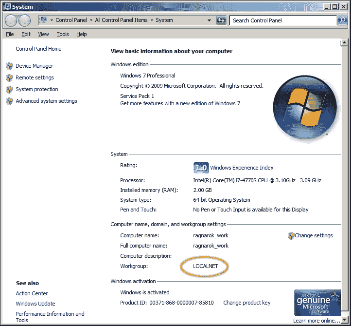
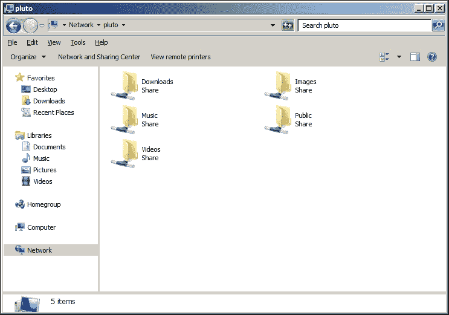
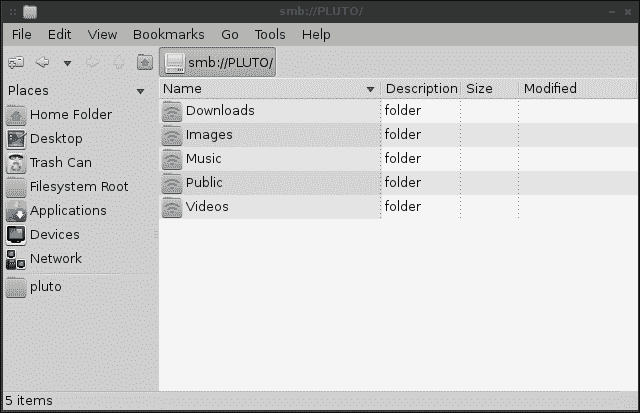

# 第四章：设置文件服务器

在上一章中，我们介绍了 SSH 并讨论了 SCP。虽然 SCP 是手动将单个文件从一个地方传输到另一个地方的好方法，但在网络上有一个或多个中心位置来存储共享文件对于网络增加了很多价值。无论您是在商业网络上共享重要文件，还是在家庭网络上共享家庭相册，网络上的中央文件存储位置都是一个方便的资产。在本章中，我们将讨论三种实现这一目标的方法。我们首先将讨论设计文件服务器时的一些考虑事项，然后我们将介绍 NFS、Samba 和 SSHFS。

在本章中，我们将涵盖：

+   文件服务器的考虑事项

+   NFS v3 与 NFS v4

+   设置 NFS 服务器

+   学习 Samba 的基础知识

+   设置 Samba 服务器

+   挂载网络共享

+   通过 fstab 和 systemd 自动挂载网络共享

+   使用 SSHFS 创建网络文件系统

# 文件服务器的考虑事项

与 Linux 世界中的大多数事物一样，实现任何目标的方法不止一种。对于每种方法，都有许多最佳实践和注意事项需要在实施解决方案之前了解。正如前面提到的，从一个 Linux 系统向另一个 Linux 系统共享文件的三种最常见方法是**网络文件系统**（**NFS**）、**Samba**和**安全外壳文件** **系统**（**SSHFS**）。这三种方法主要满足不同的需求，您的网络布局将决定您应该使用哪种方法。

设计网络文件服务器时的第一个考虑事项是需要访问其文件的平台类型。NFS 通常是 Linux 环境中的一个很好的选择；然而，它在处理混合环境时表现不佳，因此如果您的网络中有需要与 Windows 机器共享文件的情况，您可能不希望选择它。并不是说您不能在 Windows 系统上访问 NFS 共享（您当然可以），但微软限制了 NFS 的可用性（称为**NFS 服务**）到每个 Windows 版本的最昂贵的版本。如果您使用支持它的 Windows 版本，NFS 服务是可以的，但由于需要克服额外的许可障碍，避开它可能更有意义。一般来说，只有当您的网络主要由 UNIX 和 Linux 节点组成时，NFS 才是一个很好的选择。

接下来要考虑的是 Samba。Samba 允许在所有三个主要平台（Windows、Linux 和 Mac OSX）之间共享文件，并且在混合环境中是一个很好的选择。由于 Samba 使用**SMB**协议，Windows 系统可以访问您的 Samba 共享，而不管您安装的版本如何，因此许可证并不是那么重要。事实上，即使是 Windows 的标准版或家庭版也能够本地访问这些共享，无需安装额外的插件。Samba 的缺点在于它处理权限的方式。在 Windows 和 Linux 节点之间保存文件时，需要一些额外的工作来处理权限，因此在处理需要保留特定权限的 UNIX 或 Linux 节点时，它并不总是最佳选择。

最后，SSHFS 是另一种主要用于在 Linux 节点之间共享文件的方法。当然，可以从 Windows 连接和访问 SSHFS，但只能使用第三方实用程序，因为 Windows 中没有内置的方法（至少在撰写本章时）。SSHFS 的优点在于其易用性和文件传输的加密。虽然加密确实有助于避免窃听，但请记住，SSHFS（就像任何其他解决方案一样）只有在您制定的政策下才是安全的。但是在得心应手的情况下，SSH（和 SSHFS）是从一个节点传输文件到另一个节点的安全方法。此外，SSHFS 是这里列出的三种方法中最容易运行的。您只需要访问另一个节点和访问一个或多个目录的权限。这就是您需要的一切，然后您就可以自动连接到您有权限访问的任何目录。SSHFS 的另一个好处是除了 SSH 本身之外，服务器上没有其他需要配置的东西，而大多数服务器都可以使用 SSH。SSHFS 连接也可以快速按需创建和断开。我们将在本章后面讨论 SSHFS。

# NFS v3 与 NFS v4

关于 NFS 的另一个考虑是您将使用的版本。如今，大多数（如果不是全部）Linux 发行版默认使用 NFS v4。但是，有些情况下，您可能在网络上有较旧的服务器，需要能够连接到它们的共享。虽然 NFS v4 绝对是未来的首选版本，但您可能需要使用旧协议连接到节点。

在这两种情况下，可以通过编辑`/etc/exports`文件共享文件服务器上的目录，您将在其中列出您的共享（exports），每行一个。我们将在下一节详细讨论这个文件。但现在，请记住`/etc/exports`文件是您声明文件系统上哪些目录可用于 NFS 使用的地方。不同版本的 NFS 有不同的处理文件锁定的技术，它们在引入**idmapd**、性能和安全性方面有所不同。此外，还有其他差异，比如 NFS v4 转移到仅支持 TCP（协议的早期版本允许 UDP 或 TCP），以及它是**有状态**的，而早期版本是**无状态**的。

NFS v4 是有状态的，它将文件锁定作为协议的一部分，而不像 NFS v3 那样依赖于**网络锁管理器**（**NLM**）来提供该功能。如果 NFS 服务器崩溃或不可用，连接到它的一个或多个节点可能会有打开的文件，这些文件将被锁定到这些节点。当 NFS 服务器开始备份时，它会重新建立这些锁，并尝试从崩溃中恢复。尽管 NFS 服务器在恢复方面做得相当不错，但它们并不完美，有时文件锁定可能成为管理员处理的噩梦。使用 NFS v4，NLM 被废弃，文件锁定成为协议的一部分，因此锁定处理更加高效。然而，它仍然不完美。

那么，您应该使用哪个版本？建议在所有节点和服务器上始终使用 NFS v4，除非您需要支持旧协议的较旧服务器。

## 设置 NFS 服务器

配置 NFS 服务器相对简单。基本上，您只需要安装所需的软件包，创建您的`/etc/exports`文件，并确保所需的守护程序（服务）正在运行。在这个活动中，我们将设置一个 NFS 服务器，并从不同的节点连接到它。为了这样做，建议您至少有两台 Linux 机器可以使用。这些机器是物理机器还是虚拟机器，或者两者的组合并不重要。如果您已经按照第一章*设置您的环境*进行了操作，您应该已经有了几个节点可以使用；希望是 Debian 和 CentOS 的混合，因为这个过程在它们之间有些不同。

首先，让我们设置我们的 NFS 服务器。选择一台机器作为 NFS 服务器并安装所需的软件包。您选择哪个发行版作为服务器，哪个作为客户端并不重要，我将介绍 CentOS 和 Debian 的配置过程。由于相当多的发行版要么基于 Debian，要么使用与 CentOS 相同的配置，这对大多数发行版都适用。如果您使用的发行版不遵循任何软件包命名约定，您只需查找在您的特定发行版上安装的软件包或元软件包。其余的配置应该是相同的，因为 NFS 是相当标准的。

要在 CentOS 系统上安装所需的软件包，我们将执行以下命令：

```
# yum install nfs-utils

```

对于 Debian，我们安装`nfs-kernel-server`：

```
# apt-get install nfs-kernel-server

```

### 注意

在安装这些软件包时，您可能会收到一个错误，即 NFS 尚未启动，因为文件系统上不存在`/etc/exports`。在某些发行版上安装所需的 NFS 软件包时，可能不会自动创建此文件。即使它确实自动创建，该文件也只是一个框架。如果您收到这样的错误，请忽略它。我们将很快创建此文件。

接下来，我们将确保与 NFS 相关的服务已启用，以便它们在服务器启动时启动。对于 CentOS 系统，我们将使用以下命令：

```
# systemctl enable nfs-server

```

对于 Debian，我们可以通过以下方式启用 NFS：

```
# systemctl enable nfs-kernel-server

```

请记住，我们只是在服务器上启用了 NFS 守护程序，这意味着当系统重新启动时，NFS 也将启动（如果我们正确配置了它）。但是，我们不必重新启动整个服务器才能启动 NFS；我们可以在创建配置文件后的任何时间启动它。实际上，直到我们实际创建配置之前，您的发行版可能根本不会让您启动 NFS。

下一步是确定我们希望在网络上提供哪些服务器目录。您分享哪些目录基本上取决于您。Linux 文件系统上的任何内容都可以作为 NFS 导出的候选项。但是，一些目录，比如`/etc`（其中包含系统配置）或任何其他系统目录，可能最好保持私有。虽然您可以共享系统上的任何目录，但实际上，常见做法是创建一个单独的目录来存放所有共享的内容，然后在其下创建子目录，然后共享给客户端。

例如，也许您会在文件系统的根目录（`mkdir /exports`）下创建一个名为`exports`的目录，然后创建诸如`docs`和`images`之类的目录，以便他人可以访问。这样做的好处是，您的共享可以从一个地方（`/exports`目录）进行管理，并且 NFS 本身具有将此目录分类为您的导出根目录的能力（我们将在后面讨论）。在继续之前，在文件系统上创建一些目录，以便在下一节中将这些目录放入配置文件中。

一旦确定了文件系统中想要共享的目录并创建了它们，你就可以开始实际的配置了。每个 NFS 共享，也称为 export，在`/etc/exports`文件中添加每个我们希望共享的目录的一行来配置。由于你已经安装了所需的软件包以在系统上使用 NFS，这个文件可能已经存在，也可能不存在。根据我的经验，CentOS 在安装过程中不会创建这个文件，而 Debian 会。但即使你得到了一个默认的`exports`文件，它只会包含已注释掉的代码行，没有任何实际用途。实际上，你甚至可能在安装过程中收到警告或错误，说 NFS 守护进程没有启动，因为找不到`/etc/exports`。没关系，因为我们很快就会创建这个文件。

默认的`exports`文件在不同的发行版之间可能不同（如果默认情况下根本不创建），但是创建新的 exports 的格式是相同的，不管你选择的发行版是什么，因为 NFS 是相当标准的。添加一个 export 的过程是打开你喜欢的文本编辑器中的`/etc/exports`文件，并将每个 export 添加到自己的一行中。任何实际的文本编辑器都可以，只要它是文本编辑器而不是文字处理器。例如，如果你喜欢 vim，你可以执行以下命令：

```
# vim /etc/exports

```

如果你喜欢`nano`，你可以执行以下命令：

```
# nano /etc/exports

```

实际上，你甚至可以使用图形文本编辑器，比如 Gedit、Kate、Pluma 或 Geany，如果你更喜欢使用 GUI 工具。这些软件包都可以在大多数发行版的存储库中找到。

### 注意

可能不用说，但是要编辑`/etc`目录中或任何其他由 root 拥有的文件，你需要在这样的命令前加上`sudo`前缀，以便在没有以 root 身份登录时编辑它们。作为最佳实践，建议除非你绝对必须，否则不要以 root 身份登录。如果你以普通用户身份登录，执行以下命令：

```
sudo vim /etc/exports

```

在 Debian 中，你会看到默认的`/etc/exports`文件包含一系列注释，这可能对你有所帮助，以便查看 exports 的格式。我们可以通过简单地将它们添加到文件的末尾来创建新的 exports，保留内容。如果你更喜欢从一个空白文件开始，你可能想要备份原始文件，以防以后需要参考它。

```
# mv /etc/exports /etc/exports.default

```

一旦你在你喜欢的文本编辑器中打开了文件，你就可以开始了。你希望共享或*导出*的所有目录都应该放在这个文件中，每个目录占据一行。然后，你可以附加参数到共享中，以控制它如何被访问以及由谁访问。以下是一个示例 exports 文件，其中包含一些示例目录和每个目录的一些基本配置参数：

```
/exports/docs 10.10.10.0/24(ro,no_subtree_check)
/exports/images 10.10.10.0/24(rw,no_subtree_check)
/exports/downloads 10.10.10.0/24(rw,no_subtree_check)

```

正如你在这些示例 exports 中所看到的，每个的格式基本上包括我们想要导出的目录，我们想要允许访问的网络地址，然后是括号中的一些附加选项。你可以在这里附加许多选项，我们将在本章后面讨论其中一些。但如果你想查看你可以在这里设置的所有选项，可以参考以下`man`命令：

```
man exports

```

让我们讨论一下之前使用的示例`exports`文件的每个部分：

+   `/exports/docs`：第一部分包含我们要向网络上的其他节点导出的目录。如前所述，你几乎可以共享任何你想要的目录。但只是因为你*可以*共享一个目录，并不意味着你*应该*。只共享你不介意其他人访问的目录。

+   `10.10.10.0/24`：在这里，我们限制了对`10.10.10.0/24`网络内的节点的访问。该网络之外的节点将无法挂载任何这些导出。在此示例中，我们可以使用`10.10.10.0/255.255.255.0`，结果将是相同的。在我们的示例中，使用了`/24`，这被称为**无类域间路由**（**CIDR**）表示法，它是用于输入子网掩码的简写。当然，CIDR 还有更多内容，但现在只需记住，与子网掩码相比，CIDR 表示法用于使示例更短（而且看起来更酷）。

+   `ro`：在第一个导出（docs）中，我将其设置为只读，没有其他原因，只是为了向您展示您可以这样做。这可能是不言自明的，但导出为只读的目录将允许其他人挂载导出并访问其中的文件，但不会对任何内容进行更改。

+   `rw`：读写导出允许挂载它的节点创建新文件并修改现有文件（只要用户在文件本身上设置了所需的权限）。

+   `no_subtree_check`：虽然此选项是默认的，我们实际上不需要显式发出请求，但不包括它可能会导致 NFS 在重新启动时抱怨。这个选项是`subtree_check`的相反，后者现在基本上是被避免的。特别是，此选项控制服务器在处理导出中的操作时是否扫描底层文件系统，这可能会增加一些安全性但降低可靠性。由于禁用此选项已知可以增加可靠性，因此在最近的 NFS 版本中已将其设置为默认值。

尽管我在我的任何示例中都没有使用它，但您将在`/etc/exports`中看到的常见导出选项是`no_root_squash`。设置此选项允许终端用户设备上的 root 用户对导出中包含的文件具有 root 访问权限。在大多数情况下，这是一个坏主意，但您会在野外偶尔看到这种情况。这与`root_squash`相反，后者将 root 用户映射到 nobody。除非您有非常充分的理由做出不同的选择，否则`no_root_squash`是您想要的。

除了为单个网络分类选项外，您还可以通过在同一行中为它们添加配置来使您的导出可用于其他网络。以下是我们的`docs`挂载与其他网络共享的示例：

```
/exports/docs 10.10.10.0/24(ro,no_subtree_check),192.168.1.0/24(ro,no_subtree_check)

```

通过此示例，我们正在导出`/exports/docs`，以便`10.10.10.0/24`网络和`192.168.1.0/24`网络内的节点可以访问。虽然我为两者使用了相同的选项，但您不必这样做。如果您愿意，甚至可以为一个网络配置导出为只读，而为另一个网络配置为读写。

到目前为止，我们一直在与整个网络共享我们的导出。这是通过将允许的 IP 地址的最后一个八位设置为`0`来完成的。通过上一个示例，任何具有 IP 地址为`10.10.10.x`或`192.168.1.x`且子网掩码为`255.255.255.0`的节点都有资格访问导出。然而，您可能并不总是想要给整个网络访问权限。也许您只想允许单个节点访问。您可以同样轻松地对单个节点进行分类：

```
/exports/docs 10.10.10.191/24(ro,no_subtree_check)

```

在上一个示例中，我们允许具有 IP 地址`10.10.10.191`的节点访问我们的导出。指定 IP 地址或网络可以增强安全性，尽管这并非百分之百的通用方法。然而，仅限于绝对需要访问的主机是构建安全策略的一个非常好的起点。我们将在第九章*保护您的网络*中更详细地介绍安全性。但现在，请记住，您可以通过特定网络或个别 IP 限制对导出的访问。

早些时候，我们提到从版本 4 开始，NFS 可以使用一个目录作为其导出根，也称为 NFS 伪文件系统。在`/etc/exports`文件中，通过在导出此目录时放置`fsid=0`或`fsid=root`来标识这一点。在本章中，我们一直在使用`/exports`作为我们的 NFS 导出的基础。如果我们想要将此目录标识为我们的导出根，我们将像这样更改`/etc/exports`文件：

```
/exports *(ro,fsid=0)
/exports/docs 10.10.10.0/24(ro,no_subtree_check)
/exports/images 10.10.10.0/24(rw,no_subtree_check)
/exports/downloads 10.10.10.0/24(rw,no_subtree_check)

```

起初，这个概念可能有点令人困惑，所以让我们把它分解一下。在第一行中，我们确定了我们的导出根：

```
/exports *(ro,fsid=0)

```

在这里，我们声明`/exports`为我们的导出根。这现在是 NFS 文件系统的根。当然，就 Linux 本身而言，您有一个以`/`开头的完整文件系统，但就 NFS 而言，它的文件系统现在从这里开始，即`/exports`。在这一行中，我们还将`/exports`声明为只读。我们不希望任何人对这个目录进行更改，因为它是 NFS 根。它也与所有人共享（注意`*`），但这不应该有关系，因为我们为每个单独的导出设置了更细粒度的权限。有了 NFS 根，客户端现在可以挂载这些导出，而无需知道如何到达它的完整路径。

例如，用户可能会输入以下内容，将我们的`downloads`导出挂载到他或她的本地文件系统：

```
# mount 10.10.10.100:/exports/downloads /mnt/downloads

```

这是如何从本地文件服务器（在这种情况下为`10.10.10.100`）挂载 NFS 导出的方式，该服务器*不*使用 NFS 根。这需要用户知道该目录位于该服务器上的`/exports/downloads`。但是有了 NFS 根，我们可以让用户简化`mount`命令如下：

```
# mount 10.10.10.100:/downloads /mnt/downloads

```

请注意，我们在上一个命令中省略了/exports。虽然这可能看起来不是很重要，但我们基本上是在要求服务器给我们`downloads`导出，无论它在文件系统的哪个位置。`downloads`目录位于`/exports/downloads`，`/srv/nfs/downloads`或其他任何地方都无所谓。我们只是要求`downloads`导出，服务器知道它在哪里，因为我们设置了 NFS 根。

现在我们已经配置了我们的`/etc/exports`文件，很好的建议我们编辑`/etc/idmapd.conf`配置文件以配置一些额外的选项。这并不是绝对必需的，但绝对是建议的。默认的`idmapd.conf`文件因发行版而异，但每个都包含我们需要在此部分配置的选项。首先，查找以下行（或非常相似的行）：

```
# Domain = local.domain

```

首先，我们需要取消注释该行。删除`#`符号和尾随空格，使该行以`Domain`开头。然后，设置您的域，使其与网络上的其他节点相同。这个域很可能在安装过程中已经选择过了。如果您不记得您的域是什么，运行`hostname`命令应该会给您您的域名，这个域名紧跟在您的主机名后面。对于您想要能够访问 NFS 导出的每个节点都要这样做。

您可能想知道为什么这是必要的。当在 Linux 系统上创建用户和组帐户时，它们被分配了**UID**（**用户 ID**）和**GID**（**组 ID**）。除非您在所有系统上以完全相同的顺序创建了用户帐户，否则 UID 和 GID 在每个节点上很可能是不同的。即使您按照相同的顺序创建了用户和组帐户，它们仍然可能是不同的。`idmapd`文件通过将这些 UID 从一个系统映射到另一个系统来帮助我们。为了使`idmapd`工作，`idmapd`守护程序必须在每个节点上运行，并且该文件还应配置相同的域名。在 CentOS 和 Debian 上，该守护程序在`/usr/sbin/rpc.idmapd`下运行，并且随 NFS 服务器一起启动。

那么，你可能会想，`Nobody-User`和`Nobody-Group`的目的是什么？`nobody`用户运行的脚本或命令如果由特权用户运行可能会很危险。通常，`nobody`用户无法登录系统，也没有家目录。如果您将进程作为`nobody`运行，那么如果该帐户被破坏，其范围将受到限制。在 NFS 的情况下，`nobody`用户和`nobody`组具有特殊目的。如果文件由一个系统上不存在的特定用户拥有，那么文件的权限将显示为由`nobody`用户和组拥有。当未设置`no_root_squash`时，通过 root 用户访问文件也是如此。根据您使用的发行版，这些帐户可能具有不同的名称。在 Debian 中，`Nobody-User`和`Nobody-Group`默认为`nobody`。在 CentOS 中，这两者都是`nobody`。您可以在`idmapd.conf`文件中看到`nobody`用户和`nobody`组使用的帐户。您不应该需要重命名这些帐户，但如果出于某种原因您需要这样做，您需要确保`idmapd.conf`文件为它们具有正确的名称。

现在我们已经配置好并准备好使用 NFS 了，我们该如何开始使用它呢？如果您一直在跟进，您可能已经注意到我们启用了 NFS 守护程序，但尚未启动它。既然配置已经就位，没有什么能阻止我们这样做了。

在 Debian 上，我们可以通过执行以下命令来启动 NFS 守护程序：

```
# systemctl start nfs-kernel-server

```

在 CentOS 上，我们可以执行以下命令：

```
# systemctl start nfs-server

```

从这一点开始，我们的 NFS 导出应该已经共享并准备就绪。在本章的后面，我将解释如何在其他系统上挂载这些导出（以及 Samba 共享）。

NFS 中还有一件值得一提的事情。每当 NFS 守护程序启动时，都会读取`/etc/exports`文件，这意味着您可以通过重新启动服务器或 NFS 守护程序来激活新的导出。但是，在生产中，重新启动 NFS 或服务器本身是不切实际的。这将中断当前正在使用它的用户，并可能导致过时的挂载，这是对网络共享的无效连接（这不是一个好的情况）。幸运的是，激活新的导出而无需重新启动 NFS 本身是很容易的。只需执行以下命令，您就可以开始了：

```
# exportfs -a

```

# 学习 Samba 的基础知识

与 NFS 一样，Samba 允许您与网络中的其他计算机共享服务器上的目录。尽管两者都有相同的目的，但它们适用于不同的环境和用例。

NFS 是最古老的方法，在 Linux 和 UNIX 世界中被广泛使用。虽然我们当然有更新的解决方案（如 SSHFS），NFS 是经过验证的。但在混合环境中，它可能不是最佳解决方案。如今，您的网络上可能并非每台计算机都运行特定的操作系统，因此可能存在 NFS 访问不可用或不切实际的节点。

正如前面提到的，只有更昂贵的 Windows 版本才支持 NFS。如果你有一个庞大的 Windows 机器网络，要想将它们全部升级到更高版本将会非常昂贵，如果你本来不需要的话。这是 Samba 最擅长的领域。Windows、Linux 和 Mac 计算机都可以通过 Samba 访问共享目录。在 Windows 的情况下，即使是较低端的版本也可以访问 Samba 共享（例如 Windows 7 家庭专业版或 Windows 10 核心），而无需进行任何新的安装或购买。

Samba 的缺点是它处理权限的能力不如 NFS，因此您需要以特殊的方式管理配置文件以尊重权限。然而，它并非百分之百可靠。例如，Windows 和 Linux/UNIX 系统采用非常不同的权限方案，因此它们并不是本质上兼容的。在 Samba 的配置文件中，您可以告诉它在新创建的文件上使用特定的用户和组权限，甚至可以强制 Samba 将所有权视为与实际存储的文件不同的东西。因此，确实有方法可以使 Samba 处理权限更好，但本质上不如 NFS 这样的 Linux 或 UNIX 本地解决方案好。

就 Samba 服务器如何适应您的网络而言，基本的经验法则是在混合环境中使用 Samba，在不需要跨平台兼容性时使用 NFS。

## 设置 Samba 服务器

在本节中，我们将继续设置 Samba 服务器。在下一节中，我将解释如何挂载 Samba 共享。首先，我们需要安装 Samba。在 CentOS 和 Debian 系统上，该软件包简单地被称为`samba`。因此，通过`apt-get`或`yum`安装该软件包，您应该拥有所需的一切：

```
# yum install samba

```

使用`apt-get`的命令如下：

```
# apt-get install samba

```

在 Debian 系统上，Samba 在安装后立即启动。实际上，它也已启用，因此每次启动系统时都会自动启动。但在 CentOS 的情况下，安装后它既没有启用也没有启动。如果您选择 CentOS 作为 Samba 服务器，您需要启用并启动守护进程：

```
# systemctl start smb
# systemctl enable smb

```

现在，Samba 已安装、启用，但尚未配置。要配置 Samba，我们需要编辑`/etc/samba/smb.conf`文件。默认情况下，安装所需软件包后会立即创建此文件。但是，默认文件主要是为您提供配置示例而存在的。它非常庞大，但您可能希望查看它以查看以后可能要使用的一些语法示例。您可以在文本编辑器中打开文件，也可以在终端上使用`cat`命令查看文件：

```
cat /etc/samba/smb.conf

```

为了简化事情，我建议您从一个新文件开始。虽然配置示例绝对不错，但我们可能应该为生产目的使用一个更短的文件。由于原始文件以后可能有用，创建一个备份：

```
# mv /etc/samba/smb.conf /etc/samba/smb.conf.default

```

接下来，只需在文本编辑器中打开`smb.conf`文件，这将创建一个新的/空的文件，因为我们已经将原始文件移动到备份中：

```
# vim /etc/samba/smb.conf

```

我们可以从以下基本配置开始：

```
[global]
server string = File Server
workgroup = HOME-NET
security = user
map to guest = Bad User
name resolve order = bcast hosts wins
include = /etc/samba/smbshared.conf

```

让我们逐行浏览这个配置文件。首先，我们从`[global]`部分开始，这是我们为整个服务器配置选项的地方。实际上，这是这个特定文件中唯一的部分。

接下来是`server string`。`server string`是您在 Windows 系统上浏览网络共享时会看到的描述。例如，您可能会看到一个名为`Documents`的共享，并在其下方看到一个描述; `文件服务器`。这个部分不是必需的，但拥有它是很好的。在企业网络中，这对于概述有关系统的注释，比如它在哪里，或者它用于什么，是很有用的。

接下来，我们设置了我们的“工作组”。那些曾经是 Windows 系统管理员的人可能非常了解这一点。工作组用作包含特定目的所有系统的命名空间。在实践中，这通常是您的局域网的名称。您的局域网中的每台计算机都将具有相同的工作组名称，因此它们将显示为存在于同一网络中。在 Windows 系统上浏览共享时，您可能会看到工作组列表，双击其中一个将带您到共享资源的系统列表。在大多数情况下，您可能希望每个系统具有相同的工作组名称，除非您希望分开资源。要查看现有系统的工作组名称，请右键单击**我的电脑**或**此电脑**（取决于您的版本），然后单击**属性**。您的工作组名称应在出现的窗口中列出。



查看 Windows 系统的属性以获取工作组名称，在这种情况下是 LOCALNET

设置`security = user`告诉 Samba 使用用户的用户名和密码进行身份验证。如果匹配，用户将不会被提示输入密码来访问资源。

`map to` `guest = Bad User`告诉 Samba，如果提供的用户名和密码与本地用户帐户不匹配，将连接的用户视为通过访客帐户连接。如果您不希望进行这样的映射，可以删除此部分。

接下来，`name resolve order = bcast hosts wins`确定名称解析的顺序。在这里，我们首先使用广播的名称，然后是我们`/etc/hosts`文件中的任何主机名映射，最后是`wins`（`wins`已大部分被 DNS 取代，这里仅用于兼容性）。在大多数网络中，这个顺序应该可以正常工作。

最后，我们在配置文件的末尾添加了`include = /etc/samba/smbshared.conf`。基本上，这允许我们像包含现有文件一样包含另一个配置文件。在这种情况下，我们包含了`/etc/samba/smbshared.conf`的内容，Samba 一旦读取了这一行，就会读取它。接下来我们将创建这个文件。基本上，这允许我们在单独的配置文件中指定我们的共享。这不是必需的，但我认为这样做会使事情更容易管理。如果您愿意，您可以在`smb.conf`文件中包含`smbshared.conf`文件的内容，以便一切都在一个文件中。

这是我为此活动创建的一个`smbshared.conf`示例。在您的情况下，您只需要确保值与您的系统和您选择共享的目录匹配即可：

```
[Music]
## My music collection
 path = /share/music
 public = yes
 writable = no

[Public]
## Public files
 path = /share/public 
 create mask = 0664
 force create mode = 0664
 directory mask = 0777
 force directory mode = 0777
 public = yes
 writable = yes

```

在这里，我创建了两个共享。每个共享都以方括号中的名称开头（在浏览此计算机上的共享时将显示），然后是该共享的配置。正如您所看到的，我有一个名为“音乐”的共享目录，另一个名为“公共”。

要声明共享的路径，请使用`path =`，然后是共享对应的目录路径。在我的示例中，您可以看到我共享了以下目录：

```
/share/music
/share/public

```

接下来，我还通过添加`public = yes`将共享声明为公共。这意味着允许访客访问此共享。如果我希望访客无法访问它，我可以将其设置为`no`。

在我的音乐共享中，我设置了`writable = no`。顾名思义，这禁用了其他计算机更改此共享中的文件的能力。在我的情况下，我与网络上的其他计算机共享我的音乐收藏，但我不希望意外删除音乐文件。

在我的公共共享中，我添加了一些额外选项：

```
 create mask = 0664
 force create mode = 0664
 directory mask = 0777
 force directory mode = 0777

```

这些选项都对应于在该共享中创建新文件时默认的权限。例如，如果我挂载了我的公共共享，然后在那里创建一个目录，它将获得`777`的权限。如果我创建一个文件，它的权限将是`664`。当然，你可能不想让你的文件完全开放，所以你可以根据自己的需要更改这些权限。这个选项确保了在新创建的目录和文件上的权限的一致性。这在一个可能有自动化进程运行需要访问这些文件的网络上是至关重要的，你希望确保每次运行这样的进程时不需要手动更正权限。

现在你已经创建了自己的 Samba 配置，测试你的配置是一个好主意。幸运的是，Samba 本身包含一个特殊的命令，允许你这样做。如果你在系统上运行`testparm`，它将显示你文件中可能存在的语法错误。然后，它将显示你的配置。继续在你的系统上运行`testparm`。如果有任何错误，请返回并确保你输入的内容没有问题。如果一切正常进行，你将看不到错误，然后你将得到你配置的摘要。一旦验证了你的配置，重新启动 Samba 守护进程以使更改生效。要做到这一点，只需在你的 Debian 系统上运行以下命令：

```
# systemctl restart smbd

```

对于 CentOS，请使用以下命令：

```
# systemctl restart smb

```

现在，你应该能够在 Windows 或 Linux 系统上访问你的 Samba 共享。在 Linux 上，大多数图形界面文件管理器应该允许你浏览 Samba 共享的网络。在 Windows 上，你应该能够打开**我的电脑**或**此电脑**，然后点击**网络**来浏览本地网络上有活动共享的计算机。也许在 Windows 机器上访问共享的一个更简单的方法是按下键盘上的 Windows 键，然后按*R*打开运行对话框，然后简单地输入你的 Samba 服务器的名称，以两个反斜杠开头。例如，要从 Windows 系统访问我的基于 Debian 的文件服务器（Pluto），我会在运行对话框中输入以下内容，然后按*Enter*：

```
\\pluto

```

我从该系统中得到了一个共享列表，如下面的屏幕截图所示：



从 Windows 7 PC 查看 Samba 共享（从 Linux 系统提供）

# 挂载网络共享

本章中，我们已经创建了 NFS 和 Samba 共享。但是我们还没有挂载任何这些共享。在本节中，我们将处理这个问题。

在 Linux 中，`mount`命令可以用于挂载几乎所有东西。无论是连接外部硬盘，插入光盘，还是希望挂载网络共享，`mount`命令都可以作为瑞士军刀来允许你将这些资源挂载到你的系统上。`mount`命令允许你挂载一个资源并将其附加到你系统上的一个本地目录。在大多数情况下，在使用图形桌面环境的大多数 Linux 系统上，`mount`会自动运行。如果你插入了闪存驱动器或某种光学介质，你可能已经看到了这一点。在网络共享中，这些不会自动挂载，但可以配置为自动挂载。

也许挂载网络共享的最简单方法是在安装了桌面环境的系统上使用图形文件管理器。如果你点击一个文件共享，它很可能会被挂载，并且你将被允许访问它，前提是你在该系统上有必要的权限。**Nautilus**、**Caja**、**Pcmanfm**和**Dolphin**都是流行的 Linux 文件管理器。



pcmanfm 文件管理器，查看来自 Samba 文件服务器的共享

`mount`命令在没有图形环境的系统上或者当您希望将资源挂载到除默认位置之外的地方时最有用。要使用`mount`命令，给出您希望挂载的资源类型，它可以找到资源的位置，然后是用于挂载的本地目录。例如，要挂载 NFS 导出，我们可能会执行类似以下的操作：

```
# mount -t nfs 10.10.10.101:/exports/docs /mnt/docs

```

或者，如果我们设置了 NFS 根目录，可以使用以下命令：

```
# mount -t nfs 10.10.10.101:/docs /mnt/docs

```

在该示例中，我们告诉挂载命令，我们希望通过提供`-t`参数后跟`nfs`来挂载 NFS 导出。在我的实验室中，此共享存在于具有 IP 地址`10.10.10.101`的计算机上，我随后提供了该计算机上我正在访问的目录。在这种情况下，正在访问`10.10.10.101`上的`/exports/docs`。最后，我有一个本地目录`/mnt/docs`，它存在于我本地计算机上，我希望将此共享挂载到该目录。执行此命令后，每次我在本地计算机上访问`/mnt/docs`时，实际上是在我的文件服务器上访问`/exports/docs`。在使用此导出后，我只需卸载它：

```
# umount /mnt/docs

```

在 Linux 机器上挂载 Samba 共享需要更多操作。我将包括一个示例命令，该命令可用于从同一服务器挂载 Samba 共享。但在执行此操作之前，您首先需要在系统上安装必要的软件包，以便能够挂载 Samba 共享。在 CentOS 上，安装`samba-client`。在 Debian 上，软件包是`smbclient`。安装所需软件包后，您应该能够通过执行以下命令来挂载 Samba 共享：

```
# mount -t cifs //10.10.10.101/Videos -o username=jay /mnt/samba/videos

```

如果您需要通过密码访问资源，请使用以下命令：

```
# mount -t cifs //10.10.10.101/Videos -o username=jay, password=mypassword /mnt/samba/videos

```

如您所见，挂载 Samba 共享使用了相同的基本思想。但在这种情况下，我们以不同的方式格式化我们的目标路径，我们使用`cifs`作为文件系统类型，并且我们还包括用户名（以及密码，如果您的 Samba 服务器需要）。与以前的示例一样，我们以希望将挂载附加到的本地目录结束命令。在这种情况下，我为此共享创建了一个`/mnt/samba/Videos`目录。

# 通过 fstab 和 systemd 自动挂载网络共享

尽管通过`mount`命令挂载网络共享非常方便，但您可能不希望每次使用时都手动挂载共享。在具有中央文件服务器的网络中，配置工作站自动挂载网络共享是有意义的，这样每次启动系统时，共享将自动挂载并准备就绪。

自动挂载资源的经过验证的方法是`/etc/fstab`文件。每个 Linux 系统都有一个`/etc/fstab`文件，所以请查看您的文件。默认情况下，此文件仅包含用于挂载本地资源的配置，例如硬盘上的分区。向此文件添加额外的配置行以挂载从额外硬盘到网络共享的任何内容是标准做法。

### 注意

在编辑您的`/etc/fstab`文件时要小心。如果意外更改了本地硬盘的配置，下次启动系统时系统将无法启动。在编辑此文件时请务必小心。

以下是一个`/etc/fstab`文件示例：

```
# root filesystem
UUID=4f60d247-2a46-4e72-a28a-52e3a044cebf       /                   ext4            errors=remount-ro           0 1
# swap
UUID=c9149e0a-26b0-4171-a86e-a5d0ee4f87a7       none                swap            sw                          0 0

```

在我的文件中，**通用唯一标识符**（**UUID**）引用了我的本地硬盘分区。这些在每个系统上都会有所不同。接下来，列出了每个挂载点。`/`符号代表文件系统的根，交换分区不需要挂载点，因此设置为`none`。

在`/etc/fstab`文件的末尾，我们可以添加希望在每次启动系统时可用的额外挂载。如果我们希望添加 NFS 共享，可以执行以下操作：

```
10.10.10.101:/share/music/mnt/music  nfs  users,rw,auto,nolock,x-systemd.automount,x-systemd.device-timeout=10 0 0

```

在第一部分中，我们声明服务器的 IP 地址，后面跟着一个冒号和导出目录的路径。在这种情况下，我正在访问`10.10.10.101`上的`/share/music`。下一部分是挂载点，所以我将这个导出附加到本地系统上的`/home/jay/music`。接下来，我们指定我们正在访问的共享是`nfs`。最后，我们以一些选项结束配置，说明我们希望如何挂载这个共享。一个简单的挂载选项是`rw`，表示读写。如果我们想要防止其中的文件被更改，我们可以在这里使用`ro`。

在上一个示例中的选项中，有`x-systemd.automount`。基本上，这告诉 systemd（Debian 和 CentOS 的默认`init`系统，分别自版本 8 和 7 起）我们希望尽可能保持这个挂载。有了这个选项，systemd 会尽最大努力重新挂载这个共享，如果由于某种原因它断开连接。另外，可以添加`x-systemd.device-timeout=10`，告诉系统如果共享在网络上不可用，不要等待超过 10 秒。我们以`0 0`结束这一行，因为这不是一个本地文件系统，在启动时不需要一致性检查。

### 注意

如果你不使用带有 systemd 的发行版（如 CentOS 7 和 Debian 8），不要包括`x-systemd`选项，因为它们不会被使用不同`init`系统的发行版理解。

同样，Samba 共享也可以添加到你的`/etc/fstab`文件中。这是一个例子：

```
//10.10.10.9/Videos  /samba  cifs  username=jay  0  0

```

在我们继续之前，关于`/etc/fstab`文件的最后一点说明。本节中的示例都假定你希望网络共享在启动时自动可用。然而，这并不总是情况。如果在`fstab`中的配置行中添加了`noauto`挂载选项，共享将不会在启动时自动挂载。通过将`noauto`添加到我们的 Samba 示例中，`fstab`行将更改如下：

```
//10.10.10.101/Videos  /samba  cifs  noauto,username=jay  0  0 

```

NFS 示例如下：

```
10.10.10.101:/share/music
/mnt/music    nfs    users,rw,noauto,nolock,x-systemd.device-timeout=10 0 0

```

有几种情况下这可能会有用。一个例子可能是使用笔记本电脑，你不会总是连接到同一个网络。如果是这种情况，你不希望你的机器在你实际连接到该网络时自动挂载某些东西。通过将`noauto`添加为挂载选项，你可以在需要时手动挂载资源，而无需记住一个长长的`mount`命令。例如，要挂载包含在你的`fstab`文件中的 NFS 导出，你将执行以下操作：

```
# mount /mnt/music

```

相比之下，这比每次想要挂载该导出时输入以下内容要容易得多：

```
# mount -t nfs 10.10.10.101:/exports/music/ mnt/music

```

由于我们将导出添加到了`fstab`文件中，当我们输入一个简化的`mount`命令时，`mount`命令会查找相关行。如果它找到了你要访问的挂载点的配置，它将允许你访问它，而无需输入整个命令。即使你不想自动访问远程共享，将它们添加到你的`fstab`文件中仍然非常方便。

# 使用 SSHFS 创建网络文件系统

在上一章中，我们通过 SSH 工作，这是大多数 Linux 管理员每天多次使用的关键实用程序。但是，虽然它非常适合访问网络上的其他 Linux 系统，但它也允许你访问远程文件系统，就好像它们是本地挂载的一样。这就是**SSHFS**。关于 SSHFS 的一大好处是，无需事先澄清任何导出的目录。如果你能够连接到远程 Linux 服务器并通过 SSH 访问目录，那么你就能够自动将其本地挂载，就好像它是一个网络共享一样。

在 Debian 系统上，您可以简单地安装`sshfs`软件包。在 CentOS 上，默认情况下不提供`sshfs`软件包。在 CentOS 系统上安装`sshfs`之前，您需要添加一个全新的存储库，称为**企业 Linux 的额外软件包**（**EPEL**）。要做到这一点，只需安装`epel-release`软件包：

```
# yum install epel-release

```

安装`epel`存储库后，您应该能够安装`sshfs`：

```
# yum install sshfs

```

安装后，您可以轻松地在本地文件系统上挂载目录：

```
sshfs jay@10.10.10.101:/home/jay/docs /home/jay/mnt/docs

```

为了工作，您的用户帐户必须不仅访问远程系统，还要访问本地挂载点。一旦启动命令，您将看到类似于通过 SSH 连接到服务器时通常看到的提示。基本上，这就是您正在做的事情。不同之处在于连接保持在后台打开，保持远程目录和本地目录之间的关系。

在需要在远程文件系统上挂载某些内容，但您可能不需要再次访问或频繁访问时，使用`sshfs`是一个很好的主意。但与 NFS 和 Samba 共享类似，您实际上可以使用`/etc/fstab`通过 SSHFS 挂载资源。考虑以下`fstab`示例：

```
jay@10.10.10.101:/home/jay/docs                /home/jay/mnt/docs    fuse.sshfs      defaults,noauto,users,_netdev   0 0

```

与以前一样，我们设置了`noauto`，这样我们只需键入即可建立此连接：

```
mount /home/jay/docs

```

# 总结

在这个充满活力的章节中，我们通过几种方式访问和共享 Linux 网络中的文件。我们首先讨论了 NFS，这是在 Linux 和 UNIX 网络中共享文件的一种古老但可靠的方法。我们还涵盖了 Samba，这是在混合操作系统环境中共享资源的一种方法。我们还讨论了如何手动以及自动地挂载这些共享。我们最后讨论了 SSHFS，这是 SSH 的一个非常方便（但不太知名）的功能，它允许我们根据需要从其他系统挂载目录。

当然，依赖于我们网络中的资源，保持每个节点的良好运行状态非常重要。在下一章中，我们将通过监视系统资源并保持节点的良好状态来工作。
