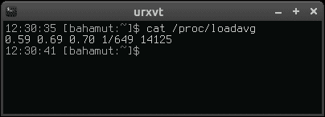
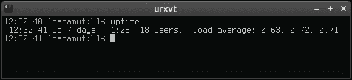
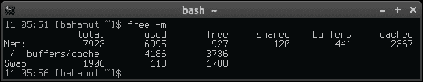
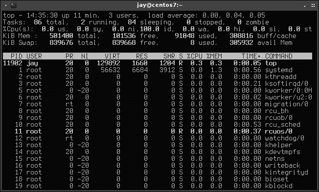
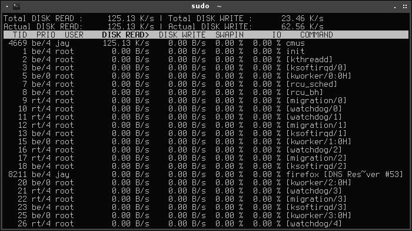
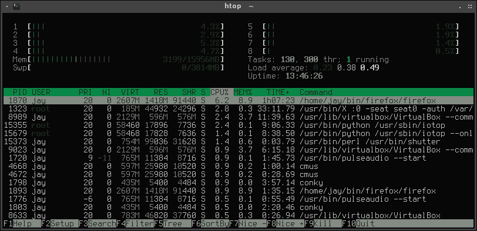
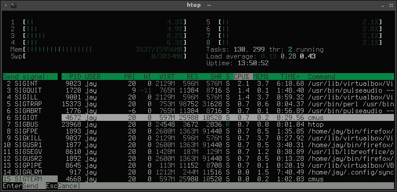
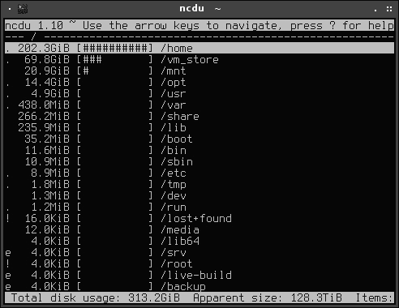
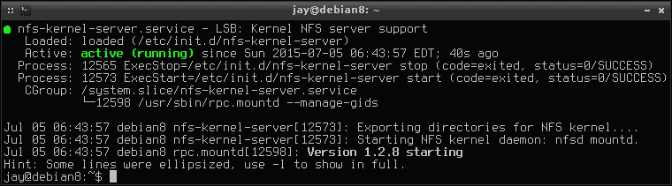

# 第五章。监控系统资源

随着您的组织需求的扩大，您的网络将随着增长和变化而增长和变化。跟踪每个节点上的资源对于稳定性非常重要。虽然 Linux 处理资源异常出色，但它只能做到这么多。CPU 可能被过度利用，磁盘变满，过多的输入/输出甚至可以使最强大的服务器停止。密切关注这些事情非常重要，特别是当系统用于生产并且被其他人依赖时。

在本章中，我们将探讨检查 Linux 系统上正在运行的内容以及管理其资源的方法，以确保您的节点在网络上表现良好。

在本章中，我们将涵盖：

+   检查和管理进程

+   了解负载平均值

+   检查可用内存

+   使用基于 shell 的资源监视器

+   检查磁盘空间

+   扫描已使用的存储空间

+   日志简介

+   使用 logrotate 维护日志大小

+   了解 systemd 初始化系统

+   了解 systemd 日志

# 检查和管理进程

在典型的故障排除场景中，您可能会遇到一个行为不端或需要对其执行操作的进程。如果您在工作站上使用图形桌面环境，您可能会使用诸如 GNOME 系统监视器之类的工具来调查系统上运行的进程，然后终止问题进程。但在大多数情况下，您可能不会有图形桌面环境（至少不会在服务器上），因此您将使用诸如`kill`之类的命令来摆脱行为不端的进程。但在终止进程之前，您需要知道其**进程标识符**（**PID**）。在所有 Linux 系统上找到进程的 PID 的一种方法是打开终端并使用`ps`命令。以下是其用法示例：

```
ps aux

```

除了`ps`，如果您已经知道进程的名称，通常会使用`grep`。在这种情况下，您可以将`ps aux`的输出导入`grep`，然后搜索进程。

```
ps aux |grep httpd

```

`ps`命令将为您提供正在运行的进程列表。如果使用了`grep`，输出将被缩小为与搜索项匹配的进程列表。您将在结果中看到每个进程的`PID`位于第二列中。在第三列中，您将看到进程正在消耗多少 CPU，然后是内存使用列。

！检查和管理进程

在 Debian 系统上的 ps aux 输出

`USER`，`STAT`，`START`，`TIME`和`COMMAND`是我们可以从此输出中看到的其他列。虽然`USER`是不言自明的，但这里是其他列标题的简短描述：

+   `STAT`：此字段标识程序的状态，其中一个或两个字符代码表示程序当前所处的状态。例如，`S`表示进程正在等待某些事件完成，而`D`是不可中断的睡眠状态，通常与 IO 相关。要查看完整列表，请查看`ps`的手册页。

+   `START`：此字段指的是进程开始运行的时间。

+   `TIME`：这表示进程已经利用 CPU 的总时间。每当进程命中 CPU 并需要执行工作时，时间都会记录在 CPU 上。

+   `COMMAND`：显示当前进程正在运行的命令。

现在您知道如何找到进程的 PID，我们可以看一下`kill`命令，这是一个在需要关闭正常情况下无法关闭的程序时非常有用的命令。例如，如果您正在运行一个进程 ID 为 25787 的脚本，您可以通过执行以下命令来终止它：

```
# kill 25787

```

`kill`命令通过向 PID 发送特定信号来工作。例如，信号 15 被称为**SIGTERM**。如果您对一个进程执行`kill`而没有任何参数（就像我们在上一个示例中所做的那样），则默认发送信号 15，这基本上是礼貌地要求进程关闭。您可以向进程发送 18 种不同的信号，您可以在手册页中阅读有关这些信号的信息。就我们在这里讨论的而言，`SIGINT`，`SIGTERM`和`SIGKILL`是您最有可能使用的。您可以通过执行以下命令查看这些信号以及它们的含义的列表：

```
man 7 signal

```

要发送特定信号，请在`kill`命令后输入连字符，然后输入您希望发送的信号。由于`kill`本身发送信号 15，您可以通过执行以下命令来执行相同的操作：

```
# kill -15 25787

```

要发送不同的信号，比如 2（**SIGINT**），请输入以下命令：

```
# kill -2 25787

```

如果您非常绝望，可以向进程发送信号 9（**SIGKILL**）：

```
# kill -9 25787

```

但是，只有在您已经尽了最大努力但无法使进程关闭时，才应该使用`SIGKILL`。`SIGKILL`立即关闭进程，但不幸的是它不会给进程清理的机会。这可能导致不干净的临时文件和打开的套接字连接留在系统上。更糟糕的是，它实际上可能会损坏数据库和配置。因此，我再次强调，如果无法使进程正常关闭，`kill -9`绝对应该是您尝试的最后一件事。首先尝试您知道的每种方法来正常关闭进程，然后再尝试几次，然后考虑使用它。

另一个可以用来终止进程的命令是`killall`命令。`killall`命令允许您终止系统上与特定名称匹配的所有进程。例如，假设您有多个打开的 Firefox 窗口并且程序停止响应。要立即终止系统上运行的所有 Firefox 实例，只需执行以下命令：

```
killall firefox

```

就这样，您系统上的每个 Firefox 窗口都会立即消失。`killall`命令可用于关闭共享相同名称的多个进程，并且在运行多个单个无响应程序或脚本的服务器上非常有用。

这基本上就是使用`kill`和`killall`命令的全部内容。当然，还有更多选项，手册页会给您更多信息。但简而言之，这些是您实际使用的变体。在理想的世界中，您应该永远不需要使用`kill`，并且在服务器上运行的所有进程都会毫无疑问地服从您。不幸的是，我们不生活在一个完美的世界，您可能会比您想象的更经常使用这些命令。

# 理解负载平均值

对于 Linux 管理员来说，**负载平均值**是您将学到的最重要的概念之一。虽然您可能已经知道这个数字代表系统承受多大负载，但它也代表着趋势性能。使用这个数字，您将能够确定您的系统是被压倒还是正在恢复和平静下来。基本上，负载平均值由三个数字组成，每个数字代表系统在特定时间范围内的平均负载。第一个数字代表一分钟，第二个代表五分钟，第三个代表 15 分钟。有许多方法可以查看您的负载平均值，并且它也会显示在大多数 Linux 可用的系统监视器中。查看您的负载平均值的一种简单方法是执行以下命令：

```
cat /proc/loadavg

```



查看负载平均值

一个更简单的技术是使用`uptime`命令。虽然`uptime`命令的主要目的是查看系统已经运行了多长时间，但它也显示了系统的负载平均值。



uptime 命令的输出

那么，如何正确解释这些信息呢？通过本节中显示的 uptime 命令的截图，我们看到以下数字：

```
0.63 0.72 0.71

```

如前所述，前三个数字分别代表了 1、5 和 15 分钟内系统的负载。所谓的负载表示在每个时间段内等待或当前使用 CPU 的进程数量。在本例中使用的系统上，我们可以看到它的负载相对较低。我们还可以看到负载平均值的趋势。在这个例子系统上，负载正在上升，但只是稍微上升。

一般来说，负载平均值越低越好。但并非总是如此；较低的数字也可能令人不安。例如，如果您有一个本应该忙碌的服务器，其负载平均值下降到小于 1，这可能是一个警告信号。如果负载如此之低，服务器显然并不忙碌。这可能表示应该运行的某个进程已经失败。例如，如果您有一个通常会同时处理数百个查询的 MySQL 服务器，突然发现服务器变得无所事事，肯定会感到奇怪。另一方面，负载平均值达到数百的服务器将如此忙碌，以至于甚至无法处理您的登录请求，也无法访问系统！

让我们再看一个负载平均值。这是我帮助管理的网络上一个更繁忙系统的负载平均值：

```
9.75 8.96 5.94

```

在这里，我们可以看到这个系统的负载比前一个例子高得多。这可能是我想要调查的事情。但关于系统的负载平均值令人困惑的一点是，数字本身并不足以证明有警告的理由。如果该系统有十个核心，我就不会那么担心。尽管负载平均值超过了 9，但在这种情况下，将有足够的 CPU 来处理工作负载。然而，我从中获取输出的系统只有四个核心，所以这是一个警告信号。这意味着在每个三个时间窗口内，等待 CPU 时间的进程比系统实际拥有的核心还要多。这不是好事。但幸运的是，我可以看到系统正在恢复，因为负载正在下降。在这种情况下，我不会惊慌，但肯定会继续关注，以确保它继续恢复。我可能还会调查系统，找出到底是什么导致了负载如此高。也许服务器刚刚完成了一个非常大的任务，但值得调查一下。

作为一个经验法则，记录系统在正常预期负载下的基线是一个好主意。您网络上的每个系统都将有一个指定的目的，每个系统在任何时候都会有一个您可以合理预期系统面临的特定负载。如果系统的负载平均值低于基线或高于基线，那么您就需要查看并找出问题所在。如果负载达到一个水平，其中有更多的进程比您的核心处理器处理的，那就是一个警告信号。

# 检查可用内存

Linux 系统非常出色地处理内存，尽管如果一个进程行为不端或分配的内存不足，事情可能会失控。在系统开始表现迟缓的情况下，检查可用内存可能是您首先要查看的事情之一。为此，我们使用`free`命令。为了使输出更易读，您可以添加`-m`选项，以以兆字节为单位显示内存使用情况，这样可以使其更容易阅读。起初阅读这个输出可能会令人困惑，但我相信在我们阅读输出后，您会发现它很简单。



free 命令的输出

运行`free`命令时，我们得到了三行六列的信息。第一行显示了我们实际的 RAM 使用情况，而第二行声明了缓冲区，第三行声明了交换使用情况。在`total`下，我们看到这个系统安装了 7923 MB 的 RAM。从技术上讲，这个系统有 8 GB 的 RAM，尽管其中一部分被保留给内核或某种硬件，可能不会显示在这里。在下一列（`used`）中，我们看到了我们系统的 RAM 有多少被使用，然后是`free`，它显示了系统 RAM 中有多少是未使用的。在我们之前的例子中，似乎我们只有 927 MB 的 8 GB 是空闲的，但这并不完全正确。那么，到底有多少内存是真正空闲的呢？

首先，第一行中的`used`表示实际使用了多少内存，包括缓存的部分。基本上，Linux 中的内存管理声明了所谓的**磁盘缓存**，这是一块为尚未写入磁盘的数据保留的内存块。您可以在`free -m`命令的输出中看到这一点；它是`cached`下面最右边的数字。这部分内存不一定被进程使用；它被声明为使系统运行更快。如果启动一个进程并且它需要的 RAM 超过了第一行`free`下显示的 RAM，Linux 内核将乐意从磁盘缓存中分配内存给其他进程。

磁盘缓存有助于提高性能。当你从磁盘读取东西时，它会存储在磁盘缓存中，然后每次都从那里读取，而不是每次都从磁盘读取。例如，假设你每天都要查看保存在`/home`目录中的文本文件。第一次读取时，你是从磁盘读取的。从那时起，它就存储在磁盘缓存中，每次你想要从那时起读取文件时都是从那里读取。由于 RAM 比硬盘快，这个文件每次只需要从磁盘读取一次，然后以后都是从磁盘缓存中读取。

磁盘缓存中存储的信息会随着时间而过期。随着磁盘缓存的填满，存储在其中的最旧信息会被删除以腾出空间。此外，当进程需要内存时，可以随时从缓存中取回内存。这就是为什么即使有时候看起来大量的 RAM 被缓存使用，也不是一个大问题——应用程序在需要时永远不会被阻止访问这些内存。

回到我们的例子，确定我们有多少空闲内存时要看第二列的数字，第二行的数字。在这个例子中，3736 MB 被认为是空闲的。对于这个特定的系统来说，这是足够的空闲内存。当这个数字减少并且交换开始增加以补偿时，你应该担心。只要你的系统有足够的 RAM 来完成指定的任务，交换应该几乎不会被使用。几乎总会使用一小部分，但当使用大量时就是问题。当你的系统实际上开始耗尽内存时，它将开始使用你的交换分区。由于硬盘比 RAM 慢得多，你不希望这样。如果你看到你的交换空间被滥用，你应该运行某种资源监视器（我们在本章中讨论了其中的一些）来确定是什么在使用它。

为了确保我们对`free`命令的输出有一个全面的理解，让我们逐个讨论它包含的所有部分，从第一行开始。我们已经介绍了`total`，这是你的系统物理上安装的内存量（减去你的内核或硬件保留的部分）。在第一行的下一个是`used`，它指的是任何时候被使用的内存量，包括缓存。而`free`列则完全相反，指的是没有被任何东西使用的内存。

第一行的最后两项是`buffers`和`cache`。虽然这两个部分没有被任何进程使用，但内核会用它们来缓存数据以进行性能优化。但如果一个进程需要更多的内存，它可以从这两个数字中获取。我们已经介绍了磁盘缓存，这是最后一个数字。`buffers`指的是尚未写入磁盘的数据。Linux 会在各种时间间隔内运行`sync`命令将这些信息写入磁盘。如果你愿意，你甚至可以自己运行`sync`命令，尽管这很少是必要的。缓冲区的概念也是为什么你不希望在没有先卸载的情况下突然从计算机中移除外部媒体的一个关键指标。如果你的系统尚未将数据同步到磁盘，如果你过早地弹出媒体，你可能会丢失数据。

在第二行，我们有`-/+ buffers cache`（在我们的示例中分别为 4186 MB 和 3736 MB）。这一行的第一个数字（4186 MB）是通过从第一行的已使用列（6995 MB）减去缓存和缓冲区的总和（2808 MB）计算出来的。这给了我们 4187 MB 的总数，由于四舍五入的原因（我们使用了`-m`标志，所以我们的输出以 MB 为单位，所以有一点偏差），但足够接近。如果我们按照同样的数学计算，但在我们的 free 命令中没有使用`-m`标志，结果将是精确的。第二行的下一个数字是 3736 MB。正如前面提到的，这是系统实际可用的内存量。为了得到这个数字，我们从已使用的内存（4186 MB）中减去我们的总内存（7923 MB）。

再次强调，在第二行的`free`下面的内存量是你关心的数字，当你想知道你还剩下多少内存时。然而，了解我们是如何得出这个数字以及 Linux 是如何为我们管理内存的也是很重要的。

# 使用基于 shell 的资源监视器

安装任何带有桌面环境的 Linux 发行版时，很可能会捆绑一个图形系统监视器。其中流行的有 KSysGuard 和 GNOME 系统监视器，但还有许多其他的。大多数情况下，这些都很好用。GNOME 系统监视器能够显示负载平均值，当前运行的进程（以及它们的 PID，CPU 百分比，内存等），以及磁盘使用情况。许多图形系统监视器也显示这些信息以及更多。虽然这些工具很棒，但典型的基于 Linux 的网络中的节点并不总是有图形用户界面可用。幸运的是，通过 shell 有许多不需要运行桌面环境的资源监视工具。这些工具中一些非常出色，以至于你会在某个时候放弃图形工具而使用 shell 工具。这个类别中流行的工具包括 top，htop，iotop 和 ncdu。

首先，我们需要确保上述工具已经安装在我们的系统上。在大多数情况下，top 已经为我们安装好了，但其他的需要手动安装。你可以通过运行以下命令来验证 top 是否已安装：

```
which top

```

你应该看到以下输出：

```
/usr/bin/top

```

你可以使用你的发行版的软件包管理器来安装其他工具。对于 Debian，你可以一次性安装它们所有：

```
# apt-get install htop iotop ncdu

```

不幸的是，在 CentOS 上，并非所有这些软件包都在默认存储库中可用。要在 CentOS 上安装这些工具，您首先需要添加`epel`存储库，然后才能安装所有软件包。以下概述了要使用的命令：

```
# yum install epel-release
# yum install htop iotop ncdu

```

随意尝试这些工具。`top`和`htop`命令都可以在没有 root 访问权限的情况下运行。但是，您需要至少使用`sudo`来运行`iotop`才能使其正常工作。`ncdu`命令将作为普通用户运行，但将被限制为仅查看该用户可以访问的资源。让我们更仔细地看看这些工具。

这些工具对我们有什么作用呢？首先，`top`是经过验证的；如果您不是 Linux 的新手，那么您可能以前已经使用过。在查看系统上正在运行的内容时，`top`是相当常见的。使用`top`，您将看到各种信息，例如正常运行时间，平均负载，已使用内存，已使用交换空间，缓存等。在屏幕的底部部分，您将看到进程列表。完成后，只需按*Q*退出。



在 CentOS 系统上运行的 top 命令

有几种方式可以运行`top`。通过不带参数运行`top`，您将看到一个类似于本节前面显示的屏幕。您将在上部看到系统性能摘要，底部显示各种进程。但是，如果您已经知道要监视哪个进程，可以使用`-p`标志加上 PID 来仅监视该进程。例如，我们可以使用以下命令来监视 PID 为`12844`的进程：

```
top -p 12844

```

默认情况下，`top`命令中的输出每三秒更新一次。要更改此设置，您可以使用`-d`标志选择不同的频率（以秒为单位）：

```
top -d 2

```

如果您愿意，频率可以小于一秒：

```
top -d 0.5

```

如果`top`已经在运行，并且您想要更改更新频率，您不必关闭它然后再次启动。您可以在其运行时键入`s`，然后会提示您指定一个新的频率。

在`top`中，您可以通过按键盘上的键来更改进程列表的排序方式。如果您键入`P`，则按 CPU 使用率排序；使用`M`，您可以按内存使用率排序（这里大小写要注意）。您甚至可以通过按`k`来从这里终止一个进程，然后会提示您输入要终止的 PID。不过要小心；这默认为您按下时进程列表顶部的内容，所以确保在实际输入 PID 之前不要按`Enter`，否则可能会终止您不想终止的进程。

那么，为什么要使用`top`呢？管理员使用`top`的主要目的是帮助确定是什么导致系统变得 CPU 或内存密集。大多数情况下，`top`从来不是解决方案，而是根本原因分析的开始。您可以立即看到哪个进程正在消耗您的 CPU 或 RAM，但根据上下文，您可能还不知道如何解决问题。使用`top`，您只能发现罪魁祸首。不幸的是，`top`可能并不总是显示出根本原因的进程，但当您的系统运行缓慢时，这绝对是一个非常容易的第一处查找地方。

要开始故障排除，顶部的信息将为您提供一个起点，以查看哪个资源正在被使用。在`%Cpu(s)`行上，我们可以立即看出系统是否遭受过多的 I/O 等待（`%wa`字段），这基本上意味着 CPU 承受的负担超过了它的处理能力。在这种情况下，任务将积压，平均负载将增加。空闲时间（或`%id`）是一个数字，它越高越好，这意味着您的系统将有 CPU 时间可用。

在某些情况下，您可能会发现 CPU 使用过高，但在进程列表中并没有显示太多。在这种情况下，您可以打开`iotop`来确定您的系统是否受到 I/O 限制。使用`iotop`（需要 root 权限），您可以看到写入或从磁盘读取的数据量。使用左右箭头，您可以将焦点从一列转移到另一列，这样可以按该列对进程列表进行排序。



在 Debian 系统上运行 iotop

默认情况下，`iotop`中的进程列表相当拥挤。您可以通过执行以下操作来精简它：

```
# iotop --only

```

通过附加-`only`，您只会看到实际发生读写操作的进程。在本节中`iotop`的截图中，您可以看到有相当多的进程根本没有活动。但是使用`-only`可能更容易阅读，因为它清理了输出。您实际上可以在`iotop`运行时激活`-only`，只需在键盘上简单地按下*O*。此外，另一个有用的键盘快捷键是使用`r`更改任何列的排序顺序。

在本节中，我们有`htop`。虽然`top`是在 Linux 系统上查看系统资源的标准方法，但`htop`的受欢迎程度正在迅速增加。



htop 命令的操作

`htop`的基本思想与`top`相同——`top`区域显示当前的 CPU 和内存使用情况，底部部分提供了一个进程列表。但`htop`的不同之处在于它如何呈现这些信息，更容易阅读，并提供了 CPU 使用情况的图表区域。除此之外，它还允许您轻松地向进程发送特定信号。在前面，我们介绍了各种信号，您可以使用它们来结束一个进程。在这里，我们可以看到相同的概念以图形方式呈现。要向进程发送信号，请使用键盘上的上下箭头突出显示一个进程，然后按*F9*选择特定的信号。`SIGTERM`是默认选择的，但您也可以向进程发送任何其他信号。



准备在 htop 中向进程发送信号

`htop`中的进程列表可以类似于`iotop`进行排序。一开始可能不明显的一件事是，`htop`支持鼠标输入。虽然您可以使用箭头键选择列，但也可以单击它们。

`htop`的另一个好处是它的可定制性。虽然默认布局对大多数用例来说都不错，但您可以添加额外的仪表。要这样做，请按*F2*或单击**设置**，您将进入一个菜单，可以从当前视图中添加或删除仪表。在`可用仪表`下，突出显示您想要添加的仪表之一，然后按*F5*将其添加到左列，或按*F6*将其添加到右列。您可能会发现有用的一个仪表是`CPU 平均值`。添加新仪表后，您可以通过突出显示它并按*F7*将其上移或按*F8*将其下移来重新定位它。完成后，按*Esc*返回到主屏幕。这些更改会自动保存，因此下次打开`htop`时，您的自定义布局将保持不变。

# 扫描已使用的存储

几乎每个人都会遇到磁盘空间似乎消失的情况，却没有明确的指示是什么占用了所有的空间。有多种方法可以排除是什么特别占用了你的硬盘空间。为了查看已挂载文件系统的概况以及它们的已用和空闲空间，执行`df`命令。对于大多数人来说，使用`-h`和`df`更容易阅读，因为它会显示以 MB 和 GB 为单位的已用空间：

```
df -h

```

掌握了这些信息，您将准确知道哪个设备被使用了，以及要关注的卷。但`df`命令实际上并没有告诉您是什么占用了所有的空间；它只是给了您当前情况的概述。

接下来是`du`。`du`命令也可以与`-h`配对，原因相同，它显示目录中使用了多少空间。您只需要`cd`进入要检查的目录，然后运行`du -h`。为了更易于阅读的输出，可以在目录中运行以下命令：

```
du -hsc *

```

分解该命令，我们有`-h`参数，我们已经知道它使输出更易于阅读。`-s`参数仅显示总计，`-c`将在最后呈现总计。由于我们在命令中使用了星号，它将对当前目录中包含的每个子目录运行`du -hsc`。使用此命令，您可以确定当前工作目录中哪些目录占用了最多的空间。

但它甚至比这更好。尽管`du -hsc *`非常有用，但您仍然需要为每个子目录手动运行它。有方法可以使用它进行更深入的扫描，但`du`仅适用于概览摘要。更好的方法是安装`ncdu`。`ncdu`命令不是图形实用程序，因为它不需要图形桌面环境。但它非常易于使用；您可能会认为它实际上是一个图形实用程序。一旦针对特定目录启动，它会进行深入分析，并允许您实际遍历文件系统树并跟踪占用所有空间的元凶。

您不需要成为 root 用户或具有`sudo`权限来使用`ncdu`，但请记住，`ncdu`只能扫描其调用用户有权限访问的目录。在某些情况下，您可能需要以 root 身份运行它以绕过这一限制。`ncdu`的基本用法很简单；只需调用`ncdu`并提供要扫描的路径。例如，您可以扫描整个文件系统或其中的一部分：

```
ncdu /

```



使用 ncdu 扫描 CentOS 系统的根文件系统

需要注意的是，默认情况下，`ncdu`将扫描您提供的目录中的所有内容，包括可能已挂载的任何内容。这可能包括已挂载的 NFS 共享或外部磁盘，但您可能不希望外部挂载影响结果。幸运的是，只需向`ncdu`提供`-x`选项即可，告诉它在运行扫描时忽略您已挂载的任何内容：

```
ncdu -x /

```

扫描完成后，您可以通过键盘上的上下键遍历结果，并按*Enter*进入目录。在`ncdu`内部，您甚至可以通过简单按下*D*键而无需运行任何额外命令来删除文件。这样，您可以在同一工具中进行审计和清理。

随意在自己的系统上运行`ncdu`，并查看您的可用空间去向。除非您真的开始删除东西，否则它是无害的，并且可以显示一些您可能想要清理的潜在项目。在实际服务器上，`ncdu`在解决磁盘空间去向方面非常有用。

# 日志简介

默认情况下，Linux 几乎记录所有内容。这对于在出现问题时进行根本原因分析非常重要。当您在生产服务器上面临问题时，您只需要确定问题开始的时间，然后阅读在该时间内系统上发生的事情的日志文件。Linux 日志非常详尽。

但是，如今，Linux 处理日志的方式正在发生变化。随着 systemd 的崛起，它现在是大多数 Linux 发行版上的默认 init 系统，它几乎接管了一切，包括日志记录。过去，每当您想要阅读日志时，您会进入`/var/log`，这是一个包含各种以纯文本格式存储的日志文件的目录。在 Debian 和 CentOS 上，您仍然可以在`/var/log`中找到日志，因此您仍然可以像以往一样利用它们进行故障排除。但目前尚不确定这种方式还能维持多久。

许多人可能认为 systemd 接管日志记录是件坏事。毕竟，让 init 系统负责系统的许多维护工作会增加其负担，可能会使其负担过重。但 syslog（之前的方法）的一个问题是，不同发行版在日志创建或命名方面没有一致性。例如，Debian 系统包括`auth.log`，而 CentOS 没有。两者都有`dmesg`，只有 CentOS 有`boot.log`文件。这使得在混合环境中进行故障排除变得非常困难。

systemd 方法（稍后我们将讨论）在不同发行版之间提供了更一致的方法。因此，尽管 systemd 在系统上承担了许多责任，但一致性肯定是受欢迎的。

Debian 和 CentOS 都有一个日志文件，用于用户登录系统，即使是通过 SSH 登录。在 CentOS 上，此日志位于`/var/log/secure`。Debian 使用`/var/log/auth.log`来实现此目的。如果您需要知道谁何时登录到您的系统，您需要查看这些日志。在两者中，您可以找到`/var/log/messages`，其中包括各种有用信息，例如进程输出，网络激活，服务启动等。在硬件故障排除方面，`/var/log/dmesg`是一个很好的查看地点。实际上，`/var/log/dmesg`有自己的命令。在系统的任何位置（即使您当前的工作目录不是`/var/log`），键入`dmesg`将呈现相同的日志。

使用`tail -f`可以非常容易地实时跟踪`/var/log`中的日志文件。`tail`的`-f`标志不仅限于日志文件。它允许您显示日志文件的输出，就像它正在被写入一样。在故障排除系统时，`tail -f`是不可或缺的。例如，如果您有一个无法登录系统的用户，您可以在 Debian 系统上运行以下命令来观察`auth.log`文件，以查看他们的尝试。这样，您可以看到系统为其登录失败尝试注册的错误消息：

```
# tail -f /var/log/auth.log

```

从那里，随着`auth.log`的更新，结果将立即显示在您的终端上。要结束，只需按下*Ctrl* + *C*停止跟踪输出。您可以对系统上的任何日志或文本文件执行此操作。这对于多种故障排除策略非常有用，因为您可能想要调查的大多数进程都会将其活动记录到至少一个日志中。

# 使用 logrotate 来维护日志大小

如您所知，日志在故障排除时至关重要。Linux 通常会很好地记录几乎您想要了解的一切，但随着时间的推移，这些日志可能会不断增加。在生产服务器上，如果不加以控制，日志文件不断增长并占用服务器的所有可用空间是一个非常现实的问题。除了占用磁盘空间外，巨大的日志文件很难在文本编辑器中打开以查看内容，这使得故障排除变得更加困难。超过 500GB 的日志文件不仅会占用大量空间；如果尝试打开它，它可能会导致系统挂起，并且一旦达到非常大的大小，将日志文件传输到另一台服务器进行分析也是不切实际的。

在较新的 Linux 发行版上，过多的日志文件通常不是问题。使用 syslog 时，没有自动维护。如果您没有自己清理日志，或者设置了一些东西来为您轮换日志，那么您肯定需要留意它们。如今，**journald**为我们处理这个问题。但是对于 Debian 和 CentOS 来说，这可能有点复杂。这是因为尽管 systemd journald 在大多数流行的 Linux 发行版的新版本中为我们处理日志记录，但 syslog 仍然用于兼容性。因此，即使所有部件都已经就位，我们仍然需要处理日志轮换。journald 是未来，尽管 syslog 仍然在企业 Linux 发行版上用于兼容性。

日志轮换是指获取现有日志文件，重命名它，并让进程写入一个全新的空日志文件的过程。以前的日志文件可以全部保留，或者您也可以只保留其中几个。企业系统通常有特定的保留策略。压缩以前的日志是很常见的做法，这样可以节省大量的磁盘空间。这就是 logrotate 的用武之地。这是一个我们可以在服务器上运行的过程，用来自动交换我们的日志文件，并（作为一个选项）压缩备份副本。

在设计 Linux 网络时，了解每台服务器需要运行哪些进程，并从一开始考虑这些进程的日志记录要求是很重要的。在服务器进入生产之前安装和配置 logrotate 是一个好的做法。在生产过程中服务器的空间用完是一个不好的经历，首先了解运行进程创建的日志文件，做好处理准备是一个好主意。在配置日志记录时，重要的是要考虑公司的保留要求，如果有的话。

在我实验室使用的 CentOS 系统上，默认情况下安装了`logrotate`。Debian 也默认情况下安装了它。要在您的系统上验证这一点，只需运行以下命令：

```
which logrotate

```

在 CentOS 上，`logrotate`二进制文件位于`/usr/sbin`，而 Debian 将它们存储在`/usr/sbin`中。如果`which`命令没有输出，您可能需要使用您的发行版软件包管理器来安装`logrotate`软件包。

在 Debian 和 CentOS 的默认安装中，`logrotate`已经配置为每天运行。当它运行时，它会检查`/etc/logrotate.d`目录中的指令，然后执行它们。设置`logrotate`规则的配置非常简单。如果您需要示例语法，请参考您自己的系统。默认情况下，为您创建了几个`logrotate`脚本。其中一个例子是 Debian 的软件包管理器`apt`。在 Debian 系统上安装软件包时，它会被记录在以下位置：

```
/var/log/apt/history.log

```

如果您查看此文件，您应该看到您或其他用户执行的最近软件包安装的结果。在 Debian 系统上，默认情况下存在以下文件来处理此日志的轮换：

```
/etc/logrotate.d/apt

```

在 Debian 8 上，此文件包含以下内容：

```
/var/log/apt/term.log {
 rotate 12
 monthly
 compress
 missingok
 notifempty
}

/var/log/apt/history.log {
 rotate 12
 monthly
 compress
 missingok
 notifempty
}

```

正如您所看到的，`logrotate`的这个配置文件不仅处理我们之前提到的`history.log`，还处理`term.log`。此配置的每个部分都以`logrotate`要检查的路径开头，然后是方括号内的各个选项。

### 注意

`term.log`文件显示了在运行 apt 实例时将会看到的实际终端输出。

在选项中，我们可以看到`rotate 12`，这意味着最多会保留 12 个备份日志文件。接下来，我们看到`monthly`，它详细说明了日志实际上会被多久轮换一次。尽管`logrotate`默认配置为每天运行，但它将遵循各个配置中包含的指令，只有在符合条件时才会轮换。`compress`选项告诉`logrotate`压缩备份文件，这在大多数情况下可能是你想要的。压缩的日志文件与未压缩的实时日志相比占用的空间非常少，因此这绝对值得考虑。`missingok`告诉`logrotate`即使遇到缺失的日志文件也要继续运行。否则，它会显示错误。最后，我们有`notifempty`，它简单地告诉`logrotate`如果日志文件为空就不要理会它。

### 注意

你可以通过查阅`logrotate`的 man 页面来看到完整的`logrotate`配置选项列表。

```
man logrotate

```

虽然`logrotate`为一些随 CentOS 和 Debian 一起提供的服务有相当不错的默认配置，但你可能需要考虑为你设置的任何新服务创建配置。要这样做，最简单的方法是按照你已经存储在`/etc/logrotate.d`中的示例文件中显示的格式。只需从文件路径开始你的配置块，然后在花括号内添加选项。没有需要重新启动的服务或特殊命令来使你的新配置生效。下次`logrotate`运行时，它将检查`/etc/logrotate.d`目录中是否有新的配置，并在没有错误的情况下运行它们。

# 理解 systemd init 系统

在当今的许多 Linux 发行版中，init 系统已经切换到 systemd。这适用于分别从版本 8 和 7 开始的 Debian 和 CentOS，但其他发行版如 Fedora、Ubuntu、Arch Linux 等也已经切换。尽管一些管理员更喜欢之前主导的 init 系统 sysvinit，但 systemd 相对于旧系统提供了许多进步。

使用 systemd，你现在使用来启动进程的命令是不同的，尽管大多数旧命令仍然有效（目前）。在 Debian 7 系统上使用 sysvinit，你会使用以下命令来重新启动 Samba：

```
/etc/init.d/samba restart

```

然而，现在我们使用`systemctl`来`start`，`stop`或`restart`一个进程：

```
# systemctl restart samba

```

在 CentOS 和 Debian 中管理进程的 sysvinit 风格以前是一样的，现在仍然是一样的。在撰写本文时，两者都已经切换到 systemd。但在当前版本中，旧的`/etc/init.d/<process-name> restart|stop|start`命令在 Debian 和 CentOS 中仍然有效，但不再使用 sysvinit（已经消失），而是转换为 systemd 命令。如果你运行旧的 sysvinit 风格命令，你可能会在输出中看到一些文本，告诉你系统正在使用`systemctl`。尽管这对于兼容性来说很好（依赖 sysvinit 风格命令的脚本可能仍然有效），但这种情况不会持续太久。学习 systemd 很重要，因为一旦 sysvinit 兼容层被移除，你将不再能依赖旧的方法。幸运的是，systemd 的基础知识很快就能学会。

要使用 systemd 启动一个进程，执行`systemctl`，然后是你想执行的操作，再加上你想对其执行操作的进程。就像我们之前对 Samba 所做的那样，我们执行了`systemctl restart samba`。但我们也可以使用`systemctl stop samba`来停止 samba，或者以 root 身份执行`systemctl start samba`来启动它。

systemd init 系统还允许您启用或禁用进程。启用的进程将在系统启动时启动。只有在您手动启动时，禁用的进程才会启动。根据发行版，进程（或 systemd 称之为单元）可能不会默认启用。例如，在 CentOS 上，您可以安装 Samba，但除非告诉它这样做，否则它不会自动启动。在 Debian 系统上，通常假定您安装了某些东西，因此它将默认启用新安装的进程。无论哪种方式，都不应该假设进程会自动启动 systemd。要找出，请使用以下命令：

```
systemctl status <process>

```



使用 systemctl 检查单元的状态

使用`systemctl`检查状态会给您提供大量有用的信息，通常比使用 sysvinit 检查进程状态时更多。首先，您可以看到单元是否正在运行。在上一张截图中，我们可以看到`nfs-kernel-server`正在运行。此外，状态还给我们提供了几行日志输出，因此如果启动单元时出现任何问题，我们可能会在那里找到错误。

您可能想知道如何找出一个单元是否配置为在系统启动时自动启动。systemd 也使得这变得容易。我们可以使用`is-enabled`与`systemctl`来查找单元是否已启用。例如，要确保`ssh`守护程序已配置为自动启动，我们将在 Debian 系统上发出以下命令：

```
systemctl is-enabled ssh

```

要显示系统上的所有单元及其配置方式，请运行以下命令：

```
systemctl list-unit-files

```

要启用一个单元，将`enable`作为参数传递给`systemctl`。同样，您也可以使用`disable`来确保单元不会在启动时启动。因此，在 Debian 系统上，`systemctl enable ssh`将配置`ssh`守护程序在启动时启动，而`systemctl disable ssh`将确保它不会启动。CentOS 也是一样，但用`sshd`替换`ssh`。尽管 Linux 系统之间的单元名称可能会让人感到恼火，但始终记住，您可以像前面提到的那样使用`systemctl list-unit-files`来查看注册到您的系统的单元列表及其名称。

简而言之，这就是使用`systemctl`管理 Linux 系统上的进程（单元）所需的所有知识。在大多数情况下，启动、停止、启用和禁用单元可以涵盖大多数用例。对于更高级的用法，请参阅`systemctl`的 man 页面。

### 注意

Systemd 还处理电源管理。您可以使用`systemctl`的选项，如`reboot`、`poweroff`和`suspend`来启动、关闭或暂停整个系统。

# 理解 systemd 日志

systemd 的另一个组件是 journald，它处理日志记录。systemd 的 journald 方法启用了二进制日志，这与以前使用的简单文本文件的方法完全不同。由于许多采用 systemd 的发行版仍处于过渡阶段，您可能仍会在`/var/log`中看到文本文件日志，就像您可能仍会在`/etc/init.d`中看到 init 脚本一样。始终建议尽可能使用 systemd 方法，因为这是发行版正在向其移动的当前解决方案。

您可以使用`journalctl`命令查看 journald 日志。此外，可以使用`journalctl`命令的各种选项来缩小输出范围或执行某些操作。例如，您可以使用`journalctl -f`来跟踪系统上的新日志输出，类似于您可以使用`tail -f`来跟踪存储在`/var/log`中的日志文件。此外，您可以使用`journalctl`来显示特定 PID 的输出。要这样做，只需使用`PID=`和 PID 一起使用`journalctl`。例如，要查看 PID`11753`的输出，您将执行以下命令：

```
journalctl PID=11753

```

此外，您可以使用单位的名称来显示其输出：

```
journalctl -u sshd

```

虽然`journalctl`相对简单易用，但习惯于以前的 syslog 日志记录方式的人会高兴地知道，您仍然可以（至少目前还可以）转到`/var/log`并查看日志。例如，`dmesg`命令和日志仍然存在且运行良好。但是，虽然需要一段时间来适应`journalctl`和二进制日志的概念，但我相信您会发现通过实践，它实际上非常方便。

# 总结

在本章中，我们介绍了各种管理系统资源和查看日志的方法。我们从管理进程的概述开始，讨论了负载平均值。然后，我们介绍了监视系统内存的方法。此外，我们还研究了基于 shell 的系统监视器，如`top`和`htop`。我们还介绍了磁盘使用情况和`ncdu`，这是一个方便的工具，可以扫描文件系统并以易于使用的方式查看其使用情况。我们还介绍了`logrotate`和`systemd`。

在下一章中，我们将介绍如何管理基于 Linux 的网络。这将包括配置 DHCP、DNS、NTP，以及使用`exim`发送电子邮件和在网络上广告共享服务等内容。
