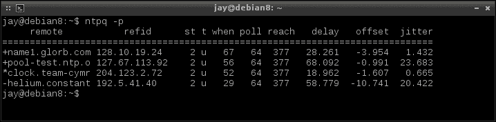
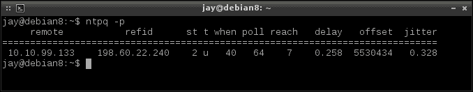

# 第六章：配置网络服务

到目前为止，我们已经配置了我们的节点，并允许它们实际上相互通信。我们可以访问我们的节点以远程管理它们，在它们之间传输文件，监视它们的资源，并执行基本的网络操作。在本章中，我们将设计我们将用于网络的 IP 地址方案，并设置实施计划所需的服务。这将包括讨论设置和配置动态主机控制协议（DHCP）、域名服务以及网络时间协议（NTP）。

在本章中，我们将涵盖：

+   规划您的 IP 地址布局

+   安装和配置 DHCP 服务器

+   安装和配置 DNS 服务器

+   设置内部 NTP 服务器

# 规划您的 IP 地址布局

在网络上实施任何计划之前花时间制定一个很好的计划是一个好主意，但是您的 IP 地址方案尤其重要。很容易接受默认设置并迅速让所有人上线。对于一些小公司来说，路由器（或默认情况下处理 DHCP 的任何设备）提供的默认 IP 地址布局可能足够。但是随着公司的发展，这种情况需要改变。为潜在的增长做好准备至关重要。实施 IP 地址方案很容易，但是在已经推出的网络上更改此方案是一个巨大的挑战。一定要花时间进行适当的规划。

确定 IP 地址方案的首要考虑因素是您需要为哪些类型的设备提供地址。通常，您需要处理服务器、工作站和打印机。但是现在，我们的网络上还有其他设备，如 IP 电话、公司发放的电话、会议系统、平板电脑等。当您开始将所有这些设备放在一起时，一个典型的具有 254 个可用地址的 24 位网络似乎并不那么大，即使对于一个小公司来说也是如此。更糟糕的是，一些设备（如笔记本电脑）有多个网络接口卡。如果将所有这些放在一起，您会发现这 254 个地址很快就会被用完。

拥有多个子网肯定会有所帮助。通过子网划分，您可以为每种类型的服务创建单独的网络，每个网络都有自己的一组 IP 地址。例如，您可以将服务器放在一个子网上，打印机放在另一个子网上，最终用户工作站放在它们自己的子网上。您可以将一个 24 位子网分成几个网络，而不是将其在这三种设备类型之间进行划分。我们将在第八章中更详细地介绍子网划分，但是现在，隔离您的网络几乎总是一个好主意，原因甚至超出了 IP 地址的范围。

另一个需要考虑的因素是限制您的广播域。一个 24 位网络（通常是网络设备默认的）是一个广播域。简而言之，一个设备可以在您的网络上直接与另一个设备通信，而无需先进行路由，并共享相同的广播域。如果您只有几台设备，这并不重要（除非一个设备处理了大量的流量）。但是在大多数网络中，分割广播域可以提高性能。如果您有一个路由器分隔您的子网，那么实际上就是在分割您的广播域。因此，如果一个节点位于自己的子网上，它更难以使您的网络饱和。然而，没有完美的解决方案，单独的广播域也可能会变得饱和。

在规划 IP 方案时，一个有用的工具是`ipcalc`实用程序。`ipcalc`实用程序可以帮助您了解每个方案可用的 IP 地址数量。这个实用程序在 Debian 中通过`apt-get`可用，不需要任何额外的存储库。虽然 CentOS 中内置了`ipcalc`命令，但它不是同一回事，也没有用。如果可能的话，我建议使用 Debian 版本。要使用它，只需执行`ipcalc`以及您考虑使用的网络。例如，您可以运行以下内容进行测试：

```
ipcalc 10.10.96.0/22

```

规划您的 IP 地址布局

ipcalc 显示 10.10.9.60/22 内部网络的子网信息

在前面的例子中，我们可以看到，如果我们选择了`10.10.96.0/22`方案，我们将有`1022`个可允许的 IP 地址，子网掩码为`255.255.252.0`，这将是一个 A 类私有网络。虽然您将在本书的后面学到更多关于子网划分的知识，但`ipcalc`实用程序对您来说将是一个方便的工具，可以让您玩弄并确定特定 IP 布局的外观。

另一个值得讨论的 IP 地址问题是 IPv4 与 IPv6。很长一段时间以来，IPv4 已经足够满足每个人的需求。不幸的是，现在公共互联网上的 IPv4 地址开始耗尽（在许多情况下已经耗尽）。IPv6 的好处在于有如此多的 IP 地址可用；我们再也不会用尽 IP 地址是完全不可想象的。IPv6 还具有安全性的好处，因为地址空间如此之大，目标被抽象化（本质上是通过混淆来保障安全）。

考虑到这一点，您可能会想在网络内部使用 IPv6 地址而不是 IPv4。然而，我的建议是，除非您有非常充分的理由这样做，否则不要费心。IPv4 地址的枯竭只影响公共互联网，而不影响您的内部网络。虽然您当然可以在内部部署 IPv6，但这样做没有任何好处。鉴于 IPv4 有超过 40 亿个可用地址，您需要相当多的设备才能证明 IPv6 的必要性。另一方面，IPv6 对电信业务确实有用（并且最终将是必需的）。对于那些正在学习思科考试的人来说，理解这个主题是必需的。但是对于本书的目的和设置 Linux 网络来说，IPv6 并不能证明管理开销。

总之，提前规划是很重要的。IPv4 对我们的需求已经足够了，将我们的网络划分为子网是一个好主意（即使您认为您的网络永远不会超过 254 个地址）。规划得越大越好；即使在最坏的情况下，您可能永远不会使用所有配置的 IP 地址。但即使您不打算使用大量 IP 地址，将它们保留以备将来扩展网络是一个好主意，而且以后实施起来更容易。根据我的经验，我曾经有过重新配置公司网络的任务，而该网络并不是为了增长而设计的。虽然这绝对是一次学习经历，但并不是一次愉快的经历。

# 安装和配置 DHCP 服务器

到目前为止，在本章中，我们讨论了为您的网络创建布局。在本节中，我们将付诸行动。在这里，我们将在 Debian 或 CentOS 机器上设置 DHCP 服务器，并将其配置为为我们的网络提供 IPv4 地址。所以，让我们开始吧！

首先，决定哪个发行版将运行您的 DHCP 服务器。选择 Debian、CentOS 或其衍生版本都无所谓。在每个版本上，配置都是相同的，主要区别在于您需要安装的软件包的名称和要启动的守护程序。在 Debian 上，您将安装`isc-dhcp-server`软件包，而在 CentOS 上，您将安装`dhcp`。Debian 将为您启用 DHCP 守护程序（`isc-dhcp-server`），但它不会启动，因为我们还没有配置它。CentOS 不会尝试启动或启用其 DHCP 守护程序（`dhcpd`）。

对于 Debian 和 CentOS，我们需要编辑的配置文件位于`/etc/dhcp/dhcpd.conf`。为了设置我们的 DHCP 服务器，我们需要编辑这个文件，然后启动或重新启动守护程序。请使用您喜欢的文本编辑器打开这个文件。如果您在 Debian 上安装了 DHCP 服务器，您会注意到提供了一个包含相当多示例配置的默认`/etc/dhcp/dhcpd.conf`文件。另一方面，CentOS 基本上给了您一个空白的文件来使用。为了我们的目的，我们将从头开始创建一些配置。在 Debian 的情况下，您可以删除或备份默认配置文件。

接下来是一个 DHCP 的示例配置文件`/etc/dhcp/dhcpd.conf`。在这个示例中，我们使用了之前确定的相同网络，并演示了`ipcalc`实用程序（`10.10.96.0/22`）。这个网络给了我们几个子网可用，但您不必按照这个方案进行，可以根据需要进行调整以适应您的环境。

```
default-lease-time 86400;
max-lease-time 86400;
option subnet-mask 255.255.252.0;
option broadcast-address 10.10.99.255;
option domain-name "local.lan";
authoritative;
subnet 10.10.96.0 netmask 255.255.252.0 {
 range 10.10.99.100 10.10.99.254;
 option routers 10.10.96.1;
 option domain-name-servers 10.10.96.1;
}

```

因此，让我们逐行通过这个配置。

首先，我们有以下两行：

```
default-lease-time 86400;
max-lease-time 86400;

```

在这里，我们确定了 DHCP 租约的持续时间。在实践中，当一个节点请求一个 IP 地址时，它的客户端将获得一个租约以及 IP 地址。这意味着 IP 地址只在特定的时间段内有效。在这里，我们设置了一个持续时间为`86400`，这意味着我们的租约时间是一天，因为这是以秒为单位的。我们两次列出了这个数字，分别是默认和最大租约时间。如果客户端没有指定请求保留 IP 地址的时间，`default-lease-time`将提供给任何客户端。`max-lease-time`意味着如果客户端请求保留 IP 地址的时间超过这段时间，将不被允许这样做。我们基本上将默认和最大租约时间设置为相同的数字。如果需要，我们还可以包括`min-lease-time`来强制客户端请求更短的最小租约时间。

考虑以下两行：

```
option subnet-mask 255.255.252.0;
option broadcast-address 10.10.99.255;

```

通过这一部分，我们正在设置子网掩码，该子网掩码将被分配给客户端，以及广播地址。正如您可能已经知道的那样，子网掩码标识每个连接节点将成为其中一部分的网络。当客户端在被提供地址后检查其 IP 信息时，我们标识的子网掩码将显示出来。广播地址是一个所有节点都能够接收数据包的地址。

考虑以下两行：

```
option domain-name "local.lan";
authoritative;

```

在这里，我们将`local.lan`的域名附加到连接到我们的 DHCP 服务器的每个节点的主机名上。这一步并不是必需的，但在规范化网络中的域名时可能会有用。我们还在我们的配置中包括`authoritative`，以确立我们的 DHCP 服务器是这个子网的主要服务器。

考虑以下行：

```
subnet 10.10.96.0 netmask 255.255.252.0 {
 range 10.10.99.1 10.10.99.254;
 option routers 10.10.96.1;
 option domain-name-servers 10.10.96.1;
}

```

最后，我们在结尾有一个非常重要的代码块。在这里，我们确定了我们子网的网络地址、子网掩码、我们正在分配的 IP 地址范围、默认网关和我们的 DNS 服务器。在这个示例中，我们从`10.10.99.100`开始分配我们的第一个 DHCP 地址，并在`10.10.99.254`结束我们的地址池。如果您回忆一下之前的`ipcalc`输出，您会注意到这个子网中的第一个地址从`10.10.96.1`开始。但我们并没有从那里开始我们的地址池，而是晚了很多。为了参考，我们使用了`10.10.96.0/22`网络，这给了我们以下子网：

```
10.10.96.0
10.10.97.0
10.10.98.0
10.10.99.0

```

如果我们愿意，我们可以将 DHCP 范围设置为从`10.10.96.1`开始，到`10.10.99.254`结束。在这种情况下，我们将有 1,022 个 DHCP 地址。但是，我在我的配置中没有这样做的原因是，前三个网络已被保留用于几个目的。我使用第一个（`10.10.96.0/22`）用于服务器，下一个用于 DHCP 预留，第三个用于网络设备。由于前三个子网位于 DHCP 范围之外，DHCP 服务器永远不会向客户端提供这些地址，因此我不必担心 DHCP 租约会处理我可能设置的静态地址。确保静态 IP 地址位于 DHCP 范围之外是一种非常常见的做法。

公平地说，这个配置相当复杂，因为我向您展示了如何在 DHCP 中使用多个子网，而不是专注于一个网络。为了简化一点，如果我们设置一个默认的 24 位网络，我们的配置将如下所示（如果我们使用`10.10.10.0/24`网络）：

```
default-lease-time 86400;
max-lease-time 86400;
option subnet-mask 255.255.255.0;
option broadcast-address 10.10.10.255;
option domain-name "local.lan";
authoritative;
subnet 10.10.10.0 netmask 255.255.255.0 {
    range 10.10.10.10 10.10.10.254;
    option routers 10.10.96.1;
    option domain-name-servers 10.10.96.1;
}
```

通过这个配置，我将 DHCP 范围设置为从`10.10.10.10`开始，到`10.10.10.254`结束。这给了我九个 IP 地址（`10.10.10.1`—`10.10.10.9`），永远不会被分配，所以我有空间设置一些静态 IP 地址。

所以，我在这里几次提到了*静态 IP 地址*。你可能已经知道这是什么意思，但重要的是要详细说明静态 IP 地址对服务器来说是一个很好的主意。这些地址是为某些服务器或节点保留的，您希望它们每次都有相同的 IP 地址。如果您以前配置过网络，这可能是显而易见的。还有一个重要的静态租约的概念。静态租约也称为**预留**。使用静态租约，IP 地址仍由 DHCP 服务器提供，客户端仍然使用 DHCP 请求地址。不同之处在于，客户端每次连接时都会收到相同的地址。

设置静态租约非常容易。预留可以放在您的`/etc/dhcp/dhcpd.conf`文件的末尾。以下是一个示例，展示了语法的样子：

```
host bahamut {
    hardware ethernet 28:B2:BD:05:1E:00;
    fixed-address 10.10.97.4;
}
```

在这里，我们有一个名为`bahamut`的主机，MAC 地址为`28:B2:BD:05:1E:00`。这个名字是任意的；它除了让我们记住预留是为了哪个主机之外没有实际意义。它不必与请求 IP 的设备的主机名匹配。代码块中的两行只是表示每当网络卡连接到具有 MAC 地址`28:B2:BD:05:1E:00`的 DHCP 服务器时，它需要提供 IP 地址`10.10.97.4`。我们可以添加尽可能多的类似代码块，以便为我们希望分配的静态租约添加尽可能多的代码块。

也许你会想知道，何时应该使用静态 IP，何时应该使用静态租约？在我看来，只要有意义并符合您的网络设计，就可以使用静态租约。使用静态租约，您只需要在想要查看所有预留的概述时检查`/etc/dhcp/dhcpd.conf`文件。此外，即使您重新安装操作系统或从活动安装映像引导主机，主机也将始终收到相同的 IP 地址。对于静态租约，您无需在主机上进行任何配置。通常，静态租约更容易管理。当然，您自己的偏好将超越这一点。

最后，为了使我们的 DHCP 服务器正常运行，必须启动并配置为在启动时运行。Debian 已经负责启用守护程序，因此您只需要重新启动它，以便我们的配置生效：

```
# systemctl restart isc-dhcp-server

```

对于 CentOS，我们需要手动启用和启动服务：

```
# systemctl enable dhcpd
# systemctl start dhcpd

```

正如你所看到的，配置 Linux 上的 DHCP 服务器非常容易和直接。当然，还有高级用法场景和大量的附加选项。但是对于大多数情况来说，像这里概述的这样的配置应该足够了。

# 安装和配置 DNS 服务器

**域名系统**（**DNS**）使得浏览网络资源变得更加容易。除非你有一个非常小的网络，否则你不太可能记得哪些 IP 地址属于哪些机器。DNS 通过将名称映射到 IP 地址来帮助你，这样你就可以通过主机名引用计算机，DNS 将负责将其翻译回 IP 地址。

DNS 是几乎每个连接到网络的设备都在使用的东西，无论用户是否意识到。计算机、服务器、智能手机、平板电脑、智能家电等都在使用 DNS。每当你在互联网上查找一个服务，比如一个网站或一个远程资源，DNS 会将资源的名称翻译成 IP 地址。

尽管 DNS 的概念和它为我们做的事情可能是常识，但它是那些容易被认为理所当然的东西之一。DNS 是那些在背后工作并让我们的生活变得更加容易的神秘事物之一。我们大多数人都在使用它，但很少有人真正理解它是如何工作的。每当你连接到一个**互联网服务提供商**（**ISP**）时，通常会分配给你一个或两个 DNS 服务器供你使用。一些聪明的用户通常会绕过 ISP 分配的 DNS 服务器，使用谷歌或 OpenDNS 等第三方服务器，以期望获得额外的性能。

DNS 在内部网络中也可以证明是有用的。大多数有超过一把工作站的公司都会设置 DNS，这是理所当然的。它使得浏览你的网络变得轻而易举。例如，更容易将你的本地彩色打印机称为`hp-color-01`，而不是记住 IP 地址，比如`10.19.89.40`。在这种情况下，添加打印机将会很容易。只需让你的操作系统按名称浏览它。你网络上的任何资源都可以被命名，为所有网络资源创建一个一致和可预测的命名方案是一个好主意。所以，让我们做到这一点。

与 CentOS 相比，基于 Debian 的发行版所需软件包的命名通常有所不同。在 Debian 中，你需要安装的软件包是`bind9`。CentOS 简单地称其为`bind`。如果你想知道的话，**BIND**代表**伯克利互联网名称域**（以它被开发的地方命名，即加州大学伯克利分校）。这是互联网上最流行的名称服务器，所以你肯定会想熟悉它。顺便说一句，如果你在 CentOS 系统上进行这个活动，我建议你安装`bind-utils`。这给了我们`dig`命令，对我们来说会很有用。

第一步是在服务器上安装所需的软件包，然后你只需要启动它并确保它被启用以在启动时运行。Debian 已经为我们启动了守护程序并启用了它。你可以用以下命令来确认：

```
# systemctl status bind9

```

CentOS 不会自动启动`bind`守护程序，也不会为你启动它。如果你选择的是 CentOS 发行版，你需要执行以下命令来启用`bind`并启动它：

```
# systemctl enable named
# systemctl start named

```

完成这一步后，你实际上拥有了一个工作的 DNS 服务器。当然，我们没有配置任何东西，所以我们的 DNS 服务器实际上并没有为我们做太多事情。但现在我们已经安装了它，我们可以向其中添加记录并构建我们的配置。

首先，让我们来看一下默认配置文件。Debian 将 bind 的默认配置文件存储在`/etc/bind/named.conf`中。CentOS 将它们存储在`/etc/named.conf`中（它没有自己的目录）。去看看这个文件，了解一下配置是如何工作的。我们将使用我们自己的配置文件，所以我建议你备份默认文件，然后我们将安装我们自己的文件。

首先，在我们发行版的默认目录中创建一个新的`named.conf`文件（在 Debian 中是`/etc/bind/named.conf`，在 CentOS 中是`/etc/named.conf`）。无论你使用哪个发行版，我们都会使文件相同。如果这个文件已经有文本了，把它复制到一个备份中或清空它，因为接下来的两行是我们在这个文件中需要的唯一文本：

```
include "/etc/bind/named.conf.options";
include "/etc/bind/named.conf.local";

```

在这里，我们将包括两个额外的文件（我们很快将创建）。正如你所看到的，我们的`named.conf`文件只是调用这些文件，不包含其他配置。这样，我们可以创建我们自己的标准位置来找到这些文件。`/etc/bind`已经是 Debian 中的默认位置，但通过在 CentOS 中调用这个目录，我们可以强制它在同一个地方查找配置。但是在 CentOS 中，你需要创建`/etc/bind`目录。命令如下：

```
# mkdir /etc/bind

```

接下来，让我们创建我们的`/etc/bind/named.conf.options`文件并自定义它：

```
options {
    forwarders {
        8.8.8.8; 8.8.4.4;
    };
};
```

在这里，我们正在创建一个选项块，其中夹在花括号之间的一些代码，然后包括另一组花括号，我们在其中标识了我们的转发地址。由于这个 DNS 服务器是用于在我们的内部网络中定位资源，转发器块告诉我们的 DNS 服务器在本地找不到它要找的东西时应该将请求发送到哪里。你的 DNS 服务器很可能在没有这个的情况下仍然可以正常工作，因为在大多数情况下它仍然会尝试链条下游的另一个 DNS 服务器。但是在这里设置转发器允许我们强制指定 DNS 查找应该去哪里，以防我们要查找的是外部的东西。在这个示例中，我使用了谷歌的公共 DNS 服务器。但你可以选择你自己的。一些额外的 DNS 服务器（通常更好）可以在[www.opennicproject.org](http://www.opennicproject.org)找到，这也是一个很好的选择，如果你担心隐私或跟踪的话。

我们的下一个文件是`/etc/bind/named.conf.local`，其中包含以下代码：

```
zone "local.lan" IN {
    type master; file "/etc/bind/net.local.lan";
};

zone "96.10.10.in-appr.arpa" {
    type master; notify no; file "/etc/bind/revp.10.10.96";
};

zone "97.10.10.in-appr.arpa" {
    type master; notify no; file "/etc/bind/revp.10.10.97";
};

zone "98.10.10.in-appr.arpa" {
    type master; notify no; file "/etc/bind/revp.10.10.98";
};

zone "99.10.10.in-appr.arpa" {
    type master; notify no; file "/etc/bind/revp.10.10.99";
};
```

在这个文件中，我们首先要确定我们的域名。在这里，我选择了`local.lan`。由于这台服务器不是互联网上任何东西的权威，这个名字很合适。在这个块中，我们调用另一个文件`/etc/bind/net.local.lan`。事实上，正如你所看到的，这里调用了几个文件（总共五个）。第一个是我们的主 DNS 区域，它是其中最重要的。其后的是我们配置反向 DNS 查找的地方。基本上，DNS 不仅允许我们将主机名映射到 IP 地址，还可以进行反向映射（将 IP 地址映射回主机名）。你可能不需要我在示例中创建的所有文件。对我来说，我为我的四个子网中的每一个创建了一个反向查找文件。如果你不创建多个子网，你只需要创建一个。这些文件的命名约定是`revp`，后面跟着 IP 地址的网络部分。所以，例如，我的`10.10.99.0`网络的反向查找文件是`revp.10.10.99`。这些文件也将存储在`/etc/bind`中。

现在，让我们来看看我们的主记录，`/etc/bind/net.local.lan`文件：

```
;
; dns zone for for local.lan
;

$TTL 1D

@ IN SOA local.lan. hostmaster.local.lan. (

201507261 ; serial

8H ; refresh
4H ; retry
4W ; expire
1D ) ; minimum
IN A 10.10.96.1
;
@ IN NS hermes.local.lan.
ceres           IN      A   10.10.98.1
euphoria        IN      A   10.10.97.4
galaxy          IN      A   10.10.96.4
hermes          IN      A   10.10.96.1
puppet      CNAME galaxy
;
; dns zone for for local.lan
;
```

首先，我放了一些通用的注释，以分号开头的行。如果一行以分号开头，它将被`bind`忽略。注释可以是留下关于配置的注释或事实的好方法。然而，在`bind`中注释并不经常使用。接下来，我们将我们的**生存时间**（**TTL**）设置为一天：

```
$TTL 1D

```

这个值决定其他 DNS 服务器能够缓存每个记录的时间有多长。在此期间，任何缓存了这些记录的服务器必须丢弃它们。为了设置内部 DNS 服务器，这个值对我们影响不大。但是，如果您设置了多个 DNS 服务器，这可能是一个重要的配置值。TTL 值可能会被证明有用的一个例子是将地址记录更改为不同的 IP 地址。假设您要将您的电子邮件主机切换到另一个提供商。在这种情况下，您将相应地更改地址记录。但在执行此更改之前，您可能会将 TTL 降低到更短的时间，比如一小时，然后再进行更改。然后，服务器被迫丢弃这个区域并刷新它，导致它更快地看到您更改的电子邮件提供商。完成后，您将把这个值改回来。在下一行，我们确定了一个**权威起始**（**SOA**）：

```
@ IN SOA local.lan. hostmaster.local.lan. (

```

在这种情况下，我们确定了这个 DNS 服务器对`local.lan`域有权限。我们还澄清了`hostmaster.local.lan`对此负有责任。虽然看起来可能不像，但`hostmaster.local.lan`实际上是一个按照 bind 的偏好格式的电子邮件地址。然而，这显然是一个假地址，对于我们的内部 DNS 服务器并不重要。在这一行的末尾，我们正在打开一个配置块，这里是一个开放括号。下一行代表我们的序列号，这是一个非常重要的概念，为了使我们的 DNS 服务器正常工作，必须理解。

```
201507261 ; serial

```

每次我们重新启动`bind`守护程序时，它都会重新加载这个文件。但是当它这样做时，序列号是它首先查看的东西。如果它是相同的，它可能不会加载任何更改。因此，每次您在`bind`中更改区域文件时，您也必须更改这个序列号。在这个例子中，当前日期被使用，没有连字符或空格。最后一位数字只是当天的修订号，如果文件在一天内被多次更改。您可以使用任何您喜欢的方案。但使用日期是一个非常流行的方法。无论您使用的格式是什么，都要确保您在每次更改时将序列号递增 1。这样您就不会因为新创建的记录没有生效而感到沮丧。

```
8H ; refresh
4H ; retry
4W ; expire
1D ) ; minimum
```

这些值决定了从属 DNS 服务器被告知多久检查更新。第一个值将配置从属服务器每八小时从主服务器（本服务器）刷新区域记录。关于重试，我们让从属服务器知道如果连接出现问题，要在这段时间内再次检查。最后，我们将区域记录的最小年龄设置为一天，最大年龄设置为四周。配置从属 DNS 服务器超出了本书的范围，但是在以后决定配置从属 DNS 服务器时，有这个配置也不会有任何坏处。

```
@ IN NS hermes.local.lan.

```

在这里，我们确定了这个名称服务器。在我的情况下，我称之为`hermes`，它的完整域名是`hermes.local.lan`。

```
galaxy        IN    A   10.10.96.4
hermes        IN    A   10.10.96.1

```

最后，在这个示例配置中，调用了四个地址记录。这基本上意味着每当有人寻找这些主机中的一个时，请求就会映射到列出的域名上。这些可以是多个子网中的一部分，也可以是单个子网中的一部分。在我的情况下，这些主机位于不同的子网上。

```
puppet      CNAME galaxy

```

这个配置的最后一行包含一个**规范名称**（**CNAME**）记录。基本上，这允许我们用另一个名称引用一个服务器。在这个例子中，`galaxy`也用于名为`puppet`的软件，因此为它设置了一个 CNAME 记录。这样，如果有人试图访问`galaxy.local.lan`或`puppet.local.lan`，他们的请求将解析到相同的 IP 地址（`10.10.96.4`）。如果单个服务器为网络提供多个服务，CNAME 记录可能非常有用。

之前，我提到了四个反向查找记录，`/etc/bind/revp.10.10.96`，`/etc/bind/revp.10.10.97`，`/etc/bind/revp.10.10.98`和`revp.10.10.99`。接下来，我将演示其中一个文件（在这种情况下，是为`10.10.96.0`网络）：

```
$TTL 1D
@ IN SOA hermes.local.lan. hostmaster.local.lan. (
201507261 ; serial
28800 ; refresh (8 hours)
14400 ; retry (4 hours)
2419200 ; expire (4 weeks)
86400 ; minimum (1 day)
)
;
@ NS hermes.local.lan.
1    PTR    hermes.local.lan.
3    PTR    nagios.local.lan.
4    PTR    galaxy.local.lan.

```

通过这个配置，您会注意到我们有一个*权威起始*记录，就像我们的主区域一样，还有一个序列号。这里也适用相同的想法。每当您更新任何记录（包括反向查找记录）时，都应该更新文件的序列号。权威起始条目的工作方式与之前相同，没有什么意外。文件的不同之处在于如何调用主机。我们只需要识别最后一个八位字节，因为整个文件专门用于从`10.10.96.0`网络进行反向 IP 地址查找。对于您的子网中的每个子网，您都需要创建一个类似的文件。在我们的示例配置中有四个子网，但您不需要那么多。这样提供示例是为了演示如何处理单独的子网，如果您需要的话。

配置完成后，可以随时重新启动 DNS 服务器上的 bind 服务并进行测试。我们可以使用`systemctl`命令重新启动`bind`，就像以前一样。

对于 Debian，请使用以下命令：

```
# systemctl restart bind9

```

对于 CentOS，请使用以下命令：

```
# systemctl restart named

```

我们可以通过`dig`命令测试我们的 DNS 服务器。在 Debian 中，您应该已经安装了这个软件包。CentOS 需要安装`bind-utils`软件包。`dig`（域信息检索器）是一个实用程序，允许我们从 DNS 服务器请求信息。要尝试一下，请尝试使用内部主机名：

```
dig myhostname.local.lan

```

如果您的 DNS 服务器在输出中显示为`SERVER`，则您的 DNS 服务器正常运行。如果由于某种原因没有显示，请验证您输入的内容、序列号以及您上次配置更改后是否重新启动了`bind`。

随时练习在 DNS 服务器中设置额外的节点和记录。一开始设置`bind`可能会让人沮丧，但坚持下去，您很快就会成为专家。使用本节中的示例，您应该有一个可以在您的环境中设置 DNS 服务器的工作框架。确保您将配置文件中包含的主机名和 IP 地址更改为与您的网络匹配的主机名和 IP 地址。此外，确保您设置`bind`以匹配您的子网，或者如果没有其他子网，则删除其他子网的提及。为了安全起见，通常最好手动输入所有内容，而不是直接从本书复制配置。

# 设置内部 NTP 服务器

大多数 Linux 发行版都提供了一个**网络时间协议**（**NTP**）客户端，可用于保持本地时间的最新状态。其想法是，通过配置 NTP 客户端，您的计算机或服务器将定期与互联网上的 NTP 服务器进行同步，以确保其尽可能精确。这非常重要；如果时钟不准确，Linux 机器可能会发生非常奇怪的事情。这些奇怪的事情可能包括节点无法与 DHCP 服务器关联以获取 IP 地址，文件在文件服务器之间变得不同步等。故事的教训是：您需要在您的环境中设置并使 NTP 正常工作。

许多面向最终用户工作站的 Linux 发行版（如 Ubuntu、Linux Mint 等）通常会为您设置 NTP 客户端。这意味着开箱即用，您的时钟很可能已经同步，当然前提是您的安装可以访问互联网。默认情况下，这些客户端将连接到特定于发行版的 NTP 服务器。这可能完全没问题，但是设置自己的 NTP 服务器也是有价值的。其中一个很好的理由是，通过设置自己的 NTP 服务器，您正在成为一个良好的网络公民。想想看。如果您有一家拥有一百台 Linux 机器的公司，如果保持默认配置，每台机器都会定期与公共 NTP 服务器进行通信。这会给服务器造成不必要的压力。如果您设置自己的 NTP 服务器，只有一个服务器会与公共服务器进行通信，这意味着您会消耗更少的资源。此外，出于安全原因，一些公司不允许公共访问**端口 123**（NTP 使用的端口）。然而，也许允许一个单独的 NTP 服务器访问端口 123，然后您可以配置您的客户端连接并使用 NTP。

在设置 NTP 服务器之前，重要的是要注意，Debian 和 CentOS 通常可以成为默认安装 NTP 客户端的例外情况。根据您在安装过程中选择的选项和软件包，NTP 客户端可能已经可用，也可能尚未可用。在我的测试环境中，当我分别通过最小安装和网络安装安装时，CentOS 和 Debian 默认情况下都没有一个可用的 NTP 客户端。然而，设置 NTP 客户端非常容易。您只需安装 NTP 并启用它。这实际上是 Debian 和 CentOS 具有相同软件包相同名称的罕见情况之一。该软件包简单地称为`ntp`，因此如果您尚未安装，请安装它。安装后，Debian 将启动`ntp`守护程序并为您启用它。对于 CentOS，请执行以下命令以启动它：

```
# systemctl enable ntpd
# systemctl start ntpd

```

使用这两个发行版，一旦安装了软件包，文件`/etc/ntp.conf`将被创建，并且该文件将具有一个默认配置，该配置将指向您的发行版的 NTP 服务器。如果您对它的外观感到好奇，可以随意快速查看一下这个文件。要查看您的机器正在与哪个服务器同步，以及关于其同步的一些统计信息，请执行`ntpq -p`命令。



查看连接的 NTP 服务器

首先，让我们快速看一下这些数字的含义。第一列`remote`包括我们连接的 NTP 服务器的列表，没有什么意外。接下来是`refid`，表示这些服务器连接到的地方。`st`列是指该服务器的**层**，这是一个指示该时间服务器所在层的数字。通常，数字越低，它就越好；因为这意味着该服务器与提供时间的源相当接近。链条下的每个服务器都有一个增加的层；最低并不总是意味着服务器更好，但一般来说，较低的数字是好的。`t`列是指类型。这可以是单播、广播、组播或多播。在这种情况下，我们使用`u`表示单播。

`when`列指的是服务器上次轮询的时间。在示例截图中，每个服务器分别在 28、24、21 和 61 秒前轮询。这也可以列出小时或天。`poll`列指的是轮询频率，这里设置为每 64 秒轮询一次。`reach`列是一个八进制数，其中包含最近八次 NTP 更新的结果。如果所有八次都成功，这个值将读取 377，这是它能达到的最高值。这意味着所有八次尝试都收到了 1（成功），在八进制中，总共是 377。

最后，`delay`字段指的是到 NTP 服务器的延迟（以毫秒为单位）。`offset`字段对应于本地时钟和服务器时钟之间的差异。最后，`jitter`指的是您和服务器之间的网络延迟。

要设置 NTP 服务器，您必须首先安装客户端，就像本章前面提到的那样。安装它，配置守护程序自动启动，然后启动它。执行这些任务后，您已经完成了大部分工作（服务器和客户端使用相同的客户端）。基本上，如果您将其他计算机指向安装和配置了 NTP 的服务器，您基本上已经拥有了所需的一切。

然而，有一些东西应该首先配置。主要是`/etc/ntp.conf`配置文件。该文件在 Debian 和 CentOS 上的位置相同。如果您查看文件，您会看到一些类似以下的行：

```
server 0.centos.pool.ntp.org iburst
server 1.centos.pool.ntp.org iburst
server 2.centos.pool.ntp.org iburst
server 3.centos.pool.ntp.org iburst

```

在这里，您可以看到，默认情况下，CentOS 标识了四个 NTP 服务器进行同步。对于大多数用例来说，这些服务器通常都很好，但您可能希望考虑官方的 NTP 服务器。要这样做，请查看以下网站：

[`www.pool.ntp.org`](http://www.pool.ntp.org)

该网站将允许您查看 NTP Pool Project 的官方 NTP 服务器。要导航，请在右侧选择您的大陆，然后选择您的国家。然后，您应该看到一个可以使用的 NTP 服务器列表。在我的情况下，我得到以下细节：

```
server 0.north-america.pool.ntp.org
server 1.north-america.pool.ntp.org
server 2.north-america.pool.ntp.org
server 3.north-america.pool.ntp.org

```

您可以选择使用发行版提供的 NTP 服务器，也可以选择使用 NTP 池项目提供的 NTP 服务器。就我个人而言，我更喜欢后者。一旦您配置了服务器，我们应该进行一次更改。您应该在 CentOS 的配置中看到类似以下的行：

```
#restrict 192.168.1.0 mask 255.255.255.0 nomodify notrap

```

在 Debian 中类似于以下内容：

```
#restrict 192.168.123.0 mask 255.255.255.0 notrust

```

在您的 NTP 服务器上，取消注释该行，并将网络地址更改为您的地址，以及子网。如果有`notrust`，请删除它。作为参考，我的配置中的该行如下：

```
restrict 10.10.96.0 mask 255.255.252.0 nomodify notrap

```

有了这个配置，我们限制了 NTP 访问本地客户端，并确保它们无法访问 NTP 服务器的配置（只能从中读取）。我在 NTP 中喜欢做的另一个更改是指定一个日志文件。systemd 通过`journalctl`负责记录，但有时在出现问题时查看文本文件也很有用。如果您需要，可以在顶部附近添加以下行：

```
logfile /var/log/ntp.log

```

如果您遇到任何问题，请检查该文件。接下来，如果您将 CentOS 用作 NTP 服务器，则应通过其防火墙启用 NTP 流量。要做到这一点，请运行以下代码：

```
firewall-cmd --add-service=ntp –permanent
firewall-cmd --reload

```

现在我们已经完成了，重新启动您的 NTP 服务器。我们可以通过以下命令之一来执行（作为 root）。

在 CentOS 上使用`systemctl restart ntpd`命令，或在 Debian 上使用`systemctl restart ntp`。

在这一点上，您已经有了一个 NTP 服务器。在您的客户端上，将它们配置为与您指定为 NTP 服务器的机器的 IP 同步。在我的情况下，命令如下：

```
server 10.10.99.133

```

重新启动 NTP 后，让您的系统一些时间进行同步。在某些情况下，可能需要半个小时以上才能开始同步。给它一些时间，然后检查您的配置，确保它正在使用`ntpq -p`命令进行同步。



与自定义 NTP 服务器同步的机器输出

在我的测试环境输出中，您可以看到，我在`10.10.99.123`上启动了一个 NTP 服务器，这台 Debian 机器正在与之同步，目前服务器的可达性为`7`，但这个数字正在慢慢上升。这很正常，因为服务器只运行了几分钟。

如果您遇到任何问题，请确保在您的网络中打开端口 123（如果服务器是 CentOS，请确保您已运行之前提到的防火墙命令）。但在您感到沮丧之前，请给它一些时间——当第一次设置时，NTP 服务器需要一些时间才能启动是很常见的。通常，一切应该在 20 分钟内开始运行，但我曾经见过更长时间。

# 总结

在本章中，我们配置了网络的布局。我们首先讨论了规划网络 IP 地址布局，然后通过创建自己的 DHCP 服务器来付诸实施。这次讨论包括如何将此配置分成多个子网，而不是多个子网。我们继续设置 DNS 服务器，以便通过名称解析我们的网络节点。最后，我们通过设置 NTP 服务器来结束本章，以确保我们的所有节点都具有正确的时间。

在下一章中，我们将探讨使用 Apache 托管网页内容。
