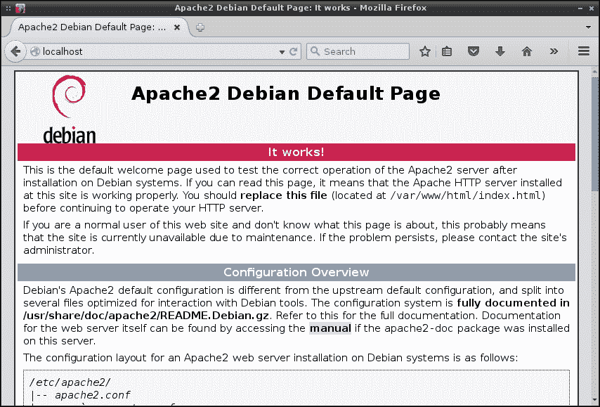
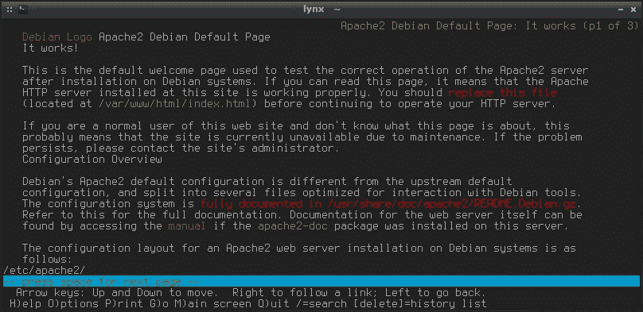
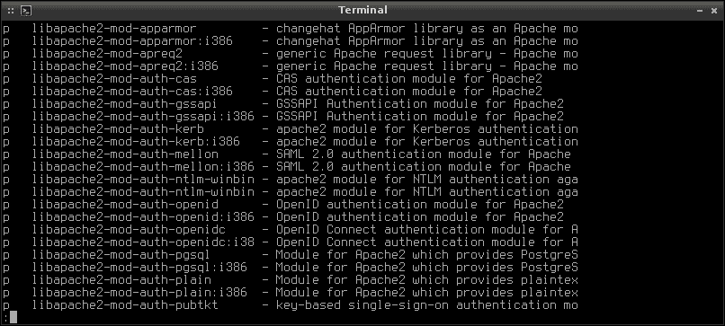
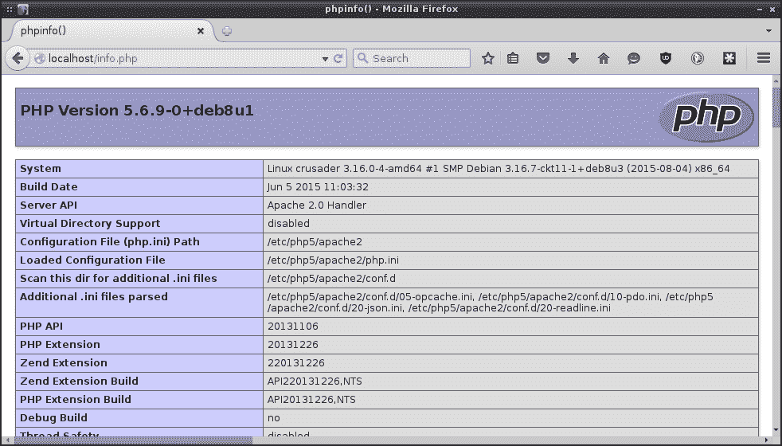

# 第七章。通过 Apache 托管 HTTP 内容

**Apache**是互联网上最常用的 Web 服务器。虽然还有其他可用的 Web 服务器，比如微软的**Internet Information Services**（**IIS**），但在提供 Web 内容方面，Apache 占据着统治地位。Apache 在 Linux 和 UNIX 平台上都可用，使您能够托管内容并在本地局域网以及互联网上共享。Apache 服务器有许多用途，包括（但不限于）托管博客或公司网站，或为您的公司设置员工门户网站。

在本章中，您将学习有关安装和配置 Apache 的所有内容。我们将涵盖以下主题：

+   安装 Apache

+   配置 Apache

+   添加模块

+   设置虚拟主机

# 安装 Apache

像往常一样，在系统上安装 Apache 只是从软件包管理器中安装适当的软件包。在 CentOS 系统上，您可以通过安装`httpd`软件包获取 Apache，在 Debian 系统上则是`apache2`软件包（分别作为 root 执行`yum install httpd`或`apt-get install apache2`）。安装软件包后，Apache 的守护程序现在已经存在，并带有一组默认的配置文件。您可以使用`systemctl`确认守护程序在您的系统上的存在，尽管守护程序的名称根据您的发行版而有所不同。

在 Debian 上使用以下命令：

```
# systemctl status apache2

```

在 CentOS 上使用以下命令：

```
# systemctl status httpd

```

默认情况下，Debian 会为您启动和启用守护程序。与此相反，CentOS 不会做任何假设。您可以使用`systemctl`命令轻松启动和启用守护程序：

```
# systemctl enable httpd
# systemctl start httpd

```

安装和启用 Apache 后，您在网络上已经有了一个工作的 Web 服务器。它可能并不特别有用（因为我们还没有配置它），但在这一点上它是存在的，而且在技术上是工作的。CentOS 和 Debian 版本的 Apache 都在同一个目录`/var/www/html`中寻找 Web 内容。在那里，Debian 创建了一个样本网页，以`index.html`文件的形式存在，您可以通过另一台计算机上的 Web 浏览器查看（只需将其指向您的 Web 服务器的 IP 地址）。另一方面，CentOS 并没有为您创建一个样本 HTML 页面。这很容易纠正；您只需要手动创建`/var/www/html/index.html`文件，并放入一些样本代码。它不需要很豪华；我们只是想确保我们有一些东西可以测试。例如，您可以在该文件中放入以下代码：

```
<html>
  <title>Apache test</title>
  <body>
    <p>Apache is awesome!</p>
  </body>
</html>
```

此时，您应该已经安装了 Apache 并启动了其服务。您的系统上应该有一个示例的`/var/www/html/index.html`文件，无论您是使用 Debian 的默认设置还是在 CentOS 系统上手动创建的。现在，您应该能够通过 Web 浏览器浏览到您的 Web 服务器并查看此页面。如果您知道您的 Web 服务器的 IP 地址，只需在 Web 浏览器的地址栏中输入即可。您应该立即看到示例页面。如果您在 Web 服务器上使用 Web 浏览器，您应该能够浏览到本地主机（`http://127.0.0.1`或`http://localhost`）并查看相同的页面。

### 注意

如果您选择了 CentOS 作为您的 Web 服务器，那么默认防火墙可能会妨碍您从另一台机器上浏览到它。根据您的配置，您可能需要通过防火墙允许流量到您的 Web 服务器。要做到这一点，执行以下命令：

```
# firewall-cmd --zone=public --add-port=80/tcp --permanent
# firewall-cmd --reload

```

一定要添加端口 443，如果您计划托管一个安全的网站。只需使用与之前相同的`firewall-cmd`，但用 443 替换 80。

如果出于某种原因您看不到默认页面，请确保 Apache 正在运行（记住我之前提到的`systemctl status`命令）。如果守护程序没有运行，您可能会收到**连接被拒绝**的错误。另外，请记住，基于硬件的防火墙也可能阻止访问。



从 Debian 上运行的未配置 Apache 提供的默认网页

另一种测试服务器是否提供网页的方法是通过`lynx`，这是一个文本化的网页浏览器，您可以在 shell 中使用。在某些情况下，这可能是首选，因为它没有图形网页浏览器的开销，并且启动非常快。一旦在您的机器上安装了 lynx 软件包，您可以通过执行`lynx http://localhost`或`http://<ip 地址>`从不同的机器访问来自服务器的网站。



使用 lynx 测试 web 服务器功能

### 注意

要退出`lynx`，按*Q*退出，然后按*Y*确认退出。

正如我所提到的，Debian 和 CentOS 都在同一个目录中查找要通过 Apache 共享的文件。这个目录是`/var/www/html`。为了创建一个网站，您需要将网站的文件放入这个目录。设置 Apache 服务器的典型过程是先安装 Apache，然后测试它是否可以被网络上的其他计算机访问，最后开发您的网站并将其文件放入这个文件夹。

# 配置 Apache

配置 Apache 是通过编辑其配置文件来完成的，这将位于两个位置中的一个，具体取决于您的发行版。

在 CentOS 上使用以下命令：

```
/etc/httpd/conf/httpd.conf

```

在 Debian 上使用以下命令：

```
/etc/apache/apache2.conf

```

默认的网页文档目录`/var/www/html`可以更改。虽然`/var/www/html`是相当标准的，但如果您决定将网页文件存储在其他地方，也没有什么阻止您更改它。如果您查看 CentOS 中的配置文件，您将看到这个目录在从第 131 行开始的一个配置块中被调用。如果您查看 Debian 中的配置文件，您根本看不到这个调用。相反，您将在`/etc/apache2`中看到一个名为`sites-available`的目录。在该目录中，将有两个默认文件，`000-default.conf`和`default-ssl.conf`。这两个文件都将`/var/www/html`指定为默认路径，但它们的区别在于`000-default.conf`文件指定了端口 80 的配置，而`default-ssl.conf`负责端口 443 的配置。您可能知道，端口 80 是标准的 HTTP 流量，而端口 443 对应于安全流量。因此，每种类型的流量在 Debian 系统上都有自己的配置文件。

在所有这些情况下，**文档根目录**都被设置为`/var/www/html`。如果您想将其更改为其他目录，您需要更改代码以指向新目录。例如，如果您想将路径更改为`/srv/html`之类的内容，您需要对文件进行一些更改。

首先，查找以下行：

```
DocumentRoot /var/www/html

```

将其更改为指向新目录：

```
DocumentRoot /srv/html

```

在我的测试系统上，我在 Debian 的以下配置文件中找到了`DocumentRoot`的调用：

```
/etc/apache2/sites-available/000-default

```

在 CentOS 上，我发现在默认配置文件的第 119 行：

```
/etc/httpd/conf/httpd.conf

```

更改后，我们必须为新目录设置选项。在 Debian 上，我们需要在以下文件中进行这些更改：

```
/etc/apache2/apache2.conf

```

在 CentOS 上，我们需要在以下文件中进行这些更改：

```
/etc/httpd/conf/httpd.conf

```

打开其中一个文件，具体取决于您使用的发行版。我们需要更改的代码看起来像这样：

```
<Directory "/var/www/html">
    Options Indexes FollowSymLinks
    AllowOverride None
    Require all granted
</Directory>
```

相应地更改以下内容：

```
<Directory "/srv/html">
    Options Indexes FollowSymLinks
    AllowOverride None
    Require all granted
</Directory>
```

### 注意

在前面的示例中，代码中可能夹杂着一些注释，但基本思想是一样的。找到以`<Directory "/var/www/html">`开头的行，并确保该块中的未注释代码与示例匹配。只要你这样做，你就应该没问题。

最后，可能不用说，但为了避免麻烦，您应该确保已将权限设置为`/srv/html`，使得该目录和内容对所有人可读。还要确保您已经创建或复制了一个示例 HTML 文件（例如`index.html`）到该目录中。一旦重新启动 Apache，您应该能够从这个新目录提供网络内容。

除了设置文档根目录外，Apache 配置文件还允许您配置一些非常重要的安全设置。例如，默认情况下禁用对服务器文件系统的访问。这是一件好事。以下代码是从 CentOS 系统中提取的示例，它负责防止整个文件系统的访问。代码如下：

```
<Directory />
    AllowOverride none
    Require all denied
</Directory>
```

默认情况下，通过以下配置块禁用了远程查看`.htaccess`文件：

```
<Files ".ht*">
    Require all denied
</Files>
```

还可以设置其他选项，例如 Apache 日志文件的默认位置。默认情况下，以下默认配置行将日志文件指向/`etc/httpd/logs`：

```
ErrorLog "logs/error_log"

```

然而，这可能会误导，因为在 CentOS 系统上，`/etc/httpd/logs`目录实际上是一个符号链接到`/var/log/httpd`，这才是您实际上可以找到日志文件的地方。默认情况下，日志记录设置为`warn`，这也可以在 Apache 配置文件中更改，并设置为`debug`、`info`、`notice`、`warn`、`error`和`crit`中的任何一个。

需要注意的是，对于您对 Apache 所做的任何更改，您都需要重新加载或重新启动守护程序。如果重新启动守护程序，它将关闭 Apache 并重新启动。重新加载只是导致 Apache 重新读取其配置文件。在大多数情况下，重新加载是更好的选择。通过这样做，您可以应用新的配置而不会中断对您网站的访问。与大多数 systemd 单元一样，Apache 使用以下命令来管理守护程序的运行状态：

1.  使用以下命令启动 Apache 守护程序：

```
# systemctl start apache2

```

1.  使用以下命令停止 Apache 守护程序：

```
# systemctl stop apache2

```

1.  使用以下命令在启动时启用 Apache 守护程序：

```
# systemctl enable apache2

```

1.  在尝试保持其运行状态的同时重新加载 Apache 守护程序：

```
# systemctl reload apache2

```

1.  使用以下命令重新启动 Apache 守护程序：

```
# systemctl restart apache2

```

如果您使用的是 CentOS，请在每种情况下将`apache2`替换为`httpd`。现在您已经了解了 Apache 的安装和配置方式，我们可以继续使用模块。

# 添加模块

尽管 Apache 开箱即用非常有用，但您可能需要的一些功能并不是内置的。Apache 使用**模块**来扩展其功能集。例如，安装`php5`模块以使您的站点能够使用 PHP，或者如果您使用 Python 开发，则可能需要 Python 模块。一旦安装并激活了模块，该模块的功能将对您可用。

CentOS 和 Debian 之间的 Apache 实现是不同的，它们之间添加模块的方式也是不同的。事实上，Debian 甚至包括了其专门用于启用和禁用模块的命令，这完全是 Debian 系统的专属。这些命令是`a2enmod`和`a2dismod`。

要通过 Debian 启用模块的典型过程，我们可以在服务器上启用 PHP 模块。我还将详细介绍 CentOS 中的这个过程，但是正如我提到的，这个过程在这两者之间完全不同。

首先，找到包含您想要的模块的软件包。如果您不知道要安装的软件包的确切名称，可以使用以下命令将可用的 Apache 模块列表打印到终端：

```
aptitude search libapache2-mod

```

默认情况下，大多数 Debian 系统上都没有安装`aptitude`。如果上一个命令导致`command not found error`，您只需要通过`apt-get install`安装`aptitude`软件包。输出可能会太长，取决于您的终端窗口的大小，因此您可能需要将输出导入`less`：

```
aptitude search libapache2-mod |less

```

以下屏幕截图显示了在 Debian 系统上使用 aptitude 搜索`libapache2-mod`时的搜索结果：



在 Debian 系统中，有相当多的 Apache 模块可用。

通过这种方式搜索，您可以按`Enter`或上下箭头键滚动输出，然后在完成时按*Q*。通过查看输出，您会发现 PHP 包的名称是`libapache2-mod-php5`。因此，让我们使用以下命令安装它：

```
# apt-get install libapache2-mod-php5

```

安装完包后，检查输出。很可能 Debian 已经为您安装了模块，逻辑是如果您明确要求安装一个包，您可能希望立即使用它。如果您看到类似以下的输出，则此示例中的 PHP 模块已经安装：

```
apache2_invoke: Enable module php5

```

您可以尝试启用它来验证这一点，通过在 shell 中执行`a2enmod php5`。如果启用了，您将看到类似以下的输出：

```
Module php5 already enabled

```

实质上，`a2enmod`和`a2dismod`命令的工作方式基本相同。您可能已经了解，一个是启用模块，另一个是禁用模块。要使用 Apache 模块，必须启用它。但是，如果您不再需要某个模块，可以禁用它（或者更好的做法是删除它）。查看所有模块及其提供的功能超出了本书的范围。但在实践中，您只会启用站点所需的模块，这在不同的环境中会有所不同。在我们继续在 CentOS 系统上执行相同的过程之前，我给您留下这个提示。要查看在 Debian 系统上安装的所有模块的列表，请发出以下命令：

```
# apache2ctl -M

```

现在，让我们转到 CentOS。大多数模块可以通过使用包管理器列出可用的模块包，类似于我们在 Debian 部分之前所做的方式。在 CentOS 中，我们可以通过以下命令来实现：

```
yum search mod_

```

很遗憾，PHP 模块在这个输出中没有列出。这是因为我们在 CentOS 中通过简单安装`php`包来启用 PHP。这就是事情开始变得混乱的地方；相当多的 CentOS Apache 模块包都遵循以`mod_`开头的命名约定，但并非所有模块都是这样。有时需要进行一些研究来确定需要安装哪些包以授予系统对模块的访问权限。如果您在开发网站时需要其他模块，比如用于 LDAP 认证的`mod_ldap`，也可以随意安装。

与 Debian 不同，`yum`包管理器应该已经为您启用了安装的模块。现在我们在 CentOS 系统中安装了 PHP，一旦重新启动`httpd`守护程序，我们应该可以使用 PHP。要验证这一点，我们应该能够创建一个`info.php`文件并将其存储在`/var/www/html/info.php`中。文件的内容如下：

```
<?php phpinfo();
?>
```

如果您导航到 URL `http://<your_server_IP>/info.php`，您应该看到包含有关服务器 PHP 实现的信息的页面。



在 Apache 服务器上查看 PHP 服务器信息

### 注意

虽然使用`info.php`文件来测试 PHP 是完全可以的，但不要将其留在服务器上——这是一个安全风险。您不希望使攻击者轻而易举地确定有关服务器正在运行的具体信息。这个过程只是为了测试 PHP 是否正常运行。

现在我们已经介绍了安装 Apache 模块，您应该可以轻松地根据需要定制您的 Web 服务器，以支持您计划运行的任何网站或应用程序。

# 设置虚拟主机

一个组织托管多个站点是非常常见的。这些站点可以存在于自己的服务器或虚拟机上，但这并不是非常实际的。每台服务器只运行一个站点非常昂贵且效率不高。**虚拟主机**的概念是多个站点可以存在于一个 Web 服务器上，这样可以节省基础设施。当然，可能会有一个网站产生了大量流量，与其他高流量站点共享可能不是一个好主意，但在这种情况下，推荐使用虚拟主机。

如前所述，`/var/www`是 Apache 查找要提供的文件的默认位置。如果您在一台服务器上托管多个站点，您会希望为每个站点创建一个单独的目录。例如，如果您为名为`tryadtech.com`和`linuxpros.com`的公司托管网站，您可以创建以下目录结构：

```
/var/www/tryadtech.com/html
/var/www/linuxpros.com/html

```

在这个例子中，我创建了几层深的目录，所以您可以使用`mkdir`命令的`-p`标志来创建这些目录及其父目录。

这样，每个站点都有自己的目录，这样可以保持它们的内容分开。每个人都需要读取这些文件，因此我们需要调整权限：

```
# chmod 755 -R /var/www/<nameofsite>

```

要创建虚拟主机，我们需要从中创建一个配置文件。在 Debian 上，有一个默认配置文件可以作为起点使用（我将在下一节详细介绍我使用的配置，因此不需要使用此文件）。如果您愿意，可以从以下文件开始：

```
/etc/apache2/sites-available/000-default.conf

```

这个文件可以作为创建虚拟主机配置的良好参考点。如果您选择使用它，请将其复制到为虚拟主机创建的目录中：

```
# cp /etc/apache2/sites-available/000-default.conf /etc/apache2/sites-available/tryadtech.com.conf

```

在 CentOS 上，`/etc/apache2/sites-available`目录甚至不存在，所以请创建它。为了告诉 Apache 从这个目录加载站点，我们需要在`/etc/httpd/conf/httpd.conf`文件的底部添加以下行：

```
IncludeOptional sites-available/*.conf

```

现在，这是一个虚拟主机配置文件的示例。我在我的 Debian 测试系统上将其保存为`/etc/apache2/sites-available/tryadtech.com.conf`，但在 CentOS 上，只需将`apache2`替换为`httpd`。我从之前提到的`000-default.conf`文件中取了这个示例文件，为了简洁起见删除了注释行。第一行是原始文件中没有的，第二行被修改了：

```
<VirtualHost *:80>
        ServerAdmin webmaster@localhost
 ServerName tryadtech.com
        DocumentRoot /var/www/tryadtech.com/html
        ErrorLog ${APACHE_LOG_DIR}/error.log
        CustomLog ${APACHE_LOG_DIR}/access.log combined
</VirtualHost>
```

正如您在这里看到的，我们在`tryadtech.com`目录下调用了一个`html`目录。为了开发您的站点，您可以将站点文件放入`html`目录中，在重新启动 Apache 之后，您应该能够从 Web 浏览器访问该目录。

那么，Apache 服务器如何知道将访问者发送到哪个目录呢？注意我添加到配置文件的`ServerName`行。在这一行中，我指定了这个虚拟主机中的文件所属的特定域名。这要求您已经设置并指向了这个 IP 的 DNS。例如，您在域名注册商处的 DNS 条目将把这两个虚拟主机中的每一个指向同一个 IP 地址。当通过`tryadtech.com`域名发出请求时，Apache 应该从`/var/www/tryadtech.com/html`目录中为用户提供文件。如果您配置了另一个虚拟主机和域名，对该域名也将适用相同的规则。

# 总结

在本章中，我们设置了一个 Apache 服务器，可以用来在本地内部网络上共享信息，甚至在我们的机器可以外部路由时也可以用于互联网。我们介绍了安装 Apache，自定义它，设置模块，以及设置虚拟主机。

在下一章中，我们将介绍高级网络技术，如子网划分，向 DHCP 和 DNS 添加冗余性以及路由。到时见！
