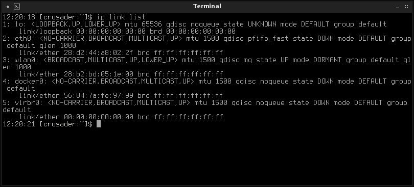
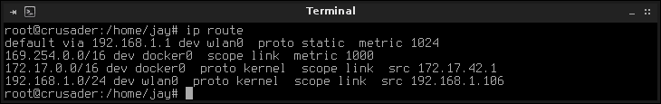
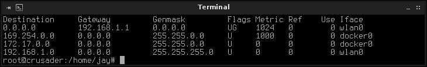

# 第八章。理解高级网络概念

到目前为止，我们在 Linux 网络管理方面已经覆盖了从规划、设置文件服务器、网络服务等方面的所有内容。现在，当我们接近本书的结尾时，最后几章将通过关于高级网络、安全性甚至故障排除的信息来完善这些知识。在本章中，我们将介绍一些更高级的概念，例如子网划分、路由等！

在本章中，我们将涵盖：

+   将您的网络划分为子网

+   理解 CIDR 表示法

+   实施**服务质量**（**QoS**）

+   理解**网络地址转换**（**NAT**）

+   路由 TCP/IP 流量

+   创建冗余的 DHCP 和 DNS 服务器

+   配置网络网关

# 将您的网络划分为子网

除非您运行的是非常小的家庭或办公网络，否则进行子网划分通常是一个好主意。子网划分允许您将网络分割成更小的部分，每个部分都有自己的 IP 地址和资源。例如，可以将无线流量、服务器、工作站和公司发放的移动设备放在各自的子网上。此外，如果您的网络上有任何特定服务接收最多的流量，您也可以将该服务放在自己的子网上。有无限的可能性，每个管理员都会有自己关于最佳网络划分方式的想法。

在第六章中，*配置网络服务*，我们设置了一个 DHCP 服务器。在其中，我包括了一个使用特定子网动态租用 IP 地址的示例。在该方案中，我们使用的网络是`10.10.96.0/22`。这意味着我们可以使用几个网络，包括`10.10.96.0`，`10.10.97.0`，`10.10.98.0`和`10.10.99.0`。有了这个网络，我们基本上可以将每个服务划分到自己的网络中。在我们的配置中，`10.10.99.0`用于 DHCP。但是，如果您决定这样做，当然可以使用 IP 地址`10.10.96.1`到`10.10.99.254`。您如何配置您的网络完全取决于您。在该章节中，我们设置了一些将在本章中使用的基础工作。但我们没有讨论如何得出这些数字，或者如何手动分割网络。

子网划分的魔力完全在于子网掩码，尽管大多数人只是匆匆一瞥。对于相当多的网络，子网掩码保持默认值（`255.255.255.0`），没有人真正质疑它。如果您从商店购买路由器并在未配置的情况下投入生产（这是个坏主意），您将得到一个 24 位网络和`255.255.255.0`子网掩码。但这实际上意味着什么呢？

有两种不同的子网风格，**有类**和**无类**。在生产网络中，几乎没有人再提到实际的类，因为现在的子网划分是以无类进行的（稍后详细介绍）。但在我们深入讨论无类网络之前，了解之前的内容是很重要的。在我们讨论子网划分时，我们多次使用了子网掩码`255.255.255.0`的示例，这属于被认为是 C 类网络的子网掩码。总共有五个类，A 类到 E 类。D 类和 E 类用途不大，所以我们将坚持使用 A 类到 C 类来讨论有类 IP 地址。

A 到 C 类的子网掩码如下：

| 类 | 子网掩码 |
| --- | --- |
| A | `255.0.0.0` |
| B | `255.255.0.0` |
| C | `255.255.255.0` |

这些子网掩码对应于 IP 地址的哪一部分被指定为网络，哪一部分被指定为每个单独的节点。例如，假设我们配置了一个网络地址为`192.168.50.0`的 C 类网络。这意味着我们的网络有一个子网掩码为`255.255.255.0`。与所有 IPv4 IP 地址一样，我们的网络地址有四个八位组：`192`，`168`，`50`和`0`。为了说明子网掩码如何影响 IP 地址，我将每个八位组排成一张表：

| 192 | 168 | 50 | 0 |
| --- | --- | --- | --- |
| 255 | 255 | 255 | 0 |

子网掩码的目的是*掩盖*IPv4 地址的哪些八位组对应于整个网络，哪些对应于单个节点。每个八位组中可能的最大数字是`255`。如果子网掩码中的一个八位组设置为`255`，那么它将占据整个八位组，因此将其取消。在这种情况下，每个节点的 IP 地址将以`192.168.50`开头，因为前三个八位组被取消了。请注意，网络地址和子网掩码的最后一个八位组都是零。在 IPv4 网络中，`0`表示任何内容。因此，子网掩码的最后一个八位组为`0`告诉我们它不关心该八位组，而网络地址为`0`表示它也不关心。因此，最后一位的任何数字都是可以的。

在我们的情况下，从`192.168.50.0`到`192.168.50.255`的 IP 地址属于这个网络（子网）。嗯，几乎是。如果我们的子网掩码是`255.255.255.0`，我们就不能以分配`192.168.50.0` IP 地址开始我们的 DHCP IP 范围。这是因为子网的第一个 IP 地址不能分配给节点。第一个 IP 地址被指定为**网络标识符**并被保留。在一个 C 类网络中，IP 地址`192.168.50.0`是无效的，因为它确实是该子网中的第一个地址。

另一个不能分配给任何节点的 IP 地址是子网的最后一个 IP。在我们的 C 类示例中，那将是`192.168.255.255`。这个 IP 地址被称为**广播地址**，也是保留的。如果需要向整个网络发送广播消息，就会使用广播地址。考虑到这一点，在我们的示例中使用的 C 类网络中，我们的 DHCP 范围的最大值是`192.168.50.1`到`192.168.50.254`。

你可能想知道广播地址的目的。如前所述，它允许将数据包发送到整个网络。在实践中，网络服务，如 DHCP，利用广播。当你第一次将计算机插入以太网电缆（一个没有静态 IP 的计算机），它会发送一个广播消息请求 IP 地址。在连接之前，它不知道你的 DHCP 服务器的 IP 地址是什么。它可能是`192.168.1.1`，甚至是`192.168.1.100`。它完全不知道。通过发送广播消息，负责 DHCP 的任何服务器都应该能够听到请求并做出响应。

那么，为什么在上面的例子中选择了 IP 地址`192.168.50.0`？那个数字只是随机选择的，以便说明子网掩码如何影响可用的 IP 地址。我们可以使用`172.16.254.0`作为我们的网络地址，并且使用 C 类子网掩码`255.255.255.0`，这仍然会给我们相同数量的可用 IP 地址（254）。在第二个例子中，我们仍然声明了一个 C 类网络，但只是使用了不同的 IP 方案。由于你正在管理一个内部网络，你可以选择任何你想要的编号系统。只要你的 IP 地址不是公共可路由的，只要你不在任何八位组中使用大于 255 的数字，或者在网络中使用第一个或最后一个 IP 地址，那么你可以使用任何数字。还有一些其他 IP 地址我们不能使用，但我们稍后会讨论。

为了更好地理解这是如何工作的，我们需要重新讨论子网掩码。如前所述，子网掩码有助于确定 IP 地址方案的哪一部分属于各个节点，哪一部分属于网络本身。可以这样理解。子网掩码中的 255 是子网掩码或 IP 地址中任何八位中可能的最大数字。子网掩码中的每个 255 代表一个不会改变的数字。因此，如果您有一个 IP 地址`10.19.100.24`和一个子网掩码`255.255.255.0`，您可以立即知道这个网络的前三个八位永远不会改变。这意味着该子网的每个主机都将具有以`10.19.100`开头的 IP 地址。如果子网掩码是`255.255.0.0`，将有更多的 IP 地址可用，因为最后两个八位是可用的。这实际上将给我们提供 65,534 个 IP 地址。前者只允许我们使用 254 个 IP 地址，因为最后一个八位是唯一可以改变的，其最大数字是 255（减去一个广播地址）。

但您可能已经注意到，我使用了一个 Class A IP 地址的例子（`10.19.100.24`），但我使用了一个 Class C 子网掩码（`255.255.255.0`）。这是有效的吗？当然！尽管通常约定的类结构，子网掩码的唯一目的是帮助您理解哪一部分是主机，哪一部分是节点。因此，`255.255.0.0`和`255.255.255.0`的子网掩码对于这个网络都是有效的。

然而，一些 IP 地址并不被认为是适用于各个类别的有效地址。虽然具有子网掩码为`255.255.255.0`的内部 IP 网络`253.221.96.0`符合所有这些规则，但它并不被认为是 Class C 网络的有效地址。如果您只在网络内管理 IP 地址，它可能有效，也可能无效。因此，对于经典风格中的每个类别，都有一个推荐的方案可供选择。我将在下表中说明：

| 类别 | 起始 IP | 结束 IP |
| --- | --- | --- |
| A | `0.0.0.0` | `127.255.255.255` |
| B | `128.0.0.0` | `191.255.255.255` |
| C | `192.0.0.0` | `223.255.255.255` |

### 注意

与所有网络相关的事物一样，这里也有一个需要牢记的例外，您不能将`127.0.0.0`或`127.0.0.1`分配给任何东西，因为这是指您的本地环回适配器。

事实上，使用以`10`开头的 IP 地址范围在 Class A 方案中是非常常见的，这就是我们在本书早期设置 DHCP 服务器时所做的。在那个例子中，我们使用了`10.10.96.0`网络。但是如果您回忆起来，我们没有使用 Class C 子网掩码`255.255.255.0`，而是使用了`255.255.252.0`。这个区别将直接引导我们进入下一个主题 CIDR。

# 理解 CIDR 表示法

正如我之前提到的，经典子网划分的概念现在并不经常使用。经典子网划分的主要用途是网络设备（如路由器）的默认配置，以及大多数 DHCP 服务器的默认设置。在家用路由器的情况下，DHCP 服务器通常是内置的，默认方案通常是 Class C 网络（通常为`192.168.1.0`，中间有几个变化）。但对于大多数设备，家庭或企业，如果您不将其更改为其他内容，您可能会得到一个 Class C IP 方案。在小型网络中，这些默认设置并没有什么问题，但是几乎没有人在配置网络时使用经典风格。原因是经典网络太过限制；在复杂的网络部署中，强迫您的网络计划适应这些预定方案可能会很麻烦。 

在有类别的方案中缺乏灵活性的答案是**无类别域间路由**（**CIDR**）。使用 CIDR，我们基本上抛弃了类 A、B 和 C 子网掩码的限制。相反，我们使用二进制系统来确定如何划分我们的网络。因此，我们不再仅使用三种不同的子网掩码，我们可以*借用*位并更灵活地改变子网掩码以划分网络。

要理解这个概念，首先要理解位的概念。子网掩码中的每个八位组包含八位。每一位都是`1`或`0`（二进制）。此外，这八位中的每一位都有一个值。为了说明这一点，拿数字`255`来说。这是任何八位组的最大值。用二进制写，`255`是`11111111`。因此，一个类 C 子网掩码`255.255.255.0`用二进制写就是`11111111.11111111.11111111.00000000`。

为了更容易理解，看看下表，我在其中概述了四个插座（`255`）之一，并以二进制形式显示出来。在这个表中，顶部行给出了每个位的点值。你可以看到最右边的位只值`1`，而最左边的位值为`128`。底部的任何位是`1`都会被加起来。在这种情况下，每个位都是`1`（因为`255`是最大值），所以我们把顶部行的每个数字加起来，得到`255`。

| 128 | 64 | 32 | 16 | 8 | 4 | 2 | 1 |
| --- | --- | --- | --- | --- | --- | --- | --- |
| 1 | 1 | 1 | 1 | 1 | 1 | 1 | 1 |

另一个例子，参见以下表：

| 128 | 64 | 32 | 16 | 8 | 4 | 2 | 1 |
| --- | --- | --- | --- | --- | --- | --- | --- |
| 1 | 1 | 1 | 1 | 0 | 0 | 0 | 0 |

要将这个数字转换成十进制，从右边开始，向左移动。第一位是 0。它是否符合 1 的点值？不符合。跳过。接下来，它也不符合 2、4 或 8。所以跳过这些。但它确实符合最后四位，16、32、64 和 128。把它们加在一起。答案是 224。你刚刚把二进制数`1111000`转换成了十进制。

我们可以在子网掩码中使用`1101000`吗？不行。原因是因为子网掩码中的 1 必须是连续的。以下是子网掩码中所有有效的二进制数：

```
00000000
10000000
11000000
11100000
11110000
11111000
11111100
11111110
11111111
```

实际上，就是这样。由于任何 1 必须是连续的（从左到右开始），这些是子网掩码中任何八位组的唯一有效数字。因此，子网掩码的任何八位组的唯一有效十进制值是 0、128、192、224、240、248、252、254 和 255。

### 注意

如果将 IP 地址转换为二进制，你会按照之前的表中的点值进行转换，尽管连续 1 的规则不适用。IP 地址中的任何数字从 0 到 255 在任何八位组中都是有效的，每个八位组中的 1 和 0 的任何组合也是有效的。

要对网络进行*子网化*，我们只需改变连续 1 的数量。例如，`255.255.255.0`的二进制表示是`11111111.11111111.11111111.00000000`。我们可以在这个掩码中添加一个额外的 1，得到`11111111.11111111.11111111.10000000`，这给我们一个子网掩码为`255.255.255.128`。使用这个子网掩码，我们能够将我们的网络分成两部分。让我们来分解一下。

正如我多次提到的，子网掩码的目的是*掩盖*IP 地址的哪一部分是网络的，哪一部分是个体节点的。正如我们已经知道的，子网掩码为`255.255.255.0`意味着前三个八位组不能使用，但我们可以使用最后一个为 0。如果我们将这个子网掩码应用到`10.10.10.0`网络，我们可以知道每个主机的 IP 地址都是`10.10.10.x`。最后一个八位组是 0，它告诉我们 IP 地址`10.10.10.1`到`10.10.10.254`是可用的。同样，我们不能使用子网的第一个 IP（在这种情况下是`10.10.10.0`）或最后一个（`10.10.10.255`），因为它们分别对应网络标识符和广播地址。

但是，对于一个子网掩码并*不*以 0 结尾的情况，我们该怎么办呢？对于子网掩码为`255.255.255.128`，最后一个八位组被使用但没有耗尽，因为它不是 255 的最大值。我们还有一些剩余。这是因为当一个八位组在子网掩码中*不*是 255 时，它并没有完全屏蔽掉该八位组。相反，它创建了一个分割线。如果我们将该子网掩码应用到我们的`10.10.10.0`网络上，IP 地址`10.10.10.128`就不能使用。我们已经将最后一个八位组分成了两半。记住，八位组中的值从 0 到 255 都是有效的；因此，256 个可用数字的一半是 128。考虑到这一点，我们创建了一个方案，其中我们有两个网络。一个网络包含 IP 地址`10.10.10.1`到`10.10.10.126`。另一个允许我们使用 IP 地址`10.10.10.129`到`10.10.10.254`。之所以这样做是因为`10.10.10.128`是我们子网的分割线，不能使用。我还提到了块内的第一个和最后一个 IP 地址也不能使用，因为`10.10.10.0`和`10.10.10.128`是每个网络的标识符。每个块中的最后一个 IP 地址分别是`10.10.10.127`和`10.10.10.255`，因为这些现在是这两个网络的广播地址。如果我们以 CIDR 格式写出这些网络，我们会得到以下结果：

```
10.10.10.0/25
10.10.10.128/25
```

记住，我们计算子网掩码中连续的 1 的数量，以达到最后的*斜杠*数字。我们可以将其写成以下形式，但我相信你会同意 CIDR 更容易输入：

```
10.10.10.0/255.255.255.128
10.10.10.128/255.255.255.128
```

在二进制中，该子网掩码是`11111111.11111111.11111100.00000000`。因为有 25 个 1，这个子网掩码的 CIDR 表示法是 25。希望现在这个概念已经讲清楚了。

至于我们的无类别样式，没有什么能阻止你使用诸如`255.255.255.0`这样的子网掩码。并不是每个人都需要大量的主机。但是，我们不再称之为类 C 子网掩码，而是在 CIDR 样式中我们会称之为`/24`网络。在表中，我列出了在讨论有类别网络时使用的子网掩码，以及它们的 CIDR 等效。

| 类别 | 子网掩码 | CIDR 表示法 |
| --- | --- | --- |
| A | 255.0.0.0 | /8 |
| B | 255.255.0.0 | /16 |
| C | 255.255.255.0 | /24 |

既然我们了解了子网划分的工作原理，那么我们如何在我们的网络中实施呢？幸运的是，这部分很容易。实施子网的魔力都在于你的 DHCP 服务器。如果你还记得，在第六章中，*配置网络服务*，我们在 DHCP 服务器的`/etc/dhcp/dhcpd.conf`文件中使用了以下配置：

```
default-lease-time 86400;
max-lease-time 86400;
option subnet-mask 255.255.252.0;
option broadcast-address 10.10.99.255;
option domain-name "local.lan";
authoritative;
subnet 10.10.96.0 netmask 255.255.252.0 {
 range 10.10.99.100 10.10.99.254;
  option routers 10.10.96.1;
  option domain-name-servers 10.10.96.1;
}
```

在第一行粗体字中，我为从该服务器接收 IP 地址的每个节点提供了一个子网掩码为`255.255.252.0`。在代码块的末尾，我决定从`10.10.99.100`到`10.10.99.254`发放 IP 地址。因此，每个节点将收到一个`10.10.99.x`的 IP 地址和一个`255.255.252.0`的子网掩码。

实施子网方案时唯一剩下的事情就是确保每个具有静态 IP 地址的服务器或设备也被更改。除非你使用了静态租约（也称为*保留*），否则你将不得不手动找到这些主机并进行更改。因此，我总是更喜欢静态租约而不是静态 IP。使用静态租约，你只需要编辑 DHCP 配置并更改分配给你的主机的 IP。参考第六章中我们是如何设置我们的保留的。

# 实施服务质量

并非所有的网络流量都是平等的，也并非所有的服务都同等重要。有时，网络需要对某些服务给予比其他服务更紧急的处理。也许在服务器环境中，您的 Web 服务器从访问者那里接收到大量流量，并且必须优先考虑 MySQL，或者您的办公室使用**VoIP**（即**IP 电话**）并需要优先考虑电话系统。您的网络可能有许多原因需要对某项服务给予比其他服务更紧急的处理。**服务质量**（**QoS**）帮助我们实现这一点。

虽然有多种调整网络适配器以实现 QoS 的方法，但最典型的是所谓的**排队规则**（或更简单地说，**qdisc**）。排队规则是管理员可以应用于网络适配器的一种方法，以使用多种调度程序中的一种，每种调度程序对流量处理方式有不同的影响。要查看您的网络适配器当前使用的调度程序，请运行以下命令：

```
ip link list

```

查找您的默认网络卡，很可能是`eth0`（在 Debian 中）或`eno1`（在 CentOS 中）或类似的。



在 Debian 中查看 IP 链接列表的输出

最有可能，您会在输出中看到`qdisc pfifo_fast`，这告诉我们当前使用的排队规则是`pfifo_fast`。这基本上是一个先到先服务的调度程序（先进先出）。但`pfifo_fast`不是包含一个带宽，而是包含三个——每个都将流量分为三个优先级。第一个带宽（带宽 0）包含最高优先级的流量。除非您的发行版更改了默认调度程序，否则`pfifo_fast`很可能是您系统中默认使用的。

`pfifo_fast`调度程序被称为无类调度程序。换句话说，你看到的就是你得到的——在处理无类调度程序过滤流量时不需要进行任何配置。其他无类规则包括**随机公平** **排队**（**SFQ**）、**扩展随机公平排队**（**ESFQ**）和**令牌桶过滤器**（**TBF**）。

SFQ qdisc 使用了我们之前提到的 FIFO 的概念，但将网络流量分成多个 FIFO，并以循环方式处理。这种 qdisc 试图尽可能公平地使用流来调度数据包传输。这使得每个流都有机会传输，防止任何一个流变得过度饱和。ESFQ 非常相似，但它为管理员提供了更多配置选项。与 SFQ 不同，TBF 实际上不会操纵数据包，也不会进行任何调度。TBF 的主要目的是设置传输速率，允许您设置参数，如速率、突发、峰值速率等。有关这些 qdisc 的更深入信息，请参阅`sfq`和`tbf`的主页。通过`tc`命令可以在网络适配器上设置首选的 qdisc。请参阅以下示例，设置以太网适配器`eno1`上的`sfq`：

```
# tc qdisc add dev eno1 root sfq perturb 60

```

在这里，我们使用`tc`命令与`qdisc`，并澄清我们想要`add`（我们也可以`del`）一个 qdisc。我们将对接口`eno1`执行此操作，并请求将此更改应用于出口（`root`），同时针对我们的接口使用`sfq` qdisc。最后，我们设置我们的 qdisc 特定参数（在本例中为`pertub`）。perturb 参数允许我们设置此 qdisc 的哈希算法将被重置的秒数。我们可以更改其他特定于 sfq 的值，如使用的流数、量子、redflowlimit 等。请参阅`man sfq`，了解可以与 sfq 或 tbf 一起使用的参数的完整描述。

无类 qdisc 的概念存在不足之处，即它们不允许你像人们希望的那样对流量进行细致的分类。虽然改变数据包的调度方式肯定是有用的，但这个概念不允许你在任何给定时间选择哪种类型的流量优先级。有类 qdisc 解决了这个问题，并给管理员更多的灵活性。通过这些，你可以设置父类和子类，每个都有不同的规则。事实上，这是有类和无类 qdisc 之间的主要区别。无类 qdisc 并不是完全不可配置；它们只是没有支持高级用例灵活性的选项。接下来，我们将探讨有类 qdisc 以及它们如何为我们提供这种额外的灵活性。

通过利用有类 qdisc 的强大功能，你几乎完全控制了网络上数据包的处理方式。我说*几乎*是因为重要的是要记住，排队规则的概念只影响出站流量（出口），而对于管理入站流量几乎无能为力。然而，在生产网络中，保证特定服务一定数量的带宽是非常有益的。正如我们在前一节中讨论的，无类 qdisc 允许我们管理数据包处理的一般方式，但有类 qdisc 通过设置类别和过滤器为我们提供了更多的控制。

你可能会遇到的一个可能情况是 VoIP 流量变得不稳定，导致通话听起来模糊或完全中断。在这种情况下，你可能希望为你的 VoIP 服务器保证更多的带宽，即使这意味着牺牲来自其他来源的流量。此外，在 Linux 网络中，SSH 也很重要。如果你的服务器被数据包淹没，甚至无法响应通过 SSH 连接到它的请求，那可能是一个非常严重的问题，因为你将无法登录并纠正可能出现的任何问题。这些是许多人在没有优先处理流量的情况下面临的非常真实的情况。如果有一个你的网络或公司依赖的服务，优先处理它是一个很好的措施。

实现这一点最流行的 qdisc 是**分层令牌桶**（**HTB**），这是一个有类 qdisc。HTB 允许你控制设备上使用的出口带宽，它基于我们之前讨论的 TBF 风格。HBT 具有一些可以用来控制流量的类，比如设置`parent`、`priority`、`rate`、`ceil`和字节的突发数量。查看`man htb`以查看完整的列表。

就像我们配置无类 qdisc 一样，类似 HTB 的有类 qdisc 的设置也是通过`tc`命令完成的。在大多数系统上，这个命令存储在`/sbin`中，可能不在常规用户的路径中。输入`which tc`来定位这个二进制文件在你的发行版上的位置。在大多数情况下，如果以 root 用户登录时运行此命令，系统应该能识别这个命令。接下来是一个设置 HTB 作为名为`eth0`的网络设备的 qdisc 的过程示例。

```
# tc qdisc add dev eth0 root handle 1: htb default 10
# tc class add dev eth0 parent 1: classid 1:1 htb rate 2mbit
# tc class add dev eth0 parent 1:1 classid 1:10 htb rate 1mbit ceil 1.5mbit
# tc class add dev eth0 parent 1:1 classid 1:20 htb rate 100kbps ceil 100kbps

```

在第一个命令中，我们将 qdisc 从默认的`pfifo_fast`更改为`htb`。在这个命令中，`root`表示我们正在设置这个出口流量。`1:`的句柄是对`htb`的这个特定实例的名称。将默认设置为`10`意味着任何没有特别分类的流量将被赋予`1:10`的类别 ID。通过第二个命令，我们创建了类别 ID`1:1`，并将其调整为使用速率`2mbit`。在第三个命令中，我们做了同样的事情，只是我们创建了一个 ID 为`1:10`的类别，并设置了一个上限，这将限制这个类别为`1.5mbit`。因为我们将默认设置为`10`，所以如果我们没有特别指定流量使用其他类别，就会使用这个类别。最后，我还加入了第三个类别`1:20`，它的上限要低得多，为`100kbps`。通过将`rate`和`ceil`值设置为相同的值，我们可以合理地期望这个类别的流量消耗`100kbps`，但也受到`100kbps`的限制。您可以继续使用这种方法向`1:`父类添加额外的类别，根据需要将带宽分割成多个类别。

现在我们已经确定了我们的类别，我们应该开始使用它们。通过我们之前的例子，您可能会注意到您的带宽现在比之前少了（假设您的带宽高于我们设置的`1.5mbit`的默认值）。但我们的其他两个类别没有使用，因此我们可以根据需要提高或限制其他服务的带宽。因此，让我们为 SSH 添加一个过滤器。由于 SSH 不需要大量带宽，我们可以将我们的`1:20`类别分配给它。为此，我们将再次使用`tc`命令：

```
# tc filter add dev eth0 parent 1: protocol ip prio 7 u32 match ip sport 22 0xfff classid 1:20

```

### 注意

可以更改服务器用于 SSH 连接的端口，我们将在第九章*保护您的网络*中讨论。如果更改了 SSH 端口，请相应调整`tc`命令。

这留下了两个类别，`1:1`和`1:10`。我们也可以根据需要为它们分配过滤器，具体取决于我们想要为流量分类的端口：

```
# tc filter add dev eth0 parent 1: u32 match ip sport 80 0xfff classid 1:1
# tc filter add dev eth0 parent 1: u32 match ip sport 5060 0xfff classid 1:10

```

在这里，我使用端口`80`和`5060`分别用于 HTTP 和 VoIP 流量。您的端口可能不同，因此可以根据您的网络需求自由调整命令。但在这个假设的例子中，端口`80`上的流量将被分类为`1:1`，并被授予最大速率为`2mbit`（非常适合 Web 服务器），端口`5060`上的流量将被授予`1.5mbit`。

总之，无类 qdisc 允许您控制系统上如何管理数据包的一般共识。根据您的环境，您可能会发现切换到无类 qdisc 会提高性能。但真正的好处在于有类 qdisc，它允许您更加精细地控制数据包的处理方式，以及服务器资源提供的速率。调整网络性能是一项耗时的任务，需要通过试错来确定哪些值、类别和过滤器会提高网络性能。

# 路由 TCP/IP 流量

网络的整个目的是将流量从 A 点传输到 B 点。当一台计算机从另一台计算机请求信息时，数据包被路由到目的地，然后返回。有时，计算机需要一点指导，以确定如何将数据包传输到目的地。这就是所谓的**路由**。为了帮助实现这一点，节点利用**路由表**的概念来决定特定目的地应该发送数据包的位置。如果每个网络都使用相同的 IP 方案，那将会非常容易，但事实上，每个网络都是完全不同的。要与不同的网络通信，您的计算机必须知道如何到达该网络。可以将路由表视为外部目的地和到达这些目的地的网关的地图。

为了更好地理解这一点，让我们也谈谈**默认网关**的概念。通常，默认网关是一个理解如何与其他网络通信的路由器。当您在网络上发送信息请求时，数据包会经过本地默认网关，然后从那里进入其他网络。在小型办公室或家庭网络的情况下，默认网关很可能是位于您的网络和世界其他部分之间的路由器。此外，它还位于您的本地设备和网络内所有其他设备之间。如果没有默认网关，您很可能无法在网络上进行通信。

要查看您的默认网关，请发出`ip route`命令，并查找读取`default via`的行。



ip route 命令的输出

如果没有默认网关（或者默认网关没有正确配置），您可能会发现无法与网络上的其他节点进行通信。在大多数情况下，一旦通过 DHCP 接收到地址，默认网关就会添加到您的路由表中。如果您使用静态 IP 配置，您可以通过`/etc/network/interfaces`在 Debian 中手动设置默认网关，或者在 CentOS 中通过网络卡的 init 脚本（例如`/etc/sysconfig/network-scripts/ifcfg-eno1`）。以下是这些配置文件的示例，其中突出显示了相关行：

`/etc/network/interfaces`文件（Debian）：

```
iface lo inet loopback

allow-hotplug eth0
iface eth0 inet dhcp

# The primary network interface
allow-hotplug eth1
iface eth1 inet static
  address 10.10.96.1
  netmask 255.255.252.0
  gateway 10.10.96.1
  broadcast 10.10.96.255
  dns-search local.lan
  dns-nameservers 10.10.96.1
```

`/etc/sysconfig/network-scripts/ifcfg-eno1`文件（CentOS）：

```
TYPE=Ethernet
BOOTPROTO=static
DEFROUTE=yes
PEERDNS=yes
PEERROUTES=yes
IPV4_FAILURE_FATAL=no
NAME=eno1
UUID=8e6587dd-74ec-488f-8597-a04c4a4c5091
DEVICE=eno1
ONBOOT=yes
IPADDR="10.10.96.4"
NETMASK="255.255.252.0"
GATEWAY="10.10.96.1"

```

如果您想要比那更手动地设置默认网关，您也可以通过终端使用 shell 命令来执行此操作，如下所示：

```
# route add default gw 10.10.10.1 eth0

```

### 注意

如果您的系统不识别 route 命令，则需要安装`net-tools`软件包。

足够简单。我们使用 route 命令来添加新路由；在这种情况下，我们正在添加我们的默认网关（`default gw`）。在这种情况下，我们将该网关设置为`10.10.10.1`并将其绑定到接口`eth0`。可能不用说，但一旦重新启动此计算机或重新启动网络，除非通过更新接口卡的`init`脚本使其永久化，否则此设置可能会丢失，正如我们之前讨论的那样。

要查看您的路由表，只需执行`route -n`命令而不带任何参数。如果找不到该命令，您可能需要调用路径（例如`/sbin/route`）或以 root 身份运行它。当您执行此命令时，您将看到路由表。这也将显示您的默认网关。



route -n 命令的输出

在讨论此表时，首先要讨论的是`0.0.0.0`的 IP 地址。在网络方面，这指的是一切。正如您在前面的示例中所看到的表中所示的，目的地`0.0.0.0`的网关在这个网络上是`192.168.1.1`。因此，任何通信都会发送到这个 IP（毕竟，这是默认网关）。在此表中还显示了其他网络。在我的情况下，它们指的是在此测试机器上运行的 Docker 实例以及 KVM 虚拟化，并且每个都有自己独立的虚拟网络。由于它们都在同一台机器上运行，它们的网关是本地的：`0.0.0.0`。

Linux 机器可以很容易地充当路由器，而无需来自诸如思科公司等公司的昂贵网络设备。这种灵活性使 Linux 成为网络的一个非常突出的选择，基于 Linux 的硬件路由器变得非常普遍。这至少部分是因为配置 Linux 系统成为路由器是多么容易。简而言之，将 Linux 节点变成路由器所需的只是多个网络接口卡。每个接口卡都可以有自己的默认网关，因此你实际上可以像我们在本节前面为`eth0`添加默认网关一样配置路由。你只需对`eth1`、`eth2`或者系统上其他任何接口执行相同的操作。

然而，有一个例外。对于大多数 Linux 发行版，默认情况下通常禁用网络接口之间的路由。在我职业生涯的早期，这给你的作者带来了很多痛苦和挫折，直到这一点变得众所周知，所以我会为你节省麻烦，并向你展示如何在 Linux 系统上启用网络接口之间的路由。

首先，看看这是否已经为你完成。虽然我发现许多发行版默认情况下不启用转发，但有些发行版会启用。检查这一点很容易：

```
cat /proc/sys/net/ipv4/ip_forward

```

那个命令的输出是什么？是`1`吗？如果是，那就没问题了。如果不是，我们需要进行更改。要做到这一点，只需将值替换为 1（作为 root）：

```
echo 1 > /proc/sys/net/ipv4/ip_forward

```

就是这样，你完成了。你刚刚启用了网络接口之间的路由（转发）。这并不难。但是，我想你可能更希望这是一个永久性的改变。一旦重新启动系统，这个设置很可能会恢复到默认值。要使这个改变永久生效，用你喜欢的文本编辑器（作为 root）编辑`/etc/sysctl.conf`，并在文件末尾添加以下行：

```
net.ipv4.ip_forward = 1

```

现在，无论何时重新启动系统，你都将保留这个设置。在我让你做的所有网络调整中，这绝对是最容易的。

最后，让我们花一点时间来讨论**网络地址转换**（**NAT**）。NAT 的概念是改变那些目的地是一个主机的数据包，并改变它们的目的地，使其变成其他东西。这种改变实际上是通过改变数据包本身来完成的，对于管理网络路由来说非常有用。NAT 最常见的用途是保留 IP 地址，尤其是考虑到当前 IPv4 地址短缺的情况下。如果你家里有一台路由器，你可能已经很熟悉这个概念了。你的**互联网服务提供商**（**ISP**）给你一个 IP，这个 IP 就是世界其他地方看到你的 IP。但是在你的本地网络中，你可能有十几个设备连接并使用同一个互联网连接。你的每个内部设备都有一个由本地 DHCP 服务器分配的 IP 地址，但这个地址只是本地的，不能路由到外部世界。在这种情况下，你的路由器会跟踪每个设备收发的数据包，并改变数据包，使它们不会混淆，并最终到达正确的位置。

例如，假设你有一台笔记本电脑和一台台式机（在同一个网络上），你在笔记本电脑上访问[`www.packtpub.com/`](https://www.packtpub.com/)。你的路由器将请求发送到互联网，并传递结果。基本上，你的路由器代表你的笔记本电脑发出请求。当来自[`www.packtpub.com/`](https://www.packtpub.com/)的返回数据包到达时，数据包的目的地地址会从你的公共 IP 地址更改为请求信息的机器的 IP 地址。这样，你可以相当肯定你的笔记本电脑会得到回复，因为它是最初发出请求的那个。

NAT 的概念很聪明，这甚至不是唯一的用例。您甚至可以手动更改目标地址，这可以帮助您将数据包发送到内部计算机原本无法路由到的其他网络。要手动更改 NAT，我们使用`ip rule`命令。利用这个命令只是根据流量的来源改变目的地。考虑以下示例：

```
# ip rule add nat 10.10.10.1 from 192.168.1.134

```

这再简单不过了。在这里，我们告诉我们的系统查找任何来自`192.168.1.134`的数据包，并将其重写为流向`10.10.10.1`。对于您需要执行的任何其他*NATing*，请重复此操作。

# 创建冗余的 DHCP 和 DNS 服务器

在第六章中，我们设置了 DHCP 和 DNS 服务器。这很好，但不幸的是有一个主要问题。任何一个都是单点故障。如果 DHCP 服务器崩溃，新设备将无法接收 IP 地址，并且当前连接的客户端将在其当前 IP 租约到期时从网络中断开。如果 DNS 服务器崩溃，客户端将无法通过主机名到达目的地。根据您的网络范围，这种停机时间可能很难处理，因此为这些服务提供冗余可能是一个好主意。

配置了另一台服务器进行冗余的 DHCP 服务器将同步其已发出的 IP 地址列表，并且每台服务器都会检测另一台服务器是否停止响应。在这种情况下，备用服务器将接管发放新的 IP 地址的任务。对于 DNS，只需在网络上添加另一台 DNS 服务器，但我稍后会详细讨论这个问题。

让我们从向我们的 DHCP 服务器添加冗余开始。之前创建的初始服务器可以简单地视为主服务器。接下来要做的是创建另一台服务器作为辅助服务器。这可以是另一台物理服务器，甚至是虚拟机，选择权在你。安装`isc-dhcp-server`，就像我们在第六章中讨论的那样，*配置网络服务*。一旦你有了第二台服务器，我们就可以开始了。

### 注意

在将 DHCP 服务器投入生产之前，务必确保两台 DHCP 服务器的时钟同步。在继续之前，最好再次检查两者上是否配置了 NTP 并且正常工作。在第六章中，包括了有关设置 NTP 的信息。

从我们的主节点开始，我们应该向我们的/`etc/dhcp/dhcpd.conf`文件添加一些额外的代码。我已经加粗了新的配置行，以实现冗余：

```
default-lease-time 86400;
max-lease-time 86400;
option subnet-mask 255.255.252.0;
option broadcast-address 10.10.99.255;
option domain-name "local.lan";
authoritative;
failover peer "dhcp-failover" {
 primary; 
 address 10.10.96.2;
 port 647;
 peer address 10.10.96.1;
 peer port 647;
 max-response-delay 60;
 max-unacked-updates 10;
 load balance max seconds 3;
 mclt 3600;
 split 128;
}
subnet 10.10.96.0 netmask 255.255.252.0 {
  option routers 10.10.96.1;
  option domain-name-servers 10.10.96.1;
 pool {
 failover peer "dhcp-failover";
 range 10.10.99.100 10.10.99.254;
 }
}
```

### 注意

请注意，以下行已被删除：

```
range 10.10.99.100 10.10.99.254;
```

它被同一部分中的`{}`块替换了。

在很大程度上，我们在主服务器上做的相同配置可以复制到辅助服务器上。请随意使用我们在这里的/`etc/dhcp/dhcpd.conf`文件作为在第二台服务器上开始配置的基础。我将再次强调两者之间的不同之处。代码如下：

```
default-lease-time 86400;
max-lease-time 86400;
option subnet-mask 255.255.252.0;
option broadcast-address 10.10.99.255;
option domain-name "local.lan";
authoritative;
failover peer "dhcp-failover" {
  secondary; 
  address 10.10.96.1;
  port 647;
  peer address 10.10.96.2;
  peer port 647;
  max-response-delay 60;
  max-unacked-updates 10;
  load balance max seconds 3;
}
subnet 10.10.96.0 netmask 255.255.252.0 {
  option routers 10.10.96.1;
  option domain-name-servers 10.10.96.1;
  pool {
    failover peer "dhcp-failover";
    range 10.10.99.100 10.10.99.254;
  }
}
```

### 注意

从辅助服务器的配置中删除了以下行：

```
mclt 3600;
split 128;

```

你应该注意到主要和次要的地址在每个配置文件中是颠倒的。在第一个配置文件中，主要是`10.10.96.1`，次要设置为`10.10.96.2`。在第二个配置文件中，这被更改为`10.10.96.2`和`10.10.96.1`。此外，要特别注意 IP 地址、子网掩码和任何其他值，这些值可能会因网络而异。如果你在两台服务器上启动 DHCP 服务（在 Debian 上是`isc-dhcp-server`，在 CentOS 上是`dhcpd`），你应该看到它们通过日志进行通信。要检查的具体日志将在基于 Debian 的系统中是`/var/log/syslog`，在 CentOS 系统中是`/var/log/messages`。你可以很容易地测试这是否有效，方法是在其中一台服务器上禁用 DHCP 服务，然后你应该看到另一台服务器代替它发放 IP 地址。

现在我们已经为 DHCP 配置了冗余，让我们为 DNS 做同样的事情。事实上，这要容易得多。你所需要做的就是指定另一台服务器作为你的次要 DNS 服务器（你可以创建一台新的机器，或者只是将它添加到你的次要 DHCP 服务器），然后将你的配置文件和区域文件复制到新的服务器上。同样，第六章，“配置网络服务”，包含了这些文件的所有相关细节。如果你想节省一些时间，甚至可以将你的原始 DNS 服务器克隆到一台新的机器上，如果你使用虚拟化或了解如何使用`dd`命令，这是很容易做到的。无论你喜欢使用哪种方法来创建次要服务器并复制你的区域文件，都要测试 DNS 是否在新服务器上工作。一旦它工作了，我们就回到我们的 DHCP 配置，将这个次要服务器部署到我们所有的节点上。

在我们的`/etc/dhcp/dhcpd.conf`文件中，查找以下行：

```
option domain-name-servers 10.10.96.1;

```

将其更改为以下内容：

```
option domain-name-servers 10.10.96.1, 10.10.96.2;

```

你完成了。现在，每当你的客户的租约到期或他们请求一个新的 IP 地址时，他们将自动获得次要 DNS 地址。

在这一点上唯一剩下的事情就是配置你可能设置了静态 IP 地址的任何节点来使用次要 DNS 服务器。正如我现在已经提到过大约一千次，出于这个原因和更多原因，我非常喜欢静态租约（为 DHCP 服务器上的各个节点保留 IP 地址）而不是手动静态 IP 分配。你只需要在 DHCP 服务器中配置它们。但是，如果你有任何你手动配置了网络的节点（各有各的方式），只需更新它们的`init`脚本。同样，你会在`/etc/network/interfaces`（Debian）或`/etc/sysconfig/network-scripts/<if-name>.cfg`（CentOS）中找到这个配置。

# 总结

在我们的旅程中的这一点上，你的网络应该处于更好的状态。在本章中，我们完成了相当多的工作。我们讨论了诸如路由、NAT、子网划分、服务质量等高级主题，甚至为我们的 DHCP 和 DNS 服务器设置了冗余。如果我们了不起的网络发生了什么事情，那真是太遗憾了。这就是为什么在下一章中，我将介绍如何加强我们网络的安全性。到时见！
