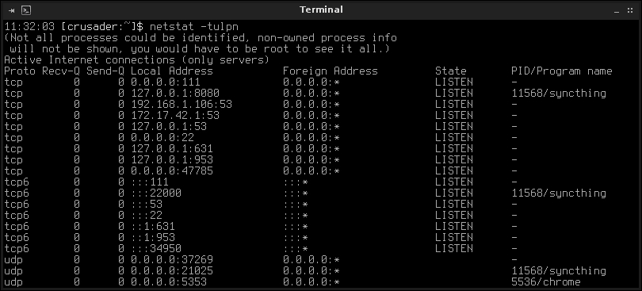
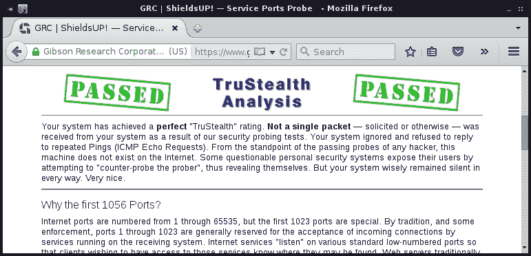
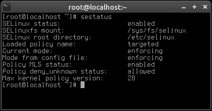

# 第九章。保护您的网络

安全漏洞和利用它们的不法分子无处不在。在典型网络上运行的软件中包含数百万行代码，从统计上讲，要想百分之百地安全防范所有可能的威胁是不可能的。然而，一个好的网络管理员会关注网络安全的当前趋势，并采取一切可能的预防措施，以确保网络尽可能安全。在本章中，我们将探讨一些可以增加网络安全性的方法。

在本章中，我们将涵盖：

+   限制攻击面

+   保护 SSH

+   配置 iptables 防火墙

+   使用 fail2ban 保护系统服务

+   了解 SELinux

+   配置 Apache 以利用 SSL

+   部署安全更新

# 限制攻击面

网络安全的最重要规则是限制攻击面。简而言之，这意味着您安装的软件越少和/或运行的服务越少，就越不容易被利用。更糟糕的是，在某些情况下，服务器软件中的未修补漏洞可能允许不法分子使用您的服务器来攻击其他人。通过限制系统中使用的软件包的数量，您降低了发生不良事件的可能性。

这听起来很简单，而且确实如此，但重要的是要记住，这不仅仅是安装您需要的软件。许多 Linux 发行版都附带了您可能永远不需要使用的软件。这不仅适用于服务器。即使您的最终用户工作站可能运行着不必要的服务，这对攻击者来说将是一个宝藏。一个常见的例子是在系统上运行**邮件传输代理**（MTA）。令人惊讶的是，许多 Linux 发行版默认情况下都运行着 MTA。除非您明确需要 MTA（例如，您安装了需要向管理员发送电子邮件的脚本），否则应该从系统中删除这些软件包。

在任何网络上部署 Linux 时，您应该首先找出安装了什么以及正在运行什么，然后决定关闭和/或卸载什么。这就是所谓的限制攻击面。的确，Linux 是最安全的系统之一，但如果您不注意系统上正在运行和监听网络连接的内容，那么什么也帮不了您。在本节的其余部分，我将介绍一些限制攻击面的方法。

首先，让我们打印出系统上安装的所有软件包的列表。这将使我们能够看到安装了什么，然后我们可以删除任何突出显示的我们确定不需要的东西。这个列表可能会很长，因为它将包括一切; 我是指一切-甚至是让我们的系统运行的库和各种软件包。您肯定不会理解每个软件包的用途，但随着您对 Linux 的了解越来越多，您将更加理解这些内容，并知道需要删除什么。例如，我知道要从所有的安装中删除`exim`或`postfix`软件包，因为我个人在任何地方都不需要它们。由于您不会理解系统上安装的所有软件包的用途，我建议您快速查看并删除您确定不需要的软件包。要打印已安装软件包的列表，请运行以下命令之一：

对于基于 Debian 的系统，请执行以下命令：

```
# dpkg --get-selections > installed_packages.txt

```

对于 CentOS 系统，请执行以下命令：

```
# rpm -qa > installed_packages.txt

```

无论哪种情况，您最终都会在当前工作目录中得到一个名为`installed_packages.txt`的文本文件。这个文本文件将包含您系统上安装的所有软件包的列表。请随意检查它，看看是否有什么可以删除的内容。此外，这个文件也可以作为一个方便的备份。如果您需要停用一个服务器并设置一个具有类似目的的新服务器，您可以将一个服务器的软件包与另一个服务器进行比较，以确保正确的软件包已安装。

另一个发现系统上正在运行的内容的好方法是使用`netstat`命令。虽然我们将在第十章中进一步讨论这个命令，*故障排除网络问题*，现在让我们试一试：

```
netstat -tulpn

```

您应该看到正在本地计算机上运行的实际上正在监听网络连接的服务列表。这些应该受到重视，因为任何监听外部连接的东西都可能是系统的入口点。如果您看到这里有一些正在监听连接而您不需要它，可以删除该软件包。您可以随时禁用服务，但删除底层软件包更好，因为它们不会被意外启动。如果您发现实际上确实需要它们，软件包总是可以重新安装的。



netstat 命令，列出正在运行和监听的服务。

在我的情况下，我可以看到 Syncthing 和 Chrome 正在监听外部连接。这是预期的。但在生产环境中，比如服务器，需要注意的是 Apache web 服务器（如果服务器实际上不是 web 服务器的话），postfix，或者任何不应该安装的文件传输工具。

另一个有用的工具是**ShieldsUP**，这是 GRC 在互联网上提供的一项服务。这绝对不是一个特定于 Linux 的工具，但如果您在路由器上使用 Linux，并希望确保它配置为尽可能隐秘，这个工具可以用于测试。您可以在以下网址访问这个工具：

[`www.grc.com/shieldsup`](https://www.grc.com/shieldsup)

### 注意

请记住，ShieldsUP 是一个在线工具，不受作者或出版商的控制或管理。因此，它随时可能会发生变化。话虽如此，这个网站已经有一段时间没有变化了，它是一个非常有用的工具。

要使用它，点击**继续**，然后点击**所有服务端口**。这项服务通过检查哪些端口回应外部请求来工作。如果一个端口是打开的，它会显示为红色，您应该能够点击它以了解更多关于该端口通常用于什么的信息。这将为您提供有关禁用什么的线索。如果服务不包含有关特定端口的信息，只需在 Google 上搜索以寻找线索。



使用 ShieldsUP!查看哪些端口回应外部请求

最后，`systemctl`命令也可以用来查看当前安装在您的机器上的服务：

```
systemctl list-units -t service

```

使用前一个命令打印到终端的列表，您将能够看到当前安装的单元文件及其状态。

这基本上总结了如何审问您的系统以找出正在运行的内容。随着时间的推移，您会学到典型服务的名称，可能需要进行一些 Google 搜索以了解每个服务的目的，但随着时间的推移会变得更容易。如果您对可以禁用的内容有任何疑问，请在实际调整运行服务之前先进行研究。最坏的情况是，如果您禁用了一个必要的服务，您的服务器可能在下一次启动时无法启动。如常，在更改系统服务之前，请确保您有良好的备份。

# Securing OpenSSH

OpenSSH 是一个很棒的工具；它是 Linux 管理员的好朋友。它可以让你不必走进服务器房间，连接显示器和键盘就可以在网络上进行工作。使用连接到同一网络的任何计算机，你几乎可以做任何你想做的事情，就像你站在机器前面一样。问题是，一个不安全的 SSH 实现给了不法分子同样的便利。在你的网络上运行的所有东西中，SSH 绝对是你想要给予重点关注的。

SSH 的第一个和最常见的安全调整是只使用协议的 2 版本。要确定你的 Linux 安装使用的是哪个版本，可以使用`grep`命令查看`/etc/ssh/sshd_config`文件：

```
cat /etc/ssh/sshd_config |grep Protocol

```

如果答案是 1，你应该编辑这个文件并将**Protocol 1**改为**Protocol 2**，然后重新启动 SSH。这很重要的原因是因为协议 1 的安全性比协议 2 要弱得多。值得庆幸的是，SSH 7 版本及更高版本现在默认使用协议 2，所以这不像以前那样常见。但在写这篇文章的时候，7 版本刚刚发布，并且还没有在许多发行版中得到应用。希望到你读到这篇文章的时候，你的发行版已经升级到 7 版本。但如果没有，你需要确保你的所有服务器只使用 SSH 的协议 2。你可以通过更改`sshd_conf`文件中的相关行，然后重新启动 SSH 服务来实现这一点。

SSH 的另一个值得改变的地方是改变它监听的端口。默认情况下，SSH 监听在**端口 22**上。你可以使用以下命令确认：

```
cat /etc/ssh/sshd_config |grep Port

```

除非你改变了它，答案将是 22。由于 22 是 SSH 的默认端口，这是每个人（包括坏人）都期望的端口。在`/etc/ssh/sshd_config`文件中，顶部附近将有一个端口选项。如果你将它改成其他端口，对外部人员来说就不那么明显了。然而，我不想让你产生一种虚假的安全感。改变 SSH 端口并不能奇迹般地阻止通过 SSH 的入侵。在有针对性的攻击中，不法分子会扫描你服务器上的每个端口，所以如果他们决心的话，他们会找出你将端口改成了什么。我建议这种改变的原因是因为这是一个非常容易的改变。只需要几秒钟就可以改变你的 SSH 端口，任何你可以做的事情来使你的网络对外部人员不那么明显都是受欢迎的。改变 SSH 端口可能成为潜在问题的唯一时机是如果你的网络用户期望它在 22 端口。只要你向每个人传达这个改变，这应该不是问题。

为了连接到一个非标准的 SSH 端口的服务器，使用`-p`标志：

```
ssh -p 63456 myhost.mynetwork

```

你也可以在使用`scp`时指定端口：

```
scp -P 63456

```

### 注意

请注意，`-P`参数在`scp`命令中是大写的，但在`ssh`命令中不是。这是有意为之的。原因是因为在`scp`中小写的`-p`选项已经被使用了，它用于在传输文件时保留修改时间。

如果你似乎无法养成请求 SSH 的不同端口的习惯，可以为它创建一个别名。然而，如果你的一些主机仍在使用端口 22，这可能会成为一个问题，所以只有当你连接的所有东西都在同一个端口上时才使用这个别名。在下面的例子中，我们可以设置一个别名为`ssh`，强制它总是使用端口`63456`：

```
alias ssh="ssh -p 63456"

```

你的 SSH 配置的另一个非常重要的改变是不允许 root 登录。在任何情况下，都不应该允许在任何 Linux 服务器上以 root 身份登录。如果你的配置要求你通过 SSH 以 root 身份登录到服务器，那么你需要更正你的配置。要检查 SSH 是否允许 root 登录，运行以下命令：

```
cat /etc/ssh/sshd_config |grep PermitRootLogin

```

如果启用了 root 登录，则通过更正`/etc/ssh/sshd_config`中的以下配置行来禁用它。但是，请确保您能够首先使用普通用户帐户通过 SSH 访问服务器；否则，您将被锁定。`sshd_config`中的以下配置行将禁止 root 登录：

```
PermitRootLogin no

```

### 注意

如往常一样，在对其配置进行任何更改后重新启动`ssh`。不要担心在使用 SSH 时重新启动它，当前连接不会中断。

对于 Debian 系统，请执行以下命令：

```
# systemctl restart ssh

```

对于 CentOS 系统，请执行以下命令：

```
# systemctl restart sshd

```

另一个值得实施的做法是将 SSH 限制为仅允许通过特定用户和/或组进行连接。默认情况下，系统上的任何用户都可以通过 SSH 访问。要更改此设置，请将以下行添加到配置文件的最底部：

```
AllowUsers jdoe

```

如果您有多个用户，您可以在同一行上添加多个用户：

```
AllowUsers jdoe bsmith

```

您还可以允许特定的组。首先，创建一个用于 SSH 访问的组：

```
groupadd ssh_admins

```

接下来，将一个或多个用户添加到组中：

```
usermod -aG ssh_admins jdoe

```

最后，在 SSH 配置文件的底部添加以下行。重新启动 SSH 后，访问将受到限制，只有属于该组的人才能访问。每次需要向某人授予 SSH 访问权限时，您只需要将其用户 ID 添加到该组中，而无需每次都重新启动`sshd_config`配置文件。

```
AllowGroups ssh_admins

```

最后，SSH 的最安全选项是根本不允许基于密码的身份验证。相反，用户可以使用公钥/私钥对进行访问。使用这种方法，密码不会通过网络传输，而那些没有与接受的公钥匹配的私钥的用户将不被允许访问。这是我向每个人推荐的做法。不利的一面是，它也带来了最多的管理开销。要实施此更改，每个用户都需要使用以下命令为 SSH 生成密钥对：

```
ssh-keygen

```

您将被要求回答几个问题，其中大多数问题您可以保持默认设置。对于密码短语，请想出一个独特的短语，并确保它与您的密码不同。如果您不想在进行连接时被要求输入密码短语，可以将其留空，但我建议创建一个密码短语。

接下来，配置服务器以允许您通过密钥连接的最简单方法是在禁用密码身份验证之前将该密钥导入服务器。要做到这一点，请使用以下变体：

```
ssh-copy-id -i ~/.ssh/id_rsa.pub myserver.mynetwork.com

```

在这一点上，您将被要求使用普通密码登录服务器。然后，下次连接时，您将默认使用您想出的密钥对，并且如果您创建了密码短语，系统将要求您输入密码短语。

在所有用户生成并将其密钥导入服务器后，您可以实施此更改。在 SSH 配置文件中查找类似以下内容的行：

```
PasswordAuthentication yes

```

只需将该选项更改为 no，重新启动 SSH，您就可以了。这样做的原因是，当您使用`ssh-copy-id`命令复制 SSH 密钥时，它实际上是在将本地计算机上的公钥(`~/.ssh/id_rsa.pub`)的内容复制到远程计算机上的`~/.ssh/authorized_keys`文件的末尾。禁用密码身份验证后，SSH 将检查那里列出的密钥是否与您的私钥(`~/.ssh/id_rsa`)匹配，然后允许您访问。

通过这些调整，您的 SSH 实现应该是相当安全的。如果您使用弱密码或密码短语，它肯定不会帮助您，但这些是您应该在所有服务器上采取的一般步骤。

# 配置 iptables 防火墙

默认情况下，Linux 包括一个防火墙**iptables**。这个防火墙应该在大多数（如果不是所有）Linux 发行版上自动可用。在这个小活动中，我们将在我们的 Linux 系统上设置一个防火墙。无论你使用哪个主要的发行版，这应该都可以正常工作，但我会指出可能是特定于发行版的任何内容。不过，在我们开始之前，我建议你在测试机器上玩一下，比如虚拟机或者你可以物理访问的东西。如果你使用 SSH，在我们启用防火墙时可能会断开连接，尽管我会按照一个不会断开你连接的顺序提供这些步骤。无论如何，有一个专门的测试机器来玩耍是一个好主意。

有了这个，让我们开始吧。不幸的是，默认情况下，`iptables`是完全开放的。事实上，它是如此开放，以至于什么都不阻止。要自己看一下，以 root 身份发出`iptables -L`。你的输出可能看起来像这样：

```
Chain INPUT (policy ACCEPT)
Chain FORWARD (policy ACCEPT)
Chain OUTPUT (policy ACCEPT)

```

你在这里看到的是`iptables`的三个**链**，分别对应输入、输出和转发。如果你还没有配置这个（并且你的发行版没有提供任何默认配置），你可能会看到每个的默认策略都是`ACCEPT`，这意味着它允许一切。

我喜欢实施的第一条规则之一是允许 SSH：

```
# iptables -A INPUT -i eth0 -p tcp --dport 22 -j ACCEPT

```

通过这个命令，我们在接口`eth0`上的`INPUT`链上附加了一个新规则（`-A`），使用 TCP 并接受来自`dport`（目标端口）`22`的流量。如果你之前更改了 SSH 端口，请确保相应地调整这个命令。另外，如果你的接口不是`eth0`，也要进行更改。当然，我们的防火墙无论如何都允许任何东西，因为我们从未更改过默认策略。如果你还记得，它默认接受一切。让我们用以下命令来改变这一点：

```
# iptables -P INPUT DROP
# iptables -P FORWARD DROP
# iptables -P OUTPUT DROP

```

现在，如果我们查看`iptables -L`的输出，我们应该看到默认策略是在所有内容上都是`DROP`，并且允许 SSH。

然而，有一个问题——我们无法做其他任何事情。我们已经无法安装软件包。实际上，我们根本无法在互联网上做任何事情。例如，尝试 ping 谷歌。你做不到。如果你跟着做了，我们将默认策略设置为`DROP`，这确实意味着`DROP`。除了 SSH 之外，目前不允许服务器之间或服务器之外的任何流量。为了恢复网络连接，我们需要允许更多的东西。首先，让我们允许 DNS，它使用端口`53`：

```
# iptables -I INPUT -s 10.10.96.0/22 -p udp --dport 53 -j ACCEPT
# iptables -I OUTPUT -s 10.10.96.0/22 -p udp --dport 53 -j ACCEPT

```

在这里，我们允许端口`53`，但只允许我们内部的`10.10.96.0/22`网络。请注意，DNS 使用 UDP，所以我们在命令中包含了`-p udp`。不用说，但根据你的网络方案调整`10.10.96.0/22`部分。

在这一点上，我们的系统比我们想要的还要严格一些。例如，我们现在有了 DNS，但如果不允许端口`80`和`443`，我们将无法浏览互联网。让我们接下来处理这个问题。

```
# iptables -A INPUT -i eth0 -p tcp --dport 80 -m state --state NEW,ESTABLISHED -j ACCEPT
# iptables -A OUTPUT -o eth0 -p tcp --dport 80 -m state --state ESTABLISHED -j ACCEPT
# iptables -A INPUT -i eth1 -p tcp --dport 443 -m state --state NEW,ESTABLISHED -j ACCEPT
# iptables -A OUTPUT -o eth1 -p tcp --dport 443 -m state --state ESTABLISHED -j ACCEPT

```

从这一点开始，你应该能够在这台机器上浏览互联网并通过 SSH 访问它，尽管其他端口和服务不应该是可访问的。如果问题机器是一个路由器，你可能也想配置端口转发。这是一个端口转发的例子：

```
# iptables -t nat -A PREROUTING -i eth0 -p tcp --dport 65254 -j DNAT --to-destination 10.10.96.10

```

在这个例子中，我们将在端口`65254`上接收的流量转发到`10.10.96.10`。如果你有类似 SSH 的东西在除`22`之外的端口上可用，并且想要能够使用该端口访问一台计算机（在这种情况下是`10.10.96.10`），这个例子就很有用。服务器现在将在该端口接收到的流量转发到该计算机。这使用了`PREROUTING`的概念，它处理传入的数据包，并能够通过 NAT 重新分配它们。在这种情况下，我们使用防火墙创建一个 NAT 规则，将这些流量发送到适当的位置。

如果您要在设置此防火墙的服务器上成为路由器，您还需要启用接口之间的路由。我们在上一章中已经从 Linux 级别处理了这个问题，但由于我们将防火墙配置为默认情况下`DROP`一切，我们不能再这样做了。为了继续在接口之间进行路由，我们还需要在我们的防火墙中启用路由。为此，我们可以使用以下命令：

```
# iptables -t nat -A POSTROUTING -o eth0 -j MASQUERADE
# iptables -A FORWARD -i eth1 -j ACCEPT

```

在上一个命令中，我们允许在`eth0`和`eth1`接口之间进行路由。调整前面的命令以适应您的发行版网络接口命名方案，以使其适应您的环境。我们还使用`POSTROUTING`，在`iptables`方面，这是出站流量的另一个说法。

可能有用的另一个更改是允许 ping。根据我们目前的配置，ICMP ping 数据包被阻止。如果您 ping 您的服务器，您将得不到响应。我们可以通过以下命令重新启用 ping 响应。请确保更改 IP 地址以匹配您的服务器：

```
# iptables -A INPUT -p icmp --icmp-type 8 -s 0/0 -d 10.10.96.1 -m state --state NEW,ESTABLISHED,RELATED -j ACCEPT
# iptables -A OUTPUT -p icmp --icmp-type 0 -s 10.10.96.1 -d 0/0 -m state --state ESTABLISHED,RELATED -j ACCEPT

```

如果由于某种原因您犯了错误，或者您想重新开始这个活动，可以使用以下命令来刷新（重置）`iptables`防火墙：

```
# iptables –flush

```

请注意，这不会撤消您的默认策略，如果您希望撤消到目前为止所做的一切，可以将默认策略明确设置为`ACCEPT`。我们可以使用以下命令将每个表设置为其默认值（`ACCEPT`）：

```
# iptables -P INPUT ACCEPT
# iptables -P FORWARD ACCEPT
# iptables -P OUTPUT ACCEPT

```

我们选择`DROP`作为默认策略，因为在这种模式下，防火墙在拒绝流量时不会向发送主机发送状态响应。在某种意义上，当策略设置为`DROP`时，数据包被发送到一个无尽的黑洞，几乎就好像没有响应。这是一件好事，因为坏人可以利用从服务器收到的响应更好地针对他们的攻击。最好是他们根本得不到任何响应。

因此，随意使用`iptables`进行尝试，直到您能够执行通常能够执行的所有任务为止。一旦您有一个工作正常且经过充分测试的防火墙，就该保存配置了。否则，当您重新启动时，所有这些辛苦工作都会丢失。使用以下命令保存您的防火墙配置：

```
# iptables-save > /etc/iptables.rules

```

要导入这些规则，我们可以使用以下命令：

```
# iptables-restore < /etc/iptables.rules

```

您可能希望这些更改在系统启动时自动恢复。Debian 和 CentOS 都有各自的方法来实现这一点。以下是保存规则的方法。

在 Debian 中，首先保存规则，就像我们之前做的那样：

```
iptables-save > /etc/iptables.rules

```

接下来，创建以下文件：

```
/etc/network/if-pre-up.d/iptables

```

在该文件中，放入以下文本：

```
#!/bin/sh
 /sbin/iptables-restore < /etc/iptables.rules

```

在 CentOS 中，执行以下命令：

```
# iptables-save > /etc/sysconfig/iptables

```

从这一点开始，每次重新启动服务器时，您的防火墙规则应该会持久保存。

# 使用 fail2ban 保护系统服务

防火墙是一件很好的东西，但它对允许的服务的保护作用不大。防火墙只允许或不允许访问。但一旦允许访问某项服务，其安全性取决于其配置以及是否存在任何安全漏洞。一个值得安装的服务是**fail2ban**，这是一个很好的小工具，可以在后台运行，并监视您的日志是否有异常情况，比如多次尝试访问某项服务失败。`fail2ban`最常见的用途是保护 SSH 免受尝试暴力破解的攻击。在很多方面，`fail2ban`是**denyhosts**的继任者，它们的功能基本相同。但`fail2ban`能够保护的服务不仅仅是 SSH，另一个例子是 Apache。

当`fail2ban`发现某个来源正在尝试访问服务并失败时，它将即时设置防火墙规则来阻止该服务从您的服务器访问。首先，在服务器上安装`fail2ban`软件包。在 Debian 系统中，这在默认存储库中可用。CentOS 系统将在我们过去设置的`epel`存储库中找到此软件包。安装后，如果尚未使用以下命令启用并启动它：使用`systemctl`。

```
# systemctl start fail2ban
# systemctl enable fail2ban

```

在`/etc/fail2ban`目录中，您应该看到主配置文件`jail.conf`。将此配置复制到本地副本是个好主意，因为如果您编辑`jail.conf`，可能会被包升级覆盖。如果`fail2ban`服务找到`jail.local`，它将读取它，并且如果被升级，不会覆盖它：

```
# cp /etc/fail2ban/jail.conf /etc/fail2ban/jail.local

```

现在我们有了本地副本，我们可以配置它来保护我们的服务。让我们从 SSH 开始。为此，请在文本编辑器中打开`/etc/fail2ban/jail.local`，并查找`[ssh]`部分。在我的系统中，这个部分看起来是这样的：

```
[ssh]
enabled  = true
port     = 65256
filter   = sshd
action   = iptables[name=SSH, port=65256, protocol=tcp]
logpath  = /var/log/auth.log
maxretry = 6 

```

如您所见，配置相当简单易懂。第一行启用了 SSH 监狱，它使用`sshd`过滤流量，并在`/var/log/auth.log`中查找与 SSH 相关的消息。虽然您可能已经注意到，我们需要在此文件中调用 SSH 端口。如果您坚持使用端口 22，可以将文件中相关部分保持原样。但是，如果您将 SSH 端口更改为其他端口，请务必相应调整。SSH 的端口有两个地方需要设置，第一个在第三行，第二个在第五行。

现在我们已经配置好了，我们可以重新启动`fail2ban`来开始为我们保护 SSH：

```
# systemctl restart fail2ban

```

查看其他我们可能想要启用的服务的配置文件。例如，我们的 Web 服务器可能是 Apache，甚至如果您已经设置了 NGINX。默认配置文件包含许多示例供您使用。要使用其中一个，只需将`enabled = false`更改为`enable = true`，然后重新启动`fail2ban`。

# 理解 SELinux

**安全增强型 Linux**（**SELinux**）是一个旨在通过执行**强制访问控制**来增加安全性的内核模块。这个概念让您可以控制确保用户和应用程序只能访问他们绝对需要完成任务的东西。虽然防火墙有助于保护系统免受外部入侵，但 SELinux 有助于防止内部资源执行不应该执行的操作。这可能听起来模糊，因为这是 SELinux 的用法，您如何从中受益完全取决于您如何实施它。想要防止用户使一个非常私人的文件变为可全球读取？当然可以。也许确保 Apache 无法访问`/var/www`之外的文件？也可以。没有 SELinux，您将完全依赖于组和用户权限。SELinux 通过添加额外的安全层来帮助您实施更精细的安全限制。

SELinux 不是任何一个发行版的专属功能，尽管您最常见的是在 Red Hat、Fedora 和 CentOS 系统上安装它。在 Debian 等系统中，如果您希望使用它，您需要安装`selinux`。不幸的是，在撰写本文时，由于一个必需的包（`selinux-policy-default`）包含的错误没有及时修复，SELinux 在 Debian 中无法正常工作，因此这个包被省略在官方的 Debian 8.x“Jessie”存储库中。然而，在 Debian 中安装 SELinux 的过程（如果此包在发布后变得可用）就是安装该包以及`selinux-basics`。安装这些包后，您应该能够通过运行以下命令并重新启动系统来完成 SELinux 的安装：

```
# selinux-activate
# systemctl enable selinux-basics.service

```

SELinux 通过策略来确定是否允许某个操作。策略是使用存在于所谓的**SELinux 用户空间**中的工具创建的，实际检查是在内核层进行的。每个默认实现 SELinux 的发行版通常都会配备经过测试和支持的一套策略，以确保您合理期望的所有服务都能正常运行。如果没有默认的策略集，手动配置 SELinux 可能会非常麻烦（如果它甚至能启动的话）。正如前面提到的，目前 Debian 的策略包不是主要存储库的一部分，因此在 Debian 中启用 SELinux 可能会很混乱。不过，在 CentOS 的情况下，您需要使用 SELinux 的所有内容都将可以直接使用。实际上，除非您已禁用它，否则您已经在使用它！

SELinux 有三种操作模式，分别是**强制执行**，**宽松**和**禁用**。默认情况下，我最近看到的大多数安装都设置为`强制执行`，但您可以通过执行`sestatus`来查看您的设置是哪种模式。



在 CentOS 上的 sestatus 输出

在`强制执行`模式下，SELinux 配置为启用其策略，并将对违反策略的任何操作进行处理。如果发生违规行为，SELinux 将阻止该操作并记录下来。在`宽松`模式下，操作不会被阻止，但仍会记录下来，以便您稍后自行审计服务器。`禁用`状态是不言而喻的；在该模式下，SELinux 将在禁用时不会阻止或记录任何操作。管理员通常会简单地禁用 SELinux，认为它会在合法用例受阻时成为负担。但除非您绝对必须这样做，否则不建议禁用 SELinux，因为它是您可以从中受益的另一层安全性。至少，您可能希望从`宽松`模式中受益，以便在服务器上出现可疑情况时可以获得更多信息。

要在运行时更改 SELinux 的操作模式，请使用`setenforce`命令。例如，使用`setenforce Enforcing`将模式更改为`强制执行`。通过`setenforce`进行的更改不是永久的。一旦重新启动计算机，模式将切换回默认模式或您在配置文件中配置的模式。永久更改模式的配置文件是 Red Hat 风格发行版中的`/etc/sysconfig/selinux`文件，或者在 Debian 中是`/etc/selinux/config`。该文件允许您配置两个主要设置来确定 SELinux 的配置方式，即**模式**和**类型**。要永久更改任一设置，请更新此文件并重新启动服务器。我们已经讨论了模式（可以设置为`强制执行`，`宽松`或`禁用`），而类型是我们配置 SELinux 要使用的策略。这可以设置为`targeted`，`minimum`或多级安全（`mls`）。

关于更新策略，`targeted`是默认情况下新安装（至少在涉及 Red Hat/CentOS 时）使用的进程。它得到 Red Hat 的全面支持。在这个策略中，每个进程都在一个称为`unconfined_t`的类型下运行，实际上根本没有受到限制。相反，进程将在 Linux 本地的**DAC**（**Discretionary Access Control**的缩写）下运行，这使它们与其他进程隔离，以帮助遏制可能被破坏的任何内容。**MLS**，或**多级安全**，在启用时会为对象分配一个敏感度等级，由`s0`指定。（通过执行`sestatus`，您可以看到 MLS 是否已启用）。我们很快将看到一些上下文输出的示例。在最小类型中，只有我们明确选择的进程才会受到保护。

SELinux 启用系统中的每个资源都包含一个**标签**，这是 SELinux 识别资源并了解如何监管它的方式。您可以通过使用`-Z`参数与一个或多个命令（如`ls`、`id`或`ps`）来自己查看这些标签（也称为上下文）。这个特殊的参数仅在系统配置为使用 SELinux 时才对这些命令可用，并且它允许您查看上下文作为正常输出的一部分。例如，您可以在 SELinux 系统上使用`ls`命令与`-Z`参数，您会看到如下输出：

```
-rw-r--r--. root root unconfined_u:object_r:admin_home_t:s0 myfile

```

通常，`ls`命令的输出会包含诸如修改日期和大小等字段，当查看`ls`命令的输出时。但是，`-Z`参数是特殊的。它意味着您想要查看命令的输出与 SELinux 相关，而不是通常获得的输出。您还可以尝试使用`id`（`id -Z`）和`ps`（`ps auxZ`）来查看这些命令的输出，以及它们的 SELinux 上下文。

标签包含多个字段。在我粘贴的`ls`命令的输出中，我们可以看到字段`unconfined_u`、`object_r`、`admin_home_t`和`s0`。为了更好地理解这一点，看一下每个字段的最后几个字符。`_u`表示用户，`_r`表示角色，`_t`表示类型。因此，我们可以从之前的输出中看到，名为`myfile`的文件具有`unconfined_u`的用户上下文；它被分配了`object_r`的角色和`admin_home_t`的类型。让我们看另一个例子。在我的 CentOS 系统上，通过`ps auxZ`命令的输出中，我看到了我的 SSH 会话的以下行：

```
unconfined_u:unconfined_r:unconfined_t:s0-s0:c0.c1023 jay 20575 0.0  0.0 135216 2080 ? S 10:40   0:00 sshd: jay@pts/0

```

再看一下行的开头，我们再次看到用户、角色和类型的上下文。在这种情况下，每个都被命名为 unconfined，但我们可以通过最后两个字符来判断哪个是哪个。

类型是输出中最重要的部分，因为这是 SELinux 执行其强制执行的方式。根据类型，SELinux 知道如何限制（或不限制）对象。在第一个示例中，我们有`admin_home_t`，在第二个示例中我们有`unconfined_t`。从中我们可以得知，SELinux 并未对我的 SSH 会话（`unconfined_t`）执行任何强制，但对我的主目录有一个特定的策略，这也是文件输出的来源。我们在示例输出中看到的另一个上下文是角色，由后缀`_r`指定。应用角色时，SELinux 能够将各种上下文组合在一起，并一次性将它们应用到用户对象上。这使得更容易指定用户能够做什么以及他们如何与其他对象进行交互。

有几个命令可以用来重新标记对象的上下文信息。首先是`chcon`命令。`chcon`命令使用`-t`参数，该参数指定您要将对象更改为的类型，后跟对象的名称：

```
# chcon -t admin_home_t myfile

```

使用`-R`，我们告诉`chcon`命令递归地进行更改，这对于更改目录的上下文非常有用。此外，如果您想更改角色而不是类型，还可以使用`-r`。如果您犯了错误或者想要恢复更改，`restorecon`正是这样做的。`restorecon`命令将对象恢复到其策略中定义的默认状态。管理 SELinux 的另一个命令是`semanage`。使用此命令，我们可以对对象的处理和标记进行永久更改。需要注意的是，通过`chcon`进行的更改可能并不总是持久的。虽然通过`chcon`进行的更改可能会在重启后生存，但如果文件系统被重新标记，它们将持久存在。`semanage`命令允许我们使这些更改更加持久。使用`semanage`，我们可以更改文件上下文、用户映射以及用户上下文。

首先，将用户`jdoe`映射到`sysadm_u` SELinux 用户的示例：

```
# semanage login -a -s sysadm

```

接下来，这是使用`fcontext`和`semanage`的示例，我们可以更改文件对象所属的类型：

```
# semanage fcontext -a -t  admin_home_t myfile

```

查看`semanage`的 man 页面，了解更多示例。SELinux 是一个庞大的主题，已经有整本书专门写了。完整的 SELinux 演练需要多个章节，但这里提供的信息应该足够作为一个适当的入门。当正确实施时，它可以极大地增强服务器的安全性。

# 配置 Apache 以利用 SSL

第七章 *通过 Apache 托管 HTTP 内容*是关于 Apache 的。在那里，我们介绍了如何运行和配置它以在我们的网络上托管站点。但是，如果我们要创建一个可能托管个人可识别信息的站点，我们需要确保使用适当的安全措施来保护这些信息。为我们的站点使用**SSL**证书可以使其通过安全端口 443 访问，从而增强安全性。利用 SSL 并不是我们可以采取的唯一措施来增加我们的 Web 服务器的安全性，但这绝对是一个开始。

我们可以使用两种类型的证书。我们可以创建自签名证书，或者我们可以向**证书颁发机构**（**CA**）注册证书。后者更受青睐，尽管如果您只是为内部使用创建站点，可能会有太多的开销。区别在于自签名证书不受任何浏览器信任，因为它不是来自已知 CA 的。当您访问具有此类证书的站点时，它会抱怨该站点的证书无效。这并不一定是真的，因为自签名证书肯定是有效的；只是浏览器无法确定。注册 CA 的证书可以解决这个问题，但需要付出代价。注册证书的价格可能会很昂贵，具体取决于范围。选择权在您手中。

### 注意

在 Debian 系统上，确保使用以下命令启用 SSL：

```
# a2enmod ssl

```

首先，您需要选择 Web 服务器文件系统上将托管证书文件的位置。这里没有硬性规定，唯一的要求是 Apache 可以访问它（最好其他人不能！）。一些好的候选包括 Debian 中的`/etc/apache2/ssl`和 CentOS 中的`/etc/httpd/ssl`。我把我的放在`/etc/certs`中。无论您选择哪个路径，请切换到该目录，然后我们将继续。

如果您决定创建自签名证书，可以使用以下命令：

```
openssl req -x509 -nodes -days 365 -newkey rsa:2048 -keyout server.key -out server.crt

```

在生成您的证书时，您将被要求提供有关您的组织、联系信息和域的一些信息。以下是您将被问到的问题和一些示例答案：

+   `国家名称：美国`

+   `州或省名称：密歇根`

+   `地点名称（城市）：怀特湖`

+   `组织名称：我的公司`

+   `组织单位名称：IT 部门`

+   `通用名称（完全合格的域名）：myserver.mydomain.com`

+   `电子邮件地址：webmaster@mycompany.com`

这将在您当前的工作目录中为您创建两个文件，`server.key`和`server.crt`。这些文件的文件名是任意的，您可以随意命名。现在，我们需要确保我们的 Web 服务器能够找到并使用这些文件。

在 Debian Web 服务器上，我们可以通过编辑`/etc/apache2/sites-available/default-ssl.conf`来实现这一点。在该文件中，将有一个部分供我们添加启用密钥的指令。查找一个有关 SSL 的注释的部分，在该部分中添加以下行：

```
SSLCertificateFile /etc/certs/server.crt 
SSLCertificateKeyFile /etc/certs/server.key

```

在 CentOS 中，我们将在`/etc/httpd/conf/httpd.conf`文件中添加相同的行，但同时也要加上`SSLEngine on`指令。这应该放在自己的`VirtualHost`指令中，类似于以下示例。只需确保更改路径以匹配您的 Web 服务器的设置：

```
<VirtualHost *:443>
 SSLEngine On
 SSLCertificateFile /etc/certs/server.crt
 SSLCertificateKeyFile /etc/certs/server.key
 SSLCACertificateFile /etc/certs/ca.pem (Only include this line if the certificate is signed).
 DocumentRoot /var/www/
</VirtualHost>

```

设置签名 SSL 证书类似，但不同之处在于您请求它的方式。该过程涉及创建一个**证书请求**（**CSR**），您将提交给您的提供商，提供商将为您提供一个签名证书。最终结果是相同的——文件最终会出现在同一个位置。您只需在提交 CSR 后使用提供商给您的文件。让我们开始创建一个 CSR，我们将使用`openssl`命令为我们生成：

```
openssl req -new -newkey rsa:2048 -nodes -keyout server.key -out server.csr

```

您将被问到与之前相同的问题，但请注意，我们告诉`openssl`给我们一个`.csr`，所以我们将在我们的工作目录中有一个`server.csr`文件，我们将使用它来向我们的 CA 请求一个密钥。在您从证书提供商那里收到文件之后，您只需像之前一样更新 Apache。

# 部署安全更新

虽然对于那些在安全方面更有经验的人来说，更新您的分发似乎是常识，但请注意，更新是有原因的。在某些情况下，更新只是为了添加新功能或将软件更新到最新版本。但对于 CentOS 和 Debian 等企业分发来说，这些更新甚至更加重要。

这是消费者分发和企业分发之间的一种区别。像 Ubuntu 的非 LTS 版本、Linux Mint 和 Fedora 这样的分发，比如 CentOS、Debian 和 Red Hat 这样的企业分发，会收到更多的前沿软件包。这是因为最终用户通常希望他们的网络浏览器、电子邮件客户端、文字处理器或游戏的最新版本。但在企业中，这并不重要。在企业中，安全更新至关重要。虽然面向消费者的分发在大多数情况下肯定会与安全补丁保持同步，但这些补丁会与可能会损害稳定性而不是帮助稳定性的功能更新混合在一起。

在 Debian 的情况下，实际上提供了两种风格。被称为**Debian stable**的主要发行版几乎只接收安全补丁。甚至默认的网络浏览器（Iceweasel）的更新频率也不如其他平台上的 Firefox。这里的想法是，改变代表着潜在的破坏。为了确保您在稳定版中获得的软件包经过了充分的测试，而不是最新和最好的，付出了相当大的努力。这个概念在 CentOS 中也是类似的，尽管它的软件包通常比 Debian 中的软件包更老。举个例子，我写这一章节时，最新的 Linux 内核是 4.1。Debian Jessie（最新的“稳定版”）包括内核 3.16，而 CentOS 7 甚至更老，是 3.10。老内核并不是什么问题，我只是举个例子。红帽和 Debian 都有更前沿的发行版可用。**Fedora**由红帽赞助，包括更更新的软件包。它面向那些喜欢拥有最新软件的用户。**Debian testing**也包括更更新的软件包，尽管它不像 Fedora 那样稳定，偶尔会出现软件包破坏。Debian testing 面向那些想要测试下一个 Debian 发布版的人，因为 Debian testing 最终会成为新的 Debian 稳定版。

出于安全目的，安装最新的安全更新至关重要。Linux 确实比许多其他平台更安全和稳定，但无论操作系统有多安全，归根结底，它的安全性取决于管理方式。如果安装了滞后更新的 Linux 发行版，一旦发现可利用的漏洞，它就会成为易受攻击的目标。

考虑到终端用户和企业发行版的存在，管理它们的安全更新可能是一个挑战。如果您的组织在服务器和终端用户设备上都使用 Linux，您很可能会同时使用这两种类型的发行版。这是因为尽管 CentOS 安全稳定，但您不太可能成功地将其部署到终端用户设备上。由于 CentOS 内核较老，它不支持今天可用的所有新硬件。此外，也没有太多的定制来使其适合台式机或笔记本电脑使用。虽然可以做到（许多人都这样做），但在终端用户设备上安装 CentOS 通常是一种令人沮丧的经历。对于终端用户设备，您可能会选择 Ubuntu、Linux Mint 或 Fedora。但对于这些发行版，您需要花更多的时间关注哪些更新是安全更新，哪些更新是应用程序的新功能。根据更新的性质，您可能会选择以不同的方式推出更新。

理想情况下，在一个完美的服务器房间里，服务器的所有更新都会在发布后立即安装，永远不会出现任何问题，一切都会顺利进行。但现实中，保持安全更新的挑战很大。也许会出现导致重要应用程序无法运行的回归。或者，也许在打包过程中出现错误，实际上破坏了 RPM 数据库（这是一种极其令人沮丧的经历！），因此，虽然更新很重要，但也需要谨慎行事。

最好的策略，或者至少我发现对我来说效果很好的一个策略，是创建测试服务器，可以用来在将更改推出到生产环境之前进行测试。在虚拟机服务器的情况下，甚至可以克隆生产服务器并在其上测试更新或其他更改，以查看它们在推出到生产环境时会有什么反应。然后，您可以相当有信心地认为新的更新不会破坏生产服务器。公平地说，这些类型的情况很少发生。但鉴于 Linux 的灵活性以及 Linux 服务器易于克隆，没有理由不进行测试。

在 CentOS 系统中，您可以使用`yum update`命令来更新服务器上的所有软件包。您可以使用`yum update`以及软件包名称来仅更新该软件包。在 Debian 系统中，您可以使用`apt-get update`来刷新您的源，然后您可以使用`apt-get install`加上软件包名称来更新软件包。要更新所有内容，您需要更新您的源，然后运行`apt-get dist-upgrade`。

在实际安装中，您可能不会更新服务器上的所有可用软件包。相反，一种方法是根据需要更新软件包。这需要管理员进行大量的研究，以关注当前的安全趋势，然后选择影响当前在生产中使用的服务的安全更新。对于基于 Debian 和 Red Hat 的系统，有两个与**通用漏洞和暴露**（**CVE**）相关的方便的网站，您应该将其加为书签。

对于 Red Hat，请使用以下 URL：

[`access.redhat.com/security/cve/`](https://access.redhat.com/security/cve/)

对于 Debian，请使用以下 URL：

[`security-tracker.debian.org/tracker`](https://security-tracker.debian.org/tracker)

两个网站都允许您查看单独的 CVE 报告，这将告知您有关受影响软件包以及它们是否已经修补的信息。在某些情况下，CVE 甚至可能在您特定的发行版中无法被利用，这种情况下您就不需要做任何事情。但是通过遵循这些报告，您可以就潜在的漏洞可能影响您的组织做出明智的决定。这将使您能够制定一个计划，将必要的补丁推出到您的服务器上。

# 摘要

安全是一个非常复杂的主题。如此复杂，以至于没有一个人可以成为全知的专家，即使是行业中的顶尖人物也在不断学习。同样，创建一个无法被破坏的防弹服务器是统计上不可能的。但作为网络管理员，您有责任尽力使您的节点尽可能安全。安全通常是一种反应性的，这需要您保持警惕。在本章中，我们探讨了一些帮助您保护网络免受风险的方法。我们涵盖了诸如保护 SSH、限制攻击面、使用 SSL 保护 Apache、fail2ban 和部署安全更新等概念。

在下一章中，我们将探讨当出现问题时您可以采取的解决方法。
