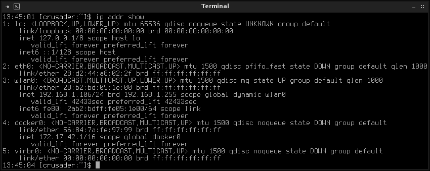
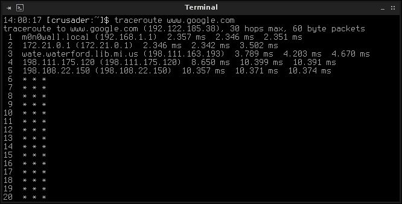
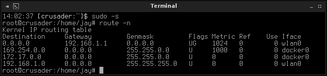
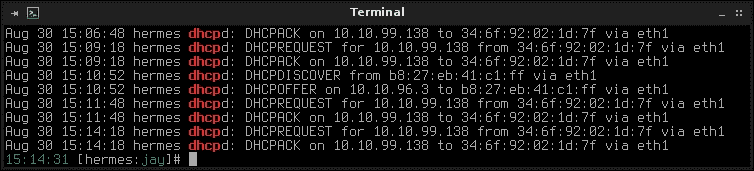
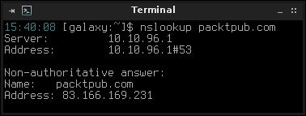
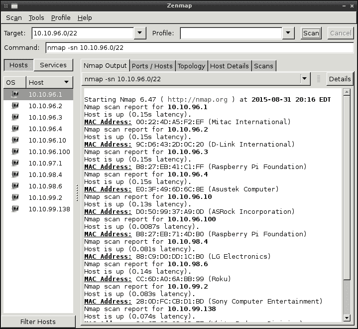
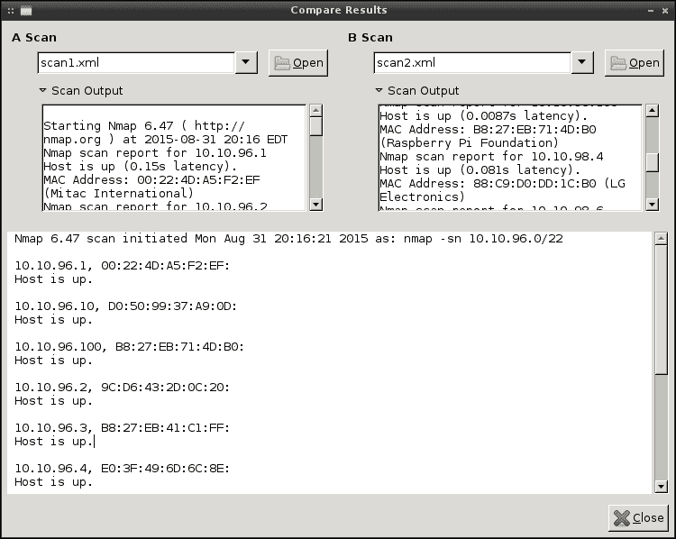

# 第十章：故障排除网络问题

没有网络是完美的。无论我们计划和实施基础设施的多么完美，问题都可能发生。作为网络管理员，您需要的最重要的技能是解决问题的能力。当问题发生时，您的理性思考和通过排除法缩小问题范围的能力将帮助您度过难关。尽管当事情变得一团糟时肯定会很有压力，但网络管理员们享受着工作的安全性。在本章中，我们将解决 Linux 网络中可能出现的一些常见问题。在我们旅程的最后一章中，我们将涵盖：

+   跟踪路由问题

+   故障排除 DHCP 问题

+   故障排除 DNS 问题

+   使用 netstat 显示连接统计信息

+   使用 nmap 和 Zenmap 扫描您的网络

+   在 Debian 系统上安装缺失的固件

+   使用网络管理器解决问题

# 跟踪路由问题

网络的整个目的是将数据从 A 点传输到 B 点。如果由于某种原因我们无法将数据传输到需要的地方，有时很难准确定位问题发生的地方。但是通过排除法，确定路由问题发生的地方不应该太困难。

每当我遇到节点无法与特定服务器或网络通信的问题时，我喜欢从他们的工作站开始逐步排查到交换机堆栈，直到找到问题所在。首先，我检查一些显而易见的事情，比如 IP 地址是什么（或者机器是否有 IP 地址），然后我还会检查路由表。如果问题是间歇性的，您可能会想测试一下网线。出于某种原因，我遇到过很多问题都是由于坏网线导致的。我不知道为什么，但似乎其他我认识的管理员没有这种运气。但是检查一下网络电缆是否运行正常永远不会有坏处。

假设您已经尝试了简单的方法，接下来您会想确定您是否可以到达默认网关。如果您知道本地默认网关的 IP 地址，只需 ping 它以查看您是否可以到达它，并注意结果。您的尝试是否超时，还是顺利通过？如果您不知道网关的 IP 地址，请在终端模拟器中运行`route -n`来查找。如果您可以通过 IP 到达默认网关，请尝试通过主机名以及您首先尝试连接的目标节点的 IP 地址来到达它。如果您能够通过 IP 而不是主机名到达资源，这很可能是 DNS 问题。我们将在本章后面讨论故障排除 DNS。但现在，确定您是否可以到达 DNS 服务器和/或网关将是一个很好的第一步。如果您不能，您可能有一个资源已经宕机，并且一群愤怒的同事正在等待您回到您的办公桌。

如果问题是间歇性的，我们可以从询问本地机器开始故障排除。`ip address show`命令将为我们提供有关本地机器 IP 地址的一些详细信息。我们实际上可以通过缩写为`ip addr show`来缩短这个命令，或者如果您真的不喜欢输入，您还可以进一步简化为`ip a`。以下是来自示例系统的`ip addr show`的输出：



调查本地机器上的 IP 地址

在本书的这一部分，`ip a`的输出不应该有什么太让人惊讶的地方。然而，我的机器的输出可能与您在实际情况中看到的不同，因此值得一提。首先，您可以看到我用于测试的 Debian 机器上有五个网络接口。第一个是本地环回适配器`lo`；第二个是`eth0`。由于这台机器目前正在使用 Wi-Fi，`eth0`没有 IP 地址并不奇怪。接下来的接口`wlan0`的 IP 地址是`192.168.1.106`。最后两个接口是独特的；它们存在为 Docker 和 KVM 虚拟化提供自己的网络。即使 Docker 和 KVM 不在本书的范围内，我提到它们做自己的网络，因为当安装了这些服务之一时，您可能会看到您的 Linux 桌面环境报告您已连接到网络，即使在技术上您并没有连接。在我的机器上，如果我断开`wlan0`，它仍然会显示我已连接。这是因为大多数图形发行版所附带的 Network Manager 的 GUI 版本在报告与您的连接状态相关的准确状态方面做得很糟糕，这可能会混淆情况。

现在你已经确定了机器有一个 IP 地址，你可以采取的另一个步骤是使用`traceroute`命令。那些使用过 Windows 的人可能已经熟悉这个概念，因为 Windows 实用程序`tracert`的工作方式基本相同。`traceroute`实用程序在设置 Linux 发行版时并不总是默认安装的，因此您可能需要安装`traceroute`软件包。从这里，您应该能够使用`traceroute`以及资源的主机名或 IP，查看进程在哪里中断。如果您的工作站无法访问公共互联网，您还可以针对网站的 URL 使用`traceroute`。在下面的截图中，显示了针对`google.com`的`traceroute`：



运行 traceroute 以排除访问公共互联网的问题

在上一张截图中，我对[www.google.com](http://www.google.com)运行了`traceroute`。从输出中，我们可以立刻看出几件事。首先，我们可以看到我们的命令尝试到达的第一个“跳跃”是一个名为`m0n0wall.local`的设备，IP 地址为`192.168.1.1`。如果我运行`route -n`，我会看到这是我当前使用的网络的默认网关。`m0n0wall`是 FreeBSD 的防火墙分发版，在这个网络上使用。当我运行命令时，我发现了这一点。接下来，我们可以看到我们通过`m0n0wall`设备到达了另一个私有网络`172.21.0.1`，然后是`198.111.175.120`，但当我的请求到达`198.108.22.150`时，输出就停止了。之后，我们只能看到星号，但我们没有超越这一点。在我的机器无法访问互联网的假设示例中，我可能想调查`198.108.22.150`处的设备，并找出为什么它不让我的流量通过。然而，在我的情况下，这个设备正在丢弃 ICMP 数据包，这导致`traceroute`命令本身失败。

在排除路由问题时，您绝对要检查的一件事是您的路由表。我们在第八章中涵盖了路由，*理解高级网络概念*，以及路由表和添加路由。但作为一个复习，您可以使用`route -n`将路由表打印到您的 shell 上。如果您正在排除故障的机器没有到达需要访问的网络的路由，那么根本原因就很明显了。然后，您需要添加一个默认网关，以便让机器能够到达该网络。



查看本地路由表

# 故障排除 DHCP 问题

如果由于某种原因您有一台机器拒绝获取 IP 地址，那么这一部分就是为您准备的。DHCP 问题并不是非常常见，而且幸运的是也不难排除故障。

我见过的 DHCP 服务器最常见的问题之一是服务器或客户端的日期和时间错误。在 Linux 世界中，NTP 至关重要，应该始终正常工作。在 DHCP 的情况下，只有在服务超时请求 IP 地址之前才会等待很长时间。如果时钟差了一个小时，而传入的请求时间戳是一个小时前，那会让服务器困惑，客户端将无法收到地址。请务必确保所有客户端和服务器上的 NTP 都正常工作。DHCP 并不是唯一会因为任一端的时间不正确而受影响的服务。在这种情况下可能会发生很多奇怪的事情。

失败的原因是可用 IP 地址的不足。这听起来很明显，但您会惊讶地发现这种情况经常发生。即使是具有`254`个可用 IP 地址的`/24`网络，如今也可能很快就会饱和，因为从移动设备到冰箱（是的，冰箱）都想要获取 IP 地址。对于普通人来说，使用三个 IP 地址甚至都不会注意到是很常见的。如果您将 DHCP 租约时间设置为一天以上，这样的问题可能会变得越来越烦人。在大多数情况下，24 小时的租约时间对大多数网络来说是足够的。需要访问的设备将在到期时更新其租约，而临时设备则不会尝试更新其分配的 IP 地址，这将导致其返回到池中。

我希望我有一个您可以运行的魔术命令，可以给您一个可用 IP 地址数量的打印输出。不幸的是，我从来没有找到过一个，除了可能构建一个笨重的 Bash 或 Python 脚本。在遇到任何 DHCP 问题时，最好的做法是观察日志文件，并让客户端再次尝试连接。



工作中的 DHCP 服务器的输出

在 Debian 中，您可以通过运行`cat /var/log/syslog |grep dhcp`来调查与 DHCP 服务器相关的消息。在 CentOS 中，您可以使用`journalctl -u dhcpd`来查看这些消息。更好的方法是在客户端尝试连接时实时跟踪这些日志，这样您就可以看到发生的情况。要做到这一点，在 Debian 中使用`tail -f /var/log/syslog`，在 CentOS 中使用`journalctl -f -u dhcpd`。DHCP 服务器的错误应该相当容易跟踪，因为服务器通常会明确说明它在做什么。您可能会看到它向客户端提供地址，或者抱怨没有足够的 IP 地址可用。如果您看到服务器向客户端提供 IP 地址，但客户端似乎永远无法完成连接，那么一定要检查客户端上的 NTP 服务器。

# 故障排除 DNS 问题

DNS 问题通常很少发生，除非配置无效。在大多数情况下，您所做的任何故障排除都将在本地 DNS 服务器上进行，因为互联网上的公共 DNS 服务器不在您的控制范围之内。在外部 DNS 服务器失败的情况下，比如您的 ISP 的 DNS 服务器，您唯一的补救措施可能是使用不同的 DNS 提供商，比如使用谷歌的公共 DNS 地址`8.8.8.8`和`8.8.4.4`。但是如果您的本地 DNS 服务器失败，您就有更多的控制权。

与往常一样，您可以通过检查是否可以访问 DNS 服务器来开始故障排除 DNS 问题。首先，检查`/etc/resolv.conf`，看看您的机器正在使用哪个 DNS 服务器。这是正确的服务器吗？如果不是，请在您的网络脚本中更正这一点，并重新启动网络。如果是正确的服务器，您能够访问它吗？尝试简单的 ping，只要服务器配置为响应 ICMP 回显请求，您应该会看到响应。如果您可以访问服务器，请通过 SSH 登录并检查其日志。也许守护程序（Debian 中的`bind`和 CentOS 中的`named`）没有运行。

除了简单的事情之外，我们还可以使用一个特定的实用程序来帮助排除特定于 bind 的问题，这个实用程序就是`nslookup`。使用`nslookup`命令以及您要查找的资源的名称，比如主机名或网站的 URL。



工作的 DHCP 服务器的输出

`nslookup`的输出告诉我们一些有用的东西，可以帮助我们进一步进行故障排除。首先，它会给出回答我们请求的服务器的 IP 地址。在我的情况下，`10.10.96.1`通过端口 53 回答了我。然后，我可以看到我对`packtpub.com`的查询结果，它给了我一个外部 IP 地址`83.166.169.231`。到目前为止，一切都很顺利。如果您的 DNS 服务器是可达的，守护程序正在运行，并且您的本地工作站已配置为指向它，一个非常常见的问题是您域记录中的序列号。如果您向 DNS 服务器添加了资源但忘记递增序列号，这可能导致查找失败，即使您已经为该主机添加了配置。这可能看起来是常识，但您会惊讶地发现它有多容易被遗忘。

如果`nslookup`没有返回记录，请检查您是否确实将该记录添加到了服务器上。如果它返回了记录，那么只要您已经配置了本地工作站指向正确的服务器，一切都应该运行正常。

# 使用 netstat 显示连接统计

`netstat`命令是一个有用的实用程序，允许您查看有关当前连接的一些统计信息。我们在上一章中稍微提到了它。这个命令允许您显示有用的网络信息，比如显示在您的网络卡上监听连接的服务，并打印您的路由表，等等。

在上一章中，我举了`netstat -tulpn`的例子，让你可以查看当前连接和监听服务。这个命令显示了所有正在监听的东西，以及它正在监听的端口。分解这个命令，我们传递了一些参数。第一个`-t`，表示我们想要查看与 TCP 相关的信息，`-u`代表 UDP，`-l`请求监听套接字，`-p`尝试显示程序的名称，`-n`也显示数字值。把它们放在一起，我们得到`netstat -tulpn`。在行业中，这是我见过的`netstat`最常见的用法。

`netstat`的其他用途包括显示路由表（`netstat -r`），它给出了与`route -n`类似的输出。要查看连接统计，使用`netstat -s`。最后，您还可以使用`netstat -i`查看系统上的网络接口列表。不过，总的来说，这个命令是您在尝试故障排除问题或锁定节点时最常用的用于将网络信息打印到终端的命令。

# 使用 Nmap 和 Zenmap 扫描您的网络

`nmap`实用程序是一个网络扫描工具，可以为您提供有关网络资源的大量信息。您只需要安装`nmap`软件包。一旦您在您的工具库中拥有了这个实用程序，您就可以在您的网络上做一些相当不错的事情。在大多数情况下，`nmap`被用来询问系统并提取信息。虽然`nmap`本身并不能解决任何实际问题，但它可以帮助您发现您可以用来建立对网络在任何给定时间发生的情况的理解的信息。

它也需要非常小心地使用，因为`nmap`能够披露关于可能是私人的网络的信息，除非您有明确的许可来使用它，否则您应该谨慎行事。由于`nmap`可以用于黑客目的，如果网络管理员（如果不是您）看到这种类型的活动，那肯定是一个红旗。但在现实世界的场景中，`nmap`确实可以拯救生命。根据我的经验，我发现它在追踪和审问在网络上托管恶意软件的机器方面非常有用，而奇怪的是，这些机器似乎总是运行 Windows（想象一下）。如果一个漏洞报告只显示了被感染机器的 IP 地址，那么很难追踪到这台机器是谁的。但是通过`nmap`，我可以找出诸如该主机上运行的操作系统、机器的主机名（甚至可能包括用户的名称）以及该机器的网络卡的 MAC 地址等信息。

`nmap`有许多用途，但我将从一些我最喜欢的用途开始。首先，正如我刚才提到的，您可以使用`nmap`来尝试确定特定主机使用的操作系统。这将使您能够进一步调整命令以专门针对该机器，因为您调查节点的方式取决于它们运行的操作系统。要使用`nmap`尝试查找这些信息，使用它与`-O`参数和主机的 IP 地址。基本上，执行以下命令：

```
nmap -O 10.10.98.124

```

`nmap`的另一个有用用例是扫描整个子网以确定连接了哪些主机。如果您试图查看哪些 IP 地址是空闲的，这是一种方法（假设没有节点有任何阻止扫描的防火墙）：

```
nmap -sP 10.10.96.0/22

```

在前面的例子中，如果我们希望不扫描或包括特定 IP 地址，我们还可以使用`--exclude`选项：

```
nmap -sP 10.10.96.0/22 --exclude 10.10.98.223

```

如果一台机器在防火墙后面，我们仍然可以尝试扫描它：

```
nmap -PN 10.10.98.104

```

好像我们已经有足够的实用程序可以显示我们本地机器的路由和接口信息，`nmap`也可以做到：

```
nmap --iflist

```

除了在终端中使用`nmap`命令之外，还有 Z**enmap**，它更或多是一个图形界面的等效工具。使用它，我们可以做几乎与`nmap`相同的事情，但它还允许您保存您的扫描、打开先前保存的扫描、在两个保存的扫描之间比较结果，甚至保存命令配置文件以供以后使用。如果您发现自己经常使用`nmap`，那么从 Zenmap 的附加功能中受益可能对您有用。



Zenmap 扫描本地网络

开始测试 Zenmap 的一种简单方法是尝试在本章中给出的任何示例中使用它。您应该能够将这些命令中的任何一个粘贴到窗口顶部的第三个文本框中，该文本框显示**命令**。从这里，您可以单击**扫描**开始扫描。完成后，您可以通过单击**扫描**然后**保存扫描**来保存结果。如前所述，您还可以将扫描结果进行比较。如果您想知道哪些新设备已添加到您的网络，这可能很有用。您可以在一天内对子网进行扫描（使用我之前提到的`nmap -sP 10.10.98.0/24`示例），然后第二天再次运行扫描。如果每次都保存了结果，您可以比较它们，然后立即确定是否有新设备添加到您的网络。这是一个很好的定期执行的做法（特别是如果您是指定批准新设备的人），以确定是否存在任何流氓或未经授权的设备。



在 Zenmap 中比较网络扫描

在使用`nmap`和 Zenmap 之间进行选择只是一种偏好问题。Zenmap 的功能非常好，但它提供的唯一东西就是易用性。例如，在`nmap`中，您可以简单地将结果导入文本文件，然后可以针对两个输出文件的结果运行`diff`命令，而无需使用 GUI 应用程序来执行此任务。

```
nmap -sP 10.10.98.0/24 > scan1.txt
nmap -sP 10.10.98.0/24 > scan2.txt
diff scan1.txt scan2.txt

```

在典型的网络管理员桌面上，您可能会使用带有图形用户界面的 Linux 或 Windows 安装；在这种情况下，Zenmap 可能是您工具集中的一个不错的选择。

# 在 Debian 系统上安装缺失的固件

许多 Linux 发行版默认情况下更喜欢包括只有自由软件和驱动程序，Debian 也属于这一类。这可能是出于道德决定或许可限制，但结果可能是特定的网络卡或硬件设备在开箱即用时无法正常工作。无线网卡通常是这种情况的典型例子。其中一个例子是英特尔无线网卡。虽然在终端用户发行版（如 Ubuntu、Linux Mint 等）中，这些通常无需任何调整即可正常工作，但企业发行版（如 Debian）通常不包括这些，并强制您通过额外的步骤。原因是这些网卡要正常工作所需的软件不是开源的，因此决定不将其包含在默认存储库中。幸运的是，通常这并不太难纠正，只要您知道步骤即可。

在 Debian 系统上，有一个非自由参数，可以添加到您的 APT 源中，告诉发行版在搜索和安装软件时包括这些软件包。但在这样做之前，请确保您确实需要额外的固件。一个明显的迹象是，如果 Debian 在启动时抱怨缺少固件。在不重新启动的情况下，您可能会看到日志中有关硬件设备缺少固件的错误。要查看系统上可能抱怨缺少固件的任何输出，请尝试以下命令：

```
dmesg |grep firmware

```

要在 Debian 中添加 APT 源的非自由组件，首先备份您的原始`sources.list`文件：

```
# cp /etc/apt/sources.list /etc/apt/sources.list.bak

```

然后，将非自由参数添加到主存储库。在我的 Debian Jessie 系统上，该行如下：

```
deb http://ftp.us.debian.org/debian/ jessie main contrib non-free

```

完成后，使用以下命令刷新您的源：

```
# apt-get update

```

从这一点开始，非自由的二进制软件包应该对您可用。您可以通过搜索和列出系统上可用的固件软件包来确认这一点。输出应该包含几个`nonfree`软件包。要执行此搜索，请尝试以下命令：

```
aptitude search firmware

```

例如，如果`firmware-linux-nonfree`出现在您的可用软件包列表中，那么您已经正确执行了这些步骤。

不幸的是，详细列出 Debian 的硬件兼容性和每个所需的固件将超出本书的范围。然而，日志应该让您对缺少的固件有一个大致的了解，从而可以在软件包数据库中搜索特定的软件包。通常，从`dmesg`中关于无法加载固件的输出复制一行并进行谷歌搜索，将带您找到解决情况所需的软件包。在我的情况下，我经常需要的固件包是`firmware-iwlwifi`。此外，`firmware-atheros`和`firmware-b43-installer`也很常见。

# 排除 Network Manager 问题

**Network Manager**是用于管理 Linux 中的网络连接的工具。它由在后台运行的守护程序和大多数桌面发行版都包含的可选图形实用程序组成，以便随时显示您的连接状态。Network Manager 并不是必需的，但它简化了网络接口及其配置的管理。在许多实际网络中，Network Manager 通常是禁用的，而是使用静态 IP 地址。正如我之前提到的那样，我总是更喜欢静态租约而不是静态 IP。使用静态 IP，您没有中央管理点，并且需要手动跟踪并更改服务器的 IP 地址。因此，我建议您保持 Network Manager 运行。它将监视连接，激活您的 DHCP 客户端，然后从 DHCP 服务器接收 IP 地址租约。如果您设置了静态租约（保留），那么一旦 Network Manager 启动您的连接，您就已经准备好了。

在您已经排除为 Network Manager 本身的本地问题的网络问题的情况下，有几件事情可以帮助您准确定位问题。

首先，在 CentOS 系统上，请确保您的网络接口已配置为在启动时启动。出于我无法理解的某种原因，CentOS 实际上在安装过程中默认关闭您的网络接口。除非您在运行安装程序时将其打开，否则在启动后它也将默认处于禁用状态。如果接口未启用，则 Network Manager 将无法管理它。纠正这个问题只是简单地编辑接口的 init 脚本。您将在 CentOS 中的网络接口卡的 init 脚本找到在以下位置：`/etc/sysconfig/network-scripts`。在我的系统上，我发现我的接口卡的`init`脚本在`/etc/sysconfig/network-scripts/ifcfg-enp0s3`，尽管您的接口名称当然会有所不同。

查看最后一行，您应该看到`ONBOOT="yes"`。如果您没有看到，修改该行，然后重新启动网络：

```
# systemctl restart network

```

其次，在 Debian 和 CentOS 系统上，请确保 Network Manager 正在运行。这是那些命令在两个发行版中都相同的罕见情况之一。使用以下命令，我们可以检查 NetworkManager 守护程序的状态：

```
# systemctl status NetworkManager

```

在排除问题时，`systemctl`可能非常有用，因为它不仅告诉您服务是否已启动，还会从日志中给出一些行，如果您遇到问题，可能会指引您朝正确的方向。

要完整查看 Network Manager 日志，您可以使用`journalctl`：

```
journalctl -u NetworkManager

```

您还可以使用`-f`标志来跟踪日志，这样您将在发生新条目时看到它们。在排除为什么机器无法连接到无线网络时，这是特别有用的。错误将在用户尝试连接时出现。以下示例显示了如何跟踪写入日志的 NetworkManager 输出。

```
journalctl -f -u NetworkManager

```

与大多数 systemd 单元一样，我们可以用一个简单的命令重新启动 Network Manager：

```
# systemctl restart NetworkManager

```

前面的命令可能看起来很简单，但出于某种原因，我不得不重新启动网络管理器的次数比我想象的要多。这在将一台机器从一个网络切换到另一个网络，或者从暂停中恢复时尤其如此（尽管这些问题主要只出现在最终用户工作站上）。

大多数情况下，网络管理器的问题很少，而且故障排除相对简单。使用 systemd 的`journalctl`，我们可以观察网络管理器的输出并确定根本原因。在大多数情况下，问题将归结为网络卡配置错误。

# 总结

在本章中，我们介绍了一些可能出现在基于 Linux 的网络上的故障排除方法。虽然不可能详细列出所有可能出错的情况，但本章作为您可能面临的常见问题的起点。我们首先看了路由问题以及 DHCP 和 DNS 故障排除。此外，我们还介绍了诸如`nmap`之类的有用的故障排除工具，以及缺少的固件安装概述，这可能是在 Debian 中设置网络卡所需的。最后，我们提供了有关故障排除网络管理器的信息。

随着这一切，本书也告一段落。感谢您与我一起走过 Linux 网络管理的世界。我希望这本书能引起您的共鸣，并帮助您更好地理解。与 Linux 一起工作是我做出的最佳职业选择，我要感谢所有的读者和同事，使这成为了一次美妙的经历。祝愿大家成功，希望您的 Linux 之旅对您像对我一样有益。
