# 第一章：在虚拟环境中运行 Linux

所以，你可能会问自己，“*为什么我需要学习 Linux 安全？Linux 不是已经很安全了吗？毕竟，它不是 Windows*。”但事实是，有很多原因。

事实上，Linux 在安全方面确实比 Windows 有一些优势。这些包括：

+   与 Windows 不同，Linux 是从头开始设计的多用户操作系统。因此，在 Linux 系统上用户安全性往往会更好一些。

+   Linux 在管理用户和非特权用户之间提供了更好的分离。这使得入侵者更难一些，也使得用户更难意外地用一些恶意软件感染 Linux 机器。

+   Linux 比 Windows 更抵抗病毒和恶意软件感染。

+   某些 Linux 发行版带有内置机制，如 Red Hat 和 CentOS 中的 SELinux 和 Ubuntu 中的 AppArmor，可以防止入侵者控制系统。

+   Linux 是自由开源软件。这使得任何有技能的人都可以审计 Linux 代码以寻找漏洞或后门。

但即使有这些优势，Linux 也和人类创造的其他一切一样，不是完美的。

本章将涵盖的主题包括：

+   每个 Linux 管理员都需要了解 Linux 安全

+   威胁环境的一些内容，以及攻击者如何有时能够侵入 Linux 系统的一些例子

+   跟进 IT 安全新闻的资源

+   如何在 VirtualBox 上设置 Ubuntu Server 和 CentOS 虚拟机，以及如何在 CentOS 虚拟机中安装 EPEL 存储库

+   如何创建虚拟机快照

+   如何在 Windows 主机上安装 Cygwin，以便 Windows 用户可以从他们的 Windows 主机连接到虚拟机

# 威胁环境

如果你在过去几年一直关注 IT 技术新闻，你可能至少看过一些关于攻击者如何侵入 Linux 服务器的文章。例如，虽然 Linux 不太容易受到病毒感染，但已经有几起攻击者在 Linux 服务器上种植其他类型的恶意软件的案例。这些案例包括：

+   **僵尸网络恶意软件**：它会导致服务器加入由远程攻击者控制的僵尸网络。其中一个更著名的案例涉及将 Linux 服务器加入了对其他网络发动*拒绝服务*攻击的僵尸网络。

+   **勒索软件**：它旨在加密用户数据，直到服务器所有者支付赎金。但即使支付了赎金，也不能保证数据能够恢复。

+   加密货币挖矿软件：它会导致服务器的 CPU 额外努力工作并消耗更多能量。被挖掘的加密货币会进入种植软件的攻击者的账户。

当然，也有很多不涉及恶意软件的侵犯，比如攻击者找到了窃取用户凭据、信用卡数据或其他敏感信息的方法。

一些安全漏洞是因为纯粹的疏忽。这是一个例子，一个粗心的 Adobe 管理员将公司的私人安全密钥放在了公共安全博客上：[`www.theinquirer.net/inquirer/news/3018010/adobe-stupidly-posts-private-pgp-key-on-its-security-blog`](https://www.theinquirer.net/inquirer/news/3018010/adobe-stupidly-posts-private-pgp-key-on-its-security-blog)。

# 那么，这是如何发生的呢？

无论你运行 Linux、Windows 还是其他系统，安全漏洞的原因通常是相同的。它们可能是操作系统中的安全漏洞，或者是运行在该操作系统上的应用程序中的安全漏洞。通常情况下，一个与漏洞相关的安全漏洞本可以通过管理员及时应用安全更新来防止。

另一个重要问题是配置不良的服务器。Linux 服务器的标准开箱即用配置实际上是相当不安全的，可能会引起一系列问题。配置不良的服务器的一个原因只是缺乏受过适当培训的人员来安全地管理 Linux 服务器。（当然，这对本书的读者来说是个好消息，因为相信我，IT 安全工作是不缺乏高薪的。）

在我们阅读本书的过程中，我们将看到如何以正确的方式做生意，使我们的服务器尽可能安全。

# 跟上安全新闻

如果您从事 IT 业务，即使您不是安全管理员，您也希望跟上最新的安全新闻。在互联网时代，这很容易做到。

首先，有很多专门从事网络安全新闻的网站。例如*Packet Storm Security*和*The Hacker News*。定期的技术新闻网站和 Linux 新闻网站，如*The INQUIRER*，*The Register*，*ZDNet*和*LXer*也会报道网络安全漏洞。如果您更喜欢观看视频而不是阅读，您会发现很多优秀的 YouTube 频道，如*BeginLinux Guru*。

最后，无论您使用哪个 Linux 发行版，请务必关注您的 Linux 发行版的新闻和当前文档。发行版维护者应该有一种方式来让您知道如果他们产品中出现了安全问题。

安全新闻网站的链接如下：

+   Packet Storm Security：[`packetstormsecurity.com/`](https://packetstormsecurity.com/)

+   The Hacker News：[`thehackernews.com/`](http://thehackernews.com/)

一般技术新闻网站的链接如下：

+   The INQUIRER：[`www.theinquirer.net/`](https://www.theinquirer.net/)

+   The Register：[`www.theregister.co.uk/`](http://www.theregister.co.uk/)

+   ZDNet：[`www.zdnet.com/`](http://www.zdnet.com/)

您还可以查看一些一般的 Linux 学习资源。Linux 新闻网站：

+   LXer：[`lxer.com/`](http://lxer.com/)

+   *BeginLinux Guru*在 YouTube 上：[`www.youtube.com/channel/UC88eard_2sz89an6unmlbeA`](https://www.youtube.com/channel/UC88eard_2sz89an6unmlbeA)

（完全披露：我是*BeginLinux Guru*。）

在阅读本书时要记住的一件事是，您将永远不会看到完全、100%安全的操作系统，它将安装在从不开机的计算机上。

# VirtualBox 和 Cygwin 简介

每当我写作或教学时，我都会尽力不让学生失眠。在整本书中，您会看到一些理论，但我主要喜欢提供好的实用信息。还会有很多逐步实践的实验。

做实验的最佳方式是使用 Linux 虚拟机。我们将做的大部分工作都适用于任何 Linux 发行版，但我们也会做一些特定于 Red Hat Enterprise Linux 或 Ubuntu Linux 的事情。（Red Hat Enterprise Linux 是企业使用最广泛的，而 Ubuntu 在云部署中最受欢迎。）

红帽是一家价值十亿美元的公司，所以毫无疑问他们在 Linux 市场上的地位。但是，由于 Ubuntu Server 是免费的，我们不能仅仅根据其母公司的价值来判断其受欢迎程度。事实是，Ubuntu Server 是最广泛使用的 Linux 发行版，用于部署基于云的应用程序。

有关详情，请参阅：[`www.zdnet.com/article/ubuntu-linux-continues-to-dominate-openstack-and-other-clouds/`](http://www.zdnet.com/article/ubuntu-linux-continues-to-dominate-openstack-and-other-clouds/)。

由于 Red Hat 是收费产品，我们将使用由 Red Hat 源代码构建并免费的 CentOS 7 来替代。您可以使用几种不同的虚拟化平台，但我自己的首选是 VirtualBox。

VirtualBox 适用于 Windows、Linux 和 Mac 主机，并且对所有这些主机都是免费的。它具有其他平台上需要付费的功能，例如创建虚拟机快照的能力。

我们将要做的一些实验将要求您模拟从主机机器到远程 Linux 服务器的连接。如果您的主机机器是 Linux 或 Mac 机器，您只需打开终端并使用内置的安全外壳工具。如果您的主机机器运行 Windows，则需要安装某种 Bash 外壳，我们将通过安装 Cygwin 来完成。

# 在 VirtualBox 中安装虚拟机

对于那些从未使用过 VirtualBox 的人，以下是一个快速入门指南：

1.  下载并安装 VirtualBox 和 VirtualBox 扩展包。您可以从以下网址获取：[`www.virtualbox.org/`](https://www.virtualbox.org/)。

1.  下载 Ubuntu Server 和 CentOS 7 的安装`.iso`文件。您可以从以下网址获取：[`www.ubuntu.com/`](https://www.ubuntu.com/)和[`www.centos.org/`](https://www.centos.org/)。

1.  启动 VirtualBox 并单击屏幕顶部的新图标。在要求的位置填写信息。将虚拟驱动器大小增加到 20 GB，但将其他所有设置保持为默认设置：

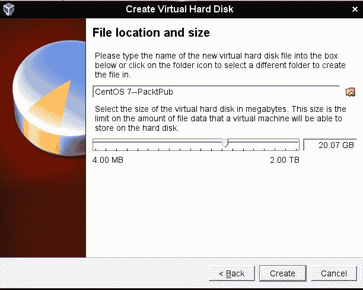

1.  启动新的虚拟机。单击对话框框的左下角的文件夹图标，并导航到您下载的`.iso`文件存储的目录。选择以下屏幕截图中显示的 Ubuntu`.iso`文件或 CentOS`.iso`文件中的一个：

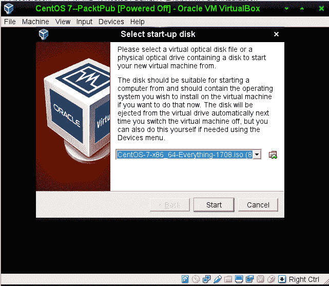

1.  单击对话框框上的“开始”按钮以开始安装操作系统。请注意，对于 Ubuntu Server，您将不会安装桌面界面。对于 CentOS 虚拟机，选择 KDE 桌面或 Gnome 桌面，如您所需。（我们将至少进行一个需要 CentOS 机器桌面界面的练习。）

1.  对另一个 Linux 发行版重复该过程。

1.  通过输入以下内容更新 Ubuntu 虚拟机：

```
 sudo apt update
 sudo apt dist-upgrade
```

1.  暂时不要更新 CentOS 虚拟机，因为我们将在下一个练习中进行更新。

在安装 Ubuntu 时，您将被要求创建一个普通用户帐户和密码。它不会要求您创建根用户密码，而是会自动将您添加到 sudo 组，以便您具有管理员特权。

当您到达 CentOS 安装程序的用户帐户创建屏幕时，请确保为您自己的用户帐户选中“使此用户成为管理员”复选框，因为默认情况下未选中。它将为您提供创建根用户密码的机会，但这完全是可选的—事实上，我从来没有这样做。

CentOS 安装程序的用户帐户创建屏幕如下所示：

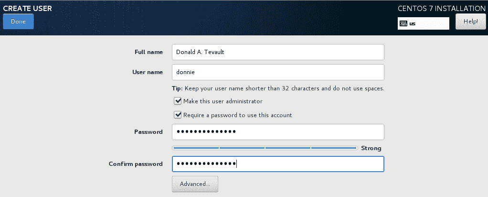

# 在 CentOS 虚拟机上的 EPEL 存储库

尽管 Ubuntu 软件包存储库几乎包含了您在本课程中所需的所有内容，但 CentOS 软件包存储库—我们可以说—是不足的。为了在 CentOS 实验中使用所需的软件包，您需要安装**EPEL**（企业 Linux 的额外软件包）存储库。（EPEL 项目由 Fedora 团队运行。）当您在 Red Hat 和 CentOS 系统上安装第三方存储库时，您还需要安装一个`priorities`软件包，并编辑`.repo`文件以为每个存储库设置适当的优先级。这将防止第三方存储库的软件包覆盖官方的 Red Hat 和 CentOS 软件包，如果它们恰好具有相同的名称。以下步骤将帮助您安装所需的软件包并编辑`.repo`文件：

1.  您需要安装 EPEL 的两个软件包在正常的 CentOS 存储库中。运行以下命令：

```
 sudo yum install yum-plugin-priorities epel-release
```

1.  安装完成后，转到`/etc/yum.repos.d`目录，并在您喜欢的文本编辑器中打开`CentOS-Base.repo`文件。在`base`、`updates`和`extras`部分的最后一行之后，添加一行`priority=1`。在`centosplus`部分的最后一行之后，添加一行`priority=2`。保存文件并关闭编辑器。您编辑过的每个部分应该看起来像这样（除了适当的名称和优先级数字）：

```
        [base]
        name=CentOS-$releasever - Base
        mirrorlist=http://mirrorlist.centos.org/?
        release=$releasever&arch=$basearch&repo=os&infra=$infra
          #baseurl=http://mirror.centos.org/centos/
           $releasever/os/$basearch/
        gpgcheck=1
        gpgkey=file:///etc/pki/rpm-gpg/RPM-GPG-KEY-CentOS-7
        priority=1
```

1.  打开`epel.repo`文件进行编辑。在`epel`部分的最后一行之后，添加一行`priority=10`。在每个剩余部分的最后一行之后，添加一行`priority=11`。

1.  更新系统，然后通过运行以下命令创建已安装和可用软件包的列表：

```
 sudo yum upgrade
 sudo yum list > yum_list.txt
```

# 为 VirtualBox 虚拟机配置网络

我们的一些培训场景将要求您模拟连接到远程服务器。您可以通过使用主机机器连接到虚拟机来实现这一点。当您首次在 VirtualBox 上创建虚拟机时，网络设置为 NAT 模式。为了从主机连接到虚拟机，您需要将虚拟机的网络适配器设置为桥接适配器模式。以下是您可以执行此操作的方法：

1.  关闭您已经创建的任何虚拟机。

1.  在 VirtualBox 管理器屏幕上，打开虚拟机的设置对话框。

1.  单击网络菜单项，并将附加到设置从 NAT 更改为桥接适配器：

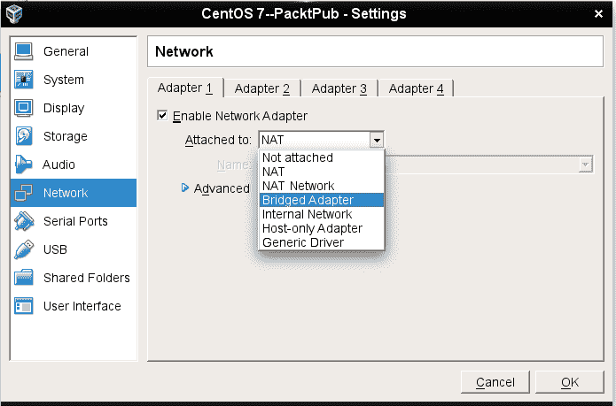

1.  展开高级项目，并将混杂模式设置更改为允许全部：

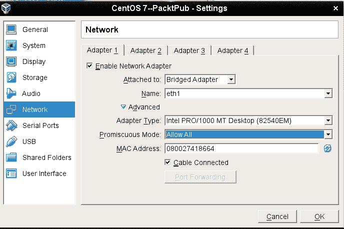

1.  重新启动虚拟机并设置其使用静态 IP 地址。

如果您从子网范围的高端分配静态 IP 地址，将更容易防止与从互联网网关分配的低号 IP 地址发生冲突。

# 使用 VirtualBox 创建虚拟机快照

与虚拟机一起工作的一个美妙之处是，如果出现问题，您可以创建快照并回滚到快照。使用 VirtualBox，这很容易做到。

1.  在 VirtualBox 管理器屏幕的右上角，单击“快照”按钮：

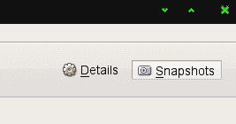

1.  在屏幕中间的左侧，您将看到一个相机图标。单击该图标以打开快照对话框。要么填写所需的快照名称，要么接受默认名称。可选地，您可以创建一个描述：

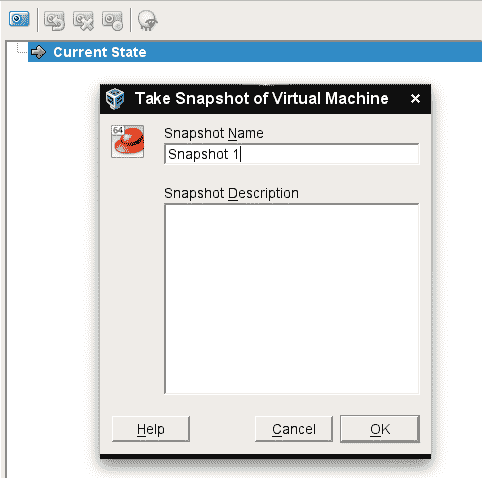

1.  在对虚拟机进行更改后，您可以通过关闭虚拟机，然后右键单击快照名称并选择适当的菜单项来回滚到快照：

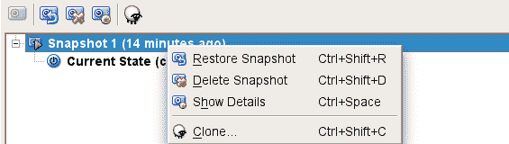

# 使用 Cygwin 连接到您的虚拟机

如果您的主机机器是 Linux 或 Mac 机器，您只需打开主机的终端并使用已经存在的工具连接到虚拟机。但是，如果您正在运行 Windows 机器，您需要安装某种 Bash shell 并使用其网络工具。Windows 10 Pro 现在带有由 Ubuntu 人员提供的 Bash shell，如果您愿意，可以使用它。但是，如果您没有 Windows 10 Pro，或者如果您更喜欢使用其他东西，您可以考虑 Cygwin。

Cygwin 是 Red Hat 公司的一个项目，是专为 Windows 构建的免费开源 Bash shell。它是免费的，而且易于安装。

# 在 Windows 主机上安装 Cygwin

以下是一个快速的 Cygwin 入门指南：

1.  在主机机器的浏览器中，从以下网址下载适用于您的 Windows 版本的适当的`setup*.exe`文件：[`www.cygwin.com/`](http://www.cygwin.com/)。

1.  双击设置图标开始安装。在大多数情况下，只需接受默认值，直到您到达软件包选择屏幕。 （唯一的例外是您选择下载镜像的屏幕。）

1.  在软件包选择屏幕的顶部，从“视图”菜单中选择“类别”：

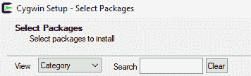

1.  展开“网络”类别：

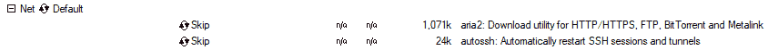

1.  向下滚动，直到看到 openssh 软件包。在“新”列下，点击“跳过”。（这将导致“跳过”位置出现版本号。）

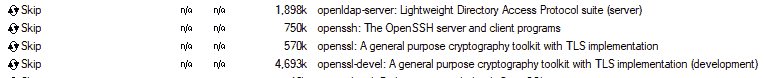

1.  在您选择了适当的软件包之后，您的屏幕应该是这样的：

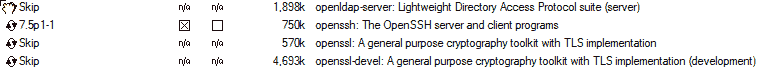

1.  在右下角，点击“下一步”。如果出现“解决依赖关系”屏幕，请也点击“下一步”。

1.  保留您下载的安装文件，因为您稍后将使用它来安装更多软件包，或者更新 Cygwin。（当您打开 Cygwin 时，任何更新的软件包将显示在“视图”菜单上的“待处理”视图中。）

1.  一旦您从 Windows“开始”菜单中打开 Cygwin，您可以根据需要调整其大小，并使用*Ctrl* + *+*或*Ctrl* + *-*键组合来调整字体大小：

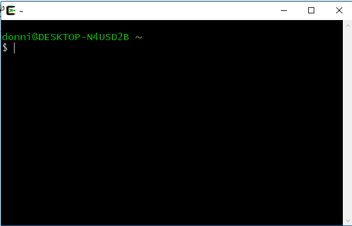

# 总结

所以，我们已经很好地开始了我们的 Linux 安全和加固之旅。在本章中，我们看到了为什么了解如何保护和加固 Linux 系统与了解如何保护和加固 Windows 系统一样重要。我们提供了一些例子，说明了一个配置不良的 Linux 系统是如何被入侵的，并且我们提到了学习 Linux 安全对您的职业发展是有好处的。之后，我们看了如何使用 VirtualBox 和 Cygwin 设置虚拟化实验室环境。

在下一章中，我们将看看如何锁定用户账户，并确保错误的人永远不会获得管理员特权。到时见。
