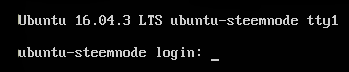
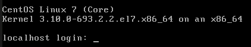
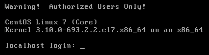

# 第二章：保护用户账户

管理用户是 IT 管理中更具挑战性的方面之一。您需要确保用户始终可以访问其内容，并且可以执行所需的任务来完成工作。您还需要确保用户的内容始终受到未经授权用户的保护，并且用户不能执行与其工作描述不符的任何任务。这是一个艰巨的任务，但我们的目标是表明这是可行的。

在本章中，我们将涵盖以下主题：

+   以 root 用户登录的危险

+   使用 sudo 的优势

+   如何为完整的管理用户和仅具有特定委派权限的用户设置 sudo 权限

+   使用 sudo 的高级技巧和技巧

+   锁定用户的主目录

+   强制执行强密码标准

+   设置和强制执行密码和帐户过期

+   防止暴力破解密码攻击

+   锁定用户帐户

+   设置安全横幅

# 以 root 用户登录的危险

Unix 和 Linux 操作系统相对于 Windows 的一个巨大优势是，Unix 和 Linux 更好地将特权管理帐户与普通用户帐户分开。事实上，旧版本的 Windows 容易受到安全问题的影响，例如**随意**病毒感染，一个常见的做法是设置具有管理权限的用户帐户，而没有新版本 Windows 中的**用户访问控制**的保护。（即使有用户访问控制，Windows 系统仍然会被感染，只是不太频繁。）在 Unix 和 Linux 中，更难以感染一个正确配置的系统。

您可能已经知道 Unix 或 Linux 系统上的超级管理员帐户是 root 帐户。如果您以 root 用户身份登录，您可以对该系统执行任何您想要执行的操作。因此，您可能会认为，“是的，这很方便，所以我会这样做。”但是，始终以 root 用户登录可能会带来一系列安全问题。考虑以下。以 root 用户登录可能会：

+   使您更容易意外执行导致系统损坏的操作

+   使其他人更容易执行导致系统损坏的操作

因此，如果您总是以 root 用户登录，甚至只是使 root 用户帐户容易访问，可以说您正在为攻击者和入侵者做很大一部分工作。此外，想象一下，如果您是一家大公司的 Linux 管理员，允许用户执行管理员任务的唯一方法是给他们所有的 root 密码。如果其中一个用户离开公司会发生什么？您不希望该人仍然有能力登录系统，因此您必须更改密码并将新密码分发给所有其他用户。而且，如果您只希望用户对某些任务具有管理员权限，而不是具有完整的 root 权限呢？

我们需要一种机制，允许用户执行管理任务，而不会冒着他们始终以 root 用户登录的风险，并且还允许用户仅具有他们真正需要执行某项工作的管理权限。在 Linux 和 Unix 中，我们通过 sudo 实用程序实现了这种机制。

# 使用 sudo 的优势

正确使用，sudo 实用程序可以极大地增强系统的安全性，并且可以使管理员的工作更加轻松。使用 sudo，您可以执行以下操作：

+   为某些用户分配完整的管理权限，同时为其他用户分配他们需要执行与其工作直接相关的任务所需的权限。

+   允许用户通过输入其自己的普通用户密码执行管理任务，以便您不必将 root 密码分发给每个人和他的兄弟。

+   增加入侵者进入系统的难度。如果您实施了 sudo 并禁用了 root 用户帐户，潜在的入侵者将不知道要攻击哪个帐户，因为他们不知道哪个帐户具有管理员权限。

+   创建 sudo 策略，即使网络中有 Unix、BSD 和 Linux 混合的机器，也可以在整个企业网络中部署。

+   提高您的审计能力，因为您将能够看到用户如何使用他们的管理员权限。

关于最后一条要点，考虑一下我 CentOS 7 虚拟机的`secure`日志中的以下片段：

```
Sep 29 20:44:33 localhost sudo: donnie : TTY=pts/0 ; PWD=/home/donnie ; USER=root ; COMMAND=/bin/su -
Sep 29 20:44:34 localhost su: pam_unix(su-l:session): session opened for user root by donnie(uid=0)
Sep 29 20:50:39 localhost su: pam_unix(su-l:session): session closed for user root
```

您可以看到，我使用`su -`登录到 root 命令提示符，然后退出登录。当我登录时，我做了一些需要 root 权限的事情，但没有记录下来。但记录下来的是我使用 sudo 做的事情。也就是说，因为这台机器上禁用了 root 帐户，我使用了我的 sudo 特权来让`su -`为我工作。让我们看另一个片段，以展示更多关于这是如何工作的细节：

```
Sep 29 20:50:45 localhost sudo: donnie : TTY=pts/0 ; PWD=/home/donnie ; USER=root ; COMMAND=/bin/less /var/log/secure
Sep 29 20:55:30 localhost sudo: donnie : TTY=pts/0 ; PWD=/home/donnie ; USER=root ; COMMAND=/sbin/fdisk -l
Sep 29 20:55:40 localhost sudo: donnie : TTY=pts/0 ; PWD=/home/donnie ; USER=root ; COMMAND=/bin/yum upgrade
Sep 29 20:59:35 localhost sudo: donnie : TTY=tty1 ; PWD=/home/donnie ; USER=root ; COMMAND=/bin/systemctl status sshd
Sep 29 21:01:11 localhost sudo: donnie : TTY=tty1 ; PWD=/home/donnie ; USER=root ; COMMAND=/bin/less /var/log/secure
```

这一次，我使用我的 sudo 特权来打开一个日志文件，查看我的硬盘配置，执行系统更新，检查安全外壳守护程序的状态，再次查看日志文件。因此，如果您是我公司的安全管理员，您将能够看到我是否滥用了我的 sudo 权限。

现在，您可能会问，“*有什么办法阻止一个人只是做一个 sudo su - 以防止他或她的不端行为被发现吗？*” 这很容易。只是不要给人们去 root 命令提示符的权限。

# 为完整的管理员用户设置 sudo 权限

在我们看如何限制用户的操作之前，让我们首先看一下如何允许用户做任何事情，包括登录到 root 命令提示符。有几种方法可以做到这一点。

# 方法 1 - 将用户添加到预定义的管理员组

第一种方法，也是最简单的方法，是将用户添加到预定义的管理员组，然后，如果尚未完成，配置 sudo 策略以允许该组完成其工作。这很简单，只是不同的 Linux 发行版系列使用不同的管理员组。

在 Unix、BSD 和大多数 Linux 系统上，您可以将用户添加到`wheel`组中。 (红帽家族的成员，包括 CentOS，属于这个类别。) 当我在我的 CentOS 机器上执行`groups`命令时，我得到了这个：

```
[donnie@localhost ~]$ groups
donnie wheel
[donnie@localhost ~]$
```

这表明我是`wheel`组的成员。通过执行`sudo visudo`，我将打开 sudo 策略文件。向下滚动，我们将看到赋予`wheel`组强大权限的行：

```
## Allows people in group wheel to run all commands
%wheel ALL=(ALL) ALL
```

百分号表示我们正在使用一个组。三个 ALL 表示该组的成员可以在部署了此策略的网络中的任何计算机上，作为任何用户执行任何命令。唯一的小问题是组成员将被提示输入他们自己的普通用户帐户密码以执行 sudo 任务。再往下滚动一点，你会看到以下内容：

```
## Same thing without a password
# %wheel ALL=(ALL) NOPASSWD: ALL
```

如果我们注释掉前面片段中的`%wheel`行，并从此片段中的`%wheel`行前面删除注释符号，那么`wheel`组的成员将能够在不输入任何密码的情况下执行所有 sudo 任务。这是我真的不建议的事情，即使在家庭使用中也是如此。在商业环境中，允许人们拥有无密码 sudo 权限是绝对不可以的。

要将现有用户添加到`wheel`组中，使用`usermod`命令和`-G`选项。您可能还想使用`-a`选项，以防止将用户从其他组中删除。对于我们的示例，让我们添加 Maggie：

```
sudo usermod -a -G wheel maggie
```

您还可以在创建用户帐户时将其添加到`wheel`组中。现在让我们为 Frank 做到这一点：

```
sudo useradd -G wheel frank
```

请注意，使用`useradd`时，我假设我们正在使用红帽系列的操作系统，该操作系统具有预定义的默认设置来创建用户账户。对于使用`wheel`组的非红帽类型的发行版，您需要重新配置默认设置或使用额外的选项开关来创建用户的主目录并分配正确的 shell。您的命令可能如下所示：

**`sudo useradd -G wheel -m -d /home/frank -s /bin/bash frank`**

对于 Debian 系列的成员，包括 Ubuntu，程序是相同的，只是您将使用`sudo`组而不是`wheel`组。 （考虑到 Debian 人一直以来都是与众不同的，这种情况似乎是合理的。）

这种技术会在以下情况下非常有用，即当您需要在 Rackspace、DigitalOcean 或 Vultr 等云服务上创建虚拟专用服务器时。当您登录到这些服务并最初创建虚拟机时，云服务将要求您以 root 用户身份登录到该虚拟机。（即使在 Ubuntu 上也会发生这种情况，尽管在进行本地安装 Ubuntu 时会禁用 root 用户帐户。）

在这种情况下，您首先要做的是为自己创建一个普通用户帐户，并为其提供完整的 sudo 权限。然后，退出 root 帐户并使用普通用户帐户重新登录。然后，您将需要使用以下命令禁用 root 帐户：

**`sudo passwd -l root`**

您还需要进行一些额外的配置来锁定安全外壳访问，但我们将在第四章中进行介绍，*加密和 SSH 加固*。

# 方法 2 - 在 sudo 策略文件中创建条目

好的，将用户添加到`wheel`组或`sudo`组对于只使用一个这两个管理组的单个计算机或部署 sudo 策略的网络非常有效。但是，如果您想要在既有红帽又有 Ubuntu 机器的网络上部署 sudo 策略，或者如果您不想去每台机器上添加用户到管理员组，那么只需在 sudo 策略文件中创建一个条目。您可以为单个用户创建条目，也可以创建用户别名。如果在您的 CentOS 虚拟机上执行`sudo visudo`，您将看到一个已注释的用户别名示例：

```
# User_Alias ADMINS = jsmith, mikem
```

您可以取消注释此行并添加您自己的一组用户名，或者您可以只添加一个包含您自己用户别名的行。要为用户别名的成员提供完整的 sudo 权限，请添加另一行，看起来像这样：

```
ADMINS ALL=(ALL) ALL
```

还可以为单个用户添加`visudo`条目，在非常特殊的情况下可能需要这样做。例如：

```
frank ALL=(ALL) ALL
```

但为了便于管理，最好选择用户组或用户别名。

sudo 策略文件是`/etc/sudoers`文件。我总是犹豫告诉学生这一点，因为偶尔会有学生尝试在常规文本编辑器中编辑它。但这是行不通的，请不要尝试。请始终使用命令`sudo visudo`编辑`sudoers`。

# 为仅具有特定委派权限的用户设置 sudo

IT 安全哲学的一个基本原则是为网络用户提供足够的权限，以便他们完成工作，但不得超出此范围。因此，您希望尽可能少的人拥有完整的 sudo 权限。（如果启用了 root 用户帐户，则希望更少的人知道 root 密码。）您还希望根据其具体工作来委派权限给人员。备份管理员将需要执行备份任务，帮助台人员将需要执行用户管理任务，依此类推。使用 sudo，您可以委派这些权限，并禁止用户执行与其工作描述不符的任何其他管理工作。

解释这一点的最好方法是让您在 CentOS 虚拟机上打开`visudo`。因此，继续启动 CentOS VM 并输入以下命令：

```
sudo visudo
```

与 Ubuntu 不同，CentOS 有一个完全注释和有文档的`sudoers`文件。我已经向您展示了创建`ADMIN`用户别名的行，您可以为其他目的创建其他用户别名。例如，您可以为备份管理员创建`BACKUPADMINS`用户别名，为 Web 服务器管理员创建`WEBADMINS`用户别名，或者任何其他您想要的。因此，您可以添加类似以下内容的行：

```
User_Alias SOFTWAREADMINS = vicky, cleopatra
```

这很好，除了 Vicky 和 Cleopatra 仍然无法做任何事情。您需要将一些职责分配给用户别名。

如果您查看稍后提到的示例用户别名，您将看到一个示例`Command Aliases`列表。其中一个例子恰好是`SOFTWARE`，其中包含管理员需要安装或删除软件或更新系统的命令。它被注释掉，就像所有其他示例命令别名一样，因此您需要在使用之前从行首删除井号符号：

```
Cmnd_Alias SOFTWARE = /bin/rpm, /usr/bin/up2date, /usr/bin/yum
```

现在，只需将`SOFTWARE`命令别名分配给`SOFTWAREADMINS`用户别名即可：

```
SOFTWAREADMINS ALL=(ALL) SOFTWARE
```

`SOFTWAREADMINS`用户别名的成员 Vicky 和 Cleopatra 现在可以以 root 权限运行`rpm`、`up2date`和`yum`命令。

在取消注释并将它们分配给用户、组或用户别名之后，除了一个预定义的命令别名都可以使用。唯一的例外是`SERVICES`命令别名：

```
Cmnd_Alias SERVICES = /sbin/service, /sbin/chkconfig, /usr/bin/systemctl start, /usr/bin/systemctl stop, /usr/bin/systemctl reload, /usr/bin/systemctl restart, /usr/bin/systemctl status, /usr/bin/systemctl enable, /usr/bin/systemctl disable
```

`SERVICES`别名的问题在于它还列出了`systemctl`命令的不同子命令。sudo 的工作方式是，如果一个命令单独列出，那么分配的用户可以使用该命令的任何子命令、选项或参数。因此，在`SOFTWARE`示例中，`SOFTWARE`用户别名的成员可以运行如下命令：

```
sudo yum upgrade
```

但是，当命令在命令别名中列出时带有子命令、选项或参数，那么分配给命令别名的任何人都可以运行。在当前配置中，`SERVICES`命令别名中的`systemctl`命令就无法工作。为了了解原因，让我们将 Charlie 和 Lionel 设置为`SERVICESADMINS`用户别名，然后取消注释`SERVICES`命令别名，就像我们之前已经做过的那样：

```
User_Alias SERVICESADMINS = charlie, lionel
SERVICESADMINS ALL=(ALL) SERVICES
```

现在，看看当 Lionel 尝试检查 Secure Shell 服务的状态时会发生什么：

```
[lionel@centos-7 ~]$ sudo systemctl status sshd
[sudo] password for lionel:
Sorry, user lionel is not allowed to execute '/bin/systemctl status sshd' as root on centos-7.xyzwidgets.com.
[lionel@centos-7 ~]$
```

好吧，所以 Lionel 可以运行`sudo systemctl status`，这几乎没有用，但他无法做任何有意义的事情，比如指定他想要检查的服务。这有点问题。有两种方法可以解决这个问题，但只有一种方法是您想要使用的。您可以删除所有`systemctl`子命令，并使`SERVICES`别名看起来像这样：

```
Cmnd_Alias SERVICES = /sbin/service, /sbin/chkconfig, /usr/bin/systemctl
```

但是，如果这样做，Lionel 和 Charlie 也将能够关闭或重新启动系统，编辑服务文件，或将机器从一个 systemd 目标更改为另一个。这可能不是您想要的。因为`systemctl`命令涵盖了许多不同的功能，您必须小心，不要允许委派用户访问太多这些功能。更好的解决方案是为每个`systemctl`子命令添加通配符：

```
Cmnd_Alias SERVICES = /sbin/service, /sbin/chkconfig, /usr/bin/systemctl start *, /usr/bin/systemctl stop *, /usr/bin/systemctl reload *, /usr/bin/systemctl restart *, /usr/bin/systemctl status *, /usr/bin/systemctl enable *, /usr/bin/systemctl disable *
```

现在，Lionel 和 Charlie 可以执行此命令别名中列出的任何服务的`systemctl`功能：

```
[lionel@centos-7 ~]$ sudo systemctl status sshd
[sudo] password for lionel:
● sshd.service - OpenSSH server daemon
 Loaded: loaded (/usr/lib/systemd/system/sshd.service; enabled; vendor preset: enabled)
 Active: active (running) since Sat 2017-09-30 18:11:22 EDT; 23min ago
 Docs: man:sshd(8)
 man:sshd_config(5)
 Main PID: 13567 (sshd)
 CGroup: /system.slice/sshd.service
 └─13567 /usr/sbin/sshd -D

Sep 30 18:11:22 centos-7.xyzwidgets.com systemd[1]: Starting OpenSSH server daemon...
Sep 30 18:11:22 centos-7.xyzwidgets.com sshd[13567]: Server listening on 0.0.0.0 port 22.
Sep 30 18:11:22 centos-7.xyzwidgets.com sshd[13567]: Server listening on :: port 22.
Sep 30 18:11:22 centos-7.xyzwidgets.com systemd[1]: Started OpenSSH server daemon.
[lionel@centos-7 ~]$
```

请记住，您不仅限于使用用户别名和命令别名。您还可以将特权分配给 Linux 组或个别用户。您还可以将单个命令分配给用户别名、Linux 组或个别用户。例如：

```
katelyn ALL=(ALL) STORAGE
gunther ALL=(ALL) /sbin/fdisk -l
%backup_admins ALL=(ALL) BACKUP
```

Katelyn 现在可以执行`STORAGE`命令别名中的所有命令，而 Gunther 只能使用`fdisk`来查看分区表。`backup_admins` Linux 组的成员可以执行`BACKUP`命令别名中的命令。

我们将在这个主题中看到的最后一件事是主机别名示例，这些示例出现在用户别名示例之前：

```
# Host_Alias     FILESERVERS = fs1, fs2
# Host_Alias     MAILSERVERS = smtp, smtp2
```

每个主机别名由服务器主机名列表组成。这样可以让您在一台机器上创建一个`sudoers`文件，并在整个网络上部署它。例如，您可以创建一个`WEBSERVERS`主机别名，一个`WEBADMINS`用户别名，以及一个`WEBCOMMANDS`命令别名，并附带适当的命令。

你的配置看起来应该是这样的：

```
Host_Alias    WEBSERVERS = webserver1, webserver2
User_Alias    WEBADMINS = junior, kayla
Cmnd_Alias    WEBCOMMANDS = /usr/bin/systemctl status httpd, /usr/bin/systemctl start httpd, /usr/bin/systemctl stop httpd, /usr/bin/systemctl restart httpd

WEBADMINS    WEBSERVERS=(ALL) WEBCOMMANDS
```

现在，当用户在网络上的服务器上键入命令时，sudo 首先查看该服务器的主机名。如果用户被授权在该服务器上执行该命令，那么 sudo 允许它。否则，sudo 拒绝它。在中小型企业中，手动将主`sudoers`文件复制到网络上的所有服务器可能会很好用。但是，在大型企业中，您需要简化和自动化这个过程。为此，您可以使用 Puppet、Chef 或 Ansible 等工具。 （这三种技术超出了本书的范围，但您可以在 Packt 网站上找到关于它们三者的大量书籍和视频课程。）

所有这些技术在您的 Ubuntu VM 上以及在 CentOS VM 上都可以使用。唯一的问题是，Ubuntu 没有预定义的命令别名，所以你必须自己输入它们。

无论如何，我知道你已经厌倦了阅读，所以让我们开始工作吧。

# 分配有限 sudo 特权的实践实验

在这个实验中，您将创建一些用户并为他们分配不同级别的特权。为了简化，我们将使用 CentOS 虚拟机。

1.  登录到 CentOS 虚拟机，并为 Lionel、Katelyn 和 Maggie 创建用户帐户：

```
 sudo useradd lionel
 sudo ueradd katelyn
 sudo useradd maggie
 sudo passwd lionel
 sudo passwd katelyn
 sudo passwd maggie
```

1.  打开`visudo`：

```
        sudo visudo
```

找到`STORAGE`命令别名，并从其前面删除注释符号。

1.  在文件末尾添加以下行，使用制表符分隔列：

```
        lionel     ALL=(ALL)    ALL
        katelyn  ALL=(ALL) /usr/bin/systemctl status sshd
        maggie  ALL=(ALL) STORAGE
```

保存文件并退出`visudo`。

1.  为了节省时间，我们将使用`su`来登录不同的用户账户。您不需要注销自己的帐户来执行这些步骤。首先，登录 Lionel 的帐户，并通过运行几个 root 级别的命令来验证他是否拥有完整的 sudo 特权：

```
 su - lionel
 sudo su -
 exit
 sudo systemctl status sshd
 sudo fdisk -l
 exit
```

1.  这次，以 Katelyn 的身份登录，并尝试运行一些 root 级别的命令。（不过，如果它们不都起作用，也不要太失望。）

```
 su - katelyn
 sudo su -
 sudo systemctl status sshd
 sudo systemctl restart sshd
 sudo fdisk -l
 exit
```

1.  最后，以 Maggie 的身份登录，并运行为 Katelyn 运行的相同一组命令。

1.  请记住，尽管我们在这个实验中只有三个单独的用户，但你可以通过在用户别名或 Linux 组中设置它们来处理更多的用户。

由于 sudo 是一个很好的安全工具，你会认为每个人都会使用它，对吧？遗憾的是，情况并非如此。几乎每当你查看 Linux 教程网站或 Linux 教程 YouTube 频道时，你都会看到正在进行演示的人以 root 用户命令提示符登录。在某些情况下，我甚至看到远程登录云虚拟机时以 root 用户身份登录的人。现在，如果已经以 root 用户身份登录是一个坏主意，那么通过互联网以 root 用户身份登录就更糟糕了。无论如何，看到每个人都从 root 用户的 shell 进行教程演示让我非常疯狂。

尽管说了这么多，有一些事情在 sudo 中是行不通的。Bash shell 内部命令，比如`cd`不能使用它，将内核值注入`/proc`文件系统也不能使用它。对于这样的任务，一个人必须转到 root 命令提示符。尽管如此，确保只有绝对需要使用 root 用户命令提示符的用户才能访问它。

# 使用 sudo 的高级技巧和技巧

现在我们已经了解了设置良好的 sudo 配置的基础知识，我们面临一个悖论。也就是说，尽管 sudo 是一个安全工具，但你可以用它做的某些事情可能会使你的系统比以前更不安全。让我们看看如何避免这种情况。

# sudo 计时器

默认情况下，sudo 计时器设置为 5 分钟。这意味着一旦用户执行了一个`sudo`命令并输入了密码，他或她可以在 5 分钟内执行另一个`sudo`命令，而无需再次输入密码。尽管这显然很方便，但如果用户离开他们的桌子时仍然保持命令终端打开，这也可能会有问题。如果 5 分钟计时器尚未到期，其他人可能会来执行一些根级任务。如果您的安全需求需要，您可以通过向`sudoers`文件的`Defaults`部分添加一行来轻松禁用此计时器。这样，用户每次运行`sudo`命令时都必须输入他们的密码。您可以将此设置为所有用户的全局设置，也可以仅为某些个别用户设置。

# 禁用 sudo 计时器的实践实验

在本实验中，您将禁用 CentOS VM 上的 sudo 计时器。

1.  登录到您用于上一个实验的相同的 CentOS 虚拟机。我们将使用您已经创建的用户帐户。

1.  在您自己的用户帐户命令提示符下，输入以下命令：

```
 sudo fdisk -l
 sudo systemctl status sshd
 sudo iptables -L
```

您会发现您只需要输入一次密码就可以执行所有三个命令。

1.  使用以下命令打开`visudo`：

```
        sudo visudo
```

在文件的`Defaults`规范部分中，添加以下行：

```
        Defaults     timestamp_timeout = 0
```

保存文件并退出`visudo`。

1.  执行您在*步骤 2*中执行的命令。这一次，您会发现每次都需要输入密码。

1.  打开`visudo`并修改您添加的行，使其看起来像这样：

```
        Defaults:lionel     timestamp_timeout = 0
```

保存文件并退出`visudo`。

1.  从您自己的帐户 shell 中，重复您在*步骤 2*中执行的命令。然后，以 Lionel 的身份登录并再次执行命令。

1.  请注意，这个相同的过程也适用于 Ubuntu。

# 防止用户具有 root shell 访问权限

假设您想要为具有有限 sudo 特权的用户设置一个用户，但是您通过添加类似于以下内容的行来实现：

```
maggie     ALL=(ALL)     /bin/bash, /bin/zsh
```

很抱歉告诉您，您根本没有限制 Maggie 的访问权限。您实际上给了她 Bash shell 和 Zsh shell 的完全 sudo 特权。因此，请不要像这样向您的`sudoers`添加行，因为这会给您带来麻烦。

# 防止用户使用 shell 转义

某些程序，特别是文本编辑器和分页器，具有方便的*shell 转义*功能。这允许用户在不必先退出程序的情况下运行 shell 命令。例如，在 Vi 和 Vim 编辑器的命令模式中，某人可以通过执行`:!ls`来运行`ls`命令。执行该命令将如下所示：

```
# useradd defaults file
GROUP=100
HOME=/home
INACTIVE=-1
EXPIRE=
SHELL=/bin/bash
SKEL=/etc/skel
CREATE_MAIL_SPOOL=yes

~
~
:!ls
```

输出将如下所示：

```
[donnie@localhost default]$ sudo vim useradd
[sudo] password for donnie:

grub nss useradd

Press ENTER or type command to continue
grub nss useradd

Press ENTER or type command to continue
```

现在，假设您希望 Frank 能够编辑`sshd_config`文件，仅限于该文件。您可能会诱惑添加一行到您的 sudo 配置，看起来像这样：

```
frank     ALL=(ALL)     /bin/vim /etc/ssh/sshd_config
```

这看起来应该可以工作，对吧？但实际上不行，因为一旦 Frank 使用他的 sudo 特权打开了`sshd_config`文件，他就可以使用 Vim 的 shell 转义功能执行其他根级命令，这将包括能够编辑其他配置文件。您可以通过让 Frank 使用`sudoedit`而不是 vim 来解决这个问题：

```
frank     ALL=(ALL)     sudoedit /etc/ssh/sshd_config
```

`sudoedit`没有 shell 转义功能，因此您可以安全地允许 Frank 使用它。

其他具有 shell 转义功能的程序包括以下内容：

+   emacs

+   less

+   view

+   more

# 防止用户使用其他危险程序

即使没有 shell 转义功能的某些程序，如果您给予用户无限制的使用特权，仍然可能会很危险。这些包括以下内容：

+   cat

+   cut

+   awk

+   sed

如果您必须授予某人 sudo 特权以使用其中一个程序，最好将其使用限制在特定文件中。这就引出了我们的下一个提示。

# 限制用户使用命令的操作

假设您创建了一个 sudo 规则，以便 Sylvester 可以使用`systemctl`命令：

```
sylvester     ALL=(ALL) /usr/bin/systemctl
```

这使得 Sylvester 可以充分利用`systemctl`的功能。他可以控制守护进程，编辑服务文件，关闭或重启，以及`systemctl`的其他功能。这可能不是你想要的。最好指定 Sylvester 被允许执行哪些`systemctl`功能。假设你希望他只能控制安全外壳服务。你可以让这行看起来像这样：

```
sylvester     ALL=(ALL) /usr/bin/systemctl * sshd
```

Sylvester 现在可以做所有他需要做的安全外壳服务的事情，但他不能关闭或重启系统，编辑服务文件，或更改 systemd 目标。但是，如果你希望 Sylvester 只能对安全外壳服务执行某些特定的操作呢？那么，你将不得不省略通配符，并指定你希望 Sylvester 执行的所有操作：

```
sylvester     ALL=(ALL) /usr/bin/systemctl status sshd, /usr/bin/systemctl restart sshd
```

现在，Sylvester 只能重新启动安全外壳服务或检查其状态。

在编写 sudo 策略时，你需要了解网络上不同 Linux 和 Unix 发行版之间的差异。例如，在 Red Hat 7 和 CentOS 7 系统上，`systemctl`二进制文件位于`/usr/bin`目录中。在 Debian/Ubuntu 系统上，它位于`/bin`目录中。如果你必须向混合操作系统的大型企业网络部署`sudoers`文件，你可以使用主机别名来确保服务器只允许执行适合其操作系统的命令。

此外，要注意一些系统服务在不同的 Linux 发行版上有不同的名称。在红帽和 CentOS 系统上，安全外壳服务是`sshd`。在 Debian/Ubuntu 系统上，它只是普通的`ssh`。

# 让用户以其他用户身份运行

在下面的这行中，`(ALL)`表示 Sylvester 可以以任何用户身份运行`systemctl`命令：

```
sylvester     ALL=(ALL) /usr/bin/systemctl status sshd, /usr/bin/systemctl restart sshd
```

这实际上给了 Sylvester 这些命令的 root 权限，因为 root 用户绝对是任何用户。如果需要的话，可以将`(ALL)`更改为`(root)`，以指定 Sylvester 只能以 root 用户身份运行这些命令：

```
sylvester     ALL=(root) /usr/bin/systemctl status sshd, /usr/bin/systemctl restart sshd
```

好吧，可能没有太多意义，因为没有什么改变。Sylvester 以前对这些`systemctl`命令拥有 root 权限，现在仍然拥有。但是，这个功能还有更多实际的用途。假设 Vicky 是数据库管理员，你希望她以`database`用户身份运行：

```
vicky    ALL=(database)    /usr/local/sbin/some_database_script.sh
```

然后 Vicky 可以以`database`用户的身份运行该命令，输入以下代码：

```
sudo -u database some_database_script.sh
```

这是一个你可能不经常使用的功能，但无论如何要记住。你永远不知道什么时候会派上用场。

好了，这就结束了我们对 sudo 的讨论。现在让我们把注意力转向确保我们普通用户的安全。

# 以红帽或 CentOS 的方式锁定用户的主目录

这是另一个领域，不同的 Linux 发行版家族之间的业务方式不同。正如我们将看到的，每个发行版家族都有不同的默认安全设置。监督不同 Linux 发行版混合环境的安全管理员需要考虑到这一点。

红帽企业 Linux 及其所有后代，如 CentOS，有一个美好的特点，就是它们的开箱即用安全性比其他任何 Linux 发行版都要好。这使得加固红帽类型系统变得更快更容易，因为很多工作已经完成。其中一个已经为我们完成的工作是锁定用户的主目录：

```
[donnie@localhost home]$ sudo useradd charlie
[sudo] password for donnie:
[donnie@localhost home]$

[donnie@localhost home]$ ls -l
total 0
drwx------. 2 charlie charlie 59 Oct 1 15:25 charlie
drwx------. 2 donnie donnie 79 Sep 27 00:24 donnie
drwx------. 2 frank frank 59 Oct 1 15:25 frank
[donnie@localhost home]$
```

在红帽类型系统上，默认情况下，`useradd`实用程序创建权限设置为`700`的用户主目录。这意味着只有拥有主目录的用户可以访问它。所有其他普通用户都被锁定了。我们可以通过查看`/etc/login.defs`文件来了解原因。向文件底部滚动，你会看到：

```
CREATE_HOME     yes
UMASK 077
```

`login.defs`文件是两个文件之一，用于配置`useradd`的默认设置。这个`UMASK`行决定了在创建家目录时的权限值。红帽类型的发行版将其配置为`077`值，这将从*组*和*其他*中删除所有权限。这个`UMASK`行在所有 Linux 发行版的`login.defs`文件中，但是红帽类型的发行版是唯一一个默认将`UMASK`设置为如此严格值的发行版。非红帽类型的发行版通常将`UMASK`值设置为`022`，这将创建权限值为`755`的家目录。这允许每个人进入其他人的家目录并访问彼此的文件。

# 以 Debian/Ubuntu 方式锁定用户的家目录

Debian 及其后代，如 Ubuntu，有两个用户创建实用程序：

+   Debian/Ubuntu 上的`useradd`

+   Debian/Ubuntu 上的`adduser`

# Debian/Ubuntu 上的 useradd

`useradd`实用程序是存在的，但是 Debian 和 Ubuntu 没有像 Red Hat 和 CentOS 那样方便的预配置默认设置。如果您在默认的 Debian/Ubuntu 机器上只是执行`sudo useradd frank`，Frank 将没有家目录，并且将被分配错误的默认 shell。因此，在 Debian 或 Ubuntu 系统上使用`useradd`创建用户帐户，命令看起来会像这样：

```
sudo useradd -m -d /home/frank -s /bin/bash frank
```

在这个命令中：

+   `-m`创建家目录。

+   `-d`指定家目录。

+   `-s`指定 Frank 的默认 shell。（如果没有`-s`，Debian/Ubuntu 将为 Frank 分配`/bin/sh` shell。）

当您查看家目录时，您会发现它们是完全开放的，每个人都有执行和读取权限：

```
donnie@packt:/home$ ls -l
total 8
drwxr-xr-x 3 donnie donnie 4096 Oct 2 00:23 donnie
drwxr-xr-x 2 frank frank 4096 Oct 1 23:58 frank
donnie@packt:/home$
```

正如您所看到的，Frank 和我都可以进入对方的东西。（不，我不希望 Frank 进入我的东西。）每个用户都可以更改自己目录的权限，但是你的用户中有多少人知道如何做到这一点呢？因此，让我们自己来解决这个问题：

```
cd /home
sudo chmod 700 *
```

让我们看看现在有什么：

```
donnie@packt:/home$ ls -l
total 8
drwx------ 3 donnie donnie 4096 Oct 2 00:23 donnie
drwx------ 2 frank frank 4096 Oct 1 23:58 frank
donnie@packt:/home$
```

看起来好多了。

要更改家目录的默认权限设置，请打开`/etc/login.defs`进行编辑。查找一行，上面写着：

```
UMASK     022
```

更改为：

```
UMASK     077
```

现在，新用户的家目录将在创建时被锁定，就像红帽一样。

# Debian/Ubuntu 上的`adduser`

`adduser`实用程序是一种交互式方式，可以使用单个命令创建用户帐户和密码，这是 Debian 系列 Linux 发行版独有的。大多数缺少的默认设置已经为`adduser`设置好了。默认设置唯一的问题是它使用宽松的`755`权限值创建用户家目录。幸运的是，这很容易更改。（我们马上就会看到如何更改。）

尽管`adduser`对于仅仅创建用户帐户很方便，但它不像`useradd`那样灵活，并且不适合在 shell 脚本中使用。`adduser`能做的一件事是在创建帐户时自动加密用户的家目录。要使其工作，您首先必须安装`ecryptfs-utils`软件包。因此，要为 Cleopatra 创建一个带加密家目录的帐户，您可以这样做：

```
sudo apt install ecryptfs-utils

donnie@ubuntu-steemnode:~$ sudo adduser --encrypt-home cleopatra
[sudo] password for donnie:
Adding user `cleopatra' ...
Adding new group `cleopatra' (1004) ...
Adding new user `cleopatra' (1004) with group `cleopatra' ...
Creating home directory `/home/cleopatra' ...
Setting up encryption ...

************************************************************************
YOU SHOULD RECORD YOUR MOUNT PASSPHRASE AND STORE IT IN A SAFE LOCATION.
 ecryptfs-unwrap-passphrase ~/.ecryptfs/wrapped-passphrase
THIS WILL BE REQUIRED IF YOU NEED TO RECOVER YOUR DATA AT A LATER TIME.
************************************************************************

Done configuring.

Copying files from `/etc/skel' ...
Enter new UNIX password:
Retype new UNIX password:
passwd: password updated successfully
Changing the user information for cleopatra
Enter the new value, or press ENTER for the default
 Full Name []: Cleopatra Tabby Cat
 Room Number []: 1
 Work Phone []: 555-5556
 Home Phone []: 555-5555
 Other []:
Is the information correct? [Y/n] Y
donnie@ubuntu-steemnode:~$
```

第一次 Cleopatra 登录时，她需要运行前面输出中提到的`ecryptfs-unwrap-passphrase`命令。然后她需要把密码写下来并存放在安全的地方：

```
cleopatra@ubuntu-steemnode:~$ ecryptfs-unwrap-passphrase
Passphrase:
d2a6cf0c3e7e46fd856286c74ab7a412
cleopatra@ubuntu-steemnode:~$
```

当我们到达加密章节时，我们将更详细地研究整个加密过程。

# 配置 adduser 的实践实验

在这个实验中，我们将使用`adduser`实用程序，这是 Debian/Ubuntu 系统特有的：

1.  在您的 Ubuntu 虚拟机上，打开`/etc/adduser.conf`文件进行编辑。找到一行，上面写着：

```
        DIR_MODE=0755
```

更改为：

```
        DIR_MODE=0700
```

保存文件并退出文本编辑器。

1.  安装`ecryptfs-utils`软件包：

```
        sudo apt install ecryptfs-utils
```

1.  为 Cleopatra 创建一个带加密家目录的用户帐户，然后查看结果：

```
 sudo adduser --encrypt-home cleopatra
 ls -l /home
```

1.  以 Cleopatra 的身份登录并运行`ecryptfs-unwrap-passphrase`命令：

```
 su - cleopatra
 ecryptfs-unwrap-passphrase
 exit
```

请注意，`adduser`要求的一些信息是可选的，您可以只按*Enter*键输入这些项目。

# 强制执行强密码标准

您可能不会认为一个听起来无害的话题，比如*强密码标准*会如此具有争议性，但事实上是如此。您无疑已经听说过整个计算机生涯中的常识说法：

+   制作一定最小长度的密码

+   制作由大写字母、小写字母、数字和特殊字符组成的密码

+   确保密码不包含字典中找到的任何单词，也不基于用户自己的个人数据

+   强制用户定期更改他们的密码

但是，使用您喜欢的搜索引擎，您会发现不同的专家对这些标准的细节存在分歧。例如，您会看到关于密码是否应该每 30、60 或 90 天更改的分歧，关于密码是否需要包含所有四种类型的字符的分歧，甚至关于密码的最小长度应该是多少的分歧。

最有趣的争议来自于——所有地方中最有趣的争议。他现在说，我们应该使用长而又容易记住的口令。他还说，只有在被破坏后才应该更改它们。

比尔·伯尔是前国家标准与技术研究所的工程师，他创建了我之前概述的强密码标准，他分享了自己为什么现在否定自己的工作的想法。

参考：[`www.pcmag.com/news/355496/you-might-not-need-complex-alphanumeric-passwords-after-all`](https://www.pcmag.com/news/355496/you-might-not-need-complex-alphanumeric-passwords-after-all)。

然而，尽管如此，现实是大多数组织仍然固守使用定期过期的复杂密码的想法，如果你无法说服他们改变想法，你就必须遵守他们的规定。而且，如果你使用传统密码，你确实希望它们足够强大，能够抵抗任何形式的密码攻击。所以现在，我们将看一下在 Linux 系统上强制执行强密码标准的机制。

我必须承认，我以前从未想过在 Linux 系统上尝试创建口令来替代密码。所以，我刚刚在我的 CentOS 虚拟机上尝试了一下，看看它是否有效。

我为我的黑白礼服猫玛吉创建了一个账户。对于她的密码，我输入了口令“我喜欢其他猫”。你可能会想，“哦，那太糟糕了。这不符合任何复杂性标准，而且使用了字典中的单词。这怎么安全？”但是，事实上，这是一个由空格分隔的短语，这使得它安全且非常难以暴力破解。

现在，在现实生活中，我永远不会创建一个表达我对猫的爱的口令，因为很容易发现我真的很爱猫。相反，我会选择一个关于我生活中更隐秘的部分的口令，除了我之外没有人知道。

无论如何，与密码相比，口令有两个优点。它们比传统密码更难破解，但对用户来说更容易记住。但是为了额外的安全性，不要创建关于每个人都知道的生活事实的口令。

# 安装和配置 pwquality

我们将使用`pwquality`模块进行**PAM**（**可插拔认证模块**）的设置。这是一种较新的技术，已经取代了旧的`cracklib`模块。在 Red Hat 7 或 CentOS 7 系统上，默认安装了`pwquality`，即使进行了最小安装。如果你`cd`进入`/etc/pam.d`目录，你可以进行`grep`操作，查看 PAM 配置文件是否已经设置好。`retry=3`表示用户在登录系统时只有三次尝试输入密码的机会。

```
[donnie@localhost pam.d]$ grep 'pwquality' *
password-auth:password    requisite     pam_pwquality.so try_first_pass local_users_only retry=3 authtok_type=
password-auth-ac:password    requisite     pam_pwquality.so try_first_pass local_users_only retry=3 authtok_type=
system-auth:password    requisite     pam_pwquality.so try_first_pass local_users_only retry=3 authtok_type=
system-auth-ac:password    requisite     pam_pwquality.so try_first_pass local_users_only retry=3 authtok_type=
[donnie@localhost pam.d]$
```

对于你的 Ubuntu 系统，你需要自己安装`pwquality`。你可以使用以下命令来安装：

```
sudo apt install libpam-pwquality
```

现在我们`cd`进入`/etc/pam.d`目录，并执行与之前相同的`grep`命令。我们会看到安装`libpam-pwquality`模块会自动更新 PAM 配置文件：

```
donnie@packt:/etc/pam.d$ grep 'pwquality' *
common-password:password        requisite                       pam_pwquality.so retry=3
donnie@packt:/etc/pam.d$
```

对于两种操作系统，其余的步骤都是一样的，只需要编辑`/etc/security/pwquality.conf`文件。当你在文本编辑器中打开这个文件时，你会发现所有内容都被注释掉了，这意味着没有密码复杂性标准生效。你还会发现它有很好的文档说明，因为每个设置都有自己的解释性注释。

你可以根据需要设置密码复杂性标准，只需取消相应行的注释并设置适当的值。让我们看看其中一个设置：

```
# Minimum acceptable size for the new password (plus one if
# credits are not disabled which is the default). (See pam_cracklib manual.)
# Cannot be set to lower value than 6.
# minlen = 8
```

最小长度设置是基于 credit 系统的。这意味着对于密码中的每一种不同类型的字符类，最小要求的密码长度将减少一个字符。例如，让我们将`minlen`设置为`19`，并尝试为 Katelyn 分配密码`turkeylips`：

```
minlen = 19

[donnie@localhost ~]$ sudo passwd katelyn
Changing password for user katelyn.
New password:
BAD PASSWORD: The password is shorter than 18 characters
Retype new password:
[donnie@localhost ~]$
```

因为`turkeylips`中的小写字符计为一个字符类的 credit，所以我们只需要有 18 个字符而不是 19 个。如果我们再试一次，使用`TurkeyLips`，我们会得到：

```
[donnie@localhost ~]$ sudo passwd katelyn
Changing password for user katelyn.
New password:
BAD PASSWORD: The password is shorter than 17 characters
Retype new password:
[donnie@localhost ~]$
```

这一次，大写的`T`和大写的`L`计为第二种字符类，所以我们只需要密码中有 17 个字符。

在`minlen`行的下面，你会看到 credit 行。假设你不希望小写字母计入 credit，你会找到这一行：

```
# lcredit = 1
```

此外，你需要将`1`改为`0`：

```
lcredit = 0
```

然后，尝试为 Katelyn 分配密码`turkeylips`：

```
[donnie@localhost ~]$ sudo passwd katelyn
Changing password for user katelyn.
New password:
BAD PASSWORD: The password is shorter than 19 characters
Retype new password:
[donnie@localhost ~]$
```

这一次，`pwquality`确实需要 19 个字符。如果我们将 credit 值设置为大于 1 的值，我们将得到同一类类型的多个字符的 credit，直到达到该值。

我们也可以将 credit 值设置为负数，以要求密码中包含一定数量的字符类型。我们有以下示例：

```
dcredit = -3
```

这将要求密码中至少有三个数字。然而，使用这个功能是一个非常糟糕的主意，因为试图破解密码的人很快就会发现你要求的模式，这将帮助攻击者更精确地发起攻击。如果你需要要求密码包含多种字符类型，最好使用`minclass`参数。

```
# minclass = 3
```

它已经设置为 3，这将要求密码中包含来自三种不同类的字符。要使用这个值，你只需要删除注释符。

`pwquality.conf`中的其余参数基本上都是以相同的方式工作，每个参数都有一个很好的注释来解释它的作用。

如果你使用 sudo 权限来设置其他人的密码，系统会抱怨如果你创建的密码不符合复杂性标准，但它会允许你这样做。如果一个普通用户试图在没有 sudo 权限的情况下更改自己的密码，系统将不允许设置不符合复杂性标准的密码。

# 设置密码复杂性标准的实践实验

在这个实验中，你可以根据需要使用 CentOS 或 Ubuntu 虚拟机。唯一的区别是你不需要为 CentOS 执行*步骤 1*：

1.  仅适用于 Ubuntu，安装`libpam-pwquality`包：

```
        sudo apt install libpam-pwquality
```

1.  在您喜欢的文本编辑器中打开`/etc/security/pwquality.conf`文件。从`minlen`行前面删除注释符号，并将值更改为`19`。现在应该看起来像这样：

```
        minlen = 19
```

保存文件并退出编辑器。

1.  为 Goldie 创建一个用户帐户，并尝试为她分配密码，`turkeylips`，`TurkeyLips`和`Turkey93Lips`。注意每个警告消息的变化。

1.  在`pwquality.conf`文件中，注释掉`minlen`行。取消注释`minclass`行和`maxclassrepeat`行。将`maxclassrepeat`值更改为`5`。现在应该看起来像：

```
        minclass = 3
        maxclassrepeat = 5
```

保存文件并退出文本编辑器。

1.  尝试为 Goldie 的帐户分配不符合您设置的复杂性标准的各种密码，并查看结果。

在您的 CentOS 机器上的`/etc/login.defs`文件中，您会看到以下行：

`PASS_MIN_LEN 5`

据说这是设置最小密码长度，但实际上，`pwquality`会覆盖它。因此，您可以将此值设置为任何值，它都不会起作用。

# 设置和执行密码和帐户到期

您绝对不希望未使用的用户帐户保持活动状态。曾经发生过管理员为临时使用设置用户帐户的情况，例如为会议设置用户帐户，然后在不再需要帐户后就忘记了它们。另一个例子是，如果您的公司雇佣的合同工合同在特定日期到期。允许这些帐户在临时员工离开公司后保持活动和可访问性将是一个巨大的安全问题。在这种情况下，您需要一种方法来确保在不再需要时不会忘记临时用户帐户。如果您的雇主认同用户应定期更改密码的传统智慧，那么您还需要确保这样做。

密码到期数据和帐户到期数据是两回事。它们可以分别设置，也可以一起设置。当某人的密码过期时，他或她可以更改密码，一切都会很好。如果有人的帐户到期，只有具有适当管理员权限的人才能解锁它。

要开始，请查看您自己帐户的到期日期。（请注意，您不需要 sudo 权限来查看您自己的数据，但您仍然需要指定您自己的用户名。）

```
donnie@packt:~$ chage -l donnie
[sudo] password for donnie:
Last password change : Oct 03, 2017
Password expires : never
Password inactive : never
Account expires : never
Minimum number of days between password change : 0
Maximum number of days between password change : 99999
Number of days of warning before password expires : 7
donnie@packt:~$
```

您可以在这里看到没有设置到期日期。这里的一切都是根据出厂默认值设置的。除了明显的项目之外，这里是您看到的内容的详细说明：

+   **密码无效**：如果这被设置为一个正数，我的帐户在系统锁定我的帐户之前将有那么多天时间更改过期的密码。

+   密码更改之间的最少天数：因为这被设置为`0`，我可以随意更改我的密码。如果它被设置为一个正数，我必须在更改密码后等待那么多天才能再次更改密码。

+   **密码更改之间的最大天数**：这被设置为默认值`99999`，意味着我的密码永远不会过期。

+   **密码到期前的天数警告**：默认值为`7`，但当密码设置为永不过期时，这是毫无意义的。

使用`chage`实用程序，您可以为其他用户设置密码和帐户到期数据，或者使用`-l`选项查看到期数据。任何非特权用户都可以使用`chage -l`而无需 sudo 来查看自己的数据。要设置数据或查看其他人的数据，您需要 sudo。我们稍后将更仔细地看看`chage`。

在我们看如何更改到期日期之前，让我们首先看看默认设置存储在哪里。我们首先看看`/etc/login.defs`文件。三行相关的行是：

```
PASS_MAX_DAYS 99999
PASS_MIN_DAYS 0
PASS_WARN_AGE 7
```

您可以编辑这些值以适应您组织的需求。例如，将`PASS_MAX_DAYS`更改为`30`的值将导致从那时起所有新用户密码的到期日期为 30 天。（顺便说一句，在`login.defs`中设置默认密码到期日期对于 Red Hat 或 CentOS 和 Debian/Ubuntu 都适用。）

# 为 useradd 配置默认到期日期-仅适用于 Red Hat 或 CentOS

`/etc/default/useradd`文件包含其余的默认设置。在这种情况下，我们将查看来自 CentOS 机器的设置。

Ubuntu 也有相同的`useradd`配置文件，但它不起作用。无论您如何配置，Ubuntu 版本的`useradd`都不会读取它。因此，关于此文件的说明仅适用于 Red Hat 或 CentOS。

```
# useradd defaults file
GROUP=100
HOME=/home
INACTIVE=-1
EXPIRE=
SHELL=/bin/bash
SKEL=/etc/skel
CREATE_MAIL_SPOOL=yes
```

`EXPIRE=`行设置了新用户帐户的默认到期日期。默认情况下，没有默认到期日期。`INACTIVE=-1`表示用户帐户在用户密码过期后不会自动锁定。如果我们将其设置为正数，那么任何新用户在帐户被锁定之前将有这么多天来更改过期密码。要更改`useradd`文件中的默认值，您可以手动编辑文件，也可以使用`useradd -D`和适当的选项开关来更改要更改的项目。例如，要设置默认到期日期为 2019 年 12 月 31 日，命令将是：

```
sudo useradd -D -e 2019-12-31
```

要查看新配置，您可以打开`useradd`文件，也可以执行`sudo useradd -D`：

```
[donnie@localhost ~]$ sudo useradd -D
GROUP=100
HOME=/home
INACTIVE=-1
EXPIRE=2019-12-31
SHELL=/bin/bash
SKEL=/etc/skel
CREATE_MAIL_SPOOL=yes
[donnie@localhost ~]$
```

您现在已经设置了任何新创建的用户帐户都具有相同的到期日期。您也可以使用`INACTIVE`设置或`SHELL`设置来做同样的事情：

```
sudo useradd -D -f 5
sudo useradd -D -s /bin/zsh

[donnie@localhost ~]$ sudo useradd -D
GROUP=100
HOME=/home
INACTIVE=5
EXPIRE=2019-12-31
SHELL=/bin/zsh
SKEL=/etc/skel
CREATE_MAIL_SPOOL=yes
[donnie@localhost ~]$
```

现在，任何新创建的用户帐户都将具有 Zsh shell 设置为默认 shell，并且必须在五天内更改过期密码，以防止帐户被自动锁定。

`useradd`不会执行任何安全检查，以确保您分配的默认 shell 已安装在系统上。在我们的情况下，Zsh 没有安装，但`useradd`仍然允许您创建具有 Zsh 作为默认 shell 的帐户。

那么，这个`useradd`配置功能在现实生活中有多有用呢？可能并不那么有用，除非您需要一次性创建大量具有相同设置的用户帐户。即使如此，精明的管理员也会使用 shell 脚本自动化该过程，而不是在此配置文件中搞来搞去。

# 使用 useradd 和 usermod 为每个帐户设置到期日期

您可能会发现在`login.defs`中设置默认密码到期日期很有用，但您可能不会发现在`useradd`配置文件中配置很有用。实际上，您想要创建所有用户帐户具有相同的帐户到期日期的几率有多大呢？在`login.defs`中设置密码到期日期更有用，因为您只需说明您希望新密码在特定天数内到期，而不是让它们在特定日期到期。

很可能，您会根据您知道帐户将在特定日期不再需要的情况来为每个帐户设置帐户到期日期。您可以通过以下三种方式来实现这一点：

+   使用`useradd`命令和适当的选项开关来在创建帐户时设置到期日期。（如果您需要一次性创建大量帐户，并且它们具有相同的到期日期，您可以使用 shell 脚本自动化该过程。）

+   使用`usermod`来修改现有帐户的到期日期。（`usermod`的美妙之处在于它使用与`useradd`相同的选项开关。）

+   使用`chage`来修改现有帐户的到期日期。（这个命令使用完全不同的一组选项开关。）

您可以使用`useradd`和`usermod`来设置帐户到期日期，但不能用于设置密码到期日期。影响帐户到期日期的唯一两个选项开关是：

+   `-e`：使用此选项为帐户设置到期日期，格式为 YYYY-MM-DD

+   `-f`：使用此选项设置用户密码过期后要锁定其帐户的天数

假设您想为 Charlie 创建一个帐户，该帐户将在 2020 年底到期。在红帽或 CentOS 机器上，您可以输入以下内容：

```
sudo useradd -e 2020-12-31 charlie
```

在非红帽或 CentOS 机器上，您需要添加选项开关来创建主目录并分配正确的默认 shell：

```
sudo useradd -m -d /home/charlie -s /bin/bash -e 2020-12-31 charlie
```

使用`chage -l`验证您输入的内容：

```
donnie@ubuntu-steemnode:~$ sudo chage -l charlie
Last password change : Oct 06, 2017
Password expires : never
Password inactive : never
Account expires : Dec 31, 2020
Minimum number of days between password change : 0
Maximum number of days between password change : 99999
Number of days of warning before password expires : 7
donnie@ubuntu-steemnode:~$
```

现在，假设 Charlie 的合同已经延长，您需要将他的帐户到期日期更改为 2021 年 1 月底。您可以在任何 Linux 发行版上以相同的方式使用`usermod`：

```
sudo usermod -e 2021-01-31 charlie
```

再次使用`chage -l`验证一切是否正确：

```
donnie@ubuntu-steemnode:~$ sudo chage -l charlie
Last password change : Oct 06, 2017
Password expires : never
Password inactive : never
Account expires : Jan 31, 2021
Minimum number of days between password change : 0
Maximum number of days between password change : 99999
Number of days of warning before password expires : 7
donnie@ubuntu-steemnode:~$
```

可选地，您可以设置带有过期密码的帐户在被锁定之前的天数：

```
sudo usermod -f 5 charlie
```

但是，如果您现在这样做，您不会看到`chage -l`输出中的任何差异，因为我们仍然没有为 Charlie 的密码设置到期日期。

# 使用`chage`在每个帐户上设置到期日期

您只能使用`chage`来修改现有帐户，并且您将用它来设置帐户到期或密码到期。以下是相关的选项开关：

| `-d` | 如果您在某人的帐户上使用`-d 0`选项，您将强制用户在下次登录时更改密码。 |
| --- | --- |
| `-E` | 这相当于`useradd`或`usermod`的小写`-e`。它设置了用户帐户的到期日期。 |
| `-I` | 这相当于`useradd`或`usermod`的`-f`。它设置了带有过期密码的帐户在被锁定之前的天数。 |
| `-m` | 这将设置更改密码之间的最小天数。换句话说，如果 Charlie 今天更改了密码，`-m 5`选项将强制他等待五天才能再次更改密码。 |
| `-M` | 这将设置密码过期前的最大天数。（但要注意，如果 Charlie 上次设置密码是 89 天前，使用`-M 90`选项将导致他的密码明天过期，而不是 90 天后。） |
| `-W` | 这将设置密码即将过期的警告天数。 |

您可以一次设置这些数据项中的一个，也可以一次设置它们全部。实际上，为了避免让您为每个单独的项目提供不同的演示而感到沮丧，让我们一次设置它们全部，除了`-d 0`，然后我们将看看我们得到了什么：

```
sudo chage -E 2021-02-28 -I 4 -m 3 -M 90 -W 4 charlie

donnie@ubuntu-steemnode:~$ sudo chage -l charlie
Last password change : Oct 06, 2017
Password expires : Jan 04, 2018
Password inactive : Jan 08, 2018
Account expires : Feb 28, 2021
Minimum number of days between password change : 3
Maximum number of days between password change : 90
Number of days of warning before password expires : 4
donnie@ubuntu-steemnode:~$
```

所有到期日期现在已经设置。

对于我们的最后一个示例，假设您刚刚为 Samson 创建了一个新帐户，并且希望在他首次登录时强制他更改密码。有两种方法可以做到这一点。无论哪种方式，您都需要在初始设置密码后执行。我们有以下代码：

```

sudo chage -d 0 samson

or

sudo passwd -e samson

donnie@ubuntu-steemnode:~$ sudo chage -l samson
Last password change                    : password must be changed
Password expires                        : password must be changed
Password inactive                       : password must be changed
Account expires                         : never
Minimum number of days between password change        : 0
Maximum number of days between password change        : 99999
Number of days of warning before password expires    : 7
donnie@ubuntu-steemnode:~$
```

# 设置帐户和密码到期日期的实践实验

在这个实验中，您将创建一对新的用户帐户，设置到期日期，并查看结果。您可以在 CentOS 或 Ubuntu 虚拟机上进行此实验。（唯一的区别将在`useradd`命令上。）

1.  为 Samson 创建一个带有到期日期为 2023 年 6 月 30 日的用户帐户，并查看结果。

对于 CentOS：

```
 sudo useradd -e 2023-06-30 samson
 sudo chage -l samson
```

对于 Ubuntu：

```
 sudo useradd -m -d /home/samson -s /bin/bash -e 2023-06-30
 sudo chage -l samson
```

1.  使用`usermod`将 Samson 的帐户到期日期更改为 2023 年 7 月 31 日：

```
 sudo usermod -e 2023-07-31
 sudo chage -l samson
```

1.  为 Samson 的帐户分配一个密码，然后强制他在首次登录时更改密码。以 Samson 的身份登录，更改他的密码，然后注销到您自己的帐户：

```
 sudo passwd samson
 sudo passwd -e samson
 sudo chage -l samson
 su - samson
 exit
```

1.  使用`chage`设置更改密码的等待期为 5 天，密码过期期限为 90 天，不活动期为 2 天，警告期为 5 天：

```
        sudo chage -m 5 -M 90 -I 2 -W 5 samson
 sudo chage -l samson
```

1.  保留此帐户，因为您将在下一节的实验中使用它。

# 防止暴力密码攻击

令人惊讶的是，这又是一个引发一些争议的话题。我的意思是，没有人否认自动锁定遭受攻击的用户账户的智慧。有争议的部分涉及我们应该在锁定账户之前允许多少次失败的登录尝试。

回到计算机的石器时代，那是很久以前，我还有一头浓密的头发，早期的 Unix 操作系统只允许用户创建最多八个小写字母的密码。所以在那些日子里，早期人类可以通过坐在键盘前输入随机密码来暴力破解别人的密码。这就是当时开始有用户账户在只有三次登录尝试失败后被锁定的理念。如今，使用强密码，或者更好的是强大的口令，设置三次登录尝试失败后锁定账户将会有三个作用：

+   它会不必要地让用户感到沮丧

+   这会给帮助台人员带来额外的工作

+   如果一个账户真的遭受攻击，它会在你有机会收集有关攻击者的信息之前锁定该账户

将锁定值设置为更现实的值，比如 100 次登录尝试失败，仍然可以提供良好的安全性，同时也给你足够的时间来收集有关攻击者的信息。同样重要的是，你不会给用户和帮助台人员带来不必要的挫败感。

无论你的雇主允许你允许多少次登录尝试失败，你仍然需要知道如何设置它。所以，让我们开始吧。

# 配置 pam_tally2 PAM 模块

为了让这个魔法生效，我们将依赖我们的好朋友 PAM 模块。`pam_tally2`模块已经安装在 CentOS 和 Ubuntu 上，但尚未配置。对于我们的两台虚拟机，我们将编辑`/etc/pam.d/login`文件。配置它很容易，因为在`pam_tally2`手册的底部有一个示例。

```
EXAMPLES
       Add the following line to /etc/pam.d/login to lock the account after 4 failed logins. Root account will be locked as well. The accounts will be automatically unlocked after 20 minutes. The module does not have to be called in the account phase because the login calls pam_setcred(3) correctly.

           auth required pam_securetty.so
           auth required pam_tally2.so deny=4 even_deny_root unlock_time=1200
           auth required pam_env.so
           auth required pam_unix.so
           auth required pam_nologin.so
           account required pam_unix.so
           password required pam_unix.so
           session required pam_limits.so
           session required pam_unix.so
           session required pam_lastlog.so nowtmp
           session optional pam_mail.so standard
```

在示例的第二行中，我们看到`pam_tally2`设置为：

+   `deny=4`: 这意味着在只有四次登录尝试失败后，遭受攻击的用户账户将被锁定

+   `even_deny_root`: 这意味着即使是 root 用户账户在遭受攻击时也会被锁定

+   `unlock_time=1200`: 在 1200 秒或 20 分钟后，账户将自动解锁

现在，如果你查看你的虚拟机上的实际`login`文件，你会发现它们看起来并不像手册中的示例`login`文件。没关系，我们仍然可以让它生效。

一旦你配置了`login`文件并且有了登录失败，你会在`/var/log`目录中看到一个新文件被创建。你可以使用`pam_tally2`工具查看该文件中的信息。你也可以使用`pam_tally2`手动解锁被锁定的账户，如果你不想等待超时期：

```
donnie@ubuntu-steemnode:~$ sudo pam_tally2
Login Failures Latest failure From
charlie 5 10/07/17 16:38:19
donnie@ubuntu-steemnode:~$ sudo pam_tally2 --user=charlie --reset
Login Failures Latest failure From
charlie 5 10/07/17 16:38:19
donnie@ubuntu-steemnode:~$ sudo pam_tally2
donnie@ubuntu-steemnode:~$
```

注意，当我对查理的账户进行重置后，再次查询时没有输出。

# 配置 pam_tally2 的实践实验

配置`pam_tally2`非常容易，因为它只需要在`/etc/pam.d/login`文件中添加一行。为了更方便，你可以直接从`pam_tally2`手册中的示例中复制并粘贴该行。尽管我之前说过将失败登录次数增加到 100，但现在我们将该数字保持为`4`。（我知道你不想要做 100 次失败登录来演示这个。）

1.  在 CentOS 或 Ubuntu 虚拟机上，打开`/etc/pam.d/login`文件进行编辑。查找调用`pam_securetty`模块的行。（在 Ubuntu 上大约在第 32 行，在 CentOS 上大约在第 2 行。）

在那一行下面，插入以下行：

```
        auth required pam_tally2.so deny=4 
        even_deny_root unlock_time=1200
```

保存文件并退出编辑器。

1.  在这一步中，你需要退出你自己的账户，因为`pam_tally2`不能与`su`一起使用。所以，退出登录，然后故意使用错误的密码，尝试登录到你在上一个实验中创建的`samson`账户。一直这样做，直到看到账户被锁定的消息。请注意，当`deny`值设置为`4`时，实际上需要五次失败的登录尝试才能锁定 Samson 的账户。

1.  重新登录你自己的用户账户。运行这个命令并注意输出：

```
        sudo pam_tally2
```

1.  在这一步中，你将模拟自己是一个帮助台工作人员，Samson 刚打电话请求你解锁他的账户。在确认你确实在和真正的 Samson 交谈后，输入以下命令：

```
        sudo pam_tally2 --user=samson --reset
 sudo pam_tally2
```

1.  现在你已经看到了这是如何工作的，打开`/etc/pam.d/login`文件进行编辑，并将`deny=`参数从`4`更改为`100`，然后保存文件。（这将使您的配置在现代安全理念方面更加现实。）

# 锁定用户账户

好的，你刚刚看到了如何让 Linux 自动锁定遭受攻击的用户账户。有时候你也会想手动锁定用户账户。让我们看下面的例子：

+   当用户度假时，你希望确保没有人在他离开期间对他的账户进行操作

+   当用户因可疑活动而受到调查时

+   当用户离开公司时

关于最后一点，你可能会问自己：“*为什么我们不能只删除那些不在这里工作的人的账户呢？*”当然，你当然可以很容易地这样做。但在这样做之前，你需要查看当地的法律，确保自己不会陷入麻烦。例如，在美国，我们有萨班斯-奥克斯法，限制上市公司可以从他们的计算机中删除哪些文件。如果你删除了一个用户账户，以及该用户的主目录和邮件存储，你可能会触犯萨班斯-奥克斯法或者你自己国家的等同法律。

无论如何，有两个工具可以用来临时锁定用户账户：

+   使用`usermod`来锁定用户账户

+   使用`passwd`来锁定用户账户

# 使用 usermod 来锁定用户账户

假设 Katelyn 已经休产假，至少会离开几周。我们可以通过以下方式锁定她的账户：

```
sudo usermod -L katelyn
```

当你查看`/etc/shadow`文件中 Katelyn 的条目时，你会看到她的密码哈希前面有一个感叹号，如下所示：

```
katelyn:!$6$uA5ecH1A$MZ6q5U.cyY2SRSJezV000AudP.ckXXndBNsXUdMI1vPO8aFmlLXcbGV25K5HSSaCv4RlDilwzlXq/hKvXRkpB/:17446:0:99999:7:::
```

这个感叹号阻止系统能够读取她的密码，从而有效地将她锁在了系统外。

要解锁她的账户，只需按照以下步骤：

```
sudo usermod -U katelyn
```

你会看到感叹号已经被移除，这样她现在可以登录她的账户了。

# 使用 passwd 来锁定用户账户

你也可以通过以下方式锁定 Katelyn 的账户：

```
sudo passwd -l katelyn
```

这与`usermod -L`的功能相同，但方式略有不同。首先，`passwd -l`会给出一些关于正在进行的操作的反馈，而`usermod -L`则没有任何反馈。在 Ubuntu 上，反馈看起来像这样：

```
donnie@ubuntu-steemnode:~$ sudo passwd -l katelyn
[sudo] password for donnie:
passwd: password expiry information changed.
donnie@ubuntu-steemnode:~$
```

在 CentOS 上，反馈看起来像这样：

```
[donnie@localhost ~]$ sudo passwd -l katelyn
Locking password for user katelyn.
passwd: Success
[donnie@localhost ~]$
```

此外，在 CentOS 机器上，你会看到`passwd -l`在密码哈希前面放置了两个感叹号，而不是一个。无论哪种方式，效果都是一样的。

要解锁 Katelyn 的账户，只需执行以下操作：

```
sudo passwd -u katelyn
```

在 Red Hat 或 CentOS 7 版本之前，`usermod -U`只会移除`passwd -l`在 shadow 文件密码哈希前面放置的一个感叹号，因此账户仍然被锁定。不过，这没什么大不了的，因为再次运行`usermod -U`将移除第二个感叹号。

在 Red Hat 或 CentOS 7 中，已经修复了。`passwd -l`命令仍然会在 shadow 文件中放置两个感叹号，但`usermod -U`现在会将两者都删除。 （真是遗憾，因为这破坏了我喜欢给学生做的一个完美的演示。）

# 锁定根用户账户

云现在是大生意，现在很常见租用来自 Rackspace、DigitalOcean 或 Microsoft Azure 等公司的虚拟专用服务器。这些可以用于各种用途，如下：

+   你可以运行自己的网站，在那里安装自己的服务器软件，而不是让托管服务来做

+   你可以为其他人设置一个基于 Web 的应用

+   最近，我在 YouTube 上看到了一个加密挖矿频道的演示，演示了如何在租用的虚拟专用服务器上设置权益证明主节点

这些云服务的共同之处之一是，当你第一次设置你的账户并且提供商为你设置了一个虚拟机器时，他们会让你登录到根用户账户。（即使在 Ubuntu 上也会发生，尽管 Ubuntu 的本地安装上禁用了根账户。）

我知道有些人只是不断登录到这些基于云的服务器的根账户，却毫不在意，但这真的是一个可怕的想法。有僵尸网络，比如 Hail Mary 僵尸网络，不断扫描互联网上暴露 Secure Shell 端口的服务器。当僵尸网络找到一个时，它们会对该服务器的根用户账户进行暴力密码攻击。是的，有时候僵尸网络会成功闯入，特别是如果根账户设置了弱密码。

所以，当你设置基于云的服务器时，你要做的第一件事就是为自己创建一个普通用户账户，并为其设置完整的 sudo 权限。然后，退出根用户账户，登录到你的新账户，并执行以下操作：

```
sudo passwd -l root
```

我的意思是，真的，为什么要冒险让你的根账户受到威胁？

# 设置安全横幅

有一件你真的，真的不想要的事情就是有一个登录横幅，上面写着“*欢迎来到我们的网络*”。我这么说是因为很多年前，我参加了一门关于事件处理的 SANS 课程。我们的导师告诉我们一个故事，讲述了一家公司将一名涉嫌入侵网络的人告上法庭，结果案子被驳回。原因是什么？据称的入侵者说，“*嗯，我看到了写着‘欢迎来到网络’的消息，所以我以为我真的是受欢迎的*。” 是的，据说这就足以让案子被驳回。

几年后，我在我的一堂 Linux 管理员课上向学生们讲述了这个故事。一名学生说，“*这毫无意义。我们所有人家门口都有欢迎地垫，但这并不意味着小偷可以随意进来*。” 我不得不承认他说得有道理，现在我不得不怀疑这个故事的真实性。

无论如何，为了安全起见，你确实希望设置登录消息，明确表示只有授权用户才能访问系统。

# 使用 motd 文件

`/etc/motd`文件将向通过 Secure Shell 登录系统的任何人显示消息横幅。在你的 CentOS 机器上，已经有一个空的`motd`文件。在你的 Ubuntu 机器上，`motd`文件不存在，但创建一个很简单。无论哪种方式，打开文件编辑器并创建你的消息。保存文件并通过 Secure Shell 远程登录进行测试。你应该会看到类似的东西：

```
maggie@192.168.0.100's password:
Last login: Sat Oct 7 20:51:09 2017
Warning: Authorized Users Only!

All others will be prosecuted.
[maggie@localhost ~]$
```

`motd`代表每日消息。

# 使用问题文件

问题文件，也可以在`/etc`目录中找到，在本地终端上显示一个消息，就在登录提示的上方。默认的问题文件只包含宏代码，会显示有关机器的信息。看下面的例子：

```
Ubuntu 16.04.3 LTS \n \l
```

或者，在 CentOS 机器上：

```
\S
Kernel \r on an \m
```

在 Ubuntu 机器上，横幅看起来会像这样：



在 CentOS 机器上，它看起来会像这样：



您可以在问题文件中放置安全消息，并在重新启动后显示出来：



实际上，在问题文件中放置安全消息真的有意义吗？如果您的服务器被妥善锁在一个带有受控访问的服务器房间里，那可能没有。

# 使用 issue.net 文件

别这样做。这是用于 telnet 登录的，任何在其服务器上启用 telnet 的人都是严重搞砸了。然而，出于某种奇怪的原因，`issue.net` 文件仍然挂在 `/etc` 目录中。

# 总结

在本章中，我们涵盖了很多内容，希望您找到了一些实用的建议。我们首先向您展示了始终以 root 用户身份登录的危险，以及您应该改用 sudo。除了向您展示 sudo 的基础用法之外，我们还研究了一些不错的 sudo 提示和技巧。然后，我们转向用户管理，看看如何锁定用户的主目录，如何强制执行强密码策略，以及如何强制执行帐户和密码过期策略。接着，我们讨论了一种防止暴力密码攻击的方法，如何手动锁定用户帐户，并设置安全横幅。

在下一章中，我们将看看如何使用各种防火墙实用程序。我会在那里见到你。
