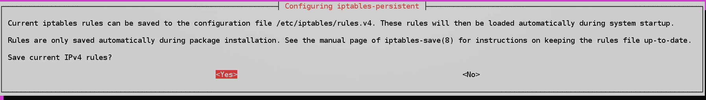

# 第三章：使用防火墙保护您的服务器

安全是最好分层处理的事情之一。我们称之为*深度安全*。因此，在任何公司网络上，您都会发现一个防火墙设备将互联网与**非军事区**（**DMZ**）分开，您的面向互联网的服务器就在其中。您还会在 DMZ 和内部局域网之间发现防火墙设备，并在每台独立的服务器和客户端上安装防火墙软件。我们希望尽可能地让入侵者难以到达我们网络中的最终目的地。

有趣的是，尽管所有主要的 Linux 发行版中，只有 SUSE 发行版和 Red Hat 类型的发行版已经设置并启用了防火墙。当您查看您的 Ubuntu 虚拟机时，您会发现它是完全开放的，就好像它在热烈欢迎任何潜在的入侵者一样。

由于本书的重点是加固我们的 Linux 服务器，我们将把本章重点放在我们服务器和客户端上的最后一道防线，即防火墙上。

在本章中，我们将涵盖：

+   iptables 的概述

+   Ubuntu 系统的 Uncomplicated Firewall

+   Red Hat 系统的 firewalld

+   nftables，一种更通用的防火墙系统

# iptables 的概述

一个常见的误解是 iptables 是 Linux 防火墙的名称。实际上，Linux 防火墙的名称是**netfilter**，每个 Linux 发行版都内置了它。我们所知道的 iptables 只是我们可以用来管理 netfilter 的几个命令行实用程序之一。它最初是作为 Linux 内核 2.6 版本的一个功能引入的，所以它已经存在了很长时间。使用 iptables，您确实有一些优势：

+   它已经存在了足够长的时间，以至于大多数 Linux 管理员已经知道如何使用它

+   在 shell 脚本中使用 iptables 命令创建自己的自定义防火墙配置很容易

+   它具有很大的灵活性，您可以使用它来设置一个简单的端口过滤器、路由器或虚拟专用网络

+   它预装在几乎每个 Linux 发行版上，尽管大多数发行版不会预先配置它

+   它有很好的文档，可以在互联网上免费获得书籍长度的教程

但是，您可能知道，也有一些缺点：

+   IPv4 和 IPv6 需要它们自己特殊的 iptables 实现。因此，如果您的组织在迁移到 IPv6 的过程中仍需要运行 IPv4，您将不得不在每台服务器上配置两个防火墙，并为每个运行单独的守护程序（一个用于 IPv4，另一个用于 IPv6）。

+   如果您需要进行需要**ebtables**的 Mac 桥接，这是 iptables 的第三个组件，具有自己独特的语法。

+   arptables，iptables 的第四个组件，也需要自己的守护程序和语法。

+   每当您向正在运行的 iptables 防火墙添加规则时，整个 iptables 规则集都必须重新加载，这可能会对性能产生巨大影响。

直到最近，iptables 是每个 Linux 发行版上的默认防火墙管理器。大多数发行版仍然是如此，但 Red Hat Enterprise Linux 7 及其所有后代现在使用了一种称为**firewalld**的新技术。Ubuntu 自带**Uncomplicated Firewall**（**ufw**），这是一个易于使用的 iptables 前端。我们将在本章末尾探讨一种更新的技术**nftables**。

本章的目的是只看 iptables 的 IPv4 组件。（IPv6 组件的语法会非常相似。）

# iptables 的基本用法

iptables 由四个规则表组成，每个表都有自己独特的目的：

+   **过滤表**：对于我们的服务器和客户端的基本保护，这是我们通常会使用的唯一表

+   **NAT 表**：**网络地址转换**（**NAT**）用于将公共互联网连接到私有网络

+   **篡改表**：这用于在网络数据包通过防火墙时进行更改

+   **安全表**：安全表仅用于安装了 SELinux 的系统

由于我们目前只对基本主机保护感兴趣，我们只会查看过滤器表。每个表由规则链组成，过滤器表由`INPUT`，`FORWARD`和`OUTPUT`链组成。由于我们的 CentOS 7 机器使用 Red Hat 的 firewalld，我们将在我们的 Ubuntu 机器上查看这个。

虽然 Red Hat Enterprise Linux 7 及其后代确实已经安装了 iptables，但默认情况下已禁用，以便我们可以使用 firewalld。不可能同时运行 iptables 和 firewalld，因为它们是两种完全不兼容的完全不同的动物。因此，如果您需要在 Red Hat 7 系统上运行 iptables，可以这样做，但必须首先禁用 firewalld。

然而，如果您的组织仍在使用 Red Hat 或 CentOS 的第 6 版运行其网络，则您的机器仍在使用 iptables，因为 firewalld 对它们不可用。

我们将首先使用`sudo iptables -L`命令查看当前配置：

```
donnie@ubuntu:~$ sudo iptables -L
[sudo] password for donnie:
Chain INPUT (policy ACCEPT)
target prot opt source destination

Chain FORWARD (policy ACCEPT)
target prot opt source destination

Chain OUTPUT (policy ACCEPT)
target prot opt source destination
donnie@ubuntu:~$
```

而且请记住，我们说您需要一个独立的 iptables 组件来处理 IPv6。在这里，我们将使用`sudo ip6tables -L`命令：

```
donnie@ubuntu:~$ sudo ip6tables -L
Chain INPUT (policy ACCEPT)
target     prot opt source               destination

Chain FORWARD (policy ACCEPT)
target     prot opt source               destination

Chain OUTPUT (policy ACCEPT)
target     prot opt source               destination
donnie@ubuntu:~$

```

在这两种情况下，您会看到没有规则，并且机器是完全开放的。与 SUSE 和 Red Hat 的人不同，Ubuntu 的人希望您自己设置防火墙。我们将首先创建一个规则，允许来自我们的主机请求连接的服务器的传入数据包通过：

```
sudo iptables -A INPUT -m conntrack --ctstate ESTABLISHED,RELATED -j ACCEPT
```

这是这个命令的分解：

+   `-A INPUT`：`-A`将规则放在指定链的末尾，本例中是`INPUT`链。如果我们想要将规则放在链的开头，我们将使用`-I`。

+   `-m`：这调用了一个 iptables 模块。在这种情况下，我们调用`conntrack`模块来跟踪连接状态。这个模块允许 iptables 确定我们的客户端是否与另一台机器建立了连接。

+   `--ctstate`：我们的规则的`ctstate`或连接状态部分正在寻找两件事。首先，它正在寻找客户端与服务器建立的连接。然后，它寻找从服务器返回的相关连接，以允许它连接到客户端。因此，如果用户使用 Web 浏览器连接到网站，此规则将允许来自 Web 服务器的数据包通过防火墙传递到用户的浏览器。

+   `-j`：这代表*jump*。规则跳转到特定目标，本例中是`ACCEPT`。（请不要问我是谁想出了这个术语。）因此，此规则将接受从客户端请求连接的服务器返回的数据包。

我们的新规则集如下：

```
donnie@ubuntu:~$ sudo iptables -L
Chain INPUT (policy ACCEPT)
target prot opt source destination
ACCEPT all -- anywhere anywhere ctstate RELATED,ESTABLISHED

Chain FORWARD (policy ACCEPT)
target prot opt source destination

Chain OUTPUT (policy ACCEPT)
target prot opt source destination
donnie@ubuntu:~$
```

接下来，我们将打开端口`22`，以便允许我们通过安全外壳进行连接。目前，我们不想打开更多的端口，所以我们将以阻止其他所有内容的规则结束：

```
sudo iptables -A INPUT -p tcp --dport ssh -j ACCEPT
sudo iptables -A INPUT -j DROP
```

这是分解：

+   `-A INPUT`：与以前一样，我们希望使用`-A`将此规则放在 INPUT 链的末尾。

+   `-p tcp`：`-p`表示此规则影响的协议。此规则影响 TCP 协议，其中安全外壳是其中的一部分。

+   `--dport ssh`：当选项名称由多个字母组成时，我们需要在其前面加上两个破折号，而不是一个。`--dport`选项指定我们希望此规则操作的目标端口。（请注意，我们也可以将规则的这部分列为`--dport 22`，因为`22`是 SSH 端口的编号。）

+   `-j ACCEPT`：将所有内容与`-j ACCEPT`放在一起，我们就有了一个允许其他机器通过安全外壳连接到这台机器的规则。

+   最后的`DROP`规则悄悄地阻止所有未经特别允许的连接和数据包。

实际上，我们可以以两种方式编写最终的阻止规则：

+   `sudo iptables -A INPUT -j DROP`：它会导致防火墙默默地阻止数据包，而不会向这些数据包的源发送任何通知。

+   `sudo iptables -A INPUT -j REJECT`：它也会导致防火墙阻止数据包，但它还会向源发送有关数据包被阻止的消息。一般来说，最好使用`DROP`，因为我们通常希望使恶意行为者更难以弄清楚我们的防火墙配置。

无论哪种方式，您总是希望将此规则放在链的末尾，因为在它之后的任何`ALLOW`规则都将不起作用。

最后，我们对`INPUT`链有了一个几乎完整的、可用的规则集：

```
donnie@ubuntu:~$ sudo iptables -L
Chain INPUT (policy ACCEPT)
target     prot opt source               destination
ACCEPT     all  --  anywhere             anywhere             ctstate RELATED,ESTABLISHED
ACCEPT     tcp  --  anywhere             anywhere             tcp dpt:ssh
DROP       all  --  anywhere             anywhere

Chain FORWARD (policy ACCEPT)
target     prot opt source               destination

Chain OUTPUT (policy ACCEPT)
target     prot opt source               destination
donnie@ubuntu:~$
```

它几乎完成了，因为还有一件小事我们忘了。也就是说，我们需要允许环回接口的流量。这没关系，因为这给了我们一个很好的机会，看看如果我们不想把它放在最后，我们如何在想要的位置插入规则。在这种情况下，我们将在`INPUT 1`处插入规则，这是`INPUT`链的第一个位置：

```
sudo iptables -I INPUT 1 -i lo -j ACCEPT
```

当我们查看我们的新规则集时，我们会看到一些非常奇怪的东西：

```
donnie@ubuntu:~$ sudo iptables -L
Chain INPUT (policy ACCEPT)
target prot opt source destination
ACCEPT all -- anywhere anywhere
ACCEPT all -- anywhere anywhere ctstate RELATED,ESTABLISHED
ACCEPT tcp -- anywhere anywhere tcp dpt:ssh
DROP all -- anywhere anywhere

Chain FORWARD (policy ACCEPT)
target prot opt source destination

Chain OUTPUT (policy ACCEPT)
target prot opt source destination
donnie@ubuntu:~$
```

嗯...

第一条规则和最后一条规则看起来是一样的，只是一个是`DROP`，另一个是`ACCEPT`。让我们再次使用`-v`选项查看一下：

```
donnie@ubuntu:~$ sudo iptables -L -v
Chain INPUT (policy ACCEPT 0 packets, 0 bytes)
 pkts bytes target     prot opt in     out     source               destination
 0     0 ACCEPT     all  --  lo     any     anywhere             anywhere
 393 25336 ACCEPT     all  --  any    any     anywhere             anywhere             ctstate RELATED,ESTABLISHED
 0     0 ACCEPT     tcp  --  any    any     anywhere             anywhere             tcp dpt:ssh
 266 42422 DROP       all  --  any    any     anywhere             anywhere

Chain FORWARD (policy ACCEPT 0 packets, 0 bytes)
 pkts bytes target     prot opt in     out     source               destination

Chain OUTPUT (policy ACCEPT 72 packets, 7924 bytes)
 pkts bytes target     prot opt in     out     source               destination
donnie@ubuntu:~$
```

现在，我们看到`lo`，即环回，出现在第一条规则的`in`列下，`any`出现在最后一条规则的`in`列下。这一切看起来很不错，除了如果我们现在重新启动机器，规则将消失。我们需要做的最后一件事是使它们永久。有几种方法可以做到这一点，但在 Ubuntu 机器上最简单的方法是安装`iptables-persistent`软件包：

```
sudo apt install iptables-persistent
```

在安装过程中，您将看到两个屏幕，询问您是否要保存当前的 iptables 规则集。第一个屏幕将用于 IPv4 规则，第二个屏幕将用于 IPv6 规则：



现在，您将在`/etc/iptables`目录中看到两个新的规则文件：

```
donnie@ubuntu:~$ ls -l /etc/iptables*
total 8
-rw-r--r-- 1 root root 336 Oct 10 10:29 rules.v4
-rw-r--r-- 1 root root 183 Oct 10 10:29 rules.v6
donnie@ubuntu:~$
```

如果您现在重新启动机器，您会看到您的 iptables 规则仍然存在并生效。

# 基本 iptables 用法的实验室

您将在您的 Ubuntu 虚拟机上进行此实验室。

1.  关闭您的 Ubuntu 虚拟机，并创建一个快照。

您将在下一节的实验室中回滚到此快照。

1.  使用以下命令查看您的 iptables 规则，或者缺少规则：

```
 sudo iptables -L
```

1.  创建您需要的基本防火墙规则，允许安全外壳访问，但拒绝其他所有内容：

```
 sudo iptables -A INPUT -m conntrack 
                                      --ctstate ESTABLISHED,RELATED
                      -j ACCEPT
 sudo iptables -A INPUT -p tcp --dport ssh -j ACCEPT
 sudo iptables -A INPUT -j DROP
```

1.  使用以下命令查看结果：

```
 sudo iptables -L
```

1.  哎呀，看来您忘记了环回接口。在列表顶部为其添加一个规则：

```
 sudo iptables -I INPUT 1 -i lo -j ACCEPT
```

1.  使用这两个命令查看结果。注意每个输出之间的差异：

```
 sudo iptables -L
 sudo iptables -L -v
```

1.  安装`iptables-persistent`软件包，并在提示时选择保存 IPv4 和 IPv6 规则：

```
         sudo apt install iptables-persistent
```

1.  重新启动虚拟机，并验证您的规则是否仍然有效。

1.  实验室结束。

现在，我知道你在想，“*哇，为了设置一个基本防火墙，要跳过这么多环节*。”是的，你是对的。所以，请给我一点时间来摆脱我刚刚用 iptables 做的事情，我会向您展示 Ubuntu 人民是如何简化事情的。

您可以在这里了解如何在 Ubuntu 上使用 iptables 的全部信息：[`help.ubuntu.com/community/IptablesHowTo`](https://help.ubuntu.com/community/IptablesHowTo)。

# Ubuntu 系统的 Uncomplicated Firewall

Uncomplicated Firewall 已经安装在您的 Ubuntu 机器上。它仍然使用 iptables 服务，但提供了一组大大简化的命令。执行一个简单的命令来启用它，您就有了一个良好的、预配置的防火墙。桌面机器上有一个图形化的前端，但由于我们正在学习服务器安全性，我们只会在这里介绍命令行实用程序。

# ufw 的基本用法

ufw 默认处于禁用状态，因此您需要启用它：

```
donnie@ubuntu:~$ sudo ufw enable
Command may disrupt existing ssh connections. Proceed with operation (y|n)? y
Firewall is active and enabled on system startup
donnie@ubuntu:~$
```

为了做到这一点，我从我信任的 OpenSUSE 工作站的终端远程登录到了虚拟机。它警告我说我的安全 Shell 连接可能会中断，但并没有发生。 （这可能是因为连接跟踪规则，也可能是我运气好。）我会留给你去运行`sudo iptables -L`，因为 ufw 创建了一个非常庞大的默认规则集，这在这本书中是不可能显示的。

接下来，让我们添加一条规则，以便将来可以通过安全 Shell 进行远程连接：

```
sudo ufw allow 22/tcp
```

运行`sudo iptables -L`，你会看到新规则出现在`ufw-user-input`链中：

```
Chain ufw-user-input (1 references)
target     prot opt source               destination
ACCEPT     tcp  --  anywhere             anywhere             tcp dpt:ssh
```

在前面的`sudo ufw allow 22/tcp`命令中，我们必须指定 TCP 协议，因为 TCP 是我们安全 Shell 所需的。我们也可以只通过不指定协议来为 TCP 和 UDP 打开端口。例如，如果你正在设置 DNS 服务器，你会希望为两种协议打开端口`53`（你会看到端口`53`的条目列为`domain`端口）：

```
sudo ufw allow 53

Chain ufw-user-input (1 references)
target     prot opt source               destination
ACCEPT     tcp  --  anywhere             anywhere             tcp dpt:ssh
ACCEPT     tcp  --  anywhere             anywhere             tcp dpt:domain
ACCEPT     udp  --  anywhere             anywhere             udp dpt:domain
```

如果你运行`sudo ip6tables -L`，你会看到 IPv6 的规则也被添加到了前面两个示例中。

# 基本 ufw 使用的实验。

你将在你的 Ubuntu 虚拟机的干净快照上进行这个实验：

1.  关闭你的 Ubuntu 虚拟机并恢复快照。（你要这样做是为了摆脱你刚刚做的所有 iptables 的东西。）

1.  当你重新启动虚拟机后，验证 iptables 规则现在已经消失：

```
 sudo iptables -L
```

1.  查看 ufw 的状态，启用它，并查看结果：

```
 sudo ufw status
 sudo ufw enable
 sudo ufw status
 sudo iptables -L
 sudo ip6tables -L
```

1.  打开`22/tcp`端口以允许安全 Shell 访问：

```
 sudo ufw allow 22/tcp
 sudo iptables -L
 sudo ip6tables -L
```

1.  这次，为 TCP 和 UDP 同时打开端口`53`：

```
        sudo ufw allow 53
 sudo iptables -L
 sudo ip6tables -L
```

1.  实验结束。

# Red Hat 系统的 firewalld

到目前为止，我们已经看过 iptables，这是一个通用的防火墙管理系统，适用于所有的 Linux 发行版，以及 ufw，它只适用于 Ubuntu。接下来，我们将把注意力转向**firewalld**，它是专门针对 Red Hat Enterprise Linux 7 及其所有后代的。

与 Ubuntu 的 ufw 不同，firewalld 不仅仅是 iptables 的易于使用的前端。相反，它是一个全新的防火墙业务方式，并且与 iptables 不兼容。不过，要明白的是，iptables 仍然安装在 Red Hat 7 系列上，但没有启用，因为你不能同时启用 iptables 和 firewalld。如果你必须使用利用 iptables 的旧 shell 脚本，你可以禁用 firewalld 并启用 iptables。

iptables 和 firewalld 不兼容的原因是，iptables 将其规则存储在`/etc/sysconfig`目录中的纯文本文件中，而 firewalld 将其规则文件存储在`/etc/firewalld`目录和`/usr/lib/firewalld`目录中的`.xml`格式文件中。此外，iptables 不理解 firewalld 所理解的区域和服务的概念，规则本身的格式也完全不同。因此，即使你可以同时运行 iptables 和 firewalld，你最终只会混淆系统并破坏防火墙。

关键是，你可以在 Red Hat 或 CentOS 机器上运行 iptables 或 firewalld，但不能同时运行两者。

如果你在桌面机上运行 Red Hat 或 CentOS，你会在应用程序菜单中看到有一个 firewalld 的 GUI 前端。然而，在文本模式服务器上，你只能使用 firewalld 命令。出于某种原因，Red Hat 的人们没有为文本模式服务器创建一个类似 ncurses 的程序，就像他们在旧版本的 Red Hat 上为 iptables 配置所做的那样。

firewalld 的一个重要优势是它是动态管理的。这意味着你可以在不重启防火墙服务的情况下更改防火墙配置，并且不会中断到服务器的任何现有连接。

# 验证 firewalld 的状态

让我们首先验证 firewalld 的状态。有两种方法可以做到这一点。我们可以使用`firewall-cmd`的`--state`选项：

```
[donnie@localhost ~]$ sudo firewall-cmd --state
running
[donnie@localhost ~]$
```

或者，如果我们想要更详细的状态，我们可以像检查 systemd 机器上的任何其他守护程序一样检查守护程序：

```
[donnie@localhost ~]$ sudo systemctl status firewalld
● firewalld.service - firewalld - dynamic firewall daemon
 Loaded: loaded (/usr/lib/systemd/system/firewalld.service; enabled; vendor preset: enabled)
 Active: active (running) since Fri 2017-10-13 13:42:54 EDT; 1h 56min ago
 Docs: man:firewalld(1)
 Main PID: 631 (firewalld)
 CGroup: /system.slice/firewalld.service
 └─631 /usr/bin/python -Es /usr/sbin/firewalld --nofork --nopid

Oct 13 13:42:55 localhost.localdomain firewalld[631]: WARNING: ICMP type 'reject-route' is not supported by the kernel for ipv6.
Oct 13 13:42:55 localhost.localdomain firewalld[631]: WARNING: reject-route: INVALID_ICMPTYPE: No supported ICMP type., ignoring for run-time.
Oct 13 15:19:41 localhost.localdomain firewalld[631]: WARNING: ICMP type 'beyond-scope' is not supported by the kernel for ipv6.
Oct 13 15:19:41 localhost.localdomain firewalld[631]: WARNING: beyond-scope: INVALID_ICMPTYPE: No supported ICMP type., ignoring for run-time.
Oct 13 15:19:41 localhost.localdomain firewalld[631]: WARNING: ICMP type 'failed-policy' is not supported by the kernel for ipv6.
Oct 13 15:19:41 localhost.localdomain firewalld[631]: WARNING: failed-policy: INVALID_ICMPTYPE: No supported ICMP type., ignoring for run-time.
Oct 13 15:19:41 localhost.localdomain firewalld[631]: WARNING: ICMP type 'reject-route' is not supported by the kernel for ipv6.
Oct 13 15:19:41 localhost.localdomain firewalld[631]: WARNING: reject-route: INVALID_ICMPTYPE: No supported ICMP type., ignoring for run-time.
[donnie@localhost ~]$
```

# firewalld 区域

firewalld 是一个相当独特的工具，因为它带有几个预配置的区域和服务。如果您查看您的 CentOS 机器的`/usr/lib/firewalld/zones`目录，您将看到以`.xml`格式的区域文件：

```
[donnie@localhost ~]$ cd /usr/lib/firewalld/zones
[donnie@localhost zones]$ ls
block.xml dmz.xml drop.xml external.xml home.xml internal.xml public.xml trusted.xml work.xml
[donnie@localhost zones]$
```

每个区域文件都指定了要打开的端口以及要为各种给定情况阻止的端口。区域还可以包含有关 ICMP 消息、转发端口、伪装信息和丰富语言规则的规则。

例如，公共区域的`.xml`文件，它被设置为默认值，看起来像这样：

```
<?xml version="1.0" encoding="utf-8"?>
<zone>
  <short>Public</short>
  <description>For use in public areas. You do not trust the other computers on networks to not harm your computer. Only selected incoming connections are accepted.</description>
  <service name="ssh"/>
  <service name="dhcpv6-client"/>
</zone>
```

在`service name`行中，您可以看到唯一打开的端口是用于安全外壳访问和用于 DHCPv6 发现的端口。查看`home.xml`文件，您将看到它还打开了用于多播 DNS 的端口，以及允许此计算机从 Samba 服务器或 Windows 服务器访问共享目录的端口：

```
<?xml version="1.0" encoding="utf-8"?>
<zone>
  <short>Home</short>
  <description>For use in home areas. You mostly trust the other computers on networks to not harm your computer. Only selected incoming connections are accepted.</description>
  <service name="ssh"/>
  <service name="mdns"/>
  <service name="samba-client"/>
  <service name="dhcpv6-client"/>
</zone>
```

`firewall-cmd`实用程序是您用于配置 firewalld 的工具。您可以使用它查看系统上区域文件的列表，而无需`cd`到区域文件目录中：

```
[donnie@localhost ~]$ sudo firewall-cmd --get-zones
[sudo] password for donnie:
block dmz drop external home internal public trusted work
[donnie@localhost ~]$
```

查看每个区域配置的快速方法是使用`--list-all-zones`选项：

```
[donnie@localhost ~]$ sudo firewall-cmd --list-all-zones
block
 target: %%REJECT%%
 icmp-block-inversion: no
 interfaces:
 sources:
 services:
 ports:
 protocols:
 masquerade: no
 forward-ports:
 source-ports:
 icmp-blocks:
 rich rules:
, , ,
, , ,
```

当然，这只是输出的一部分，因为所有区域的列表超出了我们可以在这里显示的范围。更有可能的是，您只想查看有关特定区域的信息：

```
[donnie@localhost ~]$ sudo firewall-cmd --info-zone=internal
internal
 target: default
 icmp-block-inversion: no
 interfaces:
 sources:
 services: ssh mdns samba-client dhcpv6-client
 ports:
 protocols:
 masquerade: no
 forward-ports:
 source-ports:
 icmp-blocks:
 rich rules:

[donnie@localhost ~]$
```

因此，`internal`区域允许`ssh`、`mdns`、`samba-client`和`dhcpv6-client`服务。这对于在内部局域网上设置客户端机器非常方便。

任何给定的服务器或客户端都将安装一个或多个网络接口适配器。机器中的每个适配器可以分配一个且仅一个 firewalld 区域。要查看默认区域：

```
[donnie@localhost ~]$ sudo firewall-cmd --get-default-zone
public
[donnie@localhost ~]$
```

这很好，但它并没有告诉您与该区域关联的任何网络接口的信息。要查看该信息：

```
[donnie@localhost ~]$ sudo firewall-cmd --get-active-zones
public
 interfaces: enp0s3
[donnie@localhost ~]$
```

当您首次安装 Red Hat 或 CentOS 时，防火墙将已经处于活动状态，并且公共区域将作为默认值。现在，假设您正在将服务器设置在 DMZ 中，并且希望确保其防火墙针对此进行了锁定。您可以将默认区域更改为`dmz`区域。让我们看看`dmz.xml`文件，看看它对我们有什么作用：

```
<?xml version="1.0" encoding="utf-8"?>
<zone>
  <short>DMZ</short>
  <description>For computers in your demilitarized zone that are publicly-accessible with limited access to your internal network. Only selected incoming connections are accepted.</description>
  <service name="ssh"/>
</zone>
```

因此，DMZ 允许的唯一事物是安全外壳。好的，现在足够了，让我们将`dmz`区域设置为默认值：

```
[donnie@localhost ~]$ sudo firewall-cmd --set-default-zone=dmz
[sudo] password for donnie:
success
[donnie@localhost ~]$
```

我们将验证：

```
[donnie@localhost ~]$ sudo firewall-cmd --get-default-zone
dmz
[donnie@localhost ~]$
```

我们一切都很好。除了在 DMZ 中面向互联网的服务器可能需要做的不仅仅是允许 SSH 连接。这就是我们将使用 firewalld 服务的地方。但是，在我们看看之前，让我们考虑另一个重要的问题。

不要修改`/usr/lib/firewalld`目录中的文件。每当您修改 firewalld 配置时，您会看到修改后的文件出现在`/etc/firewalld`目录中。到目前为止，我们只修改了默认区域。因此，我们将在`/etc/firewalld`中看到这个：

```
[donnie@localhost ~]$ sudo ls -l /etc/firewalld
total 12
-rw-------. 1 root root 2003 Oct 11 17:37 firewalld.conf
-rw-r--r--. 1 root root 2006 Aug 4 17:14 firewalld.conf.old
. . .
```

我们可以对这两个文件进行`diff`，以查看它们之间的差异：

```
[donnie@localhost ~]$ sudo diff /etc/firewalld/firewalld.conf /etc/firewalld/firewalld.conf.old
6c6
< DefaultZone=dmz
---
> DefaultZone=public
[donnie@localhost ~]$
```

因此，这两个文件中较新的文件显示`dmz`区域现在是默认区域。

要获取有关 firewalld 区域的更多信息，请输入：

`man firewalld.zones`

# firewalld 服务

每个服务文件都包含需要为特定服务打开的端口列表。可选地，服务文件可能包含一个或多个目标地址，或调用任何所需的模块，例如用于连接跟踪。对于某些服务，您只需要打开一个端口。其他服务，例如 Samba 服务，需要打开多个端口。无论哪种方式，有时记住与每个服务相关的服务名称比端口号更方便。

服务文件位于`/usr/lib/firewalld/services`目录中。您可以使用`firewall-cmd`命令查看它们的列表，就像您可以查看区域列表一样：

```
[donnie@localhost ~]$ sudo firewall-cmd --get-services
[sudo] password for donnie:
RH-Satellite-6 amanda-client amanda-k5-client bacula bacula-client bitcoin bitcoin-rpc bitcoin-testnet bitcoin-testnet-rpc ceph ceph-mon cfengine condor-collector ctdb dhcp dhcpv6 dhcpv6-client dns docker-registry dropbox-lansync elasticsearch freeipa-ldap freeipa-ldaps freeipa-replication freeipa-trust ftp ganglia-client ganglia-master high-availability http https imap imaps ipp ipp-client ipsec iscsi-target kadmin kerberos kibana klogin kpasswd kshell ldap ldaps libvirt libvirt-tls managesieve mdns mosh mountd ms-wbt mssql mysql nfs nrpe ntp openvpn ovirt-imageio ovirt-storageconsole ovirt-vmconsole pmcd pmproxy pmwebapi pmwebapis pop3 pop3s postgresql privoxy proxy-dhcp ptp pulseaudio puppetmaster quassel radius rpc-bind rsh rsyncd samba samba-client sane sip sips smtp smtp-submission smtps snmp snmptrap spideroak-lansync squid ssh synergy syslog syslog-tls telnet tftp tftp-client tinc tor-socks transmission-client vdsm vnc-server wbem-https xmpp-bosh xmpp-client xmpp-local xmpp-server
[donnie@localhost ~]$
```

`dropbox-lansync`服务对我们 Dropbox 用户非常有用。让我们看看这打开了哪些端口：

```
[donnie@localhost ~]$ sudo firewall-cmd --info-service=dropbox-lansync
[sudo] password for donnie:
dropbox-lansync
 ports: 17500/udp 17500/tcp
 protocols:
 source-ports:
 modules:
 destination:
[donnie@localhost ~]$
```

看起来 Dropbox 使用端口`17500` UDP 和 TCP。

现在，假设我们在 DMZ 中设置了我们的 Web 服务器，并将`dmz`区域设置为其默认值：

```
[donnie@localhost ~]$ sudo firewall-cmd --info-zone=dmz
dmz (active)
 target: default
 icmp-block-inversion: no
 interfaces: enp0s3
 sources:
 services: ssh
 ports:
 protocols:
 masquerade: no
 forward-ports:
 source-ports:
 icmp-blocks:
 rich rules:

[donnie@localhost ~]$
```

正如我们之前看到的，只有安全外壳端口是打开的。让我们修复一下，以便用户实际访问我们的网站：

```
[donnie@localhost ~]$ sudo firewall-cmd --add-service=http
success
[donnie@localhost ~]$
```

当我们再次查看`dmz`区域的信息时，我们会看到：

```
[donnie@localhost ~]$ sudo firewall-cmd --info-zone=dmz
dmz (active)
 target: default
 icmp-block-inversion: no
 interfaces: enp0s3
 sources:
 services: ssh http
 ports:
 protocols:
 masquerade: no
 forward-ports:
 source-ports:
 icmp-blocks:
 rich rules:

[donnie@localhost ~]$
```

我们看到`http`服务现在是允许的。但是当我们在`info`命令中添加`--permanent`选项时会发生什么：

```
[donnie@localhost ~]$ sudo firewall-cmd --permanent --info-zone=dmz
dmz
 target: default
 icmp-block-inversion: no
 interfaces:
 sources:
 services: ssh
 ports:
 protocols:
 masquerade: no
 forward-ports:
 source-ports:
 icmp-blocks:
 rich rules:
[donnie@localhost ~]$
```

糟糕！`http`服务不在这里。怎么回事？

对于任何命令行对区域或服务的更改，您都需要添加`--permanent`选项，以使更改在重新启动后持久生效。但是，如果没有`--permanent`选项，更改将立即生效。有了`--permanent`选项，您必须重新加载防火墙配置才能使更改生效。为了演示，我将重新启动虚拟机以摆脱`http`服务。

好的，我已经重新启动，`http`服务现在已经消失了：

```
[donnie@localhost ~]$ sudo firewall-cmd --info-zone=dmz
[sudo] password for donnie:
dmz (active)
 target: default
 icmp-block-inversion: no
 interfaces: enp0s3
 sources:
 services: ssh
 ports:
 protocols:
 masquerade: no
 forward-ports:
 source-ports:
 icmp-blocks:
 rich rules:

[donnie@localhost ~]$
```

这次，我将使用一个命令添加两个服务，并指定更改为永久性：

```
[donnie@localhost ~]$ sudo firewall-cmd --permanent --add-service={http,https}
[sudo] password for donnie:
success
[donnie@localhost ~]$
```

您可以使用单个命令添加尽可能多的服务，但是您必须用逗号分隔它们，并在一对花括号中将整个列表括起来。让我们看看结果：

```
[donnie@localhost ~]$ sudo firewall-cmd --info-zone=dmz
dmz (active)
 target: default
 icmp-block-inversion: no
 interfaces: enp0s3
 sources:
 services: ssh
 ports:
 protocols:
 masquerade: no
 forward-ports:
 source-ports:
 icmp-blocks:
 rich rules:

[donnie@localhost ~]$
```

自从我们决定将此配置变为永久性后，它还没有生效。但是，如果我们在`--info-zone`命令中添加`--permanent`选项，我们会看到配置文件确实已经更改：

```
[donnie@localhost ~]$ sudo firewall-cmd --permanent --info-zone=dmz
dmz
 target: default
 icmp-block-inversion: no
 interfaces:
 sources:
 services: ssh http https
 ports:
 protocols:
 masquerade: no
 forward-ports:
 source-ports:
 icmp-blocks:
 rich rules:

[donnie@localhost ~]$
```

现在，我们需要通过重新加载配置来使更改生效：

```
[donnie@localhost ~]$ sudo firewall-cmd --reload
success
[donnie@localhost ~]$
```

再次运行`sudo firewall-cmd --info-zone=dmz`命令，您将看到新配置现在已生效。

要从区域中删除服务，只需用`--remove-service`替换`--add-service`。

请注意，在所有这些服务命令中，我们从未指定我们正在处理的区域。这是因为如果我们不指定区域，firewalld 会假定我们正在处理默认区域。如果要将服务添加到除默认区域以外的其他区域，只需在命令中添加`--zone=`选项。

# 向 firewalld 区域添加端口

拥有服务文件很方便，只是并非您需要运行的每个服务都有自己预定义的服务文件。假设您在服务器上安装了 Webmin，它需要打开端口`10000/tcp`。快速的`grep`操作将显示端口`10000`不在我们预定义的任何服务中：

```
donnie@localhost services]$ pwd
/usr/lib/firewalld/services
[donnie@localhost services]$ grep '10000' *
[donnie@localhost services]$
```

因此，让我们将该端口添加到我们的默认区域，即`dmz`区域：

```
donnie@localhost ~]$ sudo firewall-cmd --add-port=10000/tcp
[sudo] password for donnie:
success
[donnie@localhost ~]$
```

同样，这不是永久性的，因为我们没有包括`--permanent`选项。让我们再做一次，然后重新加载：

```
[donnie@localhost ~]$ sudo firewall-cmd --permanent --add-port=10000/tcp
success
[donnie@localhost ~]$ sudo firewall-cmd --reload
success
[donnie@localhost ~]$
```

您还可以通过在一对花括号中包含逗号分隔的列表一次添加多个端口，就像我们在服务中所做的那样（是的，我故意没有加上`--permanent`）：

```
[donnie@localhost ~]$ sudo firewall-cmd --add-port={636/tcp,637/tcp,638/udp}
success
[donnie@localhost ~]$
```

当然，您也可以用`--remove-port`替换`--add-port`来从区域中删除端口。

# firewalld 丰富的语言规则

到目前为止，我们所看到的可能是您在一般使用场景中所需的全部内容，但是，为了更精细的控制，您需要了解**丰富的语言规则**。（是的，这确实是它们的名称。）

与 iptables 规则相比，丰富的语言规则稍微不那么神秘，并且更接近普通英语。因此，如果您是新手编写防火墙规则，您可能会发现丰富的语言更容易学习。另一方面，如果您已经习惯编写 iptables 规则，您可能会发现丰富语言的某些元素有点古怪。让我们看一个例子：

```
sudo firewall-cmd --add-rich-rule='rule family="ipv4" source address="200.192.0.0/24" service name="http" drop'
```

因此，我们正在添加一个丰富的规则。请注意，整个规则被一对单引号包围，并且每个参数的分配值被一对双引号包围。使用此规则，我们正在说我们正在使用 IPv4，并且我们希望静默地阻止`http`端口接受来自`200.192.0.0/24`网络的数据包。我们没有使用`--permanent`选项，因此当我们重新启动机器时，此规则将消失。让我们看看我们的区域在添加了这条新规则后是什么样子：

```
[donnie@localhost ~]$ sudo firewall-cmd --info-zone=dmz
[sudo] password for donnie:
dmz (active)
 target: default
 icmp-block-inversion: no
 interfaces: enp0s3
 sources:
 services: ssh http https
 ports: 10000/tcp 636/tcp 637/tcp 638/udp
 protocols:
 masquerade: no
 forward-ports:
 source-ports:
 icmp-blocks:
 rich rules:
 rule family="ipv4" source address="200.192.0.0/24" service name="http" drop
[donnie@localhost ~]$
```

丰富的规则显示在底部。在我们测试了这条规则以确保它能够满足我们的需求之后，我们将使其永久化：

```
sudo firewall-cmd --permanent --add-rich-rule='rule family="ipv4" source address="200.192.0.0/24" service name="http" drop'

sudo firewall-cmd --reload
```

您可以轻松地通过将`family="ipv4"`替换为`family="ipv6"`并提供适当的 IPv6 地址范围来为 IPv6 编写规则。

有些规则是通用的，适用于 IPv4 或 IPv6。假设我们想要记录关于**网络时间协议**（**NTP**）数据包的消息，并且您希望每分钟记录不超过一条消息。创建该规则的命令如下：

```
sudo firewall-cmd --permanent --add-rich-rule='rule service name="ntp" audit limit value="1/m" accept'
```

当然，firewalld 丰富的语言规则还有很多内容，我们无法在这里全部呈现。但是，至少您现在知道了基础知识。有关更多信息，请参阅`man`页面：

```
man firewalld.richlanguage
```

# firewalld 命令的实践实验

通过这个实验，您将练习基本的 firewalld 命令：

1.  登录到您的 CentOS 7 虚拟机并运行以下命令。观察每个命令后的输出：

```
 sudo firewall-cmd --get-zones
 sudo firewall-cmd --get-default-zone
 sudo firewall-cmd --get-active-zones
```

1.  简要查看处理 firewalld 区域的`man`页面：

```
 man firewalld.zones
 man firewalld.zone
```

（是的，有两个。一个解释了区域配置文件，另一个解释了区域本身。）

1.  查看所有可用区域的配置信息：

```
 sudo firewall-cmd --list-all-zones
```

1.  查看预定义服务列表。然后，查看有关`dropbox-lansync`服务的信息：

```
 sudo firewall-cmd --get-services
 sudo firewall-cmd --info-service=dropbox-lansync
```

1.  将默认区域设置为`dmz`。查看有关该区域的信息，添加`http`和`https`服务，然后再次查看区域信息：

```
 sudo firewall-cmd --set-default-zone=dmz
 sudo firewall-cmd --permanent --add-service={http,https}
 sudo firewall-cmd --info-zone=dmz
 sudo firewall-cmd --permanent --info-zone=dmz
```

1.  重新加载防火墙配置，并再次查看区域信息。还要查看正在允许的服务列表：

```
 sudo firewall-cmd --reload
 sudo firewall-cmd --info-zone=dmz
 sudo firewall-cmd --list-services
```

1.  永久打开端口`10000/tcp`，并查看结果：

```
 sudo firewall-cmd --permanent --add-port=10000/tcp
 sudo firewall-cmd --list-ports
 sudo firewall-cmd --reload
 sudo firewall-cmd --list-ports
 sudo firewall-cmd --info-zone=dmz
```

1.  删除刚刚添加的端口：

```
 sudo firewall-cmd --permanent --remove-port=10000/tcp
 sudo firewall-cmd --reload
 sudo firewall-cmd --list-ports
 sudo firewall-cmd --info-zone=dmz
```

1.  查看 firewalld 的主要页面列表：

```
 apropos firewall
```

1.  实验结束。

# nftables-一种更通用的防火墙系统

现在让我们把注意力转向 nftables，这个新来的。那么，nftables 有什么优点？（是的，这是一个双关语。）

+   现在，您可以忘记需要单独的守护程序和实用程序来处理所有不同的网络组件。 iptables，ip6tables，ebtables 和 arptables 的功能现在都合并在一个整洁的软件包中。 nft 实用程序现在是您唯一需要的防火墙实用程序。

+   使用 nftables，您可以创建多维树来显示您的规则集。这使得故障排除变得更加容易，因为现在更容易跟踪数据包通过所有规则。

+   使用 iptables，默认情况下会安装过滤器、NAT、mangle 和安全表，无论您是否使用每个表。使用 nftables，您只创建您打算使用的表，从而提高性能。

+   与 iptables 不同，您可以在一条规则中指定多个操作，而不必为每个操作创建多个规则。

+   与 iptables 不同，新规则是原子性添加的。（这是说，不再需要重新加载整个规则集才能添加一个规则。）

+   nftables 具有自己的内置脚本引擎，允许您编写更高效和更易读的脚本。

+   如果您已经有很多仍然需要使用的 iptables 脚本，您可以安装一组实用程序，以帮助您将它们转换为 nftables 格式。

# nftables 表和链

如果您习惯于 iptables，您可能会认识到一些 nftables 术语。唯一的问题是，一些术语以不同的方式使用，具有不同的含义。这就是我所说的一些内容：

+   **Tables**: nftables 中的表指的是特定的协议家族。表类型有 ip、ip6、inet、arp、bridge 和 netdev。

+   **Chains**: nftables 中的链大致相当于 iptables 中的表。例如，在 nftables 中，你可以有 filter、route 或 NAT 链。

# 开始使用 nftables

让我们从 Ubuntu 虚拟机的干净快照开始，并安装 nftables 包。

nftables 的命令行实用程序是`nft`。你可以在 Bash shell 中执行`nft`命令，或者可以执行`sudo nft -i`以运行交互模式下的 nft。对于我们目前的演示，我们将在 Bash shell 中运行命令。

现在，让我们来看一下已安装的表的列表：

```
sudo apt install nftables
sudo nft list tables
```

嗯...你没有看到任何表，对吧？所以，让我们加载一些表。

如果你在`/etc`目录中查看`nftables.conf`文件，你会看到一个基本的 nft 防火墙配置的开端：

```
#!/usr/sbin/nft -f
flush ruleset
table inet filter {
        chain input {
                type filter hook input priority 0;

                # accept any localhost traffic
                iif lo accept

                # accept traffic originated from us
                ct state established,related accept

                # activate the following line to accept 
                  common local services
                # tcp dport { 22, 80, 443 } ct state new accept

                # accept neighbour discovery otherwise 
                  IPv6 connectivity breaks.
                ip6 nexthdr icmpv6 icmpv6 type { nd-neighbor-solicit,
                  nd-router-advert, nd-neighbor-advert } accept

                # count and drop any other traffic
                counter drop
        }
}
```

这是所有这些意思的分解：

+   `#!/usr/sbin/nft -f`: 虽然你可以用 nftables 命令创建普通的 Bash shell 脚本，但最好使用 nftables 附带的内置脚本引擎。这样，我们可以使我们的脚本更易读，并且不必在每个想要执行的命令前面输入`nft`。

+   `flush ruleset`: 我们想要从一个干净的状态开始，所以我们将清除已经加载的任何规则。

+   `table inet filter`: 这创建了一个 inet 家族的过滤器，适用于 IPv4 和 IPv6。这个表的名称是`filter`，但也可以是更具描述性的名称。

+   `chain input`: 在第一对花括号中，我们有一个名为`input`的链。（再次强调，名称可以更具描述性。）

+   `type filter hook input priority 0;`: 在接下来的一对花括号中，我们定义了我们的链，然后列出了规则。这个链被定义为`filter`类型。`hook input`表示这个链是用来处理传入的数据包的。因为这个链既有`hook`又有`priority`，所以它将直接接受来自网络堆栈的数据包。

+   最后，我们有一个非常基本的主机防火墙的标准规则，从`iif`规则开始，允许环回接口接受数据包（**iif**代表**输入接口**）。

+   接下来是标准的连接跟踪（`ct`）规则，它接受对这个主机发出的连接请求的流量。

+   然后，有一个被注释掉的规则，用于接受安全外壳和安全和非安全的网页流量。`ct state new`表示防火墙将允许其他主机在这些端口上启动与我们服务器的连接。

+   `ipv6`规则接受邻居发现数据包，允许 IPv6 功能。

+   最后的`counter drop`规则会默默地阻止所有其他流量，并计算它阻止的数据包和字节数。这是一个例子，说明一个规则可以执行两种不同的操作。

如果你的 Ubuntu 服务器上只需要一个基本的、简单的防火墙，最好的办法就是编辑`/etc/nftables.conf`文件以满足你自己的需求。首先，让我们从`tcp dport`行的前面删除注释符号，并且去掉`80`和`443`端口。现在这行应该是这样的：

```
tcp dport 22 ct state new accept
```

请注意，当你只打开一个端口时，你不需要将该端口号括在花括号中。当打开多个端口时，只需在花括号中包含逗号分隔的列表，第一个元素前面和最后一个元素后面留有空格。

加载配置文件，并查看结果：

```
sudo nft -f /etc/nftables.conf

donnie@ubuntu2:~$ sudo nft list table inet filter
table inet filter {
 chain input {
 type filter hook input priority 0; policy accept;
 iif lo accept
 ct state established,related accept
 tcp dport ssh ct state new accept
 ip6 nexthdr ipv6-icmp icmpv6 type { nd-router-advert, nd-neighbor-solicit, nd-neighbor-advert} accept
 counter packets 67 bytes 10490 drop
 }
}
donnie@ubuntu2:~$
```

现在，假设我们想要阻止某些 IP 地址到达这台机器的安全外壳端口。我们可以编辑文件，在打开`22`端口的规则之上放置一个`drop`规则。文件的相关部分将如下所示：

```
tcp dport 22 ip saddr { 192.168.0.7, 192.168.0.10 } drop
tcp dport 22 ct state new accept
```

重新加载文件后，我们将阻止来自两个不同 IPv4 地址的 SSH 访问。请注意，我们将`drop`规则放在`accept`规则之前，因为如果首先读取`accept`规则，`drop`规则将永远不会生效。

另一个非常酷的事情要注意的是，我们在同一个配置文件中混合了 IPv4（ip）规则和 IPv6（ip6）规则。这就是使用 inet 类型表的美妙之处。为了简单和灵活性，您应尽可能使用 inet 表，而不是单独的 ip 和 ip6 表。

大多数情况下，当您只需要一个简单的主机防火墙时，最好的选择就是使用此`nftables.conf`文件作为起点，并编辑文件以满足自己的需求。但是，有时您可能会发现命令行组件也很有用。

# 使用 nft 命令

使用 nft 实用程序有两种方法。您可以直接从 Bash shell 执行所有操作，每个要执行的操作之前都要加上 nft，然后是`nft`子命令。您还可以在交互模式下使用 nft。对于我们现在的目的，我们将使用 Bash shell。

让我们首先删除先前的配置，并创建一个 inet 表，因为我们希望它适用于 IPv4 和 IPv6。我们希望给它一个相当描述性的名称，所以让我们称之为`ubuntu_filter`：

```
sudo nft delete table inet filter
sudo nft list tables
sudo nft add table inet ubuntu_filter
sudo nft list tables
```

接下来，我们将在我们刚刚创建的表中添加一个`input`过滤器链。（请注意，由于我们是从 Bash shell 执行此操作，因此需要使用反斜杠转义分号。）

```
sudo nft add chain inet ubuntu_filter input { type filter hook input priority 0\; policy drop\; }
```

在此命令中，`ubuntu_filter`之后的第一个`input`是链的名称。（我们本可以给它一个更具描述性的名称，但目前，`input`就可以了。）在一对花括号内，我们正在为此链设置参数。

每个 nftables 协议族都有自己的一组钩子，定义了数据包的处理方式。目前，我们只关注 ip/ip6/inet 族，它们具有以下钩子：

+   预处理

+   输入

+   前进

+   产出

+   出口

其中，我们目前只关注输入和输出钩子，这将适用于过滤器类型链。通过为我们的输入链指定一个钩子和优先级，我们正在表示我们希望此链成为基本链，它将直接从网络堆栈接受数据包。您还会看到，某些参数必须以分号结尾，如果您从 Bash shell 运行命令，则需要用反斜杠转义分号。最后，我们正在指定默认策略为`drop`。如果我们没有指定`drop`作为默认策略，那么默认策略将是`accept`。

您输入的每个`nft`命令都会立即生效。因此，如果您远程执行此操作，一旦创建了具有默认`drop`策略的过滤器链，您将立即断开安全外壳连接。

有些人喜欢创建具有默认`accept`策略的链，然后在最后添加一个`drop`规则。其他人喜欢创建具有默认`drop`策略的链，然后在最后不添加 drop 规则。使用默认`accept`规则的优势在于，您可以远程执行这些防火墙命令，而不必担心被锁定。

验证链是否已添加，您应该会看到类似于此的内容：

```
donnie@ubuntu2:~$ sudo nft list table inet ubuntu_filter
[sudo] password for donnie:
table inet filter {
 chain input {
 type filter hook input priority 0; policy drop;
 }
}
donnie@ubuntu2:~$
```

这很好，但我们仍然需要一些规则。让我们从连接跟踪规则和打开安全外壳端口的规则开始。然后我们将验证它们是否已添加：

```
sudo nft add rule inet ubuntu_filter input ct state established accept
sudo nft add rule inet ubuntu_filter input tcp dport 22 ct state new accept

donnie@ubuntu2:~$ sudo nft list table inet ubuntu_filter
table inet ubuntu_filter {
 chain input {
 type filter hook input priority 0; policy drop;
 ct state established accept
 tcp dport ssh ct state new accept
 }
}
donnie@ubuntu2:~ 
```

好的，看起来不错。您现在有一个基本的工作防火墙，允许安全外壳连接。好吧，除了我们在 ufw 章节中所做的一样，我们忘记创建一个允许环回适配器接受数据包的规则。由于我们希望此规则位于规则列表的顶部，因此我们将使用`insert`而不是`add`：

```
sudo nft insert rule inet ubuntu_filter input iif lo accept

donnie@ubuntu2:~$ sudo nft list table inet ubuntu_filter
table inet ubuntu_filter {
 chain input {
 type filter hook input priority 0; policy drop;
 iif lo accept
 ct state established accept
 tcp dport ssh ct state new accept
 }
}
donnie@ubuntu2:~$
```

现在，我们已经准备就绪。但是，如果我们想在特定位置插入规则怎么办？为此，您需要使用带有`-a`选项的`list`来查看`handles`规则：

```
donnie@ubuntu2:~$ sudo nft list table inet ubuntu_filter -a
table inet ubuntu_filter {
 chain input {
 type filter hook input priority 0; policy drop;
 iif lo accept # handle 4
 ct state established accept # handle 2
 tcp dport ssh ct state new accept # handle 3
 }
}
donnie@ubuntu2:~$
```

正如您所看到的，句柄的编号没有真正的规律或原因。假设我们想要插入一个关于阻止某些 IP 地址访问安全外壳端口的规则。我们看到`ssh accept`规则是`handle 3`，所以我们需要在它之前插入我们的`drop`规则。我们的命令看起来像这样：

```
sudo nft insert rule inet ubuntu_filter input position 3 tcp dport 22 ip saddr { 192.168.0.7, 192.168.0.10 } drop

donnie@ubuntu2:~$ sudo nft list table inet ubuntu_filter -a
table inet ubuntu_filter {
 chain input {
 type filter hook input priority 0; policy drop;
 iif lo accept # handle 4
 ct state established accept # handle 2
 tcp dport ssh ip saddr { 192.168.0.10, 192.168.0.7} drop # handle 6
 tcp dport ssh ct state new accept # handle 3
 }
}
donnie@ubuntu2:~$
```

因此，要将规则放置在具有`handle 3`标签的规则之前，我们必须`插入`到`位置 3`。我们刚刚插入的新规则具有标签`handle 6`。要删除规则，我们将指定规则的句柄号码：

```
sudo nft delete rule inet ubuntu_filter input handle 6

donnie@ubuntu2:~$ sudo nft list table inet ubuntu_filter -a
table inet ubuntu_filter {
 chain input {
 type filter hook input priority 0; policy drop;
 iif lo accept # handle 4
 ct state established accept # handle 2
 tcp dport ssh ct state new accept # handle 3
 }
}
donnie@ubuntu2:~$
```

与 iptables 一样，您从命令行执行的所有操作在重新启动机器后都会消失。为了使其永久生效，让我们将`list`子命令的输出重定向到一个配置文件中（当然，我们需要给文件一个与默认文件名不同的唯一名称）：

```
sudo sh -c "nft list table inet ubuntu_filter > new_nftables.conf"
```

由于 Bash shell 的一个怪癖，我们无法像通常那样将输出重定向到`/etc`目录中的文件，即使我们使用`sudo`也不行。这就是为什么我不得不添加`sh -c`命令，用双引号括起来的`nft list`命令。现在，当我们查看文件时，我们会发现有一些东西丢失了：

```
table inet ubuntu_filter {
        chain input {
                type filter hook input priority 0; policy drop;
                iif lo accept
                ct state established accept
                tcp dport ssh ct state new accept
        }
}
```

你们这些敏锐的人会发现我们缺少`flush`规则和`shebang`行来指定我们想要解释此脚本的 shell。让我们添加它们：

```
#!/usr/sbin/nft -f
flush ruleset

table inet ubuntu_filter {
        chain input {
                type filter hook input priority 0; policy drop;
                iif lo accept
                ct state established accept
                tcp dport ssh ct state new accept
        }
}
```

好多了。让我们通过加载新配置并观察`list`输出来测试它：

```
sudo nft -f /etc/new_nftables.conf

donnie@ubuntu2:~$ sudo nft list table inet ubuntu_filter
table inet ubuntu_filter {
 chain input {
 type filter hook input priority 0; policy drop;
 iif lo accept
 ct state established accept
 tcp dport ssh ct state new accept
 }
}
donnie@ubuntu2:~$
```

这就是创建自己的简单主机防火墙的全部内容。当然，与仅在文本编辑器中创建脚本文件不同，从命令行运行命令确实需要更多的输入。但是，这样做可以让您在创建规则时即时测试它们。以这种方式创建您的配置，然后将`list`输出重定向到新的配置文件中，可以让您摆脱不得不跟踪所有这些花括号的负担。

还可以将我们刚刚执行的所有`nft`命令放入一个常规的、老式的 Bash shell 脚本中。相信我，你真的不想这样做。只需像我们在这里所做的那样使用 nft-native 脚本格式，您将拥有一个性能更好、更易读的脚本。

# Ubuntu 上的 nftables 实验

对于这个实验，您需要一个干净的 Ubuntu 虚拟机快照：

1.  将您的 Ubuntu 虚拟机恢复到一个干净的快照，以清除您之前创建的任何防火墙配置。使用以下命令进行验证：

```
 sudo ufw status
 sudo iptables -L
```

您应该看到 iptables 列出的规则为空，ufw 状态应为`inactive`。

1.  安装`nftables`软件包：

```
 sudo apt install nftables
```

1.  列出表，不应该有任何输出。加载默认配置文件，并列出表和规则：

```
 sudo nft list tables
 sudo nft -f /etc/nftables.conf
 sudo nft list tables
 sudo nft list table inet filter
```

1.  备份 nftables 配置文件：

```
 sudo cp /etc/nftables.conf /etc/nftables.conf.bak
```

1.  打开您的文本编辑器中的原始`/etc/nftables.conf`文件。在`tcp dport . . . accept`行之前，插入以下行：

```
        tcp dport ssh ip saddr { 192.168.0.7, 192.168.0.10 } drop
```

保存文件并退出文本编辑器。

1.  重新加载配置并查看结果：

```
 sudo nft list tables
 sudo nft -f /etc/nftables.conf
 sudo nft list tables
 sudo nft list table inet filter
```

1.  实验结束。

# 总结

在本章中，我们看了四种不同的 netfilter 防火墙前端。我们首先看了我们值得信赖的老朋友 iptables。我们看到，即使它已经存在很长时间并且仍然有效，它确实有一些缺点。然后我们看到 Ubuntu 的简化防火墙如何大大简化了设置基于 iptables 的防火墙。对于红帽用户，我们看了看 firewalld，这是特定于红帽类型的发行版。最后，我们通过查看最新的 Linux 防火墙技术 nftables 来结束了一切。

在分配的空间中，我只能呈现您设置基本主机保护所需的基本要点。但至少足够让您开始。
