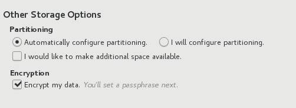
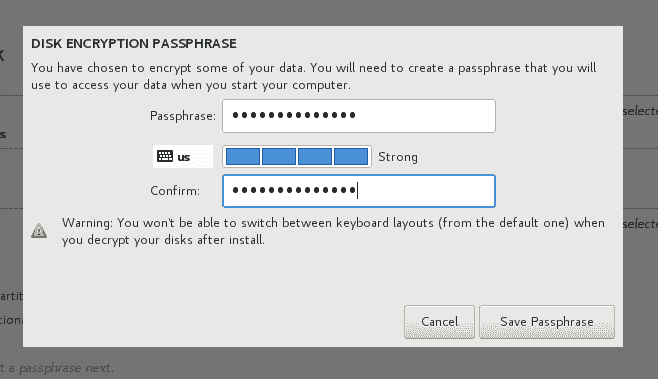
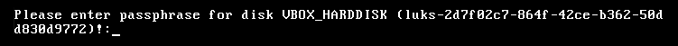
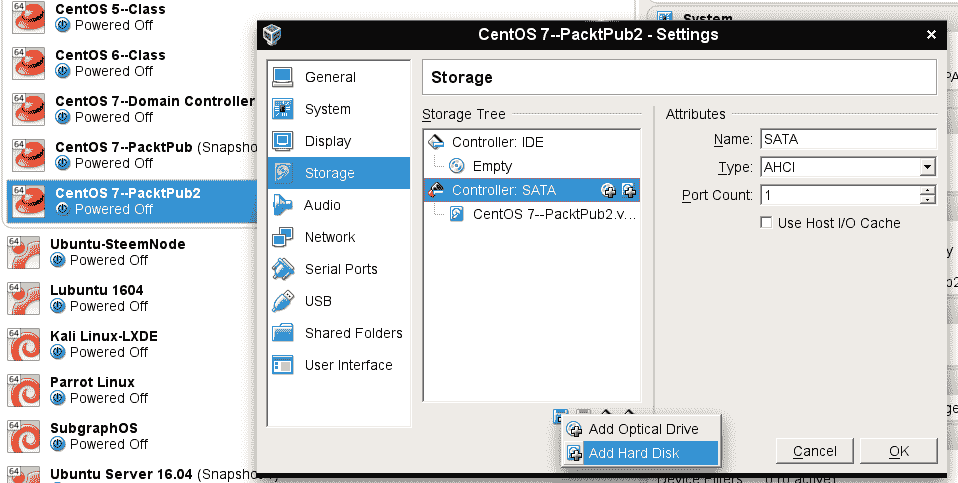
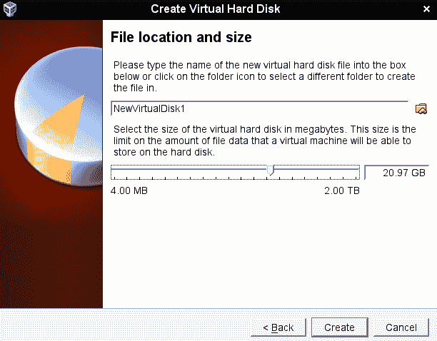
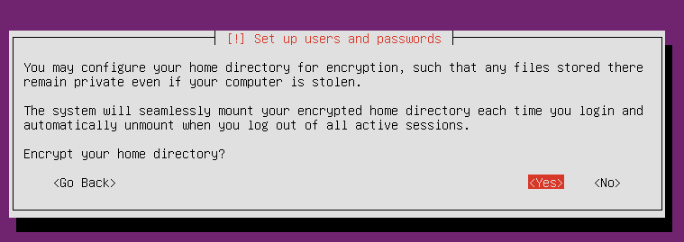
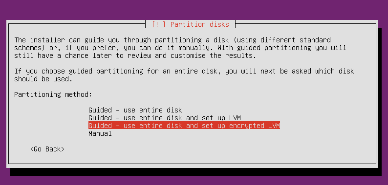
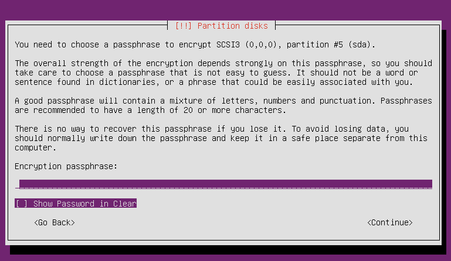
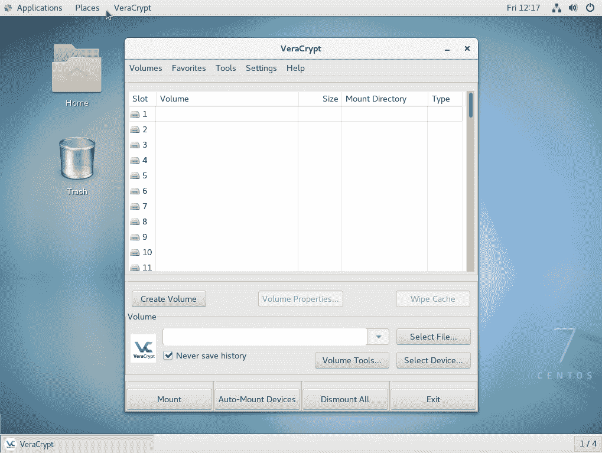

# 第四章：加密和 SSH 加固

您可能在一个超级秘密的政府机构工作，也可能只是一个普通的公民。 无论如何，您仍然有需要保护免受窥视的敏感数据。 商业机密、政府机密、个人机密——都需要保护。 像我们在第二章中看到的那样，通过限制权限设置来锁定用户的主目录只是问题的一部分； 我们还需要加密。

我们将在本章中查看的两种数据加密的一般类型旨在保护*静止数据*和*传输数据*。 我们将首先使用文件、分区和目录加密来保护静止数据。 然后，我们将介绍**安全外壳**（**SSH**）以保护传输数据。

在本章中，我们将涵盖：

+   **GNU 隐私保护**（**GPG**）

+   使用**Linux 统一密钥设置**（**LUKS**）加密分区

+   使用 eCryptfs 加密目录

+   使用 VeraCrypt 跨平台共享加密容器

+   确保 SSH 协议 1 已禁用

+   创建和管理无密码登录的密钥

+   禁用 root 用户登录

+   禁用用户名/密码登录

+   为 SFTP 用户设置 chroot 环境

# GNU 隐私保护

我们将从**GNU 隐私保护**（**GPG**）开始。 这是 Phil Zimmermann 于 1991 年创建的*Pretty Good Privacy*的免费开源实现。 您可以使用其中任何一个来加密或加密签名文件或消息。 在本节中，我们将严格关注 GPG。

使用 GPG 有一些优势：

+   它使用强大、难以破解的加密算法。

+   它使用私钥/公钥方案，消除了以安全方式将密码传输给消息或文件接收者的需要。 相反，只需发送您的公钥，对于除预期接收者之外的任何人都是无用的。

+   您可以使用 GPG 仅加密自己的文件以供自己使用，就像您使用任何其他加密实用程序一样。

+   它可用于加密电子邮件消息，允许您对敏感电子邮件进行真正的端到端加密。

+   有一些图形用户界面类型的前端可用，使其使用起来更加容易。

但是，您可能知道，也有一些缺点：

+   与密码相比，使用公钥在您直接与您隐含信任的人一起工作时非常好。 但是，对于任何超出此范围的事情，例如向一般人群分发公钥以便每个人都可以验证您签名的消息，您将依赖于一个非常难以建立的信任网络模型。

+   对于电子邮件的端到端加密，您的电子邮件接收者也必须在其系统上设置 GPG，并知道如何使用它。 这可能在企业环境中起作用，但是希望您的朋友设置这个的时候好运。（我从来没有成功过让其他人设置电子邮件加密。）

+   如果您使用独立的电子邮件客户端，例如 Mozilla Thunderbird，您可以安装一个插件，该插件将自动加密和解密消息。 但是，每次发布新的 Thunderbird 更新时，插件都会中断，而且总是需要一段时间才能发布新的可用版本。

即使 GPG 有许多弱点，它仍然是共享加密文件和电子邮件的最佳方式之一。 GPG 预装在 Ubuntu Server 和 CentOS 上。 因此，您可以使用任一虚拟机进行这些演示。

# 创建您的 GPG 密钥

开始使用 GPG 需要您首先生成您的 GPG 密钥。 您将使用以下命令完成：

```
gpg --gen-key
```

请注意，由于您为自己设置这个，您不需要 sudo 特权。

此命令的输出太长，无法一次显示所有内容，因此我将显示其中相关部分，并解释其含义。

此命令的第一件事是在您的主目录中创建一个填充的`.gnupg`目录：

```
gpg: directory `/home/donnie/.gnupg' created
gpg: new configuration file `/home/donnie/.gnupg/gpg.conf' created
gpg: WARNING: options in `/home/donnie/.gnupg/gpg.conf' are not yet active during this run
gpg: keyring `/home/donnie/.gnupg/secring.gpg' created
gpg: keyring `/home/donnie/.gnupg/pubring.gpg' created
```

然后你将被要求选择你想要的密钥类型。我们将选择默认的 RSA 和 RSA。（RSA 密钥比较强大，比旧版 DSA 密钥更难破解。Elgamal 密钥也不错，但可能不受 GPG 旧版本支持。）

```
Please select what kind of key you want:
   (1) RSA and RSA (default)
   (2) DSA and Elgamal
   (3) DSA (sign only)
   (4) RSA (sign only)
Your selection?  
```

为了获得良好的加密，你需要选择至少 2048 位的密钥，因为任何更小的密钥现在都被认为是容易受到攻击的。由于 2048 恰好是默认值，我们将选择它：

```
RSA keys may be between 1024 and 4096 bits long.
What keysize do you want? (2048)
```

接下来，选择密钥在自动到期之前保持有效的时间。对于我们的目的，我们将选择默认的`密钥不会过期`。

```
Please specify how long the key should be valid.
         0 = key does not expire
      <n>  = key expires in n days
      <n>w = key expires in n weeks
      <n>m = key expires in n months
      <n>y = key expires in n years
Key is valid for? (0)
```

提供你的个人信息：

```
GnuPG needs to construct a user ID to identify your key.

Real name: Donald A. Tevault
Email address: donniet@something.net
Comment: No comment
You selected this USER-ID:
    "Donald A. Tevault (No comment) <donniet@something.net>"

Change (N)ame, (C)omment, (E)mail or (O)kay/(Q)uit?
```

为你的私钥创建一个密码：

```
You need a Passphrase to protect your secret key.

We need to generate a lot of random bytes. It is a good idea to perform
some other action (type on the keyboard, move the mouse, utilize the
disks) during the prime generation; this gives the random number
generator a better chance to gain enough entropy.
```

这可能需要一段时间，即使你正在做所有推荐的事情来创建熵。耐心等待，它最终会完成。通过在另一个窗口运行`sudo yum upgrade`，我创建了足够的熵，以便进程不会花费太长时间：

```
gpg: /home/donnie/.gnupg/trustdb.gpg: trustdb created
gpg: key 19CAEC5B marked as ultimately trusted
public and secret key created and signed.

gpg: checking the trustdb
gpg: 3 marginal(s) needed, 1 complete(s) needed, PGP trust model
gpg: depth: 0  valid:   1  signed:   0  trust: 0-, 0q, 0n, 0m, 0f, 1u
pub   2048R/19CAEC5B 2017-10-26
      Key fingerprint = 8DE5 8894 2E37 08C4 5B26  9164 C77C 6944 19CA EC5B
uid                  Donald A. Tevault (No comment) <donniet@something.net>
sub   2048R/37582F29 2017-10-26
```

验证密钥是否已创建：

```
[donnie@localhost ~]$ gpg --list-keys
/home/donnie/.gnupg/pubring.gpg
-------------------------------
pub   2048R/19CAEC5B 2017-10-26
uid                  Donald A. Tevault (No comment) <donniet@something.net>
sub   2048R/37582F29 2017-10-26

[donnie@localhost ~]$
```

还有，趁机看看你创建的文件：

```
[donnie@localhost ~]$ ls -l .gnupg
total 28
-rw-------. 1 donnie donnie 7680 Oct 26 13:22 gpg.conf
drwx------. 2 donnie donnie    6 Oct 26 13:40 private-keys-v1.d
-rw-------. 1 donnie donnie 1208 Oct 26 13:45 pubring.gpg
-rw-------. 1 donnie donnie 1208 Oct 26 13:45 pubring.gpg~
-rw-------. 1 donnie donnie  600 Oct 26 13:45 random_seed
-rw-------. 1 donnie donnie 2586 Oct 26 13:45 secring.gpg
srwxrwxr-x. 1 donnie donnie    0 Oct 26 13:40 S.gpg-agent
-rw-------. 1 donnie donnie 1280 Oct 26 13:45 trustdb.gpg
[donnie@localhost ~]$
```

这些文件是你的公钥和私钥环，你自己的`gpg.conf`文件，一个随机种子文件和一个受信任的用户数据库。

# 对自己的文件进行对称加密

你可能会发现 GPG 对加密你自己的文件很有用，即使你从不打算与其他人分享。为此，你将使用对称加密，这涉及使用你自己的私钥进行加密。在尝试之前，你需要生成你的密钥，就像我在前一节中概述的那样。

对称密钥加密就是这样，对称的。这意味着用于加密文件的密钥与用于解密文件的密钥相同。如果你只是为了自己使用而加密文件，那就很好。但是，如果你需要与其他人共享加密文件，你需要想出一个安全的方法来给那个人密码。我的意思是，你肯定不想只是在明文电子邮件中发送密码。

让我们加密一个绝对不能落入错误手中的超级秘密文件：

```
[donnie@localhost ~]$ gpg -c secret_squirrel_stuff.txt
[donnie@localhost ~]$
```

请注意，`-c`选项表示我选择使用对称加密为文件设置密码。你输入的密码将用于文件，而不是你的私钥。

这种方法的一个小缺陷是，GPG 会生成文件的加密副本，但也会保留原始的未加密文件：

```
[donnie@localhost ~]$ ls -l
total 1748
-rw-rw-r--. 1 donnie donnie      37 Oct 26 14:22 secret_squirrel_stuff.txt
-rw-rw-r--. 1 donnie donnie      94 Oct 26 14:22 secret_squirrel_stuff.txt.gpg
[donnie@localhost ~]$
```

让我们用`shred`去掉那个未加密的文件。我们将使用`-u`选项删除文件，使用`-z`选项用零覆盖已删除的文件：

```
[donnie@localhost ~]$ shred -u -z secret_squirrel_stuff.txt
[donnie@localhost ~]$
```

看起来好像什么都没发生，因为`shred`不会给出任何输出。但是，`ls -l`会证明文件已经消失了。现在，如果我用`less secret_squirrel_stuff.txt.gpg`查看加密文件，我将能够看到它的内容，之后会被要求输入我的私钥密码：

```
Shhh!!!!  This file is super-secret.
secret_squirrel_stuff.txt.gpg (END)
```

只要我的私钥仍然加载到我的密钥环中，我就能够再次查看我的加密文件，而无需重新输入密码。现在，为了向你证明文件确实是加密的，我将创建一个共享目录，并将文件移动到那里供其他人访问：

```
sudo mkdir /shared
sudo chown donnie: /shared
sudo chmod 755 /shared
mv secret_squirrel_stuff.txt.gpg /shared
```

当我进入那个目录用`less`查看文件时，我仍然可以看到它的内容，而无需重新输入密码。但现在，让我们看看当 Maggie 尝试查看文件时会发生什么：

```
[maggie@localhost shared]$ less secret_squirrel_stuff.txt.gpg
"secret_squirrel_stuff.txt.gpg" may be a binary file.  See it anyway?
```

当她按下*Y*键查看时：

```
<8C>^M^D^C^C^B<BD>2=<D3>͈u<93><CE><C9>MОOy<B6>^O<A2><AD>}Rg9<94><EB><C4>^W^E<A6><8D><B9><B8><D3>(<98><C4>æF^_8Q2b<B8>C<B5><DB>^]<F1><CD>#<90>H<EB><90><C5>^S%X  [<E9><EF><C7>
^@y+<FC><F2><BA><U+058C>H'+<D4>v<84>Y<98>G<D7>֊
secret_squirrel_stuff.txt.gpg (END)
```

可怜的 Maggie 真的很想看到我的文件，但她只能看到加密的胡言乱语。

我刚刚演示的是 GPG 的另一个优点。输入私钥密码一次后，你就可以查看任何加密文件，而无需手动解密它们，也无需重新输入密码。对于其他对称文件加密工具，比如 Bcrypt，你需要先手动解密文件才能查看它们。

但是，现在假设您不再需要加密此文件，并且希望解密它以便让其他人查看。只需使用`gpg`和`-d`选项：

```
[donnie@localhost shared]$ gpg -d secret_squirrel_stuff.txt.gpg
gpg: CAST5 encrypted data
gpg: encrypted with 1 passphrase
Shhh!!!!  This file is super-secret.
gpg: WARNING: message was not integrity protected
[donnie@localhost shared]$
```

关于消息未经完整保护的`警告`消息意味着我已加密该文件，但我从未签署该文件。没有数字签名，其他人可以更改文件而我不知道，我将无法证明我是文件的发起者。（不要担心，我们马上就会讨论文件签名。）

# 实践实验-结合 gpg 和 tar 进行加密备份

在这个实验中，您将结合`tar`和`gpg`在模拟备份设备上创建加密备份。您可以在您的任一虚拟机上执行此实验：

1.  首先，通过以下命令创建您的 GPG 密钥。

```
 gpg --gen-key
```

1.  在您的主目录中创建一些虚拟文件，这样您就有了一些备份内容：

```
        touch {file1.txt,file2.txt,file3.txt,file4.txt}
```

1.  在文件系统的根目录创建一个备份目录。（在现实生活中，您可能会将备份目录放在一个单独的设备上，但现在，这样做也可以。）更改目录的所有权为您自己的帐户，并设置权限，以便只有您可以访问它：

```
 sudo mkdir /backup
 sudo chown your_username: /backup
 sudo chmod 700 /backup
```

1.  创建您自己主目录的加密备份文件。压缩是可选的，但我们将继续使用`xz`以获得最佳压缩效果。（请注意，您需要使用`sudo`，因为您主目录中的`.viminfo`目录归根用户所有。）：

```
 cd /home
 sudo tar cJvf - your_username/ | gpg -c >
 /backup/your_username_backup.tar.xz.gpg
```

1.  现在，假设您的主目录被删除，或者您意外删除了自己主目录中的一些重要文件。在`/backup`目录中提取并解密原始主目录：

```
        cd /backup
 sudo gpg -d your_username.tar.xz.gpg | tar xvJ
 ls -la your_username/
```

请注意，通过将`tar`与`gpg`结合使用，`tar`的`-C`选项自动将您的主目录放回`/home`目录的操作将无法进行。因此，您需要手动将提取的目录复制回`/home`，或者在提取之前将加密备份文件移动到`/home`。此外，请注意，使用`gpg`提取加密存档时，文件的所有权将更改为提取存档的人的所有权。因此，这可能不是备份整个具有多个用户主目录的`/home`目录的一个好选择。最后，由于这将创建一个巨大的存档文件，存档文件中的任何类型的损坏都可能导致您丢失整个备份。

1.  实验结束。

# 使用非对称加密和签名的私钥和公钥

对称加密对于仅在本地使用 GPG 处理自己的东西非常有用，但是如果您想与他人分享加密文件，并确保他们可以解密该文件怎么办？使用对称加密，您需要找到一种安全的方式将文件的密码传输给文件的接收者。这样做将始终存在第三方可能拦截密码的风险，然后可以进入您的文件。这就是非对称加密发挥作用的地方。为了演示，我将创建一个文件，对其进行加密，并将其发送给我的朋友 Frank 进行解密。

非对称加密是非对称的。非对称意味着您将使用一个密钥加密文件，使用另一个密钥解密文件。您将保留私钥，并将其视为生命，但您将与全世界分享公钥。这样做的美妙之处在于，您可以与另一个人分享加密文件，只有该人才能解密。这一切都可以在不必与接收者分享密码的情况下完成。

首先，我和 Frank 都必须创建一个密钥集，就像我们已经向您展示的那样。接下来，我们每个人都需要提取我们的公钥，并将它们发送给彼此。我们将把密钥提取到一个 ASCII 文本文件中：

```
cd .gnupg
gpg --export -a -o donnie_public-key.txt

donnie@ubuntu:~/.gnupg$ ls -l
total 36
-rw-rw-r-- 1 donnie donnie 1706 Oct 27 18:14 donnie_public-key.txt
. . .

frank@ubuntu:~/.gnupg$ ls -l
total 36
-rw-rw-r-- 1 frank frank 1714 Oct 27 18:18 frank_public-key.txt

```

通常情况下，参与者要么通过电子邮件附件发送彼此的密钥，要么将密钥放在共享目录中。在这种情况下，弗兰克和我将收到彼此的公钥文件，并将它们放入我们各自的`.gnupg`目录中。一旦完成，我们就准备好导入彼此的密钥了：

```
donnie@ubuntu:~/.gnupg$ gpg --import frank_public-key.txt
gpg: key 4CFC6990: public key "Frank Siamese (I am a cat.) <frank@any.net>" imported
gpg: Total number processed: 1
gpg: imported: 1 (RSA: 1)
donnie@ubuntu:~/.gnupg$

frank@ubuntu:~/.gnupg$ gpg --import donnie_public-key.txt
gpg: key 9FD7014B: public key "Donald A. Tevault <donniet@something.net>" imported
gpg: Total number processed: 1
gpg:               imported: 1  (RSA: 1)
frank@ubuntu:~/.gnupg$
```

现在是好东西的时候了。我为弗兰克创建了一个超级秘密的消息，并且会用非对称加密(`-e`)和签名(`-s`)来加密它。（签署消息是验证消息确实是我发出的，而不是冒名顶替者发出的。）

```
donnie@ubuntu:~$ gpg -s -e secret_stuff_for_frank.txt

You need a passphrase to unlock the secret key for
user: "Donald A. Tevault <donniet@something.net>"
2048-bit RSA key, ID 9FD7014B, created 2017-10-27

gpg: gpg-agent is not available in this session
You did not specify a user ID. (you may use "-r")

Current recipients:

Enter the user ID.  End with an empty line: frank
gpg: CD8104F7: There is no assurance this key belongs to the named user

pub  2048R/CD8104F7 2017-10-27 Frank Siamese (I am a cat.) <frank@any.net>
 Primary key fingerprint: 4806 7483 5442 D62B B9BD  95C1 9564 92D4 4CFC 6990
 Subkey fingerprint: 9DAB 7C3C 871D 6711 4632  A5E0 6DDD E3E5 CD81 04F7

It is NOT certain that the key belongs to the person named
in the user ID.  If you *really* know what you are doing,
you may answer the next question with yes.

Use this key anyway? (y/N) y

Current recipients:
2048R/CD8104F7 2017-10-27 "Frank Siamese (I am a cat.) <frank@any.net>"

Enter the user ID.  End with an empty line:
donnie@ubuntu:~$
```

所以，我必须做的第一件事是输入我的私钥密码。在要求输入用户 ID 的地方，我输入了`frank`，因为他是我消息的预期接收者。但是，看看之后的那一行，那里写着`没有保证这个密钥属于指定的用户`。那是因为我还没有*信任*弗兰克的公钥。我们稍后会解决这个问题。输出的最后一行再次要求输入用户 ID，这样我们就可以指定多个接收者。但是，弗兰克现在是我唯一关心的人，所以我只是按下*Enter*键来跳出例行程序。这导致了我给弗兰克的消息的`.gpg`版本：

```
donnie@ubuntu:~$ ls -l
total 8
. . .
-rw-rw-r-- 1 donnie donnie 143 Oct 27 18:37 secret_stuff_for_frank.txt
-rw-rw-r-- 1 donnie donnie 790 Oct 27 18:39 secret_stuff_for_frank.txt.gpg
donnie@ubuntu:~$
```

我的最后一步是通过任何可用的方式发送 Frank 的加密消息文件。

当弗兰克收到他的消息时，他将使用`-d`选项来查看它：

```
frank@ubuntu:~$ gpg -d secret_stuff_for_frank.txt.gpg

You need a passphrase to unlock the secret key for
user: "Frank Siamese (I am a cat.) <frank@any.net>"
2048-bit RSA key, ID CD8104F7, created 2017-10-27 (main key ID 4CFC6990)

gpg: gpg-agent is not available in this session
gpg: encrypted with 2048-bit RSA key, ID CD8104F7, created 2017-10-27
 "Frank Siamese (I am a cat.) <frank@any.net>"
This is TOP SECRET stuff that only Frank can see!!!!!
If anyone else see it, it's the end of the world as we know it.
(With apologies to REM.)
gpg: Signature made Fri 27 Oct 2017 06:39:15 PM EDT using RSA key ID 9FD7014B
gpg: Good signature from "Donald A. Tevault <donniet@something.net>"
gpg: WARNING: This key is not certified with a trusted signature!
gpg:          There is no indication that the signature belongs to the owner.
Primary key fingerprint: DB0B 31B8 876D 9B2C 7F12  9FC3 886F 3357 9FD7 014B
frank@ubuntu:~$
```

弗兰克输入他的私钥密码，然后他看到了消息。在底部，他看到了关于我的公钥不受信任的警告，以及`没有迹象表明签名属于所有者`。好吧，既然弗兰克认识我，他确切地知道这个公钥确实是我的，他可以将我的公钥添加到*受信任*列表中：

```
frank@ubuntu:~$ cd .gnupg
frank@ubuntu:~/.gnupg$ gpg --edit-key donnie
gpg (GnuPG) 1.4.20; Copyright (C) 2015 Free Software Foundation, Inc.
This is free software: you are free to change and redistribute it.
There is NO WARRANTY, to the extent permitted by law.

gpg: checking the trustdb
gpg: 3 marginal(s) needed, 1 complete(s) needed, PGP trust model
gpg: depth: 0  valid:   2  signed:   0  trust: 0-, 0q, 0n, 0m, 0f, 2u
pub  2048R/9FD7014B  created: 2017-10-27  expires: never       usage: SC
 trust: ultimate      validity: ultimate
sub  2048R/9625E7E9  created: 2017-10-27  expires: never       usage: E
[ultimate] (1). Donald A. Tevault <donniet@something.net>

gpg>

```

这个输出的最后一行是`gpg` shell 的命令提示符。弗兰克关心信任，所以他会输入`trust`命令：

```
gpg> trust
pub  2048R/9FD7014B  created: 2017-10-27  expires: never       usage: SC
 trust: unknown       validity: unknown
sub  2048R/9625E7E9  created: 2017-10-27  expires: never       usage: E
[ unknown] (1). Donald A. Tevault <donniet@something.net>

Please decide how far you trust this user to correctly verify other users' keys
(by looking at passports, checking fingerprints from different sources, etc.)

 1 = I don't know or won't say
 2 = I do NOT trust
 3 = I trust marginally
 4 = I trust fully
 5 = I trust ultimately
 m = back to the main menu

Your decision? 5
Do you really want to set this key to ultimate trust? (y/N) y
```

弗兰克认识我已经很长时间了，他确切地知道是我发送了这个密钥。所以，他选择了`5`号选项来获得终极信任。一旦弗兰克退出并重新登录，这种信任就会生效：

```
frank@ubuntu:~$ gpg -d secret_stuff_for_frank.txt.gpg

You need a passphrase to unlock the secret key for
user: "Frank Siamese (I am a cat.) <frank@any.net>"
2048-bit RSA key, ID CD8104F7, created 2017-10-27 (main key ID 4CFC6990)

gpg: gpg-agent is not available in this session
gpg: encrypted with 2048-bit RSA key, ID CD8104F7, created 2017-10-27
 "Frank Siamese (I am a cat.) <frank@any.net>"
This is TOP SECRET stuff that only Frank can see!!!!!
If anyone else see it, it's the end of the world as we know it.
(With apologies to REM.)
gpg: Signature made Fri 27 Oct 2017 06:39:15 PM EDT using RSA key ID 9FD7014B
gpg: Good signature from "Donald A. Tevault <donniet@something.net>"
frank@ubuntu:~$
```

没有更多的警告消息，这看起来好多了。在我的端，我会用弗兰克的公钥做同样的事情。

这里非常酷的是，即使整个世界都有我的公钥，对于不是我消息指定接收者的人来说，它是无用的。

在 Ubuntu 机器上，要摆脱`gpg-agent is not available in this session`的消息，并且能够在钥匙链中缓存您的密码，安装`gnupg-agent`软件包：

`sudo apt install gnupg-agent`

# 签署文件而不加密

如果一个文件不是机密的，但你仍然需要确保真实性和完整性，你可以只对它进行签名而不加密：

```
donnie@ubuntu:~$ gpg -s not_secret_for_frank.txt

You need a passphrase to unlock the secret key for
user: "Donald A. Tevault <donniet@something.net>"
2048-bit RSA key, ID 9FD7014B, created 2017-10-27

gpg: gpg-agent is not available in this session
donnie@ubuntu:~$ ls -l
. . .
-rw-rw-r-- 1 donnie donnie  40 Oct 27 19:30 not_secret_for_frank.txt
-rw-rw-r-- 1 donnie donnie 381 Oct 27 19:31 not_secret_for_frank.txt.gpg
```

就像以前一样，我创建了一个`.gpg`版本的文件。当弗兰克收到文件时，他可能会尝试用`less`打开它：

```
frank@ubuntu:~$ less not_secret_for_frank.txt.gpg
"not_secret_for_frank.txt.gpg" may be a binary file.  See it anyway?

<A3>^A^Av^A<89><FE><90>^M^C^@^B^A<88>o3W<9F><D7>^AK^A<AC>Fb^Xnot_secret_for_frank.txtY<F3><C1><C0>This isn't secret, so I just signed it.
<89>^A^\^D^@^A^B^@^F^E^BY<F3><C1><C0>^@
 ^P<88>o3W<9F><D7>^AK6<AF>^G<FF>Bs<9A>^Lc^@<E9><ED><C2>-2<AE><A7><DF>ͺaB
<EC>/[:<D1>{<B2><FD>o8<C6><C9>x<FE>*4^D<CD>^G^O^F<F3>@v<87>_1<D0>^Bp<FE>q^N3<B0><BE><85><D2>9]{<D6><EF><9A><D8>  `<C2><E4>^NC<9B>        "Ձ^?M<89>s<9F>z^B"<DF>
s}`<A4>:<B4>&<F7><F4>\EjȰ!^Q <9C>6^E|H<E2>ESC<D9>9<DC>p_ӞESCB<DE>^P<FF>i<CA>)^O
<A0>     <CB><C4>+<81><F5><A7>`5<90><BF>Y<DE><FF><<A0>z<BC><BD>5<C5><E8><FE>>
<B7><A2>^L^_^D<DD>Kk<E0><9A>8<C6>S^E<D0>fjz<B2>&G<A4><A8>^Lg$8Q>{<FF><FA>^M_A
<A1><93><C3>4<DC><C4>x<86><D9>^]- <8A> F0<87><8A><94>%A<96><DF><CD>C><80><C3>l
<D3>K<E5>^G<8E><90>d<8C><DA>Aɱb<86><89><DA>S<B6><91><D8><D2><E0><B3>K<FC><9E>
<ED>^@*<EF>x<E7>jø<FD><D3><FA><9A>^]
not_secret_for_frank.txt.gpg (END)
```

那里有很多无意义的东西，因为签名的缘故，但是如果你仔细看，你会看到明文，未加密的消息。弗兰克将使用`gpg`和`--verify`选项来验证签名是否真的属于我：

```
frank@ubuntu:~$ gpg --verify not_secret_for_frank.txt.gpg
gpg: Signature made Fri 27 Oct 2017 07:31:12 PM EDT using RSA key ID 9FD7014B
gpg: Good signature from "Donald A. Tevault <donniet@something.net>"
frank@ubuntu:~$
```

# 使用 Linux 统一密钥设置（LUKS）对分区进行加密

能够加密单个文件可能很方便，但对于大量文件来说可能会很笨拙。为此，我们需要更好的东西，我们有三种不同的方法：

+   **块加密**：我们可以用它来进行整个磁盘加密，或者加密单个分区

+   **文件级加密**：我们会用这个来加密单个目录，而不必加密底层分区

+   **容器化加密**：使用不随任何 Linux 发行版捆绑的第三方软件，我们可以创建加密的跨平台容器，可以在 Linux、Mac 或 Windows 机器上打开

**Linux 统一密钥设置**（LUKS）属于第一类。它内置在几乎每个 Linux 发行版中，使用方法对每个发行版都是一样的。对于我们的演示，我将使用 CentOS 虚拟机，因为 LUKS 现在是 Red Hat Enterprise Linux 7 和 CentOS 7 的默认加密机制。

# 在操作系统安装期间进行磁盘加密

当您安装 Red Hat Enterprise Linux 7 或其衍生产品之一时，您可以选择加密驱动器。您所需做的就是点击复选框：



除此之外，我只需让安装程序创建默认的分区方案，这意味着`/`文件系统和`swap`分区都将是逻辑卷。（我将在下一步中介绍。）

在安装继续之前，我必须创建一个密码来挂载加密磁盘：



现在，每当我重新启动系统时，我需要输入这个密码：



一旦机器启动运行，我可以查看逻辑卷的列表。我看到了`/`逻辑卷和`swap`逻辑卷：

```
[donnie@localhost etc]$ sudo lvdisplay
 --- Logical volume ---
 LV Path /dev/centos/swap
 LV Name swap
 VG Name centos
 LV UUID tsme2v-uy87-uech-vpNp-W4E7-fHLf-3bf817
 LV Write Access read/write
 LV Creation host, time localhost, 2017-10-28 13:00:11 -0400
 LV Status available
 # open 2
 LV Size 2.00 GiB
 Current LE 512
 Segments 1
 Allocation inherit
 Read ahead sectors auto
 - currently set to 8192
 Block device 253:2

 --- Logical volume ---
 LV Path /dev/centos/root
 LV Name root
 VG Name centos
 LV UUID MKXVO9-X8fo-w2FC-LnGO-GLnq-k2Xs-xI1gn0
 LV Write Access read/write
 LV Creation host, time localhost, 2017-10-28 13:00:12 -0400
 LV Status available
 # open 1
 LV Size 17.06 GiB
 Current LE 4368
 Segments 1
 Allocation inherit
 Read ahead sectors auto
 - currently set to 8192
 Block device 253:1

[donnie@localhost etc]$
```

我可以查看物理卷的列表。（实际上，列表中只有一个物理卷，并且被列为`luks`物理卷。）

```
[donnie@localhost etc]$ sudo pvdisplay
 --- Physical volume ---
 PV Name               /dev/mapper/luks-2d7f02c7-864f-42ce-b362-50dd830d9772
 VG Name               centos
 PV Size               <19.07 GiB / not usable 0
 Allocatable           yes
 PE Size               4.00 MiB
 Total PE              4881
 Free PE               1
 Allocated PE          4880
 PV UUID               V50E4d-jOCU-kVRn-67w9-5zwR-nbwg-4P725S

[donnie@localhost etc]$
```

这显示了底层物理卷已加密，这意味着`/`和`swap`逻辑卷也被加密。这是件好事，因为将交换空间留未加密——在手动设置磁盘加密时常见的错误——可能导致数据泄露。

# 使用 LUKS 添加加密分区

有时您可能需要向现有机器添加另一个加密驱动器，或者加密便携设备，比如 USB 存储设备。这个过程适用于这两种情况。

为了演示，我将关闭我的 CentOS 虚拟机并添加另一个虚拟驱动器：



我将把驱动器容量增加到 20GB，这样我就有足够的空间可以使用：



重新启动机器后，我现在有了一个`/dev/sdb`驱动器可以使用。我的下一步是创建一个分区。无论我创建一个新潮的 GPT 分区还是一个老式的 MBR 分区都无所谓。我将创建一个 GPT 分区，我偏好的工具是`gdisk`，因为它与我所熟悉和喜爱的旧`fdisk`非常相似。唯一的问题是`gdisk`在 CentOS 上默认未安装：

```
sudo yum install gdisk
sudo gdisk /dev/sdb
```

我将使用整个驱动器进行分区，并将分区类型设置为默认的`8300`。现在我有了`/dev/sdb1`分区：

```
[donnie@localhost ~]$ sudo gdisk -l /dev/sdb
[sudo] password for donnie:
GPT fdisk (gdisk) version 0.8.6

Partition table scan:
 MBR: protective
 BSD: not present
 APM: not present
 GPT: present

Found valid GPT with protective MBR; using GPT.
Disk /dev/sdb: 43978112 sectors, 21.0 GiB
Logical sector size: 512 bytes
Disk identifier (GUID): DC057EC6-3BA8-4269-ABE9-2A28B4FDC84F
Partition table holds up to 128 entries
First usable sector is 34, last usable sector is 43978078
Partitions will be aligned on 2048-sector boundaries
Total free space is 2014 sectors (1007.0 KiB)

Number Start (sector) End (sector) Size Code Name
 1 2048 43978078 21.0 GiB 8300 Linux filesystem
[donnie@localhost ~]$
```

接下来，我将使用`cryptsetup`将分区转换为 LUKS 格式。在这个命令中，`-v`表示详细模式，`-y`表示我需要两次输入密码来正确验证。请注意，当它说要全部大写输入`yes`时，它确实意味着要全部大写输入：

```
[donnie@localhost ~]$ sudo cryptsetup -v -y luksFormat /dev/sdb1

WARNING!
========
This will overwrite data on /dev/sdb1 irrevocably.

Are you sure? (Type uppercase yes): YES
Enter passphrase:
Verify passphrase:
Command successful.
[donnie@localhost ~]$
```

虽然我不必这样做，但我想查看一下我的新加密分区的信息：

```
[donnie@localhost ~]$ sudo cryptsetup luksDump /dev/sdb1
LUKS header information for /dev/sdb1

Version:           1
Cipher name:       aes
Cipher mode:       xts-plain64
Hash spec:         sha256
. . .
. . .
```

输出的内容远比我能展示的要多，但您已经有了大致的了解。

接下来，我将把分区映射到设备名称。您可以随意命名设备，我会把我的命名为`secrets`。（我知道，这是一个陈腐的名字。您可能不想让您存储秘密的地方显得那么明显。）：

```
[donnie@localhost ~]$ sudo cryptsetup luksOpen /dev/sdb1 secrets
Enter passphrase for /dev/sdb1:
[donnie@localhost ~]$
```

当我查看`/dev/mapper`目录时，我看到了我的新`secrets`设备，列为指向`dm-3`设备的符号链接：

```
[donnie@localhost mapper]$ pwd
/dev/mapper
[donnie@localhost mapper]$ ls -l se*
lrwxrwxrwx. 1 root root 7 Oct 28 17:39 secrets -> ../dm-3
[donnie@localhost mapper]$
```

我将使用`dmsetup`查看有关我的新设备的信息：

```
[donnie@localhost mapper]$ sudo dmsetup info secrets
[sudo] password for donnie:
Name:              secrets
State:             ACTIVE
Read Ahead:        8192
Tables present:    LIVE
Open count:        0
Event number:      0
Major, minor:      253, 3
Number of targets: 1
UUID: CRYPT-LUKS1-6cbdce1748d441a18f8e793c0fa7c389-secrets

[donnie@localhost mapper]$
```

下一步是以通常的方式格式化分区。我可以使用 Red Hat 和 CentOS 支持的任何文件系统。但是，由于我系统上的其他所有内容都已经使用 XFS 格式化，所以我也会选择 XFS：

```
[donnie@localhost ~]$ sudo mkfs.xfs /dev/mapper/secrets
meta-data=/dev/mapper/secrets    isize=512    agcount=4, agsize=1374123 blks
 =                       sectsz=512   attr=2, projid32bit=1
 =                       crc=1        finobt=0, sparse=0
data     =                       bsize=4096   blocks=5496491, imaxpct=25
 =                       sunit=0      swidth=0 blks
naming   =version 2              bsize=4096   ascii-ci=0 ftype=1
log      =internal log           bsize=4096   blocks=2683, version=2
 =                       sectsz=512   sunit=0 blks, lazy-count=1
realtime =none                   extsz=4096   blocks=0, rtextents=0
[donnie@localhost ~]$
```

我的最后一步是创建一个挂载点并挂载加密分区：

```
[donnie@localhost ~]$ sudo mkdir /secrets
[sudo] password for donnie:
[donnie@localhost ~]$ sudo mount /dev/mapper/secrets /secrets
[donnie@localhost ~]$
```

`mount`命令将验证分区是否正确挂载：

```
[donnie@localhost ~]$ mount | grep 'secrets'
/dev/mapper/secrets on /secrets type xfs (rw,relatime,seclabel,attr2,inode64,noquota)
[donnie@localhost ~]$
```

# 配置 LUKS 分区以自动挂载

拼图中唯一缺失的部分是配置系统在启动时自动挂载 LUKS 分区。为此，我将配置两个不同的文件：

+   `/etc/crypttab`

+   `/etc/fstab`

如果我在安装操作系统时没有选择加密磁盘，我将没有`crypttab`文件，必须自己创建。但是，由于我选择加密驱动器，我已经有了一个包含有关该驱动器信息的文件：

```
luks-2d7f02c7-864f-42ce-b362-50dd830d9772 UUID=2d7f02c7-864f-42ce-b362-50dd830d9772 none
```

前两个字段描述了加密分区的名称和位置。第三个字段是加密密码。如果设置为`none`，就像这里一样，那么密码将在启动时手动输入。

在`fstab`文件中，我们有实际挂载分区的条目：

```
/dev/mapper/centos-root /                 xfs     defaults,x-systemd.device-timeout=0 0 0
UUID=9f9fbf9c-d046-44fc-a73e-ca854d0ca718 /boot                   xfs     defaults        0 0
/dev/mapper/centos-swap swap              swap    defaults,x-systemd.device-timeout=0 0 0
```

嗯，在这种情况下实际上有两个条目，因为我有两个逻辑卷，`/`和`swap`，位于我的加密物理卷之上。`UUID`行是`/boot`分区，这是驱动器中唯一未加密的部分。现在，让我们添加我们的新加密分区，以便它会自动挂载。

这是一个极其有用的地方，可以从桌面主机远程登录到虚拟机。通过使用 GUI 类型的终端，无论是来自 Linux 或 MacOS 机器的终端，还是来自 Windows 机器的 Cygwin，您都可以执行复制和粘贴操作，而如果直接从虚拟机终端工作，则无法执行这些操作。（相信我，您不想输入那些长长的 UUID。）

第一步是获取加密分区的 UUID：

```
[donnie@localhost etc]$ sudo cryptsetup luksUUID /dev/sdb1
[sudo] password for donnie:
6cbdce17-48d4-41a1-8f8e-793c0fa7c389
[donnie@localhost etc]$
```

我会复制该 UUID，并将其粘贴到`/etc/crypttab`文件中。（请注意，您将粘贴两次。第一次，您将在其前面加上`luks-`，第二次您将在其后面加上`UUID=`。）

```
luks-2d7f02c7-864f-42ce-b362-50dd830d9772 UUID=2d7f02c7-864f-42ce-b362-50dd830d9772 none
luks-6cbdce17-48d4-41a1-8f8e-793c0fa7c389 UUID=6cbdce17-48d4-41a1-8f8e-793c0fa7c389 none
```

最后，我将编辑`/etc/fstab`文件，为我的新加密分区添加文件的最后一行。（请注意，我再次使用了`luks-`，后跟 UUID 号码。）

```
/dev/mapper/centos-root / xfs defaults,x-systemd.device-timeout=0 0 0
UUID=9f9fbf9c-d046-44fc-a73e-ca854d0ca718 /boot xfs defaults 0 0
/dev/mapper/centos-swap swap swap defaults,x-systemd.device-timeout=0 0 0
/dev/mapper/luks-6cbdce17-48d4-41a1-8f8e-793c0fa7c389 /secrets xfs defaults 0 0
```

在编辑`fstab`文件以添加普通的未加密分区时，我总是喜欢执行`sudo mount -a`来检查`fstab`文件中是否有拼写错误。但是，对于 LUKS 分区，这是行不通的，因为`mount`在系统读取`crypttab`文件之前不会识别分区，而这将在我重新启动机器之前不会发生。因此，在添加 LUKS 分区时，请务必格外小心编辑`fstab`。

现在到了真相的时刻。我将重新启动机器，看看是否一切正常。

好的，机器已经重新启动，`mount`显示我的努力取得了成功：

```
[donnie@localhost ~]$ mount | grep 'secrets'
/dev/mapper/luks-6cbdce17-48d4-41a1-8f8e-793c0fa7c389 on /secrets type xfs (rw,relatime,seclabel,attr2,inode64,noquota)
[donnie@localhost ~]$
```

# 使用 eCryptfs 加密目录

加密整个分区很酷，但有时您可能只需要加密单个目录。为此，我们可以使用 eCryptfs。我们需要使用我们的 Ubuntu 机器进行此操作，因为 Red Hat 和 CentOS 在其产品的第 7 版中不再包括 eCryptfs。（它在 Red Hat 6 和 CentOS 6 中，但在第 7 版中甚至不再可用于安装。）

# Ubuntu 安装期间的家目录和磁盘加密

当您安装 Ubuntu 服务器时，您有两次机会实施加密。您首先有机会加密您的家目录：



稍后，在分区磁盘屏幕上，您将有机会为整个磁盘加密逻辑卷：



选择此选项后，您将被要求输入密码：



磁盘加密使用 LUKS，与我们在 CentOS 机器上看到的一样。要证明这一点，我们只需在`/etc`目录中查找填充的`crypttab`文件：

```
donnie@ubuntu3:~$ cd /etc
donnie@ubuntu3:/etc$ cat crypttab
sda5_crypt UUID=56190c2b-e46b-40a9-af3c-4cb26c4fe998 none luks,discard
cryptswap1 UUID=60661042-0dbd-4c2a-9cf9-7f02a73864ae /dev/urandom swap,offset=1024,cipher=aes-xts-plain64
donnie@ubuntu3:/etc$
```

与 Red Hat 和 CentOS 不同，Ubuntu 机器将始终具有`/etc/crypttab`文件，即使没有 LUKS 分区。没有 LUKS 分区，该文件将为空。

主目录加密使用 eCryptfs，如`/home`目录中的`.ecryptfs`目录所示：

```
donnie@ubuntu3:/home$ ls -la
total 16
drwxr-xr-x 4 root root 4096 Oct 29 15:06 .
drwxr-xr-x 23 root root 4096 Oct 29 15:23 ..
drwx------ 3 donnie donnie 4096 Oct 29 15:29 donnie
drwxr-xr-x 3 root root 4096 Oct 29 15:06 .ecryptfs
donnie@ubuntu3:/home$
```

所以，我们这里有一个加密叠加加密，双重保护。这真的有必要吗？可能不是，但选择加密我的主目录确保了其访问权限设置为更严格的`700`设置，而不是默认的`755`设置。但要注意，您现在创建的任何用户帐户都将在其主目录上具有完全开放的权限设置。除非我们选择创建带有加密选项的用户帐户。

# 为新用户帐户加密主目录

在第二章中，*保护用户账户*，我向您展示了 Ubuntu 如何允许您在创建用户帐户时加密用户的主目录。让我们回顾一下，看看创建 Goldie 帐户的命令：

```
sudo adduser --encrypt-home goldie
```

Goldie 登录时，她首先要做的是`unwrap`她的挂载密码，将其写下并存放在安全的地方。（如果她需要恢复损坏的目录，她将需要这个。）

```
ecryptfs-unwrap-passphrase .ecryptfs/wrapped-passphrase
```

当您使用`adduser --encrypt-home`时，新用户的主目录将自动设置为限制权限值，除了目录所有者，其他人都无法访问。即使您保留`adduser.conf`文件的默认设置，也会发生这种情况。

# 在现有主目录中创建私人目录

假设您有一些用户，出于某种奇怪的原因，不想加密其整个主目录，并且希望保留其主目录上的`755`权限设置，以便其他人可以访问其文件。但是，他们还想要一个除了他们自己以外没有人可以访问的私人目录。

任何用户都可以在自己的主目录中创建加密的私人目录，而不是加密整个主目录。如果尚未完成第一步，则需要具有管理员权限的人安装`ecryptfs-utils`软件包：

```
sudo apt install ecryptfs-utils
```

为了创建这个私人目录，我们将使用交互式的`ecryptfs-setup-private`实用程序。如果您有管理员权限，您可以为其他用户执行此操作。没有管理员权限的用户可以为自己执行此操作。对于我们的演示，假设我的大暹罗/灰色虎斑猫 Charlie 需要自己的加密私人空间。（谁知道猫也有秘密，对吧？）

```
charlie@ubuntu2:~$ ecryptfs-setup-private
Enter your login passphrase [charlie]:
Enter your mount passphrase [leave blank to generate one]:
Enter your mount passphrase (again):

************************************************************************
YOU SHOULD RECORD YOUR MOUNT PASSPHRASE AND STORE IT IN A SAFE LOCATION.
 ecryptfs-unwrap-passphrase ~/.ecryptfs/wrapped-passphrase
THIS WILL BE REQUIRED IF YOU NEED TO RECOVER YOUR DATA AT A LATER TIME.
************************************************************************

Done configuring.

Testing mount/write/umount/read...
Inserted auth tok with sig [e339e1ebf3d58c36] into the user session keyring
Inserted auth tok with sig [7a40a176ac647bf0] into the user session keyring
Inserted auth tok with sig [e339e1ebf3d58c36] into the user session keyring
Inserted auth tok with sig [7a40a176ac647bf0] into the user session keyring
Testing succeeded.

Logout, and log back in to begin using your encrypted directory.

charlie@ubuntu2:~$
```

对于`login`密码，Charlie 输入他的正常密码或用于登录用户帐户的密码。他本可以让系统生成自己的`mount`密码，但他决定输入自己的密码。由于他输入了自己的挂载密码，他不需要执行`ecryptfs-unwrap-passphrase`命令来找出密码是什么。但是，为了展示该命令的工作原理，假设 Charlie 输入`TurkeyLips`作为他的挂载密码：

```
charlie@ubuntu2:~$ ecryptfs-unwrap-passphrase .ecryptfs/wrapped-passphrase
Passphrase:
TurkeyLips
charlie@ubuntu2:~$
```

是的，这是一个非常弱的密码，但对于我们的演示目的，它有效。

Charlie 注销并重新登录后，他可以开始使用他的新私人目录。此外，您可以看到他的主目录中有三个新的隐藏目录。尽管他的顶级主目录仍然向所有人开放，但这三个新目录只能由 Charlie 访问：

```
charlie@ubuntu2:~$ ls -la
total 40
drwxr-xr-x 6 charlie charlie 4096 Oct 30 17:00 .
drwxr-xr-x 4 root root 4096 Oct 30 16:38 ..
-rw------- 1 charlie charlie 270 Oct 30 17:00 .bash_history
-rw-r--r-- 1 charlie charlie 220 Aug 31 2015 .bash_logout
-rw-r--r-- 1 charlie charlie 3771 Aug 31 2015 .bashrc
drwx------ 2 charlie charlie 4096 Oct 30 16:39 .cache
drwx------ 2 charlie charlie 4096 Oct 30 16:57 .ecryptfs
drwx------ 2 charlie charlie 4096 Oct 30 16:57 Private
drwx------ 2 charlie charlie 4096 Oct 30 16:57 .Private
-rw-r--r-- 1 charlie charlie 655 May 16 08:49 .profile
charlie@ubuntu2:~$
```

在`/etc/pam.d`目录中执行`grep 'ecryptfs' *`命令，您将看到 PAM 配置为在用户登录系统时自动挂载其加密目录：

```
donnie@ubuntu2:/etc/pam.d$ grep 'ecryptfs' *
common-auth:auth    optional    pam_ecryptfs.so unwrap
common-password:password    optional    pam_ecryptfs.so
common-session:session    optional    pam_ecryptfs.so unwrap
common-session-noninteractive:session    optional    pam_ecryptfs.so unwrap
donnie@ubuntu2:/etc/pam.d$
```

# 使用 eCryptfs 加密其他目录

使用`ecryptfs`文件系统挂载其他目录非常简单。对于我们的示例，让我们在我们的文件系统的顶层创建一个`secrets`目录，并对其进行加密。请注意，您需要两次列出目录名称，因为您还需要指定挂载点。（基本上，您使用要挂载的目录作为其自己的挂载点。）

```
sudo mkdir /secrets
sudo mount -t ecryptfs /secrets /secrets
```

此命令的输出有点冗长，所以让我们分解一下。

首先，您将输入所需的密码，选择加密算法和密钥长度：

```
donnie@ubuntu2:~$ sudo mount -t ecryptfs /secrets /secrets
[sudo] password for donnie:
Passphrase:
Select cipher:
 1) aes: blocksize = 16; min keysize = 16; max keysize = 32
 2) blowfish: blocksize = 8; min keysize = 16; max keysize = 56
 3) des3_ede: blocksize = 8; min keysize = 24; max keysize = 24
 4) twofish: blocksize = 16; min keysize = 16; max keysize = 32
 5) cast6: blocksize = 16; min keysize = 16; max keysize = 32
 6) cast5: blocksize = 8; min keysize = 5; max keysize = 16
Selection [aes]:
Select key bytes:
 1) 16
 2) 32
 3) 24
Selection [16]:
```

我们将选择默认的`aes`，并使用 16 字节的密钥。

我将选择“明文传递”的默认选项为否，并选择文件名加密为是：

```
Enable plaintext passthrough (y/n) [n]:
Enable filename encryption (y/n) [n]: y
```

我将使用默认的“文件名加密密钥”，并验证挂载选项：

```
Filename Encryption Key (FNEK) Signature [e339e1ebf3d58c36]:
Attempting to mount with the following options:
  ecryptfs_unlink_sigs
  ecryptfs_fnek_sig=e339e1ebf3d58c36
  ecryptfs_key_bytes=16
  ecryptfs_cipher=aes
  ecryptfs_sig=e339e1ebf3d58c36
```

此警告仅在您首次挂载目录时出现。对于最后两个问题，我将输入“是”以防止再次出现该警告：

```
WARNING: Based on the contents of [/root/.ecryptfs/sig-cache.txt],
it looks like you have never mounted with this key
before. This could mean that you have typed your
passphrase wrong.

Would you like to proceed with the mount (yes/no)? : yes
Would you like to append sig [e339e1ebf3d58c36] to
[/root/.ecryptfs/sig-cache.txt]
in order to avoid this warning in the future (yes/no)? : yes
Successfully appended new sig to user sig cache file
Mounted eCryptfs
donnie@ubuntu2:~$
```

只是为了好玩，我将在我的新加密`secrets`目录中创建一个文件，然后卸载该目录：

```
cd /secrets
sudo vim secret_stuff.txt
cd
sudo umount /secrets
ls -l /secrets

donnie@ubuntu2:/secrets$ ls -l
total 12
-rw-r--r-- 1 root root 12288 Oct 31 18:24 ECRYPTFS_FNEK_ENCRYPTED.FXbXCS5fwxKABUQtEPlumGPaN-RGvqd13yybkpTr1eCVWVHdr-lrmi1X9Vu-mLM-A-VeqIdN6KNZGcs-
donnie@ubuntu2:/secrets$
```

通过选择加密文件名，当目录未挂载时，没有人甚至可以知道您有哪些文件。当我准备再次访问我的加密文件时，我只需像以前一样重新挂载目录。

# 使用 eCryptfs 加密交换分区

如果您只是使用 eCryptfs 加密单个目录而不是使用 LUKS 整个磁盘加密，您需要加密交换分区以防止意外数据泄漏。修复这个问题只需要一个简单的命令：

```
donnie@ubuntu:~$ sudo ecryptfs-setup-swap
[sudo] password for donnie:

WARNING:
An encrypted swap is required to help ensure that encrypted files are not leaked to disk in an unencrypted format.

HOWEVER, THE SWAP ENCRYPTION CONFIGURATION PRODUCED BY THIS PROGRAM WILL BREAK HIBERNATE/RESUME ON THIS SYSTEM!

NOTE: Your suspend/resume capabilities will not be affected.

Do you want to proceed with encrypting your swap? [y/N]: y

INFO: Setting up swap: [/dev/sda5]
WARNING: Commented out your unencrypted swap from /etc/fstab
swapon: stat of /dev/mapper/cryptswap1 failed: No such file or directory
donnie@ubuntu:~$
```

不要在意关于缺少`/dev/mapper/cryptswap1`文件的警告。下次重新启动机器时，它将被创建。

# 使用 VeraCrypt 进行加密容器的跨平台共享

从前，有一个叫 TrueCrypt 的跨平台程序，允许在不同操作系统之间共享加密容器。但该项目一直笼罩着神秘色彩，因为其开发人员从未透露过自己的身份。然后，突然之间，开发人员发布了一条神秘的消息，称 TrueCrypt 不再安全，并关闭了该项目。

VeraCrypt 是 TrueCrypt 的继任者，它允许在 Linux、Windows、MacOS 和 FreeBSD 机器之间共享加密容器。尽管 LUKS 和 eCryptfs 都不错，但在某些方面 VeraCrypt 确实提供了更多的灵活性：

+   提到的是，VeraCrypt 提供跨平台共享，而 LUKS 和 eCryptfs 则不提供

+   VeraCrypt 允许您加密整个分区或整个存储设备，或创建虚拟加密磁盘

+   VeraCrypt 不仅可以创建加密卷，还可以隐藏它们，从而具有合理的否认性

+   VeraCrypt 有命令行和 GUI 两种变体，因此适用于服务器使用或休闲桌面用户

+   像 LUKS 和 eCryptfs 一样，VeraCrypt 是免费开源软件，这意味着它可以免费使用，并且可以审核源代码以查找错误或后门

# 获取并安装 VeraCrypt

VeraCrypt 的 Linux 版本是一组通用安装脚本，应该适用于任何 Linux 发行版。在提取`.tar.bz2`存档文件后，您将看到两个用于 GUI 安装的脚本和两个用于控制台模式安装的脚本。其中一个用于 32 位 Linux，另一个用于 64 位 Linux：

```
donnie@linux-0ro8:~/Downloads> ls -l vera*
-r-xr-xr-x 1 donnie users  2976573 Jul  9 05:10 veracrypt-1.21-setup-console-x64
-r-xr-xr-x 1 donnie users  2967950 Jul  9 05:14 veracrypt-1.21-setup-console-x86
-r-xr-xr-x 1 donnie users  4383555 Jul  9 05:08 veracrypt-1.21-setup-gui-x64
-r-xr-xr-x 1 donnie users  4243305 Jul  9 05:13 veracrypt-1.21-setup-gui-x86
-rw-r--r-- 1 donnie users 14614830 Oct 31 23:49 veracrypt-1.21-setup.tar.bz2
donnie@linux-0ro8:~/Downloads>
```

对于服务器演示，我使用`scp`将 64 位控制台模式安装程序传输到我的 Ubuntu 虚拟机之一。可执行权限已经设置，因此安装只需执行以下操作：

```
donnie@ubuntu:~$ ./veracrypt-1.21-setup-console-x64
```

您需要 sudo 权限，但安装程序将提示您输入 sudo 密码。阅读并同意相当冗长的许可协议后，安装只需要几秒钟。

# 在控制台模式下创建和挂载 VeraCrypt 卷

我找不到 VeraCrypt 控制台模式的任何文档，但您可以通过键入`veracrypt`来查看可用命令的列表。在此演示中，我在自己的主目录中创建了一个 2GB 的加密卷。但您也可以在其他地方轻松完成，比如在 USB 存储设备上。

要创建新的加密卷，请键入：

```
veracrypt -c
```

这将带您进入一个易于使用的交互式实用程序。在大多数情况下，接受默认选项即可。

```
donnie@ubuntu:~$ veracrypt -c
Volume type:
 1) Normal
 2) Hidden
Select [1]:

Enter volume path: /home/donnie/good_stuff

Enter volume size (sizeK/size[M]/sizeG): 2G

Encryption Algorithm:
 1) AES
 2) Serpent
 3) Twofish
 4) Camellia
 5) Kuznyechik
 6) AES(Twofish)
 7) AES(Twofish(Serpent))
 8) Serpent(AES)
 9) Serpent(Twofish(AES))
 10) Twofish(Serpent)
Select [1]:

Hash algorithm:
 1) SHA-512
 2) Whirlpool
 3) SHA-256
 4) Streebog
Select [1]:
. . .
. . .
```

对于文件系统，默认的 FAT 选项将为你提供 Linux、MacOS 和 Windows 之间最好的跨平台兼容性：

```
Filesystem:
 1) None
 2) FAT
 3) Linux Ext2
 4) Linux Ext3
 5) Linux Ext4
 6) NTFS
 7) exFAT
Select [2]:
```

然后，你会选择你的密码和 PIM，PIM 代表个人迭代乘数。（对于 PIM，我输入了`8891`。高 PIM 值可以提供更好的安全性，但也会导致卷需要更长时间来挂载。）然后，至少输入 320 个随机字符以生成加密密钥。（这时，如果我的猫走过我的键盘会很方便。）

```
Enter password:
Re-enter password:

Enter PIM: 8891

Enter keyfile path [none]:

Please type at least 320 randomly chosen characters and then press Enter:
```

按下*Enter*后，请耐心等待，因为加密卷的最终生成将需要一些时间。在这里，你可以看到我的 2GB 的`good_stuff`容器已经成功创建：

```
donnie@ubuntu:~$ ls -l good_stuff
-rw------- 1 donnie donnie 2147483648 Nov  1 17:02 good_stuff
donnie@ubuntu:~$
```

要使用这个容器，我必须挂载它。我将首先创建一个挂载点目录；与挂载普通分区一样：

```
donnie@ubuntu:~$ mkdir good_stuff_dir
donnie@ubuntu:~$
```

使用`veracrypt`实用程序将你的容器挂载到这个挂载点上：

```
donnie@ubuntu:~$ veracrypt good_stuff good_stuff_dir
Enter password for /home/donnie/good_stuff:
Enter PIM for /home/donnie/good_stuff: 8891
Enter keyfile [none]:
Protect hidden volume (if any)? (y=Yes/n=No) [No]:
Enter your user password or administrator password:
donnie@ubuntu:~$
```

要查看你已经挂载的 VeraCrypt 卷，使用`veracrypt -l`：

```
donnie@ubuntu:~$ veracrypt -l
1: /home/donnie/secret_stuff /dev/mapper/veracrypt1 /home/donnie/secret_stuff_dir
2: /home/donnie/good_stuff /dev/mapper/veracrypt2 /home/donnie/good_stuff_dir
donnie@ubuntu:~$
```

就是这样。

# 在 GUI 模式下使用 VeraCrypt

任何受支持的操作系统的桌面用户都可以安装 VeraCrypt 的 GUI 变体。但要注意，你不能在同一台机器上安装控制台模式变体和 GUI 模式变体，因为其中一个会覆盖另一个。在这里，你可以看到 GUI 版本在我的 CentOS 7 虚拟机上运行：



由于本书的主要重点是服务器安全，我不会在这里详细介绍 GUI 版本。但是，它相当简单易懂，你可以在他们的网站上查看完整的 VeraCrypt 文档。

你可以从这里获取 VeraCrypt：[`www.veracrypt.fr/en/Home.html`](https://www.veracrypt.fr/en/Home.html)

在本章的其余部分，我们将把注意力转向通过锁定 Secure Shell 来保护传输数据的主题。

# 确保 SSH 协议 1 已禁用

在你的 Linux 职业生涯的这个阶段，你应该已经知道如何使用安全 Shell，或者 SSH，进行远程登录和远程文件传输。你可能不知道的是，SSH 的默认配置实际上是相当不安全的。

SSH 协议版本 1，原始的 SSH 协议，存在严重缺陷，不应该使用。它仍然存在于大多数 Linux 发行版中，但幸运的是，默认情况下它总是被禁用的。但是，如果你打开`/etc/ssh/sshd_config`文件并看到这个：

```
Protocol 1
```

或者这样：

```
Protocol 1, 2
```

然后你会遇到问题。

Ubuntu `sshd_config`文件的主页表示，协议版本 1 仍然可用于与`传统设备`一起使用。但是，如果你仍在使用那么老的设备，你需要开始认真考虑进行一些升级。

随着 Linux 发行版的更新，你会看到 SSH 协议 1 逐渐被完全移除，就像 Red Hat 和 CentOS 7.4 一样。

# 创建和管理无密码登录的密钥

安全 Shell 套件，或者 SSH，是一套提供与远程服务器进行安全加密通信的工具。你可以使用 SSH 组件远程登录到远程机器的命令行，你也可以使用`scp`或`sftp`来安全地传输文件。使用任何这些 SSH 组件的默认方式是使用一个人的普通 Linux 用户帐户的用户名和密码。因此，从我的 OpenSUSE 工作站的终端登录到远程机器看起来是这样的：

```
donnie@linux-0ro8:~> ssh donnie@192.168.0.8
donnie@192.168.0.8's password:
```

虽然用户名和密码以加密格式通过网络传输是真实的，这使得恶意行为者难以拦截，但这仍然不是最安全的做法。问题在于攻击者可以访问自动化工具，对 SSH 服务器执行暴力密码攻击。像 Hail Mary Cloud 这样的僵尸网络在互联网上进行持续扫描，以找到启用 SSH 的面向互联网的服务器。如果僵尸网络发现服务器允许通过用户名和密码访问 SSH，它将发起暴力密码攻击。遗憾的是，这种攻击已经成功了很多次，特别是当服务器运营商允许 root 用户通过 SSH 登录时。

这篇较旧的文章详细介绍了 Hail Mary Cloud 僵尸网络：[`futurismic.com/2009/11/16/the-hail-mary-cloud-slow-but-steady-brute-force-password-guessing-botnet/`](http://futurismic.com/2009/11/16/the-hail-mary-cloud-slow-but-steady-brute-force-password-guessing-botnet/)

在下一节中，我们将看两种方法来帮助防止这些类型的攻击：

+   通过交换公钥启用 SSH 登录

+   禁用通过 SSH 登录的 root 用户

# 创建用户的 SSH 密钥集

每个用户都有能力创建自己的私钥和公钥。无论用户的客户端机器运行 Linux、MacOS 还是 Windows 上的 Cygwin，在这三种情况下，程序都是完全相同的。为了演示，我将在我的 OpenSUSE 工作站上创建密钥，并将公钥传输到我的一个虚拟机。我使用哪个虚拟机并不重要，但由于我最近没有给 CentOS 机器太多关注，所以我会使用它。

我将从在我的 OpenSUSE 工作站上创建密钥开始：

```
donnie@linux-0ro8:~> ssh-keygen
Generating public/private rsa key pair.
Enter file in which to save the key (/home/donnie/.ssh/id_rsa):
Enter passphrase (empty for no passphrase):
Enter same passphrase again:
Your identification has been saved in /home/donnie/.ssh/id_rsa.
Your public key has been saved in /home/donnie/.ssh/id_rsa.pub.
The key fingerprint is:
SHA256:oqDpCvAptbE8srN6Z4FNXxgkhPhjh1sEKazfMpxhVI8 donnie@linux-0ro8
The key's randomart image is:
+---[RSA 2048]----+
|...*+..          |
|o.+ .+.          |
|.+ oE .o         |
|. B + . .        |
|.=+% ...S        |
|.*O*+...         |
|* Bo..           |
|++..o            |
|B= o             |
+----[SHA256]-----+
donnie@linux-0ro8:~>
```

您可以创建几种不同类型的密钥，但默认的 2048 位 RSA 密钥被认为对可预见的未来足够强大。私钥和公钥 SSH 密钥的工作方式与我们在 GPG 中看到的相同。您将保留私钥，但如果愿意，可以与世界共享公钥。不过，在这种情况下，我只会与一个服务器共享我的公钥。

当要求输入密钥的位置和名称时，我只需按*Enter*接受默认值。您可以将私钥留空密码，但这不是推荐的做法。

请注意，如果您选择了密钥文件的替代名称，您需要键入整个路径才能使事情正常工作。例如，在我的情况下，我将指定`donnie_rsa`密钥的路径为：

`/home/donnie/.ssh/donnie_rsa`

在我的家目录的`.ssh`目录中，我可以看到我创建的密钥：

```
donnie@linux-0ro8:~/.ssh> ls -l
total 12
-rw------- 1 donnie users 1766 Nov  2 17:52 id_rsa
-rw-r--r-- 1 donnie users  399 Nov  2 17:52 id_rsa.pub
-rw-r--r-- 1 donnie users 2612 Oct 31 18:40 known_hosts
donnie@linux-0ro8:~/.ssh>
```

`id_rsa`密钥是私钥，只有我有读写权限。`id_rsa.pub`公钥必须是可读的。

# 将公钥传输到远程服务器

将我的公钥传输到远程服务器可以让服务器轻松识别我和我的客户端机器。在我可以将公钥传输到远程服务器之前，我需要将私钥添加到我的会话密钥环中。这需要两个命令。（一个命令是调用`ssh-agent`，另一个命令实际上将私钥添加到密钥环中。）

```
donnie@linux-0ro8:~> exec /usr/bin/ssh-agent $SHELL
donnie@linux-0ro8:~> ssh-add
Enter passphrase for /home/donnie/.ssh/id_rsa:
Identity added: /home/donnie/.ssh/id_rsa (/home/donnie/.ssh/id_rsa)
donnie@linux-0ro8:~>
```

最后，我可以将我的公钥传输到我的 CentOS 服务器，地址为`192.168.0.101`：

```
donnie@linux-0ro8:~> ssh-copy-id donnie@192.168.0.101
/usr/bin/ssh-copy-id: INFO: attempting to log in with the new key(s), to filter out any that are already installed
/usr/bin/ssh-copy-id: INFO: 1 key(s) remain to be installed -- if you are prompted now it is to install the new keys
donnie@192.168.0.101's password:

Number of key(s) added: 1

Now try logging into the machine, with:   "ssh 'donnie@192.168.0.101'"
and check to make sure that only the key(s) you wanted were added.

donnie@linux-0ro8:~>
```

下次登录时，我将使用密钥交换，而无需输入密码：

```
donnie@linux-0ro8:~> ssh donnie@192.168.0.101
Last login: Wed Nov  1 20:11:20 2017
[donnie@localhost ~]$
```

所以，现在您可能会想：“*如果我可以在不输入密码的情况下登录，那么这样安全吗？*”答案是，一旦您关闭用于登录的客户端机器的终端窗口，私钥将从您的会话密钥环中删除。当您打开新的终端并尝试登录到远程服务器时，您将看到这个：

```
donnie@linux-0ro8:~> ssh donnie@192.168.0.101
Enter passphrase for key '/home/donnie/.ssh/id_rsa':
```

现在，每次我登录到这台服务器时，我都需要输入私钥的密码。（除非我使用前一节中向您展示的两个命令将其添加回会话密钥环中。）

# 禁用 root 用户登录

几年前，有一个相当引人注目的案例，恶意行为者设法在东南亚某地的许多 Linux 服务器上植入了恶意软件。坏人发现这么做很容易有三个原因：

+   涉及的面向互联网的服务器设置为使用用户名/密码身份验证进行 SSH 登录。

+   允许 root 用户通过 SSH 登录

+   用户密码，包括 root 用户的密码，都非常薄弱

所有这些都意味着 Hail Mary 很容易通过暴力破解方式进入。

不同的发行版对 root 用户登录有不同的默认设置。在您的 CentOS 机器的`/etc/ssh/sshd_config`文件中，您将看到这一行：

```
#PermitRootLogin yes
```

与大多数配置文件中的情况不同，在`sshd_config`中的注释行定义了安全外壳守护程序的默认设置。因此，这一行表示确实允许 root 用户通过 SSH 登录。要更改这一点，我将删除注释符号并将设置更改为`no`：

```
PermitRootLogin no
```

为了使新设置生效，我将重新启动 SSH 守护程序，在 CentOS 上命名为`sshd`，在 Ubuntu 上命名为`ssh`：

```
sudo systemctl restart sshd
```

在 Ubuntu 机器上，默认设置看起来有点不同：

```
PermitRootLogin prohibit-password
```

这意味着允许 root 用户登录，但只能通过公钥交换。如果您确实需要允许 root 用户登录，那可能足够安全。但在大多数情况下，您会希望强制管理员用户使用其普通用户帐户登录，并使用`sudo`来满足其管理员需求。因此，在大多数情况下，您仍然可以将此设置更改为`no`。

请注意，如果您在 Azure、Rackspace 或 Vultr 等云服务上部署 Ubuntu 服务器实例，服务所有者将要求您使用 root 用户帐户登录到虚拟机。您要做的第一件事是创建自己的普通用户帐户，使用该帐户重新登录，禁用 root 用户帐户，并在`sshd_config`中禁用 root 用户登录。

# 禁用用户名/密码登录

这是您只想在与客户端设置密钥交换后才能做的事情。否则，客户端将无法进行远程登录。

对于 Ubuntu 和 CentOS 机器，查找`sshd_config`文件中的此行：

```
#PasswordAuthentication yes
```

删除注释符号，将参数值更改为`no`，并重新启动 SSH 守护程序。该行现在应该是这样的：

```
PasswordAuthentication no
```

现在，当僵尸网络扫描您的系统时，它们会发现进行暴力破解密码攻击是无用的。然后他们会离开并让你独自一人。

# 为 SFTP 用户设置 chroot 环境

**安全文件传输协议**（**SFTP**）是执行安全文件传输的好工具。有一个命令行客户端，但用户最有可能使用图形客户端，如 Filezilla。 SFTP 的一个常见用例是允许网站所有者将网站内容文件上传到 Web 服务器上的适当内容目录。使用默认的 SSH 设置，任何在 Linux 机器上有用户帐户的人都可以通过 SSH 或 SFTP 登录，并可以浏览服务器的整个文件系统。我们真正希望为 SFTP 用户做的是防止他们通过 SSH 登录到命令提示符，并将其限制在其指定的目录中。

# 创建组并配置 sshd_config 文件

除了用户创建命令略有不同之外，此过程对于 CentOS 或 Ubuntu 都是相同的。因此，您可以使用虚拟机中的任一台来跟随操作。我们将首先创建一个`sftpusers`组。

```
sudo groupadd sftpusers
```

创建用户帐户，并将其添加到`sftpusers`组。我们将一次完成两个操作。在您的 CentOS 机器上，创建 Max 的帐户的命令将是：

```
sudo useradd -G sftpusers max
```

在您的 Ubuntu 机器上，它将是：

```
sudo useradd -m -d /home/max -s /bin/bash -G sftpusers max
```

在您喜欢的文本编辑器中打开`/etc/ssh/sshd_config`文件。找到这一行：

```
Subsystem sftp /usr/lib/openssh/sftp-server
```

将其更改为：

```
Subsystem sftp internal-sftp
```

此设置允许您禁用某些用户的普通 SSH 登录。

在`sshd_config`文件的底部，添加一个`Match Group`段落：

```
Match Group sftpusers
        ChrootDirectory /home
        AllowTCPForwarding no
        AllowAgentForwarding no
        X11Forwarding no
        ForceCommand internal-sftp
```

这里一个重要的考虑因素是`ChrootDirectory`必须由 root 用户拥有，并且不能被除 root 用户之外的任何人写入。当 Max 登录时，他将在`/home`目录中，然后必须`cd`进入自己的目录。这也意味着您希望所有用户的主目录都具有限制性的`700`权限设置，以防止其他人进入其他人的东西。

保存文件并重新启动 SSH 守护程序。然后，尝试以 Max 的身份通过普通 SSH 登录，只是为了看看会发生什么：

```
donnie@linux-0ro8:~> ssh max@192.168.0.8
max@192.168.0.8's password:
This service allows sftp connections only.
Connection to 192.168.0.8 closed.
donnie@linux-0ro8:~>
```

好的，他不能这样做。现在让他尝试通过 SFTP 登录，并验证他是否在`/home`目录中：

```
donnie@linux-0ro8:~> sftp max@192.168.0.8
max@192.168.0.8's password:
Connected to 192.168.0.8.
drwx------    7 1000     1000         4096 Nov  4 22:53 donnie
drwx------    5 1001     1001         4096 Oct 27 23:34 frank
drwx------    3 1003     1004         4096 Nov  4 22:43 katelyn
drwx------    2 1002     1003         4096 Nov  4 22:37 max
sftp>
```

现在，让我们看看他是否能够在`/home`目录之外进行`cd`操作：

```
sftp> cd /etc
Couldn't stat remote file: No such file or directory
sftp>
```

因此，我们的 chroot 监狱确实有效。

# 动手实验-为 sftpusers 组设置 chroot 目录

对于这个实验，您可以使用 CentOS 虚拟机或 Ubuntu 虚拟机。您将添加一个组，然后配置`sshd_config`文件，以允许组成员只能通过 SFTP 登录，并将他们限制在自己的目录中。对于模拟的客户端机器，您可以使用您的 MacOS 或 Linux 桌面机器的终端，或者使用您的 Windows 机器上的 Cygwin：

1.  创建`sftpusers`组：

```
 sudo groupadd sftpusers
```

1.  为 Max 创建一个用户账户，并将他添加到`sftpusers`组中。在 CentOS 上，执行以下操作：

```
        sudo useradd -G sftpusers max
```

在 Ubuntu 上，执行以下操作：

```
        sudo useradd -m -d /home/max -s /bin/bash -G sftpusers max
```

1.  对于 Ubuntu，请确保用户的主目录都设置为只有目录的用户具有读取、写入和执行权限。如果不是这种情况，请执行以下操作：

```
        sudo chmod 700 /home/*
```

1.  在您喜欢的文本编辑器中打开`/etc/ssh/sshd_config`文件。找到以下行：

```
        Subsystem sftp /usr/lib/openssh/sftp-server
```

将其更改为：

```
        Subsystem sftp internal-sftp
```

1.  在`sshd_config`文件的末尾，添加以下段落：

```
        Match Group sftpusers
                 ChrootDirectory /home
                 AllowTCPForwarding no
                 AllowAgentForwarding no
                 X11Forwarding no
                 ForceCommand internal-sftp
```

1.  重新启动 SSH 守护程序。在 CentOS 上，执行以下操作：

```
        sudo systemctl sshd restart
```

在 Ubuntu 上，执行以下操作：

```
        sudo systemctl ssh restart
```

1.  让 Max 尝试通过普通 SSH 登录，看看会发生什么：

```
        ssh max@IP_Address_of_your_vm
```

1.  现在，让 Max 通过 SFTP 登录。一旦他登录，让他尝试从`/home`目录中进行`cd`操作：

```
        sftp max@IP_Address_of_your_vm
```

1.  实验结束。

# 总结

在本章中，我们已经看到如何使用各种加密技术来保护我们的秘密。我们从 GNU Privacy Guard 开始，用于加密单个文件。然后我们转向磁盘、分区和目录加密实用程序。LUKS 和 eCryptfs 专门用于 Linux，但我们也看了 VeraCrypt，它可以在任何主要操作系统上使用。

在下一章中，我们将深入研究自主访问控制的主题。到时候见。
