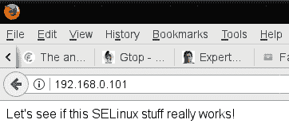
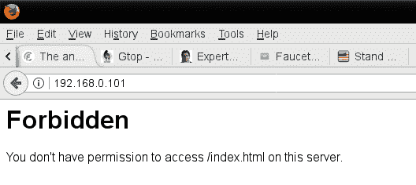
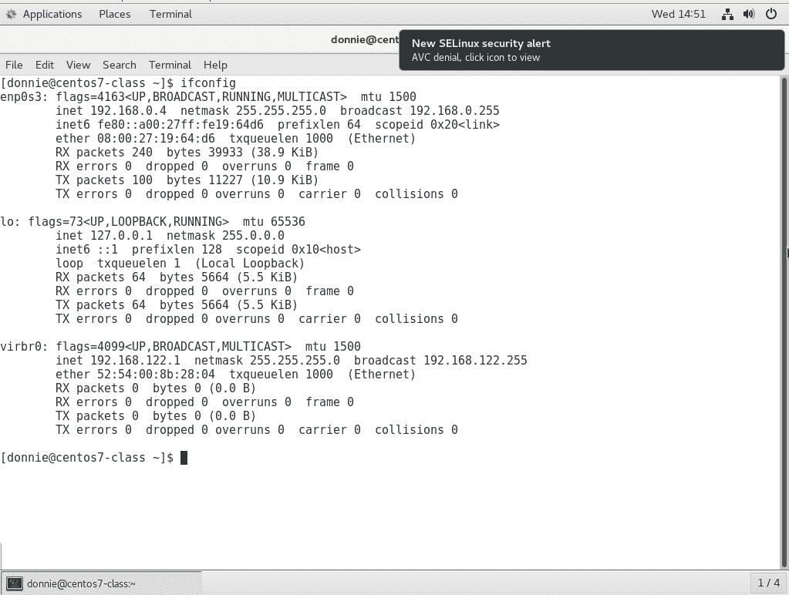
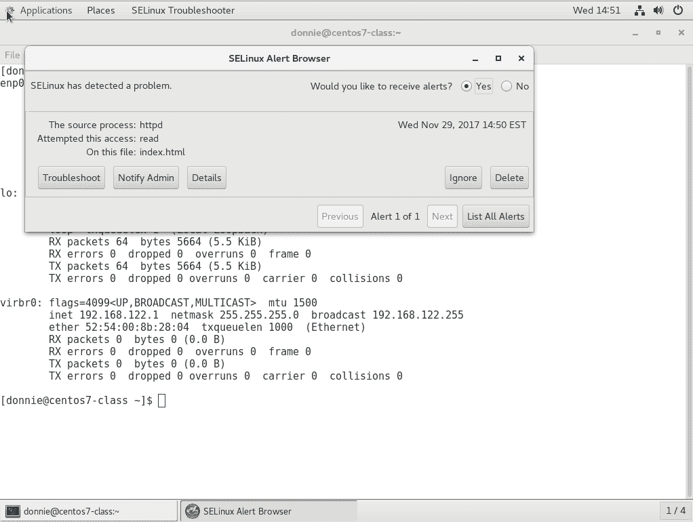
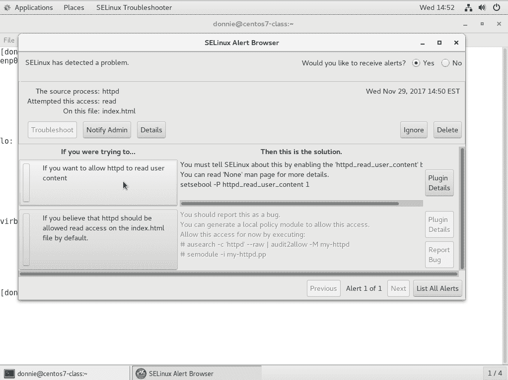
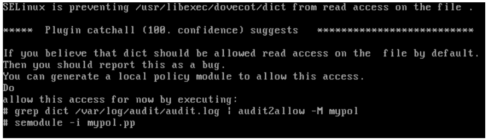
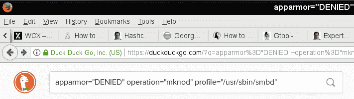
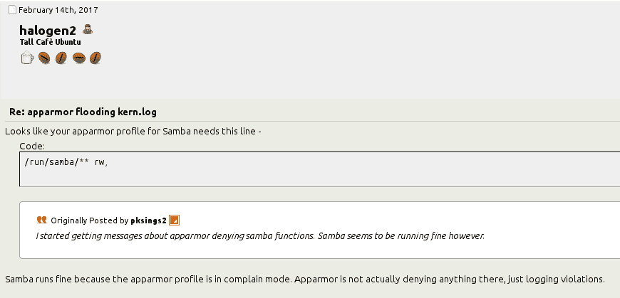

# 第七章：使用 SELinux 和 AppArmor 实施强制访问控制

在前几章中，我们看到，自主访问控制允许用户控制谁可以访问他们自己的文件和目录。但是，如果您的公司需要对谁访问什么拥有更多的管理控制权呢？为此，我们需要某种强制访问控制或 MAC。

我知道解释 DAC 和 MAC 之间的区别的最好方法是回想起我在海军时的日子。那时我在潜艇上工作，我必须有最高机密级别的许可才能做我的工作。使用 DAC，我有能力将我的最高机密级别的书带到餐厅，交给一个没有那个级别许可的厨师。使用 MAC，有规定阻止我这样做。在操作系统上，事情基本上是一样的。

Linux 有几种不同的 MAC 系统可用。本章将涵盖的两种是 SELinux 和 AppArmor。

在本章中，我们将涵盖以下主题：

+   SELinux 是什么以及它如何有益于系统管理员

+   如何为文件和目录设置安全上下文

+   如何使用 setroubleshoot 来排除 SELinux 问题

+   查看 SELinux 策略以及如何创建自定义策略

+   AppArmor 是什么以及它如何有益于系统管理员

+   查看 AppArmor 策略

+   使用 AppArmor 命令行实用程序

+   排除 AppArmor 问题

# SELinux 如何有益于系统管理员

SELinux 是由美国国家安全局开发的免费开源软件项目。虽然理论上它可以安装在任何 Linux 发行版上，但只有红帽类型的发行版才预先设置并启用了它。它使用 Linux 内核模块中的代码，以及文件系统扩展属性，以帮助确保只有经过授权的用户和进程才能访问敏感文件或系统资源。SELinux 有三种使用方式：

+   它可以帮助防止入侵者利用系统

+   它可以用来确保只有具有适当安全许可的用户才能访问标有安全分类的文件

+   除了 MAC，SELinux 还可以用作一种基于角色的访问控制

在本章中，我只会涵盖这三种用法中的第一种，因为这是 SELinux 最常用的方式。还有一个事实，涵盖这三种用法将需要写一整本书，而我在这里没有空间来做。

如果您阅读完这篇关于 SELinux 的介绍，发现您仍然需要更多关于 SELinux 的信息，您可以在 Packt Publishing 网站上找到关于这个主题的整本书和课程。

那么 SELinux 如何有益于繁忙的系统管理员呢？嗯，也许你还记得几年前，有关*Shellshock*漏洞的新闻震惊了世界。基本上，Shellshock 是 Bash shell 中的一个漏洞，允许入侵者通过获取 root 权限来入侵系统并利用它。对于运行 SELinux 的系统，入侵者仍然有可能入侵，但 SELinux 将阻止他们成功运行其利用程序。

SELinux 还是另一种可以帮助保护用户家目录中数据的机制。如果您有一台设置为网络文件系统服务器、Samba 服务器或 Web 服务器的机器，除非您明确配置 SELinux 允许该行为，否则 SELinux 将阻止这些守护程序访问用户的家目录。

在 Web 服务器上，您可以使用 SELinux 防止恶意 CGI 脚本或 PHP 脚本的执行。如果您的服务器不需要运行 CGI 或 PHP 脚本，您可以在 SELinux 中禁用它们。

在旧版本的 Docker 中，没有强制访问控制，普通用户很容易就能打破 Docker 容器并获得对主机的 root 级访问权限。尽管 Docker 的安全性已经得到改善，但 SELinux 仍然是加固运行 Docker 容器的服务器的有用工具。

现在，你可能认为每个人都会使用这样一个伟大的工具，对吗？遗憾的是，情况并非如此。在开始阶段，SELinux 因为难以使用而声名狼藉，许多管理员会选择禁用它。事实上，你在网上或 YouTube 上看到的很多教程都把*禁用 SELinux*作为第一步。在本节中，我想向你展示事情已经改善，SELinux 不再应该有坏名声。

# 为文件和目录设置安全上下文

把 SELinux 想象成一个被吹捧的标签系统。它通过扩展文件属性向文件和目录添加标签，称为*安全上下文*。它还向系统进程添加相同类型的标签，称为域。要在你的 CentOS 机器上查看这些上下文和域，可以使用`ls`或`ps`的`-Z`选项。例如，我的家目录中的文件和目录如下所示：

```
[donnie@localhost ~]$ ls -Z
drwxrwxr-x. donnie donnie unconfined_u:object_r:user_home_t:s0 acl_demo_dir
-rw-rw-r--. donnie donnie unconfined_u:object_r:user_home_t:s0 yum_list.txt
[donnie@localhost ~]$
```

我的系统上的进程看起来像这样：

```
[donnie@localhost ~]$ ps -Z
LABEL                             PID TTY          TIME CMD
unconfined_u:unconfined_r:unconfined_t:s0-s0:c0.c1023 1322 pts/0 00:00:00 bash
unconfined_u:unconfined_r:unconfined_t:s0-s0:c0.c1023 3978 pts/0 00:00:00 ps
[donnie@localhost ~]$
```

现在，让我们来分解一下。在`ls -Z`和`ps -Z`命令的输出中，我们有以下部分：

+   **SELinux 用户**：在这两种情况下，SELinux 用户是通用的`unconfined_u`

+   **SELinux 角色**：在`ls -Z`示例中，我们看到角色是`object_r`，在`ps -Z`示例中是`unconfined_r`

+   **类型**：在`ls -Z`输出中是`user_home_t`，在`ps -Z`输出中是`unconfined_t`

+   **敏感度**：在`ps -Z`输出中是`s0`。在`ps -Z`输出中是`s0-s0`

+   **类别**：在`ls -Z`输出中我们看不到类别，但在`ps -Z`输出中我们看到`c0.c1023`

在所有先前的安全上下文和安全域组件中，我们现在只关心类型。在本章中，我们只关心一个正常的 Linux 管理员需要了解的内容，以防止入侵者利用系统，而类型是我们需要使用的这些组件中的唯一一个。当我们设置高级的基于安全分类的访问控制和基于角色的访问控制时，所有其他组件都会发挥作用。

好的，这里是一个有些过于简化的解释，说明这如何帮助 Linux 管理员维护安全性。我们希望系统进程只能访问我们允许它们访问的对象。（系统进程包括诸如 Web 服务器守护程序、FTP 守护程序、Samba 守护程序和安全 Shell 守护程序等。对象包括文件、目录和网络端口等。）为了实现这一点，我们将为所有的进程和对象分配一个*类型*。然后我们将创建*策略*，定义哪些进程类型可以访问哪些对象类型。

幸运的是，当你安装任何红帽类型的发行版时，几乎所有的艰苦工作都已经为你完成。红帽类型的发行版都已经默认启用了 SELinux，并设置了针对的策略。把这个针对的策略想象成一个相对宽松的策略，允许普通桌面用户坐在电脑前进行业务操作，而不需要调整任何 SELinux 设置。但是，如果你是服务器管理员，你可能会发现自己需要调整这个策略，以允许服务器守护程序执行你需要它们执行的操作。

针对的策略，默认安装的策略是正常的 Linux 管理员在日常工作中会使用的。如果你查看你的 CentOS 虚拟机的存储库，你会发现还有其他几个，这些我们在本书中不会涉及。

# 安装 SELinux 工具

由于某种我永远无法理解的怪异原因，默认情况下不会安装您需要管理 SELinux 的工具，即使 SELinux 本身已经安装。因此，在您的 CentOS 虚拟机上，您需要做的第一件事是安装它们：

```
sudo yum install setools policycoreutils policycoreutils-python
```

在本章的后面部分，我们将看看如何使用 setroubleshoot 来帮助诊断 SELinux 问题。为了在那里查看一些很酷的错误消息，现在就安装 setroubleshoot，并通过重新启动`auditd`守护程序来激活它。（没有 setroubleshoot 守护程序，因为 setroubleshoot 是由`auditd`守护程序控制的。）我们有以下代码：

```
sudo yum install setroubleshoot
sudo service auditd restart
```

我们必须处理的一个小 systemd 怪癖是，当使用 systemd 守护程序时，你不能用正常的`systemctl`命令停止或重新启动`auditd`守护程序。然而，老式的`service`命令可以工作。（不，我不知道为什么。）

根据您在安装 CentOS 时选择的安装类型，您可能已经安装了 setroubleshoot，也可能没有。为了确保，继续运行命令来安装它。如果 setroubleshoot 已经存在，运行这个命令不会有任何问题。

现在你有了开始的所需。

# 在启用 SELinux 的情况下创建 Web 内容文件

现在，让我们看看如果您的 Web 内容文件设置了错误的 SELinux 类型会发生什么。首先，我们将在我们的 CentOS 虚拟机上安装、启用和启动 Apache Web 服务器。（请注意，包括`--now`选项允许我们在一个步骤中启用和启动守护程序。）我们有以下代码：

```
sudo yum install httpd
sudo systemctl enable --now httpd
```

如果您还没有这样做，您将希望配置防火墙以允许访问 Web 服务器：

```
[donnie@localhost ~]$ sudo firewall-cmd --permanent --add-service=http
success
[donnie@localhost ~]$ sudo firewall-cmd --reload
success
[donnie@localhost ~]$
```

当我们查看 Apache 进程的 SELinux 信息时，我们会看到这个：

```
[donnie@localhost ~]$ ps ax -Z | grep httpd
system_u:system_r:httpd_t:s0     3689 ?        Ss     0:00 /usr/sbin/httpd -DFOREGROUND
system_u:system_r:httpd_t:s0     3690 ?        S      0:00 /usr/sbin/httpd -DFOREGROUND
system_u:system_r:httpd_t:s0     3691 ?        S      0:00 /usr/sbin/httpd -DFOREGROUND
system_u:system_r:httpd_t:s0     3692 ?        S      0:00 /usr/sbin/httpd -DFOREGROUND
system_u:system_r:httpd_t:s0     3693 ?        S      0:00 /usr/sbin/httpd -DFOREGROUND
system_u:system_r:httpd_t:s0     3694 ?        S      0:00 /usr/sbin/httpd -DFOREGROUND
unconfined_u:unconfined_r:unconfined_t:s0-s0:c0.c1023 3705 pts/0 R+   0:00 grep --color=auto httpd
[donnie@localhost ~]$
```

就像我之前说的，我们对用户或角色不感兴趣。但是，我们对类型感兴趣，在这种情况下是`httpd_t`。

在红帽类型的系统上，我们通常会将 Web 内容文件放在`/var/www/html`目录中。让我们看看`html`目录的 SELinux 上下文：

```
[donnie@localhost www]$ pwd
/var/www
[donnie@localhost www]$ ls -Zd html/
drwxr-xr-x. root root system_u:object_r:httpd_sys_content_t:s0 html/
[donnie@localhost www]$
```

类型是`httpd_sys_content`，所以`httpd`守护程序应该能够访问这个目录。目前它是空的，所以让我们`cd`进入它并创建一个简单的索引文件：

```
[donnie@localhost www]$ cd html
[donnie@localhost html]$ pwd
/var/www/html
[donnie@localhost html]$ sudo vim index.html
```

我会把这个放到文件中，如下所示：

```
<html>
<head>
<title>
Test of SELinux
</title>
</head>
<body>
Let's see if this SELinux stuff really works!
</body>
</html>
```

好吧，就像我说的，这很简单，因为我的 HTML 手工编码技能已经不如以前了。但是，它仍然满足我们当前的目的。

查看 SELinux 上下文时，我们看到文件具有与`html`目录相同的类型：

```
[donnie@localhost html]$ ls -Z
-rw-r--r--. root root unconfined_u:object_r:httpd_sys_content_t:s0 index.html
[donnie@localhost html]$
```

现在我可以从我信任的 OpenSUSE 工作站的网络浏览器导航到这个页面：



现在，让我们看看如果我决定在自己的家目录中创建内容文件，然后将它们移动到`html`目录中会发生什么。首先，让我们看看我的新文件的 SELinux 上下文是什么：

```
[donnie@localhost ~]$ pwd
/home/donnie
[donnie@localhost ~]$ ls -Z index.html
-rw-rw-r--. donnie donnie unconfined_u:object_r:user_home_t:s0 index.html
[donnie@localhost ~]$
```

上下文类型现在是`user_home_t`，这是一个确切的指示，表明我是在我的家目录中创建的。我现在将文件移动到`html`目录，覆盖旧文件：

```
[donnie@localhost ~]$ sudo mv index.html /var/www/html/
[sudo] password for donnie:

[donnie@localhost ~]$ cd /var/www/html

[donnie@localhost html]$ ls -Z
-rw-rw-r--. donnie donnie unconfined_u:object_r:user_home_t:s0 index.html
[donnie@localhost html]$
```

即使我把文件移动到`/var/www/html`目录，SELinux 类型仍然与用户的家目录相关联。现在，我将转到我的主机机器的浏览器上刷新页面：



所以，我有一个小问题。分配给我的文件的类型与 httpd 守护程序进程的类型不匹配，因此 SELinux 不允许`httpd`进程访问该文件。

如果我将文件复制到`html`目录而不是移动它，SELinux 上下文将会改变以匹配目标目录的上下文。

# 修复不正确的 SELinux 上下文

好吧，所以我有这个没有人可以访问的 Web 内容文件，我真的不想创建一个新的。那我该怎么办呢？实际上，我们有三种不同的实用程序来解决这个问题：

+   `chcon`

+   `restorecon`

+   `semanage`

# 使用 chcon

有两种方法可以使用`chcon`来修复文件或目录上的不正确的 SELinux 类型。第一种方法是手动指定正确的类型：

```
[donnie@localhost html]$ sudo chcon -t httpd_sys_content_t index.html
[sudo] password for donnie:

[donnie@localhost html]$ ls -Z
-rw-rw-r--. donnie donnie unconfined_u:object_r:httpd_sys_content_t:s0 index.html
[donnie@localhost html]$
```

我们可以使用`chcon`来更改上下文的任何部分，但正如我一直在说的，我们只对类型感兴趣，这可以通过`-t`选项进行更改。您可以在`ls -Z`输出中看到命令成功执行了。

使用`chcon`的另一种方法是引用具有正确上下文的文件。出于演示目的，我将`index.html`文件更改回了主目录类型，并在`/var/www/html`目录中创建了一个新文件：

```
[donnie@localhost html]$ ls -Z
-rw-rw-r--. donnie donnie unconfined_u:object_r:user_home_t:s0 index.html
-rw-r--r--. root   root   unconfined_u:object_r:httpd_sys_content_t:s0 some_file.html
[donnie@localhost html]$
```

正如您所看到的，我在此目录中创建的任何文件都将自动具有正确的 SELinux 上下文设置。现在，让我们使用该新文件作为参考，以便在`index.html`文件上设置正确的上下文：

```
[donnie@localhost html]$ sudo chcon --reference some_file.html index.html
[sudo] password for donnie:

[donnie@localhost html]$ ls -Z
-rw-rw-r--. donnie donnie unconfined_u:object_r:httpd_sys_content_t:s0 index.html
-rw-r--r--. root   root   unconfined_u:object_r:httpd_sys_content_t:s0 some_file.html
[donnie@localhost html]$
```

因此，我使用了`--reference`选项，并指定了要用作参考的文件。要更改的文件列在命令的末尾。

现在，这一切都很好，但我想找到一种更简单的方法，不需要输入那么多。毕竟，我是个老人，不想过度劳累自己。因此，让我们来看看`restorecon`实用程序。

# 使用 restorecon

使用`restorecon`很容易。只需输入`restorecon`，然后输入需要更改的文件的名称。再次，我将`index.html`文件的上下文更改回了主目录类型。不过这次，我使用`restorecon`来设置正确的类型：

```
[donnie@localhost html]$ ls -Z
-rw-rw-r--. donnie donnie unconfined_u:object_r:user_home_t:s0 index.html

[donnie@localhost html]$ sudo restorecon index.html

[donnie@localhost html]$ ls -Z
-rw-rw-r--. donnie donnie unconfined_u:object_r:httpd_sys_content_t:s0 index.html
[donnie@localhost html]$
```

就是这样。

您还可以使用`chcon`和`restorecon`来更改整个目录及其内容的上下文。对于任何一个，只需使用`-R`选项。例如：

`sudo chcon -R -t httpd_sys_content_t /var/www/html/`

`sudo restorecon -R /var/www/html/`

（记住：`-R`代表递归。）

尽管这并不会影响我们访问此文件的能力，但仍然有最后一件事要处理。也就是说，我需要将文件的所有权更改为 Apache 用户：

```
[donnie@localhost html]$ sudo chown apache: index.html
[sudo] password for donnie:

[donnie@localhost html]$ ls -l
total 4
-rw-rw-r--. 1 apache apache 125 Nov 22 16:14 index.html
[donnie@localhost html]$
```

# 使用 semanage

在我刚刚提到的情况下，无论是`chcon`还是`restorecon`都可以满足您的需求。活动的 SELinux 策略规定了某些目录中的安全上下文应该是什么样子。只要您在活动的 SELinux 策略中定义的目录中使用`chcon`或`restorecon`，就没问题。但是假设您在其他地方创建了一个目录，想要用来提供网页内容文件。您需要在该目录及其中的所有文件上设置`httpd_sys_content_t`类型。但是，如果您使用`chcon`或`restorecon`进行操作，更改将无法在系统重新启动后保留。要使更改永久生效，您需要使用`semanage`。

出于某种奇怪的原因，假设我想要从`/home`目录中创建的目录中提供网页内容：

```
[donnie@localhost home]$ pwd
/home

[donnie@localhost home]$ sudo mkdir webdir
[sudo] password for donnie:

[donnie@localhost home]$ ls -Zd webdir
drwxr-xr-x. root root unconfined_u:object_r:home_root_t:s0 webdir
[donnie@localhost home]$
```

因为我不得不使用我的 sudo 权限在这里创建目录，它与 root 用户的`home_root_t`类型相关联，而不是正常的`user_home_dir_t`类型。我在此目录中创建的任何文件都将具有相同的类型：

```
[donnie@localhost webdir]$ ls -Z
-rw-r--r--. root root unconfined_u:object_r:home_root_t:s0 index.html
[donnie@localhost webdir]$
```

下一步是使用`semanage`将此目录和`httpd_sys_content_t`类型的永久映射添加到活动策略的上下文列表中：

```
[donnie@localhost home]$ sudo semanage fcontext -a -t httpd_sys_content_t "/home/webdir(/.*)?"

[donnie@localhost home]$ ls -Zd /home/webdir
drwxr-xr-x. root root unconfined_u:object_r:httpd_sys_content_t:s0 /home/web_dir
[donnie@localhost home]$
```

好的，这是`semanage`命令的详细说明：

+   `fcontext`：因为`semanage`有许多用途，我们必须指定我们要处理文件上下文。

+   `-a`：这指定我们要为活动的 SELinux 策略的上下文列表添加新记录。

+   `-t`：这指定了我们要映射到新目录的类型。在这种情况下，我们正在使用`httpd_sys_content`类型创建新映射。

+   `/home/webdir(/.*)?`：这一堆胡言乱语就是所谓的*正则表达式*。我不能在这里详细介绍正则表达式的细节，所以简单地说*正则表达式*是一种我们用来匹配文本模式的语言。（是的，我故意说*是*而不是*are*，因为正则表达式是整体语言的名称。）在这种情况下，我必须使用这个特定的正则表达式来使这个`semanage`命令递归，因为`semanage`没有`-R`选项开关。通过这个正则表达式，我是在说我希望在这个目录中创建的任何东西都具有与目录本身相同的 SELinux 类型。

最后一步是对该目录执行`restorecon -R`，以确保已设置正确的标签：

```
[donnie@localhost home]$ sudo restorecon -R webdir

[donnie@localhost home]$ ls -Zd /home/webdir
drwxr-xr-x. root root unconfined_u:object_r:httpd_sys_content_t:s0 /home/webdir
[donnie@localhost home]$
```

是的，我知道。你正在看着这个说，“*但是，这个'ls -Zd'输出看起来和你执行 semanage 命令之后一样*。”而且，你是对的。在运行`semanage`命令之后，类型似乎已经正确设置。但是`semanage-fcontext`手册上说无论如何都要运行`restorecon`，所以我就这么做了。

有关如何使用`semanage`管理安全上下文的更多信息，请参阅手册页，输入`man semanage-fcontext`。

# 实践实验室 - SELinux 类型强制执行

在这个实验室中，你将安装 Apache web 服务器和适当的 SELinux 工具。然后，你将查看将错误的 SELinux 类型分配给 web 内容文件的影响。

1.  安装 Apache，以及所有必需的 SELinux 工具：

```
 sudo yum install httpd setroubleshoot setools 
 policycoreutils policycoreutils-python
```

1.  通过重新启动`auditd`服务来激活 setroubleshoot：

```
        sudo service auditd restart
```

1.  启用并启动 Apache 服务，并在防火墙上打开端口`80`：

```
 sudo systemctl enable --now httpd
 sudo firewall-cmd --permanent --add-service=http
 sudo firewall-cmd --reload
```

1.  在`/var/www/html`目录中，创建一个带有以下内容的`index.html`文件：

```
        <html>
          <head>
            <title>SELinux Test Page</title>
          </head>
          <body>
            This is a test of SELinux.
          </body>
        </html>
```

1.  查看`index.html`文件的 SELinux 信息：

```
 ls -Z index.html
```

1.  在主机机器的 web 浏览器中，导航到 CentOS 虚拟机的 IP 地址。你应该能够查看页面。

1.  通过将`index.html`文件的类型更改为不正确的内容来引发 SELinux 违规：

```
 sudo chcon -t tmp_t index.html
 ls -Z index.html
```

1.  返回到主机的 web 浏览器，重新加载文档。现在你应该看到一个 Forbidden 消息。

1.  使用`restorecon`将文件更改回正确的类型：

```
 sudo restorecon index.html
```

1.  在主机机器的 web 浏览器中重新加载页面。现在你应该能够查看页面了。

# 使用 setroubleshoot 进行故障排除

所以，你现在正在挠头说，“*当我无法访问我应该能够访问的东西时，我怎么知道这是一个 SELinux 问题呢？*”啊，我很高兴你问到了。

# 查看 setroubleshoot 消息

每当发生违反 SELinux 规则的事件时，它都会被记录在`/var/log/audit/audit.log`文件中。有工具可以让你直接读取该日志，但是为了诊断 SELinux 问题，最好使用 setroubleshoot。setroubleshoot 的美妙之处在于它将`audit.log`文件中晦涩难懂、难以解释的 SELinux 消息翻译成通俗易懂的语言。它发送到`/var/log/messages`文件的消息甚至包含了如何解决问题的建议。为了展示这是如何工作的，让我们回到我们的问题，即`/var/www/html`目录中的文件被分配了错误的 SELinux 类型。当然，我们立刻就知道问题所在，因为那个目录中只有一个文件，简单的`ls -Z`就显示了它的问题。然而，暂且不管这个问题，假设我们不知道问题所在。通过在`less`中打开`/var/log/messages`文件并搜索`sealert`，我们会找到这条消息：

```
Nov 26 21:30:21 localhost python: SELinux is preventing httpd from open access on the file /var/www/html/index.html.#012#012*****  Plugin restorecon (92.2 confidence) suggests   ************************#012#012If you want to fix the label. #012/var/www/html/index.html default label should be httpd_sys_content_t.#012Then you can run restorecon.#012Do#012# /sbin/restorecon -v /var/www/html/index.html#012#012*****  Plugin catchall_boolean (7.83 confidence) suggests   ******************#012#012If you want to allow httpd to read user content#012Then you must tell SELinux about this by enabling the 'httpd_read_user_content' boolean.#012#012Do#012setsebool -P httpd_read_user_content 1#012#012*****  Plugin catchall (1.41 confidence) suggests   **************************#012#012If you believe that httpd should be allowed open access on the index.html file by default.#012Then you should report this as a bug.#012You can generate a local policy module to allow this access.#012Do#012allow this access for now by executing:#012# ausearch -c 'httpd' --raw | audit2allow -M my-httpd#012# semodule -i my-httpd.pp#012
```

这条消息的第一行告诉我们问题所在。它说 SELinux 正在阻止我们访问`/var/www/html/index.html`文件，因为它的类型设置错误。然后给了我们几个修复问题的建议，第一个是运行`restorecon`命令，就像我已经告诉你怎么做了一样。

阅读这些 setroubleshoot 消息时要记住的一个好的经验法则是，消息中的第一个建议通常是可以解决问题的。

# 使用图形 setroubleshoot 实用程序

到目前为止，我只谈到了在文本模式服务器上使用 setroubleshoot。毕竟，很常见看到运行在文本模式下的 Linux 服务器，所以我们所有的 Linux 用户都必须成为文本模式的战士。但是在桌面系统或安装了桌面界面的服务器上，有一个图形实用程序，当 setroubleshoot 检测到问题时会自动提醒你：



点击那个警报图标，你会看到这个：



点击“故障排除”按钮，你将看到如何解决问题的建议列表：



通常情况下，这些 GUI 工具都很容易理解，所以你不应该在理解上遇到任何问题。

# 在宽容模式下进行故障排除

如果你遇到像我刚刚展示的这样简单的问题，那么你可能可以假设 setroubleshoot 消息中的第一个建议告诉你的是安全的。但是有时候会出现更复杂的情况，可能会有多个问题。在这种情况下，你需要使用*宽容模式*。

当你首次安装 Red Hat 或 CentOS 系统时，SELinux 处于*强制模式*，这是默认设置。这意味着 SELinux 实际上会阻止违反活动 SELinux 策略的操作。这也意味着，如果在尝试执行某个操作时出现多个 SELinux 问题，SELinux 将在第一次违规后停止该操作。当发生这种情况时，SELinux 甚至不会看到剩下的问题，并且它们不会出现在`messages`日志文件中。如果你在强制模式下尝试解决这些类型的问题，你就像是追逐自己尾巴的狗一样。你会一直转圈，却一事无成。

在宽容模式下，SELinux 允许违反策略的操作发生，但会记录它们。切换到宽容模式并做一些引发你之前看到的问题的操作，被禁止的操作将发生，但 setroubleshoot 会在`messages`文件中记录所有这些操作。这样，你就能更好地了解需要做什么来使事情正常运行。

首先，让我们使用`getenforce`来验证我们当前的模式是什么：

```
[donnie@localhost ~]$ sudo getenforce
Enforcing
[donnie@localhost ~]$
```

现在，让我们临时将系统置于宽容模式：

```
[donnie@localhost ~]$ sudo setenforce 0

[donnie@localhost ~]$ sudo getenforce
Permissive
[donnie@localhost ~]$
```

当我说“临时”时，我的意思是这只会持续到系统重启。重启后，你将回到强制模式。另外，请注意，在`setenforce`后的`0`表示我正在设置宽容模式。在完成故障排除后返回强制模式，将`0`替换为`1`：

```
[donnie@localhost ~]$ sudo setenforce 1

[donnie@localhost ~]$ sudo getenforce
Enforcing
[donnie@localhost ~]$
```

我们现在又回到了强制模式。

有时候，你可能需要在系统重启后使宽容模式持久化。一个例子是，如果你需要处理一个长时间禁用 SELinux 的系统。在这种情况下，你不应该只是将 SELinux 设置为强制模式然后重启。如果你这样做，系统将需要很长时间才能正确创建使 SELinux 工作的文件和目录标签，而在完成之前系统可能会锁死。首先将系统置于宽容模式，可以避免系统锁死，尽管重新标记过程仍然需要很长时间才能完成。

要使宽容模式在系统重启后持久化，你需要编辑`/etc/sysconfig`目录中的`selinux`文件。默认情况下，它是这样的：

```
# This file controls the state of SELinux on the system.
# SELINUX= can take one of these three values:
#     enforcing - SELinux security policy is enforced.
#     permissive - SELinux prints warnings instead of enforcing.
#     disabled - No SELinux policy is loaded.
SELINUX=enforcing
# SELINUXTYPE= can take one of three two values:
#     targeted - Targeted processes are protected,
#     minimum - Modification of targeted policy. Only selected processes are protected.
#     mls - Multi Level Security protection.
SELINUXTYPE=targeted
```

你在这里看到的两个重要信息是 SELinux 处于强制模式，并且正在使用目标策略。要切换到宽容模式，只需更改`SELINUX=`行，并保存文件：

```
# This file controls the state of SELinux on the system.
# SELINUX= can take one of these three values:
#     enforcing - SELinux security policy is enforced.
#     permissive - SELinux prints warnings instead of enforcing.
#     disabled - No SELinux policy is loaded.
SELINUX=permissive
# SELINUXTYPE= can take one of three two values:
#     targeted - Targeted processes are protected,
#     minimum - Modification of targeted policy. Only selected processes are protected.
#     mls - Multi Level Security protection.
SELINUXTYPE=targeted
```

`sestatus`实用程序向我们展示了关于 SELinux 正在发生的许多有趣信息：

```
[donnie@localhost ~]$ sudo sestatus
SELinux status:                 enabled
SELinuxfs mount:                /sys/fs/selinux
SELinux root directory:         /etc/selinux
Loaded policy name:             targeted
Current mode:                   enforcing
Mode from config file:          permissive
Policy MLS status:              enabled
Policy deny_unknown status:     allowed
Max kernel policy version:      28
[donnie@localhost ~]$
```

这里我们感兴趣的两个项目是当前模式和配置文件中的模式。通过将配置文件更改为宽松模式，我们并没有改变当前运行模式。所以，我们仍然处于强制模式。切换到宽松模式要么是在我重新启动这台机器之前，要么是通过发出`sudo setenforce 0`命令手动切换。当然，你不希望永远保持在宽松模式。一旦你不再需要宽松模式，将配置文件改回强制模式，并执行`sudo setenforce 1`来改变运行模式。

# 处理 SELinux 策略

到目前为止，我们只看到了当文件上设置了不正确的 SELinux 类型时会发生什么，以及如何设置正确的类型。我们可能会遇到的另一个问题是，我们需要允许一个被活动 SELinux 策略禁止的操作。

# 查看布尔值

布尔值是 SELinux 策略的一部分，每个布尔值代表一个二进制选择。在 SELinux 策略中，一个布尔值要么允许某事，要么禁止某事。要查看系统上的所有布尔值，请运行`getsebool -a`命令。（这是一个很长的列表，所以我只会在这里显示部分输出。）：

```
[donnie@localhost ~]$ getsebool -a
abrt_anon_write --> off
abrt_handle_event --> off
abrt_upload_watch_anon_write --> on
antivirus_can_scan_system --> off
antivirus_use_jit --> off
auditadm_exec_content --> on
. . .
. . .
xserver_object_manager --> off
zabbix_can_network --> off
zarafa_setrlimit --> off
zebra_write_config --> off
zoneminder_anon_write --> off
zoneminder_run_sudo --> off
[donnie@localhost ~]$
```

要查看多个布尔值，`-a`开关是必需的。如果你碰巧知道你想要查看的布尔值的名称，可以不加`-a`，直接列出布尔值。继续我们之前讨论的 Apache Web 服务器主题，让我们看看是否允许 Apache 访问用户的主目录中的文件：

```
[donnie@localhost html]$ getsebool httpd_enable_homedirs
httpd_enable_homedirs --> off
[donnie@localhost html]$
```

这个布尔值是`off`，这意味着 Apache 服务器守护程序不被允许访问用户主目录中的任何内容。这是一个重要的保护，你真的不想改变它。相反，只需将 Web 内容文件放在其他地方，这样你就不必改变这个布尔值。

很可能，你很少想要查看整个列表，你可能也不知道你想要查看的具体布尔值的名称。相反，你可能想通过`grep`筛选输出，以便只查看某些内容。例如，要查看影响 Web 服务器的所有布尔值，请按照以下步骤：

```
[donnie@localhost html]$ getsebool -a | grep 'http'
httpd_anon_write --> off
httpd_builtin_scripting --> on
httpd_can_check_spam --> off
httpd_can_connect_ftp --> off
httpd_can_connect_ldap --> off
httpd_can_connect_mythtv --> off
httpd_can_connect_zabbix --> off
httpd_can_network_connect --> off
. . .
. . .
httpd_use_nfs --> off
httpd_use_openstack --> off
httpd_use_sasl --> off
httpd_verify_dns --> off
named_tcp_bind_http_port --> off
prosody_bind_http_port --> off
[donnie@localhost html]$
```

这也是一个相当长的列表，但向下滚动一段时间，你会找到你要找的布尔值。

# 配置布尔值

实际上，你可能永远不会有理由允许用户从他们的主目录中提供 Web 内容。更有可能的是，你会设置类似 Samba 服务器的东西，这将允许 Windows 机器上的用户使用他们的图形 Windows 资源管理器访问 Linux 服务器上的主目录。但是，如果你设置了 Samba 服务器并且没有对 SELinux 做任何操作，用户将抱怨他们在 Samba 服务器的主目录中看不到任何文件。因为你是积极主动的类型，你不想听到用户的抱怨，你肯定会配置 SELinux 以允许 Samba 守护程序访问用户的主目录。你可能不知道具体的布尔值名称，但你可以很容易地找到它，如下所示：

```
[donnie@localhost html]$ getsebool -a | grep 'home'
git_cgi_enable_homedirs --> off
git_system_enable_homedirs --> off
httpd_enable_homedirs --> off
mock_enable_homedirs --> off
mpd_enable_homedirs --> off
openvpn_enable_homedirs --> on
samba_create_home_dirs --> off
samba_enable_home_dirs --> off
sanlock_enable_home_dirs --> off
spamd_enable_home_dirs --> on
ssh_chroot_rw_homedirs --> off
tftp_home_dir --> off
use_ecryptfs_home_dirs --> off
use_fusefs_home_dirs --> off
use_nfs_home_dirs --> off
use_samba_home_dirs --> off
xdm_write_home --> off
[donnie@localhost html]$
```

好吧，你知道布尔值的名称可能有`home`这个词，所以你筛选了这个词。在列表的中间位置，你会看到`samba_enable_home_dirs --> off`。你需要将其更改为`on`，以便让用户从他们的 Windows 机器访问他们的主目录：

```
[donnie@localhost html]$ sudo setsebool samba_enable_home_dirs on

[sudo] password for donnie:
[donnie@localhost html]$ getsebool samba_enable_home_dirs
samba_enable_home_dirs --> on
[donnie@localhost html]$
```

用户现在可以访问他们应该能够访问的主目录，但只有在系统重新启动之前。没有`-P`选项，你用`setsebool`做的任何更改都只是临时的。所以，让我们使用`-P`使更改永久生效：

```
[donnie@localhost html]$ sudo setsebool -P samba_enable_home_dirs on

[donnie@localhost html]$ getsebool samba_enable_home_dirs
samba_enable_home_dirs --> on
[donnie@localhost html]$
```

恭喜，你刚刚对 SELinux 策略进行了第一次更改。

# 保护你的 Web 服务器

再次查看`getsebool -a | grep 'http'`命令的输出，您会发现大多数与 httpd 相关的布尔值默认处于关闭状态，只有少数处于打开状态。在设置 Web 服务器时，有两个布尔值是您通常需要打开的。

如果您需要设置一个带有某种基于 PHP 的内容管理系统的网站，例如 Joomla 或 Wordpress，您可能需要打开`httpd_unified`布尔值。如果关闭此布尔值，Apache Web 服务器将无法与 PHP 引擎的所有组件正确交互：

```
[donnie@localhost ~]$ getsebool httpd_unified
httpd_unified --> off

[donnie@localhost ~]$ sudo setsebool -P httpd_unified on
[sudo] password for donnie:
[donnie@localhost ~]$ getsebool httpd_unified
httpd_unified --> on
[donnie@localhost ~]$
```

你通常需要打开的另一个布尔值是`httpd_can_sendmail`布尔值。如果您需要网站通过表单发送邮件，或者需要设置带有基于 Web 的前端的邮件服务器，那么您肯定需要将其设置为`on`：

```
[donnie@localhost ~]$ getsebool httpd_can_sendmail
httpd_can_sendmail --> off

[donnie@localhost ~]$ sudo setsebool -P httpd_can_sendmail on

[donnie@localhost ~]$ getsebool httpd_can_sendmail
httpd_can_sendmail --> on
[donnie@localhost ~]$
```

另一方面，默认情况下有一些布尔值是打开的，您可能需要考虑是否真的需要打开它们。例如，允许在 Web 服务器上运行 CGI 脚本确实代表潜在的安全风险。如果入侵者以某种方式上传了恶意的 CGI 脚本到服务器并运行它，可能会造成很大的损害。然而，出于某种奇怪的原因，默认的 SELinux 策略允许运行 CGI 脚本。如果您绝对确定在您的服务器上托管网站的人永远不需要运行 CGI 脚本，您可能需要考虑关闭此布尔值：

```
[donnie@localhost ~]$ getsebool httpd_enable_cgi
httpd_enable_cgi --> on

[donnie@localhost ~]$ sudo setsebool -P httpd_enable_cgi off

[donnie@localhost ~]$ getsebool httpd_enable_cgi
httpd_enable_cgi --> off
[donnie@localhost ~]$
```

# 保护网络端口

在您的系统上运行的每个网络守护程序都有一个特定的网络端口或一组网络端口分配给它，它将在这些端口上监听。`/etc/services`文件包含常见守护程序及其关联的网络端口列表，但它不能阻止某人配置守护程序监听某些非标准端口。因此，如果没有一些机制来阻止它，一些狡猾的入侵者可能会植入某种恶意软件，导致守护程序监听非标准端口，可能会监听来自其主机的命令。

SELinux 通过只允许守护程序监听某些端口来防止此类恶意活动。使用`semanage`查看允许端口的列表：

```
[donnie@localhost ~]$ sudo semanage port -l
[sudo] password for donnie:
SELinux Port Type              Proto    Port Number

afs3_callback_port_t           tcp      7001
afs3_callback_port_t           udp      7001
afs_bos_port_t                 udp      7007
afs_fs_port_t                  tcp      2040
afs_fs_port_t                  udp      7000, 7005
afs_ka_port_t                  udp      7004
afs_pt_port_t                  tcp      7002
afs_pt_port_t                  udp      7002
afs_vl_port_t                  udp      7003
. . .
. . .
zebra_port_t                   tcp      2606, 2608-2609, 2600-2604
zebra_port_t                   udp      2606, 2608-2609, 2600-2604
zented_port_t                  tcp      1229
zented_port_t                  udp      1229
zookeeper_client_port_t        tcp      2181
zookeeper_election_port_t      tcp      3888
zookeeper_leader_port_t        tcp      2888
zope_port_t                    tcp      8021
[donnie@localhost ~]$
```

这又是一个非常长的列表，所以我只显示部分输出。不过，让我们缩小范围。假设我只想查看 Apache Web 服务器可以监听的端口列表。为此，我将使用我的好朋友`grep`：

```
[donnie@localhost ~]$ sudo semanage port -l | grep 'http'
[sudo] password for donnie:
http_cache_port_t              tcp      8080, 8118, 8123, 10001-10010
http_cache_port_t              udp      3130
http_port_t                    tcp      80, 81, 443, 488, 8008, 8009, 8443, 9000
pegasus_http_port_t            tcp      5988
pegasus_https_port_t           tcp      5989
[donnie@localhost ~]$
```

有几个`http`项目，但我只对`http_port_t`项目感兴趣，因为它会影响正常的 Web 服务器操作。我们在这里看到 SELinux 将允许 Apache 监听端口`80`，`81`，`443`，`488`，`8008`，`8009`，`8443`和`9000`。由于 Apache 服务器是您可能有合法理由添加非标准端口的最有可能的守护程序，让我们以此为例。

首先，让我们进入`/etc/httpd/conf/httpd.conf`文件，并查看 Apache 当前正在监听的端口。搜索`Listen`，您会看到以下行：

```
Listen 80
```

我在这台机器上没有安装 SSL 模块，但如果我安装了，我将在`/etc/httpd/conf.d`目录中有一个`ssl.conf`文件，其中包含以下行：

```
Listen 443
```

因此，对于正常的非加密网站连接，默认配置只有 Apache 监听端口`80`。对于安全的加密网站连接，Apache 监听端口`443`。现在，让我们进入`httpd.conf`文件，并将`Listen 80`更改为 SELinux 不允许的端口号。例如，端口`82`：

```
Listen 82
```

保存文件后，我将重新启动 Apache 以读取新的配置：

```
[donnie@localhost ~]$ sudo systemctl restart httpd
Job for httpd.service failed because the control process exited with error code. See "systemctl status httpd.service" and "journalctl -xe" for details.
[donnie@localhost ~]$
```

是的，我有问题。我将查看`/var/log/messages`文件，看看 setroubleshoot 是否给了我一些线索：

```
Nov 29 16:39:21 localhost python: SELinux is preventing /usr/sbin/httpd from name_bind access on the tcp_socket port 82.#012#012***** Plugin bind_ports (99.5 confidence) suggests ************************#012#012If you want to allow /usr/sbin/httpd to bind to network port 82#012Then you need to modify the port type.#012Do#012# semanage port -a -t PORT_TYPE -p tcp 82#012 where PORT_TYPE is one of the following: http_cache_port_t, http_port_t, jboss_management_port_t, jboss_messaging_port_t, ntop_port_t, puppet_port_t.#012#012***** Plugin catchall (1.49 confidence) suggests **************************#012#012If you believe that httpd should be allowed name_bind access on the port 82 tcp_socket by default.#012Then you should report this as a bug.#012You can generate a local policy module to allow this access.#012Do#012allow this access for now by executing:#012# ausearch -c 'httpd' --raw | audit2allow -M my-httpd#012# semodule -i my-httpd.pp#012
```

SELinux 阻止`httpd`绑定到端口`82`的问题在消息的第一行中定义。我们看到的第一个修复建议是使用`semanage`将端口添加到允许端口列表中。因此，让我们这样做，并查看 Apache 端口列表：

```
[donnie@localhost ~]$ sudo semanage port -a 82 -t http_port_t -p tcp

[donnie@localhost ~]$ sudo semanage port -l | grep 'http_port_t'
http_port_t                    tcp      82, 80, 81, 443, 488, 8008, 8009, 8443, 9000
pegasus_http_port_t            tcp      5988
[donnie@localhost ~]$
```

在 setroubleshoot 消息中并不清楚，但您需要在`port -a`之后指定要添加的端口号。`-t http_port_t`指定要添加端口的类型，`-p tcp`指定要使用 TCP 协议。

现在，真相即将揭晓。Apache 守护程序这次会启动吗？让我们看看：

```
[donnie@localhost ~]$ sudo systemctl restart httpd
[sudo] password for donnie:
[donnie@localhost ~]$ sudo systemctl status httpd
● httpd.service - The Apache HTTP Server
 Loaded: loaded (/usr/lib/systemd/system/httpd.service; enabled; vendor preset: disabled)
 Active: active (running) since Wed 2017-11-29 20:09:51 EST; 7s ago
 Docs: man:httpd(8)
. . .
. . .
```

它起作用了，我们已经实现了酷炫。但是现在，我决定不再需要这个古怪的端口。删除它就像添加它一样容易：

```
[donnie@localhost ~]$ sudo semanage port -d 82 -t http_port_t -p tcp

[donnie@localhost ~]$ sudo semanage port -l | grep 'http_port_t'
http_port_t                    tcp      80, 81, 443, 488, 8008, 8009, 8443, 9000
pegasus_http_port_t            tcp      5988
[donnie@localhost ~]$
```

我所要做的就是用`port -d`替换`port -a`。当然，我还需要进入`/etc/httpd/conf/httpd.conf`文件，将`Listen 82`改回`Listen 80`。

# 创建自定义策略模块

有时，您会遇到无法通过更改类型或设置布尔值来解决的问题。在这种情况下，您需要创建一个自定义策略模块，并使用`audit2allow`实用程序来执行此操作。

这是几年前我遇到的一个问题的屏幕截图，当时我正在帮助客户在 CentOS 7 上设置 Postfix 邮件服务器：



因为某种我从未理解的奇怪原因，SELinux 不允许 Dovecot（邮件服务器的邮件传递代理组件）读取自己的`dict`文件。没有布尔值可更改，也没有类型问题，因此 setroubleshoot 建议我创建一个自定义策略模块。这很容易做到，但您需要知道这在普通用户帐户上使用 sudo 不起作用。这是那些罕见时刻之一，您只需转到 root 用户命令提示符，并且还需要在 root 用户的主目录中：

```
sudo su -
```

在执行此操作之前，请确保将 SELinux 设置为宽松模式，然后执行某些操作以引发 SELinux 错误。这样，您就可以确保一个问题不会掩盖其他问题。

当您运行命令创建新的策略模块时，请确保用自己选择的自定义策略名称替换`mypol`。在我的情况下，我将模块命名为`dovecot_dict`，命令看起来是这样的：

```
grep dict /var/log/audit/audit.log | audit2allow -M dovecot_dict
```

我在这里做的是使用`grep`搜索`audit.log`文件中包含单词`dict`的 SELinux 消息。然后我将该输出传输到`audit2allow`，并使用`-M`选项创建一个名为`dovecot_dict`的自定义模块。

创建新的策略模块后，我将其插入 SELinux 策略中，如下所示：

```
semodule -i dovecot_dict.pp
```

还有第二个问题需要另一个自定义模块，但我只是重复了这个过程以生成另一个不同名称的模块。完成所有这些后，我重新加载了 SELinux 策略，以使我的新模块生效：

```
semodule -R
```

对于`semodule`，`-R`开关代表重新加载，而不是像大多数 Linux 命令那样递归。

完成所有这些后，我将 SELinux 重新设置为强制模式，并退出到自己的用户帐户。然后，我测试了设置以确保我已经解决了问题。

当然，您还要记住，您不希望每次在日志文件中看到`sealert`消息时都修改 SELinux 策略或上下文。例如，考虑一下我设置主要用于运行 Docker 和 Docker 容器的 Oracle Linux 7 机器的`messages`文件中的这段代码：

```
Jun  8 19:32:17 docker-1 setroubleshoot: SELinux is preventing /usr/bin/docker from getattr access on the file /etc/exports. For complete SELinux messages. run sealert -l b267929a-d3ad-45d5-806e-907449fc2739
Jun  8 19:32:17 docker-1 python: SELinux is preventing /usr/bin/docker from getattr access on the file /etc/exports.#012#012*****  Plugin catchall (100\. confidence) suggests   **************************#012#012If you believe that docker should be allowed getattr access on the exports file by default.#012Then you should report this as a bug.#012You can generate a local policy module to allow this access.#012Do#012allow this access for now by executing:#012# grep docker /var/log/audit/audit.log | audit2allow -M mypol#012# semodule -i mypol.pp#012
Jun  8 19:32:17 docker-1 setroubleshoot: SELinux is preventing /usr/bin/docker from getattr access on the file /etc/shadow.rpmnew. For complete SELinux messages. run sealert -l bc566655-1fbc-4141-af48-ccd6c76a3d3b
Jun  8 19:32:17 docker-1 python: SELinux is preventing /usr/bin/docker from getattr access on the file /etc/shadow.rpmnew.#012#012*****  Plugin catchall (100\. confidence) suggests   **************************#012#012If you believe that docker should be allowed getattr access on the shadow.rpmnew file by default.#012Then you should report this as a bug.#012You can generate a local policy module to allow this access.#012Do#012allow this access for now by executing:#012# grep docker /var/log/audit/audit.log | audit2allow -M mypol#012# semodule -i mypol.pp#012
```

这些消息是由早期版本的 Docker 尝试访问主机上的资源引起的。正如您所看到的，Docker 正在尝试访问一些相当敏感的文件，而 SELinux 正在阻止 Docker 这样做。对于早期版本的 Docker 而言，如果没有某种强制访问控制，普通的非特权用户很容易就能够从 Docker 容器中逃脱，并在主机系统上拥有 root 用户权限。当您看到这些消息时，您不希望自动告诉 SELinux 允许被禁止的操作。这可能是 SELinux 正在阻止某些真正糟糕的事情发生。

请确保在以下网址获取您的*SELinux 着色书*：[`opensource.com/business/13/11/selinux-policy-guide.`](https://opensource.com/business/13/11/selinux-policy-guide)

# 实践实验 - SELinux 布尔值和端口

在这个实验中，您将查看 Apache 尝试在未经授权的端口上监听的效果：

1.  查看 SELinux 允许 Apache Web 服务器守护程序使用的端口：

```
 sudo semanage port -l | grep 'http'
```

1.  在您喜欢的文本编辑器中打开`/etc/httpd/conf/httpd.conf`文件。找到`Listen 80`的那一行，并将其更改为`Listen 82`。输入以下内容重新启动 Apache：

```
        sudo systemctl restart httpd
```

1.  输入以下内容查看您收到的错误消息：

```
 sudo tail -20 /var/log/messages
```

1.  将端口`82`添加到授权端口列表并重新启动 Apache：

```
        sudo semanage port -a 82 -t http_port_t -p tcp
 sudo semanage port -l
 sudo systemctl restart httpd
```

1.  删除您刚刚添加的端口：

```
 sudo semanage -d 82 -t http_port_t -p tcp
```

1.  返回`/etc/httpd/conf/httpd.conf`文件，并将`Listen 82`改回`Listen 80`。重新启动 Apache 守护程序以恢复正常操作。

# AppArmor 如何有益于系统管理员

AppArmor 是与 SUSE 和 Ubuntu Linux 系列一起安装的强制访问控制系统。尽管它的设计几乎与 SELinux 完成相同的工作，但其操作模式有很大的不同：

+   SELinux 为所有系统进程和文件、目录或网络端口等所有对象打上标签。对于文件和目录，SELinux 将标签存储在它们各自的 inode 中作为扩展属性。（inode 是包含有关文件的所有信息的基本文件系统组件，除了文件名。）

+   AppArmor 使用路径名强制执行，这意味着您要指定要 AppArmor 控制的可执行文件的路径。这样，就不需要将标签插入文件或目录的扩展属性中。

+   使用 SELinux，您可以立即获得系统范围的保护。

+   使用 AppArmor，您可以为每个单独的应用程序创建一个配置文件。

+   无论是 SELinux 还是 AppArmor，您可能会偶尔发现自己不得不从头开始创建自定义策略模块，特别是如果您正在处理第三方应用程序或自制软件。使用 AppArmor 会更容易，因为编写 AppArmor 配置文件的语法比编写 SELinux 策略的语法要简单得多。而且，AppArmor 配备了可以帮助您自动化该过程的实用程序。

+   就像 SELinux 一样，AppArmor 可以帮助防止恶意行为者破坏您的一天，并保护用户数据。

因此，您可以看到 SELinux 和 AppArmor 都有优点和缺点，许多 Linux 管理员对自己更喜欢的那个有着强烈的感受。（为了避免被卷入争论，我将不表达自己的偏好。）另外，请注意，即使我们正在使用 Ubuntu 虚拟机，我在这里提供的信息，除了特定于 Ubuntu 的软件包安装命令之外，也适用于 SUSE Linux 发行版。

# 查看 AppArmor 配置文件

在`/etc/apparmor.d`目录中，您将看到系统的 AppArmor 配置文件。（SELinux 的人说策略，但 AppArmor 的人说配置文件。）

```
donnie@ubuntu3:/etc/apparmor.d$ ls -l
total 72
drwxr-xr-x 5 root root  4096 Oct 29 15:21 abstractions
drwxr-xr-x 2 root root  4096 Nov 15 09:34 cache
drwxr-xr-x 2 root root  4096 Oct 29 14:43 disable
drwxr-xr-x 2 root root  4096 Apr  5  2016 force-complain
drwxr-xr-x 2 root root  4096 Oct 29 15:21 local
drwxr-xr-x 2 root root  4096 Oct 29 15:02 lxc
-rw-r--r-- 1 root root   198 Jun 14 16:15 lxc-containers
-rw-r--r-- 1 root root  3310 Apr 12  2016 sbin.dhclient
drwxr-xr-x 5 root root  4096 Oct 29 15:21 tunables
-rw-r--r-- 1 root root   125 Jun 14 16:15 usr.bin.lxc-start
-rw-r--r-- 1 root root   281 May 23  2017 usr.lib.lxd.lxd-bridge-proxy
-rw-r--r-- 1 root root 17667 Oct 18 05:04 usr.lib.snapd.snap-confine.real
-rw-r--r-- 1 root root  1527 Jan  5  2016 usr.sbin.rsyslogd
-rw-r--r-- 1 root root  1469 Sep  8 15:27 usr.sbin.tcpdump
donnie@ubuntu3:/etc/apparmor.d$
```

`sbin.dhclient`文件和`usr.*`文件都是 AppArmor 配置文件。您还会在`lxc`和`lxc-containers`子目录中找到其他一些配置文件。不过，在应用程序配置文件方面，这里并没有太多内容。

由于某种原因，OpenSUSE 的默认安装比 Ubuntu Server 安装了更多的配置文件。要在 Ubuntu 上安装更多配置文件，请使用以下命令：

`sudo apt install apparmor-profiles apparmor-profiles-extra`

在`abstractions`子目录中，您会找到一些不完整的配置文件，但可以包含在完整的配置文件中。任何一个这些抽象文件都可以包含在任意数量的配置文件中。这样，您就不必每次创建配置文件时都重复编写相同的代码。只需包含一个抽象文件即可。

如果您熟悉编程概念，只需将抽象文件视为另一种包含文件。

以下是抽象文件的部分清单：

```
donnie@ubuntu3:/etc/apparmor.d/abstractions$ ls -l
total 320
-rw-r--r-- 1 root root  695 Mar 15  2017 apache2-common
drwxr-xr-x 2 root root 4096 Oct 29 15:21 apparmor_api
-rw-r--r-- 1 root root  308 Mar 15  2017 aspell
-rw-r--r-- 1 root root 1582 Mar 15  2017 audio
-rw-r--r-- 1 root root 1544 Mar 15  2017 authentication
-rw-r--r-- 1 root root 6099 Mar 15  2017 base
-rw-r--r-- 1 root root 1512 Mar 15  2017 bash
-rw-r--r-- 1 root root  798 Mar 15  2017 consoles
-rw-r--r-- 1 root root  714 Mar 15  2017 cups-client
-rw-r--r-- 1 root root  593 Mar 15  2017 dbus
. . .
. . .
-rw-r--r-- 1 root root  705 Mar 15  2017 web-data
-rw-r--r-- 1 root root  739 Mar 15  2017 winbind
-rw-r--r-- 1 root root  585 Mar 15  2017 wutmp
-rw-r--r-- 1 root root 1819 Mar 15  2017 X
-rw-r--r-- 1 root root  883 Mar 15  2017 xad
-rw-r--r-- 1 root root  673 Mar 15  2017 xdg-desktop
donnie@ubuntu3:/etc/apparmor.d/abstractions$
```

为了了解 AppArmor 规则的工作原理，让我们来看看 web-data 抽象文件的内容：

```
  /srv/www/htdocs/ r,
  /srv/www/htdocs/** r,
  # virtual hosting
  /srv/www/vhosts/ r,
  /srv/www/vhosts/** r,
  # mod_userdir
  @{HOME}/public_html/ r,
  @{HOME}/public_html/** r,

  /srv/www/rails/*/public/ r,
  /srv/www/rails/*/public/** r,

  /var/www/html/ r,
  /var/www/html/** r,
```

这个文件只是一个允许 Apache 守护程序读取文件的目录列表。让我们来分解一下：

+   请注意，每个规则都以`r,`结尾。这表示我们希望 Apache 对每个列出的目录具有读取权限。还要注意，每个规则都必须以逗号结尾。

+   `/srv/www/htdocs/ r,` 意味着列出的目录本身对于 Apache 具有读取权限。

+   `/srv/www.htdocs/* * r,` `* *`通配符使此规则递归。换句话说，Apache 可以读取指定目录的所有子目录中的所有文件。

+   # mod_userdir 如果安装了，这个 Apache 模块允许 Apache 从用户家目录中的子目录读取网页内容文件。接下来的两行与此相关。

+   `@{HOME}/public_html/ r,` 和 `@{HOME}/public_html/ r,` `@{HOME}`变量允许此规则与任何用户的家目录一起工作。（您将在`/etc/apparmor.d/tunables/home`文件中看到此变量的定义。）

+   请注意，没有特定的规则禁止 Apache 从其他位置读取。只是理解到这里未列出的任何内容对于 Apache web 服务器守护程序来说是禁止的。

`tunables`子目录包含具有预定义变量的文件。您还可以使用此目录来定义新变量或进行配置文件调整：

```
donnie@ubuntu3:/etc/apparmor.d/tunables$ ls -l
total 56
-rw-r--r-- 1 root root  624 Mar 15  2017 alias
-rw-r--r-- 1 root root  376 Mar 15  2017 apparmorfs
-rw-r--r-- 1 root root  804 Mar 15  2017 dovecot
-rw-r--r-- 1 root root  694 Mar 15  2017 global
-rw-r--r-- 1 root root  983 Mar 15  2017 home
drwxr-xr-x 2 root root 4096 Oct 29 15:21 home.d
-rw-r--r-- 1 root root  792 Mar 15  2017 kernelvars
-rw-r--r-- 1 root root  631 Mar 15  2017 multiarch
drwxr-xr-x 2 root root 4096 Mar 15  2017 multiarch.d
-rw-r--r-- 1 root root  440 Mar 15  2017 proc
-rw-r--r-- 1 root root  430 Mar 15  2017 securityfs
-rw-r--r-- 1 root root  368 Mar 15  2017 sys
-rw-r--r-- 1 root root  868 Mar 15  2017 xdg-user-dirs
drwxr-xr-x 2 root root 4096 Oct 29 15:02 xdg-user-dirs.d
donnie@ubuntu3:/etc/apparmor.d/tunables$
```

空间不允许我向您展示如何从头开始编写自己的配置文件的细节，而且由于我们将在下一节中看到的一套实用程序，您可能永远不需要这样做。不过，为了让您更好地了解 AppArmor 的工作原理，这里有一些示例规则的图表，您可能会在任何给定的配置文件中找到：

| `/var/run/some_program.pid rw,` | 进程将对此进程 ID 文件具有读取和写入权限。 |
| --- | --- |
| `/etc/ld.so.cache r,` | 进程将对此文件具有读取权限。 |
| `/tmp/some_program.* l,` | 进程将能够创建和删除具有`some_program`名称的链接。 |
| `/bin/mount ux` | 进程对`mount`实用程序具有可执行权限，然后将无限制地运行。（无限制意味着没有 AppArmor 配置文件。） |

# 使用 AppArmor 命令行实用程序

您是否拥有所需的所有 AppArmor 实用程序将取决于您使用的 Linux 发行版。在我的 OpenSUSE Leap 工作站上，这些实用程序已经预装好了。在我的 Ubuntu Server 虚拟机上，我不得不自己安装它们：

```
sudo apt install apparmor-utils
```

首先，让我们来看一下 Ubuntu 机器上 AppArmor 的状态：

```
donnie@ubuntu5:~$ sudo aa-status
[sudo] password for donnie:

apparmor module is loaded.
13 profiles are loaded.
13 profiles are in enforce mode.
 /sbin/dhclient
 /usr/bin/lxc-start
 /usr/lib/NetworkManager/nm-dhcp-client.action
 /usr/lib/NetworkManager/nm-dhcp-helper
 /usr/lib/connman/scripts/dhclient-script
 /usr/lib/snapd/snap-confine
 /usr/lib/snapd/snap-confine//mount-namespace-capture-helper
 /usr/sbin/mysqld
 /usr/sbin/tcpdump
 lxc-container-default
 lxc-container-default-cgns
 lxc-container-default-with-mounting
 lxc-container-default-with-nesting
0 profiles are in complain mode.
1 processes have profiles defined.
1 processes are in enforce mode.
 /usr/sbin/mysqld (679)
0 processes are in complain mode.
0 processes are unconfined but have a profile defined.
donnie@ubuntu5:~$
```

这里首先要注意的是，AppArmor 有强制模式和投诉模式。强制模式与 SELinux 中的强制模式执行相同的工作。它阻止系统进程执行活动策略不允许的操作，并记录任何违规行为。投诉模式与 SELinux 中的宽容模式相同。它允许进程执行活动策略禁止的操作，但会记录这些操作，记录在`/var/log/audit/audit.log`文件中，或者系统日志文件中，具体取决于您是否安装了`auditd`。（与红帽类型的发行版不同，`auditd`在 Ubuntu 上默认情况下不会安装。）您可以使用投诉模式来帮助故障排除或测试新配置文件。

我们在这里看到的大多数强制模式配置文件都与网络管理或`lxc`容器管理有关。我们看到的两个例外是`snapd`的两个配置文件，它是使 snap 打包技术工作的守护程序。第三个例外是`mysqld`配置文件。

Snap 软件包是设计用于多个发行版的通用二进制文件。Snap 技术目前适用于 Ubuntu 和 Fedora。

奇怪的是，当您在 Ubuntu 上安装守护程序包时，有时会得到该守护程序的预定义配置文件，有时则不会。即使配置文件随您安装的软件包一起提供，有时已经处于强制模式，有时则没有。例如，如果您正在设置**域名服务**（**DNS**）服务器并安装了`bind9`软件包，您将获得一个已经处于强制模式的 AppArmor 配置文件。如果您正在设置数据库服务器并安装了`mysql-server`软件包，您还将获得一个已经处于强制模式的工作配置文件。

但是，如果您正在设置数据库服务器并且更喜欢安装`mariadb-server`而不是`mysql-server`，您将获得一个完全禁用且无法启用的 AppArmor 配置文件。当您查看与`mariadb-server`软件包一起安装的`usr.sbin.mysqld`配置文件时，您会看到这样的内容：

```
# This file is intensionally empty to disable apparmor by default for newer
# versions of MariaDB, while providing seamless upgrade from older versions
# and from mysql, where apparmor is used.
#
# By default, we do not want to have any apparmor profile for the MariaDB
# server. It does not provide much useful functionality/security, and causes
# several problems for users who often are not even aware that apparmor
# exists and runs on their system.
#
# Users can modify and maintain their own profile, and in this case it will
# be used.
#
# When upgrading from previous version, users who modified the profile
# will be promptet to keep or discard it, while for default installs
# we will automatically disable the profile.
```

好吧，显然，AppArmor 并不适用于*所有*情况。（而且，写这篇文章的人需要上拼写课。）

然后，还有 Samba，它在很多方面都是一个特例。当您安装`samba`软件包设置 Samba 服务器时，您根本不会得到任何 AppArmor 配置文件。对于 Samba 和其他一些不同的应用程序，您需要单独安装 AppArmor 配置文件：

```
sudo apt install apparmor-profiles apparmor-profiles-extras
```

安装这两个配置文件包时，所有配置文件都将处于投诉模式。这没关系，因为我们有一个方便的实用程序可以将它们置于强制模式。由于 Samba 有两个不同的守护程序需要保护，因此我们需要将两个不同的配置文件放置到强制模式中：

```
donnie@ubuntu5:/etc/apparmor.d$ ls *mbd
usr.sbin.nmbd  usr.sbin.smbd
donnie@ubuntu5:/etc/apparmor.d$
```

我们将使用`aa-enforce`来激活这两个配置文件的强制模式：

```
donnie@ubuntu5:/etc/apparmor.d$ sudo aa-enforce /usr/sbin/nmbd usr.sbin.nmbd
Setting /usr/sbin/nmbd to enforce mode.
Setting /etc/apparmor.d/usr.sbin.nmbd to enforce mode.

donnie@ubuntu5:/etc/apparmor.d$ sudo aa-enforce /usr/sbin/smbd usr.sbin.smbd
Setting /usr/sbin/smbd to enforce mode.
Setting /etc/apparmor.d/usr.sbin.smbd to enforce mode.
donnie@ubuntu5:/etc/apparmor.d$
```

要使用`aa-enforce`，首先需要指定要保护的进程的可执行文件的路径。（幸运的是，通常你甚至不需要查找，因为路径名通常是配置文件的一部分。）命令的最后一部分是配置文件的名称。请注意，您需要重新启动 Samba 守护程序才能使 AppArmor 保护生效。

将配置文件放入其他模式同样简单。您只需要用需要使用的模式的实用程序替换`aa-enforce`实用程序。以下是其他模式的实用程序的图表：

| `aa-audit` | 审计模式与强制模式相同，只是允许的操作也会被记录，以及被阻止的操作。（强制模式只记录被阻止的操作。） |
| --- | --- |
| `aa-disable` | 这将完全禁用配置文件。 |
| `aa-complain` | 这将配置文件置于投诉模式。 |

# 故障排除 AppArmor 问题

所以，我在过去的几天里一直在这里绞尽脑汁，试图想出一个好的故障排除方案。结果我并不需要。Ubuntu 的人民已经为我提供了一个完美的故障排除场景，以有缺陷的 Samba 配置文件的形式。

正如你刚刚看到的，我使用`aa-enforce`将两个与 Samba 相关的配置文件置于强制模式。但是，现在当我尝试重新启动 Samba 以使配置文件生效时，看看会发生什么：

```
donnie@ubuntu3:/etc/apparmor.d$ sudo systemctl restart smbd
Job for smbd.service failed because the control process exited with error code. See "systemctl status smbd.service" and "journalctl -xe" for details.
donnie@ubuntu3:/etc/apparmor.d$
```

好吧，这不太好。查看`smbd`服务的状态，我看到了这个：

```
donnie@ubuntu3:/etc/apparmor.d$ sudo systemctl status smbd
● smbd.service - LSB: start Samba SMB/CIFS daemon (smbd)
 Loaded: loaded (/etc/init.d/smbd; bad; vendor preset: enabled)
 Active: failed (Result: exit-code) since Tue 2017-12-05 14:56:35 EST; 13s ago
 Docs: man:systemd-sysv-generator(8)
 Process: 31160 ExecStop=/etc/init.d/smbd stop (code=exited, status=0/SUCCESS)
 Process: 31171 ExecStart=/etc/init.d/smbd start (code=exited, status=1/FAILURE)

Dec 05 14:56:35 ubuntu3 systemd[1]: Starting LSB: start Samba SMB/CIFS daemon (smbd)...
Dec 05 14:56:35 ubuntu3 smbd[31171]:  * Starting SMB/CIFS daemon smbd
Dec 05 14:56:35 ubuntu3 smbd[31171]:    ...fail!
Dec 05 14:56:35 ubuntu3 systemd[1]: smbd.service: Control process exited, code=exited status=1
Dec 05 14:56:35 ubuntu3 systemd[1]: Failed to start LSB: start Samba SMB/CIFS daemon (smbd).
Dec 05 14:56:35 ubuntu3 systemd[1]: smbd.service: Unit entered failed state.
Dec 05 14:56:35 ubuntu3 systemd[1]: smbd.service: Failed with result 'exit-code'.
donnie@ubuntu3:/etc/apparmor.d$
```

这里需要注意的重要事情是所有出现“失败”一词形式的地方。

原始错误消息说要使用`journalctl -xe`查看日志消息。但是，`journalctl`有一个坏习惯，会在屏幕右侧截断输出行。因此，我将使用`less`或`tail`来查看常规的`/var/log/syslog`日志文件：

```
Dec  5 20:09:10 ubuntu3 smbd[14599]:  * Starting SMB/CIFS daemon smbd
Dec  5 20:09:10 ubuntu3 kernel: [174226.392671] audit: type=1400 audit(1512522550.765:510): apparmor="DENIED" operation="mknod" profile="/usr/sbin/smbd" name="/run/samba/msg.
lock/14612" pid=14612 comm="smbd" requested_mask="c" denied_mask="c" fsuid=0 ouid=0
Dec  5 20:09:10 ubuntu3 smbd[14599]:    ...fail!
Dec  5 20:09:10 ubuntu3 systemd[1]: smbd.service: Control process exited, code=exited status=1
Dec  5 20:09:10 ubuntu3 systemd[1]: Failed to start LSB: start Samba SMB/CIFS daemon (smbd).
Dec  5 20:09:10 ubuntu3 systemd[1]: smbd.service: Unit entered failed state.
Dec  5 20:09:10 ubuntu3 systemd[1]: smbd.service: Failed with result 'exit-code'.
```

因此，我们看到`apparmor=DENIED`。显然，Samba 正在尝试执行配置文件不允许的操作。Samba 需要将临时文件写入`/run/samba/msg.lock`目录，但它没有被允许。我猜测配置文件缺少一个允许这种情况发生的规则。

但即使这个日志文件条目给我没有任何线索，我也可以使用一个多年来一直为我服务良好的故障排除技术来作弊。也就是说，我可以将日志文件中的错误消息复制粘贴到我最喜欢的搜索引擎中。几乎每次我这样做，我都发现其他人在我之前已经遇到了同样的问题：



好吧，我没有粘贴整个错误消息，但我粘贴了足够让 DuckDuckGo 处理。结果，它奏效了：



嗯，看起来我的配置文件可能缺少一行重要的内容。因此，我将打开`usr.sbin.smbd`文件，并将此行放在规则集的末尾：

```
/run/samba/** rw,
```

这行将允许读写访问`/run/samba`目录中的所有内容。编辑后，我需要重新加载此配置文件，因为它已经被`aa-enforce`加载。为此，我将使用`apparmor_parser`实用程序：

```
donnie@ubuntu3:/etc/apparmor.d$ sudo apparmor_parser -r usr.sbin.smbd
donnie@ubuntu3:/etc/apparmor.d$
```

你只需要使用`-r`选项重新加载并列出配置文件的名称。现在，让我们尝试重新启动 Samba：

```
donnie@ubuntu3:/etc/apparmor.d$ sudo systemctl restart smbd

donnie@ubuntu3:/etc/apparmor.d$ sudo systemctl status smbd
● smbd.service - LSB: start Samba SMB/CIFS daemon (smbd)
 Loaded: loaded (/etc/init.d/smbd; bad; vendor preset: enabled)
 Active: active (running) since Wed 2017-12-06 13:31:32 EST; 3min 6s ago
 Docs: man:systemd-sysv-generator(8)
 Process: 17317 ExecStop=/etc/init.d/smbd stop (code=exited, status=0/SUCCESS)
 Process: 16474 ExecReload=/etc/init.d/smbd reload (code=exited, status=0/SUCCESS)
 Process: 17326 ExecStart=/etc/init.d/smbd start (code=exited, status=0/SUCCESS)
 Tasks: 3
 Memory: 9.3M
 CPU: 594ms
 CGroup: /system.slice/smbd.service
 ├─17342 /usr/sbin/smbd -D
 ├─17343 /usr/sbin/smbd -D
 └─17345 /usr/sbin/smbd -D

Dec 06 13:31:28 ubuntu3 systemd[1]: Stopped LSB: start Samba SMB/CIFS daemon (smbd).
Dec 06 13:31:28 ubuntu3 systemd[1]: Starting LSB: start Samba SMB/CIFS daemon (smbd)...
Dec 06 13:31:32 ubuntu3 smbd[17326]:  * Starting SMB/CIFS daemon smbd
Dec 06 13:31:32 ubuntu3 smbd[17326]:    ...done.
Dec 06 13:31:32 ubuntu3 systemd[1]: Started LSB: start Samba SMB/CIFS daemon (smbd).
donnie@ubuntu3:/etc/apparmor.d$
```

而且，它奏效了。两个 Samba 配置文件都处于强制模式，Samba 终于正常启动了。

奇怪的是，我在 Ubuntu 16.04 和 Ubuntu 17.10 都遇到了同样的问题。因此，这个错误已经存在很长时间了，而且似乎 Ubuntu 的人们要么不知道它，要么不愿意修复它。在某种程度上，我希望它永远不会被修复，因为修复它会破坏我完美的培训演示。

# 总结

在本章中，我们了解了强制访问控制的基本原则，并比较了两种不同的强制访问控制系统。我们看到了 SELinux 和 AppArmor 是什么，以及它们如何帮助保护系统免受恶意行为者的侵害。然后，我们看了如何使用它们的基础知识以及如何对它们进行故障排除的基础知识。我们还看到，尽管它们都是为了完成同样的工作，但它们的工作方式却大不相同。

无论您是使用 AppArmor 还是 SELinux，您都希望在将新系统置于投诉或宽松模式之前对其进行彻底测试，然后再投入生产。确保您想要保护的内容得到保护，同时允许您想要允许的内容得到允许。将机器投入生产后，不要假设您可以在每次看到策略违规时自动更改策略设置。可能是您的强制访问控制设置没有问题，MAC 只是在保护您免受坏人的侵害。

这两个主题都有很多内容，我们无法在这里全部涵盖。不过希望我已经给了你足够的启发，足够帮助你在日常工作中。

在下一章中，我们将讨论扫描、审计和加固。我会在那里见到你。
