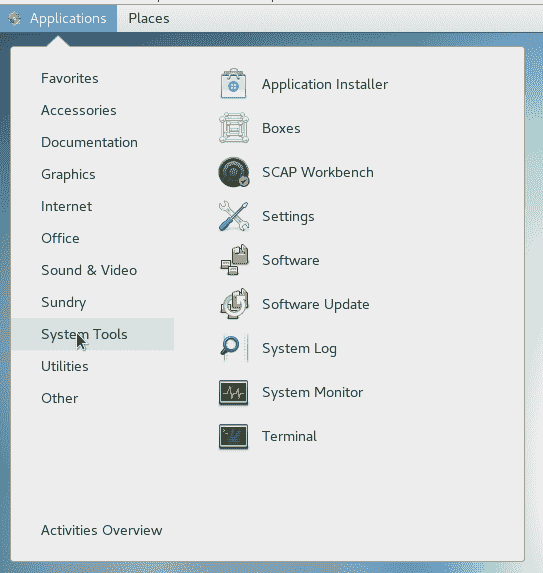
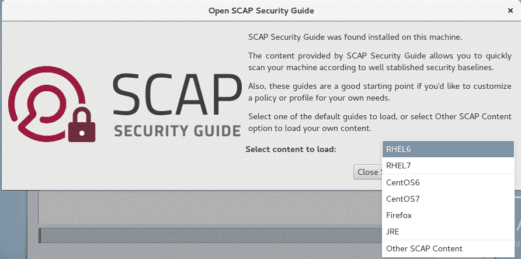
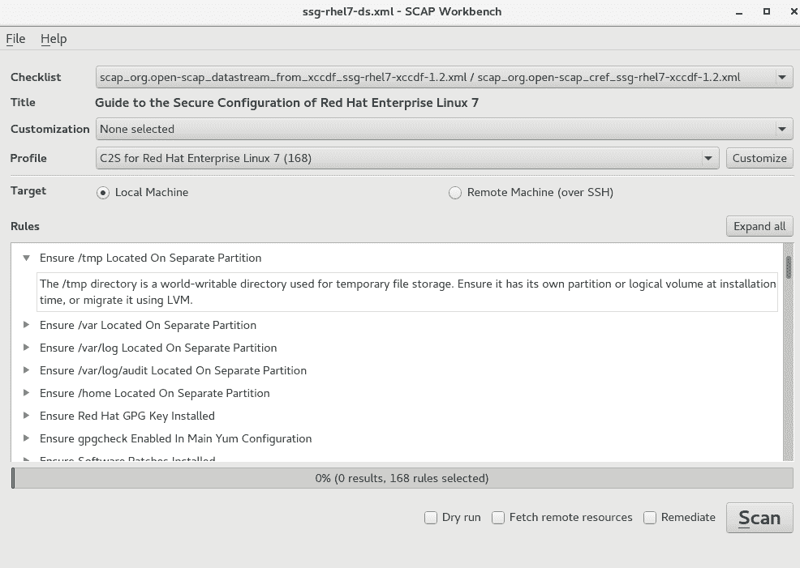
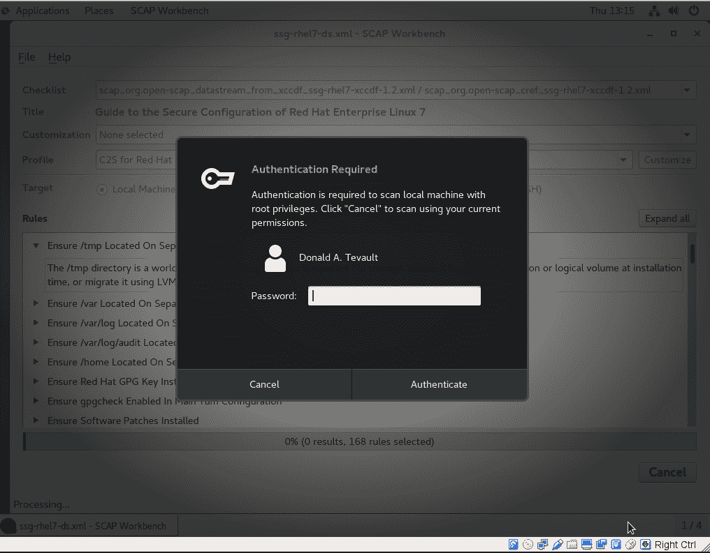
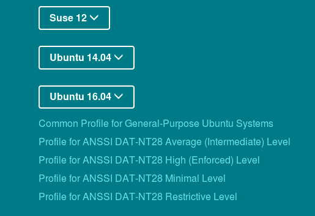
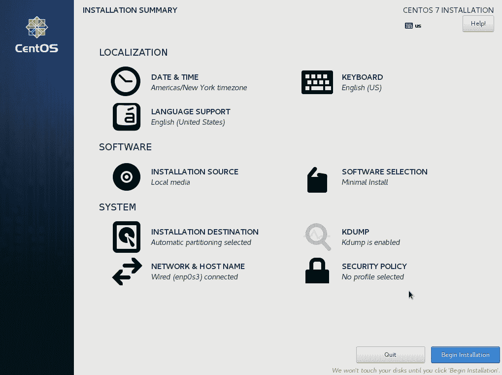
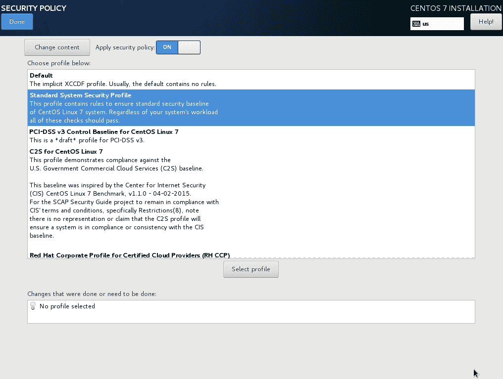

# 第八章：扫描、审计和加固

一个常见的误解是 Linux 用户永远不需要担心恶意软件。是的，Linux 比 Windows 更抵抗病毒。但是，病毒只是恶意软件的一种类型，其他类型的恶意软件也可以植入 Linux 机器。而且，如果您运行的服务器将与 Windows 用户共享文件，您将希望确保不与他们共享任何感染病毒的文件。

虽然 Linux 系统日志文件很好，但它们并不总是能清楚地反映谁做了什么或者谁访问了什么。可能是入侵者或内部人员试图访问未经授权的数据。我们真正想要的是一个良好的审计系统，可以在人们做了不应该做的事情时向我们发出警报。

然后，还有合规性的问题。您的组织可能必须与一个或多个规制机构打交道，这些机构规定了您如何加固服务器以防止攻击。如果您不符合规定，可能会被罚款或被迫停业。

幸运的是，我们有办法解决所有这些问题，而且它们并不那么复杂。

在本章中，我们将涵盖以下主题：

+   安装和更新 ClamAV 和 maldet

+   使用 ClamAV 和 maldet 进行扫描

+   SELinux 考虑

+   使用 Rootkit Hunter 扫描 rootkits

+   控制 auditd 守护程序

+   创建审计规则

+   使用`ausearch`和`aureport`实用程序搜索审计日志中的问题

+   `oscap`，命令行实用程序，用于管理和应用 OpenSCAP 策略

+   OpenSCAP Workbench，用于管理和应用 OpenSCAP 策略的 GUI 实用程序

+   OpenSCAP 策略文件及其各自旨在满足的合规标准

+   在操作系统安装期间应用策略

# 安装和更新 ClamAV 和 maldet

尽管我们不必过多担心病毒感染我们的 Linux 机器，但我们确实需要担心与 Windows 用户共享感染文件的问题。ClamAV 是一个可以作为独立程序运行或集成到邮件服务器守护程序（如 Postfix）中的**自由开源软件**（**FOSS**）防病毒解决方案。它是一个传统的防病毒扫描程序，工作方式基本与典型的 Windows 工作站上的防病毒程序相同。包含的`freshclam`实用程序允许您更新病毒签名。

*Linux Malware Detect*，通常缩写为**LMD**或**maldet**，是另一个可以与 ClamAV 一起工作的 FOSS 防病毒程序。（为了节省输入，我现在只会称它为 LMD。）据我所知，它并不在任何 Linux 发行版的存储库中，但安装和配置起来仍然很简单。其特点之一是当它在网络的边缘入侵检测系统上看到恶意软件时，它会自动生成恶意软件检测签名。最终用户也可以提交自己的恶意软件样本。安装后，您将获得一个已启用的 systemd 服务和一个定期更新恶意软件签名和程序本身的 cron 作业。它利用 Linux 内核的 inotify 功能自动监视目录中已更改的文件。安装它的过程对于任何基于 systemd 的 Linux 发行版来说基本相同。

您可以在以下网址获取有关 Linux Malware Detect 的所有细节：

[`www.rfxn.com/projects/linux-malware-detect/.`](https://www.rfxn.com/projects/linux-malware-detect/)

我们安装 ClamAV 和 LMD 的原因是，正如 LMD 的开发人员自由承认的那样，ClamAV 扫描引擎在扫描大文件集时性能更好。而且，通过将它们放在一起，ClamAV 可以使用 LMD 恶意软件签名以及自己的恶意软件签名。

# 安装 ClamAV 和 maldet

我们将从安装 ClamAV 开始。（它在 Ubuntu 的正常软件库中，但不在 CentOS 中。对于 CentOS，您需要安装 EPEL 软件库，就像我在第一章中所示的那样，*在虚拟环境中运行 Linux*。）我们还将安装 Wget，我们将用它来下载 LMD。

以下命令将帮助您在 Ubuntu 上安装 ClamAV 和 Wget：

```
donnie@ubuntu3:~$ sudo apt install clamav wget
```

以下命令将帮助您在 CentOS 上安装 ClamAV 和 Wget：

```
[donnie@localhost ~]$ sudo yum install clamav clamav-update wget
```

对于 Ubuntu，`clamav`软件包包含您所需的一切。对于 CentOS，您还需要安装`clamav-update`以获取病毒更新。

其余步骤对于任何虚拟机都是相同的。

接下来，您将下载并安装 LMD。在这里，您将要做一件我很少告诉人们要做的事情。也就是说，您将要登录到根用户 shell。原因是，尽管 LMD 安装程序可以使用 sudo 正常工作，但您最终会发现程序文件的所有者是执行安装的用户，而不是根用户。从根用户的 shell 中执行安装可以避免我们跟踪这些文件并更改所有权的麻烦。因此，按照以下方式下载文件：

```
sudo su -
wget http://www.rfxn.com/downloads/maldetect-current.tar.gz
```

现在，您将在根用户的主目录中找到该文件。现在，解压缩存档，进入生成的目录，并运行安装程序。安装程序完成后，将`README`文件复制到您自己的主目录，以便随时参考。（此`README`文件是 LMD 的文档。）然后，从根用户的 shell 退出到您自己的 shell：

```
tar xzvf maldetect-current.tar.gz
cd maldetect-1.6.2/

root@ubuntu3:~/maldetect-1.6.2# ./install.sh
Created symlink from /etc/systemd/system/multi-user.target.wants/maldet.service to /usr/lib/systemd/system/maldet.service.
update-rc.d: error: initscript does not exist: /etc/init.d/maldet
Linux Malware Detect v1.6
 (C) 2002-2017, R-fx Networks <proj@r-fx.org>
 (C) 2017, Ryan MacDonald <ryan@r-fx.org>
This program may be freely redistributed under the terms of the GNU GPL

installation completed to /usr/local/maldetect
config file: /usr/local/maldetect/conf.maldet
exec file: /usr/local/maldetect/maldet
exec link: /usr/local/sbin/maldet
exec link: /usr/local/sbin/lmd
cron.daily: /etc/cron.daily/maldet
maldet(22138): {sigup} performing signature update check...
maldet(22138): {sigup} local signature set is version 2017070716978
maldet(22138): {sigup} new signature set (201708255569) available
maldet(22138): {sigup} downloading https://cdn.rfxn.com/downloads/maldet-sigpack.tgz
maldet(22138): {sigup} downloading https://cdn.rfxn.com/downloads/maldet-cleanv2.tgz
maldet(22138): {sigup} verified md5sum of maldet-sigpack.tgz
maldet(22138): {sigup} unpacked and installed maldet-sigpack.tgz
maldet(22138): {sigup} verified md5sum of maldet-clean.tgz
maldet(22138): {sigup} unpacked and installed maldet-clean.tgz
maldet(22138): {sigup} signature set update completed
maldet(22138): {sigup} 15218 signatures (12485 MD5 | 1954 HEX | 779 YARA | 0 USER)

root@ubuntu3:~/maldetect-1.6.2# cp README /home/donnie

root@ubuntu3:~/maldetect-1.6.2# exit
logout
donnie@ubuntu3:~$

```

正如您所看到的，安装程序会自动创建符号链接以启用 maldet 服务，并且还会自动下载并安装最新的恶意软件签名。

# 配置 maldet

如果您在此时尝试启动 maldet 服务，它将失败。要使其工作，您需要配置要自动监视和扫描的目录。为此，您将把这些目录添加到`/usr/local/maldetect/monitor_paths`文件中。目前，我只想监视`/home`和`/root`目录，所以我的`monitor_paths`文件看起来是这样的：

```
/home
/root
```

保存文件后，您就可以启动 maldet 守护程序了：

```
sudo systemctl start maldet
```

您可以随时向`monitor_paths`文件添加更多目录，但请记住每次这样做时都要重新启动 maldet 守护程序，以便读取新添加的内容。

LMD 的配置文件是`/usr/local/maldetect/conf.maldet`。它有非常完善的文档和对每个配置项都有良好的注释，因此您不应该有任何困难来弄清楚它。目前，我们只会做一些配置更改。

在文件顶部，启用电子邮件警报并将您的用户名设置为电子邮件地址。现在，这两行应该看起来像这样：

```
email_alert="1"
email_addr="donnie"
```

LMD 尚未配置为将可疑文件移动到隔离文件夹中，我们希望它这样做。打开您的文本编辑器中的`conf.maldet`文件，并查找以下行：

```
quarantine_hits="0"
```

将上一行更改为以下行：

```
quarantine_hits="1"
```

您将看到一些其他可以配置的隔离操作，但目前这就是我们需要的全部。保存文件后，重新启动 maldet：

```
sudo systemctl restart maldet
```

新更改现在将生效。

# 更新 ClamAV 和 maldet

对于忙碌的管理员来说，好消息是您不必做任何事情来保持这两个程序的更新。它们都通过自动创建的 cron 作业运行，并为我们进行更新。为了证明 ClamAV 正在更新，我们可以查看系统日志文件：

```
Dec 8 20:02:09 localhost freshclam[22326]: ClamAV update process started at Fri Dec 8 20:02:09 2017
Dec 8 20:02:29 localhost freshclam[22326]: Can't query current.cvd.clamav.net
Dec 8 20:02:29 localhost freshclam[22326]: Invalid DNS reply. Falling back to HTTP mode.
Dec 8 20:02:29 localhost freshclam[22326]: Reading CVD header (main.cvd):
Dec 8 20:02:35 localhost freshclam[22326]: OK
Dec 8 20:02:47 localhost freshclam[22326]: Downloading main-58.cdiff [100%]
Dec 8 20:03:19 localhost freshclam[22326]: main.cld updated (version: 58, sigs: 4566249, f-level: 60, builder: sigmgr)
. . .
. . .
Dec 8 20:04:45 localhost freshclam[22326]: Downloading daily.cvd [100%]
Dec 8 20:04:53 localhost freshclam[22326]: daily.cvd updated (version: 24111, sigs: 1799769, f-level: 63, builder: neo)
Dec 8 20:04:53 localhost freshclam[22326]: Reading CVD header (bytecode.cvd):
Dec 8 20:04:54 localhost freshclam[22326]: OK
Dec 8 20:04:54 localhost freshclam[22326]: Downloading bytecode-279.cdiff [100%]
Dec 8 20:04:55 localhost freshclam[22326]: Downloading bytecode-280.cdiff [100%]
Dec 8 20:04:55 localhost freshclam[22326]: Downloading bytecode-281.cdiff [100%]
Dec 8 20:04:56 localhost freshclam[22326]: Downloading bytecode-282.cdiff [100%]
. . .
. . .
```

您将在 Ubuntu 日志或 CentOS 日志中看到相同的条目。但是，自动运行更新的方式有所不同。

在您的 Ubuntu 机器的`/etc/clamav/freshclam.conf`文件中，您会在末尾看到以下行：

```
# Check for new database 24 times a day
Checks 24
DatabaseMirror db.local.clamav.net
DatabaseMirror database.clamav.net
```

因此，基本上这意味着在 Ubuntu 上，ClamAV 将每小时检查更新。

在您的 CentOS 机器上，您将在`/etc/cron.d`目录中看到一个`clamav-update` cron 作业，如下所示：

```
## Adjust this line...
MAILTO=root

## It is ok to execute it as root; freshclam drops privileges and becomes
## user 'clamupdate' as soon as possible
0  */3 * * * root /usr/share/clamav/freshclam-sleep
```

左侧第二列中的`*/3`表示 ClamAV 将每 3 小时检查更新。如果您愿意，可以更改该设置，但您还需要更改`/etc/sysconfig/freshclam`文件中的设置。假设您希望 CentOS 每小时检查一次 ClamAV 更新。在 cron 作业文件中，将`*/3`更改为`*`。（您不需要执行`*/1`，因为该位置上的星号已经表示作业将每小时运行一次。）然后，在`/etc/sysconfig/freshclam`文件中查找以下行：

```
# FRESHCLAM_MOD=
```

取消注释该行，并添加您希望更新之间的分钟数。要设置为 1 小时，以匹配 cron 作业，它将如下所示：

```
FRESHCLAM_MOD=60
```

为了证明 maldet 正在更新，您可以查看`/usr/local/maldetect/logs/`目录中的其自己的日志文件。在`event_log`文件中，您将看到以下代码：

```
Dec 06 22:06:14 localhost maldet(3728): {sigup} performing signature update check...
Dec 06 22:06:14 localhost maldet(3728): {sigup} local signature set is version 2017070716978
Dec 06 22:07:13 localhost maldet(3728): {sigup} downloaded https://cdn.rfxn.com/downloads/maldet.sigs.ver
Dec 06 22:07:13 localhost maldet(3728): {sigup} new signature set (201708255569) available
Dec 06 22:07:13 localhost maldet(3728): {sigup} downloading https://cdn.rfxn.com/downloads/maldet-sigpack.tgz
. . .
. . .
Dec 06 22:07:43 localhost maldet(3728): {sigup} unpacked and installed maldet-clean.tgz
Dec 06 22:07:43 localhost maldet(3728): {sigup} signature set update completed
Dec 06 22:07:43 localhost maldet(3728): {sigup} 15218 signatures (12485 MD5 | 1954 HEX | 779 YARA | 0 USER)
Dec 06 22:14:55 localhost maldet(4070): {scan} signatures loaded: 15218 (12485 MD5 | 1954 HEX | 779 YARA | 0 USER)

```

在`/usr/local/maldetect/conf.maldet`文件中，您将看到以下两行，但它们之间有一些注释：

```
autoupdate_signatures="1"

autoupdate_version="1"
```

LMD 不仅会自动更新其恶意软件签名，还会确保您拥有 LMD 本身的最新版本。

# 使用 ClamAV 和 maldet 进行扫描

LMD 的 maldet 守护程序会不断监视您在`/usr/local/maldetect/monitor_paths`文件中指定的目录。当它发现可能是恶意软件的文件时，它会自动执行您在`conf.maldet`文件中指定的操作。为了演示其工作原理，我将在我的主目录中创建一个模拟恶意软件文件。幸运的是，这比听起来要容易，因为我们有一个网站可以帮助我们。

**EICAR**，以前以其全名**European Institute for Computer Antivirus Research**而闻名，提供了一个病毒签名，您可以将其包含在一个纯文本文件中。您可以在以下网址获取：[`www.eicar.org/86-0-Intended-use.html`](http://www.eicar.org/86-0-Intended-use.html)。

要创建模拟病毒文件，请转到我在前面链接中列出的页面。

向下滚动页面，直到在文本框中看到以下文本行：

```
X5O!P%@AP[4\PZX54(P^)7CC)7}$EICAR-STANDARD-ANTIVIRUS-TEST-FILE!$H+H*
```

复制该文本行并将其插入到一个文本文件中，然后将其保存到任一虚拟机的主目录中。（您可以随意命名，但我会将其命名为`testing.txt`。）等待片刻，您会看到文件消失。然后，查看`/usr/local/maldetect/logs/event_log`文件，以验证 LMD 是否将文件移至隔离区：

```
Dec 09 19:03:43 localhost maldet(7192): {quar} malware quarantined from '/home/donnie/testing.txt' to '/usr/local/maldetect/quarantine/testing.txt.89513558'
```

LMD 还有更多内容，这里无法全部展示。但是，您可以在随附的`README`文件中了解所有内容。

# SELinux 注意事项

以前，在 Red Hat 类型的系统上进行杀毒扫描会触发 SELinux 警报。但是，在校对本章的过程中，扫描都按照预期进行，SELinux 从未打扰过我。因此，这个问题似乎已经解决了。

如果您在病毒扫描中生成任何 SELinux 警报，只需更改一个布尔值即可解决问题：

```
[donnie@localhost ~]$ getsebool -a | grep 'virus'
antivirus_can_scan_system --> off
antivirus_use_jit --> off
[donnie@localhost ~]$
```

我们感兴趣的是`antivirus_can_scan_system`布尔值，默认情况下是关闭的。要打开以启用病毒扫描，请按照以下步骤：

```
[donnie@localhost ~]$ sudo setsebool -P antivirus_can_scan_system on
[sudo] password for donnie:

[donnie@localhost ~]$ getsebool antivirus_can_scan_system
antivirus_can_scan_system --> on
[donnie@localhost ~]$
```

这应该解决您可能遇到的与 SELinux 相关的扫描问题。但是，就目前情况而言，您可能不需要担心它。

# 使用 Rootkit Hunter 扫描 rootkits

rootkit 是极其恶毒的恶意软件，绝对会毁了你的一天。它们可以监听来自他们主人的命令，窃取敏感数据并将其发送给他们的主人，或者为他们的主人提供一个易于访问的后门。它们被设计为隐秘的，具有隐藏自己的能力。有时，它们会用自己的特洛伊木马版本替换诸如`ls`或`ps`之类的实用程序，这些实用程序将显示系统上的所有文件或进程，但不包括与 rootkit 相关的文件。Rootkit 可以感染任何操作系统，甚至是我们心爱的 Linux。

为了植入 rootkit，攻击者必须已经在系统上获得了管理员权限。这是我总是在看到人们都在 root 用户的 shell 中完成所有工作时感到不安的许多原因之一，也是我坚决主张尽可能使用 sudo 的原因。我是说，真的，我们为什么要让坏人轻而易举地得逞呢？

几年前，在 Windows XP 的黑暗时期，索尼音乐因为有人发现他们在音乐 CD 上植入了 rootkit 而陷入了一些麻烦。他们并不是有意要做任何恶意的事情，只是想阻止人们使用他们的计算机制作非法副本。当然，大多数人都以管理员帐户运行 Windows XP，这使得 rootkit 很容易感染他们的计算机。Windows 用户仍然大多以管理员帐户运行，但至少现在有用户访问控制来帮助缓解这些问题。

有几个不同的程序可以扫描 rootkit，两者使用方式基本相同。我们现在要看的是一个名为 Rootkit Hunter 的程序。

# 安装和更新 Rootkit Hunter

对于 Ubuntu，Rootkit Hunter 在正常的存储库中。对于 CentOS，您需要安装 EPEL 存储库，就像我在第一章中所示的那样，*在虚拟环境中运行 Linux*。对于这两个 Linux 发行版，软件包名称是`rkhunter`。

对于 Ubuntu：

```
sudo apt install rkhunter
```

对于 CentOS：

```
sudo yum install rkhunter
```

安装后，您可以使用以下命令查看其选项：

```
man rkhunter
```

简单，对吧？

接下来，您需要使用`--update`选项更新 rootkit 签名：

```
[donnie@localhost ~]$ sudo rkhunter --update
[ Rootkit Hunter version 1.4.4 ]

Checking rkhunter data files...
 Checking file mirrors.dat [ Updated ]
 Checking file programs_bad.dat [ Updated ]
 Checking file backdoorports.dat [ No update ]
 Checking file suspscan.dat [ Updated ]
 Checking file i18n/cn [ No update ]
 Checking file i18n/de [ Updated ]
 Checking file i18n/en [ Updated ]
 Checking file i18n/tr [ Updated ]
 Checking file i18n/tr.utf8 [ Updated ]
 Checking file i18n/zh [ Updated ]
 Checking file i18n/zh.utf8 [ Updated ]
 Checking file i18n/ja [ Updated ]
[donnie@localhost ~]$
```

现在，我们准备好扫描了。

# 扫描 rootkit

要运行扫描，请使用`-c`选项。（这是用于检查的`-c`。）请耐心等待，因为这需要一段时间：

```
sudo rkhunter -c
```

当您以这种方式运行扫描时，Rootkit Hunter 将定期停止并要求您按*Enter*键继续。扫描完成后，您会在`/var/log`目录中找到一个`rkhunter.log`文件。

要让 Rootkit Hunter 自动作为 cron 作业运行，您需要使用`--cronjob`选项，这将导致程序一直运行下去，而不会提示您不断按*Enter*键。您可能还想使用`--rwo`选项，这将导致程序仅报告警告，而不是报告所有良好的内容。从命令行，命令看起来是这样的：

```
sudo rkhunter -c --cronjob --rwo
```

要创建一个自动每晚运行 Rootkit Hunter 的 cron 作业，请打开 root 用户的 crontab 编辑器：

```
sudo crontab -e -u root
```

假设您想在每天晚上 10 点 20 分运行 Rootkit Hunter。将其输入到 crontab 编辑器中：

```
20 22 * * * /usr/bin/rkhunter -c --cronjob --rwo
```

由于 cron 只能使用 24 小时制时间，因此您必须将晚上 10:00 表示为 22。 （只需将您习惯使用的 P.M.时钟时间加 12 即可。）这三个星号分别表示该作业将在每个月的每一天，每个月和每周的每一天运行。您需要列出命令的完整路径，否则 cron 将无法找到它。

您可以在`rkhunter`手册页中找到更多可能对您感兴趣的选项，但这应该足以让您开始使用它。

# 控制 auditd 守护程序

因此，您有一个充满了只有极少数人需要看到的绝密文件的目录，并且您想知道未经授权的人何时尝试查看它们。或者，也许您想知道某个文件何时被更改。或者，也许您想知道人们何时登录系统以及他们登录后在做什么。对于所有这些以及更多内容，您都有 auditd 系统。这是一个非常酷的系统，我相信您会喜欢它。

auditd 的美妙之一是它在 Linux 内核级别工作，而不是在用户模式级别。这使得攻击者更难以颠覆。

在红帽类型的系统上，auditd 默认已安装并启用。因此，您会在 CentOS 机器上找到它。在 Ubuntu 上，它尚未安装，因此您需要自己安装：

```
sudo apt install auditd
```

在 Ubuntu 上，您可以使用正常的`systemctl`命令控制 auditd 守护程序。因此，如果需要重新启动 auditd 以读取新的配置，可以使用以下命令：

```
sudo systemctl restart auditd
```

在 CentOS 7 上，由于某种我不理解的原因，正常的`systemctl`命令无法与 auditd 一起使用。（对于所有其他守护程序，它们可以。）因此，在您的 CentOS 7 机器上，您将使用老式的`service`命令重新启动 auditd 守护程序，如下所示：

```
sudo service auditd restart
```

除了这个小的不同之外，我告诉你的关于 auditd 的一切都适用于 Ubuntu 和 CentOS。

# 创建审计规则

好的，让我们从简单的开始，逐步提升到令人惊叹的东西。首先，让我们检查是否有任何审计规则生效：

```
[donnie@localhost ~]$ sudo auditctl -l
[sudo] password for donnie:
No rules
[donnie@localhost ~]$
```

正如您所看到的，`auditctl`命令是我们用来管理审计规则的命令。`-l`选项列出规则。

# 审计文件的更改

现在，假设我们想要查看当有人更改`/etc/passwd`文件时。 （我们将使用的命令看起来有点吓人，但我保证一旦我们分解它，它就会讲得通。）看看以下代码：

```
[donnie@localhost ~]$ sudo auditctl -w /etc/passwd -p wa -k passwd_changes
[sudo] password for donnie:

[donnie@localhost ~]$ sudo auditctl -l
-w /etc/passwd -p wa -k passwd_changes
[donnie@localhost ~]$
```

这是细节：

+   `-w`：这代表着“在哪里”，并且指向我们想要监视的对象。在这种情况下，它是`/etc/passwd`。

+   `-p`：这表示我们要监视的对象的权限。在这种情况下，我们正在监视任何人尝试（w）写入文件或尝试进行（a）属性更改的情况。（我们可以审计的另外两个权限是（r）读取和 e(x)ecute。）

+   `-k`：`k`代表 key，这只是 auditd 分配规则名称的方式。因此，`passwd_changes`是我们正在创建的规则的键或名称。

`auditctl -l`命令向我们显示规则确实存在。

现在，这个规则的一个小问题是它只是临时的，当我们重新启动机器时就会消失。要使其永久，我们需要在`/etc/audit/rules.d/`目录中创建一个自定义规则文件。然后，当您重新启动 auditd 守护程序时，自定义规则将被插入到`/etc/audit/audit.rules`文件中。因为`/etc/audit/`目录只能被具有 root 权限的人访问，所以我将通过列出文件的完整路径来打开文件，而不是尝试进入目录：

```
sudo less /etc/audit/audit.rules
```

这个默认文件中没有太多内容：

```
## This file is automatically generated from /etc/audit/rules.d
-D
-b 8192
-f 1

```

这个文件的细节如下：

+   `-D`：这将导致当前生效的所有规则和监视被删除，以便我们可以从干净的状态开始。因此，如果我现在重新启动 auditd 守护程序，它将读取这个`audit.rules`文件，这将删除我刚刚创建的规则。

+   `-b 8192`：这设置了我们可以同时拥有的未决审计缓冲区的数量。如果所有缓冲区都满了，系统将无法生成更多的审计消息。

+   `-f 1`：这设置了关键错误的失败模式，值可以是 0、1 或 2。`-f 0`会将模式设置为静默，这意味着 auditd 不会对关键错误采取任何措施。如我们在这里看到的`-f 1`，告诉 auditd 只报告关键错误，`-f 2`会导致 Linux 内核进入紧急模式。根据`auditctl`手册页面，高安全环境中的任何人可能都想将其更改为`-f 2`。但对于我们的目的，`-f1`就可以了。

您可以使用文本编辑器在`/etc/audit/rules.d/`目录中创建一个新的规则文件。或者，您可以将`auditctl -l`输出重定向到一个新文件，就像这样：

```
[donnie@localhost ~]$ sudo sh -c "auditctl -l > /etc/audit/rules.d/custom.rules"
[donnie@localhost ~]$ sudo service auditd restart
```

由于 Bash shell 不允许我直接将信息重定向到`/etc`目录中的文件，即使使用 sudo，我也必须使用`sudo sh -c`命令来执行`auditctl`命令。重新启动 auditd 守护程序后，我们的`audit.rules`文件现在如下所示：

```
## This file is automatically generated from /etc/audit/rules.d
-D
-b 8192
-f 1

-w /etc/passwd -p wa -k passwd_changes
```

现在，规则将在每次机器重新启动时生效，以及每次手动重新启动 auditd 守护程序时生效。

# 审计目录

我的固体灰色小猫维基和灰白色虎斑小猫克利奥帕特拉有一些非常敏感的秘密需要保护。因此，我创建了`secretcats`组并将它们添加到其中。然后，我创建了`secretcats`共享目录，并按照我在第六章中向您展示的方式设置了它的访问控制列表：

```
[donnie@localhost ~]$ sudo groupadd secretcats
[sudo] password for donnie:

[donnie@localhost ~]$ sudo usermod -a -G secretcats vicky
[donnie@localhost ~]$ sudo usermod -a -G secretcats cleopatra

[donnie@localhost ~]$ sudo mkdir /secretcats
[donnie@localhost ~]$ sudo chown nobody:secretcats /secretcats/
[donnie@localhost ~]$ sudo chmod 3770 /secretcats/

[donnie@localhost ~]$ ls -ld /secretcats/
drwxrws--T. 2 nobody secretcats 6 Dec 11 14:47 /secretcats/
[donnie@localhost ~]$
```

维基和克利奥帕特拉希望绝对确定没有人能进入他们的东西，因此他们要求我为他们的目录设置审计规则：

```
[donnie@localhost ~]$ sudo auditctl -w /secretcats/ -k secretcats_watch
[sudo] password for donnie:

[donnie@localhost ~]$ sudo auditctl -l
-w /etc/passwd -p wa -k passwd_changes
-w /secretcats -p rwxa -k secretcats_watch
[donnie@localhost ~]$
```

与以前一样，`-w`表示我们要监视的内容，`-k`表示审计规则的名称。这次，我省略了`-p`选项，因为我想监视每种类型的访问。换句话说，我想监视任何读取、写入、属性更改或执行操作。（因为这是一个目录，当有人尝试`cd`到目录时，执行操作会发生。）您可以在`auditctl -l`输出中看到，通过省略`-p`，我们现在将监视一切。但是，假设我只想监视有人尝试`cd`到这个目录的情况。相反，我可以使规则看起来像这样：

```
sudo auditctl -w /secretcats/ -p x -k secretcats_watch
```

到目前为止还算简单，对吧？现在让我们看看更复杂的东西。

# 审计系统调用

创建监视某个动作的规则并不难，但命令语法比我们到目前为止看到的要复杂一些。使用这个规则，我们将在查理尝试打开文件或尝试创建文件时收到警报：

```
[donnie@localhost ~]$ sudo auditctl -a always,exit -F arch=b64 -S openat -F auid=1006
[sudo] password for donnie:

[donnie@localhost ~]$ sudo auditctl -l
-w /etc/passwd -p wa -k passwd_changes
-w /secretcats -p rwxa -k secretcats_watch
-a always,exit -F arch=b64 -S openat -F auid=1006
[donnie@localhost ~]$
```

这是分解：

+   `-a always,exit`：这里有动作和列表。`exit`部分表示此规则将被添加到系统调用退出列表中。每当操作系统从系统调用退出时，将使用退出列表来确定是否需要生成审计事件。`always`部分是动作，表示每次从指定系统调用退出时都会创建此规则的审计记录。请注意，动作和列表参数必须用逗号分隔。

+   `-F arch=b64`：`-F`选项用于构建规则字段，在此命令中我们看到两个规则字段。第一个规则字段指定了机器的 CPU 架构。`b64`表示计算机正在使用 x86_64 CPU。（无论是英特尔还是 AMD 都无关紧要。）考虑到 32 位机器正在消失，Sun SPARC 和 PowerPC 机器并不常见，现在大多数情况下会看到`b64`。

+   `-S openat`：`-S`选项指定我们要监视的系统调用。`openat`是打开或创建文件的系统调用。

+   `-F auid=1006`：这第二个审计字段指定了我们要监视的用户的用户 ID 号码。（查理的用户 ID 号码是`1006`。）

关于系统调用或 syscalls 的完整解释对我们当前的目的来说有点太深奥了。现在，暂且可以说，每当用户发出请求 Linux 内核提供服务的命令时，就会发生系统调用。如果你有兴趣，可以在这里阅读更多关于 syscalls 的内容：[`blog.packagecloud.io/eng/2016/04/05/the-definitive-guide-to-linux-system-calls/`](https://blog.packagecloud.io/eng/2016/04/05/the-definitive-guide-to-linux-system-calls/)。

我在这里呈现的只是你可以使用审计规则做的许多事情中的一小部分。要查看更多示例，请查看`auditctl`手册页：

```
man auditctl
```

所以，现在你在想，“*既然我有了这些规则，我怎么知道有人试图违反它们呢？*”像往常一样，我很高兴你问了。

# 使用 ausearch 和 aureport

auditd 守护程序将事件记录到`/var/log/audit/audit.log`文件中。虽然你可以直接使用`less`之类的工具读取文件，但你真的不想这样做。`ausearch`和`aureport`实用程序将帮助你将文件转换为一种有些意义的语言。

# 搜索文件更改警报

让我们首先看一下我们创建的规则，该规则将在对`/etc/passwd`文件进行更改时警报我们：

```
sudo auditctl -w /etc/passwd -p wa -k passwd_changes
```

现在，让我们对文件进行更改并查找警报消息。我不想再添加另一个用户，因为我已经用完了可以使用的猫的名字，所以我将使用`chfn`实用程序来将联系信息添加到 Cleopatra 条目的注释字段中：

```
[donnie@localhost etc]$ sudo chfn cleopatra
Changing finger information for cleopatra.
Name []: Cleopatra Tabby Cat
Office []: Donnie's back yard
Office Phone []: 555-5555
Home Phone []: 555-5556

Finger information changed.
[donnie@localhost etc]
```

我现在将使用`ausearch`查找此事件可能生成的任何审计消息：

```
[donnie@localhost ~]$ sudo ausearch -i -k passwd_changes
----
type=CONFIG_CHANGE msg=audit(12/11/2017 13:06:20.665:11393) : auid=donnie ses=842 subj=unconfined_u:unconfined_r:unconfined_t:s0-s0:c0.c1023 op=add_rule key=passwd_changes li
st=exit res=yes
----
type=CONFIG_CHANGE msg=audit(12/11/2017 13:49:15.262:11511) : auid=donnie ses=842 op=updated_rules path=/etc/passwd key=passwd_changes list=exit res=yes
[donnie@localhost ~]$
```

这是分解：

+   `-i`：这将接受任何数字数据，并在可能的情况下将其转换为文本。在这种情况下，它接受用户 ID 号并将其转换为实际的用户名，显示为`auid=donnie`。如果我不加`-i`，用户信息将显示为`auid=1000`，这是我的用户 ID 号。

+   `-k passwd_changes`：这指定了我们想要查看审计消息的审计规则的键或名称。

你可以看到这个输出有两部分。第一部分只是显示我创建审计规则的时间，所以我们对此不感兴趣。在第二部分中，你可以看到我触发规则的时间，但它没有显示我如何触发它。所以，让我们使用`aureport`来看看它是否会给我们更多线索：

```
[donnie@localhost ~]$ sudo aureport -i -k | grep 'passwd_changes'
1\. 12/11/2017 13:06:20 passwd_changes yes ? donnie 11393
2\. 12/11/2017 13:49:15 passwd_changes yes ? donnie 11511
3\. 12/11/2017 13:49:15 passwd_changes yes /usr/bin/chfn donnie 11512
4\. 12/11/2017 14:54:11 passwd_changes yes /usr/sbin/usermod donnie 11728
5\. 12/11/2017 14:54:25 passwd_changes yes /usr/sbin/usermod donnie 11736
[donnie@localhost ~]$
```

有趣的是，使用`ausearch`时，你必须在`-k`选项之后指定你感兴趣的审计规则的名称或键。而对于`aureport`，`-k`选项表示你想查看与所有审计规则键有关的所有日志条目。要查看特定键的日志条目，只需将输出导入 grep。`-i`选项对`ausearch`的作用与对`aureport`的作用相同。

正如你所看到的，`aureport`将`audit.log`文件的隐晦语言解析为更容易理解的普通语言。我不确定我做了什么来生成事件 1 和 2，所以我查看了`/var/log/secure`文件以查找答案。我在那些时间看到了这两个条目：

```
Dec 11 13:06:20 localhost sudo: donnie : TTY=pts/1 ; PWD=/home/donnie ; USER=root ; COMMAND=/sbin/auditctl -w /etc/passwd -p wa -k passwd_changes
. . .
. . .
Dec 11 13:49:24 localhost sudo: donnie : TTY=pts/1 ; PWD=/home/donnie ; USER=root ; COMMAND=/sbin/ausearch -i -k passwd_changes

```

所以，事件 1 是我最初创建审计规则时发生的，事件 2 发生在我执行`ausearch`操作时。

我必须承认，第 4 行和第 5 行的事件有点神秘。当我调用`usermod`命令时，都会创建这两个事件，并且它们都与我将 Vicky 和 Cleopatra 添加到`secretcats`组的安全日志条目相关：

```
Dec 11 14:54:11 localhost sudo:  donnie : TTY=pts/1 ; PWD=/home/donnie ; USER=root ; COMMAND=/sbin/usermod -a -G secretcats vicky
Dec 11 14:54:11 localhost usermod[14865]: add 'vicky' to group 'secretcats'
Dec 11 14:54:11 localhost usermod[14865]: add 'vicky' to shadow group 'secretcats'
Dec 11 14:54:25 localhost sudo:  donnie : TTY=pts/1 ; PWD=/home/donnie ; USER=root ; COMMAND=/sbin/usermod -a -G secretcats cleopatra
Dec 11 14:54:25 localhost usermod[14871]: add 'cleopatra' to group 'secretcats'
Dec 11 14:54:25 localhost usermod[14871]: add 'cleopatra' to shadow group 'secretcats'
```

奇怪的是，将用户添加到辅助组不会修改`passwd`文件。所以，我真的不知道为什么规则会触发创建第 4 行和第 5 行的事件。

这让我们留下了第 3 行的事件，那是我使用`chfn`实际修改`passwd`文件的地方。这是关于那个的`secure`日志条目：

```
Dec 11 13:48:49 localhost sudo:  donnie : TTY=pts/1 ; PWD=/etc ; USER=root ; COMMAND=/bin/chfn cleopatra
```

所以，在所有这些事件中，只有第 3 行的事件是实际修改了`/etc/passwd`文件的。

我一直在这里提到的`/var/log/secure`文件是在 Red Hat 类型的操作系统上，比如 CentOS。在你的 Ubuntu 机器上，你会看到`/var/log/auth.log`文件。

# 搜索目录访问规则违规

在我们的下一个场景中，我们为 Vicky 和 Cleopatra 创建了一个共享目录，并为它创建了一个审计规则，看起来像这样：

```
sudo auditctl -w /secretcats/ -k secretcats_watch
```

因此，对这个目录的所有访问或尝试访问都应该触发警报。首先，让 Vicky 进入`/secretcats`目录并运行`ls -l`命令：

```
[vicky@localhost ~]$ cd /secretcats
[vicky@localhost secretcats]$ ls -l
total 4
-rw-rw-r--. 1 cleopatra secretcats 31 Dec 12 11:49 cleopatrafile.txt
[vicky@localhost secretcats]$
```

我们看到 Cleopatra 已经在那里并创建了一个文件。（我们稍后再回来讨论这个问题。）当事件触发 auditd 规则时，通常会在`/var/log/audit/audit.log`文件中创建多条记录。如果你研究每个事件的每条记录，你会发现每条记录都涵盖了该事件的不同方面。当我执行`ausearch`命令时，我看到了来自那个`ls -l`操作的总共五条记录。为了节省空间，我只列出第一条和最后一条：

```
sudo ausearch -i -k secretcats_watch | less

type=PROCTITLE msg=audit(12/12/2017 12:15:35.447:14077) : proctitle=ls --color=auto -l
type=PATH msg=audit(12/12/2017 12:15:35.447:14077) : item=0 name=. inode=33583041 dev=fd:01 mode=dir,sgid,sticky,770 ouid=nobody ogid=secretcats rdev=00:00 obj=unconfined_u:object_r:default_t:s0 objtype=NORMAL
type=CWD msg=audit(12/12/2017 12:15:35.447:14077) :  cwd=/secretcats
type=SYSCALL msg=audit(12/12/2017 12:15:35.447:14077) : arch=x86_64 syscall=openat success=yes exit=3 a0=0xffffffffffffff9c a1=0x2300330 a2=O_RDONLY|O_NONBLOCK|O_DIRECTORY|O_CLOEXEC a3=0x0 items=1 ppid=10805 pid=10952 auid=vicky uid=vicky gid=vicky euid=vicky suid=vicky fsuid=vicky egid=vicky sgid=vicky fsgid=vicky tty=pts0 ses=1789 comm=ls exe=/usr/bin/ls subj=unconfined_u:unconfined_r:unconfined_t:s0-s0:c0.c1023 key=secretcats_watch
. . .
. . .
type=PROCTITLE msg=audit(12/12/2017 12:15:35.447:14081) : proctitle=ls --color=auto -l
type=PATH msg=audit(12/12/2017 12:15:35.447:14081) : item=0 name=cleopatrafile.txt inode=33583071 dev=fd:01 mode=file,664 ouid=cleopatra ogid=secretcats rdev=00:00 obj=unconfined_u:object_r:default_t:s0 objtype=NORMAL
type=CWD msg=audit(12/12/2017 12:15:35.447:14081) :  cwd=/secretcats
type=SYSCALL msg=audit(12/12/2017 12:15:35.447:14081) : arch=x86_64 syscall=getxattr success=no exit=ENODATA(No data available) a0=0x7fff7c266e60 a1=0x7f0a61cb9db0 a2=0x0 a3=0x0 items=1 ppid=10805 pid=10952 auid=vicky uid=vicky gid=vicky euid=vicky suid=vicky fsuid=vicky egid=vicky sgid=vicky fsgid=vicky tty=pts0 ses=1789 comm=ls exe=/usr/bin/ls subj=unconfined_u:unconfined_r:unconfined_t:s0-s0:c0.c1023 key=secretcats_watch
```

在这两条记录中，你可以看到所采取的行动（`ls -l`），以及采取行动的人或者在这种情况下是猫的信息。由于这是一个 CentOS 机器，你还可以看到 SELinux 上下文信息。在第二条记录中，你还可以看到 Vicky 在执行`ls`命令时看到的文件名。

接下来，让我们假设那个狡猾的查理登录并尝试进入`/secretcats`目录：

```
[charlie@localhost ~]$ cd /secretcats
-bash: cd: /secretcats: Permission denied
[charlie@localhost ~]$ ls -l /secretcats
ls: cannot open directory /secretcats: Permission denied
[charlie@localhost ~]$
```

查理不是`secretcats`组的成员，也没有权限进入`secretcats`目录。因此，他应该触发一个警报消息。实际上，他触发了一个包含四条记录的警报，我再次只列出第一条和最后一条：

```
sudo ausearch -i -k secretcats_watch | less

type=PROCTITLE msg=audit(12/12/2017 12:32:04.341:14152) : proctitle=ls --color=auto -l /secretcats
type=PATH msg=audit(12/12/2017 12:32:04.341:14152) : item=0 name=/secretcats inode=33583041 dev=fd:01 mode=dir,sgid,sticky,770 ouid=nobody ogid=secretcats rdev=00:00 obj=unconfined_u:object_r:default_t:s0 objtype=NORMAL
type=CWD msg=audit(12/12/2017 12:32:04.341:14152) :  cwd=/home/charlie
type=SYSCALL msg=audit(12/12/2017 12:32:04.341:14152) : arch=x86_64 syscall=lgetxattr success=yes exit=35 a0=0x7ffd8d18f7dd a1=0x7f2496858f8a a2=0x12bca30 a3=0xff items=1 ppid=11637 pid=11663 auid=charlie uid=charlie gid=charlie euid=charlie suid=charlie fsuid=charlie egid=charlie sgid=charlie fsgid=charlie tty=pts0 ses=1794 comm=ls exe=/usr/bin/ls subj=unconfined_u:unconfined_r:unconfined_t:s0-s0:c0.c1023 key=secretcats_watch
. . .
. . .
type=PROCTITLE msg=audit(12/12/2017 12:32:04.341:14155) : proctitle=ls --color=auto -l /secretcats
type=PATH msg=audit(12/12/2017 12:32:04.341:14155) : item=0 name=/secretcats inode=33583041 dev=fd:01 mode=dir,sgid,sticky,770 ouid=nobody ogid=secretcats rdev=00:00 obj=unconfined_u:object_r:default_t:s0 objtype=NORMAL
type=CWD msg=audit(12/12/2017 12:32:04.341:14155) :  cwd=/home/charlie
type=SYSCALL msg=audit(12/12/2017 12:32:04.341:14155) : arch=x86_64 syscall=openat success=no exit=EACCES(Permission denied) a0=0xffffffffffffff9c a1=0x12be300 a2=O_RDONLY|O_NONBLOCK|O_DIRECTORY|O_CLOEXEC a3=0x0 items=1 ppid=11637 pid=11663 auid=charlie uid=charlie gid=charlie euid=charlie suid=charlie fsuid=charlie egid=charlie sgid=charlie fsgid=charlie tty=pts0 ses=1794 comm=ls exe=/usr/bin/ls subj=unconfined_u:unconfined_r:unconfined_t:s0-s0:c0.c1023 key=secretcats_watch
```

这里有两件事需要注意。首先，仅尝试`cd`进入目录不会触发警报。然而，使用`ls`尝试读取目录的内容会触发警报。其次，注意第二条记录中出现的`Permission denied`消息。

我们将要查看的最后一组警报是在 Cleopatra 创建她的`cleopatrafile.txt`文件时创建的。这个事件触发了一个包含 30 条记录的警报。以下是其中的两条：

```
. . .
. . .
type=PROCTITLE msg=audit(12/12/2017 11:49:37.536:13856) : proctitle=vim cleopatrafile.txt
type=PATH msg=audit(12/12/2017 11:49:37.536:13856) : item=0 name=. inode=33583041 dev=fd:01 mode=dir,sgid,sticky,770 ouid=nobody ogid=secretcats rdev=00:00 obj=unconfined_u:o
bject_r:default_t:s0 objtype=NORMAL
type=CWD msg=audit(12/12/2017 11:49:37.536:13856) :  cwd=/secretcats
type=SYSCALL msg=audit(12/12/2017 11:49:37.536:13856) : arch=x86_64 syscall=open success=yes exit=4 a0=0x5ab983 a1=O_RDONLY a2=0x0 a3=0x63 items=1 ppid=9572 pid=9593 auid=cle
opatra uid=cleopatra gid=cleopatra euid=cleopatra suid=cleopatra fsuid=cleopatra egid=cleopatra sgid=cleopatra fsgid=cleopatra tty=pts0 ses=1779 comm=vim exe=/usr/bin/vim sub
j=unconfined_u:unconfined_r:unconfined_t:s0-s0:c0.c1023 key=secretcats_watch
----
type=PROCTITLE msg=audit(12/12/2017 11:49:56.001:13858) : proctitle=vim cleopatrafile.txt
type=PATH msg=audit(12/12/2017 11:49:56.001:13858) : item=1 name=/secretcats/.cleopatrafile.txt.swp inode=33583065 dev=fd:01 mode=file,600 ouid=cleopatra ogid=secretcats rdev
=00:00 obj=unconfined_u:object_r:default_t:s0 objtype=DELETE
type=PATH msg=audit(12/12/2017 11:49:56.001:13858) : item=0 name=/secretcats/ inode=33583041 dev=fd:01 mode=dir,sgid,sticky,770 ouid=nobody ogid=secretcats rdev=00:00 obj=unc
onfined_u:object_r:default_t:s0 objtype=PARENT
type=CWD msg=audit(12/12/2017 11:49:56.001:13858) :  cwd=/secretcats
type=SYSCALL msg=audit(12/12/2017 11:49:56.001:13858) : arch=x86_64 syscall=unlink success=yes exit=0 a0=0x15ee7a0 a1=0x1 a2=0x1 a3=0x7ffc2c82e6b0 items=2 ppid=9572 pid=9593
auid=cleopatra uid=cleopatra gid=cleopatra euid=cleopatra suid=cleopatra fsuid=cleopatra egid=cleopatra sgid=cleopatra fsgid=cleopatra tty=pts0 ses=1779 comm=vim exe=/usr/bin
/vim subj=unconfined_u:unconfined_r:unconfined_t:s0-s0:c0.c1023 key=secretcats_watch
. . .
. . .
```

你可以看出这两条消息中的第一条是 Cleopatra 保存文件并退出 vim 时发生的，因为第二条消息显示了`objtype=DELETE`，她的临时 vim 交换文件被删除了。

好的，这都很好，但如果这些信息太多怎么办？如果你只想要一个快速而简洁的安全事件列表，那么我们将使用`aureport`。我们将像之前一样使用它。

首先，让我们将`aureport`的输出导入`less`而不是`grep`，这样我们就可以看到列标题：

```
[donnie@localhost ~]$ sudo aureport -i -k | less

Key Report
===============================================
# date time key success exe auid event
===============================================
1\. 12/11/2017 13:06:20 passwd_changes yes ? donnie 11393
2\. 12/11/2017 13:49:15 passwd_changes yes ? donnie 11511
3\. 12/11/2017 13:49:15 passwd_changes yes /usr/bin/chfn donnie 11512
4\. 12/11/2017 14:54:11 passwd_changes yes /usr/sbin/usermod donnie 11728
5\. 12/11/2017 14:54:25 passwd_changes yes /usr/sbin/usermod donnie 11736
. . .
. . .
```

`success`列中的状态将是`yes`或`no`，取决于用户是否能够成功执行违反规则的操作。或者，如果事件不是触发规则的结果，它可能是一个问号。

对于查理，我们在第 48 行看到了一个`yes`事件，而在第 49 到 51 行的事件中都有一个`no`状态。我们还看到所有这些条目都是由查理使用`ls`命令触发的：

```
sudo aureport -i -k | grep 'secretcats_watch'

[donnie@localhost ~]$ sudo aureport -i -k | grep 'secretcats_watch'
6\. 12/11/2017 15:01:25 secretcats_watch yes ? donnie 11772
8\. 12/12/2017 11:49:29 secretcats_watch yes /usr/bin/ls cleopatra 13828
9\. 12/12/2017 11:49:37 secretcats_watch yes /usr/bin/vim cleopatra 13830
10\. 12/12/2017 11:49:37 secretcats_watch yes /usr/bin/vim cleopatra 13829
. . .
. . .
48\. 12/12/2017 12:32:04 secretcats_watch yes /usr/bin/ls charlie 14152
49\. 12/12/2017 12:32:04 secretcats_watch no /usr/bin/ls charlie 14153
50\. 12/12/2017 12:32:04 secretcats_watch no /usr/bin/ls charlie 14154
51\. 12/12/2017 12:32:04 secretcats_watch no /usr/bin/ls charlie 14155
[donnie@localhost ~]$
```

你可能会认为第 48 行的`yes`事件表明查理成功读取了`secretcats`目录的内容。要进一步分析，请查看每行末尾的事件编号，并将其与我们之前的`ausearch`命令的输出进行对照。你会发现事件编号 14152 到 14155 属于具有相同时间戳的记录。我们可以在每条记录的第一行看到这一点：

```
[donnie@localhost ~]$ sudo ausearch -i -k secretcats_watch | less

type=PROCTITLE msg=audit(12/12/2017 12:32:04.341:14152) : proctitle=ls --color=auto -l /secretcats

type=PROCTITLE msg=audit(12/12/2017 12:32:04.341:14153) : proctitle=ls --color=auto -l /secretcats

type=PROCTITLE msg=audit(12/12/2017 12:32:04.341:14154) : proctitle=ls --color=auto -l /secretcats

type=PROCTITLE msg=audit(12/12/2017 12:32:04.341:14155) : proctitle=ls --color=auto -l /secretcats
```

正如我们之前指出的，这个系列的最后一条记录显示了查理的`Permission denied`，这才是真正重要的。

空间不允许我对审计日志记录中的每个项目进行全面解释。但是，您可以在官方的 Red Hat 文档中阅读有关此处的内容：[`access.redhat.com/documentation/en-us/red_hat_enterprise_linux/7/html/security_guide/sec-understanding_audit_log_files`](https://access.redhat.com/documentation/en-us/red_hat_enterprise_linux/7/html/security_guide/sec-understanding_audit_log_files)。

# 搜索系统调用规则违规

我们创建的第三条规则是监视这个狡猾的查尔斯。这条规则将在查尔斯尝试打开或创建文件时向我们发出警报。（正如我们之前指出的，`1006`是查尔斯的用户 ID 号。）

```
sudo auditctl -a always,exit -F arch=b64 -S openat -F auid=1006
```

尽管查尔斯在这个系统上并没有做太多事情，但这条规则给我们带来了比我们预期的更多的日志条目。我们只看其中的一些条目：

```
time->Tue Dec 12 11:49:29 2017
type=PROCTITLE msg=audit(1513097369.952:13828): proctitle=6C73002D2D636F6C6F723D6175746F
type=PATH msg=audit(1513097369.952:13828): item=0 name="." inode=33583041 dev=fd:01 mode=043770 ouid=99 ogid=1009 rdev=00:00 obj=unconfined_u:object_r:default_t:s0 objtype=NO
RMAL
type=CWD msg=audit(1513097369.952:13828):  cwd="/secretcats"
type=SYSCALL msg=audit(1513097369.952:13828): arch=c000003e syscall=257 success=yes exit=3 a0=ffffffffffffff9c a1=10d1560 a2=90800 a3=0 items=1 ppid=9572 pid=9592 auid=1004 u
id=1004 gid=1006 euid=1004 suid=1004 fsuid=1004 egid=1006 sgid=1006 fsgid=1006 tty=pts0 ses=1779 comm="ls" exe="/usr/bin/ls" subj=unconfined_u:unconfined_r:unconfined_t:s0-s0
:c0.c1023 key="secretcats_watch"
```

这条记录是在查尔斯试图访问`/secretcats/`目录时生成的。所以，我们可以期待看到这个。但是，我们没有预料到的是查尔斯通过安全外壳登录系统时间接访问的文件记录的数量之多。这里只是其中的一部分：

```
time->Tue Dec 12 11:50:28 2017
type=PROCTITLE msg=audit(1513097428.662:13898): proctitle=737368643A20636861726C6965407074732F30
type=PATH msg=audit(1513097428.662:13898): item=0 name="/proc/9726/fd" inode=1308504 dev=00:03 mode=040500 ouid=0 ogid=0 rdev=00:00 obj=unconfined_u:unconfined_r:unconfined_t
:s0-s0:c0.c1023 objtype=NORMAL
type=CWD msg=audit(1513097428.662:13898):  cwd="/home/charlie"
type=SYSCALL msg=audit(1513097428.662:13898): arch=c000003e syscall=257 success=yes exit=3 a0=ffffffffffffff9c a1=7ffc7ca1d840 a2=90800 a3=0 items=1 ppid=9725 pid=9726 auid=1
006 uid=1006 gid=1008 euid=1006 suid=1006 fsuid=1006 egid=1008 sgid=1008 fsgid=1008 tty=pts0 ses=1781 comm="sshd" exe="/usr/sbin/sshd" subj=unconfined_u:unconfined_r:unconfin
ed_t:s0-s0:c0.c1023 key=(null)
----
time->Tue Dec 12 11:50:28 2017
type=PROCTITLE msg=audit(1513097428.713:13900): proctitle=737368643A20636861726C6965407074732F30
type=PATH msg=audit(1513097428.713:13900): item=0 name="/etc/profile.d/" inode=33593031 dev=fd:01 mode=040755 ouid=0 ogid=0 rdev=00:00 obj=system_u:object_r:bin_t:s0 objtype=
NORMAL
type=CWD msg=audit(1513097428.713:13900):  cwd="/home/charlie"
type=SYSCALL msg=audit(1513097428.713:13900): arch=c000003e syscall=257 success=yes exit=3 a0=ffffffffffffff9c a1=1b27930 a2=90800 a3=0 items=1 ppid=9725 pid=9726 auid=1006 u
id=1006 gid=1008 euid=1006 suid=1006 fsuid=1006 egid=1008 sgid=1008 fsgid=1008 tty=pts0 ses=1781 comm="bash" exe="/usr/bin/bash" subj=unconfined_u:unconfined_r:unconfined_t:s
0-s0:c0.c1023 key=(null)
```

在第一条记录中，我们看到查尔斯访问了`/usr/sbin/sshd`文件。在第二条记录中，我们看到他访问了`/usr/bin/bash`文件。并不是查尔斯选择访问这些文件。操作系统在正常的登录事件中为他访问了这些文件。因此，正如您所看到的，当您创建审计规则时，您必须小心您的愿望，因为有明显的危险，愿望可能会实现。如果您真的需要监视某人，您将需要创建一个不会给您太多信息的规则。

在此期间，我们也可以看看`aureport`的输出是什么样的：

```
[donnie@localhost ~]$ sudo aureport -s -i | grep 'openat'
[sudo] password for donnie:
1068\. 12/12/2017 11:49:29 openat 9592 ls cleopatra 13828
1099\. 12/12/2017 11:50:28 openat 9665 sshd charlie 13887
1100\. 12/12/2017 11:50:28 openat 9665 sshd charlie 13889
1101\. 12/12/2017 11:50:28 openat 9665 sshd charlie 13890
1102\. 12/12/2017 11:50:28 openat 9726 sshd charlie 13898
1103\. 12/12/2017 11:50:28 openat 9726 bash charlie 13900
1104\. 12/12/2017 11:50:28 openat 9736 grep charlie 13901
1105\. 12/12/2017 11:50:28 openat 9742 grep charlie 13902
1108\. 12/12/2017 11:50:51 openat 9766 ls charlie 13906
1110\. 12/12/2017 12:15:35 openat 10952 ls vicky 14077
1115\. 12/12/2017 12:30:54 openat 11632 sshd charlie 14129
1116\. 12/12/2017 12:30:54 openat 11632 sshd charlie 14131
1117\. 12/12/2017 12:30:54 openat 11632 sshd charlie 14132
1118\. 12/12/2017 12:30:54 openat 11637 sshd charlie 14140
1119\. 12/12/2017 12:30:54 openat 11637 bash charlie 14142
1120\. 12/12/2017 12:30:54 openat 11647 grep charlie 14143
1121\. 12/12/2017 12:30:54 openat 11653 grep charlie 14144
1125\. 12/12/2017 12:32:04 openat 11663 ls charlie 14155
[donnie@localhost ~]$
```

除了查尔斯所做的事情，我们还可以看到维基和克利奥帕特拉所做的事情。这是因为我们为`/secretcats/`目录设置的规则在维基和克利奥帕特拉访问、查看或创建该目录中的文件时生成了`openat`事件。

# 生成认证报告

您可以生成用户认证报告，而无需定义任何审计规则。只需使用`aureport`加上`-au`选项开关即可。（记住`au`，认证的前两个字母。）

```
[donnie@localhost ~]$ sudo aureport -au
[sudo] password for donnie:

Authentication Report
============================================
# date time acct host term exe success event
============================================
1\. 10/28/2017 13:38:52 donnie localhost.localdomain tty1 /usr/bin/login yes 94
2\. 10/28/2017 13:39:03 donnie localhost.localdomain /dev/tty1 /usr/bin/sudo yes 102
3\. 10/28/2017 14:04:51 donnie localhost.localdomain /dev/tty1 /usr/bin/sudo yes 147
. . .
. . .
239\. 12/12/2017 11:50:20 charlie 192.168.0.222 ssh /usr/sbin/sshd no 13880
244\. 12/12/2017 12:10:06 cleopatra 192.168.0.222 ssh /usr/sbin/sshd no 13992
247\. 12/12/2017 12:14:28 vicky 192.168.0.222 ssh /usr/sbin/sshd no 14049
250\. 12/12/2017 12:30:49 charlie 192.168.0.222 ssh /usr/sbin/sshd no 14122
265\. 12/12/2017 19:06:20 charlie 192.168.0.222 ssh /usr/sbin/sshd no 725
269\. 12/12/2017 19:23:45 donnie ? /dev/pts/0 /usr/bin/sudo no 779
[donnie@localhost ~]$
```

对于登录事件，这告诉我们用户是在本地终端登录还是通过安全外壳远程登录。要查看任何事件的详细信息，请使用`ausearch`加上`-a`选项，然后跟上您在行末看到的事件编号。（奇怪的是，`-a`选项代表一个事件。）让我们看看查尔斯的事件编号 14122：

```
[donnie@localhost ~]$ sudo ausearch -a 14122
----
time->Tue Dec 12 12:30:49 2017
type=USER_AUTH msg=audit(1513099849.322:14122): pid=11632 uid=0 auid=4294967295 ses=4294967295 subj=system_u:system_r:sshd_t:s0-s0:c0.c1023 msg='op=pubkey acct="charlie" exe="/usr/sbin/sshd" hostname=? addr=192.168.0.222 terminal=ssh res=failed'
```

问题在于这真的毫无意义。我是为查尔斯做的登录记录，我可以确定查尔斯从未有过任何登录失败。事实上，我们可以将其与`/var/log/secure`文件中的匹配条目进行关联：

```
Dec 12 12:30:53 localhost sshd[11632]: Accepted password for charlie from 192.168.0.222 port 34980 ssh2
Dec 12 12:30:54 localhost sshd[11632]: pam_unix(sshd:session): session opened for user charlie by (uid=0)
```

这两个条目的时间戳比`ausearch`输出的时间戳晚了几秒，但没关系。这个日志文件中没有任何迹象表明查尔斯曾经有过登录失败，这两个条目清楚地显示了查尔斯的登录确实成功了。这里的教训是，当您在`ausearch`或`aureport`输出中看到一些奇怪的东西时，一定要将其与适当的认证日志文件中的匹配条目进行关联，以更好地了解发生了什么。（通过*认证日志文件*，我指的是 Red Hat 类型系统的`/var/log/secure`和 Ubuntu 系统的`/var/log/auth.log`。其他 Linux 发行版的名称可能有所不同。）

# 使用预定义的规则集

在你的 CentOS 机器的`/usr/share/doc/audit-version_number/`目录中，你会看到一些预先制定的不同场景的规则集。一旦你在 Ubuntu 上安装了 auditd，你也会有适用于它的审计规则，但对于 Ubuntu 16.04 和 Ubuntu 17.10，位置是不同的。在 Ubuntu 16.04 上，规则位于`/usr/share/doc/auditd/examples/`目录中。在 Ubuntu 17.10 上，它们位于`/usr/share/doc/auditd/examples/rules/`目录中。无论如何，这三个发行版中有一些规则集是共通的。让我们看看 CentOS 机器上有什么：

```
[donnie@localhost rules]$ pwd
/usr/share/doc/audit-2.7.6/rules
[donnie@localhost rules]$ ls -l
total 96
-rw-r--r--. 1 root root  163 Aug  4 17:29 10-base-config.rules
-rw-r--r--. 1 root root  284 Apr 19  2017 10-no-audit.rules
-rw-r--r--. 1 root root   93 Apr 19  2017 11-loginuid.rules
-rw-r--r--. 1 root root  329 Apr 19  2017 12-cont-fail.rules
-rw-r--r--. 1 root root  323 Apr 19  2017 12-ignore-error.rules
-rw-r--r--. 1 root root  516 Apr 19  2017 20-dont-audit.rules
-rw-r--r--. 1 root root  273 Apr 19  2017 21-no32bit.rules
-rw-r--r--. 1 root root  252 Apr 19  2017 22-ignore-chrony.rules
-rw-r--r--. 1 root root 4915 Apr 19  2017 30-nispom.rules
-rw-r--r--. 1 root root 5952 Apr 19  2017 30-pci-dss-v31.rules
-rw-r--r--. 1 root root 6663 Apr 19  2017 30-stig.rules
-rw-r--r--. 1 root root 1498 Apr 19  2017 31-privileged.rules
-rw-r--r--. 1 root root  218 Apr 19  2017 32-power-abuse.rules
-rw-r--r--. 1 root root  156 Apr 19  2017 40-local.rules
-rw-r--r--. 1 root root  439 Apr 19  2017 41-containers.rules
-rw-r--r--. 1 root root  672 Apr 19  2017 42-injection.rules
-rw-r--r--. 1 root root  424 Apr 19  2017 43-module-load.rules
-rw-r--r--. 1 root root  326 Apr 19  2017 70-einval.rules
-rw-r--r--. 1 root root  151 Apr 19  2017 71-networking.rules
-rw-r--r--. 1 root root   86 Apr 19  2017 99-finalize.rules
-rw-r--r--. 1 root root 1202 Apr 19  2017 README-rules
[donnie@localhost rules]$
```

我想重点关注的三个文件是`nispom`、`pci-dss`和`stig`文件。这三个规则集分别设计用于满足特定认证机构的审计标准。依次来看，这些规则集是：

+   `nispom`：国家工业安全计划——你会看到这个规则集在美国国防部或其承包商处使用

+   `pci-dss`：支付卡行业数据安全标准——如果你在银行或金融行业工作，或者你只是经营一个接受信用卡的在线业务，你可能会对这个非常熟悉

+   `stig`：安全技术实施指南——如果你在美国政府工作，或者可能是其他政府，你将会处理这个

要使用这些规则集中的一个，将相应的文件复制到`/etc/audit/rules.d/`目录中：

```
[donnie@localhost rules]$ sudo cp 30-pci-dss-v31.rules /etc/audit/rules.d
[donnie@localhost rules]$
```

然后，重新启动 auditd 守护程序以读取新规则。

对于 Red Hat 或 CentOS：

```
sudo service auditd restart
```

对于 Ubuntu：

```
sudo systemctl restart auditd
```

当然，总会有可能某个规则集中的特定规则对你不起作用，或者你可能需要启用当前禁用的规则。如果是这样，只需在文本编辑器中打开规则文件，注释掉不起作用的部分，或取消注释你需要启用的部分。

尽管 auditd 非常酷，但请记住它只会警告你可能存在的安全漏洞。它不会采取任何措施来加固系统。

这基本上就是我们对 auditd 系统的讨论。试一试，看看你的想法如何。

# 使用 oscap 应用 OpenSCAP 策略

SCAP，即**安全内容自动化协议**（**SCAP**），是由美国国家标准与技术研究所创建的。它包括用于设置安全系统的加固指南、加固模板和基线配置指南。OpenSCAP 是一套免费开源软件工具，可用于实施 SCAP。它包括以下内容：

+   可以应用于系统的安全配置文件。有不同的配置文件，满足几个不同认证机构的要求。

+   安全指南，帮助你进行系统的初始设置。

+   `oscap`命令行实用程序用于应用安全模板。

+   在具有桌面界面的 Red Hat 类型系统上，你可以使用 SCAP Workbench，这是一种图形界面实用程序。

你可以在 Red Hat 或 Ubuntu 发行版上安装 OpenSCAP，但在 Red Hat 发行版上实现得更好。首先，Red Hat 世界拥有非常酷的 SCAP Workbench，而 Ubuntu 世界没有。当你安装 Red Hat 类型的操作系统时，可以选择在安装过程中应用 SCAP 配置文件。在 Ubuntu 上无法这样做。最后，Red Hat 发行版配备了一套相当完整的可供使用的配置文件。耐人寻味的是，Ubuntu 只配备了用于较旧版本的 Fedora 和 Red Hat 的配置文件，这些配置文件在 Ubuntu 系统上无法使用。如果你想要 Ubuntu 可用的配置文件，你需要从 OpenSCAP 网站下载并手动安装它们。（我们将在本章的最后一节中介绍这一点。）话虽如此，让我们看看如何安装 OpenSCAP 以及如何使用两种发行版都通用的命令行实用程序。由于 CentOS 具有更完整的实现，我将在演示中使用它。

# 安装 OpenSCAP

在你的 CentOS 机器上，假设你在操作系统安装过程中没有安装 OpenSCAP，按照以下步骤进行：

```
sudo yum install openscap-scanner scap-security-guide
```

在 Ubuntu 机器上，执行以下操作：

```
sudo apt install python-openscap
```

# 查看配置文件

在 CentOS 机器上，你会在`/usr/share/xml/scap/ssg/content/`目录中看到配置文件。在 Ubuntu 机器上，你会在`/usr/share/openscap/`目录中看到少量的配置文件。配置文件是`.xml`格式的，每个文件包含一个或多个可以应用到系统上的配置文件：

```
[donnie@localhost content]$ pwd
/usr/share/xml/scap/ssg/content
[donnie@localhost content]$ ls -l
total 50596
-rw-r--r--. 1 root root  6734643 Oct 19 19:40 ssg-centos6-ds.xml
-rw-r--r--. 1 root root  1596043 Oct 19 19:40 ssg-centos6-xccdf.xml
-rw-r--r--. 1 root root 11839886 Oct 19 19:41 ssg-centos7-ds.xml
-rw-r--r--. 1 root root  2636971 Oct 19 19:40 ssg-centos7-xccdf.xml
-rw-r--r--. 1 root root      642 Oct 19 19:40 ssg-firefox-cpe-dictionary.xml
. . .
. . .
-rw-r--r--. 1 root root 11961196 Oct 19 19:41 ssg-rhel7-ds.xml
-rw-r--r--. 1 root root   851069 Oct 19 19:40 ssg-rhel7-ocil.xml
-rw-r--r--. 1 root root  2096046 Oct 19 19:40 ssg-rhel7-oval.xml
-rw-r--r--. 1 root root  2863621 Oct 19 19:40 ssg-rhel7-xccdf.xml
[donnie@localhost content]$
```

用于处理 OpenSCAP 的命令行实用程序是`oscap`。我们可以使用`info`开关来查看任何配置文件的信息。让我们看看`ssg-centos7-xccdf.xml`文件：

```
[donnie@localhost content]$ sudo oscap info ssg-centos7-xccdf.xml
Document type: XCCDF Checklist
Checklist version: 1.1
Imported: 2017-10-19T19:40:43
Status: draft
Generated: 2017-10-19
Resolved: true
Profiles:
 standard
 pci-dss
 C2S
 rht-ccp
 common
 stig-rhel7-disa
 stig-rhevh-upstream
 ospp-rhel7
 cjis-rhel7-server
 docker-host
 nist-800-171-cui
Referenced check files:
 ssg-rhel7-oval.xml
 system: http://oval.mitre.org/XMLSchema/oval-definitions-5
 ssg-rhel7-ocil.xml
 system: http://scap.nist.gov/schema/ocil/2
 https://www.redhat.com/security/data/oval/com.redhat.rhsa-RHEL7.xml.bz2
 system: http://oval.mitre.org/XMLSchema/oval-definitions-5
[donnie@localhost content]$
```

我们可以看到这个文件包含了 11 个不同的配置文件，我们可以应用到系统上。其中，你可以看到`stig`和`pci-dss`的配置文件，就像我们为审计规则所做的那样。而且，如果你正在运行 Docker 容器，`docker-host`配置文件将非常方便。

# 扫描系统

现在，假设我们需要确保我们的系统符合支付卡行业标准。我们首先要扫描 CentOS 机器，看看需要什么样的补救措施。（请注意，以下命令非常长，在打印页面上换行了。）

```
sudo oscap xccdf eval --profile pci-dss --results scan-xccdf-results.xml /usr/share/xml/scap/ssg/content/ssg-centos7-xccdf.xml
```

正如我们一直喜欢做的那样，让我们来分解一下：

+   `xccdf eval`：可扩展配置清单描述是我们可以编写安全配置规则的语言之一。我们将使用这种语言编写的配置文件来对系统进行评估。

+   `--profile pci-dss`：在这里，我指定我要使用支付卡行业数据安全标准配置文件来评估系统。

+   `--results scan-xccdf-results.xml`：我将把扫描结果保存到这个`.xml`格式的文件中。扫描完成后，我将从这个文件中创建报告。

+   `/usr/share/xml/scap/ssg/content/ssg-centos7-xccdf.xml`：这个文件包含了`pci-dss`配置文件。

随着扫描的进行，输出将发送到屏幕以及指定的输出文件。这是一个很长的列表，所以我只会给你展示其中的一些：

```
    Ensure Red Hat GPG Key Installed
    ensure_redhat_gpgkey_installed
    pass

    Ensure gpgcheck Enabled In Main Yum Configuration
    ensure_gpgcheck_globally_activated
    pass

    Ensure gpgcheck Enabled For All Yum Package Repositories
    ensure_gpgcheck_never_disabled
    pass

    Ensure Software Patches Installed
    security_patches_up_to_date
    notchecked

   . . .
   . . .

    Install AIDE
    package_aide_installed
    fail

    Build and Test AIDE Database
    aide_build_database
    fail
. . .
. . .
```

所以，我们安装了 GPG 加密，这很好。但是，我们没有安装 AIDE 入侵检测系统，这是一个坏事。

现在我已经运行了扫描并创建了一个包含结果的输出文件，我可以制作我的报告了：

```
sudo oscap xccdf generate report scan-xccdf-results.xml > scan-xccdf-results.html
```

这会从`.xml`格式文件中提取信息，这些文件不是为人类阅读而设计的，并将其转移到一个`.html`文件中，你可以在 Web 浏览器中打开。（记录上，报告显示有 20 个问题需要解决。）

# 系统的补救措施

所以，我们有 20 个问题需要解决，才能使我们的系统符合支付卡行业标准。让我们看看`oscap`能为我们解决多少个问题：

```
sudo oscap xccdf eval --remediate --profile pci-dss --results scan-xccdf-remediate-results.xml /usr/share/xml/scap/ssg/content/ssg-centos7-xccdf.xml
```

这是我用来执行初始扫描的相同命令，只是我添加了`--remediate`选项，并将结果保存到不同的文件中。当你运行这个命令时，你需要有点耐心，因为修复一些问题涉及下载和安装软件包。事实上，就在我打字的时候，`oscap`正在忙着下载和安装缺失的 AIDE 入侵检测系统包。

好的，补救措施仍在进行中，但我仍然可以向你展示一些已经修复的问题：

```
    Disable Prelinking
    disable_prelink
    error

    Install AIDE
    package_aide_installed
    fixed

    Build and Test AIDE Database
    aide_build_database
    fixed

    Configure Periodic Execution of AIDE
    aide_periodic_cron_checking
    fixed

    Verify and Correct File Permissions with RPM
    rpm_verify_permissions
    error

    Prevent Log In to Accounts With Empty Password
    no_empty_passwords
    fixed
. . .
. . .
```

由于`oscap`无法修复的一些问题，会出现一些错误，但这是正常的。至少你知道了这些问题，这样你就可以尝试自己修复它们。

还有，看看这个。你还记得在第二章中，*保护用户账户*，我让你跳过一些步骤，以确保用户拥有定期过期的强密码吗？通过应用这个 OpenSCAP 配置文件，所有这些问题都会自动解决：

```
    Set Password Maximum Age
    accounts_maximum_age_login_defs
    fixed

    Set Account Expiration Following Inactivity
    account_disable_post_pw_expiration
    fixed

    Set Password Strength Minimum Digit Characters
    accounts_password_pam_dcredit
    fixed

    Set Password Minimum Length
    accounts_password_pam_minlen
    fixed

    Set Password Strength Minimum Uppercase Characters
    accounts_password_pam_ucredit
    fixed

    Set Password Strength Minimum Lowercase Characters
    accounts_password_pam_lcredit
    fixed

    Set Deny For Failed Password Attempts
    accounts_passwords_pam_faillock_deny
    fixed

    Set Lockout Time For Failed Password Attempts
    accounts_passwords_pam_faillock_unlock_time
    fixed

    Limit Password Reuse
    accounts_password_pam_unix_remember
    fixed
```

所以，OpenSCAP 非常酷，即使命令行工具也不难使用。

# 使用 SCAP Workbench

对于安装了桌面环境的 Red Hat 和 CentOS 机器，我们有 SCAP Workbench。然而，如果你上次使用 SCAP Workbench 是在 Red Hat/CentOS 7.0 或 Red Hat/CentOS 7.1 上，你可能会感到非常失望。事实上，早期版本的 Workbench 是如此糟糕，以至于根本无法使用。幸运的是，随着 Red Hat 7.2 和 CentOS 7.2 的推出，情况得到了很大改善。现在，Workbench 是一个非常好用的小工具。

要在你的 CentOS 机器上安装它，只需使用以下代码：

```
sudo yum install scap-workbench
```

是的，包名只是`scap-workbench`，而不是`openscap-workbench`。我不知道为什么，但我知道如果你搜索`openscap`包，你永远也找不到它。

安装完成后，你会在“系统工具”菜单下看到它的菜单项。



当你第一次打开程序时，你可能会认为系统会要求你输入 root 或 sudo 密码。但是，它没有。我们马上就会看到这是否会影响我们。

在打开屏幕上你会看到一个下拉列表，让你选择要加载的内容类型。我会选择 CentOS7，然后点击“加载内容”按钮：



接下来，你会在顶部面板看到可以选择所需配置文件的地方。你还可以选择自定义配置文件，以及是否要在本地机器上或远程机器上运行扫描。在底部面板上，你会看到该配置文件的规则列表。你可以展开每个规则项以获取该规则的描述：



现在，让我们点击“扫描”按钮看看会发生什么：



很好。正如我所希望的那样，它会提示你输入 sudo 密码。除此之外，我会让你自己去尝试。这只是另一个 GUI 工具，所以剩下的应该很容易弄清楚。

# 关于 OpenSCAP 配置文件的更多信息

所以现在你可能会说，“好吧，这都很好，但我怎么找出这些配置文件中有什么，我需要哪一个呢？”好吧，有几种方法。

第一种方法，我刚刚向你展示的，是在安装了桌面界面的机器上安装 SCAP Workbench，并阅读每个配置文件的所有规则的描述。

第二种方法可能更容易一些，就是去 OpenSCAP 网站查看他们那里的文档。

你可以在[`www.open-scap.org/security-policies/choosing-policy/`](https://www.open-scap.org/security-policies/choosing-policy/)找到有关可用 OpenSCAP 配置文件的信息。

就选择哪个配置文件而言，有几件事情需要考虑：

+   如果你在金融领域工作，或者在从事在线金融交易的企业工作，那么选择`pci-dss`配置文件。

+   如果你在政府机构工作，尤其是美国政府，那么根据特定机构的要求，选择`stig`配置文件或`nispom`配置文件。

+   如果这两种情况都不适用于你的情况，那么你只需要进行一些研究和规划，以找出真正需要被锁定的内容。浏览每个配置文件中的规则，并阅读 OpenSCAP 网站上的文档，以帮助决定你需要什么。

你接下来会想，“那 Ubuntu 呢？我们已经知道 Ubuntu 附带的配置文件是无用的，因为它们是为 RHEL 和 Fedora 设计的。”这是真的，但你会在 OpenSCAP 网站上找到各种不同发行版的配置文件，包括 Ubuntu 的长期支持版本：



# 在系统安装过程中应用 OpenSCAP 配置文件

我喜欢 Red Hat 的人的一点是，他们完全懂得这个安全问题。是的，我们可以锁定其他发行版并使它们更安全，就像我们已经看到的那样。但是，对于 Red Hat 发行版来说，这要容易一些。对于很多事情，Red Hat 类型的发行版的维护者已经设置了安全的默认选项，而其他发行版上并没有被安全设置。（例如，Red Hat 发行版是唯一默认锁定用户家目录的发行版。）对于其他事情，Red Hat 类型的发行版提供了工具和安装选项，帮助那些忙碌、注重安全的管理员更轻松地工作。

当你安装 Red Hat 7 类型的发行版时，在操作系统安装过程中，你将有机会应用 OpenSCAP 配置文件。在这个 CentOS 7 安装程序屏幕上，你可以在右下角看到选择安全配置文件的选项：



你所需要做的就是点击那个，然后选择你的配置文件：



好的，我们关于 OpenSCAP 的讨论基本上就到这里了。唯一剩下的要补充的是，尽管 OpenSCAP 很棒，但它并不能做到一切。例如，一些安全标准要求你必须有特定的目录，比如`/home/`或`/var/`，在它们自己独立的分区上。OpenSCAP 扫描会提醒你如果情况不是这样，但它不能改变你现有的分区方案。所以对于这样的事情，你需要从规定你安全要求的管理机构那里得到一个清单，并在甚至触及 OpenSCAP 之前做一些高级工作。

# 摘要

在本章中，我们涵盖了很多内容，看到了一些非常酷的东西。我们首先看了一些防病毒扫描器，这样我们就可以防止任何访问我们的 Linux 服务器的 Windows 机器感染。在 Rootkit Hunter 部分，我们看到了如何扫描这些讨厌的 rootkit。了解如何审计系统非常重要，特别是在高安全环境中，我们看到了如何做到这一点。最后，我们讨论了如何使用 OpenSCAP 加固我们的系统。

在下一章中，我们将看一下漏洞扫描和入侵检测。到时候见。
