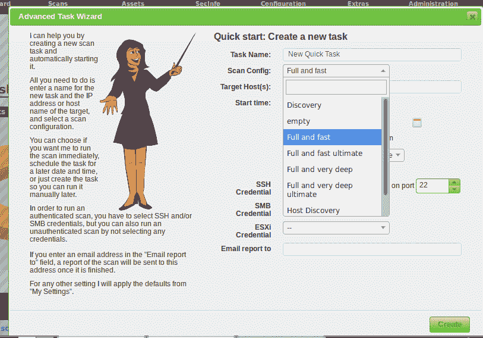
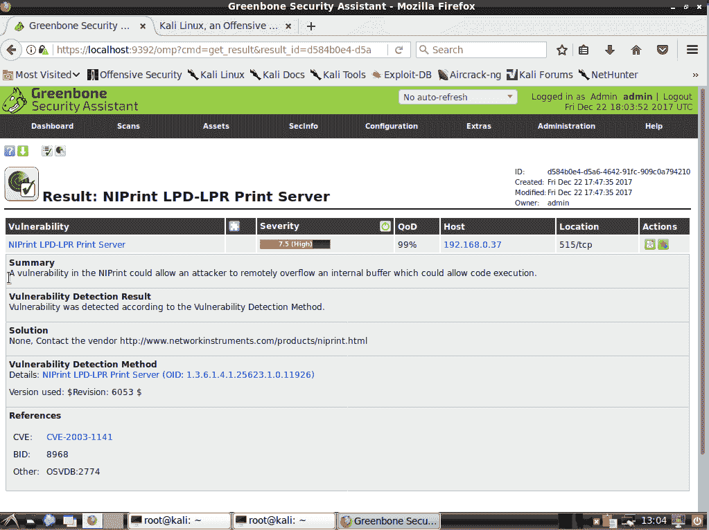

# 第九章：漏洞扫描和入侵检测

有很多威胁存在，其中一些甚至可能渗入您的网络。您会想知道发生了什么，因此您需要一个良好的**网络入侵检测系统**（**NIDS**）。我们将看看 Snort，这可能是最著名的一个。然后我会向您展示一种快速设置 Snort 系统的方法。

我们已经看到了如何通过在要扫描的机器上安装扫描工具来扫描病毒和 rootkit。但是，还有很多漏洞可以进行扫描，我会向您展示一些很酷的工具可以用于此。

本章涵盖以下主题：

+   介绍 Snort 和 Security Onion

+   使用 Lynis 进行扫描和加固

+   使用 OpenVAS 查找漏洞

+   使用 Nikto 进行 Web 服务器扫描

# 查看 Snort 和 Security Onion

Snort 是一个 NIDS，是作为免费开源软件产品提供的。程序本身是免费的，但如果您想拥有完整的、最新的威胁检测规则集，就需要付费。Snort 最初是一个单人项目，但现在由思科公司拥有。但要明白，这不是您要保护的机器上安装的东西。相反，您至少需要一个专用的 Snort 机器在网络的某个地方，只是监视所有网络流量，观察异常情况。当它看到不应该出现的流量时——例如表明存在机器人的流量——它可以向管理员发送警报消息，甚至可以根据规则的配置阻止异常流量。对于小型网络，您可以只有一个 Snort 机器，既作为控制台又作为传感器。对于大型网络，您可以设置一个 Snort 机器作为控制台，并让它接收其他作为传感器设置的 Snort 机器的报告。

Snort 并不难处理，但是从头开始设置完整的 Snort 解决方案可能有点繁琐。在我们了解了 Snort 的基本用法之后，我将向您展示如何通过设置预构建的 Snort 设备大大简化事情。

空间不允许我提供有关 Snort 的全面教程。相反，我将提供一个高层次的概述，然后向您提供其他学习 Snort 的资源。

# 获取和安装 Snort

Snort 不在任何 Linux 发行版的官方软件库中，因此您需要从 Snort 网站获取。在他们的下载页面上，您将看到 Fedora 和 CentOS 的`.rpm`格式的安装程序文件，以及 Windows 的`.exe`安装程序文件。但是，您在 Ubuntu 上看不到任何`.deb`安装程序文件。没关系，因为他们还提供源代码文件，您可以在各种不同的 Linux 发行版上编译。为了简化事情，让我们只谈谈在 CentOS 7 上安装 Snort 与预构建的`.rpm`软件包。

您可以从官方 Snort 网站获取 Snort 和 Snort 培训：[`www.snort.org`](https://www.snort.org)。

在 Snort 主页上，只需向下滚动一点，你就会看到如何下载和安装 Snort 的指南。点击 Centos 选项卡并按照步骤操作。第 1 步中的命令将下载并安装 Snort，如下面的屏幕截图所示：


第 2 步和第 3 步涉及注册 Oinkcode，以便您可以下载官方的 Snort 检测规则，然后安装 PulledPork，以便您可以自动更新规则，如下面的屏幕截图所示：


请记住，Snort 提供的免费检测规则大约比付费订阅者获得的规则晚一个月。但是，就学习目的而言，它们就是您所需要的一切。此外，如果您选择不获取 Oinkcode，您可以使用社区规则，这是官方 Snort 规则的一个子集。

第 4 步只是阅读文档：


就是这样。您现在拥有一个可用的 Snort 副本。唯一的问题是，到目前为止，您只有命令行界面，这可能不是您想要的。

# Snort 的图形界面

普通的、未装饰的 Snort 将做您需要它做的事情，并将其发现保存到其自己的一组日志文件中。但是，阅读日志文件以辨别网络流量趋势可能会有点乏味，因此您需要一些工具来帮助您。最好的工具是图形工具，它们可以为您提供对网络情况的良好可视化。

一个例子是**基本分析和安全引擎**（**BASE**），如下截图所示：


还有几个，但我会在我们到达* Security Onion *部分时向您展示它们。

您可以从作者的* Professionally Evil *网站了解有关 BASE 的更多信息：[`professionallyevil.com/`](https://professionallyevil.com/)

# 获取预构建的 Snort 设备

设置 Snort 本身并不是太难。但是，如果您一切都是手动操作，那么在设置控制台、传感器和您选择的图形前端之后，可能会有点乏味。因此——想象一下，当我戴着墨镜凝视着您说这些话时——如果我告诉您，您可以将 Snort 设置为即插即用设备的一部分呢？如果我告诉您，设置这样的设备绝对是轻而易举的呢？我想您可能会说，“那就给我看看吧！”

如果您因使 Snort 部署变得如此简单而感到内疚，那么实际上没有必要。一位 Snort 官方代表曾经告诉我，大多数人都以这种方式部署 Snort。

由于 Snort 是一个**自由开源软件**（**FOSS**）项目，因此人们将其构建到自己的 FOSS 应用程序中是完全合法的。此外，如果您回想一下我们在第三章中对防火墙的讨论，*使用防火墙保护服务器*，我完全忽略了创建**网络地址转换**（**NAT**）规则的讨论，这是您设置边缘或网关类型防火墙所需的。这是因为有几个 Linux 发行版专门为此目的而创建。如果我告诉您，其中一些还包括 Snort 的完整实现呢？


IPFire 完全免费，只需几分钟即可设置。您可以将其安装在至少具有两个网络接口适配器的计算机上，并将其配置为与您的网络配置相匹配。这是一种代理类型的防火墙，这意味着除了进行正常的防火墙类型的数据包检查外，它还包括缓存、内容过滤和 NAT 功能。您可以以多种不同的配置设置 IPFire：

+   在具有两个网络接口适配器的计算机上，您可以将一个连接到互联网，另一个连接到内部局域网。

+   使用三个网络适配器，您可以将一个连接到互联网，一个连接到内部局域网，一个连接到**非军事区**（**DMZ**），在那里您有面向互联网的服务器。

+   通过第四个网络适配器，您可以拥有上述所有内容，以及对无线网络的保护。

安装 IPFire 后，您需要使用普通工作站的 Web 浏览器导航到 IPFire 仪表板。在 Services 菜单下，您会看到入侵检测的条目。单击该条目即可进入此屏幕，您可以在此屏幕上下载并启用 Snort 检测规则：


实际上，您可能只需要从命令行进行一点微调。也就是说，您可能需要进入规则目录，并确保您要启用的规则已启用。在我的演示机器上，我安装了社区规则和新兴威胁规则：

```
[root@ipfire rules]# ls -l
total 19336
-rw-r--r-- 1 nobody nobody    1656 Dec 19 06:01 BSD-License.txt
-rw-r--r-- 1 nobody nobody    2638 Dec 19 06:01 classification.config
-rw-r--r-- 1 nobody nobody 1478085 Dec 19 06:01 community.rules
-rw-r--r-- 1 nobody nobody   15700 Dec 19 06:01 compromised-ips.txt
-rw-r--r-- 1 nobody nobody  378690 Dec 19 06:01 emerging-activex.rules
-rw-r--r-- 1 nobody nobody   79832 Dec 19 06:01 emerging-attack_response.rules
-rw-r--r-- 1 nobody nobody   82862 Dec 19 06:01 emerging-botcc.portgrouped.rules
-rw-r--r-- 1 nobody nobody  249176 Dec 19 06:01 emerging-botcc.rules
-rw-r--r-- 1 nobody nobody   34658 Dec 19 06:01 emerging-chat.rules
. . .
. . .
-rw-r--r-- 1 nobody nobody    1375 Dec 19 06:01 reference.config
-rw-r--r-- 1 nobody nobody 3691529 Dec 19 06:01 sid-msg.map
-rw-r--r-- 1 nobody nobody       0 Dec 19 06:01 snort-2.9.0-enhanced-open.txt
-rw-r--r-- 1 nobody nobody   53709 Dec 19 06:01 unicode.map
-rw-r--r-- 1 nobody nobody   21078 Dec 19 04:46 VRT-License.txt
[root@ipfire rules]#
```

当您首次安装 IPFire 时，它设置的唯一用户帐户是 root 用户。但是，有工具可以创建普通用户帐户并赋予其`sudo`权限。我还没有在这台机器上做这个操作，因为我想向您展示默认配置。但是，在生产机器上我肯定会这样做。然后我会禁用 root 帐户。

当您打开这些规则文件时，您会发现其中许多规则是禁用的，而相对较少的是启用的。禁用的规则前面有一个`#`号，就像`community.rules`文件中的这两个规则一样：

```
#alert tcp $HOME_NET 2589 -> $EXTERNAL_NET any (msg:"MALWARE-BACKDOOR - Dagger_1.4.0"; flow:to_client,established; content:"2|00 00 00 06 00 00 00|Drives|24 00|"; depth:16; metadata:ruleset community; classtype:misc-activity; sid:105; rev:14;)
#alert tcp $EXTERNAL_NET any -> $HOME_NET 7597 (msg:"MALWARE-BACKDOOR QAZ Worm Client Login access"; flow:to_server,established; content:"qazwsx.hsq"; metadata:ruleset community; reference:mcafee,98775; classtype:misc-activity; sid:108; rev:11;)
```

您可能还注意到每个规则都以关键字`alert`开头。您可以使用`grep`快速检查文件中启用的规则：

```
[root@ipfire rules]# grep ^alert community.rules | less
[root@ipfire rules]#
```

`^`字符表示我正在`community.rules`文件中搜索以单词`alert`开头的每一行，而不带前面的`#`号。将输出导入`less`是可选的，但它可以帮助您更好地查看所有输出数据。您还可以使用通配符一次搜索所有文件：

```
[root@ipfire rules]# grep ^alert *.rules | less
[root@ipfire rules]#
```

您需要查看规则以确定您需要哪些规则，哪些规则不需要。通过删除规则前面的`#`号来启用所需的规则，并通过在规则前面放置`#`号来禁用不需要的规则。

不幸的是，IPFire 不包括用于可视化 Snort 数据的图形前端，但它确实带有 IDS 日志查看器：


IPFire 还有许多其他很酷的功能，我还没有提到。这些功能包括内置的**虚拟专用网络**（**VPN**）功能，内置的 DHCP 服务器，内置的动态 DNS 服务器和服务质量控制。最好的部分是它是完全免费的，除非您想购买订阅以始终获得最新的 Snort 规则。

您可以从他们的网站下载 IPFire：[`www.ipfire.org/.`](https://www.ipfire.org/)

# 使用 Security Onion

好吧，也许带有内置 Snort 的防火墙设备现在不是您需要的。也许您需要的是一个完整的 NIDS。但是，您是一个忙碌的人，需要快速简便的东西，而且您的老板对您的预算要求相当严格。那么，您该怎么办呢？

Security Onion 是一个免费的专业 Linux 发行版，构建在 Xubuntu **长期支持**（**LTS**）发行版之上。它包括完整的 Snort 实现，几乎包括您可以想象的所有图形功能，以帮助您可视化网络上发生的情况。如果您可以安装 Linux 发行版并在安装后进行一些点对点的配置，那么您就可以安装 Security Onion。

请注意，Security Onion 所基于的 Xubuntu LTS 版本始终至少落后于当前 Xubuntu LTS 版本。在撰写本文时，当前的 Xubuntu LTS 版本是版本 16.04，而 Security Onion 仍然基于 Xubuntu 14.04。但是，这可能会在您阅读本书时发生变化。

此外，如果您想尝试 Security Onion，您可以在 VirtualBox 虚拟机中设置它。创建虚拟机时，将其设置为两个网络适配器，都处于*Bridged*模式。为了获得最佳性能，至少分配 3GB 内存。

安装完操作系统后，配置只是简单地双击设置图标，然后按照对话框进行操作：


要设置具有传感器功能的机器，您需要一台具有两个接口卡的机器。一个接口将分配 IP 地址，将成为管理接口：


您可以将管理界面设置为通过 DHCP 自动获取 IP 地址，但最好分配一个静态 IP 地址：


您将使用另一个网络适配器作为嗅探接口。您不会为其分配 IP 地址，因为您希望该接口对坏人不可见：


确认您选择的网络配置后，重新启动机器：


机器重新启动后，再次双击设置图标，但这次选择跳过网络配置。对于第一次使用 Security Onion 的用户来说，评估模式非常有帮助，因为它会自动选择大多数东西的最正确选项。


从现在开始，只需确认哪个网络接口将成为嗅探接口，并填写不同图形界面的登录凭据。然后，在等待设置实用程序下载 Snort 规则并执行最后的配置步骤后，您将拥有自己的操作 NIDS。现在我问，还有什么比这更容易的呢？

Security Onion 配备了几种不同的图形界面。我最喜欢的是 Squert，如图所示。即使只有默认的检测规则，我已经看到了一些有趣的东西。以下截图显示了 Squert：


首先，我看到网络上有人在挖掘一些 Monero 加密货币。好吧，实际上，我就是在挖，所以没关系。但是，能够检测到这一点是件好事，因为众所周知，坏人曾经在企业服务器上种植 Monero 挖矿软件以谋取私利。Monero 加密货币挖矿会给服务器的 CPU 带来很大负载，所以这不是你想要的服务器上的东西。此外，一些狡猾的网站运营商在其网页上放置了 JavaScript 代码，导致任何访问它们的计算机都开始挖掘 Monero。因此，这条规则也有助于保护桌面系统。

我还看到 Dropbox 客户端正在广播，这也没关系，因为我是 Dropbox 用户。但是，这也是您可能不希望在企业网络上拥有的东西。

要查看与特定项目相关联的 Snort 规则，只需单击该项目：


这只是一个已经为我们设置好的标准 Snort 规则。

想要挖掘 Monero 而不付费的坏人已经建立了被感染其挖矿软件的机器的僵尸网络。在一些攻击中，只有 Windows 服务器被感染。但是，这里有一个情况，Windows 和 Linux 服务器都被感染了：

[`www.v3.co.uk/v3-uk/news/3023348/cyber-crooks-conducting-sophisticated-malware-campaign-to-mine-monero`](https://www.v3.co.uk/v3-uk/news/3023348/cyber-crooks-conducting-sophisticated-malware-campaign-to-mine-monero)

单击 Squert 的“视图”选项卡，您将看到您的机器建立的连接的图形表示：


关于 Security Onion 和 Snort，我还可以向您展示更多，但是，空间不允许。我已经给了您要领，现在去尝试一下吧。

我知道我让 Snort/Security Onion 看起来相当简单，但实际上比我能向您展示的要复杂得多。在大型网络上，您可能会看到很多看起来毫无意义的流量，除非您知道如何解释 Snort 向您呈现的信息。您可能还需要微调您的 Snort 规则，以便看到您想要看到的异常情况，而不会产生错误的警报。或者，您甚至可能需要编写自己的自定义 Snort 规则来处理异常情况。幸运的是，Security Onion 团队提供培训，包括现场和在线培训。您可以在以下网站了解更多信息：

[`securityonionsolutions.com/.`](https://securityonionsolutions.com/)

# 使用 Lynis 进行扫描和加固

Lynis 是另一个可以用来扫描系统漏洞和不良安全配置的自由开源软件工具。它是一个便携式 shell 脚本，不仅可以在 Linux 上使用，还可以在各种不同的 Unix 系统和类 Unix 系统上使用。它是一个多用途工具，您可以用它进行合规性审计、漏洞扫描或加固。与大多数漏洞扫描工具不同，您需要在要扫描的系统上安装和运行 Lynis。根据 Lynis 的创建者，这样可以进行更深入的扫描。

Lynis 扫描工具有免费版本，但其扫描能力有限。如果您需要 Lynis 提供的所有功能，您需要购买企业许可证。

# 在 Red Hat/CentOS 上安装 Lynis

Red Hat/CentOS 用户将在 EPEL 存储库中找到最新版本的 Lynis。因此，如果您已安装了 EPEL，就像我在第一章中向您展示的那样，*在虚拟环境上运行 Linux*，安装只是一个简单的事情：

```
sudo yum install lynis
```

# 在 Ubuntu 上安装 Lynis

Ubuntu 在其自己的存储库中有 Lynis，但您获得的版本取决于您使用的 Ubuntu 版本。Ubuntu 16.04 LTS 存储库中的版本相对较旧。Ubuntu 17.10 存储库中的版本更新一些，但仍不完全是最新的。在任何情况下，安装 Lynis 的命令是：

```
sudo apt install lynis
```

如果您想要 Ubuntu 的最新版本，或者想要在没有 Lynis 的存储库中使用 Lynis 的操作系统上使用它，您可以从作者的网站上下载。

您可以从[`cisofy.com/downloads/lynis/.`](https://cisofy.com/downloads/lynis/)下载 Lynis。这个很酷的地方是，一旦您下载了它，您可以在任何 Linux、Unix 或类 Unix 操作系统上使用它。（这甚至包括 MacOS，我刚刚通过在运行 macOS High Sierra 的旧 Mac Pro 上运行它来确认。）[](https://cisofy.com/downloads/lynis/)

由于可执行文件只是一个普通的 shell 脚本，因此无需执行实际安装。您只需要解压缩存档文件，`cd`进入生成的目录，并从那里运行 Lynis：

```
tar xzvf lynis-2.5.7.tar.gz
cd lynis
sudo ./lynis -h
```

`lynis -h`命令显示帮助屏幕，其中包含您需要了解的所有 Lynis 命令。

# 使用 Lynis 进行扫描

无论您要扫描哪个操作系统，Lynis 命令都是相同的。唯一的区别是，如果您从网站下载的存档文件中运行它，您将`cd`进入`lynis`目录，并在`lynis`命令之前加上`./`。（这是因为出于安全原因，您自己的主目录不在允许 shell 自动查找可执行文件的路径设置中。）

要扫描已安装 Lynis 的系统，请按照以下步骤进行：

```
sudo lynis audit system
```

要扫描刚刚下载存档文件的系统，请按照以下步骤进行：

```
cd lynis
sudo ./lynis audit system
```

从您的主目录中的 shell 脚本运行 Lynis 会显示以下消息：

```
donnie@ubuntu:~/lynis$ sudo ./lynis audit system
[sudo] password for donnie:

[!] Change ownership of /home/donnie/lynis/include/functions to 'root' or similar (found: donnie with UID 1000).

 Command:
 # chown 0:0 /home/donnie/lynis/include/functions

[X] Security check failed

 Why do I see this error?
 -------------------------------
 This is a protection mechanism to prevent the root user from executing user created files. The files may be altered, or including malicious pieces of script.

 What can I do?
 ---------------------
 Option 1) Check if a trusted user created the files (e.g. due to using Git, Homebrew or similar).
 If you trust these files, you can decide to continue this run by pressing ENTER.

 Option 2) Change ownership of the related files (or full directory).

 Commands (full directory):
 # cd ..
 # chown -R 0:0 lynis
 # cd lynis
 # ./lynis audit system

[ Press ENTER to continue, or CTRL+C to cancel ]
```

这不会造成任何损害，所以你可以按*Enter*继续。或者，如果看到这条消息真的让你烦恼，你可以按照消息告诉你的那样，将 Lynis 文件的所有权更改为 root 用户。现在，我只是按下*Enter*。

以这种方式运行 Lynis 扫描类似于运行 OpenSCAP 扫描以符合通用安全配置文件。主要区别在于 OpenSCAP 具有自动修复功能，而 Lynis 没有。Lynis 告诉你它发现了什么，并建议如何修复它认为是问题的东西，但它不会为你修复任何东西。

空间不允许我展示整个扫描输出，但我可以给你展示一些示例片段：

```
[+] Boot and services
------------------------------------
 - Service Manager                                           [ systemd ]
 - Checking UEFI boot                                        [ DISABLED ]
 - Checking presence GRUB                                    [ OK ]
 - Checking presence GRUB2                                   [ FOUND ]
 - Checking for password protection                        [ WARNING ]
 - Check running services (systemctl)                        [ DONE ]
 Result: found 21 running services
 - Check enabled services at boot (systemctl)                [ DONE ]
 Result: found 28 enabled services
 - Check startup files (permissions)                         [ OK ]

```

警告消息显示我没有为我的`GRUB2`引导加载程序设置密码保护。这可能很重要，也可能不重要，因为有人可以利用这一点来获得对机器的物理访问权限。如果这是一个被锁在只有少数信任人员可以访问的房间里的服务器，那么我不会担心，除非适用的监管机构的规定要求我这样做。如果这是一个放在开放式隔间里的台式机，那么我肯定会修复这个问题。（我们将在第十章中看到 GRUB 密码保护，*忙碌蜜蜂的安全提示和技巧*。）

在“文件系统”部分，我们看到一些带有“建议”标志的项目。

```
[+] File systems
------------------------------------
 - Checking mount points
 - Checking /home mount point                              [ SUGGESTION ]
 - Checking /tmp mount point                               [ SUGGESTION ]
 - Checking /var mount point                               [ SUGGESTION ]
 - Query swap partitions (fstab)                             [ OK ]
 - Testing swap partitions                                   [ OK ]
 - Testing /proc mount (hidepid)                             [ SUGGESTION ]
 - Checking for old files in /tmp                            [ OK ]
 - Checking /tmp sticky bit                                  [ OK ]
 - ACL support root file system                              [ ENABLED ]
 - Mount options of /                                        [ NON DEFAULT ]
 - Checking Locate database                                  [ FOUND ]
 - Disable kernel support of some filesystems
 - Discovered kernel modules: cramfs freevxfs hfs hfsplus jffs2 udf
```

正是 Lynis 建议的内容出现在输出的最后：

```
. . .
. . .

 * To decrease the impact of a full /home file system, place /home on a separated partition [FILE-6310]
 https://cisofy.com/controls/FILE-6310/

 * To decrease the impact of a full /tmp file system, place /tmp on a separated partition [FILE-6310]
 https://cisofy.com/controls/FILE-6310/

 * To decrease the impact of a full /var file system, place /var on a separated partition [FILE-6310]
 https://cisofy.com/controls/FILE-6310/
. . .
. . .
```

我们将看看输出的最后一个部分，即扫描详细信息部分：

```
 Lynis security scan details:

 Hardening index : 67 [#############       ]
 Tests performed : 218
 Plugins enabled : 0

 Components:
 - Firewall               [V]
 - Malware scanner        [X]

 Lynis Modules:
 - Compliance Status      [?]
 - Security Audit         [V]
 - Vulnerability Scan     [V]

 Files:
 - Test and debug information      : /var/log/lynis.log
 - Report data                     : /var/log/lynis-report.dat
```

对于“组件”，“恶意软件扫描器”旁边有一个红色的`X`。这是因为我没有在这台机器上安装 ClamAV 或`maldet`，所以 Lynis 无法进行病毒扫描。

对于“Lynis 模块”，我们看到“合规状态”旁边有一个问号。这是因为这个功能是为 Lynis 企业版保留的，需要付费订阅。正如我们在上一章中看到的，你可以使用 OpenSCAP 配置文件使系统符合几种不同的安全标准，而且这不需要花费任何费用。使用 Lynis，你必须为合规配置文件付费，但你可以选择更广泛的范围。除了 OpenSCAP 提供的合规配置文件外，Lynis 还提供了 HIPAA 和萨班斯-奥克斯合规配置文件。

如果你在美国，你肯定知道 HIPAA 和萨班斯-奥克斯是什么，以及它们是否适用于你。如果你不在美国，那么你可能不需要担心它们。

话虽如此，如果你在医疗行业工作，即使你不在美国，HIPAA 配置文件也可以为你提供如何保护患者的私人数据的指导。

关于 Lynis，我想说的最后一件事是关于企业版。在他们网站上的这张截图中，你可以看到当前的定价和不同订阅计划之间的区别：


正如你所看到的，你有选择。

在这个网站上你会找到有关定价的信息：

[`cisofy.com/pricing/.`](https://cisofy.com/pricing/)

这基本上就是我们对 Lynis 的讨论。接下来，让我们看看一个*外部*漏洞扫描器。

# 使用 OpenVAS 查找漏洞

**开放漏洞评估扫描器**（**OpenVAS**）是你用来执行远程漏洞扫描的工具。你可以扫描单台机器、一组相似的机器或整个网络。它不包含在主要 Linux 发行版的软件仓库中，所以最好的方法是安装专门的安全发行版之一来获取它。

三大安全发行版是 Kali Linux、Parrot Linux 和 Black Arch。它们面向安全研究人员和渗透测试人员，但它们包含的工具也适用于 Linux 或 Windows 的普通安全管理员。OpenVAS 就是其中之一。这三个安全发行版都有各自独特的优势和劣势，但由于 Kali 最受欢迎，我们将用它进行演示。

您可以从[`www.kali.org/downloads/.`](https://www.kali.org/downloads/)下载 Kali Linux

当您转到 Kali 下载页面时，您会看到很多选择。如果您像我一样不喜欢默认的 Gnome 3 桌面环境，您可以选择其他内容。我个人是 LXDE 的粉丝，所以我会选择它：


Kali 是基于 Debian Linux 构建的，因此安装它与安装 Debian 几乎相同。唯一的例外是 Kali 安装程序允许您为 root 用户创建密码，但不允许您创建普通的非 root 用户帐户。这是因为您在 Kali 中几乎所有操作都需要以 root 用户身份登录。我知道这与我一直告诉您的不要以`root`身份登录以及使用`sudo`而不是普通用户帐户登录的建议相悖。但是，您在 Kali 中需要做的大部分工作都无法使用`sudo`完成。此外，Kali 并不是用作通用发行版，只要您按照其预期使用，以 root 身份登录就可以。

OpenVAS 是一个占用内存较多的程序，因此如果您在虚拟机中安装 Kali，请确保至少分配 3GB 的内存。

安装 Kali 后，您需要做的第一件事是更新它，这与更新任何 Debian/Ubuntu 类型的发行版的方式相同。然后，按照以下方式安装 OpenVAS：

```
apt update
apt dist-upgrade
apt install openvas
```

OpenVAS 安装完成后，您需要运行一个脚本，该脚本将创建安全证书并下载漏洞数据库：

```
openvas-setup
```

这将需要很长时间，所以在运行时您可以去拿一个三明治和一杯咖啡。最终完成后，您将看到用于登录 OpenVAS 的密码。记下来并保存在安全的地方：


您可以从应用程序菜单控制和更新 OpenVAS：


在菜单中，单击 openvas start。然后，打开 Firefox 并导航到`https://localhost:9392`。您会收到一个安全警告，因为 OpenVAS 使用自签名的安全证书，但没关系。只需单击“高级”按钮，然后单击“添加异常”：


在登录页面，输入`admin`作为用户，然后输入由`openvas-setup`脚本生成的密码。

现在，OpenVAS 有各种花哨的功能，但现在我们只看如何进行基本的漏洞扫描。首先，从 OpenVAS 仪表板的扫描菜单中选择“任务”：


这将弹出对话框，告诉您使用向导。（没错，我们要去见向导。）：


关闭对话框后，您会看到紫色的向导图标出现在左上角。现在，我们只需选择“任务向导”选项，它将为我们选择所有默认的扫描设置：


您需要做的唯一事情是输入要扫描的机器的 IP 地址，然后开始扫描：


扫描需要一些时间，所以在运行时您可以去拿一个三明治和一杯咖啡。


你正在进行的扫描类型被称为全面和快速，这不是最全面的扫描类型。要选择另一种扫描类型并配置其他扫描选项，请使用高级任务向导，如下面的截图所示：


在这里，你可以看到不同扫描选项的下拉列表：



当我使用默认的全面和快速选项进行第一次扫描时，我没有发现太多问题。我发现了一个中等严重性和 18 个低严重性的问题，就这些。由于我扫描的机器的年龄，我知道肯定会有更多问题，所以我尝试了全面和快速终极选项。这一次，我发现了更多问题，包括一些高严重性的问题：


报告显示，我的机器正在使用弱加密算法进行 Secure Shell，这被分类为中等严重性。它还有一个被分类为高严重性问题的打印服务器漏洞。

你还需要注意那些没有标记为漏洞的项目。例如，VNC 安全类型项显示端口`5900`是开放的。这意味着**虚拟网络计算**（VNC）守护程序正在运行，允许用户远程登录到这台机器的桌面。如果这台机器是一个面向互联网的机器，那将是一个真正的问题，因为 VNC 没有像 Secure Shell 那样的真正安全性。


点击打印服务器项目，我可以看到对这个漏洞的解释。



请记住，目标机器在这种情况下是一台台式机。如果它是一台服务器，很可能会出现更多问题。

这基本上就是 OpenVAS 的全部内容了。正如我之前所说，你可以用它做很多很棒的事情。但是，我在这里向你展示的应该足够让你入门了。尝试使用不同的扫描选项来玩耍，看看结果的差异。

如果你想了解更多关于 Kali Linux 的信息，你可以在 Packt Publishing 网站上找到很多关于它的书籍。

# 使用 Nikto 进行 Web 服务器扫描

我们刚刚看到的 OpenVAS 是一个通用的漏洞扫描器。它可以找到任何操作系统或服务器守护程序的漏洞。然而，正如我们刚刚看到的，OpenVAS 扫描可能需要一段时间才能运行，并且可能超出你的需求。

Nikto 是一个专用工具，只有一个目的。也就是说，它的目的是扫描 Web 服务器，只有 Web 服务器。它易于安装，易于使用，并且能够相当快速地对 Web 服务器进行全面扫描。虽然它包含在 Kali Linux 中，但你不需要 Kali Linux 来运行它。

# Kali Linux 中的 Nikto

如果你已经有 Kali Linux，你会发现 nikto 已经安装在漏洞分析菜单下：


当你点击菜单项时，你会打开一个带有 Nikto 帮助屏幕显示的命令行终端：


# 在 Linux 上安装和更新 Nikto

Nikto 在 Red Hat/CentOS 的 EPEL 仓库中，而在 Ubuntu 的正常仓库中。除了 Nikto 软件包本身，你还需要安装一个允许 Nikto 扫描设置了 SSL/TLS 加密的 Web 服务器的软件包。

在 Red Hat/CentOS 上安装：

```
sudo yum install nikto perl-Net-SSLeay
```

在 Ubuntu 上安装：

```
sudo apt install nikto libnet-ssleay-perl
```

接下来你需要做的是更新漏洞签名数据库。但是，在撰写本文时，Red Hat/CentOS 实现中存在一个轻微的错误。由于某种原因，`docs`目录丢失，这意味着更新功能将无法下载`CHANGES.txt`文件，以向您展示新数据库更新的变化。要在您的 CentOS 虚拟机上修复这个问题，请使用以下命令：

```
sudo mkdir /usr/share/nikto/docs
```

不过请记住，到你读到这篇文章的时候，这些问题可能已经被修复了。

从现在开始，无论你的虚拟机是哪一个，事情都会一样。要更新漏洞数据库，请使用以下命令：

```
sudo nikto -update
```

Nikto 本身不需要`sudo`权限，但更新它需要，因为它需要写入普通用户无法写入的目录。

# 使用 Nikto 扫描 Web 服务器

从现在开始，你不再需要`sudo`权限。所以，你可以暂时不用输入密码了。

要进行简单的扫描，使用`-h`选项指定目标主机：

```
nikto -h 192.168.0.9
nikto -h www.example.com
```

让我们来看一些示例输出：

```
+ Allowed HTTP Methods: POST, OPTIONS, GET, HEAD
+ OSVDB-396: /_vti_bin/shtml.exe: Attackers may be able to crash FrontPage by requesting a DOS device, like shtml.exe/aux.htm -- a DoS was not attempted.
+ /cgi-bin/guestbook.pl: May allow attackers to execute commands as the web daemon.
+ /cgi-bin/wwwadmin.pl: Administration CGI?
+ /cgi-bin/Count.cgi: This may allow attackers to execute arbitrary commands on the server
+ OSVDB-28260: /_vti_bin/shtml.exe/_vti_rpc?method=server+version%3a4%2e0%2e2%2e2611: Gives info about server settings.
+ OSVDB-3092: /_vti_bin/_vti_aut/author.exe?method=list+documents%3a3%2e0%2e2%2e1706&service%5fname=&listHiddenDocs=true&listExplorerDocs=true&listRecurse=false&listFiles=true&listFolders=true&listLinkInfo=true&listIncludeParent=true&listDerivedT=false&listBorders=fals: We seem to have authoring access to the FrontPage web.
+ OSVDB-250: /wwwboard/passwd.txt: The wwwboard password file is browsable. Change wwwboard to store this file elsewhere, or upgrade to the latest version.
+ OSVDB-3092: /stats/: This might be interesting...
+ OSVDB-3092: /test.html: This might be interesting...
+ OSVDB-3092: /webstats/: This might be interesting...
+ OSVDB-3092: /cgi-bin/wwwboard.pl: This might be interesting...
+ OSVDB-3233: /_vti_bin/shtml.exe/_vti_rpc: FrontPage may be installed.
+ 6545 items checked: 0 error(s) and 15 item(s) reported on remote host
+ End Time:           2017-12-24 10:54:21 (GMT-5) (678 seconds)
```

在顶部，我们看到`vti_bin`目录中有一个`shtml.exe`文件，据说是用于 FrontPage Web 编写程序的。我不知道为什么会有这个文件，考虑到这是一个 Linux 服务器，那是一个 Windows 可执行文件。Nikto 告诉我，通过拥有那个文件，某人可能会对我进行**拒绝服务**（**DOS**）攻击。

接下来，我们看到`/cgi-bin`目录中有各种脚本。你可以从解释性消息中看出这不是一件好事，因为这可能允许攻击者在我的服务器上执行命令。

在这之后，我们看到`vti_bin`目录中有一个`author.exe`文件，这理论上可能允许某人拥有作者权限。

最后一个有趣的项目是`wwwboard`目录中的`passwd.txt`文件。显然，这个密码文件是可浏览的，这绝对不是一件好事。

现在，在你指责我捏造这些问题之前，我要透露这是对一个真实托管服务上的真实生产网站的扫描。（是的，我有扫描的许可。）所以，这些问题是真实存在的，需要修复。

以下是我从扫描运行 WordPress 的 Web 服务器中得到的另外两个示例消息：

```
HTTP TRACK method is active, suggesting the host is vulnerable to XST
Cookie wordpress_test_cookie created without the httponly flag
```

长话短说，这两个问题都有可能允许攻击者窃取用户凭据。在这种情况下，解决方法是查看 WordPress 团队是否发布了任何可以解决问题的更新。

那么，我们如何保护 Web 服务器免受这些漏洞的影响呢？

+   正如我们在第一个示例中看到的，你希望确保你的 Web 服务器上没有任何风险的可执行文件。在这种情况下，我们发现了两个`.exe`文件，可能不会对我们的 Linux 服务器造成任何伤害，因为 Windows 可执行文件无法在 Linux 上运行。然而，另一方面，它可能是一个伪装成 Windows 可执行文件的 Linux 可执行文件。我们还发现了一些`perl`脚本，这些脚本肯定会在 Linux 上运行，并可能会造成问题。

+   如果有人在你的 Web 服务器上植入了一些恶意脚本，你会希望有某种强制访问控制，比如 SELinux 或 AppArmor，可以阻止恶意脚本运行。（有关详细信息，请参阅第七章，*使用 SELinux 和 AppArmor 实施强制访问控制*。）

+   你可能还考虑安装 Web 应用防火墙，比如*ModSecurity*。空间不允许我详细介绍 ModSecurity 的细节，但你可以在 Packt Publishing 网站找到一本介绍它的书。

+   保持系统更新，特别是如果你正在运行基于 PHP 的内容管理系统，比如 WordPress。（如果你关注 IT 安全新闻，你会发现关于 WordPress 漏洞的报道比你想象的要频繁。）

还有其他的扫描选项，你可以在命令行中输入`nikto`来查看。不过，现在这些已经足够让你开始进行基本的 Web 服务器扫描了。

# 总结

我们已经在我们的旅程中达到了又一个里程碑，并且看到了一些很酷的东西。我们从讨论设置 Snort 作为 NIDS 的基础知识开始。然后我向你展示了如何通过部署已经设置好并准备就绪的专业 Linux 发行版来严重作弊。

接下来，我向你介绍了 Lynis 以及如何使用它来扫描系统中的各种漏洞和合规性问题。最后，我们通过 OpenVAS 和 Nikto 的实际演示结束了这一切。

在下一章中，我们将以一些忙碌管理员的快速提示来结束整个旅程。我会在那里见到你。
