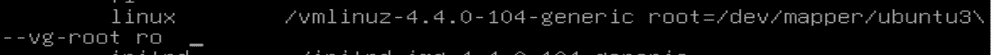

# 第十章：对于繁忙的用户的安全提示和技巧

在我们的最后一章中，我想对之前章节中不一定适合的一些快速提示和技巧进行总结。把这些提示看作是繁忙管理员的时间节省者。

我们将涵盖以下主题：

+   快速审计系统服务的方法

+   对 GRUB2 配置进行密码保护

+   安全配置然后对 UEFI/BIOS 进行密码保护

+   在设置系统时使用安全检查表

# 审计系统服务

服务器管理的一个基本原则，无论我们谈论哪个操作系统，都是在服务器上永远不要安装任何你绝对不需要的东西。特别是你不希望任何不必要的网络服务在运行，因为这会给坏人额外的进入系统的途径。而且，总是有可能一些邪恶的黑客可能已经植入了一些充当网络服务的东西，你肯定想知道这件事。在本章中，我们将看一些审计系统的不同方法，以确保系统上没有不必要的网络服务在运行。

# 使用 systemctl 审计系统服务

在带有 systemd 的 Linux 系统中，`systemctl`命令几乎是一个为您执行许多操作的通用命令。除了控制系统的服务，它还可以显示这些服务的状态。我们有以下代码：

```
donnie@linux-0ro8:~> sudo systemctl -t service --state=active
```

以下是前述命令的分解：

+   `-t service`：我们想要查看关于系统上服务或者以前称为**守护进程**的信息

+   `--state=active`：这指定我们想要查看实际正在运行的所有系统服务的信息

这个命令的部分输出看起来像这样：

```
UNIT                                                  LOAD   ACTIVE SUB     DESCRIPTION
accounts-daemon.service                               loaded active running Accounts Service
after-local.service                                   loaded active exited  /etc/init.d/after.local Compatibility
alsa-restore.service                                  loaded active exited  Save/Restore Sound Card State
apparmor.service                                      loaded active exited  Load AppArmor profiles
auditd.service                                        loaded active running Security Auditing Service
avahi-daemon.service                                  loaded active running Avahi mDNS/DNS-SD Stack
cron.service                                          loaded active running Command Scheduler
. . .
. . .
systemd-sysctl.service                                loaded active exited  Apply Kernel Variables
systemd-tmpfiles-setup-dev.service                    loaded active exited  Create Static Device Nodes in /dev
systemd-tmpfiles-setup.service                        loaded active exited  Create Volatile Files and Directories
systemd-udev-root-symlink.service                     loaded active exited  Rule generator for /dev/root symlink
systemd-udev-trigger.service                          loaded active exited  udev Coldplug all Devices
systemd-udevd.service                                 loaded active running udev Kernel Device Manager
systemd-update-utmp.service                           loaded active exited  Update UTMP about System Boot/Shutdown

```

通常你不会想看到这么多信息，尽管有时可能会需要。这个命令显示了系统上运行的每个服务的状态。现在真正让我们感兴趣的是可以允许某人连接到你的系统的网络服务。所以，让我们看看如何缩小范围。

# 使用 netstat 审计网络服务

以下是你想要跟踪系统上正在运行的网络服务的两个原因：

+   确保没有不需要的合法网络服务正在运行

+   确保你没有任何恶意软件在监听来自其主机的网络连接

`netstat`命令对于这些情况既方便又易于使用。首先，假设你想要查看正在监听并等待有人连接的网络服务列表：

```
donnie@linux-0ro8:~> netstat -lp -A inet

(Not all processes could be identified, non-owned process info
 will not be shown, you would have to be root to see it all.)
Active Internet connections (only servers)
Proto Recv-Q Send-Q Local Address       Foreign Address   State       PID/Program name
tcp        0      0 *:ideafarm-door     *:*               LISTEN      -
tcp        0      0 localhost:40432     *:*               LISTEN      3296/SpiderOakONE
tcp        0      0 *:ssh               *:*               LISTEN      -
tcp        0      0 localhost:ipp       *:*               LISTEN      -
tcp        0      0 localhost:smtp      *:*               LISTEN      -
tcp        0      0 *:db-lsp            *:*               LISTEN      3246/dropbox
tcp        0      0 *:37468             *:*               LISTEN      3296/SpiderOakONE
tcp        0      0 localhost:17600     *:*               LISTEN      3246/dropbox
tcp        0      0 localhost:17603     *:*               LISTEN      3246/dropbox
udp        0      0 *:57228             *:*                           3376/plugin-contain
udp        0      0 192.168.204.1:ntp   *:*                           -
udp        0      0 172.16.249.1:ntp    *:*                           -
udp        0      0 linux-0ro8:ntp      *:*                           -
udp        0      0 localhost:ntp       *:*                           -
udp        0      0 *:ntp               *:*                           -
udp        0      0 *:58102             *:*                           5598/chromium --pas
udp        0      0 *:db-lsp-disc       *:*                           3246/dropbox
udp        0      0 *:43782             *:*                           5598/chromium --pas
udp        0      0 *:36764             *:*                           -
udp        0      0 *:21327             *:*                           3296/SpiderOakONE
udp        0      0 *:mdns              *:*                           5598/chromium --pas
udp        0      0 *:mdns              *:*                           5598/chromium --pas
udp        0      0 *:mdns              *:*                           5598/chromium --pas
udp        0      0 *:mdns              *:*                           -
raw        0      0 *:icmp              *:*               7           -
donnie@linux-0ro8:~>
```

分解如下：

+   `-lp`：`l`表示我们想要查看哪些网络端口正在监听。换句话说，我们想要查看哪些网络端口正在等待连接。`p`表示我们想要查看每个端口上正在监听的程序或服务的名称和进程 ID 号。

+   `-A inet`：这意味着我们只想要查看属于`inet`系列的网络协议的信息。换句话说，我们想要查看关于`raw`、`tcp`和`udp`网络套接字的信息，但我们不想看到任何关于仅处理操作系统内部进程通信的 Unix 套接字的信息。

由于这个输出来自我目前正在使用的 OpenSUSE 工作站，你在这里看不到通常的服务器类型服务。但是，你会看到一些你可能不想在你的服务器上看到的东西。例如，让我们看看第一项：

```
Proto Recv-Q Send-Q Local Address      Foreign Address         State       PID/Program name
tcp        0      0 *:ideafarm-door    *:*                     LISTEN      -
```

`本地地址`列指定了这个监听套接字的本地地址和端口。星号表示这个套接字在本地网络上，`ideafarm-door`是正在监听的网络端口的名称。（默认情况下，`netstat`会尽可能地显示端口的名称，通过从`/etc/services`文件中提取端口信息。）

现在，因为我不知道`ideafarm-door`服务是什么，我使用了我最喜欢的搜索引擎来找出答案。通过将术语`ideafarm-door`输入 DuckDuckGo，我找到了答案：


顶部搜索结果将我带到了一个名为*WhatPortIs*的网站。根据这个网站，`ideafarm-door`实际上是端口`902`，属于 VMware Server Console。好的，这很合理，因为我确实在这台机器上安装了 VMware Player。所以，一切都很好。

您可以在*WhatPortIs*网站上查看：[`whatportis.com/`](http://whatportis.com/)。

接下来是：

```
tcp        0      0 localhost:40432    *:*       LISTEN      3296/SpiderOakONE
```

此项目显示本地地址为`localhost`，监听端口为端口`40432`。这次，`PID/Program Name`列实际上告诉了我们这是什么。*SpiderOak ONE*是一个基于云的备份服务，您可能希望在服务器上运行它，也可能不希望。

现在，让我们再看几个项目：

```
tcp 0      0 *:db-lsp                   *:*      LISTEN      3246/dropbox
tcp 0      0 *:37468                    *:*      LISTEN      3296/SpiderOakONE
tcp 0      0 localhost:17600            *:*      LISTEN      3246/dropbox
tcp 0      0 localhost:17603            *:*      LISTEN      3246/dropbox
```

在这里，我们看到 Dropbox 和 SpiderOak ONE 都在本地地址上带有星号。因此，它们都在使用本地网络地址。Dropbox 的端口名称是`db-lsp`，代表*Dropbox LAN Sync Protocol*。SpiderOak ONE 端口没有官方名称，所以只列为端口`37468`。最后两行显示 Dropbox 还使用本地机器的地址，端口为`17600`和`17603`。

到目前为止，我们只看了 TCP 网络套接字。让我们看看它们与 UDP 套接字有何不同：

```
udp        0      0 192.168.204.1:ntp       *:*                                 -
udp        0      0 172.16.249.1:ntp        *:*                                 -
udp        0      0 linux-0ro8:ntp          *:*                                 -
```

首先要注意的是`State`列下面没有任何内容。这是因为在 UDP 中，没有状态。它们实际上是在等待数据包进来，并准备发送数据包出去。但由于这几乎是 UDP 套接字所能做的全部，所以没有必要为它们定义不同的状态。

在前两行中，我们看到一些奇怪的本地地址。这是因为我在这台工作站上安装了 VMware Player 和 VirtualBox。这两个套接字的本地地址是 VMware 和 VirtualBox 虚拟网络适配器的地址。最后一行显示了我的 OpenSUSE 工作站的主机名作为本地地址。在这三种情况下，端口都是用于时间同步的网络时间协议端口。

现在让我们看一下最后一组 UDP 项目：

```
udp        0      0 *:58102         *:*                                 5598/chromium --pas
udp        0      0 *:db-lsp-disc   *:*                                 3246/dropbox
udp        0      0 *:43782         *:*                                 5598/chromium --pas
udp        0      0 *:36764         *:*                                 -
udp        0      0 *:21327         *:*                                 3296/SpiderOakONE
udp        0      0 *:mdns          *:*                                 5598/chromium --pas
```

在这里，我们看到我的 Chromium 网络浏览器已准备好在几个不同的端口上接受网络数据包。我们还看到 Dropbox 使用 UDP 来接受其他安装了 Dropbox 的本地机器的发现请求。我猜端口`21327`对 SpiderOak ONE 执行相同的功能。

当然，由于这台机器是我的主力工作站，Dropbox 和 SpiderOak ONE 对我来说几乎是必不可少的。我自己安装了它们，所以我一直知道它们在那里。但是，如果您在服务器上看到类似的情况，您将希望调查一下服务器管理员是否知道这些程序已安装，然后找出它们为什么安装。可能它们正在执行合法的功能，也可能它们没有。

Dropbox 和 SpiderOak ONE 之间的一个区别是，使用 Dropbox 时，您的文件直到上传到 Dropbox 服务器后才会被加密。因此，Dropbox 的人员拥有您文件的加密密钥。另一方面，SpiderOak ONE 在本地机器上对文件进行加密，加密密钥永远不会离开您的手中。因此，如果您确实需要云备份服务并且正在处理敏感文件，像 SpiderOak ONE 这样的服务肯定比 Dropbox 更好。 （不，SpiderOak ONE 的人员并没有付我来说这些话。）

如果您想查看端口号和 IP 地址而不是网络名称，请添加`n`选项。我们有以下代码：

```
donnie@linux-0ro8:~> netstat -lpn -A inet

(Not all processes could be identified, non-owned process info
 will not be shown, you would have to be root to see it all.)
Active Internet connections (only servers)
Proto Recv-Q Send-Q Local Address      Foreign Address     State       PID/Program name
tcp        0      0 0.0.0.0:902        0.0.0.0:*           LISTEN      -
tcp        0      0 127.0.0.1:40432    0.0.0.0:*           LISTEN      3296/SpiderOakONE
tcp        0      0 0.0.0.0:22         0.0.0.0:*           LISTEN      -
tcp        0      0 127.0.0.1:631      0.0.0.0:*           LISTEN      -
tcp        0      0 127.0.0.1:25       0.0.0.0:*           LISTEN      -
tcp        0      0 0.0.0.0:17500      0.0.0.0:*           LISTEN      3246/dropbox
tcp        0      0 0.0.0.0:37468      0.0.0.0:*           LISTEN      3296/SpiderOakONE
tcp        0      0 127.0.0.1:17600    0.0.0.0:*           LISTEN      3246/dropbox
tcp        0      0 127.0.0.1:17603    0.0.0.0:*           LISTEN      3246/dropbox
udp        0      0 192.168.204.1:123  0.0.0.0:*                       -
udp        0      0 172.16.249.1:123   0.0.0.0:*                       -
udp        0      0 192.168.0.222:123  0.0.0.0:*                       -
udp        0      0 127.0.0.1:123      0.0.0.0:*                       -
udp        0      0 0.0.0.0:123        0.0.0.0:*                       -
udp        0      0 0.0.0.0:17500      0.0.0.0:*                       3246/dropbox
udp        0      0 0.0.0.0:50857      0.0.0.0:*                       5598/chromium --pas
udp        0      0 0.0.0.0:43782      0.0.0.0:*                       5598/chromium --pas
udp        0      0 0.0.0.0:44023      0.0.0.0:*                       10212/plugin-contai
udp        0      0 0.0.0.0:36764      0.0.0.0:*                       -
udp        0      0 0.0.0.0:21327      0.0.0.0:*                       3296/SpiderOakONE
udp        0      0 0.0.0.0:5353       0.0.0.0:*                       5598/chromium --pas
udp        0      0 0.0.0.0:5353       0.0.0.0:*                       5598/chromium --pas
udp        0      0 0.0.0.0:5353       0.0.0.0:*                       5598/chromium --pas
udp        0      0 0.0.0.0:5353       0.0.0.0:*                       -
raw        0      0 0.0.0.0:1          0.0.0.0:*           7           -
donnie@linux-0ro8:~>
```

只需省略`l`选项即可查看已建立的 TCP 连接。在我的工作站上，这会生成一个非常长的列表，所以我只会显示一些项目：

```
donnie@linux-0ro8:~> netstat -p -A inet
(Not all processes could be identified, non-owned process info
 will not be shown, you would have to be root to see it all.)
Active Internet connections (w/o servers)
Proto Recv-Q Send-Q Local Address      Foreign Address         State       PID/Program name
tcp        1      0 linux-0ro8:41670   ec2-54-88-208-223:https CLOSE_WAIT  3246/dropbox
tcp        0      0 linux-0ro8:59810   74-126-144-106.wa:https ESTABLISHED 3296/SpiderOakONE
tcp        0      0 linux-0ro8:58712   74-126-144-105.wa:https ESTABLISHED 3296/SpiderOakONE
tcp        0      0 linux-0ro8:caerpc  atl14s78-in-f2.1e:https ESTABLISHED 10098/firefox
. . .
. . .
```

`Foreign Address`列显示了连接远程端的机器的地址和端口号。第一项显示与 Dropbox 服务器的连接处于`CLOSE_WAIT`状态。这意味着 Dropbox 服务器已关闭连接，现在我们正在等待本地机器关闭套接字。

因为那些外国地址的名称没有太多意义，让我们添加`n`选项以查看 IP 地址：

```
donnie@linux-0ro8:~> netstat -np -A inet
(Not all processes could be identified, non-owned process info
 will not be shown, you would have to be root to see it all.)
Active Internet connections (w/o servers)
Proto Recv-Q Send-Q Local Address         Foreign Address      State        PID/Program name
tcp        0      1 192.168.0.222:59594   37.187.24.170:443    SYN_SENT     10098/firefox
tcp        0      0 192.168.0.222:59810   74.126.144.106:443   ESTABLISHED  3296/SpiderOakONE
tcp        0      0 192.168.0.222:58712   74.126.144.105:443   ESTABLISHED  3296/SpiderOakONE
tcp        0      0 192.168.0.222:38606   34.240.121.144:443   ESTABLISHED  10098/firefox
. . .
. . .
```

这次我们看到了一些新的东西。第一项显示了 Firefox 连接的`SYN_SENT`状态。这意味着本地机器正在尝试与外国 IP 地址建立连接。此外，在`Local Address`下，我们看到了我 OpenSUSE 工作站的静态 IP 地址。

如果我有空间在这里显示整个`netstat`输出，您将看到`Proto`列下只有`tcp`。这是因为 UDP 协议不像 TCP 协议那样建立连接。

需要记住的一点是，rootkit 可以用它们自己的木马版本替换合法的 Linux 实用程序。例如，rootkit 可以有自己的`netstat`的木马版本，它将显示除与 rootkit 相关的所有网络进程之外的所有网络进程。这就是为什么您需要像 Rootkit Hunter 这样的工具。

如果您需要有关`netstat`的更多信息，请参阅`netstat`手册页。

# 使用 Nmap 审计网络服务

`netstat`工具非常好，可以为您提供有关网络服务情况的大量信息。稍微不足的是，您必须登录到网络上的每个主机才能使用它。

如果您想远程审计您的网络，查看每台计算机上运行的服务，而无需登录到每台计算机，那么您需要像 Nmap 这样的工具。它适用于所有主要操作系统，因此即使您被迫在工作站上使用 Windows，您也很幸运。如果您使用的是 Kali Linux，则内置了最新版本。它还在每个主要 Linux 发行版的存储库中，但通常存储库中的版本非常旧。因此，如果您使用的不是 Kali，最好的选择就是从创建者的网站下载 Nmap。

您可以从[`nmap.org/download.html`](https://nmap.org/download.html)下载所有主要操作系统的 Nmap。

在所有情况下，您还会找到安装说明。

您将在所有操作系统上以相同的方式使用 Nmap，只有一个例外。在 Linux 和 Mac 机器上，您将在某些 Nmap 命令之前加上 sudo，在 Windows 机器上则不需要。由于我碰巧正在使用我值得信赖的 OpenSUSE 工作站，我将向您展示在 Linux 上的工作原理。让我们首先进行 SYN 数据包扫描：

```
donnie@linux-0ro8:~> sudo nmap -sS 192.168.0.37

Starting Nmap 6.47 ( http://nmap.org ) at 2017-12-24 19:32 EST
Nmap scan report for 192.168.0.37
Host is up (0.00016s latency).
Not shown: 996 closed ports
PORT STATE SERVICE
22/tcp open ssh
515/tcp open printer
631/tcp open ipp
5900/tcp open vnc
MAC Address: 00:0A:95:8B:E0:C0 (Apple)

Nmap done: 1 IP address (1 host up) scanned in 57.41 seconds
donnie@linux-0ro8:~>
```

以下是详细信息：

+   `-sS`：小写`s`表示我们要执行的扫描类型。大写`S`表示我们正在进行 SYN 数据包扫描。（稍后详细介绍。）

+   `192.168.0.37`：在这种情况下，我只扫描了一台机器。但是，我也可以扫描一组机器或整个网络。

+   `Not shown: 996 closed ports`：显示所有这些关闭的端口而不是`filtered`端口的事实告诉我这台机器上没有防火墙。（稍后详细介绍。）

接下来，我们看到了一系列打开的端口。（稍后详细介绍。）

这台机器的 MAC 地址表明它是某种苹果产品。稍后，我将向您展示如何获取有关它可能是什么类型的苹果产品的更多详细信息。

现在让我们更详细地看一下。

# 端口状态

Nmap 扫描将显示目标机器的端口处于三种状态之一：

+   `filtered`：这意味着该端口被防火墙阻止

+   `open`：这意味着该端口未被防火墙阻止，并且与该端口关联的服务正在运行

+   `closed`：这意味着该端口没有被防火墙阻塞，并且与该端口相关的服务未运行

因此，在我们对苹果机器的扫描中，我们看到 Secure Shell 服务准备在端口`22`上接受连接，打印服务准备在端口`515`和`631`上接受连接，以及**虚拟网络计算**（**VNC**）服务准备在端口`5900`上接受连接。所有这些端口对于注重安全的管理员来说都是感兴趣的。如果 Secure Shell 正在运行，了解它是否配置安全是很有趣的。打印服务正在运行意味着这台机器设置为使用**Internet Printing Protocol**（**IPP**）。了解为什么我们使用 IPP 而不是普通的网络打印是很有趣的，也很有趣的是了解这个版本的 IPP 是否存在任何安全问题。当然，我们已经知道 VNC 不是一个安全的协议，所以我们想知道为什么它会运行。我们还看到没有端口被列为`filtered`，所以我们也想知道为什么这台机器上没有防火墙。

有一个小秘密，我终于要揭露了，就是这台机器和我用来进行 OpenVAS 扫描演示的是同一台。所以，我们已经有了一些所需的信息。OpenVAS 扫描告诉我们，这台机器上的 Secure Shell 使用了弱加密算法，并且打印服务存在安全漏洞。马上，我会向你展示如何使用 Nmap 获取一些信息。

# 扫描类型

有很多不同的扫描选项，每个选项都有自己的目的。我们在这里使用的 SYN 数据包扫描被认为是一种隐秘的扫描类型，因为它产生的网络流量和系统日志条目比某些其他类型的扫描要少。使用这种类型的扫描，Nmap 向目标机器的一个端口发送一个 SYN 数据包，就好像它试图创建一个 TCP 连接到该机器。如果目标机器用一个 SYN/ACK 数据包回应，这意味着该端口处于`open`状态，准备好创建 TCP 连接。如果目标机器用一个 RST 数据包回应，这意味着该端口处于`closed`状态。如果根本没有响应，这意味着该端口是`filtered`，被防火墙阻塞。作为一个普通的 Linux 管理员，这是你大部分时间会做的扫描类型之一。

`-sS`扫描显示 TCP 端口的状态，但不显示 UDP 端口的状态。要查看 UDP 端口，使用`-sU`选项：

```
donnie@linux-0ro8:~> sudo nmap -sU 192.168.0.37

Starting Nmap 6.47 ( http://nmap.org ) at 2017-12-28 12:41 EST
Nmap scan report for 192.168.0.37
Host is up (0.00018s latency).
Not shown: 996 closed ports
PORT     STATE         SERVICE
123/udp  open          ntp
631/udp  open|filtered ipp
3283/udp open|filtered netassistant
5353/udp open          zeroconf
MAC Address: 00:0A:95:8B:E0:C0 (Apple)

Nmap done: 1 IP address (1 host up) scanned in 119.91 seconds
donnie@linux-0ro8:~>
```

在这里，你看到了一些不同的东西。你看到两个端口被列为`open|filtered`。这是因为由于 UDP 端口对 Nmap 扫描的响应方式，Nmap 并不能总是确定 UDP 端口是`open`还是`filtered`。在这种情况下，我们知道这两个端口可能是打开的，因为我们已经看到它们对应的 TCP 端口是打开的。

ACK 数据包扫描也可能是有用的，但不是为了查看目标机器的网络服务状态。相反，它是一个很好的选项，当你需要查看是否有防火墙阻挡你和目标机器之间的通路时。ACK 扫描命令看起来像这样：

```
sudo nmap -sA 192.168.0.37
```

你不仅限于一次只扫描一台机器。你可以一次扫描一组机器或整个子网：

```
sudo nmap -sS 192.168.0.1-128
sudo nmap -sS 192.168.0.0/24
```

第一个命令只扫描了这个网络段上的前 128 个主机。第二个命令扫描了使用 24 位子网掩码的子网上的所有 254 个主机。

发现扫描对于只想看看网络上有哪些设备是有用的：

```
sudo nmap -sn 192.168.0.0/24
```

使用`-sn`选项，Nmap 将首先检测您是在扫描本地子网还是远程子网。如果子网是本地的，Nmap 将发送一个**地址解析协议**（**ARP**）广播，请求子网上每个设备的 IPv4 地址。这是一种可靠的发现设备的方式，因为 ARP 不会被设备的防火墙阻止。然而，ARP 广播无法跨越路由器，这意味着您无法使用 ARP 来发现远程子网上的主机。因此，如果 Nmap 检测到您正在对远程子网进行发现扫描，它将发送 ping 数据包而不是 ARP 广播。使用 ping 数据包进行发现不像使用 ARP 那样可靠，因为一些网络设备可以配置为忽略 ping 数据包。无论如何，这是我自己家庭网络的一个例子：

```
donnie@linux-0ro8:~> sudo nmap -sn 192.168.0.0/24

Starting Nmap 6.47 ( http://nmap.org ) at 2017-12-25 14:48 EST
Nmap scan report for 192.168.0.1
Host is up (0.00043s latency).
MAC Address: 00:18:01:02:3A:57 (Actiontec Electronics)
Nmap scan report for 192.168.0.3
Host is up (0.0044s latency).
MAC Address: 44:E4:D9:34:34:80 (Cisco Systems)
Nmap scan report for 192.168.0.5
Host is up (0.00026s latency).
MAC Address: 1C:1B:0D:0A:2A:76 (Unknown)
Nmap scan report for 192.168.0.6
Host is up (0.00013s latency).
MAC Address: 90:B1:1C:A3:DF:5D (Dell)
. . .
. . .
```

我们在这段代码中看到了四个主机，每个主机有三行输出。第一行显示 IP 地址，第二行显示主机是否在线，第三行显示主机网络适配器的 MAC 地址。每个 MAC 地址的前三对字符表示该网络适配器的制造商。（记录上，未知的网络适配器是最近型号的技嘉主板上的。我不知道为什么它不在 Nmap 数据库中。）

我们将要看的最后一个扫描为我们做了四件事：

+   它识别`open`、`closed`和`filtered`的 TCP 端口

+   它识别正在运行的服务的版本

+   它运行一组随 Nmap 提供的漏洞扫描脚本

+   它试图识别目标主机的操作系统

执行所有这些操作的扫描命令如下：

```
sudo nmap -A 192.168.0.37
```

我猜您可以将`-A`选项看作是*all*选项，因为它确实做了所有的事情。（嗯，几乎所有，因为它不扫描 UDP 端口。）这是我针对目标进行的扫描的结果：

```
donnie@linux-0ro8:~> sudo nmap -A 192.168.0.37

Starting Nmap 6.47 ( http://nmap.org ) at 2017-12-24 19:33 EST
Nmap scan report for 192.168.0.37
Host is up (0.00016s latency).
Not shown: 996 closed ports
PORT STATE SERVICE VERSION
22/tcp open ssh OpenSSH 5.1 (protocol 1.99)
|_ssh-hostkey: ERROR: Script execution failed (use -d to debug)
|_sshv1: Server supports SSHv1
515/tcp open printer?
631/tcp open ipp CUPS 1.1
| http-methods: Potentially risky methods: PUT
|_See http://nmap.org/nsedoc/scripts/http-methods.html
| http-robots.txt: 1 disallowed entry
|_/
|_http-title: Common UNIX Printing System
5900/tcp open vnc Apple remote desktop vnc
| vnc-info:
| Protocol version: 3.889
| Security types:
|_ Mac OS X security type (30)
1 service unrecognized despite returning data. If you know the service/version, please submit the following fingerprint at http://www.insecure.org/cgi-bin/servicefp-submit.cgi :
SF-Port515-TCP:V=6.47%I=7%D=12/24%Time=5A40479E%P=x86_64-suse-linux-gnu%r(
SF:GetRequest,1,"\x01");
MAC Address: 00:0A:95:8B:E0:C0 (Apple)
Device type: general purpose
Running: Apple Mac OS X 10.4.X
OS CPE: cpe:/o:apple:mac_os_x:10.4.10
OS details: Apple Mac OS X 10.4.10 - 10.4.11 (Tiger) (Darwin 8.10.0 - 8.11.1)
Network Distance: 1 hop
Service Info: OS: Mac OS X; CPE: cpe:/o:apple:mac_os_x

TRACEROUTE
HOP RTT ADDRESS
1 0.16 ms 192.168.0.37

OS and Service detection performed. Please report any incorrect results at http://nmap.org/submit/ .
Nmap done: 1 IP address (1 host up) scanned in 213.92 seconds
donnie@linux-0ro8:~>
```

这里有几件有趣的事情。首先是安全外壳信息：

```
22/tcp open ssh OpenSSH 5.1 (protocol 1.99)
|_ssh-hostkey: ERROR: Script execution failed (use -d to debug)
|_sshv1: Server supports SSHv1
```

版本 5.1 是一个非常古老的 OpenSSH 版本。（在撰写本文时，当前版本是 7.6。）更糟糕的是，这个 OpenSSH 服务器支持安全外壳协议的第一个版本。第一个版本存在严重缺陷，很容易被利用，所以您绝不希望在您的网络上看到这个。

接下来，我们对使用 OpenVAS 扫描发现的打印服务漏洞进行了详细说明：

```
515/tcp  open  printer?
631/tcp  open  ipp      CUPS 1.1
| http-methods: Potentially risky methods: PUT
|_See http://nmap.org/nsedoc/scripts/http-methods.html
| http-robots.txt: 1 disallowed entry
|_/
|_http-title: Common UNIX Printing System
```

在`631/tcp`行中，我们看到相关服务是`ipp`，代表**Internet Printing Protocol**。这个协议基于我们用来查看网页的**超文本传输协议**（**HTTP**）。HTTP 用于从客户端向服务器发送数据的两种方法是**POST**和**PUT**。我们真正希望的是每个 HTTP 服务器都使用 POST 方法，因为 PUT 方法使得有人通过操纵 URL 很容易就能破坏服务器。因此，如果您扫描一个服务器并发现它允许使用 PUT 方法进行任何类型的 HTTP 通信，那么您就有了一个潜在的问题。在这种情况下，解决方案将是更新操作系统，并希望更新修复问题。如果这是一个 Web 服务器，您会想与 Web 服务器管理员交谈，让他们知道您发现了什么。

最后，让我们看看 Nmap 发现的目标机器的操作系统信息：

```
Running: Apple Mac OS X 10.4.X
OS CPE: cpe:/o:apple:mac_os_x:10.4.10
OS details: Apple Mac OS X 10.4.10 - 10.4.11 (Tiger) (Darwin 8.10.0 - 8.11.1)
Network Distance: 1 hop
Service Info: OS: Mac OS X; CPE: cpe:/o:apple:mac_os_x
```

等等，什么？Mac OS X 10.4？那不是非常古老吗？是的，确实如此。在过去的几章中我一直保密的秘密是，我 OpenVAS 和 Nmap 扫描演示的目标机器是我 2003 年的古老的、收藏价值的苹果 eMac。我想扫描它会给我们一些有趣的结果看，看来我是对的。（是的，是 eMac，不是 iMac。）

# 保护 GRUB 2 引导加载程序的密码

有时人们会忘记密码，即使他们是管理员。有时，人们购买了二手电脑，但忘记询问卖家密码是什么。（是的，我曾经这样做过。）不过，这没关系，因为所有主要操作系统都有办法让您重置或恢复丢失的管理员密码。这很方便，但是当有人可以物理访问机器时，登录密码的整个概念似乎就没有什么意义了。假设您的笔记本电脑刚刚被盗。如果您没有加密硬盘，窃贼只需要几分钟就可以重置密码并窃取您的数据。如果您已经加密了硬盘，保护级别将取决于您使用的操作系统。使用标准的 Windows 文件夹加密，窃贼可以通过重置密码来访问加密文件夹。在 Linux 机器上使用 LUKS 整盘加密，窃贼将无法绕过输入加密密码的步骤。

在 Linux 中，我们有一种方法来防止未经授权的密码重置，即使我们没有使用整盘加密。我们所要做的就是对**Grand Unified Bootloader** (**GRUB**)进行密码保护，这将阻止窃贼进入紧急模式进行密码重置。

无论您是否需要本节中的建议取决于您组织的物理安全设置。这是因为将 Linux 机器引导到紧急模式需要物理访问该机器。这不是您可以远程执行的操作。在具有适当物理安全措施的组织中，服务器，尤其是保存敏感数据的服务器，都被锁在一个房间里，而这个房间又被锁在另一个房间里。只有极少数信任的人被允许进入，并且他们必须在两个访问点出示自己的凭据。因此，在这些服务器的引导加载程序上设置密码将是毫无意义的，除非您正在处理一个规定不同的监管机构。

另一方面，对于摆放在公开场所的工作站和笔记本电脑的引导加载程序进行密码保护可能非常有用。但是，仅仅这样做并不能保护您的数据。某人仍然可以从活动光盘或 USB 存储设备引导机器，挂载机器的硬盘，并获取敏感数据。这就是为什么您还需要加密您的敏感数据，就像我在第四章中向您展示的那样，*加密和 SSH 加固*。

要重置密码，您所要做的就是在引导菜单出现时中断引导过程，并更改一些内核参数。然而，重置密码并不是您可以从引导菜单中做的唯一事情。如果您的机器安装了多个操作系统，例如一个分区上安装了 Windows，另一个分区上安装了 Linux，引导菜单允许您选择要引导的操作系统。使用旧式的传统 GRUB，您可以防止人们编辑内核参数，但无法阻止他们选择多重引导机器上的另一个操作系统。在较新版本的 Linux 中使用的新 GRUB 2 中，您可以选择您希望能够从任何特定操作系统引导的用户。

现在，为了让您知道我所说的您可以从 GRUB 2 引导菜单中编辑内核参数，让我向您展示如何执行密码重置。

# 重置 Red Hat/CentOS 的密码

当引导菜单出现时，按下箭头键一次中断引导过程。然后，按上箭头键一次选择默认的引导选项：


按下*E*键编辑内核参数。当 GRUB 2 配置出现时，光标下移，直到看到这一行：


从此行中删除`rhgb quiet`，然后在行末添加`rd.break enforcing=0`。以下是这两个新选项为您做的事情：

+   `rd.break`：这将导致机器进入紧急模式，从而使您无需输入 root 用户密码即可获得 root 用户特权。即使 root 用户密码尚未设置，这仍然有效。

+   `enforcing=0`：在启用 SELinux 的系统上重置密码时，`/etc/shadow`文件的安全上下文将更改为错误类型。如果系统在执行模式下执行此操作，SELinux 将阻止您登录，直到`shadow`文件重新标记。但是，在引导过程中重新标记可能需要很长时间，特别是对于大容量驱动器。通过将 SELinux 设置为宽松模式，您可以等到重启后再恢复`shadow`文件的正确安全上下文。

编辑内核参数后，按下*Ctrl* + *X*继续引导过程。这将带您到带有`switch_root`命令提示符的紧急模式：


在紧急模式下，文件系统以只读方式挂载。您需要将其重新挂载为读写模式，并在重置密码之前进入`chroot`模式：

```
mount -o remount,rw /sysroot
chroot /sysroot
```

输入这两个命令后，命令提示符将更改为普通的 bash shell：


现在您已经到达这个阶段，终于可以重置密码了。

如果要重置 root 用户密码，甚至是在以前不存在密码的情况下创建 root 密码，只需输入：

```
passwd
```

然后，输入新的所需密码。

如果系统从未设置过 root 用户密码，而您仍然不希望设置密码，您可以重置具有完整 sudo 特权的帐户的密码。例如，在我的系统上，命令如下：

```
passwd donnie
```

接下来，将文件系统重新挂载为只读。然后，输入两次`exit`以恢复重启：

```
mount -o remount,ro /
exit
exit
```

重启后，您需要做的第一件事是恢复`/etc/shadow`文件的正确 SELinux 安全上下文。然后，将 SELinux 恢复为强制模式：

```
sudo restorecon /etc/shadow
sudo setenforce 1
```

这是我`shadow`文件上下文设置的之前和之后的屏幕截图：


您可以看到重置密码将文件类型更改为`unlabeled_t`。运行`restorecon`命令将类型更改回`shadow_t`。

# 在 Ubuntu 上重置密码

在 Ubuntu 系统上重置密码的过程有很大不同，也更简单。首先，按下向下箭头键一次以中断引导过程，然后按一次向上箭头键以选择默认引导选项。按下*E*键编辑内核参数：


当 GRUB 2 配置出现时，光标下移，直到看到`linux`行：



将`ro`更改为`rw`并添加`init=/bin/bash`：


按下*Ctrl* + *X*继续引导。这将带您到一个 root shell：


由于 Ubuntu 通常不会为 root 用户分配密码，因此您很可能只会重置具有完整 sudo 特权的用户的密码。请参阅以下示例：

```
passwd donnie
```

在此模式下，常规的重启命令将无效。因此，在完成密码重置操作后，输入以下命令进行重启：

```
exec /sbin/init
```

机器现在将正常启动。

# 在 Red Hat/CentOS 上防止内核参数编辑

自从引入 Red Hat/CentOS 7.2 以来，设置 GRUB 2 密码以防止内核参数编辑变得很容易。您只需运行一个命令并选择一个密码：

```
[donnie@localhost ~]$ sudo grub2-setpassword

[sudo] password for donnie:
Enter password:
Confirm password:
[donnie@localhost ~]$
```

就是这样。密码哈希将存储在`/boot/grub2/user.cfg`文件中。

现在，当您重新启动机器并尝试编辑内核参数时，您将被提示输入用户名和密码：


请注意，即使系统上尚未设置 root 用户的密码，您也将输入`root`作为用户名。在这种情况下，`root`用户只是 GRUB 2 的超级用户。

# 防止在 Ubuntu 上编辑内核参数

Ubuntu 没有 Red Hat 和 CentOS 拥有的那种很酷的实用程序，因此您必须手动编辑配置文件来设置 GRUB 2 密码。

在`/etc/grub.d/`目录中，您将看到组成 GRUB 2 配置的文件：

```
donnie@ubuntu3:/etc/grub.d$ ls -l
total 76
-rwxr-xr-x 1 root root  9791 Oct 12 16:48 00_header
-rwxr-xr-x 1 root root  6258 Mar 15  2016 05_debian_theme
-rwxr-xr-x 1 root root 12512 Oct 12 16:48 10_linux
-rwxr-xr-x 1 root root 11082 Oct 12 16:48 20_linux_xen
-rwxr-xr-x 1 root root 11692 Oct 12 16:48 30_os-prober
-rwxr-xr-x 1 root root  1418 Oct 12 16:48 30_uefi-firmware
-rwxr-xr-x 1 root root   214 Oct 12 16:48 40_custom
-rwxr-xr-x 1 root root   216 Oct 12 16:48 41_custom
-rw-r--r-- 1 root root   483 Oct 12 16:48 README
donnie@ubuntu3:/etc/grub.d$
```

您要编辑的文件是`40_custom`文件。但是，在编辑文件之前，您需要使用`grub-mkpasswd-pbkdf2`实用程序创建密码哈希。：

```
donnie@ubuntu3:/etc/grub.d$ grub-mkpasswd-pbkdf2
Enter password:
Reenter password:
PBKDF2 hash of your password is grub.pbkdf2.sha512.10000.F1BA16B2799CBF6A6DFBA537D43222A0D5006124ECFEB29F5C81C9769C6C3A66BF53C2B3AB71BEA784D4386E86C991F7B5D33CB6C29EB6AA12C8D11E0FFA0D40.371648A84CC4131C3CFFB53604ECCBA46DA75AF196E970C98483385B0BE026590C63A1BAC23691517BC4A5D3EDF89D026B599A0D3C49F2FB666F9C12B56DB35D
donnie@ubuntu3:/etc/grub.d$
```

在您喜欢的编辑器中打开`40_custom`文件，并添加一行来定义超级用户是谁。再添加一行密码哈希。在我的情况下，文件现在看起来像这样：

```
#!/bin/sh
exec tail -n +3 $0
# This file provides an easy way to add custom menu entries. Simply type the
# menu entries you want to add after this comment. Be careful not to change
# the 'exec tail' line above.

set superusers="donnie"

password_pbkdf2 donnie grub.pbkdf2.sha512.10000.F1BA16B2799CBF6A6DFBA537D43222A0D5006124ECFEB29F5C81C9769C6C3A66BF53C2B3AB71BEA784D4386E86C991F7B5D33CB6C29EB6AA12C8D11E0FFA0D40.371648A84CC4131C3CFFB53604ECCBA46DA75AF196E970C98483385B0BE026590C63A1BAC23691517BC4A5D3EDF89D026B599A0D3C49F2FB666F9C12B56DB35D

```

以`password_pbkdf2`开头的文本字符串是一页上环绕的一行。

保存文件后，最后一步是生成新的`grub.cfg`文件：

```
donnie@ubuntu3:/etc/grub.d$ sudo update-grub

Generating grub configuration file ...
Found linux image: /boot/vmlinuz-4.4.0-104-generic
Found initrd image: /boot/initrd.img-4.4.0-104-generic
Found linux image: /boot/vmlinuz-4.4.0-101-generic
Found initrd image: /boot/initrd.img-4.4.0-101-generic
Found linux image: /boot/vmlinuz-4.4.0-98-generic
Found initrd image: /boot/initrd.img-4.4.0-98-generic
done
donnie@ubuntu3:/etc/grub.d$
```

现在，当我重新启动这台机器时，我必须输入密码才能编辑内核参数：


这只有一个问题。这不仅阻止除超级用户之外的任何人编辑内核参数，还阻止除超级用户之外的任何人正常启动。是的，没错。即使是正常启动，Ubuntu 现在也需要您输入授权超级用户的用户名和密码。修复很容易，尽管一点也不优雅。

修复需要在`/boot/grub/grub.cfg`文件中插入一个单词。很容易，对吧？但是，这不是一个优雅的解决方案，因为您实际上不应该手动编辑`grub.cfg`文件。在文件顶部，我们看到这样的内容：

```
# DO NOT EDIT THIS FILE
#
# It is automatically generated by grub-mkconfig using templates
# from /etc/grub.d and settings from /etc/default/grub
#
```

这意味着每当我们做一些会更新`grub.cfg`文件的操作时，我们对文件所做的手动编辑都将丢失。这包括当我们进行安装新内核的系统更新，或者当我们运行`sudo apt autoremove`删除不再需要的旧内核时。然而，最讽刺的是，官方的 GRUB 2 文档告诉我们手动编辑`grub.cfg`文件来处理这些问题。

无论如何，为了修复这个问题，使您不再需要输入密码来正常启动，请在您喜欢的文本编辑器中打开`/boot/grub/grub.cfg`文件。查找以`menuentry`开头的第一行，应该看起来像这样：

```
menuentry 'Ubuntu' --class ubuntu --class gnu-linux --class gnu --class os $menuentry_id_option 'gnulinux-simple-f0f002e8-16b2-45a1-bebc-41e518ab9497' {
```

在该行的末尾的左花括号之前，添加文本字符串`--unrestricted`。现在`menuentry`应该看起来像这样：

```
menuentry 'Ubuntu' --class ubuntu --class gnu-linux --class gnu --class os $menuentry_id_option 'gnulinux-simple-f0f002e8-16b2-45a1-bebc-41e518ab9497' --unrestricted {
```

保存文件并通过重新启动机器进行测试。您应该看到机器现在会正常启动默认的启动选项。但是，您还会看到访问 Ubuntu 高级选项子菜单仍然需要密码。我们稍后会解决这个问题。

# 保护密码启动选项

对于任何给定的 Linux 系统，您至少会有两个启动选项。您将有正常启动和恢复模式启动的选项。红帽类型和 Ubuntu 类型的操作系统是独特的，因为当您进行操作系统更新时，它们不会覆盖旧内核。相反，它们会安装新内核以及旧内核，并且所有安装的内核都有自己的启动菜单条目。在红帽类型的系统上，您永远不会安装超过五个内核，因为一旦安装了五个内核，下次系统更新时最旧的内核将自动被删除。对于 Ubuntu 类型的系统，您需要通过运行`sudo apt autoremove`手动删除旧内核。

你可能还有一个双重引导或多重引导配置，并且你可能只希望某些用户使用某些引导选项。假设你的系统上安装了 Windows 和 Linux，并且你希望阻止某些用户引导到其中一个。你可以通过配置 GRUB 2 来做到这一点，但你可能不会。我的意思是，无论如何登录操作系统都需要密码和用户帐户，那么为什么要麻烦呢？

我能想到的最现实的情景是，如果你在一个公共可访问的信息亭上设置了一台计算机。你肯定不希望普通公众将机器引导到恢复模式，这种技术将有助于防止这种情况发生。

这种技术在红帽类型和 Ubuntu 类型的发行版上基本相同，只有少数例外。最主要的例外是我们需要在 Ubuntu 机器上禁用子菜单。

# 禁用 Ubuntu 的子菜单

理论上，你可以通过将`GRUB_DISABLE_SUBMENU=true`放入`/etc/default/grub`文件中，然后运行`sudo update-grub`来禁用 Ubuntu 子菜单。然而，我无法让它起作用，根据我的 DuckDuckGo 搜索结果，其他人也无法。因此，我们将手动编辑`/boot/grub/grub.cfg`文件来修复它。

查找出现在第一个`menuentry`项后面的`submenu`行。它应该看起来像这样：

```
submenu 'Advanced options for Ubuntu' $menuentry_id_option 'gnulinux-advanced-f0f002e8-16b2-45a1-bebc-41e518ab9497' {
```

将该行注释掉，使其看起来像这样：

```
# submenu 'Advanced options for Ubuntu' $menuentry_id_option 'gnulinux-advanced-f0f002e8-16b2-45a1-bebc-41e518ab9497' {
```

向下滚动，直到你看到这行：

```
### END /etc/grub.d/10_linux ###
```

就在这行上面，你会看到子菜单段的闭合大括号。注释掉这个大括号，使其看起来像这样：

```
# }
```

现在当你重新启动机器时，你将看到整个引导选项列表，而不仅仅是默认的引导选项和一个子菜单。然而，按目前的情况，只有指定的超级用户才能引导到除默认选项以外的任何东西。

# 保护引导选项的步骤，适用于 Ubuntu 和 Red Hat。

从这里开始，对于 CentOS 和 Ubuntu 虚拟机，步骤都是一样的，除了以下几点：

+   在你的 Ubuntu 机器上，`grub.cfg`文件在`/boot/grub/`目录中。在你的 CentOS 机器上，它在`/boot/grub2/`目录中。

+   在 Ubuntu 上，`/boot/grub/`和`/etc/grub.d/`目录是可读的。因此，你可以像普通用户一样进入它们。

+   在 CentOS 上，`/boot/grub2/`和`/etc/grub.d/`目录只对 root 用户有限制。因此，要进入这些目录，你需要登录到 root 用户的 shell。或者，你可以在你的普通用户 shell 中使用`sudo ls -l`列出内容，并使用`sudo vim /boot/grub2/grub.cfg`或`sudo vim /etc/grub.d/40_custom`编辑你需要编辑的文件。（用你喜欢的编辑器替换 vim。）

+   在 Ubuntu 上，创建密码哈希的命令是`grub-mkpasswd-pbkdf2`。在 CentOS 上，命令是`grub2-mkpasswd-pbkdf2`。

考虑到这些细微差别，让我们开始吧。

如果你正在使用只有文本模式界面的服务器，你肯定会想从具有图形界面的工作站远程登录。如果你的工作站正在运行 Windows，你可以使用 Cygwin，就像我在第一章中向你展示的那样，*在虚拟环境中运行 Linux*。

这是因为你需要一种方法来复制和粘贴密码哈希到你需要编辑的两个文件中。

你要做的第一件事是为你的新用户创建一个密码哈希：

+   在 Ubuntu 上：

```
 grub-mkpasswd-pbkdf2
```

+   在 CentOS 上：

```
 grub2-mkpasswd-pbkdf2
```

接下来，打开你的文本编辑器中的`/etc/grub.d/40_custom`文件，并为你的新用户添加一行，以及你刚刚创建的密码哈希。该行应该看起来像这样：

```
password_pbkdf2 goldie grub.pbkdf2.sha512.10000.225205CBA2584240624D077ACB84E86C70349BBC00DF40A219F88E5691FB222DD6E2F7765E96C63C4A8FA3B41BDBF62DA1F3B07C700D78BC5DE524DCAD9DD88B.9655985015C3BEF29A7B8E0A6EA42599B1152580251FF99AA61FE68C1C1209ACDCBBBDAA7A97D4FC4DA6984504923E1449253024619A82A57CECB1DCDEE53C06
```

请注意，这是一页上环绕的一行。

接下来您应该运行一个实用程序，该实用程序将读取`/etc/grub.d/`目录中的所有文件以及`/etc/default/grub`文件，然后重新构建`grub.cfg`文件。但是，在 CentOS 上，该实用程序无法正常工作。在 Ubuntu 上，它可以正常工作，但它将覆盖您可能已经对`grub.cfg`文件进行的任何更改。因此，我们将采取欺骗手段。

在文本编辑器中打开`grub.cfg`文件：

+   在 Ubuntu 上：

```
 sudo vim /boot/grub/grub.cfg
```

+   在 CentOS 上：

```
        sudo vim /boot/grub2/grub.cfg
```

向下滚动直到看到`### BEGIN /etc/grub.d/40_custom ###`部分。在此部分，复制并粘贴刚刚添加到`40_custom`文件的行。此部分现在应该看起来像这样：

```
### BEGIN /etc/grub.d/40_custom ###
# This file provides an easy way to add custom menu entries.  Simply type the
# menu entries you want to add after this comment.  Be careful not to change
# the 'exec tail' line above.
password_pbkdf2 "goldie" grub.pbkdf2.sha512.10000.225205CBA2584240624D077ACB84E86C70349BBC00DF40A219F88E5691FB222DD6E2F7765E96C63C4A8FA3B41BDBF62DA1F3B07C700D78BC5DE524DCAD9DD88B.9655985015C3BEF29A7B8E0A6EA42599B1152580251FF99AA61FE68C1C1209ACDCBBBDAA7A97D4FC4DA6984504923E1449253024619A82A57CECB1DCDEE53C06
### END /etc/grub.d/40_custom ###
```

最后，您已经准备好为各个菜单项添加密码保护。在这里，我发现 Ubuntu 和 CentOS 之间又有一个不同之处。

在 CentOS 的所有菜单项中，您将看到`--unrestricted`选项已经存在于所有菜单项中。这意味着默认情况下，所有用户都被允许启动每个菜单选项，即使您设置了超级用户密码：

```
menuentry 'CentOS Linux (3.10.0-693.11.1.el7.x86_64) 7 (Core)' --class centos --class gnu-linux --class gnu --class os --unrestricted $menuentry_id_option 'gnulinux-3.10.0-693.el7.x86_64-advanced-f338b70d-ff57-404e-a349-6fd84ad1b692' {
```

因此，在 CentOS 上，如果您希望所有用户都能够使用所有可用的引导选项，则无需进行任何操作。

现在，假设您有一个`menuentry`，您希望所有人都能访问。在 CentOS 上，就像我刚指出的那样，您无需做任何事情。在 Ubuntu 上，添加`--unrestricted`到`menuentry`，就像您之前所做的那样：

```
menuentry 'Ubuntu' --class ubuntu --class gnu-linux --class gnu --class os $menuentry_id_option 'gnulinux-simple-f0f002e8-16b2-45a1-bebc-41e518ab9497' --unrestricted {
```

如果您希望除超级用户之外没有其他用户能够从特定选项启动，请添加`--users ""`。（在 CentOS 上，请务必首先删除`--unrestricted`选项。）

```
menuentry 'Ubuntu, with Linux 4.4.0-98-generic (recovery mode)' --class ubuntu --class gnu-linux --class gnu --class os $menuentry_id_option 'gnulinux-4.4.0-98-generic-recovery-f0f002e8-16b2-45a1-bebc-41e518ab9497' --users "" {
```

如果您只希望超级用户和其他特定用户能够从某个选项启动，请添加`--users`，后跟用户名。（同样，在 CentOS 上，首先删除`--unrestricted`选项。）：

```
menuentry 'Ubuntu, with Linux 4.4.0-97-generic' --class ubuntu --class gnu-linux --class gnu --class os $menuentry_id_option 'gnulinux-4.4.0-97-generic-advanced-f0f002e8-16b2-45a1-bebc-41e518ab9497' --users goldie {
```

如果您有多个用户希望访问引导选项，请在`### BEGIN /etc/grub.d/40_custom ###`部分为新用户添加条目。然后，将新用户添加到您希望其访问的`menuentry`中。使用逗号分隔用户名：

```
menuentry 'Ubuntu, with Linux 4.4.0-97-generic' --class ubuntu --class gnu-linux --class gnu --class os $menuentry_id_option 'gnulinux-4.4.0-97-generic-advanced-f0f002e8-16b2-45a1-bebc-41e518ab9497' --users goldie,frank {
```

保存文件并重新启动以尝试不同的选项。

既然我们已经做了这么多工作，我需要再次提醒您，您对`grub.cfg`文件所做的任何手动编辑都将在生成新的`grub.cfg`时丢失。因此，每当您进行包括安装或删除内核的系统更新时，您都需要手动编辑此文件，以重新添加密码保护。（事实上，我让您将用户及其密码添加到`/etc/grub.d/40_custom`文件的唯一真正原因是，这样您将始终可以将该信息复制并粘贴到`grub.cfg`中。）我希望有一种更加优雅的方法来做到这一点，但根据官方 GRUB 2 文档，这是不可能的。

您将在官方 GRUB 2 文档的安全部分找到[`www.gnu.org/software/grub/manual/grub/grub.html#Security`](http://www.gnu.org/software/grub/manual/grub/grub.html#Security)。

在我们离开这个话题之前，我想分享一下我对 GRUB 2 的个人看法。

由于旧的传统版本无法与新的基于 UEFI 的主板配合使用，因此有必要创建一个新版本的 GRUB。但是，GRUB 2 也有一些令人失望的地方。

首先，与传统的 GRUB 不同，GRUB 2 在所有 Linux 发行版上的实现并不一致。事实上，我们在演示中刚刚看到，当我们从 CentOS 切换到 Ubuntu 时，我们必须以不同的方式进行操作。

接下来是 GRUB 2 开发人员给我们提供了一些良好的安全选项，但他们并没有给我们提供一种优雅的实现方式。我是说，真的。通过手动编辑一个在每次操作系统更新时都会被覆盖的文件来实现安全功能的整个想法似乎并不正确。

最后，还有 GRUB 2 文档的可悲状态。我并不是要自吹自擂，因为我知道那是不合适的。然而，我认为可以肯定地说，这是你在任何地方找到的唯一全面的 GRUB 2 密码保护功能的写作。

# 安全配置 BIOS/UEFI

这个主题与我们迄今为止看到的任何内容都不同，因为它与操作系统无关。相反，我们现在要谈论的是计算机硬件。

每个计算机主板都有一个 BIOS 或 UEFI 芯片，它存储了计算机的硬件配置和启动引导指令，这些指令在打开电源后启动引导过程所需。UEFI 已经取代了较新主板上的老式 BIOS，并且它比老式 BIOS 具有更多的安全功能。

关于 BIOS/UEFI 设置，我无法给你任何具体的信息，因为每个主板型号的操作方式都不同。我可以给你一些更一般化的信息。

当你考虑 BIOS/UEFI 安全时，你可能会考虑禁用从除了正常系统驱动器以外的任何引导设备引导的能力。在下面的截图中，你可以看到我已经禁用了除了连接系统驱动器的 SATA 驱动器端口之外的所有 SATA 驱动器端口：


当计算机放在公众可以轻易物理接触的地方时，这可能需要考虑。对于被锁在安全房间并且访问受限的服务器，除非某个监管机构的安全要求另有规定，否则没有真正的理由担心。对于放在公开场所的机器，整个磁盘加密可以防止有人在从光盘或 USB 设备引导后窃取数据。然而，你可能仍有其他原因阻止任何人从这些备用引导设备引导机器。

另一个考虑因素可能是，如果你在处理超敏感数据的安全环境中工作。如果你担心未经授权的敏感数据外泄，你可能考虑禁用写入 USB 设备的能力。这也将阻止人们从 USB 设备引导机器：


然而，BIOS/UEFI 安全不仅仅是这些。今天的现代服务器 CPU 配备了各种安全功能，以帮助防止数据泄露。例如，让我们看一下实现在 Intel Xeon CPU 中的安全功能清单：

+   身份保护技术

+   高级加密标准新指令

+   可信执行技术

+   硬件辅助虚拟化技术

AMD，在 CPU 市场上的勇敢的小角色，他们在他们的新一代 EPYC 服务器 CPU 中有自己的新安全功能。这些功能包括：

+   安全内存加密

+   安全加密虚拟化

无论如何，你都会在服务器的 UEFI 设置实用程序中配置这些 CPU 安全选项。

你可以在[`www.intel.com/content/www/us/en/data-security/security-overview-general-technology.html`](https://www.intel.com/content/www/us/en/data-security/security-overview-general-technology.html)上阅读关于 Intel Xeon 安全功能的信息。

而且，你可以在[`semiaccurate.com/2017/06/22/amds-epyc-major-advance-security/`](https://semiaccurate.com/2017/06/22/amds-epyc-major-advance-security/)上阅读关于 AMD EPYC 安全功能的信息。

当然，对于任何放在公开场所的机器，密码保护 BIOS 或 UEFI 是个好主意：


即使没有其他原因，也要这样做以防止人们对你的设置进行篡改。

# 使用系统设置的安全检查表

我之前告诉过您 OpenSCAP，这是一个非常有用的工具，可以通过最少的努力来锁定您的系统。OpenSCAP 带有各种配置文件，您可以应用这些配置文件来帮助使您的系统符合不同监管机构的标准。但是，OpenSCAP 无法为您做某些事情。例如，某些监管机构要求您的服务器硬盘以特定方式分区，将某些目录分隔到自己的分区中。如果您已经将服务器设置为一个大分区下的所有内容，您无法通过使用 OpenSCAP 的修复程序来解决这个问题。确保服务器符合任何适用安全法规的程序必须在安装操作系统之前开始。为此，您需要适当的清单。

如果您只需要通用安全清单，有几个地方可以获取。德克萨斯大学奥斯汀分校发布了适用于 Red Hat Enterprise 7 的通用清单，您可以根据需要将其调整为适用于 CentOS 7、Oracle Linux 7 或 Scientific Linux 7。您可能会发现某些清单项目不适用于您的情况，您可以根据需要进行调整：


对于特定的业务领域，您需要从适用的监管机构获取清单。如果您在金融领域工作或与接受信用卡支付的企业合作，您将需要来自支付卡行业安全标准委员会的清单：


而对于美国的医疗保健机构，有其要求的 HIPAA。对于美国的上市公司，有其要求的萨班斯-奥克斯利法：

您可以在以下网址获取德克萨斯大学的清单：[`wikis.utexas.edu/display/ISO/Operating+System+Hardening+Checklists`](https://wikis.utexas.edu/display/ISO/Operating+System+Hardening+Checklists)。

您可以在以下网址获取 PCI-DSS 清单：[`www.pcisecuritystandards.org/`](https://www.pcisecuritystandards.org/).

您可以在以下网址获取 HIPAA 清单：[`www.hipaainstitute.com/security-checklist.`](https://www.hipaainstitute.com/security-checklist)

而且，您可以在以下网址获取萨班斯-奥克斯利清单：[`www.sarbanes-oxley-101.com/sarbanes-oxley-checklist.htm`](http://www.sarbanes-oxley-101.com/sarbanes-oxley-checklist.htm)。

其他监管机构可能也有他们自己的清单。如果您知道您必须处理其中任何一个，请务必获取适当的清单。

# 摘要

再次，我们已经结束了另一个章节，并涵盖了许多有趣的话题。我们首先看了一些审计系统上运行的各种服务的方法，并看到了一些您可能不想看到的示例。然后，我们看到了如何使用 GRUB 2 的密码保护功能，以及在使用这些功能时我们必须处理的一些小问题。接下来，我们通过正确设置系统的 BIOS/UEFI 来改变步调，进一步锁定系统。最后，我们看了为什么我们需要通过获取和遵循适当的清单来正确开始准备建立一个强化系统。

这不仅结束了另一个章节，也结束了这本书。但是，这并不意味着您在*掌握 Linux 安全和强化*的旅程结束了。当您继续这个旅程时，您会发现还有更多需要学习的内容，还有更多内容无法适应 300 页书的范围。您未来的方向主要取决于您所在的 IT 管理领域。不同类型的 Linux 服务器，无论是 Web 服务器、DNS 服务器还是其他类型，都有自己特殊的安全要求，您将希望按照最适合您需求的学习路径。

我很享受能够陪伴你一起走过的旅程。希望你和我一样享受这段旅程。
