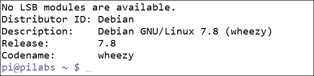
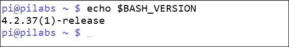
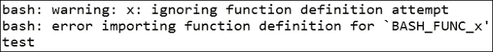
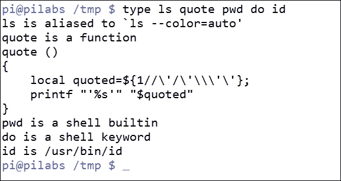
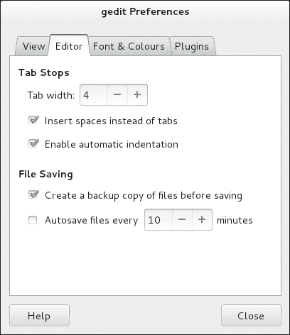
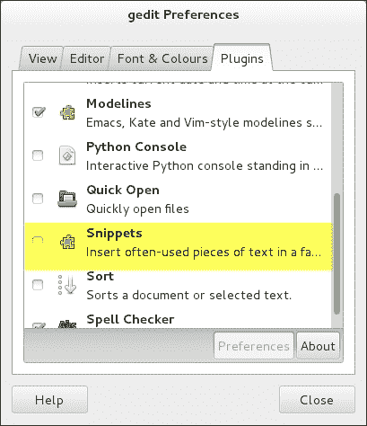
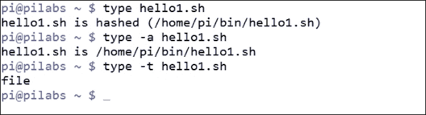
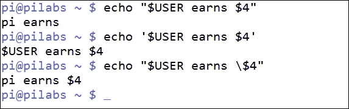
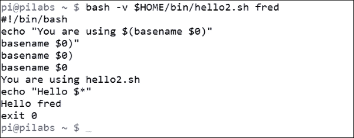
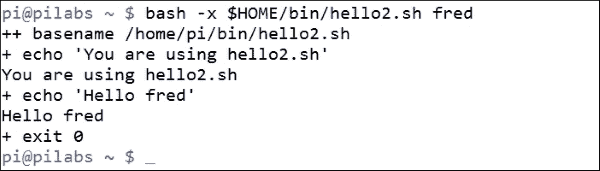

# 第一章。使用 Bash 脚本的“什么”和“为什么”

欢迎来到 bash 脚本的“什么”和“为什么”。我的名字是 Andrew Mallett，我是一个 bash 脚本迷，或者更准确地说是一个脚本迷。作为管理员，我看不出手动执行重复任务的必要性。当我们选择脚本来执行我们不喜欢的繁琐任务时，我们就有更多时间做更有趣的事情。在本章中，我们将向您介绍 bash 脚本的“什么”和“为什么”。如果您是新手，它将帮助您熟悉脚本，并为那些有更多经验并希望提高技能的人提供一些很好的见解。在本章中，每个元素都旨在增加您的知识，以帮助您实现您的目标。在这个过程中，我们将涵盖以下主题：

+   Bash 漏洞

+   bash 命令层次结构

+   为脚本准备文本编辑器

+   创建和执行脚本

+   调试您的脚本

# Bash 漏洞

对于本书，我将完全在运行 Raspbian 的 Raspberry Pi 2 上工作，Raspbian 是类似于 Debian 和 Ubuntu 的 Linux 发行版；尽管对您来说，您选择使用的操作系统和 bash 的版本都是无关紧要的，实际上，我使用的 bash 版本是 4.2.37(1)。如果您使用的是 OS X 操作系统，默认的命令行环境是**bash**。

要返回正在使用的操作系统，请输入以下命令（如果已安装）：

```
$ lsb_release -a

```

我的系统的输出如下截图所示：



确定您正在使用的 bash 版本的最简单方法是打印一个变量的值。以下命令将显示您的 bash 版本：

```
$ echo $BASH_VERSION

```

以下截图显示了我的系统的输出：



2014 年，bash 中出现了一个广为人知的 bug，这个 bug 已经存在多年了——shell-shock bug。如果您的系统保持最新状态，那么这可能不是一个问题，但值得检查。该 bug 允许恶意代码从格式不正确的函数中执行。作为标准用户，您可以运行以下代码来测试系统上的漏洞。这段代码来自 Red Hat，不是恶意的，但如果您不确定，请寻求建议。

以下是来自 Red Hat 的用于测试漏洞的代码：

```
$ env 'x=() { :;}; echo vulnerable''BASH_FUNC_x()=() { :;}; echo vulnerable' bash -c "echo test"

```

如果您的系统没有这个第一个漏洞，输出应该如下截图所示：



要测试这个 bug 的最后一个漏洞，我们可以使用以下测试，同样来自 Red Hat：

```
cd /tmp; rm -f /tmp/echo; env 'x=() { (a)=>\' bash -c "echo date"; cat /tmp/echo

```

修补版本的 bash 的输出应该如下截图所示：


如果这两个命令行的输出不同，那么您的系统可能容易受到 shell-shock 的影响，我建议更新 bash，或者至少向安全专业人员寻求进一步建议。

# bash 命令层次结构

当在 bash shell 上工作时，当您舒适地坐在提示符前急切地等待输入命令时，您很可能会认为只需输入并按下*Enter*键就是一件简单的事情。您应该知道，事情从来不会像我们想象的那么简单。

## 命令类型

例如，如果我们输入`ls`来列出文件，我们可能会认为我们正在运行该命令。这是可能的，但我们经常运行别名。别名存在于内存中，作为命令或带有选项的快捷方式；在检查文件之前，我们使用这些别名。bash shell 内置命令`type`可以在这里帮助我们。`type`命令将显示在命令行输入的给定单词的命令类型。命令类型如下所示：

+   别名

+   功能

+   Shell 内置

+   关键词

+   文件

这个列表也代表了它们被搜索的顺序。正如我们所看到的，直到最后才搜索可执行文件`ls`。

以下命令演示了简单使用`type`：

```
$ type ls
ls is aliased to `ls --color=auto'

```

我们可以进一步扩展这一点，以显示给定命令的所有匹配项：

```
$ type -a ls
ls is aliased to `ls --color=auto'
ls is /bin/ls

```

如果我们只需要输入输出，我们可以使用`-t`选项。当我们需要从脚本内部测试命令类型并且只需要返回类型时，这是有用的。这将排除多余的信息；因此，使我们人类更容易阅读。考虑以下命令和输出：

```
$ type -t ls
alias

```

输出清晰简单，正是计算机或脚本所需的。

内置的`type`也可以用于识别 shell 关键字，如 if、case、function 等。以下命令显示了`type`被用于多个参数和类型：

```
$ type ls quote pwd do id

```

命令的输出显示在以下屏幕截图中：



当使用`type`时，我们还会看到函数定义被打印出来。

## 命令 PATH

只有当提供程序的完整路径或相对路径时，Linux 才会在`PATH`环境中检查可执行文件。一般来说，除非它在`PATH`中，否则不会搜索当前目录。通过将目录添加到`PATH`变量中，我们可以将当前目录包含在`PATH`中。这在以下代码示例中显示：

```
$ export PATH=$PATH:.

```

这将当前目录附加到`PATH`变量的值中，每个`PATH`项都使用冒号分隔。现在，您的`PATH`已更新以包括当前工作目录，并且每次更改目录时，脚本都可以轻松执行。一般来说，将脚本组织到结构化的目录层次结构中可能是一个好主意。考虑在您的主目录中创建一个名为`bin`的子目录，并将脚本添加到该文件夹中。将`$HOME/bin`添加到您的`PATH`变量将使您能够通过名称找到脚本，而无需文件路径。

以下命令行列表只会在目录不存在时创建该目录：

```
$ test -d $HOME/bin || mkdir $HOME/bin

```

尽管上述命令行列表并不是严格必要的，但它确实显示了在 bash 中进行脚本编写不仅限于实际脚本，我们还可以直接在命令行中使用条件语句和其他语法。从我们的角度来看，我们知道前面的命令将在您是否有`bin`目录的情况下工作。使用`$HOME`变量确保命令将在不考虑当前文件系统上下文的情况下工作。

在本书中，我们将把脚本添加到`$HOME/bin`目录中，以便无论我们的工作目录如何，都可以执行它们。

# 为脚本准备文本编辑器

在整本书中，我将在树莓派的命令行上工作，这将包括创建和编辑脚本。当然，您可以选择您希望编辑脚本的方式，并且可能更喜欢使用图形编辑器，我将在 gedit 中展示一些设置。我将进行一次到 Red Hat 系统的旅行，以展示本章中 gedit 的屏幕截图。

为了帮助使命令行编辑器更易于使用，我们可以启用选项，并且可以通过隐藏的配置文件持久化这些选项。gedit 和其他 GUI 编辑器及其菜单将提供类似的功能。

## 配置 vim

编辑命令行通常是必须的，也是我日常生活的一部分。在编辑器中设置使生活更轻松的常见选项，给我们提供了所需的可靠性和一致性，有点像脚本本身。我们将在 vi 或 vim 编辑器文件`$HOME/.vimrc`中设置一些有用的选项。

我们设置的选项在以下列表中详细说明：

+   **showmode**：确保我们在插入模式下看到

+   **nohlsearch**：不会突出显示我们搜索的单词

+   **autoindent**：我们经常缩进我们的代码；这使我们可以返回到最后的缩进级别，而不是在每次换行时返回到新行的开头

+   **tabstop=4**：将制表符设置为四个空格

+   **expandtab**：将制表符转换为空格，在文件移动到其他系统时非常有用

+   **syntax on**：请注意，这不使用 set 命令，而是用于打开语法高亮

当这些选项设置时，`$HOME/.vimrc`文件应该看起来类似于这样：

```
setshowmodenohlsearch
setautoindenttabstop=4
setexpandtab
syntax on
```

## 配置 nano

nano 文本编辑器的重要性正在增加，并且它是许多系统中的默认编辑器。就我个人而言，我不喜欢它的导航或缺乏导航功能。它可以像 vim 一样进行自定义。这次我们将编辑`$HOME/.nanorc`文件。您编辑后的文件应该看起来像下面的样子：

```
setautoindent
settabsize 4
include /usr/share/nano/sh.nanorc
```

最后一行启用了 shell 脚本的语法高亮。

## 配置 gedit

图形编辑器，如 gedit，可以使用首选项菜单进行配置，非常简单直接。

启用制表符间距设置为**4**个空格，并将制表符扩展为空格，可以使用**首选项** | **编辑器**选项卡，如下截图所示：



### 提示

**下载示例代码**

您可以从您在[`www.packtpub.com`](http://www.packtpub.com)的帐户中下载示例代码文件，用于您购买的所有 Packt Publishing 图书。如果您在其他地方购买了本书，您可以访问[`www.packtpub.com/support`](http://www.packtpub.com/support)并注册，文件将直接通过电子邮件发送给您。

另一个非常有用的功能可以在**首选项** | **插件**选项卡中找到。在这里，我们可以启用**片段**插件，用于插入代码示例。如下截图所示：



在本书的其余部分，我们将在命令行和 vim 中工作；请随意使用您最擅长的编辑器。我们现在已经奠定了创建良好脚本的基础，尽管在 bash 脚本中，空白、制表符和空格并不重要；但是一个布局良好、间距一致的文件易于阅读。当我们在本书的后面看 Python 时，您将意识到在某些语言中，空白对语言是重要的，因此最好尽早养成良好的习惯。

# 创建和执行脚本

有了我们准备好的编辑器，我们现在可以快速地创建和执行我们的脚本。如果您在阅读本书时具有一些先前的经验，我会警告您，我们将从基础知识开始，但我们也将包括查看位置参数；请随时按照自己的步调前进。

## 你好，世界！

如你所知，几乎是必须以`hello world`脚本开始，就这一点而言，我们不会让你失望。我们将首先创建一个新的脚本`$HOME/bin/hello1.sh`。文件的内容应该如下截图所示：


我希望你没有太多困难；毕竟只有三行。我鼓励您在阅读时运行示例，以帮助您真正通过实践来巩固信息。

+   `#!/bin/bash`：通常，这总是脚本的第一行，并被称为 shebang。shebang 以注释开头，但系统仍然使用这一行。在 shell 脚本中，注释使用`#`符号。shebang 指示系统执行脚本的解释器。我们在 shell 脚本中使用 bash，根据需要，我们可能会使用 PHP 或 Perl 来执行其他脚本。如果我们不添加这一行，那么命令将在当前 shell 中运行；如果我们运行另一个 shell，可能会出现问题。

+   `echo "Hello World"`：`echo`命令将在内置 shell 中被捕获，并可用于编写标准输出`STDOUT`，默认为屏幕。要打印的信息用双引号括起来，稍后将会有更多关于引号的内容。

+   `exit 0`：`exit`命令是一个内置的 shell 命令，用于离开或退出脚本。`exit`代码作为整数参数提供。除了`0`之外的任何值都将指示脚本执行中的某种错误。

## 执行脚本

将脚本保存在我们的`PATH`环境中，它仍然不能作为独立的脚本执行。我们需要根据需要为文件分配和执行权限。对于一个简单的测试，我们可以直接用 bash 运行文件。以下命令向您展示了如何做到这一点：

```
$ bash $HOME/bin/hello1.sh

```

我们应该得到`Hello World`文本显示在我们的屏幕上。这不是一个长期的解决方案，因为我们需要将脚本放在`$HOME/bin`目录中，具体来说，以便在任何位置轻松运行脚本而不必输入完整路径。我们需要添加执行权限，如下面的代码所示：

```
$ chmod +x $HOME/bin/hello1.sh

```

现在我们应该能够简单地运行脚本，如下面的截图所示：


## 检查退出状态

这个脚本很简单，但我们仍然需要知道如何使用脚本和其他应用程序的退出代码。我们在创建`$HOME/bin`目录时生成的命令行列表，就是如何使用退出代码的一个很好的例子：

```
$ command1 || command 2

```

在前面的例子中，只有在`command1`以某种方式失败时才会执行`command2`。具体来说，只有当`command1`以除`0`以外的状态代码退出时，`command2`才会运行。

同样，在以下摘录中：

```
$ command1 && command2

```

只有在`command1`成功并发出`0`的退出代码时，我们才会执行`command2`。

要明确从我们的脚本中读取退出代码，我们可以查看`$?`变量，如下面的例子所示：

```
$ hello1.sh
$ echo $?

```

预期的输出是`0`，因为这是我们添加到文件最后一行的内容，几乎没有其他任何可能出错导致我们无法达到那一行。

## 确保唯一的名称

现在我们可以创建和执行一个简单的脚本，但是我们需要考虑一下名字。在这种情况下，`hello1.sh`就足够好，不太可能与系统上的其他任何东西冲突。我们应该避免使用可能与现有别名、函数、关键字和构建命令冲突的名称，以及避免使用已经在使用中的程序的名称。

向文件添加`sh`后缀并不能保证名称是唯一的，但在 Linux 中，我们不使用文件扩展名，后缀是文件名的一部分。这有助于为您的脚本提供一个唯一的标识。此外，后缀被编辑器用来帮助您识别文件以进行语法高亮。如果您还记得，我们特意向 nano 文本编辑器添加了语法高亮文件`sh.nanorc`。每个文件都是特定于后缀和后续语言的。

回顾本章中的命令层次结构，我们可以使用类型来确定文件`hello.sh`的位置和类型：

```
$ type hello1.sh  #To determine the type and path
$ type -a hello1.sh  #To print all commands found if the name is NOT unique
$ type -t hello1.sh ~To print the simple type of the command

```

这些命令和输出可以在以下截图中看到：



## 你好，多莉！

可能我们在脚本中需要更多的内容而不仅仅是一个简单的固定消息。静态消息内容确实有其存在的价值，但我们可以通过增加一些灵活性使这个脚本更加有用。

在本章中，我们将看一下我们可以向脚本提供的位置参数或参数，下一章我们将看到如何使脚本交互，并在运行时提示用户输入。

### 带参数运行脚本

我们可以带参数运行脚本，毕竟这是一个自由的世界，Linux 鼓励您自由地使用代码做您想做的事情。但是，如果脚本不使用这些参数，它们将被默默地忽略。以下代码显示了带有单个参数运行脚本：

```
$ hello1.shfred

```

脚本仍然会运行，不会产生错误。输出也不会改变，仍然会打印 hello world：

| 参数标识符 | 描述 |
| --- | --- |
| `$0` | 脚本本身的名称，通常在使用说明中使用。 |
| `$1` | 位置参数，传递给脚本的第一个参数。 |
| `${10}` | 需要两个或更多位数来表示参数位置。大括号用于将变量名称与任何其他内容分隔开。预期是单个数字。 |
| `$#` | 当我们需要设置正确脚本执行所需的参数数量时，参数计数特别有用。 |
| `$*` | 指代所有参数。 |

为了使脚本使用参数，我们可以稍微更改脚本内容。让我们首先复制脚本，添加执行权限，然后编辑新的`hello2.sh`：

```
$ cp $HOME/bin/hello1.sh $HOME/bin/hello2.sh
$ chmod +x $HOME/bin/hello2.sh

```

我们需要编辑`hello2.sh`文件，以便在命令行传递参数时使用参数。以下屏幕截图显示了允许我们现在拥有自定义消息的命令行参数的最简单用法。


现在运行脚本，我们可以按以下方式提供参数：

```
$ hello2.sh fred

```

现在输出应该是**Hello fred**。如果我们不提供参数，那么变量将为空，只会打印**Hello**。您可以参考以下屏幕截图查看执行参数和输出：


如果我们调整脚本以使用`$*`，则会打印所有参数。我们将看到**Hello**，然后是所有提供的参数列表。如果我们编辑脚本并将`echo`行替换为以下内容：

```
echo "Hello $*"

```

使用以下参数执行脚本：

```
$ hello2.shfredwilma  betty barney

```

将导致以下屏幕截图中显示的输出：


如果我们想要打印`Hello <name>`，每个都在单独的行上，我们需要等一会儿，直到我们涵盖循环结构。for 循环将很好地实现这一点。

### 正确引用的重要性

到目前为止，我们已经使用了简单的双引号机制来包裹我们想要在 echo 中使用的字符串。

在第一个脚本中，无论我们使用单引号还是双引号都无所谓。`echo "Hello World"`将与`echo 'Hello World'`完全相同。

然而，在第二个脚本中情况就不同了，因此了解 bash 中可用的引用机制非常重要。

正如我们所见，使用双引号`echo "Hello $1"`将导致**Hello fred**或提供的值。而如果我们使用单引号`echo 'Hello $1'`，则屏幕上打印的输出将是**Hello $1**，我们看到变量名称而不是其值。

引号的作用是保护特殊字符，例如两个单词之间的空格；两个引号都保护空格不被解释。空格通常被 shell 读取为默认字段，由 shell 分隔。换句话说，所有字符都被 shell 读取为没有特殊含义的文字。这会导致`$`符号打印其文字格式，而不是允许 bash 扩展其值。由于被单引号保护，bash shell 无法扩展变量的值。

这就是双引号拯救我们的地方。双引号将保护除`$`之外的所有字符，允许 bash 扩展存储的值。

如果我们需要在带引号的字符串中使用文字`$`以及需要扩展的变量；我们可以使用双引号，但用反斜杠(`\`)转义所需的`$`。例如，`echo "$USER earns \$4"`将打印为**Fred earns $4**，如果当前用户是 Fred 的话。

尝试在命令行中使用所有引用机制尝试以下示例。随时根据需要提高您的小时费率：

```
$ echo "$USER earns $4"
$ echo '$USER earns $4'
$ echo "$USER earns \$4"

```

以下屏幕截图显示了输出：



## 打印脚本名称

`$0`变量代表脚本名称，通常在使用说明中使用。由于我们还没有看条件语句，所以脚本名称将打印在显示的名称上方。

编辑你的脚本，使其读取 `$HOME/bin/hello2.sh` 的以下完整代码块：

```
#!/bin/bash
echo "You are using $0"
echo "Hello $*"
exit 0
```

命令的输出如下截图所示：


如果我们不想打印路径，只想显示脚本的名称，我们可以使用 `basename` 命令，该命令从路径中提取名称。调整脚本，使第二行现在读取如下：

```
echo "You are using $(basename $0)"

```

`$(….)` 语法用于评估内部命令的输出。我们首先运行 `basename $0` 并将结果输入到一个未命名的变量中，用 `$` 表示。

新的输出将如下截图所示：


使用反引号也可以实现相同的结果，这样不太容易阅读，但我们提到这一点是因为你可能需要理解和修改其他人编写的脚本。`$(….)` 语法的替代方法如下例所示：

```
echo "You are using 'basename $0'"

```

请注意，使用的字符是反引号，*而不是*单引号。在英国和美国键盘上，这些字符位于数字 *1* 键旁边的左上部分。

# 调试你的脚本

到目前为止，我们看到的脚本非常简单，几乎不会出错或需要调试。随着脚本的增长和包含条件语句的决策路径，我们可能需要使用一定级别的调试来更好地分析脚本的进展。

Bash 为我们提供了两个选项，`-v` 和 `-x`。

如果我们想查看脚本的详细输出以及脚本逐行评估的详细信息，我们可以使用 `-v` 选项。这可以在 shebang 中使用，但直接使用 bash 运行脚本通常更容易：

```
$ bash -v $HOME/bin/hello2.sh fred

```

在这个例子中，这是特别有用的，因为我们可以看到嵌入式 `basename` 命令的每个元素是如何处理的。第一步是删除引号，然后是括号。看一下以下输出：



更常用的是 `-x` 选项，它显示命令的执行过程。了解脚本选择的决策分支是很有用的。以下是使用情况：

```
$ bash -x $HOME/bin/hello2.sh fred

```

我们再次看到首先评估了 `basename`，但我们没有看到运行该命令所涉及的更详细的步骤。接下来的截图捕获了命令和输出：



# 总结

这标志着本章的结束，我相信你可能会发现这很有用。特别是对于那些刚开始使用 bash 脚本的人来说，本章一定已经为你打下了坚实的基础，你可以在此基础上建立你的知识。

我们首先确保 bash 是安全的，不容易受到嵌入式函数 shell-shock 的影响。有了安全的 bash，我们考虑了别名、函数等在命令之前检查的执行层次结构；了解这一点可以帮助我们规划一个良好的命名结构和定位脚本的路径。

很快，我们就开始编写简单的脚本，其中包含静态内容，但我们看到了使用参数添加灵活性有多么容易。脚本的退出代码可以使用 `$?` 变量读取，我们可以使用 `||` 和 `&&` 创建命令行列表，这取决于列表中前一个命令的成功或失败。

最后，我们通过查看脚本的调试来结束这一章。当脚本很简单时，实际上并不需要，但在以后增加复杂性时会很有用。

在下一章中，我们将创建交互式脚本，这些脚本在脚本执行期间读取用户的输入。
