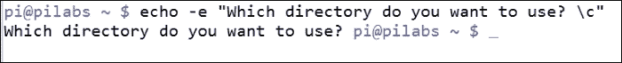
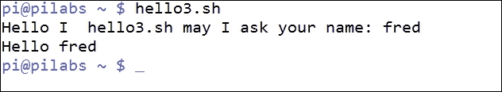
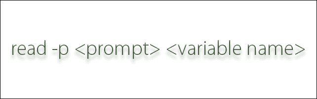
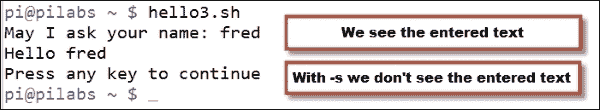
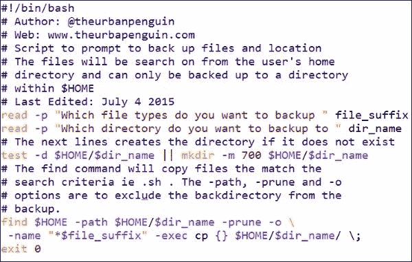
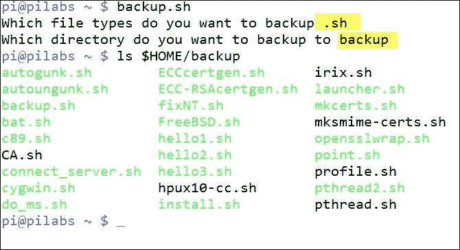
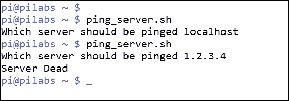
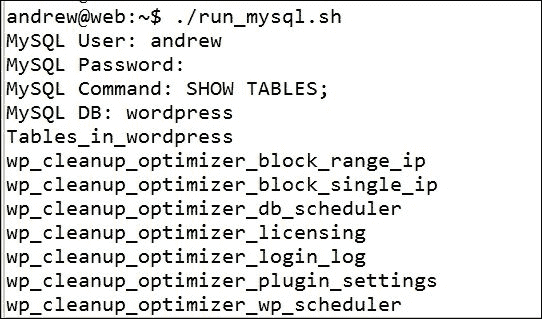

# 第二章。创建交互式脚本

在第一章的*使用 Bash 脚本的什么和为什么*中，我们学习了如何创建脚本以及使用一些基本元素。这些包括我们在执行脚本时可以传递的可选参数。在本章中，我们将通过使用 read shell 内置命令来扩展这一点，以允许交互式脚本。交互式脚本是在脚本执行期间提示信息的脚本。在这样做的过程中，我们将涵盖以下主题：

+   使用带有选项的`echo`

+   使用`read`的基本脚本

+   添加注释

+   使用提示增强`read`脚本

+   限制输入字符的数量

+   控制输入文本的可见性

+   简单的脚本来强化我们的学习

# 使用带有选项的 echo

到目前为止，在本书中，我们已经看到`echo`命令非常有用，并且将在我们的许多脚本中使用，如果不是全部。我们还看到这既是一个内置命令，也是一个命令文件。运行`echo`命令时，将使用内置命令，除非我们指定文件的完整路径。我们可以使用以下命令进行测试：

```
$ test -a echo

```

要获得内置命令的帮助，我们可以使用`man bash`并搜索`echo`；但是，`echo`命令与内部命令相同，因此我建议您在大多数情况下使用`man echo`来显示命令选项。

到目前为止，我们已经看到的`echo`的基本用法将产生文本输出和一个新行。这通常是期望的响应，所以我们不必担心下一个提示会附加到输出的末尾。新行将脚本输出与下一个 shell 提示分隔开。如果我们不提供任何文本字符串来打印，`echo`将只打印新行到`STDOUT`。我们可以直接从命令行使用以下命令进行测试。我们不需要从脚本运行`echo`或者实际上运行任何其他命令。从命令行运行`echo`将简单地输入如下命令：

```
$ echo

```

输出将显示我们发出的命令和随后的提示之间的清晰新行。我们可以在下面的截图中看到这一点：


如果我们想要抑制新行，特别是在提示用户时非常有用，我们可以通过以下两种方式使用`echo`来实现：

```
$ echo -n "Which directory do you want to use? "
$ echo -e "Which directory do you want to use? \c"

```

结果将是抑制换行。在初始示例中，使用`-n`选项来抑制换行。第二个示例使用更通用的`-e`选项，允许在文本字符串中添加转义序列。为了在同一行上继续，我们使用`\c`作为转义序列。

这看起来不太好，作为脚本的最后部分或者从命令行运行时，命令提示符将会跟随。如下截图所示：



# 使用 read 的基本脚本

当作为提示用户输入的脚本的一部分使用时，抑制换行正是我们想要的。我们将首先将现有的`hello2.sh`脚本复制到`hello3.sh`，并构建一个交互式脚本。最初，我们将使用`echo`作为提示机制，但随着我们逐渐增强脚本，我们将直接从 shell 内置的`read`命令生成提示：

```
$ cp $HOME/bin/hello2.sh $HOME/bin/hello3.sh
$ chmod +x $HOME/bin/hello3.sh

```

编辑`$HOME/bin/hello3.sh`脚本，使其读取如下内容：

```
#!/bin/bash
echo -n "Hello I  $(basename $0) may I ask your name: "
read
echo "Hello $REPLY"
exit 0
```

当执行脚本时，我们将被问候并提示输入我们自己的名字。这是使用`echo`语句中的`$REPLY`变量回显出来的。由于我们尚未向`read`内置命令提供变量名，因此使用了默认的`$REPLY`变量。脚本执行和输出如下截图所示。花些时间在您自己的系统上练习脚本：



这一小步已经让我们走了很长的路，而且像这样的脚本有很多用途，我们都使用过提示选项和目录的安装脚本。我承认这仍然相当琐碎，但随着我们深入本章，我们将更接近一些更有用的脚本。

# 脚本注释

我们应该在脚本的早期引入注释。脚本注释以`#`符号开头。`#`符号之后的任何内容都是注释，不会被脚本评估。shebang，`#!/bin/bash`，主要是一个注释，因此不会被脚本评估。运行脚本的 shell 读取 shebang，因此知道要将脚本交给哪个命令解释器。注释可以位于行的开头或部分位置。Shell 脚本没有多行注释的概念。

如果您还不熟悉注释，那么它们被添加到脚本中，告诉所有关于谁编写了脚本，脚本是何时编写和最后更新的，以及脚本的功能。这是脚本的元数据。

以下是脚本中注释的示例：

```
#!/bin/bash
# Welcome script to display a message to users on login
# Author: @theurbanpenguin
# Date: 1/1/1971
```

注释和添加解释代码正在做什么以及为什么是一个很好的做法。这将帮助您和需要在以后编辑脚本的同事。

# 使用 read 提示增强脚本

我们已经看到了如何使用内置的 read 来填充一个变量。到目前为止，我们已经使用`echo`来生成提示，但是这可以通过`-p`选项传递给 read 本身。`read`命令将忽略额外的换行符，因此在一定程度上减少了行数和复杂性。

我们可以在命令行本身测试这个。尝试输入以下命令以查看`read`的运行情况：

```
$ read -p "Enter your name: " name

```

我们使用`read`命令和`-p`选项。跟在选项后面的参数是出现在提示中的文本。通常，我们会确保文本末尾有一个空格，以确保我们可以清楚地看到我们输入的内容。这里提供的最后一个参数是我们想要填充的变量，我们简单地称之为`name`。变量也是区分大小写的。即使我们没有提供最后一个参数，我们仍然可以存储用户的响应，但这次是在`REPLY`变量中。

### 提示

请注意，当我们返回变量的值时，我们使用`$`，但在写入变量时不使用。简单来说，当读取变量时，我们引用`$VAR`，当设置变量时，我们引用`VAR=value`。

以下插图显示了使用`-p`选项的`read`命令的语法：



我们可以编辑脚本，使其看起来类似于`hello3.sh`中的以下片段：

```
#!/bin/bash
read -p "May I ask your name: " name
echo "Hello $name"
exit 0
```

`read`提示不能评估消息字符串中的命令，就像我们以前使用的那样。

# 限制输入字符的数量

到目前为止，我们使用的脚本不需要功能，但是我们可能需要要求用户按任意键继续。目前，我们已经设置了这样的方式，即在按下*Enter*键之前变量不会被填充。用户必须按*Enter*键继续。如果我们使用`-n`选项后跟一个整数，我们可以指定在继续之前要接受的字符，这里我们将设置为`1`。看一下以下代码片段：

```
#!/bin/bash
read -p "May I ask your name: " name
echo "Hello $name"
read -n1 -p "Press any key to exit"
echo
exit 0
```

现在，脚本将在显示名称后暂停，直到我们按下任意键；实际上，我们可以在继续之前按下任意键，因为我们只接受`1`个按键。而在之前，我们需要保留默认行为，因为我们无法知道输入的名称有多长。我们必须等待用户按*Enter*键。

### 提示

请注意，我们在这里添加了额外的 echo 以确保脚本结束前发出一个新行。这确保了 shell 提示从新行开始。

# 控制输入文本的可见性

尽管我们将输入限制为单个字符，但我们确实可以在屏幕上看到文本。同样，如果我们输入名称，我们会在按下*Enter*之前看到输入的文本。在这种情况下，这只是不整洁，但如果我们输入敏感数据，比如 PIN 码或密码，我们应该隐藏文本。我们可以使用静默选项或`-s`来实现这一点。在脚本中进行简单编辑即可实现这一点：

```
#!/bin/bash
read -p "May I ask your name: " name
echo "Hello $name"
read -sn1 -p "Press any key to exit"
echo
exit 0
```

现在，当我们使用键继续时，它不会显示在屏幕上。我们可以在下面的截图中看到脚本的行为：



# 通过简单脚本增强学习

我们的脚本仍然有点琐碎，我们还没有看条件语句，所以我们可以测试正确的输入，但让我们看一些简单的脚本，我们可以用一些功能来构建。

## 使用脚本进行备份

现在我们已经创建了一些脚本，我们可能希望将它们备份到不同的位置。如果我们创建一个提示我们的脚本，我们可以选择要备份的位置和文件类型。

考虑以下脚本作为您的第一个练习。创建脚本并将其命名为`$HOME/backup.sh`：

```
#!/bin/bash
# Author: @theurbanpenguin
# Web: www.theurbapenguin.com
# Script to prompt to back up files and location
# The files will be search on from the user's home
# directory and can only be backed up to a directory
# within $HOME
# Last Edited: July 4 2015
read -p "Which file types do you want to backup " file_suffix
read -p "Which directory do you want to backup to " dir_name
# The next lines creates the directory if it does not exist
test -d $HOME/$dir_name || mkdir -m 700 $HOME/$dir_name
# The find command will copy files the match the
# search criteria ie .sh . The -path, -prune and -o
# options are to exclude the backdirectory from the
# backup.
find $HOME -path $HOME/$dir_name -prune -o \
 -name "*$file_suffix" -exec cp {} $HOME/$dir_name/ \;
exit 0
```

您会看到文件被注释了；尽管黑白的可读性有点困难。如果您有这本书的电子副本，您应该在下面的截图中看到颜色：



当脚本运行时，您可以选择`.sh`文件进行备份，并将`backup`作为目录。脚本执行如下截图所示，以及目录的列表：



现在您可以看到，如果我们可以开始创建有意义的脚本，尽管我强烈建议添加错误检查用户输入，如果这个脚本不是用于个人使用。随着我们进入书籍，我们将涵盖这一点。

## 连接到服务器

让我们看一些实用的脚本，我们可以用来连接服务器。首先，我们将查看 ping，然后在第二个脚本中，我们将查看提示 SSH 凭据。

## 版本 1 - ping

这是我们所有人都可以做到的，不需要特殊的服务。这将简化控制台用户可能不了解命令细节的`ping`命令。这将对服务器进行三次 ping 而不是正常的无限次数。如果服务器存活，则没有输出，但如果服务器失败，则报告`服务器死机`。将脚本创建为`$HOME/bin/ping_server.sh`：

```
#!/bin/bash
# Author: @theurbanpenguin
# Web: www.theurbapenguin.com
# Script to ping a server
# Last Edited: July 4 2015
read -p "Which server should be pinged " server_addr
ping -c3 $server_addr 2>&1 > /dev/null || echo "Server dead"
```

以下截图显示了成功和失败的输出：



## 版本 2 - SSH

通常在服务器上安装并运行 SSH，因此如果您的系统正在运行 SSH 或者您可以访问 SSH 服务器，您可能可以运行此脚本。在此脚本中，我们提示服务器地址和用户名，并将它们传递给 SSH 客户端。将脚本创建为`$HOME/bin/connect_server.sh`：

```
#!/bin/bash
# Author: @theurbanpenguin
# Web: www.theurbapenguin.com
# Script to prompt fossh connection
# Last Edited: July 4 2015
read -p "Which server do you want to connect to: " server_name
read -p "Which username do you want to use: " user_name
ssh ${user_name}@$server_name
```

### 提示

请注意脚本最后一行中使用大括号来将变量与`@`符号分隔。

## 版本 3 - MySQL/MariaDB

在下一个脚本中，我们将提供数据库连接的详细信息以及要执行的 SQL 查询。如果您的系统上有 MariaDB 或 MySQL 数据库服务器，或者您可以连接到一个，您将能够运行此脚本。为演示，我将使用运行 Ubuntu-Mate 15.04 和 MariaDB 版本 10 的 Raspberry Pi；然而，这对于任何 MySQL 服务器或从版本 5 开始的 MariaDB 都应该适用。脚本收集用户和密码信息以及要执行的 SQL 命令。将脚本创建为`$HOME/bin/run_mql.sh`：

```
#!/bin/bash
# Author: @theurbanpenguin
# Web: www.theurbapenguin.com
# Script to prompt for MYSQL user password and command
# Last Edited: July 4 2015
read -p "MySQL User: " user_name
read -sp "MySQL Password: " mysql_pwd
echo
read -p "MySQL Command: " mysql_cmd
read -p "MySQL Database: " mysql_db
mysql -u $user_name -p$mysql_pwd$mysql_db -e"$mysql_cmd"
```

在脚本中，我们可以看到当我们将 MySQL 密码输入到`read`命令中时，我们使用`-s`选项来抑制密码的显示。同样，我们直接使用`echo`来确保下一个提示从新的一行开始。

脚本输入如下截图所示：



现在，我们可以轻松地看到密码抑制的工作原理，以及向 MySQL 命令添加的便利性。

# 总结

为自己的 shell 脚本拥有“我会读”的徽章感到自豪。我们已经开发了交互式脚本，并在脚本执行过程中提示用户输入。这些提示可以用来简化用户在命令行上的操作。这样，他们就不需要记住命令行选项，也不会在命令行历史中存储密码。在使用密码时，我们可以使用`read -sp`选项来静默存储值。

在下一章中，我们将花时间来研究 bash 中的条件语句。
