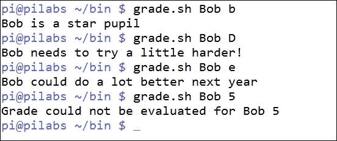

# 第三章：附加条件

我想我们现在可以说我们已经进入了脚本的细节部分。这些是使用条件编写到我们的脚本中的细节，用于测试语句是否应该运行。我们现在准备在脚本中添加一些智能，使我们的脚本变得更健壮，更易于使用和更可靠。条件语句可以用简单的命令行列表`AND`或`OR`命令一起编写，或者更常见的是在传统的`if`语句中。

在本章中，我们将涵盖以下主题：

+   使用命令行列表进行简单决策路径

+   使用列表验证用户输入

+   使用测试 shell 内置

+   使用`if`创建条件语句

+   使用`else`扩展`if`

+   使用`elif`添加更多条件

+   使用`elif`创建`backup.sh`脚本

+   使用 case 语句

+   脚本-使用`grep`的前端

# 使用命令行列表进行简单决策路径

我们在本书的第一章和第二章中的一些脚本中都使用了命令行列表。列表是我们可以创建的最简单的条件语句之一，因此我们认为在完全解释它们之前，在早期的示例中使用它们是合适的。

命令行列表是使用`AND`或`OR`符号连接的两个或多个语句：

+   `&&`: `AND`

+   `||`: `OR`

两个语句使用`AND`符号连接时，只有在第一个命令成功运行时，第二个命令才会运行。而使用`OR`符号连接时，只有在第一个命令失败时，第二个命令才会运行。

命令的成功或失败取决于从应用程序读取的退出代码。零表示应用程序成功完成，而非零表示失败。我们可以通过读取系统变量`$?`来测试应用程序的成功或失败。下面是一个示例：

```
$ echo $?

```

如果我们需要确保脚本是从用户的主目录运行的，我们可以将这个构建到脚本的逻辑中。这可以从命令行测试，不一定要在脚本中。考虑以下命令行示例：

```
$ test $PWD == $HOME || cd $HOME

```

双竖线表示`OR`列表。这确保了只有在第一个语句不成立时才执行第二个语句。简单来说，如果我们当前不在主目录中，那么在命令行列表结束时我们会在主目录中。我们很快会在测试命令中看到更多内容。

我们可以将这个应用到几乎任何我们想要的命令，而不仅仅是测试。例如，我们可以查询用户是否已登录到系统，如果是，我们可以使用`write`命令直接向他们的控制台发送消息。与之前类似，我们可以在脚本之前在命令行中测试这个。下面是一个命令行示例：

```
$ who | grep pi > /dev/null 2>&1 && write pi < message.txt

```

如果我们在脚本中使用这个，几乎可以肯定我们会用变量替换用户名。一般来说，如果我们需要多次引用相同的值，那么使用变量是个好主意。在这种情况下，我们正在搜索`pi`用户。

当我们分解命令行列表时，我们首先使用`who`命令列出已登录的用户。我们将列表传输到`grep`以搜索所需的用户名。我们对搜索的输出不感兴趣，只关心成功或失败。考虑到这一点，我们将所有输出重定向到`/dev/null`。双和符号表示只有在第一个语句返回 true 时，列表中的第二个语句才运行。如果`pi`用户已登录，我们使用`write`向用户发送消息。以下截图说明了这个命令和输出。


# 使用列表验证用户输入

在这个脚本中，我们将确保第一个位置参数已经被提供了一个值。我们可以修改我们在第一章中创建的`hello2.sh`脚本，*使用 Bash 进行脚本编写的什么和为什么*，在显示`hello`文本之前检查用户输入。

您可以将`hello2.sh`脚本复制到`hello4.sh`，或者从头开始创建一个新的脚本。输入的内容不会很多，脚本将被创建为`$HOME/bin/hello4.sh`，如下所示：


我们可以使用以下命令确保脚本是可执行的：

```
$ chmod +x $HOME/bin/hello4.sh

```

然后我们可以带参数或不带参数运行脚本。`test`语句正在寻找`$1`变量是否为零字节。如果是，那么我们将看不到`hello`语句；否则它将打印**Hello**消息。简单来说，如果我们提供一个名字，我们将看到`hello`消息。

以下屏幕截图显示了当您没有向脚本提供参数时会看到的输出，然后是提供的参数：


# 使用测试 shell 内置

现在可能是时候我们停下来，看一看这个`test`命令。这既是一个 shell 内置命令，也是一个独立的可执行文件。当然，除非我们指定文件的完整路径，否则我们将首先使用内置命令。

当运行测试命令而没有任何表达式要评估时，测试将返回 false。因此，如果我们运行如下命令所示的测试：

```
$ test

```

退出状态将是`1`，即使没有显示错误输出。`test`命令将始终返回`True`或`False`或`0`或`1`。`test`的基本语法是：

```
test EXPRESSION

```

或者，我们可以使用以下命令来反转`test`命令：

```
test ! EXPRESSION

```

如果我们需要包含多个表达式，这些表达式可以使用`-a`和`-o`选项分别进行`AND`或`OR`连接：

```
test EXPRESSION -a EXPRESSION
test EXPRESSION -o EXPRESSION

```

我们还可以以简写版本编写，用方括号替换测试以包围表达式，如下例所示：

```
[ EXPRESION ]

```

## 测试字符串

我们可以测试两个字符串的相等或不相等。例如，测试 root 用户的一种方法是使用以下命令：

```
test $USER = root

```

我们也可以使用方括号表示法来编写这个：

```
[ $USER = root ]

```

同样，我们可以使用以下两种方法测试非 root 帐户：

```
test ! $USER = root
[ ! $USER = root ]

```

我们还可以测试字符串的零值和非零值。我们在本章的早些时候的一个示例中看到了这一点。

要测试字符串是否有值，我们可以使用`-n`选项。我们可以通过检查用户环境中变量的存在来检查当前连接是否是通过 SSH 进行的。我们在以下两个示例中使用`test`和方括号来展示这一点：

```
test -n $SSH_TTY
[ -n $SSH_TTY ]

```

如果这是真的，那么连接是通过 SSH 建立的；如果是假的，那么连接不是通过 SSH。

正如我们之前看到的，当决定一个变量是否设置时，测试零字符串值是有用的：

```
test -z $1

```

或者，更简单地，我们可以使用：

```
[ -z $1 ]

```

对于这个查询的真实结果意味着没有输入参数被提供给脚本。

## 测试整数

此外，bash 脚本的测试字符串值可以测试整数值和整数。测试脚本的另一种方法是计算位置参数的数量，并测试该数字是否大于`0`：

```
test $# -gt 0
```

或者使用括号，如下所示：

```
[ $# -gt 0 ]
```

在关系中，顶部位置参数变量`$#`表示传递给脚本的参数数量。要测试整数值的相等性，使用`-eq`选项，而不是`=`符号。

## 测试文件类型

在测试值时，我们可以测试文件的存在或文件类型。例如，我们可能只想在文件是符号链接时才删除文件。我在编译内核时使用这个功能。`/usr/src/linux`目录应该是最新内核源代码的符号链接。如果我在编译新内核之前下载了更新版本，我需要删除现有的链接并创建新的链接。以防万一有人创建了`/usr/src/linux`目录，我们可以在删除之前测试它是否是一个链接：

```
# [ -h /usr/src/linux ] &&rm /usr/src/linux

```

`-h`选项测试文件是否有链接。其他选项包括：

+   `-d`：这显示它是一个目录

+   `-e`：这显示文件以任何形式存在

+   `-x`：这显示文件是可执行的

+   `-f`：这显示文件是一个普通文件

+   `-r`：这显示文件是可读的

+   `-p`：这显示文件是命名管道

+   `-b`：这显示文件是块设备

+   `-c`：这显示文件是字符设备

还有更多选项存在，因此根据需要深入主页。我们将在整本书中使用不同的选项；因此，为您提供实用和有用的示例。

# 使用 if 创建条件语句

正如我们迄今所见，可以使用命令行列表构建简单的条件。这些条件可以使用测试和不使用测试来编写。随着任务复杂性的增加，使用`if`创建语句将更容易。这肯定会提高脚本的可读性和逻辑布局。在某种程度上，它也符合我们的思维和语言表达方式，`if`在我们的口语中和 bash 脚本中都是语义的一部分。

即使在脚本中占用多行，使用`if`语句也可以实现更多功能并使脚本更易读。说了这些，让我们来看看如何创建`if`条件。以下是使用`if`语句的脚本示例：

```
#!/bin/bash
# Welcome script to display a message to users
# Author: @theurbanpenguin
# Date: 1/1/1971
if [ $# -lt 1 ] ; then
echo "Usage: $0 <name>"
exit 1
fi
echo "Hello $1"
exit 0
```

`if`语句内的代码仅在条件评估为真时运行，`if`块的结尾用`fi`表示-`if`反过来。在`vim`中的颜色编码可以帮助提高可读性，您可以在以下截图中看到：


在脚本中，我们可以轻松添加多个语句以在条件为真时运行。在我们的情况下，这包括使用错误指示退出脚本，以及使用`usage`语句来帮助用户。这确保我们只在提供要欢迎的名称时才显示**Hello**消息。

我们可以在以下截图中查看带有参数和不带参数的脚本执行：


为了帮助我们理解`if`条件语句的布局，以下插图演示了使用伪代码的语法：


缩进代码并非必需，但有助于可读性，强烈建议这样做。将`then`语句添加到与`if`相同的行上，同样有助于代码的可读性，并且分号是必需的，用于将`if`与`then`分隔开来。

# 使用 else 扩展 if

当脚本需要继续执行而不管`if`条件的结果时，通常需要处理评估的两种条件。当条件为真时该怎么办，以及当条件评估为假时该怎么办。这就是我们可以使用`else`关键字的地方。这允许在条件为真时执行一块代码，在条件为假时执行另一块代码。下图显示了这种情况的伪代码：


如果我们考虑扩展之前创建的`hello5.sh`脚本，可以轻松地实现无论参数是否存在都能正确执行。我们可以将其重新创建为`hello6.sh`，如下所示：

```
#!/bin/bash
# Welcome script to display a message to users
# Author: @theurbanpenguin
# Date: 1/1/1971
if [ $# -lt 1 ] ; then
read -p "Enter a name: "
name=$REPLY
else
name=$1
fi
echo "Hello $name"
exit 0
```

脚本现在设置了一个命名变量，这有助于可读性，我们可以从输入参数或`read`提示中为`$name`分配正确的值，无论哪种方式，脚本都能正常工作并开始成形。

# 更多的 elif 条件

当我们需要更高程度的控制时，我们可以使用`elif`关键字。与`else`不同，`elif`需要为每个`elif`测试额外的条件。通过这种方式，我们可以应对不同的情况。我们可以添加尽可能多的`elif`条件。以下是伪代码示例：

```
if condition; then
statement
elif condition; then
statement
else
statement
fi
exit 0
```

脚本可以通过提供更简化的选择来为操作员提供更复杂的代码。尽管脚本逐渐变得更加复杂以满足要求，但对于操作员来说，执行变得大大简化了。我们的工作是使用户能够轻松地从命令行运行更复杂的操作。通常，这将需要向我们的脚本添加更多的复杂性；然而，我们将获得脚本化应用的可靠性。

## 使用 elif 创建 backup2.sh

我们可以重新查看我们创建的用于运行之前备份的脚本。这个脚本`$HOME/bin/backup.sh`提示用户选择文件类型和存储备份的目录。备份使用的工具是`find`和`cp`。

有了这些新的知识，我们现在可以允许脚本使用`tar`命令和操作员选择的压缩级别运行备份。无需选择文件类型，因为完整的主目录将被备份，不包括备份目录本身。

操作员可以根据三个字母`H`、`M`和`L`选择压缩。选择将影响传递给`tar`命令的选项和创建的备份文件。选择高将使用`bzip2`压缩，中使用`gzip`压缩，低创建一个未压缩的`tar`存档。这个逻辑存在于后续的扩展`if`语句中：

```
if [ $file_compression = "L" ] ; then
tar_opt=$tar_l
elif [ $file_compression = "M" ]; then
tar_opt=$tar_m
else
tar_opt=$tar_h
fi
```

根据用户的选择，我们可以为`tar`命令配置正确的选项。由于我们有三个条件需要评估，因此适合使用`if`、`elif`和`else`语句。要查看变量是如何配置的，我们可以查看脚本中的以下摘录：

```
tar_l="-cvf $backup_dir/b.tar --exclude $backup_dir $HOME"
tar_m="-czvf $backup_dir/b.tar.gz --exclude $backup_dir $HOME"
tar_h="-cjvf $backup_dir/b.tar.bzip2 --exclude $backup_dir $HOME"
```

完整的脚本可以创建为`$HOME/bin/backup2.sh`，应该读取如下代码：

```
#!/bin/bash
# Author: @theurbanpenguin
# Web: www.theurbapenguin.com
read -p "Choose H, M or L compression " file_compression
read -p "Which directory do you want to backup to " dir_name
# The next lines creates the directory if it does not exist
test -d $HOME/$dir_name || mkdir -m 700 $HOME/$dir_name
backup_dir=$HOME/$dir_name
tar_l="-cvf $backup_dir/b.tar --exclude $backup_dir $HOME"
tar_m="-czvf $backup_dir/b.tar.gz --exclude $backup_dir $HOME"
tar_h="-cjvf $backup_dir/b.tar.bzip2 --exclude $backup_dir $HOME"
if [ $file_compression = "L" ] ; then
tar_opt=$tar_l
elif [ $file_compression = "M" ]; then
tar_opt=$tar_m
else
tar_opt=$tar_h
fi
tar $tar_opt
exit 0
```

当我们执行脚本时，需要以大写字母选择`H`、`M`或`L`，因为这是脚本内部进行选择的方式。以下截图显示了初始脚本执行，选择了`M`：


# 使用 case 语句

与使用多个`elif`语句不同，当对单个表达式进行评估时，`case`语句可能提供了更简单的机制。

使用伪代码列出了`case`语句的基本布局：

```
case expression in
 case1) 
  statement1
  statement2
 ;;
 case2)
  statement1
  statement2
 ;;
 *)
  statement1
 ;;
esac
```

我们看到的语句布局与其他语言中存在的`switch`语句并没有太大不同。在 bash 中，我们可以使用`case`语句测试简单的值，比如字符串或整数。Case 语句可以适用于各种字母，比如`[a-f]`或`a`到`f`，但它们不能轻松处理整数范围，比如`[1-20]`。

`case`语句首先会展开表达式，然后尝试依次与每个项目进行匹配。当找到匹配时，所有语句都会执行直到`;;`。这表示该匹配的代码结束。如果没有匹配，将匹配`*`表示的`else`语句。这需要是列表中的最后一项。

考虑以下脚本`grade.sh`，用于评估成绩：

```
#!/bin/bash
# Script to evaluate grades
# Usage: grade.sh student grade
# Author: @theurbanpenguin
# Date: 1/1/1971
if [ ! $# -eq2 ] ; then
echo "You must provide <student><grade>
exit 2
fi
case $2 in
  [A-C]|[a-c]) echo "$1 is a star pupil"
  ;;
  [Dd]) echo "$1 needs to try a little harder!"
  ;;
  [E-F]|[e-f]) echo "$1 could do a lot better next year"
  ;;
  *) echo "Grade could not be evaluated for $1"
esac
```

脚本首先使用`if`语句检查脚本是否提供了确切的两个参数。如果没有提供，脚本将以错误状态退出：

```
if [ ! $# -eq2 ] ; then
echo "You must provide <student><grade>
exit 2
fi
```

然后`case`语句扩展表达式，这是在这个例子中的`$2`变量的值。这代表我们提供的等级。然后我们尝试首先匹配大写和小写的字母`A`到`C`。`[A-C]`用于匹配`A`或`B`或`C`。竖线然后添加了一个额外的`OR`来与`a`、`b`或`c`进行比较：

```
[A-C]|[a-c]) echo "$1 is a star pupil"
;;
```

我们对其他提供的等级`A`到`F`进行了类似的测试。

以下屏幕截图显示了不同等级的脚本执行：



# 脚本-使用 grep 构建前端

作为本章的结束，我们可以将我们学到的一些功能组合在一起，构建一个脚本，提示操作员输入文件名、搜索字符串和要使用`grep`命令执行的操作。我们可以将脚本创建为`$HOME/bin/search.sh`，不要忘记将其设置为可执行文件：

```
#!/bin/bash
#Author: @theurbanpenguin
usage="Usage: search.sh file string operation"

if [ ! $# -eq3 ] ; then
echo "$usage"
exit 2
fi

[ ! -f $1 ]&& exit 3

case $3 in
    [cC])
mesg="Counting the matches in $1 of $2"
opt="-c"
    ;;
    [pP])
mesg="Print the matches of $2 in $1"
        opt=""
    ;;
    [dD])
mesg="Printing all lines but those matching $3 from $1"
opt="-v"
    ;;
    *) echo "Could not evaluate $1 $2 $3";;
esac
echo $mesg
grep $opt $2 $1
```

我们首先通过以下代码检查是否有三个输入参数：

```
if [ ! $# -eq3 ] ; then
echo "$usage"
exit 2
fi
```

下一个检查使用命令行列表来退出脚本，如果文件参数不是常规文件，则使用`test -f`：

```
[ ! -f $1 ]&& exit 3
```

`case`语句允许三种操作：

+   计算匹配的行数

+   打印匹配的行

+   打印除匹配行之外的所有行

以下屏幕截图显示了在`/etc/ntp.conf`文件中搜索以字符串 server 开头的行。在这个例子中，我们选择了计数选项：


# 摘要

在脚本编写中最重要且耗时的任务之一是构建所有我们需要使脚本可用和健壮的条件语句。经常提到 80-20 法则。这是指你花费 20%的时间编写主要脚本，80%的时间用于确保脚本中正确处理所有可能的情况。这就是我所说的脚本的程序完整性，我们试图仔细和准确地涵盖每种情况。

我们首先查看了一个简单的命令行列表测试。如果需要的操作很简单，那么这些功能提供了很好的功能，并且很容易添加。如果需要更复杂的功能，我们将添加`if`语句。

使用`if`语句，我们可以根据需要扩展它们，使用`else`和`elif`关键字。不要忘记`elif`关键字需要它们自己的条件来评估。

最后，我们看到了如何在需要评估单个表达式的情况下使用`case`。

在下一章中，我们将了解从已准备好的代码片段中读取的重要性。我们将创建一个样本`if`语句，可以保存为代码片段，在编辑时读入脚本。
