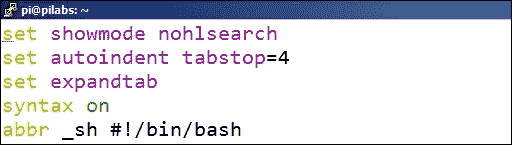
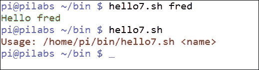

# 第四章。创建代码片段

如果您喜欢使用命令行，但也喜欢使用图形**集成开发环境**（**IDE**）的一些功能，那么本章可能会为您揭示一些新的想法。我们可以使用命令行中的`vi`或`vim`文本编辑器为常用的脚本元素创建快捷方式。

在本章中，我们将涵盖以下主题：

+   在`.vimrc`中创建缩写

+   使用`vim`文本编辑器阅读片段

+   在终端中使用颜色

# 缩写

我们已经短暂地进入了`~/.vimrc`文件，现在我们将重新访问这个文件，看看缩写或`abbr`控制。这个文件充当了`vim`文本编辑器的运行控制机制，很可能已经安装在您的 Linux 发行版上。旧的发行版或 Unix 变种可能会有原始的`vi`文本编辑器，并且会使用`~/.exrc`文件。如果您不确定您的`vi`版本的身份和要使用的正确运行控制文件，只需输入`vi`命令。如果打开了一个空白页面，那么确实是`vi`。但是，如果打开了带有`vim`启动屏幕的新空白文档，那么您正在使用改进的`vim`或`Vi`。

缩写允许在较长的字符串的位置使用快捷字符串。这些缩写可以在`vim`会话中从最后一行模式设置，但通常在控制文件中设置。shebang 可以很容易地表示为一个缩写，如下所示：

```
abbr _sh #!/bin/bash
```

缩写的基本语法如下命令所示：

```
abbr <shortcut><string>
```

使用这个缩写，我们只需要在编辑模式下输入`_sh`。在输入快捷代码后按下*ENTER*键，shebang 的完整文本就会打印出来。实际上，不仅仅是*ENTER*键，按下`abbr`代码后的任意键都会展开快捷方式。像这样的简单元素可以大大增加使用`vim`作为我们的文本编辑器的体验。下面的截图显示了更新后的`~/.vimrc`文件：



我们不限于单个缩写代码，可以添加更多的`abbr`条目。例如，为了支持 Perl 脚本的 shebang，可以在行上添加：

```
abbr _pl #!/usr/bin/perl
```

下划线的使用并不是必需的，但目的是保持快捷代码的唯一性，避免输入错误。我们也不限于单行；尽管如此，缩写通常用于单行。考虑以下`if`语句的缩写：

```
abbr _if if [-z $1];then<CR>echo "> $0 <name><CR>exit 2<CR>fi
```

尽管这样做是有效的，但`if`语句的格式化不会完美，多行缩写远非理想。这就是我们可以考虑使用预先准备的代码片段的地方。

# 使用代码片段

我们所说的代码片段的含义只是准备好的代码，我们可以读入我们当前的脚本。这对于`vim`能够在编辑过程中读取其他文本文件的内容来说特别容易。

```
ESC
:r <path-and-filename>
```

例如，如果我们需要读取位于`$HOME/snippets`中的名为`if`的文件的内容，我们将在`vim`中使用以下键序列：

```
ESC
:r $HOME/snippets/if
```

该文件的内容被读入当前文档的当前光标位置下方。通过这种方式，我们可以使代码片段尽可能复杂，并保持正确的缩进以帮助可读性和一致性。

因此，我们将把创建一个片段目录放在我们的主目录中作为我们的职责：

```
$ mkdir -m 700 $HOME/snippets

```

不需要共享目录，因此在创建时将模式设置为`700`或私有用户是一个好习惯。

在创建代码片段时，您可以选择使用伪代码或真实示例。我更喜欢使用真实示例，这些示例经过编辑以反映接收脚本的要求。一个简单的`if`片段的内容将是：

```
if [ -z $1 ] ; then
    echo "Usage: $0 <name>"
    exit 2
fi
```

这为我们提供了创建带有实际示例的`if`语句的布局。在这种情况下，我们检查`$1`是否未设置，并在退出脚本之前向用户发送错误。关键在于保持片段简短，以限制需要进行的更改，但易于理解和扩展，根据需要。

## 给终端带来色彩

如果我们要向用户和执行脚本的操作员显示文本消息，我们可以提供颜色以帮助解释消息。使用红色作为错误的同义词，绿色表示成功，可以更轻松地为我们的脚本添加功能。并非所有，但肯定是绝大多数的 Linux 终端都支持颜色。内置命令`echo`在与`-e`选项一起使用时可以向用户显示颜色。

要以红色显示文本，我们可以使用`echo`命令，如下所示：

```
$ echo -e "\03331mError\033[0m"

```

以下截图显示了代码和输出：

![给终端带来色彩红色文本将立即引起注意，可能导致脚本执行失败。以这种方式使用颜色符合基本的应用设计原则。如果您觉得代码复杂，那么只需使用友好的变量来表示颜色和重置代码。在前面的代码中，我们使用了红色和最终的重置代码来将文本设置回 shell 默认值。我们可以轻松地为这些颜色代码和其他颜色创建变量：```RED="\03331m"GREEN="\033[32m"BLUE="\033[34m"RESET="\033[0m"```### 提示`\033`值是*ESCAPE*字符，`[31m`是红色的颜色代码。在使用变量时，我们需要小心，以确保它们与文本正确分隔。修改前面的示例，我们可以看到如何轻松实现这一点：```$ echo -e ${RED}Error$RESET"```### 提示我们使用大括号确保`RED`变量被识别并与`Error`单词分隔开。将变量定义保存到`$HOME/snippets/color`文件中将允许它们在其他脚本中使用。有趣的是，我们不需要编辑这个脚本；我们可以使用`source`命令在运行时将这些变量定义读入脚本。在接收脚本中，我们需要添加以下行：```source $HOME/snippets/color```使用 shell 内置的`source`命令将颜色变量读入脚本执行时。以下截图显示了`hello5.sh`脚本的修改版本，现在我们称之为`hello7.sh`，它使用了这些颜色：

我们可以通过颜色编码的输出轻松识别脚本的成功和失败；绿色的**Hello fred**是我们提供参数的地方，红色的`Usage`语句是我们没有提供所需名称的地方。

# 摘要

对于任何管理员脚本重用始终是效率追求中的首要问题。在命令行使用`vim`可以快速有效地编辑脚本，并且可以节省缩写的输入。最好在用户的个人`.vimrc`文件中设置这些缩写，并使用`abbr`控制进行定义。除了缩写，我们可以看到使用代码片段的意义。这些是预先准备好的代码块，可以读入当前脚本。

最后，我们看了一下在命令行中使用颜色的价值，脚本将提供反馈。乍一看，这些颜色代码并不友好，但我们可以通过使用变量来简化这个过程。这些变量可以在脚本内在运行时设置，并通过`source`命令将它们的值读入当前环境。

在下一章中，我们将看看其他机制，我们可以使用它们来编写测试表达式，简化整数和变量的使用。
